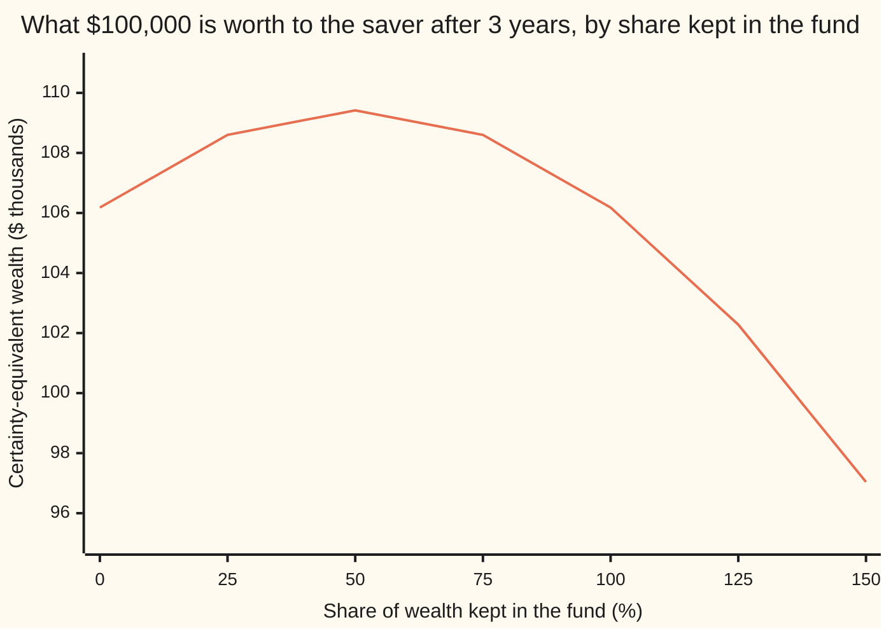

# Merton's problem: the constant share of wealth to keep in risky assets

[Syllabus](../../../SYLLABUS.md) → [Financial mathematics](../../../SYLLABUS.md#w12) → [Performance and Multi-Period](../../../SYLLABUS.md#w12-s38) → Merton's problem

---

## General Overview

A saver has $100,000 and a three-year horizon. There are two places to put it. One is a bank account paying 2 percent a year, with no risk. The other is a broad stock index fund, expected to return 6 percent a year, with a volatility of 20 percent: a typical year's surprise is about 20 percentage points either way. The saver dislikes risk by a measured amount, a number called relative risk aversion, set here at 2.

How much goes into the fund today? And what should happen next month, when the fund has moved and the mix has drifted?

Robert Merton answered both in 1969. Keep half of whatever the account is worth in the fund, all the time. Today that is $50,000. If the fund rises, the fund's slice grows past half, so sell some. If it falls, buy. The fraction never changes. The dollar amount changes whenever the market does.

That fraction is the **Merton fraction**, the name used from here on. It is the fund's extra return over the bank, divided by the saver's risk aversion times the fund's variance (its volatility squared, 0.20 × 0.20 = 0.04): 4 percent over 2 × 4 percent, which is one half.

**When the odds of the market never change and the saver's dislike of risk scales with wealth, the best plan at every moment is the same fraction of wealth in the risky asset: excess return divided by risk aversion times variance.**

**What kind of fact this is:** a theorem inside a model. The fund's price is assumed to follow geometric Brownian motion with fixed drift and volatility, and the saver's tastes are assumed to take the power form; given both, the constant fraction is proved best on this card in Why it works.

### The picture: a hill with its top at one half

Each fixed fraction gives a random account value after three years. Its **certainty equivalent** is the sure sum the saver would accept in exchange for that random amount ([Risk premium](../36-Returns%20and%20Utility/03-certainty-equivalent-and-risk-premium.md)). Higher is better.



The one line is the certainty-equivalent wealth for each fraction, held constant for three years. All in the bank gives $106,183.65, a sure 2 percent a year. All in the fund gives the same figure: the fund's extra return is exactly cancelled by the saver's dislike of its swings. The top of the hill is at 50 percent, worth $109,417.43. Past 100 percent the saver is borrowing to buy more fund, and at 150 percent the account is worth less to the saver than the $100,000 it started with.

---

## The formula

Notation first. The Greek letter $\pi$ ("pi") stands here for a fraction of wealth, not for 3.14159. Wealth at time $t$ is $W_t$. The fund is modelled by geometric Brownian motion ([Geometric Brownian motion](../../11-Stochastic%20processes%20and%20calculus/05-Brownian%20Motion/07-geometric-brownian-motion.md)): over a short time $dt$ its price changes by a steady drift $\mu\,dt$ plus a random kick $\sigma\,dZ_t$, where $Z_t$ is Brownian motion, a random walk in continuous time.

$$\pi^* = \frac{\mu - r}{\gamma\,\sigma^2}$$

**Read it aloud: the best share of wealth in the risky fund is its expected return above the bank rate, divided by risk aversion times the fund's variance.**

The saver's tastes are power utility: an amount of money $x$ is worth

$$U(x) = \frac{x^{1-\gamma}}{1-\gamma},$$

which for $\gamma = 2$ is $-1/x$. The utility is negative, but only comparisons matter: more money always gives a higher (less negative) number. Its key property is that the saver's dislike of a 10 percent swing is the same at $50,000 as at $5 million ([Expected utility](../36-Returns%20and%20Utility/02-expected-utility-and-risk-aversion.md)).

| Symbol | Plain meaning | In our example | Push it up and the answer… |
| --- | --- | --- | --- |
| $\pi$, $\pi_t$, $\pi^*$ | fraction of current wealth in the fund; its value at time $t$ under a rule that may change it; the best fraction | 50% | — |
| $\mu$ | the fund's expected return per year (its drift) | 6% | rises: more reward per unit of risk |
| $r$ | the bank rate, continuously compounded, per year | 2% | falls: the bank looks better |
| $\mu - r$ | the excess return: what the fund pays above the bank, on average | 4% | rises in proportion |
| $\sigma$, $\sigma^2$ | the fund's volatility; its square, the variance, per year | 20%; 0.04 | falls with the square: double volatility, quarter the share |
| $\gamma$ | relative risk aversion: how much the saver dislikes swings, measured against wealth | 2 | falls in proportion |
| $W_t$, $w$ | wealth at time $t$; a particular value of it | $100,000 at the start | no effect on the fraction |
| $U(x)$ | utility of an amount of money $x$ | $-1/x$ | — |
| $t$, $T$ | time now; the horizon, in years | 0; 3 | no effect on the fraction |
| $Z_t$, $dZ$, $dt$ | Brownian motion, the fund's accumulated random kicks; one small kick; one short step of time | — | — |
| $g(\pi)$, CE | certainty-equivalent growth rate of a constant fraction $\pi$; the certainty-equivalent wealth, $W_0 e^{g(\pi)T}$ | 3% at the best fraction; $109,417.43 | — |
| $V(t,w)$, $V_t$, $V_w$, $V_{ww}$ | the value function, the best expected utility still reachable from wealth $w$ at time $t$; its rates of change in time, in wealth, and of $V_w$ in wealth | — | — |

Two helper formulas. The certainty-equivalent growth rate of holding a constant fraction $\pi$ is

$$g(\pi) = r + \pi(\mu - r) - \tfrac12\gamma\sigma^2\pi^2,$$

the bank rate, plus the extra return the fund share earns, minus a penalty for risk that grows with the square of the share. At the best fraction it reaches

$$g^* = r + \frac{(\mu - r)^2}{2\gamma\sigma^2},$$

and the value function is $V(t,w) = U(w)\,e^{(1-\gamma)g^*(T-t)}$.

### When it holds

- **The fund's odds never change.** Drift, volatility and the bank rate are constants. If they wander, the saver adds a second, hedging holding that protects against bad changes in the odds, and the fraction moves over time (Merton's 1973 intertemporal model).
- **Power utility.** Only then does the dislike of risk scale with wealth. With exponential utility, a fixed dollar amount, not a fixed fraction, sits in the fund, so a richer saver holds a smaller share.
- **Continuous, free trading.** The rule trades every instant. With costs, the saver lets the fraction drift inside a band around 50 percent and trades only at its edges.
- **Borrowing and short selling at the bank rate.** Above 100 percent, the saver borrows. A negative excess return gives a negative share: sell the fund short. Zero excess return gives zero. If borrowing and shorting are both forbidden, the best feasible share is the formula clipped to between 0 and 100 percent, because the hill has one top.
- **The expected return is known.** It never is. A 2-point error in the excess return moves the answer by 25 points: 25 percent at an excess of 2, 75 percent at 6.

---

## Why it works

### Step 0: nothing in the problem knows the date or the size of the account

Picture the saver at any moment: some wealth, some years left. The fund's odds for the next instant are the same as they were at the start. The saver's dislike of a 10 percent loss is the same whether the account holds $50,000 or $200,000, because power utility measures risk against wealth. So the question "what fraction now?" has the same answer at every date and every wealth level.

That is why the answer is a constant. What remains is to find the constant, and to prove that no cleverer rule, one that reacts to good or bad luck, can beat it.

### Step 1: write down how wealth moves

Hold fraction $\pi$ in the fund and $1-\pi$ in the bank. Over a short time $dt$, the bank part earns $r\,dt$ and the fund part earns $\mu\,dt + \sigma\,dZ_t$. Adding the two:

$$dW_t = W_t\big[(r + \pi(\mu - r))\,dt + \pi\sigma\,dZ_t\big].$$

The account drifts at the bank rate plus the share's excess return, and it carries the share's slice of the fund's randomness. At one half, that is an expected 4 percent a year with a volatility of 10 percent.

### Step 2: over one short step, the choice is a hill

The saver cares about expected utility. Over a short step, how does expected utility change with the choice of $\pi$? Apply Itô's lemma (the chain rule for random paths, where the square of a random kick contributes a term of size $dt$) to the utility of wealth. Its expected rate of change is a positive scale factor, $W_t^{1-\gamma}$, times

$$r + \pi(\mu - r) - \tfrac12\gamma\sigma^2\pi^2.$$

That is $g(\pi)$. The first two terms reward holding the fund, in a straight line. The last term charges for its swings, and the charge grows with the square of the share. A straight line minus a square is a hill. Its top is where the slope is zero:

$$(\mu - r) - \gamma\sigma^2\pi = 0 \quad\Longrightarrow\quad \pi^* = \frac{\mu - r}{\gamma\sigma^2}.$$

<details>
<summary>The algebra behind this, if you want it</summary>

Itô's lemma for $f(W) = W^{1-\gamma}$ gives $df = f'(W)\,dW + \tfrac12 f''(W)\,(dW)^2$, with $(dW)^2 = W^2\pi^2\sigma^2\,dt$. Here $f' = (1-\gamma)W^{-\gamma}$ and $f'' = -\gamma(1-\gamma)W^{-\gamma-1}$. Substituting:
$$d\big(W^{1-\gamma}\big) = (1-\gamma)W^{1-\gamma}\Big[r + \pi(\mu - r) - \tfrac12\gamma\sigma^2\pi^2\Big]dt + (1-\gamma)W^{1-\gamma}\pi\sigma\,dZ_t.$$
The $dZ$ term has mean zero. Divide by $1-\gamma$ to get $d\,U(W)$: its expected rate is $W^{1-\gamma}g(\pi)$, and $W^{1-\gamma} > 0$, so the saver wants $g(\pi)$ as large as possible, whatever the sign of $1-\gamma$. The derivative of $g$ is $(\mu - r) - \gamma\sigma^2\pi$, zero at $\pi^*$; the second derivative is $-\gamma\sigma^2 < 0$, so it is a maximum, and the only one.

</details>

### Step 3: the HJB equation says the same at every date

Step 2 looks one instant ahead. The full problem looks three years ahead. The tool for that is the Hamilton-Jacobi-Bellman (HJB) equation ([Stochastic control](../../11-Stochastic%20processes%20and%20calculus/09-Beyond%20Brownian/03-stochastic-control-and-the-hjb-equation.md)): the value function $V(t,w)$, the best expected utility reachable from wealth $w$ at time $t$, must satisfy

$$0 = V_t + \max_{\pi}\Big[(r + \pi(\mu - r))\,w\,V_w + \tfrac12\pi^2\sigma^2 w^2\,V_{ww}\Big], \qquad V(T,w) = U(w).$$

The subscripts are rates of change, as in the symbol table. In words: act best over the next instant, then carry on acting best.

Step 0 suggests a guess: the value is today's utility of wealth, scaled by a factor that depends only on time. Try $V(t,w) = A(t)\,U(w)$. The maximisation inside the brackets is then the same hill as Step 2, with the same top $\pi^*$, at every $t$ and $w$. What is left fixes $A(t) = e^{(1-\gamma)g^*(T-t)}$.

<details>
<summary>The algebra behind this, if you want it</summary>

With $V = A(t)\,w^{1-\gamma}/(1-\gamma)$: $V_w = A w^{-\gamma}$, $V_{ww} = -\gamma A w^{-\gamma-1}$. The bracket becomes $A w^{1-\gamma}\big[r + \pi(\mu - r) - \tfrac12\gamma\sigma^2\pi^2\big] = A w^{1-\gamma} g(\pi)$. Its maximum over $\pi$ is $A w^{1-\gamma} g^*$, reached at $\pi^*$. The HJB equation becomes $A'(t)\,w^{1-\gamma}/(1-\gamma) + A\,w^{1-\gamma}g^* = 0$, so $A' = -(1-\gamma)g^* A$, and with $A(T) = 1$, $A(t) = e^{(1-\gamma)g^*(T-t)}$. The wealth cancels throughout: that is Step 0's scaling, now in symbols.

</details>

### Step 4: no rule that reacts to luck does better

The HJB equation produces a candidate. A proof must show that every other trading rule, including rules that buy after gains or sell after losses, ends with lower expected utility. The shape of the argument: follow any rule, and track the value function along its path. Under the Merton rule its expected change is exactly zero. Under any other rule it drifts down, at a rate proportional to the square of the gap between that rule's fraction and $\pi^*$. So expected utility at the end is the value at the start minus the accumulated squared gaps.

<details>
<summary>Detailed proof</summary>

Fix any trading rule $\pi_t$ that uses only past information and stays within fixed bounds. Wealth is then $W_t = w\exp\{\int_0^t (r + \pi_s(\mu - r) - \tfrac12\sigma^2\pi_s^2)\,ds + \int_0^t \sigma\pi_s\,dZ_s\}$, positive, with finite moments of every power, because the rule is bounded.

Let $Y_t = V(t, W_t)$ with $V(t,w) = e^{(1-\gamma)g^*(T-t)}\,w^{1-\gamma}/(1-\gamma)$. By Itô's lemma, using the derivatives in the callout above and $V_t = -(1-\gamma)g^* V$,
$$dY_t = A(t)W_t^{1-\gamma}\big[g(\pi_t) - g^*\big]dt + A(t)W_t^{1-\gamma}\pi_t\sigma\,dZ_t.$$
Completing the square, $g(\pi) - g^* = -\tfrac12\gamma\sigma^2(\pi - \pi^*)^2$. The $dZ$ term is a true martingale, zero on average, since its integrand has a finite second moment. Integrate from $0$ to $T$ and take expectations; $V(T, w) = U(w)$ gives
$$\mathbb{E}\big[U(W_T)\big] = V(0, w) - \tfrac12\gamma\sigma^2\,\mathbb{E}\int_0^T A(t)W_t^{1-\gamma}(\pi_t - \pi^*)^2\,dt \le V(0, w).$$
The constant rule $\pi_t = \pi^*$ makes the integral zero and reaches the bound. Every factor in the integrand other than the squared gap is strictly positive, so equality forces $\pi_t = \pi^*$ at almost every time on almost every path: the optimum is unique. Nothing divides by $1-\gamma$, so the argument holds for $\gamma$ above or below 1. At $\gamma = 1$ the same steps with $\log W$ give the log rule $\pi^* = (\mu - r)/\sigma^2$.

</details>

### Step 5: what the best plan is worth

For any constant fraction, the account follows geometric Brownian motion itself, so its value after $T$ years is a lognormal amount with a known formula. Averaging its utility gives the certainty equivalent $W_0\,e^{g(\pi)T}$: the hill in the overview picture is this expression. At $\pi^*$, $g^* = 2\% + 1\% = 3\%$ a year. The extra 1 percent is what the fund half contributes after its charge for risk: the premium the saver actually collects, measured in sure money.

The other door is the martingale method of Cox and Huang (1989): choose the best final wealth directly, as a function of the fund's final price, then find the trades that deliver it. It reaches the same fraction without the HJB equation and extends to settings where the equation is hard to solve.

---

## Worked numbers, by hand

Bank 2 percent, fund 6 percent with volatility 20 percent, risk aversion 2, $100,000 for 3 years.

| Step | Arithmetic | Value |
| --- | --- | --- |
| excess return, $\mu - r$ | $0.06 - 0.02$ | $0.04$ |
| variance, $\sigma^2$ | $0.20 \times 0.20$ | $0.04$ |
| risk aversion times variance | $2 \times 0.04$ | $0.08$ |
| **Merton fraction**, $\pi^*$ | $0.04 / 0.08$ | **$0.5$** |
| dollars in the fund today | $0.5 \times 100{,}000$ | $50,000 |
| premium kept after the risk charge | $0.04^2 / (2 \times 0.08)$ | $0.01$ |
| best certainty-equivalent rate, $g^*$ | $0.02 + 0.01$ | $0.03$ |
| growth factor over 3 years | $e^{0.03 \times 3}$ | $1.094174$ |
| **certainty-equivalent wealth** | $100{,}000 \times 1.094174$ | **$109,417.43** |

The saver would trade the uncertain account, run by the Merton rule, for a sure $109,417.43 in three years. Keeping all $100,000 in the bank gives a sure $106,183.65. The rule is worth $3,233.77 of sure money to this saver, compared with the bank alone.

### What breaks if you drop a piece

| Mistake | Comes out at | What went wrong |
| --- | --- | --- |
| Volatility where variance belongs, $0.04/(2 \times 0.20)$ | 10% in the fund | Risk grows with the square of the swing. 20 percent squared is 0.04, not 0.20. |
| Total return where excess return belongs, $0.06/0.08$ | 75% in the fund | The bank's 2 percent is free. Only the return above it pays for the risk. |
| Risk aversion dropped, $0.04/0.04$ | 100% in the fund | That is the log saver's answer ([Kelly](../36-Returns%20and%20Utility/05-kelly-criterion-and-growth.md)), right only when risk aversion is 1. |
| 50/50 at the start, then never traded | certainty equivalent $109,370.92, short by $46.51 | The mix drifts toward the fund in good years and away from it in bad years, so it is rarely at the top of the hill. |

---

## The rule in motion: selling winners, buying losers

The fraction is constant. The trades are not. Holding a fixed half means trading against the market every time it moves.

### One year, followed quarter by quarter

A made-up year, rebalanced at each quarter's end. The bank pays 2 percent a year throughout.

| Quarter | Fund did | Fund slice before trading | Bank slice | Wealth | Trade in the fund |
| --- | --- | --- | --- | --- | --- |
| start | — | $50,000.00 | $50,000.00 | $100,000.00 | — |
| Q1 | +10% | $55,000.00 | $50,250.63 | $105,250.63 | sell $2,374.69 |
| Q2 | −15% | $44,731.52 | $52,889.10 | $97,620.61 | buy $4,078.79 |
| Q3 | +5% | $51,250.82 | $49,054.97 | $100,305.79 | sell $1,097.93 |
| Q4 | +2% | $51,155.95 | $50,404.29 | $101,560.24 | sell $375.83 |

After the 10 percent rise the fund slice is more than half, so the rule sells. After the 15 percent fall it is less than half, so the rule buys, and buys more than it sold. The rule forecasts nothing; it only restores the mix.

### One input at a time

How the Merton fraction moves when a single input changes, everything else as in the example:

```
input changed          share of wealth in the fund, percent
risk aversion 1        ████████████████████████████████████████  100.00
risk aversion 2        ████████████████████                       50.00
risk aversion 4        ██████████                                 25.00
volatility 15%         ███████████████████████████████████        88.89
volatility 30%         █████████                                  22.22
excess return 2%       ██████████                                 25.00
excess return 6%       ██████████████████████████████             75.00
```

Risk aversion and excess return act in straight proportion: double one, and the share halves or doubles. Volatility acts through its square: from 20 to 30 percent cuts the share by more than half, from 50.00 to 22.22 percent. That square is why the estimate of volatility matters less than the estimate of expected return: volatility can be measured well from a few years of daily prices, and expected return cannot.

---

## Code, from first principles, and it actually runs

Four independent roads reach the fraction. Road 1 is the formula. Road 2 averages utility over the exact lognormal law of a constantly rebalanced account with Simpson's rule, then climbs the hill by golden-section search, with no formula for the top. Road 3 simulates 20,000 three-year paths with weekly rebalancing, using a home-made random number generator, and compares five fixed fractions. Road 4 takes the value function, differentiates it by finite differences, and searches a grid of 4,001 fractions for the one that maximises the HJB bracket at three different dates and wealth levels. The same code prints every number on the card.

### Python

```python
# Merton's portfolio problem -- the check behind the card.  Standard library only.
# Nothing imported knows the answer: the optimiser, the integrator and the random
# numbers are written out here.  Every number quoted on the card is printed below.
from math import exp, log, sqrt, pi, cos

r, mu, sigma, gamma, T, W0 = 0.02, 0.06, 0.20, 2.0, 3.0, 100000.0
p = 1.0 - gamma                                    # the power in U(x) = x^p / p

def merton(mu, r, sigma, gamma):                   # road 1: the formula
    return (mu - r) / (gamma * sigma * sigma)

def g(a):                                          # certainty-equivalent growth rate, constant share a
    return r + a * (mu - r) - 0.5 * gamma * sigma * sigma * a * a

def simpson(f, lo, hi, n=4000):
    h = (hi - lo) / n
    s = f(lo) + f(hi)
    for i in range(1, n):
        s += (4 if i % 2 else 2) * f(lo + i * h)
    return s * h / 3.0

def phi(z): return exp(-0.5 * z * z) / sqrt(2.0 * pi)

def ce_of(wealth_at):                              # certainty equivalent of W_T(z), z a bell-curve draw
    m = simpson(lambda z: wealth_at(z) ** p * phi(z), -10.0, 10.0)
    return m ** (1.0 / p)

def ce_constant(a):                                # road 2: exact law of a continuously rebalanced account
    return ce_of(lambda z: W0 * exp((r + a * (mu - r) - 0.5 * a * a * sigma * sigma) * T + a * sigma * sqrt(T) * z))

def ce_buy_hold(z):                                # 50/50 at the start, never traded again
    return 0.5 * W0 * exp(r * T) + 0.5 * W0 * exp((mu - 0.5 * sigma * sigma) * T + sigma * sqrt(T) * z)

def golden_max(f, lo, hi, tol=1e-9):               # golden-section search for the top of a hill
    k = (sqrt(5.0) - 1.0) / 2.0
    a, b = lo, hi
    while b - a > tol:
        c, d = b - k * (b - a), a + k * (b - a)
        if f(c) > f(d): b = d
        else: a = c
    return 0.5 * (a + b)

class Rng:                                         # xorshift64* uniforms, Box-Muller normals
    def __init__(self, seed): self.s = seed
    def uniform(self):
        s = self.s
        s ^= s >> 12; s ^= (s << 25) & 0xFFFFFFFFFFFFFFFF; s ^= s >> 27
        self.s = s
        return (((s * 0x2545F4914F6CDD1D) & 0xFFFFFFFFFFFFFFFF) >> 11) / 9007199254740992.0
    def normal(self):
        u1, u2 = self.uniform(), self.uniform()
        return sqrt(-2.0 * log(1.0 - u1)) * cos(2.0 * pi * u2)

def monte_carlo(shares, paths=20000, steps=156):   # road 3: weekly rebalancing, simulated
    dt = T / steps
    bank = exp(r * dt) - 1.0
    rng = Rng(20260928)
    sums = [0.0] * (len(shares) + 1)
    for _ in range(paths):
        w = [W0] * len(shares)
        fund, cash = 0.5 * W0, 0.5 * W0            # the buy-and-hold account
        for _ in range(steps):
            ret = exp((mu - 0.5 * sigma * sigma) * dt + sigma * sqrt(dt) * rng.normal()) - 1.0
            for i, a in enumerate(shares):
                w[i] *= 1.0 + a * ret + (1.0 - a) * bank
            fund *= 1.0 + ret; cash *= 1.0 + bank
        for i in range(len(shares)): sums[i] += w[i] ** p
        sums[-1] += (fund + cash) ** p
    return [(s / paths) ** (1.0 / p) for s in sums]

pi_star = merton(mu, r, sigma, gamma)
g_star = r + (mu - r) ** 2 / (2.0 * gamma * sigma * sigma)
ce_star = W0 * exp(g_star * T)                    # from the value function V(0, W0)
pi_golden = golden_max(ce_constant, -1.0, 3.0)
print(f"{'1 formula: share in the fund':<44}{pi_star:>14.6f}")
print(f"{'2 golden search on exact certainty equiv.':<44}{pi_golden:>14.6f}")
print(f"{'hand: gamma sigma^2':<44}{gamma * sigma * sigma:>14.6f}")
print(f"{'hand: premium (mu-r)^2 / (2 gamma sigma^2)':<44}{g_star - r:>14.6f}")
print(f"{'best certainty-equivalent rate g*':<44}{g_star:>14.6f}")
print(f"{'hand: e^(g* T)':<44}{exp(g_star * T):>14.6f}")
print(f"{'account drift r + pi*(mu - r)':<44}{r + pi_star * (mu - r):>14.6f}")
print(f"{'account volatility pi* sigma':<44}{pi_star * sigma:>14.6f}")
print(f"{'certainty equivalent, value function':<44}{ce_star:>14.2f}")
print(f"{'certainty equivalent, Simpson integral':<44}{ce_constant(pi_star):>14.2f}")
print(f"{'  gain over all in the bank':<44}{ce_star - W0 * exp(r * T):>14.2f}")
ce_bh = ce_of(ce_buy_hold)
print(f"{'certainty equivalent, buy and hold 50/50':<44}{ce_bh:>14.2f}")
print(f"{'  shortfall of buy and hold':<44}{ce_star - ce_bh:>14.2f}")
grid = [0.0, 0.25, 0.5, 0.75, 1.0]
mc = monte_carlo(grid)
print("3 Monte Carlo, 20000 paths, weekly rebalancing, 3 years")
for a, c in zip(grid, mc):
    print(f"  share {a:4.2f}   simulated CE {c:10.2f}   exact CE {ce_constant(a):10.2f}")
print(f"  buy and hold 50/50  simulated CE {mc[-1]:10.2f}")
# 4: the HJB equation, derivatives by finite differences, best share by brute-force grid
def V(t, w): return w ** p / p * exp(p * g_star * (T - t))
hjb = []
for t, w in ((0.0, 50000.0), (1.5, 100000.0), (2.9, 200000.0)):
    h, e = 1e-3 * w, 1e-4
    vt = (V(t + e, w) - V(t - e, w)) / (2 * e)
    vw = (V(t, w + h) - V(t, w - h)) / (2 * h)
    vww = (V(t, w + h) - 2 * V(t, w) + V(t, w - h)) / (h * h)
    gen = lambda a: vt + (r + a * (mu - r)) * w * vw + 0.5 * a * a * sigma * sigma * w * w * vww
    best = max((i / 1000.0 for i in range(-1000, 3001)), key=gen)
    hjb.append((t, w, best, gen(best) / abs(vt)))
    print(f"4 HJB at t={t:3.1f}, w={w:9.0f}: best share {best:5.3f}, residual per million {1e6 * gen(best) / abs(vt):6.3f}")
print("chart: certainty-equivalent wealth after 3 years, $ thousands")
chart = [0.0, 0.25, 0.5, 0.75, 1.0, 1.25, 1.5]
print("  share " + " ".join(f"{a:7.2f}" for a in chart))
print("  CE    " + " ".join(f"{W0 * exp(g(a) * T) / 1000:7.2f}" for a in chart))
print("bars: Merton share (percent) as one input moves, others as in the example")
for lab, v in (("gamma 1", merton(mu, r, sigma, 1)), ("gamma 2", pi_star), ("gamma 4", merton(mu, r, sigma, 4)),
               ("sigma 15%", merton(mu, r, 0.15, gamma)), ("sigma 30%", merton(mu, r, 0.30, gamma)),
               ("excess 2%", merton(0.04, r, sigma, gamma)), ("excess 6%", merton(0.08, r, sigma, gamma))):
    print(f"  {lab:<10}{100 * v:8.2f}")
print(f"{'wrong: sigma for variance':<44}{(mu - r) / (gamma * sigma):>14.6f}")
print(f"{'wrong: total return for excess':<44}{mu / (gamma * sigma * sigma):>14.6f}")
print(f"{'wrong: aversion dropped (gamma = 1)':<44}{merton(mu, r, sigma, 1):>14.6f}")
print(f"{'try: sigma = 0.10':<44}{merton(mu, r, 0.10, gamma):>14.6f}")
print(f"{'try: mu = 0.10':<44}{merton(0.10, r, sigma, gamma):>14.6f}")
print("story: one year, quarterly rebalancing to 50%, bank 2% a year")
fund, cash = 0.5 * W0, 0.5 * W0
print(f"  start           fund {fund:9.2f}  bank {cash:9.2f}  wealth {W0:9.2f}")
for q, ret in enumerate((0.10, -0.15, 0.05, 0.02), 1):
    fund *= 1.0 + ret; cash *= exp(r / 4.0)
    w = fund + cash
    trade = 0.5 * w - fund
    print(f"  Q{q} fund {100 * ret:+4.0f}%  fund {fund:9.2f}  bank {cash:9.2f}  wealth {w:9.2f}  trade {trade:+9.2f}")
    fund, cash = 0.5 * w, 0.5 * w
assert abs(pi_golden - pi_star) < 1e-6, "numerical optimum vs the formula"
assert abs(ce_constant(pi_star) - ce_star) < 1e-4, "integral vs value function"
assert max(zip(mc, grid))[1] == 0.5 and abs(mc[2] - ce_star) / ce_star < 0.005, "simulation picks 50%"
assert all(abs(b - pi_star) < 1e-3 and abs(res) < 1e-4 for _, _, b, res in hjb), "HJB: same best share everywhere"
print("ALL CHECKS PASS")
```

**Ran 2026-09-28 on macOS, Python 3.14.6, standard library only. All checks passed. Output, pasted from the run:**

```
1 formula: share in the fund                      0.500000
2 golden search on exact certainty equiv.         0.500000
hand: gamma sigma^2                               0.080000
hand: premium (mu-r)^2 / (2 gamma sigma^2)        0.010000
best certainty-equivalent rate g*                 0.030000
hand: e^(g* T)                                    1.094174
account drift r + pi*(mu - r)                     0.040000
account volatility pi* sigma                      0.100000
certainty equivalent, value function             109417.43
certainty equivalent, Simpson integral           109417.43
  gain over all in the bank                        3233.77
certainty equivalent, buy and hold 50/50         109370.92
  shortfall of buy and hold                          46.51
3 Monte Carlo, 20000 paths, weekly rebalancing, 3 years
  share 0.00   simulated CE  106183.65   exact CE  106183.65
  share 0.25   simulated CE  108685.94   exact CE  108599.87
  share 0.50   simulated CE  109589.12   exact CE  109417.43
  share 0.75   simulated CE  108854.25   exact CE  108599.87
  share 1.00   simulated CE  106513.15   exact CE  106183.65
  buy and hold 50/50  simulated CE  109543.24
4 HJB at t=0.0, w=    50000: best share 0.500, residual per million  1.000
4 HJB at t=1.5, w=   100000: best share 0.500, residual per million  1.000
4 HJB at t=2.9, w=   200000: best share 0.500, residual per million  1.000
chart: certainty-equivalent wealth after 3 years, $ thousands
  share    0.00    0.25    0.50    0.75    1.00    1.25    1.50
  CE     106.18  108.60  109.42  108.60  106.18  102.28   97.04
bars: Merton share (percent) as one input moves, others as in the example
  gamma 1     100.00
  gamma 2      50.00
  gamma 4      25.00
  sigma 15%    88.89
  sigma 30%    22.22
  excess 2%    25.00
  excess 6%    75.00
wrong: sigma for variance                         0.100000
wrong: total return for excess                    0.750000
wrong: aversion dropped (gamma = 1)               1.000000
try: sigma = 0.10                                 2.000000
try: mu = 0.10                                    1.000000
story: one year, quarterly rebalancing to 50%, bank 2% a year
  start           fund  50000.00  bank  50000.00  wealth 100000.00
  Q1 fund  +10%  fund  55000.00  bank  50250.63  wealth 105250.63  trade  -2374.69
  Q2 fund  -15%  fund  44731.52  bank  52889.10  wealth  97620.61  trade  +4078.79
  Q3 fund   +5%  fund  51250.82  bank  49054.97  wealth 100305.79  trade  -1097.93
  Q4 fund   +2%  fund  51155.95  bank  50404.29  wealth 101560.24  trade   -375.83
ALL CHECKS PASS
```

The simulated certainty equivalents sit up to a third of a percent above the exact ones: the same 20,000 random paths are shared by all five fractions, so the sampling error moves them together, and the ranking is sharp. The top is at 0.50 in every road. The HJB residual of one part per million is the finite-difference step's own error, which is almost exactly the square of the step's size relative to the wealth: 0.001 squared.

### Rust

Same roads, same labels, same random number generator written out again. No crates.

```rust
// Merton's portfolio problem -- the same check as the Python, in Rust.  No crates.
// The optimiser, the integrator and the random numbers are written out here.
// Compile: rustc --edition 2021 -O mertons_portfolio_problem_check.rs -o /tmp/merton_check
use std::f64::consts::PI;

const R: f64 = 0.02;
const MU: f64 = 0.06;
const SIGMA: f64 = 0.20;
const GAMMA: f64 = 2.0;
const T: f64 = 3.0;
const W0: f64 = 100000.0;
const P: f64 = 1.0 - GAMMA;                       // the power in U(x) = x^p / p

fn merton(mu: f64, r: f64, sigma: f64, gamma: f64) -> f64 { (mu - r) / (gamma * sigma * sigma) }

fn g(a: f64) -> f64 { R + a * (MU - R) - 0.5 * GAMMA * SIGMA * SIGMA * a * a }

fn simpson<F: Fn(f64) -> f64>(f: F, lo: f64, hi: f64, n: usize) -> f64 {
    let h = (hi - lo) / n as f64;
    let mut s = f(lo) + f(hi);
    for i in 1..n { s += if i % 2 == 1 { 4.0 } else { 2.0 } * f(lo + i as f64 * h); }
    s * h / 3.0
}

fn phi(z: f64) -> f64 { (-0.5 * z * z).exp() / (2.0 * PI).sqrt() }

fn ce_of<F: Fn(f64) -> f64>(wealth_at: F) -> f64 {  // certainty equivalent of W_T(z)
    let m = simpson(|z| wealth_at(z).powf(P) * phi(z), -10.0, 10.0, 4000);
    m.powf(1.0 / P)
}

fn ce_constant(a: f64) -> f64 {                   // road 2: exact law of a rebalanced account
    ce_of(|z| W0 * ((R + a * (MU - R) - 0.5 * a * a * SIGMA * SIGMA) * T + a * SIGMA * T.sqrt() * z).exp())
}

fn ce_buy_hold(z: f64) -> f64 {                   // 50/50 at the start, never traded again
    0.5 * W0 * (R * T).exp() + 0.5 * W0 * ((MU - 0.5 * SIGMA * SIGMA) * T + SIGMA * T.sqrt() * z).exp()
}

fn golden_max<F: Fn(f64) -> f64>(f: F, lo: f64, hi: f64) -> f64 {
    let k = (5.0_f64.sqrt() - 1.0) / 2.0;
    let (mut a, mut b) = (lo, hi);
    while b - a > 1e-9 {
        let (c, d) = (b - k * (b - a), a + k * (b - a));
        if f(c) > f(d) { b = d } else { a = c }
    }
    0.5 * (a + b)
}

struct Rng { s: u64 }                             // xorshift64* uniforms, Box-Muller normals
impl Rng {
    fn uniform(&mut self) -> f64 {
        let mut s = self.s;
        s ^= s >> 12; s ^= s << 25; s ^= s >> 27;
        self.s = s;
        (s.wrapping_mul(0x2545F4914F6CDD1D) >> 11) as f64 / 9007199254740992.0
    }
    fn normal(&mut self) -> f64 {
        let (u1, u2) = (self.uniform(), self.uniform());
        (-2.0 * (1.0 - u1).ln()).sqrt() * (2.0 * PI * u2).cos()
    }
}

fn monte_carlo(shares: &[f64], paths: usize, steps: usize) -> Vec<f64> {   // road 3: weekly rebalancing
    let dt = T / steps as f64;
    let bank = (R * dt).exp() - 1.0;
    let mut rng = Rng { s: 20260928 };
    let mut sums = vec![0.0; shares.len() + 1];
    for _ in 0..paths {
        let mut w = vec![W0; shares.len()];
        let (mut fund, mut cash) = (0.5 * W0, 0.5 * W0);
        for _ in 0..steps {
            let ret = ((MU - 0.5 * SIGMA * SIGMA) * dt + SIGMA * dt.sqrt() * rng.normal()).exp() - 1.0;
            for (i, a) in shares.iter().enumerate() { w[i] *= 1.0 + a * ret + (1.0 - a) * bank; }
            fund *= 1.0 + ret; cash *= 1.0 + bank;
        }
        for i in 0..shares.len() { sums[i] += w[i].powf(P); }
        sums[shares.len()] += (fund + cash).powf(P);
    }
    sums.iter().map(|s| (s / paths as f64).powf(1.0 / P)).collect()
}

fn v(t: f64, w: f64, g_star: f64) -> f64 { w.powf(P) / P * (P * g_star * (T - t)).exp() }

fn main() {
    let pi_star = merton(MU, R, SIGMA, GAMMA);
    let g_star = R + (MU - R).powi(2) / (2.0 * GAMMA * SIGMA * SIGMA);
    let ce_star = W0 * (g_star * T).exp();        // from the value function V(0, W0)
    let pi_golden = golden_max(ce_constant, -1.0, 3.0);
    println!("{:<44}{:>14.6}", "1 formula: share in the fund", pi_star);
    println!("{:<44}{:>14.6}", "2 golden search on exact certainty equiv.", pi_golden);
    println!("{:<44}{:>14.6}", "hand: gamma sigma^2", GAMMA * SIGMA * SIGMA);
    println!("{:<44}{:>14.6}", "hand: premium (mu-r)^2 / (2 gamma sigma^2)", g_star - R);
    println!("{:<44}{:>14.6}", "best certainty-equivalent rate g*", g_star);
    println!("{:<44}{:>14.6}", "hand: e^(g* T)", (g_star * T).exp());
    println!("{:<44}{:>14.6}", "account drift r + pi*(mu - r)", R + pi_star * (MU - R));
    println!("{:<44}{:>14.6}", "account volatility pi* sigma", pi_star * SIGMA);
    println!("{:<44}{:>14.2}", "certainty equivalent, value function", ce_star);
    println!("{:<44}{:>14.2}", "certainty equivalent, Simpson integral", ce_constant(pi_star));
    println!("{:<44}{:>14.2}", "  gain over all in the bank", ce_star - W0 * (R * T).exp());
    let ce_bh = ce_of(ce_buy_hold);
    println!("{:<44}{:>14.2}", "certainty equivalent, buy and hold 50/50", ce_bh);
    println!("{:<44}{:>14.2}", "  shortfall of buy and hold", ce_star - ce_bh);
    let grid = [0.0, 0.25, 0.5, 0.75, 1.0];
    let mc = monte_carlo(&grid, 20000, 156);
    println!("3 Monte Carlo, 20000 paths, weekly rebalancing, 3 years");
    for (a, c) in grid.iter().zip(&mc) {
        println!("  share {:4.2}   simulated CE {:10.2}   exact CE {:10.2}", a, c, ce_constant(*a));
    }
    println!("  buy and hold 50/50  simulated CE {:10.2}", mc[5]);
    // 4: the HJB equation, derivatives by finite differences, best share by brute-force grid
    let mut hjb_ok = true;
    for (t, w) in [(0.0_f64, 50000.0_f64), (1.5, 100000.0), (2.9, 200000.0)] {
        let (h, e) = (1e-3 * w, 1e-4);
        let vt = (v(t + e, w, g_star) - v(t - e, w, g_star)) / (2.0 * e);
        let vw = (v(t, w + h, g_star) - v(t, w - h, g_star)) / (2.0 * h);
        let vww = (v(t, w + h, g_star) - 2.0 * v(t, w, g_star) + v(t, w - h, g_star)) / (h * h);
        let gen = |a: f64| vt + (R + a * (MU - R)) * w * vw + 0.5 * a * a * SIGMA * SIGMA * w * w * vww;
        let mut best = -1.0;
        for i in -1000..=3000 { let a = i as f64 / 1000.0; if gen(a) > gen(best) { best = a; } }
        let res = gen(best) / vt.abs();
        hjb_ok &= (best - pi_star).abs() < 1e-3 && res.abs() < 1e-4;
        println!("4 HJB at t={:3.1}, w={:9.0}: best share {:5.3}, residual per million {:6.3}", t, w, best, 1e6 * res);
    }
    println!("chart: certainty-equivalent wealth after 3 years, $ thousands");
    let chart = [0.0, 0.25, 0.5, 0.75, 1.0, 1.25, 1.5];
    println!("  share {}", chart.iter().map(|a| format!("{:7.2}", a)).collect::<Vec<_>>().join(" "));
    println!("  CE    {}", chart.iter().map(|a| format!("{:7.2}", W0 * (g(*a) * T).exp() / 1000.0)).collect::<Vec<_>>().join(" "));
    println!("bars: Merton share (percent) as one input moves, others as in the example");
    for (lab, x) in [("gamma 1", merton(MU, R, SIGMA, 1.0)), ("gamma 2", pi_star), ("gamma 4", merton(MU, R, SIGMA, 4.0)),
                     ("sigma 15%", merton(MU, R, 0.15, GAMMA)), ("sigma 30%", merton(MU, R, 0.30, GAMMA)),
                     ("excess 2%", merton(0.04, R, SIGMA, GAMMA)), ("excess 6%", merton(0.08, R, SIGMA, GAMMA))] {
        println!("  {:<10}{:8.2}", lab, 100.0 * x);
    }
    println!("{:<44}{:>14.6}", "wrong: sigma for variance", (MU - R) / (GAMMA * SIGMA));
    println!("{:<44}{:>14.6}", "wrong: total return for excess", MU / (GAMMA * SIGMA * SIGMA));
    println!("{:<44}{:>14.6}", "wrong: aversion dropped (gamma = 1)", merton(MU, R, SIGMA, 1.0));
    println!("{:<44}{:>14.6}", "try: sigma = 0.10", merton(MU, R, 0.10, GAMMA));
    println!("{:<44}{:>14.6}", "try: mu = 0.10", merton(0.10, R, SIGMA, GAMMA));
    println!("story: one year, quarterly rebalancing to 50%, bank 2% a year");
    let (mut fund, mut cash) = (0.5 * W0, 0.5 * W0);
    println!("  start           fund {:9.2}  bank {:9.2}  wealth {:9.2}", fund, cash, W0);
    for (q, ret) in [0.10_f64, -0.15, 0.05, 0.02].iter().enumerate() {
        fund *= 1.0 + ret; cash *= (R / 4.0).exp();
        let w = fund + cash;
        let trade = 0.5 * w - fund;
        println!("  Q{} fund {:+4.0}%  fund {:9.2}  bank {:9.2}  wealth {:9.2}  trade {:+9.2}", q + 1, 100.0 * ret, fund, cash, w, trade);
        fund = 0.5 * w; cash = 0.5 * w;
    }
    assert!((pi_golden - pi_star).abs() < 1e-6, "numerical optimum vs the formula");
    assert!((ce_constant(pi_star) - ce_star).abs() < 1e-4, "integral vs value function");
    let best_mc = (0..grid.len()).fold(0, |b, i| if mc[i] > mc[b] { i } else { b });
    assert!(grid[best_mc] == 0.5 && (mc[2] - ce_star).abs() / ce_star < 0.005, "simulation picks 50%");
    assert!(hjb_ok, "HJB: same best share everywhere");
    println!("ALL CHECKS PASS");
}
```

**Ran 2026-09-28 on macOS, rustc 1.98.1, no crates. All checks passed. Output, pasted from the run:**

```
1 formula: share in the fund                      0.500000
2 golden search on exact certainty equiv.         0.500000
hand: gamma sigma^2                               0.080000
hand: premium (mu-r)^2 / (2 gamma sigma^2)        0.010000
best certainty-equivalent rate g*                 0.030000
hand: e^(g* T)                                    1.094174
account drift r + pi*(mu - r)                     0.040000
account volatility pi* sigma                      0.100000
certainty equivalent, value function             109417.43
certainty equivalent, Simpson integral           109417.43
  gain over all in the bank                        3233.77
certainty equivalent, buy and hold 50/50         109370.92
  shortfall of buy and hold                          46.51
3 Monte Carlo, 20000 paths, weekly rebalancing, 3 years
  share 0.00   simulated CE  106183.65   exact CE  106183.65
  share 0.25   simulated CE  108685.94   exact CE  108599.87
  share 0.50   simulated CE  109589.12   exact CE  109417.43
  share 0.75   simulated CE  108854.25   exact CE  108599.87
  share 1.00   simulated CE  106513.15   exact CE  106183.65
  buy and hold 50/50  simulated CE  109543.24
4 HJB at t=0.0, w=    50000: best share 0.500, residual per million  1.000
4 HJB at t=1.5, w=   100000: best share 0.500, residual per million  1.000
4 HJB at t=2.9, w=   200000: best share 0.500, residual per million  1.000
chart: certainty-equivalent wealth after 3 years, $ thousands
  share    0.00    0.25    0.50    0.75    1.00    1.25    1.50
  CE     106.18  108.60  109.42  108.60  106.18  102.28   97.04
bars: Merton share (percent) as one input moves, others as in the example
  gamma 1     100.00
  gamma 2      50.00
  gamma 4      25.00
  sigma 15%    88.89
  sigma 30%    22.22
  excess 2%    25.00
  excess 6%    75.00
wrong: sigma for variance                         0.100000
wrong: total return for excess                    0.750000
wrong: aversion dropped (gamma = 1)               1.000000
try: sigma = 0.10                                 2.000000
try: mu = 0.10                                    1.000000
story: one year, quarterly rebalancing to 50%, bank 2% a year
  start           fund  50000.00  bank  50000.00  wealth 100000.00
  Q1 fund  +10%  fund  55000.00  bank  50250.63  wealth 105250.63  trade  -2374.69
  Q2 fund  -15%  fund  44731.52  bank  52889.10  wealth  97620.61  trade  +4078.79
  Q3 fund   +5%  fund  51250.82  bank  49054.97  wealth 100305.79  trade  -1097.93
  Q4 fund   +2%  fund  51155.95  bank  50404.29  wealth 101560.24  trade   -375.83
ALL CHECKS PASS
```

The two outputs match line for line, simulations included, because both run the same generator from the same seed.

> [!TIP]
> **Try changing**
> Guess first, then run it. The asserts are pinned to the example, so expect some to stop the program.
> - **A calmer fund.** Set `sigma = 0.10`. Guess: the share doubles? It quadruples, to 200 percent: borrow $100,000 and hold $200,000 of fund. The variance fell to a quarter.
> - **A richer fund.** Set `mu = 0.10`, an excess return of 8 percent. The share is 100 percent: all in the fund, no borrowing.
> - **A more nervous saver.** Set `gamma = 4.0`. The share halves to 25 percent. The hill in the overview gets narrower and its top moves left.
> - **Stop rebalancing in the simulation.** The buy-and-hold account in road 3 already does this. It trails the rebalanced 50 percent account by a small amount, as the Simpson figure of $46.51 predicts.

---

## The usual mistake

> [!warning]
> **Reading the constant fraction as "buy once and hold".** Holding a constant *fraction* means trading constantly: selling the fund after it rises and buying after it falls. A saver who buys $50,000 of fund and walks away holds 50 percent only on day one. In this example the cost of walking away is small, $46.51 of certainty equivalent over three years, but it grows with the horizon and with volatility, and in a long bull market the untended account ends up mostly fund.
>
> - **Treating the output as precise.** The expected return is barely measurable, and the fraction is proportional to it: a 2-point error in the excess return swings the answer between 25 and 75 percent.
> - **Assuming age changes the answer.** In this model the horizon does not appear in the fraction. A saver with 3 years and one with 30 hold the same share. Where age does matter, it is through things this model leaves out, such as future wages: [Investing over a lifetime](05-life-cycle-and-glide-paths.md).

---

## Where you meet it in real life

- **Balanced funds.** A 60/40 fund that trades back to 60 percent shares every quarter is running a Merton rule with a fraction chosen by the manager. The quarterly trades are the story table above.
- **Robo-advisers.** Automated platforms ask a questionnaire, map the answers to a risk aversion, and rebalance to a target mix. The target plays the role of this card's fraction, often with the expected return set by an equilibrium model such as [CAPM](../37-Portfolio%20Theory/04-capm-and-beta.md) rather than by a forecast.
- **Judging a manager's risk.** A fund's risk-adjusted return, measured with [Performance measures](01-sharpe-information-and-drawdown.md), connects to this card: the Merton fraction equals the Sharpe ratio, excess return over volatility, divided by risk aversion times volatility. A higher Sharpe ratio justifies more exposure.
- **Kelly betting.** Set risk aversion to 1 and the fraction becomes the growth-maximising Kelly bet. Professional gamblers and some investors bet a fraction of Kelly, which is the Merton rule with risk aversion above 1.

> **Say it back**
> A saver who can trade freely between a risky fund and a bank, facing odds that never change, with tastes that scale with wealth, should keep a constant fraction of wealth in the fund. That fraction is the excess return divided by risk aversion times variance: 4 percent over 2 × 0.04, one half. Over each instant the choice is a hill, straight-line reward minus a squared risk charge, and the HJB equation shows the same hill at every date and wealth. Any rule that strays from the fraction loses expected utility in proportion to the squared gap. Keeping the fraction constant means selling after rises and buying after falls.

---

## What this builds on

- [CAPM](../37-Portfolio%20Theory/04-capm-and-beta.md): one-period portfolio choice, excess return over a riskless rate, and an equilibrium source for the expected return this card's formula needs.
- [Stochastic control](../../11-Stochastic%20processes%20and%20calculus/09-Beyond%20Brownian/03-stochastic-control-and-the-hjb-equation.md): the HJB equation, and why the value of acting best over the next instant, then continuing, pins down the whole plan.

## Where this goes next

- [Rebalancing](04-rebalancing-and-transaction-costs.md): the Merton rule trades every instant; with a cost on each trade the saver lets the fraction drift inside a band around 50 percent.

---

## Sources

Verified 2026-09-28: every link below resolves to the publisher's page.

- Robert C. Merton, "Lifetime Portfolio Selection under Uncertainty: The Continuous-Time Case", *The Review of Economics and Statistics* 51(3), 247–257, 1969. [doi:10.2307/1926560](https://doi.org/10.2307/1926560). The original: the continuous-time problem and the constant fraction for power utility.
- Paul A. Samuelson, "Lifetime Portfolio Selection by Dynamic Stochastic Programming", *The Review of Economics and Statistics* 51(3), 239–246, 1969. [doi:10.2307/1926559](https://doi.org/10.2307/1926559). The discrete-time companion: with power utility, the horizon does not change the fraction.
- Robert C. Merton, "Optimum Consumption and Portfolio Rules in a Continuous-Time Model", *Journal of Economic Theory* 3(4), 373–413, 1971. [doi:10.1016/0022-0531(71)90038-X](https://doi.org/10.1016/0022-0531(71)90038-X). The general version with consumption, other utilities and changing odds.
- John C. Cox and Chi-fu Huang, "Optimal Consumption and Portfolio Policies when Asset Prices Follow a Diffusion Process", *Journal of Economic Theory* 49(1), 33–83, 1989. [doi:10.1016/0022-0531(89)90067-7](https://doi.org/10.1016/0022-0531(89)90067-7). The martingale method named in Step 5.
- Huyên Pham, *Continuous-time Stochastic Control and Optimization with Financial Applications*, Springer, 2009. [doi:10.1007/978-3-540-89500-8](https://doi.org/10.1007/978-3-540-89500-8). The verification argument of Step 4, done with full rigour.
