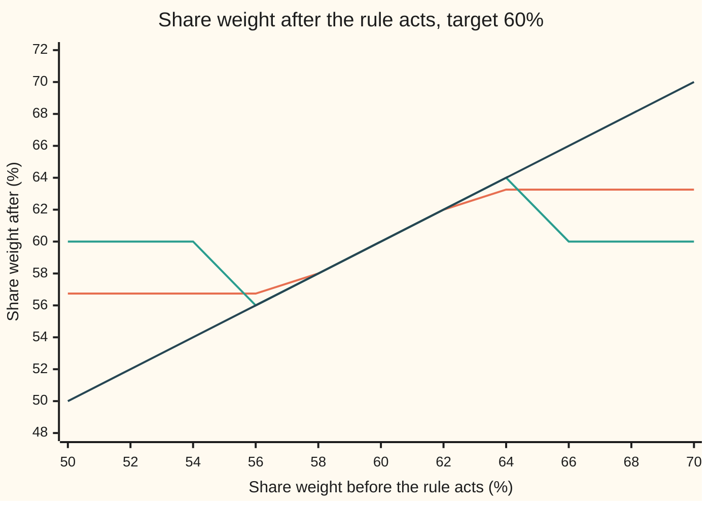
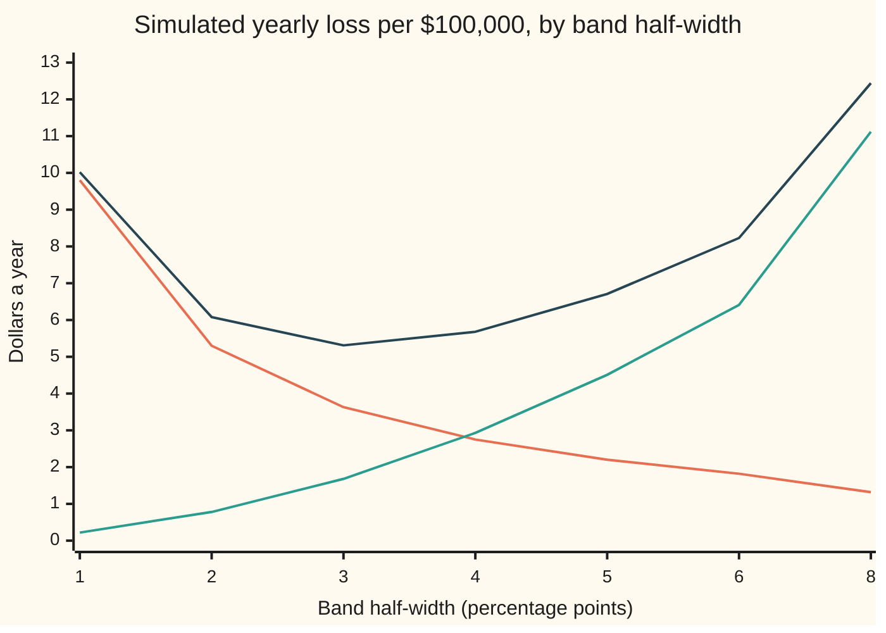

# Rebalancing: how often, at what cost, and the no-trade band that answers both

[Syllabus](../../../SYLLABUS.md) → [Financial mathematics](../../../SYLLABUS.md#w12) → [Performance and Multi-Period](../../../SYLLABUS.md#w12-s38) → Rebalancing

---

## General Overview

A fund of $100,000 is meant to hold 60% in shares and 40% in bonds: the 60-40 mix. Shares have had a good run. The fund now holds $65,000 of shares and $35,000 of bonds, so the mix reads 65-35. Nobody traded. The market moved the weights.

Putting the mix back is **rebalancing**. Selling $5,003.00 of shares restores 60-40 exactly; the extra $3.00 covers the fee. Every dollar traded costs something: commissions, the gap between buying and selling prices, prices moving against a large order. At 0.1% of each dollar traded, that sale costs $5.00. Leaving the fund at 65-35 costs something too, less visibly: more risk than the plan chose, every day it stays there.

A **calendar rule** trades back to 60-40 on fixed dates. A **threshold rule** trades back to 60-40 whenever the share weight strays more than, say, 5 percentage points. This card derives a third rule, a **no-trade band**: inside a range of weights around the target, do nothing; outside it, trade only as far as the nearest edge.

For this fund the band runs from 56.74% to 63.26% shares. At 65% the fund is outside it, so it sells $1,743.80 of shares, pays $1.74, and lands on 63.26%. Over ten simulated years this rule costs $5.33 a year per $100,000 in trading and drift combined; a monthly calendar rule costs $13.72.

**Leave the mix alone while it sits inside a band around the target; when it leaves, trade back to the band's edge; the band's half-width grows only as the cube root of the trading cost, because a gap left today may close on its own tomorrow.**

**What kind of fact this is:** an approximation inside a model. The model is Merton's investor who pays a fixed fraction of every dollar traded. The band's width is the leading term for small costs, derived in outline in Why it works, proved rigorously by Janeček and Shreve, and checked here by simulation.

### The picture: what each rule does to a drifted weight



Orange: the no-trade band. Flat at 56.74% on the left, along the diagonal in the middle, flat at 63.26% on the right. Green: the 5-point threshold rule, which does nothing near the target and then jumps all the way back to 60%. Dark: doing nothing, the diagonal. The band follows the diagonal where trading is not worth its cost and clips it where trading is.

---

## The formula

Notation first, in words. The share weight is the fraction of the fund held in shares: $x$ before a trade, $z$ after it. The target is $\pi^*$, read "pi star": Merton's fraction, the weight that would be held at every instant if trading were free ([Merton's problem](03-mertons-portfolio-problem.md)). Each dollar of shares bought or sold costs a fraction $c$ of that dollar. Risk aversion $\gamma$, read "gamma", measures how much the investor dislikes variance, as on Merton's card.

The band's half-width is

$$h = \left(\frac{3c}{2\gamma}\,\pi^{*2}(1-\pi^*)^2\right)^{1/3}$$

and the rule is

$$z = \min\big(\pi^* + h,\ \max(\pi^* - h,\ x)\big).$$

**Read it aloud:** the half-width is the cube root of three halves of the cost over the risk aversion, times the squared sensitivity of the weight to share moves; inside the band keep the weight, outside it move to the nearest edge.

| Symbol | Plain meaning | In our example | Push it up and the answer… |
| --- | --- | --- | --- |
| $x$ | share weight before any trade | 0.65 | further outside, a bigger sale |
| $z$ | share weight after the trade | 0.6326 | — |
| $\pi^*$ | target weight: Merton's fraction | 0.60 | the band moves with it |
| $c$ | cost per dollar traded, as a fraction | 0.001 | band widens, as the cube root |
| $h$ | half-width of the no-trade band | 0.0326 | fewer trades, more drift |
| $L(h)$ | yearly loss of a band: drift loss plus trading cost, a fraction of the fund | $5.31 per $100,000 | — |
| $\kappa$ | one-shot penalty, $\gamma\sigma^2$ times the years a gap would last | 0.1 | one-shot band narrows |
| $\gamma$ | risk aversion: how much a unit of variance hurts | 2.5 | band narrows |
| $\sigma$ | spread of share returns, per root-year | 0.20 | cancels out of $h$ at a fixed target |
| $\mu$, $r$ | expected share return and bond rate, per year | 9% and 3% | they set the target |
| $s$ | how fast the weight wanders: $\pi^*(1-\pi^*)\sigma$ | 0.048 | band widens |
| $W$, $q$ | fund value; dollars of shares sold | $100,000; $1,743.80 | — |

The helpers:

$$s = \pi^*(1-\pi^*)\,\sigma$$

A 1% move in shares relative to bonds moves the weight by $\pi^*(1-\pi^*)$ of 1%.

$$L(h) = \frac{\gamma\sigma^2}{2}\cdot\frac{h^2}{3} \;+\; c\,\frac{s^2}{2h}$$

Drift loss plus trading bill, per year; minimising it gives $h$.

$$q = \frac{(x - z)\,W}{1 - c z}$$

The sale that lands exactly on $z$ once the fee leaves the fund. A purchase up to a lower edge uses $1 + cz$ in the denominator and $z - x$ on top.

### When it holds

- **Small costs.** The width is the first term of a series in the cube root of $c$. At 1% the band is ±7.02 points, and the leading term becomes only a rough guide.
- **Costs proportional to dollars traded.** A fixed fee per trade changes the rule's shape: trade to a point inside the band, not to its edge.
- **The weight is watched closely.** Checked monthly, it strays well past the edge before anything happens.
- **Merton's market.** Constant expected return, volatility and bond rate; no taxes. A tax on gains makes selling dearer than buying, and the band tilts.
- **The weight's own drift is ignored.** Shares grow faster than bonds, so the weight leans upward. With that drift and daily checks, the simulated mean squared gap is 1.112 times the formula's.

---

## Why it works

### Step 0: two losses pull opposite ways

Trading costs money now. Being off target costs a little every day, as risk the plan did not choose. A dollar of trading is worth making only while it saves more drift loss than the $c$ it costs. Near the target the saving is tiny; far away it is large. So there is an edge where the two are equal. Inside it, no trade pays. Outside it, trading pays until the weight reaches the edge, and not a dollar further. That is the whole shape; the rest of this section finds the width.

### Step 1: the price of being off target

Merton's card gives the investor's certainty-equivalent return: the sure return the investor would swap the risky mix for. Holding weight $z$ at every instant it is

$$r + z(\mu - r) - \tfrac12\gamma\sigma^2 z^2.$$

It peaks at $z = \pi^* = (\mu - r)/(\gamma\sigma^2)$. Here $\mu - r = 0.06$, $\gamma\sigma^2 = 0.1$, so $\pi^* = 0.60$. Completing the square, the shortfall from the peak is

$$\tfrac12\gamma\sigma^2\,(z - \pi^*)^2 \text{ per year.}$$

At 65% that is $0.05 \times 0.05^2$ of the fund a year: $12.50 per $100,000. Being 5 points off costs a quarter of what being 10 points off costs: the loss grows with the square of the gap.

<details>
<summary>The algebra behind this</summary>

Write $\lambda = \gamma\sigma^2$ and use $\mu - r = \lambda\pi^*$. Then $r + z\lambda\pi^* - \tfrac12\lambda z^2 = r + \tfrac12\lambda\pi^{*2} - \tfrac12\lambda(z - \pi^*)^2$, as expanding the last square shows. The first two terms are the peak; the last is the shortfall.

</details>

### Step 2: one decision, no second chance

Suppose the fund may trade once now and then must hold for a year. A gap $z - \pi^*$ left now costs $\tfrac{\kappa}{2}(z - \pi^*)^2$ with $\kappa = \gamma\sigma^2 \times 1 \text{ year} = 0.1$. Moving from $x$ to $z$ costs $c\,|z - x|$. The best $z$ minimises the sum.

Selling from 65% lowers the drift loss at the rate $\kappa(z - \pi^*)$ per unit of weight and raises the bill at the rate $c$. Selling pays while $\kappa(z - \pi^*) > c$, so the fund sells down to $\pi^* + c/\kappa$ and stops. From below, it buys up to $\pi^* - c/\kappa$. Between the two, both directions lose. That is the band, with half-width $c/\kappa = 0.01$ here: 59% to 61%.

At 65%: waiting costs $12.50, selling to 60% costs $5.00, selling to 61% costs $4.50. The edge beats the target.

<details>
<summary>Detailed proof: the one-shot minimiser</summary>

The objective $f(z) = \tfrac{\kappa}{2}(z - \pi^*)^2 + c\,|z - x|$ is a strictly convex bowl plus a convex V, so it has exactly one minimiser. To the left of $x$ its slope is $\kappa(z - \pi^*) - c$; to the right it is $\kappa(z - \pi^*) + c$. If $x > \pi^* + c/\kappa$, the left slope is zero at $z = \pi^* + c/\kappa$, which lies left of $x$, negative before it and positive after: that point is the minimiser. If $x < \pi^* - c/\kappa$, the mirror argument gives $\pi^* - c/\kappa$. If $x$ lies between, the left slope at $x$ is at most zero and the right slope at least zero, so $x$ itself is the minimiser. The three cases together are $z = \min(\pi^* + c/\kappa, \max(\pi^* - c/\kappa, x))$. The code confirms it by searching 40,001 values of $z$.

</details>

### Step 3: why the lifelong band is wider

The one-shot band charges a gap for a full year, as if it could never be fixed. But the fund can trade tomorrow, and a gap left today may shrink on its own: shares that rose may fall back. The right to wait has value, so each trade is worth less than the one-shot count says, and the band should be wider. How much wider needs the loss counted over the fund's whole life, which needs two facts about how the weight wanders.

### Step 4: how fast the weight wanders

Over a short stretch, each dollar in shares becomes one plus the share return, and each dollar in bonds one plus the bond return. The new weight is

$$x' = \frac{x\,(1 + \text{share return})}{x\,(1 + \text{share return}) + (1 - x)(1 + \text{bond return})}.$$

For small moves, $x' - x \approx x(1 - x)\times(\text{share return} - \text{bond return})$. Share returns have spread $\sigma$; bonds are steady. So the weight wanders with spread

$$s = \pi^*(1 - \pi^*)\,\sigma = 0.6 \times 0.4 \times 0.20 = 0.048 \text{ per root-year}.$$

A 60-40 fund's weight moves about a quarter as much as its shares; a 50-50 fund's moves most.

### Step 5: a wandering weight between two walls

Inside the band the weight wanders freely; at an edge the fund trades just enough to keep it in. Two facts follow.

First, the weight spends its time spread evenly across the band. The average of $(x - \pi^*)^2$ over an even spread on $-h$ to $h$ is $h^2/3$. So the drift loss is $\tfrac12\gamma\sigma^2 \cdot h^2/3$ a year.

Second, the walls must push. Each push is a trade. The total pushed per year, the **turnover**, is $s^2/(2h)$: halve the band and the fund trades twice as much. The trading bill is $c$ times that.

<details>
<summary>Detailed proof: the even spread and the pushing rate</summary>

Ignore the weight's small drift. Inside the band the gap $x - \pi^*$ moves like Brownian motion with variance rate $s^2$. Itô's lemma on the squared gap gives $d(x - \pi^*)^2 = 2(x - \pi^*)\,dx + s^2\,dt$ between the walls. A push at a wall moves the gap toward zero by the amount pushed, and there the gap is $\pm h$, so each unit pushed lowers the squared gap by $2h$. Over a long stretch the average squared gap settles, so its average change is zero: $0 = s^2 - 2h \times (\text{pushes per year})$. The pushes per year are therefore $s^2/(2h)$. The even spread comes from the same settling: a Brownian motion with no drift, held between two walls by pushes, has the uniform distribution as its long-run law, and the uniform law on $-h$ to $h$ has mean square $h^2/3$.

</details>

### Step 6: add the two and minimise

The yearly loss of a band of half-width $h$ is

$$L(h) = \frac{\gamma\sigma^2}{2}\cdot\frac{h^2}{3} + c\,\frac{s^2}{2h}.$$

The first term grows with $h$; the second shrinks. Set the slope to zero: $\gamma\sigma^2 h/3 = c\,s^2/(2h^2)$. So

$$h^3 = \frac{3c\,s^2}{2\gamma\sigma^2} = \frac{3c}{2\gamma}\,\pi^{*2}(1 - \pi^*)^2.$$

The volatility cancels, because both the loss rate and the wandering scale with $\sigma^2$. Here $h^3 = 3 \times 0.001 \times 0.0576 / 5$, so $h = 0.03257$: a band from 56.74% to 63.26%. At that width the yearly loss is $5.31 per $100,000.

The cube root is the surprise. Cut costs tenfold and the band shrinks only by a factor of 2.154. The loss, meanwhile, is of order $c^{2/3}$, much smaller than the width's order $c^{1/3}$: costs change what an investor holds a lot and what the investor gains a little.

The other road is the exact one: Magill and Constantinides posed the problem in 1976, Davis and Norman solved it in 1990 as a free-boundary problem, one where the band's edges are unknowns found along with the value of the fund, and Janeček and Shreve proved in 2004 that the exact boundaries sit at $\pi^* \pm h$ to leading order.

---

## Worked numbers, by hand

The fund: $W = \$100{,}000$, $x = 0.65$, $\pi^* = 0.60$, $c = 0.001$, $\gamma = 2.5$, $\sigma = 0.20$.

| Step | Arithmetic | Value |
| --- | --- | --- |
| loss rate at 65% | $0.05 \times 0.05^2 \times \$100{,}000$ | $12.50 a year |
| full sale to 60% | $0.05 \times 100{,}000 / (1 - 0.001 \times 0.60)$ | $5,003.00 |
| its fee | $0.001 \times 5{,}003.00$ | $5.00 |
| weight's spread $s$ | $0.6 \times 0.4 \times 0.20$ | 0.048 |
| $\pi^{*2}(1-\pi^*)^2$ | $0.6^2 \times 0.4^2$ | 0.0576 |
| $h^3$ | $1.5 \times 0.001 \times 0.0576 / 2.5$ | 0.0000346 |
| half-width $h$ | cube root | 0.03257 |
| band | $60\% \pm 3.26$ points | 56.74% to 63.26% |
| sale to the edge | $(0.65 - 0.6326) \times 100{,}000 / (1 - 0.001 \times 0.6326)$ | **$1,743.80** |
| its fee | $0.001 \times 1{,}743.80$ | **$1.74** |
| turnover, from the walls | $0.048^2 / (2 \times 0.03257)$ | 3.54% of the fund a year |
| yearly loss at this width | drift loss plus trading bill | $5.31 per $100,000 |

The fund sells about a third of what a full rebalance would sell, pays about a third of the fee, and lands where further trading would cost more than it saves.

### What breaks if you drop a piece

Losses in dollars a year per $100,000; the right band costs $5.31 by the formula and $5.33 in simulation.

| Mistake | Comes out at | What went wrong |
| --- | --- | --- |
| One-shot width $c/\kappa$ used for life | ±1.00 pts, $11.69 | Charges each gap as if it could never close on its own |
| Share volatility $\sigma$ used for $s$ | ±8.43 pts, $13.22 | The weight moves about a quarter as much as the shares |
| Cost counted on the round trip, $2c$ | ±4.10 pts, $5.61 | Each trade pays once; the band is flat near its best, so this one is cheap |
| Monthly calendar rule, back to target | $13.72 (simulated) | Pays for trades on gaps too small to matter |

The code prints all four.

---

## How the weight moves, and what each rule pays

Nothing was traded, and the mix went from 60-40 to 65-35. The market does the drifting; a rule only decides when to pay for undoing it. The checks simulate 500 ten-year histories of daily prices: shares expected to return 9% a year with a 20% spread, bonds a steady 3%. Every rule sees the same histories and pays, each day, its drift loss $\tfrac12\gamma\sigma^2(x - \pi^*)^2$ for that day plus any fee.

| Rule | Turnover a year | Trading cost | Drift loss | Total |
| --- | --- | --- | --- | --- |
| never rebalance | 0 | $0.00 | $56.02 | $56.02 |
| calendar, yearly | 3.86% | $3.86 | $5.79 | $9.66 |
| calendar, quarterly | 7.71% | $7.71 | $1.42 | $9.13 |
| calendar, monthly | 13.26% | $13.26 | $0.46 | $13.72 |
| threshold 5 points, back to target | 4.41% | $4.41 | $2.22 | $6.63 |
| band ±3.26 points, to its edge | 3.36% | $3.36 | $1.97 | $5.33 |

```
total loss, $ a year per $100,000     one █ = $2
never rebalance        ████████████████████████████  $56.02
calendar, yearly       █████                         $9.66
calendar, quarterly    █████                         $9.13
calendar, monthly      ███████                       $13.72
threshold 5, target    ███                           $6.63
band, to edge          ███                           $5.33
```

Never trading loses most: over ten years the weight drifts far from 60%. The monthly rule has almost no drift loss and the biggest bill. The yearly rule lets gaps grow between dates. The threshold rule beats every calendar, because it trades only when the gap matters. The band beats the threshold rule by stopping at the edge instead of crossing to the target.

The band's simulated turnover, 3.36% a year, is 0.951 of the formula's 3.54%, and its mean squared gap is 1.112 times $h^2/3$. The formula leaves out two things the simulation has: the weight's upward drift, and checks once a day rather than continuously.

### The width, swept

The same histories, with bands of every width from 1 to 8 points:



Orange, falling: the trading cost, halving as the band doubles. Green, rising: the drift loss, growing as the square of the width. Dark: their total, lowest at 3 points ($5.31) and nearly flat from 3 to 4; the formula's 3.26 points scores $5.33, inside the noise of 500 histories. The flat bottom is the practical lesson: a roughly right width captures almost all the saving.

---

## Code, from first principles, and it actually runs

The scripts reach each answer by two roads that share no arithmetic. The exact sale comes from the closed form and from a bisection search on the post-fee weight. The one-shot band comes from the clamp and from a search over 40,001 weights. The lifelong width comes from the cube-root formula, from a brute-force minimum of $L(h)$, and from simulating 5,000 fund-years of daily prices with a random generator (splitmix64 and the Box-Muller transform) written in the script. The simulation also checks the two wall facts, turnover and mean squared gap, and races the rules.

### Python

```python
# Rebalancing and transaction costs -- the check behind the card.  Standard
# library only; nothing imported knows the answer.  A 60-40 fund has drifted
# to 65-35.  Roads: the exact sale by formula and by bisection; the one-shot
# band by formula and by grid search; the lifelong band by the cube-root rule
# and by simulating ten-year daily paths with a random generator written here.
from math import log, cos, sqrt, exp, pi

W, S = 100000.0, 65000.0                  # fund value, shares; bonds are the rest
c, w, gam, sig, r = 0.001, 0.60, 2.5, 0.20, 0.03
mu = r + gam * sig * sig * w              # excess return making 60% Merton's fraction
x0 = S / W
lam = gam * sig * sig                     # loss rate: (lam/2)(x - w)^2 per year

def sale_formula(z):                      # dollars of shares sold to land at z after the fee
    return (S - z * W) / (1.0 - c * z)

def sale_bisect(z):                       # road 2: search for the sale, no formula
    lo, hi = 0.0, S
    for _ in range(200):
        q = 0.5 * (lo + hi)
        if (S - q) / (W - c * q) > z: lo = q
        else: hi = q
    return 0.5 * (lo + hi)

def clamp(x, h): return min(w + h, max(w - h, x))

def J(z, x, kap): return 0.5 * kap * (z - w) ** 2 + c * abs(z - x)

s = w * (1 - w) * sig                     # how fast the weight wanders, per root-year
def h_cube(cc): return (3.0 * cc * s * s / (2.0 * lam)) ** (1.0 / 3.0)
def L(h): return 0.5 * lam * h * h / 3.0 + c * s * s / (2.0 * h)
h = h_cube(c)

state = 20260928                          # splitmix64 random numbers, written out
def u01():
    global state
    state = (state + 0x9E3779B97F4A7C15) & 0xFFFFFFFFFFFFFFFF
    z = state
    z = ((z ^ (z >> 30)) * 0xBF58476D1CE4E5B9) & 0xFFFFFFFFFFFFFFFF
    z = ((z ^ (z >> 27)) * 0x94D049BB133111EB) & 0xFFFFFFFFFFFFFFFF
    return ((z ^ (z >> 31)) >> 11) / 9007199254740992.0

DAYS, YEARS, PATHS = 252, 10, 500
dt = 1.0 / DAYS
gb = exp(r * dt)
def path():                               # one ten-year path of daily share growth factors
    out = []
    for _ in range(DAYS * YEARS):
        z = sqrt(-2.0 * log(1.0 - u01())) * cos(2.0 * pi * u01())
        out.append(exp((mu - 0.5 * sig * sig) * dt + sig * sqrt(dt) * z))
    return out

def run(rule, arg, gs, tot):              # tot: turnover, cost, loss, squared deviation
    x = w
    for t, g in enumerate(gs):
        tot[2] += 0.5 * lam * (x - w) ** 2 * dt
        tot[3] += (x - w) ** 2 * dt
        x = x * g / (x * g + (1.0 - x) * gb)
        z = x
        if rule == "calendar" and (t + 1) % arg == 0: z = w
        elif rule == "threshold" and abs(x - w) > arg: z = w
        elif rule == "band": z = clamp(x, arg)
        tot[0] += abs(z - x)
        tot[1] += c * abs(z - x)
        x = z

rules = [("never rebalance", "never", 0), ("calendar, yearly", "calendar", 252),
         ("calendar, quarterly", "calendar", 63), ("calendar, monthly", "calendar", 21),
         ("threshold 5 pts, to target", "threshold", 0.05), ("band +-3.26 pts, to edge", "band", h)]
sweep = [0.01, 0.02, 0.03, 0.04, 0.05, 0.06, 0.08]
acc = {k: [0.0] * 4 for k in [a for a, _, _ in rules] + sweep}
for p in range(PATHS):
    gs = path()
    for name, rule, arg in rules: run(rule, arg, gs, acc[name])
    for hh in sweep: run("band", hh, gs, acc[hh])
yrs = float(PATHS * YEARS)
def per(k, i): return acc[k][i] / yrs    # per year, fraction of the fund

qf, qb = sale_formula(w), sale_bisect(w)
qe, qeb = sale_formula(w + h), sale_bisect(w + h)
grid = [i / 100000.0 for i in range(40000, 80001)]
k1 = lam * 1.0                            # one-shot model: the gap is held for one year
zs = min(grid, key=lambda z: J(z, x0, k1))
print(f"fund {W:.2f}  shares {S:.2f}  bonds {W - S:.2f}  target {w:.2f}  drifted {x0:.2f}")
print(f"cost per dollar traded {c:.4f}  gamma {gam:.2f}  sigma {sig:.2f}  r {r:.2f}  mu {mu:.2f}")
print(f"gamma sigma^2 {lam:.4f}  Merton fraction (mu-r)/(gamma sigma^2) {(mu - r) / lam:.4f}")
print(f"paths {PATHS}  years {YEARS}  days per year {DAYS}")
print(f"loss rate at 65%, per $100,000 per year {W * 0.5 * lam * (x0 - w) ** 2:9.2f}")
print(f"sell to 60%: formula {qf:10.2f}  bisection {qb:10.2f}  fee {c * qf:6.2f}")
print(f"one-shot kappa {k1:.4f}  half-width c/kappa {c / k1:.4f}  clamp {clamp(x0, c / k1):.5f}  grid {zs:.5f}")
for lab, z in (("wait", x0), ("to target", w), ("to edge 61%", clamp(x0, c / k1))):
    print(f"  one-shot loss, {lab:<12} per $100,000 {W * J(z, x0, k1):8.2f}")
print(f"weight's spread s = w(1-w)sigma {s:.4f}  w^2(1-w)^2 {(w * (1 - w)) ** 2:.4f}  h^3 {h ** 3:.7f}")
hL = min((i / 100000.0 for i in range(100, 20001)), key=L)   # road 2 to h: brute-force minimum
print(f"lifelong half-width h {h:.5f}  brute-force minimum of L {hL:.5f}")
print(f"band {100 * (w - h):.2f}% to {100 * (w + h):.2f}%")
print(f"sell to edge {100 * (w + h):.2f}%: formula {qe:9.2f}  bisection {qeb:9.2f}  fee {c * qe:5.2f}")
print(f"formula at h: turnover {s * s / (2 * h):.4f}  mean sq dev {h * h / 3:.6f}  $/yr {W * L(h):.2f}")
bh = acc[rules[-1][0]]
print(f"simulated at h: turnover {bh[0] / yrs:.4f}  mean sq dev {bh[3] / yrs:.6f}  $/yr {W * (bh[1] + bh[2]) / yrs:.2f}")
print(f"simulated / formula: turnover {bh[0] / yrs / (s * s / (2 * h)):.3f}  mean sq dev {bh[3] / yrs / (h * h / 3):.3f}")
print("what breaks, $ per year per $100,000 (formula L):")
for lab, hh in (("one-shot width c/kappa", c / k1), ("sigma in place of s", (3 * c / (2 * gam)) ** (1 / 3)),
                ("cost counted twice", h_cube(2 * c))):
    print(f"  {lab:<24} h {hh:.4f}  {W * L(hh):6.2f}   right {W * L(h):.2f}")
print("rules over 10 years, daily prices, per $100,000 per year:")
print(f"  {'rule':<28}{'turnover':>9}{'cost':>8}{'drift':>8}{'total':>8}")
for name, _, _ in rules:
    print(f"  {name:<28}{per(name, 0):9.4f}{W * per(name, 1):8.2f}{W * per(name, 2):8.2f}"
          f"{W * (per(name, 1) + per(name, 2)):8.2f}")
print("band sweep, simulated, per $100,000 per year:")
for hh in sweep:
    print(f"  h {100 * hh:4.1f} pts  cost {W * per(hh, 1):6.2f}  drift {W * per(hh, 2):6.2f}"
          f"  total {W * (per(hh, 1) + per(hh, 2)):6.2f}  formula {W * L(hh):6.2f}")
def h_of(cc, g, p): return (1.5 * cc * (p * (1 - p)) ** 2 / g) ** (1.0 / 3.0)
for lab, cc, g, p in (("c = 0.0001", 0.0001, gam, w), ("c = 0.01", 0.01, gam, w),
                      ("gamma = 5", c, 5.0, w), ("target 0.50", c, gam, 0.5)):
    v = h_of(cc, g, p)
    print(f"try: {lab:<12} h {v:.4f}  band {100 * (p - v):.2f}% to {100 * (p + v):.2f}%")
print(f"ten times the cost widens the band by {h_of(0.01, gam, w) / h:.3f}")
pol = [0.50 + 0.02 * i for i in range(11)]
print("chart, weight before " + " ".join(f"{100 * x:5.0f}" for x in pol))
print("chart, band to edge  " + " ".join(f"{100 * clamp(x, h):5.2f}" for x in pol))
print("chart, threshold     " + " ".join(f"{100 * (w if abs(x - w) > 0.05 + 1e-12 else x):5.2f}" for x in pol))
best = min(sweep, key=lambda k: per(k, 1) + per(k, 2))
tots = {n: per(n, 1) + per(n, 2) for n, _, _ in rules}
assert abs(qf - qb) < 1e-6 and abs(qe - qeb) < 1e-6,   "exact sale: formula vs bisection"
assert abs(hL - h) < 2e-5,                             "cube-root rule vs brute-force minimum of L"
assert abs(zs - clamp(x0, c / k1)) < 2e-5,             "one-shot band: clamp vs grid search"
assert abs(bh[0] / yrs / (s * s / (2 * h)) - 1) < 0.15, "turnover: walls vs simulation"
assert abs(bh[3] / yrs / (h * h / 3) - 1) < 0.20,      "time spread evenly: h^2/3 vs simulation"
assert abs(best - h) <= 0.011,                         "simulated best width near the cube-root rule"
assert all(tots[rules[-1][0]] < tots[n] for n, _, _ in rules[:-1]), "band beats every other rule"
print("ALL CHECKS PASS")
```

**Ran 2026-09-28 on macOS, Python 3.14.6, standard library only. All checks passed. Output, pasted from the run:**

```
fund 100000.00  shares 65000.00  bonds 35000.00  target 0.60  drifted 0.65
cost per dollar traded 0.0010  gamma 2.50  sigma 0.20  r 0.03  mu 0.09
gamma sigma^2 0.1000  Merton fraction (mu-r)/(gamma sigma^2) 0.6000
paths 500  years 10  days per year 252
loss rate at 65%, per $100,000 per year     12.50
sell to 60%: formula    5003.00  bisection    5003.00  fee   5.00
one-shot kappa 0.1000  half-width c/kappa 0.0100  clamp 0.61000  grid 0.61000
  one-shot loss, wait         per $100,000    12.50
  one-shot loss, to target    per $100,000     5.00
  one-shot loss, to edge 61%  per $100,000     4.50
weight's spread s = w(1-w)sigma 0.0480  w^2(1-w)^2 0.0576  h^3 0.0000346
lifelong half-width h 0.03257  brute-force minimum of L 0.03257
band 56.74% to 63.26%
sell to edge 63.26%: formula   1743.80  bisection   1743.80  fee  1.74
formula at h: turnover 0.0354  mean sq dev 0.000354  $/yr 5.31
simulated at h: turnover 0.0336  mean sq dev 0.000393  $/yr 5.33
simulated / formula: turnover 0.951  mean sq dev 1.112
what breaks, $ per year per $100,000 (formula L):
  one-shot width c/kappa   h 0.0100   11.69   right 5.31
  sigma in place of s      h 0.0843   13.22   right 5.31
  cost counted twice       h 0.0410    5.61   right 5.31
rules over 10 years, daily prices, per $100,000 per year:
  rule                         turnover    cost   drift   total
  never rebalance                0.0000    0.00   56.02   56.02
  calendar, yearly               0.0386    3.86    5.79    9.66
  calendar, quarterly            0.0771    7.71    1.42    9.13
  calendar, monthly              0.1326   13.26    0.46   13.72
  threshold 5 pts, to target     0.0441    4.41    2.22    6.63
  band +-3.26 pts, to edge       0.0336    3.36    1.97    5.33
band sweep, simulated, per $100,000 per year:
  h  1.0 pts  cost   9.80  drift   0.22  total  10.02  formula  11.69
  h  2.0 pts  cost   5.30  drift   0.78  total   6.08  formula   6.43
  h  3.0 pts  cost   3.63  drift   1.68  total   5.31  formula   5.34
  h  4.0 pts  cost   2.75  drift   2.93  total   5.68  formula   5.55
  h  5.0 pts  cost   2.20  drift   4.51  total   6.71  formula   6.47
  h  6.0 pts  cost   1.82  drift   6.41  total   8.23  formula   7.92
  h  8.0 pts  cost   1.32  drift  11.12  total  12.44  formula  12.11
try: c = 0.0001   h 0.0151  band 58.49% to 61.51%
try: c = 0.01     h 0.0702  band 52.98% to 67.02%
try: gamma = 5    h 0.0259  band 57.41% to 62.59%
try: target 0.50  h 0.0335  band 46.65% to 53.35%
ten times the cost widens the band by 2.154
chart, weight before    50    52    54    56    58    60    62    64    66    68    70
chart, band to edge  56.74 56.74 56.74 56.74 58.00 60.00 62.00 63.26 63.26 63.26 63.26
chart, threshold     60.00 60.00 60.00 56.00 58.00 60.00 62.00 64.00 60.00 60.00 60.00
ALL CHECKS PASS
```

### Rust

Same inputs, same random numbers, same labels. Built with `rustc --edition 2021 -O`.

```rust
// Rebalancing and transaction costs -- the same check as the Python, in Rust.
// Standard library only, no crates.  A 60-40 fund has drifted to 65-35.
// Roads: the exact sale by formula and by bisection; the one-shot band by
// formula and by grid search; the lifelong band by the cube-root rule and by
// simulating ten-year daily paths with a random generator written here.
const W: f64 = 100000.0;
const S: f64 = 65000.0;
const C: f64 = 0.001;
const TW: f64 = 0.60; // target weight
const GAM: f64 = 2.5;
const SIG: f64 = 0.20;
const R: f64 = 0.03;
const DAYS: usize = 252;
const YEARS: usize = 10;
const PATHS: usize = 500;

fn sale_formula(z: f64) -> f64 { (S - z * W) / (1.0 - C * z) }

fn sale_bisect(z: f64) -> f64 {
    // road 2: search for the sale, no formula
    let (mut lo, mut hi) = (0.0_f64, S);
    for _ in 0..200 {
        let q = 0.5 * (lo + hi);
        if (S - q) / (W - C * q) > z { lo = q } else { hi = q }
    }
    0.5 * (lo + hi)
}

fn clamp(x: f64, h: f64) -> f64 { (TW + h).min((TW - h).max(x)) }
fn lam() -> f64 { GAM * SIG * SIG }
fn j(z: f64, x: f64, kap: f64) -> f64 { 0.5 * kap * (z - TW).powi(2) + C * (z - x).abs() }
fn s_w() -> f64 { TW * (1.0 - TW) * SIG }
fn h_cube(cc: f64) -> f64 { (3.0 * cc * s_w() * s_w() / (2.0 * lam())).powf(1.0 / 3.0) }
fn big_l(h: f64) -> f64 { 0.5 * lam() * h * h / 3.0 + C * s_w() * s_w() / (2.0 * h) }

struct Rng(u64); // splitmix64, written out
impl Rng {
    fn u01(&mut self) -> f64 {
        self.0 = self.0.wrapping_add(0x9E3779B97F4A7C15);
        let mut z = self.0;
        z = (z ^ (z >> 30)).wrapping_mul(0xBF58476D1CE4E5B9);
        z = (z ^ (z >> 27)).wrapping_mul(0x94D049BB133111EB);
        ((z ^ (z >> 31)) >> 11) as f64 / 9007199254740992.0
    }
}

fn path(rng: &mut Rng, mu: f64) -> Vec<f64> {
    // one ten-year path of daily share growth factors
    let dt = 1.0 / DAYS as f64;
    (0..DAYS * YEARS).map(|_| {
        let a = rng.u01();
        let b = rng.u01();
        let z = (-2.0 * (1.0 - a).ln()).sqrt() * (2.0 * std::f64::consts::PI * b).cos();
        ((mu - 0.5 * SIG * SIG) * dt + SIG * dt.sqrt() * z).exp()
    }).collect()
}

fn run(rule: &str, arg: f64, gs: &[f64], tot: &mut [f64; 4]) {
    // tot: turnover, cost, loss, squared deviation
    let dt = 1.0 / DAYS as f64;
    let gb = (R * dt).exp();
    let mut x = TW;
    for (t, &g) in gs.iter().enumerate() {
        tot[2] += 0.5 * lam() * (x - TW).powi(2) * dt;
        tot[3] += (x - TW).powi(2) * dt;
        x = x * g / (x * g + (1.0 - x) * gb);
        let mut z = x;
        if rule == "calendar" && (t + 1) % (arg as usize) == 0 { z = TW }
        else if rule == "threshold" && (x - TW).abs() > arg { z = TW }
        else if rule == "band" { z = clamp(x, arg) }
        tot[0] += (z - x).abs();
        tot[1] += C * (z - x).abs();
        x = z;
    }
}

fn main() {
    let mu = R + GAM * SIG * SIG * TW; // excess return making 60% Merton's fraction
    let x0 = S / W;
    let (s, h) = (s_w(), h_cube(C));
    let rules: [(&str, &str, f64); 6] = [("never rebalance", "never", 0.0), ("calendar, yearly", "calendar", 252.0),
        ("calendar, quarterly", "calendar", 63.0), ("calendar, monthly", "calendar", 21.0),
        ("threshold 5 pts, to target", "threshold", 0.05), ("band +-3.26 pts, to edge", "band", h)];
    let sweep = [0.01, 0.02, 0.03, 0.04, 0.05, 0.06, 0.08];
    let mut acc_r = [[0.0_f64; 4]; 6];
    let mut acc_s = [[0.0_f64; 4]; 7];
    let mut rng = Rng(20260928);
    for _ in 0..PATHS {
        let gs = path(&mut rng, mu);
        for (i, (_, rule, arg)) in rules.iter().enumerate() { run(rule, *arg, &gs, &mut acc_r[i]) }
        for (i, hh) in sweep.iter().enumerate() { run("band", *hh, &gs, &mut acc_s[i]) }
    }
    let yrs = (PATHS * YEARS) as f64;
    let (qf, qb) = (sale_formula(TW), sale_bisect(TW));
    let (qe, qeb) = (sale_formula(TW + h), sale_bisect(TW + h));
    let k1 = lam() * 1.0; // one-shot model: the gap is held for one year
    let mut zs = 0.4;
    for i in 40000..=80000 {
        let z = i as f64 / 100000.0;
        if j(z, x0, k1) < j(zs, x0, k1) { zs = z }
    }
    println!("fund {:.2}  shares {:.2}  bonds {:.2}  target {:.2}  drifted {:.2}", W, S, W - S, TW, x0);
    println!("cost per dollar traded {:.4}  gamma {:.2}  sigma {:.2}  r {:.2}  mu {:.2}", C, GAM, SIG, R, mu);
    println!("gamma sigma^2 {:.4}  Merton fraction (mu-r)/(gamma sigma^2) {:.4}", lam(), (mu - R) / lam());
    println!("paths {}  years {}  days per year {}", PATHS, YEARS, DAYS);
    println!("loss rate at 65%, per $100,000 per year {:9.2}", W * 0.5 * lam() * (x0 - TW).powi(2));
    println!("sell to 60%: formula {:10.2}  bisection {:10.2}  fee {:6.2}", qf, qb, C * qf);
    println!("one-shot kappa {:.4}  half-width c/kappa {:.4}  clamp {:.5}  grid {:.5}", k1, C / k1, clamp(x0, C / k1), zs);
    for (lab, z) in [("wait", x0), ("to target", TW), ("to edge 61%", clamp(x0, C / k1))] {
        println!("  one-shot loss, {:<12} per $100,000 {:8.2}", lab, W * j(z, x0, k1));
    }
    println!("weight's spread s = w(1-w)sigma {:.4}  w^2(1-w)^2 {:.4}  h^3 {:.7}", s, (TW * (1.0 - TW)).powi(2), h.powi(3));
    let mut hl = 0.001; // road 2 to h: brute-force minimum
    for i in 100..=20000 {
        let hh = i as f64 / 100000.0;
        if big_l(hh) < big_l(hl) { hl = hh }
    }
    println!("lifelong half-width h {:.5}  brute-force minimum of L {:.5}", h, hl);
    println!("band {:.2}% to {:.2}%", 100.0 * (TW - h), 100.0 * (TW + h));
    println!("sell to edge {:.2}%: formula {:9.2}  bisection {:9.2}  fee {:5.2}", 100.0 * (TW + h), qe, qeb, C * qe);
    println!("formula at h: turnover {:.4}  mean sq dev {:.6}  $/yr {:.2}", s * s / (2.0 * h), h * h / 3.0, W * big_l(h));
    let bh = acc_r[5];
    println!("simulated at h: turnover {:.4}  mean sq dev {:.6}  $/yr {:.2}", bh[0] / yrs, bh[3] / yrs, W * (bh[1] + bh[2]) / yrs);
    println!("simulated / formula: turnover {:.3}  mean sq dev {:.3}", bh[0] / yrs / (s * s / (2.0 * h)), bh[3] / yrs / (h * h / 3.0));
    println!("what breaks, $ per year per $100,000 (formula L):");
    for (lab, hh) in [("one-shot width c/kappa", C / k1), ("sigma in place of s", (3.0 * C / (2.0 * GAM)).powf(1.0 / 3.0)),
                      ("cost counted twice", h_cube(2.0 * C))] {
        println!("  {:<24} h {:.4}  {:6.2}   right {:.2}", lab, hh, W * big_l(hh), W * big_l(h));
    }
    println!("rules over 10 years, daily prices, per $100,000 per year:");
    println!("  {:<28}{:>9}{:>8}{:>8}{:>8}", "rule", "turnover", "cost", "drift", "total");
    for (i, (name, _, _)) in rules.iter().enumerate() {
        let a = acc_r[i];
        println!("  {:<28}{:9.4}{:8.2}{:8.2}{:8.2}", name, a[0] / yrs, W * (a[1] / yrs), W * (a[2] / yrs),
                 W * (a[1] / yrs + a[2] / yrs));
    }
    println!("band sweep, simulated, per $100,000 per year:");
    for (i, hh) in sweep.iter().enumerate() {
        let a = acc_s[i];
        println!("  h {:4.1} pts  cost {:6.2}  drift {:6.2}  total {:6.2}  formula {:6.2}", 100.0 * hh,
                 W * (a[1] / yrs), W * (a[2] / yrs), W * (a[1] / yrs + a[2] / yrs), W * big_l(*hh));
    }
    let h_of = |cc: f64, g: f64, p: f64| (1.5 * cc * (p * (1.0 - p)).powi(2) / g).powf(1.0 / 3.0);
    for (lab, cc, g, p) in [("c = 0.0001", 0.0001, GAM, TW), ("c = 0.01", 0.01, GAM, TW),
                            ("gamma = 5", C, 5.0, TW), ("target 0.50", C, GAM, 0.5)] {
        let v = h_of(cc, g, p);
        println!("try: {:<12} h {:.4}  band {:.2}% to {:.2}%", lab, v, 100.0 * (p - v), 100.0 * (p + v));
    }
    println!("ten times the cost widens the band by {:.3}", h_of(0.01, GAM, TW) / h);
    let pol: Vec<f64> = (0..11).map(|i| 0.50 + 0.02 * i as f64).collect();
    let row = |f: &dyn Fn(f64) -> String| pol.iter().map(|&x| f(x)).collect::<Vec<_>>().join(" ");
    println!("chart, weight before {}", row(&|x| format!("{:5.0}", 100.0 * x)));
    println!("chart, band to edge  {}", row(&|x| format!("{:5.2}", 100.0 * clamp(x, h))));
    println!("chart, threshold     {}", row(&|x| format!("{:5.2}", 100.0 * if (x - TW).abs() > 0.05 + 1e-12 { TW } else { x })));
    let mut best = sweep[0];
    let mut best_tot = f64::INFINITY;
    for (i, hh) in sweep.iter().enumerate() {
        let t = acc_s[i][1] / yrs + acc_s[i][2] / yrs;
        if t < best_tot { best_tot = t; best = *hh }
    }
    let tots: Vec<f64> = acc_r.iter().map(|a| a[1] / yrs + a[2] / yrs).collect();
    assert!((qf - qb).abs() < 1e-6 && (qe - qeb).abs() < 1e-6, "exact sale: formula vs bisection");
    assert!((hl - h).abs() < 2e-5, "cube-root rule vs brute-force minimum of L");
    assert!((zs - clamp(x0, C / k1)).abs() < 2e-5, "one-shot band: clamp vs grid search");
    assert!((bh[0] / yrs / (s * s / (2.0 * h)) - 1.0).abs() < 0.15, "turnover: walls vs simulation");
    assert!((bh[3] / yrs / (h * h / 3.0) - 1.0).abs() < 0.20, "time spread evenly: h^2/3 vs simulation");
    assert!((best - h).abs() <= 0.011, "simulated best width near the cube-root rule");
    assert!(tots[..5].iter().all(|&t| tots[5] < t), "band beats every other rule");
    println!("ALL CHECKS PASS");
}
```

**Ran 2026-09-28 on macOS, rustc 1.98.1, no crates. All checks passed. Output, pasted from the run:**

```
fund 100000.00  shares 65000.00  bonds 35000.00  target 0.60  drifted 0.65
cost per dollar traded 0.0010  gamma 2.50  sigma 0.20  r 0.03  mu 0.09
gamma sigma^2 0.1000  Merton fraction (mu-r)/(gamma sigma^2) 0.6000
paths 500  years 10  days per year 252
loss rate at 65%, per $100,000 per year     12.50
sell to 60%: formula    5003.00  bisection    5003.00  fee   5.00
one-shot kappa 0.1000  half-width c/kappa 0.0100  clamp 0.61000  grid 0.61000
  one-shot loss, wait         per $100,000    12.50
  one-shot loss, to target    per $100,000     5.00
  one-shot loss, to edge 61%  per $100,000     4.50
weight's spread s = w(1-w)sigma 0.0480  w^2(1-w)^2 0.0576  h^3 0.0000346
lifelong half-width h 0.03257  brute-force minimum of L 0.03257
band 56.74% to 63.26%
sell to edge 63.26%: formula   1743.80  bisection   1743.80  fee  1.74
formula at h: turnover 0.0354  mean sq dev 0.000354  $/yr 5.31
simulated at h: turnover 0.0336  mean sq dev 0.000393  $/yr 5.33
simulated / formula: turnover 0.951  mean sq dev 1.112
what breaks, $ per year per $100,000 (formula L):
  one-shot width c/kappa   h 0.0100   11.69   right 5.31
  sigma in place of s      h 0.0843   13.22   right 5.31
  cost counted twice       h 0.0410    5.61   right 5.31
rules over 10 years, daily prices, per $100,000 per year:
  rule                         turnover    cost   drift   total
  never rebalance                0.0000    0.00   56.02   56.02
  calendar, yearly               0.0386    3.86    5.79    9.66
  calendar, quarterly            0.0771    7.71    1.42    9.13
  calendar, monthly              0.1326   13.26    0.46   13.72
  threshold 5 pts, to target     0.0441    4.41    2.22    6.63
  band +-3.26 pts, to edge       0.0336    3.36    1.97    5.33
band sweep, simulated, per $100,000 per year:
  h  1.0 pts  cost   9.80  drift   0.22  total  10.02  formula  11.69
  h  2.0 pts  cost   5.30  drift   0.78  total   6.08  formula   6.43
  h  3.0 pts  cost   3.63  drift   1.68  total   5.31  formula   5.34
  h  4.0 pts  cost   2.75  drift   2.93  total   5.68  formula   5.55
  h  5.0 pts  cost   2.20  drift   4.51  total   6.71  formula   6.47
  h  6.0 pts  cost   1.82  drift   6.41  total   8.23  formula   7.92
  h  8.0 pts  cost   1.32  drift  11.12  total  12.44  formula  12.11
try: c = 0.0001   h 0.0151  band 58.49% to 61.51%
try: c = 0.01     h 0.0702  band 52.98% to 67.02%
try: gamma = 5    h 0.0259  band 57.41% to 62.59%
try: target 0.50  h 0.0335  band 46.65% to 53.35%
ten times the cost widens the band by 2.154
chart, weight before    50    52    54    56    58    60    62    64    66    68    70
chart, band to edge  56.74 56.74 56.74 56.74 58.00 60.00 62.00 63.26 63.26 63.26 63.26
chart, threshold     60.00 60.00 60.00 56.00 58.00 60.00 62.00 64.00 60.00 60.00 60.00
ALL CHECKS PASS
```

The two outputs match line for line. The random generator is the same integer recipe in both languages, so both simulate the same 500 histories.

> [!TIP]
> **Try changing**
> Guess the direction first, then edit the line `c, w, gam, sig, r = ...` and run it.
> - **Cheaper trading.** Set `c` to 0.0001, a tenth of the cost. The band shrinks only to 58.49% to 61.51%, ±1.51 points, because the width goes as the cube root. The `h^2/3` assert then stops the run: a day's move, about 0.3 points, is a fifth of this half-width, so daily checks let the weight overshoot the edges and the even-spread picture fails.
> - **Dearer trading.** Set `c` to 0.01, a full percent. The band opens to 52.98% to 67.02%, so at 65% the fund does not trade at all. The exact-sale assert stops the run: there is no sale that lands on 67.02%.
> - **A more cautious investor.** Set `gam` to 5.0. The script raises `mu` to keep the target at 60%. Drift hurts twice as much, the band narrows to 57.41% to 62.59%, and every assert holds.
> - **A 50-50 fund.** Set `w` to 0.50. The weight wanders most at a half, so the band is 46.65% to 53.35%, ±3.35 points against ±3.26. Labels that say 60% go stale; every assert holds.

---

## The usual mistake

> [!warning]
> **Rebalancing all the way back to target.** Once a trade is worth making, finishing the job feels natural. It does not pay. The last dollar of a full rebalance buys a sliver of risk reduction where the drift loss is almost flat, at the same fee as the first dollar. The fund at 65% should sell $1,743.80 to the edge, not $5,003.00 to 60%.
>
> - **Trading on the calendar.** A monthly rule pays $13.26 a year per $100,000 in fees to hold drift loss to $0.46; the band pays $3.36 in fees and accepts $1.97 of drift loss.
> - **Borrowing the one-shot width.** The one-shot band, $c/\kappa$, is ±1 point here. Used for life it costs $11.69 a year against $5.31, because it ignores that gaps close on their own.
> - **Using the share volatility for the weight's.** A 60-40 weight moves about a quarter as much as the shares. Plug in $\sigma$ for $s$ and the band balloons to ±8.43 points.
> - **Thinking small costs mean a small band.** Ten times the cost widens the band by a factor of 2.154, not 10; a tenth of the cost still leaves ±1.51 points. Even nearly free trading leaves a visible band.

---

## Where you meet it in real life

- **Target-date funds.** Vanguard argues for threshold over calendar rebalancing of its target-date funds and illustrates a 200 basis point trigger with a 175 basis point destination: trade when the gap passes 2 points, and stop short of the target.
- **Pension and endowment policies.** Policy statements commonly give each asset class a target and a permitted range: a no-trade band, usually set by judgement.
- **Option hedging.** A trader hedging an option faces the same trade-off between hedge error and fees. Janeček and Shreve point out that Whalley and Wilmott's hedging band has the same cube-root law.
- **Performance reports.** Trading costs show up as a drag on measured return, the subject of [Performance measures](01-sharpe-information-and-drawdown.md), and a drifted mix shows up as an allocation effect in [Attribution](02-performance-attribution.md).

> **Say it back**
> A fund's mix drifts because shares and bonds grow at different rates. Trading it back costs a fee; leaving it costs a little every day in extra risk, growing as the square of the gap. The best rule is a band: do nothing inside it, trade to its nearest edge outside it. The band is wider than a one-shot calculation suggests, because a gap left today may close by itself. Balancing the drift loss against the trading bill makes the half-width the cube root of three halves of the cost over the risk aversion, times the square of $\pi^*(1-\pi^*)$: ±3.26 points for a 60-40 fund paying 0.1%.

---

## What this builds on

- [Merton's problem](03-mertons-portfolio-problem.md): the target weight $\pi^* = (\mu - r)/(\gamma\sigma^2)$, the certainty-equivalent return whose shortfall prices every gap, and the Itô calculus behind the wandering weight.

## Where this goes next

- [Investing over a lifetime](05-life-cycle-and-glide-paths.md): the target itself moves, year by year, as an investor ages and wages turn into savings.

This card holds the target fixed at 60% for ever; when the target slides along a glide path, the band has to slide with it, and what the plan should aim for at each age is the question the life-cycle card answers.

---

## Sources

Verified 2026-09-28: every link below resolves to the publisher's page; where a publisher blocks automated checks, the DOI's Crossref record was read and names the paper.

- Magill, Michael J. P., and George M. Constantinides. "Portfolio Selection with Transactions Costs." *Journal of Economic Theory* 13, no. 2 (1976): 245–263. [doi:10.1016/0022-0531(76)90018-1](https://doi.org/10.1016/0022-0531(76)90018-1). First statement of the no-transaction region around Merton's fraction.
- Davis, M. H. A., and A. R. Norman. "Portfolio Selection with Transaction Costs." *Mathematics of Operations Research* 15, no. 4 (1990): 676–713. [doi:10.1287/moor.15.4.676](https://doi.org/10.1287/moor.15.4.676). Optimal trading as pushes at the boundaries of a wedge, found from a free-boundary problem.
- Shreve, Steven E., and H. Mete Soner. "Optimal Investment and Consumption with Transaction Costs." *Annals of Applied Probability* 4, no. 3 (1994): 609–692. [doi:10.1214/aoap/1177004966](https://doi.org/10.1214/aoap/1177004966). The complete analysis of the no-trade wedge.
- Janeček, Karel, and Steven E. Shreve. "Asymptotic Analysis for Optimal Investment and Consumption with Transaction Costs." *Finance and Stochastics* 8 (2004): 181–206. [doi:10.1007/s00780-003-0113-4](https://doi.org/10.1007/s00780-003-0113-4). The heuristic of Step 5 and its rigorous proof: boundaries at $\pi^* \pm (3/(2\gamma)\,\pi^{*2}(1-\pi^*)^2\,c)^{1/3}$ to leading order.
- Vanguard. "Vanguard's approach to target-date fund rebalancing," 23 January 2025. [Vanguard Institutional](https://workplace.vanguard.com/insights-and-research/perspective/vanguards-approach-to-target-date-fund-rebalancing.html). Calendar against threshold rules in practice, with a trigger and a destination short of target.
