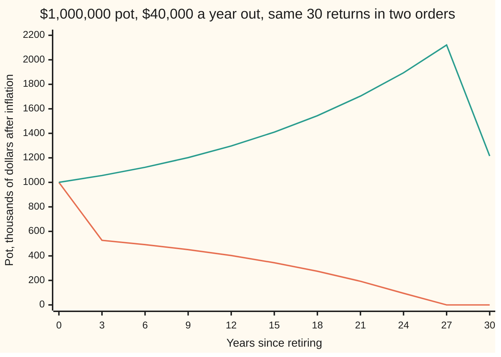
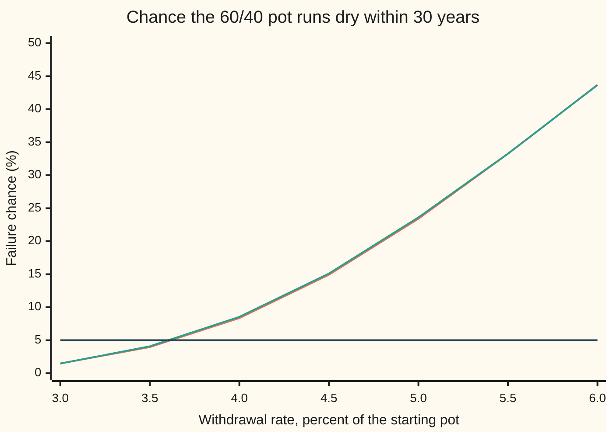

# Investing over a lifetime: sequence risk, safe withdrawal rates and glide paths

[Syllabus](../../../SYLLABUS.md) → [Financial mathematics](../../../SYLLABUS.md#w12) → [Performance and Multi-Period](../../../SYLLABUS.md#w12-s38) → Investing over a lifetime

---

## General Overview

A retirement pot holds $1,000,000. It is invested 60 percent in shares and 40 percent in bonds. At the start of each year its owner takes out $40,000, and raises that amount with prices, so it always buys the same groceries. Every dollar figure on this card is measured after inflation for that reason. Thirty withdrawals are planned. The $40,000 is 4 percent of the starting pot, the "4 percent rule" that planners have quoted since a 1994 study by William Bengen.

Will the money last? The answer depends on the returns the pot earns, and those are unknown. So the question becomes a probability. Under the return model on this card, the pot cannot pay all 30 withdrawals in about 8 percent of possible futures: **8.36 percent**, computed on a grid with no randomness, and 8.54 percent in a simulation of 50,000 retirements.

What decides the outcome is not only how good the returns are but **the order they arrive in**. Two retirees who see the very same 30 yearly returns, shuffled differently, can end one with $1,215,230.14 and the other broke in year 27. That is **sequence-of-returns risk**, the name used from here on. A **glide path**, a plan that changes the share in stocks year by year, is the main tool against it.

**A pot that pays out survives exactly when it covers every withdrawal discounted at the growth the pot actually earned before that withdrawal, so early returns count many times over and late returns count once.**

**What kind of fact this is:** a model. Yearly returns are assumed independent and bell-shaped in logs, which is an assumption, not a law. Inside it, the survival condition is a theorem proved on this card in Why it works, and the 8.36 percent is computed on a grid and checked by simulation.

### The picture: the same thirty returns, in two orders

Both pots earn minus 15 percent three years running and plus 6 percent in the other 27 years. One meets the crash first, the other last.



The falling line (orange) meets the three bad years first; it runs dry in year 27. The rising line (green) meets them last; it ends at $1,215,230.14. With no withdrawals, both orders end at exactly $2,961,523.20: multiplying the same 30 growth factors gives the same product in any order.

---

## The formula

Notation first, in words. A **growth factor** is what one dollar becomes over a year: 1.06 for a 6 percent year, 0.85 for a minus 15 percent year. $G_t$ is year $t$'s growth factor, after inflation. $P_k$ is the growth of the first $k$ years multiplied together, so $P_2 = G_1 G_2$, and $P_0 = 1$ because no years have passed. $W_0$ is the starting pot and $c$ the yearly withdrawal. A capital sigma, Σ, means "add up".

$$W_0 \;\ge\; c\,S_n, \qquad S_n \;=\; \sum_{k=1}^{n} \frac{1}{P_{k-1}} \;=\; 1 + \frac{1}{G_1} + \frac{1}{G_1 G_2} + \cdots + \frac{1}{G_1 G_2 \cdots G_{n-1}}$$

**Read it aloud: the pot lasts for all $n$ withdrawals exactly when it holds at least the withdrawal times the sum of what each withdrawal costs today, discounted at the growth the pot really earned before it.**

$S_n$ is the **realised discount sum**: the price, today and counted in withdrawals, of all $n$ withdrawals. Withdrawal $k$ is paid after $k-1$ years of growth, so it costs $1/P_{k-1}$ of a withdrawal today. For the example $W_0/c = 25$, so the pot survives when $S_{30} \le 25$.

The chance of failure is the chance that this sum is too big. With withdrawal rate $w = c/W_0$:

$$p(w) \;=\; \Pr\!\big(S_n > 1/w\big), \qquad w^{*} \;=\; \frac{1}{\text{95th percentile of } S_n}$$

The **safe withdrawal rate** $w^{*}$ is the largest rate whose failure chance is at most 5 percent, a target chosen here; any other target works the same way.

The returns come from a model. Each year the pot holds a share $\pi_t$ in stocks and the rest in bonds, rebalanced continuously so the shares stay put:

$$\ln G_t = m + s\,Z_t, \qquad a = \pi_t a_S + (1-\pi_t)\,a_B, \qquad s^2 = \pi_t^2\sigma_S^2 + (1-\pi_t)^2\sigma_B^2, \qquad m = a - \tfrac12 s^2$$

In words: the log of each year's growth is a bell-curve draw; $Z$ is a fresh standard normal number each year. Its centre $m$ is the expected return $a$ less a drag of half the variance. Returns are continuously compounded, so the average growth factor is $e^{a}$, not $1 + a$. The spread $s$ mixes the two assets' volatilities (the jumpiness of their returns). Stocks and bonds are taken as independent of each other.

| Symbol | Plain meaning | In our example | Push it up and the failure chance… |
| --- | --- | --- | --- |
| $W_0$, $W_k$ | the starting pot; the pot after $k$ years | $1,000,000 | falls |
| $c$ | the yearly withdrawal, in today's dollars | $40,000 | rises |
| $w$ | the withdrawal rate, $c$ divided by $W_0$ | 4% | rises: 23.41% at 5% |
| $n$ | the number of yearly withdrawals | 30 | rises |
| $G_t$, $G_k$, $G_1$, $G_{29}$, $G_{30}$, $t$ | year $t$'s growth factor after inflation; $G_1$ is the first year's | 0.85 or 1.06 in the story | falls, most of all for early years |
| $P_k$, $P_0$, $P_{30}$, $k$ | the first $k$ growth factors multiplied; $P_0 = 1$ | 2.961523 after 30 years of the story | falls |
| $S_n$, $S_{30}$ | the realised discount sum: all withdrawals priced today, in withdrawals | 26.3624 crash first, 14.7415 crash last | the pot fails once it passes 25 |
| $p$ | the chance of running dry before withdrawal $n$ | 8.36% | — |
| $\pi_t$ | the share in stocks in year $t$ | 60% | rises here: 14.33% at 90% |
| $a_S$, $a_B$, $\sigma_S$, $\sigma_B$ | expected yearly real return and volatility: stocks, bonds | 8% and 20%; 3% and 8% | returns lower it, volatilities raise it |
| $a$, $m$, $s$ | the portfolio's expected return; centre and spread of its yearly log-growth | 0.06; 0.052288; 0.124193 | $m$ lowers it, $s$ raises it |
| $V_k$, $V_1$, $V_2$, $V_{30}$ | the chance of making $k$ more withdrawals from a pot holding $x$ withdrawals | 1 minus 8.36% at $k$ = 30, $x$ = 25 | — |

### When it holds

- **Withdrawals fixed in today's dollars, at the start of each year.** Take them at the end of each year instead and the same simulation fails 7.66 percent of the time, not 8.54; compare studies only on the same timing.
- **Independent years.** The model draws each year afresh. If bad years cluster, as they did in the 1930s and 1970s, early losses compound and the true failure chance is higher; if markets bounce back after falls, it is lower.
- **Bell-shaped log returns.** Real returns have fatter tails, more crashes than a bell curve allows. The theorem $W_0 \ge c S_n$ needs no model at all; only the 8.36 percent does.
- **Known averages.** The 8 percent and 3 percent expected returns are inputs, not measurements. Lower them and every failure chance on the card rises.
- **A fixed horizon of 30 years.** A real retirement has an uncertain length. Replacing the fixed $n$ by a life table turns this into the ruin problem of the Sources.

---

## Why it works

### Step 0: price every withdrawal back to the start

A pot that pays out is a promise to fund 30 bills. Each bill can be priced at the start: it costs what, invested then, grows into the bill by its due date. If the pot holds enough to prefund every bill, it lasts. The catch is that the growth rate used for the pricing is the one that actually happens, path by path.

### Step 1: unroll one year at a time

Let $W_k$ be the pot after $k$ years, just before the next withdrawal. One year is: take out $c$, then grow by $G_k$.

$$W_k = (W_{k-1} - c)\,G_k$$

Unrolled, this becomes

$$W_k = P_k \Big(W_0 - c\sum_{j=1}^{k} \frac{1}{P_{j-1}}\Big)$$

Check it on the crash-first story after one year: $P_1 = 0.85$, the sum is 1, and $0.85 \times (1{,}000{,}000 - 40{,}000) = 816{,}000$, the value the recursion gives.

<details>
<summary>Detailed proof: the unrolled form</summary>

By induction on $k$. For $k = 0$ the sum is empty and $P_0 = 1$, so the formula reads $W_0 = W_0$. Suppose it holds for $k - 1$. Then
$$W_k = (W_{k-1} - c)\,G_k = \Big(P_{k-1}\big(W_0 - c\textstyle\sum_{j=1}^{k-1} 1/P_{j-1}\big) - c\Big)G_k = P_{k-1}G_k\Big(W_0 - c\textstyle\sum_{j=1}^{k-1} 1/P_{j-1} - c/P_{k-1}\Big).$$
Since $P_{k-1}G_k = P_k$ and the last term is the $j = k$ term of the sum, this is the formula for $k$.

</details>

### Step 2: survival is one inequality

Withdrawal $k+1$ can be paid when $W_k \ge c$. Divide by $P_k$, which is positive, and move the sum across: $W_k \ge c$ exactly when $W_0 \ge c\sum_{j=1}^{k+1} 1/P_{j-1}$.

Every term of the sum is positive, so the sums grow with $k$. The last one, $c\,S_n$, is the largest. If the pot covers it, it covers all the earlier ones. So the pot pays all $n$ withdrawals exactly when $W_0 \ge c\,S_n$. That is the formula, and it holds for any returns whatever, with no model.

### Step 3: read sequence risk off the sum

The growth factor $G_t$ sits inside $P_{k-1}$ for every withdrawal $k$ after year $t$. So $G_1$ discounts 29 of the 30 withdrawals, $G_{29}$ discounts one, and $G_{30}$ discounts none. A bad first year inflates 29 terms of $S_{30}$. A bad 29th year inflates one.

On the story: crash first gives $S_{30} = 26.3624$, above 25, so the pot fails. Crash last gives $S_{30} = 14.7415$, comfortably below. Same growth factors, same product $P_{30} = 2.961523$, different sums. Without withdrawals only $P_{30}$ matters, which is why order is harmless then and decisive now.

### Step 4: the failure chance and its inverse

In the model, $S_n$ is a random number built from 30 random growth factors. The failure chance at rate $w$ is the chance it exceeds $1/w$. This single fact gives the whole curve at once: work out the spread of $S_n$ once, and every withdrawal rate's failure chance is read off it.

The safe rate inverts the curve. It exists and is unique for any target between 0 and 1. At $w$ near zero, $1/w$ is enormous and the failure chance is near zero. At $w = 1$ or more the first withdrawal empties the pot, since $S_n \ge 1$, and failure is certain. In between the chance rises continuously and strictly, because $S_n$ has a smooth spread with no gaps. So exactly one rate has a failure chance of 5 percent: one over the 95th percentile of $S_n$.

### Step 5: the chance with no randomness at all

Simulation estimates the failure chance with noise. A second road computes it directly. Measure the pot in withdrawals, $x = W/c$, and let $V_k(x)$ be the chance of making $k$ more withdrawals from $x$. One withdrawal needs $x \ge 1$. More need that, and then the grown remainder must last one year less:

$$V_k(x) = \mathbb{E}\big[\,V_{k-1}\big((x - 1)\,G\big)\big] \text{ for } x \ge 1, \qquad V_k(x) = 0 \text{ for } x < 1$$

The expectation $\mathbb{E}$ is an average over the bell curve of $\ln G$. The code starts from $V_2$, which has a closed form, and steps back to $V_{30}$ on a grid of pot sizes from 0 to 100 withdrawals, 0.1 apart, averaging over 65 points of the bell curve each time. The answer is $1 - V_{30}(25)$. A glide path needs only that each step use its own year's $m$ and $s$.

<details>
<summary>The algebra behind this</summary>

$V_2(x)$ is the chance that $(x - 1)G \ge 1$, that is $\ln G \ge -\ln(x - 1)$. With $\ln G = m + sZ$ this is the chance that $Z \ge (-\ln(x-1) - m)/s$, which by the bell curve's symmetry is $N\big((\ln(x-1) + m)/s\big)$, where N is the normal curve's area to the left. Starting here instead of at the step function $V_1$ keeps the grid from blurring a jump.

</details>

### The other door: choosing the rule instead of testing it

This card tests given rules: a fixed withdrawal and a chosen stock share. Merton asked the reverse question, which stock share is best for an investor with a stated dislike of risk, and solved it in continuous time: [Merton's problem](03-mertons-portfolio-problem.md). His answer is a constant share, a flat glide path. It judges plans by expected satisfaction, not by a failure chance, which is why the two approaches can rank glide paths differently.

---

## Worked numbers, by hand

The 60/40 pot: stocks 8 percent expected real return and 20 percent volatility, bonds 3 percent and 8 percent.

| Step | Arithmetic | Value |
| --- | --- | --- |
| portfolio expected return $a$ | $0.6 \times 0.08 + 0.4 \times 0.03$ | 0.06 |
| spread squared, $s^2$ | $(0.6 \times 0.20)^2 + (0.4 \times 0.08)^2 = 0.0144 + 0.001024$ | 0.015424 |
| spread $s$ | square root | 0.124193 |
| centre $m$ | $0.06 - 0.5 \times 0.015424$ | 0.052288 |
| median yearly growth | $e^{0.052288} - 1$ | 5.37% |
| pot in withdrawals, $W_0/c$ | $1{,}000{,}000 / 40{,}000$ | 25 |
| crash first, year 1 | $(1{,}000{,}000 - 40{,}000) \times 0.85$ | $816,000.00 |
| year 2 | $(816{,}000 - 40{,}000) \times 0.85$ | $659,600.00 |
| year 3 | $(659{,}600 - 40{,}000) \times 0.85$ | $526,660.00 |
| crash first, $S_{30}$ | 30 discounted terms | 26.3624 > 25: runs dry in year 27 |
| crash last, $S_{30}$ | 30 discounted terms | 14.7415 ≤ 25: ends at $1,215,230.14 |
| **failure chance, all futures** | $1 - V_{30}(25)$ on the grid | **8.36%** |

A 4 percent withdrawal from this 60/40 pot runs out before its 30th year in 8.36 percent of the model's futures. The simulation of 50,000 retirements says 8.54 percent, with a standard error (the typical size of its random wobble) of 0.13 points. The two roads sit well inside the four standard errors the checks allow.

### The safe withdrawal rate



Orange is the grid, green the simulation, and the flat dark line the 5 percent target. The curve crosses the target at a withdrawal rate of **3.64 percent** on the grid; the 95th percentile of the simulated $S_{30}$ gives 3.62 percent. Each half point of withdrawal rate adds more failure than the last: 3.95 to 8.36 percent going from 3.5 to 4.0, then 14.92 to 23.41 going from 4.5 to 5.0.

### What breaks if you drop a piece

| Mistake | Comes out at | What went wrong |
| --- | --- | --- |
| Plan as if 6% arrives every year | "safe" rate 6.85%, which really fails 60.82% of the time | The average ignores the spread. A pot that must pay out loses more in a bad year than it gains in a good one. |
| Plan at the median growth, 5.37%, every year | rate 6.44%, really failing 52.68% | Better, still no spread: half of all futures do worse than the median. |
| Judge by the average return | both story orders average 3.90%; one runs dry in year 27, one ends at $1,215,230.14 | Once money leaves, order decides, through $S_n$. |
| Compare a year-end study with a start-of-year one | 7.66% against 8.54%, same returns | Withdrawing at the year's end lets the money grow a year first. |

---

## How the risk moves through thirty years

The mystery: three plans hold stocks at 60 percent on average over the 30 years, yet their failure chances run from 6.65 to 10.92 percent. Only the timing of the stock share differs.

### One force: early years carry the most withdrawals

Step 3 gave the weights. Year 1's growth discounts 29 withdrawals, year 15's discounts 15, year 29's discounts one. The spread of an early year is costly because it multiplies across so many bills. The expected return of a late year buys little, because few bills are left to fund.

### Testing a glide path

A glide path sets $\pi_t$ year by year. Five plans, each a straight line from its first year's stock share to its last, run through both roads:

```
Failure at 4% over 30 years, survival grid, one █ = 0.5 percentage points
flat 30% stocks     ████████████  5.98 %
rising 40% to 80%   █████████████  6.65 %
flat 60% stocks     █████████████████  8.36 %
falling 80% to 40%  ██████████████████████  10.92 %
flat 90% stocks     █████████████████████████████  14.33 %
```

The simulation agrees within its noise: 6.11, 6.74, 8.54, 11.06 and 14.57 percent.

Read the middle three together. Rising from 40 to 80 percent fails 6.65 percent of the time. Flat 60 fails 8.36. Falling from 80 to 40 fails 10.92. Same average share, and the plan that is cautious early wins. It holds bonds when the weights on the returns are largest, then adds stocks once a crash can reach few withdrawals. This is the **rising equity glide path** of Pfau and Kitces in the Sources.

The flat 30 percent plan fails least of all here, 5.98 percent: at this rate its small spread outweighs its lower growth. That result belongs to these inputs, not to all markets. And a failure chance is one number; it says nothing about how much the lucky futures leave behind.

---

## Code, from first principles, and it actually runs

Both programs take three roads to the failure chance. Road 1 simulates 50,000 pots year by year, with a hand-written random number generator (splitmix64) and bell-curve draws (the Box-Muller method). Road 2 computes $S_{30}$ on the same paths and counts how often it passes 25; it must agree with road 1 path for path. Road 3 is the survival grid of Step 5, with no randomness and a hand-written normal curve. Two further asserts pin the model itself: the simulated growth factors average $e^{a}$, and the grid's closed-form $V_2$ matches the draws. The same code runs the glide paths, the failure curve, the safe rate by bisection (halving an interval until the root is pinned) and by percentile, the two-order story and the what-breaks rows.

### Python

```python
# Retirement pot: $1,000,000, $40,000 a year in today's dollars, 30 withdrawals, real returns.
# Road 1: simulate 50,000 pots year by year.  Road 2: the realised-discount sum S on the same paths.
# Road 3: no randomness at all, the survival probability carried backwards on a wealth grid.
from math import exp, log, sqrt, cos, sin, pi
from itertools import accumulate

W0, C, N_YEARS, N_PATHS = 1_000_000.0, 40_000.0, 30, 50_000
A_S, SIG_S, A_B, SIG_B = 0.08, 0.20, 0.03, 0.08      # stocks, bonds: expected real return, volatility

def ms(p):                                           # yearly log-growth: mean m, spread s, share p in stocks
    a, v = p * A_S + (1 - p) * A_B, (p * SIG_S) ** 2 + ((1 - p) * SIG_B) ** 2; return a - 0.5 * v, sqrt(v)

def Phi(x):                                          # normal CDF, Marsaglia's series
    if abs(x) > 9.0: return 0.0 if x < 0 else 1.0
    term, total, k = x, x, 1
    while abs(term) > 1e-17 * abs(total) + 1e-300:
        term *= x * x / (2 * k + 1); total += term; k += 1
    return 0.5 + total * exp(-0.5 * x * x) / sqrt(2 * pi)

MASK, state = (1 << 64) - 1, 20260928
def uniform():                                       # splitmix64
    global state
    state = (state + 0x9E3779B97F4A7C15) & MASK
    z = state
    z = ((z ^ (z >> 30)) * 0xBF58476D1CE4E5B9) & MASK
    z = ((z ^ (z >> 27)) * 0x94D049BB133111EB) & MASK
    return ((z ^ (z >> 31)) >> 11) / 9007199254740992.0

def normals(k):                                      # Box-Muller, two draws per pair of uniforms
    out = []
    while len(out) < k:
        r, t = sqrt(-2.0 * log(1.0 - uniform())), 2.0 * pi * uniform()
        out += [r * cos(t), r * sin(t)]
    return out[:k]

glide = lambda a, b: [a + (b - a) * t / (N_YEARS - 1) for t in range(N_YEARS)]
PATHS = [("flat 60% stocks", glide(0.6, 0.6)), ("flat 30% stocks", glide(0.3, 0.3)),
         ("flat 90% stocks", glide(0.9, 0.9)), ("falling 80% to 40%", glide(0.8, 0.4)),
         ("rising 40% to 80%", glide(0.4, 0.8))]

def survival_grid(ws, h=0.1, xmax=100.0, dz=0.25):   # V_k(x): chance of k more withdrawals from x
    xs = [i * h for i in range(int(xmax / h) + 1)]
    zs = [-8.0 + dz * i for i in range(int(16.0 / dz) + 1)]
    pz = [exp(-0.5 * z * z) * dz / sqrt(2 * pi) for z in zs]
    m, s = ms(ws[len(ws) - 2])
    V = [Phi((log(x - 1.0) + m) / s) if x > 1.0 else 0.0 for x in xs]
    for k in range(3, len(ws) + 1):
        m, s = ms(ws[len(ws) - k])
        gs, new = [exp(m + s * z) / h for z in zs], []
        for x in xs:
            acc = 0.0
            if x >= 1.0:
                for g, p in zip(gs, pz):
                    y = (x - 1.0) * g; j = int(y)
                    acc += p * (V[-1] if j >= len(xs) - 1 else V[j] + (y - j) * (V[j + 1] - V[j]))
            new.append(acc)
        V = new
    return lambda x: V[-1] if x >= xmax else V[int(x / h)] + (x / h - int(x / h)) * (V[int(x / h) + 1] - V[int(x / h)])

x0, fails, S_list, finals, end_fail, Z1 = W0 / C, [0] * len(PATHS), [], [], 0, []
for _ in range(N_PATHS):
    z = normals(N_YEARS)
    for i, (_, ws) in enumerate(PATHS):
        x = x0
        for t in range(N_YEARS):
            if x < 1.0: fails[i] += 1; x = 0.0; break
            m, s = ms(ws[t]); x = (x - 1.0) * exp(m + s * z[t])
        if i == 0: finals.append(x * C)
    m, s = ms(0.6); P, S, xe, dead = 1.0, 0.0, x0, False
    for t in range(N_YEARS):
        S += 1.0 / P; g = exp(m + s * z[t]); P *= g
        xe = xe * g - 1.0; dead = dead or xe < 0.0
    S_list.append(S); end_fail += dead; Z1.append(z[0])
S_list.sort(); finals.sort(); grids = [survival_grid(ws) for _, ws in PATHS]; V60 = grids[0]
p_mc, p_dp = fails[0] / N_PATHS, 1.0 - V60(x0); se = sqrt(p_mc * (1 - p_mc) / N_PATHS)
p_S, (m, s) = sum(1 for S in S_list if S > x0) / N_PATHS, ms(0.6)
print("4% of $1,000,000 = $40,000 a year, 30 years, 60/40")
print(f"{'  1 simulate 50,000 pots':<36}{100 * p_mc:>10.2f} %  (one standard error {100 * se:.2f})")
print(f"{'  2 sum S > 25, same paths':<36}{100 * p_S:>10.2f} %")
print(f"{'  3 survival grid, no randomness':<36}{100 * p_dp:>10.2f} %")
print(f"{'  yearly log-growth m, spread s':<36}{m:>10.6f}{s:>10.6f}")
print(f"{'  pot at 30 years ($000), mean':<36}{sum(finals) / N_PATHS / 1000:>10.0f}  median {finals[N_PATHS // 2] / 1000:.0f}")

def swr(V, target):                                  # bisection: the x where V(x) = 1 - target
    lo, hi = 1.0, 99.0
    for _ in range(60):
        mid = 0.5 * (lo + hi)
        if 1.0 - V(mid) > target: lo = mid
        else: hi = mid
    return 1.0 / hi
swr_dp, swr_mc = swr(V60, 0.05), 1.0 / S_list[int(0.95 * N_PATHS)]
print(f"{'safe rate at 5% failure: grid':<36}{100 * swr_dp:>10.2f} %  95th percentile of S {100 * swr_mc:.2f} %")
print("failure by withdrawal rate: rate, grid %, simulated %")
for w in (0.03, 0.035, 0.04, 0.045, 0.05, 0.055, 0.06):
    print(f"  {100 * w:4.1f}  {100 * (1 - V60(1 / w)):8.2f}  {100 * sum(1 for S in S_list if S > 1 / w) / N_PATHS:8.2f}")

print("glide paths at 4%: grid %, simulated %")
for (name, _), V, f in zip(PATHS, grids, fails):
    print(f"  {name:<22}{100 * (1 - V(x0)):8.2f}{100 * f / N_PATHS:8.2f}")

def story(rets, draw=C):                             # pot at the start of each year; year it runs dry
    W, path, dry = W0, [W0], 0
    for t, r in enumerate(rets):
        if W < draw and not dry: dry = t + 1
        W = 0.0 if dry else (W - draw) * (1 + r); path.append(W)
    return path, dry
early, late = [-0.15] * 3 + [0.06] * 27, [0.06] * 27 + [-0.15] * 3
pe, de = story(early); pl, dl = story(late)
print("same 30 returns, crash first vs crash last: pot ($000) every 3 years")
print("  year  " + " ".join(f"{t:5d}" for t in range(0, 31, 3)))
print("  first " + " ".join(f"{pe[t] / 1000:5.0f}" for t in range(0, 31, 3)) + f"   runs dry in year {de}")
print("  last  " + " ".join(f"{pl[t] / 1000:5.0f}" for t in range(0, 31, 3)) + f"   ends at ${pl[-1]:,.2f}")
ne, nl = story(early, 0.0)[0][-1], story(late, 0.0)[0][-1]
dsum = lambda rets: list(accumulate([1.0] + [1 + r for r in rets], lambda a, b: a * b))   # P_0 .. P_30
Pe, Pl = dsum(early), dsum(late); Se, Sl = sum(1 / q for q in Pe[:30]), sum(1 / q for q in Pl[:30])
print(f"  by hand, crash first: {pe[1]:,.2f}  {pe[2]:,.2f}  {pe[3]:,.2f}")
print(f"  discount sum S: first {Se:.4f}  last {Sl:.4f}  P_30 {Pe[30]:.6f}")
print(f"  no withdrawals: first ${ne:,.2f}  last ${nl:,.2f}  average return {100 * sum(early) / 30:.2f} %")

annuity = lambda g: 1.0 / sum(g ** -j for j in range(N_YEARS))
r_avg, r_med = annuity(1.0 + 0.6 * A_S + 0.4 * A_B), annuity(exp(m))
print("what breaks")
print(f"  plan at the 6% average: rate {100 * r_avg:.2f} %, true failure {100 * (1 - V60(1 / r_avg)):.2f} %")
print(f"  plan at the median growth {100 * (exp(m) - 1):.2f} %: rate {100 * r_med:.2f} %, true failure {100 * (1 - V60(1 / r_med)):.2f} %")
print(f"  withdraw at year end, not start: failure {100 * end_fail / N_PATHS:.2f} %")

g1 = [exp(m + s * z) for z in Z1]; mg = sum(g1) / N_PATHS; q = sum(g >= 1.0 for g in g1) / N_PATHS
assert abs(mg - exp(0.6 * A_S + 0.4 * A_B)) < 4 * sqrt(sum((g - mg) ** 2 for g in g1)) / N_PATHS, "yearly growth factor has mean e^a"
assert abs(survival_grid([0.6, 0.6])(2.0) - q) < 4 * sqrt(q * (1 - q) / N_PATHS), "grid's last two years vs the draws"
assert fails[0] == sum(1 for S in S_list if S > x0), "pot-by-pot count must equal the discount-sum count"
assert abs(p_mc - p_dp) < 4 * se, "simulation and grid must agree within four standard errors"
for f, V in zip(fails, grids):
    pm = f / N_PATHS
    assert abs(pm - (1 - V(x0))) < 4 * sqrt(pm * (1 - pm) / N_PATHS), "each glide path, two roads"
assert abs(swr_dp - swr_mc) < 0.001, "safe rate: grid root vs sample quantile"
assert abs(ne - W0 * 0.85 ** 3 * 1.06 ** 27) < 1e-6 and abs(nl - W0 * 0.85 ** 3 * 1.06 ** 27) < 1e-6, "order is irrelevant without withdrawals"
assert de > 0 and dl == 0, "order decides whether the pot lasts once withdrawals start"
assert abs(pl[-1] - Pl[30] * (W0 - C * Sl)) < 1e-6 and (Se > x0) == (de > 0), "the formula on two paths"
print("ALL CHECKS PASS")
```

**Ran 2026-09-28 on macOS, Python 3.14.6, standard library only. All checks passed. Output, pasted from the run:**

```
4% of $1,000,000 = $40,000 a year, 30 years, 60/40
  1 simulate 50,000 pots                  8.54 %  (one standard error 0.13)
  2 sum S > 25, same paths                8.54 %
  3 survival grid, no randomness          8.36 %
  yearly log-growth m, spread s       0.052288  0.124193
  pot at 30 years ($000), mean            2601  median 1708
safe rate at 5% failure: grid             3.64 %  95th percentile of S 3.62 %
failure by withdrawal rate: rate, grid %, simulated %
   3.0      1.48      1.47
   3.5      3.95      4.08
   4.0      8.36      8.54
   4.5     14.92     15.10
   5.0     23.41     23.61
   5.5     33.25     33.27
   6.0     43.69     43.66
glide paths at 4%: grid %, simulated %
  flat 60% stocks           8.36    8.54
  flat 30% stocks           5.98    6.11
  flat 90% stocks          14.33   14.57
  falling 80% to 40%       10.92   11.06
  rising 40% to 80%         6.65    6.74
same 30 returns, crash first vs crash last: pot ($000) every 3 years
  year      0     3     6     9    12    15    18    21    24    27    30
  first  1000   527   492   451   403   344   275   193    95     0     0   runs dry in year 27
  last   1000  1056  1123  1202  1297  1410  1544  1704  1894  2121  1215   ends at $1,215,230.14
  by hand, crash first: 816,000.00  659,600.00  526,660.00
  discount sum S: first 26.3624  last 14.7415  P_30 2.961523
  no withdrawals: first $2,961,523.20  last $2,961,523.20  average return 3.90 %
what breaks
  plan at the 6% average: rate 6.85 %, true failure 60.82 %
  plan at the median growth 5.37 %: rate 6.44 %, true failure 52.68 %
  withdraw at year end, not start: failure 7.66 %
ALL CHECKS PASS
```

### Rust

```rust
// Retirement pot: $1,000,000, $40,000 a year in today's dollars, 30 withdrawals, real returns.
// Road 1: simulate 50,000 pots year by year.  Road 2: the realised-discount sum S on the same paths.
// Road 3: no randomness at all, the survival probability carried backwards on a wealth grid.
use std::f64::consts::PI;

const W0: f64 = 1_000_000.0; const C: f64 = 40_000.0; const N_YEARS: usize = 30; const N_PATHS: usize = 50_000;
const A_S: f64 = 0.08; const SIG_S: f64 = 0.20; const A_B: f64 = 0.03; const SIG_B: f64 = 0.08;
const H: f64 = 0.1; const XMAX: f64 = 100.0; const DZ: f64 = 0.25;

fn ms(p: f64) -> (f64, f64) { // yearly log-growth: mean m, spread s, share p in stocks
    let (a, v) = (p * A_S + (1.0 - p) * A_B, (p * SIG_S).powi(2) + ((1.0 - p) * SIG_B).powi(2));
    (a - 0.5 * v, v.sqrt())
}

fn phi(x: f64) -> f64 { // normal CDF, Marsaglia's series
    if x.abs() > 9.0 { return if x < 0.0 { 0.0 } else { 1.0 }; }
    let (mut term, mut total, mut k) = (x, x, 1.0);
    while term.abs() > 1e-17 * total.abs() + 1e-300 { term *= x * x / (2.0 * k + 1.0); total += term; k += 1.0; }
    0.5 + total * (-0.5 * x * x).exp() / (2.0 * PI).sqrt()
}

struct Rng(u64);
impl Rng {
    fn uniform(&mut self) -> f64 { // splitmix64
        self.0 = self.0.wrapping_add(0x9E3779B97F4A7C15);
        let z = (self.0 ^ (self.0 >> 30)).wrapping_mul(0xBF58476D1CE4E5B9);
        let z = (z ^ (z >> 27)).wrapping_mul(0x94D049BB133111EB);
        ((z ^ (z >> 31)) >> 11) as f64 / 9007199254740992.0
    }
    fn normals(&mut self, k: usize) -> Vec<f64> { // Box-Muller, two draws per pair of uniforms
        let mut out = Vec::new();
        while out.len() < k {
            let (r, t) = ((-2.0 * (1.0 - self.uniform()).ln()).sqrt(), 2.0 * PI * self.uniform());
            out.push(r * t.cos()); out.push(r * t.sin());
        }
        out.truncate(k); out
    }
}

fn glide(a: f64, b: f64) -> Vec<f64> { (0..N_YEARS).map(|t| a + (b - a) * t as f64 / (N_YEARS - 1) as f64).collect() }

fn survival_grid(ws: &[f64]) -> Vec<f64> { // V_k(x): chance of k more withdrawals from x
    let nx = (XMAX / H) as usize + 1;
    let xs: Vec<f64> = (0..nx).map(|i| i as f64 * H).collect();
    let zs: Vec<f64> = (0..(16.0 / DZ) as usize + 1).map(|i| -8.0 + DZ * i as f64).collect();
    let pz: Vec<f64> = zs.iter().map(|z| (-0.5 * z * z).exp() * DZ / (2.0 * PI).sqrt()).collect();
    let (m, s) = ms(ws[ws.len() - 2]);
    let mut v: Vec<f64> = xs.iter().map(|&x| if x > 1.0 { phi(((x - 1.0).ln() + m) / s) } else { 0.0 }).collect();
    for k in 3..=ws.len() {
        let (m, s) = ms(ws[ws.len() - k]);
        let gs: Vec<f64> = zs.iter().map(|z| (m + s * z).exp() / H).collect();
        let mut new = Vec::with_capacity(nx);
        for &x in &xs {
            let mut acc = 0.0;
            for (g, p) in gs.iter().zip(&pz).filter(|_| x >= 1.0) {
                let y = (x - 1.0) * g; let j = y as usize;
                acc += p * if j >= nx - 1 { v[nx - 1] } else { v[j] + (y - j as f64) * (v[j + 1] - v[j]) };
            }
            new.push(acc);
        }
        v = new;
    }
    v
}

fn at(v: &[f64], x: f64) -> f64 {
    if x >= XMAX { return v[v.len() - 1]; } let i = (x / H) as usize; v[i] + (x / H - i as f64) * (v[i + 1] - v[i])
}

fn swr(v: &[f64], target: f64) -> f64 { // bisection: the x where V(x) = 1 - target
    let (mut lo, mut hi) = (1.0, 99.0);
    for _ in 0..60 { let mid = 0.5 * (lo + hi); if 1.0 - at(v, mid) > target { lo = mid } else { hi = mid } }
    1.0 / hi
}

fn story(rets: &[f64], draw: f64) -> (Vec<f64>, usize) { // pot at the start of each year; year it runs dry
    let (mut w, mut path, mut dry) = (W0, vec![W0], 0);
    for (t, r) in rets.iter().enumerate() {
        if w < draw && dry == 0 { dry = t + 1; }
        w = if dry > 0 { 0.0 } else { (w - draw) * (1.0 + r) }; path.push(w);
    }
    (path, dry)
}

fn commas(v: f64) -> String {
    let (s, mut out) = (format!("{:.2}", v), String::new()); let (int, dec) = s.split_at(s.len() - 3);
    for (i, ch) in int.chars().enumerate() { if i > 0 && (int.len() - i) % 3 == 0 { out.push(','); } out.push(ch); }
    out + dec
}

fn main() {
    let paths = [("flat 60% stocks", glide(0.6, 0.6)), ("flat 30% stocks", glide(0.3, 0.3)),
                 ("flat 90% stocks", glide(0.9, 0.9)), ("falling 80% to 40%", glide(0.8, 0.4)),
                 ("rising 40% to 80%", glide(0.4, 0.8))];
    let (x0, np, mut rng) = (W0 / C, N_PATHS as f64, Rng(20260928));
    let (mut fails, mut s_list, mut finals, mut end_fail, mut z1) = (vec![0usize; paths.len()], Vec::new(), Vec::new(), 0usize, Vec::new());
    let (m6, s6) = ms(0.6);
    for _ in 0..N_PATHS {
        let z = rng.normals(N_YEARS);
        for (i, (_, ws)) in paths.iter().enumerate() {
            let mut x = x0;
            for t in 0..N_YEARS {
                if x < 1.0 { fails[i] += 1; x = 0.0; break; }
                let (m, s) = ms(ws[t]); x = (x - 1.0) * (m + s * z[t]).exp();
            }
            if i == 0 { finals.push(x * C); }
        }
        let (mut p, mut s_sum, mut xe, mut dead) = (1.0, 0.0, x0, false);
        for t in 0..N_YEARS {
            s_sum += 1.0 / p; let g = (m6 + s6 * z[t]).exp(); p *= g;
            xe = xe * g - 1.0; dead = dead || xe < 0.0;
        }
        s_list.push(s_sum); if dead { end_fail += 1; } z1.push(z[0]);
    }
    s_list.sort_by(|a, b| a.partial_cmp(b).unwrap()); finals.sort_by(|a, b| a.partial_cmp(b).unwrap());
    let count_above = |lim: f64| s_list.iter().filter(|&&s| s > lim).count();

    let grids: Vec<Vec<f64>> = paths.iter().map(|(_, ws)| survival_grid(ws)).collect();
    let (v60, p_mc) = (&grids[0], fails[0] as f64 / np); let p_dp = 1.0 - at(v60, x0);
    let (se, p_s) = ((p_mc * (1.0 - p_mc) / np).sqrt(), count_above(x0) as f64 / np);
    println!("4% of $1,000,000 = $40,000 a year, 30 years, 60/40");
    println!("{:<36}{:>10.2} %  (one standard error {:.2})", "  1 simulate 50,000 pots", 100.0 * p_mc, 100.0 * se);
    println!("{:<36}{:>10.2} %", "  2 sum S > 25, same paths", 100.0 * p_s);
    println!("{:<36}{:>10.2} %", "  3 survival grid, no randomness", 100.0 * p_dp);
    println!("{:<36}{:>10.6}{:>10.6}", "  yearly log-growth m, spread s", m6, s6);
    println!("{:<36}{:>10.0}  median {:.0}", "  pot at 30 years ($000), mean", finals.iter().sum::<f64>() / np / 1000.0, finals[N_PATHS / 2] / 1000.0);

    let (swr_dp, swr_mc) = (swr(v60, 0.05), 1.0 / s_list[(0.95 * np) as usize]);
    println!("{:<36}{:>10.2} %  95th percentile of S {:.2} %", "safe rate at 5% failure: grid", 100.0 * swr_dp, 100.0 * swr_mc);
    println!("failure by withdrawal rate: rate, grid %, simulated %");
    for w in [0.03, 0.035, 0.04, 0.045, 0.05, 0.055, 0.06] { println!("  {:4.1}  {:8.2}  {:8.2}", 100.0 * w, 100.0 * (1.0 - at(v60, 1.0 / w)), 100.0 * count_above(1.0 / w) as f64 / np); }
    println!("glide paths at 4%: grid %, simulated %");
    for (((name, _), v), f) in paths.iter().zip(&grids).zip(&fails) { println!("  {:<22}{:8.2}{:8.2}", name, 100.0 * (1.0 - at(v, x0)), 100.0 * *f as f64 / np); }

    let (early, late) = ([vec![-0.15; 3], vec![0.06; 27]].concat(), [vec![0.06; 27], vec![-0.15; 3]].concat());
    let ((pe, de), (pl, dl)) = (story(&early, C), story(&late, C));
    let row = |p: &Vec<f64>| (0..=30).step_by(3).map(|t| format!("{:5.0}", p[t] / 1000.0)).collect::<Vec<_>>().join(" ");
    println!("same 30 returns, crash first vs crash last: pot ($000) every 3 years");
    println!("  year  {}", (0..=30).step_by(3).map(|t| format!("{:5}", t)).collect::<Vec<_>>().join(" "));
    println!("  first {}   runs dry in year {}", row(&pe), de);
    println!("  last  {}   ends at ${}", row(&pl), commas(pl[30]));
    let dsum = |rets: &Vec<f64>| { let mut pk = vec![1.0f64]; for r in rets { pk.push(pk[pk.len() - 1] * (1.0 + r)); } let s: f64 = pk[..30].iter().map(|q| 1.0 / q).sum(); (pk, s) }; // P_0 .. P_30
    let ((pe_k, se_), (pl_k, sl_)) = (dsum(&early), dsum(&late));
    println!("  by hand, crash first: {}  {}  {}", commas(pe[1]), commas(pe[2]), commas(pe[3]));
    println!("  discount sum S: first {:.4}  last {:.4}  P_30 {:.6}", se_, sl_, pe_k[30]);
    let (ne, nl) = (story(&early, 0.0).0[30], story(&late, 0.0).0[30]);
    println!("  no withdrawals: first ${}  last ${}  average return {:.2} %", commas(ne), commas(nl), 100.0 * early.iter().sum::<f64>() / 30.0);

    let annuity = |g: f64| 1.0 / (0..N_YEARS).map(|j| g.powf(-(j as f64))).sum::<f64>();
    let (r_avg, r_med) = (annuity(1.0 + 0.6 * A_S + 0.4 * A_B), annuity(m6.exp()));
    println!("what breaks");
    println!("  plan at the 6% average: rate {:.2} %, true failure {:.2} %", 100.0 * r_avg, 100.0 * (1.0 - at(v60, 1.0 / r_avg)));
    println!("  plan at the median growth {:.2} %: rate {:.2} %, true failure {:.2} %", 100.0 * (m6.exp() - 1.0), 100.0 * r_med, 100.0 * (1.0 - at(v60, 1.0 / r_med)));
    println!("  withdraw at year end, not start: failure {:.2} %", 100.0 * end_fail as f64 / np);

    let g1: Vec<f64> = z1.iter().map(|z| (m6 + s6 * z).exp()).collect(); let mg = g1.iter().sum::<f64>() / np; let q = g1.iter().filter(|&&g| g >= 1.0).count() as f64 / np;
    assert!((mg - (0.6 * A_S + 0.4 * A_B).exp()).abs() < 4.0 * g1.iter().map(|g| (g - mg).powi(2)).sum::<f64>().sqrt() / np, "yearly growth factor has mean e^a");
    assert!((at(&survival_grid(&[0.6, 0.6]), 2.0) - q).abs() < 4.0 * (q * (1.0 - q) / np).sqrt(), "grid's last two years vs the draws");
    assert!(fails[0] == count_above(x0), "pot-by-pot count must equal the discount-sum count");
    assert!((p_mc - p_dp).abs() < 4.0 * se, "simulation and grid must agree within four standard errors");
    for (f, v) in fails.iter().zip(&grids) {
        let pm = *f as f64 / np;
        assert!((pm - (1.0 - at(v, x0))).abs() < 4.0 * (pm * (1.0 - pm) / np).sqrt(), "each glide path, two roads");
    }
    assert!((swr_dp - swr_mc).abs() < 0.001, "safe rate: grid root vs sample quantile");
    let closed = W0 * 0.85f64.powf(3.0) * 1.06f64.powf(27.0); assert!((ne - closed).abs() < 1e-6 && (nl - closed).abs() < 1e-6, "order is irrelevant without withdrawals");
    assert!(de > 0 && dl == 0, "order decides whether the pot lasts once withdrawals start");
    assert!((pl[30] - pl_k[30] * (W0 - C * sl_)).abs() < 1e-6 && (se_ > x0) == (de > 0), "the formula on two paths");
    println!("ALL CHECKS PASS");
}
```

**Ran 2026-09-28 on macOS, rustc 1.98.1, no crates. All checks passed. Output, pasted from the run:**

```
4% of $1,000,000 = $40,000 a year, 30 years, 60/40
  1 simulate 50,000 pots                  8.54 %  (one standard error 0.13)
  2 sum S > 25, same paths                8.54 %
  3 survival grid, no randomness          8.36 %
  yearly log-growth m, spread s       0.052288  0.124193
  pot at 30 years ($000), mean            2601  median 1708
safe rate at 5% failure: grid             3.64 %  95th percentile of S 3.62 %
failure by withdrawal rate: rate, grid %, simulated %
   3.0      1.48      1.47
   3.5      3.95      4.08
   4.0      8.36      8.54
   4.5     14.92     15.10
   5.0     23.41     23.61
   5.5     33.25     33.27
   6.0     43.69     43.66
glide paths at 4%: grid %, simulated %
  flat 60% stocks           8.36    8.54
  flat 30% stocks           5.98    6.11
  flat 90% stocks          14.33   14.57
  falling 80% to 40%       10.92   11.06
  rising 40% to 80%         6.65    6.74
same 30 returns, crash first vs crash last: pot ($000) every 3 years
  year      0     3     6     9    12    15    18    21    24    27    30
  first  1000   527   492   451   403   344   275   193    95     0     0   runs dry in year 27
  last   1000  1056  1123  1202  1297  1410  1544  1704  1894  2121  1215   ends at $1,215,230.14
  by hand, crash first: 816,000.00  659,600.00  526,660.00
  discount sum S: first 26.3624  last 14.7415  P_30 2.961523
  no withdrawals: first $2,961,523.20  last $2,961,523.20  average return 3.90 %
what breaks
  plan at the 6% average: rate 6.85 %, true failure 60.82 %
  plan at the median growth 5.37 %: rate 6.44 %, true failure 52.68 %
  withdraw at year end, not start: failure 7.66 %
ALL CHECKS PASS
```

The two outputs agree line for line: both languages use the same generator, seed and arithmetic.

> [!TIP]
> **Try changing**
> - **Guess first: what does 5 percent do?** Look up 5.0 in the failure table. The grid says 23.41 percent: one point more of withdrawal nearly triples the failure chance.
> - **Guess first: what if the pot holds 30 percent stocks throughout?** It is the second plan in the list. Failure drops to 5.98 percent on the grid.
> - **Guess first: does the seed matter?** Change `20260928` to any other number. The simulated 8.54 moves by about its standard error, 0.13 points; the grid's 8.36 does not move at all, since it uses no random numbers.
> - **Guess first: what if the three bad years come last but the pot pays nothing out?** Call `story(late, 0.0)`. It ends at $2,961,523.20, the same as crash first.

---

## The usual mistake

> [!warning]
> **Believing the average return decides whether the money lasts.** It does while nothing is taken out: the final pot is then a product, and a product ignores order. Once withdrawals start, each year's growth is applied to a pot that earlier years have already shrunk or grown, and the survival test $W_0 \ge c S_n$ weighs year 1 twenty-nine times as heavily as year 29. Two retirements with the same average, 3.90 percent, end broke in year 27 and at $1,215,230.14.
>
> Four smaller traps:
> - **Planning at the average return.** Paying 6.85 percent a year looks safe at a steady 6 percent; in the model it fails 60.82 percent of the time.
> - **Reading a rich average ending pot as safety.** The mean pot after 30 years is $2,601 thousand and the median $1,708 thousand, while 8.54 percent of the same simulated retirees ran dry. The average hides the tail.
> - **Taking 4 percent of the current pot instead of the starting pot.** That rule never runs dry, but income falls after every bad year. It is a different plan, not the one this card tests.
> - **Treating 8 percent as a fact about the world.** It is a fact about the model's inputs. Fatter tails or clustered bad years raise it; a return figure a point lower raises it sharply.

---

## Where you meet it in real life

- **The 4 percent rule.** Bengen's 1994 study ran every 30-year stretch of United States market history and found that 4 percent of the starting pot, raised with inflation, had lasted at least 30 years in every stretch. This card's model version gives about 8 percent failure, because a model can draw worse sequences than history happened to supply.
- **Retirement planning software.** The "probability of success" these tools report is one minus the failure chance, estimated by the simulation of road 1.
- **Target-date funds.** A fund labelled with a retirement year moves from stocks to bonds as the year nears. Step 3 explains the timing: the returns around the retirement date are the ones that weigh on the most withdrawals.
- **Annuities.** A lifetime annuity (a contract paying income until death) hands sequence risk and the unknown horizon to an insurer. The ruin probability in Milevsky and Robinson's paper is the yardstick for what that transfer is worth.
- **Drawdown and rebalancing.** A pot's worst fall from its peak is measured on [Performance measures](01-sharpe-information-and-drawdown.md); holding the shares fixed, as this card assumes, is costed on [Rebalancing](04-rebalancing-and-transaction-costs.md).

> **Say it back**
> A pot that pays a fixed withdrawal lasts exactly when it covers every withdrawal discounted at the growth it really earned before that withdrawal. Early years' returns sit inside almost every term of that sum, late years' in almost none, so the order of returns matters as much as their size. Under this card's model a 4 percent withdrawal from a 60/40 pot fails 8.36 percent of the time over 30 years, and the rate with a 5 percent failure chance is 3.64 percent. A glide path that holds fewer stocks early and more later cuts the failure chance for the same average stock share.

---

## What this builds on

- [Rebalancing](04-rebalancing-and-transaction-costs.md): how a pot is held at fixed shares and what that costs in trading; this card assumes the shares are held exactly and for free.
- [Monte Carlo](../../09-Probability%20and%20statistics/11-Simulation/04-monte-carlo-estimates-and-error.md): how a simulated fraction carries a standard error, the 0.13 points that decide whether roads 1 and 3 agree.

## Where this goes next

- [Merton's problem](03-mertons-portfolio-problem.md): the stock share chosen as the best one for a stated dislike of risk, rather than fixed and tested; it comes out constant.
- [Performance measures](01-sharpe-information-and-drawdown.md): the measures that judge a pot's path, including its deepest fall.

A failure chance ranks glide paths by one number; whether a changing stock share beats a constant one by a fuller measure of what a retiree wants is the question Merton's problem answers.

---

## Sources

Verified 2026-09-28: every DOI below resolves to the named paper (checked against Crossref).

- Bengen, William P. "Determining Withdrawal Rates Using Historical Data." *Journal of Financial Planning* 7, no. 4 (1994): 171–180. The historical study behind the 4 percent rule.
- Milevsky, Moshe A., and Chris Robinson. "Self-Annuitization and Ruin in Retirement." *North American Actuarial Journal* 4, no. 4 (2000): 112–124. [doi:10.1080/10920277.2000.10595940](https://doi.org/10.1080/10920277.2000.10595940). The ruin probability of a fixed withdrawal, written as the chance that a sum of discounted withdrawals exceeds the pot: this card's $S_n$.
- Dufresne, Daniel. "The Distribution of a Perpetuity, with Applications to Risk Theory and Pension Funding." *Scandinavian Actuarial Journal* 1990, no. 1: 39–79. [doi:10.1080/03461238.1990.10413872](https://doi.org/10.1080/03461238.1990.10413872). The mathematics of sums of products of random growth factors.
- Pfau, Wade D., and Michael E. Kitces. "Reducing Retirement Risk with a Rising Equity Glide-Path." SSRN working paper, 2013. [doi:10.2139/ssrn.2324930](https://doi.org/10.2139/ssrn.2324930). The rising glide path tested in the bar chart.
- Samuelson, Paul A. "Lifetime Portfolio Selection by Dynamic Stochastic Programming." *Review of Economics and Statistics* 51, no. 3 (1969): 239–246. [doi:10.2307/1926559](https://doi.org/10.2307/1926559). Stepping backwards from the last year, the method of the survival grid.
