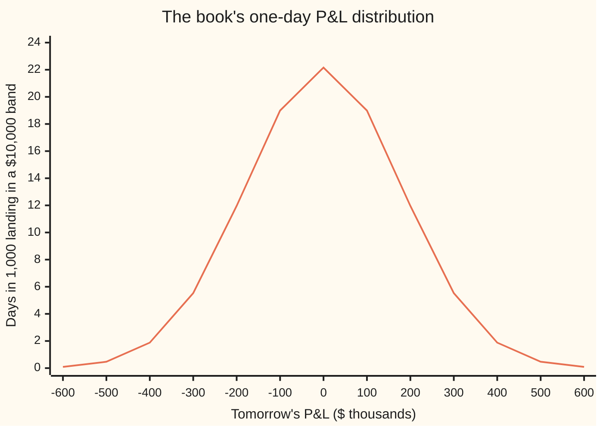

# Value at risk: the loss you exceed one day in a hundred

Financial mathematics → Value at Risk and Expected Shortfall → Loss quantiles → Value at risk

---

## General Overview

A trading desk holds a book: $10 million of shares, $5 million of bonds, and 1,000 Acme calls priced at the house market. Tomorrow the book will be worth more or less than today. The change is the day's **profit and loss**, written P&L: positive on a good day, negative on a bad one.

Nobody knows tomorrow's P&L. The desk's risk model does say how it is spread: centred on zero, with a typical swing, the **standard deviation**, of $180,000. That spread of possible outcomes, each with its chance, is the **P&L distribution**.

Senior managers want one number from it, and they ask a narrow question. How much could the desk lose tomorrow, such that a worse loss happens only one day in a hundred? For this book the answer is **$418,742.62**, about $420,000. That number is the book's **99% one-day value at risk**, VaR for short.

VaR does not say the desk cannot lose more. On about two or three trading days a year it will. It draws a line on the loss axis, and it puts exactly 1% of the chance beyond the line.

**Value at risk at 99% over one day is the loss level that tomorrow's loss stays at or below with 99% chance: a quantile of the loss distribution, and nothing more.**

**What kind of fact this is:** a definition; for a book whose P&L is normal, the formula $-\mu + z\sigma$ is a theorem, proved on this card in Why it works.

### The picture: where the line sits



The one line is the bell curve of tomorrow's P&L: out of 1,000 days, how many land in each $10,000 band. Most days sit near zero. The 99% VaR line sits at a P&L of −$418,742.62, a little left of the −400 tick. The thin sliver of curve to its left holds 1% of all days. VaR marks where that sliver starts; it says nothing about how far the sliver reaches.

---

## The formula

Notation first, in words. Call tomorrow's P&L $X$, in dollars. Call the loss $L$; a loss is P&L with the sign turned round, so $L = -X$, and a $300,000 loss is $L = 300{,}000$. The **confidence level** $\alpha$ (say "alpha") is the chance the line must cover: 0.99 here. $F_L(\ell)$ is the chance that the loss is at most $\ell$, the loss distribution's cumulative chance up to the level $\ell$.

The definition:

$$\text{VaR}_\alpha = \min\{\,\ell : F_L(\ell) \ge \alpha\,\}$$

**Read it aloud:** value at risk is the smallest loss level that tomorrow's loss stays at or below with at least 99% chance.

In words once more: slide a line along the loss axis from the left; stop the first time 99% of the chance lies at or to the left of it.

For a book whose one-day P&L is normal (bell-shaped), with average $\mu$ and standard deviation $\sigma$, the definition becomes one line:

$$\text{VaR}_\alpha = -\mu + z_\alpha\,\sigma, \qquad z_\alpha = N^{-1}(\alpha)$$

**Read it aloud:** go down from the average by the number of standard deviations that leaves 1% of a bell curve behind, and read the answer as a loss.

Over a horizon of $h$ trading days, when days are independent and alike:

$$\text{VaR}_\alpha(h) = -h\mu + z_\alpha\,\sigma\sqrt{h}$$

| Symbol | Plain meaning | In our example | Push it up and VaR… |
| --- | --- | --- | --- |
| $X$ | tomorrow's profit and loss, in dollars; positive is a gain | unknown today | — |
| $L$ | tomorrow's loss, $-X$: a gain counts as a negative loss | unknown today | — |
| $\ell$ | a candidate loss level, a point on the loss axis | $418,742.62 at the answer | — |
| $F_L$ | the chance the loss is at most a given level; climbs from 0 to 1 | $F_L$ = 0.99 at the VaR | — |
| $\alpha$ | the confidence level: the chance the VaR line must cover | 0.99 | rises, slowly at first, then fast near 1 |
| $\text{VaR}_\alpha$ | value at risk at confidence $\alpha$, stated as a positive loss | $418,742.62 | — |
| $\mu$ | average one-day P&L | $0 | falls, dollar for dollar |
| $\sigma$ | standard deviation of one-day P&L: the typical swing | $180,000 | rises in proportion |
| $N$ | the standard bell curve's cumulative chance: area to the left of a point | $N(2.326348) = 0.99$ | — |
| $N^{-1}$ | its inverse, the **normal quantile**: the point with a given area to its left | $N^{-1}(0.99) = 2.326348$ | — |
| $z_\alpha$ | that point for the chosen $\alpha$: how many standard deviations out the line sits | 2.326348 | rises with $\alpha$ |
| $h$ | horizon, in trading days | 1 | rises like $\sqrt{h}$ when $\mu = 0$ |

The words "profit and loss distribution" and "loss distribution" name the same randomness seen from two sides. This card follows the regulators' habit: VaR is quoted as a positive number of dollars that could be lost.

### When it holds

- **The definition holds for any P&L distribution at all.** It needs only chances for tomorrow's outcomes. It is a definition, so it cannot fail; it can only be computed from a wrong distribution.
- **The formula $-\mu + z\sigma$ needs a normal P&L.** A book of shares and bonds is close to normal over one day in calm markets. Real daily returns have fatter tails than the bell curve, so the normal VaR sits too low at high confidence; [extreme-value-theory-and-tails](07-extreme-value-theory-and-tails.md) measures by how much.
- **Options bend the distribution.** The 1,000 Acme calls gain more on up days than they lose on down days, so their P&L is lopsided, not normal. With 1,000 calls in a $15 million book the bend is small; with a large option book it is not, and [delta-gamma-var-and-cornish-fisher](04-delta-gamma-var-and-cornish-fisher.md) handles it.
- **The $\sqrt{h}$ rule needs days that are independent and alike.** Real markets have calm weeks and wild weeks, and wild days cluster. Scaling a calm day by $\sqrt{10}$ understates a ten-day loss that starts in a storm.
- **The book is held fixed over the horizon.** A desk that cuts positions after a bad day loses less than a ten-day VaR says; one that doubles up loses more.

---

## Why it works

### Step 0: a line on the loss axis, with 1% of the chance beyond it

Every question about tomorrow's loss is a question about its distribution. "The loss exceeded one day in a hundred" is a statement about one point on the loss axis: the point with 99% of the chance at or below it and 1% above. A point like that is a **quantile** (the value below which a given share of the chance lies). So VaR is not a new kind of object. It is the 99% quantile of the loss, and every fact about quantiles is a fact about VaR.

### Step 1: the definition always gives exactly one answer

The house convention for any inverse is to settle existence, uniqueness and the edge cases before solving. The inverse here is "find the loss level with chance $\alpha$ below it".

- **Existence.** $F_L$ climbs from 0 far to the left to 1 far to the right, never falls, and at each point includes the chance of landing exactly there. So for any $\alpha$ strictly between 0 and 1, some levels have $F_L(\ell) \ge \alpha$, and among them there is a smallest. The minimum in the definition is attained.
- **Uniqueness.** The minimum of a set is one number, so the definition names one VaR. When $F_L$ is smooth and strictly rising, as for the normal book, the equation $F_L(\ell) = \alpha$ has exactly one root and VaR is that root.
- **Edge case: a jump.** A position that loses $1,000,000 with chance 0.5% and nothing otherwise has $F_L$ jump from 0 to 0.995 at a loss of zero, then to 1 at $1,000,000. No level has $F_L$ exactly 0.99. The definition picks the smallest level that reaches 0.99: zero. Its 99% VaR is **$0**. Its 99.6% VaR is **$1,000,000**.
- **Edge case: a flat stretch.** If no outcome falls between two loss levels, $F_L$ is flat there and several levels reach $\alpha$ at once. The definition takes the leftmost.
- **Edge case: no swing.** If $\sigma = 0$ the loss is certainly $-\mu$, and VaR is $-\mu$ at every $\alpha$; the formula gives the same.
- **Edge case: $\alpha$ near 1.** A normal loss has no worst value, so VaR grows without limit as $\alpha$ approaches 1. At $\alpha = 1$ the definition asks for the worst possible loss, which a normal book does not have.

### Step 2: for a normal book, turn the loss into a standard bell curve

The P&L $X$ is normal with average $\mu$ and standard deviation $\sigma$. Standardise it: $(X - \mu)/\sigma$ is a standard bell curve draw, with average 0 and standard deviation 1. The loss stays at or below $\ell$ exactly when the P&L stays at or above $-\ell$:

$$F_L(\ell) = P(X \ge -\ell) = P\!\left(\frac{X - \mu}{\sigma} \ge \frac{-\ell - \mu}{\sigma}\right) = N\!\left(\frac{\ell + \mu}{\sigma}\right).$$

The last step uses the bell curve's mirror symmetry: the chance of landing above minus 2 equals the chance of landing below 2, and the same for any number.

### Step 3: solve

Set $F_L(\ell) = \alpha$. $N$ is smooth and strictly rising, so it has an inverse, and

$$\frac{\ell + \mu}{\sigma} = N^{-1}(\alpha) = z_\alpha \quad\Longrightarrow\quad \text{VaR}_\alpha = -\mu + z_\alpha\,\sigma.$$

For the book: $z_{0.99} = 2.326348$, so VaR is $2.326348 \times \$180{,}000 = \$418{,}742.62$. The same point read as P&L, the 1% quantile of $X$, is $-\$418{,}742.62$. The two are one line on one axis, named from opposite sides.

### Step 4: stretch the horizon

A ten-day P&L is the sum of ten one-day P&Ls. If the days are independent and alike, the averages add, to $10\mu$, and so do the **variances** (squared standard deviations), to $10\sigma^2$. A sum of independent normal draws is normal. So the ten-day standard deviation is $\sigma\sqrt{10}$, not $10\sigma$, and with $\mu = 0$ the ten-day VaR is the one-day VaR times $\sqrt{10} = 3.162278$: **$1,324,180.42**.

The square root is the heart of the matter. Ten independent days partly cancel each other: a bad Monday is as likely to be followed by a good Tuesday as by a bad one. Swings add in variance, not in size.

<details>
<summary>Detailed proof: variances add, and normal plus normal is normal</summary>

Write the ten days as $X_1, \dots, X_{10}$, independent, each with average $\mu$ and variance $\sigma^2$. The average of a sum is the sum of the averages: $E[\sum X_i] = 10\mu$. For the variance, expand the square of the centred sum: $\text{Var}(\sum X_i) = \sum_i \text{Var}(X_i) + \sum_{i \ne j} \text{Cov}(X_i, X_j)$. Independence makes every covariance (the average product of two centred days) zero, leaving $10\sigma^2$. For normality, use the moment generating function $E[e^{tX}] = e^{\mu t + \sigma^2 t^2/2}$ of a normal draw. For independent draws the function of the sum is the product of the functions, $e^{10\mu t + 10\sigma^2 t^2/2}$, which is the function of a normal with average $10\mu$ and variance $10\sigma^2$. A distribution is fixed by this function where it exists, so the sum is that normal. Step 3 applied to it gives $\text{VaR}_\alpha(h) = -h\mu + z_\alpha \sigma\sqrt{h}$.

</details>

### Step 5: choose the confidence level

$z_\alpha$ climbs slowly through the middle of the bell curve and fast in the tail. Going from 95% to 99% multiplies VaR by 1.41; going from 99% to 99.9% multiplies it by another 1.33, even though it trims the tail by only 0.9 percentage points against the first step's 4. The choice is a policy, not a law: 95% suits a daily report that should be broken a dozen times a year so that people keep watching it; 99% over ten days was the 1996 bank capital standard; 99.9% over a year is the credit capital standard of [vasicek-loss-distribution-and-basel-capital](../45-Portfolio%20Credit%20-%20Correlation%2C%20Copulas%2C%20Indices%20and%20Tranches/03-vasicek-loss-distribution-and-basel-capital.md).

```
VaR by confidence level, one day, each █ = $20,000
  90.0%  ████████████                  $230,679.28
  95.0%  ███████████████               $296,073.65
  97.5%  ██████████████████            $352,793.52
  99.0%  █████████████████████         $418,742.62
  99.5%  ███████████████████████       $463,649.27
  99.9%  ████████████████████████████  $556,241.82
```

### The other roads

Here the P&L distribution arrived as a formula. A desk can also build it from the book's last few hundred days replayed on today's positions, or from thousands of simulated days, and read the quantile off a sorted list: [historical-and-monte-carlo-var](03-historical-and-monte-carlo-var.md). The code below does the simulated version as its third road.

---

## Worked numbers, by hand

The house book: one-day P&L normal, average $\mu = \$0$, standard deviation $\sigma = \$180{,}000$.

| Step | Arithmetic | Value |
| --- | --- | --- |
| confidence level $\alpha$ | one bad day in a hundred | $0.99$ |
| $z_{0.99}$ | normal table: the point with 99% of the area to its left | $2.326348$ |
| **99% one-day VaR** | $-0 + 2.326348 \times 180{,}000$ | **$\$418{,}742.62$** |
| the same line as P&L | $0 - 2.326348 \times 180{,}000$ | $-\$418{,}742.62$ |
| 95% one-day VaR | $1.644854 \times 180{,}000$ | $\$296{,}073.65$ |
| 99% ten-day VaR | $418{,}742.62 \times \sqrt{10} = 418{,}742.62 \times 3.162278$ | $\$1{,}324{,}180.42$ |
| days past the 99% line in a 250-day year | $250 \times 0.01$ | $2.5$ |

The desk should expect its daily loss to beat $418,742.62 on two or three days a year. If it happens on twelve, the model is wrong; counting those days is [backtesting-var](08-backtesting-var.md).

```
99% VaR by horizon, square-root rule, each █ = $100,000
   1 day   ████                    $418,742.62
   5 days  █████████               $936,336.96
  10 days  █████████████           $1,324,180.42
  20 days  ███████████████████     $1,872,673.91
```

Twenty days is twenty times as many days, and only 4.47 times the VaR: the square root at work.

### What breaks if you drop a piece

| Mistake | Comes out at | What went wrong |
| --- | --- | --- |
| 95% multiplier used for a 99% VaR | $296,073.65 | 1.644854 leaves 5% beyond the line, not 1%. The true VaR is 1.41 times the reported one. |
| One-day VaR scaled to ten days by 10 | $4,187,426.17 (right: $1,324,180.42) | Swings add in variance. Ten days scale by $\sqrt{10}$, not 10. |
| Annual standard deviation fed in as daily | $6,647,332.97 | A yearly swing is $\sqrt{252}$ times a daily one. The horizon of $\sigma$ must match the horizon of the VaR. |
| The 1% P&L quantile reported as VaR | −$418,742.62 | Same line, read on the P&L axis. VaR is quoted as a positive loss. |

---

## Code, from first principles, and it actually runs

Both programs reach the 99% one-day VaR three independent ways. Road 1 is the formula, with $z$ found by a bisection root finder (halve an interval until it traps the answer) on a normal cumulative chance built from its power series. Road 2 is the definition itself: bisection on the loss level until the tail area beyond it, integrated from the bell curve by Simpson's rule (a weighted sum over thin slices), equals 1%. Road 3 simulates 1,000,000 days with a random-number generator written in the script, sorts the losses, and takes the smallest one with 99% of the days at or below it. They also add up ten simulated days to test the square-root rule, check the lumpy position's jump, and print every table, bar and chart point on the card.

### Python

```python
# Value at risk from the profit-and-loss distribution -- the check behind the card.
# Standard library only.  Every number quoted on the card is printed here.
# Roads to the 99% one-day VaR of the house book (P&L normal, mean 0, sd $180,000):
#  (1) the formula -mu + z sigma, with z found by bisection on a normal CDF built from its series;
#  (2) the definition: bisection on the tail area, the tail area found by Simpson's rule on the density;
#  (3) 1,000,000 simulated days from our own random numbers, loss quantile by sorting.
from math import sqrt, exp, log, cos, pi

def N(x):                                   # normal CDF from the Taylor series of the error function
    t = x / sqrt(2.0); term = t; s = t; n = 0
    while abs(term) > 1e-17 * max(1.0, abs(s)):
        n += 1; term *= -t * t / n; s += term / (2 * n + 1)
    return 0.5 + s / sqrt(pi)

def bisect(f, lo, hi):                      # f(lo) < 0 < f(hi), f increasing
    for _ in range(200):
        mid = 0.5 * (lo + hi)
        if f(mid) < 0: lo = mid
        else: hi = mid
    return 0.5 * (lo + hi)

def z_of(alpha): return bisect(lambda x: N(x) - alpha, -10.0, 10.0)

def var_formula(mu, sigma, alpha): return -mu + z_of(alpha) * sigma

def tail_area(ell, mu, sigma, n=4000):      # P(loss > ell) = P(P&L < -ell), Simpson on the P&L density
    a, b = mu - 12.0 * sigma, -ell
    h = (b - a) / n
    f = lambda x: exp(-0.5 * ((x - mu) / sigma) ** 2) / (sigma * sqrt(2.0 * pi))
    s = f(a) + f(b) + sum((4 if i % 2 else 2) * f(a + i * h) for i in range(1, n))
    return s * h / 3.0

def var_by_tail(mu, sigma, alpha):
    return bisect(lambda ell: (1.0 - alpha) - tail_area(ell, mu, sigma), -mu - 8 * sigma, -mu + 8 * sigma)

class Rng:                                  # 64-bit linear congruential generator, Box-Muller normals
    def __init__(self, seed): self.x = seed
    def u(self):
        self.x = (6364136223846793005 * self.x + 1442695040888963407) % 2**64
        return ((self.x >> 11) + 0.5) / 2.0**53
    def normal(self): return sqrt(-2.0 * log(self.u())) * cos(2.0 * pi * self.u())

def var_sorted(losses, alpha):              # smallest loss level whose share of days at or below it is >= alpha
    s = sorted(losses); k = int(alpha * len(s) - 1e-6) + 1                # k = alpha n rounded up
    return s[k - 1]

# ---- the house book: $10m shares, $5m bonds, 1,000 Acme calls; one-day P&L normal ----
MU, SIG, A = 0.0, 180000.0, 0.99
z99 = z_of(A)
v1 = var_formula(MU, SIG, A)
v2 = var_by_tail(MU, SIG, A)
rng = Rng(20260928)
days = [-(MU + SIG * rng.normal()) for _ in range(1000000)]     # losses = minus the P&L
v3 = var_sorted(days, A)
dens = exp(-0.5 * z99 * z99) / sqrt(2 * pi) / SIG                # density of the loss at the VaR
se3 = sqrt(A * (1 - A) / len(days)) / dens                       # standard error of a sample quantile
exceed = sum(1 for x in days if x > v1) / len(days)

# ---- ten days: add ten simulated days, against the square-root-of-time rule ----
ten = [-sum(SIG * rng.normal() for _ in range(10)) for _ in range(200000)]
v10_sim, v10_rule = var_sorted(ten, A), v1 * sqrt(10.0)

# ---- a lumpy position: lose $1,000,000 with chance 0.5%, else nothing ----
def var_lumpy(alpha): return 0.0 if alpha <= 0.995 + 1e-12 else 1000000.0
lumpy = [1000000.0 if rng.u() < 0.005 else 0.0 for _ in range(200000)]

rows = [
    ("z, 99%", z99), ("  N(z)", N(z99)),
    ("1 VaR 99% 1-day, formula", v1), ("2 VaR 99% 1-day, tail integral", v2),
    ("3 VaR 99% 1-day, 1e6 sim days", v3), ("  standard error of road 3", se3),
    ("  share of sim days past VaR", exceed), ("  tail area at road-1 VaR", tail_area(v1, MU, SIG)),
    ("  road 1 minus road 3", v1 - v3), ("1% quantile of the P&L", MU - z99 * SIG),
    ("sqrt(10)", sqrt(10.0)), ("sqrt(20)", sqrt(20.0)),
    ("VaR 99% / VaR 95%", v1 / var_formula(MU, SIG, 0.95)),
    ("VaR 99.9% / VaR 99%", var_formula(MU, SIG, 0.999) / v1),
    ("VaR 99% 10-day, sqrt rule", v10_rule), ("VaR 99% 10-day, 2e5 sim paths", v10_sim),
    ("mean loss beyond 99% VaR", SIG * exp(-0.5 * z99 * z99) / sqrt(2 * pi) / (1 - A)),
    ("exceedances per 250 days", 250 * (1 - A)),
    ("lumpy: VaR 99%", var_lumpy(0.99)), ("  sim 99%", var_sorted(lumpy, 0.99)),
    ("lumpy: VaR 99.6%", var_lumpy(0.996)), ("  sim 99.6%", var_sorted(lumpy, 0.996)),
    ("wrong: 95% z used", var_formula(MU, SIG, 0.95)),
    ("wrong: 10-day scaled by 10", 10 * v1),
    ("wrong: annual sd, 1-day z", v1 * sqrt(252.0)),
    ("try: mean +5000 a day", var_formula(5000.0, SIG, A)),
    ("try: sd 90000", var_formula(MU, 90000.0, A)),
    ("try: 99.9% 1-day", var_formula(MU, SIG, 0.999)),
]
for name, v in rows:
    print(f"{name:<32} {v:>16.6f}")

print()
print("VaR by confidence, 1 day")
for a in (0.90, 0.95, 0.975, 0.99, 0.995, 0.999):
    print(f"  {100 * a:5.1f}%  z {z_of(a):.6f}   VaR {var_formula(MU, SIG, a):12.2f}")
print("VaR 99% by horizon, sqrt rule")
for h in (1, 5, 10, 20):
    print(f"  {h:>3} days   VaR {v1 * sqrt(h):12.2f}")
print("chart, P&L ($000)    " + " ".join(f"{x:6d}" for x in range(-600, 601, 100)))
print("chart, days/1000/$10k" + " ".join(
    f"{1000 * 1e4 * exp(-0.5 * (1000 * x / SIG) ** 2) / (SIG * sqrt(2 * pi)):6.2f}" for x in range(-600, 601, 100)))

assert abs(z99 - 2.3263478740) < 1e-9, "z against the printed normal table"
assert abs(v2 - v1) < 1e-4, "tail-integral road vs formula road"
assert abs(v3 - v1) < 4 * se3, "simulated quantile within four standard errors"
assert abs(v10_sim - v10_rule) < 0.01 * v10_rule, "ten summed days vs the square-root rule"
assert abs(var_formula(5000.0, SIG, A) - var_by_tail(5000.0, SIG, A)) < 1e-4, "nonzero mean: formula vs tail integral"
assert all(var_sorted(lumpy, a) == var_lumpy(a) for a in (0.99, 0.996)), "lumpy: both sides of the jump"
print("ALL CHECKS PASS")
```

**Ran 2026-09-28 on macOS, Python 3.14.6, standard library only. All checks passed. Output, pasted from the run:**

```
z, 99%                                   2.326348
  N(z)                                   0.990000
1 VaR 99% 1-day, formula            418742.617327
2 VaR 99% 1-day, tail integral      418742.617328
3 VaR 99% 1-day, 1e6 sim days       418526.991645
  standard error of road 3             671.982527
  share of sim days past VaR             0.009976
  tail area at road-1 VaR                0.010000
  road 1 minus road 3                  215.625683
1% quantile of the P&L             -418742.617327
sqrt(10)                                 3.162278
sqrt(20)                                 4.472136
VaR 99% / VaR 95%                        1.414319
VaR 99.9% / VaR 99%                      1.328362
VaR 99% 10-day, sqrt rule          1324180.424135
VaR 99% 10-day, 2e5 sim paths      1327410.070059
mean loss beyond 99% VaR            479738.559662
exceedances per 250 days                 2.500000
lumpy: VaR 99%                           0.000000
  sim 99%                                0.000000
lumpy: VaR 99.6%                   1000000.000000
  sim 99.6%                        1000000.000000
wrong: 95% z used                   296073.652851
wrong: 10-day scaled by 10         4187426.173273
wrong: annual sd, 1-day z          6647332.972755
try: mean +5000 a day               413742.617327
try: sd 90000                       209371.308664
try: 99.9% 1-day                    556241.815110

VaR by confidence, 1 day
   90.0%  z 1.281552   VaR    230679.28
   95.0%  z 1.644854   VaR    296073.65
   97.5%  z 1.959964   VaR    352793.52
   99.0%  z 2.326348   VaR    418742.62
   99.5%  z 2.575829   VaR    463649.27
   99.9%  z 3.090232   VaR    556241.82
VaR 99% by horizon, sqrt rule
    1 days   VaR    418742.62
    5 days   VaR    936336.96
   10 days   VaR   1324180.42
   20 days   VaR   1872673.91
chart, P&L ($000)      -600   -500   -400   -300   -200   -100      0    100    200    300    400    500    600
chart, days/1000/$10k  0.09   0.47   1.88   5.53  11.96  18.99  22.16  18.99  11.96   5.53   1.88   0.47   0.09
ALL CHECKS PASS
```

The formula and the tail integral agree to a thousandth of a cent. The simulated quantile, $418,526.99, sits $215.63 below them, a third of its standard error of $671.98, and 0.9976% of simulated days broke the formula's line. Two hundred thousand simulated ten-day paths give $1,327,410.07 against the square-root rule's $1,324,180.42.

### Rust

Same roads, same inputs, same generator and seed. No crates.

```rust
// Value at risk from the profit-and-loss distribution -- the same check in Rust.
// Standard library only, no crates.  Same three roads: the formula with z from a
// series-built normal CDF, bisection on a Simpson tail integral, and 1,000,000
// simulated days from the same random-number generator as the Python check.
// Compile: rustc --edition 2021 -O profit_and_loss_distribution_and_var_check.rs
use std::f64::consts::PI;

fn n_cdf(x: f64) -> f64 {                   // normal CDF from the Taylor series of the error function
    let t = x / 2.0_f64.sqrt();
    let (mut term, mut s, mut n) = (t, t, 0.0_f64);
    while term.abs() > 1e-17 * s.abs().max(1.0) {
        n += 1.0;
        term *= -t * t / n;
        s += term / (2.0 * n + 1.0);
    }
    0.5 + s / PI.sqrt()
}

fn bisect<F: Fn(f64) -> f64>(f: F, mut lo: f64, mut hi: f64) -> f64 {
    for _ in 0..200 {
        let mid = 0.5 * (lo + hi);
        if f(mid) < 0.0 { lo = mid; } else { hi = mid; }
    }
    0.5 * (lo + hi)
}

fn z_of(alpha: f64) -> f64 { bisect(|x| n_cdf(x) - alpha, -10.0, 10.0) }

fn var_formula(mu: f64, sigma: f64, alpha: f64) -> f64 { -mu + z_of(alpha) * sigma }

fn tail_area(ell: f64, mu: f64, sigma: f64) -> f64 {   // P(loss > ell), Simpson on the P&L density
    let n = 4000;
    let (a, b) = (mu - 12.0 * sigma, -ell);
    let h = (b - a) / n as f64;
    let f = |x: f64| { let u = (x - mu) / sigma; (-0.5 * u * u).exp() / (sigma * (2.0 * PI).sqrt()) };
    let mut s = f(a) + f(b);
    for i in 1..n { s += if i % 2 == 1 { 4.0 } else { 2.0 } * f(a + i as f64 * h); }
    s * h / 3.0
}

fn var_by_tail(mu: f64, sigma: f64, alpha: f64) -> f64 {
    bisect(|ell| (1.0 - alpha) - tail_area(ell, mu, sigma), -mu - 8.0 * sigma, -mu + 8.0 * sigma)
}

struct Rng { x: u64 }                       // 64-bit linear congruential generator, Box-Muller normals
impl Rng {
    fn u(&mut self) -> f64 {
        self.x = self.x.wrapping_mul(6364136223846793005).wrapping_add(1442695040888963407);
        ((self.x >> 11) as f64 + 0.5) / 9007199254740992.0
    }
    fn normal(&mut self) -> f64 { let r = (-2.0 * self.u().ln()).sqrt(); r * (2.0 * PI * self.u()).cos() }
}

fn var_sorted(losses: &[f64], alpha: f64) -> f64 {     // smallest level with share at or below >= alpha
    let mut s = losses.to_vec();
    s.sort_by(|a, b| a.partial_cmp(b).unwrap());
    let k = (alpha * s.len() as f64 - 1e-6) as usize + 1;
    s[k - 1]
}

fn var_lumpy(alpha: f64) -> f64 { if alpha <= 0.995 + 1e-12 { 0.0 } else { 1000000.0 } }

fn main() {
    let (mu, sig, a) = (0.0_f64, 180000.0_f64, 0.99_f64);
    let z99 = z_of(a);
    let v1 = var_formula(mu, sig, a);
    let v2 = var_by_tail(mu, sig, a);
    let mut rng = Rng { x: 20260928 };
    let days: Vec<f64> = (0..1000000).map(|_| -(mu + sig * rng.normal())).collect();
    let v3 = var_sorted(&days, a);
    let dens = (-0.5 * z99 * z99).exp() / (2.0 * PI).sqrt() / sig;
    let se3 = (a * (1.0 - a) / days.len() as f64).sqrt() / dens;
    let exceed = days.iter().filter(|&&x| x > v1).count() as f64 / days.len() as f64;

    let ten: Vec<f64> = (0..200000).map(|_| -(0..10).map(|_| sig * rng.normal()).sum::<f64>()).collect();
    let (v10_sim, v10_rule) = (var_sorted(&ten, a), v1 * 10.0_f64.sqrt());
    let lumpy: Vec<f64> = (0..200000).map(|_| if rng.u() < 0.005 { 1000000.0 } else { 0.0 }).collect();

    let rows: Vec<(&str, f64)> = vec![
        ("z, 99%", z99), ("  N(z)", n_cdf(z99)),
        ("1 VaR 99% 1-day, formula", v1), ("2 VaR 99% 1-day, tail integral", v2),
        ("3 VaR 99% 1-day, 1e6 sim days", v3), ("  standard error of road 3", se3),
        ("  share of sim days past VaR", exceed), ("  tail area at road-1 VaR", tail_area(v1, mu, sig)),
        ("  road 1 minus road 3", v1 - v3), ("1% quantile of the P&L", mu - z99 * sig),
        ("sqrt(10)", 10.0_f64.sqrt()), ("sqrt(20)", 20.0_f64.sqrt()),
        ("VaR 99% / VaR 95%", v1 / var_formula(mu, sig, 0.95)),
        ("VaR 99.9% / VaR 99%", var_formula(mu, sig, 0.999) / v1),
        ("VaR 99% 10-day, sqrt rule", v10_rule), ("VaR 99% 10-day, 2e5 sim paths", v10_sim),
        ("mean loss beyond 99% VaR", sig * (-0.5 * z99 * z99).exp() / (2.0 * PI).sqrt() / (1.0 - a)),
        ("exceedances per 250 days", 250.0 * (1.0 - a)),
        ("lumpy: VaR 99%", var_lumpy(0.99)), ("  sim 99%", var_sorted(&lumpy, 0.99)),
        ("lumpy: VaR 99.6%", var_lumpy(0.996)), ("  sim 99.6%", var_sorted(&lumpy, 0.996)),
        ("wrong: 95% z used", var_formula(mu, sig, 0.95)),
        ("wrong: 10-day scaled by 10", 10.0 * v1),
        ("wrong: annual sd, 1-day z", v1 * 252.0_f64.sqrt()),
        ("try: mean +5000 a day", var_formula(5000.0, sig, a)),
        ("try: sd 90000", var_formula(mu, 90000.0, a)),
        ("try: 99.9% 1-day", var_formula(mu, sig, 0.999)),
    ];
    for (name, v) in &rows { println!("{:<32} {:>16.6}", name, v); }

    println!();
    println!("VaR by confidence, 1 day");
    for al in [0.90_f64, 0.95, 0.975, 0.99, 0.995, 0.999] {
        println!("  {:5.1}%  z {:.6}   VaR {:12.2}", 100.0 * al, z_of(al), var_formula(mu, sig, al));
    }
    println!("VaR 99% by horizon, sqrt rule");
    for h in [1u32, 5, 10, 20] { println!("  {:>3} days   VaR {:12.2}", h, v1 * (h as f64).sqrt()); }
    let xs: Vec<i32> = (-6..=6).map(|i| 100 * i).collect();
    let head: Vec<String> = xs.iter().map(|x| format!("{:6}", x)).collect();
    println!("chart, P&L ($000)    {}", head.join(" "));
    let vals: Vec<String> = xs.iter().map(|&x| {
        let u = 1000.0 * x as f64 / sig;
        format!("{:6.2}", 1000.0 * 1e4 * (-0.5 * u * u).exp() / (sig * (2.0 * PI).sqrt()))
    }).collect();
    println!("chart, days/1000/$10k{}", vals.join(" "));

    assert!((z99 - 2.3263478740).abs() < 1e-9, "z against the printed normal table");
    assert!((v2 - v1).abs() < 1e-4, "tail-integral road vs formula road");
    assert!((v3 - v1).abs() < 4.0 * se3, "simulated quantile within four standard errors");
    assert!((v10_sim - v10_rule).abs() < 0.01 * v10_rule, "ten summed days vs the square-root rule");
    assert!((var_formula(5000.0, sig, a) - var_by_tail(5000.0, sig, a)).abs() < 1e-4, "nonzero mean: formula vs tail integral");
    assert!([0.99_f64, 0.996].iter().all(|&al| var_sorted(&lumpy, al) == var_lumpy(al)), "lumpy: both sides of the jump");
    println!("ALL CHECKS PASS");
}
```

**Ran 2026-09-28 on macOS, rustc 1.98.1, no crates. All checks passed. Output, pasted from the run:**

```
z, 99%                                   2.326348
  N(z)                                   0.990000
1 VaR 99% 1-day, formula            418742.617327
2 VaR 99% 1-day, tail integral      418742.617328
3 VaR 99% 1-day, 1e6 sim days       418526.991645
  standard error of road 3             671.982527
  share of sim days past VaR             0.009976
  tail area at road-1 VaR                0.010000
  road 1 minus road 3                  215.625683
1% quantile of the P&L             -418742.617327
sqrt(10)                                 3.162278
sqrt(20)                                 4.472136
VaR 99% / VaR 95%                        1.414319
VaR 99.9% / VaR 99%                      1.328362
VaR 99% 10-day, sqrt rule          1324180.424135
VaR 99% 10-day, 2e5 sim paths      1327410.070059
mean loss beyond 99% VaR            479738.559662
exceedances per 250 days                 2.500000
lumpy: VaR 99%                           0.000000
  sim 99%                                0.000000
lumpy: VaR 99.6%                   1000000.000000
  sim 99.6%                        1000000.000000
wrong: 95% z used                   296073.652851
wrong: 10-day scaled by 10         4187426.173273
wrong: annual sd, 1-day z          6647332.972755
try: mean +5000 a day               413742.617327
try: sd 90000                       209371.308664
try: 99.9% 1-day                    556241.815110

VaR by confidence, 1 day
   90.0%  z 1.281552   VaR    230679.28
   95.0%  z 1.644854   VaR    296073.65
   97.5%  z 1.959964   VaR    352793.52
   99.0%  z 2.326348   VaR    418742.62
   99.5%  z 2.575829   VaR    463649.27
   99.9%  z 3.090232   VaR    556241.82
VaR 99% by horizon, sqrt rule
    1 days   VaR    418742.62
    5 days   VaR    936336.96
   10 days   VaR   1324180.42
   20 days   VaR   1872673.91
chart, P&L ($000)      -600   -500   -400   -300   -200   -100      0    100    200    300    400    500    600
chart, days/1000/$10k  0.09   0.47   1.88   5.53  11.96  18.99  22.16  18.99  11.96   5.53   1.88   0.47   0.09
ALL CHECKS PASS
```

The two outputs agree line for line, the simulations included, because both programs draw the same random numbers.

> [!TIP]
> **Try changing**
> Guess first, then run.
> - **Give the book an average profit.** Set the average to +$5,000 a day (the `try: mean +5000` row). Guess: VaR falls by $5,000. It does: **$413,742.62**.
> - **Halve the swing.** Set the standard deviation to $90,000. VaR halves exactly, to **$209,371.31**, because the formula is linear in $\sigma$.
> - **Ask for one day in a thousand.** Set the confidence to 99.9%. VaR rises to **$556,241.82**, 1.33 times as much, for a tenth of the chance.
> - **Change the seed.** Replace 20260928 with any other number. Road 3 moves by a few hundred dollars and stays within four standard errors of road 1; roads 1 and 2 do not move at all.

---

## The usual mistake

> [!warning]
> **Reading VaR as the most the desk can lose.** It is the least the desk loses on its worst day in a hundred, not the most. VaR says where the tail starts and nothing about how long it is. The lumpy position that loses $1,000,000 with chance 0.5% has a 99% VaR of **$0**: a report built on 99% VaR would call it riskless. For the normal book, the average loss on the days that do break the line is $479,738.56, not $418,742.62; that average is the subject of [expected-shortfall-and-coherence](05-expected-shortfall-and-coherence.md).
>
> Smaller traps:
> - **Scaling by the horizon instead of its square root.** Ten days by 10 gives $4,187,426.17; the right figure for independent days is $1,324,180.42.
> - **Mixing confidence levels.** A 95% VaR of $296,073.65 compared with another desk's 99% VaR of $418,742.62 says nothing about which desk is riskier.
> - **Adding desks' VaRs.** The VaR of two books together is not the sum of their VaRs. For books whose joint P&L is normal it is never more, and less unless they move in lockstep; for lumpy books it can be more. Splitting a total fairly among desks is [var-decomposition-euler-and-component-var](06-var-decomposition-euler-and-component-var.md).
> - **Trusting the bell curve far out.** A normal model puts the 99.9% line at $556,241.82. Real markets break that line more often than one day in a thousand.

---

## Where you meet it in real life

- **The daily risk report.** Banks and funds send one VaR figure per desk to senior management each evening, and set **VaR limits**: a desk whose VaR exceeds its limit must cut positions. J.P. Morgan's RiskMetrics service made a 95% one-day version the industry habit in the mid-1990s.
- **Bank capital, 1996 to the 2020s.** The Basel Committee's 1996 market-risk amendment let banks set capital from their own 99% ten-day VaR, multiplied by at least 3. The 2019 revision replaced it with expected shortfall at 97.5%, because VaR ignores the tail's length.
- **Checking the model.** A 99% VaR should be broken about 2.5 times in 250 trading days. Regulators count the breaks and raise the multiplier when there are too many: [backtesting-var](08-backtesting-var.md).
- **Margin at clearing houses.** The collateral a clearing house demands against a portfolio is set near a high quantile of the portfolio's loss over the few days it would take to close it out. Funding that collateral has a cost: [mva](../47-Collateral%2C%20Funding%20and%20the%20Rest%20of%20the%20XVAs/03-mva.md).
- **Credit capital.** A bank's capital against loan losses is a 99.9% one-year quantile of its loan-loss distribution, the same definition on a different distribution: [vasicek-loss-distribution-and-basel-capital](../45-Portfolio%20Credit%20-%20Correlation%2C%20Copulas%2C%20Indices%20and%20Tranches/03-vasicek-loss-distribution-and-basel-capital.md).

Conventions verified 2026-09-28: Basel's 1996 rule (99%, ten days, multiplier at least 3) and its 2019 replacement (expected shortfall at 97.5%) are as stated; national start dates for the 2019 rule differ.

> **Say it back**
> Tomorrow's profit and loss is random, and its distribution says how likely each outcome is. Value at risk at 99% over one day is the loss level that tomorrow's loss stays at or below with 99% chance: the 99% quantile of the loss. For a normal book it is minus the average plus 2.326348 standard deviations, $418,742.62 for the house book. Over $h$ independent days the swing grows like $\sqrt{h}$, not $h$. VaR marks where the worst 1% of days begins and says nothing about how bad they get.

---

## What this builds on

- [normal-quantile](../../09-Probability%20and%20statistics/04-Continuous%20Distributions/05-normal-quantile.md): the inverse of the bell curve's cumulative chance, $N^{-1}$, which turns "99%" into 2.326348 standard deviations.

## Where this goes next

- [parametric-var-and-delta-normal](02-parametric-var-and-delta-normal.md): how a book's standard deviation, taken as given here, is built out of each position's size, each market's swing and how the markets move together.
- [expected-shortfall-and-coherence](05-expected-shortfall-and-coherence.md): the average loss beyond the VaR line, and why regulators moved to it.
- [vasicek-loss-distribution-and-basel-capital](../45-Portfolio%20Credit%20-%20Correlation%2C%20Copulas%2C%20Indices%20and%20Tranches/03-vasicek-loss-distribution-and-basel-capital.md): the same quantile taken on a portfolio of loans, at 99.9% over a year.
- [mva](../47-Collateral%2C%20Funding%20and%20the%20Rest%20of%20the%20XVAs/03-mva.md): margin set from a loss quantile, and what it costs to fund it.

This card took the $180,000 swing as given; the open question is how a desk gets one standard deviation for a book of shares, bonds and options that move together, which parametric VaR answers.

---

## Sources

Verified 2026-09-28: every link below resolves to the publisher's page.

- McNeil, Alexander J., Rüdiger Frey, and Paul Embrechts. *Quantitative Risk Management: Concepts, Techniques and Tools*, revised ed. Princeton University Press, 2015. [Publisher page](https://press.princeton.edu/books/hardcover/9780691166278/quantitative-risk-management). VaR as a quantile of the loss distribution, the generalised inverse used in Step 1, and the normal formula.
- Basel Committee on Banking Supervision. *Amendment to the Capital Accord to Incorporate Market Risks*. Bank for International Settlements, January 1996. [Publisher page](https://www.bis.org/publ/bcbs24.htm). The 99% ten-day VaR standard for bank capital.
- Basel Committee on Banking Supervision. *Minimum Capital Requirements for Market Risk*. Bank for International Settlements, January 2019. [Publisher page](https://www.bis.org/bcbs/publ/d457.htm). The revision that moved bank capital from VaR to expected shortfall.
- Artzner, Philippe, Freddy Delbaen, Jean-Marc Eber, and David Heath. "Coherent Measures of Risk." *Mathematical Finance* 9, no. 3 (1999): 203–228. [doi:10.1111/1467-9965.00068](https://doi.org/10.1111/1467-9965.00068). Why VaR can fail to reward spreading a book across positions.
