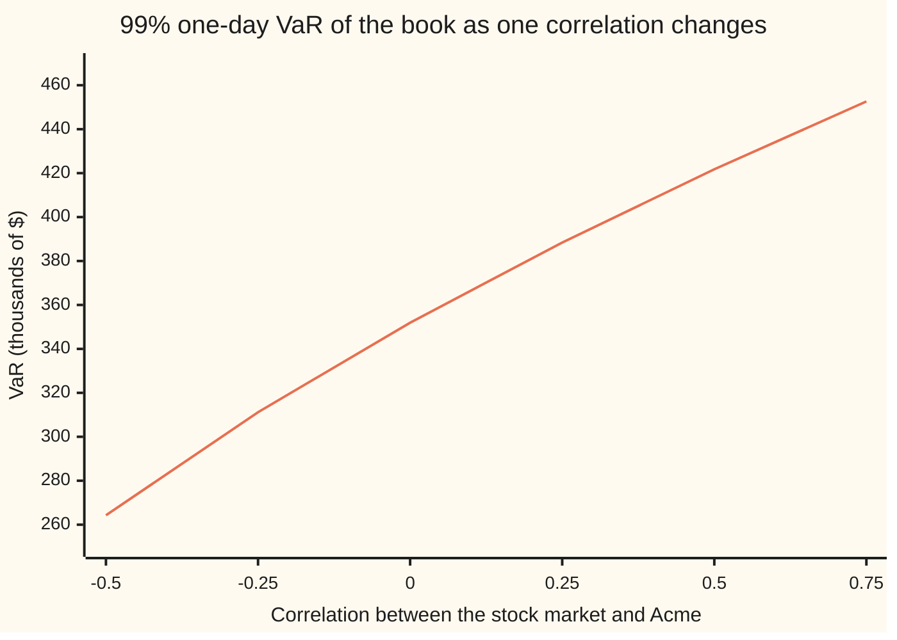

# Parametric VaR: map the book to risk factors, assume normal, and use a covariance matrix

[Syllabus](../../../SYLLABUS.md) → [Financial mathematics](../README.md) → [Value at Risk and Expected Shortfall](../README.md#s39) → Parametric VaR

---

## General Overview

A trading book holds three things at the close on a Monday. There are $10,000,000 of shares, spread across the stock market. There is a $5,000,000 government bond. And there are 1,000 Acme call contracts, each on 100 Acme shares, priced in the house market: Acme at $100, strike $100, one year left, worth $9.23 a share, so $922,700.55 for the lot.

The risk manager needs one number by Tuesday morning: the loss the book should exceed on only one day in a hundred. That number is the **value at risk**, VaR for short, defined on [Value at risk](01-profit-and-loss-distribution-and-var.md). That card took the book's daily profit and loss as a bell curve with an assumed spread of $180,000 and read off about $420,000. This card builds the spread from the parts, and gets $181,290.28.

Three moves do it. First, **map** each position to a few market quantities that drive it, called **risk factors**: the stock market's return, Acme's return, and the five-year bond yield. Second, **assume** those daily moves follow a joint bell curve, the multivariate normal. Third, combine the positions' sizes with a table of how the factors wiggle and move together, the **covariance matrix**, to get the spread of the whole book's profit and loss. Multiply by 2.33 and the answer is $421,744. The same arithmetic splits that number by position: the shares carry 69.40 percent of it, the calls 31.48 percent, and the bond takes 0.89 percent off.

The method goes by three names: parametric VaR (it needs only parameters, no history replayed), variance-covariance VaR, and delta-normal VaR (options enter through their delta, and moves are normal).

**Turn every position into dollars per unit move of a risk factor, and the book's one-day loss is a bell curve whose spread is the square root of exposures times covariance matrix times exposures; the 1 percent loss is 2.33 of those spreads.**

**What kind of fact this is:** a method resting on a model. The algebra from assumptions to answer is exact and proved in Why it works; the assumptions (straight-line P&L, normal moves, a known covariance matrix) are a model of markets, not a law.

### The picture: how much the answer leans on one correlation

Every input except one is held fixed. The correlation between the stock market and Acme, 0.5 in the book, slides from −0.5 to 0.75.



The single line is the book's VaR in thousands of dollars. At 0.5 it is $421,740, the book's answer. If the two equity positions moved independently it would be $351,920. At −0.5, where the two tend to move in opposite directions, it falls to $264,260. The positions have not changed; only how they move together has. That is why the covariance matrix, not a list of separate risks, is the heart of the method.

---

## The formula

Notation first, in words. A list of numbers written in a column, such as the book's three exposures, is a **vector**, named by one letter, $w$. A square table of numbers is a **matrix**, here $\Sigma$ (capital sigma). The expression $w^\top \Sigma w$ means: multiply every entry of the matrix by the exposure of its row and the exposure of its column, then add all nine products. The small raised T ("transpose") marks the first $w$ as laid on its side as a row.

$$\text{VaR}_{99\%} \;=\; z\,\sigma_P, \qquad \sigma_P \;=\; \sqrt{w^\top \Sigma\, w} \;=\; \sqrt{\sum_{i}\sum_{j} w_i\, w_j\, \rho_{ij}\, \sigma_i\, \sigma_j}$$

**Read it aloud:** the one-day loss beaten only one day in a hundred is 2.33 times the spread of the book's profit and loss, and that spread squared is every pair of exposures multiplied together, weighted by how much the two factors wiggle and how closely they move.

| Symbol | Plain meaning | In our example | Push it up and the answer… |
| --- | --- | --- | --- |
| $w_i$, for factor $i$ = 1, 2, 3 | the **exposure** to factor $i$: dollars gained per unit move of that factor | shares 10,000,000; calls 5,868,511.46; bond −2,500 per basis point | rises, if the factor moves with the rest of the book |
| $w$ | the three exposures as one column | as above | |
| $x_i$ | factor $i$'s move over one day: a return, or a yield change in basis points (hundredths of a percent) | | |
| $\sigma_i$ | factor $i$'s daily **volatility**: the spread of $x_i$ | 1.35%, 1.2599%, 6 bp | rises |
| $\rho_{ij}$, for factors $i$ and $j$ | the **correlation** of factors $i$ and $j$, between −1 and 1 | 0.5, 0.2, 0.1 | rises when both exposures push the same way |
| $\Sigma$ | the **covariance matrix**; entry $\Sigma_{ij} = \rho_{ij}\sigma_i\sigma_j$ | printed by the checks | |
| $\sigma_P$ | the spread (standard deviation) of the book's one-day P&L | $181,290.28 | rises, one for one |
| $z$ | the bell-curve point with 99% of the area to its left: $N(z) = 0.99$ | 2.326348 | rises with the confidence level |
| $N(\cdot)$ | the normal CDF: bell-curve area left of a point | $N(0.25) = 0.5987$ | |
| $\Delta$ | the call's **delta**: dollars the option gains per dollar on Acme, $e^{-qT}N(d_1)$ | 0.586851 | more Acme exposure |
| $D_{\text{mod}}$ | the bond's **modified duration**: percent it loses per one-point rise in yield | 5 | more yield exposure |
| $\Delta V$ | the book's profit or loss over one day | | |
| $L$ | the **Cholesky factor**: a lower-triangular matrix with $LL^\top = \Sigma$ | used by the checks' second road | |

Delta, $d_1 = 0.25$ and the house inputs $S, K, r, q, \sigma, T$ are as on [Black–Scholes call](../08-The%20Black-Scholes%20call%20and%20put/01-black-scholes-call.md).

Two helper lines do the mapping:

$$\Delta V \;\approx\; w_1 x_1 + w_2 x_2 + w_3 x_3, \qquad w_2 = n\,m\,S\,\Delta, \qquad w_3 = -\,D_{\text{mod}} \times B \times 0.0001$$

In words: the book's P&L is each exposure times its factor's move. The calls' exposure is contracts $n = 1{,}000$ times shares per contract $m = 100$ times Acme's price times delta. The bond's is minus duration times the bond's value $B = \$5{,}000{,}000$ times one basis point: its **PV01**, the dollars lost when the yield rises by 0.01 percent.

### When it holds

- **P&L is a straight line in the factors.** True for shares, close for a bond over one day, wrong for options on big moves: a long call loses less than delta says when Acme falls, so the method overstates this book's loss; [Options in the book](04-delta-gamma-var-and-cornish-fisher.md) adds the curve.
- **Daily factor moves are jointly normal.** Real returns have fatter tails, so the true 1-in-100 loss is usually larger than 2.33 spreads; [Extreme value theory](07-extreme-value-theory-and-tails.md) measures by how much.
- **The covariance matrix is known and stays put.** It is estimated from the past, and correlations rise in a crash: moving one correlation from 0.5 to 0.75 lifts VaR from $421,740 to $452,630.
- **The expected move over one day is zero.** Over a day the drift is tiny beside the spread; over a year it is not, and the mean must be added back.
- **The positions stay fixed over the horizon.** Scaling to 10 days by the square root of 10 also needs days that are independent of each other.

---

## Why it works

### Step 0: one bell curve for the whole book

A sum of moves that are jointly normal is itself normal ([Multivariate normal](../../09-Probability%20and%20statistics/05-Transformations%20and%20Joint%20Laws/06-multivariate-normal.md)). So if the book's P&L is a weighted sum of the three factor moves, it is one bell curve. A bell curve centred at zero is fixed by one number, its spread. Find the spread and the 1 percent loss follows. Everything below is finding the spread.

### Step 1: map every position to exposures

Each position's one-day change is written, to first order, as a fixed dollar amount times a factor's move. This is **mapping**.

- **Shares.** $10,000,000 of shares gain $10,000,000 times the market's return. Exposure $10,000,000.
- **Calls.** A small move in Acme changes each call's value by delta times the move. With delta 0.586851, the 1,000 contracts of 100 shares each act like 58,685.11 Acme shares, worth $5,868,511.46. That, not the $922,700.55 they cost, is the exposure to Acme's return.
- **Bond.** A bond's price falls by about its modified duration times the yield rise. A rise of one basis point costs 5 × $5,000,000 × 0.0001 = $2,500. Exposure −$2,500 per basis point: negative, since the bond loses when yields rise.

Three positions have become three numbers, in dollars per unit move. A book of ten thousand trades maps the same way onto a few hundred factors; the rest of the method never sees the trades.

### Step 2: the spread of a weighted sum

The P&L is $\Delta V = w_1 x_1 + w_2 x_2 + w_3 x_3$. Its variance (spread squared) is the average of $\Delta V$ squared, since its mean is zero. Squaring a sum of three terms gives nine products, $w_i w_j x_i x_j$. Averaging each product gives $w_i w_j$ times the average of $x_i x_j$, and that average is the covariance, $\rho_{ij}\sigma_i\sigma_j$. Add the nine: $\sigma_P^2 = w^\top\Sigma w$.

The three squares are each position's own risk. The six cross terms, in three equal pairs, are where diversification lives: a positive correlation between exposures of the same sign adds, a negative one subtracts. The bond's exposure is negative and its correlation with shares positive, so its cross terms subtract: the bond is a small hedge.

<details>
<summary>Detailed proof: the variance and the normal shape</summary>

**Variance.** Let $\Delta V = \sum_i w_i x_i$ with each $x_i$ of mean zero. Then
$$\operatorname{Var}(\Delta V) = \mathbb{E}\Big[\Big(\sum_i w_i x_i\Big)\Big(\sum_j w_j x_j\Big)\Big] = \sum_i\sum_j w_i w_j\,\mathbb{E}[x_i x_j] = \sum_i\sum_j w_i w_j\,\Sigma_{ij}.$$
The middle step is the linearity of expectation: the average of a sum is the sum of the averages, and fixed numbers come outside. Nothing here needs normality; the variance formula holds for any factor law with finite variances.

**Shape.** Normality enters only to turn a spread into a quantile. Write the factor moves as $x = Lg$, where $g = (g_1, g_2, g_3)$ holds three independent standard normals and $L$ is a lower-triangular matrix with $L L^\top = \Sigma$ (the Cholesky factor, which exists when $\Sigma$ is positive definite). Then $\Delta V = w^\top L g = \sum_k b_k g_k$ with $b = L^\top w$. A sum of independent normals is normal with variance $\sum_k b_k^2 = w^\top L L^\top w = w^\top\Sigma w$. So $\Delta V$ is normal with mean zero and spread $\sigma_P$. Since $w^\top\Sigma w$ is a variance, it can never be negative: a table of correlations that makes it negative for some $w$ is not a valid table at all. The checks take this road as their second.

**Quantile.** $P(\Delta V \le -z\sigma_P) = N(-z) = 1 - N(z) = 0.01$ when $N(z) = 0.99$. The loss beaten on 1 day in 100 is $z\sigma_P$.

</details>

### Step 3: from spread to VaR

For a bell curve centred at zero, a loss beyond 2.326348 spreads happens with chance 1 percent. The number 2.326348 is the solution of $N(z) = 0.99$, found in the checks by bisection on a home-built normal CDF. So VaR is 2.326348 times $\sigma_P$. At 95 percent the multiplier would be 1.644854.

### Step 4: splitting the answer by position

Double every position and $\sigma_P$ doubles, so VaR doubles: VaR scales in step with the book. For any such quantity, each position's size times the rate at which VaR changes with it, summed over positions, gives back the total. Here the rate is explicit. Differentiating $z\sqrt{w^\top\Sigma w}$ in $w_i$ gives $z\,(\Sigma w)_i/\sigma_P$, where $(\Sigma w)_i$ is row $i$ of the matrix times the exposures. Multiply by $w_i$ and add: $z\,w^\top\Sigma w/\sigma_P = z\sigma_P$, the VaR. Each term, $w_i\,z\,(\Sigma w)_i/\sigma_P$, is that position's **component VaR**. The general rule, and marginal and incremental VaR, are on [Whose risk is it](06-var-decomposition-euler-and-component-var.md).

A second route skips the matrix: draw many days of factor moves at random, revalue the book on each, and read the 1 percent worst. That is Monte Carlo VaR, on [Historical and Monte Carlo VaR](03-historical-and-monte-carlo-var.md); here it serves as the fourth check.

---

## Worked numbers, by hand

Daily volatilities: shares 1.35 percent; Acme 20 percent a year divided by $\sqrt{252}$, for 252 trading days a year, 1.2599 percent; the five-year yield 6 basis points. Correlations: shares and Acme 0.5, shares and the yield 0.2, Acme and the yield 0.1. Each exposure times its volatility is a **dollar volatility**, the one-day spread of that position alone.

| Step | Arithmetic | Value |
| --- | --- | --- |
| call delta | $e^{-0.02} \times N(0.25)$, as on the Black-Scholes card | 0.586851 |
| calls' Acme exposure | 1,000 × 100 × $100 × 0.586851 | $5,868,511.46 |
| bond PV01 | 5 × $5,000,000 × 0.0001 | $2,500 per bp |
| dollar vol, shares | $10,000,000 × 0.0135 | $135,000.00 |
| dollar vol, calls | $5,868,511.46 × 0.012599 | $73,936.29 |
| dollar vol, bond | −$2,500 × 6 | −$15,000.00 |
| shares squared | 135,000 × 135,000 | 18,225,000,000 |
| calls squared | 73,936.29 × 73,936.29 | 5,466,575,678 |
| bond squared | 15,000 × 15,000 | 225,000,000 |
| shares with calls | 2 × 0.5 × 135,000 × 73,936.29 | 9,981,399,788 |
| shares with bond | 2 × 0.2 × 135,000 × (−15,000) | −810,000,000 |
| calls with bond | 2 × 0.1 × 73,936.29 × (−15,000) | −221,808,884 |
| $\sigma_P$ | square root of the sum of the six rows | $181,290.28 |
| **VaR, 99%, one day** | 2.326348 × 181,290.28 | **$421,744.26** |

On one trading day in a hundred, the book should lose more than $421,744: the $420,000 of [Value at risk](01-profit-and-loss-distribution-and-var.md), now built from its parts.

Split by position, with each component being exposure × z × (row of $\Sigma$ times exposures) ÷ $\sigma_P$:

| Position | Standalone VaR | Component VaR | Share of the total |
| --- | --- | --- | --- |
| shares | $314,056.96 | $292,710.80 | 69.40% |
| calls | $172,001.54 | $132,766.40 | 31.48% |
| bond | $34,895.22 | −$3,732.94 | −0.89% |
| **total** | $520,953.72 | **$421,744.26** | 100% |

The standalone numbers are each position's VaR as if it were the whole book. They sum to far more than the total, because the three do not all fall on the same day. The component numbers sum to the total exactly. The bond's is negative: adding a little more bond would lower the book's VaR.

```
99% one-day VaR by position, one block = $10,000
shares      standalone  ███████████████████████████████    $314,057
            component   █████████████████████████████      $292,711
calls       standalone  █████████████████                  $172,002
            component   █████████████                      $132,766
bond        standalone  ███                                $34,895
            component                                      -$3,733 (a hedge)
```

### What breaks if you drop a piece

Correct answer $421,744.26.

| Mistake | Comes out at | What went wrong |
| --- | --- | --- |
| Add the three standalone VaRs | $520,953.72 | Assumes every position loses its 1-in-100 amount on the same day: the three positions' P&Ls perfectly correlated |
| Set all correlations to zero | $359,769.35 | Drops the six cross terms; shares and calls both ride the stock market |
| Map the calls at their premium, $922,700.55 | $323,267.20 | An option's value moves by delta times the stock move, not by its own price times Acme's return |
| Use annual volatilities | $6,694,982.63 | A one-year VaR, √252 times too big for a one-day question |
| Use 1.644854 and call it 99% | $298,195.98 | That is the 95 percent VaR: one day in twenty, not one in a hundred |

Every number in both tables is printed by the checks below.

---

## Code, from first principles, and it actually runs

The scripts map the book, build the covariance matrix and reach the VaR by four roads: the quadratic form $w^\top\Sigma w$; the Cholesky factor, turning the three linked moves into independent ones; the table of dollar volatilities and correlations used by hand above; and 100,000 simulated days of factor moves, drawn with a home-made random number generator through the Cholesky factor, reading the 1,000th-worst. The first three share no arithmetic past the inputs. The call's price is checked against the house market, and its delta against a second road: bumping Acme by one cent and repricing. The component VaRs are then checked against a second road, bumping each position up and down by 0.01 percent and measuring how VaR moves. The normal CDF is Simpson's rule on the bell curve; the 99 percent point is found by bisection. The simulated answer, $418,809.31, sits just below the exact one; the gap is sampling noise, and the assert allows 2 percent.

### Python

```python
# Parametric (delta-normal) VaR -- the check behind the card.  Nothing imported
# but math's exp, log, sqrt, cos, pi.  The book: 10,000,000 of shares, a
# 5,000,000 bond, 1,000 Acme call contracts on 100 shares each.  One day, 99%.
from math import exp, log, sqrt, cos, pi

def N(x):                                   # normal CDF: Simpson on the bell curve
    n, a = 2000, abs(x)
    h = a / n
    f = lambda t: exp(-0.5 * t * t) / sqrt(2 * pi)
    s = f(0) + f(a) + sum((4 if i % 2 else 2) * f(i * h) for i in range(1, n))
    half = s * h / 3
    return 0.5 + half if x >= 0 else 0.5 - half

def inv_N(p):                               # bisection: the z with N(z) = p
    lo, hi = -10.0, 10.0
    for _ in range(100):
        mid = 0.5 * (lo + hi)
        lo, hi = (mid, hi) if N(mid) < p else (lo, mid)
    return 0.5 * (lo + hi)

# ---- mapping: each position becomes dollars per unit move of a risk factor ----
S, K, r, q, sig, T = 100.0, 100.0, 0.05, 0.02, 0.20, 1.0
d1 = (log(S / K) + (r - q + 0.5 * sig * sig) * T) / (sig * sqrt(T))
delta = exp(-q * T) * N(d1)
def bs_call(s0):                            # Black-Scholes call at spot s0
    d = (log(s0 / K) + (r - q + 0.5 * sig * sig) * T) / (sig * sqrt(T))
    return s0 * exp(-q * T) * N(d) - K * exp(-r * T) * N(d - sig * sqrt(T))
call, delta_fd = bs_call(S), (bs_call(S + 0.01) - bs_call(S - 0.01)) / 0.02
pv01 = 5_000_000 * 5.0 * 0.0001             # bond: value x duration x 1 basis point
w = [10_000_000.0, 1000 * 100 * S * delta, -pv01]   # $ per 1.00 return, 1.00 return, 1 bp
vol = [0.0135, sig / sqrt(252), 6.0]        # daily: shares, Acme, 5-year yield in bp
rho = [[1.0, 0.5, 0.2], [0.5, 1.0, 0.1], [0.2, 0.1, 1.0]]
z99, z95 = inv_N(0.99), inv_N(0.95)

def cov(rh):
    return [[rh[i][j] * vol[i] * vol[j] for j in range(3)] for i in range(3)]

def var_quad(w, C):                         # road 1: z * sqrt(w' C w)
    return z99 * sqrt(sum(w[i] * C[i][j] * w[j] for i in range(3) for j in range(3)))

C = cov(rho)
V1 = var_quad(w, C)

# ---- road 2: Cholesky, C = L L', so the P&L is a sum of independent moves ----
L = [[0.0] * 3 for _ in range(3)]
for i in range(3):
    for j in range(i + 1):
        s = C[i][j] - sum(L[i][k] * L[j][k] for k in range(j))
        L[i][j] = sqrt(s) if i == j else s / L[j][j]
b = [sum(w[i] * L[i][k] for i in range(3)) for k in range(3)]   # $ per independent shock
V2 = z99 * sqrt(sum(x * x for x in b))

# ---- road 3: dollar volatilities and correlations, the hand table ----
s_d = [w[i] * vol[i] for i in range(3)]
terms = [(i, j, rho[i][j] * s_d[i] * s_d[j] * (1 if i == j else 2)) for i in range(3) for j in range(i, 3)]
V3 = z99 * sqrt(sum(t for _, _, t in terms))

# ---- road 4: simulate 100,000 days, own random numbers, read the 1% tail ----
state = 20260928
def u01():                                  # splitmix64 -> uniform in (0,1)
    global state
    state = (state + 0x9E3779B97F4A7C15) & 0xFFFFFFFFFFFFFFFF
    x = state
    x = ((x ^ (x >> 30)) * 0xBF58476D1CE4E5B9) & 0xFFFFFFFFFFFFFFFF
    x = ((x ^ (x >> 27)) * 0x94D049BB133111EB) & 0xFFFFFFFFFFFFFFFF
    x ^= x >> 31
    return ((x >> 11) + 0.5) / 9007199254740992.0
n = 100_000
pnl = []
for _ in range(n):
    g = []
    while len(g) < 3:                       # Box-Muller: two uniforms -> two normals
        rad, ang = sqrt(-2.0 * log(u01())), 2.0 * pi * u01()
        g += [rad * cos(ang), rad * cos(ang - 0.5 * pi)]
    pnl.append(sum(w[i] * sum(L[i][k] * g[k] for k in range(3)) for i in range(3)))
pnl.sort()
V4 = -pnl[n // 100 - 1]                     # the 1,000th-worst day

# ---- decomposition: component = position x marginal; marginal by bumping ----
sp = V1 / z99
comp = [z99 * w[i] * sum(C[i][j] * w[j] for j in range(3)) / sp for i in range(3)]
bump = []
for i in range(3):
    up, dn = w[:], w[:]
    up[i] *= 1.0001; dn[i] *= 0.9999
    bump.append((var_quad(up, C) - var_quad(dn, C)) / 0.0002)
alone = [z99 * abs(x) for x in s_d]

# ---- what breaks ----
w_sum = sum(alone)
w_zero = z99 * sqrt(sum(x * x for x in s_d))
w_prem = var_quad([w[0], 1000 * 100 * call, w[2]], C)
w_annual = var_quad(w, [[x * 252 for x in row] for row in C])
w_95 = z95 * sp

names = ["shares", "calls (Acme)", "bond (yield)"]
rows = [("d1", d1), ("call price", call), ("call delta", delta), ("calls' market value", 1000 * 100 * call),
        ("delta, in Acme shares", 1000 * 100 * delta), ("bond PV01 $/bp", pv01), ("Acme daily vol", vol[1]),
        ("z at 99%", z99), ("z at 95%", z95),
        ("exposure shares $/1.00", w[0]), ("exposure calls $/1.00", w[1]), ("exposure bond $/bp", w[2])]
rows += [("dollar vol " + names[i], s_d[i]) for i in range(3)]
rows += [(f"term {i + 1}{j + 1}", t) for i, j, t in terms]
rows += [("portfolio sigma", sp), ("1 VaR, quadratic form", V1), ("2 VaR, Cholesky", V2),
         ("3 VaR, dollar-vol table", V3), ("4 VaR, 100,000 simulated days", V4)]
rows += [("component " + names[i], comp[i]) for i in range(3)]
rows += [("  by bumping " + names[i], bump[i]) for i in range(3)]
rows += [("  percent of VaR " + names[i], 100 * comp[i] / V1) for i in range(3)]
rows += [("standalone " + names[i], alone[i]) for i in range(3)]
rows += [("wrong: add standalone VaRs", w_sum), ("wrong: correlations set to 0", w_zero),
         ("wrong: calls at premium", w_prem),
         ("wrong: annual vols", w_annual), ("wrong: 95% z, called 99%", w_95),
         ("try: 10-day, root-10 rule", V1 * sqrt(10)), ("try: bond doubled", var_quad([w[0], w[1], 2 * w[2]], C)),
         ("try: calls sold, not bought", var_quad([w[0], -w[1], w[2]], C))]
for name, v in rows:
    print(f"{name:<34}{v:>16.{6 if abs(v) < 100 else 2}f}")
for i in range(3):
    print(f"covariance row {i + 1}  " + " ".join(f"{C[i][j]:>14.9f}" for j in range(3)))
print("chart, rho shares-Acme  " + " ".join(f"{x:>7.2f}" for x in (-0.5, -0.25, 0.0, 0.25, 0.5, 0.75)))
pts = []
for x in (-0.5, -0.25, 0.0, 0.25, 0.5, 0.75):
    rh = [row[:] for row in rho]; rh[0][1] = rh[1][0] = x
    pts.append(var_quad(w, cov(rh)) / 1000)
print("chart, VaR in $000      " + " ".join(f"{v:>7.2f}" for v in pts))

assert abs(N(d1) - 0.598706325683) < 1e-9, "own normal CDF vs the pilot's N(0.25)"
assert abs(call - 9.227005508154) < 1e-9, "call price vs the house market"
assert abs(delta_fd - delta) < 1e-6, "delta vs bumping the call's price"
assert abs(V2 - V1) < 1e-6 * V1, "Cholesky road must equal the quadratic form"
assert abs(V3 - V1) < 1e-6 * V1, "hand table road must equal the quadratic form"
assert abs(V4 - V1) < 0.02 * V1, "simulated 1% tail within 2% of the formula"
assert all(abs(comp[i] - bump[i]) < 1e-3 * V1 for i in range(3)), "components vs bumped marginals"
assert abs(sum(bump) - V1) < 1e-4 * V1, "bumped pieces add back to the total (Euler)"
print("ALL CHECKS PASS")
```

**Ran 2026-09-28 on macOS, Python 3.14.6, standard library only. All checks passed. Output, pasted from the run:**

```
d1                                        0.250000
call price                                9.227006
call delta                                0.586851
calls' market value                      922700.55
delta, in Acme shares                     58685.11
bond PV01 $/bp                             2500.00
Acme daily vol                            0.012599
z at 99%                                  2.326348
z at 95%                                  1.644854
exposure shares $/1.00                 10000000.00
exposure calls $/1.00                   5868511.46
exposure bond $/bp                        -2500.00
dollar vol shares                        135000.00
dollar vol calls (Acme)                   73936.29
dollar vol bond (yield)                  -15000.00
term 11                             18225000000.00
term 12                              9981399788.27
term 13                              -810000000.00
term 22                              5466575678.09
term 23                              -221808884.18
term 33                               225000000.00
portfolio sigma                          181290.28
1 VaR, quadratic form                    421744.26
2 VaR, Cholesky                          421744.26
3 VaR, dollar-vol table                  421744.26
4 VaR, 100,000 simulated days            418809.31
component shares                         292710.80
component calls (Acme)                   132766.40
component bond (yield)                    -3732.94
  by bumping shares                      292710.80
  by bumping calls (Acme)                132766.40
  by bumping bond (yield)                 -3732.94
  percent of VaR shares                  69.404808
  percent of VaR calls (Acme)            31.480310
  percent of VaR bond (yield)            -0.885118
standalone shares                        314056.96
standalone calls (Acme)                  172001.54
standalone bond (yield)                   34895.22
wrong: add standalone VaRs               520953.72
wrong: correlations set to 0             359769.35
wrong: calls at premium                  323267.20
wrong: annual vols                      6694982.63
wrong: 95% z, called 99%                 298195.98
try: 10-day, root-10 rule               1333672.46
try: bond doubled                        419448.70
try: calls sold, not bought              268761.00
covariance row 1     0.000182250    0.000085042    0.016200000
covariance row 2     0.000085042    0.000158730    0.007559289
covariance row 3     0.016200000    0.007559289   36.000000000
chart, rho shares-Acme    -0.50   -0.25    0.00    0.25    0.50    0.75
chart, VaR in $000       264.26  311.19  351.92  388.41  421.74  452.63
ALL CHECKS PASS
```

### Rust

```rust
// Parametric (delta-normal) VaR -- the check behind the card, in Rust, std only.
// The book: 10,000,000 of shares, a 5,000,000 bond, 1,000 Acme call contracts
// on 100 shares each.  One day, 99%.  Same roads and labels as the Python.
use std::f64::consts::PI;

fn n_cdf(x: f64) -> f64 { // normal CDF: Simpson on the bell curve
    let (n, a) = (2000, x.abs());
    let h = a / n as f64;
    let f = |t: f64| (-0.5 * t * t).exp() / (2.0 * PI).sqrt();
    let mut s = f(0.0) + f(a);
    for i in 1..n { s += (if i % 2 == 1 { 4.0 } else { 2.0 }) * f(i as f64 * h); }
    let half = s * h / 3.0;
    if x >= 0.0 { 0.5 + half } else { 0.5 - half }
}

fn inv_n(p: f64) -> f64 { // bisection: the z with N(z) = p
    let (mut lo, mut hi) = (-10.0, 10.0);
    for _ in 0..100 {
        let mid = 0.5 * (lo + hi);
        if n_cdf(mid) < p { lo = mid } else { hi = mid }
    }
    0.5 * (lo + hi)
}

type M = [[f64; 3]; 3];

fn cov(rh: &M, vol: &[f64; 3]) -> M {
    let mut c = [[0.0; 3]; 3];
    for i in 0..3 { for j in 0..3 { c[i][j] = rh[i][j] * vol[i] * vol[j]; } }
    c
}

fn var_quad(w: &[f64; 3], c: &M, z: f64) -> f64 { // road 1: z * sqrt(w' C w)
    let mut v = 0.0;
    for i in 0..3 { for j in 0..3 { v += w[i] * c[i][j] * w[j]; } }
    z * v.sqrt()
}

struct Rng(u64);
impl Rng {
    fn u01(&mut self) -> f64 { // splitmix64 -> uniform in (0,1)
        self.0 = self.0.wrapping_add(0x9E3779B97F4A7C15);
        let mut x = self.0;
        x = (x ^ (x >> 30)).wrapping_mul(0xBF58476D1CE4E5B9);
        x = (x ^ (x >> 27)).wrapping_mul(0x94D049BB133111EB);
        x ^= x >> 31;
        ((x >> 11) as f64 + 0.5) / 9007199254740992.0
    }
}

fn main() {
    // ---- mapping: each position becomes dollars per unit move of a risk factor ----
    let (s, k, r, q, sig, t) = (100.0f64, 100.0f64, 0.05, 0.02, 0.20f64, 1.0f64);
    let d1 = ((s / k).ln() + (r - q + 0.5 * sig * sig) * t) / (sig * t.sqrt());
    let delta = (-q * t).exp() * n_cdf(d1);
    let bs_call = |s0: f64| { // Black-Scholes call at spot s0
        let d = ((s0 / k).ln() + (r - q + 0.5 * sig * sig) * t) / (sig * t.sqrt());
        s0 * (-q * t).exp() * n_cdf(d) - k * (-r * t).exp() * n_cdf(d - sig * t.sqrt()) };
    let (call, delta_fd) = (bs_call(s), (bs_call(s + 0.01) - bs_call(s - 0.01)) / 0.02);
    let pv01 = 5_000_000.0 * 5.0 * 0.0001;
    let w = [10_000_000.0, 1000.0 * 100.0 * s * delta, -pv01];
    let vol = [0.0135, sig / 252f64.sqrt(), 6.0];
    let rho: M = [[1.0, 0.5, 0.2], [0.5, 1.0, 0.1], [0.2, 0.1, 1.0]];
    let (z99, z95) = (inv_n(0.99), inv_n(0.95));
    let c = cov(&rho, &vol);
    let v1 = var_quad(&w, &c, z99);

    // ---- road 2: Cholesky, C = L L', so the P&L is a sum of independent moves ----
    let mut l = [[0.0f64; 3]; 3];
    for i in 0..3 {
        for j in 0..=i {
            let mut x = c[i][j];
            for kk in 0..j { x -= l[i][kk] * l[j][kk]; }
            l[i][j] = if i == j { x.sqrt() } else { x / l[j][j] };
        }
    }
    let mut b = [0.0f64; 3];
    for kk in 0..3 { for i in 0..3 { b[kk] += w[i] * l[i][kk]; } }
    let v2 = z99 * b.iter().map(|x| x * x).sum::<f64>().sqrt();

    // ---- road 3: dollar volatilities and correlations, the hand table ----
    let sd: Vec<f64> = (0..3).map(|i| w[i] * vol[i]).collect();
    let mut terms = Vec::new();
    for i in 0..3 { for j in i..3 { terms.push((i, j, rho[i][j] * sd[i] * sd[j] * if i == j { 1.0 } else { 2.0 })); } }
    let v3 = z99 * terms.iter().map(|x| x.2).sum::<f64>().sqrt();

    // ---- road 4: simulate 100,000 days, own random numbers, read the 1% tail ----
    let mut rng = Rng(20260928);
    let n = 100_000usize;
    let mut pnl = Vec::with_capacity(n);
    for _ in 0..n {
        let mut g: Vec<f64> = Vec::new();
        while g.len() < 3 {
            let rad = (-2.0 * rng.u01().ln()).sqrt();
            let ang = 2.0 * PI * rng.u01();
            g.extend([rad * ang.cos(), rad * (ang - 0.5 * PI).cos()]);
        }
        pnl.push((0..3).map(|i| w[i] * (0..3).map(|kk| l[i][kk] * g[kk]).sum::<f64>()).sum::<f64>());
    }
    pnl.sort_by(|a, b| a.partial_cmp(b).unwrap());
    let v4 = -pnl[n / 100 - 1];

    // ---- decomposition: component = position x marginal; marginal by bumping ----
    let sp = v1 / z99;
    let (mut comp, mut bump, mut alone) = ([0.0f64; 3], [0.0f64; 3], [0.0f64; 3]);
    for i in 0..3 {
        let ce: f64 = (0..3).map(|j| c[i][j] * w[j]).sum();
        comp[i] = z99 * w[i] * ce / sp;
        let (mut up, mut dn) = (w, w);
        up[i] *= 1.0001; dn[i] *= 0.9999;
        bump[i] = (var_quad(&up, &c, z99) - var_quad(&dn, &c, z99)) / 0.0002;
        alone[i] = z99 * sd[i].abs();
    }

    // ---- what breaks ----
    let w_sum: f64 = alone.iter().sum();
    let w_zero = z99 * sd.iter().map(|x| x * x).sum::<f64>().sqrt();
    let w_prem = var_quad(&[w[0], 1000.0 * 100.0 * call, w[2]], &c, z99);
    let w_annual = var_quad(&w, &c.map(|row| row.map(|x| x * 252.0)), z99);
    let w_95 = z95 * sp;

    let names = ["shares", "calls (Acme)", "bond (yield)"];
    let mut rows: Vec<(String, f64)> = vec![
        ("d1".into(), d1), ("call price".into(), call), ("call delta".into(), delta),
        ("calls' market value".into(), 1000.0 * 100.0 * call), ("delta, in Acme shares".into(), 1000.0 * 100.0 * delta),
        ("bond PV01 $/bp".into(), pv01), ("Acme daily vol".into(), vol[1]),
        ("z at 99%".into(), z99), ("z at 95%".into(), z95),
        ("exposure shares $/1.00".into(), w[0]), ("exposure calls $/1.00".into(), w[1]), ("exposure bond $/bp".into(), w[2]),
    ];
    for i in 0..3 { rows.push((format!("dollar vol {}", names[i]), sd[i])); }
    for (i, j, x) in &terms { rows.push((format!("term {}{}", i + 1, j + 1), *x)); }
    for (a, x) in [("portfolio sigma", sp), ("1 VaR, quadratic form", v1), ("2 VaR, Cholesky", v2),
                   ("3 VaR, dollar-vol table", v3), ("4 VaR, 100,000 simulated days", v4)] { rows.push((a.into(), x)); }
    for i in 0..3 { rows.push((format!("component {}", names[i]), comp[i])); }
    for i in 0..3 { rows.push((format!("  by bumping {}", names[i]), bump[i])); }
    for i in 0..3 { rows.push((format!("  percent of VaR {}", names[i]), 100.0 * comp[i] / v1)); }
    for i in 0..3 { rows.push((format!("standalone {}", names[i]), alone[i])); }
    for (a, x) in [("wrong: add standalone VaRs", w_sum), ("wrong: correlations set to 0", w_zero),
                   ("wrong: calls at premium", w_prem), ("wrong: annual vols", w_annual), ("wrong: 95% z, called 99%", w_95),
                   ("try: 10-day, root-10 rule", v1 * 10f64.sqrt()),
                   ("try: bond doubled", var_quad(&[w[0], w[1], 2.0 * w[2]], &c, z99)),
                   ("try: calls sold, not bought", var_quad(&[w[0], -w[1], w[2]], &c, z99))] { rows.push((a.into(), x)); }
    for (name, v) in &rows {
        let p = if v.abs() < 100.0 { 6 } else { 2 };
        println!("{:<34}{:>16.*}", name, p, v);
    }
    for i in 0..3 {
        let cells: Vec<String> = (0..3).map(|j| format!("{:>14.9}", c[i][j])).collect();
        println!("covariance row {}  {}", i + 1, cells.join(" "));
    }
    let xs = [-0.5, -0.25, 0.0, 0.25, 0.5, 0.75];
    let head: Vec<String> = xs.iter().map(|x| format!("{:>7.2}", x)).collect();
    println!("chart, rho shares-Acme  {}", head.join(" "));
    let pts: Vec<String> = xs.iter().map(|&x| {
        let mut rh = rho;
        rh[0][1] = x; rh[1][0] = x;
        format!("{:>7.2}", var_quad(&w, &cov(&rh, &vol), z99) / 1000.0)
    }).collect();
    println!("chart, VaR in $000      {}", pts.join(" "));

    assert!((n_cdf(d1) - 0.598706325683).abs() < 1e-9, "own normal CDF vs the pilot's N(0.25)");
    assert!((call - 9.227005508154).abs() < 1e-9, "call price vs the house market");
    assert!((delta_fd - delta).abs() < 1e-6, "delta vs bumping the call's price");
    assert!((v2 - v1).abs() < 1e-6 * v1, "Cholesky road must equal the quadratic form");
    assert!((v3 - v1).abs() < 1e-6 * v1, "hand table road must equal the quadratic form");
    assert!((v4 - v1).abs() < 0.02 * v1, "simulated 1% tail within 2% of the formula");
    assert!((0..3).all(|i| (comp[i] - bump[i]).abs() < 1e-3 * v1), "components vs bumped marginals");
    assert!((bump.iter().sum::<f64>() - v1).abs() < 1e-4 * v1, "bumped pieces add back to the total (Euler)");
    println!("ALL CHECKS PASS");
}
```

**Ran 2026-09-28 on macOS, rustc 1.98.1, no crates. All checks passed. Output, pasted from the run:**

```
d1                                        0.250000
call price                                9.227006
call delta                                0.586851
calls' market value                      922700.55
delta, in Acme shares                     58685.11
bond PV01 $/bp                             2500.00
Acme daily vol                            0.012599
z at 99%                                  2.326348
z at 95%                                  1.644854
exposure shares $/1.00                 10000000.00
exposure calls $/1.00                   5868511.46
exposure bond $/bp                        -2500.00
dollar vol shares                        135000.00
dollar vol calls (Acme)                   73936.29
dollar vol bond (yield)                  -15000.00
term 11                             18225000000.00
term 12                              9981399788.27
term 13                              -810000000.00
term 22                              5466575678.09
term 23                              -221808884.18
term 33                               225000000.00
portfolio sigma                          181290.28
1 VaR, quadratic form                    421744.26
2 VaR, Cholesky                          421744.26
3 VaR, dollar-vol table                  421744.26
4 VaR, 100,000 simulated days            418809.31
component shares                         292710.80
component calls (Acme)                   132766.40
component bond (yield)                    -3732.94
  by bumping shares                      292710.80
  by bumping calls (Acme)                132766.40
  by bumping bond (yield)                 -3732.94
  percent of VaR shares                  69.404808
  percent of VaR calls (Acme)            31.480310
  percent of VaR bond (yield)            -0.885118
standalone shares                        314056.96
standalone calls (Acme)                  172001.54
standalone bond (yield)                   34895.22
wrong: add standalone VaRs               520953.72
wrong: correlations set to 0             359769.35
wrong: calls at premium                  323267.20
wrong: annual vols                      6694982.63
wrong: 95% z, called 99%                 298195.98
try: 10-day, root-10 rule               1333672.46
try: bond doubled                        419448.70
try: calls sold, not bought              268761.00
covariance row 1     0.000182250    0.000085042    0.016200000
covariance row 2     0.000085042    0.000158730    0.007559289
covariance row 3     0.016200000    0.007559289   36.000000000
chart, rho shares-Acme    -0.50   -0.25    0.00    0.25    0.50    0.75
chart, VaR in $000       264.26  311.19  351.92  388.41  421.74  452.63
ALL CHECKS PASS
```

The two outputs are identical line for line. The rows headed "term" are the six rows of the hand table, numbered by factor: 1 shares, 2 Acme, 3 the yield.

> [!TIP]
> **Try changing**
> - **Ask for ten days.** Guess first: ten times the one-day VaR? Scale by the square root of 10 instead, since independent daily spreads add in variance: $1,333,672.46. The answer is a rule of thumb that ignores the calls' curve and any drift.
> - **Double the bond.** Guess first: more positions, more risk? VaR falls, to $419,448.70, because the bond's component is negative. Change `2 * w[2]` to see it.
> - **Sell the calls instead of buying them.** Flip the sign of the calls' exposure. VaR drops to $268,761.00: short Acme calls now offset the long shares. Delta-normal VaR cannot tell that a short option's worst day is far worse than its delta says.
> - **Raise the shares–Acme correlation to 0.75.** Guess first. VaR climbs to $452,630, the last point on the chart.

---

## The usual mistake

> [!warning]
> **Mapping an option by what it costs instead of by how it moves.** The calls cost $922,700.55, but a 1 percent move in Acme moves them as much as $5,868,511.46 of Acme shares would move. Feed the premium into the matrix and the calls look far smaller than they are: VaR comes out at $323,267.20 instead of $421,744.26. Options are leveraged; the exposure is delta times the shares they cover, times the price.
>
> - **Adding standalone VaRs.** $520,953.72. It is the answer only if the three positions' P&Ls are perfectly correlated. For normal factors the sum is always at least the true VaR, never less.
> - **Forgetting the cross terms.** Zero correlations give $359,769.35. Shares and calls both ride the stock market; leaving that out hides risk.
> - **Mixing time scales.** Annual volatilities in a one-day formula give $6,694,982.63. Every volatility and correlation must be measured over the horizon the VaR is for.
> - **Getting a sign wrong in the mapping.** The bond gains when yields fall. Enter its PV01 as +$2,500 instead of −$2,500 and the hedge becomes a risk: every road in the checks would agree on the wrong answer, because the error sits in the inputs.

---

## Where you meet it in real life

- **RiskMetrics.** J.P. Morgan published this method in 1994, with daily volatilities and correlations for hundreds of factors, so any bank could map its book and compute VaR the same evening. The 1996 technical document is still the fullest account of the mapping.
- **Trading desk limits.** Banks set a VaR limit for each desk and check it every night. Component VaR tells the desk head which position to cut: here, trimming shares buys the most reduction per dollar ([Whose risk is it](06-var-decomposition-euler-and-component-var.md)).
- **Bank capital rules.** The Basel Committee let banks base market-risk capital on their own VaR models from 1996. Its revised market-risk standard replaced VaR with expected shortfall ([Expected shortfall](05-expected-shortfall-and-coherence.md)), whose normal version uses the same $\sigma_P$.
- **Checking the model.** Every day's actual P&L is compared with the previous evening's VaR; about one exceedance in a hundred days is expected ([Backtesting VaR](08-backtesting-var.md)).

> **Say it back**
> Each position becomes a few exposures: dollars gained per unit move of the stock market, a stock, or a yield, with options entering through delta and bonds through duration. If the factor moves are jointly normal, the book's one-day P&L is normal, and its spread squared is exposures times covariance matrix times exposures. The 99 percent VaR is 2.33 of those spreads: $421,744 for this book. The same formula splits the total by position, and the pieces add back exactly. The method is only as good as its straight-line mapping, its bell-curve tails and its correlations.

---

## What this builds on

- [Value at risk](01-profit-and-loss-distribution-and-var.md): what VaR means, and the quantile of a normal P&L.
- [Multivariate normal](../../09-Probability%20and%20statistics/05-Transformations%20and%20Joint%20Laws/06-multivariate-normal.md): jointly normal moves, their covariance matrix, and why a weighted sum stays normal.

## Where this goes next

- [Historical and Monte Carlo VaR](03-historical-and-monte-carlo-var.md): drops the bell curve, and replays past days or simulates new ones.
- [Whose risk is it](06-var-decomposition-euler-and-component-var.md): component, marginal and incremental VaR for any risk measure that scales with the book.

The covariance matrix gave one answer from two assumptions, straight lines and bell curves; whether the book's own history agrees is the question [Historical and Monte Carlo VaR](03-historical-and-monte-carlo-var.md) answers.

---

## Sources

Verified 2026-09-28: every link below resolves to the publisher's page. Conventions verified 2026-09-28: 252 trading days a year for turning annual volatility into daily; yields quoted and shocked in basis points.

- J.P. Morgan and Reuters. *RiskMetrics Technical Document*, 4th ed., 1996. [PDF hosted by MSCI](https://www.msci.com/documents/10199/5915b101-4206-4ba0-aee2-3449d5c7e95a). The original delta-normal method: cash-flow mapping, delta for options, and the covariance data.
- Hull, John C. *Risk Management and Financial Institutions*, 6th ed. Wiley. [Publisher page](https://www.wiley.com/en-us/Risk+Management+and+Financial+Institutions%2C+6th+Edition-p-9781119932482). The model-building approach to VaR, worked on small portfolios, with bond mapping.
- McNeil, Alexander J., Rüdiger Frey and Paul Embrechts. *Quantitative Risk Management*, revised ed. Princeton University Press. [Publisher page](https://press.princeton.edu/books/hardcover/9780691166278/quantitative-risk-management). Variance-covariance VaR stated precisely, with its assumptions and limits.
- Basel Committee on Banking Supervision. *Minimum capital requirements for market risk*, January 2019. [BIS page](https://www.bis.org/bcbs/publ/d457.htm). The current market-risk standard and its move from VaR to expected shortfall.
