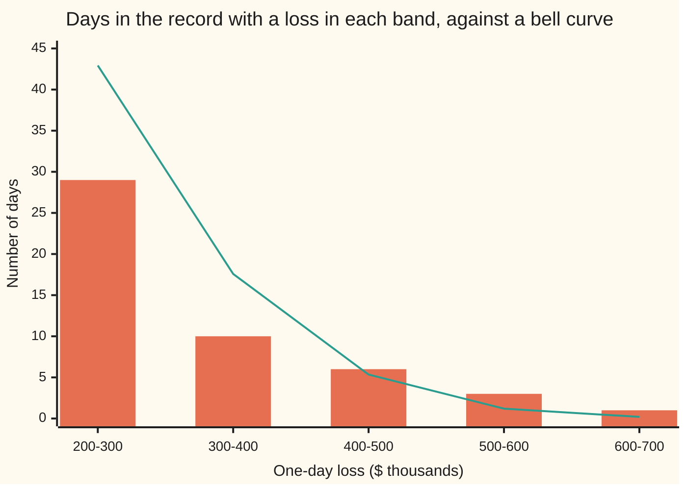

# Historical and Monte Carlo VaR: replay the past, or simulate the future

Financial mathematics → Value at Risk and Expected Shortfall → Scenario-based risk → Historical and Monte Carlo VaR

---

## General Overview

A trading desk holds three things tonight: 100,000 Acme shares at $100 each, $5 million of a bond, and 1,000 Acme call options, each on 100 shares. The risk manager must report one number by morning: the loss the book should exceed on only one day in a hundred. That number is the book's **value at risk**, or VaR ([profit-and-loss-distribution-and-var](01-profit-and-loss-distribution-and-var.md)).

A bell curve fitted to this card's record of the book gives **$421,043.57**, by the method of [parametric-var-and-delta-normal](02-parametric-var-and-delta-normal.md). This card drops the bell curve and asks for the answer two other ways.

**Replay the past.** Take the last 500 trading days. For each, apply that day's moves in Acme's price and the bond's yield to *today's* book, and revalue everything. That gives 500 possible losses for tomorrow. Sort them. The loss that only five days beat is the answer: **$469,042.43**. This is **historical simulation**.

**Simulate the future.** Write down a law for tomorrow's moves, draw 10,000 scenarios from it with a random-number generator, revalue the book in each, sort, and read off the loss that only 100 scenarios beat: **$429,435.78**. This is **Monte Carlo simulation**, named after the casino, because the scenarios come from chance.

Three methods, three numbers, one book. The spread is the lesson. Each method is the same recipe (pick a law for tomorrow, revalue, read off a rank), and the law is where they differ. More scenarios sharpen an answer under a law; they cannot fix the law.

**Both methods estimate VaR by revaluing today's book under many possible tomorrows, sorting the losses, and reading off the one at the 99% rank; historical simulation takes those tomorrows from the past, Monte Carlo takes them from a stated law.**

**What kind of fact this is:** a method, two recipes for estimating a quantile of tomorrow's loss; the error bars on those estimates are theorems about sample quantiles, derived in Why it works.

### The picture: the record's tail against the bell curve's

The 500 days of the record come from a constructed history, built so that its answer is known exactly (the Code section gives the recipe). Bars count the record's days in each band of losses; the line is how many days the parametric bell curve (spread $180,989.08) expects.



Bars: days in the record. Line: days a bell curve with the record's spread expects. Up to $400,000 the bell curve expects *more* bad days than the record had. From $400,000 up it expects fewer: 5.34, 1.20 and 0.20 days where the record has 6, 3 and 1. The record is quieter in the shoulders and wilder in the far tail. The 99% point lives in the far tail, so the replay lands higher than the bell curve.

---

## The formula

Call each possible tomorrow a **scenario**. Scenario $i$ moves Acme's price by a log-move $x_i$ (the natural log of tomorrow's price over today's; for small moves, close to the percent change) and the bond's yield by $y_i$. Write $V(S, y)$ for what today's holdings are worth when Acme trades at $S$ and the yield is $y$. Today's prices are $S_0 = 100$ and $y_0$.

$$L_i = V(S_0,\, y_0) - V\!\left(S_0 e^{x_i},\; y_0 + y_i\right)$$

$$\widehat{\mathrm{VaR}}_\alpha = L_{(k)}, \qquad k = \lceil \alpha n \rceil$$

**Read it aloud:** revalue today's book under each scenario's moves and call the drop in value the loss; sort the losses from smallest to largest; the estimate is the one at position "alpha times n, rounded up".

The hat on $\widehat{\mathrm{VaR}}$ marks an **estimate**: a number computed from scenarios, standing in for the true VaR. The half-brackets $\lceil\ \rceil$ mean "round up to a whole number". The subscript in brackets, $L_{(k)}$, means "the $k$-th smallest", not "the $k$-th in time order".

| Symbol | Plain meaning | In our example | Push it up and the answer… |
| --- | --- | --- | --- |
| $n$ | number of scenarios | 500 days replayed; 10,000 drawn | wobbles less: the error bar shrinks like one over the square root of $n$ |
| $\alpha$ | confidence level: the share of scenarios the VaR must cover | 0.99 | rises: the rank moves further into the tail |
| $i$, $L_i$ | scenario number $i$, and the loss of today's book in it; a gain is a negative loss | day 488 of the record: $469,042.43 | — |
| $k$, $L_{(k)}$ | a rank, and the $k$-th smallest loss, with $k = \lceil \alpha n \rceil$ | $k$ = 495 of 500, or 9,900 of 10,000 | a higher rank reads a bigger loss |
| $x_i$, $S$ | Acme's log-move in scenario $i$; Acme's price | day 488: Acme down 2.536119%; $S_0 = 100$ dollars today | a fall raises the loss on shares and calls |
| $y_i$, $y$, $y_0$ | the change in the bond's yield in scenario $i$; the yield; today's yield | day 488: up 20.800638 basis points (a basis point is 0.01%) | a rise lowers the bond's price and raises the loss |
| $V$ | value of today's holdings at given market prices: calls priced by Black–Scholes, the bond by its duration | calls worth $9.227006 per share today | — |
| $f$, $v$ | the true VaR $v$, and the height $f$ of the loss's probability curve there: how crowded losses are near it | $f$ estimated from the 10,000 draws | a crowded tail pins the rank down: smaller error |
| $\nu$ | tail weight of the Monte Carlo law, said "nu"; smaller means fatter tails | 10 | thinner tails, smaller VaR |
| $\kappa$ | **excess kurtosis**: how much fatter than a bell curve the loss's tails are; 0 for a bell curve | 0.941376 in the record | picks a smaller $\nu$ |
| $z$, $N$ | the bell curve's 99% point, $N^{-1}(0.99)$, where $N$ is the bell curve's area function | 2.326348 | — |
| $F$, $t$, $\delta$ | in the proofs: $F$ gives the chance of a loss at or below a threshold $t$; $\delta$ is a small error in that chance | — | — |

Two helper formulas travel with the main one. The first is the sampling error of a Monte Carlo quantile:

$$\mathrm{SE} \approx \frac{1}{f}\sqrt{\frac{\alpha(1-\alpha)}{n}}$$

In words: the share of draws below the true VaR wobbles by $\sqrt{\alpha(1-\alpha)/n}$, and dividing by $f$ converts a wobble in probability into a wobble in dollars. The second fixes the Monte Carlo law's tail weight from the record, using the fact that a Student-t law with $\nu$ degrees of freedom has excess kurtosis $6/(\nu-4)$ when $\nu > 4$:

$$\nu = 4 + \frac{6}{\kappa}, \quad \text{rounded to a whole number.}$$

A **Student-t law** is a bell curve whose width is itself random: divide a bell-curve draw by the square root of an average of $\nu$ squared bell-curve draws. Occasional narrow averages make occasional huge moves. As $\nu$ grows, it turns back into a bell curve.

### When it holds

- **Historical: the window speaks for tomorrow.** The replay can only return losses the window contains. A calm window before a crisis understates VaR, and no loss larger than the window's worst day can ever appear.
- **Both: scenarios are independent draws from one law.** The error bars below assume this. Real volatility comes in clusters: calm weeks then wild weeks. Clustering makes the true error bar wider than the formula says.
- **Monte Carlo: the law is right.** Draws measure a law; they do not check it. Under a bell-curve law this book's Monte Carlo VaR is $404,789.24; under the record's own law it is $451,631.46. No number of draws closes that gap.
- **Both: full revaluation of today's book.** The calls must be repriced, not approximated by their delta. Skipping it on the replay moves the answer from $469,042.43 to $480,437.83.
- **Both: moves travel together.** Each scenario moves Acme and the yield *jointly*, as one day did. Pairing every Acme day with every yield day instead moves the answer to $487,276.39.

---

## Why it works

### Step 0: every VaR method is one recipe with a different law

VaR is a property of a probability law: the 99% point of tomorrow's loss. No method sees that law. Each one supplies a stand-in and reads the 99% point off it.

- **Parametric** ([parametric-var-and-delta-normal](02-parametric-var-and-delta-normal.md)): the law is a bell curve with the record's spread, and the 99% point comes from a formula.
- **Historical**: the law puts equal weight, 1 in 500, on each of the record's days. Its 99% point is read by sorting.
- **Monte Carlo**: the law is any formula the desk writes down. Its 99% point is estimated by drawing from it and sorting.

So the three answers differ for two reasons only: different laws, and sampling error in the estimate. The rest of this section proves the first recipe is exact for its law and measures the sampling error of each.

### Step 1: sorting reads the replay law's 99% point exactly

Put weight $1/n$ on each of $n$ losses. The chance of a loss at or below a threshold is the count of losses at or below it, divided by $n$. The 99% point is the smallest threshold where that chance reaches 0.99. Counting up the sorted list, the chance first reaches 0.99 at position $\lceil 0.99\,n \rceil$. For 500 days that is position 495, which leaves exactly five days worse.

The check code reaches the same loss by a second road: for each loss, count how many losses are at or below it, and keep the smallest loss whose count reaches 495. No sorting. Both roads return $469,042.43.

<details>
<summary>Detailed proof: the sorted rank is the replay law's quantile, ties included</summary>

Let $F_n(t)$ be the share of the $n$ losses at or below $t$. The lower quantile at level $\alpha$ is the smallest $t$ with $F_n(t) \ge \alpha$. Put $k = \lceil \alpha n \rceil$. For any $t < L_{(k)}$, at most $k-1$ losses are at or below $t$, so $F_n(t) \le (k-1)/n < \alpha$, since $k - 1 < \alpha n$ by the definition of rounding up. At $t = L_{(k)}$, at least $k$ losses are at or below it, so $F_n(t) \ge k/n \ge \alpha$. So $L_{(k)}$ is the smallest qualifying threshold, even when several losses tie with it. The share of losses strictly above it is at most $1 - \alpha$.

</details>

### Step 2: the replay's error bar comes from counting

The record is a sample, so its 495th loss is not the true VaR. How far off can it be? Count the record's days whose loss is at or below the *true* VaR. Each day lands there with chance 0.99, independently, so that count follows a **binomial law**: the law of the number of heads in 500 tosses of a coin that shows heads 99% of the time.

The 489th smallest loss sits at or below the true VaR exactly when at least 489 days do. The 499th sits above it exactly when at most 498 do. So the band from the 489th to the 499th loss contains the true VaR whenever the count lands between 489 and 498. The binomial law gives that a chance of 0.955037.

For this record the band runs from **$386,641.66 to $558,693.91**. That is the honest statement of what 500 days know about the 99% point: a wide range, with the estimate inside it. No bell curve was assumed. The argument used only that the days are independent draws from one law.

### Step 3: the Monte Carlo error bar shrinks like one over the square root of n

Draw $n$ scenarios from a law whose true VaR is $v$. The share of draws landing at or below $v$ averages 0.99 and wobbles with standard deviation $\sqrt{0.99 \times 0.01 / n}$, the usual spread of a proportion. The estimate is where the sorted draws cross 0.99. When the share is off by a small amount $\delta$, the crossing point moves by about $\delta / f$ dollars, because $f$ is the share of draws per dollar near $v$. That gives the SE formula above.

For 10,000 draws from this card's law, the formula gives **$8,122.35**, with $f$ estimated from the share of draws within $20,000 of the answer. Rerunning the whole simulation 20 times with fresh seeds gives a spread of **$10,649.37**. Two roads, the same order of wobble. The reruns ranged from $414,118.06 to $450,472.79.

The square root is the expensive part. Cutting the error in half takes four times the draws. With 1,000 scenarios instead of 10,000 the reruns spread by $26,848.00.

<details>
<summary>The algebra behind the error bar</summary>

Let $F$ be the loss law's cumulative probability and $\hat F_n$ the share of draws at or below a threshold. At the true quantile $v$, $\hat F_n(v)$ is a proportion from $n$ independent trials with success chance $\alpha$, so its standard deviation is $\sqrt{\alpha(1-\alpha)/n}$. The estimate $\hat v$ solves $\hat F_n(\hat v) \approx \alpha$. Near $v$, $F(\hat v) \approx F(v) + f\,(\hat v - v)$, and $\hat F_n$ tracks $F$ up to its own wobble, so $f\,(\hat v - v) \approx \alpha - \hat F_n(v)$. Taking standard deviations gives $\mathrm{SE}(\hat v) \approx \sqrt{\alpha(1-\alpha)/n}\,/\,f$. This is the first-order result for a sample quantile; it assumes $f$ is positive and smooth at $v$.

</details>

### Step 4: the law decides, the draws only measure it

Hold the draws fixed and change the law, and the answer moves by more than any error bar:

```
99% one-day VaR, one block = $5,000, bars start at $380,000
  Monte Carlo, bell-curve law, full revaluation  █████               $404,789.24
  Monte Carlo, bell-curve law, delta P&L         ███████             $416,920.25
  parametric, bell curve by formula              ████████            $421,043.57
  Monte Carlo, Student-t law, nu = 10            ██████████          $429,435.78
  truth: the law that built the record           ██████████████      $451,631.46
  historical replay of 500 days                  ██████████████████  $469,042.43
  Monte Carlo, resampling the record's days      ████████████████████ $479,232.80
```

Read it in pairs.

- **Bell-curve law, delta P&L, against the parametric formula.** $416,920.25 against $421,043.57. Same law, same straight-line approximation of the book; the gap is sampling noise, well inside the normal-law error bar of $6,756.75.
- **Bell-curve law, full revaluation against delta.** Same draws, $404,789.24 against $416,920.25. Long calls lose less than their delta says on a big fall, because their slope flattens as Acme drops. Only revaluation sees it.
- **Student-t against bell curve.** Fatter tails, higher VaR: $429,435.78.
- **Resampling the record against replaying it.** Drawing 10,000 days at random from the 500, with replacement, is Monte Carlo under the replay law ([bootstrap](../../09-Probability%20and%20statistics/07-Sampling%20and%20Estimation/08-bootstrap.md)). It lands on $479,232.80, the record's fifth-worst day, one rank from the replay's answer: same law, so the gap is sampling noise. Resampling can never produce a loss the record lacks.

The record was built from a known law, so the truth is on the chart: $451,631.46, estimated from 200,000 draws. The historical replay overshot it, the Student-t and bell curve undershot it, and it sits inside the replay's band from Step 2. On a real desk nobody sees that bar.

A third road, **filtered historical simulation**, rescales each past day by the ratio of today's volatility to that day's before replaying it. It keeps the record's shapes and updates their size.

---

## Worked numbers, by hand

### The replay: one day, then the rank

Take day 488 of the record. Acme fell 2.536119% and the yield rose 20.800638 basis points. Revalue today's book under those two moves:

| Step | Arithmetic | Value |
| --- | --- | --- |
| shares | 100,000 × Acme's fall of 2.536119% of $100 | −$253,611.94 |
| calls | 100,000 option shares × (Black–Scholes price at the new Acme price − $9.227006) | −$142,628.25 |
| bond | −$5,000,000 × duration 7 × 0.0020800638 | −$72,802.23 |
| loss on day 488 | 253,611.94 + 142,628.25 + 72,802.23, cents rounded | $469,042.43 |
| its rank among the 500 losses | 5 days lose more | 495 |
| **historical VaR** | $L_{(495)}$, since $\lceil 0.99 \times 500 \rceil = 495$ | **$469,042.43** |
| 95% band | $L_{(489)}$ to $L_{(499)}$, chance 0.955037 | $386,641.66 to $558,693.91 |

**Duration** is the bond's price sensitivity: a 1% rise in yield cuts its price by about 7%.

### The comparison: parametric

| Step | Arithmetic | Value |
| --- | --- | --- |
| book's delta to Acme's log-move | $100 × (100,000 shares + 100,000 option shares × call delta 0.586851) | $15,868,511.46 |
| book's delta to the yield | −$5,000,000 × 7 | −$35,000,000.00 |
| spread of one day's P&L | from the record's variances and correlation 0.320005 | $180,989.08 |
| **parametric VaR** | 2.326348 × 180,989.08 | **$421,043.57** |

### The simulation

| Step | Arithmetic | Value |
| --- | --- | --- |
| record's excess kurtosis | average of loss to the fourth ÷ (average of loss squared) squared − 3 | 0.941376 |
| tail weight | 4 + 6 ÷ 0.941376, rounded | 10 |
| scenarios | Student-t moves with the record's spreads and correlation, 10,000 of them | — |
| **Monte Carlo VaR** | $L_{(9900)}$, since $\lceil 0.99 \times 10{,}000 \rceil = 9{,}900$ | **$429,435.78** |
| its error bar | formula, then 20 reruns | $8,122.35; $10,649.37 |

### What breaks if you drop a piece

| Mistake | Comes out at | What went wrong |
| --- | --- | --- |
| Read off the 5th-worst day, $L_{(496)}$ | $479,232.80 (right: $469,042.43) | With 500 days, five must lie *beyond* the VaR; the fifth-worst is the first of them, not the boundary |
| Replay with delta instead of repricing the calls | $480,437.83 (right: $469,042.43) | Long calls lose less than their delta on a big fall; the straight line overstates their loss |
| Pair Acme's moves and the yield's moves apart (all 250,000 pairings) | $487,276.39 (right: $469,042.43) | Yields tended to rise with Acme, so the bond cushioned the shares; pulling the days apart destroys that cushion |
| Run 1,000 scenarios instead of 10,000 | error bar $26,848.00 (right: $10,649.37) | Error grows like one over the square root of the number of draws: a tenth of the draws widens it about $\sqrt{10} \approx 3.2$ times |

---

## Code, from first principles, and it actually runs

The scripts build the record, the book and every estimate from scratch: their own random numbers (a 64-bit generator called splitmix64, identical in both languages), their own bell-curve area (its power series), their own 99% point (bisection), their own Black–Scholes. The record is 500 days drawn from a Student-t law with 6 degrees of freedom, daily Acme spread 1.18%, yield spread 6 basis points, correlation 0.3; the scripts then forget that law and treat the 500 days as history. Roads to the answers: sorting and counting for the historical VaR; the band's chance by recursion and by the binomial formula; covariance formula and the P&L series for the parametric spread; analytic delta and a bumped delta; the Monte Carlo error bar by formula and by 20 reruns; the bell-curve area by series and by Simpson's rule; the house call price; and the record's own law, run with 200,000 draws, against the replay's band.

### Python

```python
# Historical and Monte Carlo VaR -- the check behind the card.  Standard library only.
# Own random numbers (splitmix64), own normal CDF (a series), own inverse (bisection).
from math import log, sqrt, exp, cos, pi

M64 = (1 << 64) - 1
class Rng:                                      # splitmix64: the same stream in Python and Rust
    def __init__(self, seed): self.s = seed
    def u64(self):
        self.s = (self.s + 0x9E3779B97F4A7C15) & M64
        z = ((self.s ^ (self.s >> 30)) * 0xBF58476D1CE4E5B9) & M64
        z = ((z ^ (z >> 27)) * 0x94D049BB133111EB) & M64
        return z ^ (z >> 31)
    def unif(self): return ((self.u64() >> 11) + 0.5) / 9007199254740992.0
    def below(self, n): return self.u64() % n
    def normal(self): return sqrt(-2.0 * log(self.unif())) * cos(2.0 * pi * self.unif())
    def pair(self, rho, nu):                    # two correlated moves; nu > 0 fattens the tails
        z1 = self.normal(); z2 = rho * z1 + sqrt(1.0 - rho * rho) * self.normal()
        f = sqrt((nu - 2) / sum(self.normal() ** 2 for _ in range(nu))) if nu else 1.0
        return z1 * f, z2 * f

def phi(x): return exp(-0.5 * x * x) / sqrt(2.0 * pi)
def Phi(x):                                     # bell-curve area left of x, by its power series
    if abs(x) > 8.0: return 0.0 if x < 0 else 1.0
    term, total, n = x, x, 1
    while abs(term) > 1e-17 * abs(total):
        n += 2; term *= x * x / n; total += term
    return 0.5 + phi(x) * total
def Phi_inv(p):
    lo, hi = -10.0, 10.0
    for _ in range(200):
        mid = 0.5 * (lo + hi)
        lo, hi = (mid, hi) if Phi(mid) < p else (lo, mid)
    return 0.5 * (lo + hi)

S0, K, r, q, vol, T = 100.0, 100.0, 0.05, 0.02, 0.20, 1.0
def call(S):
    d1 = (log(S / K) + (r - q + 0.5 * vol * vol) * T) / (vol * sqrt(T))
    return S * exp(-q * T) * Phi(d1) - K * exp(-r * T) * Phi(d1 - vol * sqrt(T))
C0 = call(S0)
SHARES, OPT_SHARES, BOND, DUR = 100000, 100000, 5e6, 7.0   # 1,000 calls x 100 shares each
def parts(x, y):                                # full revaluation of today's book under one day's moves
    S = S0 * exp(x)
    return SHARES * (S - S0), OPT_SHARES * (call(S) - C0), -BOND * DUR * y
def loss(x, y): return -sum(parts(x, y))
def var(losses):                                # 99%: the ceil(0.99 N)-th smallest loss
    return sorted(losses)[(99 * len(losses) + 99) // 100 - 1]
def sd_of(v): m = sum(v) / len(v); return sqrt(sum((x - m) ** 2 for x in v) / (len(v) - 1))

# ---- the record: 500 constructed days of (Acme log-move, change in bond yield) ----
rec = Rng(558)
days = [(0.0118 * a, 0.0006 * b) for a, b in (rec.pair(0.3, 6) for _ in range(500))]
L = [loss(x, y) for x, y in days]
Ls = sorted(L)
h_var = var(L)
count_road = min(v for v in L if sum(w <= v for w in L) >= 495)    # road 2: count, never sort
day = L.index(h_var)
# distribution-free 95% band: the count of losses at or below the true VaR is Binomial(500, 0.99)
pm = [0.0] * 501; pm[500] = 0.99 ** 500
for k in range(500, 0, -1): pm[k - 1] = pm[k] * k / (501 - k) * 0.01 / 0.99
cover = sum(pm[489:499])
cover_direct = sum(exp(sum(log((501 - j) / j) for j in range(1, k + 1)) + k * log(0.99) + (500 - k) * log(0.01)) for k in range(489, 499))

# ---- parametric: delta-normal from the record's second moments, means taken as zero ----
sxx = sum(x * x for x, _ in days) / 500; syy = sum(y * y for _, y in days) / 500
sxy = sum(x * y for x, y in days) / 500
d1 = (r - q + 0.5 * vol * vol) / vol
ex = S0 * (SHARES + OPT_SHARES * exp(-q * T) * Phi(d1)); ey = -BOND * DUR
bump = (sum(parts(1e-6, 0.0)) - sum(parts(-1e-6, 0.0))) / 2e-6
bump_y = (sum(parts(0.0, 1e-6)) - sum(parts(0.0, -1e-6))) / 2e-6
z = Phi_inv(0.99)
sd = sqrt(ex * ex * sxx + 2 * ex * ey * sxy + ey * ey * syy)
sd_series = sqrt(sum((ex * x + ey * y) ** 2 for x, y in days) / 500)
p_var = z * sd
simpson = 0.5 + sum((1 if i in (0, 400) else 4 if i % 2 else 2) * phi(i / 400) for i in range(401)) / 1200

# ---- Monte Carlo: 10,000 scenarios from a stated law ----
kurt = sum(l ** 4 for l in L) / 500 / (sum(l * l for l in L) / 500) ** 2 - 3
nu = round(4 + 6 / kurt)                        # tail weight matched to the record's kurtosis
sa, sb = sqrt(sxx), sqrt(syy); rho = sxy / (sa * sb)
def draws(seed, n, nu): g = Rng(seed); return [g.pair(rho, nu) for _ in range(n)]
def mc(seed, n, nu): return [loss(sa * a, sb * b) for a, b in draws(seed, n, nu)]
M = mc(1, 10000, nu); m_var = var(M)
f_hat = sum(abs(v - m_var) < 20000 for v in M) / (40000 * 10000)   # loss density near the answer
se_formula = sqrt(0.99 * 0.01 / 10000) / f_hat
reruns = [var(mc(100 + k, 10000, nu)) for k in range(20)]
normal_full = var(mc(8, 10000, 0))
normal_delta = var([-(ex * sa * a + ey * sb * b) for a, b in draws(8, 10000, 0)])
se_normal = sqrt(0.99 * 0.01 / 10000) * sd / phi(z)
g = Rng(9); boot = var([L[g.below(500)] for _ in range(10000)])  # resample whole days
g = Rng(11); truth = var([loss(0.0118 * a, 0.0006 * b) for a, b in (g.pair(0.3, 6) for _ in range(200000))])

# ---- what breaks ----
delta_hist = var([-(ex * x + ey * y) for x, y in days])
eq = [sum(parts(x, 0.0)[:2]) for x, _ in days]; bp = [-BOND * DUR * y for _, y in days]
split = var([-(a + b) for a in eq for b in bp])   # every Acme day paired with every yield day
small = [var(mc(200 + k, 1000, nu)) for k in range(20)]

rows = [("house call price", C0), ("N(1) by series", Phi(1.0)), ("N(1) by Simpson", simpson),
    ("z = N^-1(0.99)", z), ("record: Acme vol, annual", sqrt(sxx * 252)),
    ("record: yield vol, bp per day", sqrt(syy) * 1e4), ("record: correlation", rho),
    ("1 historical VaR, rank 495 of 500", h_var), ("  same, by counting", count_road),
    ("  that day's number", day + 1), ("  its Acme move, percent", 100 * (exp(days[day][0]) - 1)),
    ("  its yield change, bp", 1e4 * days[day][1]), ("  shares P&L", parts(*days[day])[0]),
    ("  calls P&L", parts(*days[day])[1]), ("  bond P&L", parts(*days[day])[2]),
    ("  95% band low, rank 489", Ls[488]), ("  95% band high, rank 499", Ls[498]),
    ("  band coverage", cover),
    ("2 delta, analytic", ex), ("  delta, by bump", bump), ("  call delta e^-qT N(d1)", exp(-q * T) * Phi(d1)),
    ("  delta to the yield", ey), ("  P&L sd, covariance", sd),
    ("  P&L sd, series", sd_series), ("  parametric VaR", p_var),
    ("record: excess kurtosis", kurt), ("MC tail weight nu", nu),
    ("3 Monte Carlo VaR, 10,000", m_var), ("  SE by formula", se_formula),
    ("  20 reruns: mean", sum(reruns) / 20), ("  20 reruns: SE", sd_of(reruns)),
    ("  20 reruns: lowest", min(reruns)), ("  20 reruns: highest", max(reruns)),
    ("  normal law, full revaluation", normal_full), ("  normal law, delta P&L", normal_delta),
    ("  normal law SE", se_normal), ("  resample whole days", boot),
    ("  truth: the record's own law", truth),
    ("wrong: 5th-worst day", Ls[495]), ("wrong: delta, not full revaluation", delta_hist),
    ("wrong: moves paired apart", split), ("wrong: 1,000 scenarios, SE", sd_of(small))]
for name, v in rows: print(f"{name:<36} {v:>18.{2 if abs(v) >= 1000 else 6}f}")
print("tail, losses from $k   200    300    400    500    600")
edges = [200000.0 + 100000.0 * i for i in range(6)]
print("tail, days in record " + "".join(f"{sum(a <= v < b for v in L):>7d}" for a, b in zip(edges, edges[1:])))
print("tail, normal expects " + "".join(f"{500 * (Phi(b / sd) - Phi(a / sd)):>7.2f}" for a, b in zip(edges, edges[1:])))

assert count_road == h_var, "sorting and counting must pick the same day"
assert abs(cover - cover_direct) < 1e-9, "binomial band: recursion vs direct formula"
assert abs(Phi(1.0) - simpson) < 1e-12, "series vs Simpson for the bell-curve area"
assert abs(C0 - 9.227005508154) < 1e-9, "the house call price"
assert abs(bump - ex) < 1e-7 * ex, "delta by bump vs analytic"
assert abs(bump_y - ey) < 1e-7 * abs(ey), "yield delta by bump vs duration"
assert abs(sd - sd_series) < 1e-6 * sd, "covariance formula vs the P&L series"
assert abs(m_var - sum(reruns) / 20) < 3 * sd_of(reruns), "MC answer sits inside its reruns"
assert 0.5 < se_formula / sd_of(reruns) < 2.0, "error bar: formula vs reruns"
assert abs(normal_delta - p_var) < 3 * se_normal, "normal MC lands on the parametric answer"
assert boot in Ls[489:499], "resampling days returns one of the record's own days"
assert Ls[488] <= truth <= Ls[498], "the order-statistic band holds the truth"
assert split > h_var, "pairing days apart removes the bond's cushion"
print("ALL CHECKS PASS")
```

**Ran 2026-09-28 on macOS, Python 3.14.6, standard library only. All checks passed. Output, pasted from the run:**

```
house call price                               9.227006
N(1) by series                                 0.841345
N(1) by Simpson                                0.841345
z = N^-1(0.99)                                 2.326348
record: Acme vol, annual                       0.186357
record: yield vol, bp per day                  5.574516
record: correlation                            0.320005
1 historical VaR, rank 495 of 500             469042.43
  same, by counting                           469042.43
  that day's number                          488.000000
  its Acme move, percent                      -2.536119
  its yield change, bp                        20.800638
  shares P&L                                 -253611.94
  calls P&L                                  -142628.25
  bond P&L                                    -72802.23
  95% band low, rank 489                      386641.66
  95% band high, rank 499                     558693.91
  band coverage                                0.955037
2 delta, analytic                           15868511.46
  delta, by bump                            15868511.46
  call delta e^-qT N(d1)                       0.586851
  delta to the yield                       -35000000.00
  P&L sd, covariance                          180989.08
  P&L sd, series                              180989.08
  parametric VaR                              421043.57
record: excess kurtosis                        0.941376
MC tail weight nu                             10.000000
3 Monte Carlo VaR, 10,000                     429435.78
  SE by formula                                 8122.35
  20 reruns: mean                             430806.74
  20 reruns: SE                                10649.37
  20 reruns: lowest                           414118.06
  20 reruns: highest                          450472.79
  normal law, full revaluation                404789.24
  normal law, delta P&L                       416920.25
  normal law SE                                 6756.75
  resample whole days                         479232.80
  truth: the record's own law                 451631.46
wrong: 5th-worst day                          479232.80
wrong: delta, not full revaluation            480437.83
wrong: moves paired apart                     487276.39
wrong: 1,000 scenarios, SE                     26848.00
tail, losses from $k   200    300    400    500    600
tail, days in record      29     10      6      3      1
tail, normal expects   42.93  17.58   5.34   1.20   0.20
ALL CHECKS PASS
```

### Rust

The same checks with the same random stream. Both languages call the same system routines for logs and cosines, so the two outputs agree to every printed digit.

```rust
// Historical and Monte Carlo VaR -- the same check as historical_and_monte_carlo_var_check.py.
// Standard library only, no crates.  Own random numbers (splitmix64), own normal CDF, own inverse.
// Compile: rustc --edition 2021 -O historical_and_monte_carlo_var_check.rs -o /tmp/hmc_var_check
use std::f64::consts::PI;

struct Rng { s: u64 }
impl Rng {                                      // splitmix64: the same stream as the Python
    fn u64(&mut self) -> u64 {
        self.s = self.s.wrapping_add(0x9E3779B97F4A7C15);
        let mut z = (self.s ^ (self.s >> 30)).wrapping_mul(0xBF58476D1CE4E5B9);
        z = (z ^ (z >> 27)).wrapping_mul(0x94D049BB133111EB);
        z ^ (z >> 31)
    }
    fn unif(&mut self) -> f64 { ((self.u64() >> 11) as f64 + 0.5) / 9007199254740992.0 }
    fn below(&mut self, n: usize) -> usize { (self.u64() % n as u64) as usize }
    fn normal(&mut self) -> f64 {
        let u1 = self.unif(); let u2 = self.unif();
        (-2.0 * u1.ln()).sqrt() * (2.0 * PI * u2).cos()
    }
    fn pair(&mut self, rho: f64, nu: usize) -> (f64, f64) {   // nu > 0 fattens the tails
        let z1 = self.normal(); let z2 = rho * z1 + (1.0 - rho * rho).sqrt() * self.normal();
        if nu == 0 { return (z1, z2); }
        let mut w = 0.0; for _ in 0..nu { let n = self.normal(); w += n * n; }
        let f = ((nu as f64 - 2.0) / w).sqrt();
        (z1 * f, z2 * f)
    }
}
fn phi(x: f64) -> f64 { (-0.5 * x * x).exp() / (2.0 * PI).sqrt() }
fn big_phi(x: f64) -> f64 {                     // bell-curve area left of x, by its power series
    if x.abs() > 8.0 { return if x < 0.0 { 0.0 } else { 1.0 }; }
    let (mut term, mut total, mut n) = (x, x, 1.0);
    while term.abs() > 1e-17 * total.abs() { n += 2.0; term *= x * x / n; total += term; }
    0.5 + phi(x) * total
}
fn phi_inv(p: f64) -> f64 {
    let (mut lo, mut hi) = (-10.0, 10.0);
    for _ in 0..200 { let mid = 0.5 * (lo + hi); if big_phi(mid) < p { lo = mid } else { hi = mid } }
    0.5 * (lo + hi)
}
const S0: f64 = 100.0; const K: f64 = 100.0; const R: f64 = 0.05; const Q: f64 = 0.02;
const VOL: f64 = 0.20; const T: f64 = 1.0;
const SHARES: f64 = 100000.0; const OPT_SHARES: f64 = 100000.0; const BOND: f64 = 5e6; const DUR: f64 = 7.0;
fn call(s: f64) -> f64 {
    let d1 = ((s / K).ln() + (R - Q + 0.5 * VOL * VOL) * T) / (VOL * T.sqrt());
    s * (-Q * T).exp() * big_phi(d1) - K * (-R * T).exp() * big_phi(d1 - VOL * T.sqrt())
}
fn parts(x: f64, y: f64, c0: f64) -> [f64; 3] {  // full revaluation of today's book
    let s = S0 * x.exp();
    [SHARES * (s - S0), OPT_SHARES * (call(s) - c0), -BOND * DUR * y]
}
fn loss(x: f64, y: f64, c0: f64) -> f64 { let p = parts(x, y, c0); -(p[0] + p[1] + p[2]) }
fn sorted(v: &[f64]) -> Vec<f64> { let mut s = v.to_vec(); s.sort_by(|a, b| a.total_cmp(b)); s }
fn var(v: &[f64]) -> f64 { sorted(v)[(99 * v.len() + 99) / 100 - 1] }  // ceil(0.99 N)-th smallest
fn sd_of(v: &[f64]) -> f64 {
    let m = v.iter().sum::<f64>() / v.len() as f64;
    (v.iter().map(|x| (x - m) * (x - m)).sum::<f64>() / (v.len() as f64 - 1.0)).sqrt()
}

fn main() {
    let c0 = call(S0);
    let mut rec = Rng { s: 558 };
    let days: Vec<(f64, f64)> = (0..500).map(|_| { let (a, b) = rec.pair(0.3, 6); (0.0118 * a, 0.0006 * b) }).collect();
    let l: Vec<f64> = days.iter().map(|&(x, y)| loss(x, y, c0)).collect();
    let ls = sorted(&l);
    let h_var = var(&l);
    let count_road = l.iter().cloned().filter(|&v| l.iter().filter(|&&w| w <= v).count() >= 495).fold(f64::INFINITY, f64::min);
    let day = l.iter().position(|&v| v == h_var).unwrap();
    let mut pm = vec![0.0; 501]; pm[500] = 0.99f64.powf(500.0);
    for k in (1..=500).rev() { pm[k - 1] = pm[k] * k as f64 / (501 - k) as f64 * 0.01 / 0.99; }
    let cover: f64 = pm[489..499].iter().sum();
    let cover_direct: f64 = (489..499).map(|k: usize| ((1..=k).map(|j| ((501 - j) as f64 / j as f64).ln()).sum::<f64>() + k as f64 * 0.99f64.ln() + (500 - k) as f64 * 0.01f64.ln()).exp()).sum();

    let sxx = days.iter().map(|d| d.0 * d.0).sum::<f64>() / 500.0;
    let syy = days.iter().map(|d| d.1 * d.1).sum::<f64>() / 500.0;
    let sxy = days.iter().map(|d| d.0 * d.1).sum::<f64>() / 500.0;
    let d1 = (R - Q + 0.5 * VOL * VOL) / VOL;
    let ex = S0 * (SHARES + OPT_SHARES * (-Q * T).exp() * big_phi(d1)); let ey = -BOND * DUR;
    let (pu, pd) = (parts(1e-6, 0.0, c0), parts(-1e-6, 0.0, c0));
    let bump = ((pu[0] + pu[1] + pu[2]) - (pd[0] + pd[1] + pd[2])) / 2e-6;
    let (yu, yd) = (parts(0.0, 1e-6, c0), parts(0.0, -1e-6, c0));
    let bump_y = ((yu[0] + yu[1] + yu[2]) - (yd[0] + yd[1] + yd[2])) / 2e-6;
    let z = phi_inv(0.99);
    let sd = (ex * ex * sxx + 2.0 * ex * ey * sxy + ey * ey * syy).sqrt();
    let sd_series = (days.iter().map(|&(x, y)| (ex * x + ey * y) * (ex * x + ey * y)).sum::<f64>() / 500.0).sqrt();
    let p_var = z * sd;
    let simpson = 0.5 + (0..401).map(|i| (if i == 0 || i == 400 { 1.0 } else if i % 2 == 1 { 4.0 } else { 2.0 }) * phi(i as f64 / 400.0)).sum::<f64>() / 1200.0;

    let kurt = l.iter().map(|v| v * v * v * v).sum::<f64>() / 500.0 / (l.iter().map(|v| v * v).sum::<f64>() / 500.0).powi(2) - 3.0;
    let nu = (4.0 + 6.0 / kurt).round() as usize;
    let (sa, sb) = (sxx.sqrt(), syy.sqrt()); let rho = sxy / (sa * sb);
    let draws = |seed: u64, n: usize, nu: usize| -> Vec<(f64, f64)> { let mut g = Rng { s: seed }; (0..n).map(|_| g.pair(rho, nu)).collect() };
    let mc = |seed: u64, n: usize, nu: usize| -> Vec<f64> { draws(seed, n, nu).iter().map(|&(a, b)| loss(sa * a, sb * b, c0)).collect() };
    let m = mc(1, 10000, nu); let m_var = var(&m);
    let f_hat = m.iter().filter(|&&v| (v - m_var).abs() < 20000.0).count() as f64 / (40000.0 * 10000.0);
    let se_formula = (0.99f64 * 0.01 / 10000.0).sqrt() / f_hat;
    let reruns: Vec<f64> = (0..20).map(|k| var(&mc(100 + k, 10000, nu))).collect();
    let mean_rr = reruns.iter().sum::<f64>() / 20.0;
    let normal_full = var(&mc(8, 10000, 0));
    let normal_delta = var(&draws(8, 10000, 0).iter().map(|&(a, b)| -(ex * sa * a + ey * sb * b)).collect::<Vec<_>>());
    let se_normal = (0.99f64 * 0.01 / 10000.0).sqrt() * sd / phi(z);
    let mut g = Rng { s: 9 }; let boot = var(&(0..10000).map(|_| l[g.below(500)]).collect::<Vec<_>>());
    let mut g = Rng { s: 11 };
    let truth = var(&(0..200000).map(|_| { let (a, b) = g.pair(0.3, 6); loss(0.0118 * a, 0.0006 * b, c0) }).collect::<Vec<_>>());

    let delta_hist = var(&days.iter().map(|&(x, y)| -(ex * x + ey * y)).collect::<Vec<_>>());
    let eq: Vec<f64> = days.iter().map(|&(x, _)| { let p = parts(x, 0.0, c0); p[0] + p[1] }).collect();
    let split = var(&eq.iter().flat_map(|a| days.iter().map(move |&(_, y)| -(a - BOND * DUR * y))).collect::<Vec<_>>());  // every pairing
    let small: Vec<f64> = (0..20).map(|k| var(&mc(200 + k, 1000, nu))).collect();

    let dp = parts(days[day].0, days[day].1, c0);
    let rows: Vec<(&str, f64)> = vec![("house call price", c0), ("N(1) by series", big_phi(1.0)), ("N(1) by Simpson", simpson),
        ("z = N^-1(0.99)", z), ("record: Acme vol, annual", (sxx * 252.0).sqrt()),
        ("record: yield vol, bp per day", syy.sqrt() * 1e4), ("record: correlation", rho),
        ("1 historical VaR, rank 495 of 500", h_var), ("  same, by counting", count_road),
        ("  that day's number", (day + 1) as f64), ("  its Acme move, percent", 100.0 * (days[day].0.exp() - 1.0)),
        ("  its yield change, bp", 1e4 * days[day].1), ("  shares P&L", dp[0]),
        ("  calls P&L", dp[1]), ("  bond P&L", dp[2]),
        ("  95% band low, rank 489", ls[488]), ("  95% band high, rank 499", ls[498]),
        ("  band coverage", cover),
        ("2 delta, analytic", ex), ("  delta, by bump", bump), ("  call delta e^-qT N(d1)", (-Q * T).exp() * big_phi(d1)),
        ("  delta to the yield", ey), ("  P&L sd, covariance", sd),
        ("  P&L sd, series", sd_series), ("  parametric VaR", p_var),
        ("record: excess kurtosis", kurt), ("MC tail weight nu", nu as f64),
        ("3 Monte Carlo VaR, 10,000", m_var), ("  SE by formula", se_formula),
        ("  20 reruns: mean", mean_rr), ("  20 reruns: SE", sd_of(&reruns)),
        ("  20 reruns: lowest", reruns.iter().cloned().fold(f64::INFINITY, f64::min)),
        ("  20 reruns: highest", reruns.iter().cloned().fold(f64::NEG_INFINITY, f64::max)),
        ("  normal law, full revaluation", normal_full), ("  normal law, delta P&L", normal_delta),
        ("  normal law SE", se_normal), ("  resample whole days", boot),
        ("  truth: the record's own law", truth),
        ("wrong: 5th-worst day", ls[495]), ("wrong: delta, not full revaluation", delta_hist),
        ("wrong: moves paired apart", split), ("wrong: 1,000 scenarios, SE", sd_of(&small))];
    for (name, v) in &rows { println!("{:<36} {:>18.*}", name, if v.abs() >= 1000.0 { 2 } else { 6 }, v); }
    println!("tail, losses from $k   200    300    400    500    600");
    let edges: Vec<f64> = (0..6).map(|i| 200000.0 + 100000.0 * i as f64).collect();
    let mut a = String::from("tail, days in record "); let mut b = String::from("tail, normal expects ");
    for w in edges.windows(2) {
        a.push_str(&format!("{:>7}", l.iter().filter(|&&v| w[0] <= v && v < w[1]).count()));
        b.push_str(&format!("{:>7.2}", 500.0 * (big_phi(w[1] / sd) - big_phi(w[0] / sd))));
    }
    println!("{}\n{}", a, b);

    assert!(count_road == h_var, "sorting and counting must pick the same day");
    assert!((cover - cover_direct).abs() < 1e-9, "binomial band: recursion vs direct formula");
    assert!((big_phi(1.0) - simpson).abs() < 1e-12, "series vs Simpson for the bell-curve area");
    assert!((c0 - 9.227005508154).abs() < 1e-9, "the house call price");
    assert!((bump - ex).abs() < 1e-7 * ex, "delta by bump vs analytic");
    assert!((bump_y - ey).abs() < 1e-7 * ey.abs(), "yield delta by bump vs duration");
    assert!((sd - sd_series).abs() < 1e-6 * sd, "covariance formula vs the P&L series");
    assert!((m_var - mean_rr).abs() < 3.0 * sd_of(&reruns), "MC answer sits inside its reruns");
    let ratio = se_formula / sd_of(&reruns);
    assert!(ratio > 0.5 && ratio < 2.0, "error bar: formula vs reruns");
    assert!((normal_delta - p_var).abs() < 3.0 * se_normal, "normal MC lands on the parametric answer");
    assert!(ls[489..499].contains(&boot), "resampling days returns one of the record's own days");
    assert!(ls[488] <= truth && truth <= ls[498], "the order-statistic band holds the truth");
    assert!(split > h_var, "pairing days apart removes the bond's cushion");
    println!("ALL CHECKS PASS");
}
```

**Ran 2026-09-28 on macOS, rustc 1.98.1, no crates. All checks passed. Output, pasted from the run:**

```
house call price                               9.227006
N(1) by series                                 0.841345
N(1) by Simpson                                0.841345
z = N^-1(0.99)                                 2.326348
record: Acme vol, annual                       0.186357
record: yield vol, bp per day                  5.574516
record: correlation                            0.320005
1 historical VaR, rank 495 of 500             469042.43
  same, by counting                           469042.43
  that day's number                          488.000000
  its Acme move, percent                      -2.536119
  its yield change, bp                        20.800638
  shares P&L                                 -253611.94
  calls P&L                                  -142628.25
  bond P&L                                    -72802.23
  95% band low, rank 489                      386641.66
  95% band high, rank 499                     558693.91
  band coverage                                0.955037
2 delta, analytic                           15868511.46
  delta, by bump                            15868511.46
  call delta e^-qT N(d1)                       0.586851
  delta to the yield                       -35000000.00
  P&L sd, covariance                          180989.08
  P&L sd, series                              180989.08
  parametric VaR                              421043.57
record: excess kurtosis                        0.941376
MC tail weight nu                             10.000000
3 Monte Carlo VaR, 10,000                     429435.78
  SE by formula                                 8122.35
  20 reruns: mean                             430806.74
  20 reruns: SE                                10649.37
  20 reruns: lowest                           414118.06
  20 reruns: highest                          450472.79
  normal law, full revaluation                404789.24
  normal law, delta P&L                       416920.25
  normal law SE                                 6756.75
  resample whole days                         479232.80
  truth: the record's own law                 451631.46
wrong: 5th-worst day                          479232.80
wrong: delta, not full revaluation            480437.83
wrong: moves paired apart                     487276.39
wrong: 1,000 scenarios, SE                     26848.00
tail, losses from $k   200    300    400    500    600
tail, days in record      29     10      6      3      1
tail, normal expects   42.93  17.58   5.34   1.20   0.20
ALL CHECKS PASS
```

The outputs are identical line for line.

> [!TIP]
> **Try changing**
> Guess first, then run it.
> - **Change the Monte Carlo seed.** Replace `mc(1, 10000, nu)` with another seed. Guess how far the answer moves. Across 20 seeds it ran from **$414,118.06 to $450,472.79**: the error bar made visible.
> - **Cut the scenarios to 1,000.** Guess the new spread across seeds. It is **$26,848.00**, against $10,649.37 at 10,000.
> - **Switch the law to a bell curve.** Replace `mc(1, 10000, nu)` with `mc(8, 10000, 0)`: seed 8, tail weight 0 for a bell curve. Guess whether the answer rises or falls against the parametric $421,043.57. It falls to **$404,789.24**, because full revaluation counts the calls' curvature.
> - **Read the wrong rank.** Set `h_var = sorted(L)[495]`. The historical VaR prints as **$479,232.80**, a different day of the record, and the first assert fails: the counting road still says $469,042.43.

---

## The usual mistake

> [!warning]
> **Treating more scenarios as more truth.** Ten thousand draws from a bell curve give a precise estimate of the bell curve's VaR, $404,789.24 here, and nothing about whether tomorrow looks like a bell curve. The record's own law gives $451,631.46. Precision under a law and accuracy about the world are different things, and only the second one matters to the desk.
>
> Smaller traps:
> - **Off by one in the rank.** With 500 days, 99% VaR is the 495th smallest loss: five days lie beyond it. Taking the 5th-worst gives $479,232.80. Some desks interpolate between neighbours instead; that is a different convention and should be named.
> - **Replaying old P&L instead of old moves.** Last March's profit and loss came from last March's book. Historical simulation applies last March's *market moves* to *today's* holdings.
> - **Delta instead of repricing.** Options have curvature. A straight-line P&L misses it: $480,437.83 instead of $469,042.43 for this book's long calls. Short options make the error go the other way: delta understates their loss.
> - **Treating the window's worst day as a ceiling.** The replay cannot produce a loss bigger than the record's worst day; tomorrow can. Even the band's top, $558,693.91, is a day the record contains.

---

## Where you meet it in real life

- **Bank trading desks.** Historical simulation over one to two years of days is widely used by banks for daily VaR. It needs no covariance matrix and no bell curve, and every scenario is a day someone lived through.
- **Regulators.** The Basel rules let banks compute market-risk capital from their own models, historical or Monte Carlo, provided the results survive a count of exceptions: [backtesting-var](08-backtesting-var.md). Basel's 2016 market-risk standard (conventions verified 2026-09-28) replaces VaR with expected shortfall, computed from the same kind of scenarios: [expected-shortfall-and-coherence](05-expected-shortfall-and-coherence.md).
- **Option books.** Books full of options use full revaluation in every scenario, because delta misses curvature. When repricing is too slow, desks use the quadratic shortcut: [delta-gamma-var-and-cornish-fisher](04-delta-gamma-var-and-cornish-fisher.md).
- **Insurers and pension funds.** Long-horizon risk has too few independent historical periods to replay, so Monte Carlo from an economic scenario generator is a common tool.
- **Tails beyond the record.** When the question is a one-in-a-thousand-day loss, 500 days hold no answer at all. A fitted tail law extends them: [extreme-value-theory-and-tails](07-extreme-value-theory-and-tails.md).
- **Whose risk it is.** The same scenarios split the VaR across positions: [var-decomposition-euler-and-component-var](06-var-decomposition-euler-and-component-var.md).

> **Say it back**
> Every VaR method picks a law for tomorrow, revalues today's book under it, and reads the 99% point. Historical simulation's law is the last 500 days, each weighted equally; the answer is the 495th smallest loss, $469,042.43 here. Monte Carlo's law is a formula the desk chooses; 10,000 draws from a fat-tailed one gave $429,435.78, and the bell-curve formula gave $421,043.57. Each estimate carries an error bar that shrinks like one over the square root of the number of scenarios. The error bar says how well the law was measured; it says nothing about whether the law was right.

---

## What this builds on

- [parametric-var-and-delta-normal](02-parametric-var-and-delta-normal.md): the bell-curve answer, $421,043.57, that the two scenario methods are compared against, and the book's deltas.
- [bootstrap](../../09-Probability%20and%20statistics/07-Sampling%20and%20Estimation/08-bootstrap.md): resampling a record with replacement, which is Monte Carlo under the replay law, and why it cannot invent values the record lacks.

## Where this goes next

- [delta-gamma-var-and-cornish-fisher](04-delta-gamma-var-and-cornish-fisher.md): the calls' curvature captured by a formula instead of by repricing every scenario.
- [backtesting-var](08-backtesting-var.md): how to judge which of the three answers was right, by counting the days the book actually lost more.

Three methods gave three answers, and only the truth bar, which no desk ever sees, could say which was closest; the question left open is how to judge a VaR model from the days that follow it.

---

## Sources

Verified 2026-09-28: every link below resolves to the publisher's page.

- Hendricks, Darryll. "Evaluation of Value-at-Risk Models Using Historical Data." *Federal Reserve Bank of New York Economic Policy Review* 2, no. 1 (April 1996). [Publisher page](https://www.newyorkfed.org/research/epr/96v02n1/9604hend.html). Compares historical-simulation and bell-curve VaR on real portfolios and finds the same spread of answers seen on this card.
- Pritsker, Matthew. "Evaluating Value at Risk Methodologies: Accuracy versus Computational Time." *Journal of Financial Services Research* 12 (1997): 201–242. [doi:10.1023/A:1007978820465](https://doi.org/10.1023/A:1007978820465). Monte Carlo with full revaluation against delta and delta-gamma shortcuts for option books.
- Glasserman, Paul. *Monte Carlo Methods in Financial Engineering*. Springer, 2003. [doi:10.1007/978-0-387-21617-1](https://link.springer.com/book/10.1007/978-0-387-21617-1). The sampling error of a simulated quantile, and faster ways to estimate VaR by simulation.
- McNeil, Alexander J., Rüdiger Frey, and Paul Embrechts. *Quantitative Risk Management: Concepts, Techniques and Tools*, revised edition. Princeton University Press, 2015. [Publisher page](https://press.princeton.edu/books/hardcover/9780691166278/quantitative-risk-management). Historical simulation, its filtered version, and empirical quantiles as estimators.
