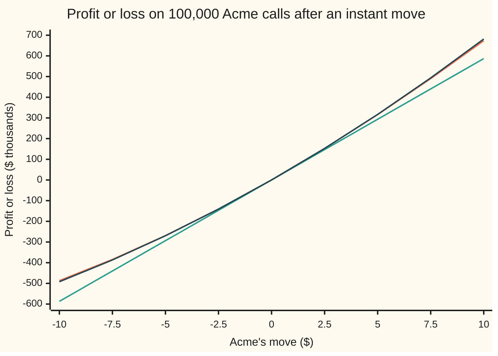
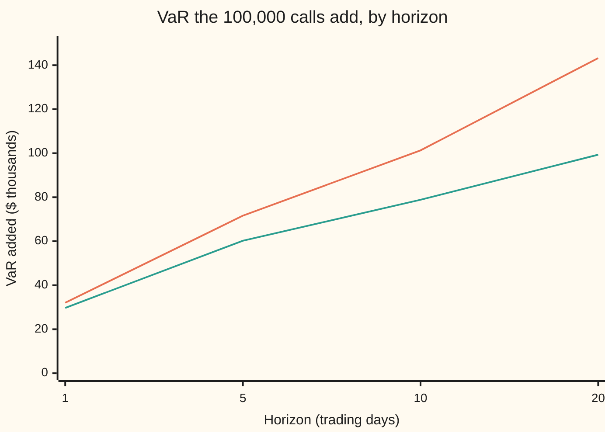

# Options in the book: the delta-gamma approximation and the Cornish-Fisher quantile

[Syllabus](../../../SYLLABUS.md) → [Financial mathematics](../../../SYLLABUS.md#w12) → [Value at Risk and Expected Shortfall](../../../SYLLABUS.md#w12-s39) → Options in the book

---

## General Overview

A trading book holds three things on a Monday morning. There are $10 million of shares in a basket of other companies, $5 million of bonds, and 1,000 Acme call contracts. Each contract covers 100 shares, so the book owns 100,000 one-year calls struck at $100 on Acme, which trades at $100. Each call is worth $9.23, so the calls are worth $922,700.55 in all.

The risk desk reports one number for this book: the one-day 99% value at risk, the loss that tomorrow exceeds only one day in a hundred ([Value at risk](01-profit-and-loss-distribution-and-var.md)). Without the calls, the basket and the bonds give $445,815.91. The question is what the calls add.

The quick answer treats each call as a fixed slice of a share: 0.586851 of one, its delta. That turns the calls into 58,685 Acme shares and the book into a straight line in three prices, which is the delta-normal method ([Parametric VaR](02-parametric-var-and-delta-normal.md)). It says the calls add $32,029.63.

A call is not a straight line. Its value bends upward as Acme rises (that bend is gamma), so the calls gain a little extra on a big move either way. The book's loss is then no longer bell-shaped: it is lopsided, a shape measured by its skew, and its tails differ from the bell curve's, which kurtosis measures. Two tools handle this. The **delta-gamma approximation** replaces each call's curve by a parabola. The **Cornish-Fisher expansion** turns the parabola's mean, spread, skew and kurtosis into a corrected quantile, with no simulation. Together they say the calls add $29,704.62. Repricing every call at 20,000 simulated moves of Acme says $29,602.49. The calls add about $30,000 of VaR, not $32,000.

**Keep the bend of each option as a parabola, compute the loss distribution's first four moments exactly, and shift the bell curve's 99% point by the skew and kurtosis those moments reveal.**

**What kind of fact this is:** an approximation, with its error stated: the parabola misses a full reprice by tens of dollars on this book, and Cornish-Fisher misses the parabola's exact quantile by six cents.

### The picture: the calls' curve, its straight line, and its parabola

Acme's move over the day runs left to right. Up the side is what the 100,000 calls make or lose, in thousands of dollars.



Orange: every call repriced with the Black-Scholes formula. Green: delta alone, the straight line. Dark blue: delta plus gamma, the parabola. On a $10 fall the straight line loses $586.85 thousand; the calls really lose $486.71 thousand. The parabola says $492.10 thousand. A typical day moves Acme by about $1.26, where all three lines sit on top of each other; the bend matters in the tail, which is where VaR lives.

---

## The formula

Notation first, in words. $L$ is the book's loss over one day: minus its profit, so a positive $L$ is money lost. $X$ is Acme's move over the day in dollars, and $W$ is the profit of everything else in the book. Capital delta and capital gamma are the calls' combined delta and gamma, 100,000 times the per-call numbers.

$$L \;\approx\; -\Big(\Delta X + \tfrac12\,\Gamma X^2\Big) \;-\; W$$

**Read it aloud:** the loss is minus the calls' straight-line gain, minus half the bend times the move squared, minus whatever the rest of the book made.

The loss's first four moments come out exactly, with $s$ the spread of Acme's move and $v$ the spread of the rest:

$$\mu = -\tfrac12\Gamma s^2,\qquad \sigma_L^2 = \Delta^2 s^2 + \tfrac12\Gamma^2 s^4 + v^2,$$

$$\gamma_1 = -\,\frac{3\Delta^2\Gamma s^4 + \Gamma^3 s^6}{\sigma_L^3},\qquad \gamma_2 = \frac{12\Delta^2\Gamma^2 s^6 + 3\Gamma^4 s^8}{\sigma_L^4}.$$

Then the Cornish-Fisher quantile:

$$\mathrm{VaR} \;\approx\; \mu + \sigma_L\,w,\qquad w = z + \frac{(z^2-1)\,\gamma_1}{6} + \frac{(z^3-3z)\,\gamma_2}{24} - \frac{(2z^3-5z)\,\gamma_1^2}{36}$$

**Read it aloud:** VaR is the average loss plus the loss's spread times a corrected 99% point; the correction nudges the bell curve's 2.33 down when the loss tail is thin (negative skew) and up when the tails are heavy (positive excess kurtosis).

A central moment is the average of a power of the distance from the mean. The fourth cumulant is the fourth central moment minus three times the variance squared; it is zero for a bell curve, and subtracting that 3 is what "excess" means.

| Symbol | Plain meaning | In our example | Push it up and the VaR… |
| --- | --- | --- | --- |
| $L$ | the book's loss over one day, minus its profit | the quantity VaR reads a quantile of | is the answer's raw material |
| $S$, $\sigma$ | Acme's price and its volatility (yearly spread of its returns) | $100 and 20% | rises: bigger moves |
| $X$, $s$ | Acme's one-day move in dollars, and its standard deviation, $S\sigma\sqrt{1/252}$ | $s$ = $1.259882 | rises |
| $\Delta$ | the calls' combined delta: Acme shares they behave like | 58,685.11 shares | rises |
| $\Gamma$ | the calls' combined gamma: shares of delta gained per $1 move | 1,895.06 | falls, for a long option: the bend cushions both tails |
| $W$, $v$ | the rest of the book's one-day profit, and its standard deviation | $v$ = $191,637.68 | rises |
| $\mu$, $\sigma_L$ | the loss's average and standard deviation | −$1,504.01 and $205,416.89 | rises one for one with $\mu$, and by $w$ per dollar of $\sigma_L$ |
| $\gamma_1$ | skew of the loss: third central moment over $\sigma_L^3$; negative means a short right tail | −0.005694 | rises |
| $\gamma_2$ | excess kurtosis of the loss: fourth cumulant over $\sigma_L^4$, zero for a bell curve | 0.000333 | rises at the 99% level |
| $z$, $N$, $\varphi$ | $z$ solves $N(z)$ = 0.99; $N$ is the bell curve's area to the left, $\varphi$ its height | $z$ = 2.326348 | rises with the confidence level |
| $w$ | the Cornish-Fisher 99% point, in units of $\sigma_L$ | 2.322226 | rises one for one, times $\sigma_L$ |
| VaR | value at risk: the loss exceeded with 1% chance | $475,520.53 | is the answer |
### When it holds

- **Small moves, so the parabola fits.** The first term the parabola drops is the cube of the move, weighted by how fast gamma itself changes. Over one day that is worth tens of dollars on this book. A $10 move, rare in a day but ordinary over a month, is where the parabola drifts: $681.60 thousand against $673.43 thousand on a rise, −$492.10 thousand against −$486.71 thousand on a fall.
- **Acme's move is normal and unrelated to the rest of the book.** Here the basket and Acme move independently, which keeps one variable in the bend. A correlated basket folds into Acme's delta by regression and the method survives. A move with fatter tails than the bell curve breaks it: then the tail itself must be modelled ([Extreme value theory](07-extreme-value-theory-and-tails.md)).
- **Only Acme's price moves the calls.** Volatility and time are held still. If implied volatility jumps with the fall, the loss grows by roughly vega times the jump, which this model cannot see. One day of time decay (theta) costs these calls $2,021.34 for certain, which moves every estimate up by that fixed amount.
- **Skew and kurtosis are small.** Cornish-Fisher is a series in them. With a strongly lopsided loss, such as a book of short out-of-the-money options, the corrected point can stop rising with the confidence level, and the exact integral or a simulation must replace it. Here the skew is −0.005694, far inside the safe zone.

---

## Why it works

### Step 0: one bent variable plus one normal one

The book's value is curved in Acme's price. Replace the curve by its parabola and the loss becomes a quadratic in one normal number $X$, plus an independent normal piece $W$. The moments of a quadratic in a normal variable can be computed exactly. A quantile close to the bell curve's can then be found by correcting the bell curve's quantile, one moment at a time.

### Step 1: the parabola

Taylor's rule, cut after the square, gives the calls' change in value for a move $X$ with the clock stopped:

$$V(S+X) - V(S) \;\approx\; \Delta X + \tfrac12\Gamma X^2.$$

The half is there because delta rises steadily from its old value to its new one during the move, so the calls earn the average delta, halfway between ([Gamma](../09-The%20Greeks%2C%20one%20each/02-gamma.md)). Add the rest of the book and flip the sign, and that is the formula.

### Step 2: the mean

A move squared is never negative, and its average is the variance, $s^2$. So the average loss is $\mu = -\tfrac12\Gamma s^2$, which comes to −$1,504.01. With the clock stopped, a long option gains on average whatever the direction: the bend is a small income. Delta-normal sets this to zero. The clock does not really stop: a day's time decay costs these calls $2,021.34, more than the bend earns. That is the price of owning the bend.

### Step 3: spread, skew and kurtosis

Write $X = sZ$, where $Z$ is a standard bell-curve draw, and set $b = \Delta s$ and $c = \tfrac12\Gamma s^2$. The calls' part of the loss, with its mean taken out, is $-\big(bZ + c(Z^2 - 1)\big)$. Only four facts about $Z$ are needed: the averages of its 2nd, 4th, 6th and 8th powers are 1, 3, 15 and 105, and every odd power averages to zero. Expanding the square, the cube and the fourth power and keeping only even powers gives

$$\text{variance } b^2 + 2c^2,\qquad \text{third moment } -(6b^2c + 8c^3),\qquad \text{fourth cumulant } 48b^2c^2 + 48c^4.$$

The rest of the book is normal and independent. It adds $v^2$ to the variance and nothing to the third moment or the fourth cumulant, because those two quantities add across independent pieces and are zero for a bell curve. Substituting $b = \Delta s$ and $c = \tfrac12\Gamma s^2$ back gives the formulas above.

<details>
<summary>The algebra behind this</summary>

Let $Y = Z^2 - 1$. Then $E[Y] = 0$, $E[Y^2] = 3 - 2 + 1 = 2$, $E[Z^2 Y] = 3 - 1 = 2$, $E[Y^3] = 15 - 3\cdot 3 + 3 - 1 = 8$, $E[Z^2Y^2] = 15 - 6 + 1 = 10$, $E[Y^4] = 105 - 60 + 18 - 4 + 1 = 60$. Every term with an odd power of $Z$ averages to zero.
- Variance: $E[(bZ + cY)^2] = b^2 + 2c^2$.
- Third moment: $E[(bZ + cY)^3] = 3b^2c\,E[Z^2Y] + c^3E[Y^3] = 6b^2c + 8c^3$; the loss carries a minus sign, so its third moment is $-(6b^2c + 8c^3)$.
- Fourth moment: $E[(bZ + cY)^4] = 3b^4 + 6b^2c^2\cdot 10 + 60c^4$. Subtract $3(b^2 + 2c^2)^2 = 3b^4 + 12b^2c^2 + 12c^4$ to get the fourth cumulant $48b^2c^2 + 48c^4$.

With $b = \Delta s$ and $c = \tfrac12\Gamma s^2$: $2c^2 = \tfrac12\Gamma^2 s^4$, $6b^2c + 8c^3 = 3\Delta^2\Gamma s^4 + \Gamma^3 s^6$, and $48b^2c^2 + 48c^4 = 12\Delta^2\Gamma^2 s^6 + 3\Gamma^4 s^8$.

</details>

### Step 4: correct the bell curve's quantile

For a bell curve the 99% point sits at $z$ = 2.326348 standard deviations. Standardise the loss, subtracting $\mu$ and dividing by $\sigma_L$, and ask where its own 99% point $w$ sits. A lopsided distribution's area to the left of a point differs from the bell curve's by a correction built from its skew and kurtosis (the Edgeworth expansion). Set that corrected area equal to 0.99 and solve for $w$ near $z$. To first order the skew moves the point by $(z^2 - 1)\gamma_1/6$: here −0.004187 standard deviations, a thin right tail pulling the 99% point in. The kurtosis moves it by $(z^3 - 3z)\gamma_2/24$, here +0.000078. The last term is second order in the skew, −0.000012.

<details>
<summary>Detailed proof</summary>

Write $\mathrm{He}_2(x) = x^2 - 1$, $\mathrm{He}_3(x) = x^3 - 3x$ and $\mathrm{He}_5(x) = x^5 - 10x^3 + 15x$. The Edgeworth expansion (Cornish and Fisher 1938, in Sources) states that a standardised variable with small skew $\gamma_1$ and excess kurtosis $\gamma_2$ has
$$P(Y \le y) \approx N(y) - \varphi(y)\Big[\tfrac{\gamma_1}{6}\mathrm{He}_2(y) + \tfrac{\gamma_2}{24}\mathrm{He}_3(y) + \tfrac{\gamma_1^2}{72}\mathrm{He}_5(y)\Big].$$
It comes from the variable's characteristic function (the average of $e^{itY}$ for each real frequency). Its logarithm is the bell curve's quadratic plus skew and kurtosis terms; exponentiating, and turning each power of the frequency back into a derivative of $N$, gives the series.

Call the bracket $A(y)$ and look for $w = z + \delta$ with $N(z) = 0.99$. Expand to second order: $N(z + \delta) \approx N(z) + \varphi(z)\delta - \tfrac12 z\varphi(z)\delta^2$, and $\varphi(w)A(w) \approx \varphi(z)A(z) + \delta\,\varphi(z)\big(A'(z) - zA(z)\big)$. Setting $P(Y \le w) = N(z)$ and dividing by $\varphi(z)$:
$$\delta = A(z) + \tfrac12 z\delta^2 + \delta\big(A'(z) - zA(z)\big).$$
First order: $\delta_1 = \tfrac{\gamma_1}{6}\mathrm{He}_2(z) + \tfrac{\gamma_2}{24}\mathrm{He}_3(z)$. Second order, in the skew only, with $k = \gamma_1/6$, $A \approx k\,\mathrm{He}_2$ and $A' \approx 2kz$ inside the correction:
$$\delta_2 = k^2\Big[\tfrac12\mathrm{He}_5 + \tfrac12 z\,\mathrm{He}_2^2 + \mathrm{He}_2(2z - z\,\mathrm{He}_2)\Big] = k^2\Big[\tfrac12\mathrm{He}_5 - \tfrac12 z\,\mathrm{He}_2^2 + 2z\,\mathrm{He}_2\Big].$$
Here $\tfrac{\gamma_1^2}{72}\mathrm{He}_5 = \tfrac{k^2}{2}\mathrm{He}_5$ was used. Now $\tfrac12\mathrm{He}_5 - \tfrac12 z\,\mathrm{He}_2^2 = \tfrac12(-8z^3 + 14z) = -4z^3 + 7z$, and $2z\,\mathrm{He}_2 = 2z^3 - 2z$. The sum is $-2z^3 + 5z$, so $\delta_2 = -\gamma_1^2(2z^3 - 5z)/36$. Adding both corrections to $z$ gives the formula for $w$. The error is third order in the skew and kurtosis together.

</details>

### Step 5: an exact answer to test against

For the parabola itself there is an exact answer. Fix Acme's move at $X = su$. The rest of the book is normal, so the chance that the total loss beats a level $x$ is a bell-curve area. Average that area over $u$:

$$P(L > x) = \int_{-\infty}^{\infty} \varphi(u)\,N\!\left(\frac{-x - \Delta s u - \tfrac12\Gamma s^2 u^2}{v}\right) du.$$

Solve $P(L > x)$ = 0.01 for $x$ by halving an interval. That is the exact delta-gamma VaR, $475,520.58. Cornish-Fisher gives $475,520.53. Replacing the parabola by a full Black-Scholes reprice at each of 20,000 random moves, and averaging the same bell-curve area, gives $475,418.40. The parabola on those same draws gives $475,453.28. On identical draws the parabola and the full reprice differ by tens of dollars, the same size as the simulation's own sampling noise.

The other door is pure simulation: draw every price, reprice everything, sort the losses ([Historical and Monte Carlo VaR](03-historical-and-monte-carlo-var.md)). It needs no parabola, and costs thousands of repricings per book per day. Delta-gamma with Cornish-Fisher costs two Greeks per option and one line of arithmetic.

---

## Worked numbers, by hand

The house market: Acme at $100, strike $100, 5% rates, 2% dividend yield, 20% volatility, one year. The book: 100,000 calls, a basket with a one-day spread of 1.9% on $10 million, bonds with 0.5% on $5 million, all three moving independently; 99% over one trading day (a year has 252).

| Step | Arithmetic | Value |
| --- | --- | --- |
| Acme's one-day spread $s$ | 100 × 0.20 × √(1/252) | $1.259882 |
| calls' delta $\Delta$ | 100,000 × 0.5868511 | 58,685.11 shares |
| calls' gamma $\Gamma$ | 100,000 × 0.0189506 | 1,895.06 |
| rest of the book $v$ | √(190,000^2 + 25,000^2) | $191,637.68 |
| VaR without calls | 2.326348 × 191,637.68 | $445,815.91 |
| delta part's spread | 58,685.11 × 1.259882 | $73,936.29 |
| gamma part's spread, $\Gamma s^2/\sqrt2$ | 1,895.06 × 1.259882^2 ÷ √2 | $2,127.00 |
| delta-normal VaR | 2.326348 × √(191,637.68^2 + 73,936.29^2) | $477,845.53 |
| mean loss $\mu$ | −½ × 1,895.06 × 1.259882^2 | −$1,504.01 |
| loss spread $\sigma_L$ | √(73,936.29^2 + 2,127.00^2 + 191,637.68^2) | $205,416.89 |
| skew $\gamma_1$ | third-moment formula ÷ 205,416.89^3 | −0.005694 |
| excess kurtosis $\gamma_2$ | fourth-cumulant formula ÷ 205,416.89^4 | 0.000333 |
| skew term | (2.326348^2 − 1) × (−0.005694) ÷ 6 | −0.004187 |
| kurtosis term | (2.326348^3 − 3 × 2.326348) × 0.000333 ÷ 24 | 0.000078 |
| skew-squared term | −(2 × 2.326348^3 − 5 × 2.326348) × 0.005694^2 ÷ 36 | −0.000012 |
| $w$ | 2.326348 − 0.004187 + 0.000078 − 0.000012 (rounded terms) | 2.322226 |
| **Cornish-Fisher VaR** | −1,504.01 + 205,416.89 × 2.322226 | **$475,520.53** |
| **what the calls add** | 475,520.53 − 445,815.91 | **$29,704.62** |

One day in a hundred this book loses more than about $475,500, and the calls are responsible for about $29,700 of that, not the $32,030 the straight line claims.

### Five answers side by side

```
one-day 99% VaR, $ thousands; bars start at 400, one block = 2
without the calls           ███████████████████████                  $445.82
delta-normal                ███████████████████████████████████████  $477.85
gamma's mean and spread     ██████████████████████████████████████   $476.37
Cornish-Fisher              ██████████████████████████████████████   $475.52
full reprice, simulated     █████████████████████████████████████▌   $475.42
```

Gamma's mean and spread recover most of what delta-normal overstates; the skew term recovers the rest.

### What breaks when a piece is dropped

Right answer $475,520.53, from Cornish-Fisher and the exact integral alike.

| Mistake | Comes out at | What went wrong |
| --- | --- | --- |
| Drop gamma: delta-normal | $477,845.53 | the bend's income and the thin loss tail are both lost |
| Keep gamma's mean and spread, read the bell curve's 2.326348 | $476,367.14 | the shape is ignored: the skew correction is missing |
| Forget the mean | $477,024.54 | the $1,504.01 average gain is not subtracted |
| Use the profit's skew as the loss's skew | $477,240.77 | a thin right tail of the loss read as a fat one |
| Gamma without the half | $473,271.50 | the bend counted twice: too much comfort |
| Plain kurtosis, 3 + 0.000333, in place of excess | $619,592.37 | every bell curve counted as fat-tailed |

---

## How the gap grows with the horizon

At one day the calls are nearly a straight line, and delta-normal is off by less than 1% of the VaR. Over longer horizons the gap widens: the delta part of the risk grows with the square root of the days, while the bend's income grows with the days themselves, because it rides on the move squared.

| Days | Calls add, delta-normal ($ thousands) | Calls add, Cornish-Fisher | Calls add, exact |
| --- | --- | --- | --- |
| 1 | 32.03 | 29.70 | 29.70 |
| 5 | 71.62 | 60.23 | 60.23 |
| 10 | 101.29 | 78.85 | 78.85 |
| 20 | 143.24 | 99.32 | 99.33 |



Orange: delta-normal. Green: the exact delta-gamma answer, which Cornish-Fisher tracks to within $13 even at 20 days. At ten days, the horizon banks have used for regulatory capital, delta-normal overstates the calls' risk by more than a quarter.

---

## Code, from first principles, and it actually runs

The script takes the calls' delta and gamma from the formula and again by repricing at $99.99, $100 and $100.01, and the loss's moments from the formulas and again by integrating the loss's powers over both bell curves. It reaches the VaR four ways: delta-normal, Cornish-Fisher, the exact integral over the parabola, and a simulation that reprices every call at 20,000 random moves. It prints every number on this card. Nothing imported knows the answer: the normal curve's area is a series, the inverse is halving an interval, the integral is Simpson's rule, and the random numbers come from a 64-bit mixing generator (splitmix64) turned into bell-curve draws by the Box-Muller recipe.

### Python

```python
# Delta-gamma VaR and the Cornish-Fisher quantile -- the check behind the card.
# Standard library only.  The normal CDF is a series, the inverse is bisection,
# the integral is Simpson's rule, the random numbers are splitmix64 + Box-Muller.
from math import log, sqrt, exp, pi, cos, sin

def phi(x): return exp(-0.5 * x * x) / sqrt(2.0 * pi)
def N(x):                                   # 0.5 + phi(x) * (x + x^3/3 + x^5/15 + ...)
    if x > 8.5: return 1.0
    if x < -8.5: return 0.0
    term, tot, k = x, x, 0
    while abs(term) > 1e-17 * abs(tot):
        k += 1; term *= x * x / (2 * k + 1); tot += term
    return 0.5 + phi(x) * tot
def bisect(f, lo, hi, it=60):               # f(lo) < 0 < f(hi)
    for _ in range(it):
        m = 0.5 * (lo + hi)
        if f(m) < 0: lo = m
        else: hi = m
    return 0.5 * (lo + hi)
def simpson(f, a, b, n):
    h = (b - a) / n
    return h / 3 * sum((1 if i in (0, n) else 4 if i % 2 else 2) * f(a + i * h) for i in range(n + 1))

S, K, r, q, sig, T = 100.0, 100.0, 0.05, 0.02, 0.20, 1.0
def call(S, T=T):                           # T years to expiry; T - 1/252 is one day later
    d1 = (log(S / K) + (r - q + 0.5 * sig * sig) * T) / (sig * sqrt(T))
    return S * exp(-q * T) * N(d1) - K * exp(-r * T) * N(d1 - sig * sqrt(T))
d1 = (log(S / K) + (r - q + 0.5 * sig * sig) * T) / (sig * sqrt(T))
n_calls = 100000.0                          # 1,000 contracts of 100 shares
dlt, gam = exp(-q * T) * N(d1), exp(-q * T) * phi(d1) / (S * sig * sqrt(T))
b = 0.01
dlt_bump = (call(S + b) - call(S - b)) / (2 * b)
gam_bump = (call(S + b) - 2 * call(S) + call(S - b)) / (b * b)
D, G = n_calls * dlt, n_calls * gam          # the calls' combined delta and gamma
sd_bk, sd_bd = 1e7 * 0.019, 5e6 * 0.005      # basket and bonds: one-day sd in dollars
v1, C0 = sqrt(sd_bk ** 2 + sd_bd ** 2), call(S)
z = bisect(lambda x: N(x) - 0.99, 0.0, 10.0)

def moments(D, G, s, v):                    # loss L = -(D X + G X^2 / 2) - W
    mu = -0.5 * G * s * s
    var = D * D * s * s + 0.5 * G * G * s ** 4 + v * v
    m3 = -(3 * D * D * G * s ** 4 + G ** 3 * s ** 6)
    k4 = 12 * D * D * G * G * s ** 6 + 3 * G ** 4 * s ** 8
    return mu, sqrt(var), m3 / var ** 1.5, k4 / var ** 2
def cf_var(mu, sd, g1, g2, z=z):
    w = z + (z * z - 1) * g1 / 6 + (z ** 3 - 3 * z) * g2 / 24 - (2 * z ** 3 - 5 * z) * g1 * g1 / 36
    return mu + sd * w, w
def exact_var(D, G, s, v):                  # P(L > x) = integral of phi(u) N((-x - D s u - G s^2 u^2/2)/v)
    tail = lambda x: simpson(lambda u: phi(u) * N((-x - D * s * u - 0.5 * G * s * s * u * u) / v), -8, 8, 800)
    return bisect(lambda x: 0.01 - tail(x), 0.0, 5e6, 45)
def rows_for(days, sign=1.0):
    s, v = S * sig * sqrt(days / 252), v1 * sqrt(days)
    Dx, Gx = sign * D, sign * G
    mu, sd, g1, g2 = moments(Dx, Gx, s, v)
    return z * v, z * sqrt(v * v + Dx * Dx * s * s), cf_var(mu, sd, g1, g2)[0], exact_var(Dx, Gx, s, v)

s1 = S * sig * sqrt(1 / 252)
mu, sd, g1, g2 = moments(D, G, s1, v1)
# independent road to the moments: integrate powers of the loss over X and W by Simpson
def raw(k):
    inner = lambda u: phi(u) * simpson(lambda t: phi(t) * (-(D * s1 * u + 0.5 * G * s1 * s1 * u * u) - v1 * t) ** k, -8, 8, 200)
    return simpson(inner, -8, 8, 200)
e1, e2, e3, e4 = raw(1), raw(2), raw(3), raw(4)
c2 = e2 - e1 ** 2
c3 = e3 - 3 * e1 * e2 + 2 * e1 ** 3
c4 = e4 - 4 * e1 * e3 + 6 * e1 * e1 * e2 - 3 * e1 ** 4
g1_int, g2_int = c3 / c2 ** 1.5, (c4 - 3 * c2 * c2) / c2 ** 2
base, dn, cf, ex = rows_for(1)
w = cf_var(mu, sd, g1, g2)[1]
mom_normal = mu + sd * z                    # keep gamma's mean and spread, ignore the shape
_, dn_s, cf_s, ex_s = rows_for(1, -1.0)     # the same calls, sold
# Monte Carlo, full revaluation: draw Acme's move, reprice every call at S + X;
# the rest of the book is normal and independent, so average its tail chance exactly
state = 20260928
def u01():
    global state
    state = (state + 0x9E3779B97F4A7C15) & 0xFFFFFFFFFFFFFFFF
    x = state
    x = ((x ^ (x >> 30)) * 0xBF58476D1CE4E5B9) & 0xFFFFFFFFFFFFFFFF
    x = ((x ^ (x >> 27)) * 0x94D049BB133111EB) & 0xFFFFFFFFFFFFFFFF
    return ((x ^ (x >> 31)) >> 11) / 9007199254740992.0
M = 20000
xs = []
for i in range(M // 2):
    rad, ang = sqrt(-2 * log(1.0 - u01())), 2 * pi * u01()
    xs += [s1 * rad * cos(ang), s1 * rad * sin(ang)]
full = [n_calls * (call(S + x) - C0) for x in xs]
quad = [D * x + 0.5 * G * x * x for x in xs]
mc_var = lambda P: bisect(lambda y: 0.01 - sum(N((-y - p) / v1) for p in P) / M, 0.0, 5e6, 45)
mc_full, mc_quad = mc_var(full), mc_var(quad)

# what breaks
no_mean = cf_var(0.0, sd, g1, g2)[0]
kurt_not_excess = cf_var(mu, sd, g1, g2 + 3)[0]
pnl_skew = cf_var(mu, sd, -g1, g2)[0]
m2 = moments(D, 2 * G, s1, v1)
no_half = cf_var(*m2)[0]

out = [("s, Acme one-day move sd ($)", s1), ("delta per call", dlt), ("  by bump", dlt_bump),
       ("gamma per call", gam), ("  by bump", gam_bump), ("calls' delta D (shares)", D),
       ("calls' gamma G (shares per $)", G), ("call price today ($)", C0), ("calls' value today ($)", n_calls * C0), ("calls' one-day time decay ($)", n_calls * (call(S, T - 1 / 252) - C0)), ("basket sd ($)", sd_bk), ("bonds sd ($)", sd_bd),
       ("v, rest of book sd ($)", v1), ("D s, delta part sd ($)", D * s1), ("G s^2/sqrt2, gamma part sd", G * s1 * s1 / sqrt(2)), ("z, 99% point", z),
       ("loss mean mu", mu), ("loss sd", sd), ("loss skew g1", g1), ("  by integration", g1_int),
       ("loss excess kurtosis g2", g2), ("  by integration", g2_int), ("Cornish-Fisher w", w), ("  skew term", (z * z - 1) * g1 / 6),
       ("  kurtosis term", (z ** 3 - 3 * z) * g2 / 24), ("  skew-squared term", -(2 * z ** 3 - 5 * z) * g1 * g1 / 36),
       ("VaR without calls", base), ("VaR delta-normal", dn), ("VaR normal with dg mean, sd", mom_normal),
       ("VaR Cornish-Fisher", cf), ("VaR exact delta-gamma", ex), ("VaR MC delta-gamma", mc_quad),
       ("VaR MC full revaluation", mc_full),
       ("calls add: delta-normal", dn - base), ("calls add: Cornish-Fisher", cf - base),
       ("calls add: exact delta-gamma", ex - base), ("calls add: MC full reval", mc_full - base),
       ("sold: VaR delta-normal", dn_s), ("sold: VaR Cornish-Fisher", cf_s), ("sold: VaR exact", ex_s),
       ("wrong: forgot the mean", no_mean), ("wrong: kurtosis not excess", kurt_not_excess),
       ("wrong: P&L skew for loss skew", pnl_skew), ("wrong: gamma without the half", no_half)]
for name, val in out:
    print(f"{name:<32} {val:>14.2f}" if abs(val) >= 1000 else f"{name:<32} {val:>14.6f}")
print("horizon  add: delta-normal  Cornish-Fisher  exact   (thousands of $)")
for days in (1, 5, 10, 20):
    bs, dns, cfs, exs = rows_for(days)
    print(f"{days:>7d}  {(dns - bs) / 1e3:17.2f} {(cfs - bs) / 1e3:15.2f} {(exs - bs) / 1e3:7.2f}")
print("bars, $ thousands: none, d-normal, d-g normal, CF, full reval " + " ".join(f"{x / 1e3:.2f}" for x in (base, dn, mom_normal, cf, mc_full)))
moves = [-10.0, -7.5, -5.0, -2.5, 0.0, 2.5, 5.0, 7.5, 10.0]
print("chart, Acme move ($)  " + " ".join(f"{x:7.1f}" for x in moves))
print("chart, full reprice   " + " ".join(f"{n_calls * (call(S + x) - C0) / 1e3:7.2f}" for x in moves))
print("chart, delta only     " + " ".join(f"{D * x / 1e3:7.2f}" for x in moves))
print("chart, delta-gamma    " + " ".join(f"{(D * x + 0.5 * G * x * x) / 1e3:7.2f}" for x in moves))

assert abs(dlt - dlt_bump) < 1e-7, "delta vs bump-and-reprice"
assert abs(gam - gam_bump) < 1e-5, "gamma vs bump-and-reprice"
assert abs(g1 - g1_int) < 1e-6, "skew formula vs integration"
assert abs(g2 - g2_int) < 1e-6, "kurtosis formula vs integration"
assert abs(cf - ex) < 1.0, "Cornish-Fisher within $1 of the exact delta-gamma quantile"
assert abs(mc_quad - ex) < 300.0, "Monte Carlo on the quadratic vs the Simpson integral"
assert abs(mc_full - mc_quad) < 100.0, "full revaluation vs delta-gamma on the same draws"
assert dn > ex, "long gamma thins the loss tail"
assert dn_s < ex_s, "short gamma fattens it"
print("ALL CHECKS PASS")
```

**Ran 2026-09-28 on macOS, Python 3.14.6, standard library only. All checks passed. Output, pasted from the run:**

```
s, Acme one-day move sd ($)            1.259882
delta per call                         0.586851
  by bump                              0.586851
gamma per call                         0.018951
  by bump                              0.018951
calls' delta D (shares)                58685.11
calls' gamma G (shares per $)           1895.06
call price today ($)                   9.227006
calls' value today ($)                922700.55
calls' one-day time decay ($)          -2021.34
basket sd ($)                         190000.00
bonds sd ($)                           25000.00
v, rest of book sd ($)                191637.68
D s, delta part sd ($)                 73936.29
G s^2/sqrt2, gamma part sd              2127.00
z, 99% point                           2.326348
loss mean mu                           -1504.01
loss sd                               205416.89
loss skew g1                          -0.005694
  by integration                      -0.005694
loss excess kurtosis g2                0.000333
  by integration                       0.000333
Cornish-Fisher w                       2.322226
  skew term                           -0.004187
  kurtosis term                        0.000078
  skew-squared term                   -0.000012
VaR without calls                     445815.91
VaR delta-normal                      477845.53
VaR normal with dg mean, sd           476367.14
VaR Cornish-Fisher                    475520.53
VaR exact delta-gamma                 475520.58
VaR MC delta-gamma                    475453.28
VaR MC full revaluation               475418.40
calls add: delta-normal                32029.63
calls add: Cornish-Fisher              29704.62
calls add: exact delta-gamma           29704.68
calls add: MC full reval               29602.49
sold: VaR delta-normal                477845.53
sold: VaR Cornish-Fisher              480248.80
sold: VaR exact                       480248.72
wrong: forgot the mean                477024.54
wrong: kurtosis not excess            619592.37
wrong: P&L skew for loss skew         477240.77
wrong: gamma without the half         473271.50
horizon  add: delta-normal  Cornish-Fisher  exact   (thousands of $)
      1              32.03           29.70   29.70
      5              71.62           60.23   60.23
     10             101.29           78.85   78.85
     20             143.24           99.32   99.33
bars, $ thousands: none, d-normal, d-g normal, CF, full reval 445.82 477.85 476.37 475.52 475.42
chart, Acme move ($)    -10.0    -7.5    -5.0    -2.5     0.0     2.5     5.0     7.5    10.0
chart, full reprice   -486.71 -384.36 -268.95 -140.69    0.00  152.52  316.15  490.08  673.43
chart, delta only     -586.85 -440.14 -293.43 -146.71    0.00  146.71  293.43  440.14  586.85
chart, delta-gamma    -492.10 -386.84 -269.74 -140.79    0.00  152.63  317.11  493.44  681.60
ALL CHECKS PASS
```

### Rust

The same checks, with the same generator and the same seed, so the simulated moves are identical draw for draw.

```rust
// Delta-gamma VaR and the Cornish-Fisher quantile -- the same check in Rust.
// Standard library only, no crates.  Own normal CDF (series), bisection,
// Simpson's rule, and splitmix64 + Box-Muller for the random draws.
// Compile: rustc --edition 2021 -O delta_gamma_var_and_cornish_fisher_check.rs
use std::f64::consts::PI;

fn phi(x: f64) -> f64 { (-0.5 * x * x).exp() / (2.0 * PI).sqrt() }
fn n_cdf(x: f64) -> f64 {                     // 0.5 + phi(x) * (x + x^3/3 + x^5/15 + ...)
    if x > 8.5 { return 1.0; }
    if x < -8.5 { return 0.0; }
    let (mut term, mut tot, mut k) = (x, x, 0.0);
    while term.abs() > 1e-17 * tot.abs() { k += 1.0; term *= x * x / (2.0 * k + 1.0); tot += term; }
    0.5 + phi(x) * tot
}
fn bisect<F: Fn(f64) -> f64>(f: F, mut lo: f64, mut hi: f64, it: usize) -> f64 {
    for _ in 0..it { let m = 0.5 * (lo + hi); if f(m) < 0.0 { lo = m } else { hi = m } }
    0.5 * (lo + hi)
}
fn simpson<F: Fn(f64) -> f64>(f: F, a: f64, b: f64, n: usize) -> f64 {
    let h = (b - a) / n as f64;
    let mut s = 0.0;
    for i in 0..=n { let w = if i == 0 || i == n { 1.0 } else if i % 2 == 1 { 4.0 } else { 2.0 }; s += w * f(a + i as f64 * h); }
    h / 3.0 * s
}
const S: f64 = 100.0; const K: f64 = 100.0; const R: f64 = 0.05; const Q: f64 = 0.02; const SIG: f64 = 0.20; const T: f64 = 1.0;
fn d1_of(s: f64) -> f64 { ((s / K).ln() + (R - Q + 0.5 * SIG * SIG) * T) / (SIG * T.sqrt()) }
fn call_t(s: f64, t: f64) -> f64 {                // t years to expiry; T - 1/252 is one day later
    let d1 = ((s / K).ln() + (R - Q + 0.5 * SIG * SIG) * t) / (SIG * t.sqrt());
    s * (-Q * t).exp() * n_cdf(d1) - K * (-R * t).exp() * n_cdf(d1 - SIG * t.sqrt())
}
fn call(s: f64) -> f64 { call_t(s, T) }

fn moments(d: f64, g: f64, s: f64, v: f64) -> (f64, f64, f64, f64) {   // loss L = -(D X + G X^2/2) - W
    let mu = -0.5 * g * s * s;
    let var = d * d * s * s + 0.5 * g * g * s.powi(4) + v * v;
    let m3 = -(3.0 * d * d * g * s.powi(4) + g.powi(3) * s.powi(6));
    let k4 = 12.0 * d * d * g * g * s.powi(6) + 3.0 * g.powi(4) * s.powi(8);
    (mu, var.sqrt(), m3 / var.powf(1.5), k4 / (var * var))
}
fn cf_var(mu: f64, sd: f64, g1: f64, g2: f64, z: f64) -> (f64, f64) {
    let w = z + (z * z - 1.0) * g1 / 6.0 + (z.powi(3) - 3.0 * z) * g2 / 24.0 - (2.0 * z.powi(3) - 5.0 * z) * g1 * g1 / 36.0;
    (mu + sd * w, w)
}
fn exact_var(d: f64, g: f64, s: f64, v: f64) -> f64 {
    let tail = |x: f64| simpson(|u| phi(u) * n_cdf((-x - d * s * u - 0.5 * g * s * s * u * u) / v), -8.0, 8.0, 800);
    bisect(|x| 0.01 - tail(x), 0.0, 5e6, 45)
}
struct Rng(u64);
impl Rng {
    fn u01(&mut self) -> f64 {
        self.0 = self.0.wrapping_add(0x9E3779B97F4A7C15);
        let mut x = self.0;
        x = (x ^ (x >> 30)).wrapping_mul(0xBF58476D1CE4E5B9);
        x = (x ^ (x >> 27)).wrapping_mul(0x94D049BB133111EB);
        ((x ^ (x >> 31)) >> 11) as f64 / 9007199254740992.0
    }
}
fn line(name: &str, v: f64) {
    if v.abs() >= 1000.0 { println!("{:<32} {:>14.2}", name, v) } else { println!("{:<32} {:>14.6}", name, v) }
}

fn main() {
    let n_calls = 100000.0;                                   // 1,000 contracts of 100 shares
    let d1 = d1_of(S);
    let dlt = (-Q * T).exp() * n_cdf(d1);
    let gam = (-Q * T).exp() * phi(d1) / (S * SIG * T.sqrt());
    let b = 0.01;
    let dlt_bump = (call(S + b) - call(S - b)) / (2.0 * b);
    let gam_bump = (call(S + b) - 2.0 * call(S) + call(S - b)) / (b * b);
    let (dd, gg) = (n_calls * dlt, n_calls * gam);            // the calls' combined delta and gamma
    let (sd_bk, sd_bd): (f64, f64) = (1e7 * 0.019, 5e6 * 0.005); // basket and bonds: one-day sd in dollars
    let (v1, c0) = ((sd_bk * sd_bk + sd_bd * sd_bd).sqrt(), call(S));
    let z = bisect(|x| n_cdf(x) - 0.99, 0.0, 10.0, 60);
    let rows_for = |days: f64, sign: f64| {
        let (s, v) = (S * SIG * (days / 252.0).sqrt(), v1 * days.sqrt());
        let (dx, gx) = (sign * dd, sign * gg);
        let (mu, sd, g1, g2) = moments(dx, gx, s, v);
        (z * v, z * (v * v + dx * dx * s * s).sqrt(), cf_var(mu, sd, g1, g2, z).0, exact_var(dx, gx, s, v))
    };
    let s1 = S * SIG * (1.0f64 / 252.0).sqrt();
    let (mu, sd, g1, g2) = moments(dd, gg, s1, v1);
    // independent road to the moments: integrate powers of the loss by Simpson
    let raw = |k: i32| simpson(|u| phi(u) * simpson(|t| phi(t) * (-(dd * s1 * u + 0.5 * gg * s1 * s1 * u * u) - v1 * t).powi(k), -8.0, 8.0, 200), -8.0, 8.0, 200);
    let (e1, e2, e3, e4) = (raw(1), raw(2), raw(3), raw(4));
    let c2 = e2 - e1 * e1;
    let c3 = e3 - 3.0 * e1 * e2 + 2.0 * e1.powi(3);
    let c4 = e4 - 4.0 * e1 * e3 + 6.0 * e1 * e1 * e2 - 3.0 * e1.powi(4);
    let (g1_int, g2_int) = (c3 / c2.powf(1.5), (c4 - 3.0 * c2 * c2) / (c2 * c2));
    let (base, dn, cf, ex) = rows_for(1.0, 1.0);
    let w = cf_var(mu, sd, g1, g2, z).1;
    let mom_normal = mu + sd * z;                             // gamma's mean and spread, no shape
    let (_, dn_s, cf_s, ex_s) = rows_for(1.0, -1.0);          // the same calls, sold
    // Monte Carlo, full revaluation; the rest of the book's tail chance is averaged exactly
    let mut rng = Rng(20260928);
    let m = 20000usize;
    let mut xs = Vec::with_capacity(m);
    for _ in 0..m / 2 {
        let rad = (-2.0 * (1.0 - rng.u01()).ln()).sqrt();
        let ang = 2.0 * PI * rng.u01();
        xs.push(s1 * rad * ang.cos()); xs.push(s1 * rad * ang.sin());
    }
    let full: Vec<f64> = xs.iter().map(|x| n_calls * (call(S + x) - c0)).collect();
    let quad: Vec<f64> = xs.iter().map(|x| dd * x + 0.5 * gg * x * x).collect();
    let mc_var = |p: &Vec<f64>| bisect(|y| 0.01 - p.iter().map(|pi| n_cdf((-y - pi) / v1)).sum::<f64>() / m as f64, 0.0, 5e6, 45);
    let (mc_full, mc_quad) = (mc_var(&full), mc_var(&quad));

    let no_mean = cf_var(0.0, sd, g1, g2, z).0;
    let kurt_not_excess = cf_var(mu, sd, g1, g2 + 3.0, z).0;
    let pnl_skew = cf_var(mu, sd, -g1, g2, z).0;
    let m2 = moments(dd, 2.0 * gg, s1, v1);
    let no_half = cf_var(m2.0, m2.1, m2.2, m2.3, z).0;

    let out = [("s, Acme one-day move sd ($)", s1), ("delta per call", dlt), ("  by bump", dlt_bump),
        ("gamma per call", gam), ("  by bump", gam_bump), ("calls' delta D (shares)", dd),
        ("calls' gamma G (shares per $)", gg), ("call price today ($)", c0), ("calls' value today ($)", n_calls * c0), ("calls' one-day time decay ($)", n_calls * (call_t(S, T - 1.0 / 252.0) - c0)), ("basket sd ($)", sd_bk), ("bonds sd ($)", sd_bd),
        ("v, rest of book sd ($)", v1), ("D s, delta part sd ($)", dd * s1), ("G s^2/sqrt2, gamma part sd", gg * s1 * s1 / 2f64.sqrt()), ("z, 99% point", z),
        ("loss mean mu", mu), ("loss sd", sd), ("loss skew g1", g1), ("  by integration", g1_int),
        ("loss excess kurtosis g2", g2), ("  by integration", g2_int), ("Cornish-Fisher w", w), ("  skew term", (z * z - 1.0) * g1 / 6.0),
        ("  kurtosis term", (z.powi(3) - 3.0 * z) * g2 / 24.0), ("  skew-squared term", -(2.0 * z.powi(3) - 5.0 * z) * g1 * g1 / 36.0),
        ("VaR without calls", base), ("VaR delta-normal", dn), ("VaR normal with dg mean, sd", mom_normal),
        ("VaR Cornish-Fisher", cf), ("VaR exact delta-gamma", ex), ("VaR MC delta-gamma", mc_quad),
        ("VaR MC full revaluation", mc_full),
        ("calls add: delta-normal", dn - base), ("calls add: Cornish-Fisher", cf - base),
        ("calls add: exact delta-gamma", ex - base), ("calls add: MC full reval", mc_full - base),
        ("sold: VaR delta-normal", dn_s), ("sold: VaR Cornish-Fisher", cf_s), ("sold: VaR exact", ex_s),
        ("wrong: forgot the mean", no_mean), ("wrong: kurtosis not excess", kurt_not_excess),
        ("wrong: P&L skew for loss skew", pnl_skew), ("wrong: gamma without the half", no_half)];
    for (name, v) in out.iter() { line(name, *v); }
    println!("horizon  add: delta-normal  Cornish-Fisher  exact   (thousands of $)");
    for days in [1.0f64, 5.0, 10.0, 20.0] {
        let (bs, dns, cfs, exs) = rows_for(days, 1.0);
        println!("{:>7}  {:17.2} {:15.2} {:7.2}", days as i32, (dns - bs) / 1e3, (cfs - bs) / 1e3, (exs - bs) / 1e3);
    }
    let bars: Vec<String> = [base, dn, mom_normal, cf, mc_full].iter().map(|x| format!("{:.2}", x / 1e3)).collect();
    println!("bars, $ thousands: none, d-normal, d-g normal, CF, full reval {}", bars.join(" "));
    let moves = [-10.0f64, -7.5, -5.0, -2.5, 0.0, 2.5, 5.0, 7.5, 10.0];
    let row = |label: &str, f: &dyn Fn(f64) -> f64, fmt1: bool| {
        let cells: Vec<String> = moves.iter().map(|&x| if fmt1 { format!("{:7.1}", f(x)) } else { format!("{:7.2}", f(x)) }).collect();
        println!("{:<22}{}", label, cells.join(" "));
    };
    row("chart, Acme move ($)", &|x| x, true);
    row("chart, full reprice", &|x| n_calls * (call(S + x) - c0) / 1e3, false);
    row("chart, delta only", &|x| dd * x / 1e3, false);
    row("chart, delta-gamma", &|x| (dd * x + 0.5 * gg * x * x) / 1e3, false);

    assert!((dlt - dlt_bump).abs() < 1e-7, "delta vs bump-and-reprice");
    assert!((gam - gam_bump).abs() < 1e-5, "gamma vs bump-and-reprice");
    assert!((g1 - g1_int).abs() < 1e-6, "skew formula vs integration");
    assert!((g2 - g2_int).abs() < 1e-6, "kurtosis formula vs integration");
    assert!((cf - ex).abs() < 1.0, "Cornish-Fisher within $1 of the exact delta-gamma quantile");
    assert!((mc_quad - ex).abs() < 300.0, "Monte Carlo on the quadratic vs the Simpson integral");
    assert!((mc_full - mc_quad).abs() < 100.0, "full revaluation vs delta-gamma on the same draws");
    assert!(dn > ex, "long gamma thins the loss tail");
    assert!(dn_s < ex_s, "short gamma fattens it");
    println!("ALL CHECKS PASS");
}
```

**Ran 2026-09-28 on macOS, rustc 1.98.1, no crates. All checks passed. Output, pasted from the run:**

```
s, Acme one-day move sd ($)            1.259882
delta per call                         0.586851
  by bump                              0.586851
gamma per call                         0.018951
  by bump                              0.018951
calls' delta D (shares)                58685.11
calls' gamma G (shares per $)           1895.06
call price today ($)                   9.227006
calls' value today ($)                922700.55
calls' one-day time decay ($)          -2021.34
basket sd ($)                         190000.00
bonds sd ($)                           25000.00
v, rest of book sd ($)                191637.68
D s, delta part sd ($)                 73936.29
G s^2/sqrt2, gamma part sd              2127.00
z, 99% point                           2.326348
loss mean mu                           -1504.01
loss sd                               205416.89
loss skew g1                          -0.005694
  by integration                      -0.005694
loss excess kurtosis g2                0.000333
  by integration                       0.000333
Cornish-Fisher w                       2.322226
  skew term                           -0.004187
  kurtosis term                        0.000078
  skew-squared term                   -0.000012
VaR without calls                     445815.91
VaR delta-normal                      477845.53
VaR normal with dg mean, sd           476367.14
VaR Cornish-Fisher                    475520.53
VaR exact delta-gamma                 475520.58
VaR MC delta-gamma                    475453.28
VaR MC full revaluation               475418.40
calls add: delta-normal                32029.63
calls add: Cornish-Fisher              29704.62
calls add: exact delta-gamma           29704.68
calls add: MC full reval               29602.49
sold: VaR delta-normal                477845.53
sold: VaR Cornish-Fisher              480248.80
sold: VaR exact                       480248.72
wrong: forgot the mean                477024.54
wrong: kurtosis not excess            619592.37
wrong: P&L skew for loss skew         477240.77
wrong: gamma without the half         473271.50
horizon  add: delta-normal  Cornish-Fisher  exact   (thousands of $)
      1              32.03           29.70   29.70
      5              71.62           60.23   60.23
     10             101.29           78.85   78.85
     20             143.24           99.32   99.33
bars, $ thousands: none, d-normal, d-g normal, CF, full reval 445.82 477.85 476.37 475.52 475.42
chart, Acme move ($)    -10.0    -7.5    -5.0    -2.5     0.0     2.5     5.0     7.5    10.0
chart, full reprice   -486.71 -384.36 -268.95 -140.69    0.00  152.52  316.15  490.08  673.43
chart, delta only     -586.85 -440.14 -293.43 -146.71    0.00  146.71  293.43  440.14  586.85
chart, delta-gamma    -492.10 -386.84 -269.74 -140.79    0.00  152.63  317.11  493.44  681.60
ALL CHECKS PASS
```

The two outputs agree line for line at the printed precision.

> [!TIP]
> **Try changing**
> Guess the direction first. Then run it.
> - **Sell the calls.** The `rows_for(1, -1.0)` line does it. Delta-normal cannot tell long from short: $477,845.53 both ways. The exact answer rises to **$480,248.72**, and Cornish-Fisher says $480,248.80. Sold gamma adds risk that the straight line hides.
> - **Use plain kurtosis.** Pass `g2 + 3` to `cf_var`. The VaR jumps to **$619,592.37**, against the right $475,520.53, from one convention slip.

---

## The usual mistake

> [!warning]
> **Treating an option as its delta.** A straight line is right on average for small moves and wrong exactly where VaR looks: in the tail. The error's direction depends on who owns the bend. Bought options cushion the tail, so delta-normal overstates the risk: $477,845.53 against $475,520.53 here. Sold options sharpen it, so delta-normal understates it: $477,845.53 against $480,248.72. A desk that sells options and reports delta-normal VaR is reporting its risk too low, and the gap widens with the horizon.
>
> Smaller traps:
> - **Sign of the skew.** Skew of the profit and skew of the loss have opposite signs. Mixing them gives $477,240.77.
> - **Kurtosis or excess kurtosis.** Cornish-Fisher wants the excess, zero for a bell curve. Feeding in the plain kurtosis gives $619,592.37.
> - **Scaling by the square root of time.** It works for delta-normal: $32,030 at one day becomes $101,290 at ten. It fails for the exact answer: $29,700 becomes $78,850.
> - **Cornish-Fisher outside its range.** With a large skew the corrected point can fall as the confidence rises, which no real distribution does. Then use the exact integral or a simulation instead.

---

## Where you meet it in real life

- **Bank risk engines.** Many banks store each position's delta and gamma overnight and revalue with the parabola, called partial revaluation, because repricing millions of options in every scenario takes too long.
- **Options market makers.** Their books are nearly delta-neutral, so almost all their risk is the squared term: a strongly skewed loss that delta-normal cannot see at all.
- **Fund risk reports.** Fund analytics often quote a "modified VaR": Cornish-Fisher applied to a fund's own returns, using their measured skew and kurtosis.
- **Faster simulation.** The delta-gamma loss tells a simulation where the tail is, so it can sample more often there and waste fewer draws; this is how Glasserman, Heidelberger and Shahabuddin speed up Monte Carlo VaR.

> **Say it back**
> An option's value bends in its underlying price, so a book with options has a lopsided loss. The delta-gamma approximation keeps the bend as a parabola, and the loss's mean, spread, skew and kurtosis then follow exactly. Cornish-Fisher shifts the bell curve's 99% point by the skew and kurtosis to get the quantile without simulating. For this book the calls add $29,704.62 of one-day VaR, not the $32,029.63 of the straight line; a full reprice agrees. Long options cushion the tail and sold options sharpen it, and the difference grows with the horizon.

---

## What this builds on

- [Historical and Monte Carlo VaR](03-historical-and-monte-carlo-var.md): VaR by simulation and full revaluation, the benchmark this card's shortcut must match.
- [Gamma](../09-The%20Greeks%2C%20one%20each/02-gamma.md): the bend itself, its formula, and why the parabola carries a half.

## Where this goes next

- [Expected shortfall](05-expected-shortfall-and-coherence.md): the average loss beyond VaR, which feels the skew even more than VaR does.
- [Whose risk is it](06-var-decomposition-euler-and-component-var.md): how much of the $475,520.53 each position carries.
- [Extreme value theory](07-extreme-value-theory-and-tails.md): what to do when the moves themselves are not bell-shaped, which no parabola can fix.
- [Backtesting VaR](08-backtesting-var.md): counting the days the loss beat the VaR, to learn whether any of these numbers was right.

---

## Sources

Verified 2026-09-28: every link below resolves to the publisher's page.

- Cornish, E. A., and R. A. Fisher. "Moments and Cumulants in the Specification of Distributions." *Revue de l'Institut International de Statistique* 5, no. 4 (1938): 307–320. [doi:10.2307/1400905](https://doi.org/10.2307/1400905). The expansion of a quantile in cumulants, and the Edgeworth series it inverts.
- Fisher, R. A., and E. A. Cornish. "The Percentile Points of Distributions Having Known Cumulants." *Technometrics* 2, no. 2 (1960): 209–225. [doi:10.1080/00401706.1960.10489895](https://doi.org/10.1080/00401706.1960.10489895). The explicit percentile formula with the skew, kurtosis and skew-squared terms used here.
- Britten-Jones, Mark, and Stephen M. Schaefer. "Non-Linear Value-at-Risk." *European Finance Review* (now *Review of Finance*) 2, no. 2 (1999): 161–187. [doi:10.1023/A:1009779322802](https://doi.org/10.1023/A:1009779322802). The delta-gamma loss as a quadratic in normal factors, and its moments.
- Glasserman, Paul, Philip Heidelberger, and Perwez Shahabuddin. "Variance Reduction Techniques for Estimating Value-at-Risk." *Management Science* 46, no. 10 (2000): 1349–1364. [doi:10.1287/mnsc.46.10.1349.12274](https://doi.org/10.1287/mnsc.46.10.1349.12274). Delta-gamma as a guide for Monte Carlo VaR with full revaluation.
