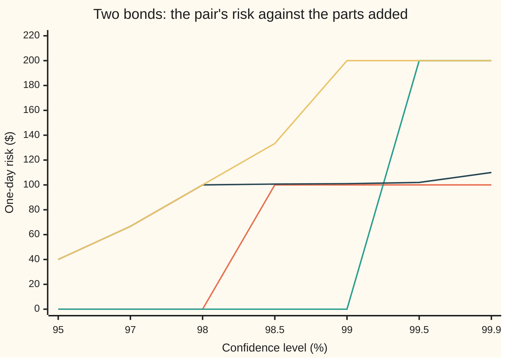

# Expected shortfall: the average loss beyond VaR, and why it adds up when VaR does not

[Syllabus](../../../SYLLABUS.md) → [Financial mathematics](../README.md) → [Value at Risk and Expected Shortfall](../README.md#s39) → Expected shortfall

---

## General Overview

A desk holds two bonds from two unrelated companies. Each bond is $100 of exposure. Tomorrow each company either pays in full or defaults, and a default loses the whole $100, with nothing recovered. Each default has a 1% chance, and the two companies know nothing of each other: the defaults are independent.

Ask each bond alone for its one-day value at risk at 99%: the smallest loss that tomorrow's loss stays at or below with at least 99% chance ([Value at risk](01-profit-and-loss-distribution-and-var.md)). The bond pays in full 99% of the time, so its value at risk is **$0**. The same holds for the other bond. Now ask the pair. The chance that neither defaults is 99% of 99%, which is 98.01%: short of 99%. So the pair's value at risk is **$100**.

Two positions that each report no risk report $100 of risk together. Split the desk in two and the risk number vanishes. A measure that rewards splitting a book is a measure a bank can game, and a regulator cannot add up.

**Expected shortfall** asks a different question: over the worst 1% of tomorrows, what is the average loss? Each bond's worst 1% is its default day, so each bond's expected shortfall is **$100**. The pair's worst 1% is mostly one default and a sliver of both, and averages **$101**. That is less than $100 + $100. Expected shortfall never charges a combined book more than the sum of its parts. That property has a name, **subadditivity**, and it is one of four rules that together make a risk measure **coherent**.

**Value at risk marks where the bad days start and can grow when books are merged; expected shortfall averages the bad days themselves, and an average over a fixed slice of bad days can never grow when books are merged.**

**What kind of fact this is:** expected shortfall is a definition; that it obeys all four coherence rules is a theorem, proved on this card in Why it works; the failure of value at risk is a counterexample, computed here.

### The picture: the two measures at 99%, bond by bond

```
99% one day, dollars   value at risk                expected shortfall
bond A                                   $0.00      ████████████████████  $100.00
bond B                                   $0.00      ████████████████████  $100.00
A + B separately                         $0.00      ████████████████████████████████████████  $200.00
the pair           ████████████████████  $100.00    ████████████████████  $101.00
```

The left column grows when the bonds are merged. The right column shrinks.

---

## The formula

Notation first, in words. A **loss** is money lost over the chosen horizon, one day here, with a gain counted as a negative loss. $\mathrm{VaR}_\alpha(L)$ is the value at risk of the loss $L$ at confidence $\alpha$: the smallest amount the loss stays at or below with chance at least $\alpha$. $E[\,\cdot\,]$ is the expectation, the probability-weighted average. $(x)_+$ is the **positive part** of $x$: $x$ itself if positive, otherwise 0.

$$\mathrm{ES}_\alpha(L) \;=\; v \;+\; \frac{E\big[(L - v)_+\big]}{1-\alpha}, \qquad v = \mathrm{VaR}_\alpha(L)$$

**Read it aloud:** start at the value-at-risk line, then add the average overshoot above it, spread over the whole worst slice of size one minus alpha.

The denominator is the size of the slice, 1%, even when fewer than 1% of outcomes lie strictly above the line. That detail is what makes ties at the line come out right, and it matters for the two bonds, where 1.98% of tomorrows sit exactly at the $100 line.

The same number, read as an average: take outcomes from the worst down, until exactly a fraction $t = 1 - \alpha$ of probability is collected, splitting the last outcome if needed. The average loss over that slice is the expected shortfall.

| Symbol | Plain meaning | In our example | Push it up and the answer… |
| --- | --- | --- | --- |
| $L$, $M$ | loss on a book over one day, in dollars; a gain is negative | 0, 100 or 200 for the pair | rises |
| $\alpha$ | confidence level | 99% | rises: a thinner, worse slice |
| $t$ | tail fraction, $1 - \alpha$: the size of the worst slice | 1% | falls |
| $v$ | value at risk, $\mathrm{VaR}_\alpha(L)$: where the worst slice begins | $0 per bond, $100 for the pair | — |
| $\mathrm{ES}_\alpha(L)$ | expected shortfall: average loss over the worst slice | $100 per bond, $101 for the pair | — |
| $E$ | expectation: the probability-weighted average | — | — |
| $(x)_+$ | positive part: $x$ if above zero, else 0 | $(200 - 100)_+ = 100$ | — |
| $p$ | chance that one issuer defaults tomorrow | 1% | rises |
| $s$ | a trial line, tried in place of $v$ | any loss level | — |
| $\rho$, $c$, $\lambda$ | any risk measure; a certain cash loss; a scale factor at least 0 | $c = 5$, $\lambda = 2$ | — |
| $w$ | weight given to one outcome when averaging a slice, between 0 and $1/t$ | 100 on the double default | — |
| $\sigma$, $\varphi$, $z$ | spread of a bell-curve loss; bell-curve height; the $\alpha$ point of the standard bell curve | $1 million; 2.33 at 99% | ES rises with $\sigma$ |

For a loss shaped like a bell curve (a normal distribution) with average zero and standard deviation $\sigma$, the formula has a closed form: $\mathrm{ES}_\alpha = \sigma\,\varphi(z)/(1-\alpha)$. Here $z$ is the point with $\alpha$ of the standard bell curve to its left, and $\varphi(z) = e^{-z^2/2}/\sqrt{2\pi}$ is the curve's height there. Value at risk is $\sigma z$.

### The four rules of a coherent risk measure

A **risk measure** $\rho$ turns a loss into one number of dollars. Artzner, Delbaen, Eber and Heath (1999) asked what rules such a number must obey to serve as capital. They gave four.

| Rule | In symbols | In words | VaR | ES |
| --- | --- | --- | --- | --- |
| Monotonicity | $L \le M$ in every outcome gives $\rho(L) \le \rho(M)$ | a book that loses more on every day needs more capital | holds | holds |
| Cash translation | $\rho(L + c) = \rho(L) + c$ | a certain extra loss of $c$ dollars adds $c$ to the capital | holds | holds |
| Positive homogeneity | $\rho(\lambda L) = \lambda\,\rho(L)$ for $\lambda \ge 0$ | double the book, double the capital | holds | holds |
| Subadditivity | $\rho(L + M) \le \rho(L) + \rho(M)$ | merging two books never needs more capital than keeping them apart | **fails** | holds |

Subadditivity is an inequality. It does not promise that merging reduces risk, only that it never adds any.

### When it holds

- **One loss law for everything.** $L$, $M$ and $L + M$ must come from the same scenarios, horizon and currency. Add expected shortfalls computed under two different models and the inequality compares two different worlds.
- **A finite average loss.** The formula needs $E[L]$ to exist. A tail heavy enough to have no average leaves expected shortfall infinite while value at risk stays finite; measuring such tails is [Extreme value theory](07-extreme-value-theory-and-tails.md).
- **The slice is exactly $t$.** Averaging only the losses strictly above value at risk breaks the rule whenever outcomes tie at the line: for the pair it gives $200, not $101.
- **Coherence is about the arithmetic, not the model.** A wrong default probability gives a coherent, wrong number.

---

## Why it works

### Step 0: an average over a fixed-size slice cannot be pushed up by merging

Take the pair's worst 1% of tomorrows. The pair's loss on each of those days is bond A's loss plus bond B's loss. So the pair's average over that slice is A's average over that slice plus B's average over that same slice. But that slice is just *some* 1% for bond A, and no 1% slice beats A's own worst 1%. The same goes for B. So the pair's shortfall is at most the sum.

Value at risk is not an average over a slice. It is one cut line, and a line moves when chances combine: two 1% risks that each fall outside the 99% line can combine into a 1.99% chance of some loss, which crosses it.

### Step 1: value at risk fails, with numbers

List tomorrow's four outcomes.

| Outcome | Chance | Bond A loses | Bond B loses | Pair loses |
| --- | --- | --- | --- | --- |
| neither defaults | 98.01% | $0 | $0 | $0 |
| A only | 0.99% | $100 | $0 | $100 |
| B only | 0.99% | $0 | $100 | $100 |
| both default | 0.01% | $100 | $100 | $200 |

Bond A alone: the loss is $0 with chance 99%, so the smallest amount reached with at least 99% chance is $0. For the pair, a loss of $0 comes with only 98.01% chance, short of 99%; a loss of $100 or less misses only the 0.01% of double defaults. So $\mathrm{VaR}_{99\%}$ of the pair is $100, against $0 + $0 for the parts. One counterexample settles it: value at risk is not subadditive.

### Step 2: fill the worst slice exactly

The pair's worst 1% starts with the 0.01% of double defaults at $200. It still needs 0.99% more, and takes it from the 1.98% of single defaults sitting at $100. The average over the slice is

$$\frac{0.0001 \times 200 + 0.0099 \times 100}{0.01} = 101.$$

The formula gives the same thing another way. The line is $v = 100$. Only the double default overshoots it, by $100$, with chance 0.01%. So $E[(L - v)_+] = 0.0001 \times 100 = 0.01$, and $100 + 0.01/0.01 = 101$.

The two agree always, not by luck: every outcome in the slice either sits above $v$, contributing its overshoot, or sits exactly at $v$, contributing nothing beyond $v$. Adding $v$ back for the whole slice restores the average.

### Step 3: expected shortfall is the worst average over any slice

Call a **slice** any way of picking a fraction $t$ of the probability, where part of an outcome may be taken. Put in weights: each outcome gets a weight $w$ between 0 and $1/t$, and the weights average to 1. The weighted average loss $E[wL]$ is the average over that slice.

The claim: the largest such average is exactly the expected shortfall. The worst slice puts full weight on the biggest losses and fills from the top, which is Step 2's recipe.

<details>
<summary>Detailed proof: the worst slice, and the minimum over lines</summary>

Fix $t = 1 - \alpha$ and a trial line $s$. For any weight $w$ with $0 \le w \le 1/t$ and $E[w] = 1$,
$$E[wL] = s + E[w(L - s)] \le s + E[w\,(L-s)_+] \le s + \frac{E[(L-s)_+]}{t}.$$
The first step uses $E[w] = 1$; the second uses $w \ge 0$; the third uses $w \le 1/t$. So every slice average sits below $s + E[(L-s)_+]/t$ for every $s$.

Now take $s = v$ and the filling weight: $w = 1/t$ above $v$, $w = 0$ below $v$, and on the outcomes tied at $v$ just enough weight to make $E[w] = 1$. Value at risk's definition puts at most $1-\alpha$ of chance strictly above $v$ and at least $1 - \alpha$ at or above it, so that tied weight lies between 0 and $1/t$. With this $w$ both inequalities become equalities: the first because $w = 0$ wherever $L < v$, the second because $w = 1/t$ wherever $L > v$. Hence
$$\mathrm{ES}_\alpha(L) = \max_{w} E[wL] = \min_{s}\Big(s + \frac{E[(L-s)_+]}{t}\Big),$$
and both are reached, at the filling weight and at $s = v$. No independence and no smooth density were used.

</details>

### Step 4: the four rules follow

The set of allowed weights depends only on $t$, not on the book. So:

- **Subadditivity.** $E[w(L+M)] = E[wL] + E[wM] \le \mathrm{ES}(L) + \mathrm{ES}(M)$ for every allowed $w$. Take the largest on the left: $\mathrm{ES}(L+M) \le \mathrm{ES}(L) + \mathrm{ES}(M)$. The best slice for the pair is merely one slice for each bond.
- **Monotonicity.** If $L \le M$ everywhere, then $E[wL] \le E[wM]$ for every $w \ge 0$.
- **Cash translation.** $E[w(L + c)] = E[wL] + c$, since the weights average to 1. Adding a certain $5 loss to the pair gives $106.
- **Positive homogeneity.** $E[w\lambda L] = \lambda E[wL]$. Doubling the pair gives $202.

Value at risk passes the first three and fails only the fourth, which is the one Step 1 broke.

A second route reaches the same number: average the value at risk over every confidence level from $\alpha$ up to 1. That is the quantile average of Acerbi and Tasche (2002). The minimum over $s$ in the proof is the route of Rockafellar and Uryasev (2000): it turns "choose a portfolio with the smallest expected shortfall" into a linear programme, Modelling tricks.

---

## Worked numbers, by hand

Two bonds, $100 each, default chance $p = 1\%$ each, independent, nothing recovered. One day, 99%.

| Step | Arithmetic | Value |
| --- | --- | --- |
| chance neither defaults | $0.99 \times 0.99$ | 0.9801 |
| chance exactly one defaults | $2 \times 0.01 \times 0.99$ | 0.0198 |
| chance both default | $0.01 \times 0.01$ | 0.0001 |
| value at risk, one bond | no loss with chance 99%, which meets 99% | $0 |
| value at risk, pair | 98.01% falls short of 99%; the next loss level is $100 | $100 |
| shortfall, one bond | $0 + (0.01 \times 100)/0.01$ | $100 |
| slice taken at $100 for the pair | $0.01 - 0.0001$ | 0.0099 |
| shortfall, pair | $100 + (0.0001 \times 100)/0.01$ | **$101** |
| shortfall, parts added | $100 + 100$ | $200 |

Merging the two bonds adds $100 of value at risk and takes expected shortfall from $200 down to $101. The saving is the diversification a bank expects to see: two unrelated defaults rarely land on the same day.

### Across confidence levels

The failure is not a knife-edge at 99%. It appears whenever the confidence level sits between 98.01% and 99%.



Orange: value at risk of the pair. Green: value at risk of the bonds added. Dark blue: expected shortfall of the pair. Yellow: expected shortfall of the bonds added. At 98.5% and 99% the orange line sits above the green: value at risk breaks. The dark blue line never rises above the yellow. Below 98.01% the slice is wide enough to hold every default, and both shortfalls equal the average loss divided by $t$, so they coincide.

### A second case: a bell-curve loss

For a desk whose one-day loss is a bell curve with average zero and spread $\sigma$ of $1 million:

| Measure | Arithmetic | Value |
| --- | --- | --- |
| value at risk, 99% | $z = 2.326348$ | $2.33 million |
| expected shortfall, 99% | $\varphi(2.326348)/0.01$ | $2.67 million |
| value at risk, 97.5% | $z = 1.959964$ | $1.96 million |
| expected shortfall, 97.5% | $\varphi(1.959964)/0.025$ | $2.34 million |

For a bell curve, expected shortfall at 97.5% is almost exactly value at risk at 99%. That near-match is why the Basel market-risk rules could swap one for the other in 2016 without moving capital much for books whose losses are close to a bell curve ([Market-risk capital](../48-Regulatory%20Capital%20in%20Outline/04-frtb-and-the-shift-to-expected-shortfall.md)). For books with fat tails or jumps, like the bonds, the two differ widely. The bell-curve value at risk itself is [Parametric VaR](02-parametric-var-and-delta-normal.md).

### What breaks if you drop a piece

Right answer for the pair: $101.

| Mistake | Comes out at | What went wrong |
| --- | --- | --- |
| Average only the losses strictly above value at risk | $200 | The slice held 0.01%, not 1%; ties at the line were thrown away |
| Average every loss at or above value at risk | $100.50 | All 1.98% of single defaults were let in beside the double default, a slice nearly twice too wide |
| Use value at risk as the capital figure | $100 for the pair, $0 for the parts | A cut line, not an average: splitting the desk hides the risk |
| Add the parts' shortfalls and call it the pair's | $200 | An upper bound, not the answer: it ignores that two defaults rarely coincide |

---

## Code, from first principles, and it actually runs

The scripts reach the pair's shortfall three independent ways: filling the worst slice from the top, minimising $s + E[(L-s)_+]/t$ over trial lines, and simulating a million days with a home-made random number generator. All tail sums are whole numbers of millionths, so roads 1 and 2 are compared exactly. Then 2,000 random two-asset books test subadditivity at 80%: value at risk should break it on some, expected shortfall on none. The bell-curve case is computed by closed form and by integrating the tail directly. Every number on the card is printed.

### Python

```python
# Expected shortfall and coherence -- the check behind the card.  Standard library only.
# Two bonds, each a $100 loss if its issuer defaults (1% each, independent, nothing recovered).
# Probabilities are whole millionths, so every tail below is exact integer arithmetic.
from math import exp, sqrt, pi

DEN = 1_000_000

def pair_law(p, together=False):     # p = default chance in thousandths -> [(loss A, loss B, weight)]
    if together:
        return [(0, 0, DEN - 1000 * p), (100, 100, 1000 * p)]
    n = 1000 - p
    return [(0, 0, n * n), (100, 0, p * n), (0, 100, n * p), (100, 100, p * p)]

def merge(pairs):                    # [(loss, weight)] -> {loss: total weight}
    law = {}
    for x, w in pairs: law[x] = law.get(x, 0) + w
    return law

def var(law, a, den=DEN):            # lowest loss whose cumulative weight reaches a/den
    cum = 0
    for x in sorted(law):
        cum += law[x]
        if cum * DEN >= a * den: return x

def es_fill(law, a, den=DEN):        # road 1: fill the worst tail, largest losses first -> numerator over t
    room, total = (DEN - a) * den, 0     # tail size, in units of 1/(DEN*den)
    for x in sorted(law, reverse=True):
        take = min(law[x] * DEN, room)
        total += x * take; room -= take
    return total                     # ES = total / ((DEN - a) * den)

def es_min(law, a, den=DEN):         # road 2: min over s of s*t + E[(L-s)+]; the minimum sits on a loss value
    t = (DEN - a) * den
    return min(s * t + sum(DEN * w * max(x - s, 0) for x, w in law.items()) for s in law)

def es(law, a, den=DEN): return es_fill(law, a, den) / ((DEN - a) * den)

def books(p=10, together=False):
    j = pair_law(p, together)
    return merge((x, w) for x, _, w in j), merge((y, w) for _, y, w in j), merge((x + y, w) for x, y, w in j)

A99 = 990_000
A, B, P = books()
rows = [("state neither defaults", P[0] / DEN), ("state exactly one defaults", P[100] / DEN),
        ("state both default", P[200] / DEN)]
for name, law in (("bond A", A), ("bond B", B), ("pair", P)):
    rows += [(f"VaR99 {name}", var(law, A99)), (f"ES99 {name}, fill the tail", es(law, A99)),
             (f"ES99 {name}, minimise over s", es_min(law, A99) / ((DEN - A99) * DEN))]
v_sum = var(A, A99) + var(B, A99)
rows += [("VaR99 pair minus sum of solo", var(P, A99) - v_sum),
         ("ES99 sum of solo", es(A, A99) + es(B, A99)),
         ("pair tail, weight taken at $100", (DEN - A99 - sum(w for x, w in P.items() if x > 100)) / DEN)]

# ---- road 3: simulate a million days with a home-made generator (64-bit LCG, top bits) ----
seed, M64 = 20260928, (1 << 64) - 1
def draw():
    global seed
    seed = (seed * 6364136223846793005 + 1442695040888963407) & M64
    return (seed >> 33) % 1000
N = 1_000_000
counts = {0: 0, 100: 0, 200: 0}
for _ in range(N):
    counts[100 * (draw() < 10) + 100 * (draw() < 10)] += 1
rows += [("simulated days, both default", counts[200]), ("simulated VaR99 pair", var(counts, A99, N)),
         ("simulated ES99 pair", es(counts, A99, N))]

# ---- what breaks ----
v = var(P, A99)
strict = sum(x * w for x, w in P.items() if x > v) / sum(w for x, w in P.items() if x > v)
ties = sum(x * w for x, w in P.items() if x >= v) / sum(w for x, w in P.items() if x >= v)
rows += [("wrong: mean of losses strictly above VaR", strict), ("wrong: mean of losses at or above VaR", ties),
         ("axiom: ES99 pair + $5 certain loss", es({x + 5: w for x, w in P.items()}, A99)),
         ("axiom: ES99 pair, doubled book", es({2 * x: w for x, w in P.items()}, A99))]

# ---- try changing ----
for label, kw in (("try: p = 0.5%", dict(p=5)), ("try: p = 2%", dict(p=20)), ("try: defaults together", dict(together=True))):
    a, b, pr = books(**kw)
    rows += [(f"{label}, VaR99 pair | sum", f"{var(pr, A99):.2f} | {var(a, A99) + var(b, A99):.2f}"),
             (f"{label}, ES99 pair | sum", f"{es(pr, A99):.2f} | {es(a, A99) + es(b, A99):.2f}")]

# ---- random books: does subadditivity ever fail?  8 equally likely days, 80% level ----
def lcg_int(k): return draw() % k
var_breaks = es_breaks = road_gaps = 0
for _ in range(2000):
    days = [(50 * lcg_int(5) - 50, 50 * lcg_int(5) - 50) for _ in range(8)]
    la, lb, lp = (merge((f(d), 125_000) for d in days) for f in (lambda d: d[0], lambda d: d[1], lambda d: d[0] + d[1]))
    var_breaks += var(lp, 800_000) > var(la, 800_000) + var(lb, 800_000)
    es_breaks += es_fill(lp, 800_000) > es_fill(la, 800_000) + es_fill(lb, 800_000)
    road_gaps += es_fill(lp, 800_000) != es_min(lp, 800_000)
rows += [("random books, VaR80 not subadditive", var_breaks), ("random books, ES80 not subadditive", es_breaks),
         ("random books, ES80 roads 1 and 2 disagree", road_gaps)]

# ---- a second case: a bell-curve loss with spread 1 ($1 million a day) ----
def phi(x): return exp(-0.5 * x * x) / sqrt(2 * pi)
def N_cdf(x):                        # Marsaglia's series: 1/2 + phi(x) (x + x^3/3 + x^5/15 + ...)
    term = total = x; k = 1
    while abs(term) > 1e-17 * abs(total) + 1e-300:
        k += 2; term *= x * x / k; total += term
    return 0.5 + phi(x) * total
def z_of(a):                         # bisection on the home-made CDF
    lo, hi = -10.0, 10.0
    for _ in range(100):
        mid = 0.5 * (lo + hi)
        lo, hi = (mid, hi) if N_cdf(mid) < a else (lo, mid)
    return 0.5 * (lo + hi)
def tail_simpson(z, t, n=20000):     # (1/t) * integral from z to z+12 of x phi(x) dx
    h = 12.0 / n
    s = z * phi(z) + (z + 12) * phi(z + 12)
    for i in range(1, n): s += (4 if i % 2 else 2) * (z + i * h) * phi(z + i * h)
    return s * h / 3 / t
for a in (0.99, 0.975):
    z = z_of(a)
    rows += [(f"normal VaR{a * 100:g}", z), (f"normal ES{a * 100:g}, phi(z)/t", phi(z) / (1 - a)),
             (f"normal ES{a * 100:g}, integral", tail_simpson(z, 1 - a))]

# ---- chart points: confidence level across ----
levels = (950_000, 970_000, 980_000, 985_000, 990_000, 995_000, 999_000)
chart = [("chart, confidence %", [l / 10_000 for l in levels]),
         ("chart, VaR pair", [var(P, l) for l in levels]), ("chart, VaR sum", [var(A, l) + var(B, l) for l in levels]),
         ("chart, ES pair", [es(P, l) for l in levels]), ("chart, ES sum", [es(A, l) + es(B, l) for l in levels])]

for name, x in rows:
    print(f"{name:<44} {x:>14}" if isinstance(x, (str, int)) else f"{name:<44} {x:>14.6f}")
for name, xs in chart:
    print(f"{name:<22}" + "".join(f"{x:>8.2f}" for x in xs))

assert es_fill(P, A99) == es_min(P, A99), "pair: fill road vs minimise road, exact"
assert es_fill(A, A99) == es_min(A, A99), "bond A: fill road vs minimise road, exact"
assert es_fill(P, A99) == 101 * (DEN - A99) * DEN, "pair ES must be exactly $101"
assert var(P, A99) > v_sum, "VaR of the pair must exceed the sum"
assert abs(es(counts, A99, N) - es(P, A99)) < 0.5, "simulation within 50 cents of the exact ES"
assert es_breaks == 0, "ES never breaks subadditivity"
assert var_breaks > 0, "VaR breaks it on some random book"
assert road_gaps == 0, "fill and minimise agree on every random book"
assert abs(phi(z_of(0.99)) / 0.01 - tail_simpson(z_of(0.99), 0.01)) < 1e-8, "normal ES: closed form vs integral"
assert abs(z_of(0.99) - 2.3263478740) < 1e-8, "99% point vs the printed normal table"
print("ALL CHECKS PASS")
```

**Ran 2026-09-28 on macOS, Python 3.14.6, standard library only. All checks passed. Output, pasted from the run:**

```
state neither defaults                             0.980100
state exactly one defaults                         0.019800
state both default                                 0.000100
VaR99 bond A                                              0
ES99 bond A, fill the tail                       100.000000
ES99 bond A, minimise over s                     100.000000
VaR99 bond B                                              0
ES99 bond B, fill the tail                       100.000000
ES99 bond B, minimise over s                     100.000000
VaR99 pair                                              100
ES99 pair, fill the tail                         101.000000
ES99 pair, minimise over s                       101.000000
VaR99 pair minus sum of solo                            100
ES99 sum of solo                                 200.000000
pair tail, weight taken at $100                    0.009900
simulated days, both default                            109
simulated VaR99 pair                                    100
simulated ES99 pair                              101.090000
wrong: mean of losses strictly above VaR         200.000000
wrong: mean of losses at or above VaR            100.502513
axiom: ES99 pair + $5 certain loss               106.000000
axiom: ES99 pair, doubled book                   202.000000
try: p = 0.5%, VaR99 pair | sum                 0.00 | 0.00
try: p = 0.5%, ES99 pair | sum               100.00 | 100.00
try: p = 2%, VaR99 pair | sum                100.00 | 200.00
try: p = 2%, ES99 pair | sum                 104.00 | 200.00
try: defaults together, VaR99 pair | sum        0.00 | 0.00
try: defaults together, ES99 pair | sum      200.00 | 200.00
random books, VaR80 not subadditive                      32
random books, ES80 not subadditive                        0
random books, ES80 roads 1 and 2 disagree                 0
normal VaR99                                       2.326348
normal ES99, phi(z)/t                              2.665214
normal ES99, integral                              2.665214
normal VaR97.5                                     1.959964
normal ES97.5, phi(z)/t                            2.337803
normal ES97.5, integral                            2.337803
chart, confidence %      95.00   97.00   98.00   98.50   99.00   99.50   99.90
chart, VaR pair           0.00    0.00    0.00  100.00  100.00  100.00  100.00
chart, VaR sum            0.00    0.00    0.00    0.00    0.00  200.00  200.00
chart, ES pair           40.00   66.67  100.00  100.67  101.00  102.00  110.00
chart, ES sum            40.00   66.67  100.00  133.33  200.00  200.00  200.00
ALL CHECKS PASS
```

### Rust

The same checks. Rust has no error function, so the bell-curve area is built by adding thin slices under the curve (Simpson's rule), where Python sums a series. The two outputs agree line for line, including the simulation, which uses the same generator in both.

```rust
// Expected shortfall and coherence -- the same check as expected_shortfall_and_coherence_check.py, in Rust.
// Std only, no crates.  Probabilities are whole millionths; tails are exact integer sums.
// Rust has no erf, so the bell-curve area is built by adding thin slices under the curve (Simpson).
use std::collections::BTreeMap;
use std::f64::consts::PI;

const DEN: i64 = 1_000_000;
type Law = BTreeMap<i64, i64>; // loss -> weight

fn pair_law(p: i64, together: bool) -> Vec<(i64, i64, i64)> {
    if together { return vec![(0, 0, DEN - 1000 * p), (100, 100, 1000 * p)]; }
    let n = 1000 - p;
    vec![(0, 0, n * n), (100, 0, p * n), (0, 100, n * p), (100, 100, p * p)]
}
fn merge(pairs: impl Iterator<Item = (i64, i64)>) -> Law {
    let mut law = Law::new();
    for (x, w) in pairs { *law.entry(x).or_insert(0) += w; }
    law
}
fn var(law: &Law, a: i64, den: i64) -> i64 {       // lowest loss whose cumulative weight reaches a/DEN
    let mut cum = 0;
    for (&x, &w) in law { cum += w; if cum * DEN >= a * den { return x; } }
    panic!("no quantile")
}
fn es_fill(law: &Law, a: i64, den: i64) -> i64 {   // road 1: fill the worst tail, largest losses first
    let (mut room, mut total) = ((DEN - a) * den, 0i64);
    for (&x, &w) in law.iter().rev() {
        let take = (w * DEN).min(room);
        total += x * take; room -= take;
    }
    total
}
fn es_min(law: &Law, a: i64, den: i64) -> i64 {    // road 2: min over s of s*t + E[(L-s)+], s on a loss value
    let t = (DEN - a) * den;
    law.keys().map(|&s| s * t + law.iter().map(|(&x, &w)| DEN * w * (x - s).max(0)).sum::<i64>()).min().unwrap()
}
fn es(law: &Law, a: i64, den: i64) -> f64 { es_fill(law, a, den) as f64 / ((DEN - a) * den) as f64 }
fn books(p: i64, together: bool) -> (Law, Law, Law) {
    let j = pair_law(p, together);
    (merge(j.iter().map(|&(x, _, w)| (x, w))), merge(j.iter().map(|&(_, y, w)| (y, w))),
     merge(j.iter().map(|&(x, y, w)| (x + y, w))))
}
struct Lcg(u64); // home-made generator: 64-bit LCG, top bits
impl Lcg {
    fn draw(&mut self) -> u64 {
        self.0 = self.0.wrapping_mul(6364136223846793005).wrapping_add(1442695040888963407);
        (self.0 >> 33) % 1000
    }
}
fn phi(x: f64) -> f64 { (-0.5 * x * x).exp() / (2.0 * PI).sqrt() }
fn simpson<F: Fn(f64) -> f64>(f: F, a: f64, b: f64, n: usize) -> f64 {
    let h = (b - a) / n as f64;
    let mut s = f(a) + f(b);
    for i in 1..n { s += if i % 2 == 1 { 4.0 } else { 2.0 } * f(a + i as f64 * h); }
    s * h / 3.0
}
fn n_cdf(x: f64) -> f64 { 0.5 + simpson(phi, 0.0, x, 4000) }
fn z_of(a: f64) -> f64 {
    let (mut lo, mut hi) = (-10.0, 10.0);
    for _ in 0..100 { let mid = 0.5 * (lo + hi); if n_cdf(mid) < a { lo = mid } else { hi = mid } }
    0.5 * (lo + hi)
}
fn tail_simpson(z: f64, t: f64) -> f64 { simpson(|x| x * phi(x), z, z + 12.0, 20000) / t }

fn main() {
    let a99 = 990_000;
    let (a, b, p) = books(10, false);
    let mut rows: Vec<(String, String)> = Vec::new();
    let f6 = |x: f64| format!("{:.6}", x);
    let push = |rows: &mut Vec<(String, String)>, n: &str, v: String| rows.push((n.to_string(), v));
    push(&mut rows, "state neither defaults", f6(p[&0] as f64 / DEN as f64));
    push(&mut rows, "state exactly one defaults", f6(p[&100] as f64 / DEN as f64));
    push(&mut rows, "state both default", f6(p[&200] as f64 / DEN as f64));
    for (name, law) in [("bond A", &a), ("bond B", &b), ("pair", &p)] {
        push(&mut rows, &format!("VaR99 {}", name), var(law, a99, DEN).to_string());
        push(&mut rows, &format!("ES99 {}, fill the tail", name), f6(es(law, a99, DEN)));
        push(&mut rows, &format!("ES99 {}, minimise over s", name), f6(es_min(law, a99, DEN) as f64 / ((DEN - a99) * DEN) as f64));
    }
    let v_sum = var(&a, a99, DEN) + var(&b, a99, DEN);
    push(&mut rows, "VaR99 pair minus sum of solo", (var(&p, a99, DEN) - v_sum).to_string());
    push(&mut rows, "ES99 sum of solo", f6(es(&a, a99, DEN) + es(&b, a99, DEN)));
    let above: i64 = p.iter().filter(|(&x, _)| x > 100).map(|(_, &w)| w).sum();
    push(&mut rows, "pair tail, weight taken at $100", f6((DEN - a99 - above) as f64 / DEN as f64));

    // ---- road 3: simulate a million days ----
    let mut g = Lcg(20260928);
    let n = 1_000_000i64;
    let mut counts = Law::from([(0, 0), (100, 0), (200, 0)]);
    for _ in 0..n {
        let la = if g.draw() < 10 { 100 } else { 0 };
        let lb = if g.draw() < 10 { 100 } else { 0 };
        *counts.get_mut(&(la + lb)).unwrap() += 1;
    }
    push(&mut rows, "simulated days, both default", counts[&200].to_string());
    push(&mut rows, "simulated VaR99 pair", var(&counts, a99, n).to_string());
    push(&mut rows, "simulated ES99 pair", f6(es(&counts, a99, n)));

    // ---- what breaks ----
    let v = var(&p, a99, DEN);
    let mean_where = |keep: &dyn Fn(i64) -> bool| {
        let (num, w): (i64, i64) = p.iter().filter(|(&x, _)| keep(x)).fold((0, 0), |(s, t), (&x, &w)| (s + x * w, t + w));
        num as f64 / w as f64
    };
    push(&mut rows, "wrong: mean of losses strictly above VaR", f6(mean_where(&|x| x > v)));
    push(&mut rows, "wrong: mean of losses at or above VaR", f6(mean_where(&|x| x >= v)));
    push(&mut rows, "axiom: ES99 pair + $5 certain loss", f6(es(&p.iter().map(|(&x, &w)| (x + 5, w)).collect(), a99, DEN)));
    push(&mut rows, "axiom: ES99 pair, doubled book", f6(es(&p.iter().map(|(&x, &w)| (2 * x, w)).collect(), a99, DEN)));

    // ---- try changing ----
    for (label, pp, tog) in [("try: p = 0.5%", 5, false), ("try: p = 2%", 20, false), ("try: defaults together", 10, true)] {
        let (ta, tb, tp) = books(pp, tog);
        push(&mut rows, &format!("{}, VaR99 pair | sum", label),
             format!("{:.2} | {:.2}", var(&tp, a99, DEN) as f64, (var(&ta, a99, DEN) + var(&tb, a99, DEN)) as f64));
        push(&mut rows, &format!("{}, ES99 pair | sum", label),
             format!("{:.2} | {:.2}", es(&tp, a99, DEN), es(&ta, a99, DEN) + es(&tb, a99, DEN)));
    }

    // ---- random books: 8 equally likely days, 80% level ----
    let (mut var_breaks, mut es_breaks, mut road_gaps) = (0, 0, 0);
    for _ in 0..2000 {
        let days: Vec<(i64, i64)> = (0..8).map(|_| {
            let x = 50 * (g.draw() % 5) as i64 - 50;
            (x, 50 * (g.draw() % 5) as i64 - 50)
        }).collect();
        let la = merge(days.iter().map(|d| (d.0, 125_000)));
        let lb = merge(days.iter().map(|d| (d.1, 125_000)));
        let lp = merge(days.iter().map(|d| (d.0 + d.1, 125_000)));
        if var(&lp, 800_000, DEN) > var(&la, 800_000, DEN) + var(&lb, 800_000, DEN) { var_breaks += 1; }
        if es_fill(&lp, 800_000, DEN) > es_fill(&la, 800_000, DEN) + es_fill(&lb, 800_000, DEN) { es_breaks += 1; }
        if es_fill(&lp, 800_000, DEN) != es_min(&lp, 800_000, DEN) { road_gaps += 1; }
    }
    push(&mut rows, "random books, VaR80 not subadditive", var_breaks.to_string());
    push(&mut rows, "random books, ES80 not subadditive", es_breaks.to_string());
    push(&mut rows, "random books, ES80 roads 1 and 2 disagree", road_gaps.to_string());

    // ---- a second case: a bell-curve loss with spread 1 ----
    for (lab, al) in [("99", 0.99), ("97.5", 0.975)] {
        let z = z_of(al);
        push(&mut rows, &format!("normal VaR{}", lab), f6(z));
        push(&mut rows, &format!("normal ES{}, phi(z)/t", lab), f6(phi(z) / (1.0 - al)));
        push(&mut rows, &format!("normal ES{}, integral", lab), f6(tail_simpson(z, 1.0 - al)));
    }
    for (name, x) in &rows { println!("{:<44} {:>14}", name, x); }

    // ---- chart points ----
    let levels = [950_000i64, 970_000, 980_000, 985_000, 990_000, 995_000, 999_000];
    let line = |name: &str, f: &dyn Fn(i64) -> f64| {
        println!("{:<22}{}", name, levels.iter().map(|&l| format!("{:>8.2}", f(l))).collect::<String>());
    };
    line("chart, confidence %", &|l| l as f64 / 10_000.0);
    line("chart, VaR pair", &|l| var(&p, l, DEN) as f64);
    line("chart, VaR sum", &|l| (var(&a, l, DEN) + var(&b, l, DEN)) as f64);
    line("chart, ES pair", &|l| es(&p, l, DEN));
    line("chart, ES sum", &|l| es(&a, l, DEN) + es(&b, l, DEN));

    assert_eq!(es_fill(&p, a99, DEN), es_min(&p, a99, DEN), "pair: fill road vs minimise road, exact");
    assert_eq!(es_fill(&a, a99, DEN), es_min(&a, a99, DEN), "bond A: fill road vs minimise road, exact");
    assert_eq!(es_fill(&p, a99, DEN), 101 * (DEN - a99) * DEN, "pair ES must be exactly $101");
    assert!(var(&p, a99, DEN) > v_sum, "VaR of the pair must exceed the sum");
    assert!((es(&counts, a99, n) - es(&p, a99, DEN)).abs() < 0.5, "simulation within 50 cents of the exact ES");
    assert_eq!(es_breaks, 0, "ES never breaks subadditivity");
    assert!(var_breaks > 0, "VaR breaks it on some random book");
    assert_eq!(road_gaps, 0, "fill and minimise agree on every random book");
    assert!((phi(z_of(0.99)) / 0.01 - tail_simpson(z_of(0.99), 0.01)).abs() < 1e-8, "normal ES: closed form vs integral");
    assert!((z_of(0.99) - 2.3263478740).abs() < 1e-8, "99% point vs the printed normal table");
    println!("ALL CHECKS PASS");
}
```

**Ran 2026-09-28 on macOS, rustc 1.98.1, no crates. All checks passed. Output, pasted from the run:**

```
state neither defaults                             0.980100
state exactly one defaults                         0.019800
state both default                                 0.000100
VaR99 bond A                                              0
ES99 bond A, fill the tail                       100.000000
ES99 bond A, minimise over s                     100.000000
VaR99 bond B                                              0
ES99 bond B, fill the tail                       100.000000
ES99 bond B, minimise over s                     100.000000
VaR99 pair                                              100
ES99 pair, fill the tail                         101.000000
ES99 pair, minimise over s                       101.000000
VaR99 pair minus sum of solo                            100
ES99 sum of solo                                 200.000000
pair tail, weight taken at $100                    0.009900
simulated days, both default                            109
simulated VaR99 pair                                    100
simulated ES99 pair                              101.090000
wrong: mean of losses strictly above VaR         200.000000
wrong: mean of losses at or above VaR            100.502513
axiom: ES99 pair + $5 certain loss               106.000000
axiom: ES99 pair, doubled book                   202.000000
try: p = 0.5%, VaR99 pair | sum                 0.00 | 0.00
try: p = 0.5%, ES99 pair | sum               100.00 | 100.00
try: p = 2%, VaR99 pair | sum                100.00 | 200.00
try: p = 2%, ES99 pair | sum                 104.00 | 200.00
try: defaults together, VaR99 pair | sum        0.00 | 0.00
try: defaults together, ES99 pair | sum      200.00 | 200.00
random books, VaR80 not subadditive                      32
random books, ES80 not subadditive                        0
random books, ES80 roads 1 and 2 disagree                 0
normal VaR99                                       2.326348
normal ES99, phi(z)/t                              2.665214
normal ES99, integral                              2.665214
normal VaR97.5                                     1.959964
normal ES97.5, phi(z)/t                            2.337803
normal ES97.5, integral                            2.337803
chart, confidence %      95.00   97.00   98.00   98.50   99.00   99.50   99.90
chart, VaR pair           0.00    0.00    0.00  100.00  100.00  100.00  100.00
chart, VaR sum            0.00    0.00    0.00    0.00    0.00  200.00  200.00
chart, ES pair           40.00   66.67  100.00  100.67  101.00  102.00  110.00
chart, ES sum            40.00   66.67  100.00  133.33  200.00  200.00  200.00
ALL CHECKS PASS
```

The simulation saw 109 double-default days in a million, against 100 expected, and landed at $101.09 against the exact $101. Value at risk broke subadditivity on 32 of the 2,000 random books; expected shortfall broke it on none, and the two exact roads agreed on every one.

> [!TIP]
> **Try changing**
> Guess first, then run it.
> - **Halve the default chance.** Set `p=5` (0.5%). Now more than 99% of days see no default, so the pair's value at risk falls to **$0**, equal to the parts. The failure needs the combined default chance to cross 1% while each alone stays under. Shortfall: pair **$100**, parts **$100**.
> - **Double it.** Set `p=20` (2%). Each bond now reports value at risk of $100 on its own, the parts add to **$200**, and the pair's **$100** sits below: no failure. The pair's shortfall is **$104** against **$200**.
> - **Make the defaults move together.** Set `together=True`: both default or neither, 1% of the time. Value at risk is **$0** everywhere, and the pair's shortfall equals the parts, **$200** each way: no diversification to reward.
> - **Push the level to 99.9%.** The pair's shortfall rises to **$110** (the chart's last point): a thinner slice gives the double default more weight.

---

## The usual mistake

> [!warning]
> **Defining expected shortfall as "the average of the losses above value at risk".** For smooth loss curves that is right. When losses tie at the line, as they do for defaults, it is wrong: for the pair it gives **$200**, since only the double default lies strictly above $100. The slice must hold exactly a fraction $1 - \alpha$ of probability, splitting the tied outcomes. Averaged the loose way, the measure is not coherent.
>
> Smaller traps:
> - **Reading subadditivity as "merging reduces risk".** It says merging never *adds* risk. With defaults that move together the pair's shortfall equals the sum, **$200**.
> - **Comparing value at risk and expected shortfall at the same level.** At 99% on a bell curve, shortfall is **$2.67 million** against **$2.33 million**. The fair swap is 97.5% shortfall for 99% value at risk: **$2.34 million**.
> - **Trusting the estimate as much as the definition.** Expected shortfall averages the rarest outcomes, so it rests on few data points: a million simulated days held only **109** double defaults, and the estimate came out at **$101.09**, not $101.
> - **Flooring it at zero.** A book that gains even on its worst days has a negative shortfall. That is information, not an error.

---

## Where you meet it in real life

- **Bank trading capital.** The Basel Committee's Fundamental Review of the Trading Book replaced 99% value at risk with 97.5% expected shortfall as the market-risk capital measure: [Market-risk capital](../48-Regulatory%20Capital%20in%20Outline/04-frtb-and-the-shift-to-expected-shortfall.md).
- **Credit portfolios.** Loans that default rarely are exactly the two-bond problem at scale. The Vasicek model gives the loss curve and Basel's credit capital reads a quantile off it: [Vasicek's large-pool loss curve](../45-Portfolio%20Credit%20-%20Correlation%2C%20Copulas%2C%20Indices%20and%20Tranches/03-vasicek-loss-distribution-and-basel-capital.md).
- **Portfolio construction.** Minimising expected shortfall over portfolio weights is a linear programme by the Rockafellar–Uryasev formula, used in asset allocation and index tracking: Modelling tricks.
- **Splitting the bill among desks.** Because shortfall is subadditive and scales with the book, each desk's share can be read off by Euler's rule and the shares add to the total: [Whose risk is it](06-var-decomposition-euler-and-component-var.md).
- **Checking the number against history.** Value at risk is checked by counting breaches. Shortfall is harder to test, since it averages outcomes that barely happen: [Backtesting VaR](08-backtesting-var.md).
- **Estimating it from data.** Historical and simulated scenarios feed the same filling recipe: [Historical and Monte Carlo VaR](03-historical-and-monte-carlo-var.md). Books with options bend the loss curve before any of this starts: [Options in the book](04-delta-gamma-var-and-cornish-fisher.md).

> **Say it back**
> Value at risk is the line where the worst 1% of days begins. For two bonds that each default 1% of the time, each reports $0, while the pair reports $100, because together a default is more than 1% likely. Expected shortfall averages the worst 1% itself, filling it exactly from the top: $100 per bond, $101 for the pair. It is the worst average over any slice of that size, and a slice that is worst for the pair is merely one slice for each bond, so it never exceeds the sum. That, with three easier rules, makes it coherent.

---

## What this builds on

- [Value at risk](01-profit-and-loss-distribution-and-var.md): the loss curve, its sign convention, and value at risk as its lowest quantile, including how ties at the line are read.

## Where this goes next

- [Extreme value theory](07-extreme-value-theory-and-tails.md): how to estimate the far tail that expected shortfall averages, beyond where the data run out.
- [Vasicek's large-pool loss curve](../45-Portfolio%20Credit%20-%20Correlation%2C%20Copulas%2C%20Indices%20and%20Tranches/03-vasicek-loss-distribution-and-basel-capital.md): the two bonds grown into a loan book with one common driver of defaults.
- [Market-risk capital](../48-Regulatory%20Capital%20in%20Outline/04-frtb-and-the-shift-to-expected-shortfall.md): the rule change that made 97.5% expected shortfall the capital number.
- Modelling tricks: the minimum over trial lines, written as a linear programme a solver can run.

Coherence makes the arithmetic safe, but the average is only as good as the tail it averages; how to know that tail when history holds only a handful of such days is the question extreme value theory takes up.

---

## Sources

Verified 2026-09-28: every link below resolves to the publisher's page.

- Artzner, Philippe, Freddy Delbaen, Jean-Marc Eber and David Heath. "Coherent Measures of Risk." *Mathematical Finance* 9, no. 3 (1999): 203–228. [doi:10.1111/1467-9965.00068](https://doi.org/10.1111/1467-9965.00068). The four rules, and the observation that value at risk can fail subadditivity.
- Acerbi, Carlo, and Dirk Tasche. "On the Coherence of Expected Shortfall." *Journal of Banking and Finance* 26, no. 7 (2002): 1487–1503. [doi:10.1016/S0378-4266(02)00283-2](https://doi.org/10.1016/S0378-4266(02)00283-2). The definition that handles ties at the line, and its proof of coherence.
- Rockafellar, R. Tyrrell, and Stanislav Uryasev. "Optimization of Conditional Value-at-Risk." *Journal of Risk* 2, no. 3 (2000): 21–41. [doi:10.21314/JOR.2000.038](https://doi.org/10.21314/JOR.2000.038). The minimum over trial lines, road 2 in the code, and its linear-programming use.
- Rockafellar, R. Tyrrell, and Stanislav Uryasev. "Conditional Value-at-Risk for General Loss Distributions." *Journal of Banking and Finance* 26, no. 7 (2002): 1443–1471. [doi:10.1016/S0378-4266(02)00271-6](https://doi.org/10.1016/S0378-4266(02)00271-6). The same formula extended to loss curves with jumps, like the two bonds.
- McNeil, Alexander J., Rüdiger Frey and Paul Embrechts. *Quantitative Risk Management: Concepts, Techniques and Tools*, revised edition. Princeton University Press, 2015. [Publisher page](https://press.princeton.edu/books/hardcover/9780691166278/quantitative-risk-management). The textbook treatment of both measures, coherence, and the bell-curve formulas.
