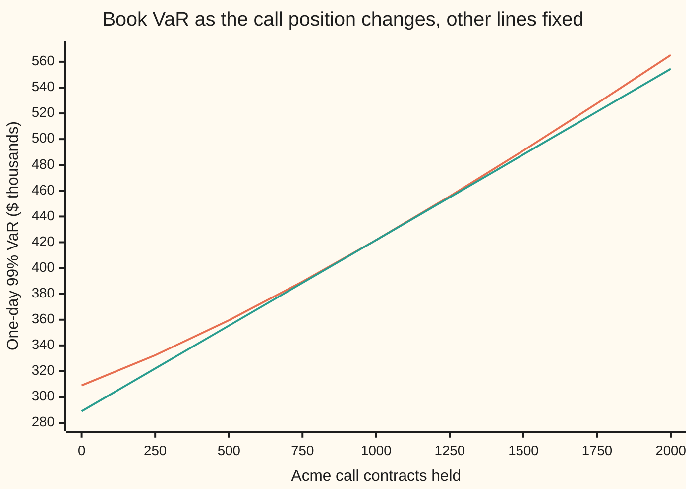

# Whose risk is it: marginal, incremental and component VaR by Euler's rule

Financial mathematics → Value at Risk and Expected Shortfall → Risk attribution → Whose risk is it

---

## General Overview

A trading book holds three things: $10 million of shares, $5 million of bonds, and 1,000 Acme call contracts, each on 100 Acme shares. Its one-day 99 percent value at risk, the loss it should exceed on only one day in a hundred, is **$421.74k** (k means thousands of dollars throughout). That number was built from the whole book at once ([parametric-var-and-delta-normal](02-parametric-var-and-delta-normal.md)).

The head of the desk now asks a different question: **whose risk is it?** Which line should be cut, and which is quietly helping? The obvious answer is to measure each line alone and compare. Alone, the shares have a VaR of $314.06k, the bonds $34.90k, the calls $172.00k. Those add to $520.95k, which is more than the book's $421.74k. Standalone numbers ignore the fact that the lines partly cancel each other, so they cannot be pieces of the total.

The fix is to split the total by **slopes**. Ask how fast the book's VaR rises when one line grows by a dollar, then multiply by the dollars already in that line. The results are called **component VaRs**, and they add up to the total exactly. For this book the shares carry $292.71k, which is **69.40 percent**, about 70 percent. The calls carry 31.48 percent. The bonds carry **minus** 0.89 percent: they are a hedge, and the arithmetic says so.

Two neighbours of the component answer other questions. **Marginal VaR** is the slope itself: the extra VaR per extra dollar in one line. **Incremental VaR** is the change in VaR after a real trade, recomputed on the whole book.

**Multiply each line's marginal VaR by the size of that line and the pieces add up to the book's VaR exactly, because doubling every position doubles the VaR.**

**What kind of fact this is:** a theorem, Euler's rule for functions that scale with their inputs, proved on this card in Why it works; the component VaR it produces is a definition built on top of it.

### The picture: alone against in the book

```
line      $k, one character = $10k
shares    alone      ███████████████████████████████  $314.06
          in book    █████████████████████████████    $292.71
bonds     alone      ███                              $34.90
          in book    ▏ below zero                     -$3.73
calls     alone      █████████████████                $172.00
          in book    █████████████                    $132.77
```

Every line shrinks once it sits in the book, because the other lines absorb some of its bad days. The bonds flip sign. They lose money on days the shares gain, and the book's bad days are mostly share days, so the bonds tend to make money on exactly those days.

---

## The formula

$$C_i \;=\; x_i\,M_i \;=\; x_i\,\frac{\partial V}{\partial x_i} \;=\; z\,\frac{x_i\,(\Sigma x)_i}{\sigma_p}, \qquad \sum_i C_i \;=\; V.$$

**Read it aloud:** a line's share of the book's VaR is its size times the rate at which VaR climbs as that line grows, and the shares add up to the whole.

The notation, in words first. The book has lines numbered 1, 2, 3 (shares, bonds, calls). A letter with a small i under it means "the one for line i". The curly ∂ means a slope with every other line held fixed ([gradient-and-directional-derivatives](../../06-Calculus%20and%20analysis/07-Several%20Variables/03-gradient-and-directional-derivatives.md)). $(\Sigma x)_i$ is entry i of the covariance table multiplied into the list of positions.

| Symbol | Plain meaning | In our example | Push it up and the answer… |
| --- | --- | --- | --- |
| $x_i$ | dollars exposed to line i; for the calls, delta times shares times price | $10,000k, $5,000k, $5,868.51k | book VaR moves by the line's marginal VaR per extra dollar |
| $\sigma_i$ | one-day volatility of line i: the typical size of one day's move, as a fraction | 1.35%, 0.30%, 20% ÷ √252 | the line's standalone VaR grows in proportion |
| $\rho_{ij}$, $\Sigma$ | correlation of lines i and j, from −1 (opposite) to +1 (together); the covariance table, whose entry i, j is correlation times the two volatilities | shares–Acme 0.5, shares–bonds −0.2, bonds–Acme −0.1 | for two long lines, book VaR grows |
| $(\Sigma x)_i$ | how line i's move goes with the whole book's P&L, in dollars | $2,281.07, −$58.18, $1,763.03 | the line's marginal VaR grows |
| $\sigma_p$ | the book's one-day standard deviation of P&L, in dollars | $181.29k | VaR grows in proportion |
| $z$ | the 99 percent point of the standard bell curve | 2.326348 | VaR and every component grow in proportion |
| $V$ | the book's value at risk | $421.74k | — |
| $M_i$ | marginal VaR: extra VaR per extra dollar in line i | 2.9271¢, −0.0747¢, 2.2624¢ per dollar | — |
| $C_i$ | component VaR: line i's piece of $V$ | $292.71k, −$3.73k, $132.77k | — |
| $k$ | the expected-shortfall multiplier: bell-curve height at $z$ divided by 0.01 | 2.665214 | expected shortfall and its pieces grow |
| $\lambda$ | a scale factor applied to every position at once | 1 in the book; 2 in the doubling test | VaR grows by the same factor |
| $L_i$, $L$ | tomorrow's loss on line i, and on the whole book (their sum) | one random day | — |

The helpers, each in one line:

$$\sigma_p = \sqrt{\textstyle\sum_{i,j} x_i\,\Sigma_{ij}\,x_j}, \qquad V = z\,\sigma_p, \qquad M_i = z\,\frac{(\Sigma x)_i}{\sigma_p}.$$

The first is the book's spread from the covariance table, the second turns spread into a 99 percent loss, the third is the slope of the second. The same split works for expected shortfall, the average loss on the worst 1 percent of days ([expected-shortfall-and-coherence](05-expected-shortfall-and-coherence.md)): replace $z$ by $k$ and the pieces add to the book's expected shortfall of $483.18k.

### When it holds

- **The risk measure scales with the book.** Double every position and VaR doubles. That holds when prices do not react to the book's own trades. For a position too large to sell in a day, doubling it more than doubles the real risk, and the pieces stop adding to anything meaningful.
- **The measure has a slope at this book.** The normal formula needs $\sigma_p > 0$. A VaR read off a finite list of simulated days jumps from one day to the next as positions change, so its slopes are noisy; smoothing, or using expected shortfall, fixes that.
- **The delta mapping of the calls.** The calls enter as $5,868.51k of Acme shares. That ignores their curvature (gamma), so their component is the delta-normal one; the curvature correction is [delta-gamma-var-and-cornish-fisher](04-delta-gamma-var-and-cornish-fisher.md).
- **One fixed model of tomorrow.** Components answer "under these volatilities and correlations". Change the correlation of shares and Acme from 0.5 to 0.9 and the shares' share of VaR falls from 69.40 to 65.61 percent without a single trade.

---

## Why it works

### Step 0: VaR scales with the book

Take every position and double it. Every day's P&L doubles, so the loss exceeded one day in a hundred doubles too. The same holds for any positive factor $\lambda$: VaR of the scaled book is $\lambda$ times VaR of the book. The check confirms it: VaR of the doubled book divided by VaR of the book is 2.000000. This single property, called **positive homogeneity of degree one**, is the whole reason the pieces add up.

### Step 1: the slope of the book's spread

The book's variance is a sum over every pair of lines:

$$\sigma_p^2 = \sum_{i,j} x_i\,\Sigma_{ij}\,x_j.$$

Line i appears in row i and in column i. Differentiating with respect to its size picks up both, and since the table is symmetric they are equal, so the slope of the variance is $2(\Sigma x)_i$. The slope of a square root is one over twice the root, so

$$\frac{\partial \sigma_p}{\partial x_i} = \frac{(\Sigma x)_i}{\sigma_p}, \qquad M_i = z\,\frac{(\Sigma x)_i}{\sigma_p}.$$

The ratio $(\Sigma x)_i / \sigma_p$ has a plain reading. It is line i's volatility times its correlation with the whole book. A line that rises when the book falls has a negative correlation, and a negative marginal VaR: adding to it lowers the book's risk. For the bonds, $(\Sigma x)_i$ is −$58.18, so each extra dollar of bonds removes 0.0747 cents of VaR.

### Step 2: Euler's rule turns slopes into pieces

Write $V(\lambda x)$ for VaR of the book with every position multiplied by $\lambda$. Step 0 says this equals $\lambda V(x)$. Differentiate both sides with respect to $\lambda$ and set $\lambda = 1$. The right side gives $V$. The left side, by the chain rule, is each position times the slope in its direction, added up. So

$$\sum_i x_i\,\frac{\partial V}{\partial x_i} = V.$$

That is Euler's rule. It needs nothing about the bell curve: any measure that scales with the book and has slopes there splits exactly this way. For the normal formula it can be checked directly, since $\sum_i x_i (\Sigma x)_i$ is $\sigma_p^2$, so $\sum_i C_i = z\sigma_p^2/\sigma_p = z\sigma_p = V$.

<details>
<summary>Detailed proof: Euler's rule for a function that scales with its inputs</summary>

Let $V$ be any rule that takes a list of positions to a number, with $V(\lambda x) = \lambda V(x)$ for every $\lambda > 0$, and let it be differentiable at the book: near $x$ its change is its gradient dotted with the move, up to an error smaller than the move.

Follow the straight path $\lambda \mapsto V(\lambda x)$. By scaling it equals $\lambda V(x)$, a straight line in $\lambda$ whose slope at $\lambda = 1$ is $V(x)$.

The same path, moved from $\lambda = 1$ to $\lambda = 1 + \epsilon$ for a small number epsilon, moves the positions from $x$ to $x + \epsilon x$. Differentiability gives $V(x + \epsilon x) - V(x) = \epsilon\,\nabla V(x)\cdot x$ plus an error smaller than epsilon, so the slope at $\lambda = 1$ is also $\nabla V(x)\cdot x = \sum_i x_i\,\partial V/\partial x_i$.

One path, one slope, two expressions for it: they are equal, which is the rule. Differentiability matters: a book with no risk at all, $\sigma_p = 0$, has a VaR that bends at a corner, and components there are not defined.

</details>

### Step 3: what a component is, day by day

The slope formula has a second reading that needs no calculus. Write $L_i$ for line i's loss tomorrow and $L$ for the book's loss, their sum. Under the bell-curve model, the average of $L_i$ over the days when the book loses exactly $V$ is

$$\text{average of } L_i \text{ given } L = V \;=\; \frac{\text{covariance of } L_i \text{ and } L}{\text{variance of } L}\times V \;=\; \frac{x_i(\Sigma x)_i}{\sigma_p^2}\times z\sigma_p \;=\; C_i.$$

So **a component is what that line lost, on average, on the days the book lost its VaR.** On those days the shares lost $292.71k on average, the calls $132.77k, and the bonds made $3.73k. The first equality is the usual fact that for two jointly normal quantities, the average of one given the other is a straight line in the other.

Expected shortfall splits the same way, with "the book lost at least its VaR" in place of "exactly": each line's average loss over the worst 1 percent of days. That reading is how simulation-based desks compute components, and it is the third road in the code.

### Step 4: marginal is a tangent, incremental is the curve

Now grow or shrink the call position, holding the rest fixed, and recompute VaR each time.



The orange curve is the book's VaR recomputed at each size: incremental VaR is the gap between two points on it. The green straight line is the tangent at today's 1,000 contracts; its slope is the calls' marginal VaR. The two touch at $421.74k and the curve lies above the tangent everywhere else.

That last fact is general. $\sigma_p$ is a length, and a length bends upward along any straight path, so VaR is **convex** in each position. Follow the tangent from 1,000 contracts down to zero and it lands at $V - C_i$, since the drop along the tangent is the slope times the whole position. The curve lies above it, so **selling a line entirely saves at most its component**. Selling all the calls saves $112.77k, not $132.77k. Selling all the bonds saves nothing: VaR rises by $5.15k, more than the $3.73k the component predicts, because a hedge removed is worth more than its tangent says.

For small trades the tangent is excellent. Buying $100k more shares raises VaR by $2,928.63; marginal VaR times $100k predicts $2,927.11.

The same split for expected shortfall is Tasche's Euler principle, and its tail-average reading is on [expected-shortfall-and-coherence](05-expected-shortfall-and-coherence.md), which also explains why expected shortfall, unlike VaR, never rewards splitting a book.

---

## Worked numbers, by hand

The book is the one on [parametric-var-and-delta-normal](02-parametric-var-and-delta-normal.md). Shares: $10,000k with daily volatility 1.35 percent. Bonds: $5,000k. Their price moves 5 percent for each percentage point the five-year yield moves, and the yield's daily volatility is 6 basis points (hundredths of a percent), so the bonds' daily volatility is 5 × 0.06 = 0.30 percent. A bond's price falls when its yield rises, so the yield's correlations there (0.2 with shares, 0.1 with Acme) become −0.2 and −0.1 here. Calls: on Acme, whose daily volatility is the house 20 percent divided by √252 trading days.

| Step | Arithmetic | Value |
| --- | --- | --- |
| call delta, house Acme call | $e^{-0.02}\,N(0.25)$, with N the bell-curve area to the left | 0.586851 |
| calls as Acme dollars | 1,000 × 100 × 0.586851 × $100 | $5,868.51k |
| shares row of $\Sigma x$ | 0.0135 × 0.0135 × 10,000k − 0.2 × 0.0135 × 0.003 × 5,000k + 0.5 × 0.0135 × (0.20 ÷ √252) × 5,868.51k | $2,281.07 |
| bonds and calls rows | same recipe | −$58.18, $1,763.03 |
| each line's $x_i(\Sigma x)_i$ | 10,000k × 2,281.07, and so on | 22,810.70, −290.90, 10,346.37 ($k)^2 |
| book variance, $\sigma_p^2$ | sum of the three | 32,866.17 ($k)^2 |
| book spread, $\sigma_p$ | square root | $181.29k |
| book VaR, $V$ | 2.326348 × 181.29k | $421.74k |
| shares marginal, $M_i$ | 2.326348 × 2,281.07 ÷ 181,290 | 2.9271¢ per dollar |
| shares component, $C_i$ | 10,000k × 0.029271 | $292.71k |
| **shares' share of VaR** | 22,810.70 ÷ 32,866.17 | **69.40%** |

The shares' share is the shares' row of the variance divided by the whole variance: $z$ and the square root cancel. So seven dollars in every ten of this book's VaR belong to the shares, three to the calls, and the bonds hand back almost one dollar in a hundred.

### What breaks if you drop a piece

| Mistake | Comes out at | What went wrong |
| --- | --- | --- |
| Share of standalone VaRs | shares 60.29%, of a total $520.95k | Standalone VaRs ignore correlation, so they do not add to the book's $421.74k |
| Own variance only, covariances dropped | shares 76.20% | The shares' correlation with the calls and bonds is where the rest lives |
| Pieces taken as "VaR saved by removing the line" | sum $357.32k, not $421.74k | Removal is a finite move along a convex curve; those savings never add to the total |
| Marginal VaR read as the piece | 2.9271¢ for the shares | A slope per dollar; it becomes a piece only when multiplied by the $10,000k held |

---

## Code, from first principles, and it actually runs

The code builds its own bell-curve area (Simpson's rule), its own 99 percent point (bisection) and its own random numbers (a 64-bit generator with a Box–Muller step). It reaches the components by three independent roads: the gradient formula; nudging each position by one part in ten thousand and watching VaR move, with no gradient formula used; and simulating 400,000 days, checked first for the model's correlations, then averaging each line's loss over the days near the VaR and over the worst 1 percent. It then recomputes whole-book trades for incremental VaR, reproduces every "what breaks" number, and prints the chart.

### Python

```python
# Whose risk is it: component VaR by Euler's rule -- the check behind the card.
# Standard library only.  Nothing imported knows the answer: the normal CDF is
# Simpson's rule on the bell curve, the 99% point is found by bisection, the
# random numbers come from a 64-bit generator written out here.
from math import sqrt, exp, log, cos, sin, pi

def phi(x): return exp(-0.5 * x * x) / sqrt(2.0 * pi)      # bell-curve height
def N(x, n=2000):                                          # bell-curve area left of x
    h = x / n
    s = phi(0.0) + phi(x) + sum((4 if i % 2 else 2) * phi(i * h) for i in range(1, n))
    return 0.5 + s * h / 3.0
def z_of(p):                                               # bisection: N(z) = p
    lo, hi = 0.0, 10.0
    for _ in range(100):
        mid = 0.5 * (lo + hi)
        lo, hi = (mid, hi) if N(mid) < p else (lo, mid)
    return 0.5 * (lo + hi)

# ---- the book: shares, bonds, and 1,000 Acme call contracts of 100 shares each ----
delta = exp(-0.02) * N(0.25)                     # house call's delta, d1 = 0.25
x = [10_000_000.0, 5_000_000.0, 1000 * 100 * delta * 100.0]   # dollars exposed, calls by delta
vol = [0.0135, 5 * 0.0006, 0.20 / sqrt(252)]     # one-day vols; bonds: 5-year duration x 6 bp
rho = [[1.0, -0.2, 0.5], [-0.2, 1.0, -0.1], [0.5, -0.1, 1.0]]   # bond price, so yield corrs flip sign
cov = [[rho[i][j] * vol[i] * vol[j] for j in range(3)] for i in range(3)]
names = ["shares", "bonds", "calls"]
z = z_of(0.99)
k = phi(z) / 0.01                                # normal ES multiplier

def sd(p): return sqrt(sum(p[i] * cov[i][j] * p[j] for i in range(3) for j in range(3)))
def var(p): return z * sd(p)

# Road 1: the gradient formula, dV/dx_i = z (Sigma x)_i / sigma
s = sd(x); V = var(x); ES = k * s
Sx = [sum(cov[i][j] * x[j] for j in range(3)) for i in range(3)]
marg = [z * Sx[i] / s for i in range(3)]
comp = [x[i] * marg[i] for i in range(3)]
comp_es = [k * x[i] * Sx[i] / s for i in range(3)]
# Road 2: nudge each position and watch VaR move (no gradient formula used)
fd = []
for i in range(3):
    h = 1e-4 * x[i]
    up = x[:]; up[i] += h; dn = x[:]; dn[i] -= h
    fd.append(x[i] * (var(up) - var(dn)) / (2 * h))
# Road 3: simulate 400,000 days and average each line's loss on the worst days
L = [[1.0, 0.0, 0.0], [0.0] * 3, [0.0] * 3]      # Cholesky factor of rho, by hand
L[1][0] = rho[1][0]; L[1][1] = sqrt(1 - L[1][0] ** 2)
L[2][0] = rho[2][0]; L[2][1] = (rho[2][1] - L[2][0] * L[1][0]) / L[1][1]
L[2][2] = sqrt(1 - L[2][0] ** 2 - L[2][1] ** 2)
state = 20260928
def unif():
    global state
    state = (state * 6364136223846793005 + 1442695040888963407) % 2 ** 64
    return ((state >> 11) + 0.5) / 2 ** 53
days, M = [], 400_000
for _ in range(M):
    a, b = sqrt(-2 * log(unif())), 2 * pi * unif()
    c, g = sqrt(-2 * log(unif())), 2 * pi * unif()
    e = [a * cos(b), a * sin(b), c * cos(g)]     # three independent bell-curve draws
    w = [sum(L[i][j] * e[j] for j in range(3)) for i in range(3)]
    loss = [-x[i] * vol[i] * w[i] for i in range(3)]
    days.append((sum(loss), loss))
days.sort(key=lambda d: -d[0])
tail = M // 100
mc_var = days[tail][0]
mc_es = [sum(d[1][i] for d in days[:tail]) / tail for i in range(3)]
band = days[tail - 400: tail + 400]              # days whose loss sits near the VaR
mc_vc = [sum(d[1][i] for d in band) / len(band) for i in range(3)]
mc_sd = sqrt(sum(d[0] ** 2 for d in days) / M)

def t(v): return f"{v / 1000:10.2f}"             # thousands of dollars
print(f"z(99%) {z:.6f}   ES multiplier {k:.6f}   call delta {delta:.6f}")
print(f"exposure $k      {t(x[0])}{t(x[1])}{t(x[2])}")
print("Sigma x, dollars   " + "".join(f"{v:10.2f}" for v in Sx))
print("x_i (Sigma x)_i $k^2" + "".join(f"{x[i] * Sx[i] / 1e6:12.2f}" for i in range(3))
      + f"  sum {sum(x[i] * Sx[i] for i in range(3)) / 1e6:.2f}")
print(f"one-day sd $k {t(s)}   sd by simulation {t(mc_sd)}")
print(f"VaR 99% $k    {t(V)}   VaR by simulation {t(mc_var)}")
print(f"ES 99% $k     {t(ES)}   ES by simulation {t(sum(mc_es))}")
print(f"{'line':<8}{'marg c/$':>10}{'comp VaR':>10}{'by nudge':>10}{'by sim':>10}{'share %':>10}{'comp ES':>10}{'ES sim':>10}")
for i in range(3):
    print(f"{names[i]:<8}{100 * marg[i]:10.4f}{t(comp[i])}{t(fd[i])}{t(mc_vc[i])}"
          f"{100 * comp[i] / V:10.2f}{t(comp_es[i])}{t(mc_es[i])}")
print(f"{'sum':<8}{'':>10}{t(sum(comp))}{t(sum(fd))}{t(sum(mc_vc))}{100 * sum(comp) / V:10.2f}"
      f"{t(sum(comp_es))}{t(sum(mc_es))}")
print(f"Euler by scaling: VaR(2x) / VaR(x) = {var([2 * v for v in x]) / V:.6f}")
# ---- incremental VaR: recompute the whole book after a real trade ----
for i in range(3):
    p = x[:]; p[i] = 0.0
    print(f"sell all {names[i]:<7} VaR {t(var(p))}  change {t(var(p) - V)}  minus component {t(-comp[i])}")
p = x[:]; p[0] += 100_000.0
print(f"buy $100k shares: change {var(p) - V:10.2f}   marginal x 100k {marg[0] * 100_000:10.2f}")
# ---- what breaks ----
alone = [z * abs(x[i]) * vol[i] for i in range(3)]
print("standalone VaR $k " + "".join(t(a) for a in alone) + f"  sum {t(sum(alone))}")
print(f"wrong: shares % of standalone sum {100 * alone[0] / sum(alone):6.2f}")
own = [x[i] ** 2 * cov[i][i] for i in range(3)]
print(f"wrong: shares % of own-variance sum {100 * own[0] / sum(own):6.2f}")
print(f"wrong: remove-one changes summed $k {t(sum(V - var([0.0 if j == i else x[j] for j in range(3)]) for i in range(3)))}")
# ---- chart: VaR as the call position grows, and the tangent at 1,000 contracts ----
cs = [250 * n for n in range(9)]
curve = [var([x[0], x[1], c * 100 * delta * 100.0]) for c in cs]
tang = [V + marg[2] * (c - 1000) * 100 * delta * 100.0 for c in cs]
print("chart contracts " + " ".join(f"{c:7d}" for c in cs))
print("chart VaR $k    " + " ".join(f"{v / 1000:7.2f}" for v in curve))
print("chart tangent $k" + " ".join(f"{v / 1000:7.2f}" for v in tang))
# ---- try changing ----
for label, r in (("try: shares-Acme corr 0", 0.0), ("try: shares-Acme corr 0.9", 0.9)):
    rr = [row[:] for row in rho]; rr[0][2] = rr[2][0] = r
    cv = [[rr[i][j] * vol[i] * vol[j] for j in range(3)] for i in range(3)]
    sv = sqrt(sum(x[i] * cv[i][j] * x[j] for i in range(3) for j in range(3)))
    sh = x[0] * sum(cv[0][j] * x[j] for j in range(3)) / sv ** 2
    print(f"{label:<27} VaR {t(z * sv)}  shares % {100 * sh:6.2f}")

assert abs(sum(fd) - V) < 1e-6 * V                     # nudged pieces add to the total
assert all(abs(fd[i] - comp[i]) < 1e-6 * V for i in range(3))
assert abs(mc_var - V) < 0.02 * V                      # simulation lands on the formula
assert all(abs(sum(d[1][i] * d[1][j] for d in days) / (M * x[i] * vol[i] * x[j] * vol[j]) - rho[i][j]) < 0.01
           for i in range(3) for j in range(3))    # simulated days carry the model's correlations
assert all(abs(mc_es[i] - comp_es[i]) < 0.02 * ES for i in range(3))
assert all(abs(mc_vc[i] - comp[i]) < 0.03 * V for i in range(3))
assert 0.69 < comp[0] / V < 0.70                        # about 70 percent, as on the card
assert V - var([x[0], x[1], 0.0]) < comp[2]            # a whole sale saves less than the component
print("ALL CHECKS PASS")
```

**Ran 2026-09-28 on macOS, Python 3.14.6, standard library only. All checks passed. Output, pasted from the run:**

```
z(99%) 2.326348   ES multiplier 2.665214   call delta 0.586851
exposure $k        10000.00   5000.00   5868.51
Sigma x, dollars      2281.07    -58.18   1763.03
x_i (Sigma x)_i $k^2    22810.70     -290.90    10346.37  sum 32866.17
one-day sd $k     181.29   sd by simulation     181.32
VaR 99% $k        421.74   VaR by simulation     422.54
ES 99% $k         483.18   ES by simulation     483.53
line      marg c/$  comp VaR  by nudge    by sim   share %   comp ES    ES sim
shares      2.9271    292.71    292.71    294.04     69.40    335.35    335.37
bonds      -0.0747     -3.73     -3.73     -3.73     -0.89     -4.28     -4.66
calls       2.2624    132.77    132.77    132.10     31.48    152.11    152.81
sum                   421.74    421.74    422.41    100.00    483.18    483.53
Euler by scaling: VaR(2x) / VaR(x) = 2.000000
sell all shares  VaR     172.05  change    -249.69  minus component    -292.71
sell all bonds   VaR     426.89  change       5.15  minus component       3.73
sell all calls   VaR     308.98  change    -112.77  minus component    -132.77
buy $100k shares: change    2928.63   marginal x 100k    2927.11
standalone VaR $k     314.06     34.90    172.00  sum     520.95
wrong: shares % of standalone sum  60.29
wrong: shares % of own-variance sum  76.20
wrong: remove-one changes summed $k     357.32
chart contracts       0     250     500     750    1000    1250    1500    1750    2000
chart VaR $k     308.98  332.44  359.54  389.51  421.74  455.76  491.18  527.73  565.19
chart tangent $k 288.98  322.17  355.36  388.55  421.74  454.94  488.13  521.32  554.51
try: shares-Acme corr 0     VaR     351.92  shares %  77.87
try: shares-Acme corr 0.9   VaR     470.19  shares %  65.61
ALL CHECKS PASS
```

### Rust

Same model, same generator seed, same labels; built with `rustc --edition 2021 -O`.

```rust
// Whose risk is it: component VaR by Euler's rule -- the same check in Rust.
// Standard library only, no crates.  The normal CDF is Simpson's rule on the
// bell curve, the 99% point is found by bisection, the random numbers come
// from a 64-bit generator written out here.
use std::f64::consts::PI;

fn phi(x: f64) -> f64 { (-0.5 * x * x).exp() / (2.0 * PI).sqrt() }
fn n_cdf(x: f64) -> f64 {
    let n = 2000;
    let h = x / n as f64;
    let mut inner = 0.0;
    for i in 1..n { inner += if i % 2 == 1 { 4.0 } else { 2.0 } * phi(i as f64 * h); }
    0.5 + (phi(0.0) + phi(x) + inner) * h / 3.0
}
fn z_of(p: f64) -> f64 {
    let (mut lo, mut hi) = (0.0, 10.0);
    for _ in 0..100 {
        let mid = 0.5 * (lo + hi);
        if n_cdf(mid) < p { lo = mid } else { hi = mid }
    }
    0.5 * (lo + hi)
}
fn sd(p: &[f64; 3], cov: &[[f64; 3]; 3]) -> f64 {
    let mut v = 0.0;
    for i in 0..3 { for j in 0..3 { v += p[i] * cov[i][j] * p[j]; } }
    v.sqrt()
}
fn t(v: f64) -> String { format!("{:10.2}", v / 1000.0) }

fn main() {
    let delta = (-0.02f64).exp() * n_cdf(0.25);
    let x = [10_000_000.0, 5_000_000.0, 1000.0 * 100.0 * delta * 100.0];
    let vol = [0.0135, 5.0 * 0.0006, 0.20 / 252f64.sqrt()]; // bonds: 5-year duration x 6 bp
    let rho = [[1.0, -0.2, 0.5], [-0.2, 1.0, -0.1], [0.5, -0.1, 1.0]]; // bond price: yield corrs flip sign
    let mk = |r: &[[f64; 3]; 3]| -> [[f64; 3]; 3] {
        let mut c = [[0.0; 3]; 3];
        for i in 0..3 { for j in 0..3 { c[i][j] = r[i][j] * vol[i] * vol[j]; } }
        c
    };
    let cov = mk(&rho);
    let names = ["shares", "bonds", "calls"];
    let z = z_of(0.99);
    let k = phi(z) / 0.01;
    let var = |p: &[f64; 3]| z * sd(p, &cov);

    // Road 1: the gradient formula
    let s = sd(&x, &cov); let v_tot = var(&x); let es = k * s;
    let sx: [f64; 3] = std::array::from_fn(|i| (0..3).map(|j| cov[i][j] * x[j]).sum());
    let marg: [f64; 3] = std::array::from_fn(|i| z * sx[i] / s);
    let comp: [f64; 3] = std::array::from_fn(|i| x[i] * marg[i]);
    let comp_es: [f64; 3] = std::array::from_fn(|i| k * x[i] * sx[i] / s);
    // Road 2: nudge each position
    let fd: [f64; 3] = std::array::from_fn(|i| {
        let h = 1e-4 * x[i];
        let (mut up, mut dn) = (x, x);
        up[i] += h; dn[i] -= h;
        x[i] * (var(&up) - var(&dn)) / (2.0 * h)
    });
    // Road 3: simulate 400,000 days
    let mut l = [[1.0, 0.0, 0.0], [0.0; 3], [0.0; 3]];
    l[1][0] = rho[1][0]; l[1][1] = (1.0 - l[1][0] * l[1][0]).sqrt();
    l[2][0] = rho[2][0]; l[2][1] = (rho[2][1] - l[2][0] * l[1][0]) / l[1][1];
    l[2][2] = (1.0 - l[2][0] * l[2][0] - l[2][1] * l[2][1]).sqrt();
    let mut state: u64 = 20260928;
    let mut unif = || {
        state = state.wrapping_mul(6364136223846793005).wrapping_add(1442695040888963407);
        ((state >> 11) as f64 + 0.5) / 9007199254740992.0
    };
    let m = 400_000usize;
    let mut days: Vec<(f64, [f64; 3])> = Vec::with_capacity(m);
    for _ in 0..m {
        let (a, b) = ((-2.0 * unif().ln()).sqrt(), 2.0 * PI * unif());
        let (c, g) = ((-2.0 * unif().ln()).sqrt(), 2.0 * PI * unif());
        let e = [a * b.cos(), a * b.sin(), c * g.cos()];
        let w: [f64; 3] = std::array::from_fn(|i| { let mut acc = 0.0; for j in 0..3 { acc += l[i][j] * e[j]; } acc });
        let loss: [f64; 3] = std::array::from_fn(|i| -x[i] * vol[i] * w[i]);
        days.push((loss[0] + loss[1] + loss[2], loss));
    }
    days.sort_by(|p, q| q.0.partial_cmp(&p.0).unwrap());
    let tail = m / 100;
    let mc_var = days[tail].0;
    let mc_es: [f64; 3] = std::array::from_fn(|i| days[..tail].iter().map(|d| d.1[i]).sum::<f64>() / tail as f64);
    let band = &days[tail - 400..tail + 400];
    let mc_vc: [f64; 3] = std::array::from_fn(|i| band.iter().map(|d| d.1[i]).sum::<f64>() / band.len() as f64);
    let mc_sd = (days.iter().map(|d| d.0 * d.0).sum::<f64>() / m as f64).sqrt();

    println!("z(99%) {:.6}   ES multiplier {:.6}   call delta {:.6}", z, k, delta);
    println!("exposure $k      {}{}{}", t(x[0]), t(x[1]), t(x[2]));
    println!("Sigma x, dollars   {}", sx.iter().map(|v| format!("{:10.2}", v)).collect::<String>());
    println!("x_i (Sigma x)_i $k^2{}  sum {:.2}", (0..3).map(|i| format!("{:12.2}", x[i] * sx[i] / 1e6)).collect::<String>(),
             (0..3).map(|i| x[i] * sx[i]).sum::<f64>() / 1e6);
    println!("one-day sd $k {}   sd by simulation {}", t(s), t(mc_sd));
    println!("VaR 99% $k    {}   VaR by simulation {}", t(v_tot), t(mc_var));
    println!("ES 99% $k     {}   ES by simulation {}", t(es), t(mc_es.iter().sum()));
    println!("{:<8}{:>10}{:>10}{:>10}{:>10}{:>10}{:>10}{:>10}", "line", "marg c/$", "comp VaR", "by nudge", "by sim", "share %", "comp ES", "ES sim");
    for i in 0..3 {
        println!("{:<8}{:10.4}{}{}{}{:10.2}{}{}", names[i], 100.0 * marg[i], t(comp[i]), t(fd[i]), t(mc_vc[i]),
                 100.0 * comp[i] / v_tot, t(comp_es[i]), t(mc_es[i]));
    }
    let sum = |a: &[f64; 3]| a[0] + a[1] + a[2];
    println!("{:<8}{:>10}{}{}{}{:10.2}{}{}", "sum", "", t(sum(&comp)), t(sum(&fd)), t(sum(&mc_vc)),
             100.0 * sum(&comp) / v_tot, t(sum(&comp_es)), t(sum(&mc_es)));
    println!("Euler by scaling: VaR(2x) / VaR(x) = {:.6}", var(&[2.0 * x[0], 2.0 * x[1], 2.0 * x[2]]) / v_tot);
    for i in 0..3 {
        let mut p = x; p[i] = 0.0;
        println!("sell all {:<7} VaR {}  change {}  minus component {}", names[i], t(var(&p)), t(var(&p) - v_tot), t(-comp[i]));
    }
    let mut p = x; p[0] += 100_000.0;
    println!("buy $100k shares: change {:10.2}   marginal x 100k {:10.2}", var(&p) - v_tot, marg[0] * 100_000.0);
    let alone: [f64; 3] = std::array::from_fn(|i| z * x[i].abs() * vol[i]);
    println!("standalone VaR $k {}{}{}  sum {}", t(alone[0]), t(alone[1]), t(alone[2]), t(sum(&alone)));
    println!("wrong: shares % of standalone sum {:6.2}", 100.0 * alone[0] / sum(&alone));
    let own: [f64; 3] = std::array::from_fn(|i| x[i] * x[i] * cov[i][i]);
    println!("wrong: shares % of own-variance sum {:6.2}", 100.0 * own[0] / sum(&own));
    let rem: f64 = (0..3).map(|i| { let mut p = x; p[i] = 0.0; v_tot - var(&p) }).sum();
    println!("wrong: remove-one changes summed $k {}", t(rem));
    let cs: Vec<i64> = (0..9).map(|n| 250 * n).collect();
    let curve: Vec<f64> = cs.iter().map(|&c| var(&[x[0], x[1], c as f64 * 100.0 * delta * 100.0])).collect();
    let tang: Vec<f64> = cs.iter().map(|&c| v_tot + marg[2] * (c - 1000) as f64 * 100.0 * delta * 100.0).collect();
    let row = |v: &Vec<f64>| v.iter().map(|y| format!("{:7.2}", y / 1000.0)).collect::<Vec<_>>().join(" ");
    println!("chart contracts {}", cs.iter().map(|c| format!("{:7}", c)).collect::<Vec<_>>().join(" "));
    println!("chart VaR $k    {}", row(&curve));
    println!("chart tangent $k{}", row(&tang));
    for (label, r) in [("try: shares-Acme corr 0", 0.0), ("try: shares-Acme corr 0.9", 0.9)] {
        let mut rr = rho; rr[0][2] = r; rr[2][0] = r;
        let cv = mk(&rr);
        let sv = sd(&x, &cv);
        let sh = x[0] * (0..3).map(|j| cv[0][j] * x[j]).sum::<f64>() / (sv * sv);
        println!("{:<27} VaR {}  shares % {:6.2}", label, t(z * sv), 100.0 * sh);
    }

    assert!((sum(&fd) - v_tot).abs() < 1e-6 * v_tot);
    assert!((0..3).all(|i| (fd[i] - comp[i]).abs() < 1e-6 * v_tot));
    assert!((mc_var - v_tot).abs() < 0.02 * v_tot);
    assert!((0..9).all(|n| { let (i, j) = (n / 3, n % 3);
        (days.iter().map(|d| d.1[i] * d.1[j]).sum::<f64>() / (m as f64 * x[i] * vol[i] * x[j] * vol[j]) - rho[i][j]).abs() < 0.01 }));
    assert!((0..3).all(|i| (mc_es[i] - comp_es[i]).abs() < 0.02 * es));
    assert!((0..3).all(|i| (mc_vc[i] - comp[i]).abs() < 0.03 * v_tot));
    assert!(0.69 < comp[0] / v_tot && comp[0] / v_tot < 0.70);
    assert!(v_tot - var(&[x[0], x[1], 0.0]) < comp[2]);
    println!("ALL CHECKS PASS");
}
```

**Ran 2026-09-28 on macOS, rustc 1.98.1, no crates. All checks passed. Output, pasted from the run:**

```
z(99%) 2.326348   ES multiplier 2.665214   call delta 0.586851
exposure $k        10000.00   5000.00   5868.51
Sigma x, dollars      2281.07    -58.18   1763.03
x_i (Sigma x)_i $k^2    22810.70     -290.90    10346.37  sum 32866.17
one-day sd $k     181.29   sd by simulation     181.32
VaR 99% $k        421.74   VaR by simulation     422.54
ES 99% $k         483.18   ES by simulation     483.53
line      marg c/$  comp VaR  by nudge    by sim   share %   comp ES    ES sim
shares      2.9271    292.71    292.71    294.04     69.40    335.35    335.37
bonds      -0.0747     -3.73     -3.73     -3.73     -0.89     -4.28     -4.66
calls       2.2624    132.77    132.77    132.10     31.48    152.11    152.81
sum                   421.74    421.74    422.41    100.00    483.18    483.53
Euler by scaling: VaR(2x) / VaR(x) = 2.000000
sell all shares  VaR     172.05  change    -249.69  minus component    -292.71
sell all bonds   VaR     426.89  change       5.15  minus component       3.73
sell all calls   VaR     308.98  change    -112.77  minus component    -132.77
buy $100k shares: change    2928.63   marginal x 100k    2927.11
standalone VaR $k     314.06     34.90    172.00  sum     520.95
wrong: shares % of standalone sum  60.29
wrong: shares % of own-variance sum  76.20
wrong: remove-one changes summed $k     357.32
chart contracts       0     250     500     750    1000    1250    1500    1750    2000
chart VaR $k     308.98  332.44  359.54  389.51  421.74  455.76  491.18  527.73  565.19
chart tangent $k 288.98  322.17  355.36  388.55  421.74  454.94  488.13  521.32  554.51
try: shares-Acme corr 0     VaR     351.92  shares %  77.87
try: shares-Acme corr 0.9   VaR     470.19  shares %  65.61
ALL CHECKS PASS
```

The two outputs match line for line, simulated rows included, because both run the same written-out generator from the same seed. The nudged components equal the formula's to the printed digit. The simulated VaR is $422.54k against $421.74k, and the simulated pieces sit close to the formula's, off by the noise of averaging 800 or 4,000 random days.

> [!TIP]
> **Try changing**
> Guess the direction first, then run it.
> - **Break the link between shares and Acme.** Set the shares–Acme correlation in `rho` to 0. VaR falls to **$351.92k** and the shares' share rises to **77.87 percent**: the calls no longer ride on the shares' bad days, so less of the book's tail is theirs.
> - **Tie them tighter.** Set it to 0.9. VaR rises to **$470.19k** and the shares' share falls to **65.61 percent**. The shares did not change; the calls moved into their bad days.
> - **Test the tangent.** Buy $100k more shares: VaR rises **$2,928.63**, against **$2,927.11** from marginal VaR. Sell all the bonds instead: VaR rises **$5.15k**, against $3.73k from the component.
> - **Remove the covariances.** Replace `Sx` by each line's own variance times its size. The nudge assert stops the run: those pieces no longer match the slopes of the real VaR.

---

## The usual mistake

> [!warning]
> **Reading a component as "what selling this line would save".** It is not. A component is a slope times a size, measured at today's book. Selling a whole line is a large move along a curve that bends upward, so it saves at most the component and usually less: selling all the calls saves $112.77k, not $132.77k. For a real trade, recompute the book (incremental VaR).
>
> - **Adding standalone VaRs.** They sum to $520.95k for a book whose VaR is $421.74k, and they put the shares at 60.29 percent instead of 69.40.
> - **Treating a negative component as an error.** The bonds' −$3.73k says they hedge the book at the margin. Components can be negative, and the others can then exceed 100 percent of the total.
> - **Components from a simulation's single worst day.** A VaR read off one ranked day moves in jumps, and the loss split on that one day is noise. Average over nearby days, as the code does, or split expected shortfall instead.
> - **Forgetting the model moved.** Correlations change without any trade. The shares' share went from 69.40 to 65.61 percent when one correlation went from 0.5 to 0.9.

---

## Where you meet it in real life

- **Risk limits by desk.** A bank computes one VaR or expected shortfall for the whole firm and gives each desk its component as its usage against a limit. The pieces add up, so the desks' usages add to the firm's number.
- **Capital allocation.** The capital a bank holds is charged back to business lines by Euler's rule, so each line's return can be measured against the capital its risk actually consumes.
- **Hot spots and hedges.** A component list sorted by size shows where risk sits; a negative marginal shows which positions would hedge the book if added to. Litterman's 1996 paper named the practice.
- **Risk parity.** Funds that promise "equal risk from each asset class" size positions until the components are equal, which is a stronger demand than equal standalone risk.
- **Checking the model.** Components summed across a book must equal the book's VaR. A risk system whose pieces do not add up has a bug or an unstated approximation. Historical and simulated VaRs ([historical-and-monte-carlo-var](03-historical-and-monte-carlo-var.md)) use the tail-average reading of Step 3.

> **Say it back**
> Standalone VaRs cannot be pieces of a book's VaR, because the lines partly cancel. Marginal VaR is the slope of the book's VaR in one position; multiplied by that position it gives the component. Because VaR doubles when the book doubles, Euler's rule makes the components add up to the total exactly. A component is also what the line lost, on average, on the days the book lost its VaR. It is not what selling the line would save; that is incremental VaR, and on a convex curve it is never more than the component.

---

## What this builds on

- [parametric-var-and-delta-normal](02-parametric-var-and-delta-normal.md): VaR as $z$ times a spread built from a covariance table, and the delta mapping of the calls into Acme dollars.
- [gradient-and-directional-derivatives](../../06-Calculus%20and%20analysis/07-Several%20Variables/03-gradient-and-directional-derivatives.md): slopes in one direction with the others held fixed, and the chain rule along a straight path used in Euler's rule.

## Where this goes next

- [extreme-value-theory-and-tails](07-extreme-value-theory-and-tails.md): models of the far tail, where the bell curve's split of the worst days stops being trustworthy.
- [backtesting-var](08-backtesting-var.md): counting the days the book actually lost more than its VaR, which tests the total the components divide.

The components divide a VaR that the model asserts; whether the model's bad days look like the market's is the question the tail and backtesting cards answer.

---

## Sources

Verified 28 Sep 2026: every link below resolves to the cited work (DOIs checked against Crossref).

- Tasche, Dirk. "Capital Allocation to Business Units and Sub-Portfolios: the Euler Principle." 2008. [arXiv:0708.2542](https://arxiv.org/abs/0708.2542). Euler's rule as the allocation principle for VaR and expected shortfall, and why it is the only one consistent with performance measurement.
- Gourieroux, Christian, Jean-Paul Laurent, and Olivier Scaillet. "Sensitivity Analysis of Values at Risk." *Journal of Empirical Finance* 7 (2000): 225–245. [doi:10.1016/S0927-5398(00)00011-6](https://doi.org/10.1016/S0927-5398(00)00011-6). The slope of VaR as the average line loss on the days the book loses its VaR: Step 3.
- Acerbi, Carlo, and Dirk Tasche. "On the Coherence of Expected Shortfall." *Journal of Banking & Finance* 26 (2002): 1487–1503. [doi:10.1016/S0378-4266(02)00283-2](https://doi.org/10.1016/S0378-4266(02)00283-2). Expected shortfall as a tail average, the reading behind its components.
- Litterman, Robert. "Hot Spots and Hedges." *Journal of Portfolio Management* 23 (1996): 52–75. [doi:10.3905/jpm.1996.052](https://doi.org/10.3905/jpm.1996.052). Marginal and component risk as a trader's tool for finding where risk sits.
