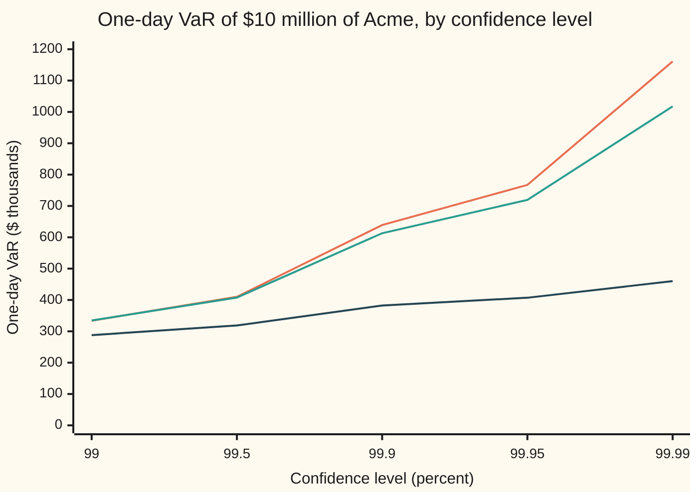

# Extreme value theory: modelling the tail beyond the data

[Syllabus](../../../SYLLABUS.md) → [Financial mathematics](../README.md) → [Value at Risk and Expected Shortfall](../README.md#s39) → Extreme value theory

---

## General Overview

A desk holds $10 million of Acme shares. Acme moves about 20 percent a year, which is about $125,988.16 of profit or loss on a typical day. The risk team keeps ten years of daily results: 2,520 trading days. The risk committee asks one question. How much could the desk lose on its worst day in a thousand?

That number is the 99.9 percent **value at risk** (VaR): the one-day loss that is exceeded on only one day in a thousand ([Value at risk](01-profit-and-loss-distribution-and-var.md)). Ten years should see it passed about 2.52 times. So the answer sits among the three worst days on record, and the three worst days are mostly luck. Read off the third-worst day and the typical miss, from one decade to the next, is $112,769.79. Assume a bell curve instead and the answer is $382,390.74 against a true $639,037.86.

Extreme value theory, EVT for short, is the way out. It sets a high line, here the 127th-worst day, and keeps the 126 days that crossed it. A deep result says those crossings, measured past the line, follow one family of laws whatever the market's everyday behaviour: the **generalised Pareto distribution**. Fit that family to the 126 crossings, and the one-in-a-thousand loss follows from a formula, not from the three luckiest data points.

**Past a high enough threshold, every tail that thins in a regular way looks like a generalised Pareto, so a fit to the many moderate extremes predicts the few severe ones.**

**What kind of fact this is:** a method, resting on a limit theorem (Balkema and de Haan 1974, Pickands 1975); the heavy-tailed case that finance needs is proved on this card in Why it works, and the general theorem is stated and cited.

### The picture: three answers that part company in the tail

The data behind every number on this card come from a known law, so the true answer is available to grade the estimates. Daily losses are drawn from a Student t law with 4 degrees of freedom (a bell-like curve with fatter tails), scaled to the $125,988.16 daily spread. One decade is drawn for the worked numbers. It is then the first of 400 decades drawn to see how the estimates scatter.



Top line (orange): the true law. Middle line (green): the EVT estimate from one decade. Bottom line (dark): a normal law with the decade's own spread. At 99 percent the three are close: $333.80, $334.52 and $287.87 thousand. At 99.9 percent the normal answer is $382,390.74 against a truth of $639,037.86. At 99.99 percent the decade's largest loss, $954,722.80, is already below the truth, and only a tail model can answer at all.

---

## The formula

Two words first. A **threshold**, written $u$, is a fixed loss level chosen by the analyst. An **exceedance** is a day whose loss $L$ passes it, and its **excess** is how far past: $y = L - u$.

The generalised Pareto law says how far past the threshold the excess runs:

$$P(L - u > y \mid L > u) \approx \left(1 + \frac{\xi\, y}{\beta}\right)^{-1/\xi}$$

Two numbers fix the law. The **shape** $\xi$ (the Greek letter xi) says how slowly the tail thins. The **scale** $\beta$ (beta), in dollars, sets the typical size of an excess.

**Read it aloud:** among the days that cross the threshold, the share that cross it by more than $y$ dollars falls off as one plus shape times excess over scale, raised to minus one over the shape.

Multiply by the chance of crossing at all, $k/n$, set the result equal to the one-day-in-a-thousand chance $1 - p$, and solve for the loss:

$$\mathrm{VaR}_p = u + \frac{\beta}{\xi}\left[\left(\frac{1-p}{k/n}\right)^{-\xi} - 1\right]$$

**Read it aloud:** the value at risk is the threshold, plus the scale over the shape times the amount by which a power of the rarity ratio exceeds one.

The expected shortfall, the average loss on the days worse than VaR ([Expected shortfall](05-expected-shortfall-and-coherence.md)), follows for $\xi$ below 1:

$$\mathrm{ES}_p = \frac{\mathrm{VaR}_p + \beta - \xi u}{1 - \xi}$$

**Read it aloud:** expected shortfall is VaR plus scale minus shape times threshold, all divided by one minus the shape.

| Symbol | Plain meaning | In our example | Push it up and the answer… |
| --- | --- | --- | --- |
| $L$ | one day's loss in dollars; a gain is a negative loss | largest in the decade $954,722.80 | — |
| $n$ | days of history | 2,520 | the historical answer steadies; the formula is unchanged |
| $u$ | the threshold: a high loss level fixed in advance | $193,128.79, the 127th-worst day | fewer, more extreme points: less bias, more noise |
| $k$ | days whose loss passed $u$ | 126, so $k/n$ is 0.05 | the threshold drops: more points, more bias |
| $y$ | the excess: loss minus threshold, on an exceedance day | from 0 up to the worst loss minus $u$ | — |
| $\xi$ | shape: how slowly the tail thins; above 0 means a power law | 0.162034 fitted, 0.25 true | VaR and ES climb steeply |
| $\beta$ | scale: the typical size of an excess, in dollars | $76,893.74 | VaR and ES rise in step |
| $p$ | confidence level | 0.999 | VaR rises, faster the larger $\xi$ |
| $\mathrm{VaR}_p$ | the loss passed on a share $1-p$ of days | $613,066.11 by EVT | — |
| $\mathrm{ES}_p$ | the average loss on the days past VaR | $786,029.95 by EVT | — |
| $\alpha$ | tail index: the power in a tail that falls like one over loss to the $\alpha$ | 4, so $\xi = 1/\alpha$ = 0.25 | thinner tail, smaller $\xi$ |
| $\nu$ | degrees of freedom of the Student t law behind the data | 4 | thinner tails; the t law nears the normal |

The ratio $(1-p)/(k/n)$ is the **rarity ratio**: 0.001 over 0.05, which is 0.02. The one-in-a-thousand day is a one-in-fifty day among the exceedances. The formula only has to extrapolate from one in fifty, not from one in a thousand.

### When it holds

- **Losses from day to day are independent and alike.** Real markets cluster: calm months, then violent ones. Fit to raw returns and the answer is an average over both regimes. The standard repair (McNeil and Frey 2000) fits the day-to-day volatility first and applies EVT to what is left.
- **The tail thins regularly.** The theorem needs the tail to look like a power law, an exponential, or a hard cap, from some point on. A book with a cliff in its payoff, such as a short digital option, breaks this.
- **The threshold is high enough, and not too high.** Too low and the fit includes days from the ordinary body of the law: with 252 exceedances the shape falls to 0.108961. Too high and the fit rests on a handful of days.
- **$\xi$ below 1 for expected shortfall, and $1-p$ below $k/n$ for the VaR formula.** At $\xi$ of 1 or more the average loss past VaR is infinite. At $1-p$ above $k/n$ the answer sits below the threshold, where the ordinary historical quantile applies.

---

## Why it works

### Step 0: past a high line, only the rate of thinning matters

A tail is the part of a law far from the middle. How often mild losses happen, whether the body is skewed, whether there are two humps: none of it matters once the loss is past a high enough line. What remains is one fact: how fast the chance of a bigger loss falls away. That one fact is one number, the shape $\xi$, plus a scale that says where the tail sits.

### Step 1: an exact power law gives a generalised Pareto exactly

Take a tail that is a pure power law: the chance of a loss above $x$ is $C x^{-\alpha}$, for some constant $C > 0$ and every $x$ above some floor. Divide the chance of passing $u + y$ by the chance of passing $u$:

$$P(L > u + y \mid L > u) = \frac{C (u+y)^{-\alpha}}{C u^{-\alpha}} = \left(1 + \frac{y}{u}\right)^{-\alpha}$$

The constant cancels. Write $\xi = 1/\alpha$ and $\beta = \xi u$. Then $y/u = \xi y / \beta$ and the power $-\alpha$ is $-1/\xi$. The result is the generalised Pareto law with shape $1/\alpha$ and scale $u/\alpha$. The scale grows with the threshold: the further out, the bigger the typical excess. That is what "heavy tail" means in numbers ([Heavy tails](../../09-Probability%20and%20statistics/04-Continuous%20Distributions/08-heavy-tails-pareto-and-cauchy.md)).

### Step 2: a tail that is a power law only roughly gives it in the limit

Real tails are not pure power laws. The Student t law with $\nu$ = 4 degrees of freedom has a tail that falls like one over loss to the fourth only for large losses. Write such a tail as $x^{-\alpha}$ times a correction factor that varies slowly: a factor whose value at twice, or at any fixed multiple of, a large loss is almost its value at that loss. Divide as in Step 1. The power part gives the same generalised Pareto. The correction factor appears as a ratio of its values at two nearby large losses, and that ratio tends to 1 as the threshold rises. So the excess law tends to the generalised Pareto, with shape $1/\alpha$. For the data here that is $1/\nu$ = 0.25.

<details>
<summary>Detailed proof: slowly varying corrections vanish</summary>

Suppose $P(L > x) = x^{-\alpha} \ell(x)$ where the factor $\ell(x)$ is **slowly varying**: for every fixed $t > 0$, $\ell(tx)/\ell(x) \to 1$ as $x \to \infty$. Measure excesses in units of the threshold: fix $s \ge 0$ and put $y = s u$. Then

$$P(L - u > s u \mid L > u) = \frac{(u(1+s))^{-\alpha}\, \ell(u(1+s))}{u^{-\alpha}\, \ell(u)} = (1+s)^{-\alpha} \cdot \frac{\ell((1+s)u)}{\ell(u)}$$

The last fraction tends to 1 as $u \to \infty$, by the definition with $t = 1 + s$. So for every $s \ge 0$ the scaled excess $(L-u)/u$ has survival chance tending to $(1+s)^{-\alpha}$. That limit is continuous, so the laws converge. With $\xi = 1/\alpha$ and $\beta = \xi u$ the limit is the generalised Pareto of Step 1. Every Student t, every Pareto, and the tails usually measured in daily stock returns are of this kind.

</details>

### Step 3: the generalised Pareto is the only possible limit

The theorem of Balkema and de Haan (1974) and Pickands (1975) says more. For any law, if the excesses over a rising threshold, rescaled by some $\beta$ that depends on the threshold, settle to a limit that is not stuck at one point, that limit is a generalised Pareto. There are three cases.

- **$\xi$ above 0: power tails.** Steps 1 and 2. Student t, Pareto, stock returns.
- **$\xi$ equal to 0: exponential tails.** The formula becomes $e^{-y/\beta}$. The normal law is in this class, though its excesses reach the limit slowly.
- **$\xi$ below 0: a hard ceiling.** The excess cannot pass $-\beta/\xi$. A loss capped by the book's size is of this kind.

The card uses the theorem and proves only the power-tail case above. The same three shapes appear for the largest of $n$ losses, where the matching result is the Fisher–Tippett theorem ([Order statistics](../../09-Probability%20and%20statistics/05-Transformations%20and%20Joint%20Laws/08-order-statistics-and-extremes.md)).

### Step 4: stitch the counted part to the fitted part

The chance of a loss above some $x$ past the threshold splits in two:

$$P(L > x) = P(L > u) \cdot P(L - u > x - u \mid L > u) \approx \frac{k}{n}\left(1 + \frac{\xi (x - u)}{\beta}\right)^{-1/\xi}$$

The first factor is counted from the data: 126 of 2,520 days, 0.05. A count of 126 is steady. The second factor is the fitted law. Neither piece needs a day beyond the data.

### Step 5: solve for the loss, once the answer is known to exist

Set the right side of Step 4 equal to $1 - p$ and solve for $x$.

- **Existence and uniqueness.** At $x = u$ the right side is $k/n$. As $x$ grows it falls without a break, steadily, to 0: as $x$ runs to infinity when $\xi \ge 0$, at the ceiling $u - \beta/\xi$ when $\xi < 0$. A strictly falling curve crosses each level once. So one answer exists exactly when $1 - p$ is between 0 and $k/n$.
- **The solve.** Divide by $k/n$, raise both sides to the power $-\xi$, subtract 1, multiply by $\beta/\xi$, add $u$. That is the VaR formula.
- **Boundary cases.** If $1 - p$ is at least $k/n$, the answer lies at or below the threshold and the historical quantile is the right tool. As $\xi$ tends to 0 the formula tends to $u + \beta \ln\big((k/n)/(1-p)\big)$, the exponential-tail answer. For $\xi < 0$ the answer always lies below the ceiling.

### Step 6: expected shortfall from the mean of the excess

A generalised Pareto has a property called **threshold stability**: the excess over any higher level $v > u$ is again a generalised Pareto, with the same shape and a scale that grows to $\beta + \xi (v - u)$. Check it by dividing the survival chance at $v + w$ by the one at $v > u$; the ratio has the same form.

The mean of a generalised Pareto with scale $b > 0$ is $b/(1 - \xi)$ when $\xi$ is below 1. So the average loss past VaR is VaR plus the mean excess past VaR:

$$\mathrm{ES}_p = \mathrm{VaR}_p + \frac{\beta + \xi(\mathrm{VaR}_p - u)}{1 - \xi} = \frac{\mathrm{VaR}_p + \beta - \xi u}{1 - \xi}$$

The mean excess grows in a straight line with the level, with slope $\xi/(1-\xi)$. Plotting the average excess against the threshold, and looking for where it turns straight, is the usual way to pick $u$.

### Step 7: fitting the shape and scale

Two fits, each a separate road.

- **Maximum likelihood** chooses the $\xi$ and $\beta$ under which the 126 observed excesses were most probable. There is no closed form, so the code searches.
- **Probability-weighted moments** (Hosking and Wallis 1987) match two averages: the mean excess, and the mean excess weighted by the chance of being exceeded. Both have closed forms in $\xi$ and $\beta$, so solving is algebra.

<details>
<summary>The algebra behind the two fits</summary>

**Likelihood.** The density of an excess is $\frac{1}{\beta}(1 + \xi y/\beta)^{-1/\xi - 1}$. The log-likelihood of $k$ excesses is $-k \ln \beta - (1 + 1/\xi)\sum \ln(1 + \xi y/\beta)$. Write the ratio $\xi/\beta$ as a single number. For a fixed ratio, setting the derivative in $\xi$ to zero gives $\xi$ as the average of $\ln(1 + (\xi/\beta)\, y)$. Substituting back leaves a function of the ratio alone, which a golden-section search (shrink the bracket by the golden ratio each round) maximises. The code confirms the answer by a separate route: both slopes of the full log-likelihood, taken by finite differences, print as zero.

**Moments.** For a generalised Pareto the average excess is $a_0 = \beta/(1-\xi)$, and the average of each excess times the share of excesses above it is $a_1 = \beta/(2(2-\xi))$. Then $a_0/(a_0 - 2a_1) = 2 - \xi$, so $\xi = 2 - a_0/(a_0 - 2a_1)$ and $\beta = 2 a_0 a_1/(a_0 - 2a_1)$.

</details>

A second route to the whole method takes each year's single worst day and fits the generalised extreme value law to those maxima ([Order statistics](../../09-Probability%20and%20statistics/05-Transformations%20and%20Joint%20Laws/08-order-statistics-and-extremes.md)). Ten years give ten maxima. The threshold route keeps 126 points from the same data, which is why risk desks prefer it.

---

## Worked numbers, by hand

The decade's 2,520 losses, sorted. The threshold is the 127th-worst, $193,128.79. The likelihood fit gives shape 0.162034 and scale $76,893.74.

| Step | Arithmetic | Value |
| --- | --- | --- |
| crossing rate | $k/n$ = 126 / 2,520 | 0.05 |
| rarity ratio | 0.001 / 0.05 | 0.02 |
| power of it | 0.02 to the power −0.162034 | 1.884911 |
| scale over shape | 76,893.74 / 0.162034 | 474,553.27 |
| VaR | 193,128.79 + 474,553.27 × (1.884911 − 1) | **$613,066.11** |
| scale minus shape times threshold | 76,893.74 − 0.162034 × 193,128.79 | 45,600.32 |
| ES | (613,066.11 + 45,600.32) / (1 − 0.162034) | **$786,029.95** |

On one day in a thousand the desk should expect to lose more than $613,066.11, and on those days $786,029.95 on average. The true values of the law behind the data are $639,037.86 and $862,916.99.

```
99.9% one-day VaR for $10 million of Acme, five answers (each █ = $25,000)
normal law, decade's spread   ███████████████            $382,390.74
EVT, moments fit              ████████████████████████   $606,831.77
EVT, likelihood fit           █████████████████████████  $613,066.11
true law                      ██████████████████████████ $639,037.86
historical, 3rd-worst day     ███████████████████████████ $669,877.11
```

In this decade the third-worst day happens to land near the truth. Across 400 decades it does not do so reliably: its typical miss, measured as the root mean square error (the square root of the average squared miss), is $112,769.79. The likelihood fit misses by $82,769.01, the moments fit by $81,774.32, the normal law by $250,200.71. The normal law averages $389,247.18 against a truth of $639,037.86: it is not noisy, it is wrong.

### What breaks if you drop a piece

| Mistake | Comes out at | What went wrong |
| --- | --- | --- |
| Normal law with the decade's own spread | $382,390.74 | a bell curve's tail thins faster than any power; 15 days of the decade passed it, against 2.52 expected |
| Exponential tail: shape forced to 0 | $552,348.09 | the right family, wrong member; it drops the power law that Step 2 proved |
| 0.001 used as the chance inside the tail | $1,171,980.99 | the crossing rate $k/n$ left out; the rarity ratio must be 0.02, not 0.001 |
| 99 percent historical VaR scaled by 3.09 / 2.33 | $453,190.17 | the normal ratio of the two quantiles imposed on a tail that is not normal |

---

## Code, from first principles, and it actually runs

The code draws the decade from its own random number generator, then reaches the 99.9 percent VaR by three independent roads. Road 1 is the true law: the Student t tail integrated numerically and inverted by bisection, checked against the t law's closed-form quantile. Road 2 is EVT: a generalised Pareto fitted by likelihood and by moments, and its VaR found both by formula and by inverting the fitted tail. Road 3 draws 400 decades and grades every estimator against Road 1. The normal quantile, Simpson's rule, the root finder and the search are all written out.

### Python

```python
# Extreme value theory: fit a generalised Pareto to the losses past a threshold, extrapolate the 99.9% VaR.
from math import sqrt, log, cos, acos, pi

BOOK, VOL, NU, DAYS, K, P = 10_000_000.0, 0.20, 4.0, 2520, 126, 0.999   # $10m of Acme; 20%/yr; t, 4 dof
SD = BOOK * VOL / sqrt(252.0)                     # daily sd of the dollar loss: $125,988
SCALE = SD * sqrt((NU - 2.0) / NU)                # loss = SCALE * T, T a Student t with 4 dof
M64 = (1 << 64) - 1

def tot(xs):                                      # plain left-to-right sum, the same order as Rust
    s = 0.0
    for v in xs: s += v
    return s

class Rng:                                        # splitmix64: the same stream in both languages
    def __init__(self, seed): self.s = seed
    def unif(self):                               # uniform on (0, 1]
        self.s = (self.s + 0x9E3779B97F4A7C15) & M64
        z = ((self.s ^ (self.s >> 30)) * 0xBF58476D1CE4E5B9) & M64
        z = ((z ^ (z >> 27)) * 0x94D049BB133111EB) & M64
        return 1.0 - ((z ^ (z >> 31)) >> 11) / 9007199254740992.0
    def loss(self):                               # normal / sqrt(chi-square with 4 dof / 4)
        u1 = self.unif(); u2 = self.unif(); u3 = self.unif(); u4 = self.unif()
        z = sqrt(-2.0 * log(u1)) * cos(2.0 * pi * u2)
        return SCALE * z / sqrt(-2.0 * (log(u3) + log(u4)) / NU)

def simpson(f, a, b, n=2000):
    h = (b - a) / n
    return (f(a) + f(b) + tot((4.0 if i % 2 else 2.0) * f(a + i * h) for i in range(1, n))) * h / 3.0
def bisect(g, lo, hi):                            # g changes sign once on [lo, hi]
    for _ in range(200):
        mid = 0.5 * (lo + hi)
        if (g(lo) > 0) == (g(mid) > 0): lo = mid
        else: hi = mid
    return 0.5 * (lo + hi)

# ---- road 1: the true law. t density 0.375 (1 + x^2/4)^-2.5, integrated after x = 1/w ----
t_tail = lambda t: simpson(lambda w: 0.375 * w ** 3 * (w * w + 0.25) ** -2.5, 0.0, 1.0 / t)
t_mean = lambda t: simpson(lambda w: 0.375 * w * w * (w * w + 0.25) ** -2.5, 0.0, 1.0 / t)
def t_quantile(p):                                # closed form for 4 dof
    a = 4.0 * p * (1.0 - p); q = cos(acos(sqrt(a)) / 3.0) / sqrt(a)
    return 2.0 * sqrt(q - 1.0)
q_bis = bisect(lambda t: t_tail(t) - (1.0 - P), 1.0, 100.0)
q_cf = t_quantile(P)
es_int = SCALE * t_mean(q_cf) / (1.0 - P)
es_cf = SCALE * (NU + q_cf * q_cf) / (NU - 1.0) * 0.375 * (1.0 + q_cf * q_cf / 4.0) ** -2.5 / (1.0 - P)
z999 = bisect(lambda x: 0.5 - simpson(lambda s: 0.3989422804014327 * 2.718281828459045 ** (-s * s / 2), 0.0, x) - (1.0 - P), 0.0, 10.0)

# ---- road 2: the generalised Pareto fitted to one decade's exceedances ----
def fit_mle(y):                                   # profile likelihood in th = xi / beta, golden section
    k = len(y)
    xi_of = lambda th: tot(log(1.0 + th * v) for v in y) / k
    prof = lambda th: -k * log(xi_of(th) / th) - k * xi_of(th) - k
    a, b, g = -0.999 / max(y), 50.0 / (tot(y) / k), (sqrt(5.0) - 1.0) / 2.0
    for _ in range(150):
        c, d = b - g * (b - a), a + g * (b - a)
        if prof(c) > prof(d): b = d
        else: a = c
    th = 0.5 * (a + b); xi = xi_of(th)
    return xi, xi / th
def fit_pwm(y):                                   # probability-weighted moments (Hosking and Wallis)
    k = len(y); a0 = tot(y) / k
    a1 = tot((1.0 - (i + 0.65) / k) * v for i, v in enumerate(y)) / k
    return 2.0 - a0 / (a0 - 2.0 * a1), 2.0 * a0 * a1 / (a0 - 2.0 * a1)
def loglik(xi, beta, y): return -len(y) * log(beta) - (1.0 + 1.0 / xi) * tot(log(1.0 + xi * v / beta) for v in y)
def gpd_var(u, xi, beta, frac, p): return u + beta / xi * (((1.0 - p) / frac) ** -xi - 1.0)
def gpd_es(var, u, xi, beta): return (var + beta - xi * u) / (1.0 - xi)
def split(losses, k):                             # sorted losses, threshold, sorted excesses
    s = sorted(losses); n = len(s); u = s[n - k - 1]
    return s, u, [v - u for v in s[n - k:]]
def sample_sd(x): m = tot(x) / len(x); return sqrt(tot((v - m) * (v - m) for v in x) / (len(x) - 1))
HIST = -(-DAYS * 999 // 1000) - 1                 # 0-based rank of the 99.9% historical loss

rng = Rng(20260928)
losses = [rng.loss() for _ in range(DAYS)]
s, u, y = split(losses, K)
xi, beta = fit_mle(y); xp, bp = fit_pwm(y); frac = K / DAYS
v_evt = gpd_var(u, xi, beta, frac, P)
tail = lambda x: frac * (1.0 + xi * (x - u) / beta) ** (-1.0 / xi)
v_bis = bisect(lambda x: tail(x) - (1.0 - P), u, u + 1e8)
es_evt = gpd_es(v_evt, u, xi, beta)
es_evt_int = v_evt + simpson(lambda w: 0.0 if w == 0 else tail(v_evt / w) * v_evt / (w * w), 0.0, 1.0) / (1.0 - P)
sd = sample_sd(losses); v_true = SCALE * q_cf; v_norm = z999 * sd
h1, h2 = 1e-6, 1e-6 * beta
g_xi = (loglik(xi + h1, beta, y) - loglik(xi - h1, beta, y)) / (2 * h1)
g_beta = beta * (loglik(xi, beta + h2, y) - loglik(xi, beta - h2, y)) / (2 * h2)

rows = [("daily sd, the law", SD), ("true tail index xi = 1/nu", 1.0 / NU), ("expected days past VaR in 2520", DAYS * (1.0 - P)),
    ("hand: k/n", frac), ("hand: (1-p)/(k/n)", (1.0 - P) / frac), ("hand: ((1-p)/(k/n))^-xi", ((1.0 - P) / frac) ** -xi),
    ("hand: beta/xi", beta / xi), ("hand: beta - xi u", beta - xi * u), ("daily sd, sample", sd), ("largest loss in the decade", s[-1]), ("threshold u, 127th largest", u),
    ("MLE xi", xi), ("MLE beta", beta), ("PWM xi", xp), ("PWM beta", bp),
    ("MLE score d/dxi", g_xi), ("MLE score beta d/dbeta", g_beta),
    ("true t quantile, bisection", q_bis), ("true t quantile, closed form", q_cf),
    ("normal quantile z, bisection", z999),
    ("VaR true law", v_true), ("VaR normal, sample sd", v_norm), ("VaR historical, 3rd largest", s[HIST]),
    ("VaR EVT, MLE formula", v_evt), ("VaR EVT, MLE by bisection", v_bis), ("VaR EVT, PWM", gpd_var(u, xp, bp, frac, P)),
    ("ES true law, integral", es_int), ("ES true law, closed form", es_cf),
    ("ES EVT, formula", es_evt), ("ES EVT, integral", es_evt_int),
    ("ES normal, sample sd", sd * 0.3989422804014327 * 2.718281828459045 ** (-z999 * z999 / 2) / (1.0 - P)),
    ("wrong: 0.001 used inside the tail", gpd_var(u, xi, beta, 1.0, P)),
    ("wrong: exponential tail, xi = 0", u + tot(y) / K * log(frac / (1.0 - P))),
    ("wrong: 99% historical times 3.09/2.33", s[-(-DAYS * 99 // 100) - 1] * z999 / 2.3263478740408408)]
for k2 in (50, 252):
    _, u2, y2 = split(losses, k2); x2, b2 = fit_mle(y2)
    rows += [(f"try: k = {k2}, xi", x2), (f"try: k = {k2}, VaR EVT", gpd_var(u2, x2, b2, k2 / DAYS, P))]
rows += [("try: 99.99% VaR EVT", gpd_var(u, xi, beta, frac, 0.9999)), ("try: 99.99% VaR true", SCALE * t_quantile(0.9999))]
for name, v in rows: print(f"{name:<40} {v:>14.6f}")
past = [sum(1 for v in losses if v > lim) for lim in (v_true, v_norm, v_evt)]
print(f"days past VaR in the decade: true {past[0]}, normal {past[1]}, EVT {past[2]}")

print("bars, 99.9% VaR ($)" + "".join(f" {v:.2f}" for v in (v_norm, v_evt, gpd_var(u, xp, bp, frac, P), v_true, s[HIST])))
# ---- chart: VaR in $ thousands at five levels ----
LEVELS = (0.99, 0.995, 0.999, 0.9995, 0.9999)
zs = [bisect(lambda x: 0.5 - simpson(lambda s_: 0.3989422804014327 * 2.718281828459045 ** (-s_ * s_ / 2), 0.0, x) - (1.0 - p), 0.0, 10.0) for p in LEVELS]
print("chart, level     " + "".join(f"{p * 100:>10.2f}" for p in LEVELS))
print("chart, true      " + "".join(f"{SCALE * t_quantile(p) / 1000:>10.2f}" for p in LEVELS))
print("chart, EVT       " + "".join(f"{gpd_var(u, xi, beta, frac, p) / 1000:>10.2f}" for p in LEVELS))
print("chart, normal    " + "".join(f"{z * sd / 1000:>10.2f}" for z in zs))

# ---- road 3: 400 independent decades, the card's decade first ----
rng = Rng(20260928); err = [[0.0, 0.0] for _ in range(4)]; M = 400
for m in range(M):
    L = [rng.loss() for _ in range(DAYS)]; s_, u_, y_ = split(L, K)
    x_, b_ = fit_mle(y_); xq, bq = fit_pwm(y_)
    est = (z999 * sample_sd(L), s_[HIST], gpd_var(u_, x_, b_, frac, P), gpd_var(u_, xq, bq, frac, P))
    for j in range(4):
        err[j][0] += est[j] / M; err[j][1] += (est[j] - v_true) * (est[j] - v_true) / M
for j, name in enumerate(("normal", "historical", "EVT MLE", "EVT PWM")):
    print(f"study, {name:<11} mean {err[j][0]:>12.2f}   root mean square error {sqrt(err[j][1]):>11.2f}")

assert abs(q_bis - q_cf) < 1e-9,              "true quantile: Simpson + bisection vs closed form"
assert abs(es_int - es_cf) < 1e-3,            "true ES: integral vs closed form"
assert abs(v_evt - v_bis) < 1e-6,             "EVT VaR: formula vs inverting the fitted tail"
assert abs(es_evt - es_evt_int) < 1e-3,       "EVT ES: mean-excess formula vs integrating the fitted tail"
assert abs(g_xi) < 1e-3,                     "fitted xi is a stationary point of the likelihood"
assert abs(g_beta) < 1e-3,                   "fitted beta is a stationary point of the likelihood"
assert sqrt(err[2][1]) < sqrt(err[1][1]),     "EVT beats the raw historical estimate over 400 decades"
assert abs(z999 - 3.090232306167813) < 1e-9,  "normal 99.9% point vs its tabulated value"
print("ALL CHECKS PASS")
```

**Ran 2026-09-28 on macOS, Python 3.14.6, standard library only. All checks passed. Output, pasted from the run:**

```
daily sd, the law                         125988.157670
true tail index xi = 1/nu                      0.250000
expected days past VaR in 2520                 2.520000
hand: k/n                                      0.050000
hand: (1-p)/(k/n)                              0.020000
hand: ((1-p)/(k/n))^-xi                        1.884911
hand: beta/xi                             474553.269126
hand: beta - xi u                          45600.316595
daily sd, sample                          123741.746815
largest loss in the decade                954722.802352
threshold u, 127th largest                193128.792616
MLE xi                                         0.162034
MLE beta                                   76893.735690
PWM xi                                         0.145903
PWM beta                                   78426.968194
MLE score d/dxi                                0.000001
MLE score beta d/dbeta                        -0.000000
true t quantile, bisection                     7.173182
true t quantile, closed form                   7.173182
normal quantile z, bisection                   3.090232
VaR true law                              639037.862841
VaR normal, sample sd                     382390.743630
VaR historical, 3rd largest               669877.113784
VaR EVT, MLE formula                      613066.105714
VaR EVT, MLE by bisection                 613066.105714
VaR EVT, PWM                              606831.773389
ES true law, integral                     862916.992096
ES true law, closed form                  862916.992096
ES EVT, formula                           786029.951978
ES EVT, integral                          786029.951978
ES normal, sample sd                      416649.607819
wrong: 0.001 used inside the tail        1171980.985504
wrong: exponential tail, xi = 0           552348.092126
wrong: 99% historical times 3.09/2.33     453190.171599
try: k = 50, xi                                0.160115
try: k = 50, VaR EVT                      624848.015019
try: k = 252, xi                               0.108961
try: k = 252, VaR EVT                     605174.994002
try: 99.99% VaR EVT                      1017577.200881
try: 99.99% VaR true                     1161131.763602
days past VaR in the decade: true 3, normal 15, EVT 3
bars, 99.9% VaR ($) 382390.74 613066.11 606831.77 639037.86 669877.11
chart, level          99.00     99.50     99.90     99.95     99.99
chart, true          333.80    410.17    639.04    767.07   1161.13
chart, EVT           334.52    407.73    613.07    719.39   1017.58
chart, normal        287.87    318.74    382.39    407.18    460.20
study, normal      mean    389247.18   root mean square error   250200.71
study, historical  mean    642075.05   root mean square error   112769.79
study, EVT MLE     mean    631513.76   root mean square error    82769.01
study, EVT PWM     mean    632236.80   root mean square error    81774.32
ALL CHECKS PASS
```

### Rust

```rust
// Extreme value theory: fit a generalised Pareto to the losses past a threshold, extrapolate the 99.9% VaR.
use std::f64::consts::PI;

const BOOK: f64 = 10_000_000.0; const VOL: f64 = 0.20; const NU: f64 = 4.0;
const DAYS: usize = 2520; const K: usize = 126; const P: f64 = 0.999;
const PHI0: f64 = 0.3989422804014327; const E: f64 = 2.718281828459045;

fn tot<I: Iterator<Item = f64>>(xs: I) -> f64 { let mut s = 0.0; for v in xs { s += v; } s }

struct Rng { s: u64 }                               // splitmix64: the same stream in both languages
impl Rng {
    fn unif(&mut self) -> f64 {                     // uniform on (0, 1]
        self.s = self.s.wrapping_add(0x9E3779B97F4A7C15);
        let mut z = (self.s ^ (self.s >> 30)).wrapping_mul(0xBF58476D1CE4E5B9);
        z = (z ^ (z >> 27)).wrapping_mul(0x94D049BB133111EB);
        1.0 - ((z ^ (z >> 31)) >> 11) as f64 / 9007199254740992.0
    }
    fn loss(&mut self, scale: f64) -> f64 {         // normal / sqrt(chi-square with 4 dof / 4)
        let (u1, u2, u3, u4) = (self.unif(), self.unif(), self.unif(), self.unif());
        let z = (-2.0 * u1.ln()).sqrt() * (2.0 * PI * u2).cos();
        scale * z / (-2.0 * (u3.ln() + u4.ln()) / NU).sqrt()
    }
}

fn simpson<F: Fn(f64) -> f64>(f: F, a: f64, b: f64) -> f64 {
    let n = 2000; let h = (b - a) / n as f64;
    (f(a) + f(b) + tot((1..n).map(|i| (if i % 2 == 1 { 4.0 } else { 2.0 }) * f(a + i as f64 * h)))) * h / 3.0
}
fn bisect<F: Fn(f64) -> f64>(g: F, mut lo: f64, mut hi: f64) -> f64 {
    for _ in 0..200 {
        let mid = 0.5 * (lo + hi);
        if (g(lo) > 0.0) == (g(mid) > 0.0) { lo = mid } else { hi = mid }
    }
    0.5 * (lo + hi)
}
fn t_tail(t: f64) -> f64 { simpson(|w| 0.375 * w.powf(3.0) * (w * w + 0.25).powf(-2.5), 0.0, 1.0 / t) }
fn t_mean(t: f64) -> f64 { simpson(|w| 0.375 * w * w * (w * w + 0.25).powf(-2.5), 0.0, 1.0 / t) }
fn t_quantile(p: f64) -> f64 {                      // closed form for 4 dof
    let a = 4.0 * p * (1.0 - p); let q = (a.sqrt().acos() / 3.0).cos() / a.sqrt();
    2.0 * (q - 1.0).sqrt()
}
fn z_of(p: f64) -> f64 {
    bisect(|x| 0.5 - simpson(|s| PHI0 * E.powf(-s * s / 2.0), 0.0, x) - (1.0 - p), 0.0, 10.0)
}

fn fit_mle(y: &[f64]) -> (f64, f64) {               // profile likelihood in th = xi / beta, golden section
    let k = y.len() as f64;
    let xi_of = |th: f64| tot(y.iter().map(|v| (1.0 + th * v).ln())) / k;
    let prof = |th: f64| -k * (xi_of(th) / th).ln() - k * xi_of(th) - k;
    let ymax = y.iter().cloned().fold(f64::MIN, f64::max);
    let (mut a, mut b, g) = (-0.999 / ymax, 50.0 / (tot(y.iter().cloned()) / k), (5.0f64.sqrt() - 1.0) / 2.0);
    for _ in 0..150 {
        let (c, d) = (b - g * (b - a), a + g * (b - a));
        if prof(c) > prof(d) { b = d } else { a = c }
    }
    let th = 0.5 * (a + b); let xi = xi_of(th);
    (xi, xi / th)
}
fn fit_pwm(y: &[f64]) -> (f64, f64) {               // probability-weighted moments (Hosking and Wallis)
    let k = y.len() as f64; let a0 = tot(y.iter().cloned()) / k;
    let a1 = tot(y.iter().enumerate().map(|(i, v)| (1.0 - (i as f64 + 0.65) / k) * v)) / k;
    (2.0 - a0 / (a0 - 2.0 * a1), 2.0 * a0 * a1 / (a0 - 2.0 * a1))
}
fn loglik(xi: f64, beta: f64, y: &[f64]) -> f64 {
    -(y.len() as f64) * beta.ln() - (1.0 + 1.0 / xi) * tot(y.iter().map(|v| (1.0 + xi * v / beta).ln()))
}
fn gpd_var(u: f64, xi: f64, beta: f64, frac: f64, p: f64) -> f64 { u + beta / xi * (((1.0 - p) / frac).powf(-xi) - 1.0) }
fn gpd_es(var: f64, u: f64, xi: f64, beta: f64) -> f64 { (var + beta - xi * u) / (1.0 - xi) }
fn split(losses: &[f64], k: usize) -> (Vec<f64>, f64, Vec<f64>) {   // sorted losses, threshold, sorted excesses
    let mut s = losses.to_vec(); s.sort_by(|a, b| a.partial_cmp(b).unwrap());
    let n = s.len(); let u = s[n - k - 1];
    let y = s[n - k..].iter().map(|v| v - u).collect();
    (s, u, y)
}
fn sample_sd(x: &[f64]) -> f64 {
    let m = tot(x.iter().cloned()) / x.len() as f64;
    (tot(x.iter().map(|v| (v - m) * (v - m))) / (x.len() - 1) as f64).sqrt()
}

fn main() {
    let sd0 = BOOK * VOL / 252.0f64.sqrt();          // daily sd of the dollar loss: $125,988
    let scale = sd0 * ((NU - 2.0) / NU).sqrt();       // loss = scale * T, T a Student t with 4 dof
    let hist = (DAYS * 999 + 999) / 1000 - 1;         // 0-based rank of the 99.9% historical loss
    // ---- road 1: the true law ----
    let q_bis = bisect(|t| t_tail(t) - (1.0 - P), 1.0, 100.0);
    let q_cf = t_quantile(P);
    let es_int = scale * t_mean(q_cf) / (1.0 - P);
    let es_cf = scale * (NU + q_cf * q_cf) / (NU - 1.0) * 0.375 * (1.0 + q_cf * q_cf / 4.0).powf(-2.5) / (1.0 - P);
    let z999 = z_of(P);
    // ---- road 2: the generalised Pareto fitted to one decade's exceedances ----
    let mut rng = Rng { s: 20260928 };
    let losses: Vec<f64> = (0..DAYS).map(|_| rng.loss(scale)).collect();
    let (s, u, y) = split(&losses, K);
    let (xi, beta) = fit_mle(&y); let (xp, bp) = fit_pwm(&y); let frac = K as f64 / DAYS as f64;
    let v_evt = gpd_var(u, xi, beta, frac, P);
    let tail = |x: f64| frac * (1.0 + xi * (x - u) / beta).powf(-1.0 / xi);
    let v_bis = bisect(|x| tail(x) - (1.0 - P), u, u + 1e8);
    let es_evt = gpd_es(v_evt, u, xi, beta);
    let es_evt_int = v_evt + simpson(|w| if w == 0.0 { 0.0 } else { tail(v_evt / w) * v_evt / (w * w) }, 0.0, 1.0) / (1.0 - P);
    let sd = sample_sd(&losses); let v_true = scale * q_cf; let v_norm = z999 * sd;
    let (h1, h2) = (1e-6, 1e-6 * beta);
    let g_xi = (loglik(xi + h1, beta, &y) - loglik(xi - h1, beta, &y)) / (2.0 * h1);
    let g_beta = beta * (loglik(xi, beta + h2, &y) - loglik(xi, beta - h2, &y)) / (2.0 * h2);
    let sum_y = tot(y.iter().cloned());
    let mut rows: Vec<(String, f64)> = vec![
        ("daily sd, the law", sd0), ("true tail index xi = 1/nu", 1.0 / NU), ("expected days past VaR in 2520", DAYS as f64 * (1.0 - P)),
        ("hand: k/n", frac), ("hand: (1-p)/(k/n)", (1.0 - P) / frac), ("hand: ((1-p)/(k/n))^-xi", ((1.0 - P) / frac).powf(-xi)),
        ("hand: beta/xi", beta / xi), ("hand: beta - xi u", beta - xi * u), ("daily sd, sample", sd), ("largest loss in the decade", s[DAYS - 1]), ("threshold u, 127th largest", u),
        ("MLE xi", xi), ("MLE beta", beta), ("PWM xi", xp), ("PWM beta", bp),
        ("MLE score d/dxi", g_xi), ("MLE score beta d/dbeta", g_beta),
        ("true t quantile, bisection", q_bis), ("true t quantile, closed form", q_cf),
        ("normal quantile z, bisection", z999),
        ("VaR true law", v_true), ("VaR normal, sample sd", v_norm), ("VaR historical, 3rd largest", s[hist]),
        ("VaR EVT, MLE formula", v_evt), ("VaR EVT, MLE by bisection", v_bis), ("VaR EVT, PWM", gpd_var(u, xp, bp, frac, P)),
        ("ES true law, integral", es_int), ("ES true law, closed form", es_cf),
        ("ES EVT, formula", es_evt), ("ES EVT, integral", es_evt_int),
        ("ES normal, sample sd", sd * PHI0 * E.powf(-z999 * z999 / 2.0) / (1.0 - P)),
        ("wrong: 0.001 used inside the tail", gpd_var(u, xi, beta, 1.0, P)),
        ("wrong: exponential tail, xi = 0", u + sum_y / K as f64 * (frac / (1.0 - P)).ln()),
        ("wrong: 99% historical times 3.09/2.33", s[(DAYS * 99 + 99) / 100 - 1] * z999 / 2.3263478740408408),
    ].into_iter().map(|(a, b)| (a.to_string(), b)).collect();
    for k2 in [50usize, 252] {
        let (_, u2, y2) = split(&losses, k2); let (x2, b2) = fit_mle(&y2);
        rows.push((format!("try: k = {}, xi", k2), x2));
        rows.push((format!("try: k = {}, VaR EVT", k2), gpd_var(u2, x2, b2, k2 as f64 / DAYS as f64, P)));
    }
    rows.push(("try: 99.99% VaR EVT".to_string(), gpd_var(u, xi, beta, frac, 0.9999)));
    rows.push(("try: 99.99% VaR true".to_string(), scale * t_quantile(0.9999)));
    for (name, v) in &rows { println!("{:<40} {:>14.6}", name, v); }
    let past: Vec<usize> = [v_true, v_norm, v_evt].iter().map(|&lim| losses.iter().filter(|&&v| v > lim).count()).collect();
    println!("days past VaR in the decade: true {}, normal {}, EVT {}", past[0], past[1], past[2]);

    let bars = [v_norm, v_evt, gpd_var(u, xp, bp, frac, P), v_true, s[hist]];
    println!("bars, 99.9% VaR ($){}", bars.iter().map(|v| format!(" {:.2}", v)).collect::<String>());
    // ---- chart: VaR in $ thousands at five levels ----
    let levels = [0.99, 0.995, 0.999, 0.9995, 0.9999];
    let row = |f: &dyn Fn(f64) -> f64| levels.iter().map(|&p| format!("{:>10.2}", f(p))).collect::<String>();
    println!("chart, level     {}", row(&|p| p * 100.0));
    println!("chart, true      {}", row(&|p| scale * t_quantile(p) / 1000.0));
    println!("chart, EVT       {}", row(&|p| gpd_var(u, xi, beta, frac, p) / 1000.0));
    println!("chart, normal    {}", row(&|p| z_of(p) * sd / 1000.0));

    // ---- road 3: 400 independent decades, the card's decade first ----
    let mut rng = Rng { s: 20260928 }; let m = 400; let mut err = [[0.0f64; 2]; 4];
    for _ in 0..m {
        let l: Vec<f64> = (0..DAYS).map(|_| rng.loss(scale)).collect();
        let (s_, u_, y_) = split(&l, K);
        let (x_, b_) = fit_mle(&y_); let (xq, bq) = fit_pwm(&y_);
        let est = [z999 * sample_sd(&l), s_[hist], gpd_var(u_, x_, b_, frac, P), gpd_var(u_, xq, bq, frac, P)];
        for j in 0..4 {
            err[j][0] += est[j] / m as f64; err[j][1] += (est[j] - v_true) * (est[j] - v_true) / m as f64;
        }
    }
    for (j, name) in ["normal", "historical", "EVT MLE", "EVT PWM"].iter().enumerate() {
        println!("study, {:<11} mean {:>12.2}   root mean square error {:>11.2}", name, err[j][0], err[j][1].sqrt());
    }

    assert!((q_bis - q_cf).abs() < 1e-9, "true quantile: Simpson + bisection vs closed form");
    assert!((es_int - es_cf).abs() < 1e-3, "true ES: integral vs closed form");
    assert!((v_evt - v_bis).abs() < 1e-6, "EVT VaR: formula vs inverting the fitted tail");
    assert!((es_evt - es_evt_int).abs() < 1e-3, "EVT ES: mean-excess formula vs integrating the fitted tail");
    assert!(g_xi.abs() < 1e-3, "fitted xi is a stationary point of the likelihood");
    assert!(g_beta.abs() < 1e-3, "fitted beta is a stationary point of the likelihood");
    assert!(err[2][1].sqrt() < err[1][1].sqrt(), "EVT beats the raw historical estimate over 400 decades");
    assert!((z999 - 3.090232306167813).abs() < 1e-9, "normal 99.9% point vs its tabulated value");
    println!("ALL CHECKS PASS");
}
```

**Ran 2026-09-28 on macOS, rustc 1.98.1, no crates. All checks passed. Output, pasted from the run:**

```
daily sd, the law                         125988.157670
true tail index xi = 1/nu                      0.250000
expected days past VaR in 2520                 2.520000
hand: k/n                                      0.050000
hand: (1-p)/(k/n)                              0.020000
hand: ((1-p)/(k/n))^-xi                        1.884911
hand: beta/xi                             474553.269126
hand: beta - xi u                          45600.316595
daily sd, sample                          123741.746815
largest loss in the decade                954722.802352
threshold u, 127th largest                193128.792616
MLE xi                                         0.162034
MLE beta                                   76893.735690
PWM xi                                         0.145903
PWM beta                                   78426.968194
MLE score d/dxi                                0.000001
MLE score beta d/dbeta                        -0.000000
true t quantile, bisection                     7.173182
true t quantile, closed form                   7.173182
normal quantile z, bisection                   3.090232
VaR true law                              639037.862841
VaR normal, sample sd                     382390.743630
VaR historical, 3rd largest               669877.113784
VaR EVT, MLE formula                      613066.105714
VaR EVT, MLE by bisection                 613066.105714
VaR EVT, PWM                              606831.773389
ES true law, integral                     862916.992096
ES true law, closed form                  862916.992096
ES EVT, formula                           786029.951978
ES EVT, integral                          786029.951978
ES normal, sample sd                      416649.607819
wrong: 0.001 used inside the tail        1171980.985504
wrong: exponential tail, xi = 0           552348.092126
wrong: 99% historical times 3.09/2.33     453190.171599
try: k = 50, xi                                0.160115
try: k = 50, VaR EVT                      624848.015019
try: k = 252, xi                               0.108961
try: k = 252, VaR EVT                     605174.994002
try: 99.99% VaR EVT                      1017577.200881
try: 99.99% VaR true                     1161131.763602
days past VaR in the decade: true 3, normal 15, EVT 3
bars, 99.9% VaR ($) 382390.74 613066.11 606831.77 639037.86 669877.11
chart, level          99.00     99.50     99.90     99.95     99.99
chart, true          333.80    410.17    639.04    767.07   1161.13
chart, EVT           334.52    407.73    613.07    719.39   1017.58
chart, normal        287.87    318.74    382.39    407.18    460.20
study, normal      mean    389247.18   root mean square error   250200.71
study, historical  mean    642075.05   root mean square error   112769.79
study, EVT MLE     mean    631513.76   root mean square error    82769.01
study, EVT PWM     mean    632236.80   root mean square error    81774.32
ALL CHECKS PASS
```

The two outputs agree line for line. Both generators produce the same stream, and both languages call the same system maths library.

Four deliberate breaks were tried: flipping the sign of the power in the VaR formula, inflating the fitted $\beta$, flipping a sign in the ES formula, and nudging the closed-form t quantile. Each made an assert fail.

> [!TIP]
> **Try changing**
> - **Guess first: does a lower threshold help?** Set the exceedance count from 126 to 252. The shape falls to 0.108961 and VaR to $605,174.99, further from the truth: the extra days come from the body of the law, which is thinner than the tail. At 50 exceedances the shape is 0.160115 and VaR $624,848.02.
> - **Guess first: what happens at one day in ten thousand?** Set the level to 0.9999. EVT gives $1,017,577.20 against a true $1,161,131.76. The historical method has no answer: the decade's worst day, $954,722.80, is below the truth, and there are only 2,520 days to rank.
> - **Guess first: how often was the normal VaR passed?** Count the days in the decade above each 99.9 percent answer. True law 3, EVT 3, normal law 15, against 2.52 expected.

---

## The usual mistake

> [!warning]
> **EVT does not create information about days that never happened.** It replaces one assumption, that the next decade's worst days will look like this decade's, with another: that the tail keeps the same shape past the data. With 126 exceedances the fitted shape here is 0.162034 against a true 0.25, and the 99.9 percent VaR comes out at $613,066.11 against a true $639,037.86; at 99.99 percent it is $1,017,577.20 against $1,161,131.76. The method narrows the error, from $112,769.79 to $82,769.01 across 400 decades. It does not remove it, and the error grows the further past the data it reaches.
>
> - **Forgetting the crossing rate.** The chance $1-p$ is a chance across all days. Used as a chance among the exceedances, it gives $1,171,980.99.
> - **Fitting the whole distribution instead of the tail.** A t law fitted to all 2,520 days is steered by the ordinary days. EVT fits only where the question lives.
> - **Ignoring volatility clustering.** Losses on raw returns mix calm and stormy months; the fitted tail answers for neither. Filter the volatility first.
> - **Reading a negative shape as safety.** A negative fitted shape from a short sample usually means too few extreme days, not a real ceiling on losses.

---

## Where you meet it in real life

- **Bank risk models.** Bank capital for credit and operational risk is set at 99.9 percent levels, where ten years of data run thin; a tail fit is a standard check on such figures.
- **Insurance and reinsurance.** Large claims, from storms to industrial fires, are priced from a generalised Pareto fitted past a claim-size threshold; layers of cover far above the largest claim ever paid are priced this way.
- **Flood defences.** Dutch dikes are built to a water level expected once in thousands of years, from a century or so of records. That problem is where the theory grew.
- **Operational risk.** Losses from fraud, errors and outages are rare and very uneven in size; a tail fit is the standard way to put a number on the rare large ones.
- **Checking the answer.** A 99.9 percent VaR is passed about 2.52 times a decade, too few to test directly; [Backtesting VaR](08-backtesting-var.md) shows what can be tested.

> **Say it back**
> The worst day in a thousand sits among the three worst days of a decade, so reading it off the record is mostly luck. Past a high threshold, every regularly thinning tail looks like a generalised Pareto law, with one shape number for how slowly it thins. Fit that law to the many days past the threshold, multiply by the share of days that cross it, and solve for the one-in-a-thousand loss. For $10 million of Acme that gives $613,066.11 against a true $639,037.86, where the normal law says $382,390.74. The fit narrows the error but still assumes the tail keeps its shape beyond the data.

---

## What this builds on

- [Expected shortfall](05-expected-shortfall-and-coherence.md): what VaR and expected shortfall measure, and why the second is the better risk measure.
- [Heavy tails](../../09-Probability%20and%20statistics/04-Continuous%20Distributions/08-heavy-tails-pareto-and-cauchy.md): power-law tails, the Pareto law, and why some averages do not exist.
- [Order statistics](../../09-Probability%20and%20statistics/05-Transformations%20and%20Joint%20Laws/08-order-statistics-and-extremes.md): the law of the largest of many draws, and the three shapes that limits of maxima can take.

---

## Where this goes next

- [Backtesting VaR](08-backtesting-var.md): counting the days a VaR was passed and asking whether the count is too many.
- [Historical and Monte Carlo VaR](03-historical-and-monte-carlo-var.md): the plain historical method this card improves on, where the data are plentiful enough to use directly.

A tail fitted past the data gives a number, but a number that is passed 2.52 times a decade cannot be checked by eye: how many passes are too many is the question backtesting answers.

---

## Sources

Verified 2026-09-28: every link below resolves to the publisher's page.

- A. A. Balkema and L. de Haan, "Residual life time at great age", *The Annals of Probability* 2(5), 792–804 (1974). [doi:10.1214/aop/1176996548](https://doi.org/10.1214/aop/1176996548). One half of the threshold theorem of Step 3.
- J. Pickands III, "Statistical inference using extreme order statistics", *The Annals of Statistics* 3(1), 119–131 (1975). [doi:10.1214/aos/1176343003](https://doi.org/10.1214/aos/1176343003). The other half, and the generalised Pareto as the model for excesses.
- J. R. M. Hosking and J. R. Wallis, "Parameter and quantile estimation for the generalized Pareto distribution", *Technometrics* 29(3), 339–349 (1987). [doi:10.1080/00401706.1987.10488243](https://doi.org/10.1080/00401706.1987.10488243). The probability-weighted moments fit of Step 7.
- A. J. McNeil and R. Frey, "Estimation of tail-related risk measures for heteroscedastic financial time series: an extreme value approach", *Journal of Empirical Finance* 7(3–4), 271–300 (2000). [doi:10.1016/S0927-5398(00)00012-8](https://doi.org/10.1016/S0927-5398(00)00012-8). EVT applied after filtering volatility, and the VaR and ES formulas used here.
- A. J. McNeil, R. Frey and P. Embrechts, *Quantitative Risk Management: Concepts, Techniques and Tools*, revised edition, Princeton University Press (2015). [Publisher's page](https://press.princeton.edu/books/hardcover/9780691166278/quantitative-risk-management). The textbook treatment: threshold choice, the mean excess plot, and fitting.
