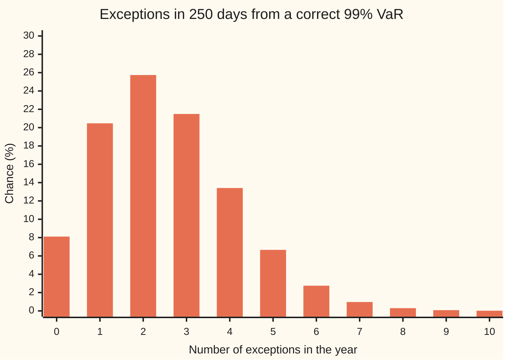
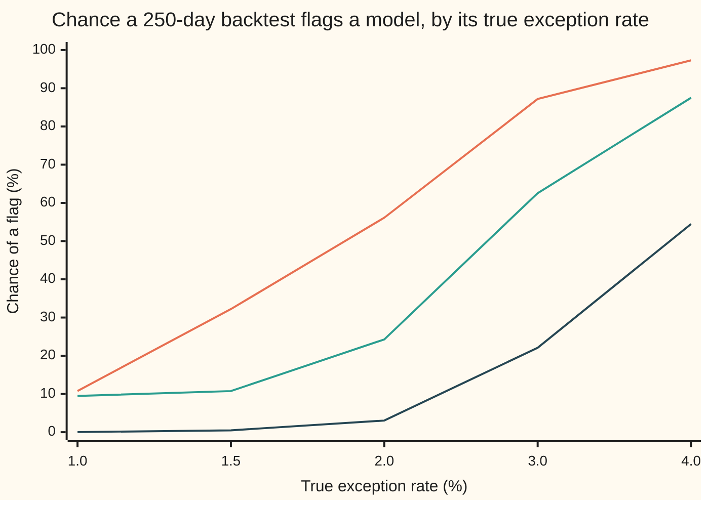

# Backtesting VaR: counting exceptions, and the tests that judge them

[Syllabus](../../../SYLLABUS.md) → [Financial mathematics](../../../SYLLABUS.md#w12) → [Value at Risk and Expected Shortfall](../../../SYLLABUS.md#w12-s39) → Backtesting VaR

---

## General Overview

A trading desk holds the shelf's book: 10 million dollars of shares, 5 million of bonds and 1,000 calls on Acme. Every morning its risk model publishes one number, the book's **one-day 99% value at risk** (VaR): a loss the book should exceed on only 1 trading day in 100. Every evening the day's actual loss is set beside that morning's number.

A weather forecaster who says "1 chance in 100 of a storm" cannot be proved wrong by one storm. The claim can only be checked by counting over many days. Risk models are checked the same way. A day on which the loss is bigger than the morning's VaR is an **exception**, the word used from here on. A trading year has about 250 days, so a model that keeps its promise produces about 2.5 exceptions a year.

This desk had **4 exceptions in 250 days**. Too many, or bad luck? Three judges answer. The **Basel traffic light**, a table set by bank supervisors in 1996, looks at the count alone: 0 to 4 is green, so this desk is **green**. **Kupiec's test** asks whether 4 in 250 is believable for a true rate of 1 in 100: it is. **Christoffersen's test** asks whether the exceptions arrive in bunches. Spread over days 40, 90, 140 and 200 they pass. On days 40, 41, 42 and 43 the same four exceptions fail badly, though the count and the colour are unchanged.

**A correct 99% VaR makes each day a yes-or-no trial with a 1-in-100 chance of an exception, so the year's count follows the binomial distribution; backtesting compares the observed count with that distribution, and checks that exceptions do not cluster in time.**

**What kind of fact this is:** a method: statistical tests with stated assumptions. Inside it sits one theorem, that a correct model's exception count is binomial, proved on this card in Why it works. The traffic light's cut-offs are a convention set by the Basel Committee.

### The picture: what a correct model's year looks like



Each bar is the chance that a model with a true 1% exception rate produces exactly that many exceptions in 250 days. Bars 0 to 4 are the green zone, 5 to 9 yellow, 10 and above red. A correct model produces 4 exceptions in 13.41% of years; the desk's year is ordinary.

---

## The formula

Notation first, in words. A subscript $t$ names the day, running from 1 to $n$. $V_t$ is the VaR published on the morning of day $t$, as a positive number of dollars of loss. $L_t$ is that day's loss. $I_t$ is a switch that reads 1 on an exception day and 0 otherwise, and $K$ is the year's count of exceptions.

$$I_t = \begin{cases} 1 & \text{if } L_t > V_t \\ 0 & \text{otherwise} \end{cases} \qquad K = I_1 + I_2 + \dots + I_n$$

**Read it aloud:** a day is an exception when the loss is strictly bigger than the morning's VaR, and the count is the number of such days.

For a correct model with promised exception rate $p$, the count follows the binomial distribution. The bracket $\binom{n}{k}$ counts the ways to choose which $k$ of the $n$ days carry the exceptions:

$$P(K = k) = \binom{n}{k}\, p^k\, (1-p)^{n-k}$$

**Read it aloud:** the chance of exactly $k$ exceptions is the number of ways to place them, times the chance of any one such pattern.

**Kupiec's test**, the unconditional-coverage test, compares the promised rate $p$ with the observed rate $\hat p = K/n$ (read "p-hat"). LR stands for likelihood ratio, the ratio of a record's chances under two explanations; uc for unconditional coverage:

$$\text{LR}_{\text{uc}} = 2\left[K \ln\frac{\hat p}{p} + (n-K)\ln\frac{1-\hat p}{1-p}\right]$$

**Read it aloud:** twice the log of how many times more likely the year's record is under the observed rate than under the promised one.

**Christoffersen's test** of independence (ind) reads the days in order as 249 pairs of neighbours. Each pair is labelled by two digits, yesterday's first, with 0 for a quiet day and 1 for an exception: $n_{01}$ counts the quiet-then-exception pairs, and $n_{00}$, $n_{10}$, $n_{11}$ count the others. The chance of an exception after a quiet day is estimated by $\hat p_{01} = n_{01}/(n_{00}+n_{01})$, and after an exception by $\hat p_{11} = n_{11}/(n_{10}+n_{11})$. The single rate over the pairs is $\bar p = (n_{01}+n_{11})/(n-1)$. Then

$$\text{LR}_{\text{ind}} = 2\Big[\, n_{00}\ln(1-\hat p_{01}) + n_{01}\ln\hat p_{01} + n_{10}\ln(1-\hat p_{11}) + n_{11}\ln\hat p_{11} \;-\; (n_{00}+n_{10})\ln(1-\bar p) - (n_{01}+n_{11})\ln\bar p \,\Big]$$

**Read it aloud:** twice the log of how much better the record is explained when yesterday's state is allowed to change today's chance.

The joint test, for conditional coverage (cc), adds the two. With $\text{LR}_{\text{uc}}$ computed on the same 249 pairs, the sum is exact:

$$\text{LR}_{\text{cc}} = \text{LR}_{\text{ind}} + \text{LR}_{\text{uc}}$$

Any term of the form $0 \ln 0$ counts as zero, its limit.

| Symbol | Plain meaning | In our example | Push it up and the answer… |
| --- | --- | --- | --- |
| $n$, $t$ | number of days in the test, and one day's position in it | 250 days | more days: the tests see smaller faults |
| $V_t$, $L_t$ | VaR published on the morning of day $t$, and that day's loss (a gain is a negative loss) | 4 days with $L_t$ above $V_t$ | higher VaR: fewer exceptions |
| $I_t$ | exception switch: 1 if $L_t > V_t$, else 0 | 1 on days 40, 90, 140, 200 | — |
| $K$, $k$ | the year's exception count, and any possible value of it | $K = 4$ | past 4: yellow; past 9: red |
| $p$, $q$ | promised exception rate (1 minus the VaR's confidence level), and any trial rate | 0.01 | expected count $n \times p$ rises |
| $\hat p$, $\bar p$ | observed exception rate over the $n$ days, and over the 249 pairs | 0.016, and 4 of 249 | further from $p$: $\text{LR}_{\text{uc}}$ grows |
| $n_{00}$, $n_{01}$, $n_{10}$, $n_{11}$ | counts of neighbouring-day pairs by state (quiet 0, exception 1) | 241, 4, 4, 0 spread out; 244, 1, 1, 3 bunched | more $n_{11}$: stronger bunching |
| $p_{01}$, $p_{11}$, $\hat p_{01}$, $\hat p_{11}$ | chance of an exception after a quiet day, and after an exception; a hat marks the estimate | 0.004082 and 0.75, bunched | a gap between them: $\text{LR}_{\text{ind}}$ grows |
| $\text{LR}_{\text{uc}}$ | Kupiec statistic: does the count fit $p$? | 0.769138 | above 3.841459: reject at 5% |
| $\text{LR}_{\text{ind}}$ | Christoffersen statistic: are exceptions independent of yesterday? | 0.130618 spread out; 23.487554 bunched | above 3.841459: reject at 5% |
| $\text{LR}_{\text{cc}}$ | joint statistic: right rate and no bunching | 0.911980 spread out; 24.268916 bunched | above 5.991465: reject at 5% |
| $c$, $N(x)$ | a chi-square cut-off, and the normal CDF: the bell-curve area left of $x$ | 3.841459 | higher cut-off: fewer rejections |

The cut-offs come from the **chi-square distribution**. With one degree of freedom it is the distribution of $Z^2$, the square of a standard normal draw $Z$, so the chance of exceeding a cut-off $c$ is $2[1 - N(\sqrt{c})]$, where $N(x)$ is the normal CDF (the area under the bell curve to the left of $x$). Setting that to 5% gives 3.841459. With two degrees of freedom, a sum of two independent squares, the chance of exceeding $c$ is $e^{-c/2}$, and 5% gives $-2\ln 0.05 = 5.991465$.

The traffic light is a table, not a test statistic. Supervisors multiply a bank's average 10-day VaR over the last 60 days by at least 3 to set its market-risk capital, and the yellow and red zones add a **plus factor** to that 3:

| Zone | Exceptions in 250 days | Chance a correct model lands at or below | Plus factor |
| --- | --- | --- | --- |
| Green | 0 to 4 | 8.11% to 89.22% | 0.00 |
| Yellow | 5, 6, 7, 8, 9 | 95.88%, 98.63%, 99.60%, 99.89%, 99.97% | 0.40, 0.50, 0.65, 0.75, 0.85 |
| Red | 10 or more | 99.99% | 1.00 |

Conventions verified 2026-09-28 against the Basel Committee's 1996 text: yellow begins where a correct model's chance of that many or fewer exceptions reaches 95%, red where it reaches 99.99%. The BIS now marks that document superseded; a live report follows the rules in force where the bank is supervised.

### When it holds

- **Each forecast is fixed before its day, and the loss is comparable.** The loss should be the change in value of the morning's book. New trades, fees and intraday income can create or hide exceptions that say nothing about the model.
- **The days are independent trials with the same chance.** If a volatile week raises the chance on every day of it, the count is no longer binomial and the tests' 5% becomes some other number. Christoffersen's test checks one form of this: dependence on yesterday.
- **Horizons do not overlap.** A 10-day VaR checked every day shares nine days with the next check, so neighbouring results are linked by construction.
- **The loss has no lumps at the VaR.** A book whose loss often lands on exactly one value can show fewer exceptions than $p$ promises.
- **The chi-square cut-offs are a large-sample approximation.** At 2.5 expected exceptions they are rough: the nominal 5% Kupiec test rejects a correct model in 0.094760 of years. The exact binomial and the traffic light avoid the approximation.

---

## Why it works

### Step 0: each day is a coin with a known bias

A correct 99% VaR is exceeded with chance 1 in 100 on each day, whatever happened before. So each day is a toss of a biased coin, and the whole year is 250 tosses. The count's distribution, the traffic light and both tests follow from that.

### Step 1: a correct model's count is binomial

Pick any four days, say 40, 90, 140 and 200. The chance that exactly those four are exceptions and the other 246 are quiet is $0.01^4 \times 0.99^{246}$, because independent chances multiply. Every other choice of four days has the same chance. There are $\binom{250}{4} = 158{,}882{,}750$ such choices, and they cannot happen together, so their chances add. That is the formula for $P(K = 4)$, and the same argument works for every $k$.

For the desk, $P(K = 4)$ is 13.41%, and the chance of 4 or more is 0.241883. A correct model does this often.

### Step 2: the traffic light is the binomial, cut in two places

Add up the bars in the picture from the left. The running total after 4 exceptions is 89.22%; after 5 it is 95.88%. Basel starts yellow at the first count whose running total reaches 95%, which is 5. The running total first reaches 99.99% at 10 exceptions, which starts red.

The cut at 95% is a choice about errors. A correct model still lands outside green with chance 0.107812, by luck alone. A higher cut would spare correct models and pass more faulty ones.

### Step 3: Kupiec's test compares two coins

Suppose the coin's bias were some rate $q$. The chance of the desk's exact record would be $q^4(1-q)^{246}$. As $q$ varies, this is largest at $q = 4/250 = 0.016$, the observed rate. Kupiec's statistic is twice the log of the record's chance at that best rate divided by its chance at the promised rate $q = 0.01$.

A log near 0 says the promise explains the record almost as well as the best rate. For the desk the log-ratio has two parts: $4\ln(0.016/0.01) = 1.880015$ from the exception days and $246\ln(0.984/0.99) = -1.495445$ from the quiet days. Twice their sum is 0.769138, well below 3.841459. Kupiec does not reject.

<details>
<summary>Detailed proof: the best rate is the observed rate, and the statistic is near a squared normal</summary>

The log of the record's chance is $K\ln q + (n-K)\ln(1-q)$. Its slope in $q$ is $K/q - (n-K)/(1-q)$, which is positive below $q = K/n$ and negative above it, so the unique maximum is $q = \hat p = K/n$ when $0 < K < n$. At $K = 0$ the maximum is at $q = 0$, and the $0\ln 0 = 0$ convention gives the same formula. Since $p$ is one of the rates allowed, the best case is at least as likely as the promise, and $\text{LR}_{\text{uc}} \ge 0$.

Expand each logarithm to second order in the gap $\hat p - p$, using $\ln(1 + x) = x - x^2/2 + \dots$ The first-order terms cancel, because $K = n\hat p$. What remains is
$$\text{LR}_{\text{uc}} \approx \frac{n\,(\hat p - p)^2}{p(1-p)} = \left(\frac{K - np}{\sqrt{np(1-p)}}\right)^2.$$
The bracket is the count's distance from its mean in standard deviations. By the central limit theorem it is close to a standard normal draw when $n \times p$ is large, so its square is close to chi-square with one degree of freedom. That closeness is exactly what fails at $n \times p = 2.5$.

</details>

### Step 4: Christoffersen's test lets yesterday matter

The count cannot see timing: both of the desk's possible years have $K = 4$ and the same $\text{LR}_{\text{uc}}$. So sort the 249 pairs of neighbouring days by state.

An exception with quiet days on both sides makes one quiet-to-exception pair and one exception-to-quiet pair. Four such exceptions spread out give $n_{01} = 4$, $n_{10} = 4$, $n_{11} = 0$, and the other 241 pairs are quiet-to-quiet. A run of four exceptions makes one pair going in, three pairs inside the run and one going out: $n_{01} = 1$, $n_{11} = 3$, $n_{10} = 1$, and 244 quiet pairs.

Now compare two coins again. The first coin allows two biases: one for the day after a quiet day, one for the day after an exception. This is a **Markov chain**: a process whose next step depends only on its current state. The second coin has one bias for all days. For the bunched year the Markov coin fits far better: the estimated chance of an exception is 0.75 after an exception, against 0.004082 after a quiet day. Its log-chance is $-8.748555$ against $-20.492332$ for the single coin, and twice the gap is 23.487554, far above the 3.841459 cut-off. For the spread-out year the two coins give $-20.427023$ and $-20.492332$, and twice the gap is 0.130618.

<details>
<summary>Detailed proof: the transition likelihood and the exact sum</summary>

Given the first day's state, a two-state Markov chain gives the record the chance $(1-p_{01})^{n_{00}}\,p_{01}^{n_{01}}\,(1-p_{11})^{n_{10}}\,p_{11}^{n_{11}}$, one factor per pair. Each pair of factors is a separate coin, so, as in Step 3, it is largest at $p_{01} = \hat p_{01}$ and $p_{11} = \hat p_{11}$. Forcing $p_{01} = p_{11}$ leaves one coin tossed on 249 days, largest at $\bar p$. Forcing both to $p$ gives the fixed-promise chance. Three nested fits give three best log-chances: Markov, single coin, promise, each at least as large as the next. $\text{LR}_{\text{ind}}$ is twice Markov minus single coin, the 249-day coverage statistic is twice single coin minus promise, and $\text{LR}_{\text{cc}}$, twice Markov minus promise, is their sum. Adding the 250-day $\text{LR}_{\text{uc}}$ instead, as many texts do, is a slightly different number.

</details>

The joint statistic $\text{LR}_{\text{cc}}$ is 24.268916 for the bunched year and 0.911980 for the spread-out one, against a cut-off of 5.991465.

### Step 5: an exact check that needs no approximation

The chi-square cut-offs rest on a large-sample argument that four exceptions do not satisfy. The run has an exact answer. Given four exceptions from a correct model, every choice of four days out of 250 is equally likely. A run of four can start on any day from 1 to 247. So the chance that four exceptions form one run is $247/158{,}882{,}750 = 1.555 \times 10^{-6}$. This is valid only if the run test was chosen before looking at the data; picked after seeing the cluster, it proves nothing.

### The other route

The exact binomial answers Kupiec's question without chi-square: the chance of 4 or more exceptions from a correct model is 0.241883, far above 5%. Neither route says how large the losses were beyond the VaR. Testing that needs a measure of the tail itself, the business of [Expected shortfall](05-expected-shortfall-and-coherence.md).

---

## Worked numbers, by hand

The desk: $n = 250$ days, $p = 0.01$, $K = 4$ exceptions.

| Step | Arithmetic | Value |
| --- | --- | --- |
| expected count | $250 \times 0.01$ | $2.5$ |
| running total at 4, green edge | $8.11 + 20.47 + 25.74 + 21.49 + 13.41$ (%) | $89.22\%$ |
| **Basel zone** | 4 is at most 4 | **green**, plus factor 0.00, multiplier 3.00 |
| observed rate $\hat p$ | $4 / 250$ | $0.016$ |
| exception-day term | $4 \ln(0.016/0.01)$ | $1.880015$ |
| quiet-day term | $246 \ln(0.984/0.99)$ | $-1.495445$ |
| **Kupiec statistic** | $2 \times (1.880015 - 1.495445)$ | **0.769138** |
| Kupiec p-value | $2[1 - N(\sqrt{0.769138})]$ | $0.380484$ |
| pairs, bunched year | days 40 to 43 | $n_{00}, n_{01}, n_{10}, n_{11} = 244, 1, 1, 3$ |
| Markov log-chance, bunched | $244\ln\tfrac{244}{245} + \ln\tfrac{1}{245} + \ln\tfrac14 + 3\ln\tfrac34$ | $-8.748555$ |
| single-coin log-chance | $245\ln\tfrac{245}{249} + 4\ln\tfrac{4}{249}$ | $-20.492332$ |
| **Christoffersen statistic, bunched** | $2 \times (-8.748555 + 20.492332)$ | **23.487554** |
| its p-value | $2[1 - N(\sqrt{23.487554})]$ | $1.257 \times 10^{-6}$ |
| joint statistic, bunched | 23.487554 + 0.781362 (coverage on 249 pairs) | $24.268916$ |

The desk's year is green and passes Kupiec whichever days the exceptions fell on. If they fell on days 40 to 43, the model misses something that makes a bad day likelier after a bad day, and the count alone would never show it.

### What breaks if you drop a piece

| Mistake | Comes out at | What went wrong |
| --- | --- | --- |
| Test a 99% VaR against $p = 0.05$ | 8.185171: reject | 0.05 is the rate of a 95% VaR. Four exceptions are far too few for it. |
| Keep only the exception-day term, $2K\ln(\hat p/p)$ | 3.760029 (right: 0.769138) | The quiet days carry evidence too. Dropping them nearly rejects a sound year. |
| Judge the bunched year by the count alone | 0.769138: pass | The count is blind to timing. $\text{LR}_{\text{ind}}$ is 23.487554. |
| Add the 250-day $\text{LR}_{\text{uc}}$ to $\text{LR}_{\text{ind}}$ | 24.256692 (exact: 24.268916) | The sum is exact only on the same 249 pairs. Harmless here, but a different number. |

---

## How much a year of data can see

The tests are judged by two errors: rejecting a correct model, and passing a faulty one. Hold the count at 250 days and let the model's true exception rate drift above the promised 1%.



Top line: the chance of landing outside green. Middle: the chance Kupiec's test rejects at the 5% cut-off. Bottom: the chance of red.

A model with a true rate of 2%, twice its promise, leaves green only 56.13% of the time, and Kupiec rejects it only 24.27% of the time. At 1.5%, Kupiec's rejection rate, 10.76%, barely exceeds its 9.48% for a correct model. A year of exceptions catches gross faults, not moderate ones.

---

## Code, from first principles, and it actually runs

The scripts build both exception records and reach each result by two independent roads: binomial chances exactly and from 20,000 simulated years; zones from Basel's table and from cutting the binomial; each statistic in closed form and by numerical search for the best rates; pair counts by walking the days and by counting runs; each chi-square cut-off by a root finder, checked by integrating over one or two normal draws. The run formula is checked by listing every choice of four days out of 20.

### Python

```python
# Backtesting VaR -- the check behind the card.  Python standard library only.
# Own normal CDF (series), own root finder, own integrator, own random numbers.
from math import log, exp, sqrt, pi, comb, sin, cos

n, p = 250, 0.01
ISO, RUN = (40, 90, 140, 200), (40, 41, 42, 43)
days = lambda hit: [1 if t in hit else 0 for t in range(1, n + 1)]

def Phi(x):                                  # normal CDF: 1/2 + phi(x) * (x + x^3/3 + x^5/15 + ...)
    term, s, k = x, x, 1
    while abs(term) > 1e-17 * max(1.0, abs(s)):
        term *= x * x / (2 * k + 1); s += term; k += 1
    return 0.5 + exp(-x * x / 2) / sqrt(2 * pi) * s
def simpson(f, a, b, m=2000):
    h = (b - a) / m
    return h / 3 * (f(a) + f(b) + sum((4 if i % 2 else 2) * f(a + i * h) for i in range(1, m)))
def bisect(f, lo, hi):
    for _ in range(200):
        mid = (lo + hi) / 2
        if f(lo) * f(mid) <= 0: hi = mid
        else: lo = mid
    return (lo + hi) / 2
def golden_max(f, lo=1e-12, hi=1 - 1e-12):
    g = (sqrt(5) - 1) / 2
    for _ in range(200):
        a, b = hi - g * (hi - lo), lo + g * (hi - lo)
        if f(a) > f(b): hi = b
        else: lo = a
    return f((lo + hi) / 2)
def xlog(c, q): return 0.0 if c == 0 else c * log(q)      # 0 log 0 = 0
def lr_uc(K, m=n, p0=p):                     # Kupiec, closed form
    ph = K / m
    return 2 * (xlog(K, ph) + xlog(m - K, 1 - ph) - xlog(K, p0) - xlog(m - K, 1 - p0))
def counts(seq):                             # road 1: walk the 249 pairs of neighbouring days
    c = [0, 0, 0, 0]
    for a, b in zip(seq, seq[1:]): c[2 * a + b] += 1
    return c
def counts_by_runs(hit):                     # road 2: count runs of exceptions (none touch day 1 or 250)
    runs = sum(1 for t in hit if t - 1 not in hit)
    return [n - 1 - len(hit) - runs, runs, runs, len(hit) - runs]
def lr_ind_cc(c):                            # Christoffersen, closed form
    n00, n01, n10, n11 = c
    p01, p11, ph = n01 / (n00 + n01), n11 / (n10 + n11), (n01 + n11) / (n - 1)
    markov = xlog(n00, 1 - p01) + xlog(n01, p01) + xlog(n10, 1 - p11) + xlog(n11, p11)
    common, fixed = xlog(n00 + n10, 1 - ph) + xlog(n01 + n11, ph), xlog(n00 + n10, 1 - p) + xlog(n01 + n11, p)
    return 2 * (markov - common), 2 * (markov - fixed), (markov, common, fixed)
def ll(q, pairs, rows): return sum(b * log(q) + (1 - b) * log(1 - q) for a, b in pairs if a in rows)
def lr_ind_search(seq):                      # road 2: maximise the likelihoods numerically, from the days
    pr = list(zip(seq, seq[1:]))
    markov = golden_max(lambda q: ll(q, pr, (0,))) + golden_max(lambda q: ll(q, pr, (1,)))
    return 2 * (markov - golden_max(lambda q: ll(q, pr, (0, 1))))

pmf = [comb(n, k) * p ** k * (1 - p) ** (n - k) for k in range(n + 1)]
cdf = [sum(pmf[:k + 1]) for k in range(n + 1)]
def zone_table(k): return "G" if k <= 4 else ("Y" if k <= 9 else "R")    # Basel 1996, Table 2
def zone_cut(k): return "G" if cdf[k] < 0.95 else ("Y" if cdf[k] < 0.9999 else "R")
PLUS = {5: 0.40, 6: 0.50, 7: 0.65, 8: 0.75, 9: 0.85, 10: 1.00}
c1 = bisect(lambda x: 2 * (1 - Phi(sqrt(x))) - 0.05, 0.5, 10.0)         # chi-square(1) 5% cutoff
tail1 = 2 * simpson(lambda z: exp(-z * z / 2) / sqrt(2 * pi), sqrt(c1), 12.0)
c2 = bisect(lambda x: exp(-x / 2) - 0.05, 0.5, 20.0); r2 = sqrt(c2)    # chi-square(2) 5% cutoff; road 2: P(Z1^2 + Z2^2 > c2)
tail2 = 2 * (1 - Phi(r2)) + 4 * simpson(lambda a: exp(-(r2 * sin(a)) ** 2 / 2) / sqrt(2 * pi) * (1 - Phi(r2 * cos(a))) * r2 * cos(a), 0.0, pi / 2)
rej = [k for k in range(n + 1) if lr_uc(k) > c1]
def prob(q, ks): return sum(comb(n, j) * q ** j * (1 - q) ** (n - j) for j in ks)

state, M64, YEARS = 20260928, 2 ** 64 - 1, 20000                        # splitmix64 random numbers
def rnd():
    global state
    state = (state + 0x9E3779B97F4A7C15) & M64
    z = ((state ^ (state >> 30)) * 0xBF58476D1CE4E5B9) & M64
    z = ((z ^ (z >> 27)) * 0x94D049BB133111EB) & M64
    return ((z ^ (z >> 31)) >> 11) / 2.0 ** 53
sim = [0] * (n + 1)
for _ in range(YEARS): sim[sum(1 for _ in range(n) if rnd() < p)] += 1
sim_size = sum(sim[k] for k in rej) / YEARS

si, sr = days(ISO), days(RUN)
ci, cr = counts(si), counts(sr)
(ind_i, cc_i, ll_i), (ind_r, cc_r, ll_r) = lr_ind_cc(ci), lr_ind_cc(cr)
uc249_i, uc249_r = lr_uc(ci[1] + ci[3], n - 1), lr_uc(cr[1] + cr[3], n - 1)
uc_search = 2 * (golden_max(lambda q: ll(q, [(0, b) for b in si], (0,))) - ll(p, [(0, b) for b in si], (0,)))
f6 = lambda v: f"{v:.6f}"
rows = [
    ("days n, promised rate p", f"{n} {p:.2f}"), ("expected count n p", f6(n * p)),
    ("exception days isolated | clustered; K", f"{' '.join(map(str, ISO))} | {' '.join(map(str, RUN))}; {sum(si)} {sum(sr)}"),
    ("pmf % k=0..10, exact", " ".join(f"{100 * v:.2f}" for v in pmf[:11])),
    ("pmf % k=0..10, simulated", " ".join(f"{100 * v / YEARS:.2f}" for v in sim[:11])),
    ("cdf % k=0..10", " ".join(f"{100 * v:.2f}" for v in cdf[:11])),
    ("zones k=0..12, Basel table", " ".join(zone_table(k) for k in range(13))),
    ("zones k=0..12, 95%/99.99% cut", " ".join(zone_cut(k) for k in range(13))),
    ("K=4: zone, plus factor, multiplier", f"{zone_cut(4)} {PLUS.get(4, 0.0):.2f} {3 + PLUS.get(4, 0.0):.2f}"),
    ("plus factors k=5..9, 10+", " ".join(f"{PLUS[k]:.2f}" for k in range(5, 11))),
    ("P(K>=4) exact", f6(1 - cdf[3])), ("P(K>=5) exact", f6(1 - cdf[4])),
    ("p-hat, K ln(p-hat/p), (n-K) ln(ratio)", f"{4 / n:.6f} {xlog(4, 4 / n / p):.6f} {xlog(n - 4, (1 - 4 / n) / (1 - p)):.6f}"),
    ("Kupiec LR, closed form / by search", f"{lr_uc(4):.6f} {uc_search:.6f}"),
    ("chi2(1) 5% cutoff; tail beyond, Simpson", f"{c1:.6f} {tail1:.6f}"),
    ("Kupiec p-value, chi2(1)", f6(2 * (1 - Phi(sqrt(lr_uc(4)))))),
    ("Kupiec LR at k=0,1,2,3,5,6,7", " ".join(f"{lr_uc(k):.3f}" for k in (0, 1, 2, 3, 5, 6, 7))),
    ("Kupiec rejects at k", " ".join(str(k) for k in rej[:4]) + " ..."),
    ("Kupiec false alarms: exact / 20000 years", f"{prob(p, rej):.6f} {sim_size:.6f}"),
    ("n00 n01 n10 n11 isolated: pairs | runs", f"{' '.join(map(str, ci))} | {' '.join(map(str, counts_by_runs(ISO)))}"),
    ("n00 n01 n10 n11 clustered: pairs | runs", f"{' '.join(map(str, cr))} | {' '.join(map(str, counts_by_runs(RUN)))}"),
    ("p01 p11 isolated", f"{ci[1] / (ci[0] + ci[1]):.6f} {ci[3] / (ci[2] + ci[3]):.6f}"),
    ("p01 p11 clustered", f"{cr[1] / (cr[0] + cr[1]):.6f} {cr[3] / (cr[2] + cr[3]):.6f}"),
    ("LR_IND isolated, closed / search", f"{ind_i:.6f} {lr_ind_search(si):.6f}"),
    ("LR_IND clustered, closed / search", f"{ind_r:.6f} {lr_ind_search(sr):.6f}"),
    ("log-lik Markov, common, fixed p; iso", " ".join(f"{v:.6f}" for v in ll_i)),
    ("log-lik Markov, common, fixed p; clu", " ".join(f"{v:.6f}" for v in ll_r)),
    ("LR_UC on the 249 pairs, both series", f6(uc249_r)),
    ("LR_CC isolated, direct / IND+UC249", f"{cc_i:.6f} {ind_i + uc249_i:.6f}"),
    ("LR_CC clustered, direct / IND+UC249", f"{cc_r:.6f} {ind_r + uc249_r:.6f}"),
    ("LR_CC clustered, IND+UC250 shortcut", f6(ind_r + lr_uc(4))),
    ("chi2(2) 5% cutoff; tail of Z1^2+Z2^2", f"{c2:.6f} {tail2:.6f}"),
    ("p-value IND clustered, chi2(1)", f"{2 * (1 - Phi(sqrt(ind_r))):.3e}"),
    ("p-value CC clustered, chi2(2)", f"{exp(-cc_r / 2):.3e}"),
    ("C(250,4); run of 4 given K=4: 247/C", f"{comb(n, 4)} {(n - 3) / comb(n, 4):.3e}"),
]
for q in (0.01, 0.015, 0.02, 0.03, 0.04):
    rows.append((f"true {100 * q:.1f}%: % not green, red, Kupiec",
                 f"{100 * prob(q, range(5, n + 1)):.2f} {100 * prob(q, range(10, n + 1)):.2f} {100 * prob(q, rej):.2f}"))
rows += [("wrong: p = 5% for a 99% VaR, LR", f6(lr_uc(4, n, 0.05))),
         ("wrong: drop the (n-K) term, LR", f6(2 * 4 * log((4 / n) / p))),
         ("wrong: count only, clustered LR", f6(lr_uc(sum(sr)))),
         ("try: p = 2.5%, K = 4, Kupiec LR", f6(lr_uc(4, n, 0.025))), ("try: n = 500, K = 8, Kupiec LR", f6(lr_uc(8, 500))),
         ("try: days 40 41 90 140, LR_IND", f6(lr_ind_cc(counts(days((40, 41, 90, 140))))[0]))]
for lab, v in rows: print(f"{lab:<42} {v}")

assert all(abs(sim[k] / YEARS - pmf[k]) < 0.01 for k in range(11))      # simulation agrees with exact
assert [zone_table(k) for k in range(40)] == [zone_cut(k) for k in range(40)]
assert abs(lr_uc(4) - uc_search) < 1e-9
assert abs(tail1 - 0.05) < 1e-9
assert abs(tail2 - 0.05) < 1e-9
assert abs(prob(p, rej) - sim_size) < 0.01
assert ci == counts_by_runs(ISO)
assert cr == counts_by_runs(RUN)
assert abs(ind_i - lr_ind_search(si)) < 1e-8
assert abs(ind_r - lr_ind_search(sr)) < 1e-8
assert abs(cc_r - (ind_r + uc249_r)) < 1e-9
m, subsets = 20, [(a, b, c, d) for a in range(20) for b in range(a + 1, 20) for c in range(b + 1, 20) for d in range(c + 1, 20)]
assert sum(1 for s in subsets if s[3] - s[0] == 3) / len(subsets) == (m - 3) / comb(m, 4)   # run formula, brute force
print("ALL CHECKS PASS")
```

**Ran 2026-09-28 on macOS, Python 3.14.6, standard library only. All checks passed. Output, pasted from the run:**

```
days n, promised rate p                    250 0.01
expected count n p                         2.500000
exception days isolated | clustered; K     40 90 140 200 | 40 41 42 43; 4 4
pmf % k=0..10, exact                       8.11 20.47 25.74 21.49 13.41 6.66 2.75 0.97 0.30 0.08 0.02
pmf % k=0..10, simulated                   8.21 20.46 25.69 21.43 13.47 6.62 2.79 0.94 0.29 0.09 0.02
cdf % k=0..10                              8.11 28.58 54.32 75.81 89.22 95.88 98.63 99.60 99.89 99.97 99.99
zones k=0..12, Basel table                 G G G G G Y Y Y Y Y R R R
zones k=0..12, 95%/99.99% cut              G G G G G Y Y Y Y Y R R R
K=4: zone, plus factor, multiplier         G 0.00 3.00
plus factors k=5..9, 10+                   0.40 0.50 0.65 0.75 0.85 1.00
P(K>=4) exact                              0.241883
P(K>=5) exact                              0.107812
p-hat, K ln(p-hat/p), (n-K) ln(ratio)      0.016000 1.880015 -1.495445
Kupiec LR, closed form / by search         0.769138 0.769138
chi2(1) 5% cutoff; tail beyond, Simpson    3.841459 0.050000
Kupiec p-value, chi2(1)                    0.380484
Kupiec LR at k=0,1,2,3,5,6,7               5.025 1.176 0.108 0.095 1.957 3.555 5.497
Kupiec rejects at k                        0 7 8 9 ...
Kupiec false alarms: exact / 20000 years   0.094760 0.095500
n00 n01 n10 n11 isolated: pairs | runs     241 4 4 0 | 241 4 4 0
n00 n01 n10 n11 clustered: pairs | runs    244 1 1 3 | 244 1 1 3
p01 p11 isolated                           0.016327 0.000000
p01 p11 clustered                          0.004082 0.750000
LR_IND isolated, closed / search           0.130618 0.130618
LR_IND clustered, closed / search          23.487554 23.487554
log-lik Markov, common, fixed p; iso       -20.427023 -20.492332 -20.883013
log-lik Markov, common, fixed p; clu       -8.748555 -20.492332 -20.883013
LR_UC on the 249 pairs, both series        0.781362
LR_CC isolated, direct / IND+UC249         0.911980 0.911980
LR_CC clustered, direct / IND+UC249        24.268916 24.268916
LR_CC clustered, IND+UC250 shortcut        24.256692
chi2(2) 5% cutoff; tail of Z1^2+Z2^2       5.991465 0.050000
p-value IND clustered, chi2(1)             1.257e-06
p-value CC clustered, chi2(2)              5.371e-06
C(250,4); run of 4 given K=4: 247/C        158882750 1.555e-06
true 1.0%: % not green, red, Kupiec        10.78 0.03 9.48
true 1.5%: % not green, red, Kupiec        32.21 0.49 10.76
true 2.0%: % not green, red, Kupiec        56.13 3.04 24.27
true 3.0%: % not green, red, Kupiec        87.18 22.10 62.55
true 4.0%: % not green, red, Kupiec        97.30 54.46 87.50
wrong: p = 5% for a 99% VaR, LR            8.185171
wrong: drop the (n-K) term, LR             3.760029
wrong: count only, clustered LR            0.769138
try: p = 2.5%, K = 4, Kupiec LR            0.950409
try: n = 500, K = 8, Kupiec LR             1.538277
try: days 40 41 90 140, LR_IND             4.106993
ALL CHECKS PASS
```

### Rust

```rust
// Backtesting VaR -- the check behind the card.  Rust std only, no crates.
// Own normal CDF (series), own root finder, own integrator, own random numbers.
const N: usize = 250;
const P: f64 = 0.01;
const PI: f64 = std::f64::consts::PI;

fn phi_cdf(x: f64) -> f64 {
    // normal CDF: 1/2 + phi(x) * (x + x^3/3 + x^5/15 + ...)
    let (mut term, mut s, mut k) = (x, x, 1.0);
    while term.abs() > 1e-17 * s.abs().max(1.0) { term *= x * x / (2.0 * k + 1.0); s += term; k += 1.0; }
    0.5 + (-x * x / 2.0).exp() / (2.0 * PI).sqrt() * s
}
fn simpson(f: &dyn Fn(f64) -> f64, a: f64, b: f64, m: usize) -> f64 {
    let h = (b - a) / m as f64;
    let mut s = f(a) + f(b);
    for i in 1..m { s += if i % 2 == 1 { 4.0 } else { 2.0 } * f(a + i as f64 * h); }
    h / 3.0 * s
}
fn bisect(f: &dyn Fn(f64) -> f64, mut lo: f64, mut hi: f64) -> f64 {
    for _ in 0..200 { let mid = (lo + hi) / 2.0; if f(lo) * f(mid) <= 0.0 { hi = mid } else { lo = mid } }
    (lo + hi) / 2.0
}
fn golden_max(f: &dyn Fn(f64) -> f64) -> f64 {
    let (mut lo, mut hi, g) = (1e-12, 1.0 - 1e-12, (5f64.sqrt() - 1.0) / 2.0);
    for _ in 0..200 { let (a, b) = (hi - g * (hi - lo), lo + g * (hi - lo)); if f(a) > f(b) { hi = b } else { lo = a } }
    f((lo + hi) / 2.0)
}
fn xlog(c: usize, q: f64) -> f64 { if c == 0 { 0.0 } else { c as f64 * q.ln() } }
fn lr_uc(k: usize, m: usize, p0: f64) -> f64 {
    let ph = k as f64 / m as f64;
    2.0 * (xlog(k, ph) + xlog(m - k, 1.0 - ph) - xlog(k, p0) - xlog(m - k, 1.0 - p0))
}
fn days(hit: &[usize]) -> Vec<usize> { (1..=N).map(|t| hit.contains(&t) as usize).collect() }
fn counts(seq: &[usize]) -> [usize; 4] {
    let mut c = [0; 4]; for w in seq.windows(2) { c[2 * w[0] + w[1]] += 1; } c
}
fn counts_by_runs(hit: &[usize]) -> [usize; 4] {
    let runs = hit.iter().filter(|&&t| !hit.contains(&(t - 1))).count();
    [N - 1 - hit.len() - runs, runs, runs, hit.len() - runs]
}
fn lr_ind_cc(c: [usize; 4]) -> (f64, f64, [f64; 3]) {
    let [n00, n01, n10, n11] = c;
    let p01 = n01 as f64 / (n00 + n01) as f64;
    let p11 = n11 as f64 / (n10 + n11) as f64;
    let ph = (n01 + n11) as f64 / (N - 1) as f64;
    let markov = xlog(n00, 1.0 - p01) + xlog(n01, p01) + xlog(n10, 1.0 - p11) + xlog(n11, p11);
    let common = xlog(n00 + n10, 1.0 - ph) + xlog(n01 + n11, ph);
    let fixed = xlog(n00 + n10, 1.0 - P) + xlog(n01 + n11, P);
    (2.0 * (markov - common), 2.0 * (markov - fixed), [markov, common, fixed])
}
fn ll(q: f64, pairs: &[(usize, usize)], rows: &[usize]) -> f64 {
    pairs.iter().filter(|(a, _)| rows.contains(a))
        .map(|&(_, b)| b as f64 * q.ln() + (1 - b) as f64 * (1.0 - q).ln()).sum()
}
fn lr_ind_search(seq: &[usize]) -> f64 {
    let pr: Vec<(usize, usize)> = seq.windows(2).map(|w| (w[0], w[1])).collect();
    let markov = golden_max(&|q| ll(q, &pr, &[0])) + golden_max(&|q| ll(q, &pr, &[1]));
    2.0 * (markov - golden_max(&|q| ll(q, &pr, &[0, 1])))
}
fn comb(n: usize, k: usize) -> f64 { (0..k).fold(1.0, |acc, i| acc * (n - i) as f64 / (i + 1) as f64) }
fn prob(q: f64, ks: &[usize]) -> f64 {
    ks.iter().map(|&j| comb(N, j) * q.powi(j as i32) * (1.0 - q).powi((N - j) as i32)).sum()
}
fn zone_table(k: usize) -> &'static str { if k <= 4 { "G" } else if k <= 9 { "Y" } else { "R" } }
fn sci(v: f64) -> String {
    // Python-style 1.234e-06
    let s = format!("{:.3e}", v); let (m, e) = s.split_once('e').unwrap();
    let e: i32 = e.parse().unwrap();
    format!("{}e{}{:02}", m, if e < 0 { '-' } else { '+' }, e.abs())
}
fn join<T: ToString>(v: impl Iterator<Item = T>) -> String { v.map(|x| x.to_string()).collect::<Vec<_>>().join(" ") }
fn main() {
    let iso = [40, 90, 140, 200];
    let run = [40, 41, 42, 43];
    let pmf: Vec<f64> = (0..=N).map(|k| prob(P, &[k])).collect();
    let cdf: Vec<f64> = (0..=N).map(|k| pmf[..=k].iter().sum()).collect();
    let zone_cut = |k: usize| if cdf[k] < 0.95 { "G" } else if cdf[k] < 0.9999 { "Y" } else { "R" };
    let plus = |k: usize| match k { 5 => 0.40, 6 => 0.50, 7 => 0.65, 8 => 0.75, 9 => 0.85, 10.. => 1.00, _ => 0.0 };
    let c1 = bisect(&|x: f64| 2.0 * (1.0 - phi_cdf(x.sqrt())) - 0.05, 0.5, 10.0);
    let tail1 = 2.0 * simpson(&|z: f64| (-z * z / 2.0).exp() / (2.0 * PI).sqrt(), c1.sqrt(), 12.0, 2000);
    let c2 = bisect(&|x: f64| (-x / 2.0).exp() - 0.05, 0.5, 20.0);
    let r2 = c2.sqrt(); // road 2: P(Z1^2 + Z2^2 > c2), Z1 = r2 sin a on the disc, Z2 beyond it
    let tail2 = 2.0 * (1.0 - phi_cdf(r2)) + 4.0 * simpson(&|a: f64| (-(r2 * a.sin()).powi(2) / 2.0).exp() / (2.0 * PI).sqrt() * (1.0 - phi_cdf(r2 * a.cos())) * r2 * a.cos(), 0.0, PI / 2.0, 2000);
    let rej: Vec<usize> = (0..=N).filter(|&k| lr_uc(k, N, P) > c1).collect();
    // splitmix64 random numbers, same seed and stream as the Python
    let (mut state, years) = (20260928u64, 20000usize);
    let mut rnd = || {
        state = state.wrapping_add(0x9E3779B97F4A7C15);
        let mut z = (state ^ (state >> 30)).wrapping_mul(0xBF58476D1CE4E5B9);
        z = (z ^ (z >> 27)).wrapping_mul(0x94D049BB133111EB);
        ((z ^ (z >> 31)) >> 11) as f64 / 2f64.powi(53)
    };
    let mut sim = vec![0usize; N + 1];
    for _ in 0..years { sim[(0..N).filter(|_| rnd() < P).count()] += 1; }
    let sim_size = rej.iter().map(|&k| sim[k]).sum::<usize>() as f64 / years as f64;
    let (si, sr) = (days(&iso), days(&run));
    let (ci, cr) = (counts(&si), counts(&sr));
    let ((ind_i, cc_i, ll_i), (ind_r, cc_r, ll_r)) = (lr_ind_cc(ci), lr_ind_cc(cr));
    let (uc249_i, uc249_r) = (lr_uc(ci[1] + ci[3], N - 1, P), lr_uc(cr[1] + cr[3], N - 1, P));
    let kp: Vec<(usize, usize)> = si.iter().map(|&b| (0, b)).collect();
    let uc_search = 2.0 * (golden_max(&|q| ll(q, &kp, &[0])) - ll(P, &kp, &[0]));
    let (s_i, s_r) = (lr_ind_search(&si), lr_ind_search(&sr));
    let f6 = |v: f64| format!("{:.6}", v);
    let pct = |v: &[f64]| join(v.iter().map(|x| format!("{:.2}", 100.0 * x)));
    let upper = |lo: usize| (lo..=N).collect::<Vec<usize>>();
    let mut rows: Vec<(String, String)> = vec![
        ("days n, promised rate p".into(), format!("{} {:.2}", N, P)),
        ("expected count n p".into(), f6(N as f64 * P)),
        ("exception days isolated | clustered; K".into(), format!("{} | {}; {} {}", join(iso.iter()), join(run.iter()), si.iter().sum::<usize>(), sr.iter().sum::<usize>())),
        ("pmf % k=0..10, exact".into(), pct(&pmf[..11])),
        ("pmf % k=0..10, simulated".into(), join(sim[..11].iter().map(|&c| format!("{:.2}", 100.0 * c as f64 / years as f64)))),
        ("cdf % k=0..10".into(), pct(&cdf[..11])),
        ("zones k=0..12, Basel table".into(), join((0..13).map(zone_table))),
        ("zones k=0..12, 95%/99.99% cut".into(), join((0..13).map(zone_cut))),
        ("K=4: zone, plus factor, multiplier".into(), format!("{} {:.2} {:.2}", zone_cut(4), plus(4), 3.0 + plus(4))),
        ("plus factors k=5..9, 10+".into(), join((5..11).map(|k| format!("{:.2}", plus(k))))),
        ("P(K>=4) exact".into(), f6(1.0 - cdf[3])), ("P(K>=5) exact".into(), f6(1.0 - cdf[4])),
        ("p-hat, K ln(p-hat/p), (n-K) ln(ratio)".into(), format!("{:.6} {:.6} {:.6}", 4.0 / N as f64, xlog(4, 4.0 / N as f64 / P), xlog(N - 4, (1.0 - 4.0 / N as f64) / (1.0 - P)))),
        ("Kupiec LR, closed form / by search".into(), format!("{:.6} {:.6}", lr_uc(4, N, P), uc_search)),
        ("chi2(1) 5% cutoff; tail beyond, Simpson".into(), format!("{:.6} {:.6}", c1, tail1)),
        ("Kupiec p-value, chi2(1)".into(), f6(2.0 * (1.0 - phi_cdf(lr_uc(4, N, P).sqrt())))),
        ("Kupiec LR at k=0,1,2,3,5,6,7".into(), join([0, 1, 2, 3, 5, 6, 7].iter().map(|&k| format!("{:.3}", lr_uc(k, N, P))))),
        ("Kupiec rejects at k".into(), format!("{} ...", join(rej[..4].iter()))),
        ("Kupiec false alarms: exact / 20000 years".into(), format!("{:.6} {:.6}", prob(P, &rej), sim_size)),
        ("n00 n01 n10 n11 isolated: pairs | runs".into(), format!("{} | {}", join(ci.iter()), join(counts_by_runs(&iso).iter()))),
        ("n00 n01 n10 n11 clustered: pairs | runs".into(), format!("{} | {}", join(cr.iter()), join(counts_by_runs(&run).iter()))),
        ("p01 p11 isolated".into(), format!("{:.6} {:.6}", ci[1] as f64 / (ci[0] + ci[1]) as f64, ci[3] as f64 / (ci[2] + ci[3]) as f64)),
        ("p01 p11 clustered".into(), format!("{:.6} {:.6}", cr[1] as f64 / (cr[0] + cr[1]) as f64, cr[3] as f64 / (cr[2] + cr[3]) as f64)),
        ("LR_IND isolated, closed / search".into(), format!("{:.6} {:.6}", ind_i, s_i)),
        ("LR_IND clustered, closed / search".into(), format!("{:.6} {:.6}", ind_r, s_r)),
        ("log-lik Markov, common, fixed p; iso".into(), join(ll_i.iter().map(|v| format!("{:.6}", v)))),
        ("log-lik Markov, common, fixed p; clu".into(), join(ll_r.iter().map(|v| format!("{:.6}", v)))),
        ("LR_UC on the 249 pairs, both series".into(), f6(uc249_r)),
        ("LR_CC isolated, direct / IND+UC249".into(), format!("{:.6} {:.6}", cc_i, ind_i + uc249_i)),
        ("LR_CC clustered, direct / IND+UC249".into(), format!("{:.6} {:.6}", cc_r, ind_r + uc249_r)),
        ("LR_CC clustered, IND+UC250 shortcut".into(), f6(ind_r + lr_uc(4, N, P))),
        ("chi2(2) 5% cutoff; tail of Z1^2+Z2^2".into(), format!("{:.6} {:.6}", c2, tail2)),
        ("p-value IND clustered, chi2(1)".into(), sci(2.0 * (1.0 - phi_cdf(ind_r.sqrt())))),
        ("p-value CC clustered, chi2(2)".into(), sci((-cc_r / 2.0).exp())),
        ("C(250,4); run of 4 given K=4: 247/C".into(), format!("{} {}", comb(N, 4).round(), sci((N - 3) as f64 / comb(N, 4)))),
    ];
    for q in [0.01, 0.015, 0.02, 0.03, 0.04] {
        rows.push((format!("true {:.1}%: % not green, red, Kupiec", 100.0 * q),
            format!("{:.2} {:.2} {:.2}", 100.0 * prob(q, &upper(5)), 100.0 * prob(q, &upper(10)), 100.0 * prob(q, &rej))));
    }
    rows.push(("wrong: p = 5% for a 99% VaR, LR".into(), f6(lr_uc(4, N, 0.05))));
    rows.push(("wrong: drop the (n-K) term, LR".into(), f6(2.0 * 4.0 * ((4.0 / N as f64) / P).ln())));
    rows.push(("wrong: count only, clustered LR".into(), f6(lr_uc(sr.iter().sum(), N, P))));
    rows.push(("try: p = 2.5%, K = 4, Kupiec LR".into(), f6(lr_uc(4, N, 0.025))));
    rows.push(("try: n = 500, K = 8, Kupiec LR".into(), f6(lr_uc(8, 500, P))));
    rows.push(("try: days 40 41 90 140, LR_IND".into(), f6(lr_ind_cc(counts(&days(&[40, 41, 90, 140]))).0)));
    for (lab, v) in &rows { println!("{:<42} {}", lab, v); }

    assert!((0..11).all(|k| (sim[k] as f64 / years as f64 - pmf[k]).abs() < 0.01)); // simulation agrees
    assert!((0..40).all(|k| zone_table(k) == zone_cut(k)));
    assert!((lr_uc(4, N, P) - uc_search).abs() < 1e-9);
    assert!((tail1 - 0.05).abs() < 1e-9);
    assert!((tail2 - 0.05).abs() < 1e-9);
    assert!((prob(P, &rej) - sim_size).abs() < 0.01);
    assert_eq!(ci, counts_by_runs(&iso));
    assert_eq!(cr, counts_by_runs(&run));
    assert!((ind_i - s_i).abs() < 1e-8);
    assert!((ind_r - s_r).abs() < 1e-8);
    assert!((cc_r - (ind_r + uc249_r)).abs() < 1e-9);
    let (m, mut hits, mut all) = (20usize, 0usize, 0usize); // run formula, brute force over 4-day subsets
    for a in 0..m { for b in a + 1..m { for c in b + 1..m { for d in c + 1..m { all += 1; if d - a == 3 { hits += 1; } } } } }
    assert!((hits as f64 / all as f64 - (m - 3) as f64 / comb(m, 4)).abs() < 1e-12);
    println!("ALL CHECKS PASS");
}
```

**Ran 2026-09-28 on macOS, rustc 1.98.1, no crates. All checks passed. Output, pasted from the run:**

```
days n, promised rate p                    250 0.01
expected count n p                         2.500000
exception days isolated | clustered; K     40 90 140 200 | 40 41 42 43; 4 4
pmf % k=0..10, exact                       8.11 20.47 25.74 21.49 13.41 6.66 2.75 0.97 0.30 0.08 0.02
pmf % k=0..10, simulated                   8.21 20.46 25.69 21.43 13.47 6.62 2.79 0.94 0.29 0.09 0.02
cdf % k=0..10                              8.11 28.58 54.32 75.81 89.22 95.88 98.63 99.60 99.89 99.97 99.99
zones k=0..12, Basel table                 G G G G G Y Y Y Y Y R R R
zones k=0..12, 95%/99.99% cut              G G G G G Y Y Y Y Y R R R
K=4: zone, plus factor, multiplier         G 0.00 3.00
plus factors k=5..9, 10+                   0.40 0.50 0.65 0.75 0.85 1.00
P(K>=4) exact                              0.241883
P(K>=5) exact                              0.107812
p-hat, K ln(p-hat/p), (n-K) ln(ratio)      0.016000 1.880015 -1.495445
Kupiec LR, closed form / by search         0.769138 0.769138
chi2(1) 5% cutoff; tail beyond, Simpson    3.841459 0.050000
Kupiec p-value, chi2(1)                    0.380484
Kupiec LR at k=0,1,2,3,5,6,7               5.025 1.176 0.108 0.095 1.957 3.555 5.497
Kupiec rejects at k                        0 7 8 9 ...
Kupiec false alarms: exact / 20000 years   0.094760 0.095500
n00 n01 n10 n11 isolated: pairs | runs     241 4 4 0 | 241 4 4 0
n00 n01 n10 n11 clustered: pairs | runs    244 1 1 3 | 244 1 1 3
p01 p11 isolated                           0.016327 0.000000
p01 p11 clustered                          0.004082 0.750000
LR_IND isolated, closed / search           0.130618 0.130618
LR_IND clustered, closed / search          23.487554 23.487554
log-lik Markov, common, fixed p; iso       -20.427023 -20.492332 -20.883013
log-lik Markov, common, fixed p; clu       -8.748555 -20.492332 -20.883013
LR_UC on the 249 pairs, both series        0.781362
LR_CC isolated, direct / IND+UC249         0.911980 0.911980
LR_CC clustered, direct / IND+UC249        24.268916 24.268916
LR_CC clustered, IND+UC250 shortcut        24.256692
chi2(2) 5% cutoff; tail of Z1^2+Z2^2       5.991465 0.050000
p-value IND clustered, chi2(1)             1.257e-06
p-value CC clustered, chi2(2)              5.371e-06
C(250,4); run of 4 given K=4: 247/C        158882750 1.555e-06
true 1.0%: % not green, red, Kupiec        10.78 0.03 9.48
true 1.5%: % not green, red, Kupiec        32.21 0.49 10.76
true 2.0%: % not green, red, Kupiec        56.13 3.04 24.27
true 3.0%: % not green, red, Kupiec        87.18 22.10 62.55
true 4.0%: % not green, red, Kupiec        97.30 54.46 87.50
wrong: p = 5% for a 99% VaR, LR            8.185171
wrong: drop the (n-K) term, LR             3.760029
wrong: count only, clustered LR            0.769138
try: p = 2.5%, K = 4, Kupiec LR            0.950409
try: n = 500, K = 8, Kupiec LR             1.538277
try: days 40 41 90 140, LR_IND             4.106993
ALL CHECKS PASS
```

The outputs agree line for line; both use the same seed and generator, so even the simulated years match.

> [!TIP]
> **Try changing**
> Guess first, then run.
> - **A 97.5% VaR.** Set `p = 0.025` in the Kupiec call. Four exceptions are now fewer than such a model expects, and $\text{LR}_{\text{uc}}$ is 0.950409: still a pass.
> - **Twice the data, same rate.** Set `n = 500` and `K = 8`. The statistic doubles to 1.538277. The evidence grows with the number of days, which is why longer backtests see smaller faults.
> - **One pair of neighbours.** Put the exceptions on days 40, 41, 90 and 140. $\text{LR}_{\text{ind}}$ is 4.106993, above 3.841459. With so few exceptions, one adjacent pair is enough to reject independence at 5%.

---

## The usual mistake

> [!warning]
> **Reading green as proof that the model is right.** Green says only that the count is not surprising for a correct model. A model whose true rate is double its promise lands green in almost half of years (outside green 56.13% of the time). Over 250 days the tests catch gross faults and miss moderate ones.
>
> Smaller traps:
> - **Treating zero exceptions as perfect.** Kupiec rejects $K = 0$: $\text{LR}_{\text{uc}}$ is 5.025, above 3.841459. A VaR that is never exceeded is too cautious, and it ties up capital the bank did not need to hold.
> - **Trusting the 5% label.** With 2.5 expected exceptions, the chi-square cut-off makes Kupiec's test reject a correct model in 0.094760 of years, not 0.05. The exact binomial states its error honestly.
> - **Judging timing by the count.** Four exceptions in a row score the same count, the same colour and the same $\text{LR}_{\text{uc}}$, 0.769138, as four spread out.
> - **Choosing the test after seeing the data.** The run chance of $1.555 \times 10^{-6}$ means something only if the run test was chosen in advance.

---

## Where you meet it in real life

- **Bank supervision.** Supervisors count a bank's exceptions over the last 250 days and set its market-risk capital multiplier from the traffic light: 3 in green, 3 plus a plus factor of 0.40 to 0.85 in yellow, 3 plus 1.00 in red.
- **Model validation.** Risk teams log every morning's VaR and every evening's loss, and report the count, the dates and a timing test for each desk. A cluster sends them looking for what changed: volatility, a new position, a pricing error.
- **The shelf's book.** The VaR figures being tested come from the methods on this shelf, most often [Historical and Monte Carlo VaR](03-historical-and-monte-carlo-var.md). Options make the book's losses lopsided, which [Options in the book](04-delta-gamma-var-and-cornish-fisher.md) handles; a model that ignores this shows up in the backtest.
- **Any forecast band.** Christoffersen framed his test for interval forecasts in general: a band should hold the outcome at the promised rate, with misses that do not bunch.

> **Say it back**
> A day on which the loss beats the morning's VaR is an exception. If the model is correct, each day is an independent 1-in-100 trial, so the year's count is binomial with mean 2.5. The traffic light cuts that binomial at 95% and 99.99%, giving green for 0 to 4. Kupiec's test asks whether the count fits the promised rate; Christoffersen's asks whether an exception makes the next one more likely. Four exceptions spread out pass everything; four in a row are still green and pass Kupiec, but fail the timing test.

---

## What this builds on

- [Historical and Monte Carlo VaR](03-historical-and-monte-carlo-var.md): where the morning's VaR figure comes from. This card tests those figures against what happened.
- [Hypothesis tests](../../09-Probability%20and%20statistics/08-Confidence%20Intervals%20and%20Tests/03-hypothesis-tests-and-p-values.md): the language of a test, a cut-off, a p-value and the two kinds of error.
- [Binomial](../../09-Probability%20and%20statistics/03-Discrete%20Distributions/01-bernoulli-and-binomial.md): the yes-or-no trial and the binomial count that Step 1 proves for exceptions.

## Where this goes next

- [Expected shortfall](05-expected-shortfall-and-coherence.md): the average loss beyond the VaR, which counts of exceptions cannot see.
- [Extreme value theory](07-extreme-value-theory-and-tails.md): modelling the far tail directly when a year holds only a handful of exceptions.
- [Parametric VaR](02-parametric-var-and-delta-normal.md): the simplest model to put on trial, and the one whose normal tails most often produce too many exceptions.

A backtest counts how often the VaR was beaten but not by how much; the open question is how to measure, and test, the size of the losses past the line.

---

## Sources

Verified 2026-09-28: each DOI below is registered to the work named, and each other link opens the publisher's page for it.

- Basel Committee on Banking Supervision. *Supervisory framework for the use of "backtesting" in conjunction with the internal models approach to market risk capital requirements*. Bank for International Settlements, January 1996. [Publisher page](https://www.bis.org/publications/199601-standards-supervisory-framework-use-of-backtesting-conjunction-internal-models-approach-market-risk-capital-requirements). The traffic light: Table 2's zones, cumulative chances and plus factors, and the 95% and 99.99% rule behind them.
- Kupiec, Paul H. "Techniques for Verifying the Accuracy of Risk Measurement Models." *Journal of Derivatives* 3, no. 2 (1995): 73–84. [doi:10.3905/jod.1995.407942](https://doi.org/10.3905/jod.1995.407942). The proportion-of-failures test.
- Christoffersen, Peter F. "Evaluating Interval Forecasts." *International Economic Review* 39, no. 4 (1998): 841–862. [doi:10.2307/2527341](https://doi.org/10.2307/2527341). The independence and conditional-coverage tests, built on the two-state Markov chain.
- Campbell, Sean D. *A Review of Backtesting and Backtesting Procedures*. Finance and Economics Discussion Series 2005-21, Federal Reserve Board. [Publisher page](https://www.federalreserve.gov/pubs/feds/2005/200521/200521abs.html). A survey of these tests, their small-sample size and their weak power over one year.
