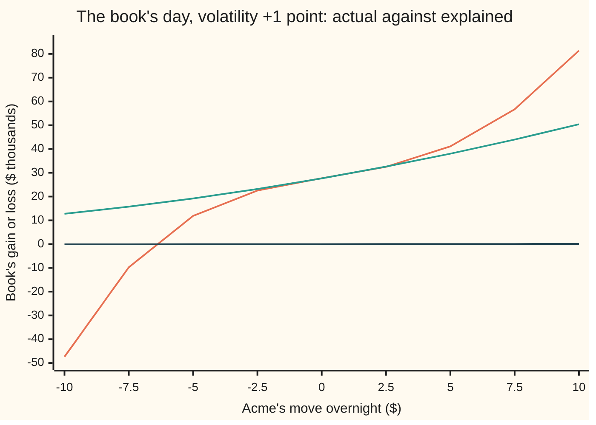

# Portfolio Greeks: adding sensitivities across positions and predicting a day's P&L

[Syllabus](../../../SYLLABUS.md) → [Financial mathematics](../../../SYLLABUS.md#w12) → [Hedging, Volatility Forecasts and Stress](../../../SYLLABUS.md#w12-s40) → Portfolio Greeks

---

## General Overview

A trading desk holds four positions on Acme shares, all in the house market: Acme at $100, rates at 5 percent, a 2 percent dividend yield, volatility (the market's measure of how jumpy Acme is) at 20 percent. The desk calls the four together its **book**.

- **A:** long one-year calls struck at $100, on 75,000 shares.
- **B:** short three-month puts struck at $90, on 130,000 shares.
- **C:** long six-month calls struck at $110, on 50,000 shares.
- **D:** short three-month Acme futures, on 74,200 shares. A future is a promise to buy or sell Acme at a fixed date for a price set today; its gains and losses are paid in cash every evening.

The next evening Acme closes at $105 and volatility at 21 percent. Repricing every position from scratch, the book made **$41,096.48**. That repricing is the "actual" P&L (profit and loss).

The risk report printed the night before holds one short list of numbers for the whole book: its Greeks, the slopes and bends of its value. Multiplying them by the day's moves predicts **$38,037.74**. That is the "explained" P&L: 92.56 percent of the actual. The **$3,058.75** left over is the "unexplained".

Two jobs make that morning report. First, add each Greek across positions, with signs and sizes, into one number per Greek for the book. Second, feed those book Greeks into the second-order expansion from [The Greeks together](../09-The%20Greeks%2C%20one%20each/09-greeks-together-taylor-pnl.md) and compare the result with the full reprice. The gap tells the desk whether its risk numbers describe its book.

**A book's Greeks are the signed sums of its positions' Greeks, because the slope of a sum is the sum of the slopes; fed into the second-order expansion, they explain a day's P&L up to a leftover that grows with the cube of the move and must be watched, not ignored.**

**What kind of fact this is:** a method. Its first half, adding Greeks across positions, is a theorem, proved on this card in Why it works. Its second half is an approximation whose error is measured on this card: $3,058.75 on this day.

### The picture: explained against actual, across other days

Each point is one possible next evening: Acme's move across the bottom, volatility up one point, one day gone. The vertical axis is the book's gain in thousands of dollars.



Orange: the actual P&L, every position repriced. Green: the explained P&L from the book's Greeks. Dark blue, flat along zero: delta alone, since the future has hedged the book's delta down to 6.78 shares. Between −$2.50 and +$2.50 the orange and green lines almost touch. At +$5 they part by $3,058.75. At −$10 the Greeks say +$12.76 thousand and the book loses $47.39 thousand: the short put has come alive, and no parabola drawn at $100 sees it coming.

---

## The formula

Notation first, in words. The positions are numbered by $i$. The capital Greek letter sigma, $\sum_i$, means "add up over every position". A small $d$ in front of an input means "the change in", as on the Greeks-together card.

$$\Delta = \sum_i n_i\,\Delta_i,\quad \Gamma = \sum_i n_i\,\Gamma_i,\quad \mathcal{V} = \sum_i n_i\,\mathcal{V}_i,\quad \Theta = \sum_i n_i\,\Theta_i,\quad \text{and the same for vanna and volga}$$

**Read it aloud:** each Greek of the book is every position's Greek for one unit, times that position's signed quantity, added up.

$$dB \approx \Delta\,dS + \tfrac12\,\Gamma\,dS^2 + \mathcal{V}\,d\sigma + \Theta\,dt + \text{vanna}\,dS\,d\sigma + \tfrac12\,\text{volga}\,d\sigma^2$$

**Read it aloud:** the book's gain over the day is its delta times Acme's move, plus half its gamma times the move squared, plus its vega times the volatility move, plus its theta times the time gone, plus its vanna times both moves together, plus half its volga times the volatility move squared.

The rate did not move, so the rho term is zero and left off. The cross terms that carry time, such as delta's change with time times $dS\,dt$, are tiny over one day; they are left off too and land in the unexplained. The explained P&L is the right-hand side. The unexplained is $dB$ from a full reprice minus the right-hand side.

| Symbol | Plain meaning | In our example | Push it up and the answer… |
| --- | --- | --- | --- |
| $B$, $dB$ | the book's value, and its change over the day | +$41,096.48 actual | — |
| $i$, $n_i$, $\sum_i$ | a position's number; its signed quantity in shares' worth, minus for short; add over every position | put B: −130,000 | that position's Greeks weigh more |
| $V_i$, $\Delta_i$, $\Gamma_i$ | one unit's value, delta and gamma in position $i$ | put B: 0.609142, −0.118683, 0.019820 | — |
| $S$, $dS$ | Acme's price, and its overnight move | $100, +$5 | the gain rises through delta, gamma and vanna |
| $\sigma$, $d\sigma$ | volatility as a decimal, and its move; one vol point is 0.01 | 0.20, +0.01 | the gain rises by about $27,884.01 per point |
| $t$, $dt$ | calendar time gone, in years; a day is 1/365 | one day | the gain rises by $58.41 a day: this book earns from time |
| $\Delta$ | book delta: dollars per $1 move in Acme | 6.78 | — |
| $\Gamma$ | book gamma: how fast book delta changes per $1 move | 78.83 | — |
| $\mathcal{V}$ | book vega: dollars per 1.00 of volatility | 2,788,400.86 | — |
| $\Theta$ | book theta: dollars per year of time passing | 21,320.96 | — |
| vanna, volga | how delta moves with volatility; how vega moves with volatility | 187,573.82; −6,051,929.67 | — |
| $F$, $T$, $r$, $q$ | a future's price, years left, the riskless rate, the dividend yield | $100.75, 0.25, 5%, 2% | — |

The futures price has its own formula. Holding Acme until the future's date costs the interest $r$ and earns the dividends $q$, so

$$F = S\,e^{(r-q)T},$$

and a future's Greeks follow from it: delta $e^{(r-q)T}$ (1.007528 here), theta $-(r-q)F$, and no gamma, vega, vanna or volga. The option Greeks are the closed forms derived on the sibling cards, for instance [Delta](../09-The%20Greeks%2C%20one%20each/01-delta.md) and [Vega](../09-The%20Greeks%2C%20one%20each/03-vega.md).

### When it holds

- **One underlying, one volatility.** Adding deltas makes sense only when every delta is measured against the same share. Books on many shares keep one delta per share, or convert each to dollars first. Adding vegas assumes every option's volatility moves by the same point; when short-dated volatility rises more than long-dated, the book's single vega misstates the day.
- **The book is frozen over the day.** The Greeks describe last night's positions. A trade made at noon adds P&L that no Greek from last night can explain.
- **Smooth values near today's inputs.** The expansion needs slopes up to the third to exist and stay modest. A short option near its strike and its expiry breaks this: put B has three months left and is already the book's largest source of unexplained P&L.
- **Small moves.** The leftover grows with the cube of the move: halve the day's move and it falls from $3,058.75 to $345.45.
- **The same model on both sides.** The Greeks and the full reprice use the same Black-Scholes model here. A real desk reprices on its market data, so model changes, a new volatility surface or bad data also land in the unexplained.

---

## Why it works

### Step 0: a book's value is a sum, and slopes add

The book's value is each position's value times its quantity, added up. Nudge Acme by a cent. Each position's value moves by its own slope times the cent. The book moves by the sum of those moves. So the book's slope is the sum of the positions' slopes, each counted as often as the book holds it. That is the whole theorem. Every Greek is a slope, or a slope of a slope, so every Greek adds the same way.

### Step 1: signs and sizes carry the hedge

A short position has a negative quantity. Its Greeks enter the sum with their signs flipped. Put B has delta −0.118683 per unit; the desk is short 130,000 of them, so the position's delta is **+15,428.77**. A put gains when Acme falls, so being short one is a bet that Acme rises.

The three option positions together carry delta 74,765.37: they gain that many dollars for each dollar Acme rises. The short future carries −74,758.59. Added, the book's delta is **6.78**. This is what "delta-hedged" means: the book barely cares about a small move in Acme. What it still cares about is everything else.

<details>
<summary>Detailed proof: portfolio Greeks add, and so do the leftovers</summary>

Write the book's value as $B(S,\sigma,t) = \sum_i n_i V_i(S,\sigma,t)$, where $V_i$ is one unit's value in position $i$ and the quantities $n_i$ stay fixed. Differentiation is linear: the slope of a sum of fixed multiples of curves is the same sum of fixed multiples of their slopes. Apply it once in $S$ and $\partial B / \partial S = \sum_i n_i\,\partial V_i / \partial S$, which is the delta line. Apply it twice and $\partial^2 B / \partial S^2 = \sum_i n_i\,\partial^2 V_i / \partial S^2$, the gamma line. The same step in $\sigma$, in $t$ and in mixed pairs gives vega, theta, vanna and volga. Nothing about options was used; the future is one more $V_i$.

The explained P&L is built from those sums, and every term is linear in the Greeks, so the book's explained P&L is the sum of each position's explained P&L. The actual P&L is a difference of sums, so it is also the sum of each position's actual P&L. Their difference, the unexplained, is then the sum of the positions' unexplained amounts. The code's by-position lines show it: −1,498.85 + 4,959.90 − 433.00 + 30.70 = 3,058.75.

</details>

### Step 2: the future's Greeks come from its price

The future's price is $F = S\,e^{(r-q)T}$. Acme up $1 lifts it by $e^{(r-q)T}$: that is 1.007528, not 1. The price is a straight line in $S$, so gamma is zero. Volatility does not appear, so vega, vanna and volga are zero.

Time does appear. As the calendar moves, $T$ shrinks, and $F$ drifts down toward Acme's price at the rate $(r-q)F$ a year: 3.022585 dollars per unit. The desk is short, so it gains: **+224,275.78** a year of theta from the future alone. With the short put's own time decay, the book earns $58.41 a day from the clock: positive theta.

### Step 3: the expansion applies to the book as one smooth value

The book's value is a smooth surface over Acme's price, volatility and time, because each piece is. The Greeks-together card proves that a smooth surface is matched near a point by its tangent plus its bend, with a leftover that shrinks like the cube of the move. Nothing in that proof asks what the surface is made of. So the book's expansion uses the book's Greeks, and by Step 0 those are the summed ones.

That is the working rule on a desk. Nobody computes a Taylor expansion per position. The report stores six numbers for the whole book and multiplies each by its move.

### Step 4: where the unexplained $3,058.75 comes from

The Greeks were measured at Acme $100 and 20 percent. By the evening Acme was at $105 and the Greeks had changed on the way. Put B's Greeks change fastest, because it has only three months left: a short-dated option's gamma and vanna swing hard when Acme and volatility move together. Its leftover alone is **$4,959.90**; the long calls give back −1,498.85 and −433.00.

Two measurements confirm that the leftover is almost all stale Greeks.

- **The next terms of the series.** Measured along the day's own path, the third-order piece is **+4,883.85** and the fourth-order piece **−1,099.26**. They alternate and shrink, and the series is converging toward the leftover, but slowly: this move is large for a three-month put.
- **Re-taking the Greeks on the way.** Cut the day into 20 equal slices. At the start of each slice, recompute the book's Greeks and apply the expansion to that slice alone. The sum of the slices is **$41,124.01**, against $41,096.48 actual. Greeks refreshed along the way leave almost nothing unexplained; last night's Greeks, used for the whole move, leave $3,058.75.

<details>
<summary>Why re-taking the Greeks closes the gap</summary>

Cut the move into equal slices. Each slice's expansion misses two things. The first is its cubic leftover: double the number of slices and each slice's leftover falls eightfold while the count doubles, so the total falls fourfold. The second is the cross terms that carry time, which the formula leaves out, such as charm (the change of delta with time) times $dS\,dt$. Each is a slice of time times a slice of move: double the slices and each falls fourfold, so the total halves. Either way the gap keeps shrinking as slices are added, which is why refreshing the Greeks through the day beats last night's numbers. The future's $30.70 of unexplained is exactly such a time cross term, taken over the whole day at once.

</details>

---

## Worked numbers, by hand

Last night's position Greeks, each the unit Greek times the signed quantity (vega, vanna and volga per 1.00 of volatility; theta per year):

| Position | Delta | Gamma | Vega | Theta | Vanna | Volga |
| --- | --- | --- | --- | --- | --- | --- |
| A long call K100 1y | 44,013.84 | 1,421.29 | 2,842,586.81 | −381,698.92 | −7,106.47 | 177,661.68 |
| B short put K90 3m | 15,428.77 | −2,576.56 | −1,288,280.76 | 465,066.58 | 138,954.63 | −8,188,632.01 |
| C long call K110 6m | 15,322.77 | 1,234.09 | 1,234,094.81 | −286,322.48 | 55,725.66 | 1,959,040.66 |
| D short future 3m | −74,758.59 | 0 | 0 | 224,275.78 | 0 | 0 |
| **Book** | **6.78** | **78.83** | **2,788,400.86** | **21,320.96** | **187,573.82** | **−6,051,929.67** |

The book row is the column sum; adding the rounded entries can miss by a cent. Then the day, with $dS = 5$, $d\sigma = 0.01$, $dt = 1/365$:

| Step | Arithmetic | Value |
| --- | --- | --- |
| delta term | 6.78 × 5 | +33.89 |
| gamma term | ½ × 78.83 × 5^2 | +985.33 |
| vega term | 2,788,400.86 × 0.01 | +27,884.01 |
| theta term | 21,320.96 × 1/365 | +58.41 |
| vanna term | 187,573.82 × 5 × 0.01 | +9,378.69 |
| volga term | ½ × (−6,051,929.67) × 0.01^2 | −302.60 |
| **explained** | sum of the six | **+$38,037.74** |
| actual | every position repriced at $105, 21 percent, one day on | +$41,096.48 |
| unexplained | actual − explained | +$3,058.75 |

The book made $41,096.48, and its Greeks accounted for all but $3,058.75. The day was a volatility day. Vega and vanna carry almost all of the explained amount; delta, hedged away, carries $33.89.

```
term     dollars, Acme +5, vol +1 point, one day (one block = 1,000)
vega     ████████████████████████████    27884.01
vanna    █████████                        9378.69
gamma    █                                 985.33
theta    ▏                                  58.41
delta    ▏                                  33.89
volga    ▏                                -302.60
```

Each leg moved far more than the book did. The long one-year calls made $263,370.17; the short future lost $373,147.81. The book's $41,096.48 is what survives the cancellation, which is why its Greeks must be added with signs, not looked at one position at a time.

### What breaks if you drop a piece

| Mistake | Comes out at | What went wrong |
| --- | --- | --- |
| Future's delta taken as 1 | $40,830.70 | Each future moves 1.007528 per dollar of Acme, not 1. The wrong answer lands closer to the actual by accident |
| Short put entered as long | −$41,695.18 | One sign flipped turns a $38,037.74 gain into a loss |
| Contracts counted, not shares | $380.38 | Listed options come in contracts of 100 shares; Greeks per share times contract counts are 100 times too small |
| Delta term only | $33.89 | A hedged book's P&L lives in the second-order and volatility terms |

Every number in both tables is printed by the code. Conventions verified 2026-09-28: a US-listed equity option covers 100 shares; theta counts calendar days, one day being 1/365 year.

---

## Code, from first principles, and it actually runs

The code builds its own bell-curve area (a power series in Python, thin slices under the curve in Rust), prices every position, and takes each Greek in closed form. It then reaches every quantity on the card by at least two roads: the book's Greeks as a signed sum of closed forms and by nudging the whole book's inputs and repricing; the actual P&L by the formula and by averaging each option's payoff over the bell curve directly; and the explained-versus-actual gap by walking the day in 20 re-Greeked slices. Asserts compare the roads; a fifth checks that halving the move cuts the leftover by close to eight; a sixth pins the house call and put to the pilot's prices.

### Python

```python
# Portfolio Greeks and a day's explained P&L -- the check behind the card.  Standard library only.
# N(x) is a power series written out here.  Price road 2 averages the payoff over the bell curve
# (Simpson's rule); Greek road 2 bumps the whole book; road 3 walks the day in small re-Greeked steps.
from math import log, sqrt, exp, pi

r, q, S0, SIG0 = 0.05, 0.02, 100.0, 0.20              # house market: rate, dividend yield, Acme, vol

def phi(x): return exp(-0.5 * x * x) / sqrt(2.0 * pi)            # bell-curve height

def N(x):                                              # bell-curve area left of x, by series
    if abs(x) > 9.0: return 0.0 if x < 0 else 1.0
    term, total, n = x, x, 0
    while abs(term) > 1e-17 * max(1.0, abs(total)):
        n += 1
        term *= x * x / (2 * n + 1)
        total += term
    return 0.5 + phi(x) * total

def d1d2(S, K, sig, T):
    d1 = (log(S / K) + (r - q + 0.5 * sig * sig) * T) / (sig * sqrt(T))
    return d1, d1 - sig * sqrt(T)

def option(S, K, sig, T, cp):                          # Black-Scholes, cp = +1 call, -1 put
    d1, d2 = d1d2(S, K, sig, T)
    return cp * (S * exp(-q * T) * N(cp * d1) - K * exp(-r * T) * N(cp * d2))

def option_integral(S, K, sig, T, cp, n=4000):         # road 2: discounted average payoff
    m, v = (r - q - 0.5 * sig * sig) * T, sig * sqrt(T)
    zk = (log(K / S) - m) / v                          # where the payoff's kink sits
    lo, hi = (zk, 10.0) if cp > 0 else (-10.0, zk)
    h = (hi - lo) / n
    f = lambda z: cp * (S * exp(m + v * z) - K) * phi(z)
    s = f(lo) + f(hi) + sum((4 if i % 2 else 2) * f(lo + i * h) for i in range(1, n))
    return exp(-r * T) * s * h / 3.0

def unit_greeks(K, sig, T, cp, S):                     # closed forms: delta gamma vega theta vanna volga
    if cp == 0:                                        # a future: its price is F = S e^{(r-q)T}
        F = S * exp((r - q) * T)
        return [F / S, 0.0, 0.0, -(r - q) * F, 0.0, 0.0]
    d1, d2 = d1d2(S, K, sig, T)
    eq, er, rt = exp(-q * T), exp(-r * T), sqrt(T)
    vega = S * eq * phi(d1) * rt
    theta = -S * eq * phi(d1) * sig / (2 * rt) - cp * r * K * er * N(cp * d2) + cp * q * S * eq * N(cp * d1)
    return [cp * eq * N(cp * d1), eq * phi(d1) / (S * sig * rt), vega, theta,
            -eq * phi(d1) * d2 / sig, vega * d1 * d2 / sig]

# the book: label, signed quantity (in shares' worth), strike, years left, +1 call / -1 put / 0 future
BOOK = [("A long call K100 1y", 75000, 100.0, 1.0, 1), ("B short put K90 3m", -130000, 90.0, 0.25, -1),
        ("C long call K110 6m", 50000, 110.0, 0.5, 1), ("D short future 3m", -74200, 0.0, 0.25, 0)]
F0 = S0 * exp((r - q) * 0.25)                          # tonight's futures price

def mark(p, S, sig, t, road=option):                   # one position's value once t years have passed
    _, n, K, T, cp = p
    return n * (S * exp((r - q) * (T - t)) - F0) if cp == 0 else n * road(S, K, sig, T - t, cp)

def book(S, sig, t, road=option): return sum(mark(p, S, sig, t, road) for p in BOOK)

def book_greeks(S, sig, t):                            # road 1: signed sum of closed-form Greeks
    return [sum(p[1] * u for p in BOOK for u in [unit_greeks(p[2], sig, p[3] - t, p[4], S)[i]]) for i in range(6)]

def bumped(f, hs=0.01, hv=1e-4, ht=1e-5, hw=1e-3):              # road 2: nudge the whole book's inputs, reprice
    return [(f(S0 + hs, SIG0, 0) - f(S0 - hs, SIG0, 0)) / (2 * hs),
            (f(S0 + hs, SIG0, 0) - 2 * f(S0, SIG0, 0) + f(S0 - hs, SIG0, 0)) / hs ** 2,
            (f(S0, SIG0 + hv, 0) - f(S0, SIG0 - hv, 0)) / (2 * hv),
            (f(S0, SIG0, ht) - f(S0, SIG0, -ht)) / (2 * ht),
            (f(S0 + hs, SIG0 + hv, 0) - f(S0 + hs, SIG0 - hv, 0) - f(S0 - hs, SIG0 + hv, 0)
             + f(S0 - hs, SIG0 - hv, 0)) / (4 * hs * hv),
            (-f(S0, SIG0 + 2 * hw, 0) + 16 * f(S0, SIG0 + hw, 0) - 30 * f(S0, SIG0, 0)     # volga: five-point,
             + 16 * f(S0, SIG0 - hw, 0) - f(S0, SIG0 - 2 * hw, 0)) / (12 * hw * hw)]          # steadier to round-off

def terms(g, dS, dv, dt):                              # the Taylor pieces, in the card's order
    return [g[0] * dS, 0.5 * g[1] * dS * dS, g[2] * dv, g[3] * dt, g[4] * dS * dv, 0.5 * g[5] * dv * dv]

unit = [unit_greeks(p[2], SIG0, p[3], p[4], S0) for p in BOOK]
posg = [[p[1] * x + 0.0 for x in u] for p, u in zip(BOOK, unit)]
closed, bump = book_greeks(S0, SIG0, 0.0), bumped(book)
print("position             quantity  unit price     delta     gamma      vega     theta     vanna     volga")
for p, u in zip(BOOK, unit):
    price = F0 if p[4] == 0 else option(S0, p[2], SIG0, p[3], p[4])
    print(f"{p[0]:<20}{p[1]:>9}{price:>12.6f}" + "".join(f"{x:>10.6f}" for x in u))
print("position Greeks, quantity x unit")
for p, g in zip(BOOK, posg):
    print(f"{p[0]:<20}" + "".join(f"{x:>12.2f}" for x in g))
print(f"{'book, summed':<20}" + "".join(f"{x:>12.2f}" for x in closed))
print(f"{'book, by bumping':<20}" + "".join(f"{x:>12.2f}" for x in bump))
print(f"vega per vol point; delta before future {closed[2] / 100:.2f}  {sum(g[0] for g in posg[:3]):.2f}")

dS, dv, dt = 5.0, 0.01, 1.0 / 365.0
tc, tb = terms(closed, dS, dv, dt), terms(bump, dS, dv, dt)
print("the day: Acme +5, vol +1 point, one day: term by summed Greeks, by bumped Greeks")
for nm, a, b in zip(["delta", "gamma", "vega", "theta", "vanna", "volga"], tc, tb):
    print(f"  {nm:<10}{a:>14.2f}{b:>14.2f}")
explained, explained_b = sum(tc), sum(tb)
actual = book(S0 + dS, SIG0 + dv, dt) - book(S0, SIG0, 0)
actual_i = book(S0 + dS, SIG0 + dv, dt, option_integral) - book(S0, SIG0, 0, option_integral)
print(f"explained: summed, bumped               {explained:.2f}  {explained_b:.2f}")
print(f"actual: reprice by formula, by integral {actual:.2f}  {actual_i:.2f}")
print(f"unexplained; explained share of actual  {actual - explained:.2f}  {explained / actual:.4f}")
print("by position: unexplained, explained, actual")
res_pos = []
for p, g in zip(BOOK, posg):
    e, a = sum(terms(g, dS, dv, dt)), mark(p, S0 + dS, SIG0 + dv, dt) - mark(p, S0, SIG0, 0)
    res_pos.append(a - e)
    print(f"  {p[0]:<20}{a - e:>12.2f}{e:>12.2f}{a:>12.2f}")

steps, walked = 20, 0.0                                # road 3: re-take the Greeks at each small step
for j in range(steps):
    k = j / steps
    walked += sum(terms(book_greeks(S0 + k * dS, SIG0 + k * dv, k * dt), dS / steps, dv / steps, dt / steps))
g = lambda k: book(S0 + k * dS, SIG0 + k * dv, k * dt)  # the book along the day's straight path
hk = 0.05
g3 = (g(2 * hk) - 2 * g(hk) + 2 * g(-hk) - g(-2 * hk)) / (2 * hk ** 3)
g4 = (g(2 * hk) - 4 * g(hk) + 6 * g(0) - 4 * g(-hk) + g(-2 * hk)) / hk ** 4
res_half = (g(0.5) - g(0)) - sum(terms(closed, dS / 2, dv / 2, dt / 2))
print(f"walked in 20 re-Greeked steps           {walked:.2f}")
print(f"third-order, fourth-order pieces        {g3 / 6:.2f}  {g4 / 24:.2f}")
print(f"unexplained at half the move; ratio     {res_half:.2f}  {(actual - explained) / res_half:.4f}")
print(f"wrong: future's delta taken as 1        {explained + BOOK[3][1] * (1.0 - unit[3][0]) * dS:.2f}")
print(f"wrong: short put entered as long        {explained - 2 * sum(terms(posg[1], dS, dv, dt)):.2f}")
print(f"wrong: contracts, not shares            {explained / 100:.2f}")
print(f"wrong: delta term only                  {tc[0]:.2f}")
for lab, a, b in (("try: Acme -5, vol +1", -5.0, 0.01), ("try: Acme +5, vol 0", 5.0, 0.0),
                  ("try: Acme +2, vol +1", 2.0, 0.01)):
    print(f"{lab:<24}explained {sum(terms(closed, a, b, dt)):>10.2f}  actual {book(S0 + a, SIG0 + b, dt) - book(S0, SIG0, 0):>10.2f}")
moves = [-10, -7.5, -5, -2.5, 0, 2.5, 5, 7.5, 10]
print("chart, Acme move ($)" + "".join(f"{m:>7}" for m in moves) + "   ($ thousands)")
for lab, fn in (("actual", lambda m: book(S0 + m, SIG0 + dv, dt) - book(S0, SIG0, 0)),
                ("explained", lambda m: sum(terms(closed, m, dv, dt))), ("delta only", lambda m: closed[0] * m)):
    print(f"chart, {lab:<13}" + "".join(f"{fn(m) / 1000:>7.2f}" for m in moves))

scale = [sum(abs(g[i]) for g in posg) for i in range(6)]
assert all(abs(a - b) <= 1e-6 * s for a, b, s in zip(closed, bump, scale)), "summed Greeks != bumped book"
assert abs(explained - explained_b) < 1.0, "explained P&L differs between Greek roads"
assert abs(actual - actual_i) < 0.05, "full reprice differs between price roads"
assert abs(walked - actual_i) < 0.005 * abs(actual_i), "re-Greeked walk does not reach the actual P&L"
assert 6.0 < (actual - explained) / res_half < 10.0, "leftover does not shrink like the cube"
assert abs(option(S0, 100.0, SIG0, 1.0, 1) - 9.227005508154) < 1e-9 and abs(option(S0, 100.0, SIG0, 1.0, -1) - 6.330080627550) < 1e-9, "house prices"
print("ALL CHECKS PASS")
```

**Ran 2026-09-28 on macOS, Python 3.14.6, standard library only. All checks passed. Output, pasted from the run:**

```
position             quantity  unit price     delta     gamma      vega     theta     vanna     volga
A long call K100 1y     75000    9.227006  0.586851  0.018951 37.901158 -5.089319 -0.094753  2.368822
B short put K90 3m    -130000    0.609142 -0.118683  0.019820  9.909852 -3.577435 -1.068882 62.989477
C long call K110 6m     50000    2.585913  0.306455  0.024682 24.681896 -5.726450  1.114513 39.180813
D short future 3m      -74200  100.752820  1.007528  0.000000  0.000000 -3.022585  0.000000  0.000000
position Greeks, quantity x unit
A long call K100 1y     44013.84     1421.29  2842586.81  -381698.92    -7106.47   177661.68
B short put K90 3m      15428.77    -2576.56 -1288280.76   465066.58   138954.63 -8188632.01
C long call K110 6m     15322.77     1234.09  1234094.81  -286322.48    55725.66  1959040.66
D short future 3m      -74758.59        0.00        0.00   224275.78        0.00        0.00
book, summed                6.78       78.83  2788400.86    21320.96   187573.82 -6051929.67
book, by bumping            6.78       78.83  2788400.93    21320.96   187573.77 -6051929.67
vega per vol point; delta before future 27884.01  74765.37
the day: Acme +5, vol +1 point, one day: term by summed Greeks, by bumped Greeks
  delta              33.89         33.92
  gamma             985.33        985.33
  vega            27884.01      27884.01
  theta              58.41         58.41
  vanna            9378.69       9378.69
  volga            -302.60       -302.60
explained: summed, bumped               38037.74  38037.76
actual: reprice by formula, by integral 41096.48  41096.48
unexplained; explained share of actual  3058.75  0.9256
by position: unexplained, explained, actual
  A long call K100 1y     -1498.85   264869.02   263370.17
  B short put K90 3m       4959.90    39866.46    44826.36
  C long call K110 6m      -433.00   106480.76   106047.76
  D short future 3m          30.70  -373178.51  -373147.81
walked in 20 re-Greeked steps           41124.01
third-order, fourth-order pieces        4883.85  -1099.26
unexplained at half the move; ratio     345.45  8.8544
wrong: future's delta taken as 1        40830.70
wrong: short put entered as long        -41695.18
wrong: contracts, not shares            380.38
wrong: delta term only                  33.89
try: Acme -5, vol +1    explained   19212.58  actual   11873.23
try: Acme +5, vol 0     explained    1077.64  actual    6380.42
try: Acme +2, vol +1    explained   31562.51  actual   31341.66
chart, Acme move ($)    -10   -7.5     -5   -2.5      0    2.5      5    7.5     10   ($ thousands)
chart, actual        -47.39  -9.74  11.87  22.54  27.71  32.48  41.10  56.71  81.38
chart, explained      12.76  15.74  19.21  23.18  27.64  32.59  38.04  43.98  50.41
chart, delta only     -0.07  -0.05  -0.03  -0.02   0.00   0.02   0.03   0.05   0.07
ALL CHECKS PASS
```

### Rust

```rust
// Portfolio Greeks and a day's explained P&L -- the same check in Rust, std only, no crates.
// Rust has no erf: N(x) is Simpson's rule on the bell-curve height, not the Python series.
// Compile: rustc --edition 2021 -O portfolio_greeks_and_taylor_pnl_check.rs
use std::f64::consts::PI;

const R: f64 = 0.05;
const Q: f64 = 0.02;
const S0: f64 = 100.0;
const SIG0: f64 = 0.20;

fn phi(x: f64) -> f64 { (-0.5 * x * x).exp() / (2.0 * PI).sqrt() }

fn simpson<F: Fn(f64) -> f64>(f: F, a: f64, b: f64, n: usize) -> f64 {
    let h = (b - a) / n as f64;
    let mut s = f(a) + f(b);
    for i in 1..n { s += if i % 2 == 1 { 4.0 } else { 2.0 } * f(a + i as f64 * h); }
    s * h / 3.0
}

fn ncdf(x: f64) -> f64 {
    if x.abs() > 9.0 { return if x < 0.0 { 0.0 } else { 1.0 }; }
    0.5 + simpson(phi, 0.0, x, 2000)
}

fn d1d2(s: f64, k: f64, sg: f64, t: f64) -> (f64, f64) {
    let d1 = ((s / k).ln() + (R - Q + 0.5 * sg * sg) * t) / (sg * t.sqrt());
    (d1, d1 - sg * t.sqrt())
}

fn option(s: f64, k: f64, sg: f64, t: f64, cp: f64) -> f64 {
    let (d1, d2) = d1d2(s, k, sg, t);
    cp * (s * (-Q * t).exp() * ncdf(cp * d1) - k * (-R * t).exp() * ncdf(cp * d2))
}

fn option_integral(s: f64, k: f64, sg: f64, t: f64, cp: f64) -> f64 {
    let (m, v) = ((R - Q - 0.5 * sg * sg) * t, sg * t.sqrt());
    let zk = ((k / s).ln() - m) / v;
    let (lo, hi) = if cp > 0.0 { (zk, 10.0) } else { (-10.0, zk) };
    (-R * t).exp() * simpson(|z| cp * (s * (m + v * z).exp() - k) * phi(z), lo, hi, 4000)
}

fn unit_greeks(k: f64, sg: f64, t: f64, cp: f64, s: f64) -> [f64; 6] {
    if cp == 0.0 {
        let f = s * ((R - Q) * t).exp();
        return [f / s, 0.0, 0.0, -(R - Q) * f, 0.0, 0.0];
    }
    let (d1, d2) = d1d2(s, k, sg, t);
    let (eq, er, rt) = ((-Q * t).exp(), (-R * t).exp(), t.sqrt());
    let vega = s * eq * phi(d1) * rt;
    let theta = -s * eq * phi(d1) * sg / (2.0 * rt) - cp * R * k * er * ncdf(cp * d2) + cp * Q * s * eq * ncdf(cp * d1);
    [cp * eq * ncdf(cp * d1), eq * phi(d1) / (s * sg * rt), vega, theta, -eq * phi(d1) * d2 / sg, vega * d1 * d2 / sg]
}

// label, signed quantity (shares' worth), strike, years left, +1 call / -1 put / 0 future
const BOOK: [(&str, f64, f64, f64, f64); 4] = [
    ("A long call K100 1y", 75000.0, 100.0, 1.0, 1.0), ("B short put K90 3m", -130000.0, 90.0, 0.25, -1.0),
    ("C long call K110 6m", 50000.0, 110.0, 0.5, 1.0), ("D short future 3m", -74200.0, 0.0, 0.25, 0.0)];

fn f0() -> f64 { S0 * ((R - Q) * 0.25).exp() }

fn mark(p: &(&str, f64, f64, f64, f64), s: f64, sg: f64, t: f64, integral: bool) -> f64 {
    let (_, n, k, tt, cp) = *p;
    if cp == 0.0 { return n * (s * ((R - Q) * (tt - t)).exp() - f0()); }
    n * if integral { option_integral(s, k, sg, tt - t, cp) } else { option(s, k, sg, tt - t, cp) }
}

fn book(s: f64, sg: f64, t: f64, integral: bool) -> f64 { BOOK.iter().map(|p| mark(p, s, sg, t, integral)).sum() }

fn book_greeks(s: f64, sg: f64, t: f64) -> [f64; 6] {
    let mut g = [0.0; 6];
    for p in BOOK.iter() { let u = unit_greeks(p.2, sg, p.3 - t, p.4, s); for i in 0..6 { g[i] += p.1 * u[i]; } }
    g
}

fn bumped() -> [f64; 6] {
    let f = |s: f64, v: f64, t: f64| book(s, v, t, false);
    let (hs, hv, ht, hw) = (0.01, 1e-4, 1e-5, 1e-3);  // hw: five-point volga, steadier to round-off
    [(f(S0 + hs, SIG0, 0.0) - f(S0 - hs, SIG0, 0.0)) / (2.0 * hs),
     (f(S0 + hs, SIG0, 0.0) - 2.0 * f(S0, SIG0, 0.0) + f(S0 - hs, SIG0, 0.0)) / (hs * hs),
     (f(S0, SIG0 + hv, 0.0) - f(S0, SIG0 - hv, 0.0)) / (2.0 * hv),
     (f(S0, SIG0, ht) - f(S0, SIG0, -ht)) / (2.0 * ht),
     (f(S0 + hs, SIG0 + hv, 0.0) - f(S0 + hs, SIG0 - hv, 0.0) - f(S0 - hs, SIG0 + hv, 0.0)
        + f(S0 - hs, SIG0 - hv, 0.0)) / (4.0 * hs * hv),
     (-f(S0, SIG0 + 2.0 * hw, 0.0) + 16.0 * f(S0, SIG0 + hw, 0.0) - 30.0 * f(S0, SIG0, 0.0)
        + 16.0 * f(S0, SIG0 - hw, 0.0) - f(S0, SIG0 - 2.0 * hw, 0.0)) / (12.0 * hw * hw)]
}

fn terms(g: &[f64; 6], ds: f64, dv: f64, dt: f64) -> [f64; 6] {
    [g[0] * ds, 0.5 * g[1] * ds * ds, g[2] * dv, g[3] * dt, g[4] * ds * dv, 0.5 * g[5] * dv * dv]
}
fn sum(a: &[f64; 6]) -> f64 { a.iter().sum() }
fn row(lab: &str, v: &[f64]) -> String { format!("{:<20}", lab) + &v.iter().map(|x| format!("{:>12.2}", x)).collect::<String>() }

fn main() {
    let unit: Vec<[f64; 6]> = BOOK.iter().map(|p| unit_greeks(p.2, SIG0, p.3, p.4, S0)).collect();
    let posg: Vec<[f64; 6]> = BOOK.iter().zip(&unit).map(|(p, u)| u.map(|x| p.1 * x + 0.0)).collect();
    let (closed, bump) = (book_greeks(S0, SIG0, 0.0), bumped());
    println!("position             quantity  unit price     delta     gamma      vega     theta     vanna     volga");
    for (p, u) in BOOK.iter().zip(&unit) {
        let price = if p.4 == 0.0 { f0() } else { option(S0, p.2, SIG0, p.3, p.4) };
        println!("{:<20}{:>9}{:>12.6}{}", p.0, p.1, price, u.iter().map(|x| format!("{:>10.6}", x)).collect::<String>());
    }
    println!("position Greeks, quantity x unit");
    for (p, g) in BOOK.iter().zip(&posg) { println!("{}", row(p.0, g)); }
    println!("{}\n{}", row("book, summed", &closed), row("book, by bumping", &bump));
    let d3: f64 = posg[..3].iter().map(|g| g[0]).sum();
    println!("vega per vol point; delta before future {:.2}  {:.2}", closed[2] / 100.0, d3);

    let (ds, dv, dt) = (5.0, 0.01, 1.0 / 365.0);
    let (tc, tb) = (terms(&closed, ds, dv, dt), terms(&bump, ds, dv, dt));
    println!("the day: Acme +5, vol +1 point, one day: term by summed Greeks, by bumped Greeks");
    for (i, nm) in ["delta", "gamma", "vega", "theta", "vanna", "volga"].iter().enumerate() {
        println!("  {:<10}{:>14.2}{:>14.2}", nm, tc[i], tb[i]);
    }
    let (explained, explained_b) = (sum(&tc), sum(&tb));
    let actual = book(S0 + ds, SIG0 + dv, dt, false) - book(S0, SIG0, 0.0, false);
    let actual_i = book(S0 + ds, SIG0 + dv, dt, true) - book(S0, SIG0, 0.0, true);
    println!("explained: summed, bumped               {:.2}  {:.2}", explained, explained_b);
    println!("actual: reprice by formula, by integral {:.2}  {:.2}", actual, actual_i);
    println!("unexplained; explained share of actual  {:.2}  {:.4}", actual - explained, explained / actual);
    println!("by position: unexplained, explained, actual");
    for (p, g) in BOOK.iter().zip(&posg) {
        let (e, a) = (sum(&terms(g, ds, dv, dt)), mark(p, S0 + ds, SIG0 + dv, dt, false) - mark(p, S0, SIG0, 0.0, false));
        println!("  {:<20}{:>12.2}{:>12.2}{:>12.2}", p.0, a - e, e, a);
    }
    let steps = 20;
    let mut walked = 0.0;
    for j in 0..steps {
        let k = j as f64 / steps as f64;
        let n = steps as f64;
        walked += sum(&terms(&book_greeks(S0 + k * ds, SIG0 + k * dv, k * dt), ds / n, dv / n, dt / n));
    }
    let g = |k: f64| book(S0 + k * ds, SIG0 + k * dv, k * dt, false);
    let hk: f64 = 0.05;
    let g3 = (g(2.0 * hk) - 2.0 * g(hk) + 2.0 * g(-hk) - g(-2.0 * hk)) / (2.0 * hk.powi(3));
    let g4 = (g(2.0 * hk) - 4.0 * g(hk) + 6.0 * g(0.0) - 4.0 * g(-hk) + g(-2.0 * hk)) / hk.powi(4);
    let res_half = (g(0.5) - g(0.0)) - sum(&terms(&closed, ds / 2.0, dv / 2.0, dt / 2.0));
    println!("walked in 20 re-Greeked steps           {:.2}", walked);
    println!("third-order, fourth-order pieces        {:.2}  {:.2}", g3 / 6.0, g4 / 24.0);
    println!("unexplained at half the move; ratio     {:.2}  {:.4}", res_half, (actual - explained) / res_half);
    println!("wrong: future's delta taken as 1        {:.2}", explained + BOOK[3].1 * (1.0 - unit[3][0]) * ds);
    println!("wrong: short put entered as long        {:.2}", explained - 2.0 * sum(&terms(&posg[1], ds, dv, dt)));
    println!("wrong: contracts, not shares            {:.2}", explained / 100.0);
    println!("wrong: delta term only                  {:.2}", tc[0]);
    for (lab, a, b) in [("try: Acme -5, vol +1", -5.0, 0.01), ("try: Acme +5, vol 0", 5.0, 0.0), ("try: Acme +2, vol +1", 2.0, 0.01)] {
        let act = book(S0 + a, SIG0 + b, dt, false) - book(S0, SIG0, 0.0, false);
        println!("{:<24}explained {:>10.2}  actual {:>10.2}", lab, sum(&terms(&closed, a, b, dt)), act);
    }
    let moves = [-10.0, -7.5, -5.0, -2.5, 0.0, 2.5, 5.0, 7.5, 10.0];
    let labels = ["-10", "-7.5", "-5", "-2.5", "0", "2.5", "5", "7.5", "10"];
    println!("chart, Acme move ($){}   ($ thousands)", labels.iter().map(|m| format!("{:>7}", m)).collect::<String>());
    let lines: [(&str, Box<dyn Fn(f64) -> f64>); 3] = [
        ("actual", Box::new(|m| book(S0 + m, SIG0 + dv, dt, false) - book(S0, SIG0, 0.0, false))),
        ("explained", Box::new(|m| sum(&terms(&closed, m, dv, dt)))), ("delta only", Box::new(|m| closed[0] * m))];
    for (lab, f) in lines.iter() {
        println!("chart, {:<13}{}", lab, moves.iter().map(|&m| format!("{:>7.2}", f(m) / 1000.0)).collect::<String>());
    }

    for i in 0..6 {
        let scale: f64 = posg.iter().map(|g| g[i].abs()).sum();
        assert!((closed[i] - bump[i]).abs() <= 1e-6 * scale, "summed Greeks != bumped book");
    }
    assert!((explained - explained_b).abs() < 1.0, "explained P&L differs between Greek roads");
    assert!((actual - actual_i).abs() < 0.05, "full reprice differs between price roads");
    assert!((walked - actual_i).abs() < 0.005 * actual_i.abs(), "re-Greeked walk does not reach the actual P&L");
    let ratio = (actual - explained) / res_half;
    assert!(ratio > 6.0 && ratio < 10.0, "leftover does not shrink like the cube");
    assert!((option(S0, 100.0, SIG0, 1.0, 1.0) - 9.227005508154).abs() < 1e-9 && (option(S0, 100.0, SIG0, 1.0, -1.0) - 6.330080627550).abs() < 1e-9, "house prices");
    println!("ALL CHECKS PASS");
}
```

**Ran 2026-09-28 on macOS, rustc 1.98.1, no crates. All checks passed. Output, pasted from the run:**

```
position             quantity  unit price     delta     gamma      vega     theta     vanna     volga
A long call K100 1y     75000    9.227006  0.586851  0.018951 37.901158 -5.089319 -0.094753  2.368822
B short put K90 3m    -130000    0.609142 -0.118683  0.019820  9.909852 -3.577435 -1.068882 62.989477
C long call K110 6m     50000    2.585913  0.306455  0.024682 24.681896 -5.726450  1.114513 39.180813
D short future 3m      -74200  100.752820  1.007528  0.000000  0.000000 -3.022585  0.000000  0.000000
position Greeks, quantity x unit
A long call K100 1y     44013.84     1421.29  2842586.81  -381698.92    -7106.47   177661.68
B short put K90 3m      15428.77    -2576.56 -1288280.76   465066.58   138954.63 -8188632.01
C long call K110 6m     15322.77     1234.09  1234094.81  -286322.48    55725.66  1959040.66
D short future 3m      -74758.59        0.00        0.00   224275.78        0.00        0.00
book, summed                6.78       78.83  2788400.86    21320.96   187573.82 -6051929.67
book, by bumping            6.78       78.83  2788400.93    21320.96   187573.77 -6051929.67
vega per vol point; delta before future 27884.01  74765.37
the day: Acme +5, vol +1 point, one day: term by summed Greeks, by bumped Greeks
  delta              33.89         33.92
  gamma             985.33        985.33
  vega            27884.01      27884.01
  theta              58.41         58.41
  vanna            9378.69       9378.69
  volga            -302.60       -302.60
explained: summed, bumped               38037.74  38037.76
actual: reprice by formula, by integral 41096.48  41096.48
unexplained; explained share of actual  3058.75  0.9256
by position: unexplained, explained, actual
  A long call K100 1y     -1498.85   264869.02   263370.17
  B short put K90 3m       4959.90    39866.46    44826.36
  C long call K110 6m      -433.00   106480.76   106047.76
  D short future 3m          30.70  -373178.51  -373147.81
walked in 20 re-Greeked steps           41124.01
third-order, fourth-order pieces        4883.85  -1099.26
unexplained at half the move; ratio     345.45  8.8544
wrong: future's delta taken as 1        40830.70
wrong: short put entered as long        -41695.18
wrong: contracts, not shares            380.38
wrong: delta term only                  33.89
try: Acme -5, vol +1    explained   19212.58  actual   11873.23
try: Acme +5, vol 0     explained    1077.64  actual    6380.42
try: Acme +2, vol +1    explained   31562.51  actual   31341.66
chart, Acme move ($)    -10   -7.5     -5   -2.5      0    2.5      5    7.5     10   ($ thousands)
chart, actual        -47.39  -9.74  11.87  22.54  27.71  32.48  41.10  56.71  81.38
chart, explained      12.76  15.74  19.21  23.18  27.64  32.59  38.04  43.98  50.41
chart, delta only     -0.07  -0.05  -0.03  -0.02   0.00   0.02   0.03   0.05   0.07
ALL CHECKS PASS
```

The two outputs agree line for line. The bumped volga uses a five-point nudge (values at two steps either side) because the plain three-point version, divided by a tiny step squared, magnifies rounding in the last places, and the two languages' bell-curve areas round differently.

> [!TIP]
> **Try changing**
> - **Acme falls $5 instead, volatility still up one point.** Guess first: does the unexplained change sign? Yes. The Greeks say $19,212.58; the book makes $11,873.23. The Greeks now overstate the day, because the short put's gamma grows as Acme falls toward $90, and the desk is short it.
> - **Acme up $5, volatility flat.** Guess first: with vega and vanna switched off, is the leftover smaller? No: explained $1,077.64, actual $6,380.42. The explained part shrank, the stale-gamma leftover did not.
> - **A quiet day: Acme up $2, volatility up one point.** Guess first: better or worse than 92.56 percent? Explained $31,562.51, actual $31,341.66: under one percent apart. On ordinary days the report works.

---

## The usual mistake

> [!warning]
> **Reading a small unexplained as proof the risk is understood.** The explained P&L and the actual agree when the day is small and drift apart with the cube of the move. On the day above the gap was $3,058.75. On a $10 fall with the same volatility move the Greeks predict a gain of $12.76 thousand while the book loses $47.39 thousand. A report that explains ordinary days well is exactly the report that misses the day that matters, which is why desks back it with full repricing across a grid of large moves.
>
> Smaller traps:
> - **Treating a future as one share.** Its delta is $e^{(r-q)T}$, 1.007528 here. Counted as 1, the explained P&L comes out at $40,830.70, closer to the actual and wrong: a mistake that improves the fit is still a mistake, and the next day it will not.
> - **Adding Greeks without signs.** Short positions subtract. Entering put B as long turns the day's explained P&L into −$41,695.18.
> - **Mixing units across positions.** Vega per 1.00 of volatility and vega per vol point differ by 100; Greeks per share and per contract differ by 100. One position in the wrong unit and the sum is meaningless: $380.38 instead of $38,037.74 when contracts replace shares.
> - **Blaming the unexplained on the Greeks alone.** In a real report the leftover also holds trades done during the day, fees, dividends paid, model changes and data errors. Each has to be separated before the higher-order terms get the blame.

---

## Where you meet it in real life

- **The morning P&L explain.** Every trading desk's day starts with yesterday's actual P&L split into delta, gamma, vega, theta and an unexplained line. A large unexplained is investigated before new trading begins.
- **Regulatory capital.** Under the Basel market-risk rules a desk may use its own risk model only if the P&L that model predicts tracks the desk's P&L from last night's positions repriced closely enough: the P&L attribution test.
- **Hedging.** Book delta is the number of shares or futures a hedger trades to flatten the book; book gamma and vega are the targets for the option hedges on [Hedging three Greeks at once](02-delta-gamma-vega-hedging.md). When the hedge is on a different asset, [Imperfect hedges](03-hedge-ratios-basis-risk-and-cross-hedging.md) takes over.
- **Stress tests.** Where the expansion fails, on the −$10 day above, desks reprice in full across a grid of moves: [Stress tests](05-scenario-grids-and-stress-tests.md).
- **Limits.** Risk managers cap book delta, gamma and vega, not each position's: [Limits](06-risk-limits-and-risk-appetite.md).

> **Say it back**
> A book's Greeks are its positions' Greeks, each times its signed quantity, added up, because the slope of a sum is the sum of the slopes. A future counts with delta $e^{(r-q)T}$ and a theta of its own. Fed into the second-order expansion, the book's Greeks explain a day's P&L: here $38,037.74 of an actual $41,096.48. The unexplained is the Greeks going stale as the market moves, and it grows with the cube of the move. A small unexplained on a quiet day says nothing about a large day.

---

## What this builds on

- [The Greeks together](../09-The%20Greeks%2C%20one%20each/09-greeks-together-taylor-pnl.md): the second-order expansion for one option, with its cube-law error. This card applies it to a book.

## Where this goes next

- [Hedging three Greeks at once](02-delta-gamma-vega-hedging.md): the book Greeks become targets. Two listed options and a share position are sized by a small system of equations to set delta, gamma and vega to zero at once.
- [Tomorrow's volatility](04-volatility-forecasting-ewma-garch-and-realised.md): the explained P&L needs tomorrow's moves; this card assumed them. Forecasting the size of tomorrow's move turns the report into a forecast.

This card measured a book's exposure; the question it leaves open is how to remove the exposure the desk does not want, which the hedging card answers.

---

## Sources

Verified 2026-09-28: every link below resolves to the publisher's page.

- Hull, John C. *Options, Futures, and Other Derivatives*, 11th ed. Pearson. [Publisher page](https://www.pearson.com/en-us/subject-catalog/p/options-futures-and-other-derivatives/P200000005938). The Greek letters chapter: portfolio Greeks as sums, the Taylor expansion of portfolio value, and the delta of a futures contract.
- Taleb, Nassim Nicholas. *Dynamic Hedging: Managing Vanilla and Exotic Options*. Wiley, 1997. [Publisher page](https://www.wiley.com/en-us/Dynamic+Hedging%3A+Managing+Vanilla+and+Exotic+Options-p-9780471152804). A trader's account of book-level Greeks, higher-order terms and where the expansion breaks.
- Basel Committee on Banking Supervision. *Minimum capital requirements for market risk*. Bank for International Settlements, January 2019. [BIS page](https://www.bis.org/bcbs/publ/d457.htm). The P&L attribution test that compares a risk model's predicted P&L with the desk's actual.
