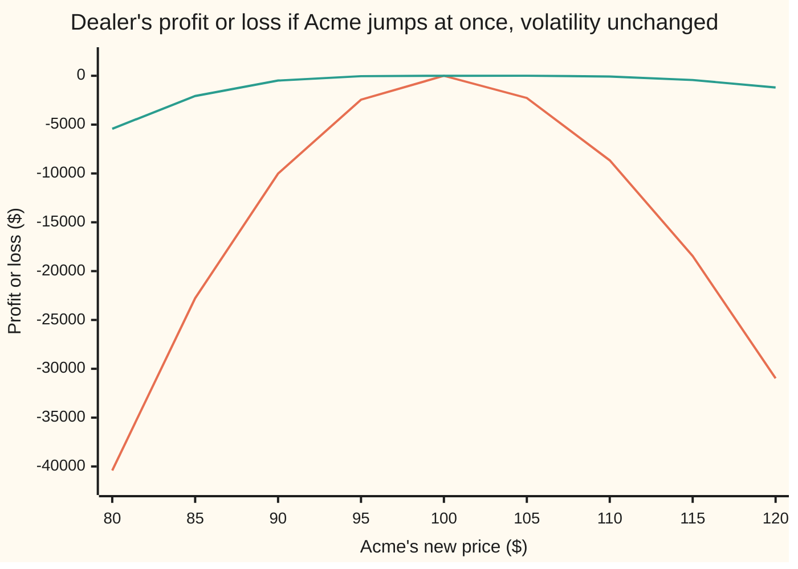

# Hedging three Greeks at once: solving for the option positions that flatten delta, gamma and vega

[Syllabus](../../../SYLLABUS.md) → [Financial mathematics](../README.md) → [Hedging, Volatility Forecasts and Stress](../README.md#s40) → Hedging three Greeks at once

---

## General Overview

A dealer has sold 10,000 one-year call options on Acme to clients. Each option is the house call: Acme at $100, strike $100, one year, worth $9.23. The dealer took in $92,270.06 and now owes whatever those options turn out to be worth. These positions are the dealer's **book**.

Three things can hurt. Acme can move. Acme can move a lot, so that the damage grows faster than the move. And the market can decide Acme is jumpier than it thought, which makes every option the dealer owes more expensive. Buying 5,868.51 shares cancels the first. It does nothing about the other two: a $10 drop still costs $10,013.64, and a five-point rise in volatility costs $18,967.56.

The fix is to buy other options. Two listed ones are on the exchange: a three-month put struck at $100 (option A) and a two-year call struck at $110 (option B). The question is how many of each, and how many shares on top. That is three unknowns and three conditions, one per risk. It is a small system of linear equations, and this card sets it up and solves it. The answer: buy 2,749.41 of A, 5,993.94 of B and 4,182.74 shares.

**Each risk is a sum over positions, so flattening three risks with three instruments is a three-by-three linear system; shares carry only the first risk, which lets the two options be solved first and the shares last.**

**What kind of fact this is:** a method. Its arithmetic is exact; its promise, that the book stops caring about small moves, rests on the Black-Scholes model that supplies the Greeks.

### The picture: what each hedge leaves behind when Acme moves



Orange: the book hedged with shares alone. It loses in both directions, and the loss grows with the square of the move. Green: the book hedged with shares, option A and option B. Within $5 of today it barely registers; at $20 away it still loses, but a small fraction of what the shares-only hedge loses.

---

## The formula

Notation first. The **Greeks** are the sensitivities of a price, each named after a Greek letter ([Portfolio Greeks](01-portfolio-greeks-and-taylor-pnl.md)). **Delta**, $\Delta$, is dollars gained per $1 rise in Acme. **Gamma**, $\Gamma$, is how much delta itself changes per $1 rise. **Vega**, $\mathcal{V}$, is dollars gained per one percentage point rise in volatility. A subscript names whose Greek it is: P for the dealer's book (portfolio) as it stands, A and B for one of each listed option. The unknowns are $n_A$ and $n_B$, how many of each option to buy, and $n_S$, how many shares.

A book's Greek is the sum of each position's Greek times its size. Set each total to zero:

$$
\begin{aligned}
n_S \cdot 1 &+ n_A\,\Delta_A + n_B\,\Delta_B &= -\Delta_P \\
n_S \cdot 0 &+ n_A\,\Gamma_A + n_B\,\Gamma_B &= -\Gamma_P \\
n_S \cdot 0 &+ n_A\,\mathcal{V}_A + n_B\,\mathcal{V}_B &= -\mathcal{V}_P
\end{aligned}
$$

**Read it aloud:** for each risk, what the new positions add must cancel what the book already has; a share adds one unit of delta and nothing else.

The bottom two lines hold no shares, so they are two equations in two unknowns. Solve them first, by Cramer's rule (each unknown is a ratio of two cross-products):

$$D = \Gamma_A\,\mathcal{V}_B - \Gamma_B\,\mathcal{V}_A, \qquad n_A = \frac{\Gamma_B\,\mathcal{V}_P - \Gamma_P\,\mathcal{V}_B}{D}, \qquad n_B = \frac{\Gamma_P\,\mathcal{V}_A - \Gamma_A\,\mathcal{V}_P}{D}$$

Then the top line gives the shares:

$$n_S = -\left(\Delta_P + n_A\,\Delta_A + n_B\,\Delta_B\right)$$

**Read it aloud:** pick the options to kill gamma and vega together, then buy whatever shares mop up the delta that is left, including the delta the new options brought with them.

| Symbol | Plain meaning | In our example | Push it up and the answer… |
| --- | --- | --- | --- |
| $S$ | Acme's share price today | $100 | every Greek shifts; the hedge must be re-solved |
| $\sigma$ | volatility: how jumpy Acme is, per year | 20% | the same: the hedge is solved at one level of it |
| $T$ | years until an option expires | book 1, A 0.25, B 2 | vega rises against gamma |
| $\Delta$ | delta: dollars gained per $1 rise in Acme | book call 0.586851 | — |
| $\Gamma$ | gamma: change in delta per $1 rise in Acme | book call 0.018951 | — |
| $\mathcal{V}$ | vega: dollars gained per one-point rise in volatility | book call 0.379012 | — |
| $\Delta_P$, $\Gamma_P$, $\mathcal{V}_P$ | the book's totals: 10,000 sold calls, so each Greek times −10,000 | −5,868.51, −189.51, −3,790.12 | bigger hedge, in proportion |
| $\Delta_A$, $\Gamma_A$, $\mathcal{V}_A$ | one three-month $100 put | −0.448016, 0.039386, 0.196932 | — |
| $\Delta_B$, $\Gamma_B$, $\mathcal{V}_B$ | one two-year $110 call | 0.486750, 0.013550, 0.541993 | — |
| $n_A$, $n_B$ | options to buy (negative means sell) | 2,749.41 and 5,993.94 | — |
| $n_S$ | shares to buy | 4,182.74 | — |
| $D$ | the determinant: zero means the two options cannot be told apart by gamma and vega | 0.01867873 | smaller means bigger, shakier positions |

### When it holds

- **Existence and uniqueness.** One answer exactly when $D$ is not zero: the two options must carry gamma and vega in different proportions. If $D$ is zero, there is no answer, or a whole line of them when the book happens to share the options' proportion. Under Black-Scholes, two options on Acme with the same expiry always have $D = 0$, so the two hedges need two different expiries.
- **Boundary cases.** As $D$ shrinks towards zero the positions grow without limit, and they change sign as $D$ passes through zero: huge offsetting trades that cost fees and break on the first model error. A book with no gamma and no vega needs no options at all; the formulas give $n_A = n_B = 0$ and $n_S = -\Delta_P$.
- **Small moves.** The Greeks describe the book near today's price. Past about $5 the leftovers of the Taylor expansion (the next terms in the book's price change) show again: −$489.41 at $90.
- **Joint moves.** Gamma and vega are hedged one at a time. A drop in Acme together with a rise in volatility has a cross term (vanna, the change in delta per point of volatility) that nothing here cancels: −$222.50 when Acme drops to $95 and volatility rises to 21%, against −$40.91 for the drop alone.
- **Time.** Theta, the value lost as a day passes, is not one of the three equations; the stale-hedge table shows its effect.
- **Model Greeks.** The inputs come from Black-Scholes at one volatility for every option. Real markets quote a different volatility per strike and expiry ([The volatility smile and skew](../12-The%20smile%20and%20the%20surface/01-volatility-smile-and-skew.md)), which moves every Greek in the table.

---

## Why it works

### Step 0: risks add, so hedging is bookkeeping

The book's value is the sum of its positions' values. A sum's rate of change is the sum of the rates of change. So every Greek of a book is a position-weighted sum of the Greeks of its parts. That makes each Greek linear in the position sizes, and "make three Greeks zero" becomes three linear equations. Nothing else in the method is deep.

### Step 1: why these three Greeks matter

For a small move $\delta S$ in Acme and $\delta\sigma$ in volatility (in points), the book's change is, to second order in price and first order in volatility,

$$\text{change} \approx \Delta_P\,\delta S + \tfrac12\,\Gamma_P\,(\delta S)^2 + \mathcal{V}_P\,\delta\sigma.$$

This is the Taylor expansion from [Portfolio Greeks](01-portfolio-greeks-and-taylor-pnl.md). Here $\delta S$ is dollars and $\delta\sigma$ is volatility points. Zero all three coefficients and the change is zero to that order. For the dealer at $90, the gamma term alone is $-\tfrac12 \times 189.51 \times 10^2$, a loss of $9,475.29, against the $10,013.64 the shares-only book actually loses. The rest comes from the higher terms.

### Step 2: shares only touch delta

A share's price is Acme's price. Its delta is exactly 1, and its gamma and vega are exactly 0. That puts zeros under $n_S$ in the second and third equations. The system is triangular in blocks: the options must fix gamma and vega on their own, and the shares come last. The order matters on a desk too. Buying the shares first and then adding options leaves the options' own deltas unhedged: 1,685.77 shares' worth of exposure in this example.

### Step 3: two options for two Greeks

Two equations need two unknowns that pull in different directions. Short-dated options carry a lot of gamma per unit of vega; long-dated ones carry the reverse. Option A has vega 5 times its gamma, option B 40 times. The book sits at 20.

That ratio has a closed form under Black-Scholes. For any option on Acme,

$$\frac{\mathcal{V}}{\Gamma} = \frac{S^2\,\sigma\,T}{100}.$$

The strike cancels. So the ratio depends only on the expiry, which is why two options with the same expiry leave $D = 0$. With $S = 100$ and $\sigma = 0.20$ this is $20T$: 5 at three months, 20 at a year, 40 at two years.

<details>
<summary>The algebra behind the ratio, if you want it</summary>

Take the first distance d1 as on [Black–Scholes call](../08-The%20Black-Scholes%20call%20and%20put/01-black-scholes-call.md), and $\varphi(d_1)$ the bell-curve height there. Here q is the 2% dividend yield. Gamma per share is $e^{-qT}\varphi(d_1)/(S\sigma\sqrt{T})$ ([Gamma](../09-The%20Greeks%2C%20one%20each/02-gamma.md)); vega per unit of volatility is $S e^{-qT}\varphi(d_1)\sqrt{T}$ ([Vega](../09-The%20Greeks%2C%20one%20each/03-vega.md)), and per point it is that over 100. Divide: the factor $e^{-qT}\varphi(d_1)$ cancels, and so does everything that knew the strike. What is left is $S\sqrt{T}\cdot S\sigma\sqrt{T}/100 = S^2\sigma T/100$. A put and a call with the same strike and expiry share d1, so they share gamma and vega; they differ only in delta.

</details>

### Step 4: the hedge as a blend

Divide the gamma equation by the gamma to be filled, $G = -\Gamma_P = 189.51$. Write $w_A = n_A\Gamma_A/G$ and $w_B = n_B\Gamma_B/G$: the fraction of the missing gamma each option supplies. The gamma equation says $w_A + w_B = 1$. The vega equation, divided by the same 189.51, says $5\,w_A + 40\,w_B = 20$. So the book's ratio is a weighted average of the hedges' ratios:

$$w_A = \frac{40 - 20}{40 - 5} = \frac{4}{7} = 0.571429, \qquad w_B = \frac{3}{7} = 0.428571.$$

Both weights are positive exactly when the book's ratio lies between the two hedges' ratios. Then both options trade in the same direction: bought here, because the book is short gamma. If it lies outside, one weight is negative and one option must be sold. This is the same answer as Cramer's rule, reached by a second road.

<details>
<summary>Detailed proof: Cramer's rule gives the unique answer when $D$ is not zero</summary>

Multiply the gamma equation by $\mathcal{V}_B$ and the vega equation by $\Gamma_B$, then subtract. The $n_B$ terms cancel, leaving $n_A(\Gamma_A\mathcal{V}_B - \Gamma_B\mathcal{V}_A) = -\Gamma_P\mathcal{V}_B + \Gamma_B\mathcal{V}_P$, which is $n_A D = \Gamma_B\mathcal{V}_P - \Gamma_P\mathcal{V}_B$. The same move with A and B swapped gives $n_B D = \Gamma_P\mathcal{V}_A - \Gamma_A\mathcal{V}_P$. When $D \ne 0$, divide: each unknown has exactly one value, and substituting back satisfies both equations. When $D = 0$, the left sides vanish; both equations then demand $\Gamma_B\mathcal{V}_P = \Gamma_P\mathcal{V}_B$ and $\Gamma_A\mathcal{V}_P = \Gamma_P\mathcal{V}_A$. If those fail there is no answer; if they hold, one equation is a multiple of the other and a whole line of answers works. The share line always has exactly one solution for $n_S$, because its coefficient is 1. The general statement for any square system is on [Solving A x = b](../../03-Algebra/05-Solving%20Systems/01-matrix-equation-ax-b.md).

</details>

A book with more risks, such as vega at several expiries or the cross term vanna, adds rows. Each new row needs a new instrument, and the same elimination solves the bigger square system ([Gaussian elimination](../../03-Algebra/05-Solving%20Systems/02-gaussian-elimination.md)). With more instruments than risks, the extra freedom goes to the cheapest hedge, which is the least-squares and cost-minimising setting of [Imperfect hedges](03-hedge-ratios-basis-risk-and-cross-hedging.md).

---

## Worked numbers, by hand

House market: Acme $100, rates 5%, dividends 2%, volatility 20%. Greeks from the table above.

| Step | Arithmetic | Value |
| --- | --- | --- |
| book Greeks | −10,000 × (0.586851, 0.018951, 0.379012) | −5,868.51, −189.51, −3,790.12 |
| vega-to-gamma ratios | $20T$ for A, book, B | 5, 20, 40 |
| $D$ | 0.039386 × 0.541993 − 0.013550 × 0.196932 | 0.01867873 |
| top of $n_A$ | 0.013550 × (−3,790.12) − (−189.51) × 0.541993 | 51.355394 |
| top of $n_B$ | (−189.51) × 0.196932 − 0.039386 × (−3,790.12) | 111.959102 |
| $n_A$, $n_B$ | 51.355394 ÷ 0.01867873, 111.959102 ÷ 0.01867873 | **2,749.41, 5,993.94** |
| second road: gamma shares | (40 − 20) ÷ 35, (20 − 5) ÷ 35 | 0.571429, 0.428571 |
| $n_A$ again | 0.571429 × 189.51 ÷ 0.039386 | 2,749.41 |
| delta to mop up | −5,868.51 + 2,749.41 × (−0.448016) + 5,993.94 × 0.486750 | −5,868.51 − 1,231.78 + 2,917.55 |
| $n_S$ | minus that sum | **4,182.74** |
| cash spent | A, B, shares | $9,877.01, $56,090.84, $418,274.14 |

So the dealer buys about 27 contracts of the put and 60 of the two-year call (100 options each), plus 4,182.74 shares. The two options cost $9,877.01 and $56,090.84, well inside the $92,270.06 taken in; the shares are bought with borrowed cash.

Conventions verified 2026-09-28: a US listed equity option contract covers 100 shares; desks quote vega per volatility point.

### What breaks if you drop a piece

| Mistake | Comes out at | What went wrong |
| --- | --- | --- |
| Hedge with two options of the same expiry, A and a three-month $110 call | $D$ = 0.00000000: no answer | same vega-to-gamma ratio, so the pair cannot separate the two risks |
| Keep the 5,868.51 shares from the shares-only hedge, then add the options | delta 1,685.77 left over | the options brought their own delta; shares must be solved last |
| Sell A and B instead of buying them | −$19,537.87 at $90, −$17,240.92 at $110 | gamma doubled instead of cancelled: about twice the shares-only loss |
| Quote B's vega per unit of volatility, the others per point | vega −2,817.68 left over | a 100-fold unit slip; most of the book's vega is still there |

---

## The hedge goes stale

The hedge is solved at one price, one volatility and one date. None of those stay put. The book's Greeks, recomputed with the same positions:

| After | Delta | Gamma | Vega |
| --- | --- | --- | --- |
| nothing, just after trading | 0 | 0 | 0 |
| Acme jumps to $110 | −37.25 | −11.66 | +389.57 |
| one month passes, Acme still $100 | −25.24 | +17.53 | −14.30 |
| rounding to 2,700 puts, 6,000 calls, 4,183 shares | 25.34 | −1.86 | −6.44 |

The jump to $110 matters most. The three-month put is now out of the money (it pays only below $100) and its gamma and vega have collapsed, while the two-year call barely noticed. The book is left long 389.57 of vega. The fix is the same system, solved again at the new Greeks. Desks re-solve daily, or whenever a Greek drifts past a limit ([Limits](06-risk-limits-and-risk-appetite.md)).

The vega shock, one force at a time. Volatility rises from 20% to 25%, Acme unchanged, dollars lost:

```
hedge          loss if volatility rises 5 points
none           ████████████████████████████████████████  -$18,967.56
shares only    ████████████████████████████████████████  -$18,967.56
all three      ▏                                          -$35.04
```

Shares have no vega, so the shares-only hedge loses exactly what the naked book loses. Only the options can carry vega back.

---

## Code, from first principles, and it actually runs

The script prices the three options by Black-Scholes with a hand-built bell-curve area, then solves for the hedge two ways and confirms it a third. Road 1: Greeks from their formulas and Cramer's rule on the two-by-two. Road 2: Greeks from nudging the price and re-pricing, then Gaussian elimination on the full three-by-three. Road 3: re-price the whole hedged book under nudges and shocks, with no Greek formulas, and find its Greeks zero. It then reproduces the scenario table, the stale-hedge table and every "what breaks" row. Python sums the bell curve's power series; Rust adds up thin slices under the curve (Simpson's rule).

### Python

```python
# Delta-gamma-vega hedging -- the check behind the card.  Standard library only.
# A book short 10,000 one-year Acme calls is flattened with two listed options and shares.
# Road 1: analytic Greeks, Cramer's rule on the 2x2, shares last.
# Road 2: Greeks by bumping the price, Gaussian elimination on the full 3x3.
# Road 3: revalue the hedged book under bumps and scenarios; its Greeks must vanish.
from math import log, sqrt, exp, pi

def phi(x): return exp(-0.5 * x * x) / sqrt(2.0 * pi)          # bell-curve height
def N(x):                                                       # bell-curve area, by its power series
    if x < -9.0: return 0.0
    if x > 9.0: return 1.0
    term, total, k = x, x, 1
    while abs(term) > 1e-17 * abs(total):
        term *= x * x / (2 * k + 1); total += term; k += 1
    return 0.5 + phi(x) * total

S0, R, Q, SIG = 100.0, 0.05, 0.02, 0.20                         # the house market

def price(kind, K, T, S=S0, sig=SIG):
    if T <= 0: return max(S - K, 0.0) if kind == "call" else max(K - S, 0.0)
    vt = sig * sqrt(T)
    d1 = (log(S / K) + (R - Q + 0.5 * sig * sig) * T) / vt; d2 = d1 - vt
    if kind == "call": return S * exp(-Q * T) * N(d1) - K * exp(-R * T) * N(d2)
    return K * exp(-R * T) * N(-d2) - S * exp(-Q * T) * N(-d1)

def greeks(kind, K, T, S=S0, sig=SIG):                          # delta, gamma, vega per 1 vol point
    vt = sig * sqrt(T); d1 = (log(S / K) + (R - Q + 0.5 * sig * sig) * T) / vt
    delta = exp(-Q * T) * (N(d1) if kind == "call" else N(d1) - 1.0)
    return delta, exp(-Q * T) * phi(d1) / (S * vt), S * exp(-Q * T) * phi(d1) * sqrt(T) / 100.0

def bumped(kind, K, T, h=0.01, e=1e-4):                         # the same three, by nudging the price
    p = lambda S=S0, sig=SIG: price(kind, K, T, S, sig)
    return ((p(S0 + h) - p(S0 - h)) / (2 * h), (p(S0 + h) - 2 * p() + p(S0 - h)) / (h * h),
            (p(sig=SIG + e) - p(sig=SIG - e)) / (2 * e) / 100.0)

BOOK, A, B = ("call", 100.0, 1.0), ("put", 100.0, 0.25), ("call", 110.0, 2.0)
NBOOK = -10000.0                                                # sold 10,000 one-year calls

def det(ga, gb): return ga[1] * gb[2] - gb[1] * ga[2]            # gamma-vega determinant D

def cramer(gp, ga, gb):                                         # road 1: 2x2 for options, then shares
    D = det(ga, gb)
    na = (-gp[1] * gb[2] + gb[1] * gp[2]) / D
    nb = (-ga[1] * gp[2] + gp[1] * ga[2]) / D
    return na, nb, -(gp[0] + na * ga[0] + nb * gb[0]), D

def gauss(M, v):                                                # road 2: elimination, partial pivoting
    M = [row[:] + [x] for row, x in zip(M, v)]; n = len(M)
    for c in range(n):
        piv = max(range(c, n), key=lambda i: abs(M[i][c])); M[c], M[piv] = M[piv], M[c]
        for i in range(c + 1, n):
            f = M[i][c] / M[c][c]; M[i] = [a - f * b for a, b in zip(M[i], M[c])]
    x = [0.0] * n
    for i in range(n - 1, -1, -1):
        x[i] = (M[i][n] - sum(M[i][j] * x[j] for j in range(i + 1, n))) / M[i][i]
    return x

gP = [NBOOK * g for g in greeks(*BOOK)]; gA, gB = greeks(*A), greeks(*B)
na, nb, ns, D = cramer(gP, gA, gB)
bP = [NBOOK * g for g in bumped(*BOOK)]; bA, bB = bumped(*A), bumped(*B)
ns2, na2, nb2 = gauss([[1.0, bA[0], bB[0]], [0.0, bA[1], bB[1]], [0.0, bA[2], bB[2]]], [-x for x in bP])

def value(pos, S=S0, sig=SIG, dt=0.0):                          # road 3: full revaluation of a book
    return sum(n * (S if leg == "share" else price(leg[0], leg[1], leg[2] - dt, S, sig)) for n, leg in pos)
full = [(NBOOK, BOOK), (na, A), (nb, B), (ns, "share")]
donly = [(NBOOK, BOOK), (-gP[0], "share")]
bare = [(NBOOK, BOOK)]
v0 = value(full); h, e = 0.01, 1e-4
rev = ((value(full, S0 + h) - value(full, S0 - h)) / (2 * h),
       (value(full, S0 + h) - 2 * v0 + value(full, S0 - h)) / (h * h),
       (value(full, sig=SIG + e) - value(full, sig=SIG - e)) / (2 * e) / 100.0)
pnl = lambda pos, S=S0, sig=SIG, dt=0.0: value(pos, S, sig, dt) - value(pos)

def show(label, *xs, f="{:>13.4f}"): print(f"{label:<30}" + "".join(f.format(x) for x in xs))
print(f"{'per option':<30}{'price':>13}{'delta':>13}{'gamma':>13}{'vega/pt':>13}")
for lab, leg, g in (("book: 1y call K100", BOOK, greeks(*BOOK)), ("A: 3m put K100", A, gA), ("B: 2y call K110", B, gB)):
    show(lab, price(*leg), *g, f="{:>13.6f}")
for lab, g in (("bumped: book call", bumped(*BOOK)), ("bumped: A", bA), ("bumped: B", bB)):
    print(f"{lab:<30}{'':>13}" + "".join(f"{x:>13.6f}" for x in g))
show("book x -10000: value, Greeks", NBOOK * price(*BOOK), *gP, f="{:>13.2f}")
show("vega/gamma: A, book, B", *(g[2] / g[1] for g in (gA, greeks(*BOOK), gB)))
show("S^2 sigma T / 100: A, book, B", *(S0 * S0 * SIG * leg[2] / 100.0 for leg in (A, BOOK, B)))
show("determinant D", D, f="{:>13.8f}")
show("Cramer tops: nA x D, nB x D", na * D, nb * D, f="{:>13.6f}")
rA, rP, rB = (g[2] / g[1] for g in (gA, greeks(*BOOK), gB))
show("gamma shares wA, wB", (rB - rP) / (rB - rA), (rP - rA) / (rB - rA), f="{:>13.6f}")
show("road 1 Cramer: nA nB nS", na, nb, ns, f="{:>13.2f}")
show("road 2 Gauss, bumped: nA nB nS", na2, nb2, ns2, f="{:>13.2f}")
show("delta: book, from A, from B", gP[0], na * gA[0], nb * gB[0], f="{:>13.2f}")
show("hedge cost: A, B, shares", na * price(*A), nb * price(*B), ns * S0, f="{:>13.2f}")
show("road 3 revalued: |d| |g| |v|", *(abs(x) for x in rev))
print(f"{'spot':<30}{'no hedge':>13}{'delta only':>13}{'all three':>13}")
for s in range(80, 121, 5): show(f"  S = {s}", pnl(bare, s), pnl(donly, s), pnl(full, s), f="{:>13.2f}")
show("Taylor at 90: gamma_P x 10^2 / 2", 0.5 * gP[1] * 100.0, f="{:>13.2f}")
for lab, kw in (("vol 20% -> 25%", dict(sig=0.25)), ("S 100 -> 95, vol -> 21%", dict(S=95.0, sig=0.21)),
                ("S 100 -> 90, vol -> 25%", dict(S=90.0, sig=0.25))):
    show(lab, pnl(bare, **kw), pnl(donly, **kw), pnl(full, **kw), f="{:>13.2f}")
rnd = [(NBOOK, BOOK), (2700.0, A), (6000.0, B), (4183.0, "share")]
def g_of(pos, S=S0, dt=0.0):                                    # a book's Greeks: position-weighted sums
    tot = [0.0, 0.0, 0.0]
    for n, leg in pos:
        g = (1.0, 0.0, 0.0) if leg == "share" else greeks(leg[0], leg[1], leg[2] - dt, S)
        tot = [t + n * x for t, x in zip(tot, g)]
    return tot
show("rounded 27, 60 lots, 4183 sh", *g_of(rnd), f="{:>13.2f}")
show("stale: S moves to 110", *g_of(full, 110.0), f="{:>13.2f}")
show("stale: one month passes", *g_of(full, dt=1 / 12), f="{:>13.2f}")
same = abs(det(gA, greeks("call", 110.0, 0.25)))
show("wrong: A and a 3m K110 call, D", same, f="{:>13.8f}")
show("wrong: options added, old shares", *(round(x, 2) + 0.0 for x in g_of([(NBOOK, BOOK), (na, A), (nb, B), (-gP[0], "share")])), f="{:>13.2f}")
flip = [(NBOOK, BOOK), (-na, A), (-nb, B), (-(gP[0] - na * gA[0] - nb * gB[0]), "share")]
show("wrong: sold A, B; P&L 90, 110", pnl(flip, 90.0), pnl(flip, 110.0), f="{:>13.2f}")
mix = cramer(gP, gA, (gB[0], gB[1], gB[2] * 100.0))
show("wrong: B vega per unit, Greeks", *g_of([(NBOOK, BOOK), (mix[0], A), (mix[1], B), (mix[2], "share")]), f="{:>13.2f}")
C = greeks("call", 100.0, 0.25); show("try: 3m call for A: nA nB nS", *cramer(gP, C, gB)[:3], f="{:>13.2f}")
g6 = greeks("call", 105.0, 0.5); show("try: 6m K105 vega/gamma", g6[2] / g6[1])
show("try: B = 6m call K105: nA nB nS", *cramer(gP, gA, greeks("call", 105.0, 0.5))[:3], f="{:>13.2f}")

assert abs(price(*BOOK) - 9.227005508154) < 1e-9, "house call price"
assert max(abs(na - na2), abs(nb - nb2), abs(ns - ns2)) < 0.01, "Cramer (analytic) vs Gauss (bumped)"
assert abs(rev[0]) < 1e-3 and abs(rev[1]) < 1e-3, "revalued hedged book has no delta and no gamma"
assert abs(rev[2]) < 1e-3, "revalued hedged book has no vega"
assert abs(gA[2] / gA[1] - S0 * S0 * SIG * A[2] / 100.0) < 1e-9, "vega/gamma = S^2 sigma T / 100"
assert abs(pnl(full, 98.0)) < 0.01 * abs(pnl(donly, 98.0)), "gamma hedged: a $2 drop costs under 1% of delta-only"
assert abs(pnl(full, sig=0.21)) < 0.01 * abs(pnl(donly, sig=0.21)), "vega hedged: one vol point"
assert abs(same) < 1e-12, "same expiry: determinant vanishes"
print("ALL CHECKS PASS")
```

**Ran 2026-09-28 on macOS, Python 3.14.6, standard library only. All checks passed. Output, pasted from the run:**

```
per option                            price        delta        gamma      vega/pt
book: 1y call K100                 9.227006     0.586851     0.018951     0.379012
A: 3m put K100                     3.592418    -0.448016     0.039386     0.196932
B: 2y call K110                    9.357932     0.486750     0.013550     0.541993
bumped: book call                               0.586851     0.018951     0.379012
bumped: A                                      -0.448016     0.039386     0.196932
bumped: B                                       0.486750     0.013550     0.541993
book x -10000: value, Greeks      -92270.06     -5868.51      -189.51     -3790.12
vega/gamma: A, book, B               5.0000      20.0000      40.0000
S^2 sigma T / 100: A, book, B        5.0000      20.0000      40.0000
determinant D                    0.01867873
Cramer tops: nA x D, nB x D       51.355394   111.959102
gamma shares wA, wB                0.571429     0.428571
road 1 Cramer: nA nB nS             2749.41      5993.94      4182.74
road 2 Gauss, bumped: nA nB nS      2749.41      5993.94      4182.74
delta: book, from A, from B        -5868.51     -1231.78      2917.55
hedge cost: A, B, shares            9877.01     56090.84    418274.14
road 3 revalued: |d| |g| |v|         0.0000       0.0000       0.0000
spot                               no hedge   delta only    all three
  S = 80                           76962.49    -40407.74     -5424.69
  S = 85                           65254.95    -22772.72     -2070.29
  S = 90                           48671.48    -10013.64      -489.41
  S = 95                           26894.68     -2447.88       -40.91
  S = 100                              0.00         0.00         0.00
  S = 105                         -31614.86     -2272.31         2.75
  S = 110                         -67342.90     -8657.78       -74.64
  S = 115                        -106484.31    -18456.63      -434.18
  S = 120                        -148341.38    -30971.15     -1194.95
Taylor at 90: gamma_P x 10^2 / 2     -9475.29
vol 20% -> 25%                    -18967.56    -18967.56       -35.04
S 100 -> 95, vol -> 21%            23179.79     -6162.77      -222.50
S 100 -> 90, vol -> 25%            31516.66    -27168.46     -1856.63
rounded 27, 60 lots, 4183 sh          25.34        -1.86        -6.44
stale: S moves to 110                -37.25       -11.66       389.57
stale: one month passes              -25.24        17.53       -14.30
wrong: A and a 3m K110 call, D   0.00000000
wrong: options added, old shares      1685.77         0.00         0.00
wrong: sold A, B; P&L 90, 110     -19537.87    -17240.92
wrong: B vega per unit, Greeks         0.00         0.00     -2817.68
try: 3m call for A: nA nB nS        2749.41      5993.94      1447.05
try: 6m K105 vega/gamma             10.0000
try: B = 6m call K105: nA nB nS     -9622.92     20646.03     -7297.67
ALL CHECKS PASS
```

### Rust

```rust
// Delta-gamma-vega hedging -- the same check as delta_gamma_vega_hedging_check.py, in Rust.
// Standard library only, no crates.  The bell-curve area is built by Simpson's rule
// (a different road from the Python power series).  Same three roads, same printed rows.
use std::f64::consts::PI;

const S0: f64 = 100.0; const R: f64 = 0.05; const Q: f64 = 0.02; const SIG: f64 = 0.20;
const NBOOK: f64 = -10000.0;

fn phi(x: f64) -> f64 { (-0.5 * x * x).exp() / (2.0 * PI).sqrt() }
fn n_cdf(x: f64) -> f64 {                                       // 0.5 plus the slice from 0 to x
    if x < -9.0 { return 0.0; }
    if x > 9.0 { return 1.0; }
    let n = 4000; let h = x / n as f64;
    let mut s = phi(0.0) + phi(x);
    for i in 1..n { s += if i % 2 == 1 { 4.0 } else { 2.0 } * phi(i as f64 * h); }
    0.5 + s * h / 3.0
}

#[derive(Clone, Copy, PartialEq)]
enum Leg { Call(f64, f64), Put(f64, f64), Share }                // strike, years left

fn d1(k: f64, t: f64, s: f64, sig: f64) -> f64 { ((s / k).ln() + (R - Q + 0.5 * sig * sig) * t) / (sig * t.sqrt()) }

fn price(leg: Leg, s: f64, sig: f64, dt: f64) -> f64 {
    match leg {
        Leg::Share => s,
        Leg::Call(k, t0) | Leg::Put(k, t0) => {
            let t = t0 - dt; let call = matches!(leg, Leg::Call(..));
            if t <= 0.0 { return if call { (s - k).max(0.0) } else { (k - s).max(0.0) }; }
            let a = d1(k, t, s, sig); let b = a - sig * t.sqrt();
            if call { s * (-Q * t).exp() * n_cdf(a) - k * (-R * t).exp() * n_cdf(b) }
            else { k * (-R * t).exp() * n_cdf(-b) - s * (-Q * t).exp() * n_cdf(-a) }
        }
    }
}

fn greeks(leg: Leg, s: f64, dt: f64) -> [f64; 3] {              // delta, gamma, vega per vol point
    match leg {
        Leg::Share => [1.0, 0.0, 0.0],
        Leg::Call(k, t0) | Leg::Put(k, t0) => {
            let t = t0 - dt; let a = d1(k, t, s, SIG); let dq = (-Q * t).exp();
            let delta = if matches!(leg, Leg::Call(..)) { dq * n_cdf(a) } else { dq * (n_cdf(a) - 1.0) };
            [delta, dq * phi(a) / (s * SIG * t.sqrt()), s * dq * phi(a) * t.sqrt() / 100.0]
        }
    }
}

fn bumped(leg: Leg) -> [f64; 3] {                                // the same three, by nudging the price
    let (h, e) = (0.01, 1e-4);
    let p = |s: f64, sig: f64| price(leg, s, sig, 0.0);
    [(p(S0 + h, SIG) - p(S0 - h, SIG)) / (2.0 * h),
     (p(S0 + h, SIG) - 2.0 * p(S0, SIG) + p(S0 - h, SIG)) / (h * h),
     (p(S0, SIG + e) - p(S0, SIG - e)) / (2.0 * e) / 100.0]
}

fn det(ga: [f64; 3], gb: [f64; 3]) -> f64 { ga[1] * gb[2] - gb[1] * ga[2] }

fn cramer(gp: [f64; 3], ga: [f64; 3], gb: [f64; 3]) -> [f64; 4] { // road 1: 2x2, then shares
    let d = det(ga, gb);
    let na = (-gp[1] * gb[2] + gb[1] * gp[2]) / d;
    let nb = (-ga[1] * gp[2] + gp[1] * ga[2]) / d;
    [na, nb, -(gp[0] + na * ga[0] + nb * gb[0]), d]
}

fn gauss(mut m: Vec<Vec<f64>>) -> Vec<f64> {                    // road 2: elimination, partial pivoting
    let n = m.len();
    for c in 0..n {
        let piv = (c..n).max_by(|&i, &j| m[i][c].abs().partial_cmp(&m[j][c].abs()).unwrap()).unwrap();
        m.swap(c, piv);
        for i in c + 1..n {
            let f = m[i][c] / m[c][c];
            for j in c..=n { let v = m[c][j]; m[i][j] -= f * v; }
        }
    }
    let mut x = vec![0.0; n];
    for i in (0..n).rev() {
        let s: f64 = (i + 1..n).map(|j| m[i][j] * x[j]).sum();
        x[i] = (m[i][n] - s) / m[i][i];
    }
    x
}

fn value(pos: &[(f64, Leg)], s: f64, sig: f64) -> f64 { pos.iter().map(|&(n, l)| n * price(l, s, sig, 0.0)).sum() }
fn pnl(pos: &[(f64, Leg)], s: f64, sig: f64) -> f64 { value(pos, s, sig) - value(pos, S0, SIG) }
fn g_of(pos: &[(f64, Leg)], s: f64, dt: f64) -> [f64; 3] {      // a book's Greeks: position-weighted sums
    let mut t = [0.0; 3];
    for &(n, l) in pos { let g = greeks(l, s, dt); for i in 0..3 { t[i] += n * g[i]; } }
    t
}
fn show(label: &str, xs: &[f64], prec: usize) {
    let mut line = format!("{:<30}", label);
    for x in xs { line.push_str(&format!("{:>13.*}", prec, x)); }
    println!("{}", line);
}

fn main() {
    let (book, a, b) = (Leg::Call(100.0, 1.0), Leg::Put(100.0, 0.25), Leg::Call(110.0, 2.0));
    let g1 = greeks(book, S0, 0.0);
    let gp = g1.map(|x| NBOOK * x); let (ga, gb) = (greeks(a, S0, 0.0), greeks(b, S0, 0.0));
    let [na, nb, ns, d] = cramer(gp, ga, gb);
    let bp = bumped(book).map(|x| NBOOK * x); let (ba, bb) = (bumped(a), bumped(b));
    let x = gauss(vec![vec![1.0, ba[0], bb[0], -bp[0]], vec![0.0, ba[1], bb[1], -bp[1]], vec![0.0, ba[2], bb[2], -bp[2]]]);
    let (ns2, na2, nb2) = (x[0], x[1], x[2]);
    let full = [(NBOOK, book), (na, a), (nb, b), (ns, Leg::Share)];
    let donly = [(NBOOK, book), (-gp[0], Leg::Share)];
    let bare = [(NBOOK, book)];
    let (h, e) = (0.01, 1e-4); let v0 = value(&full, S0, SIG);
    let rev = [(value(&full, S0 + h, SIG) - value(&full, S0 - h, SIG)) / (2.0 * h),
               (value(&full, S0 + h, SIG) - 2.0 * v0 + value(&full, S0 - h, SIG)) / (h * h),
               (value(&full, S0, SIG + e) - value(&full, S0, SIG - e)) / (2.0 * e) / 100.0];

    println!("{:<30}{:>13}{:>13}{:>13}{:>13}", "per option", "price", "delta", "gamma", "vega/pt");
    for (lab, leg, g) in [("book: 1y call K100", book, g1), ("A: 3m put K100", a, ga), ("B: 2y call K110", b, gb)] {
        show(lab, &[price(leg, S0, SIG, 0.0), g[0], g[1], g[2]], 6);
    }
    for (lab, g) in [("bumped: book call", bumped(book)), ("bumped: A", ba), ("bumped: B", bb)] {
        println!("{:<30}{:>13}{:>13.6}{:>13.6}{:>13.6}", lab, "", g[0], g[1], g[2]);
    }
    show("book x -10000: value, Greeks", &[NBOOK * price(book, S0, SIG, 0.0), gp[0], gp[1], gp[2]], 2);
    show("vega/gamma: A, book, B", &[ga[2] / ga[1], g1[2] / g1[1], gb[2] / gb[1]], 4);
    show("S^2 sigma T / 100: A, book, B", &[0.25, 1.0, 2.0].map(|t| S0 * S0 * SIG * t / 100.0), 4);
    show("determinant D", &[d], 8);
    show("Cramer tops: nA x D, nB x D", &[na * d, nb * d], 6);
    let (ra, rp, rb) = (ga[2] / ga[1], g1[2] / g1[1], gb[2] / gb[1]);
    show("gamma shares wA, wB", &[(rb - rp) / (rb - ra), (rp - ra) / (rb - ra)], 6);
    show("road 1 Cramer: nA nB nS", &[na, nb, ns], 2);
    show("road 2 Gauss, bumped: nA nB nS", &[na2, nb2, ns2], 2);
    show("delta: book, from A, from B", &[gp[0], na * ga[0], nb * gb[0]], 2);
    show("hedge cost: A, B, shares", &[na * price(a, S0, SIG, 0.0), nb * price(b, S0, SIG, 0.0), ns * S0], 2);
    show("road 3 revalued: |d| |g| |v|", &rev.map(f64::abs), 4);
    println!("{:<30}{:>13}{:>13}{:>13}", "spot", "no hedge", "delta only", "all three");
    for s in (80..=120).step_by(5) {
        let sp = s as f64;
        show(&format!("  S = {}", s), &[pnl(&bare, sp, SIG), pnl(&donly, sp, SIG), pnl(&full, sp, SIG)], 2);
    }
    show("Taylor at 90: gamma_P x 10^2 / 2", &[0.5 * gp[1] * 100.0], 2);
    for (lab, sp, sg) in [("vol 20% -> 25%", S0, 0.25), ("S 100 -> 95, vol -> 21%", 95.0, 0.21), ("S 100 -> 90, vol -> 25%", 90.0, 0.25)] {
        show(lab, &[pnl(&bare, sp, sg), pnl(&donly, sp, sg), pnl(&full, sp, sg)], 2);
    }
    let rnd = [(NBOOK, book), (2700.0, a), (6000.0, b), (4183.0, Leg::Share)];
    show("rounded 27, 60 lots, 4183 sh", &g_of(&rnd, S0, 0.0), 2);
    show("stale: S moves to 110", &g_of(&full, 110.0, 0.0), 2);
    show("stale: one month passes", &g_of(&full, S0, 1.0 / 12.0), 2);
    let same = det(ga, greeks(Leg::Call(110.0, 0.25), S0, 0.0)).abs();
    show("wrong: A and a 3m K110 call, D", &[same], 8);
    let old = g_of(&[(NBOOK, book), (na, a), (nb, b), (-gp[0], Leg::Share)], S0, 0.0);
    show("wrong: options added, old shares", &old.map(|x| (x * 100.0).round() / 100.0 + 0.0), 2);
    let flip = [(NBOOK, book), (-na, a), (-nb, b), (-(gp[0] - na * ga[0] - nb * gb[0]), Leg::Share)];
    show("wrong: sold A, B; P&L 90, 110", &[pnl(&flip, 90.0, SIG), pnl(&flip, 110.0, SIG)], 2);
    let mix = cramer(gp, ga, [gb[0], gb[1], gb[2] * 100.0]);
    show("wrong: B vega per unit, Greeks", &g_of(&[(NBOOK, book), (mix[0], a), (mix[1], b), (mix[2], Leg::Share)], S0, 0.0), 2);
    show("try: 3m call for A: nA nB nS", &cramer(gp, greeks(Leg::Call(100.0, 0.25), S0, 0.0), gb)[..3], 2);
    let g6 = greeks(Leg::Call(105.0, 0.5), S0, 0.0);
    show("try: 6m K105 vega/gamma", &[g6[2] / g6[1]], 4);
    show("try: B = 6m call K105: nA nB nS", &cramer(gp, ga, g6)[..3], 2);

    assert!((price(book, S0, SIG, 0.0) - 9.227005508154).abs() < 1e-9, "house call price");
    assert!((na - na2).abs().max((nb - nb2).abs()).max((ns - ns2).abs()) < 0.01, "Cramer (analytic) vs Gauss (bumped)");
    assert!(rev[0].abs() < 1e-3 && rev[1].abs() < 1e-3, "revalued hedged book has no delta and no gamma");
    assert!(rev[2].abs() < 1e-3, "revalued hedged book has no vega");
    assert!((ga[2] / ga[1] - S0 * S0 * SIG * 0.25 / 100.0).abs() < 1e-9, "vega/gamma = S^2 sigma T / 100");
    assert!(pnl(&full, 98.0, SIG).abs() < 0.01 * pnl(&donly, 98.0, SIG).abs(), "gamma hedged: a $2 drop");
    assert!(pnl(&full, S0, 0.21).abs() < 0.01 * pnl(&donly, S0, 0.21).abs(), "vega hedged: one vol point");
    assert!(same < 1e-12, "same expiry: determinant vanishes");
    println!("ALL CHECKS PASS");
}
```

**Ran 2026-09-28 on macOS, rustc 1.98.1, no crates. All checks passed. Output, pasted from the run:**

```
per option                            price        delta        gamma      vega/pt
book: 1y call K100                 9.227006     0.586851     0.018951     0.379012
A: 3m put K100                     3.592418    -0.448016     0.039386     0.196932
B: 2y call K110                    9.357932     0.486750     0.013550     0.541993
bumped: book call                               0.586851     0.018951     0.379012
bumped: A                                      -0.448016     0.039386     0.196932
bumped: B                                       0.486750     0.013550     0.541993
book x -10000: value, Greeks      -92270.06     -5868.51      -189.51     -3790.12
vega/gamma: A, book, B               5.0000      20.0000      40.0000
S^2 sigma T / 100: A, book, B        5.0000      20.0000      40.0000
determinant D                    0.01867873
Cramer tops: nA x D, nB x D       51.355394   111.959102
gamma shares wA, wB                0.571429     0.428571
road 1 Cramer: nA nB nS             2749.41      5993.94      4182.74
road 2 Gauss, bumped: nA nB nS      2749.41      5993.94      4182.74
delta: book, from A, from B        -5868.51     -1231.78      2917.55
hedge cost: A, B, shares            9877.01     56090.84    418274.14
road 3 revalued: |d| |g| |v|         0.0000       0.0000       0.0000
spot                               no hedge   delta only    all three
  S = 80                           76962.49    -40407.74     -5424.69
  S = 85                           65254.95    -22772.72     -2070.29
  S = 90                           48671.48    -10013.64      -489.41
  S = 95                           26894.68     -2447.88       -40.91
  S = 100                              0.00         0.00         0.00
  S = 105                         -31614.86     -2272.31         2.75
  S = 110                         -67342.90     -8657.78       -74.64
  S = 115                        -106484.31    -18456.63      -434.18
  S = 120                        -148341.38    -30971.15     -1194.95
Taylor at 90: gamma_P x 10^2 / 2     -9475.29
vol 20% -> 25%                    -18967.56    -18967.56       -35.04
S 100 -> 95, vol -> 21%            23179.79     -6162.77      -222.50
S 100 -> 90, vol -> 25%            31516.66    -27168.46     -1856.63
rounded 27, 60 lots, 4183 sh          25.34        -1.86        -6.44
stale: S moves to 110                -37.25       -11.66       389.57
stale: one month passes              -25.24        17.53       -14.30
wrong: A and a 3m K110 call, D   0.00000000
wrong: options added, old shares      1685.77         0.00         0.00
wrong: sold A, B; P&L 90, 110     -19537.87    -17240.92
wrong: B vega per unit, Greeks         0.00         0.00     -2817.68
try: 3m call for A: nA nB nS        2749.41      5993.94      1447.05
try: 6m K105 vega/gamma             10.0000
try: B = 6m call K105: nA nB nS     -9622.92     20646.03     -7297.67
ALL CHECKS PASS
```

The two outputs agree line for line. Road 2 and road 3 use nudged prices, which carry rounding noise near the sixth decimal; they are printed to the precision the noise allows.

> [!TIP]
> **Try changing**
> Guess first, then run it.
> - **Swap the three-month put for the three-month call at the same strike.** Guess: the option counts do not change. Answer: 2,749.41 and 5,993.94 again, but shares drop to 1,447.05. A put and a call with one strike and expiry share gamma and vega; only delta differs.
> - **Replace B with a six-month $105 call.** Its vega-to-gamma ratio is 10.0000, below the book's 20, like A's 5. Guess: one option must be sold. Answer: sell 9,622.92 of A, buy 20,646.03 of the six-month call, sell 7,297.67 shares. Big offsetting trades for a small hedge.
> - **Make the book long instead of short.** Set `NBOOK = 10000.0`. Every hedge quantity flips sign: sell 2,749.41 puts, sell 5,993.94 calls, sell 4,182.74 shares.

---

## The usual mistake

> [!warning]
> **Believing the hedged book is safe.** It is flat to three first-order questions at one moment. It still loses $1,856.63 if Acme falls $10 while volatility jumps five points, $1,194.95 if Acme rises $20, and it drifts out of balance with every tick and every day. The method buys a smaller, slower risk. It does not remove risk.
>
> - **Solving for shares first.** Shares carry delta only. Fix them after the options, or the options' own delta, 1,685.77 here, stays open.
> - **Two hedges with one expiry.** Under Black-Scholes they have the same vega-to-gamma ratio, so the system has no answer. Close expiries give a tiny $D$ and huge, fragile trades.
> - **Mixed units.** Vega per point against vega per unit, or gamma per $1 against gamma per 1% move, silently rescales one row. Keep every Greek in one unit set.
> - **Ignoring the smile.** With a different volatility per strike, "vega" is no longer one number; a book can be vega-flat to a parallel rise and still lose to a steeper skew.

---

## Where you meet it in real life

- **Options market makers.** A desk that sells a client a one-off option lays off gamma and vega with listed options at nearby strikes and expiries, then trims delta with futures or shares. The solve on this card runs again whenever the book changes.
- **Structured products.** A bank that issues a five-year note paying on an index owns long-dated vega it cannot buy back. It hedges the gamma with short-dated listed options and accepts residual vega at long expiries.
- **Variance and volatility trading.** A trader who wants vega without gamma solves the same system with the target Greeks set to (0, 0, desired vega) instead of zero.
- **Risk reports.** The residual Greeks after hedging feed [Stress tests](05-scenario-grids-and-stress-tests.md), which asks what the leftovers cost under large moves, and the limits on [Limits](06-risk-limits-and-risk-appetite.md).
- **Volatility forecasts.** How often to re-solve depends on how fast volatility moves: [Tomorrow's volatility](04-volatility-forecasting-ewma-garch-and-realised.md).

> **Say it back**
> A book's Greeks are sums of its positions' Greeks, so zeroing delta, gamma and vega is a system of three linear equations. Shares carry delta only, so two options solve the gamma and vega pair first, and shares fix delta last. The pair must carry vega and gamma in different proportions, which under Black-Scholes means different expiries. When the book's ratio lies between the two options' ratios, both trade in the same direction. The hedge holds for small, separate moves at one moment and must be re-solved as prices, volatility and time move.

---

## What this builds on

- [Portfolio Greeks](01-portfolio-greeks-and-taylor-pnl.md): a book's Greeks as position-weighted sums, and the Taylor expansion that says which Greeks carry the profit or loss.
- [Solving A x = b](../../03-Algebra/05-Solving%20Systems/01-matrix-equation-ax-b.md): when a square linear system has one answer, none or a line of them, which is the existence-and-uniqueness statement used here.

## Where this goes next

- [Imperfect hedges](03-hedge-ratios-basis-risk-and-cross-hedging.md): when no instrument matches the risk exactly, the best hedge ratio and the basis risk left over.
- [Stress tests](05-scenario-grids-and-stress-tests.md): the full-revaluation grid that shows what a hedged book loses in large, joint moves.

This card makes the book flat to small moves in a model with one volatility; the open question is what the hedge is worth when the instruments do not track the risk exactly, which is where hedge ratios and basis risk take over.

---

## Sources

Verified 2026-09-28: every link below resolves to the publisher's page.

- Hull, John C. *Options, Futures, and Other Derivatives*, 11th ed. Pearson. [Publisher page](https://www.pearson.com/en-us/subject-catalog/p/options-futures-and-other-derivatives/P200000005938). Chapter "The Greek Letters": portfolio Greeks and the gamma-vega-neutral hedge with two traded options.
- Taleb, Nassim Nicholas. *Dynamic Hedging: Managing Vanilla and Exotic Options*. Wiley, 1997. [Publisher page](https://www.wiley.com/en-us/Dynamic+Hedging%3A+Managing+Vanilla+and+Exotic+Options-p-9780471152804). A trader's account of how Greek hedges go stale, and of vega across expiries.
- Black, Fischer, and Myron Scholes. "The Pricing of Options and Corporate Liabilities." *Journal of Political Economy* 81, no. 3 (1973): 637–654. [doi:10.1086/260062](https://doi.org/10.1086/260062). The model that supplies every Greek on this card.
