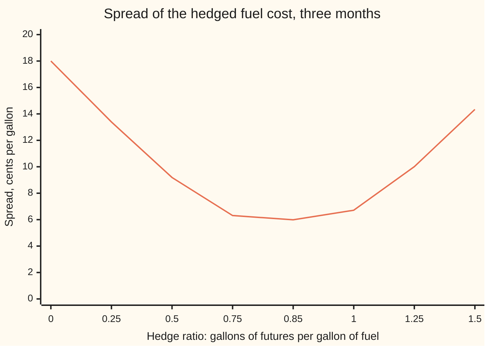
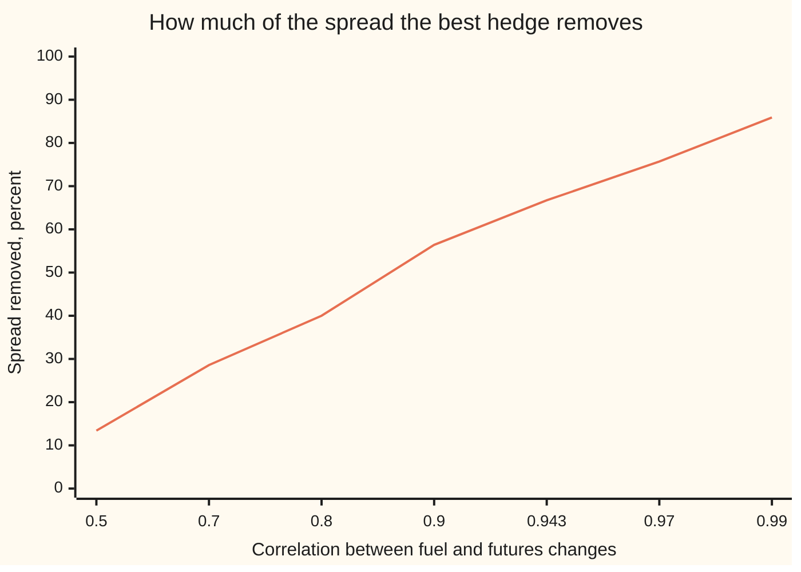

# Imperfect hedges: the minimum-variance hedge ratio and the basis risk that remains

[Syllabus](../../../SYLLABUS.md) → [Financial mathematics](../../../SYLLABUS.md#w12) → [Hedging, Volatility Forecasts and Stress](../../../SYLLABUS.md#w12-s40) → Imperfect hedges

---

## General Overview

An airline must buy 2,000,000 gallons of jet fuel in three months. Today jet fuel costs $2.40 a gallon. Over a typical three months its price moves by about 18 cents a gallon, up or down. On two million gallons that is $360,000 of uncertainty in the fuel bill.

The airline would like to lock in the price. A futures contract does that: an agreement, traded on an exchange, to buy a fixed quantity at a price set today, settled up in cash as the price moves. The trouble is that no busy futures market exists for jet fuel. There is one for heating oil, a close cousin refined from the same crude. Heating oil and jet fuel prices move together, but not in lockstep.

Hedging one thing with a different thing is a **cross-hedge**. Two questions follow. How many gallons of heating oil futures should the airline buy for each gallon of jet fuel it needs? And once it has, how much risk is left?

The answer to the first is a number called the **hedge ratio**. Buying one gallon of futures per gallon of fuel sounds natural and is not best. The best ratio here is 0.85: buy futures on 85 gallons of heating oil for every 100 gallons of jet fuel. That cuts the three-month spread of the fuel bill from 18 cents a gallon to 6 cents, by two thirds. The 6 cents that remain cannot be hedged away with heating oil at any ratio. It is **basis risk**: the risk that the fuel and the hedge drift apart.

**The hedge ratio that leaves the least risk is the slope of a straight line fitted through past price changes, fuel against futures, and the risk it leaves is the scatter around that line.**

**What kind of fact this is:** a method, with a theorem inside it: that the regression slope minimises the leftover variance is proved on this card in Why it works; the inputs are estimates from history, so the answer is only as good as that history.

### The picture: leftover risk against hedge ratio

Each point is the spread (standard deviation: the typical size of a move either way) of the hedged fuel bill, in cents a gallon, for one hedge ratio.



The one line is the leftover spread. At ratio 0 there is no hedge: 18 cents. It falls to a floor of 5.99 cents at 0.85, then climbs again: past the best ratio, the futures position is itself a bet. The floor never reaches zero. That gap is the basis risk.

---

## The formula

Notation first. Write $\Delta S$ ("delta S") for the change in the jet fuel price over the three months, and $\Delta F$ for the change in the heating oil futures price over the same months, both in dollars a gallon. $\sigma$ ("sigma") names a spread, and $\rho$ ("rho") names a correlation: a number from −1 to 1 saying how tightly two quantities move together, 1 meaning in perfect lockstep.

The airline buys futures on $h$ gallons for each gallon of fuel. Its fuel cost rises by $\Delta S$ and its futures pay it $h\,\Delta F$, so the net change it bears is $\Delta S - h\,\Delta F$. The best $h$ is

$$h^* = \rho\,\frac{\sigma_S}{\sigma_F} = \frac{\operatorname{Cov}(\Delta S, \Delta F)}{\sigma_F^{\,2}}$$

**Read it aloud:** the best hedge ratio is the correlation times the ratio of the two spreads; equivalently, how much the fuel moves with the futures, divided by how much the futures move on their own.

The risk it leaves:

$$\sigma_{\text{left}} = \sigma_S\sqrt{1 - \rho^2}$$

**Read it aloud:** the leftover spread is the fuel's own spread, shrunk by the square root of one minus the correlation squared.

And the number of contracts:

$$N^* = h^*\,\frac{Q}{L}$$

**Read it aloud:** contracts to buy equal the hedge ratio times the gallons needed, divided by the gallons in one contract.

| Symbol | Plain meaning | In our example | Push it up and the answer… |
| --- | --- | --- | --- |
| $\Delta S$, $\Delta F$ | changes over the hedge in the jet fuel price and the heating oil futures price | unknown today | — |
| $\sigma_S$ | spread of $\Delta S$ | $0.18 a gallon | $h^*$ rises in step; so does the leftover risk |
| $\sigma_F$ | spread of $\Delta F$ | $0.20 a gallon | $h^*$ falls: a jumpier hedge needs fewer gallons |
| $\rho$ | correlation of the two changes | 0.943 | $h^*$ rises; leftover risk falls fast near 1 |
| $\operatorname{Cov}$ | covariance: $\rho\,\sigma_S\,\sigma_F$, how much the two move together, in squared dollars | 0.033948 | $h^*$ rises |
| $h$ | the hedge ratio chosen: futures gallons per fuel gallon | anything | leftover risk falls, then rises |
| $h^*$ | the minimum-variance hedge ratio | 0.8487 | — |
| $\sigma_{\text{left}}$ | spread of the hedged cost, $\Delta S - h^*\Delta F$ | $0.0599 a gallon | — |
| $Q$ | gallons of fuel to be bought | 2,000,000 | more contracts |
| $L$ | gallons covered by one futures contract | 42,000 (1,000 barrels) | fewer contracts |
| $N^*$ | contracts to buy | 40.41, so 40 | — |
| $a$, $b$ | intercept and slope of a line fitted through past quarters | from the data; $b$ is the estimated $h^*$ | — |

A **variance** is a spread squared, $\sigma^2$. Variances of independent pieces add, which spreads do not; that is why the algebra below works on variances and only takes a square root at the end. The fraction of variance removed, $\rho^2$, is written $R^2$ in regression output ([Least squares](../../09-Probability%20and%20statistics/09-Regression/01-least-squares-regression.md)); here it is 0.889.

Conventions verified 2026-09-28: the exchange heating oil contract is NYMEX NY Harbor ULSD futures (code HO, the old heating oil contract, renamed 2013), 42,000 gallons a lot, quoted in dollars a gallon.

### When it holds

- **The spreads and the correlation are stable.** They are estimated from past quarters. If the relation shifts, say a refinery outage lifts jet fuel alone, the ratio is stale and the leftover risk is larger than stated.
- **Price changes over the hedge's own horizon.** Three-month changes, not daily ones, and not price levels. Daily correlations are usually lower, and regressing levels finds a false slope between two prices that both trend.
- **Variance is the right measure of risk.** It punishes up and down alike. A company that only fears one direction, or faces rare large jumps, may want a different hedge.
- **The hedge is set once and left alone.** A hedge that is reset as prices move, or held with daily cash settlement over a long horizon, needs small corrections (tailing: shrinking the position by the discount factor) that this card omits.
- **Whole contracts.** The formula gives 40.41; exchanges trade whole lots, so the held ratio is 0.84. The cost of the rounding is tiny here and is printed below.

---

## Why it works

### Step 0: the idea

A hedge is a second position chosen so that its gains offset the first position's losses. When the two move in perfect lockstep, one gallon of futures per gallon of fuel cancels everything. When they do not, some risk survives every ratio. The best that can be done is to pick the ratio that leaves the least. Leftover variance is a quadratic in $h$, and a quadratic's lowest point can be found exactly.

### Step 1: write the leftover variance

The airline bears $\Delta S - h\,\Delta F$. The variance of a difference follows a rule like squaring a bracket:

$$\operatorname{Var}(\Delta S - h\,\Delta F) = \sigma_S^{\,2} - 2h\,\rho\,\sigma_S\,\sigma_F + h^2\sigma_F^{\,2}.$$

The first term is the fuel's own risk. The last is the risk the futures add. The middle term is the only one that helps: because the two prices tend to move together, the futures gain tends to arrive exactly when the fuel costs more.

### Step 2: complete the square

Group the terms holding $h$:

$$\operatorname{Var}(\Delta S - h\,\Delta F) = \sigma_F^{\,2}\,(h - h^*)^2 + \sigma_S^{\,2}\,(1 - \rho^2), \qquad h^* = \rho\,\frac{\sigma_S}{\sigma_F}.$$

Expand the right side and the $h^{*2}\sigma_F^2$ term cancels the $\rho^2\sigma_S^2$ term, giving back Step 1. The first piece is a square, never negative, and zero only at $h = h^*$. The second piece does not depend on $h$ at all. So, provided $\sigma_F > 0$, $h^*$ is the minimum, it is the only one, and the variance at the minimum is $\sigma_S^2(1-\rho^2)$. Its square root is the leftover spread. No calculus was needed. If $\sigma_F = 0$ the futures never move, every ratio leaves $\sigma_S^2$, and the formula's division fails. If $\rho = 0$, $h^* = 0$: an unrelated hedge only adds risk.

The same line reads off the cost of a wrong ratio: the penalty is $\sigma_F^2(h - h^*)^2$, growing with the square of the miss. The chart's floor is flat, so small errors cost little; large ones cost a lot.

### Step 3: the best ratio is a regression slope

Fit a straight line $\Delta S = a + b\,\Delta F$ through past quarters by least squares: choose $a$ and $b$ to make the sum of squared misses as small as possible. The misses are $\Delta S - b\,\Delta F - a$. Choosing $a$ to make their average zero, the sum of squared misses is the sample variance of $\Delta S - b\,\Delta F$, times a count. So least squares is minimising exactly the hedged variance of Step 1, measured on the data instead of assumed. The winning slope is the sample covariance over the sample variance of $\Delta F$: the second form of the formula. The fraction of scatter the line explains, $R^2$, is the fraction of variance the hedge removes, $\rho^2$.

That is why desks estimate hedge ratios by regression. It is not a statistical habit; it is the same minimisation.

### Step 4: basis, and what cannot be removed

The **basis** is the fuel price minus the futures price. At the hedge's end the airline pays the fuel price and collects the futures gain. With a ratio of 1, its net cost per gallon is the futures price agreed today plus the basis at the end. Everything about the fuel price is locked except the basis. Its three-month spread here is 6.71 cents: the leftover risk of the one-for-one hedge.

The minimum-variance ratio does slightly better, 5.99 cents, by leaning less on a hedge that only partly tracks the fuel. But $\sigma_S\sqrt{1-\rho^2}$ is a floor. Only a hedge that tracks jet fuel more closely, a higher $\rho$, can lower it. The picture below shows how steeply the floor depends on correlation.



The one line is the share of the spread removed, $1 - \sqrt{1-\rho^2}$, in percent. A correlation of 0.8, which sounds strong, removes only 40 percent. Two thirds needs 0.943. Removing 86 percent needs 0.99.

<details>
<summary>The same idea with shares: beta hedging</summary>

A fund holding shares hedges with stock-index futures. Apply Steps 1 to 3 to returns (percentage changes) instead of price changes, and the minimum-variance ratio is the portfolio's **beta**: the regression slope of its returns on the index's returns. The contract count becomes beta times the portfolio's value over one contract's value. A $10,000,000 holding with beta 1.2 hedged with contracts worth $250,000 each needs 48 contracts. The residual is the part of the fund's moves the index does not explain.

</details>

A second route to the same ratio treats the hedge as a two-asset portfolio and minimises its variance with calculus, setting the derivative in $h$ to zero. It gives the same $h^*$; completing the square adds the proof that it is a minimum and the size of the penalty for missing it.

---

## Worked numbers, by hand

Inputs: $\sigma_S$ = $0.18, $\sigma_F$ = $0.20, $\rho$ = 0.943, $Q$ = 2,000,000 gallons, $L$ = 42,000 gallons.

| Step | Arithmetic | Value |
| --- | --- | --- |
| covariance | 0.943 × 0.18 × 0.20 | 0.033948 |
| hedge ratio | 0.033948 / 0.04 | **0.8487** |
| $1 - \rho^2$ | 1 − 0.889249 | 0.110751 |
| its square root | | 0.332793 |
| leftover spread | 0.18 × 0.332793 | $0.059903 a gallon |
| spread removed | 1 − 0.332793 | 66.7 percent: **two thirds** |
| variance removed | 0.943 squared | 88.9 percent |
| contracts | 0.8487 × 2,000,000 / 42,000 | 40.41, so **40** |
| ratio actually held | 40 × 42,000 / 2,000,000 | 0.84 |
| leftover spread at 40 contracts | from Step 1's formula | $0.059928 a gallon |
| unhedged, in dollars | 0.18 × 2,000,000 | $360,000.00 |
| **hedged, in dollars** | 0.059928 × 2,000,000 | **$119,855.91** |

Forty contracts cut the three-month uncertainty in the fuel bill from $360,000 to about $120,000. The remaining $120,000 is basis risk: no quantity of heating oil futures removes it.

One quarter, traced. Heating oil futures rise from $2.50 to $2.90, and jet fuel from $2.40 to $2.75. The futures pay 0.84 × 0.40 = $0.336 a gallon of fuel. Net cost: $2.75 − $0.336 = $2.414, within 1.4 cents of today's $2.40. Fuel rose 35 cents; the hedged cost rose 1.4.

### What breaks if you drop a piece

Correct leftover spread: 5.99 cents a gallon.

| Mistake | Comes out at | What went wrong |
| --- | --- | --- |
| Hedge one for one, $h$ = 1 | 6.71 cents | Treats heating oil as if it were jet fuel. The leftover is the full basis risk. |
| Use the correlation alone, $h$ = 0.943 | 6.28 cents | Forgets that futures and fuel have different spreads. |
| Use the spread ratio alone, $h$ = 0.9 | 6.08 cents | Forgets that the two do not move in lockstep. |
| Regress futures on fuel, $h$ = 1.0478 | 7.19 cents | The wrong way round: that slope answers how to hedge heating oil with jet fuel. |
| Sell futures instead of buying, $h$ = −0.8487 | 34.47 cents | The hedge doubles the bet: nearly twice the unhedged 18 cents. |

The first three cost under a cent, the reversed regression 1.2 cents: near its floor the curve is flat. Direction and correlation are what matter.

---

## Code, from first principles, and it actually runs

The scripts reach the hedge ratio four ways. Road 1 is the formula. Road 2 tries every ratio from 0 to 1.5 in steps of 0.0001 and keeps the one with least variance, without using the completed square. Road 3 simulates 200,000 quarters of correlated price changes, from a random-number generator written in the script, and fits a least-squares line. Road 4 takes 20,000 of those quarters and searches ratios for the smallest measured variance, which must land on that sample's regression slope: the Step 3 claim, tested. A short 40-quarter history shows how far an estimate can stray. Asserts compare the roads.

### Python

```python
# Minimum-variance hedge ratio -- the check behind the card.  Standard library only.
# Jet fuel bought in three months, hedged with heating oil futures.  Prices in dollars
# per gallon; sS, sF = spread (standard deviation) of the three-month price changes.
from math import sqrt, log, cos, pi

sS, sF, rho = 0.18, 0.20, 0.943          # jet fuel spread, heating oil spread, correlation
Q, LOT = 2_000_000, 42_000               # gallons to buy; gallons per futures contract

def var_hedged(h):                       # variance of dS - h dF, from the three inputs
    return sS * sS - 2 * h * rho * sS * sF + h * h * sF * sF

def grid_min(f, lo=0.0, hi=1.5, step=1e-4):   # brute force: try every h on a fine grid
    best_h, best_v, n = lo, f(lo), int(round((hi - lo) / step))
    for i in range(1, n + 1):
        h = lo + i * step
        v = f(h)
        if v < best_v: best_h, best_v = h, v
    return best_h

class Rng:                               # splitmix64, then Box-Muller for normal draws
    def __init__(self, seed): self.x = seed
    def u(self):
        self.x = (self.x + 0x9E3779B97F4A7C15) & 0xFFFFFFFFFFFFFFFF
        z = self.x
        z = ((z ^ (z >> 30)) * 0xBF58476D1CE4E5B9) & 0xFFFFFFFFFFFFFFFF
        z = ((z ^ (z >> 27)) * 0x94D049BB133111EB) & 0xFFFFFFFFFFFFFFFF
        z ^= z >> 31
        return ((z >> 11) + 0.5) / 9007199254740992.0
    def normal(self): return sqrt(-2.0 * log(self.u())) * cos(2.0 * pi * self.u())

def draws(seed, n):                      # n quarters of (dS, dF) with the stated spreads and correlation
    g, out = Rng(seed), []
    for _ in range(n):
        z1, z2 = g.normal(), g.normal()
        out.append((sS * (rho * z1 + sqrt(1 - rho * rho) * z2), sF * z1))
    return out

def ols(data):                           # least squares of dS on dF: slope, R^2, residual spread, slope's std error
    n = len(data)
    ms = sum(s for s, _ in data) / n; mf = sum(f for _, f in data) / n
    sxx = sum((f - mf) ** 2 for _, f in data); syy = sum((s - ms) ** 2 for s, _ in data)
    sxy = sum((f - mf) * (s - ms) for s, f in data)
    b = sxy / sxx; ssr = syy - b * sxy
    return b, 1 - ssr / syy, sqrt(ssr / (n - 1)), sqrt(ssr / (n - 2) / sxx)

def sample_var(data, h):                 # spread of the hedged change, measured on the data
    xs = [s - h * f for s, f in data]; m = sum(xs) / len(xs)
    return sum((x - m) ** 2 for x in xs) / (len(xs) - 1)

# road 1: the formula.  road 2: brute-force grid on the variance
h_star = rho * sS / sF
h_grid = grid_min(var_hedged)
resid = sS * sqrt(1 - rho * rho)
# road 3: regression on 200,000 simulated quarters.  road 4: grid on the same sample
mc = draws(20260928, 200_000)
b_mc, r2_mc, res_mc, _ = ols(mc)
sub = mc[:20_000]
h_sub_ols = ols(sub)[0]
h_sub_grid = grid_min(lambda h: sample_var(sub, h), 0.7, 1.0, 1e-4)
# a short history: 40 quarters, as a desk would actually have
b_40, r2_40, res_40, se_40 = ols(draws(7, 40))

N_exact = h_star * Q / LOT
N = round(N_exact)
h_used = N * LOT / Q
res_used = sqrt(var_hedged(h_used))

rows = [
    ("1 formula  rho sS / sF", h_star, 6), ("2 grid minimum of variance", h_grid, 6),
    ("3 regression, 200,000 quarters", b_mc, 6), ("4 grid on 20,000 quarters", h_sub_grid, 6),
    ("  regression, same 20,000", h_sub_ols, 6),
    ("covariance  rho sS sF", rho * sS * sF, 6), ("1 - rho^2", 1 - rho * rho, 6),
    ("sqrt(1 - rho^2)", sqrt(1 - rho * rho), 6), ("unhedged spread, $/gal", sS, 6), ("residual spread  sS sqrt(1-rho^2)", resid, 6),
    ("  simulated residual spread", res_mc, 6), ("spread cut, fraction", 1 - resid / sS, 6),
    ("variance cut  rho^2", rho * rho, 6), ("  simulated R^2", r2_mc, 6),
    ("contracts, exact  h Q / LOT", N_exact, 4), ("contracts, rounded", N, 0),
    ("hedge ratio actually held", h_used, 4), ("residual spread at 40 contracts", res_used, 6),
    ("unhedged spread, $ on 2m gal", sS * Q, 2), ("hedged spread, $ on 2m gal", res_used * Q, 2),
    ("40 quarters: slope", b_40, 4), ("40 quarters: std error of slope", se_40, 4),
    ("40 quarters: R^2", r2_40, 4), ("40 quarters: two std errors", 2 * se_40, 4),
    ("gap, road 3 minus road 1", b_mc - h_star, 6),
    ("basis-change spread (h = 1)", sqrt(var_hedged(1.0)), 6),
    ("penalty check  resid^2 + sF^2 (1-h*)^2", sqrt(resid ** 2 + sF ** 2 * (1 - h_star) ** 2), 6),
    ("wrong: sign flipped, h = -h*, spread", sqrt(var_hedged(-h_star)), 6),
    ("wrong: h = rho, spread", sqrt(var_hedged(rho)), 6),
    ("wrong: h = sS / sF, spread", sqrt(var_hedged(sS / sF)), 6),
    ("wrong: reversed regression h", rho * sF / sS, 6),
    ("  its spread", sqrt(var_hedged(rho * sF / sS)), 6),
    ("story: futures gain per gal, 2.50 to 2.90", h_used * (2.90 - 2.50), 4),
    ("story: net cost per gal, jet 2.40 to 2.75", 2.75 - h_used * (2.90 - 2.50), 4),
    ("story: net cost minus today's 2.40", 2.75 - h_used * (2.90 - 2.50) - 2.40, 4),
    ("beta hedge: 1.2 x 10,000,000 / 250,000", 1.2 * 10_000_000 / 250_000, 2),
    ("try: rho = 0.8, hedge ratio", 0.8 * sS / sF, 4), ("try: sF = 0.40, hedge ratio", rho * sS / 0.40, 4),
    ("try: 400 quarters, std error of slope", ols(draws(7, 400))[3], 4),
    ("try: 48 contracts, ratio held", 48 * LOT / Q, 4),
    ("try: 48 contracts, spread", sqrt(var_hedged(48 * LOT / Q)), 6),
]
for lab, v, d in rows: print(f"{lab:<42}{v:>16.{d}f}")

hs = [0.0, 0.25, 0.5, 0.75, 0.85, 1.0, 1.25, 1.5]
print("chart, hedge ratio      " + "".join(f"{h:>7.2f}" for h in hs))
print("chart, spread in cents  " + "".join(f"{100 * sqrt(var_hedged(h)):>7.2f}" for h in hs))
rs = [0.5, 0.7, 0.8, 0.9, 0.943, 0.97, 0.99]
print("chart, correlation      " + "".join(f"{r:>7.3f}" for r in rs))
print("chart, spread cut, %    " + "".join(f"{100 * (1 - sqrt(1 - r * r)):>7.2f}" for r in rs))

assert abs(h_grid - h_star) < 1e-4, "grid disagrees with the formula"
assert abs(b_mc - h_star) < 0.005, "simulated regression disagrees with the formula"
assert abs(h_sub_grid - h_sub_ols) < 1e-4, "least squares is not the minimum-variance hedge"
assert abs(res_mc - resid) < 0.001, "simulated residual spread disagrees"
assert abs(sqrt(sample_var(mc, 1.0)) - sqrt(var_hedged(1.0))) < 0.001, "h = 1 spread disagrees"
print("ALL CHECKS PASS")
```

**Ran 2026-09-28 on macOS, Python 3.14.6, standard library only. All checks passed. Output, pasted from the run:**

```
1 formula  rho sS / sF                            0.848700
2 grid minimum of variance                        0.848700
3 regression, 200,000 quarters                    0.847841
4 grid on 20,000 quarters                         0.848100
  regression, same 20,000                         0.848076
covariance  rho sS sF                             0.033948
1 - rho^2                                         0.110751
sqrt(1 - rho^2)                                   0.332793
unhedged spread, $/gal                            0.180000
residual spread  sS sqrt(1-rho^2)                 0.059903
  simulated residual spread                       0.059818
spread cut, fraction                              0.667207
variance cut  rho^2                               0.889249
  simulated R^2                                   0.889416
contracts, exact  h Q / LOT                        40.4143
contracts, rounded                                      40
hedge ratio actually held                           0.8400
residual spread at 40 contracts                   0.059928
unhedged spread, $ on 2m gal                     360000.00
hedged spread, $ on 2m gal                       119855.91
40 quarters: slope                                  0.7821
40 quarters: std error of slope                     0.0442
40 quarters: R^2                                    0.8916
40 quarters: two std errors                         0.0885
gap, road 3 minus road 1                         -0.000859
basis-change spread (h = 1)                       0.067112
penalty check  resid^2 + sF^2 (1-h*)^2            0.067112
wrong: sign flipped, h = -h*, spread              0.344725
wrong: h = rho, spread                            0.062802
wrong: h = sS / sF, spread                        0.060775
wrong: reversed regression h                      1.047778
  its spread                                      0.071928
story: futures gain per gal, 2.50 to 2.90           0.3360
story: net cost per gal, jet 2.40 to 2.75           2.4140
story: net cost minus today's 2.40                  0.0140
beta hedge: 1.2 x 10,000,000 / 250,000               48.00
try: rho = 0.8, hedge ratio                         0.7200
try: sF = 0.40, hedge ratio                         0.4243
try: 400 quarters, std error of slope               0.0144
try: 48 contracts, ratio held                       1.0080
try: 48 contracts, spread                         0.067848
chart, hedge ratio         0.00   0.25   0.50   0.75   0.85   1.00   1.25   1.50
chart, spread in cents    18.00  13.39   9.19   6.31   5.99   6.71  10.01  14.34
chart, correlation        0.500  0.700  0.800  0.900  0.943  0.970  0.990
chart, spread cut, %      13.40  28.59  40.00  56.41  66.72  75.69  85.89
ALL CHECKS PASS
```

### Rust

```rust
// Minimum-variance hedge ratio -- the check behind the card.  std only, no crates.
// Jet fuel bought in three months, hedged with heating oil futures.  Prices in dollars
// per gallon; S_S, S_F = spread (standard deviation) of the three-month price changes.
const S_S: f64 = 0.18;
const S_F: f64 = 0.20;
const RHO: f64 = 0.943;
const Q: f64 = 2_000_000.0;
const LOT: f64 = 42_000.0;

fn var_hedged(h: f64) -> f64 { S_S * S_S - 2.0 * h * RHO * S_S * S_F + h * h * S_F * S_F }

fn grid_min<F: Fn(f64) -> f64>(f: F, lo: f64, hi: f64, step: f64) -> f64 {
    let n = ((hi - lo) / step).round() as usize;
    let (mut best_h, mut best_v) = (lo, f(lo));
    for i in 1..=n {
        let h = lo + i as f64 * step;
        let v = f(h);
        if v < best_v { best_h = h; best_v = v; }
    }
    best_h
}

struct Rng { x: u64 }
impl Rng {
    fn u(&mut self) -> f64 {
        self.x = self.x.wrapping_add(0x9E3779B97F4A7C15);
        let mut z = self.x;
        z = (z ^ (z >> 30)).wrapping_mul(0xBF58476D1CE4E5B9);
        z = (z ^ (z >> 27)).wrapping_mul(0x94D049BB133111EB);
        z ^= z >> 31;
        ((z >> 11) as f64 + 0.5) / 9007199254740992.0
    }
    fn normal(&mut self) -> f64 {
        let r = (-2.0 * self.u().ln()).sqrt();
        r * (2.0 * std::f64::consts::PI * self.u()).cos()
    }
}

fn draws(seed: u64, n: usize) -> Vec<(f64, f64)> {
    let mut g = Rng { x: seed };
    (0..n).map(|_| {
        let z1 = g.normal();
        let z2 = g.normal();
        (S_S * (RHO * z1 + (1.0 - RHO * RHO).sqrt() * z2), S_F * z1)
    }).collect()
}

// least squares of dS on dF: slope, R^2, residual spread, slope's standard error
fn ols(d: &[(f64, f64)]) -> (f64, f64, f64, f64) {
    let n = d.len() as f64;
    let ms = d.iter().map(|p| p.0).sum::<f64>() / n;
    let mf = d.iter().map(|p| p.1).sum::<f64>() / n;
    let (mut sxx, mut syy, mut sxy) = (0.0, 0.0, 0.0);
    for &(s, f) in d {
        sxx += (f - mf) * (f - mf);
        syy += (s - ms) * (s - ms);
        sxy += (f - mf) * (s - ms);
    }
    let b = sxy / sxx;
    let ssr = syy - b * sxy;
    (b, 1.0 - ssr / syy, (ssr / (n - 1.0)).sqrt(), (ssr / (n - 2.0) / sxx).sqrt())
}

fn sample_var(d: &[(f64, f64)], h: f64) -> f64 {
    let xs: Vec<f64> = d.iter().map(|&(s, f)| s - h * f).collect();
    let m = xs.iter().sum::<f64>() / xs.len() as f64;
    xs.iter().map(|x| (x - m) * (x - m)).sum::<f64>() / (xs.len() as f64 - 1.0)
}

fn main() {
    // road 1: the formula.  road 2: brute-force grid on the variance
    let h_star = RHO * S_S / S_F;
    let h_grid = grid_min(var_hedged, 0.0, 1.5, 1e-4);
    let resid = S_S * (1.0 - RHO * RHO).sqrt();
    // road 3: regression on 200,000 simulated quarters.  road 4: grid on the same sample
    let mc = draws(20260928, 200_000);
    let (b_mc, r2_mc, res_mc, _) = ols(&mc);
    let sub = &mc[..20_000];
    let h_sub_ols = ols(sub).0;
    let h_sub_grid = grid_min(|h| sample_var(sub, h), 0.7, 1.0, 1e-4);
    // a short history: 40 quarters, as a desk would actually have
    let (b_40, r2_40, _, se_40) = ols(&draws(7, 40));

    let n_exact = h_star * Q / LOT;
    let n = n_exact.round();
    let h_used = n * LOT / Q;
    let res_used = var_hedged(h_used).sqrt();

    let rows: Vec<(&str, f64, usize)> = vec![
        ("1 formula  rho sS / sF", h_star, 6), ("2 grid minimum of variance", h_grid, 6),
        ("3 regression, 200,000 quarters", b_mc, 6), ("4 grid on 20,000 quarters", h_sub_grid, 6),
        ("  regression, same 20,000", h_sub_ols, 6),
        ("covariance  rho sS sF", RHO * S_S * S_F, 6), ("1 - rho^2", 1.0 - RHO * RHO, 6),
        ("sqrt(1 - rho^2)", (1.0 - RHO * RHO).sqrt(), 6), ("unhedged spread, $/gal", S_S, 6), ("residual spread  sS sqrt(1-rho^2)", resid, 6),
        ("  simulated residual spread", res_mc, 6), ("spread cut, fraction", 1.0 - resid / S_S, 6),
        ("variance cut  rho^2", RHO * RHO, 6), ("  simulated R^2", r2_mc, 6),
        ("contracts, exact  h Q / LOT", n_exact, 4), ("contracts, rounded", n, 0),
        ("hedge ratio actually held", h_used, 4), ("residual spread at 40 contracts", res_used, 6),
        ("unhedged spread, $ on 2m gal", S_S * Q, 2), ("hedged spread, $ on 2m gal", res_used * Q, 2),
        ("40 quarters: slope", b_40, 4), ("40 quarters: std error of slope", se_40, 4),
        ("40 quarters: R^2", r2_40, 4), ("40 quarters: two std errors", 2.0 * se_40, 4),
        ("gap, road 3 minus road 1", b_mc - h_star, 6),
        ("basis-change spread (h = 1)", var_hedged(1.0).sqrt(), 6),
        ("penalty check  resid^2 + sF^2 (1-h*)^2",
         (resid * resid + S_F * S_F * (1.0 - h_star) * (1.0 - h_star)).sqrt(), 6),
        ("wrong: sign flipped, h = -h*, spread", var_hedged(-h_star).sqrt(), 6),
        ("wrong: h = rho, spread", var_hedged(RHO).sqrt(), 6),
        ("wrong: h = sS / sF, spread", var_hedged(S_S / S_F).sqrt(), 6),
        ("wrong: reversed regression h", RHO * S_F / S_S, 6),
        ("  its spread", var_hedged(RHO * S_F / S_S).sqrt(), 6),
        ("story: futures gain per gal, 2.50 to 2.90", h_used * (2.90 - 2.50), 4),
        ("story: net cost per gal, jet 2.40 to 2.75", 2.75 - h_used * (2.90 - 2.50), 4),
        ("story: net cost minus today's 2.40", 2.75 - h_used * (2.90 - 2.50) - 2.40, 4),
        ("beta hedge: 1.2 x 10,000,000 / 250,000", 1.2 * 10_000_000.0 / 250_000.0, 2),
        ("try: rho = 0.8, hedge ratio", 0.8 * S_S / S_F, 4), ("try: sF = 0.40, hedge ratio", RHO * S_S / 0.40, 4),
        ("try: 400 quarters, std error of slope", ols(&draws(7, 400)).3, 4),
        ("try: 48 contracts, ratio held", 48.0 * LOT / Q, 4),
        ("try: 48 contracts, spread", var_hedged(48.0 * LOT / Q).sqrt(), 6),
    ];
    for (lab, v, d) in &rows { println!("{:<42}{:>16.*}", lab, *d, v); }

    let hs: [f64; 8] = [0.0, 0.25, 0.5, 0.75, 0.85, 1.0, 1.25, 1.5];
    let row = |v: Vec<String>| v.concat();
    println!("chart, hedge ratio      {}", row(hs.iter().map(|h| format!("{:>7.2}", h)).collect()));
    println!("chart, spread in cents  {}", row(hs.iter().map(|&h| format!("{:>7.2}", 100.0 * var_hedged(h).sqrt())).collect()));
    let rs: [f64; 7] = [0.5, 0.7, 0.8, 0.9, 0.943, 0.97, 0.99];
    println!("chart, correlation      {}", row(rs.iter().map(|r| format!("{:>7.3}", r)).collect()));
    println!("chart, spread cut, %    {}", row(rs.iter().map(|&r| format!("{:>7.2}", 100.0 * (1.0 - (1.0 - r * r).sqrt()))).collect()));

    assert!((h_grid - h_star).abs() < 1e-4, "grid disagrees with the formula");
    assert!((b_mc - h_star).abs() < 0.005, "simulated regression disagrees with the formula");
    assert!((h_sub_grid - h_sub_ols).abs() < 1e-4, "least squares is not the minimum-variance hedge");
    assert!((res_mc - resid).abs() < 0.001, "simulated residual spread disagrees");
    assert!((sample_var(&mc, 1.0).sqrt() - var_hedged(1.0).sqrt()).abs() < 0.001, "h = 1 spread disagrees");
    println!("ALL CHECKS PASS");
}
```

**Ran 2026-09-28 on macOS, rustc 1.98.1, no crates. All checks passed. Output, pasted from the run:**

```
1 formula  rho sS / sF                            0.848700
2 grid minimum of variance                        0.848700
3 regression, 200,000 quarters                    0.847841
4 grid on 20,000 quarters                         0.848100
  regression, same 20,000                         0.848076
covariance  rho sS sF                             0.033948
1 - rho^2                                         0.110751
sqrt(1 - rho^2)                                   0.332793
unhedged spread, $/gal                            0.180000
residual spread  sS sqrt(1-rho^2)                 0.059903
  simulated residual spread                       0.059818
spread cut, fraction                              0.667207
variance cut  rho^2                               0.889249
  simulated R^2                                   0.889416
contracts, exact  h Q / LOT                        40.4143
contracts, rounded                                      40
hedge ratio actually held                           0.8400
residual spread at 40 contracts                   0.059928
unhedged spread, $ on 2m gal                     360000.00
hedged spread, $ on 2m gal                       119855.91
40 quarters: slope                                  0.7821
40 quarters: std error of slope                     0.0442
40 quarters: R^2                                    0.8916
40 quarters: two std errors                         0.0885
gap, road 3 minus road 1                         -0.000859
basis-change spread (h = 1)                       0.067112
penalty check  resid^2 + sF^2 (1-h*)^2            0.067112
wrong: sign flipped, h = -h*, spread              0.344725
wrong: h = rho, spread                            0.062802
wrong: h = sS / sF, spread                        0.060775
wrong: reversed regression h                      1.047778
  its spread                                      0.071928
story: futures gain per gal, 2.50 to 2.90           0.3360
story: net cost per gal, jet 2.40 to 2.75           2.4140
story: net cost minus today's 2.40                  0.0140
beta hedge: 1.2 x 10,000,000 / 250,000               48.00
try: rho = 0.8, hedge ratio                         0.7200
try: sF = 0.40, hedge ratio                         0.4243
try: 400 quarters, std error of slope               0.0144
try: 48 contracts, ratio held                       1.0080
try: 48 contracts, spread                         0.067848
chart, hedge ratio         0.00   0.25   0.50   0.75   0.85   1.00   1.25   1.50
chart, spread in cents    18.00  13.39   9.19   6.31   5.99   6.71  10.01  14.34
chart, correlation        0.500  0.700  0.800  0.900  0.943  0.970  0.990
chart, spread cut, %      13.40  28.59  40.00  56.41  66.72  75.69  85.89
ALL CHECKS PASS
```

The two outputs agree line for line. Both use the same generator, so the simulated numbers match too.

Road 3 lands at 0.8478 against the formula's 0.8487: 0.000859 below, the size of gap expected from 200,000 random quarters. The 40-quarter history gives 0.7821 with a standard error (the typical size of an estimate's own error) of 0.0442, and an $R^2$ of 0.8916. Forty quarters is ten years of data, and it pins the ratio only to about 0.09 either way (two standard errors, 0.0885).

> [!TIP]
> **Try changing**
> Guess the direction first. Then run it.
> - **Lower the correlation.** Set `rho = 0.8`. The ratio falls to 0.72 and only 40 percent of the spread goes: see the second chart.
> - **Make the futures twice as jumpy.** Set `sF = 0.40`. The ratio halves to 0.4243; the leftover spread does not change, since it depends only on $\sigma_S$ and $\rho$.
> - **Give the history more quarters.** Change `draws(7, 40)` to `draws(7, 400)`. The standard error of the slope shrinks by about the square root of ten, to 0.0144.
> - **Hedge one for one.** Set `N = 48`. The held ratio becomes 1.008 and the leftover spread rises to 6.78 cents.

---

## The usual mistake

> [!warning]
> **Assuming a hedge in a related market removes the risk.** It removes the part the two prices share. What they do not share, the basis, stays at every hedge ratio. Here that is 5.99 cents a gallon, $119,855.91 on the order, after a hedge most people would call tight.
>
> Smaller traps:
> - **Reading $R^2$ as the cut in spread.** An $R^2$ of 0.889 removes 88.9 percent of the variance but only 66.7 percent of the spread. Budgets are in dollars, which follow the spread.
> - **Hedging one for one out of habit.** Leftover spread 6.71 cents instead of 5.99. Cheap here; the added variance grows as the square of the miss, $\sigma_F^2(1 - h^*)^2$.
> - **Regressing the wrong way round.** Futures on fuel gives a slope of 1.0478, a leftover spread of 7.19 cents.
> - **Trusting a short history.** Forty quarters gave 0.7821 when the truth was 0.8487. Report the standard error beside the ratio.

---

## Where you meet it in real life

- **Airlines.** Jet fuel futures trade thinly, so fuel is commonly hedged with crude oil or heating oil futures, with ratios set by regression and hedge effectiveness reported as $R^2$.
- **Hedge accounting.** Accounting standards ask a company to show that a hedge is effective before it can report hedge and hedged item together; a regression of the kind on this card is common evidence.
- **Equity funds.** Beta hedging with index futures is the same regression on returns: 48 contracts for $10,000,000 at beta 1.2 in the folded tip above.
- **Farmers and grain merchants.** A crop grown in one region is hedged with futures delivered in another. The local basis is quoted daily and watched as closely as the futures price.
- **Option books.** The hedges of [Hedging three Greeks at once](02-delta-gamma-vega-hedging.md) assume the hedge is written on the exact thing hedged. When it is not, an index option hedging a single stock, the residual on this card appears there too.
- **Sizing the residual.** The leftover spread feeds straight into the risk numbers of [Stress tests](05-scenario-grids-and-stress-tests.md) and [Limits](06-risk-limits-and-risk-appetite.md).

> **Say it back**
> A cross-hedge uses futures on a related thing because the exact thing has no futures market. The hedged cost moves by the fuel's change minus the ratio times the futures' change, and its variance is a quadratic in the ratio. Completing the square shows the best ratio is the correlation times the ratio of spreads, which is the least-squares slope of fuel changes on futures changes. The risk that remains is the fuel's spread times the square root of one minus the correlation squared: basis risk, untouched by any ratio. For jet fuel on heating oil the ratio is 0.85 and two thirds of the spread goes.

---

## What this builds on

- [Hedging three Greeks at once](02-delta-gamma-vega-hedging.md): hedging when the hedge is written on the exact thing being hedged. This card relaxes that one assumption.
- [Least squares](../../09-Probability%20and%20statistics/09-Regression/01-least-squares-regression.md): fitting a line by least squares, the slope as covariance over variance, and $R^2$. Step 3 shows this is the hedge.

## Where this goes next

- [Tomorrow's volatility](04-volatility-forecasting-ewma-garch-and-realised.md): the spreads and the correlation on this card were taken as known. That card estimates them, and shows they change over time, which moves the hedge ratio with them.
- [Stress tests](05-scenario-grids-and-stress-tests.md): what the basis does in a bad quarter, rather than a typical one.

This card treated $\sigma_S$, $\sigma_F$ and $\rho$ as fixed; the question it leaves open is how to estimate them when they drift, which is what the volatility-forecasting card answers.

---

## Sources

Verified 2026-09-28: every link below resolves to the publisher's page.

- Johnson, Leland L. "The Theory of Hedging and Speculation in Commodity Futures." *The Review of Economic Studies* 27, no. 3 (1960): 139–151. [doi:10.2307/2296076](https://doi.org/10.2307/2296076). The first treatment of the hedge as a variance-minimising portfolio.
- Ederington, Louis H. "The Hedging Performance of the New Futures Markets." *The Journal of Finance* 34, no. 1 (1979): 157–170. [doi:10.1111/j.1540-6261.1979.tb02077.x](https://doi.org/10.1111/j.1540-6261.1979.tb02077.x). The minimum-variance ratio as a regression slope and $R^2$ as hedge effectiveness.
- Hull, John C. *Options, Futures, and Other Derivatives*, 11th ed. Pearson. [Publisher page](https://www.pearson.com/en-us/subject-catalog/p/options-futures-and-other-derivatives/P200000005938). The textbook chapter on hedging strategies with futures: basis risk, cross-hedging, tailing and beta hedging.
