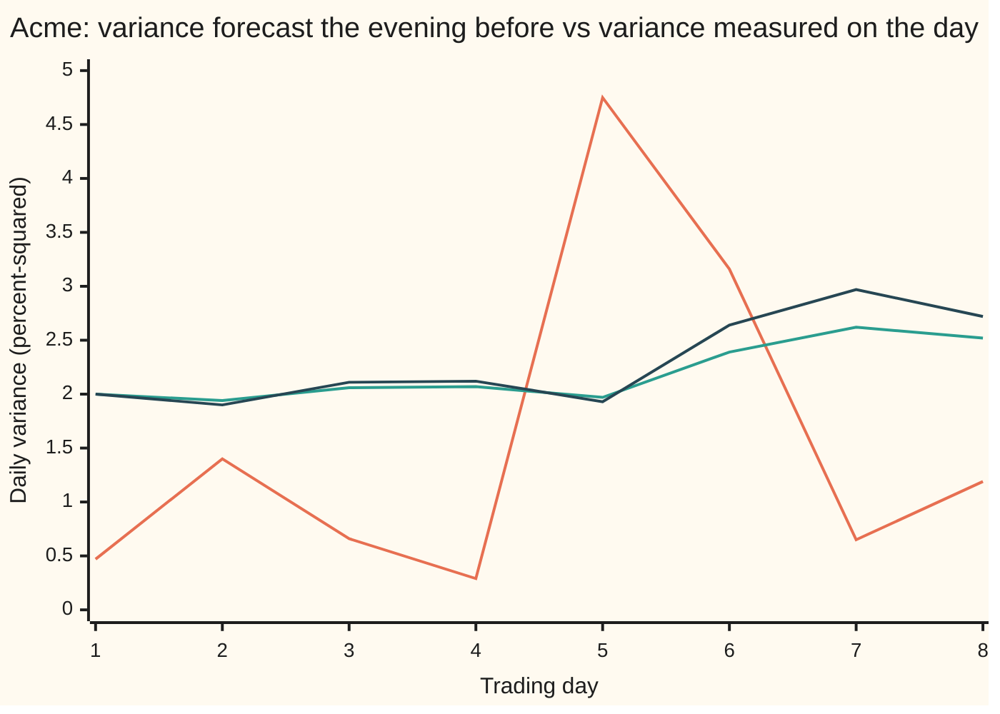
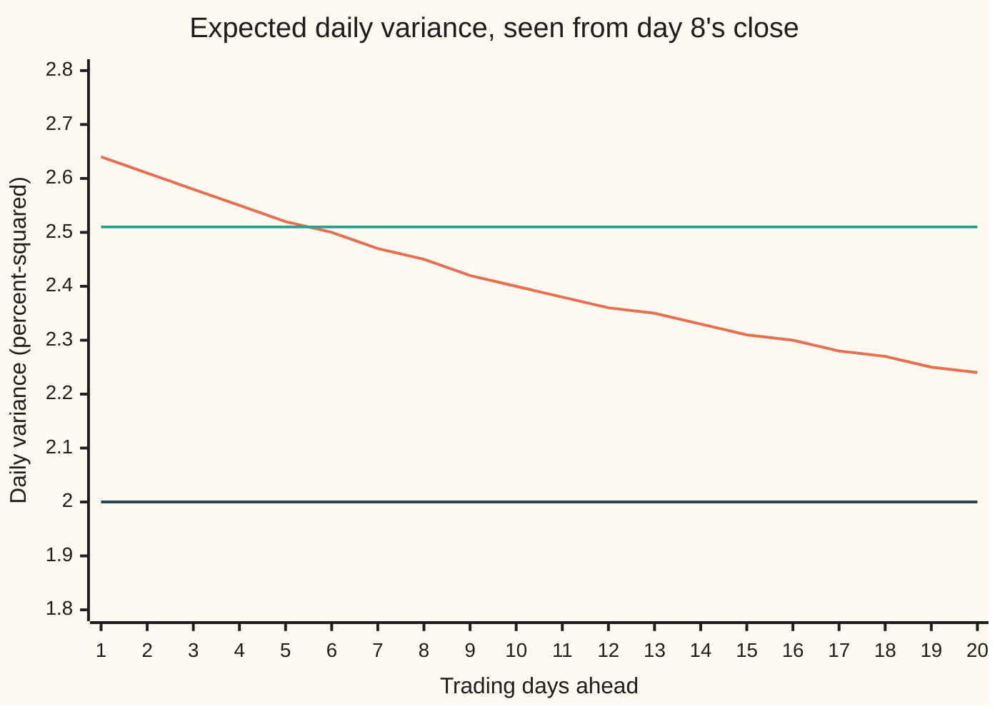

# Tomorrow's volatility: EWMA, GARCH and realised measures compared

[Syllabus](../../../SYLLABUS.md) → [Financial mathematics](../README.md) → [Hedging, Volatility Forecasts and Stress](../README.md#s40) → Tomorrow's volatility

---

## General Overview

Acme shares closed eight trading days in a row with these moves: up 1.00%, down 2.00%, up 1.50%, down 0.50%, up 3.00%, down 2.50%, up 1.00%, down 1.50%. A desk holding options on Acme must set tomorrow's risk tonight. Its margin, hedges and value at risk all start from one number: how big a typical day is likely to be.

That number is a **variance**: the average squared daily move. A move is measured as a **log return**, the natural log of today's close over yesterday's, which for small moves is almost the percentage change. The square root of the variance is the **volatility**, the size of a typical day. This card measures variance in **percent-squared**: a 1% day, squared, is 1.00.

Three rules turn the eight days into a forecast for day 9:

- **EWMA**, the exponentially weighted moving average that J.P. Morgan's RiskMetrics published: keep 94% of yesterday's forecast and add 6% of today's squared move. For day 9 it says 2.51.
- **GARCH(1,1)**, generalised autoregressive conditional heteroskedasticity: a variance that changes over time, forecast from its own past, here one day back. It is the same blend with different weights, plus a small constant that pulls the forecast toward a long-run level. For day 9 it says 2.64.
- **Lagged realised variance**: measure today's variance from the moves inside the day, and use it as tomorrow's forecast. For day 9 it says 1.19.

As volatilities, EWMA says 1.5829% and GARCH 1.6248%: on a $100 share, a one-standard-deviation day of $1.58 or $1.62. Which rule to trust is settled after the fact, by scoring each forecast against that day's **realised variance**, measured from its intraday moves.

**Forecast tomorrow's variance from what is known at today's close; once tomorrow ends, score the forecast against the variance measured inside the day, with a score that ranks forecasts the way the unseen true variance would.**

**What kind of fact this is:** a method. EWMA is a smoothing rule. GARCH is a model: an assumption about how variance evolves that fits markets well enough, not a law. The multi-day forecast and the fairness of the scores are theorems under stated assumptions, proved on this card in Why it works.

### The picture: eight days, two forecasts, one measurement



First line (orange): realised variance, measured inside each day. Second line (green): the EWMA forecast for that day, made the evening before. Third line (dark): the GARCH forecast, made at the same time. Realised variance spikes on day 5; both forecasts rise only on day 6.

---

## The formula

Notation first, in words. Trading days are counted by $t$. $r_t$ is day $t$'s log return as a decimal, 0.01 for 1%. A forecast *for* day $t+1$ is made at day $t$'s close, and carries the subscript $t+1$: $e_{t+1}$ for EWMA, $g_{t+1}$ for GARCH, $p_{t+1}$ for lagged realised. $\lambda$ (lambda) is EWMA's carry, 0.94. GARCH's weights are $\omega$ (omega), a small floor; $\alpha$ (alpha), on the squared move; and $\beta$ (beta), on the old forecast. Day $t$ is cut into $m$ intraday pieces $x_{t,1}, \dots, x_{t,m}$, counted by $j$, which add up to $r_t$; the big sigma, $\sum$, adds over $j$ from 1 to $m$. The three rules:

$$e_{t+1} = \lambda\, e_t + (1-\lambda)\, r_t^2 \qquad \text{(EWMA)}$$

$$g_{t+1} = \omega + \alpha\, r_t^2 + \beta\, g_t \qquad \text{(GARCH(1,1))}$$

$$p_{t+1} = RV_t = \sum_{j=1}^{m} x_{t,j}^2 \qquad \text{(lagged realised variance)}$$

**Read it aloud:** EWMA keeps 94% of today's forecast and adds 6% of today's squared move; GARCH adds a small floor, a tenth of today's squared move and 85% of today's forecast; the realised rule says tomorrow will look like today, measured from inside today.

Scoring over $n$ finished days, with $f_t$ any forecast for day $t$, uses two averages:

$$\text{MSE} = \frac{1}{n}\sum_{t} \left(f_t - RV_t\right)^2, \qquad \text{QLIKE} = \frac{1}{n}\sum_{t} \left(\frac{RV_t}{f_t} - \ln\frac{RV_t}{f_t} - 1\right)$$

**Read it aloud:** MSE is the average squared miss; QLIKE is the average of a penalty on the ratio of measured to forecast variance, which is zero when the two match.

Looking several days ahead, $E_t[\ \cdot\ ]$ means "the average over everything that can still happen, given what is known at day $t$'s close". For GARCH:

$$E_t\!\left[g_{t+k}\right] = \bar h + \rho^{\,k-1}\left(g_{t+1} - \bar h\right), \qquad \rho = \alpha + \beta, \qquad \bar h = \frac{\omega}{1-\rho}$$

**Read it aloud:** the expected forecast $k$ days out starts at tomorrow's forecast and closes its gap to the long-run level by a factor $\rho$ each day; EWMA's stays flat.

| Symbol | Plain meaning | In our example | Push it up and the answer… |
| --- | --- | --- | --- |
| $r_t$, $t$, $s$ | day $t$'s log return, as a decimal; $t$ and $s$ count trading days | day 5: 0.03 | a bigger squared move lifts every forecast for the next day |
| $x_{t,j}$, $m$, $j$, $\sum$ | the $m$ pieces of day $t$'s return, measured inside the day, counted by $j$; they add up to $r_t$; $\sum$ adds them | 4 pieces a day | more pieces: a less noisy measurement |
| $RV_t$, $Y$ | realised variance: the sum of the squared pieces, known at day $t$'s close; $Y$ is any such yardstick | day 5: 4.75 | the lagged-realised forecast for the next day rises one for one |
| $h_t$, $h$, $E_t$ | $h_t$ is the true variance of day $t$'s return given all that was known the evening before; $E_t$ averages over what can still happen after day $t$'s close | $h_t$ is never observed | the target every forecast aims at |
| $e_t$ | the EWMA forecast for day $t$ | day 9: 2.51 | — |
| $g_t$ | the GARCH forecast for day $t$ | day 9: 2.64 | — |
| $p_t$ | the lagged-realised forecast for day $t$: day $t-1$'s realised variance | day 9: 1.19 | — |
| $f_t$, $f$, $n$ | any forecast for day $t$ ($f$ when the day is understood); the number of scored days | days 2 to 8, so 7 | a bigger miss raises both scores |
| $\lambda$ | EWMA's carry: the share of today's forecast kept | 0.94 | a smoother, slower forecast |
| $\omega$ | GARCH's daily floor | 0.00001, which is 0.1000 in percent-squared | a higher long-run level |
| $\alpha$, $\beta$ | GARCH's weight on today's squared move, and on today's forecast | 0.10 and 0.85 | $\alpha$ up: jumpier; $\beta$ up: longer memory |
| $\rho$, $\bar h$, $k$, $M_k$ | persistence $\alpha+\beta$; the long-run variance; days ahead; $M_k$ is shorthand for $E_t[g_{t+k}]$ | 0.95; 2.00; 1 to 20 | $\rho$ toward 1: a shock fades more slowly |

All three forecasts start on day 1 at the same guess, the **seed**, 2.00.

### When it holds

- **Variance persists from day to day.** Calm follows calm and storm follows storm: **volatility clustering**. Without it every rule chases noise, and a long plain average forecasts best.
- **GARCH needs $\alpha + \beta$ below 1.** At exactly 1 there is no long-run level: the formula for $\bar h$ divides by zero, and the expected forecast climbs by $\omega$ every day (see What breaks). With $\omega > 0$ and $\alpha, \beta \ge 0$ the forecast stays positive.
- **The weights are fixed before the scored days.** Fitting $\lambda$, $\alpha$ or $\beta$ on the scored days grades a rule on its own homework.
- **The realised measure covers the same stretch of time as the return.** If the pieces skip the overnight gap, or bid-ask bounce inflates them, realised variance measures something else.
- **QLIKE needs positive numbers.** A zero forecast or a day with zero realised variance puts a zero inside a logarithm; MSE has no such limit.
- **Up and down moves count alike.** Both rules square the return, so +3% and −3% move them equally. Shares usually get jumpier after falls than after rises (the **leverage effect**); asymmetric GARCH versions add a term for it.

---

## Why it works

### Step 0: a squared return is a noisy but honest reading of variance

Take a day whose return averages zero and has variance $h_t$. The square of that return then averages exactly $h_t$: that is what variance means when the average is zero. A day's average return is tiny next to a typical move, so the zero is a fine approximation. One square is a very noisy reading, but it is not biased up or down.

Variance also lingers from day to day. So an average of recent squared returns, weighted toward the newest, forecasts tomorrow's variance. The three rules differ only in their weights.

### Step 1: EWMA is a weighted average whose weights shrink by λ per day back

Put the EWMA rule into itself, over and over. After $n$ days,

$$e_{n+1} = \lambda^{n} e_1 + (1-\lambda)\sum_{j=1}^{n} \lambda^{\,n-j}\, r_j^2 .$$

The newest square gets weight 0.06. The one before gets 0.06 × 0.94, and each older one 0.94 times less again. The weights on the squares and the seed's weight, $\lambda^n$, add up to exactly 1. So the forecast is a true weighted average: never negative, always in units of variance.

<details>
<summary>The algebra behind the weights</summary>

The squares' weights are $(1-\lambda)(1 + \lambda + \lambda^2 + \dots + \lambda^{n-1})$. The bracket is a geometric series: it equals $(1-\lambda^n)/(1-\lambda)$. Multiplied by $(1-\lambda)$ it gives $1 - \lambda^n$. Add the seed's weight $\lambda^n$ and the total is 1.

</details>

On Acme, the seed still carries weight 0.6096 after eight days. In a short record the starting guess matters a great deal; the Try changing box shows how much. The code computes day 9's EWMA both ways: 2.5057 each time.

### Step 2: GARCH adds a floor, and the floor makes a long-run level

The same unrolling for GARCH gives

$$g_{n+1} = \omega\,\frac{1-\beta^{n}}{1-\beta} + \alpha\sum_{j=1}^{n} \beta^{\,n-j}\, r_j^2 + \beta^{n} g_1 .$$

The seed's weight after eight days is 0.2725, so GARCH forgets its start faster than EWMA. The code again gets day 9 both ways: 2.6401.

Now the long-run level. Suppose the forecast has settled around an average $\bar h$. By Step 0 the average squared return is then $\bar h$ as well. Averaging the GARCH rule gives $\bar h = \omega + \alpha\bar h + \beta\bar h$, so $\bar h = \omega / (1 - \alpha - \beta)$. For Acme that is 0.1000 / 0.05 = 2.00 in percent-squared: a daily volatility of 1.4142%, and 22.45% a year on 252 trading days.

EWMA is GARCH with $\omega = 0$, $\alpha = 1 - \lambda$ and $\beta = \lambda$. Then $\alpha + \beta = 1$ exactly. There is no floor, and no long-run level to return to.

### Step 3: several days ahead, GARCH drifts home and EWMA stays put

Stand at day 8's close. Day 9's GARCH forecast is known: 2.6401. Day 10's depends on day 9's return, not yet known, but by Step 0 its square averages 2.6401. So the expected forecast for day 10 is $\omega + (\alpha + \beta) \times 2.6401$, that is $\omega + \rho \times 2.6401$. Subtract $\bar h = \omega + \rho\bar h$ from both sides: the gap to the long-run level shrinks by the factor $\rho$. Each further day repeats the step, which gives the formula. A gap halves in 13.51 trading days, since $0.95^{13.51}$ is one half.

EWMA under the same argument gives $\lambda e + (1-\lambda)e = e$: its expected forecast is flat, 2.51 at every horizon.

<details>
<summary>Detailed proof: the k-day GARCH forecast</summary>

Assume $E[r_s \mid \text{known before day } s] = 0$ and $E[r_s^2 \mid \text{known before day } s] = g_s$ for every day $s$ (a day index, like $t$), with all these averages finite. Write $M_k$ for $E_t[g_{t+k}]$, $k \ge 1$.

$M_1 = g_{t+1}$, because $g_{t+1}$ is built from day $t$'s close.

For $k \ge 1$: $g_{t+k+1} = \omega + \alpha r_{t+k}^2 + \beta g_{t+k}$. Average given day $t$'s close. Averaging first given day $t+k-1$'s close, then given day $t$'s (the **tower property**: an average of a finer average is the coarser average), turns $E_t[r_{t+k}^2]$ into $E_t[g_{t+k}] = M_k$. So $M_{k+1} = \omega + \alpha M_k + \beta M_k = \omega + \rho M_k$.

With $\bar h = \omega/(1-\rho)$, $\omega = (1-\rho)\bar h$, so $M_{k+1} - \bar h = \rho (M_k - \bar h)$. By induction $M_k - \bar h = \rho^{k-1}(M_1 - \bar h)$, which is the formula. No bell-curve shape is used, only the two averages. For EWMA the same steps give $M_{k+1} = \lambda M_k + (1-\lambda) M_k = M_k$.

</details>

The code reaches the 10-day-ahead GARCH forecast three ways: the formula, 2.4034; stepping $M_{k+1} = \omega + \rho M_k$ ten times, 2.4034; and simulating 20,000 GARCH futures with its own random numbers, 2.4024.

### Step 4: why realised variance is a fair yardstick

The target, $h_t$, is never seen. Two stand-ins are the day's squared return and its realised variance. Both average $h_t$; they differ in noise.

Suppose a day is cut into $m$ pieces, each bell-curve shaped with variance $h_t/m$. Then the realised variance has variance $2h_t^2/m$. With one piece, the squared daily return itself, that is $2h_t^2$: 8.00 when $h_t$ is 2.00. Four pieces give 2.00; sixteen give 0.50. The code simulates 40,000 days and finds 7.9293, 2.0425 and 0.5007. Cutting the day finer buys a sharper yardstick, until bid-ask bounce adds noise of its own.

A noisy yardstick does not tilt the contest. For any forecast $f$ made before the day, with the yardstick $Y$ averaging $h$,

$$E\left[(f - Y)^2\right] = E\left[(f - h)^2\right] + E\left[(Y - h)^2\right].$$

The noise term on the right is the same for every forecast. So, averaged over many days, ranking forecasts by MSE against realised variance ranks them as MSE against the unseen truth would. QLIKE shares this property. Not every score does: Patton (2011) shows that some popular scores, such as the squared miss in volatility rather than variance, can prefer the wrong forecast when the yardstick is noisy.

<details>
<summary>Detailed proof: the noise of realised variance, and the fair split</summary>

**Noise.** Let the pieces be independent bell-curve draws with average 0 and variance $h/m$. A bell-curve draw $x$ with average 0 and variance $h/m$ has $E[x^4] = 3(h/m)^2$, so $x^2$ has variance $3(h/m)^2 - (h/m)^2 = 2(h/m)^2$. The $m$ squares are independent, so their variances add: $m \cdot 2(h/m)^2 = 2h^2/m$. Their average is $m \cdot h/m = h$.

**Fair split.** Write $f - Y = (f - h) - (Y - h)$ and square: $(f-h)^2 + (Y-h)^2 - 2(f-h)(Y-h)$. Given what was known when $f$ was made, $f - h$ is fixed and $Y - h$ averages zero, so the cross term averages zero. Averaging over days gives the displayed identity, provided the squares have finite averages.

**QLIKE.** For two forecasts $f$ and $f'$ fixed in advance, the gap in $\ln f + Y/f$ is $\ln(f/f') + Y(1/f - 1/f')$. Its average replaces $Y$ by $h$, so the expected gap is the same whether scored against $Y$ or against $h$. QLIKE as written differs from $\ln f + Y/f$ by $-\ln Y - 1$, the same for every forecast, so it ranks identically.

</details>

### Step 5: the two scores punish different misses

MSE counts a miss in variance units, so one wild day such as day 5 dominates it. QLIKE looks at the ratio of measured to forecast variance. Forecast half of what came, and the day's penalty is 0.3069. Forecast double, and it is 0.1931. Under-forecasting costs more, and for a risk desk it is the costlier failure. The code checks that the QLIKE gap between GARCH and EWMA equals the gap in $\ln f + RV/f$: 0.024210 both ways.

On this card the weights are fixed in advance. In practice GARCH's $\omega$, $\alpha$ and $\beta$ are chosen by maximum likelihood on earlier data, the route [GARCH](../../09-Probability%20and%20statistics/12-Time%20Series/06-garch-and-volatility-clustering.md) follows.

---

## Worked numbers, by hand

Acme's day 1 return is +1.00%; its four intraday pieces are 0.55%, −0.05%, 0.40% and 0.10%, which add up to 1.00%. All variances are in percent-squared.

| Step | Arithmetic | Value |
| --- | --- | --- |
| EWMA for day 2 | $0.94 \times 2.00 + 0.06 \times 1.00^2$ | 1.94 |
| GARCH for day 2 | $0.10 + 0.10 \times 1.00^2 + 0.85 \times 2.00$ | 1.90 |
| realised variance, day 1 | $0.55^2 + 0.05^2 + 0.40^2 + 0.10^2$ | 0.4750 |
| lagged realised for day 2 | day 1's realised variance | 0.4750 |
| EWMA for day 9 | $0.94 \times 2.5220 + 0.06 \times 1.50^2$ | 2.5057 |
| GARCH for day 9 | $0.10 + 0.10 \times 1.50^2 + 0.85 \times 2.7236$ | 2.6401 |
| as daily volatility | square roots | 1.5829% and 1.6248% |
| MSE, days 2 to 8 | EWMA, GARCH, lagged realised | 2.7804, 3.0992, 4.3680 |
| QLIKE, days 2 to 8 | EWMA, GARCH, lagged realised | 0.4377, 0.4619, 2.1655 |
| **lowest on both scores** | | **EWMA** |

On this record EWMA edges GARCH, and both beat yesterday's realised variance. Seven scored days prove little: the longer race below reverses the top two.

### A longer race, where the truth is known

The code builds 2,500 trading days from the GARCH rule itself, each cut into four intraday pieces, after 250 warm-up days. Here the true $h_t$ is known, so each score can be taken against realised variance and against the truth. GARCH's forecast *is* the truth in this world.

| Rule | MSE vs realised | MSE vs truth | $\ln f + RV/f$ | $\ln f + h/f$ |
| --- | --- | --- | --- | --- |
| EWMA | 2.2521 | 0.1403 | 1.6193 | 1.6185 |
| GARCH | 2.1175 | 0.0000 | 1.5935 | 1.5942 |
| lagged realised | 4.0314 | 1.7819 | 2.1411 | 2.1567 |

Against realised variance, even the perfect forecast scores 2.1175: nearly all of every MSE is yardstick noise. The order is the same against the noisy yardstick and against the truth, as Step 4 promised.

### What breaks if you drop a piece

| Mistake | Comes out at | What went wrong |
| --- | --- | --- |
| $\lambda$ and $1-\lambda$ swapped | day 6 forecast 8.4825, not 2.3874 | 94% weight on one squared move: the forecast is that day's noise |
| $\beta$ = 0.90, so $\alpha + \beta = 1$ | day 9 3.3175; 20 days ahead 5.2175, still rising | no long-run level; the floor $\omega$ piles up every day |
| forecast scored against its own day | MSE 0.0000 | the lagged-realised "forecast" was given the answer: peeking |
| ten days as 10 × tomorrow's GARCH | 26.4006, not 25.1367 | the expected forecast drifts toward 2.00, so the days are not equal |
| a 365-day year for annual volatility | 31.04%, not 25.79% | variance adds over trading days, 252 of them |

Conventions verified 2026-09-28: volatility is annualised on 252 trading days; RiskMetrics' daily decay factor is 0.94.

---

## How the forecast moves

Day 5 was the wildest of the eight: realised variance 4.75. Yet the forecasts for day 5 were among the lowest of the eight, 1.97 and 1.93. They were made at day 4's close, after a quiet −0.50% day. A forecast can only react.

| Day | Return | Realised | EWMA forecast | GARCH forecast |
| --- | --- | --- | --- | --- |
| 4 | −0.50% | 0.2875 | 2.0748 | 2.1227 |
| 5 | +3.00% | 4.7500 | 1.9653 | 1.9293 |
| 6 | −2.50% | 3.1625 | 2.3874 | 2.6399 |
| 7 | +1.00% | 0.6500 | 2.6191 | 2.9689 |
| 8 | −1.50% | 1.1875 | 2.5220 | 2.7236 |

### Force one: a shock

The 3% day enters both rules at the close of day 5.

```
forecast, percent-squared; one block = 0.1
EWMA   for day 5, before the shock   ████████████████████      1.97
EWMA   for day 6, after the shock    ████████████████████████  2.39
GARCH  for day 5, before the shock   ███████████████████       1.93
GARCH  for day 6, after the shock    ██████████████████████████ 2.64
```

GARCH puts 0.10 on the new square, EWMA 0.06, so GARCH jumps further. It keeps climbing into day 7, to 2.97, as day 6's 2.5% move lands on its raised forecast.

### Force two: quiet time

Stand at day 8's close and look further ahead, with no new news.

```
expected forecast, percent-squared; one block = 0.1
GARCH   1 day ahead   ██████████████████████████  2.64
GARCH   2 days ahead  ██████████████████████████  2.61
GARCH   5 days ahead  █████████████████████████   2.52
GARCH  10 days ahead  ████████████████████████    2.40
GARCH  20 days ahead  ██████████████████████      2.24
EWMA   any horizon    █████████████████████████   2.51
```

GARCH drifts back toward its long-run 2.00 at 5% of the gap a day. EWMA has nowhere to drift, so it stays at 2.51.

### Both forces in one picture



First line (orange): GARCH's expected forecast, decaying. Second line (green): EWMA, flat. Third line (dark): GARCH's long-run level, 2.00. Today GARCH is the more alarmed rule; after five trading days the lines cross and GARCH is the calmer one. Over the next ten days GARCH's variances add up to 25.1367, EWMA's to 25.0567.

---

## Code, from first principles, and it actually runs

Nothing imported knows the answer; the random numbers are a 64-bit xorshift generator and the Box–Muller formula, written out. Each result is reached by two or three independent roads, and every number on the card is printed.

### Python

```python
# Tomorrow's volatility: EWMA, GARCH and realised measures -- the check behind
# the card.  Standard library only.  Every number quoted on the card is printed.
# Variances print in percent-squared: a 1% daily return, squared, is 1.00.
# The random numbers are a 64-bit xorshift and Box-Muller, written out here.
from math import log, sqrt, cos, pi

R = [0.01, -0.02, 0.015, -0.005, 0.03, -0.025, 0.01, -0.015]  # Acme's daily log returns
A = [0.003, 0.004, 0.002, 0.003, 0.01, 0.008, 0.004, 0.005]    # each day's intraday swing
LAM, OMEGA, ALPHA, BETA, SEED = 0.94, 0.00001, 0.10, 0.85, 0.0002
P, M64 = 1e4, (1 << 64) - 1                                    # decimal -> percent-squared

state = [0x9E3779B97F4A7C15]
def normal():                                   # one standard bell-curve draw
    def unif():
        x = state[0]
        x ^= (x << 13) & M64; x ^= x >> 7; x ^= (x << 17) & M64
        state[0] = x
        return ((x >> 11) + 0.5) / 9007199254740992.0
    u1, u2 = unif(), unif()
    return sqrt(-2.0 * log(u1)) * cos(2.0 * pi * u2)

def pieces(r, a):                               # four intraday log returns summing to r
    return (r / 4 + a, r / 4 - a, r / 4 + a / 2, r / 4 - a / 2)

# ---- road 1: the three rules, one close at a time ----
e, g, p, rv = [SEED], [SEED], [SEED], []        # e[i], g[i], p[i]: forecasts for day i+1
for r, a in zip(R, A):
    rv.append(sum(x * x for x in pieces(r, a)))
    e.append(LAM * e[-1] + (1 - LAM) * r * r)
    g.append(OMEGA + ALPHA * r * r + BETA * g[-1])
    p.append(rv[-1])
print(f"rules: lambda {LAM:.2f}; omega {P*OMEGA:.4f}, alpha {ALPHA:.2f}, beta {BETA:.2f}; seed {P*SEED:.4f}")
print("day  return%   realised   EWMA  GARCH  lag-RV   (variances in percent-squared)")
for i in range(8):
    print(f"{i+1:>3} {100*R[i]:>+8.2f} {P*rv[i]:>10.4f} {P*e[i]:>6.4f} {P*g[i]:>6.4f} {P*p[i]:>7.4f}")
print(f"day 9 forecasts: EWMA {P*e[8]:.4f}  GARCH {P*g[8]:.4f}  lag-RV {P*p[8]:.4f}")
print(f"day 9 as daily vol: EWMA {100*sqrt(e[8]):.4f}%  GARCH {100*sqrt(g[8]):.4f}%;"
      f" on a $100 share ${100*sqrt(e[8]):.2f} and ${100*sqrt(g[8]):.2f}")
for lab, xs in (("realised", rv), ("EWMA", e), ("GARCH", g)):
    print(f"chart {lab:<8} days 1-8: " + " ".join(f"{P*x:.2f}" for x in xs[:8]))

# ---- road 2: the same forecasts as one weighted sum, no recursion ----
n = len(R)
e_sum = LAM**n * SEED + sum((1 - LAM) * LAM**(n-1-j) * R[j]**2 for j in range(n))
g_sum = OMEGA * (1 - BETA**n) / (1 - BETA) + BETA**n * SEED \
        + sum(ALPHA * BETA**(n-1-j) * R[j]**2 for j in range(n))
rv_id = [r * r / 4 + 2.5 * a * a for r, a in zip(R, A)]
print(f"unrolled sums, day 9: EWMA {P*e_sum:.4f}  GARCH {P*g_sum:.4f}")
print(f"weight on newest square: EWMA {1-LAM:.2f}  GARCH {ALPHA:.2f}; on seed after 8 days: "
      f"EWMA {LAM**n:.4f}  GARCH {BETA**n:.4f}")

# ---- scoring days 2..8 against realised variance ----
names, fc = ("EWMA", "GARCH", "lag-RV"), (e, g, p)
mse = [sum((P*f[i] - P*rv[i])**2 for i in range(1, 8)) / 7 for f in fc]
qlk = [sum(rv[i]/f[i] - log(rv[i]/f[i]) - 1 for i in range(1, 8)) / 7 for f in fc]
usual = [sum(log(P*f[i]) + rv[i]/f[i] for i in range(1, 8)) / 7 for f in fc]
for k in range(3):
    print(f"score {names[k]:<6} MSE {mse[k]:.4f}   QLIKE {qlk[k]:.4f}   log f + RV/f {usual[k]:.4f}")
print(f"QLIKE gap GARCH - EWMA {qlk[1]-qlk[0]:.6f}; same gap in log f + RV/f {usual[1]-usual[0]:.6f}")
print(f"QLIKE for one day, forecast half of RV {2 - log(2) - 1:.4f}; forecast double RV {0.5 - log(0.5) - 1:.4f}")

# ---- several days ahead: closed form, iterated, simulated ----
rho, anchor = ALPHA + BETA, OMEGA / (1 - ALPHA - BETA)
closed = [anchor + rho**(k-1) * (g[8] - anchor) for k in range(1, 21)]
it = [g[8]]
for k in range(19):
    it.append(OMEGA + rho * it[-1])
paths, sim = 20000, [0.0] * 20
for _ in range(paths):
    h = g[8]
    for k in range(20):
        sim[k] += h / paths
        z = normal()
        h = OMEGA + ALPHA * h * z * z + BETA * h
print(f"GARCH anchor {P*anchor:.4f} (daily vol {100*sqrt(anchor):.4f}%, a year {100*sqrt(252*anchor):.2f}%);"
      f" half-life {log(0.5)/log(rho):.2f} days")
for k in (1, 2, 5, 10, 20):
    print(f"k={k:>2} days ahead: closed {P*closed[k-1]:.4f}  iterated {P*it[k-1]:.4f}  "
          f"simulated {P*sim[k-1]:.4f}  EWMA {P*e[8]:.4f}")
ten_g, ten_e = sum(closed[:10]), 10 * e[8]
print(f"10-day variance: GARCH sum {P*ten_g:.4f}  EWMA {P*ten_e:.4f}  10 x GARCH tomorrow {10*P*g[8]:.4f}")
print("chart GARCH k=1..20: " + " ".join(f"{P*c:.2f}" for c in closed))
print(f"chart EWMA k=1..20: flat at {P*e[8]:.2f}")

# ---- why score against realised variance: its noise, by simulation ----
h0, days, stats = SEED, 40000, {}
for m in (1, 4, 16):
    s1 = s2 = 0.0
    for _ in range(days):
        v = sum((sqrt(h0 / m) * normal())**2 for _ in range(m))
        s1 += P * v; s2 += (P * v)**2
    stats[m] = (s1 / days, s2 / days - (s1 / days)**2)
    print(f"proxy, {m:>2} pieces a day: mean {stats[m][0]:.4f}  variance {stats[m][1]:.4f}"
          f"  theory 2h^2/m {2*(P*h0)**2/m:.4f}")

# ---- a longer race: 2,500 days simulated from the GARCH rule itself ----
h, fe, fp, sc = anchor, anchor, anchor, [[0.0] * 6 for _ in range(3)]
for day in range(2750):
    xs = [sqrt(h / 4) * normal() for _ in range(4)]
    r, v = sum(xs), sum(x * x for x in xs)
    if day >= 250:                                # first 250 days only warm the rules up
        for k, f in enumerate((fe, h, fp)):       # GARCH's forecast is the true h here
            for j, tgt in enumerate((v, h)):
                sc[k][j] += (P*f - P*tgt)**2 / 2500
                sc[k][2 + j] += (log(P*f) + tgt / f) / 2500
    fe, fp, h = LAM * fe + (1 - LAM) * r * r, v, OMEGA + ALPHA * r * r + BETA * h
print("race, 2,500 days    MSE vs RV   MSE vs h   log f+RV/f   log f+h/f")
for k in range(3):
    print(f"race {names[k]:<6} {sc[k][0]:>17.4f} {sc[k][1]:>10.4f} {sc[k][2]:>12.4f} {sc[k][3]:>11.4f}")

# ---- what breaks ----
lam_flip = [SEED]
for r in R:
    lam_flip.append((1 - LAM) * lam_flip[-1] + LAM * r * r)
g90 = SEED
for r in R:
    g90 = OMEGA + ALPHA * r * r + 0.90 * g90
igarch = g90 + 19 * OMEGA                         # alpha + beta = 1: no pull, drift up by omega a day
peek = sum((P*p[i+1] - P*rv[i])**2 for i in range(1, 8)) / 7
print(f"wrong: lambda and 1-lambda swapped, day 9 {P*lam_flip[8]:.4f}; day 6 {P*lam_flip[5]:.4f}")
print(f"wrong: beta 0.90 (alpha+beta=1), day 9 {P*g90:.4f}, 20 days ahead {P*igarch:.4f}, still rising")
print(f"wrong: forecast scored against its own day, MSE {peek:.4f}")
print(f"wrong: 365-day year, annual vol from day 9 GARCH {100*sqrt(365*g[8]):.2f}% not {100*sqrt(252*g[8]):.2f}%")

assert max(abs(x - y) for x, y in zip(rv, rv_id)) < 1e-15, "realised sum vs its identity"
assert abs(e[8] - e_sum) < 1e-15, "EWMA recursion vs unrolled sum"
assert abs(g[8] - g_sum) < 1e-15, "GARCH recursion vs unrolled sum"
assert abs(P*it[19] - P*closed[19]) < 1e-9, "iterated vs closed-form term structure"
assert abs(sim[9] / closed[9] - 1) < 0.01, "simulated vs closed-form 10-day forecast"
assert abs((qlk[1]-qlk[0]) - (usual[1]-usual[0])) < 1e-12, "QLIKE ranking vs usual score"
assert all(abs(sum((P*f[i])**2 - 2*P*f[i]*P*rv[i] + (P*rv[i])**2 for i in range(1, 8)) / 7 - mse[k]) < 1e-9 for k, f in enumerate(fc)), "MSE vs expanded square"
assert sorted(range(3), key=lambda k: sc[k][0]) == sorted(range(3), key=lambda k: sc[k][1]), "RV ranks as h does"
assert all(abs(stats[m][1] / (2*(P*h0)**2/m) - 1) < 0.05 for m in stats), "proxy noise vs 2h^2/m"
print("ALL CHECKS PASS")
```

**Ran 2026-09-28 on macOS, Python 3.14.6, standard library only. All checks passed. Output, pasted from the run:**

```
rules: lambda 0.94; omega 0.1000, alpha 0.10, beta 0.85; seed 2.0000
day  return%   realised   EWMA  GARCH  lag-RV   (variances in percent-squared)
  1    +1.00     0.4750 2.0000 2.0000  2.0000
  2    -2.00     1.4000 1.9400 1.9000  0.4750
  3    +1.50     0.6625 2.0636 2.1150  1.4000
  4    -0.50     0.2875 2.0748 2.1227  0.6625
  5    +3.00     4.7500 1.9653 1.9293  0.2875
  6    -2.50     3.1625 2.3874 2.6399  4.7500
  7    +1.00     0.6500 2.6191 2.9689  3.1625
  8    -1.50     1.1875 2.5220 2.7236  0.6500
day 9 forecasts: EWMA 2.5057  GARCH 2.6401  lag-RV 1.1875
day 9 as daily vol: EWMA 1.5829%  GARCH 1.6248%; on a $100 share $1.58 and $1.62
chart realised days 1-8: 0.47 1.40 0.66 0.29 4.75 3.16 0.65 1.19
chart EWMA     days 1-8: 2.00 1.94 2.06 2.07 1.97 2.39 2.62 2.52
chart GARCH    days 1-8: 2.00 1.90 2.11 2.12 1.93 2.64 2.97 2.72
unrolled sums, day 9: EWMA 2.5057  GARCH 2.6401
weight on newest square: EWMA 0.06  GARCH 0.10; on seed after 8 days: EWMA 0.6096  GARCH 0.2725
score EWMA   MSE 2.7804   QLIKE 0.4377   log f + RV/f 1.5989
score GARCH  MSE 3.0992   QLIKE 0.4619   log f + RV/f 1.6232
score lag-RV MSE 4.3680   QLIKE 2.1655   log f + RV/f 3.3267
QLIKE gap GARCH - EWMA 0.024210; same gap in log f + RV/f 0.024210
QLIKE for one day, forecast half of RV 0.3069; forecast double RV 0.1931
GARCH anchor 2.0000 (daily vol 1.4142%, a year 22.45%); half-life 13.51 days
k= 1 days ahead: closed 2.6401  iterated 2.6401  simulated 2.6401  EWMA 2.5057
k= 2 days ahead: closed 2.6081  iterated 2.6081  simulated 2.6077  EWMA 2.5057
k= 5 days ahead: closed 2.5213  iterated 2.5213  simulated 2.5146  EWMA 2.5057
k=10 days ahead: closed 2.4034  iterated 2.4034  simulated 2.4024  EWMA 2.5057
k=20 days ahead: closed 2.2415  iterated 2.2415  simulated 2.2462  EWMA 2.5057
10-day variance: GARCH sum 25.1367  EWMA 25.0567  10 x GARCH tomorrow 26.4006
chart GARCH k=1..20: 2.64 2.61 2.58 2.55 2.52 2.50 2.47 2.45 2.42 2.40 2.38 2.36 2.35 2.33 2.31 2.30 2.28 2.27 2.25 2.24
chart EWMA k=1..20: flat at 2.51
proxy,  1 pieces a day: mean 1.9995  variance 7.9293  theory 2h^2/m 8.0000
proxy,  4 pieces a day: mean 2.0088  variance 2.0425  theory 2h^2/m 2.0000
proxy, 16 pieces a day: mean 2.0032  variance 0.5007  theory 2h^2/m 0.5000
race, 2,500 days    MSE vs RV   MSE vs h   log f+RV/f   log f+h/f
race EWMA              2.2521     0.1403       1.6193      1.6185
race GARCH             2.1175     0.0000       1.5935      1.5942
race lag-RV            4.0314     1.7819       2.1411      2.1567
wrong: lambda and 1-lambda swapped, day 9 2.1944; day 6 8.4825
wrong: beta 0.90 (alpha+beta=1), day 9 3.3175, 20 days ahead 5.2175, still rising
wrong: forecast scored against its own day, MSE 0.0000
wrong: 365-day year, annual vol from day 9 GARCH 31.04% not 25.79%
ALL CHECKS PASS
```

### Rust

Same rows, same labels, built with `rustc --edition 2021 -O`.

```rust
// Tomorrow's volatility: EWMA, GARCH and realised measures -- the same check as
// the Python, in Rust.  No crates.  Every number quoted on the card is printed.
// Variances print in percent-squared: a 1% daily return, squared, is 1.00.
// The random numbers are a 64-bit xorshift and Box-Muller, written out here.
use std::f64::consts::PI;

const R: [f64; 8] = [0.01, -0.02, 0.015, -0.005, 0.03, -0.025, 0.01, -0.015]; // daily log returns
const A: [f64; 8] = [0.003, 0.004, 0.002, 0.003, 0.01, 0.008, 0.004, 0.005]; // intraday swings
const LAM: f64 = 0.94;
const OMEGA: f64 = 0.00001;
const ALPHA: f64 = 0.10;
const BETA: f64 = 0.85;
const SEED: f64 = 0.0002;
const P: f64 = 1e4; // decimal -> percent-squared

struct Rng(u64);
impl Rng {
    fn unif(&mut self) -> f64 {
        let mut x = self.0;
        x ^= x << 13; x ^= x >> 7; x ^= x << 17;
        self.0 = x;
        ((x >> 11) as f64 + 0.5) / 9007199254740992.0
    }
    fn normal(&mut self) -> f64 { // one standard bell-curve draw
        let (u1, u2) = (self.unif(), self.unif());
        (-2.0 * u1.ln()).sqrt() * (2.0 * PI * u2).cos()
    }
}

fn pieces(r: f64, a: f64) -> [f64; 4] { [r / 4.0 + a, r / 4.0 - a, r / 4.0 + a / 2.0, r / 4.0 - a / 2.0] }

fn main() {
    let mut rng = Rng(0x9E3779B97F4A7C15);
    // ---- road 1: the three rules, one close at a time ----
    let (mut e, mut g, mut p, mut rv) = (vec![SEED], vec![SEED], vec![SEED], Vec::new());
    for i in 0..8 {
        let r = R[i];
        rv.push(pieces(r, A[i]).iter().fold(0.0, |s, x| s + x * x));
        e.push(LAM * e[i] + (1.0 - LAM) * r * r);
        g.push(OMEGA + ALPHA * r * r + BETA * g[i]);
        p.push(rv[i]);
    }
    println!("rules: lambda {:.2}; omega {:.4}, alpha {:.2}, beta {:.2}; seed {:.4}", LAM, P * OMEGA, ALPHA, BETA, P * SEED);
    println!("day  return%   realised   EWMA  GARCH  lag-RV   (variances in percent-squared)");
    for i in 0..8 {
        println!("{:>3} {:>+8.2} {:>10.4} {:>6.4} {:>6.4} {:>7.4}", i + 1, 100.0 * R[i], P * rv[i], P * e[i], P * g[i], P * p[i]);
    }
    println!("day 9 forecasts: EWMA {:.4}  GARCH {:.4}  lag-RV {:.4}", P * e[8], P * g[8], P * p[8]);
    println!("day 9 as daily vol: EWMA {:.4}%  GARCH {:.4}%; on a $100 share ${:.2} and ${:.2}",
             100.0 * e[8].sqrt(), 100.0 * g[8].sqrt(), 100.0 * e[8].sqrt(), 100.0 * g[8].sqrt());
    for (lab, xs) in [("realised", &rv), ("EWMA", &e), ("GARCH", &g)] {
        let row: Vec<String> = xs[..8].iter().map(|x| format!("{:.2}", P * x)).collect();
        println!("chart {:<8} days 1-8: {}", lab, row.join(" "));
    }
    // ---- road 2: the same forecasts as one weighted sum, no recursion ----
    let n = 8.0;
    let mut e_sum = LAM.powf(n) * SEED;
    let mut g_sum = OMEGA * (1.0 - BETA.powf(n)) / (1.0 - BETA) + BETA.powf(n) * SEED;
    for j in 0..8 {
        e_sum += (1.0 - LAM) * LAM.powf(7.0 - j as f64) * R[j] * R[j];
        g_sum += ALPHA * BETA.powf(7.0 - j as f64) * R[j] * R[j];
    }
    let rv_id: Vec<f64> = (0..8).map(|i| R[i] * R[i] / 4.0 + 2.5 * A[i] * A[i]).collect();
    println!("unrolled sums, day 9: EWMA {:.4}  GARCH {:.4}", P * e_sum, P * g_sum);
    println!("weight on newest square: EWMA {:.2}  GARCH {:.2}; on seed after 8 days: EWMA {:.4}  GARCH {:.4}",
             1.0 - LAM, ALPHA, LAM.powf(n), BETA.powf(n));
    // ---- scoring days 2..8 against realised variance ----
    let names = ["EWMA", "GARCH", "lag-RV"];
    let fc = [&e, &g, &p];
    let (mut mse, mut qlk, mut usual) = ([0.0f64; 3], [0.0f64; 3], [0.0f64; 3]);
    for k in 0..3 {
        for i in 1..8 {
            let (f, t) = (fc[k][i], rv[i]);
            mse[k] += (P * f - P * t).powi(2);
            qlk[k] += t / f - (t / f).ln() - 1.0;
            usual[k] += (P * f).ln() + t / f;
        }
        mse[k] /= 7.0; qlk[k] /= 7.0; usual[k] /= 7.0;
        println!("score {:<6} MSE {:.4}   QLIKE {:.4}   log f + RV/f {:.4}", names[k], mse[k], qlk[k], usual[k]);
    }
    println!("QLIKE gap GARCH - EWMA {:.6}; same gap in log f + RV/f {:.6}", qlk[1] - qlk[0], usual[1] - usual[0]);
    println!("QLIKE for one day, forecast half of RV {:.4}; forecast double RV {:.4}", 2.0 - 2f64.ln() - 1.0, 0.5 - 0.5f64.ln() - 1.0);
    // ---- several days ahead: closed form, iterated, simulated ----
    let (rho, anchor) = (ALPHA + BETA, OMEGA / (1.0 - ALPHA - BETA));
    let closed: Vec<f64> = (1..21).map(|k| anchor + rho.powf(k as f64 - 1.0) * (g[8] - anchor)).collect();
    let mut it = vec![g[8]];
    for k in 0..19 { it.push(OMEGA + rho * it[k]); }
    let (paths, mut sim) = (20000, [0.0f64; 20]);
    for _ in 0..paths {
        let mut h = g[8];
        for k in 0..20 {
            sim[k] += h / paths as f64;
            let z = rng.normal();
            h = OMEGA + ALPHA * h * z * z + BETA * h;
        }
    }
    println!("GARCH anchor {:.4} (daily vol {:.4}%, a year {:.2}%); half-life {:.2} days",
             P * anchor, 100.0 * anchor.sqrt(), 100.0 * (252.0 * anchor).sqrt(), 0.5f64.ln() / rho.ln());
    for k in [1usize, 2, 5, 10, 20] {
        println!("k={:>2} days ahead: closed {:.4}  iterated {:.4}  simulated {:.4}  EWMA {:.4}",
                 k, P * closed[k - 1], P * it[k - 1], P * sim[k - 1], P * e[8]);
    }
    let (ten_g, ten_e) = (closed[..10].iter().fold(0.0, |s, x| s + x), 10.0 * e[8]);
    println!("10-day variance: GARCH sum {:.4}  EWMA {:.4}  10 x GARCH tomorrow {:.4}", P * ten_g, P * ten_e, 10.0 * P * g[8]);
    let row: Vec<String> = closed.iter().map(|c| format!("{:.2}", P * c)).collect();
    println!("chart GARCH k=1..20: {}", row.join(" "));
    println!("chart EWMA k=1..20: flat at {:.2}", P * e[8]);
    // ---- why score against realised variance: its noise, by simulation ----
    let (h0, days) = (SEED, 40000);
    let mut stats: Vec<(usize, f64, f64)> = Vec::new();
    for m in [1usize, 4, 16] {
        let (mut s1, mut s2) = (0.0, 0.0);
        for _ in 0..days {
            let mut v = 0.0;
            for _ in 0..m { v += ((h0 / m as f64).sqrt() * rng.normal()).powi(2); }
            s1 += P * v; s2 += (P * v).powi(2);
        }
        let (mean, var) = (s1 / days as f64, s2 / days as f64 - (s1 / days as f64).powi(2));
        stats.push((m, mean, var));
        println!("proxy, {:>2} pieces a day: mean {:.4}  variance {:.4}  theory 2h^2/m {:.4}",
                 m, mean, var, 2.0 * (P * h0).powi(2) / m as f64);
    }
    // ---- a longer race: 2,500 days simulated from the GARCH rule itself ----
    let (mut h, mut fe, mut fp, mut sc) = (anchor, anchor, anchor, [[0.0f64; 4]; 3]);
    for day in 0..2750 {
        let xs: Vec<f64> = (0..4).map(|_| (h / 4.0).sqrt() * rng.normal()).collect();
        let r = xs.iter().fold(0.0, |s, x| s + x);
        let v = xs.iter().fold(0.0, |s, x| s + x * x);
        if day >= 250 { // first 250 days only warm the rules up
            for (k, f) in [fe, h, fp].iter().enumerate() { // GARCH's forecast is the true h here
                for (j, tgt) in [v, h].iter().enumerate() {
                    sc[k][j] += (P * f - P * tgt).powi(2) / 2500.0;
                    sc[k][2 + j] += ((P * f).ln() + tgt / f) / 2500.0;
                }
            }
        }
        fe = LAM * fe + (1.0 - LAM) * r * r;
        fp = v;
        h = OMEGA + ALPHA * r * r + BETA * h;
    }
    println!("race, 2,500 days    MSE vs RV   MSE vs h   log f+RV/f   log f+h/f");
    for k in 0..3 {
        println!("race {:<6} {:>17.4} {:>10.4} {:>12.4} {:>11.4}", names[k], sc[k][0], sc[k][1], sc[k][2], sc[k][3]);
    }
    // ---- what breaks ----
    let (mut flip, mut g90) = (vec![SEED], SEED);
    for i in 0..8 {
        flip.push((1.0 - LAM) * flip[i] + LAM * R[i] * R[i]);
        g90 = OMEGA + ALPHA * R[i] * R[i] + 0.90 * g90;
    }
    let igarch = g90 + 19.0 * OMEGA; // alpha + beta = 1: no pull, drift up by omega a day
    let peek = (1..8).fold(0.0, |s, i| s + (P * p[i + 1] - P * rv[i]).powi(2)) / 7.0;
    println!("wrong: lambda and 1-lambda swapped, day 9 {:.4}; day 6 {:.4}", P * flip[8], P * flip[5]);
    println!("wrong: beta 0.90 (alpha+beta=1), day 9 {:.4}, 20 days ahead {:.4}, still rising", P * g90, P * igarch);
    println!("wrong: forecast scored against its own day, MSE {:.4}", peek);
    println!("wrong: 365-day year, annual vol from day 9 GARCH {:.2}% not {:.2}%",
             100.0 * (365.0 * g[8]).sqrt(), 100.0 * (252.0 * g[8]).sqrt());

    assert!((0..8).all(|i| (rv[i] - rv_id[i]).abs() < 1e-15), "realised sum vs its identity");
    assert!((e[8] - e_sum).abs() < 1e-15, "EWMA recursion vs unrolled sum");
    assert!((g[8] - g_sum).abs() < 1e-15, "GARCH recursion vs unrolled sum");
    assert!((P * it[19] - P * closed[19]).abs() < 1e-9, "iterated vs closed-form term structure");
    assert!((sim[9] / closed[9] - 1.0).abs() < 0.01, "simulated vs closed-form 10-day forecast");
    assert!(((qlk[1] - qlk[0]) - (usual[1] - usual[0])).abs() < 1e-12, "QLIKE ranking vs usual score");
    assert!((0..3).all(|k| ((1..8).fold(0.0, |s, i| s + (P * fc[k][i]).powi(2) - 2.0 * P * fc[k][i] * P * rv[i] + (P * rv[i]).powi(2)) / 7.0 - mse[k]).abs() < 1e-9), "MSE vs expanded square");
    let rank = |j: usize| { let mut o = vec![0usize, 1, 2]; o.sort_by(|a, b| sc[*a][j].partial_cmp(&sc[*b][j]).unwrap()); o };
    assert!(rank(0) == rank(1), "RV ranks as h does");
    assert!(stats.iter().all(|&(m, _, var)| (var / (2.0 * (P * h0).powi(2) / m as f64) - 1.0).abs() < 0.05), "proxy noise vs 2h^2/m");
    println!("ALL CHECKS PASS");
}
```

**Ran 2026-09-28 on macOS, rustc 1.98.1, no crates. All checks passed. Output, pasted from the run:**

```
rules: lambda 0.94; omega 0.1000, alpha 0.10, beta 0.85; seed 2.0000
day  return%   realised   EWMA  GARCH  lag-RV   (variances in percent-squared)
  1    +1.00     0.4750 2.0000 2.0000  2.0000
  2    -2.00     1.4000 1.9400 1.9000  0.4750
  3    +1.50     0.6625 2.0636 2.1150  1.4000
  4    -0.50     0.2875 2.0748 2.1227  0.6625
  5    +3.00     4.7500 1.9653 1.9293  0.2875
  6    -2.50     3.1625 2.3874 2.6399  4.7500
  7    +1.00     0.6500 2.6191 2.9689  3.1625
  8    -1.50     1.1875 2.5220 2.7236  0.6500
day 9 forecasts: EWMA 2.5057  GARCH 2.6401  lag-RV 1.1875
day 9 as daily vol: EWMA 1.5829%  GARCH 1.6248%; on a $100 share $1.58 and $1.62
chart realised days 1-8: 0.47 1.40 0.66 0.29 4.75 3.16 0.65 1.19
chart EWMA     days 1-8: 2.00 1.94 2.06 2.07 1.97 2.39 2.62 2.52
chart GARCH    days 1-8: 2.00 1.90 2.11 2.12 1.93 2.64 2.97 2.72
unrolled sums, day 9: EWMA 2.5057  GARCH 2.6401
weight on newest square: EWMA 0.06  GARCH 0.10; on seed after 8 days: EWMA 0.6096  GARCH 0.2725
score EWMA   MSE 2.7804   QLIKE 0.4377   log f + RV/f 1.5989
score GARCH  MSE 3.0992   QLIKE 0.4619   log f + RV/f 1.6232
score lag-RV MSE 4.3680   QLIKE 2.1655   log f + RV/f 3.3267
QLIKE gap GARCH - EWMA 0.024210; same gap in log f + RV/f 0.024210
QLIKE for one day, forecast half of RV 0.3069; forecast double RV 0.1931
GARCH anchor 2.0000 (daily vol 1.4142%, a year 22.45%); half-life 13.51 days
k= 1 days ahead: closed 2.6401  iterated 2.6401  simulated 2.6401  EWMA 2.5057
k= 2 days ahead: closed 2.6081  iterated 2.6081  simulated 2.6077  EWMA 2.5057
k= 5 days ahead: closed 2.5213  iterated 2.5213  simulated 2.5146  EWMA 2.5057
k=10 days ahead: closed 2.4034  iterated 2.4034  simulated 2.4024  EWMA 2.5057
k=20 days ahead: closed 2.2415  iterated 2.2415  simulated 2.2462  EWMA 2.5057
10-day variance: GARCH sum 25.1367  EWMA 25.0567  10 x GARCH tomorrow 26.4006
chart GARCH k=1..20: 2.64 2.61 2.58 2.55 2.52 2.50 2.47 2.45 2.42 2.40 2.38 2.36 2.35 2.33 2.31 2.30 2.28 2.27 2.25 2.24
chart EWMA k=1..20: flat at 2.51
proxy,  1 pieces a day: mean 1.9995  variance 7.9293  theory 2h^2/m 8.0000
proxy,  4 pieces a day: mean 2.0088  variance 2.0425  theory 2h^2/m 2.0000
proxy, 16 pieces a day: mean 2.0032  variance 0.5007  theory 2h^2/m 0.5000
race, 2,500 days    MSE vs RV   MSE vs h   log f+RV/f   log f+h/f
race EWMA              2.2521     0.1403       1.6193      1.6185
race GARCH             2.1175     0.0000       1.5935      1.5942
race lag-RV            4.0314     1.7819       2.1411      2.1567
wrong: lambda and 1-lambda swapped, day 9 2.1944; day 6 8.4825
wrong: beta 0.90 (alpha+beta=1), day 9 3.3175, 20 days ahead 5.2175, still rising
wrong: forecast scored against its own day, MSE 0.0000
wrong: 365-day year, annual vol from day 9 GARCH 31.04% not 25.79%
ALL CHECKS PASS
```

The two outputs match line for line, simulations included: both run the same generator in the same order.

> [!TIP]
> **Try changing**
> Guess first, then run it.
> - **A slower EWMA.** Set `LAM` to `0.97`. Guess: better or worse? On the eight days EWMA's scores improve and it pulls further ahead of GARCH. In the 2,500-day race it falls further behind. Eight days cannot choose a parameter.
> - **A different seed.** Set the seed from `0.0002` to `0.0004`. Guess which rule minds more. EWMA, whose seed still weighs 0.6096 after eight days, ends day 8 well above GARCH. GARCH now beats EWMA on both scores, and yesterday's realised variance has the lowest MSE of the three.
> - **No long-run level.** Set `BETA` to `0.90`. Guess what happens to $\bar h$. Python stops with a division by zero at the anchor line; there is no level to return to.
> - **Fewer simulated futures.** Set `paths` to `200`. Guess whether 1% is tight enough. The simulated 10-day forecast wanders away from the formula and the assert stops the run.

---

## The usual mistake

> [!warning]
> **Treating realised variance as the true variance.** It is a measurement, and a noisy one. In the race, the forecast equal to the truth still scored an MSE of 2.1175 against realised variance, all of it yardstick noise. A single day's miss says almost nothing about a rule; only averages over many days, with a fair score, rank rules.
>
> - **Peeking.** A forecast for day $t$ must use nothing from day $t$. Score yesterday's realised variance against itself and the MSE is 0.0000: a perfect score for a rule that saw the answer.
> - **Swapping the weights.** EWMA keeps $\lambda$ = 0.94 of the old forecast and takes 0.06 of the new square. Swapped, the day 6 forecast is 8.4825, a copy of one day's noise.
> - **Scaling a GARCH forecast flat.** Ten days of variance is the sum of ten expected days, 25.1367, not 10 × tomorrow's, 26.4006. The gap grows with the horizon.
> - **Annualising with calendar days.** Variance accrues on trading days: $\sqrt{252}$, not $\sqrt{365}$. The day 9 GARCH forecast is 25.79% a year, not 31.04%.

---

## Where you meet it in real life

- **Value at risk.** RiskMetrics' EWMA with $\lambda$ = 0.94 was widely adopted as the volatility input to banks' value-at-risk systems; a book's one-day value at risk scales with the forecast's square root ([Parametric VaR](../39-Value%20at%20Risk%20and%20Expected%20Shortfall/02-parametric-var-and-delta-normal.md)).
- **Option desks.** A forecast of realised variance, set against the market's implied volatility ([Implied volatility](../11-Implied%20volatility%20and%20the%20vanilla%20inverses/01-implied-volatility.md)), is the case for buying or selling options. The book's vega, its dollars per volatility point ([Portfolio Greeks](01-portfolio-greeks-and-taylor-pnl.md)) turns a forecast miss into dollars.
- **Hedging.** How much gamma (the rate at which a hedge ratio drifts as the price moves) to carry overnight depends on how big tomorrow's move is likely to be; the hedge itself is built in [Hedging three Greeks at once](02-delta-gamma-vega-hedging.md).
- **Variance swaps.** These contracts pay realised variance measured from daily closes, the one-piece version of this card's yardstick ([Realised variance](../19-Variance%20swaps%2C%20the%20log%20contract%20and%20VIX/01-realised-variance-from-daily-prices.md)).

> **Say it back**
> Tomorrow's variance has to be forecast from what is known at today's close. EWMA blends today's squared move into yesterday's forecast; GARCH does the same with a floor that pulls it toward a long-run level; the realised rule reuses today's intraday measurement. After the day ends, each forecast is scored against realised variance, a noisy but unbiased measurement. With MSE or QLIKE the noise adds the same amount to every rule, so averages over many days rank the rules fairly. Eight days rank nothing.

---

## What this builds on

- [Portfolio Greeks](01-portfolio-greeks-and-taylor-pnl.md): the book's sensitivities, which turn a volatility forecast into a dollar risk.
- [GARCH](../../09-Probability%20and%20statistics/12-Time%20Series/06-garch-and-volatility-clustering.md): volatility clustering, the GARCH model and how its weights are fitted.

## Where this goes next

- [Stress tests](05-scenario-grids-and-stress-tests.md): replaces one forecast number with a grid of explicit moves in price and volatility.
- [Limits](06-risk-limits-and-risk-appetite.md): sets how much forecast risk a desk may carry.

A forecast says how big a normal tomorrow is; the open question is what the book loses on an abnormal one, which a stress grid answers.

---

## Sources

Verified 2026-09-28: every link below resolves to the publisher's page.

- Bollerslev, Tim. "Generalized Autoregressive Conditional Heteroskedasticity." *Journal of Econometrics* 31, no. 3 (1986): 307–327. [doi:10.1016/0304-4076(86)90063-1](https://doi.org/10.1016/0304-4076(86)90063-1). The GARCH rule, its long-run level and the condition $\alpha + \beta < 1$.
- J.P. Morgan and Reuters. *RiskMetrics Technical Document*, fourth edition, 1996. [MSCI copy](https://www.msci.com/documents/10199/5915b101-4206-4ba0-aee2-3449d5c7e95a). The EWMA rule and the daily choice $\lambda$ = 0.94.
- Andersen, Torben G., Tim Bollerslev, Francis X. Diebold, and Paul Labys. "Modeling and Forecasting Realized Volatility." *Econometrica* 71, no. 2 (2003): 579–625. [Econometric Society page](https://www.econometricsociety.org/publications/econometrica/2003/03/01/modeling-and-forecasting-realized-volatility). Realised variance from intraday returns as measurement and as forecast input.
- Patton, Andrew J. "Volatility Forecast Comparison Using Imperfect Volatility Proxies." *Journal of Econometrics* 160, no. 1 (2011): 246–256. [doi:10.1016/j.jeconom.2010.03.034](https://doi.org/10.1016/j.jeconom.2010.03.034). Which scores rank forecasts correctly against a noisy yardstick: MSE and QLIKE do.
