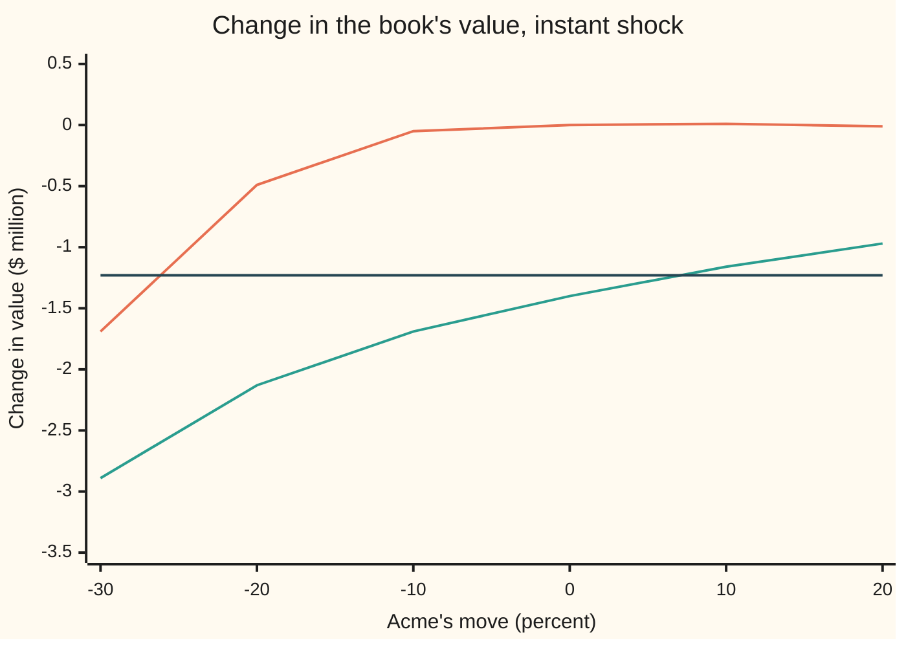

# Stress tests: spot-and-volatility grids, historical replays and hypothetical shocks

Financial mathematics → Hedging, Volatility Forecasts and Stress → What-if revaluation → Stress tests

---

## General Overview

An options desk has sold crash protection on Acme. It is short 380,000 one-year Acme puts struck at $90. A put is the right to sell one share at the strike, so the desk pays out if Acme falls hard. To tame that, the desk bought 140,000 three-month puts struck at $100 and sold 18,715 Acme shares so that small moves in Acme cancel. Acme trades at $100. Its volatility, the annual size of its typical swings, is 20 percent.

The risk report looks calm. The book's delta, its dollar change per $1 move in Acme, is −0.1: a tenth of a share. Its gamma, how fast delta itself moves, is 19.4 shares per dollar: close to nothing on a book this size. Only its vega, the change in value when volatility rises one percentage point, stands out: −$82,324. Delta, gamma and vega together are the book's **Greeks**.

Now let Acme fall 20 percent, to $80, and let volatility jump 15 points, from 20 percent to 35 percent. Reprice every position at those two new numbers. The book loses **$2.13 million**. The sensitivities above would have predicted $1.23 million. The gap is the reason stress tests exist.

A stress test does not extrapolate from slopes; it prices the whole book again at a chosen bad state. A **scenario grid** sweeps spot moves against volatility moves. A **historical replay** feeds in the moves of a dated crisis, here autumn 2008 and March 2020. A **hypothetical shock** is designed by hand, like the headline one. A **reverse stress test** runs backwards: fix the unacceptable loss, and find the least far-fetched state that causes it.

**A stress test sets the market inputs to a chosen bad state, reprices every position in full, and reports the change in the book's value; a reverse stress test fixes the loss and searches for the least far-fetched state that produces it.**

**What kind of fact this is:** a method: a procedure for reading risk, resting on a pricing model it does not itself test. One theorem sits inside it, the chance bound for the reverse test, proved on this card in Why it works.

### The picture: full repricing against the Greeks



Orange, top: full repricing, volatility unchanged. Green: full repricing, volatility up 15 points. Dark, flat: the Greeks' estimate, volatility up 15 points; with delta and gamma near zero it sees only vega times 15. The widening gap on the left is the risk a sensitivity report cannot show.

---

## The formula

Notation first, in words. Two numbers describe each scenario. The spot move $s$ is Acme's change in percent: $s = -20$ means \$100 becomes \$80. The volatility move $v$ is counted in **vol points**, where one point is one percentage point of annual volatility: $v = 15$ takes 20 percent to 35 percent. The book's value at a given Acme price and volatility is written $V$.

$$L(s,v) \;=\; V\!\left(S_0\big(1+\tfrac{s}{100}\big),\; \sigma_0+\tfrac{v}{100}\right) \;-\; V(S_0,\sigma_0), \qquad V(S,\sigma) \;=\; \sum_i n_i\,P_i(S,\sigma) \;+\; n_S\,S$$

**Read it aloud:** move Acme's price and its volatility to the scenario, price every option again with the same model, add the shares, and subtract today's value of the same positions.

The reverse test measures how far-fetched a scenario is by a distance $d$, counted in typical months:

$$d(s,v)^2 \;=\; \frac{z_s^2 - 2\rho\,z_s z_v + z_v^2}{1-\rho^2}, \qquad z_s = \frac{s}{m_s}, \quad z_v = \frac{v}{m_v}$$

**Read it aloud:** scale each move by its typical monthly size, then measure how far the pair sits from "nothing happened", with the correlation deciding which directions count as ordinary.

The reverse test is then: find the scenario with the smallest $d$ among those where $L(s,v)$ is at or below −\$3 million. Call that smallest distance $d_*$. If a month's moves are jointly normal (bell-shaped, with the stated sizes and correlation), then

$$\Pr\big[\,L(s,v) \le -\$3\text{ million}\,\big] \;\le\; e^{-d_*^2/2}.$$

| Symbol | Plain meaning | In our example | Push it up and the answer… |
| --- | --- | --- | --- |
| $S_0$, $S$ | Acme's price today, and in the scenario | \$100, and \$80 in the headline | little changes near \$100; large falls cost money, as the grid shows |
| $\sigma_0$, $\sigma$ | Acme's volatility today, and in the scenario | 20%, and 35% in the headline | the book loses: it is short volatility |
| $s$ | Acme's move in percent | −20 | a smaller fall costs less |
| $v$ | the volatility move, in vol points | +15 | each point costs about \$82,324 near today, more after a fall |
| $V$ | the book's marked value: options at model prices plus shares | changes only matter here | |
| $n_i$, $P_i$ | how many of each option the book holds (negative when sold), and its Black-Scholes price | −380,000 one-year \$90 puts at \$2.7145; +140,000 three-month \$100 puts at \$3.5924 | |
| $n_S$ | shares held (negative when sold) | −18,715 | |
| $L$ | the change in the book's value in the scenario; negative is a loss | −\$2.13 million | |
| $\Delta$, $\Gamma$, $\nu$ | the book's delta (shares), gamma (shares per dollar) and vega (dollars per vol point) | −0.1, 19.4, −\$82,324 | |
| $m_s$, $m_v$, $z_s$, $z_v$ | a typical one-month move in spot and in volatility, and each scenario move divided by it | 5.7735% and 4 points | a larger typical move makes a scenario less far-fetched |
| $\rho$ | the correlation between monthly spot moves and volatility moves | −0.7: falls usually come with volatility rises | makes "fall plus vol spike" more ordinary |
| $d$, $d_*$ | distance in typical months; the smallest distance that reaches the loss limit | 3.93 for the headline; 5.10 for the \$3 million limit | a larger $d_*$ means the limit is harder to reach |

The Greeks' estimate, which the card uses only to show where it fails, is the second-order Taylor sum from the book's sensitivities (see [portfolio-greeks-and-taylor-pnl](01-portfolio-greeks-and-taylor-pnl.md)):

$$L \;\approx\; \Delta\,(S - S_0) \;+\; \tfrac12\,\Gamma\,(S - S_0)^2 \;+\; \nu\,v.$$

### When it holds

- **Positions frozen, shock instant.** No trading and no time passing. A month-long crisis also brings time decay and rehedging, and both change the loss.
- **The pricing model is right at the stressed point.** Both puts are priced with Black-Scholes at one flat volatility. If short-dated volatility jumps more than one-year volatility, or the smile steepens, the loss differs from the grid.
- **Everything else is held fixed.** The 5 percent rate and 2 percent dividend yield do not move. In a real crisis rates often fall and dividends get cut.
- **The replay mapping.** A replay borrows an index's move and a volatility index's move for Acme. If Acme's own moves differ, the replay is off by that gap.
- **The reverse test's yardstick.** The distance $d$ assumes bell-shaped monthly moves with the stated sizes and correlation. Real markets have fatter tails, so the chance bound understates how often such months arrive.

---

## Why it works

### Step 0: slopes describe a curve only near the point where they are measured

Delta, gamma and vega are slopes and curvatures of the book's value, measured at Acme $100 and volatility 20 percent. A Taylor sum built from them is exact in the limit of small moves and drifts off as moves grow, and stress moves are large by design. Full revaluation evaluates the pricing formula at the new point instead of extrapolating to it. What remains is the model's own error, listed under "When it holds".

The check confirms both halves. For a move of −0.05 percent and +0.01 vol points, full repricing gives −$824.89 and the Greeks give −$823.21: close. For −20 percent and +15 points they give −$2.13 million and −$1.23 million: not close.

### Step 1: reprice each position

The shares move one for one: 18,715 sold shares gain $20 each when Acme falls from $100 to $80, a gain of $374,300. Each put is priced again with the Black-Scholes put formula ([black-scholes-put](../08-The%20Black-Scholes%20call%20and%20put/02-black-scholes-put.md)) at Acme $80 and volatility 35 percent. The one-year $90 put rises from $2.7145 to $15.3433. The three-month $100 put rises from $3.5924 to $19.9691. Multiply by the counts and add. Worked numbers, by hand, lays out the arithmetic.

The check takes a second, independent road to every stressed price. It skips the formula and averages the put's payoff directly over the bell curve of Acme's log price, by Simpson's rule (a weighted sum over thin slices). Both roads give −$2,131,895.76 for the headline cell, to the cent.

### Step 2: the grid, and why joint shocks are worse than their parts

Repeat Step 1 over a table of spot moves and volatility moves. Each cell is the change in the book's value, in millions of dollars, with a negative number a loss:

| Spot move | vol −5 | vol +0 | vol +5 | vol +10 | vol +15 |
| --- | --- | --- | --- | --- | --- |
| −30% | −1.43 | −1.69 | −2.04 | −2.45 | −2.89 |
| −20% | 0.05 | −0.49 | −1.04 | −1.59 | **−2.13** |
| −10% | 0.53 | −0.05 | −0.61 | −1.15 | −1.69 |
| +0% | 0.37 | 0.00 | −0.44 | −0.91 | −1.40 |
| +10% | 0.24 | 0.01 | −0.32 | −0.72 | −1.16 |
| +20% | 0.12 | −0.01 | −0.25 | −0.58 | −0.97 |

Read down the "vol +0" column: spot alone barely hurts until the fall passes 10 percent. Read along the "+0%" row: volatility alone costs $1.40 million at +15 points. Add the two single-factor losses for the headline, $0.49 million plus $1.40 million, and the total is $1.89 million. The joint cell is $2.13 million. The extra $0.24 million is the **interaction**: what the two shocks do together that neither does alone.

Its source is visible in the book's vega after the fall. At Acme $100 the book loses $82,324 per vol point. At Acme $80, volatility still 20 percent, it loses $109,824 per point. The three-month $100 puts, which carried the book's long vega, have gone deep into the money. A deep in-the-money option behaves almost like a short share, with little left of the "maybe" that volatility prices, so their vega nearly vanishes. The short one-year $90 puts keep theirs. The hedge's vega disappears at the very moment volatility rises. The rate at which vega changes as spot moves has its own name, vanna: [vanna](../09-The%20Greeks%2C%20one%20each/06-vanna.md).

Volatility alone costs $1.40 million, more than $82,324 times 15, which is $1.23 million, because vega itself grows as volatility rises for the out-of-the-money $90 puts: [volga](../09-The%20Greeks%2C%20one%20each/07-volga.md).

### Step 3: historical replay turns dated closes into a scenario

A replay picks a crisis window, reads the start and end closes of a spot index and a volatility index, and converts them into $(s, v)$. Spot moves are relative: $s$ is 100 times the ratio of end close to start close, minus 100. Volatility moves are differences in points: $v$ is the volatility index's end close minus its start close, since that index is already quoted in points. The card uses the Nasdaq Composite for spot and the Cboe VIX for volatility, both from FRED. VIX measures S&P 500 option volatility, not Acme's. Borrowing it is a mapping assumption, stated as such. Conventions verified 28 Sep 2026: Cboe quotes VIX as the 30-day implied volatility of the S&P 500, annualised, in percentage points.

| Window, close to close | Nasdaq | VIX | Scenario fed to the book | Loss, full repricing | Loss, Greeks |
| --- | --- | --- | --- | --- | --- |
| 12 Sep to 10 Oct 2008 | 2261.27 to 1649.51 | 25.66 to 69.95 | −27.0538%, +44.29 points, vol to 64.29% | $5.45 million | $3.64 million |
| 19 Feb to 23 Mar 2020 | 9817.18 to 6860.67 | 14.38 to 61.59 | −30.1157%, +47.21 points, vol to 67.21% | $5.88 million | $3.88 million |

The book starts at its own 20 percent, not at the VIX's starting level. Only the VIX's change is borrowed. Both windows lasted weeks; the replay applies them in one instant.

The losses side by side, one block per $0.25 million:

```
Loss in the scenario ($ million, one block = $0.25 million)
Greeks, -20% and +15 vol     █████                      $1.23
one factor at a time, added  ████████                   $1.89
full repricing, -20% +15     █████████                  $2.13
replay, autumn 2008          ██████████████████████     $5.45
replay, March 2020           ████████████████████████   $5.88
```

### Step 4: hypothetical shocks are designed, and carry no probability by themselves

The headline scenario, −20 percent with +15 vol points, happened on no particular date: it is designed, as a bad month for a single stock. A designed shock needs a stated rationale, the factors it moves together, and the horizon over which the desk could not trade out. It carries no probability of its own. The reverse test supplies a yardstick.

### Step 5: the reverse test searches for the least far-fetched way to lose $3 million

Fix the unacceptable loss at \$3 million. Many scenarios produce it; the useful one asks the least of the market, measured by $d$. The card takes a typical month as a 5.7735 percent spot move (20 percent volatility scaled to one month by the square root of 1/12) and a 4-point volatility move, with correlation −0.7. The last two are assumptions of this card; the volatility forecasting card estimates such numbers from data ([volatility-forecasting-ewma-garch-and-realised](04-volatility-forecasting-ewma-garch-and-realised.md)).

The negative correlation makes a fall with a volatility spike an ordinary combination, so $d$ counts it as closer than a fall with volatility steady. Two roads find the answer.

- **Rays.** Walk out from "nothing happened" along 720 directions, each spaced half a degree apart in a coordinate system where $d$ is plain distance. On each ray, step outward until the loss reaches \$3 million, then halve the gap 40 times (bisection) to pin the crossing. Keep the closest crossing. Result: $d_* = 5.098$, at a spot move of −26.89 percent and a volatility move of +18.96 points.
- **Brute force.** Evaluate the loss on every point of a grid spaced a quarter of a point apart, from −60 to 0 percent in spot and −15 to +45 points in volatility. Among the points that lose at least \$3 million, keep the one with the smallest $d$. Result: $d = 5.095$, at −27.50 percent and +18.50 points.

The two agree to 0.003 in distance. The gap is resolution: the grid's best point sits between two rays, and near the minimum nearby scenarios score almost the same.

So the most plausible way to lose $3 million is Acme down about 27 percent with volatility up about 19 points. The autumn 2008 replay moved spot by about the same amount but volatility by 44 points, and it lost $5.45 million.

### Step 6: the chance bound, and why it is only a ranking

The distance $d$ comes with a guarantee. Under bell-shaped monthly moves, the chance that a month lands at distance $d_*$ or beyond is exactly $e^{-d_*^2/2}$. Every scenario that loses \$3 million lies at least that far out, so the chance of a \$3 million month is at most $e^{-d_*^2/2}$. For $d_* = 5.098$ that bound is 2.27 months in a million: one month in 440,693.

<details>
<summary>Detailed proof</summary>

Write the standardised moves as $z_s = x$ and $z_v = \rho\,x + \sqrt{1-\rho^2}\,y$, where $(x, y)$ are two independent standard bell-curve draws. This pair has the right sizes (each has spread 1) and the right correlation $\rho$.

Substitute into the distance. The numerator is
$$x^2 - 2\rho x(\rho x + c\,y) + (\rho x + c\,y)^2, \qquad c = \sqrt{1-\rho^2}.$$
Expanding, the cross terms in $x\,y$ cancel and the rest is $x^2(1-\rho^2) + c^2 y^2 = (1-\rho^2)(x^2+y^2)$. Divide by $(1-\rho^2)$: $d^2 = x^2 + y^2$. In the $(x, y)$ coordinates the distance is ordinary distance. The rays in the check are straight lines in exactly these coordinates, so a point a length $d$ out along a ray sits at distance exactly $d$; the check prints the ray point's distance by the formula as 5.098, matching.

The joint density of two independent standard draws is $\frac{1}{2\pi}e^{-(x^2+y^2)/2}$. In polar coordinates, with $r^2 = x^2 + y^2$, the area element is $r\,dr\,d\theta$. The chance that the radius exceeds some $a > 0$ is
$$\int_0^{2\pi}\!\!\int_a^\infty \frac{1}{2\pi}e^{-r^2/2}\,r\,dr\,d\theta \;=\; \Big[-e^{-r^2/2}\Big]_a^\infty \;=\; e^{-a^2/2}.$$
Every scenario with $L(s,v) \le -\$3$ million has $d \ge d_*$ by the definition of $d_*$ as the smallest such distance. So the loss event sits inside the event $d \ge d_*$, and its chance is at most $e^{-d_*^2/2}$. The bound is an inequality because most of the region $d \ge d_*$, for instance a large spot rise, loses less than \$3 million.

</details>

The same yardstick scores the replays. The 2008 window sits at distance 11.875 and the 2020 window at 12.549. Their chance bounds are 10 to the power −30.62 and −34.20: the bell-curve yardstick calls both impossible. Both happened within twelve years. So $d$ is useful for **ranking** scenarios, and for finding the cheapest route to a given loss, but its chance bound is not the chance. Real monthly moves have far fatter tails than a bell curve; the tail cards treat this properly ([extreme-value-theory-and-tails](../39-Value%20at%20Risk%20and%20Expected%20Shortfall/07-extreme-value-theory-and-tails.md)).

### The other door

Breuer and Csiszár replace the distance with a relative entropy, a measure of how far one probability law sits from another, which handles non-bell-shaped moves. Value at Risk runs the idea from the other end: it fixes a probability and reads off a loss ([profit-and-loss-distribution-and-var](../39-Value%20at%20Risk%20and%20Expected%20Shortfall/01-profit-and-loss-distribution-and-var.md)).

---

## Worked numbers, by hand

The headline scenario: Acme −20 percent, volatility +15 points.

| Step | Arithmetic | Value |
| --- | --- | --- |
| stressed Acme price | $100 × (1 − 0.20) | $80 |
| stressed volatility | 0.20 + 0.15 | 0.35 |
| one-year $90 put, today → stressed | Black-Scholes at $100, 20% → at $80, 35% | $2.7145 → $15.3433 |
| three-month $100 put, today → stressed | Black-Scholes at $100, 20% → at $80, 35% | $3.5924 → $19.9691 |
| short one-year puts | −380,000 × (15.3433 − 2.7145) | −$4,798,934.96 |
| long three-month puts | +140,000 × (19.9691 − 3.5924) | +$2,292,739.21 |
| short shares | −18,715 × (80 − 100) | +$374,300.00 |
| **change in the book's value** | −4,798,934.96 + 2,292,739.21 + 374,300.00 | **−$2,131,895.76** |

The multiplications in the table use rounded prices; the check multiplies at full precision, which is where the last cents come from. The desk would lose $2.13 million in a month that sent Acme to $80 and its volatility to 35 percent, although its morning risk report showed no delta and no gamma.

### What breaks if you drop a piece

| Mistake | Comes out at | What went wrong |
| --- | --- | --- |
| Add the spot-only and vol-only losses | −$1.89 million | misses the $0.24 million interaction: the hedge's vega dies as Acme falls |
| Use the Greeks' Taylor estimate | −$1.23 million | delta and gamma are measured at $100 and see nothing of a 20 percent fall |
| Read "+15 vol" as 15 percent of 20, so volatility goes to 23% | −$0.82 million | vol points are added, not multiplied: +15 points is 35 percent |
| Replay 2008 through the Greeks | −$3.64 million (right: −$5.45 million) | the larger the shock, the further the Taylor sum drifts |

---

## Code, from first principles, and it actually runs

The scripts build the book, fill the grid, and price every scenario by two independent roads: the Black-Scholes formula with a home-made bell-curve area (Marsaglia's series), and Simpson's rule over the payoff, which never uses that area. The reverse test takes two more roads, rays with bisection and a brute-force grid. Asserts check the house put, the two pricing roads against each other and the 2.1 million headline, the Greeks against full repricing for a tiny move and against finite-difference slopes of the repricing, the two reverse searches against each other, and that the reverse scenario sits on the loss boundary. Every number on this card is printed below.

### Python

```python
# Stress tests on the Acme options book: grid, replays, reverse stress.
# Standard library only. The normal CDF, the integrator and the searches are
# written out here; nothing imported already knows the answer.
from math import exp, log, sqrt, pi, cos, sin

R, Q, S0, VOL0 = 0.05, 0.02, 100.0, 0.20            # the house market

def N(x):                                            # bell-curve area left of x, by Marsaglia's series
    if x < -9.0: return 0.0
    if x > 9.0: return 1.0
    term, total, k = x, x, 1
    while abs(term) > 1e-17 * abs(total):
        k += 2; term *= x * x / k; total += term
    return 0.5 + total * exp(-0.5 * x * x) / sqrt(2.0 * pi)

def put(S, K, vol, T):                               # road 1: Black-Scholes put formula
    d1 = (log(S / K) + (R - Q + 0.5 * vol * vol) * T) / (vol * sqrt(T))
    d2 = d1 - vol * sqrt(T)
    return K * exp(-R * T) * N(-d2) - S * exp(-Q * T) * N(-d1)

def put_simpson(S, K, vol, T, n=4000):               # road 2: average the payoff over the bell curve
    drift, w = (R - Q - 0.5 * vol * vol) * T, vol * sqrt(T)
    zk = (log(K / S) - drift) / w                    # the put pays only below this z
    a, h = -12.0, (zk + 12.0) / n
    f = lambda z: (K - S * exp(drift + w * z)) * exp(-0.5 * z * z) / sqrt(2.0 * pi)
    tot = f(a) + f(zk) + sum((4 if i % 2 else 2) * f(a + i * h) for i in range(1, n))
    return exp(-R * T) * tot * h / 3.0

def greeks(S, K, vol, T):                            # delta, gamma, vega per vol point
    d1 = (log(S / K) + (R - Q + 0.5 * vol * vol) * T) / (vol * sqrt(T))
    pdf = exp(-0.5 * d1 * d1) / sqrt(2.0 * pi)
    return (-exp(-Q * T) * N(-d1), exp(-Q * T) * pdf / (S * vol * sqrt(T)),
            S * exp(-Q * T) * pdf * sqrt(T) / 100.0)

# the book: sold 380,000 one-year $90 puts, bought 140,000 three-month $100 puts, shares hedge delta
OPTS = [(-380000.0, 90.0, 1.0), (140000.0, 100.0, 0.25)]
hedge = lambda opts: -round(sum(n * greeks(S0, K, VOL0, T)[0] for n, K, T in opts))
SHARES = hedge(OPTS)

def value(S, vol, opts, pricer, sh):
    return sum(n * pricer(S, K, vol, T) for n, K, T in opts) + sh * S

def loss(s, v, opts=OPTS, pricer=put, sh=SHARES):    # s: spot move in percent, v: vol move in points
    return value(S0 * (1 + s / 100), VOL0 + v / 100, opts, pricer, sh) - value(S0, VOL0, opts, pricer, sh)

G = [sum(n * greeks(S0, K, VOL0, T)[j] for n, K, T in OPTS) + (SHARES if j == 0 else 0) for j in range(3)]
def taylor(s, v):                                    # the book's Greeks, as a second-order estimate
    dS = S0 * s / 100
    return G[0] * dS + 0.5 * G[1] * dS * dS + G[2] * v

M = lambda x: f"{x / 1e6:8.2f}"
print(f"house put, formula        {put(100.0, 100.0, 0.2, 1.0):.12f}")
print(f"book: {OPTS[0][0]:.0f} x 1y $90 put at {put(S0, 90.0, VOL0, 1.0):.4f}   "
      f"{OPTS[1][0]:.0f} x 3m $100 put at {put(S0, 100.0, VOL0, 0.25):.4f}   shares {SHARES:.0f}")
print(f"book delta {G[0]:.1f}   gamma {G[1]:.1f}   vega per point {G[2]:.0f}")
SPOTS, VOLS = (-30, -20, -10, 0, 10, 20), (-5, 0, 5, 10, 15)
print("grid, $ million, vol points across" + "".join(f"{v:>+8d}" for v in VOLS))
for s in SPOTS:
    print(f"  spot move {s:+4d}%" + " " * 14 + "".join(M(loss(s, v)) for v in VOLS))
L1, L2 = loss(-20, 15), loss(-20, 15, pricer=put_simpson)
print(f"headline -20%, +15 vol: formula {L1:.2f}   Simpson {L2:.2f}")
p1, p2 = put(80.0, 90.0, 0.35, 1.0), put(80.0, 100.0, 0.35, 0.25)
print(f"stressed at $80, 35%: 1y $90 put {p1:.4f}   3m $100 put {p2:.4f}")
print(f"by position: 1y puts {OPTS[0][0] * (p1 - put(S0, 90.0, VOL0, 1.0)):.2f}   "
      f"3m puts {OPTS[1][0] * (p2 - put(S0, 100.0, VOL0, 0.25)):.2f}   shares {SHARES * -20.0:.2f}")
print(f"book vega per point at $80, 20%: {sum(n * greeks(80.0, K, VOL0, T)[2] for n, K, T in OPTS):.0f}")
a, b = loss(-20, 0), loss(0, 15)
print(f"spot alone {a:.2f}   vol alone {b:.2f}   sum {a + b:.2f}   joint minus sum {L1 - a - b:.2f}")
print(f"Greeks estimate at -20%, +15 vol {taylor(-20, 15):.2f}   wrong: vol +15% of 20 (to 23%) {loss(-20, 3):.2f}")
print(f"tiny move -0.05%, +0.01 vol: full {loss(-0.05, 0.01):.4f}   Greeks {taylor(-0.05, 0.01):.4f}")

MS, MV, RHO, LIMIT = 20 / sqrt(12), 4.0, -0.7, -3.0e6  # one-month typical moves, their correlation

def dist(s, v, rho=RHO):                             # how many typical months away (s, v) lies
    zs, zv = s / MS, v / MV
    return sqrt((zs * zs - 2 * rho * zs * zv + zv * zv) / (1 - rho * rho))

REPLAYS = [("2008", 2261.270, 1649.510, 25.66, 69.95), ("2020", 9817.180, 6860.670, 14.38, 61.59)]
RL = [loss(100 * (n1 / n0 - 1), x1 - x0) for _, n0, n1, x0, x1 in REPLAYS]
for (name, n0, n1, x0, x1), lr in zip(REPLAYS, RL):  # Nasdaq for spot, VIX change for vol points
    s, v = 100 * (n1 / n0 - 1), x1 - x0
    print(f"replay {name} inputs: Nasdaq {n0:.2f} -> {n1:.2f}   VIX {x0:.2f} -> {x1:.2f}   book vol to {20 + v:.2f}%")
    print(f"replay {name}: spot {s:.4f}%  vol {v:+.2f} pts  formula {lr:.2f}  "
          f"Simpson {loss(s, v, pricer=put_simpson):.2f}  Greeks {taylor(s, v):.2f}")
    print(f"replay {name} distance {dist(s, v):.3f}   log10 of chance bound {-dist(s, v) ** 2 / (2 * log(10)):.2f}")

def rays(rho=RHO, limit=LIMIT):                     # reverse road 1: walk out along 720 rays, bisect
    best = (99.0, 0.0, 0.0)
    for k in range(720):
        th = 2 * pi * k / 720
        pt = lambda d: (MS * d * cos(th), MV * (rho * d * cos(th) + sqrt(1 - rho * rho) * d * sin(th)))
        lo, d = 0.0, 0.1
        while d < best[0]:
            s, v = pt(d)
            if s <= -99 or v <= -19: d = 99.0; break
            if loss(s, v) <= limit: break
            lo, d = d, d + 0.1
        if d >= best[0]: continue
        for _ in range(40):
            mid = 0.5 * (lo + d)
            s, v = pt(mid)
            lo, d = (lo, mid) if loss(s, v) <= limit else (mid, d)
        best = (d,) + pt(d)
    return best

def brute():                                         # reverse road 2: every point on a 0.25 grid
    best = (99.0, 0.0, 0.0)
    for i in range(241):
        for j in range(241):
            s, v = -60 + 0.25 * i, -15 + 0.25 * j
            dd = dist(s, v)
            if dd < best[0] and loss(s, v) <= LIMIT: best = (dd, s, v)
    return best

r1, r2, t1, t3 = rays(), brute(), rays(rho=0.0), rays(limit=-2.0e6)
print(f"reverse inputs: limit {LIMIT:.0f}   typical month: spot {MS:.4f}%  vol {MV:.2f} pts  correlation {RHO:.2f}")
print(f"reverse, rays:  distance {r1[0]:.3f}  spot {r1[1]:+.2f}%  vol {r1[2]:+.2f} pts  loss {loss(r1[1], r1[2]):.0f}")
print(f"reverse, grid:  distance {r2[0]:.3f}  spot {r2[1]:+.2f}%  vol {r2[2]:+.2f} pts  loss {loss(r2[1], r2[2]):.0f}")
print(f"reverse, check: distance of ray point by formula {dist(r1[1], r1[2]):.3f}")
print(f"chance bound exp(-d^2/2) per million months {1e6 * exp(-0.5 * r1[0] ** 2):.2f}   one month in {exp(0.5 * r1[0] ** 2):.0f}")
print(f"distance of -20%, +15 vol {dist(-20, 15):.3f}   one month in {exp(0.5 * dist(-20, 15) ** 2):.0f}")
print(f"bars, $ million: Greeks {-taylor(-20, 15) / 1e6:.2f}  one at a time {-(a + b) / 1e6:.2f}  full {-L1 / 1e6:.2f}  "
      f"2008 {-RL[0] / 1e6:.2f}  2020 {-RL[1] / 1e6:.2f}")
print("chart, spot move       " + "".join(f"{s:8d}" for s in SPOTS))
print("chart, full, vol +0    " + "".join(M(loss(s, 0)) for s in SPOTS))
print("chart, full, vol +15   " + "".join(M(loss(s, 15)) for s in SPOTS))
print("chart, Greeks, vol +15 " + "".join(M(taylor(s, 15)) for s in SPOTS))
t2 = loss(-20, 15, opts=OPTS[:1], sh=hedge(OPTS[:1]))
print(f"try: correlation 0 -> distance {t1[0]:.3f}  spot {t1[1]:+.2f}%  vol {t1[2]:+.2f} pts")
print(f"try: no 3m puts, shares re-hedged {hedge(OPTS[:1])} -> headline {t2:.2f}")
print(f"try: limit $2m -> distance {t3[0]:.3f}  spot {t3[1]:+.2f}%  vol {t3[2]:+.2f} pts")

assert abs(put(100.0, 100.0, 0.2, 1.0) - 6.330080627550) < 1e-9, "house put"
assert abs(L1 - L2) < 1.0 and round(L1 / 1e6, 1) == -2.1, "two revaluations agree; the headline loses 2.1 million"
assert abs(loss(-0.05, 0.01) - taylor(-0.05, 0.01)) < 0.01 * abs(loss(-0.05, 0.01)), "Greeks right for tiny moves"
fd = lambda f, h=0.01: ((f(h, 0) - f(-h, 0)) / (2 * h), (f(h, 0) + f(-h, 0) - 2 * f(0, 0)) / h ** 2, (f(0, h) - f(0, -h)) / (2 * h))
assert all(abs(x - y) < 0.01 * max(1, abs(y)) for x, y in zip(fd(loss), fd(taylor))), "Greeks match slopes of the repricing"
assert abs(r1[0] - r2[0]) < 0.05, "ray search and grid search find the same nearest scenario"
assert loss(r1[1], r1[2]) <= LIMIT < loss(r1[1] * 0.999, r1[2] * 0.999), "the reverse scenario sits on the edge"
print("ALL CHECKS PASS")
```

**Ran 2026-09-28 on macOS, Python 3.14.6, standard library only. All checks passed. Output, pasted from the run:**

```
house put, formula        6.330080627550
book: -380000 x 1y $90 put at 2.7145   140000 x 3m $100 put at 3.5924   shares -18715
book delta -0.1   gamma 19.4   vega per point -82324
grid, $ million, vol points across      -5      +0      +5     +10     +15
  spot move  -30%                 -1.43   -1.69   -2.04   -2.45   -2.89
  spot move  -20%                  0.05   -0.49   -1.04   -1.59   -2.13
  spot move  -10%                  0.53   -0.05   -0.61   -1.15   -1.69
  spot move   +0%                  0.37    0.00   -0.44   -0.91   -1.40
  spot move  +10%                  0.24    0.01   -0.32   -0.72   -1.16
  spot move  +20%                  0.12   -0.01   -0.25   -0.58   -0.97
headline -20%, +15 vol: formula -2131895.76   Simpson -2131895.76
stressed at $80, 35%: 1y $90 put 15.3433   3m $100 put 19.9691
by position: 1y puts -4798934.96   3m puts 2292739.21   shares 374300.00
book vega per point at $80, 20%: -109824
spot alone -492187.30   vol alone -1397788.72   sum -1889976.02   joint minus sum -241919.74
Greeks estimate at -20%, +15 vol -1230988.55   wrong: vol +15% of 20 (to 23%) -822957.31
tiny move -0.05%, +0.01 vol: full -824.8895   Greeks -823.2126
replay 2008 inputs: Nasdaq 2261.27 -> 1649.51   VIX 25.66 -> 69.95   book vol to 64.29%
replay 2008: spot -27.0538%  vol +44.29 pts  formula -5449247.59  Simpson -5449247.59  Greeks -3639049.42
replay 2008 distance 11.875   log10 of chance bound -30.62
replay 2020 inputs: Nasdaq 9817.18 -> 6860.67   VIX 14.38 -> 61.59   book vol to 67.21%
replay 2020: spot -30.1157%  vol +47.21 pts  formula -5880191.68  Simpson -5880191.68  Greeks -3877741.31
replay 2020 distance 12.549   log10 of chance bound -34.20
reverse inputs: limit -3000000   typical month: spot 5.7735%  vol 4.00 pts  correlation -0.70
reverse, rays:  distance 5.098  spot -26.89%  vol +18.96 pts  loss -3000000
reverse, grid:  distance 5.095  spot -27.50%  vol +18.50 pts  loss -3002256
reverse, check: distance of ray point by formula 5.098
chance bound exp(-d^2/2) per million months 2.27   one month in 440693
distance of -20%, +15 vol 3.930   one month in 2256
bars, $ million: Greeks 1.23  one at a time 1.89  full 2.13  2008 5.45  2020 5.88
chart, spot move            -30     -20     -10       0      10      20
chart, full, vol +0       -1.69   -0.49   -0.05    0.00    0.01   -0.01
chart, full, vol +15      -2.89   -2.13   -1.69   -1.40   -1.16   -0.97
chart, Greeks, vol +15    -1.23   -1.23   -1.23   -1.23   -1.23   -1.23
try: correlation 0 -> distance 6.496  spot -33.27%  vol +12.00 pts
try: no 3m puts, shares re-hedged -81437 -> headline -3170194.96
try: limit $2m -> distance 3.795  spot -17.50%  vol +15.01 pts
ALL CHECKS PASS
```

### Rust

```rust
// Stress tests on the Acme options book: grid, replays, reverse stress.
// Standard library only, no crates. The normal CDF, the integrator and the
// searches are written out here; nothing used already knows the answer.
use std::f64::consts::PI;

const R: f64 = 0.05; const Q: f64 = 0.02; const S0: f64 = 100.0; const VOL0: f64 = 0.20; // the house market
const MV: f64 = 4.0; const RHO: f64 = -0.7; const LIMIT: f64 = -3.0e6; // reverse stress inputs
type Pricer = fn(f64, f64, f64, f64) -> f64;
type Book = [(f64, f64, f64)];

fn n_cdf(x: f64) -> f64 { // bell-curve area left of x, by Marsaglia's series
    if x < -9.0 { return 0.0; }
    if x > 9.0 { return 1.0; }
    let (mut term, mut total, mut k) = (x, x, 1.0);
    while term.abs() > 1e-17 * total.abs() {
        k += 2.0; term *= x * x / k; total += term;
    }
    0.5 + total * (-0.5 * x * x).exp() / (2.0 * PI).sqrt()
}

fn put(s: f64, k: f64, vol: f64, t: f64) -> f64 { // road 1: Black-Scholes put formula
    let d1 = ((s / k).ln() + (R - Q + 0.5 * vol * vol) * t) / (vol * t.sqrt());
    let d2 = d1 - vol * t.sqrt();
    k * (-R * t).exp() * n_cdf(-d2) - s * (-Q * t).exp() * n_cdf(-d1)
}

fn put_simpson(s: f64, k: f64, vol: f64, t: f64) -> f64 { // road 2: average the payoff over the bell curve
    let (drift, w, n) = ((R - Q - 0.5 * vol * vol) * t, vol * t.sqrt(), 4000);
    let zk = ((k / s).ln() - drift) / w;
    let (a, h) = (-12.0, (zk + 12.0) / n as f64);
    let f = |z: f64| (k - s * (drift + w * z).exp()) * (-0.5 * z * z).exp() / (2.0 * PI).sqrt();
    let mut tot = f(a) + f(zk);
    for i in 1..n { tot += if i % 2 == 1 { 4.0 } else { 2.0 } * f(a + i as f64 * h); }
    (-R * t).exp() * tot * h / 3.0
}

fn greeks(s: f64, k: f64, vol: f64, t: f64) -> [f64; 3] { // delta, gamma, vega per vol point
    let d1 = ((s / k).ln() + (R - Q + 0.5 * vol * vol) * t) / (vol * t.sqrt());
    let pdf = (-0.5 * d1 * d1).exp() / (2.0 * PI).sqrt();
    [-(-Q * t).exp() * n_cdf(-d1), (-Q * t).exp() * pdf / (s * vol * t.sqrt()),
     s * (-Q * t).exp() * pdf * t.sqrt() / 100.0]
}

fn hedge(opts: &Book) -> f64 {
    -opts.iter().map(|&(n, k, t)| n * greeks(S0, k, VOL0, t)[0]).sum::<f64>().round()
}

fn value(s: f64, vol: f64, opts: &Book, pricer: Pricer, sh: f64) -> f64 {
    opts.iter().map(|&(n, k, t)| n * pricer(s, k, vol, t)).sum::<f64>() + sh * s
}

// s: spot move in percent, v: vol move in points
fn loss_with(s: f64, v: f64, opts: &Book, pricer: Pricer, sh: f64) -> f64 {
    value(S0 * (1.0 + s / 100.0), VOL0 + v / 100.0, opts, pricer, sh) - value(S0, VOL0, opts, pricer, sh)
}

const OPTS: [(f64, f64, f64); 2] = [(-380000.0, 90.0, 1.0), (140000.0, 100.0, 0.25)];
fn loss(s: f64, v: f64) -> f64 { loss_with(s, v, &OPTS, put, hedge(&OPTS)) }

fn ms() -> f64 { 20.0 / 12f64.sqrt() }
fn dist(s: f64, v: f64, rho: f64) -> f64 { // how many typical months away (s, v) lies
    let (zs, zv) = (s / ms(), v / MV);
    ((zs * zs - 2.0 * rho * zs * zv + zv * zv) / (1.0 - rho * rho)).sqrt()
}

fn rays(rho: f64, limit: f64) -> (f64, f64, f64) { // reverse road 1: walk out along 720 rays, bisect
    let mut best = (99.0, 0.0, 0.0);
    for k in 0..720 {
        let th = 2.0 * PI * k as f64 / 720.0;
        let pt = |d: f64| (ms() * d * th.cos(), MV * (rho * d * th.cos() + (1.0 - rho * rho).sqrt() * d * th.sin()));
        let (mut lo, mut d) = (0.0, 0.1);
        while d < best.0 {
            let (s, v) = pt(d);
            if s <= -99.0 || v <= -19.0 { d = 99.0; break; }
            if loss(s, v) <= limit { break; }
            lo = d; d += 0.1;
        }
        if d >= best.0 { continue; }
        for _ in 0..40 {
            let mid = 0.5 * (lo + d);
            let (s, v) = pt(mid);
            if loss(s, v) <= limit { d = mid; } else { lo = mid; }
        }
        let (s, v) = pt(d);
        best = (d, s, v);
    }
    best
}

fn brute() -> (f64, f64, f64) { // reverse road 2: every point on a 0.25 grid
    let mut best = (99.0, 0.0, 0.0);
    for i in 0..241 {
        for j in 0..241 {
            let (s, v) = (-60.0 + 0.25 * i as f64, -15.0 + 0.25 * j as f64);
            let dd = dist(s, v, RHO);
            if dd < best.0 && loss(s, v) <= LIMIT { best = (dd, s, v); }
        }
    }
    best
}

fn main() {
    let shares = hedge(&OPTS);
    let mut g = [0.0; 3];
    for &(n, k, t) in OPTS.iter() { for j in 0..3 { g[j] += n * greeks(S0, k, VOL0, t)[j]; } }
    g[0] += shares;
    let taylor = |s: f64, v: f64| { let ds = S0 * s / 100.0; g[0] * ds + 0.5 * g[1] * ds * ds + g[2] * v };
    let m = |x: f64| format!("{:8.2}", x / 1e6);
    println!("house put, formula        {:.12}", put(100.0, 100.0, 0.2, 1.0));
    println!("book: {:.0} x 1y $90 put at {:.4}   {:.0} x 3m $100 put at {:.4}   shares {:.0}",
             OPTS[0].0, put(S0, 90.0, VOL0, 1.0), OPTS[1].0, put(S0, 100.0, VOL0, 0.25), shares);
    println!("book delta {:.1}   gamma {:.1}   vega per point {:.0}", g[0], g[1], g[2]);
    let (spots, vols) = ([-30, -20, -10, 0, 10, 20], [-5, 0, 5, 10, 15]);
    println!("grid, $ million, vol points across{}", vols.iter().map(|v| format!("{:>+8}", v)).collect::<String>());
    for &s in spots.iter() {
        println!("  spot move {:+4}%{}{}", s, " ".repeat(14), vols.iter().map(|&v| m(loss(s as f64, v as f64))).collect::<String>());
    }
    let (l1, l2) = (loss(-20.0, 15.0), loss_with(-20.0, 15.0, &OPTS, put_simpson, shares));
    println!("headline -20%, +15 vol: formula {:.2}   Simpson {:.2}", l1, l2);
    let (p1, p2) = (put(80.0, 90.0, 0.35, 1.0), put(80.0, 100.0, 0.35, 0.25));
    println!("stressed at $80, 35%: 1y $90 put {:.4}   3m $100 put {:.4}", p1, p2);
    println!("by position: 1y puts {:.2}   3m puts {:.2}   shares {:.2}", OPTS[0].0 * (p1 - put(S0, 90.0, VOL0, 1.0)),
             OPTS[1].0 * (p2 - put(S0, 100.0, VOL0, 0.25)), shares * -20.0);
    println!("book vega per point at $80, 20%: {:.0}", OPTS.iter().map(|&(n, k, t)| n * greeks(80.0, k, VOL0, t)[2]).sum::<f64>());
    let (a, b) = (loss(-20.0, 0.0), loss(0.0, 15.0));
    println!("spot alone {:.2}   vol alone {:.2}   sum {:.2}   joint minus sum {:.2}", a, b, a + b, l1 - a - b);
    println!("Greeks estimate at -20%, +15 vol {:.2}   wrong: vol +15% of 20 (to 23%) {:.2}", taylor(-20.0, 15.0), loss(-20.0, 3.0));
    println!("tiny move -0.05%, +0.01 vol: full {:.4}   Greeks {:.4}", loss(-0.05, 0.01), taylor(-0.05, 0.01));
    let replays = [("2008", 2261.270, 1649.510, 25.66, 69.95), ("2020", 9817.180, 6860.670, 14.38, 61.59)];
    let mut rl = Vec::new();
    for &(name, n0, n1, x0, x1) in replays.iter() { // Nasdaq for spot, VIX change for vol points
        let (s, v): (f64, f64) = (100.0 * (n1 / n0 - 1.0), x1 - x0);
        println!("replay {} inputs: Nasdaq {:.2} -> {:.2}   VIX {:.2} -> {:.2}   book vol to {:.2}%", name, n0, n1, x0, x1, 20.0 + v);
        println!("replay {}: spot {:.4}%  vol {:+.2} pts  formula {:.2}  Simpson {:.2}  Greeks {:.2}",
                 name, s, v, loss(s, v), loss_with(s, v, &OPTS, put_simpson, shares), taylor(s, v));
        rl.push(loss(s, v));
        let dd = dist(s, v, RHO);
        println!("replay {} distance {:.3}   log10 of chance bound {:.2}", name, dd, -dd * dd / (2.0 * 10f64.ln()));
    }
    let (r1, r2) = (rays(RHO, LIMIT), brute());
    println!("reverse inputs: limit {:.0}   typical month: spot {:.4}%  vol {:.2} pts  correlation {:.2}", LIMIT, ms(), MV, RHO);
    println!("reverse, rays:  distance {:.3}  spot {:+.2}%  vol {:+.2} pts  loss {:.0}", r1.0, r1.1, r1.2, loss(r1.1, r1.2));
    println!("reverse, grid:  distance {:.3}  spot {:+.2}%  vol {:+.2} pts  loss {:.0}", r2.0, r2.1, r2.2, loss(r2.1, r2.2));
    println!("reverse, check: distance of ray point by formula {:.3}", dist(r1.1, r1.2, RHO));
    println!("chance bound exp(-d^2/2) per million months {:.2}   one month in {:.0}", 1e6 * (-0.5 * r1.0 * r1.0).exp(), (0.5 * r1.0 * r1.0).exp());
    let dh = dist(-20.0, 15.0, RHO);
    println!("distance of -20%, +15 vol {:.3}   one month in {:.0}", dh, (0.5 * dh * dh).exp());
    println!("bars, $ million: Greeks {:.2}  one at a time {:.2}  full {:.2}  2008 {:.2}  2020 {:.2}",
             -taylor(-20.0, 15.0) / 1e6, -(a + b) / 1e6, -l1 / 1e6, -rl[0] / 1e6, -rl[1] / 1e6);
    println!("chart, spot move       {}", spots.iter().map(|s| format!("{:8}", s)).collect::<String>());
    println!("chart, full, vol +0    {}", spots.iter().map(|&s| m(loss(s as f64, 0.0))).collect::<String>());
    println!("chart, full, vol +15   {}", spots.iter().map(|&s| m(loss(s as f64, 15.0))).collect::<String>());
    println!("chart, Greeks, vol +15 {}", spots.iter().map(|&s| m(taylor(s as f64, 15.0))).collect::<String>());
    let (t1, t3, one) = (rays(0.0, LIMIT), rays(RHO, -2.0e6), [OPTS[0]]);
    let t2 = loss_with(-20.0, 15.0, &one, put, hedge(&one));
    println!("try: correlation 0 -> distance {:.3}  spot {:+.2}%  vol {:+.2} pts", t1.0, t1.1, t1.2);
    println!("try: no 3m puts, shares re-hedged {:.0} -> headline {:.2}", hedge(&one), t2);
    println!("try: limit $2m -> distance {:.3}  spot {:+.2}%  vol {:+.2} pts", t3.0, t3.1, t3.2);

    assert!((put(100.0, 100.0, 0.2, 1.0) - 6.330080627550).abs() < 1e-9, "house put");
    assert!((l1 - l2).abs() < 1.0 && (l1 / 1e5).round() == -21.0, "two revaluations agree; the headline loses 2.1 million");
    assert!((loss(-0.05, 0.01) - taylor(-0.05, 0.01)).abs() < 0.01 * loss(-0.05, 0.01).abs(), "Greeks right for tiny moves");
    let fd = |f: &dyn Fn(f64, f64) -> f64, h: f64| [(f(h, 0.0) - f(-h, 0.0)) / (2.0 * h),
        (f(h, 0.0) + f(-h, 0.0) - 2.0 * f(0.0, 0.0)) / (h * h), (f(0.0, h) - f(0.0, -h)) / (2.0 * h)];
    let (fl, ft) = (fd(&loss, 0.01), fd(&taylor, 0.01));
    assert!((0..3).all(|j| (fl[j] - ft[j]).abs() < 0.01 * ft[j].abs().max(1.0)), "Greeks match slopes of the repricing");
    assert!((r1.0 - r2.0).abs() < 0.05, "ray search and grid search find the same nearest scenario");
    assert!(loss(r1.1, r1.2) <= LIMIT && LIMIT < loss(r1.1 * 0.999, r1.2 * 0.999), "the reverse scenario sits on the edge");
    println!("ALL CHECKS PASS");
}
```

**Ran 2026-09-28 on macOS, rustc 1.98.1, no crates. All checks passed. Output, pasted from the run:**

```
house put, formula        6.330080627550
book: -380000 x 1y $90 put at 2.7145   140000 x 3m $100 put at 3.5924   shares -18715
book delta -0.1   gamma 19.4   vega per point -82324
grid, $ million, vol points across      -5      +0      +5     +10     +15
  spot move  -30%                 -1.43   -1.69   -2.04   -2.45   -2.89
  spot move  -20%                  0.05   -0.49   -1.04   -1.59   -2.13
  spot move  -10%                  0.53   -0.05   -0.61   -1.15   -1.69
  spot move   +0%                  0.37    0.00   -0.44   -0.91   -1.40
  spot move  +10%                  0.24    0.01   -0.32   -0.72   -1.16
  spot move  +20%                  0.12   -0.01   -0.25   -0.58   -0.97
headline -20%, +15 vol: formula -2131895.76   Simpson -2131895.76
stressed at $80, 35%: 1y $90 put 15.3433   3m $100 put 19.9691
by position: 1y puts -4798934.96   3m puts 2292739.21   shares 374300.00
book vega per point at $80, 20%: -109824
spot alone -492187.30   vol alone -1397788.72   sum -1889976.02   joint minus sum -241919.74
Greeks estimate at -20%, +15 vol -1230988.55   wrong: vol +15% of 20 (to 23%) -822957.31
tiny move -0.05%, +0.01 vol: full -824.8895   Greeks -823.2126
replay 2008 inputs: Nasdaq 2261.27 -> 1649.51   VIX 25.66 -> 69.95   book vol to 64.29%
replay 2008: spot -27.0538%  vol +44.29 pts  formula -5449247.59  Simpson -5449247.59  Greeks -3639049.42
replay 2008 distance 11.875   log10 of chance bound -30.62
replay 2020 inputs: Nasdaq 9817.18 -> 6860.67   VIX 14.38 -> 61.59   book vol to 67.21%
replay 2020: spot -30.1157%  vol +47.21 pts  formula -5880191.68  Simpson -5880191.68  Greeks -3877741.31
replay 2020 distance 12.549   log10 of chance bound -34.20
reverse inputs: limit -3000000   typical month: spot 5.7735%  vol 4.00 pts  correlation -0.70
reverse, rays:  distance 5.098  spot -26.89%  vol +18.96 pts  loss -3000000
reverse, grid:  distance 5.095  spot -27.50%  vol +18.50 pts  loss -3002256
reverse, check: distance of ray point by formula 5.098
chance bound exp(-d^2/2) per million months 2.27   one month in 440693
distance of -20%, +15 vol 3.930   one month in 2256
bars, $ million: Greeks 1.23  one at a time 1.89  full 2.13  2008 5.45  2020 5.88
chart, spot move            -30     -20     -10       0      10      20
chart, full, vol +0       -1.69   -0.49   -0.05    0.00    0.01   -0.01
chart, full, vol +15      -2.89   -2.13   -1.69   -1.40   -1.16   -0.97
chart, Greeks, vol +15    -1.23   -1.23   -1.23   -1.23   -1.23   -1.23
try: correlation 0 -> distance 6.496  spot -33.27%  vol +12.00 pts
try: no 3m puts, shares re-hedged -81437 -> headline -3170194.96
try: limit $2m -> distance 3.795  spot -17.50%  vol +15.01 pts
ALL CHECKS PASS
```

The two outputs agree line for line.

> [!TIP]
> **Try changing**
> Guess the direction first. Then run it.
> - **Take away the correlation.** Call `rays(rho=0.0)`. With spot and volatility moving independently, a fall with a vol spike is no longer ordinary. The nearest $3 million loss moves out to distance **6.496**, and its shape changes: spot **−33.27%**, volatility only **+12.00** points.
> - **Drop the three-month puts.** Keep only the short one-year puts and re-hedge delta by selling **81,437** shares. The headline loss grows from $2.13 million to **$3.17 million**. The short-dated puts were doing real work.
> - **Lower the limit to $2 million.** Call `rays(limit=-2.0e6)`. The nearest scenario sits at distance **3.795**: spot **−17.50%**, volatility **+15.01** points, close to the designed headline shock.

---

## The usual mistake

> [!warning]
> **Treating a flat Greeks report as a safe book.** Delta −0.1 and gamma 19.4 say the book does not care about small spot moves around $100. They say nothing about $80. This book is gamma-flat because long short-dated puts offset short long-dated puts, and that offset breaks as soon as Acme falls far enough for the short-dated puts to go deep into the money. Only full repricing at the stressed point shows it: $2.13 million lost, against $1.23 million estimated.
>
> Smaller traps:
> - **Adding single-factor stresses.** Spot alone plus volatility alone gives $1.89 million; together they give $2.13 million. Stress spot and volatility jointly.
> - **Vol points against percent.** "+15 vol" means 20 percent becomes 35 percent. Reading it as 15 percent of 20 gives 23 percent and a loss of $0.82 million, less than two fifths of the real one.
> - **Replaying levels instead of moves.** A replay borrows the VIX's change, +44.29 points in 2008, and adds it to the book's own 20 percent. Setting the book's volatility to the VIX's end level assumes the book started where the VIX did.
> - **Reading the chance bound as a chance.** The bell-curve yardstick puts the 2008 window at 10 to the power −30.62. It happened. Use $d$ to rank scenarios and find the cheapest route to a loss, not to promise how rare the loss is.

---

## Where you meet it in real life

- **The desk's morning grid.** Options desks print a spot-by-volatility table like Step 2's next to the Greeks, because it catches what slopes miss.
- **Exchange margin.** Futures and options clearing houses have long set margin by repricing each account over a fixed set of price and volatility scenarios and charging the worst: a scenario grid run as a business rule.
- **Supervisors' bank stress tests.** Regulators require banks to revalue their books under severe designed scenarios and to run reverse stress tests; the Basel Committee's principles set the governance and documentation around them.
- **Risk limits.** A desk's limit on its worst grid cell or worst replay turns this card's numbers into a rule: [risk-limits-and-risk-appetite](06-risk-limits-and-risk-appetite.md).
- **Choosing the hedge.** The grid shows which cell a hedge fails in. Flattening three Greeks at once ([delta-gamma-vega-hedging](02-delta-gamma-vega-hedging.md)) fixes today's slopes; the grid tests whether the fix survives a large move. A hedge with a related but different instrument brings its own gap: [hedge-ratios-basis-risk-and-cross-hedging](03-hedge-ratios-basis-risk-and-cross-hedging.md).

> **Say it back**
> A stress test moves the market inputs to a chosen bad state and reprices every position in full, instead of extrapolating from the Greeks. A grid sweeps spot against volatility, a replay borrows the moves of a dated crisis, and a hypothetical shock is designed by hand. Joint shocks can cost more than their parts, because the book's sensitivities themselves change as the market moves. A reverse test fixes the unacceptable loss and finds the nearest scenario that reaches it, measuring "nearest" in typical months. The bell-curve chance attached to that distance ranks scenarios; it does not tell how often crises come.

---

## What this builds on

- [delta-gamma-vega-hedging](02-delta-gamma-vega-hedging.md): how a book like this one is flattened in delta, gamma and vega with listed options and shares. This card asks what that flat book does when the move is large.

## Where this goes next

- [risk-limits-and-risk-appetite](06-risk-limits-and-risk-appetite.md): turns stress losses, sensitivities and VaR into limits a desk must stay inside, and ties them to the capital the firm is willing to lose.

The grid, the replays and the reverse test each produce a number: $2.13 million, $5.88 million, a distance of 5.10. What they do not say is how large a loss is acceptable, and who decides; the limits card answers that.

---

## Sources

Verified 2026-09-28: every link below resolves to the publisher's page or the data itself.

- Basel Committee on Banking Supervision. *Stress testing principles*. Bank for International Settlements, October 2018. [Publisher page](https://www.bis.org/bcbs/publ/d450.htm). The supervisors' principles: objectives, governance, scenario design and documentation for bank stress tests.
- Breuer, Thomas, Martin Jandačka, Klaus Rheinberger, and Martin Summer. "How to Find Plausible, Severe, and Useful Stress Scenarios." *International Journal of Central Banking* 5, no. 3 (September 2009). [Journal page](https://www.ijcb.org/journal/v5n3/how-find-plausible-severe-and-useful-stress-scenarios). The reverse search on this card: the worst loss within a plausibility ellipse measured by the distance $d$.
- Breuer, Thomas, and Imre Csiszár. "Systematic Stress Tests with Entropic Plausibility Constraints." *Journal of Banking & Finance* 37, no. 5 (2013): 1552–1559. [doi:10.1016/j.jbankfin.2012.04.013](https://doi.org/10.1016/j.jbankfin.2012.04.013). The generalisation beyond bell-shaped moves mentioned in The other door.
- Federal Reserve Bank of St. Louis, FRED: Nasdaq Composite (series NASDAQCOM, source Nasdaq) and Cboe VIX (series VIXCLS, source Cboe). The four closes per window in Step 3, from the dated extracts: [Nasdaq 2008](https://fred.stlouisfed.org/graph/fredgraph.csv?id=NASDAQCOM&cosd=2008-09-12&coed=2008-10-10), [VIX 2008](https://fred.stlouisfed.org/graph/fredgraph.csv?id=VIXCLS&cosd=2008-09-12&coed=2008-10-10), [Nasdaq 2020](https://fred.stlouisfed.org/graph/fredgraph.csv?id=NASDAQCOM&cosd=2020-02-19&coed=2020-03-23), [VIX 2020](https://fred.stlouisfed.org/graph/fredgraph.csv?id=VIXCLS&cosd=2020-02-19&coed=2020-03-23).
