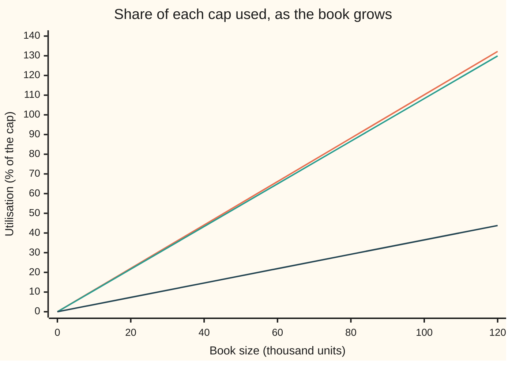
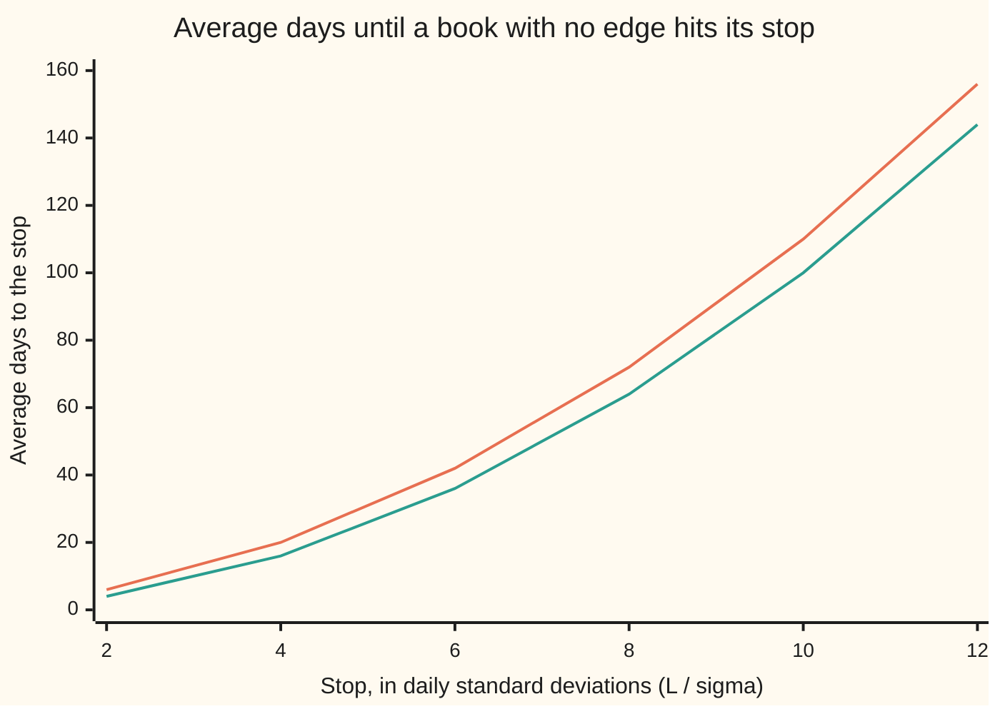

# Limits: notional, sensitivity, VaR and drawdown limits, and the appetite statement behind them

[Syllabus](../../../SYLLABUS.md) → [Financial mathematics](../README.md) → [Hedging, Volatility Forecasts and Stress](../README.md#s40) → Limits

---

## General Overview

A trading desk has $50 million of the firm's capital set against it. Its book holds 75,000 units. One unit is one Acme share, bought at $100, plus one one-year call on Acme, sold at the house market for $9.23 (strike $100, riskless rate 5 percent, dividend yield 2 percent, volatility 20 percent). The sold calls pay the desk a premium and give away the upside above $100. The shares carry the downside in full.

The firm writes one rule first. If the book ever falls 3 percent of capital below its best point so far, $1,500,000, the desk stops adding risk and cuts. That rule is a **stop-loss**, and the fall from the best point is the **drawdown**. A stop-loss acts after the money is gone. So the firm also watches five gauges that predict loss before it happens, and gives each a cap, called a **limit**: the book's gross size in dollars, its sensitivity to Acme's price, its sensitivity to volatility, its loss in a named disaster, and its loss on a bad ordinary day.

The document that says why those caps exist is the **risk appetite statement**. It sits in a ladder of three layers. **Risk capacity** is the most the firm could lose and survive. **Risk appetite** is the part of that it chooses to risk. **Limits** turn the appetite into numbers a trader sees before each trade. This card builds all five limits from the one 3 percent stop, then shows which one stops the book first, and what happens to every gauge on a day Acme falls 20 percent.

**Write down the most the book may lose, derive a cap for each gauge from that one number, and the book may grow only until the first gauge reaches its cap.**

**What kind of fact this is:** a method: the caps are choices a firm makes, not laws. Two theorems sit inside it, both proved on this card in Why it works: the first-to-bind rule for sizing, and the square law that turns a stop into a cap on daily risk.

### The picture: three gauges as the book grows

Each gauge reads as a percentage of its own cap, called **utilisation**. At 100 percent the limit **binds**: one more unit breaches it.



Orange: the delta limit (sensitivity to Acme's price). Teal: the stress limit (loss in the named disaster). Dark: the VaR limit (loss on a bad ordinary day). Every line is straight and starts at zero, so the steepest one crosses 100 percent first. Delta and stress cross between 80,000 and 100,000 units, close together. VaR is nowhere near: a book of sold options looks small on ordinary days. The notional and vega lines, omitted, lie between teal and dark.

---

## The formula

Notation first, in words. The gauges are numbered by a letter $j$. Gauge $j$ reads $x_j$ and has cap $b_j$. A gauge's **utilisation** is its reading over its cap, and its **headroom** is the cap minus the reading. For a book of $q$ identical units, $a_j$ is the reading one unit adds.

$$u_j = \frac{x_j}{b_j}, \qquad h_j = b_j - x_j, \qquad q^* = \min_j \frac{b_j}{a_j}$$

**Read it aloud:** divide each cap by what one unit uses of it; the smallest answer is the largest book allowed, and the gauge that gives it is the binding limit.

To add units to a book already holding some, the same rule runs on headroom: the most that can be added is the smallest $h_j / a_j$.

The stop becomes a cap on daily risk through a second formula. Write $D$ for the drawdown, $\sigma_d$ for the standard deviation of one day's profit and loss (its typical size), and $\tau_L$ for the number of days until the drawdown first reaches the stop $L$. The symbol $\mathbb{E}$ means the average over all the ways the future could go. Write $m$ for the firm's patience, the fewest days the stop should take to reach by chance, and $z$ = 2.3263 for the 99 percent point of the bell curve in standard deviations. For a book with no edge (an average daily profit of zero),

$$\mathbb{E}[\tau_L] = \left(\frac{L}{\sigma_d}\right)^2 \quad\text{days}, \qquad\text{so}\qquad b_{\text{VaR}} = z\,\frac{L}{\sqrt{m}}$$

**Read it aloud:** a book with no edge reaches its stop, on average, after the square of the stop counted in daily standard deviations; to wait at least $m$ days, cap one-day VaR at $z$ times the stop divided by the square root of $m$.

Here VaR, **value at risk**, is the one-day loss exceeded on one day in a hundred ([Value at risk](../39-Value%20at%20Risk%20and%20Expected%20Shortfall/01-profit-and-loss-distribution-and-var.md)). For a bell-shaped day it equals $z\,\sigma_d$. Conventions verified 2026-09-28: VaR at 99 percent over one trading day, 252 trading days a year.

| Symbol | Plain meaning | In our example | Push it up and the answer… |
| --- | --- | --- | --- |
| $C$, $L$ | capital set against the desk; the stop, the largest drawdown allowed, 3% of $C$ | $50,000,000; $1,500,000 | every cap derived from them rises |
| $D$ | drawdown: the fall in the book's value from its highest point so far | $300,000 before the shock | less of the stop is left |
| $j$, $x_j$, $b_j$ | a gauge, its reading, its cap | delta gauge, cap $37,500 per 1% move | a higher cap binds later |
| $u_j$, $h_j$ | utilisation (reading over cap) and headroom (cap minus reading) | delta today: 82.63% used | nearer to binding |
| $a_j$ | reading added by one unit | stress: $16.2387 per unit | that gauge binds at a smaller book |
| $q$, $q^*$ | book size in units; the largest size inside every cap | 75,000 held; 90,766 allowed | every reading rises in step |
| $\sigma_d$ | standard deviation of one day's profit and loss | $41,189.41 for today's book | the stop comes sooner, as a square |
| $\tau_L$ | days until the drawdown first reaches $L$ | 1,326 on average today | — |
| $m$ | patience: the fewest days, on average, the stop should take to reach by chance | 100 | the VaR cap falls as one over its square root |
| $z$ | the 99% point of the bell curve, in standard deviations | 2.3263 | the VaR cap rises |
| $n$ | the stop counted in daily standard deviations, $L / \sigma_d$ | 10 at the VaR cap before rounding | days to the stop grow as its square |
| $k$, $E_k$, $A$, $M$ | used only in the folded proof: a drawdown counted in coin steps, the average days to the stop from it, a constant to be found, coin tosses per day | 110 days from drawdown 0 when the stop is 10 steps | — |

### When it holds

- **Every gauge scales with size.** Double every position and each reading doubles. True of notional, delta, vega, a fixed-scenario loss and VaR. If the new trade is a different product, the readings do not add, and the whole book must be re-measured: VaR of two books can exceed the sum of their VaRs ([Expected shortfall](../39-Value%20at%20Risk%20and%20Expected%20Shortfall/05-expected-shortfall-and-coherence.md)).
- **Readings at today's market.** Every $a_j$ is measured now. After a shock the per-unit readings change, and a book that fitted can breach with no trade at all (the shock day below).
- **No edge, for the square law.** If the desk earns a steady positive return, the stop comes later than $(L/\sigma_d)^2$ days; if it bleeds, sooner. The formula is a yardstick for patience, not a forecast.
- **A bell-shaped day, for the VaR cap.** VaR equals $z\,\sigma_d$ only when the day's result is close to bell-shaped. With fat tails, VaR$/z$ misstates $\sigma_d$, and one large day can cross the stop at once.

---

## Why it works

### Step 0: one number, spent five ways

The stop is the appetite in its purest form: a dollar amount the firm has agreed to lose before acting. Every limit is a forecast of how fast some kind of risk could spend that dollar amount. So each cap is written as a fraction of the stop, and the fraction says how much of the stop that kind of risk may claim.

### Step 1: every gauge scales with the book

Take the book of 75,000 units and double it. Twice the shares and twice the sold calls: every price change is twice as large, in every state of the market. So the delta, the vega and the loss in any fixed scenario all double. VaR doubles too: if every possible loss doubles, the loss exceeded one day in a hundred doubles, because doubling keeps losses in the same order. A measure with this property, reading three times as much for three times the book and so on for any positive multiple, is called **positively homogeneous**.

### Step 2: the first gauge to fill decides the size

With $q$ units, gauge $j$ reads $q\,a_j$. The book is inside that limit when $q\,a_j \le b_j$, that is, when $q \le b_j / a_j$. Inside every limit means inside each one, so $q$ must be at most every ratio at once, and the largest such $q$ is the smallest ratio. That is $q^* = \min_j b_j/a_j$.

The ratios on this book are 100,000.0 units for notional, 90,766.3 for delta, 131,922.1 for vega, 92,372.2 for stress and 273,948.6 for VaR. Delta binds first. The book may hold 90,766 units.

### Step 3: the drawdown and the square law

The **drawdown** is $D$ = (the book's highest value so far) minus (its current value). It never goes below zero, and it resets to zero at each new high.

Start with a model a coin can play. Each day the book makes or loses exactly $\sigma_d$, with even odds. Count the stop in those steps: $L = n\,\sigma_d$. The drawdown then moves on the whole numbers 0 to $n$. From 0, a winning day makes a new high and leaves it at 0; a losing day takes it to 1. Anywhere else it moves one step down on a win and one step up on a loss.

The average number of days to reach $n$ from 0 turns out to be exactly $n(n+1)$. At $n$ = 10 that is 110 days. A simulation of 20,000 such books gives 110.42.

<details>
<summary>Detailed proof</summary>

Let $E_k$ be the average number of days to reach $n$ starting from drawdown $k$. At the stop, $E_n = 0$. From 0, one day passes and the drawdown is 0 or 1 with even odds: $E_0 = 1 + \tfrac12 E_0 + \tfrac12 E_1$, so $E_0 = 2 + E_1$. From any $k$ between 1 and $n - 1$: $E_k = 1 + \tfrac12 E_{k-1} + \tfrac12 E_{k+1}$.

Try $E_k = A - k^2 - k$. Then $\tfrac12 (E_{k-1} + E_{k+1}) - E_k = -\tfrac12\big((k-1)^2 + (k+1)^2 - 2k^2\big) - \tfrac12\big((k-1) + (k+1) - 2k\big) = -1$, which is the middle equation. At the bottom, $E_0 - E_1 = A - (A - 2) = 2$, which is the first. The last fixes $A$: $0 = A - n^2 - n$, so $A = n(n+1)$ and $E_0 = n(n+1)$. The equations have only this solution: the difference of two solutions would satisfy the same equations with the 1s removed, forcing it to be a straight line that is flat at 0 and zero at $n$, hence zero everywhere.

Now split each day into $M$ smaller coin tosses of size $\sigma_d / \sqrt{M}$, which keeps the day's standard deviation at $\sigma_d$. The stop is now $n\sqrt{M}$ steps, the count is $n\sqrt{M}\,(n\sqrt{M} + 1)$ tosses, and each toss is $1/M$ of a day. That is $n^2 + n/\sqrt{M}$ days, which falls to $n^2$ as the tosses get finer. In the limit the book's value wanders as Brownian motion, and $\mathbb{E}[\tau_L] = (L/\sigma_d)^2$. Taylor (1975) proved the formula for Brownian motion directly, drift included.

</details>

The count is a square, not a line. A stop ten daily standard deviations away is not ten bad days away. On average it is about a hundred ordinary days away, because good days keep resetting the high and bad days partly undo each other.



Orange: the coin-toss book, $n(n+1)$ days. Teal: the Brownian limit, $n^2$ days.

### Step 4: from the stop to a VaR cap

The firm chooses its patience: a book with no edge should take at least $m$ = 100 trading days, on average, to hit the stop by chance alone. The square law says this needs $(L/\sigma_d)^2 \ge m$, that is, $\sigma_d \le L/\sqrt{m}$, one tenth of the stop. For a bell-shaped day, VaR is $z\,\sigma_d$. So the VaR cap is $z L/\sqrt{m}$ = 2.3263 × 1,500,000 / 10 = $348,952.18, which the policy rounds to $350,000.

### Step 5: from the stop to the other caps

The remaining caps are fractions of the stop, each with a stated reason.

- **Stress:** the named disaster (Acme down 20 percent, volatility up 15 points, from [Stress tests](05-scenario-grids-and-stress-tests.md)) may cost at most the whole stop: cap $1,500,000.
- **Delta:** Acme's price alone, over the disaster's 20 percent fall, may spend at most half the stop, $750,000. That is $750,000 / 20 = $37,500 per 1 percent move.
- **Vega:** volatility alone, over the disaster's 15 points, may spend at most half the stop: $750,000 / 15 = $50,000 per volatility point.
- **Notional:** a cap on size that uses no model at all, so a broken pricing model cannot hide a huge book: 40 percent of capital, $20,000,000 of shares at market plus calls at strike.

The appetite statement, in the words a board would sign: *The desk may lose at most 3 percent of its capital from its high-water mark before it stops adding risk and reduces. No named severe scenario may cost more than that stop. No single market factor may spend more than half of it in that scenario. Ordinary daily risk must leave the stop at least 100 trading days away for a book with no edge. Gross size is capped at 40 percent of capital whatever the models say.*

The Financial Stability Board's 2013 principles set out the capacity, appetite and limits ladder, and require limits to be forward-looking and tested under stress. They prescribe no numbers: the 3 percent and every fraction above are this desk's choices.

<details>
<summary>Why cap Greeks at all, when stress already covers the disaster?</summary>

The stress limit tests one scenario. A book can pass it and still be very exposed to a different move: say, Acme up 20 percent with volatility down. The delta and vega caps bound the book in every direction at once, at the cost of being cruder. Each limit covers a blind spot of another.

</details>

A second road to Step 3 runs through Grossman and Zhou (1993), who ask how a fund should invest to never breach a drawdown floor at all. Their answer, to scale risk down as the drawdown grows, is the continuous version of the stress rule in The usual mistake below.

---

## Worked numbers, by hand

| Step | Arithmetic | Value |
| --- | --- | --- |
| stop | 3% × $50,000,000 | $1,500,000 |
| VaR cap | 2.3263 × $1,500,000 / √100, rounded | $350,000 |
| delta, vega caps | $750,000 / 20; $750,000 / 15 | $37,500; $50,000 |
| stress per unit | share falls $20; the sold call falls from $9.2270 to $5.4657 (Acme $80, volatility 35%) | $16.2387 lost |
| delta per unit | a 1% rise in Acme: the share gains $1, the sold call gives part of it back | $0.413149 per 1% |
| binding sizes | $37,500 / 0.413149; $1,500,000 / 16.2387 | 90,766.3; 92,372.2 |
| largest book | smallest of five ratios | **90,766 units, delta binds** |

The desk holds 75,000 units and may grow to at most 90,766. A proposed trade to 95,000 units is refused: it would use 104.66 percent of the delta cap and 102.84 percent of the stress cap.

### What breaks if you drop a piece

| Mistake | Comes out at | What went wrong |
| --- | --- | --- |
| stress loss estimated from delta and vega only | $13.9482 per unit, allowing 107,541.1 units | ignores gamma: the sold calls' delta shrinks as Acme falls, so the shares take more of the fall |
| notional measured net: shares minus calls | $0.00 per unit | the calls offset the shares on paper; the notional limit never binds |
| patience counted as a line, $L/\sigma_d$ days | VaR cap $34,895.22 | ten times too tight: the stop is $n^2$ days away, not $n$ |
| drawdown measured from the start, not the high: up $600,000, then down $1,700,000 | $1,100,000 lost, stop not hit | the drawdown is $1,700,000: the stop was hit |

---

## How it moves: the shock day

The book sat inside every limit. Then Acme fell 20 percent and volatility rose 15 points in one day. No one traded. Two limits broke anyway.

| Gauge | Today, 75,000 units | Proposed, 95,000 units | After the shock, 75,000 units |
| --- | --- | --- | --- |
| notional | 75.00% | 95.00% | 67.50% |
| delta | 82.63% | **104.66%** | **104.62%** |
| vega | 56.85% | 72.01% | 43.71% |
| stress | 81.19% | **102.84%** | 74.18% |
| VaR | 27.38% | 34.68% | 58.54% |
| stop (drawdown) | 20.00% | — | **101.19%** |

**The stop.** The book was already $300,000 below its high, 20.00 percent of the stop. The shock cost $1,217,899.35. The drawdown is now $1,517,899.35, 101.19 percent of the stop. The desk stops adding risk and reduces.

**Delta.** Each unit's delta was $0.413149 per 1 percent. At Acme $80 and volatility 35 percent, the sold calls move less with Acme, so they offset less of the shares and each unit's delta rises to $0.5231. Utilisation jumps from 82.63 to 104.62 percent with no trade: the desk must sell shares or sell more calls.

**VaR.** Each unit's one-day VaR more than doubles, from $1.2776 to $2.7321: volatility is higher and the book is more exposed to Acme. Utilisation 58.54 percent, still inside.

**Stress, rerun.** The same disaster applied from the new market (Acme to $64, volatility to 50 percent) uses 74.18 percent of the cap. The notional falls because the shares are worth less.

Utilisation, each █ = 5 percent of that gauge's cap:

```
today, 75,000 units
notional  ███████████████          75.00%
delta     █████████████████        82.63%
vega      ███████████              56.85%
stress    ████████████████         81.19%
VaR       █████                    27.38%
stop      ████                     20.00%

after the shock
notional  ██████████████           67.50%
delta     █████████████████████   104.62%
vega      █████████                43.71%
stress    ███████████████          74.18%
VaR       ████████████             58.54%
stop      ████████████████████    101.19%
```

The stress limit had warned of this day. Before the shock it read 81.19 percent of the stop, and 20.00 percent of the stop was already spent: together, more than the whole. Measured against the stop still left, $1,200,000, the stress loss used 101.49 percent. That is the design flaw The usual mistake names.

---

## Code, from first principles, and it actually runs

The code prices the house call with its own normal distribution function, builds the five caps from the stop, and measures each gauge per unit. It then reaches each answer by independent roads: delta and vega by formula and by nudging the price; the stress loss by the pricing formula and by integrating the call's payoff; one-day VaR by the exact 1 percent quantile and by 40,000 simulated days drawn from its own random numbers; the largest book by the min rule and by growing the book one unit at a time; and days to the stop by the exact count $n(n+1)$, by 20,000 simulated coin-toss books, and by the Brownian limit $n^2$. It ends with the shock day and the wrong answers from the table above.

### Python

```python
# Risk limits and the appetite behind them -- the check behind the card.
# Standard library only.  Every number quoted on the card is printed here.
# Book: long Acme shares, each hedged by one sold one-year call (house market).  Roads: Greeks
# by formula and by bumping; VaR by the exact quantile and by 40,000 simulated days; largest size
# by the min rule and by a scan; days to the stop by exact count, simulation and square law.
from math import sqrt, exp, log, cos, pi
S0, K, r, q, SIG, T = 100.0, 100.0, 0.05, 0.02, 0.20, 1.0
DT = 1.0 / 252.0                                      # one trading day, in years
def N(x):                                             # normal CDF, Marsaglia's positive series
    if x < 0: return 1.0 - N(-x)
    t, s, i = x, x, 1
    while t > 1e-17 * s:
        t *= x * x / (2 * i + 1); s += t; i += 1
    return 0.5 + s * exp(-0.5 * x * x) / sqrt(2.0 * pi)
def phi(x): return exp(-0.5 * x * x) / sqrt(2.0 * pi)
def call(S, sig):
    d1 = (log(S / K) + (r - q + 0.5 * sig * sig) * T) / (sig * sqrt(T))
    return S * exp(-q * T) * N(d1) - K * exp(-r * T) * N(d1 - sig * sqrt(T)), d1
def call_int(S, sig, n=4000):                         # road 2: Simpson on the discounted payoff
    g = lambda z: max(S * exp((r - q - 0.5 * sig * sig) * T + sig * sqrt(T) * z) - K, 0.0) * phi(z)
    return exp(-r * T) * 20.0 / n / 3 * sum((1 if i in (0, n) else 4 if i % 2 else 2) * g(-10.0 + 20.0 * i / n) for i in range(n + 1))
def unit(S, sig): return S - call(S, sig)[0]          # one share minus one sold call
def delta_pct(S, sig):                                # $ per 1% spot move, per unit, formula
    return (1.0 - exp(-q * T) * N(call(S, sig)[1])) * S * 0.01
def vega_pt(S, sig):                                  # $ per vol point, per unit (short call)
    return -S * exp(-q * T) * phi(call(S, sig)[1]) * sqrt(T) * 0.01
def z_low(p):                                         # N(z) = p by bisection
    lo, hi = -10.0, 10.0
    for _ in range(200):
        mid = 0.5 * (lo + hi)
        if N(mid) < p: lo = mid
        else: hi = mid
    return 0.5 * (lo + hi)

Z01 = z_low(0.01)
def var_exact(S, sig):                                # unit value rises with S, so the 1% spot
    s1 = S * exp(-0.5 * sig * sig * DT + Z01 * sig * sqrt(DT))   # quantile gives the 1% loss
    return unit(S, sig) - unit(s1, sig)

class Rng:                                            # xorshift64 and Box-Muller
    def __init__(self, seed): self.x = seed
    def u(self):
        x = self.x
        x ^= (x << 13) & 0xFFFFFFFFFFFFFFFF; x ^= x >> 7; x ^= (x << 17) & 0xFFFFFFFFFFFFFFFF
        self.x = x
        return ((x >> 11) + 0.5) / 2.0 ** 53
    def z(self): return sqrt(-2.0 * log(self.u())) * cos(2.0 * pi * self.u())

def var_mc(S, sig, n, rng):
    v0 = unit(S, sig)
    losses = sorted(v0 - unit(S * exp(-0.5 * sig * sig * DT + sig * sqrt(DT) * rng.z()), sig) for _ in range(n))
    return losses[int(0.99 * n) - 1]

# ---- the appetite, and the caps derived from it ----
CAP, STOP_FRAC, PATIENCE = 50e6, 0.03, 100            # capital, stop as share of capital, days
L = STOP_FRAC * CAP
caps = {"notional": 0.40 * CAP, "delta": L / 2 / 20, "vega": L / 2 / 15, "stress": L,
        "VaR": round(-Z01 * L / sqrt(PATIENCE), -4)}

# ---- per-unit measures at today's market ----
c0, h = call(S0, SIG)[0], 1e-4
d_bump = (unit(S0 + h, SIG) - unit(S0 - h, SIG)) / (2 * h) * S0 * 0.01
v_bump = (unit(S0, SIG + h) - unit(S0, SIG - h)) / (2 * h) * 0.01
stress = unit(S0, SIG) - unit(80.0, 0.35)             # loss per unit, -20% spot, +15 vol points
per = {"notional": S0 + K, "delta": delta_pct(S0, SIG), "vega": abs(vega_pt(S0, SIG)),
       "stress": stress, "VaR": var_exact(S0, SIG)}
v_mc = var_mc(S0, SIG, 40000, Rng(88172645463325252))
stress_int = (S0 - call_int(S0, SIG)) - (80.0 - call_int(80.0, 0.35))
bind = {k: caps[k] / per[k] for k in caps}
qstar = min(bind.values())
scan = 0                                              # road 2: grow the book one unit at a time
while all((scan + 1) * per[k] <= caps[k] for k in caps): scan += 1

def show(name, v, fmt="{:>16.4f}"): print(f"{name:<40}" + fmt.format(v))
show("house call C(100, 20%)", c0); show("stop L = 3% of capital", L, "{:>16.2f}")
show("z, 1% point of the bell curve", Z01); show("VaR cap before rounding, z L / 10", -Z01 * L / sqrt(PATIENCE), "{:>16.2f}")
show("half the stop, L/2", L / 2, "{:>16.2f}")
for k in caps: show(f"cap {k}", caps[k], "{:>16.2f}")
show("unit delta $/1%: formula, bump", per["delta"], "{:>16.6f}" + f"{d_bump:>12.6f}")
show("unit vega $/pt: formula, bump", vega_pt(S0, SIG), "{:>16.6f}" + f"{v_bump:>12.6f}")
show("unit stress loss: formula, integral", stress, "{:>16.4f}" + f"{stress_int:>12.4f}"); show("call after shock C(80, 35%)", call(80.0, 0.35)[0])
show("unit VaR99: exact, 40,000 days", per["VaR"], "{:>16.4f}" + f"{v_mc:>12.4f}")
for k in caps: show(f"binding size, {k}", bind[k], "{:>16.1f}")
show("largest size: min rule, scan", qstar, "{:>16.1f}" + f"{scan:>12d}")

# ---- scenario A: a proposed trade from 75,000 to 95,000 units; scenario B: the shock day ----
Q0, QNEW, DD0 = 75000, 95000, 300000.0
post = {"notional": 80.0 + K, "delta": delta_pct(80.0, 0.35), "vega": abs(vega_pt(80.0, 0.35)),
        "stress": unit(80.0, 0.35) - unit(64.0, 0.50), "VaR": var_exact(80.0, 0.35)}
print("utilisation %          today   proposed   after shock")
for k in caps:
    print(f"  {k:<18}{100 * Q0 * per[k] / caps[k]:>9.2f}{100 * QNEW * per[k] / caps[k]:>11.2f}{100 * Q0 * post[k] / caps[k]:>14.2f}")
loss_b = Q0 * stress
show("shock loss, drawdown after", loss_b, "{:>16.2f}" + f"{DD0 + loss_b:>12.2f}")
show("stop utilisation %: before, after", 100 * DD0 / L, "{:>16.2f}" + f"{100 * (DD0 + loss_b) / L:>12.2f}")
show("stop left L - D; stress use of it %", L - DD0, "{:>16.2f}" + f"{100 * loss_b / (L - DD0):>12.2f}")
show("post-shock unit delta $/1%", post["delta"]); show("post-shock unit VaR99", post["VaR"])

# ---- what breaks ----
taylor = -(per["delta"] * -20 + vega_pt(S0, SIG) * 15)   # delta and vega only
show("wrong: stress by delta+vega, per unit", taylor); show("  its binding size", L / taylor, "{:>16.1f}")
show("wrong: net notional per unit", S0 - K, "{:>16.2f}")
show("wrong: patience linear, VaR cap", -Z01 * L / PATIENCE, "{:>16.2f}")
path = [600000.0, -1700000.0]; eq = [0.0]; [eq.append(eq[-1] + p) for p in path]
show("path: loss from start, from peak", -eq[-1], "{:>16.2f}" + f"{max(eq) - eq[-1]:>12.2f}")

# ---- days to the stop: coin walk, simulation, Brownian square law ----
def coin_exact(n): return n * (n + 1)
def coin_mc(n, paths, rng):
    tot = 0
    for _ in range(paths):
        d, t = 0, 0
        while d < n:
            t += 1; d = max(0, d - 1) if rng.u() < 0.5 else d + 1
        tot += t
    return tot / paths
mc10 = coin_mc(10, 20000, Rng(2463534242))
sd_now = Q0 * per["VaR"] / -Z01                      # daily sd implied by today's VaR
show("L/sigma = 10: coin walk, exact days", coin_exact(10), "{:>16.0f}")
show("L/sigma = 10: coin walk, 20,000 walks", mc10, "{:>16.2f}")
show("L/sigma = 10: Brownian (L/sigma)^2", 10 ** 2, "{:>16.0f}")
show("book today: VaR99", Q0 * per["VaR"], "{:>16.2f}"); show("book today: daily sd = VaR/2.3263", sd_now, "{:>16.2f}")
show("book today: L/sigma, Brownian days", L / sd_now, "{:>16.2f}" + f"{(L / sd_now) ** 2:>12.0f}")
print("chart, size (thousand units)  " + " ".join(f"{s:>7d}" for s in range(0, 121, 20)))
for k in caps:
    print(f"chart, {k:<23}" + " ".join(f"{100 * s * 1000 * per[k] / caps[k]:>7.2f}" for s in range(0, 121, 20)))
print("chart, L/sigma               " + " ".join(f"{n:>5d}" for n in range(2, 13, 2)))
print("chart, coin n(n+1)           " + " ".join(f"{coin_exact(n):>5d}" for n in range(2, 13, 2)))
print("chart, Brownian n^2          " + " ".join(f"{n * n:>5d}" for n in range(2, 13, 2)))

assert abs(c0 - 9.227005508154) < 1e-9, "house call from another card"
assert abs(d_bump - per["delta"]) < 1e-6, "delta: bump vs formula"
assert abs(v_bump - vega_pt(S0, SIG)) < 1e-6, "vega: bump vs formula"
assert abs(stress_int - stress) < 1e-4, "stress: integral vs formula"
assert min(bind, key=bind.get) == "delta", "delta binds first"
assert DD0 + loss_b > L, "the shock day breaches the stop"
assert abs(v_mc - per["VaR"]) < 0.03 * per["VaR"], "VaR: simulation vs exact quantile"
assert scan == int(qstar), "largest size: scan vs min rule"
assert abs(mc10 - coin_exact(10)) < 3.0, "days to stop: simulation vs exact count"
print("ALL CHECKS PASS")
```

**Ran 2026-09-28 on macOS, Python 3.14.6, standard library only. All checks passed. Output, pasted from the run:**

```
house call C(100, 20%)                            9.2270
stop L = 3% of capital                        1500000.00
z, 1% point of the bell curve                    -2.3263
VaR cap before rounding, z L / 10              348952.18
half the stop, L/2                             750000.00
cap notional                                 20000000.00
cap delta                                       37500.00
cap vega                                        50000.00
cap stress                                    1500000.00
cap VaR                                        350000.00
unit delta $/1%: formula, bump                  0.413149    0.413149
unit vega $/pt: formula, bump                  -0.379012   -0.379012
unit stress loss: formula, integral              16.2387     16.2387
call after shock C(80, 35%)                       5.4657
unit VaR99: exact, 40,000 days                    1.2776      1.2595
binding size, notional                          100000.0
binding size, delta                              90766.3
binding size, vega                              131922.1
binding size, stress                             92372.2
binding size, VaR                               273948.6
largest size: min rule, scan                     90766.3       90766
utilisation %          today   proposed   after shock
  notional              75.00      95.00         67.50
  delta                 82.63     104.66        104.62
  vega                  56.85      72.01         43.71
  stress                81.19     102.84         74.18
  VaR                   27.38      34.68         58.54
shock loss, drawdown after                    1217899.35  1517899.35
stop utilisation %: before, after                  20.00      101.19
stop left L - D; stress use of it %           1200000.00      101.49
post-shock unit delta $/1%                        0.5231
post-shock unit VaR99                             2.7321
wrong: stress by delta+vega, per unit            13.9482
  its binding size                              107541.1
wrong: net notional per unit                        0.00
wrong: patience linear, VaR cap                 34895.22
path: loss from start, from peak              1100000.00  1700000.00
L/sigma = 10: coin walk, exact days                  110
L/sigma = 10: coin walk, 20,000 walks             110.42
L/sigma = 10: Brownian (L/sigma)^2                   100
book today: VaR99                               95820.91
book today: daily sd = VaR/2.3263               41189.41
book today: L/sigma, Brownian days                 36.42        1326
chart, size (thousand units)        0      20      40      60      80     100     120
chart, notional                  0.00   20.00   40.00   60.00   80.00  100.00  120.00
chart, delta                     0.00   22.03   44.07   66.10   88.14  110.17  132.21
chart, vega                      0.00   15.16   30.32   45.48   60.64   75.80   90.96
chart, stress                    0.00   21.65   43.30   64.95   86.61  108.26  129.91
chart, VaR                       0.00    7.30   14.60   21.90   29.20   36.50   43.80
chart, L/sigma                   2     4     6     8    10    12
chart, coin n(n+1)               6    20    42    72   110   156
chart, Brownian n^2              4    16    36    64   100   144
ALL CHECKS PASS
```

### Rust

```rust
// Risk limits and the appetite behind them -- the check behind the card.  Rust std only.
// Book: long Acme shares, each hedged by one sold one-year call (house market).  Roads: Greeks
// by formula and by bumping; VaR by the exact quantile and by 40,000 simulated days; largest size
// by the min rule and by a scan; days to the stop by exact count, simulation and square law.
use std::f64::consts::PI;

const S0: f64 = 100.0;
const K: f64 = 100.0;
const R: f64 = 0.05;
const Q: f64 = 0.02;
const SIG: f64 = 0.20;
const T: f64 = 1.0;
const DT: f64 = 1.0 / 252.0; // one trading day, in years
const NAMES: [&str; 5] = ["notional", "delta", "vega", "stress", "VaR"];

fn n_cdf(x: f64) -> f64 { // normal CDF, Marsaglia's positive series
    if x < 0.0 { return 1.0 - n_cdf(-x); }
    let (mut t, mut s, mut i) = (x, x, 1.0);
    while t > 1e-17 * s { t *= x * x / (2.0 * i + 1.0); s += t; i += 1.0; }
    0.5 + s * (-0.5 * x * x).exp() / (2.0 * PI).sqrt()
}
fn phi(x: f64) -> f64 { (-0.5 * x * x).exp() / (2.0 * PI).sqrt() }
fn call(s: f64, sig: f64) -> (f64, f64) {
    let d1 = ((s / K).ln() + (R - Q + 0.5 * sig * sig) * T) / (sig * T.sqrt());
    (s * (-Q * T).exp() * n_cdf(d1) - K * (-R * T).exp() * n_cdf(d1 - sig * T.sqrt()), d1)
}
fn call_int(s: f64, sig: f64) -> f64 { // road 2: Simpson on the discounted payoff
    let n = 4000;
    let g = |z: f64| (s * ((R - Q - 0.5 * sig * sig) * T + sig * T.sqrt() * z).exp() - K).max(0.0) * phi(z);
    let w = |i: usize| if i == 0 || i == n { 1.0 } else if i % 2 == 1 { 4.0 } else { 2.0 };
    (-R * T).exp() * 20.0 / n as f64 / 3.0 * (0..=n).map(|i| w(i) * g(-10.0 + 20.0 * i as f64 / n as f64)).sum::<f64>()
}
fn unit(s: f64, sig: f64) -> f64 { s - call(s, sig).0 } // one share minus one sold call
fn delta_pct(s: f64, sig: f64) -> f64 { (1.0 - (-Q * T).exp() * n_cdf(call(s, sig).1)) * s * 0.01 }
fn vega_pt(s: f64, sig: f64) -> f64 { -s * (-Q * T).exp() * phi(call(s, sig).1) * T.sqrt() * 0.01 }
fn z_low(p: f64) -> f64 { // N(z) = p by bisection
    let (mut lo, mut hi) = (-10.0, 10.0);
    for _ in 0..200 {
        let mid = 0.5 * (lo + hi);
        if n_cdf(mid) < p { lo = mid; } else { hi = mid; }
    }
    0.5 * (lo + hi)
}
fn var_exact(s: f64, sig: f64, z01: f64) -> f64 { // unit value rises with S: 1% spot quantile
    let s1 = s * (-0.5 * sig * sig * DT + z01 * sig * DT.sqrt()).exp();
    unit(s, sig) - unit(s1, sig)
}
struct Rng { x: u64 } // xorshift64 and Box-Muller
impl Rng {
    fn u(&mut self) -> f64 {
        let mut x = self.x;
        x ^= x << 13; x ^= x >> 7; x ^= x << 17;
        self.x = x;
        ((x >> 11) as f64 + 0.5) / 2f64.powi(53)
    }
    fn z(&mut self) -> f64 { (-2.0 * self.u().ln()).sqrt() * (2.0 * PI * self.u()).cos() }
}
fn var_mc(s: f64, sig: f64, n: usize, rng: &mut Rng) -> f64 {
    let v0 = unit(s, sig);
    let mut losses: Vec<f64> = (0..n)
        .map(|_| v0 - unit(s * (-0.5 * sig * sig * DT + sig * DT.sqrt() * rng.z()).exp(), sig))
        .collect();
    losses.sort_by(|a, b| a.partial_cmp(b).unwrap());
    losses[(0.99 * n as f64) as usize - 1]
}
fn coin_exact(n: u64) -> u64 { n * (n + 1) }
fn coin_mc(n: i64, paths: usize, rng: &mut Rng) -> f64 {
    let mut tot: u64 = 0;
    for _ in 0..paths {
        let (mut d, mut t) = (0i64, 0u64);
        while d < n { t += 1; d = if rng.u() < 0.5 { 0.max(d - 1) } else { d + 1 }; }
        tot += t;
    }
    tot as f64 / paths as f64
}
fn show(name: &str, v: String) { println!("{:<40}{}", name, v); }
fn f(v: f64, p: usize) -> String { format!("{:>16.*}", p, v) }

fn main() {
    let z01 = z_low(0.01);
    // ---- the appetite, and the caps derived from it ----
    let (cap, stop_frac, patience) = (50e6, 0.03, 100.0);
    let l = stop_frac * cap;
    let caps = [0.40 * cap, l / 2.0 / 20.0, l / 2.0 / 15.0, l, (-z01 * l / f64::sqrt(patience) / 1e4).round() * 1e4];
    // ---- per-unit measures at today's market ----
    let c0 = call(S0, SIG).0;
    let h = 1e-4;
    let d_bump = (unit(S0 + h, SIG) - unit(S0 - h, SIG)) / (2.0 * h) * S0 * 0.01;
    let v_bump = (unit(S0, SIG + h) - unit(S0, SIG - h)) / (2.0 * h) * 0.01;
    let stress = unit(S0, SIG) - unit(80.0, 0.35); // loss per unit, -20% spot, +15 vol points
    let per = [S0 + K, delta_pct(S0, SIG), vega_pt(S0, SIG).abs(), stress, var_exact(S0, SIG, z01)];
    let v_mc = var_mc(S0, SIG, 40000, &mut Rng { x: 88172645463325252 });
    let stress_int = (S0 - call_int(S0, SIG)) - (80.0 - call_int(80.0, 0.35));
    let bind: Vec<f64> = (0..5).map(|k| caps[k] / per[k]).collect();
    let qstar = bind.iter().cloned().fold(f64::INFINITY, f64::min);
    let mut scan: u64 = 0; // road 2: grow the book one unit at a time
    while (0..5).all(|k| (scan + 1) as f64 * per[k] <= caps[k]) { scan += 1; }

    show("house call C(100, 20%)", f(c0, 4)); show("stop L = 3% of capital", f(l, 2));
    show("z, 1% point of the bell curve", f(z01, 4)); show("VaR cap before rounding, z L / 10", f(-z01 * l / f64::sqrt(patience), 2));
    show("half the stop, L/2", f(l / 2.0, 2));
    for k in 0..5 { show(&format!("cap {}", NAMES[k]), f(caps[k], 2)); }
    show("unit delta $/1%: formula, bump", format!("{:>16.6}{:>12.6}", per[1], d_bump));
    show("unit vega $/pt: formula, bump", format!("{:>16.6}{:>12.6}", vega_pt(S0, SIG), v_bump));
    show("unit stress loss: formula, integral", format!("{:>16.4}{:>12.4}", stress, stress_int)); show("call after shock C(80, 35%)", f(call(80.0, 0.35).0, 4));
    show("unit VaR99: exact, 40,000 days", format!("{:>16.4}{:>12.4}", per[4], v_mc));
    for k in 0..5 { show(&format!("binding size, {}", NAMES[k]), f(bind[k], 1)); }
    show("largest size: min rule, scan", format!("{:>16.1}{:>12}", qstar, scan));

    // ---- scenario A: a proposed trade from 75,000 to 95,000 units; scenario B: the shock day ----
    let (q0, qnew, dd0) = (75000.0, 95000.0, 300000.0);
    let post = [80.0 + K, delta_pct(80.0, 0.35), vega_pt(80.0, 0.35).abs(),
                unit(80.0, 0.35) - unit(64.0, 0.50), var_exact(80.0, 0.35, z01)];
    println!("utilisation %          today   proposed   after shock");
    for k in 0..5 {
        println!("  {:<18}{:>9.2}{:>11.2}{:>14.2}", NAMES[k], 100.0 * q0 * per[k] / caps[k],
                 100.0 * qnew * per[k] / caps[k], 100.0 * q0 * post[k] / caps[k]);
    }
    let loss_b = q0 * stress;
    show("shock loss, drawdown after", format!("{:>16.2}{:>12.2}", loss_b, dd0 + loss_b));
    show("stop utilisation %: before, after", format!("{:>16.2}{:>12.2}", 100.0 * dd0 / l, 100.0 * (dd0 + loss_b) / l));
    show("stop left L - D; stress use of it %", format!("{:>16.2}{:>12.2}", l - dd0, 100.0 * loss_b / (l - dd0)));
    show("post-shock unit delta $/1%", f(post[1], 4)); show("post-shock unit VaR99", f(post[4], 4));

    // ---- what breaks ----
    let taylor = -(per[1] * -20.0 + vega_pt(S0, SIG) * 15.0); // delta and vega only
    show("wrong: stress by delta+vega, per unit", f(taylor, 4)); show("  its binding size", f(l / taylor, 1));
    show("wrong: net notional per unit", f(S0 - K, 2));
    show("wrong: patience linear, VaR cap", f(-z01 * l / patience, 2));
    let mut eq = vec![0.0f64];
    for p in [600000.0, -1700000.0] { let last = *eq.last().unwrap(); eq.push(last + p); }
    let peak = eq.iter().cloned().fold(f64::NEG_INFINITY, f64::max);
    let last = *eq.last().unwrap();
    show("path: loss from start, from peak", format!("{:>16.2}{:>12.2}", -last, peak - last));

    // ---- days to the stop: coin walk, simulation, Brownian square law ----
    let mc10 = coin_mc(10, 20000, &mut Rng { x: 2463534242 });
    let sd_now = q0 * per[4] / -z01; // daily sd implied by today's VaR
    show("L/sigma = 10: coin walk, exact days", f(coin_exact(10) as f64, 0));
    show("L/sigma = 10: coin walk, 20,000 walks", f(mc10, 2));
    show("L/sigma = 10: Brownian (L/sigma)^2", f(100.0, 0));
    show("book today: VaR99", f(q0 * per[4], 2)); show("book today: daily sd = VaR/2.3263", f(sd_now, 2));
    show("book today: L/sigma, Brownian days", format!("{:>16.2}{:>12.0}", l / sd_now, (l / sd_now).powi(2)));
    let sizes: Vec<u64> = (0..=120).step_by(20).collect();
    println!("chart, size (thousand units)  {}", sizes.iter().map(|s| format!("{:>7}", s)).collect::<Vec<_>>().join(" "));
    for k in 0..5 {
        let row: Vec<String> = sizes.iter().map(|&s| format!("{:>7.2}", 100.0 * s as f64 * 1000.0 * per[k] / caps[k])).collect();
        println!("chart, {:<23}{}", NAMES[k], row.join(" "));
    }
    let ns: Vec<u64> = (2..=12).step_by(2).collect();
    let row = |g: &dyn Fn(u64) -> u64| ns.iter().map(|&n| format!("{:>5}", g(n))).collect::<Vec<_>>().join(" ");
    println!("chart, L/sigma               {}", row(&|n| n));
    println!("chart, coin n(n+1)           {}", row(&coin_exact));
    println!("chart, Brownian n^2          {}", row(&|n| n * n));

    assert!((c0 - 9.227005508154).abs() < 1e-9, "house call from another card");
    assert!((d_bump - per[1]).abs() < 1e-6, "delta: bump vs formula");
    assert!((v_bump - vega_pt(S0, SIG)).abs() < 1e-6, "vega: bump vs formula");
    assert!((stress_int - stress).abs() < 1e-4, "stress: integral vs formula");
    assert!((0..5).all(|k| bind[1] <= bind[k]), "delta binds first");
    assert!(dd0 + loss_b > l, "the shock day breaches the stop");
    assert!((v_mc - per[4]).abs() < 0.03 * per[4], "VaR: simulation vs exact quantile");
    assert!(scan == qstar as u64, "largest size: scan vs min rule");
    assert!((mc10 - coin_exact(10) as f64).abs() < 3.0, "days to stop: simulation vs exact count");
    println!("ALL CHECKS PASS");
}
```

**Ran 2026-09-28 on macOS, rustc 1.98.1, no crates. All checks passed. Output, pasted from the run:**

```
house call C(100, 20%)                            9.2270
stop L = 3% of capital                        1500000.00
z, 1% point of the bell curve                    -2.3263
VaR cap before rounding, z L / 10              348952.18
half the stop, L/2                             750000.00
cap notional                                 20000000.00
cap delta                                       37500.00
cap vega                                        50000.00
cap stress                                    1500000.00
cap VaR                                        350000.00
unit delta $/1%: formula, bump                  0.413149    0.413149
unit vega $/pt: formula, bump                  -0.379012   -0.379012
unit stress loss: formula, integral              16.2387     16.2387
call after shock C(80, 35%)                       5.4657
unit VaR99: exact, 40,000 days                    1.2776      1.2595
binding size, notional                          100000.0
binding size, delta                              90766.3
binding size, vega                              131922.1
binding size, stress                             92372.2
binding size, VaR                               273948.6
largest size: min rule, scan                     90766.3       90766
utilisation %          today   proposed   after shock
  notional              75.00      95.00         67.50
  delta                 82.63     104.66        104.62
  vega                  56.85      72.01         43.71
  stress                81.19     102.84         74.18
  VaR                   27.38      34.68         58.54
shock loss, drawdown after                    1217899.35  1517899.35
stop utilisation %: before, after                  20.00      101.19
stop left L - D; stress use of it %           1200000.00      101.49
post-shock unit delta $/1%                        0.5231
post-shock unit VaR99                             2.7321
wrong: stress by delta+vega, per unit            13.9482
  its binding size                              107541.1
wrong: net notional per unit                        0.00
wrong: patience linear, VaR cap                 34895.22
path: loss from start, from peak              1100000.00  1700000.00
L/sigma = 10: coin walk, exact days                  110
L/sigma = 10: coin walk, 20,000 walks             110.42
L/sigma = 10: Brownian (L/sigma)^2                   100
book today: VaR99                               95820.91
book today: daily sd = VaR/2.3263               41189.41
book today: L/sigma, Brownian days                 36.42        1326
chart, size (thousand units)        0      20      40      60      80     100     120
chart, notional                  0.00   20.00   40.00   60.00   80.00  100.00  120.00
chart, delta                     0.00   22.03   44.07   66.10   88.14  110.17  132.21
chart, vega                      0.00   15.16   30.32   45.48   60.64   75.80   90.96
chart, stress                    0.00   21.65   43.30   64.95   86.61  108.26  129.91
chart, VaR                       0.00    7.30   14.60   21.90   29.20   36.50   43.80
chart, L/sigma                   2     4     6     8    10    12
chart, coin n(n+1)               6    20    42    72   110   156
chart, Brownian n^2              4    16    36    64   100   144
ALL CHECKS PASS
```

The two outputs agree line for line: both programs use the same random-number rule and seeds, so the simulations draw the same numbers.

> [!TIP]
> **Try changing**
> - **Tighten the stop.** Guess first: with `STOP_FRAC = 0.02`, which limit binds? Every cap except notional shrinks by a third, so their binding sizes shrink by about a third (VaR's only roughly, because of rounding); delta still binds first, at two-thirds of 90,766.3 units.
> - **More patience.** Guess first: with `PATIENCE = 400`, what happens to the VaR cap? It roughly halves (the policy rounds it), since the cap goes as one over the square root of patience. VaR still binds last on this book.
> - **A smaller starting drawdown.** Guess first: with `DD0 = 200000`, does the shock day still trigger the stop? No: $200,000 plus the $1,217,899.35 shock loss stays under $1,500,000.
> - **A smaller book.** Guess first: does the stop still trigger if the book held 60,000 units? The shock loss scales with size, so it is four-fifths of $1,217,899.35; add the $300,000 already lost and the drawdown falls short of the stop.

---

## The usual mistake

> [!warning]
> **Setting each limit on its own, against the full stop, and never looking at the drawdown already spent.** Each cap was sized as if the book stood at its high. After a bad month it does not. Here the stress test read 81.19 percent and looked safe, while only $1,200,000 of the stop was left; the disaster would use 101.49 percent of that, and it did. The fix is to let the stress cap shrink with the drawdown: cap stress loss at $L - D$, not $L$.
>
> Smaller traps:
> - **Trusting VaR on a book of sold options.** VaR here reads 27.38 percent while stress reads 81.19 percent. Sold options lose little on ordinary days and a lot on rare ones; VaR only sees ordinary days.
> - **Netting notional.** Shares long and calls short net to $0.00 of notional per unit, so the one model-free limit stops working exactly when a model is wrong.
> - **Estimating stress from Greeks.** Delta and vega alone give $13.9482 per unit instead of $16.2387 and let the book grow to 107,541.1 units. Reprice the book in the scenario.
> - **Reading the stop as ten bad days away.** At $n$ = 10 daily standard deviations it is on average 110 days away for the coin book, 100 in the limit. The square matters in both directions: halve daily risk and the stop moves four times further off.

---

## Where you meet it in real life

- **Bank trading desks.** Every desk runs a limit sheet like the table above: gauge, cap, today's reading, owner. A breach goes to a named risk manager the same day, and the appetite statement says who may raise a cap.
- **Hedge funds and managed accounts.** Investors often write a drawdown stop into the fund's terms. The fund then sizes positions so its daily risk leaves the stop far away, the square law in practice.
- **Hedging after a shock.** The delta breach on the shock day is repaired with the tools of [Hedging three Greeks at once](02-delta-gamma-vega-hedging.md); the gauges themselves are summed across positions as in [Portfolio Greeks](01-portfolio-greeks-and-taylor-pnl.md).
- **VaR limits that move with the market.** The VaR gauge more than doubled after the shock because volatility rose. Which volatility forecast feeds it is the subject of [Tomorrow's volatility](04-volatility-forecasting-ewma-garch-and-realised.md).
- **Imperfect hedges.** A delta cap met with futures on an index rather than Acme itself leaves basis risk that no Greek limit sees: [Imperfect hedges](03-hedge-ratios-basis-risk-and-cross-hedging.md).

> **Say it back**
> The firm writes one number first: the most a desk may lose from its high before it stops, here 3 percent of capital. Every limit is a fraction of that stop, each guarding a different way to lose it. Because every gauge grows in step with the book, the largest book is the smallest cap-over-usage ratio, and that gauge binds. A stop $n$ daily standard deviations away takes about $n^2$ days to reach by chance, which turns the stop into a cap on daily risk. Limits are read at today's market, so a shock can breach them with no trade, and a stress cap should shrink as the drawdown grows.

---

## What this builds on

- [Stress tests](05-scenario-grids-and-stress-tests.md): the named disaster, 20 percent down and 15 volatility points up, and the habit of repricing a book fully in a scenario rather than trusting its Greeks.

## Where this goes next

- [Whose risk is it](../39-Value%20at%20Risk%20and%20Expected%20Shortfall/06-var-decomposition-euler-and-component-var.md): splitting one VaR cap among several desks, so that each desk's share adds up to the firm's.
- [Performance measures](../38-Performance%20and%20Multi-Period/01-sharpe-information-and-drawdown.md): drawdown measured on a real track record, with error bars.
- [Kelly](../36-Returns%20and%20Utility/05-kelly-criterion-and-growth.md): sizing a book to grow fastest, and why half that size is safer: sizing from the reward side rather than the loss side.
- [Market-risk capital](../48-Regulatory%20Capital%20in%20Outline/04-frtb-and-the-shift-to-expected-shortfall.md): the regulator's version of the VaR limit, and why it moved to the average loss beyond VaR.

---

## Sources

Verified 2026-09-28: every link below resolves to the publisher's page.

- Financial Stability Board. *Principles for an Effective Risk Appetite Framework*, 18 November 2013. [Publisher page](https://www.fsb.org/2013/11/r_131118/). The ladder of risk capacity, risk appetite, appetite statement and limits, and the requirement that limits be forward-looking and tested under stress. It sets no numbers.
- Taylor, Howard M. "A Stopped Brownian Motion Formula." *Annals of Probability* 3, no. 2 (1975): 234–246. [doi:10.1214/aop/1176996395](https://doi.org/10.1214/aop/1176996395). The time for a Brownian motion to fall a fixed distance below its running maximum, with drift; the square law is its no-drift case.
- Grossman, Sanford J., and Zhongquan Zhou. "Optimal Investment Strategies for Controlling Drawdowns." *Mathematical Finance* 3, no. 3 (1993): 241–276. [doi:10.1111/j.1467-9965.1993.tb00044.x](https://doi.org/10.1111/j.1467-9965.1993.tb00044.x). Investing so that a drawdown floor is never breached: risk shrinks as the drawdown grows.
- Artzner, Philippe, Freddy Delbaen, Jean-Marc Eber, and David Heath. "Coherent Measures of Risk." *Mathematical Finance* 9, no. 3 (1999): 203–228. [doi:10.1111/1467-9965.00068](https://doi.org/10.1111/1467-9965.00068). Positive homogeneity, the property behind the first-to-bind rule, and why VaR fails to add up across books.
