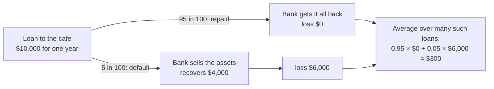
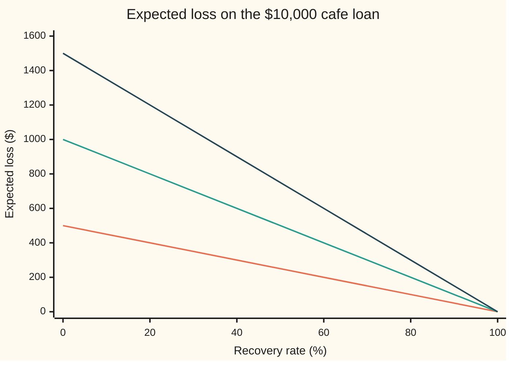

# Default probability, recovery and expected loss: the three numbers behind every credit loss

[Syllabus](../../../SYLLABUS.md) → [Financial mathematics](../README.md) → [Default, Survival and the Hazard Rate](../README.md#s41) → Default probability, recovery and expected loss

---

## General Overview

A bank lends a cafe $10,000 for one year. Most cafes repay. Some close. The bank's credit team puts the chance that this one fails to repay at 5 in 100.

If the cafe does fail, the money is not all gone. The bank sells the espresso machine, the ovens and the lease, and gets back 40 cents on each dollar owed. So a failure costs $6,000, not $10,000.

Three numbers settle what this loan costs the bank on average. How likely a failure is. How much of the money is lost when one happens. How much money is at stake. Multiply them: 5% of 60% of $10,000 is **$300**. That is the loan's expected loss: what the bank loses per loan, averaged over many loans like it.

From here on the three numbers carry their market names. A failure to pay is a **default**. Its chance is the **probability of default**, PD. The share of the money lost in a default is the **loss given default**, LGD; the share got back is the **recovery rate**, R, so LGD = 1 − R. The money at stake at the moment of default is the **exposure at default**, EAD.

The $300 does two more jobs. It says how much extra interest the loan must charge: about 3% of the loan, because $300 is 3% of $10,000. And it runs backwards. A lender that knows the average loss and two of the three numbers can recover the third: a 9% expected-loss rate at 40% recovery means a 15% chance of default.

**Expected loss is the chance of default times the fraction lost in a default times the amount at stake, and a lender who only needs to break even on average charges that loss, as a rate, on top of the riskless rate.**

**What kind of fact this is:** a theorem, proved on this card in Why it works, built on three definitions (PD, LGD, EAD); the fair-interest step adds a model: the lender asks only to break even on average.

### The picture: the two ways the year can end



Two outcomes, each with its chance and its loss. The expected loss is their weighted average.

---

## The formula

$$\text{EL} = \text{PD} \times \text{LGD} \times \text{EAD}, \qquad \text{LGD} = 1 - R$$

**Read it aloud:** the average loss is the chance of default, times the fraction lost if it happens, times the money at stake when it happens.

Divide both sides by the exposure and the loss becomes a rate, the **expected-loss rate** $\ell$:

$$\ell = \frac{\text{EL}}{\text{EAD}} = \text{PD} \times \text{LGD}$$

A one-year loan that charges an interest rate $y$ must, on average, return what a riskless loan at rate $r$ returns. The fair loan rate and the extra interest it carries, the **credit spread** $s$, are

$$(1 + y)(1 - \ell) = 1 + r, \qquad s = y - r = \frac{(1 + r)\,\ell}{1 - \ell} \approx \ell .$$

| Symbol | Plain meaning | In our example | Push it up and the answer… |
| --- | --- | --- | --- |
| $\text{PD}$ | probability of default: the chance the borrower fails to pay within the year | 5% | EL rises in proportion |
| $R$ | recovery rate: the fraction of what is owed that the lender gets back after a default | 40% | EL falls |
| $\text{LGD}$ | loss given default, $1 - R$: the fraction lost after a default | 60% | EL rises in proportion |
| $\text{EAD}$ | exposure at default: the money owed at the moment of default | $10,000 | EL rises in proportion |
| $\text{EL}$ | expected loss: the average loss per loan, in dollars | $300 | |
| $\ell$ | expected-loss rate, EL as a fraction of EAD | 3% | the fair spread rises |
| $I$ | default switch: 1 if the borrower defaults, 0 if not | 0 or 1 | |
| $G$, $G_k$ | the fraction lost in a particular default (in state $k$); LGD is its average over defaults | 30% to 90% in the simulation | |
| $k$, $w_k$ | a possible state of the world at year end, and its chance (used in the Detailed proof) | good year 80%, bad year 20% | |
| $r$ | riskless rate for the year, paid by a borrower who cannot default | 5% | the fair loan rate rises slightly more than one for one, and the spread a little |
| $y$ | the fair loan rate the cafe pays | 8.25% | |
| $s$ | credit spread, $y - r$: the extra interest for the risk of default | 3.25% | |

Here $r$ and $y$ are simple annual rates, since the loan lasts exactly one year and pays once.

### When it holds

- **LGD is the average loss among the loans that default.** Then $\text{EL} = \text{PD} \times \text{LGD} \times \text{EAD}$ is exact, with no further assumption. If LGD is instead averaged over good and bad years alike while bad years bring both more defaults and poorer recoveries, the product understates the loss: $250 instead of $300 in the two-kind-of-year example below.
- **EAD is one known number.** A term loan fixes it. A credit line the cafe draws down as trouble builds does not: exposure rises just before default, and a fixed EAD taken from a calm month is too low. The exposure path is the business of [Counterparty exposure](../46-Counterparty%20Risk%20and%20CVA/01-counterparty-exposure-and-netting.md).
- **One period.** PD here is the chance of default within the year. Over several years the chance piles up, and when default happens starts to matter for discounting; [The hazard rate](02-hazard-rate-and-survival-probability.md) handles that.
- **The fair-rate step assumes a lender who asks only to break even on average.** Real lenders also charge for the swings around the average, for funding and for costs, so market spreads sit above $\ell$. The swings are the subject of [Expected and unexpected loss](../48-Regulatory%20Capital%20in%20Outline/01-expected-versus-unexpected-loss.md).
- **Recovery is a fraction of everything owed, interest included.** If recovery applies only to the $10,000 principal, the fair-rate formula shifts slightly; the expected-loss formula does not change.

---

## Why it works

### Step 0: a loss is a switch times a size

A loan's loss this year is zero if the borrower pays, and some amount if not. Write it as a product of two pieces: a switch that says whether default happened, and the size of the loss if it did. The average of a product of a switch and a size is the switch's chance times the size's average over the cases where the switch is on. That one fact is the whole formula.

### Step 1: write the loss down

Let $I$ be the default switch: $I = 1$ if the cafe defaults, $I = 0$ if not. Let $G$ be the fraction lost in that default: 60% on average, but it varies from one failed cafe to another. The dollar loss is

$$\text{Loss} = I \times G \times \text{EAD}.$$

When the cafe pays, $I = 0$ and the loss is zero, whatever $G$ would have been. When it defaults, the loss is $G \times \$10{,}000$.

### Step 2: take the average

An average, or **expectation** (the probability-weighted mean of all outcomes), is taken over the two cases. In the no-default case the loss is 0, with chance 0.95. In the default case it is $G \times \text{EAD}$, with chance 0.05, and $G$ averages to LGD across those defaults. So

$$\text{EL} = 0.95 \times 0 + 0.05 \times \text{LGD} \times \text{EAD} = \text{PD} \times \text{LGD} \times \text{EAD}.$$

For the cafe: $0.05 \times 0.60 \times 10{,}000 = 300$.

The only care needed is in the phrase "averages to LGD across those defaults". LGD must be the average of $G$ over the defaults, not over all years or all borrowers. When defaults and poor recoveries arrive together, those two averages differ, and only the first gives the right answer.

<details>
<summary>Detailed proof</summary>

Let the world end the year in one of finitely many states $k$, with chances $w_k$ summing to 1. In state $k$ the borrower defaults ($I_k = 1$) or not ($I_k = 0$), and loses a fraction $G_k$ if it does. The loss in state $k$ is $I_k G_k \,\text{EAD}$, so
$$\text{EL} = \text{EAD} \sum_k w_k I_k G_k .$$
Define $\text{PD} = \sum_k w_k I_k$, the total chance of the default states, and $\text{LGD} = \sum_k w_k I_k G_k \,/\, \text{PD}$, the average of $G$ over the default states, each weighted by its chance. Substituting, $\text{EL} = \text{PD} \times \text{LGD} \times \text{EAD}$, exactly. No independence is needed. Independence of $I$ and $G$ is what makes the default-weighted average of $G$ equal to its plain average; without it the two can differ. The same argument with integrals in place of sums covers a smoothly varying $G$.

</details>

### Step 3: turn the loss into interest

The cafe owes $(1 + y) \times \$10{,}000$ at year end. With chance $1 - \text{PD}$ it pays all of it. With chance PD the bank recovers $R$ of it. The bank's average receipt is

$$(1 + y)\,\text{EAD}\,\big[(1 - \text{PD}) + \text{PD}\,R\big] = (1 + y)\,\text{EAD}\,(1 - \text{PD}\times\text{LGD}) = (1 + y)\,\text{EAD}\,(1 - \ell).$$

A lender who wants only to match a riskless loan sets that equal to $(1 + r)\,\text{EAD}$. Dividing out the exposure gives $(1 + y)(1 - \ell) = 1 + r$. Solve for the spread:

$$s = y - r = \frac{1 + r}{1 - \ell} - 1 - r = \frac{(1 + r)\,\ell}{1 - \ell}.$$

When $\ell$ and $r$ are small, the fraction is close to $\ell$ itself. That is why the spread is "about the expected-loss rate". For the cafe the exact spread is 3.25%, a little above 3%, for two reasons: default also destroys part of the interest, and the lost money would have earned $r$.

### Step 4: run it backwards

The formula is a product, so it is **linear** in each of the three numbers: double one and the loss doubles. That settles every back-solve.

- **Existence and uniqueness.** Given EL and any two of PD, LGD, EAD, the third is EL divided by the product of the other two. One division, one answer, whenever the other two are nonzero.
- **Boundary: a zero factor.** If PD is 0, EL is 0 for every LGD: a zero EL fits every LGD, a positive EL fits none. The same holds for any zero factor.
- **Boundary: an answer outside the possible range.** PD and LGD are fractions, so they must land between 0 and 1. A 9% expected-loss rate at 95% recovery asks for $\text{PD} = 0.09 / 0.05 = 1.8$: a 180% chance of default. No such loan exists; the inputs contradict each other.

Inside those limits, the 9% loss rate at 40% recovery gives $\text{PD} = 0.09 / 0.60 = 0.15$. The picture below shows why the answer is unique: each line is straight and never flat, so it crosses any height at most once.



Bottom line: default chance 5%. Middle: 10%. Top: 15%. At 40% recovery the three lines read $300, $600 and $900: a 9% loss rate on $10,000 is the $900 on the top line, the 15% default chance.

### The other route

Here the chance of default is handed over as one number for one year. Markets usually quote it the other way round: a default rate per unit time, the **hazard rate**, from which the chance over any horizon follows. [The hazard rate](02-hazard-rate-and-survival-probability.md) builds that, and [Simulating a default time](05-simulating-a-default-time.md) draws default times from it.

---

## Worked numbers, by hand

The cafe: $\text{EAD} = \$10{,}000$, $\text{PD} = 5\%$, $R = 40\%$, riskless rate $r = 5\%$.

| Step | Arithmetic | Value |
| --- | --- | --- |
| loss given default | $1 - 0.40$ | $0.60$ |
| loss if the cafe defaults | $0.60 \times 10{,}000$ | $\$6{,}000$ |
| recovered if it defaults | $0.40 \times 10{,}000$ | $\$4{,}000$ |
| expected-loss rate $\ell$ | $0.05 \times 0.60$ | $0.03$ |
| **expected loss** | $0.03 \times 10{,}000$ | **$\$300$** |
| fair loan rate $y$ | $1.05 / 0.97 - 1$ | $8.25\%$ |
| **credit spread** $s$ | $8.25\% - 5\%$ | **$3.25\%$** |
| spread if the riskless rate were 0 | $1 / 0.97 - 1$ | $3.09\%$ |
| back-solve: PD from a 9% loss rate at $R = 40\%$ | $0.09 / 0.60$ | $15\%$ |
| back-solve: LGD from EL $\$300$ | $300 / (0.05 \times 10{,}000)$ | $60\%$ |
| back-solve: EAD from EL $\$300$ | $300 / (0.05 \times 0.60)$ | $\$10{,}000$ |

A bank with many loans like this one expects to write off $300 per loan per year on average, and it covers that by charging each cafe 3.25 percentage points above the riskless rate.

### What breaks if you drop a piece

| Mistake | Comes out at | What went wrong |
| --- | --- | --- |
| Recovery used as the loss: $0.05 \times 0.40 \times 10{,}000$ | $200 | 40% is what comes back. The loss is the other 60%. |
| Chance of default left out | $6,000 | That is the loss if default is certain. It is the size of one bad outcome, not the average. |
| Recovery averaged over years, not over defaults | $250 (right: $300) | Bad years bring more defaults and worse recoveries together. Averaging over years gives recovery 50%; over defaults, 40%. |
| Spread set to $\ell$: charge 5% + 3% = 8% | $22.86 short per loan, in today's money | The spread must also cover the interest lost in default. The exact answer is 8.25%. |

The third row uses two kinds of year. Good years come 80% of the time, with a 2.5% default chance and 55% recovery. Bad years come 20% of the time, with a 15% default chance and 30% recovery. Overall PD is still 5%. Recovery averaged over years is 50%. Recovery averaged over the defaults themselves is 40%, because most defaults happen in bad years. The true expected loss is $300, and only the default-weighted recovery reproduces it.

---

## Code, from first principles, and it actually runs

Both programs reach the $300 three independent ways: the product formula; a list of every outcome with its chance and loss; and 400,000 simulated cafe loans drawn with a random-number generator written in the script, where each defaulted cafe recovers a random fraction between 10% and 70%. The fair rate and each back-solve are found twice, by the closed form and by a bisection root finder (halve an interval until it traps the answer) written in the script. The two-kind-of-year example, the what-breaks rows and every chart point are printed too.

### Python

```python
# Default probability, recovery and expected loss -- the check behind the card.
# Standard library only.  Every number quoted on the card is printed here.
# Roads to the expected loss: (1) the product PD x LGD x EAD, (2) listing every
# outcome with its chance, (3) lending to 400,000 simulated cafes with our own
# random numbers.  The fair rate and every back-solve are found twice: by the
# closed form and by a bisection root finder written below.
from math import exp, sqrt

def el(pd, lgd, ead): return pd * lgd * ead                 # road 1: the product

def el_by_outcomes(outcomes):                                 # road 2: sum of chance x loss
    return sum(chance * loss for chance, loss in outcomes)

class Rng:                                                    # 64-bit linear congruential generator
    def __init__(self, seed): self.x = seed
    def u(self):
        self.x = (6364136223846793005 * self.x + 1442695040888963407) % 2**64
        return (self.x >> 11) / 2.0**53                       # uniform on [0, 1)

def bisect(f, lo, hi, tol=1e-13):                             # root finder: f(lo), f(hi) differ in sign
    flo = f(lo)
    for _ in range(200):
        mid = 0.5 * (lo + hi); fm = f(mid)
        if (fm > 0) == (flo > 0): lo, flo = mid, fm
        else: hi = mid
        if hi - lo < tol: break
    return 0.5 * (lo + hi)

# ---- the cafe loan: $10,000 for one year, 5% chance of default, 40 cents back on the dollar ----
EAD, PD, R, r = 10000.0, 0.05, 0.40, 0.05
LGD = 1.0 - R
EL1 = el(PD, LGD, EAD)
EL2 = el_by_outcomes([(1 - PD, 0.0), (PD, EAD * (1 - R))])
rng, n, tot, tot2 = Rng(20260928), 400000, 0.0, 0.0
for _ in range(n):                                            # road 3: recovery varies, 10% to 70%, mean 40%
    loss = EAD * (1.0 - (0.10 + 0.60 * rng.u())) if rng.u() < PD else 0.0
    tot += loss; tot2 += loss * loss
EL3 = tot / n
se = sqrt((tot2 / n - EL3 * EL3) / n)

# ---- fair loan rate: (1 + y)(1 - PD LGD) = 1 + r, recovery on everything owed ----
ell = PD * LGD                                                # expected-loss rate
y_closed = (1 + r) / (1 - ell) - 1
pv = lambda y: ((1 - PD) * EAD * (1 + y) + PD * R * EAD * (1 + y)) / (1 + r) - EAD
y_root = bisect(pv, 0.0, 1.0)
y_zero = 1 / (1 - ell) - 1                                    # the same with a riskless rate of zero

# ---- back-solves: linear, so one answer when the other two are nonzero ----
pd_back = 0.09 / (1 - 0.40)
pd_root = bisect(lambda p: el(p, 0.60, 1.0) - 0.09, 0.0, 1.0)
lgd_back = 300.0 / (PD * EAD)
lgd_root = bisect(lambda g: el(PD, g, EAD) - 300.0, 0.0, 1.0)
ead_back = 300.0 / (PD * LGD)
ead_root = bisect(lambda a: el(PD, LGD, a) - 300.0, 0.0, 1e6)
pd_impossible = 0.09 / (1 - 0.95)                             # 9% loss rate at 95% recovery

# ---- two kinds of year: defaults and recoveries move together ----
states = [(0.8, 0.025, 0.55), (0.2, 0.15, 0.30)]              # (chance of year, PD, recovery)
pd_avg = sum(w * p for w, p, _ in states)
rec_year = sum(w * rc for w, _, rc in states)                 # recovery averaged over years
rec_dflt = sum(w * p * rc for w, p, rc in states) / pd_avg    # recovery averaged over defaults
el_true = el_by_outcomes([(w * p, EAD * (1 - rc)) for w, p, rc in states])
el_naive = el(pd_avg, 1 - rec_year, EAD)

# ---- what breaks ----
wrong_rec = el(PD, R, EAD)                                    # recovery used as the loss
wrong_nopd = el(1.0, LGD, EAD)                                # default treated as certain
short_8 = EAD * 1.08 * (1 - ell) / (1 + r) - EAD              # charge 5% + 3% flat
nw_pd5 = 1 - exp(-0.02 * 5)                                   # Northwind: 2% hazard, 5 years
nw_el = el(nw_pd5, 0.60, 100e6)

rows = [
    ("LGD = 1 - R", LGD), ("EL rate PD x LGD", ell),
    ("1 EL, product", EL1), ("2 EL, list the outcomes", EL2),
    ("3 EL, 400000 simulated cafes", EL3), ("  standard error", se),
    ("loss if default", EAD * LGD), ("recovered if default", EAD * R),
    ("fair rate, closed form", y_closed), ("fair rate, root finder", y_root),
    ("  spread over 5%", y_closed - r), ("  spread, riskless rate 0", y_zero),
    ("PD from 9% at R 40%", pd_back), ("  by root finder", pd_root),
    ("LGD from EL 300", lgd_back), ("  by root finder", lgd_root),
    ("EAD from EL 300", ead_back), ("  by root finder", ead_root),
    ("PD from 9% at R 95%", pd_impossible),
    ("two-state PD", pd_avg), ("  recovery, year-averaged", rec_year),
    ("  recovery, default-weighted", rec_dflt),
    ("  EL, true", el_true), ("  EL, year-averaged recovery", el_naive),
    ("wrong: recovery as the loss", wrong_rec), ("wrong: default certain", wrong_nopd),
    ("wrong: charge 8%, PV shortfall", short_8),
    ("Northwind 5y default chance", nw_pd5), ("Northwind 5y EL, undiscounted", nw_el),
    ("try: PD 10%", el(0.10, LGD, EAD)), ("try: R 0%", el(PD, 1.0, EAD)),
    ("try: fair rate, PD 20%", (1 + r) / (1 - 0.20 * LGD) - 1),
]
for name, v in rows:
    print(f"{name:<32} {v:>16.6f}")

print()
recs = [0.0, 0.2, 0.4, 0.6, 0.8, 1.0]
print(f"{'chart, recovery %':<22}" + "".join(f"{100 * x:>9.0f}" for x in recs))
for p in (0.05, 0.10, 0.15):
    print(f"{'chart, EL at PD ' + str(round(100 * p)) + '%':<22}" + "".join(f"{el(p, 1 - x, EAD):>9.2f}" for x in recs))

assert abs(EL1 - EL2) < 1e-9, "product vs list of outcomes"
assert abs(EL3 - EL1) < 4 * se, "simulation within four standard errors"
assert abs(y_root - y_closed) < 1e-10, "root finder vs closed-form fair rate"
assert abs(pd_root - 0.15) < 1e-10, "back-solved PD vs the card's 15%"
assert abs(lgd_root - lgd_back) < 1e-10 and abs(ead_root - ead_back) < 1e-6, "LGD, EAD back-solves"
assert abs(el_true - EL1) < 1e-9 and abs(rec_dflt - R) < 1e-12, "two kinds of year give the cafe's EL"
assert el_true - el_naive > 40.0, "year-averaged recovery must understate the loss"
print("ALL CHECKS PASS")
```

**Ran 2026-09-28 on macOS, Python 3.14.6, standard library only. All checks passed. Output, pasted from the run:**

```
LGD = 1 - R                              0.600000
EL rate PD x LGD                         0.030000
1 EL, product                          300.000000
2 EL, list the outcomes                300.000000
3 EL, 400000 simulated cafes           302.145848
  standard error                         2.163567
loss if default                       6000.000000
recovered if default                  4000.000000
fair rate, closed form                   0.082474
fair rate, root finder                   0.082474
  spread over 5%                         0.032474
  spread, riskless rate 0                0.030928
PD from 9% at R 40%                      0.150000
  by root finder                         0.150000
LGD from EL 300                          0.600000
  by root finder                         0.600000
EAD from EL 300                      10000.000000
  by root finder                     10000.000000
PD from 9% at R 95%                      1.800000
two-state PD                             0.050000
  recovery, year-averaged                0.500000
  recovery, default-weighted             0.400000
  EL, true                             300.000000
  EL, year-averaged recovery           250.000000
wrong: recovery as the loss            200.000000
wrong: default certain                6000.000000
wrong: charge 8%, PV shortfall         -22.857143
Northwind 5y default chance              0.095163
Northwind 5y EL, undiscounted      5709754.917842
try: PD 10%                            600.000000
try: R 0%                              500.000000
try: fair rate, PD 20%                   0.193182

chart, recovery %             0       20       40       60       80      100
chart, EL at PD 5%       500.00   400.00   300.00   200.00   100.00     0.00
chart, EL at PD 10%     1000.00   800.00   600.00   400.00   200.00     0.00
chart, EL at PD 15%     1500.00  1200.00   900.00   600.00   300.00     0.00
ALL CHECKS PASS
```

The product and the list of outcomes agree exactly. The simulation lands on $302.15, within one standard error ($2.16) of the formula, even though each failed cafe's recovery was random: only the average recovery over defaults enters the expected loss.

### Rust

Same roads, same inputs, same generator. No crates.

```rust
// Default probability, recovery and expected loss -- the same check in Rust.
// Standard library only, no crates.  Same roads: the product, the list of
// outcomes, a simulation with our own random numbers, and a bisection root
// finder for the fair rate and every back-solve.
// Compile: rustc --edition 2021 -O default_probability_recovery_and_expected_loss_check.rs

fn el(pd: f64, lgd: f64, ead: f64) -> f64 { pd * lgd * ead }                  // road 1

fn el_by_outcomes(outcomes: &[(f64, f64)]) -> f64 {                           // road 2
    outcomes.iter().map(|(chance, loss)| chance * loss).sum()
}

struct Rng { x: u64 }                                                          // 64-bit LCG
impl Rng {
    fn u(&mut self) -> f64 {
        self.x = self.x.wrapping_mul(6364136223846793005).wrapping_add(1442695040888963407);
        (self.x >> 11) as f64 / 9007199254740992.0                             // 2^53
    }
}

fn bisect<F: Fn(f64) -> f64>(f: F, mut lo: f64, mut hi: f64) -> f64 {
    let mut flo = f(lo);
    for _ in 0..200 {
        let mid = 0.5 * (lo + hi);
        let fm = f(mid);
        if (fm > 0.0) == (flo > 0.0) { lo = mid; flo = fm; } else { hi = mid; }
        if hi - lo < 1e-13 { break; }
    }
    0.5 * (lo + hi)
}

fn main() {
    let (ead, pd, rec, r) = (10000.0_f64, 0.05_f64, 0.40_f64, 0.05_f64);
    let lgd = 1.0 - rec;
    let el1 = el(pd, lgd, ead);
    let el2 = el_by_outcomes(&[(1.0 - pd, 0.0), (pd, ead * (1.0 - rec))]);
    let mut rng = Rng { x: 20260928 };
    let n = 400000;
    let (mut tot, mut tot2) = (0.0_f64, 0.0_f64);
    for _ in 0..n {                                   // road 3: recovery varies, 10% to 70%, mean 40%
        let loss = if rng.u() < pd { ead * (1.0 - (0.10 + 0.60 * rng.u())) } else { 0.0 };
        tot += loss;
        tot2 += loss * loss;
    }
    let el3 = tot / n as f64;
    let se = ((tot2 / n as f64 - el3 * el3) / n as f64).sqrt();

    // fair loan rate: (1 + y)(1 - PD LGD) = 1 + r, recovery on everything owed
    let ell = pd * lgd;
    let y_closed = (1.0 + r) / (1.0 - ell) - 1.0;
    let pv = |y: f64| ((1.0 - pd) * ead * (1.0 + y) + pd * rec * ead * (1.0 + y)) / (1.0 + r) - ead;
    let y_root = bisect(pv, 0.0, 1.0);
    let y_zero = 1.0 / (1.0 - ell) - 1.0;

    // back-solves
    let pd_back = 0.09 / (1.0 - 0.40);
    let pd_root = bisect(|p| el(p, 0.60, 1.0) - 0.09, 0.0, 1.0);
    let lgd_back = 300.0 / (pd * ead);
    let lgd_root = bisect(|g| el(pd, g, ead) - 300.0, 0.0, 1.0);
    let ead_back = 300.0 / (pd * lgd);
    let ead_root = bisect(|a| el(pd, lgd, a) - 300.0, 0.0, 1e6);
    let pd_impossible = 0.09 / (1.0 - 0.95);

    // two kinds of year: (chance of year, PD, recovery)
    let states = [(0.8_f64, 0.025_f64, 0.55_f64), (0.2, 0.15, 0.30)];
    let pd_avg: f64 = states.iter().map(|(w, p, _)| w * p).sum();
    let rec_year: f64 = states.iter().map(|(w, _, rc)| w * rc).sum();
    let rec_dflt: f64 = states.iter().map(|(w, p, rc)| w * p * rc).sum::<f64>() / pd_avg;
    let outs: Vec<(f64, f64)> = states.iter().map(|(w, p, rc)| (w * p, ead * (1.0 - rc))).collect();
    let el_true = el_by_outcomes(&outs);
    let el_naive = el(pd_avg, 1.0 - rec_year, ead);

    // what breaks
    let wrong_rec = el(pd, rec, ead);
    let wrong_nopd = el(1.0, lgd, ead);
    let short_8 = ead * 1.08 * (1.0 - ell) / (1.0 + r) - ead;
    let nw_pd5 = 1.0 - (-0.02_f64 * 5.0).exp();
    let nw_el = el(nw_pd5, 0.60, 100e6);

    let rows: Vec<(&str, f64)> = vec![
        ("LGD = 1 - R", lgd), ("EL rate PD x LGD", ell),
        ("1 EL, product", el1), ("2 EL, list the outcomes", el2),
        ("3 EL, 400000 simulated cafes", el3), ("  standard error", se),
        ("loss if default", ead * lgd), ("recovered if default", ead * rec),
        ("fair rate, closed form", y_closed), ("fair rate, root finder", y_root),
        ("  spread over 5%", y_closed - r), ("  spread, riskless rate 0", y_zero),
        ("PD from 9% at R 40%", pd_back), ("  by root finder", pd_root),
        ("LGD from EL 300", lgd_back), ("  by root finder", lgd_root),
        ("EAD from EL 300", ead_back), ("  by root finder", ead_root),
        ("PD from 9% at R 95%", pd_impossible),
        ("two-state PD", pd_avg), ("  recovery, year-averaged", rec_year),
        ("  recovery, default-weighted", rec_dflt),
        ("  EL, true", el_true), ("  EL, year-averaged recovery", el_naive),
        ("wrong: recovery as the loss", wrong_rec), ("wrong: default certain", wrong_nopd),
        ("wrong: charge 8%, PV shortfall", short_8),
        ("Northwind 5y default chance", nw_pd5), ("Northwind 5y EL, undiscounted", nw_el),
        ("try: PD 10%", el(0.10, lgd, ead)), ("try: R 0%", el(pd, 1.0, ead)),
        ("try: fair rate, PD 20%", (1.0 + r) / (1.0 - 0.20 * lgd) - 1.0),
    ];
    for (name, v) in &rows { println!("{:<32} {:>16.6}", name, v); }

    println!();
    let recs = [0.0_f64, 0.2, 0.4, 0.6, 0.8, 1.0];
    let mut head = format!("{:<22}", "chart, recovery %");
    for x in &recs { head.push_str(&format!("{:>9.0}", 100.0 * x)); }
    println!("{}", head);
    for p in [0.05_f64, 0.10, 0.15] {
        let mut line = format!("{:<22}", format!("chart, EL at PD {}%", (100.0 * p).round() as i64));
        for x in &recs { line.push_str(&format!("{:>9.2}", el(p, 1.0 - x, ead))); }
        println!("{}", line);
    }

    assert!((el1 - el2).abs() < 1e-9, "product vs list of outcomes");
    assert!((el3 - el1).abs() < 4.0 * se, "simulation within four standard errors");
    assert!((y_root - y_closed).abs() < 1e-10, "root finder vs closed-form fair rate");
    assert!((pd_root - 0.15).abs() < 1e-10, "back-solved PD vs the card's 15%");
    assert!((lgd_root - lgd_back).abs() < 1e-10 && (ead_root - ead_back).abs() < 1e-6, "LGD, EAD back-solves");
    assert!((el_true - el1).abs() < 1e-9 && (rec_dflt - rec).abs() < 1e-12, "two kinds of year give the cafe's EL");
    assert!(el_true - el_naive > 40.0, "year-averaged recovery must understate the loss");
    println!("ALL CHECKS PASS");
}
```

**Ran 2026-09-28 on macOS, rustc 1.98.1, no crates. All checks passed. Output, pasted from the run:**

```
LGD = 1 - R                              0.600000
EL rate PD x LGD                         0.030000
1 EL, product                          300.000000
2 EL, list the outcomes                300.000000
3 EL, 400000 simulated cafes           302.145848
  standard error                         2.163567
loss if default                       6000.000000
recovered if default                  4000.000000
fair rate, closed form                   0.082474
fair rate, root finder                   0.082474
  spread over 5%                         0.032474
  spread, riskless rate 0                0.030928
PD from 9% at R 40%                      0.150000
  by root finder                         0.150000
LGD from EL 300                          0.600000
  by root finder                         0.600000
EAD from EL 300                      10000.000000
  by root finder                     10000.000000
PD from 9% at R 95%                      1.800000
two-state PD                             0.050000
  recovery, year-averaged                0.500000
  recovery, default-weighted             0.400000
  EL, true                             300.000000
  EL, year-averaged recovery           250.000000
wrong: recovery as the loss            200.000000
wrong: default certain                6000.000000
wrong: charge 8%, PV shortfall         -22.857143
Northwind 5y default chance              0.095163
Northwind 5y EL, undiscounted      5709754.917842
try: PD 10%                            600.000000
try: R 0%                              500.000000
try: fair rate, PD 20%                   0.193182

chart, recovery %             0       20       40       60       80      100
chart, EL at PD 5%       500.00   400.00   300.00   200.00   100.00     0.00
chart, EL at PD 10%     1000.00   800.00   600.00   400.00   200.00     0.00
chart, EL at PD 15%     1500.00  1200.00   900.00   600.00   300.00     0.00
ALL CHECKS PASS
```

The two outputs agree line for line, including the simulated loss, because both programs use the same generator and the same seed.

> [!TIP]
> **Try changing**
> Guess first, then run.
> - **Double the default chance.** Set `PD` to 0.10 in the `try` row. Guess: the loss doubles. It does: **$600**. Linear in PD.
> - **Recover nothing.** Set recovery to 0. The loss rises from $300 to **$500**, not to $10,000: the 5% chance still stands in front.
> - **A much riskier cafe.** At a 20% default chance the fair loan rate is **19.32%**, well above 5% plus the loss rate. The gap between $\ell$ and the exact spread grows as $\ell$ grows.
> - **Change the seed.** Replace 20260928 with any other number. The simulated loss moves by a few dollars and stays within four standard errors of $300; the other roads do not move at all.

---

## The usual mistake

> [!warning]
> **Mixing up recovery and loss.** Recovery R is what comes back; loss given default is $1 - R$. A 40% recovery is a 60% loss. Plugging R where LGD belongs gives $200 for the cafe instead of $300, and the error grows as recovery falls.
>
> Smaller traps:
> - **Averaging recovery over the wrong population.** LGD is the average loss among defaulted loans. Averaged over all years it gives $250 instead of $300 in the two-kind-of-year example, because poor recoveries cluster in the years when defaults cluster.
> - **Taking EAD from a calm day.** A credit line is often drawn to its limit just before default. EAD is the balance at default, not today's balance.
> - **Setting the spread equal to the loss rate.** Charging 5% + 3% = 8% leaves the lender $22.86 short per loan in today's money. The exact fair rate is 8.25%.
> - **Reading a back-solved PD without a range check.** A 9% loss rate at 95% recovery back-solves to a 180% chance of default: the inputs are inconsistent, and the formula says so only if the answer is checked against 0 and 1.

---

## Where you meet it in real life

- **Loan pricing.** Banks price business loans, mortgages and card balances by first estimating PD, LGD and EAD, then adding the expected-loss rate, costs and a charge for risk to their funding rate.
- **Loss provisions.** Accounting rules for expected credit losses (IFRS 9 and the US CECL standard) ask lenders to set money aside in advance for losses computed from PD, LGD and EAD.
- **Bank capital.** The Basel rules let large banks supply their own PD, LGD and EAD estimates. Expected loss is covered by provisions and pricing; capital covers the swings above it, as [Expected and unexpected loss](../48-Regulatory%20Capital%20in%20Outline/01-expected-versus-unexpected-loss.md) explains.
- **Bond spreads and default insurance.** A corporate bond yields more than a government bond partly because of its expected loss. A credit default swap, a contract that pays the lost fraction of a bond if its issuer defaults, is priced on exactly PD times LGD, spread over time: [The credit default swap](../42-Credit%20Default%20Swaps%20-%20Pricing%2C%20the%20Par%20Spread%20and%20the%20Hazard%20Behind%20It/01-credit-default-swap-contract.md).
- **The shelf's shipping company.** Northwind Lines has $100m of bonds, a five-year default chance of 9.52% and 40% recovery. Its five-year expected loss, before discounting, is $0.0952 \times 0.60 \times \$100\text{m} = \$5.71\text{m}$. Where the 9.52% comes from is the hazard-rate card's job.
- **Ratings.** Agencies grade borrowers by default risk; [Rating transition matrices](04-rating-transition-matrix-and-cumulative-default-rates.md) turns grade-to-grade moves into a PD for each horizon.

> **Say it back**
> A credit loss has three parts: the chance of default, the fraction lost if it happens, and the money at stake. Their product is the expected loss, exactly, provided the fraction lost is averaged over the defaults themselves. For the $10,000 cafe loan with a 5% default chance and 40% recovery it is $300, a 3% loss rate. A lender who asks only to break even on average charges that rate on top of the riskless rate, a little more in fact: 3.25% here. Because the formula is a product, any one of the three numbers can be recovered from the loss and the other two, as long as the answer lands between 0 and 1.

---

## What this builds on

- [Percentages](../../01-Foundations/01-Everyday%20Arithmetic/10-percentages.md): a recovery of 40 cents on the dollar, a 5% chance, a 3% rate. Every input on this card is a percentage of something.
- [Discounting](../../01-Foundations/04-Compound%20Growth%20and%20Discounting/06-discounting-and-present-value.md): why the lender compares the loan's average repayment with $1 + r$, and why the 8% loan is $22.86 short in today's money.
- [Expectation](../../09-Probability%20and%20statistics/02-Random%20Variables/02-expectation.md): the probability-weighted average that Step 2 takes of the loss.

## Where this goes next

- [The hazard rate](02-hazard-rate-and-survival-probability.md): the default chance as a rate per year, so PD over any horizon follows.
- [The credit default swap](../42-Credit%20Default%20Swaps%20-%20Pricing%2C%20the%20Par%20Spread%20and%20the%20Hazard%20Behind%20It/01-credit-default-swap-contract.md): PD times LGD as a traded contract, paid over time.
- [Merton's model](../43-Structural%20Models%20-%20Default%20from%20the%20Balance%20Sheet/01-merton-model-equity-as-a-call.md): where a PD comes from if default means the assets falling below the debt.
- [Default correlation](../45-Portfolio%20Credit%20-%20Correlation%2C%20Copulas%2C%20Indices%20and%20Tranches/01-default-correlation-and-joint-default.md): many loans at once, when defaults arrive together.
- [Counterparty exposure](../46-Counterparty%20Risk%20and%20CVA/01-counterparty-exposure-and-netting.md): EAD as a path through time rather than one number.
- [Expected and unexpected loss](../48-Regulatory%20Capital%20in%20Outline/01-expected-versus-unexpected-loss.md): the swings around the $300, and the capital that absorbs them.

This card takes the one-year default chance as given; the open question is where that chance comes from and how it stretches over five years or thirty, which the hazard rate answers.

---

## Sources

Verified 2026-09-28: every link below resolves to the publisher's page.

- Basel Committee on Banking Supervision. *An Explanatory Note on the Basel II IRB Risk Weight Functions*. Bank for International Settlements, 2005. [Publisher page](https://www.bis.org/publications/explanatory-note-basel-ii-irb-risk-weight-functions). The regulator's own account of PD, LGD and EAD, and of expected loss as the part covered by pricing and provisions.
- Altman, Edward I., Brooks Brady, Andrea Resti, and Andrea Sironi. "The Link between Default and Recovery Rates: Theory, Empirical Evidence, and Implications." *Journal of Business* 78, no. 6 (2005): 2203–2228. [doi:10.1086/497044](https://doi.org/10.1086/497044). The evidence that recoveries fall when defaults rise: the two-kind-of-year example in data.
- Duffie, Darrell, and Kenneth J. Singleton. *Credit Risk: Pricing, Measurement, and Management*. Princeton University Press, 2003. [Publisher page](https://press.princeton.edu/books/hardcover/9780691090467/credit-risk). Default probability, recovery conventions and credit spreads in one place.
- Hull, John C. *Options, Futures, and Other Derivatives*, 11th ed. Pearson. [Publisher page](https://www.pearson.com/en-us/subject-catalog/p/options-futures-and-other-derivatives/P200000005938). The chapter on credit risk derives the spread as roughly the default rate times the loss given default.
