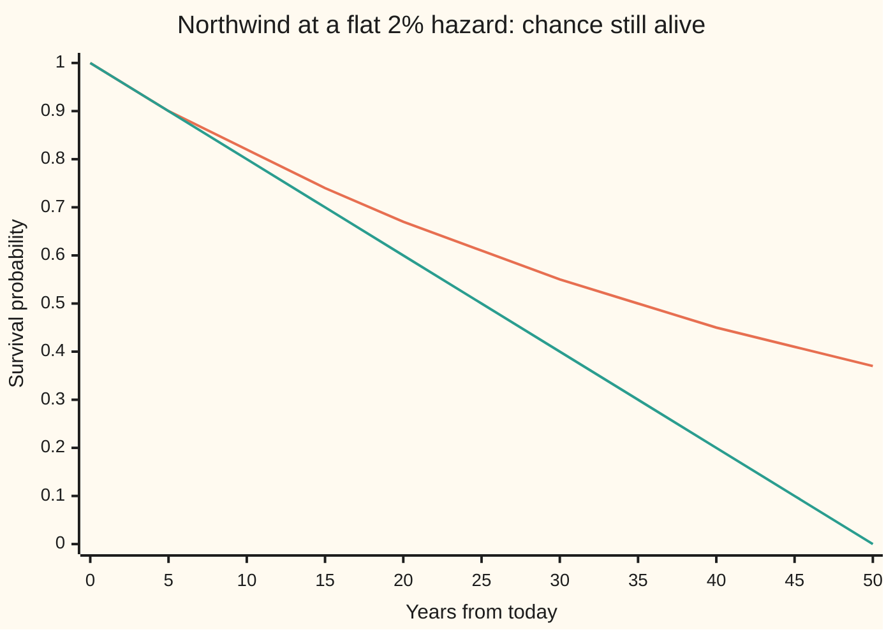
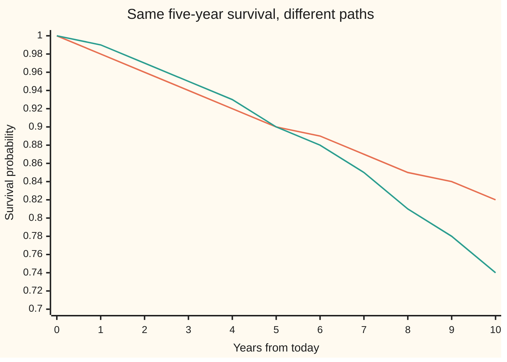

# The hazard rate: the chance of failing in the next instant given survival so far, and the survival curve it builds

[Syllabus](../../../SYLLABUS.md) → [Financial mathematics](../README.md) → [Default, Survival and the Hazard Rate](../README.md#s41) → The hazard rate

---

## General Overview

Northwind Lines is a shipping company with bonds outstanding. Lenders want one thing from a model of Northwind: the chance it is still paying them in one year, in five, in ten. The market's reading is that Northwind fails at a rate of 2% a year. On that reading it survives one year with probability 0.9802 and five years with probability 0.9048. The chance it defaults somewhere in the first five years is 9.52%, not the 10% that five times 2% suggests.

Start with a lump of carbon-14. Each atom has a fixed small chance of decaying in the next moment, and an atom that has sat untouched for a thousand years is no more likely to decay than a fresh one. Half the atoms are gone after 5,730 years, whatever their history. The rate per atom never changes; the pile shrinks because each moment removes a fixed fraction of whatever is left.

A company is not an atom, but credit markets borrow the same bookkeeping. The chance of failing in the next short stretch of time, given the company has not failed yet, divided by the length of that stretch, is called the **hazard rate** (also the **default intensity**). The hazard is a rate, like a speed: 2% a year means a chance of about 0.02/365, or 0.0055%, of failing tomorrow, for a company alive today. From the hazard, one multiplication per instant builds the **survival curve**: the chance the company is still alive at each future date.

**The hazard rate is the chance of failing in the next instant, per unit of time, counted only among survivors; multiplying the survive-this-instant chances together gives survival as e to the minus the area under the hazard, which for a flat hazard is $e^{-\lambda t}$.**

**What kind of fact this is:** a definition (the hazard rate), and a theorem that follows from it (survival is e to the minus the area under the hazard), proved on this card in Why it works. Treating a real company's hazard as a known number is a model, not a law.

### The picture: survival decays, it does not fall in a straight line



Orange, curved: the true survival curve at a flat 2% hazard. Green, straight: the mistake "survival = 1 − 2% × years". The two agree for a few years and then part. The straight line reaches zero at 50 years; the curve is still at 0.37 there, because each year takes 2% of a shrinking pool of survivors.

---

## The formula

Notation first, in words. The random date on which Northwind defaults is written $\tau$ (Greek "tau"). The chance of an event is written $P(\ldots)$, and a bar inside it means "given": $P(A \mid B)$ is the chance of A counting only the cases where B happens ([Conditional probability](../../09-Probability%20and%20statistics/01-Chance%20and%20Events/05-conditional-probability.md)). A short stretch of time is $\Delta t$ ("delta t").

The hazard at time $t$ is defined by

$$\lambda(t) \;=\; \lim_{\Delta t \to 0} \frac{P(t < \tau \le t + \Delta t \mid \tau > t)}{\Delta t}.$$

**Read it aloud:** the chance of defaulting in the next short stretch, counted only among companies still alive at t, divided by the stretch's length, as the stretch shrinks to nothing.

The survival curve it builds:

$$S(t) \;=\; P(\tau > t) \;=\; \exp\!\Big(-\int_0^t \lambda(u)\,du\Big) \;=\; e^{-\Lambda(t)}.$$

**Read it aloud:** the chance of still being alive at t is e raised to minus the total hazard piled up between now and t.

For a flat hazard, $\lambda(t) = \lambda$ at every date, the area is a rectangle, $\Lambda(t) = \lambda t$, and

$$S(t) = e^{-\lambda t}, \qquad P(\tau \le T) = 1 - e^{-\lambda T}, \qquad \lambda = -\frac{\ln S(T)}{T}.$$

**Read it aloud:** survival decays at the hazard rate; the default chance by T is what survival leaves; and a survival probability read from the market gives back the flat hazard by taking its log and dividing by the years.

| Symbol | Plain meaning | In our example | Push it up and the answer… |
| --- | --- | --- | --- |
| $\tau$ | the default date, a random number of years from today | unknown; mean 50, median 34.66 | — |
| $t$, $t_i$ | a date, in years from today; $t_i$ is a date inside slice i | 1, 3, 5 | survival falls |
| $T$ | the horizon of the question, in years | 5 | survival falls, default chance rises |
| $\lambda$ | the flat hazard, per year ("lambda") | 0.02 | survival falls at every date |
| $\lambda(t)$ | the hazard at date t, when it changes with time | 0.02 flat; 0.01 + 0.004t rising | survival falls from that date on |
| $\Delta t$ | the length of one short slice of time | 1 day = 1/365 year | the slice picture gets coarser |
| $n$ | the number of slices the horizon is cut into | 5, 60, 1825 | the slice product approaches the curve |
| $\Lambda(t)$ | the cumulative hazard: area under the hazard from 0 to t ("capital lambda") | 0.1 at 5 years | survival falls |
| $S(t)$ | survival probability: chance of no default by t | 0.9048 at 5 years | — |
| $1 - S(T)$ | default chance by T | 0.0952 | — |
| $P(A \mid B)$ | chance of A, counting only cases where B happens | P(default in year 3 given alive at 2) = 0.0198 | — |
| $e$, $\ln$ | the growth constant 2.71828… and its undo, the natural log | $e^{-0.1} = 0.9048$ | — |

A reminder on $e$ and $\ln$: $e^{x}$ is what continuous compounding at rate x for one period does to a dollar ([Compounding more often, and the number e](../../01-Foundations/04-Compound%20Growth%20and%20Discounting/04-compounding-frequency-and-e.md)), and $\ln$ undoes it: $\ln e^{x} = x$ ([Natural log and doubling time](../../01-Foundations/04-Compound%20Growth%20and%20Discounting/05-natural-log-and-doubling-time.md)). The integral sign $\int_0^t$ means the area under a curve between 0 and t ([The integral](../../06-Calculus%20and%20analysis/04-Integrals/01-riemann-integral.md)).

### When it holds

The hazard itself is a definition: any default date whose chances change smoothly over time has one. The survival formula is then a theorem. What can fail is the model around it.

- **Default is one event, and nothing comes back.** The formula counts the first default only. A company that restructures and later defaults again needs a different count.
- **The hazard is known in advance.** Here $\lambda(t)$ is a fixed curve. If it moves at random with the economy, survival is an average of $e^{-\Lambda}$ over the possible curves, which is not $e$ to the minus the average area; see [A random hazard](../44-Reduced-Form%20Models%20-%20Risky%20Bonds%2C%20Spreads%20and%20Random%20Hazards/03-stochastic-hazard-cox-process.md).
- **No sure-thing jump dates.** A company that defaults for certain if it misses a named bond payment has a lump of probability on one day and no finite hazard there. Smooth hazards cannot hold a lump.
- **Whose probability.** A hazard read from bond or swap prices is a pricing hazard. It includes what investors charge for carrying default risk, so it usually sits above the hazard seen in historical default counts. The mathematics is the same; the two numbers are not interchangeable.
- **A flat hazard is a choice.** The flat model forgets age: a firm alive at year 10 faces the same next five years as a fresh one. Real hazards drift. In the rising-hazard case below, a flat 2% fitted to the same five-year survival puts year-1 defaults at 1.98% against a true 1.19%.

---

## Why it works

### Step 0: survival is a chain of "and"s

Surviving five years means surviving today, and tomorrow, and every day after, up to year 5. The chance of a chain of "and"s is a product: survive the first day, then, counting only those still alive, survive the second, and so on. The hazard is exactly the ingredient each link needs, because it is defined among survivors. Multiply the links, let the slices shrink, and the product becomes an exponential. That is the whole proof; the steps below do it with numbers.

### Step 1: one slice

Cut the next five years into $n$ slices of length $\Delta t = T/n$. For a company alive at the start of a slice, the definition of the hazard says the chance of defaulting inside it is about $\lambda(t)\,\Delta t$. So the chance of getting through it is about $1 - \lambda(t)\,\Delta t$.

For Northwind and one-day slices: $\Delta t = 1/365$, and the chance of surviving one day, given alive this morning, is $1 - 0.02/365$.

### Step 2: multiply the slices

Surviving to T means surviving slice 1, then slice 2 given slice 1, and so on. The rule for chained "given"s ([Conditional probability](../../09-Probability%20and%20statistics/01-Chance%20and%20Events/05-conditional-probability.md)) multiplies them:

$$S(T) \approx (1 - \lambda\,\Delta t)^{n}.$$

With Northwind's flat 2% over five years:

| Slices $n$ | Slice | Product |
| --- | --- | --- |
| 5 | a year | 0.903921 |
| 60 | a month | 0.904762 |
| 1825 | a day | 0.904835 |
| 100000 | about 26 minutes | 0.904837 |

The products climb and settle. This is the compounding-frequency story run in reverse: interest compounded ever more often settles on $e^{rt}$; a loss of $\lambda\,\Delta t$ compounded ever more often settles on $e^{-\lambda t}$.

### Step 3: logs turn the product into an area

Take the natural log of the product. The log of a product is the sum of the logs, and for a small x, $\ln(1 - x)$ is very close to $-x$. So

$$\ln S(T) \approx \sum_{\text{slices}} -\lambda(t_i)\,\Delta t,$$

where $t_i$ is a date inside slice i. That sum is a stack of thin rectangles under the hazard curve: as the slices shrink it becomes the area $\Lambda(T)$. Undo the log and $S(T) = e^{-\Lambda(T)}$. For a flat 2% the area is a rectangle, 0.02 × 5 = 0.1, and $e^{-0.1} = 0.9048$.

<details>
<summary>Detailed proof</summary>

Write $S(t) = P(\tau > t)$ and assume it is smooth and positive. By the definition of conditional chance,
$$P(t < \tau \le t + \Delta t \mid \tau > t) = \frac{S(t) - S(t + \Delta t)}{S(t)}.$$
Divide by $\Delta t$ and let it shrink: $\lambda(t) = -S'(t)/S(t)$, where $S'$ is the slope of $S$. The right side is the slope of $-\ln S(t)$. So $-\ln S$ is a function whose slope is $\lambda$ and whose value at 0 is $-\ln 1 = 0$: it is the area $\int_0^t \lambda(u)\,du$. Undo the log: $S(t) = e^{-\Lambda(t)}$.

The slice argument gives the same answer with an error bound. For $0 \le x \le 1/2$, $-x - x^2 \le \ln(1 - x) \le -x$. With $x_i = \lambda(t_i)\,\Delta t$, the sum of logs differs from $-\sum x_i$ by at most $\sum x_i^2 \le (\max \lambda)^2 T\,\Delta t$, which goes to zero as the slices shrink. The sum $\sum x_i$ is a Riemann sum for the area, so the product converges to $e^{-\Lambda(T)}$.

**Inverting the flat case.** For $T > 0$, $e^{-\lambda T}$ is continuous and strictly falling in $\lambda$, from 1 at $\lambda = 0$ towards 0 as $\lambda$ grows. So each survival probability S with $0 < S \le 1$ comes from exactly one $\lambda \ge 0$, namely $\lambda = -\ln S / T$. At S = 1 that is 0. As S shrinks to 0 the answer grows without bound, and at S = 0 there is none: no finite rate kills every path by a fixed date. S above 1 or below 0 is not a probability, and a negative hazard would make survival grow, which it cannot.

</details>

### Step 4: read off any window

Defaulting between dates a and b means alive at a and not alive at b: $P(a < \tau \le b) = S(a) - S(b)$. Northwind's year 3 is $S(2) - S(3) = 0.960789 - 0.941765 = 0.019025$, or 1.90%.

The same number comes from the other end. The chance of dying in a thin slice near t, counted over all paths, is the hazard times the chance of being alive to face it: $\lambda(t)\,S(t)\,\Delta t$. Add those up over year 3 and the area under $\lambda S(t)$ from 2 to 3 is again 0.019025. That is why year 3 is below 2%: the 2% applies only to the 96% of paths still alive at year 2, and 0.960789 × 0.019801 = 0.019025. The 0.019801 is the conditional chance, $1 - e^{-0.02}$, of failing in year 3 given alive at the start of it.

### Step 5: the flat hazard forgets

With a flat hazard, the chance of surviving the next five years given alive at year 10 is

$$\frac{S(15)}{S(10)} = \frac{e^{-0.3}}{e^{-0.2}} = e^{-0.1} = 0.904837,$$

the same as for a brand-new company. This is **memorylessness**: having survived tells nothing about the future beyond the current hazard. Only the flat hazard has it, and it makes the default date follow the exponential distribution, with mean $1/\lambda$ = 50 years and median $\ln 2/\lambda$ = 34.66 years ([Exponential](../../09-Probability%20and%20statistics/04-Continuous%20Distributions/03-exponential-distribution.md)). The median is carbon-14's half-life in credit clothing: carbon-14's hazard is $\ln 2 / 5730$ = 0.000121 a year.

<details>
<summary>Why a rate, and not a probability per year?</summary>

A probability per year depends on how the year is cut. "2% a year, checked yearly" gives five-year survival $0.98^5 = 0.903921$; checked daily at the matching daily chance it gives 0.904835. A rate has no such choice built in: it is the limit all the cuttings approach. That is why the hazard is quoted as a rate, like the continuously compounded interest rate it mirrors, and why "Northwind's one-year default probability" (1.98%) and "Northwind's hazard" (2%) are different numbers.

</details>

The same default date can be drawn by computer, one company at a time, by inverting the survival curve; that road is [Simulating a default time](05-simulating-a-default-time.md).

---

## Worked numbers, by hand

Northwind: flat hazard $\lambda$ = 2% a year.

| Step | Arithmetic | Value |
| --- | --- | --- |
| area to 1 year | 0.02 × 1 | 0.02 |
| $S(1)$ | $e^{-0.02}$ | 0.9802 |
| area to 5 years | 0.02 × 5 | 0.1 |
| $S(5)$ | $e^{-0.1}$ | 0.9048 |
| default chance by 5 | 1 − 0.9048 | **9.52%** |
| $S(2)$, $S(3)$ | $e^{-0.04}$, $e^{-0.06}$ | 0.9608, 0.9418 |
| default in year 3 | 0.9608 − 0.9418 | **1.90%** |
| same, given alive at 2 | $1 - e^{-0.02}$ | 1.98% |
| median default date | $\ln 2 / 0.02$ | 34.66 years |
| invert: survival 0.85 at 5 | $-\ln 0.85 / 5$ | **3.25%** a year |

In words: of every hundred firms that look like Northwind, about nine or ten fail within five years, and about two fail in year three itself. A firm whose five-year survival the market prices at 0.85 carries a hazard of 3.25% a year.

The inverse has its boundary cases. Survival 1 gives a hazard of 0. Survival $10^{-12}$ at five years gives 5.53 a year, and the answer keeps growing as survival shrinks. Survival 0 has no answer.

### What breaks if you drop a piece

| Mistake | Comes out at | What went wrong |
| --- | --- | --- |
| Survival = 1 − λT | 0.9000 at 5 years (right: 0.9048); 0.40 at 30 years (right: 0.5488) | Counts the 2% on the whole starting pool every year, including companies already gone. At 50 years it says zero, and after that it goes negative. |
| Default in year 3 = 2% | 2.00% (right: 1.90%) | The hazard is a rate among survivors. Across all paths, year 3 only sees the 96% still alive. |
| Compound yearly, 0.98^5 | 9.61% default by 5 (right: 9.52%) | Treats the 2% rate as a one-year default chance. The true one-year chance is $1 - e^{-0.02}$ = 1.98%. |
| Hazard = default chance / years | 3.00% from survival 0.85 (right: 3.25%) | Divides a cumulative chance by time. The log is what turns survival back into an area. |

---

## How survival moves as the years pass

A flat hazard gives the same five-year outlook from every date: 0.9048 from today, 0.9048 from year 10 for a firm still alive. The survival curve falls, but the firm alive on any given day faces the same future.

Change one thing. Let Northwind's hazard rise steadily, from 1% a year today to 3% a year at year 5: $\lambda(t) = 0.01 + 0.004t$. The area under it over five years is a trapezium, $5 \times (0.01 + 0.03)/2 = 0.1$, the same as the flat 2%. So five-year survival is again 0.904837, confirmed by the slice product. The timing of the defaults is not the same.

```
Year-by-year default chance, percent of all firms (one block = 0.1 percentage point)
year 1  flat    ████████████████████        1.98
        rising  ████████████                1.19
year 2  flat    ███████████████████         1.94
        rising  ████████████████            1.57
year 3  flat    ███████████████████         1.90
        rising  ███████████████████         1.93
year 4  flat    ███████████████████         1.86
        rising  ███████████████████████     2.26
year 5  flat    ██████████████████          1.83
        rising  ██████████████████████████  2.57
```

Flat: each year a little lower than the last, because the pool of survivors shrinks. Rising: low early, high late. The totals over five years match.



Orange: flat 2% hazard. Green: hazard rising from 1% to 3% by year 5 and on beyond. They cross at year 5, at 0.9048. After that the rising hazard pulls away: a firm alive at year 5 survives the next five years with probability 0.8187, not 0.9048. The rising firm has memory; the flat one does not.

So one survival number pins down a flat hazard, and nothing more. Markets quote several horizons, and fitting a separate flat piece between each pair of quotes is [The piecewise-flat hazard curve](03-piecewise-flat-hazard-curve.md).

---

## Code, from first principles, and it actually runs

The scripts reach Northwind's five-year numbers by four independent roads: the formula $e^{-\lambda T}$; the slice product with no exponential in it; the area under $\lambda S(t)$ by Simpson's rule (thin-slice area adding); and 100,000 simulated firms flipping a monthly coin with a hand-written random number generator, using no exp and no log at all. The inverse is found by bisection (halving an interval until it pins the answer) and compared with $-\ln S/T$. The rising hazard is checked two ways. Every number on the card, every chart point and every bar is printed.

### Python

```python
# Hazard rate and survival probability -- the check behind the card.  Standard library only.
# Every number quoted on the card is printed here.  Nothing imported knows the answer:
# the slice product is a loop, the integral is Simpson's rule written out, the inverse
# is bisection, and the coin flips come from a hand-written random number generator.
from math import exp, log

LAM = 0.02                                          # Northwind's flat hazard, per year
flat = lambda t: LAM
rising = lambda t: 0.01 + 0.004 * t                 # 1% a year now, 3% a year at year 5

def surv(lam, t): return exp(-lam * t)              # road 1: the formula, flat hazard

def slices(hazard, a, b, n):                        # road 2: cut [a, b] into n slices, multiply
    dt, s = (b - a) / n, 1.0
    for i in range(n):
        s *= 1.0 - hazard(a + (i + 0.5) * dt) * dt  # survive this slice
    return s

def simpson(f, a, b, n=2000):                       # area under f from a to b
    h = (b - a) / n
    tot = f(a) + f(b)
    for i in range(1, n):
        tot += (4 if i % 2 else 2) * f(a + i * h)
    return tot * h / 3.0

def surv_general(hazard, t): return exp(-simpson(hazard, 0.0, t))

def invert(S, T):                                   # flat hazard giving survival S at T, by bisection
    if not (0.0 < S <= 1.0): return None            # S = 0 or outside (0, 1]: no answer
    if S == 1.0: return 0.0
    lo, hi = 0.0, 1.0
    while exp(-hi * T) > S: hi *= 2.0               # widen until the target is bracketed
    for _ in range(200):
        mid = 0.5 * (lo + hi)
        if exp(-mid * T) > S: lo = mid
        else: hi = mid
    return 0.5 * (lo + hi)

class Rng:                                          # 64-bit linear congruential generator
    def __init__(self, seed): self.x = seed
    def u(self):
        self.x = (6364136223846793005 * self.x + 1442695040888963407) % 2**64
        return (self.x >> 11) / 2.0**53

def coin_flips(firms, months, seed):                # road 4: no exp, no log, just monthly flips
    rng, dead_by_year = Rng(seed), [0] * (months // 12 + 1)
    for _ in range(firms):
        for m in range(months):
            if rng.u() < LAM / 12.0:
                dead_by_year[m // 12 + 1] += 1
                break
    return [d / firms for d in dead_by_year]

S1, S2, S3, S5 = surv(LAM, 1), surv(LAM, 2), surv(LAM, 3), surv(LAM, 5)
year3 = S2 - S3
year3_int = simpson(lambda t: LAM * surv(LAM, t), 2.0, 3.0)
year3_cond = 1.0 - S3 / S2
S5_slices = slices(flat, 0.0, 5.0, 100000)
pd5_int = simpson(lambda t: LAM * surv(LAM, t), 0.0, 5.0)
mc = coin_flips(100000, 60, 20260928)
mc5 = sum(mc)
se5 = (mc5 * (1.0 - mc5) / 100000) ** 0.5
lam_85 = invert(0.85, 5.0)
rows = [
    ("S(1)  survive one year", S1), ("S(2)", S2), ("S(3)", S3), ("S(5)  survive five years", S5),
    ("1 default chance by 5, 1 - S(5)", 1.0 - S5),
    ("2 slice product, 100000 slices, S(5)", S5_slices),
    ("3 integral of lambda S(t), 0 to 5", pd5_int),
    ("4 coin flips, 100000 firms, by 5", mc5), ("  one standard error", se5),
    ("year 3 default, S(2) - S(3)", year3), ("year 3 default, integral 2 to 3", year3_int),
    ("year 3 default given alive at 2", year3_cond), ("year 3 default, coin flips", mc[3]),
    ("mean default time 1/lambda", 1.0 / LAM), ("median default time ln2/lambda", log(2.0) / LAM),
    ("carbon-14 rate, ln2/5730", log(2.0) / 5730.0),
    ("S(15)/S(10)  next 5 years at year 10", surv(LAM, 15) / surv(LAM, 10)),
    ("invert S(5) = 0.904837 (bisection)", invert(S5, 5.0)),
    ("invert S(5) = 0.85 (bisection)", lam_85), ("  -ln(0.85)/5", -log(0.85) / 5.0),
    ("invert S(5) = 1", invert(1.0, 5.0)), ("invert S(5) = 1e-12", invert(1e-12, 5.0)),
    ("wrong: 1 - lambda T, 5 years", 1.0 - LAM * 5), ("wrong: 1 - lambda T, 30 years", 1.0 - LAM * 30),
    ("  right: S(30)", surv(LAM, 30)), ("wrong: 0.98^5, default by 5", 1.0 - 0.98 ** 5),
    ("wrong: lambda = (1 - S)/T from 0.85", 0.15 / 5.0),
    ("rising: S(5), exp(-area)", surv_general(rising, 5.0)),
    ("rising: S(5), slice product", slices(rising, 0.0, 5.0, 100000)),
    ("rising: next 5 years at year 5", surv_general(rising, 10.0) / surv_general(rising, 5.0)),
    ("try: flat 4%, S(5)", surv(0.04, 5)), ("try: flat 2%, S(10)", surv(LAM, 10)),
]
for name, v in rows:
    print(f"{name:<38} {v:>12.6f}")
print(f"{'invert S(5) = 0':<38} {'no answer' if invert(0.0, 5.0) is None else 'BUG':>12}")
print("slices  n     S(5) by slice product")
for n in (5, 60, 1825):
    print(f"{n:>12d}  {slices(flat, 0.0, 5.0, n):.6f}")
print("year   flat %   rising %")
for k in range(1, 6):
    f = 100 * (surv(LAM, k - 1) - surv(LAM, k))
    g = 100 * (surv_general(rising, k - 1) - surv_general(rising, k))
    print(f"{k:>4} {f:8.2f} {g:10.2f}")
print("chart, years      " + " ".join(f"{t:6d}" for t in range(0, 55, 5)))
print("chart, exp(-lt)   " + " ".join(f"{surv(LAM, t):6.2f}" for t in range(0, 55, 5)))
print("chart, 1 - lt     " + " ".join(f"{1 - LAM * t:6.2f}" for t in range(0, 55, 5)))
print("chart, flat 0-10  " + " ".join(f"{surv(LAM, t):6.2f}" for t in range(0, 11)))
print("chart, rising     " + " ".join(f"{surv_general(rising, t):6.2f}" for t in range(0, 11)))

assert abs(S5_slices - S5) < 1e-7,                "slice product must converge on exp(-lambda T)"
assert abs(year3_int - year3) < 1e-12,            "integrated density must equal the survival drop"
assert abs(mc5 - (1.0 - S5)) < 4 * se5,           "coin flips within four standard errors"
assert abs(lam_85 - (-log(0.85) / 5.0)) < 1e-14,  "bisection inverse must match -ln S / T"
assert abs(surv_general(rising, 5.0) - slices(rising, 0.0, 5.0, 100000)) < 1e-7, "general case, two roads"
assert abs(pd5_int - (1.0 - S5)) < 1e-12,         "area under lambda S(t) must equal 1 - S(5)"
assert invert(0.0, 5.0) is None and abs(invert(1e-12, 5.0) + log(1e-12) / 5.0) < 1e-12, "inverse boundary cases"
print("ALL CHECKS PASS")
```

**Ran 2026-09-28 on macOS, Python 3.14.6, standard library only. All checks passed. Output, pasted from the run:**

```
S(1)  survive one year                     0.980199
S(2)                                       0.960789
S(3)                                       0.941765
S(5)  survive five years                   0.904837
1 default chance by 5, 1 - S(5)            0.095163
2 slice product, 100000 slices, S(5)       0.904837
3 integral of lambda S(t), 0 to 5          0.095163
4 coin flips, 100000 firms, by 5           0.094870
  one standard error                       0.000927
year 3 default, S(2) - S(3)                0.019025
year 3 default, integral 2 to 3            0.019025
year 3 default given alive at 2            0.019801
year 3 default, coin flips                 0.018830
mean default time 1/lambda                50.000000
median default time ln2/lambda            34.657359
carbon-14 rate, ln2/5730                   0.000121
S(15)/S(10)  next 5 years at year 10       0.904837
invert S(5) = 0.904837 (bisection)         0.020000
invert S(5) = 0.85 (bisection)             0.032504
  -ln(0.85)/5                              0.032504
invert S(5) = 1                            0.000000
invert S(5) = 1e-12                        5.526204
wrong: 1 - lambda T, 5 years               0.900000
wrong: 1 - lambda T, 30 years              0.400000
  right: S(30)                             0.548812
wrong: 0.98^5, default by 5                0.096079
wrong: lambda = (1 - S)/T from 0.85        0.030000
rising: S(5), exp(-area)                   0.904837
rising: S(5), slice product                0.904837
rising: next 5 years at year 5             0.818731
try: flat 4%, S(5)                         0.818731
try: flat 2%, S(10)                        0.818731
invert S(5) = 0                           no answer
slices  n     S(5) by slice product
           5  0.903921
          60  0.904762
        1825  0.904835
year   flat %   rising %
   1     1.98       1.19
   2     1.94       1.57
   3     1.90       1.93
   4     1.86       2.26
   5     1.83       2.57
chart, years           0      5     10     15     20     25     30     35     40     45     50
chart, exp(-lt)     1.00   0.90   0.82   0.74   0.67   0.61   0.55   0.50   0.45   0.41   0.37
chart, 1 - lt       1.00   0.90   0.80   0.70   0.60   0.50   0.40   0.30   0.20   0.10   0.00
chart, flat 0-10    1.00   0.98   0.96   0.94   0.92   0.90   0.89   0.87   0.85   0.84   0.82
chart, rising       1.00   0.99   0.97   0.95   0.93   0.90   0.88   0.85   0.81   0.78   0.74
ALL CHECKS PASS
```

Four roads agree. The slice product lands on $e^{-0.1}$ to six decimals; the area under $\lambda S(t)$ matches $1 - S(5)$; the coin flips give 9.49% against 9.52%, inside one standard error of 0.09%, and 1.88% for year 3 against 1.90%. The coin is monthly, so it carries a small compounding bias of its own, far below its noise.

### Rust

Same checks, same random number generator, same inputs. No crates.

```rust
// Hazard rate and survival probability -- the same check as the Python, in Rust.  Std only, no crates.
// The slice product is a loop, the integral is Simpson's rule, the inverse is bisection,
// and the coin flips come from a hand-written random number generator.
// Compile: rustc --edition 2021 -O hazard_rate_and_survival_probability_check.rs -o /tmp/hazard_check

const LAM: f64 = 0.02; // Northwind's flat hazard, per year

fn flat(_t: f64) -> f64 { LAM }
fn rising(t: f64) -> f64 { 0.01 + 0.004 * t } // 1% a year now, 3% a year at year 5

fn surv(lam: f64, t: f64) -> f64 { (-lam * t).exp() } // road 1: the formula, flat hazard

fn slices(hazard: fn(f64) -> f64, a: f64, b: f64, n: usize) -> f64 { // road 2: slice and multiply
    let dt = (b - a) / n as f64;
    let mut s = 1.0;
    for i in 0..n { s *= 1.0 - hazard(a + (i as f64 + 0.5) * dt) * dt; }
    s
}

fn simpson<F: Fn(f64) -> f64>(f: F, a: f64, b: f64, n: usize) -> f64 {
    let h = (b - a) / n as f64;
    let mut tot = f(a) + f(b);
    for i in 1..n { tot += if i % 2 == 1 { 4.0 } else { 2.0 } * f(a + i as f64 * h); }
    tot * h / 3.0
}

fn surv_general(hazard: fn(f64) -> f64, t: f64) -> f64 { (-simpson(hazard, 0.0, t, 2000)).exp() }

fn invert(s: f64, t: f64) -> Option<f64> { // flat hazard giving survival s at t, by bisection
    if !(s > 0.0 && s <= 1.0) { return None; } // s = 0 or outside (0, 1]: no answer
    if s == 1.0 { return Some(0.0); }
    let (mut lo, mut hi) = (0.0_f64, 1.0_f64);
    while (-hi * t).exp() > s { hi *= 2.0; }
    for _ in 0..200 {
        let mid = 0.5 * (lo + hi);
        if (-mid * t).exp() > s { lo = mid; } else { hi = mid; }
    }
    Some(0.5 * (lo + hi))
}

struct Rng { x: u64 } // 64-bit linear congruential generator
impl Rng {
    fn u(&mut self) -> f64 {
        self.x = self.x.wrapping_mul(6364136223846793005).wrapping_add(1442695040888963407);
        (self.x >> 11) as f64 / 9007199254740992.0
    }
}

fn coin_flips(firms: usize, months: usize, seed: u64) -> Vec<f64> { // road 4: monthly flips
    let mut rng = Rng { x: seed };
    let mut dead = vec![0usize; months / 12 + 1];
    for _ in 0..firms {
        for m in 0..months {
            if rng.u() < LAM / 12.0 { dead[m / 12 + 1] += 1; break; }
        }
    }
    dead.iter().map(|&d| d as f64 / firms as f64).collect()
}

fn main() {
    let (s1, s2, s3, s5) = (surv(LAM, 1.0), surv(LAM, 2.0), surv(LAM, 3.0), surv(LAM, 5.0));
    let year3 = s2 - s3;
    let year3_int = simpson(|t| LAM * surv(LAM, t), 2.0, 3.0, 2000);
    let year3_cond = 1.0 - s3 / s2;
    let s5_slices = slices(flat, 0.0, 5.0, 100000);
    let pd5_int = simpson(|t| LAM * surv(LAM, t), 0.0, 5.0, 2000);
    let mc = coin_flips(100000, 60, 20260928);
    let mc5: f64 = mc.iter().sum();
    let se5 = (mc5 * (1.0 - mc5) / 100000.0).sqrt();
    let lam_85 = invert(0.85, 5.0).unwrap();
    let ln2 = 2.0_f64.ln();
    let rows: Vec<(&str, f64)> = vec![
        ("S(1)  survive one year", s1), ("S(2)", s2), ("S(3)", s3), ("S(5)  survive five years", s5),
        ("1 default chance by 5, 1 - S(5)", 1.0 - s5),
        ("2 slice product, 100000 slices, S(5)", s5_slices),
        ("3 integral of lambda S(t), 0 to 5", pd5_int),
        ("4 coin flips, 100000 firms, by 5", mc5), ("  one standard error", se5),
        ("year 3 default, S(2) - S(3)", year3), ("year 3 default, integral 2 to 3", year3_int),
        ("year 3 default given alive at 2", year3_cond), ("year 3 default, coin flips", mc[3]),
        ("mean default time 1/lambda", 1.0 / LAM), ("median default time ln2/lambda", ln2 / LAM),
        ("carbon-14 rate, ln2/5730", ln2 / 5730.0),
        ("S(15)/S(10)  next 5 years at year 10", surv(LAM, 15.0) / surv(LAM, 10.0)),
        ("invert S(5) = 0.904837 (bisection)", invert(s5, 5.0).unwrap()),
        ("invert S(5) = 0.85 (bisection)", lam_85), ("  -ln(0.85)/5", -(0.85_f64).ln() / 5.0),
        ("invert S(5) = 1", invert(1.0, 5.0).unwrap()), ("invert S(5) = 1e-12", invert(1e-12, 5.0).unwrap()),
        ("wrong: 1 - lambda T, 5 years", 1.0 - LAM * 5.0), ("wrong: 1 - lambda T, 30 years", 1.0 - LAM * 30.0),
        ("  right: S(30)", surv(LAM, 30.0)), ("wrong: 0.98^5, default by 5", 1.0 - 0.98_f64.powi(5)),
        ("wrong: lambda = (1 - S)/T from 0.85", 0.15 / 5.0),
        ("rising: S(5), exp(-area)", surv_general(rising, 5.0)),
        ("rising: S(5), slice product", slices(rising, 0.0, 5.0, 100000)),
        ("rising: next 5 years at year 5", surv_general(rising, 10.0) / surv_general(rising, 5.0)),
        ("try: flat 4%, S(5)", surv(0.04, 5.0)), ("try: flat 2%, S(10)", surv(LAM, 10.0)),
    ];
    for (name, v) in &rows { println!("{:<38} {:>12.6}", name, v); }
    println!("{:<38} {:>12}", "invert S(5) = 0", if invert(0.0, 5.0).is_none() { "no answer" } else { "BUG" });
    println!("slices  n     S(5) by slice product");
    for n in [5usize, 60, 1825] { println!("{:>12}  {:.6}", n, slices(flat, 0.0, 5.0, n)); }
    println!("year   flat %   rising %");
    for k in 1..6 {
        let (a, b) = ((k - 1) as f64, k as f64);
        let f = 100.0 * (surv(LAM, a) - surv(LAM, b));
        let g = 100.0 * (surv_general(rising, a) - surv_general(rising, b));
        println!("{:>4} {:8.2} {:10.2}", k, f, g);
    }
    let grid: Vec<f64> = (0..11).map(|i| 5.0 * i as f64).collect();
    let join = |v: Vec<String>| v.join(" ");
    println!("chart, years      {}", join(grid.iter().map(|t| format!("{:6}", *t as i32)).collect()));
    println!("chart, exp(-lt)   {}", join(grid.iter().map(|t| format!("{:6.2}", surv(LAM, *t))).collect()));
    println!("chart, 1 - lt     {}", join(grid.iter().map(|t| format!("{:6.2}", 1.0 - LAM * t)).collect()));
    println!("chart, flat 0-10  {}", join((0..11).map(|t| format!("{:6.2}", surv(LAM, t as f64))).collect()));
    println!("chart, rising     {}", join((0..11).map(|t| format!("{:6.2}", surv_general(rising, t as f64))).collect()));

    assert!((s5_slices - s5).abs() < 1e-7, "slice product must converge on exp(-lambda T)");
    assert!((year3_int - year3).abs() < 1e-12, "integrated density must equal the survival drop");
    assert!((mc5 - (1.0 - s5)).abs() < 4.0 * se5, "coin flips within four standard errors");
    assert!((lam_85 - (-(0.85_f64).ln() / 5.0)).abs() < 1e-14, "bisection inverse must match -ln S / T");
    assert!((surv_general(rising, 5.0) - slices(rising, 0.0, 5.0, 100000)).abs() < 1e-7, "general case, two roads");
    assert!((pd5_int - (1.0 - s5)).abs() < 1e-12, "area under lambda S(t) must equal 1 - S(5)");
    assert!(invert(0.0, 5.0).is_none() && (invert(1e-12, 5.0).unwrap() + (1e-12_f64).ln() / 5.0).abs() < 1e-12, "inverse boundary cases");
    println!("ALL CHECKS PASS");
}
```

**Ran 2026-09-28 on macOS, rustc 1.98.1, no crates. All checks passed. Output, pasted from the run:**

```
S(1)  survive one year                     0.980199
S(2)                                       0.960789
S(3)                                       0.941765
S(5)  survive five years                   0.904837
1 default chance by 5, 1 - S(5)            0.095163
2 slice product, 100000 slices, S(5)       0.904837
3 integral of lambda S(t), 0 to 5          0.095163
4 coin flips, 100000 firms, by 5           0.094870
  one standard error                       0.000927
year 3 default, S(2) - S(3)                0.019025
year 3 default, integral 2 to 3            0.019025
year 3 default given alive at 2            0.019801
year 3 default, coin flips                 0.018830
mean default time 1/lambda                50.000000
median default time ln2/lambda            34.657359
carbon-14 rate, ln2/5730                   0.000121
S(15)/S(10)  next 5 years at year 10       0.904837
invert S(5) = 0.904837 (bisection)         0.020000
invert S(5) = 0.85 (bisection)             0.032504
  -ln(0.85)/5                              0.032504
invert S(5) = 1                            0.000000
invert S(5) = 1e-12                        5.526204
wrong: 1 - lambda T, 5 years               0.900000
wrong: 1 - lambda T, 30 years              0.400000
  right: S(30)                             0.548812
wrong: 0.98^5, default by 5                0.096079
wrong: lambda = (1 - S)/T from 0.85        0.030000
rising: S(5), exp(-area)                   0.904837
rising: S(5), slice product                0.904837
rising: next 5 years at year 5             0.818731
try: flat 4%, S(5)                         0.818731
try: flat 2%, S(10)                        0.818731
invert S(5) = 0                           no answer
slices  n     S(5) by slice product
           5  0.903921
          60  0.904762
        1825  0.904835
year   flat %   rising %
   1     1.98       1.19
   2     1.94       1.57
   3     1.90       1.93
   4     1.86       2.26
   5     1.83       2.57
chart, years           0      5     10     15     20     25     30     35     40     45     50
chart, exp(-lt)     1.00   0.90   0.82   0.74   0.67   0.61   0.55   0.50   0.45   0.41   0.37
chart, 1 - lt       1.00   0.90   0.80   0.70   0.60   0.50   0.40   0.30   0.20   0.10   0.00
chart, flat 0-10    1.00   0.98   0.96   0.94   0.92   0.90   0.89   0.87   0.85   0.84   0.82
chart, rising       1.00   0.99   0.97   0.95   0.93   0.90   0.88   0.85   0.81   0.78   0.74
ALL CHECKS PASS
```

The two outputs agree line for line, coin flips included, since both languages run the same generator from the same seed.

> [!TIP]
> **Try changing**
> Guess first, then run.
> - **Double the hazard.** Set `LAM = 0.04`. Five-year survival drops from 0.9048 to **0.8187**. Now set it back to 0.02 and ask for ten years: also **0.8187**. A flat hazard enters only through hazard × time.
> - **Coarsen the slices.** Ask `slices(flat, 0.0, 5.0, 5)`. Yearly slices give **0.903921**, the compound-yearly answer; the product needs fine slices to reach the curve.
> - **Invert a vanishing survival.** Call `invert(1e-12, 5.0)`. The hazard is **5.53** a year, and it grows without bound as survival shrinks. `invert(0.0, 5.0)` returns **no answer**.

---

## The usual mistake

> [!warning]
> **Reading the hazard as the chance of defaulting this year.** It is a rate among survivors, per unit of time. Northwind's hazard is 2% a year; its chance of defaulting in the first year is 1.98%, in year three 1.90%, and by year five 9.52%, not 10%. The gap is small at 2% over a year and large over decades: at 30 years the straight-line answer is 0.40 survival, the right one 0.5488.
>
> Smaller traps:
> - **Dividing a cumulative default chance by the years.** Survival 0.85 over five years is a hazard of 3.25%, not 3.00%. Take the log.
> - **Trusting a flat hazard for the timing.** One five-year number fits both the flat and the rising curve on this card. Year 1 defaults differ, 1.98% against 1.19%. Timing needs more than one quote.
> - **Mixing a hazard with a default chance of a different horizon.** A one-year default chance of 1.98% and a hazard of 2% describe the same company; comparing one firm's hazard with another's one-year probability can misrank two firms whose numbers are close.

---

## Where you meet it in real life

- **Credit default swaps.** A swap buyer pays a premium while the reference company survives and is paid if it defaults. Both sides are sums over the survival curve and $\lambda S(t)$; see [Pricing a CDS](../42-Credit%20Default%20Swaps%20-%20Pricing%2C%20the%20Par%20Spread%20and%20the%20Hazard%20Behind%20It/02-cds-legs-risky-annuity-and-par-spread.md).
- **Expected loss on a loan book.** A lender's expected loss needs the default chance over the loan's life, which the survival curve supplies; recovery and exposure come from [Default probability, recovery and expected loss](01-default-probability-recovery-and-expected-loss.md).
- **Rating agency tables.** Agencies publish cumulative default rates by rating and horizon. Turning a column of those into hazards is the inverse on this card, done year by year; the rating-to-rating version is [Rating transition matrices](04-rating-transition-matrix-and-cumulative-default-rates.md).
- **Life insurance.** Actuaries call the hazard the **force of mortality**: the same definition, with death in place of default. Life tables are survival curves; see [Life tables](../51-Insurance%20and%20Actuarial%20Mathematics/01-survival-life-tables-and-force-of-mortality.md).
- **Engineering and medicine.** Failure rates of machine parts and survival in clinical trials use the same hazard; Cox's 1972 model lets the hazard scale up or down with a patient's traits.
- **Radioactive dating.** Carbon-14's decay rate, 0.000121 a year, is a flat hazard per atom, and its half-life is the median of an exponential default date.

> **Say it back**
> The hazard rate is the chance of failing in the next instant, per unit of time, counted among those still alive. Surviving to a date is a chain of surviving each instant, so survival is a product, and in the limit it is e to the minus the area under the hazard. A flat 2% hazard gives Northwind 0.9048 survival at five years and a 9.52% default chance, not 10%. The chance of failing in one particular year is survival at its start minus survival at its end, which is why year three is 1.90%. A flat hazard is recovered from one survival number by minus its log over the years, and every survival above 0 and at most 1 has exactly one answer; survival 0 has none.

---

## What this builds on

- [Default probability, recovery and expected loss](01-default-probability-recovery-and-expected-loss.md): what a default probability is and why lenders need one; this card gives it a time shape.
- [Natural log and doubling time](../../01-Foundations/04-Compound%20Growth%20and%20Discounting/05-natural-log-and-doubling-time.md): the log that inverts survival, and the half-life that becomes the median default date.
- [Compounding more often, and the number e](../../01-Foundations/04-Compound%20Growth%20and%20Discounting/04-compounding-frequency-and-e.md): the limit of ever-finer compounding, run here in reverse for losses.
- [Conditional probability](../../09-Probability%20and%20statistics/01-Chance%20and%20Events/05-conditional-probability.md): the "given" in the hazard's definition and the chain rule that multiplies slices.
- [Exponential](../../09-Probability%20and%20statistics/04-Continuous%20Distributions/03-exponential-distribution.md): the distribution of the default date under a flat hazard, with its mean and memorylessness.
- [The integral](../../06-Calculus%20and%20analysis/04-Integrals/01-riemann-integral.md): the area under the hazard as the limit of thin rectangles.

## Where this goes next

- [The piecewise-flat hazard curve](03-piecewise-flat-hazard-curve.md): one flat hazard per stretch between market quotes, so several survival numbers fit at once.
- [Rating transition matrices](04-rating-transition-matrix-and-cumulative-default-rates.md): default reached by moving between ratings, with cumulative default rates built by matrix powers.
- [Pricing a CDS](../42-Credit%20Default%20Swaps%20-%20Pricing%2C%20the%20Par%20Spread%20and%20the%20Hazard%20Behind%20It/02-cds-legs-risky-annuity-and-par-spread.md): the survival curve and $\lambda S(t)$ turned into the two cash-flow legs of a credit default swap.
- [A random hazard](../44-Reduced-Form%20Models%20-%20Risky%20Bonds%2C%20Spreads%20and%20Random%20Hazards/03-stochastic-hazard-cox-process.md): a hazard that itself moves at random, and survival as an average of exponentials.
- [Life tables](../51-Insurance%20and%20Actuarial%20Mathematics/01-survival-life-tables-and-force-of-mortality.md): the same mathematics applied to human lives.

---

## Sources

Verified 2026-09-28: every link below resolves to the publisher's page.

- Cox, D. R. "Regression Models and Life-Tables." *Journal of the Royal Statistical Society, Series B* 34, no. 2 (1972): 187–202. [doi:10.1111/j.2517-6161.1972.tb00899.x](https://doi.org/10.1111/j.2517-6161.1972.tb00899.x). The hazard function and survival curve as statistics uses them.
- Jarrow, Robert A., and Stuart M. Turnbull. "Pricing Derivatives on Financial Securities Subject to Credit Risk." *Journal of Finance* 50, no. 1 (1995): 53–85. [doi:10.1111/j.1540-6261.1995.tb05167.x](https://doi.org/10.1111/j.1540-6261.1995.tb05167.x). Default as the first jump of a process with a constant intensity: the flat hazard of this card, used for pricing.
- Lando, David. "On Cox Processes and Credit Risky Securities." *Review of Derivatives Research* 2 (1998): 99–120. [doi:10.1007/BF01531332](https://doi.org/10.1007/BF01531332). Survival as e to the minus the integrated hazard, extended to random hazards.
- Duffie, Darrell, and Kenneth J. Singleton. "Modeling Term Structures of Defaultable Bonds." *Review of Financial Studies* 12, no. 4 (1999): 687–720. [doi:10.1093/rfs/12.4.687](https://doi.org/10.1093/rfs/12.4.687). The hazard-rate framework for pricing risky bonds.
- Lando, David. *Credit Risk Modeling: Theory and Applications*. Princeton University Press, 2004. [Publisher page](https://press.princeton.edu/books/hardcover/9780691089294/credit-risk-modeling). Textbook treatment of hazards, survival and intensity models.
