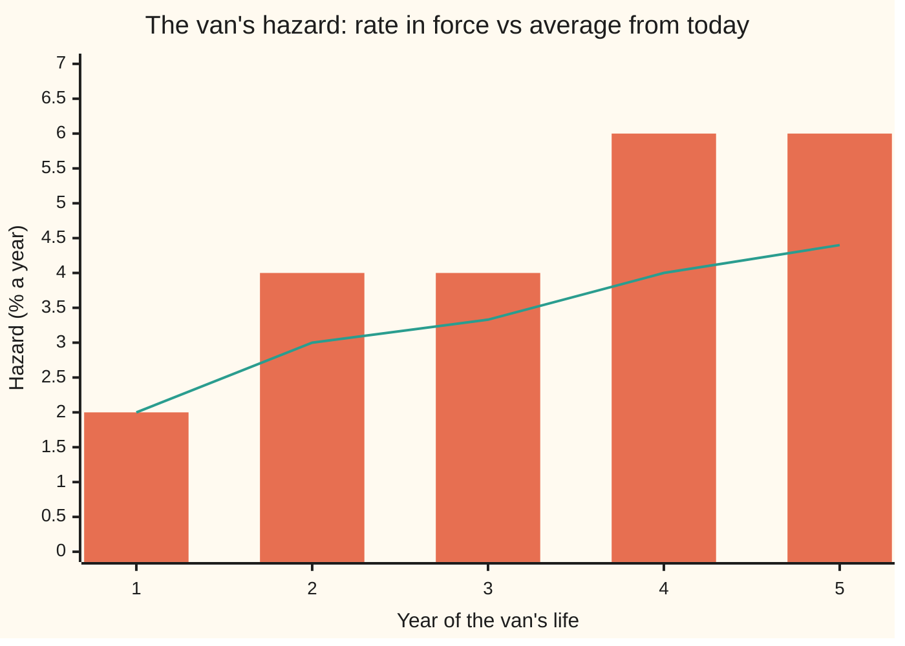
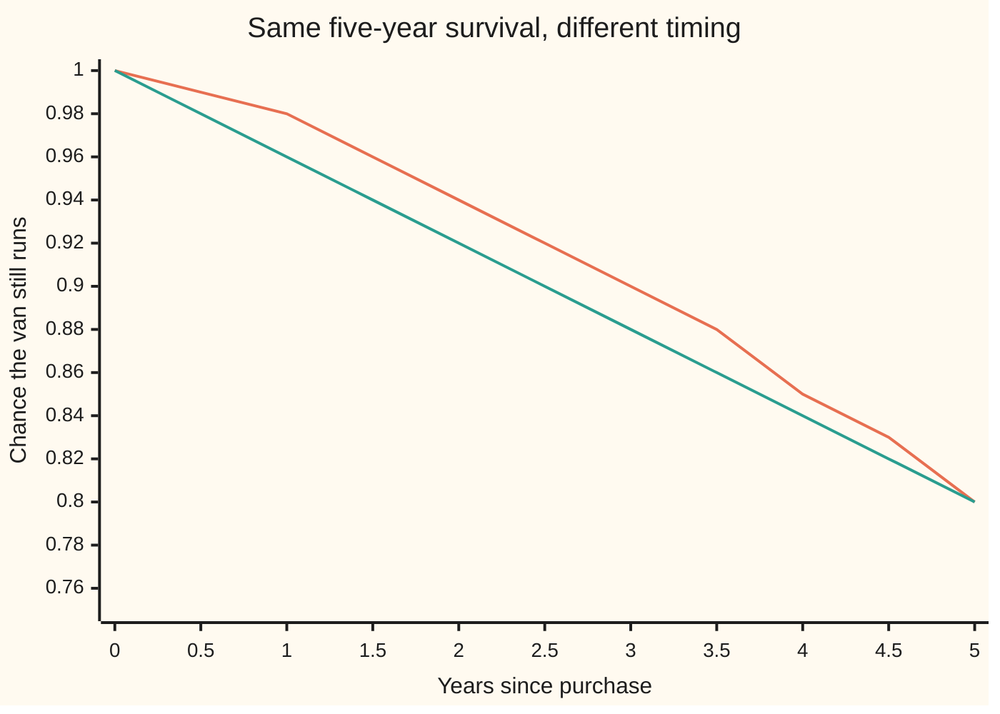

# The piecewise-flat hazard curve: a handful of rates that give survival at every date

[Syllabus](../../../SYLLABUS.md) → [Financial mathematics](../README.md) → [Default, Survival and the Hazard Rate](../README.md#s41) → The piecewise-flat hazard curve

---

## General Overview

A courier firm buys a used delivery van. Its mechanic's reading of vans like it: in the first year a breakdown that ends the van's working life comes at a rate of 2% a year. In years two and three the rate is 4% a year. In years four and five it is 6% a year. Three numbers, each held flat over its own stretch of time.

The firm wants more than three numbers. It wants the chance the van is still running at any date: 18 months, 2.5 years, 4 years. It wants the chance the van dies in year four in particular, to budget for a replacement. The three rates answer all of it. Survival at one year is 0.980, at three years 0.905, at five years 0.803. The chance the van dies in year four is 5.27%.

The rate in each stretch is the **hazard rate**: the chance of failing in the next instant, per year, counted only among vans still running ([The hazard rate](02-hazard-rate-and-survival-probability.md)). A hazard that holds flat between a few chosen dates and jumps at those dates is a **piecewise-flat hazard curve**, and the chosen dates are its **nodes**. Credit markets build this curve for every company with credit default swaps (contracts that pay out if the company defaults) quoted on it; the van is the same arithmetic with a breakdown in place of a default.

The curve also teaches a reading lesson. Averaged from today, the van's hazard looks gentle: 2% over one year, 3.33% over three, 4.4% over five. The rates actually in force in each stretch are 2%, 4% and 6%. The averages trail behind the rates in force and hide how steep the back end is.

**A few flat hazard rates, one per stretch between node dates, add up to a staircase whose area at any date gives survival as e to the minus that area; between nodes this is the same as drawing survival along a straight line in its logarithm, and on a rising staircase the average rate from today lags the rate in force.**

**What kind of fact this is:** a method: a modelling choice about the shape of the hazard between the dates where it is known. Survival as e to the minus the area is a theorem, proved on [The hazard rate](02-hazard-rate-and-survival-probability.md); the facts about the staircase are proved on this card in Why it works.

### The picture: the rate in force and the average from today



Bars: the hazard in force during each year, the staircase itself. Line: the average hazard from today to the end of that year. The staircase climbs 2, 4, 6. The average climbs 2, 3.33, 4.4 at the nodes, never above the step it has just reached.

---

## The formula

Notation first, in words. The node dates are written $t_0, t_1, t_2, t_3$ = 0, 1, 3, 5 years. The flat hazard on piece number i, the stretch from $t_{i-1}$ to $t_i$, is $\lambda_i$ ("lambda i"): 2%, 4% and 6% for the three pieces. The **cumulative hazard** $\Lambda(t)$ ("capital lambda") is the area under the hazard from today to date $t$. $S(t)$ is survival: the chance the van still runs at $t$. A capital sigma, Σ, means "add up over the pieces listed under it".

For a date $t$ inside piece i, so $t_{i-1} \le t \le t_i$:

$$\Lambda(t) \;=\; \sum_{j < i} \lambda_j\,(t_j - t_{j-1}) \;+\; \lambda_i\,(t - t_{i-1}), \qquad S(t) = e^{-\Lambda(t)}.$$

**Read it aloud:** the area is the full rectangles of every finished piece plus the part of the current piece reached so far; survival is e to the minus that area.

Three helper formulas follow from it, each proved below.

Between two nodes, survival runs along a straight line in its logarithm, with $w$ the fraction of the way from one node to the next:

$$\ln S(t) = (1 - w)\,\ln S(t_{i-1}) + w\,\ln S(t_i), \qquad w = \frac{t - t_{i-1}}{t_i - t_{i-1}}.$$

The average hazard from today to $T$, and the rate in force recovered from two averages:

$$\bar\lambda(T) = \frac{\Lambda(T)}{T} = -\frac{\ln S(T)}{T}, \qquad \lambda_i = \frac{\bar\lambda(t_i)\,t_i - \bar\lambda(t_{i-1})\,t_{i-1}}{t_i - t_{i-1}}.$$

The chance of dying inside a window from date $a$ to date $b$, with $\tau$ ("tau") the van's breakdown date:

$$P(a < \tau \le b) = S(a) - S(b).$$

| Symbol | Plain meaning | In our example | Push it up and the answer… |
| --- | --- | --- | --- |
| $t$ | a date, in years from the purchase | 2.5 | survival falls |
| $t_i$ | the node dates, where the hazard may jump | 0, 1, 3, 5 | — |
| $\lambda_i$ | the flat hazard on piece i, per year | 2%, 4%, 6% | survival falls from that piece on |
| $\lambda(t)$ | the hazard in force at date $t$: the step it sits on | 4% at 2.5 years | — |
| $\Lambda(t)$ | cumulative hazard: area under the staircase from 0 to $t$ | 0.10 at 3 years, 0.22 at 5 | survival falls |
| $S(t)$ | survival: chance the van still runs at $t$ | 0.9048 at 3, 0.8025 at 5 | — |
| $w$ | fraction of the way from one node to the next | 0.5 at 2 years | — |
| $T$ | a horizon, in years | 5 | the average takes in more steps |
| $\bar\lambda(T)$ | average hazard from today to $T$ ("lambda bar") | 4.4% to 5 years | — |
| $\tau$ | the van's breakdown date, a random number of years ("tau") | unknown | — |
| $a$, $b$ | the start and end of a window | 3 and 4 | a longer window catches more deaths |
| $e$, $\ln$ | the growth constant 2.71828… and its undo, the natural log | $e^{-0.22}$ = 0.8025 | — |

A reminder on powers: $e^{-x}$ is $1/e^{x}$, and $e^{x}\,e^{y} = e^{x+y}$, so multiplying survivals adds their areas ([Exponents](../../01-Foundations/03-Powers%2C%20Roots%20and%20Logarithms/01-exponents-and-powers.md)).

### When it holds

- **The hazard is a fixed curve, known today.** If it moves at random with the van's use or the economy, survival is an average of $e^{-\Lambda}$ over the possible curves and the staircase is only a summary of it.
- **Flat between nodes is a choice, not a finding.** The data (a mechanic's table, or market quotes) fix only the area of each piece. A hazard that rises smoothly inside a piece with the same area gives the same survival at the nodes and different survival between them.
- **Node survivals must fall, or at least not rise.** Reading the staircase back from survivals needs $1 \ge S(t_1) \ge S(t_2) \ge S(t_3) > 0$. Equal neighbours give a hazard of 0; a rise gives a negative hazard, which no real curve has; a survival of 0 gives no finite hazard at all.
- **Past the last node, something must be assumed.** The house convention holds the last rate flat: with 6% held on, survival at seven years is 0.7118. Any other tail is just as consistent with the data and gives a different number.

---

## Why it works

### Step 0: survival needs only the area, and a staircase's area is rectangles

The hazard-rate card proves that survival to a date is e to the minus the area under the hazard up to that date. For a smooth hazard that area takes an integral. For a staircase it takes multiplication and addition: each step is a rectangle, width times height. Everything on this card is that one observation used carefully.

### Step 1: add up the rectangles

The first piece is 1 year wide at 2%: area 0.02. The second is 2 years wide at 4%: area 0.08, running total 0.10 at year 3. The third is 2 years wide at 6%: area 0.12, running total 0.22 at year 5. Inside a piece, only the part reached so far counts: at 2.5 years the area is 0.02 + 0.04 × 1.5 = 0.08, and survival is $e^{-0.08}$ = 0.9231.

### Step 2: survival multiplies piece by piece

Since $e^{x+y} = e^{x}\,e^{y}$,

$$S(5) = e^{-0.02}\,e^{-0.08}\,e^{-0.12}.$$

Each factor is a chance in its own right: surviving that piece, counting only vans alive at its start. Survival to five years is survive year one, then survive years two and three given that, then years four and five given both. The staircase is a chain of flat-hazard curves glued end to end, each one starting where the last one left off.

This also says how the van ages. A van still running at year 3 faces two years at 6%: it survives to year 5 with chance $S(5)/S(3) = e^{-0.12}$ = 0.8869. A new van's next two years give 0.9418. A single flat hazard forgets the van's age; the staircase remembers it, one piece at a time.

### Step 3: between nodes, flat hazard is a straight line in log survival

Take logs of survival inside piece i:

$$\ln S(t) = \ln S(t_{i-1}) - \lambda_i\,(t - t_{i-1}).$$

That is a straight line in $t$, with slope $-\lambda_i$. So on a chart of $\ln S$ the curve is a broken line, kinked at the nodes. The reverse holds too: a straight line in $\ln S$ has one slope, and one slope means one hazard. **Log-linear interpolation of survival** (a straight line in log survival between the known nodes) and **a piecewise-flat hazard** are the same choice described twice.

For the van at 2 years, halfway between nodes 1 and 3: $\ln S(2)$ is the midpoint of $-0.02$ and $-0.10$, which is $-0.06$, so $S(2) = e^{-0.06}$ = 0.9418. The staircase gives the same: 0.02 + 0.04 × 1 = 0.06.

A straight line in survival itself would give 0.9425 at 2 years. It is close, but it is a different curve: along a straight line in $S$ the same number of vans is lost each year from a shrinking pool, so the hazard creeps up inside each piece instead of staying flat.

<details>
<summary>Detailed proof</summary>

**Log-linear equals flat.** Suppose on the stretch from $t_{i-1}$ to $t_i$ the hazard is some curve $\lambda(t)$, and survival there satisfies $\ln S(t) = (1-w)\ln S(t_{i-1}) + w \ln S(t_i)$ with $w = (t - t_{i-1})/(t_i - t_{i-1})$. Then $-\ln S(t) = \Lambda(t)$ is a straight line in $t$ with slope $(\ln S(t_{i-1}) - \ln S(t_i))/(t_i - t_{i-1})$. The hazard is the slope of $\Lambda$, by the definition on the hazard-rate card, so it is that constant on the whole stretch. Conversely, a constant hazard $\lambda_i$ makes $\Lambda$ a straight line with slope $\lambda_i$, so $\ln S$ is a straight line, which matches the interpolation at both ends. The two descriptions pick out the same survival curve.

**The average lags the rate in force.** By Step 1, $\Lambda(t_i) = \Lambda(t_{i-1}) + \lambda_i (t_i - t_{i-1})$. Divide by $t_i$ and write $\Lambda(t) = \bar\lambda(t)\,t$:
$$\bar\lambda(t_i) = \frac{t_{i-1}}{t_i}\,\bar\lambda(t_{i-1}) + \frac{t_i - t_{i-1}}{t_i}\,\lambda_i.$$
The two weights are positive and add to 1, so the new average lies between the old average and the new rate. If the average rose, the new rate is above both. Rearranged, $\lambda_i - \bar\lambda(t_i) = t_{i-1}\,\frac{\bar\lambda(t_i) - \bar\lambda(t_{i-1})}{t_i - t_{i-1}}$: the gap is the start date times the average's climb per year. Solving for $\lambda_i$ gives the recovery formula in The formula.

**Reading the staircase back from node survivals.** Given $S(t_1), \dots, S(t_n)$, set $\lambda_i = (\ln S(t_{i-1}) - \ln S(t_i))/(t_i - t_{i-1})$ with $S(t_0) = 1$. The logarithm exists exactly when every survival is above 0, and then the formula gives one number per piece: the staircase exists and is unique. Each $\lambda_i$ is at least 0 exactly when $S(t_i) \le S(t_{i-1})$. At $S(t_i) = S(t_{i-1})$ the piece has hazard 0; as $S(t_i)$ shrinks towards 0 the hazard grows without bound; at 0 there is none.

</details>

### Step 4: the chance of dying in one year

Dying in year four means running at year 3 and not at year 4: $S(3) - S(4) = 0.9048 - 0.8521$ = 5.27%. Dying in year five is $S(4) - S(5) = 0.8521 - 0.8025$ = 4.96%.

The hazard is 6% in both years, yet year five kills fewer vans. The 6% acts on the vans still running, and there are fewer of them in year five. The same thing happens at the second piece: 3.84% in year two, 3.69% in year three.

The other end gives the same numbers. The chance of dying in a thin slice near $t$, counted over all vans, is the hazard times the chance of being alive to face it, $\lambda(t)\,S(t)$ per year. The area under that curve over year four is again 5.27%. Counting only vans running at year 3, year four's chance is $1 - e^{-0.06}$ = 5.82%.

### Step 5: why averages hide the steep back end

The average hazard to five years is the whole area over the whole time, 0.22 / 5 = 4.4%. It mixes the cheap first year with the dear last two. The recovery formula runs that mixing backwards. From averages of 2% at year 1 and 3.33% at year 3, the rate in force in years two and three is (3.33% × 3 − 2% × 1) / 2 = 4%. From 3.33% at year 3 and 4.4% at year 5, it is (4.4% × 5 − 3.33% × 3) / 2 = 6%.

A running grade average behaves the same way: it moves only part of the way towards each new mark, so a rising average means the new marks sit above it. Whenever the average hazard climbs, the rate in force is above it. The gap is the average's climb per year times the age at the start of the piece, so a gentle climb late on hides a wide gap: 0.67 points in years two and three, 1.6 points in years four and five.



Orange: the staircase, 2%, 4%, 6%. Green: one flat hazard of 4.4%, the five-year average. Both end at 0.80, because both have area 0.22. The staircase holds up early and falls late. The flat curve loses 4.30% of vans in year one, against the staircase's 1.98%.

A second road to every number above is to simulate vans one at a time: each month, a van alive at its start breaks down with chance equal to that month's hazard times one twelfth of a year. Drawing the breakdown date directly from the survival curve, in one draw per van, is [Simulating a default time](05-simulating-a-default-time.md).

---

## Worked numbers, by hand

The van: 2% a year in year one, 4% in years two and three, 6% in years four and five.

| Step | Arithmetic | Value |
| --- | --- | --- |
| $\Lambda(1)$ | 0.02 × 1 | 0.02 |
| $S(1)$ | $e^{-0.02}$ | 0.9802 |
| $\Lambda(3)$ | 0.02 + 0.04 × 2 | 0.10 |
| $S(3)$ | $e^{-0.10}$ | 0.9048 |
| $\Lambda(5)$ | 0.10 + 0.06 × 2 | 0.22 |
| $S(5)$ | $e^{-0.22}$ | 0.8025 |
| $S(2)$, log-linear | $e^{-(0.02 + 0.10)/2} = e^{-0.06}$ | 0.9418 |
| $S(4)$, log-linear | $e^{-(0.10 + 0.22)/2} = e^{-0.16}$ | 0.8521 |
| died in year four | 0.9048 − 0.8521 | **5.27%** |
| died in year five | 0.8521 − 0.8025 | 4.96% |
| year four, given running at 3 | $1 - e^{-0.06}$ | 5.82% |
| dead by five years | 1 − 0.8025 | 19.75% |
| average hazard to five years | 0.22 / 5 | 4.4% |

In words: of a hundred vans like this one, about 20 are gone by year five, and about 5 of those go in year four. The $S(1)$ row cross-checks the shelf's house example: Northwind Lines at a flat 2% survives one year with the same 0.9802, since for one year the two share a hazard.

The bars below are each year's share of all vans bought, one block per 0.2 percentage points:

```
died in year, % of all vans bought (one block = 0.2 percentage points)
year 1  hazard 2%  ██████████                    1.98
year 2  hazard 4%  ███████████████████           3.84
year 3  hazard 4%  ██████████████████            3.69
year 4  hazard 6%  ██████████████████████████    5.27
year 5  hazard 6%  █████████████████████████     4.96
```

Each step up in the hazard lifts the bar; inside a step the bar slides down as the pool shrinks.

### What breaks if you drop a piece

| Mistake | Comes out at | What went wrong |
| --- | --- | --- |
| A straight line in survival between nodes | $S(2)$ = 0.9425 (right: 0.9418); $S(4)$ = 0.8537 (right: 0.8521) | The hazard is flat only when log survival is straight. A straight line in $S$ hides a hazard that creeps up inside the piece. |
| The 4.4% five-year average used as the year-five hazard | 4.30% chance of dying in year five, given running at 4 (right: 5.82%) | The average mixes in the cheap early years. The rate in force is 6%. |
| The hazard read as the year's death chance | 6.00% in year four (right: 5.27%) | The hazard acts only on vans still running, and is a rate, not a yearly chance. |
| One slice a year: survive each year with 1 minus the hazard | $S(5)$ = 0.7980 (right: 0.8025) | Treats each rate as a once-a-year chance. The hazard compounds continuously. |

---

## Code, from first principles, and it actually runs

The scripts reach the van's survival curve by four independent roads: e to the minus the staircase's area; a product over 500,000 thin slices, surviving each with 1 minus hazard times slice width, with no exponential in it; Simpson's rule (adding up thin parabolic strips under a curve) on the density $\lambda(t)S(t)$ for each year's deaths; and 100,000 simulated vans flipping a monthly coin from a hand-written random number generator, using no exponential and no log. Log-linear interpolation is checked against the staircase at 2 and 4 years, and the rates in force are recovered from the averages. Every number on the card, every chart point and every bar is printed.

### Python

```python
# Piecewise-flat hazard curve -- the check behind the card.  Standard library
# only.  A used van's breakdown hazard is 2% a year in year 1, 4% in years 2-3
# and 6% in years 4-5.  Survival is reached four ways: e to the minus the area
# under the steps, a slice product with no exp in it, Simpson's rule on the
# default density, and 100,000 simulated vans flipping a monthly coin drawn
# from a hand-written random number generator.
from math import exp, log, sqrt

NODES = [0.0, 1.0, 3.0, 5.0]           # node dates, in years
RATES = [0.02, 0.04, 0.06]             # the flat hazard on each piece, per year

def rate(t, rates=RATES):              # the hazard at date t; the last rate runs on past year 5
    for i in range(len(rates) - 1):
        if t < NODES[i + 1]:
            return rates[i]
    return rates[-1]

def area(t, rates=RATES):              # road 1: cumulative hazard, rate times overlap, piece by piece
    total = 0.0
    for i, lam in enumerate(rates):
        lo = NODES[i]
        hi = NODES[i + 1] if i < len(rates) - 1 else 1e9
        if t > lo:
            total += lam * (min(t, hi) - lo)
    return total

def S(t, rates=RATES):                 # survival to date t
    return exp(-area(t, rates))

def slice_curve(per_year, rates=RATES):   # road 2: survive each thin slice in turn; no exp
    dt, p, out = 1.0 / per_year, 1.0, [1.0]
    for year in range(5):
        for k in range(per_year):
            p *= 1.0 - rate(year + (k + 0.5) * dt, rates) * dt
        out.append(p)
    return out

def simpson(f, a, b, n=200):           # road 3: area under a smooth curve, parabola by parabola
    h = (b - a) / n
    s = f(a) + f(b)
    for i in range(1, n):
        s += (4 if i % 2 else 2) * f(a + i * h)
    return s * h / 3.0

def vans(n, seed):                     # road 4: monthly coin flips; no exp, no log
    p = [rate((m + 0.5) / 12.0) / 12.0 for m in range(60)]
    died, x = [0] * 5, seed
    for _ in range(n):
        for m in range(60):
            x = (6364136223846793005 * x + 1442695040888963407) & 0xFFFFFFFFFFFFFFFF
            if (x >> 11) / 9007199254740992.0 < p[m]:
                died[m // 12] += 1
                break
    return died

def loglin(t, a, b):                   # survival read between nodes a and b along a straight line in ln S
    w = (t - a) / (b - a)
    return exp((1 - w) * log(S(a)) + w * log(S(b)))

def linear(t, a, b):                   # the mistake: a straight line in S itself
    w = (t - a) / (b - a)
    return (1 - w) * S(a) + w * S(b)

YEARS = range(6)
surv = [S(t) for t in YEARS]
slc = slice_curve(100000)
died = [surv[y - 1] - surv[y] for y in range(1, 6)]
simp = [simpson(lambda t, lam=rate(y - 1): lam * S(t), y - 1.0, float(y)) for y in range(1, 6)]
N_VANS = 100000
counts = vans(N_VANS, 1)
mc = [1.0 - sum(counts[:y]) / N_VANS for y in YEARS]
se5 = sqrt(mc[5] * (1 - mc[5]) / N_VANS)
node_S = [S(t) for t in NODES]
avg = [-log(node_S[i]) / NODES[i] for i in range(1, 4)]
spot_from_S = [-log(node_S[i + 1] / node_S[i]) / (NODES[i + 1] - NODES[i]) for i in range(3)]
spot_from_avg = [(avg[i] * NODES[i + 1] - (avg[i - 1] * NODES[i] if i else 0.0))
                 / (NODES[i + 1] - NODES[i]) for i in range(3)]

print("year  Lambda(t)  S(t)      S slices  avg rate  spot rate  died in yr  Simpson   vans")
for y in YEARS:
    if y == 0:
        print(f"{y:>4}  {area(y):.6f}  {surv[y]:.6f}  {slc[y]:.6f}  {'':>8}  {'':>9}  {'':>10}  {'':>8}  {mc[y]:.6f}")
    else:
        print(f"{y:>4}  {area(y):.6f}  {surv[y]:.6f}  {slc[y]:.6f}  {area(y) / y:.6f}  {rate(y - 0.5):.6f}"
              f"   {died[y - 1]:.6f}  {simp[y - 1]:.6f}  {mc[y]:.6f}")
rows = [
    ("vans: one standard error at 5 years", se5),
    ("default by 5, 1 - S(5)", 1 - surv[5]),
    ("year 4 given alive at 3, 1 - e^-0.06", 1 - S(4) / S(3)),
    ("vans: died in year 4", counts[3] / N_VANS),
    ("log-linear S(2) from S(1), S(3)", loglin(2, 1, 3)),
    ("log-linear S(4) from S(3), S(5)", loglin(4, 3, 5)),
    ("piece areas: 1", RATES[0] * (NODES[1] - NODES[0])), ("  2", RATES[1] * (NODES[2] - NODES[1])),
    ("  3", RATES[2] * (NODES[3] - NODES[2])),
    ("Lambda(2.5)", area(2.5)), ("w at 2 years, from node 1 to node 3", (2 - 1) / (3 - 1)),
    ("S(2.5) on the curve", S(2.5)),
    ("average rate to 1, 3, 5: 1", avg[0]), ("  3", avg[1]), ("  5", avg[2]),
    ("spots from node survivals: 1", spot_from_S[0]), ("  2", spot_from_S[1]), ("  3", spot_from_S[2]),
    ("spots from the averages: 1", spot_from_avg[0]), ("  2", spot_from_avg[1]), ("  3", spot_from_avg[2]),
    ("ageing: alive at 3, survives to 5", S(5) / S(3)),
    ("ageing: new van survives 2 years", S(2)),
    ("wrong: linear S(2)", linear(2, 1, 3)),
    ("wrong: linear S(4)", linear(4, 3, 5)),
    ("wrong: year 5 hazard = 4.4% average, given alive", 1 - exp(-avg[2])),
    ("  right: 1 - e^-0.06", 1 - exp(-0.06)),
    ("wrong: died in year 4 = hazard", rate(3.5)),
    ("try: flat 4.4%, S(5)", S(5, [avg[2]] * 3)),
    ("try: flat 4.4%, died in year 1", 1 - S(1, [avg[2]] * 3)),
    ("try: rates reversed, S(5)", S(5, RATES[::-1])),
    ("try: one slice a year, S(5)", slice_curve(1)[5]),
    ("try: 6% held on, S(7)", S(7)),
]
for name, v in rows:
    print(f"{name:<50} {v:.6f}")
half = [0.5 * i for i in range(11)]
print("chart, years           " + " ".join(f"{t:5.1f}" for t in half))
print("chart, piecewise S(t)  " + " ".join(f"{S(t):5.2f}" for t in half))
print("chart, flat 4.4% S(t)  " + " ".join(f"{exp(-avg[2] * t):5.2f}" for t in half))
print("chart, spot % by year  " + " ".join(f"{100 * rate(y - 0.5):5.2f}" for y in range(1, 6)))
print("chart, average % to yr " + " ".join(f"{100 * area(y) / y:5.2f}" for y in range(1, 6)))
print("bars, died in yr %     " + " ".join(f"{100 * d:5.2f}" for d in died))

assert all(abs(slc[y] - surv[y]) < 1e-6 for y in YEARS), "slice product must reach exp(-area)"
assert all(abs(simp[i] - died[i]) < 1e-10 for i in range(5)), "density area must equal S(a) - S(b)"
assert abs(mc[5] - surv[5]) < 4 * se5, "simulated vans within four standard errors"
assert all(abs(loglin(t, a, b) - S(t)) < 1e-12 for t, a, b in [(1.5, 1, 3), (2, 1, 3), (2.5, 1, 3), (4.5, 3, 5)]), "log-linear = flat"
assert all(abs(spot_from_avg[i] - RATES[i]) < 1e-12 for i in range(3)), "spots recovered from averages"
assert abs(surv[5] - 0.8025) < 5e-5 and abs(surv[3] - 0.9048) < 5e-5, "the card's hand-worked survivals"
assert abs(died[3] - 0.0527) < 5e-5 and abs(S(7) - 0.7118) < 5e-5, "year-four deaths and the flat tail"
print("ALL CHECKS PASS")
```

**Ran 2026-09-28 on macOS, Python 3.14.6, standard library only. All checks passed. Output, pasted from the run:**

```
year  Lambda(t)  S(t)      S slices  avg rate  spot rate  died in yr  Simpson   vans
   0  0.000000  1.000000  1.000000                                             1.000000
   1  0.020000  0.980199  0.980199  0.020000  0.020000   0.019801  0.019801  0.980410
   2  0.060000  0.941765  0.941765  0.030000  0.040000   0.038434  0.038434  0.942150
   3  0.100000  0.904837  0.904837  0.033333  0.040000   0.036927  0.036927  0.905960
   4  0.160000  0.852144  0.852144  0.040000  0.060000   0.052694  0.052694  0.852870
   5  0.220000  0.802519  0.802519  0.044000  0.060000   0.049625  0.049625  0.802870
vans: one standard error at 5 years                0.001258
default by 5, 1 - S(5)                             0.197481
year 4 given alive at 3, 1 - e^-0.06               0.058235
vans: died in year 4                               0.053090
log-linear S(2) from S(1), S(3)                    0.941765
log-linear S(4) from S(3), S(5)                    0.852144
piece areas: 1                                     0.020000
  2                                                0.080000
  3                                                0.120000
Lambda(2.5)                                        0.080000
w at 2 years, from node 1 to node 3                0.500000
S(2.5) on the curve                                0.923116
average rate to 1, 3, 5: 1                         0.020000
  3                                                0.033333
  5                                                0.044000
spots from node survivals: 1                       0.020000
  2                                                0.040000
  3                                                0.060000
spots from the averages: 1                         0.020000
  2                                                0.040000
  3                                                0.060000
ageing: alive at 3, survives to 5                  0.886920
ageing: new van survives 2 years                   0.941765
wrong: linear S(2)                                 0.942518
wrong: linear S(4)                                 0.853678
wrong: year 5 hazard = 4.4% average, given alive   0.043046
  right: 1 - e^-0.06                               0.058235
wrong: died in year 4 = hazard                     0.060000
try: flat 4.4%, S(5)                               0.802519
try: flat 4.4%, died in year 1                     0.043046
try: rates reversed, S(5)                          0.835270
try: one slice a year, S(5)                        0.798039
try: 6% held on, S(7)                              0.711770
chart, years             0.0   0.5   1.0   1.5   2.0   2.5   3.0   3.5   4.0   4.5   5.0
chart, piecewise S(t)   1.00  0.99  0.98  0.96  0.94  0.92  0.90  0.88  0.85  0.83  0.80
chart, flat 4.4% S(t)   1.00  0.98  0.96  0.94  0.92  0.90  0.88  0.86  0.84  0.82  0.80
chart, spot % by year   2.00  4.00  4.00  6.00  6.00
chart, average % to yr  2.00  3.00  3.33  4.00  4.40
bars, died in yr %      1.98  3.84  3.69  5.27  4.96
ALL CHECKS PASS
```

Four roads, one curve. The slice product matches e to the minus the area to six decimals. Simpson's rule on the density matches $S(a) - S(b)$ for every year. The simulated vans land at 0.8029 against 0.8025, well inside one standard error of 0.0013; their year-four deaths, 5.31%, sit near 5.27%.

### Rust

Same checks, same inputs, same generator and seed, built with `rustc --edition 2021 -O`.

```rust
// Piecewise-flat hazard curve -- the same check as the Python, in Rust.  No
// crates.  A used van's breakdown hazard is 2% a year in year 1, 4% in years
// 2-3 and 6% in years 4-5.  Survival is reached four ways: e to the minus the
// area under the steps, a slice product with no exp in it, Simpson's rule on
// the default density, and 100,000 simulated vans flipping a monthly coin
// drawn from a hand-written random number generator.
const NODES: [f64; 4] = [0.0, 1.0, 3.0, 5.0]; // node dates, in years
const RATES: [f64; 3] = [0.02, 0.04, 0.06]; // the flat hazard on each piece, per year

fn rate(t: f64, rates: &[f64]) -> f64 {
    // the hazard at date t; the last rate runs on past year 5
    for i in 0..rates.len() - 1 {
        if t < NODES[i + 1] { return rates[i]; }
    }
    rates[rates.len() - 1]
}

fn area(t: f64, rates: &[f64]) -> f64 {
    // road 1: cumulative hazard, rate times overlap, piece by piece
    let mut total = 0.0;
    for (i, lam) in rates.iter().enumerate() {
        let lo = NODES[i];
        let hi = if i < rates.len() - 1 { NODES[i + 1] } else { 1e9 };
        if t > lo { total += lam * (t.min(hi) - lo); }
    }
    total
}

fn s(t: f64, rates: &[f64]) -> f64 { (-area(t, rates)).exp() } // survival to date t

fn slice_curve(per_year: usize, rates: &[f64]) -> Vec<f64> {
    // road 2: survive each thin slice in turn; no exp
    let dt = 1.0 / per_year as f64;
    let (mut p, mut out) = (1.0_f64, vec![1.0_f64]);
    for year in 0..5 {
        for k in 0..per_year {
            p *= 1.0 - rate(year as f64 + (k as f64 + 0.5) * dt, rates) * dt;
        }
        out.push(p);
    }
    out
}

fn simpson<F: Fn(f64) -> f64>(f: F, a: f64, b: f64, n: usize) -> f64 {
    // road 3: area under a smooth curve, parabola by parabola
    let h = (b - a) / n as f64;
    let mut sum = f(a) + f(b);
    for i in 1..n { sum += if i % 2 == 1 { 4.0 } else { 2.0 } * f(a + i as f64 * h); }
    sum * h / 3.0
}

fn vans(n: usize, seed: u64) -> [u64; 5] {
    // road 4: monthly coin flips; no exp, no log
    let p: Vec<f64> = (0..60).map(|m| rate((m as f64 + 0.5) / 12.0, &RATES) / 12.0).collect();
    let (mut died, mut x) = ([0u64; 5], seed);
    for _ in 0..n {
        for m in 0..60 {
            x = x.wrapping_mul(6364136223846793005).wrapping_add(1442695040888963407);
            if (x >> 11) as f64 / 9007199254740992.0 < p[m] {
                died[m / 12] += 1;
                break;
            }
        }
    }
    died
}

fn loglin(t: f64, a: f64, b: f64) -> f64 {
    // survival read between nodes a and b along a straight line in ln S
    let w = (t - a) / (b - a);
    ((1.0 - w) * s(a, &RATES).ln() + w * s(b, &RATES).ln()).exp()
}

fn linear(t: f64, a: f64, b: f64) -> f64 {
    // the mistake: a straight line in S itself
    let w = (t - a) / (b - a);
    (1.0 - w) * s(a, &RATES) + w * s(b, &RATES)
}

fn row(xs: &[f64], width: usize, prec: usize) -> String {
    xs.iter().map(|v| format!("{:w$.p$}", v, w = width, p = prec)).collect::<Vec<_>>().join(" ")
}

fn main() {
    let surv: Vec<f64> = (0..6).map(|y| s(y as f64, &RATES)).collect();
    let slc = slice_curve(100000, &RATES);
    let died: Vec<f64> = (1..6).map(|y| surv[y - 1] - surv[y]).collect();
    let simp: Vec<f64> = (1..6)
        .map(|y| { let lam = rate(y as f64 - 1.0, &RATES); simpson(|t| lam * s(t, &RATES), y as f64 - 1.0, y as f64, 200) })
        .collect();
    let n_vans = 100000usize;
    let counts = vans(n_vans, 1);
    let mc: Vec<f64> = (0..6).map(|y| 1.0 - counts[..y].iter().sum::<u64>() as f64 / n_vans as f64).collect();
    let se5 = (mc[5] * (1.0 - mc[5]) / n_vans as f64).sqrt();
    let node_s: Vec<f64> = NODES.iter().map(|&t| s(t, &RATES)).collect();
    let avg: Vec<f64> = (1..4).map(|i| -node_s[i].ln() / NODES[i]).collect();
    let spot_from_s: Vec<f64> = (0..3).map(|i| -(node_s[i + 1] / node_s[i]).ln() / (NODES[i + 1] - NODES[i])).collect();
    let spot_from_avg: Vec<f64> = (0..3)
        .map(|i| (avg[i] * NODES[i + 1] - if i > 0 { avg[i - 1] * NODES[i] } else { 0.0 }) / (NODES[i + 1] - NODES[i]))
        .collect();

    println!("year  Lambda(t)  S(t)      S slices  avg rate  spot rate  died in yr  Simpson   vans");
    for y in 0..6usize {
        let yf = y as f64;
        if y == 0 {
            println!("{:>4}  {:.6}  {:.6}  {:.6}  {:>8}  {:>9}  {:>10}  {:>8}  {:.6}", y, area(yf, &RATES), surv[y], slc[y], "", "", "", "", mc[y]);
        } else {
            println!("{:>4}  {:.6}  {:.6}  {:.6}  {:.6}  {:.6}   {:.6}  {:.6}  {:.6}", y, area(yf, &RATES), surv[y], slc[y],
                     area(yf, &RATES) / yf, rate(yf - 0.5, &RATES), died[y - 1], simp[y - 1], mc[y]);
        }
    }
    let flat = [avg[2]; 3];
    let rev = [RATES[2], RATES[1], RATES[0]];
    let rows: Vec<(&str, f64)> = vec![
        ("vans: one standard error at 5 years", se5),
        ("default by 5, 1 - S(5)", 1.0 - surv[5]),
        ("year 4 given alive at 3, 1 - e^-0.06", 1.0 - s(4.0, &RATES) / s(3.0, &RATES)),
        ("vans: died in year 4", counts[3] as f64 / n_vans as f64),
        ("log-linear S(2) from S(1), S(3)", loglin(2.0, 1.0, 3.0)),
        ("log-linear S(4) from S(3), S(5)", loglin(4.0, 3.0, 5.0)),
        ("piece areas: 1", RATES[0] * (NODES[1] - NODES[0])), ("  2", RATES[1] * (NODES[2] - NODES[1])),
        ("  3", RATES[2] * (NODES[3] - NODES[2])),
        ("Lambda(2.5)", area(2.5, &RATES)), ("w at 2 years, from node 1 to node 3", (2.0 - 1.0) / (3.0 - 1.0)),
        ("S(2.5) on the curve", s(2.5, &RATES)),
        ("average rate to 1, 3, 5: 1", avg[0]), ("  3", avg[1]), ("  5", avg[2]),
        ("spots from node survivals: 1", spot_from_s[0]), ("  2", spot_from_s[1]), ("  3", spot_from_s[2]),
        ("spots from the averages: 1", spot_from_avg[0]), ("  2", spot_from_avg[1]), ("  3", spot_from_avg[2]),
        ("ageing: alive at 3, survives to 5", s(5.0, &RATES) / s(3.0, &RATES)),
        ("ageing: new van survives 2 years", s(2.0, &RATES)),
        ("wrong: linear S(2)", linear(2.0, 1.0, 3.0)),
        ("wrong: linear S(4)", linear(4.0, 3.0, 5.0)),
        ("wrong: year 5 hazard = 4.4% average, given alive", 1.0 - (-avg[2]).exp()),
        ("  right: 1 - e^-0.06", 1.0 - (-0.06_f64).exp()),
        ("wrong: died in year 4 = hazard", rate(3.5, &RATES)),
        ("try: flat 4.4%, S(5)", s(5.0, &flat)),
        ("try: flat 4.4%, died in year 1", 1.0 - s(1.0, &flat)),
        ("try: rates reversed, S(5)", s(5.0, &rev)),
        ("try: one slice a year, S(5)", slice_curve(1, &RATES)[5]),
        ("try: 6% held on, S(7)", s(7.0, &RATES)),
    ];
    for (name, v) in &rows { println!("{:<50} {:.6}", name, v); }
    let half: Vec<f64> = (0..11).map(|i| 0.5 * i as f64).collect();
    println!("chart, years           {}", row(&half, 5, 1));
    println!("chart, piecewise S(t)  {}", row(&half.iter().map(|&t| s(t, &RATES)).collect::<Vec<_>>(), 5, 2));
    println!("chart, flat 4.4% S(t)  {}", row(&half.iter().map(|&t| (-avg[2] * t).exp()).collect::<Vec<_>>(), 5, 2));
    println!("chart, spot % by year  {}", row(&(1..6).map(|y| 100.0 * rate(y as f64 - 0.5, &RATES)).collect::<Vec<_>>(), 5, 2));
    println!("chart, average % to yr {}", row(&(1..6).map(|y| 100.0 * area(y as f64, &RATES) / y as f64).collect::<Vec<_>>(), 5, 2));
    println!("bars, died in yr %     {}", row(&died.iter().map(|d| 100.0 * d).collect::<Vec<_>>(), 5, 2));

    assert!((0..6).all(|y| (slc[y] - surv[y]).abs() < 1e-6), "slice product must reach exp(-area)");
    assert!((0..5).all(|i| (simp[i] - died[i]).abs() < 1e-10), "density area must equal S(a) - S(b)");
    assert!((mc[5] - surv[5]).abs() < 4.0 * se5, "simulated vans within four standard errors");
    assert!([(1.5, 1.0, 3.0), (2.0, 1.0, 3.0), (2.5, 1.0, 3.0), (4.5, 3.0, 5.0)].iter().all(|&(t, a, b)| (loglin(t, a, b) - s(t, &RATES)).abs() < 1e-12), "log-linear = flat");
    assert!((0..3).all(|i| (spot_from_avg[i] - RATES[i]).abs() < 1e-12), "spots recovered from averages");
    assert!((surv[5] - 0.8025).abs() < 5e-5 && (surv[3] - 0.9048).abs() < 5e-5, "the card's hand-worked survivals");
    assert!((died[3] - 0.0527).abs() < 5e-5 && (s(7.0, &RATES) - 0.7118).abs() < 5e-5, "year-four deaths and the flat tail");
    println!("ALL CHECKS PASS");
}
```

**Ran 2026-09-28 on macOS, rustc 1.98.1, no crates. All checks passed. Output, pasted from the run:**

```
year  Lambda(t)  S(t)      S slices  avg rate  spot rate  died in yr  Simpson   vans
   0  0.000000  1.000000  1.000000                                             1.000000
   1  0.020000  0.980199  0.980199  0.020000  0.020000   0.019801  0.019801  0.980410
   2  0.060000  0.941765  0.941765  0.030000  0.040000   0.038434  0.038434  0.942150
   3  0.100000  0.904837  0.904837  0.033333  0.040000   0.036927  0.036927  0.905960
   4  0.160000  0.852144  0.852144  0.040000  0.060000   0.052694  0.052694  0.852870
   5  0.220000  0.802519  0.802519  0.044000  0.060000   0.049625  0.049625  0.802870
vans: one standard error at 5 years                0.001258
default by 5, 1 - S(5)                             0.197481
year 4 given alive at 3, 1 - e^-0.06               0.058235
vans: died in year 4                               0.053090
log-linear S(2) from S(1), S(3)                    0.941765
log-linear S(4) from S(3), S(5)                    0.852144
piece areas: 1                                     0.020000
  2                                                0.080000
  3                                                0.120000
Lambda(2.5)                                        0.080000
w at 2 years, from node 1 to node 3                0.500000
S(2.5) on the curve                                0.923116
average rate to 1, 3, 5: 1                         0.020000
  3                                                0.033333
  5                                                0.044000
spots from node survivals: 1                       0.020000
  2                                                0.040000
  3                                                0.060000
spots from the averages: 1                         0.020000
  2                                                0.040000
  3                                                0.060000
ageing: alive at 3, survives to 5                  0.886920
ageing: new van survives 2 years                   0.941765
wrong: linear S(2)                                 0.942518
wrong: linear S(4)                                 0.853678
wrong: year 5 hazard = 4.4% average, given alive   0.043046
  right: 1 - e^-0.06                               0.058235
wrong: died in year 4 = hazard                     0.060000
try: flat 4.4%, S(5)                               0.802519
try: flat 4.4%, died in year 1                     0.043046
try: rates reversed, S(5)                          0.835270
try: one slice a year, S(5)                        0.798039
try: 6% held on, S(7)                              0.711770
chart, years             0.0   0.5   1.0   1.5   2.0   2.5   3.0   3.5   4.0   4.5   5.0
chart, piecewise S(t)   1.00  0.99  0.98  0.96  0.94  0.92  0.90  0.88  0.85  0.83  0.80
chart, flat 4.4% S(t)   1.00  0.98  0.96  0.94  0.92  0.90  0.88  0.86  0.84  0.82  0.80
chart, spot % by year   2.00  4.00  4.00  6.00  6.00
chart, average % to yr  2.00  3.00  3.33  4.00  4.40
bars, died in yr %      1.98  3.84  3.69  5.27  4.96
ALL CHECKS PASS
```

The two outputs agree line for line, simulated vans included, since both languages run the same generator from the same seed.

> [!TIP]
> **Try changing**
> Guess first, then run.
> - **Flatten the staircase.** Pass `[avg[2]] * 3`, a flat 4.4%, to `S`. Five-year survival stays **0.8025**; year-one deaths jump from 1.98% to **4.30%**. The five-year number alone cannot tell the two curves apart.
> - **Reverse the rates.** Pass `RATES[::-1]`: 6% in year one, 4% in years two and three, 2% in years four and five. Five-year survival becomes **0.8353**, not 0.8025, because the 6% now covers one year instead of two. Only areas matter, and areas need widths.
> - **Coarsen the slices.** Call `slice_curve(1)`. Surviving each year with 1 minus its hazard gives **0.7980** at five years; the product needs thin slices to reach the curve.
> - **Look past the last node.** Ask for `S(7)`. With 6% held on beyond year 5, survival at seven years is **0.7118**. The data say nothing about years six and seven; the flat tail is a convention.

---

## The usual mistake

> [!warning]
> **Reading an average hazard as the hazard in force.** Five-year survival of 0.8025 says the average hazard over five years is 4.4%. It says nothing about when inside those five years the vans die. With the staircase underneath, the rate in years four and five is 6%, and a van running at year 4 has a 5.82% chance of dying in year five, not the 4.30% the average suggests. Whenever averages rise with the horizon, the rates in force rise faster.
>
> Smaller traps:
> - **Straight lines in survival.** Interpolating $S$ itself between nodes gives 0.9425 at 2 years instead of 0.9418, and a hazard that is not flat inside the piece. Interpolate $\ln S$.
> - **The hazard as a death chance.** Year four's hazard is 6%; the chance a new van dies in year four is 5.27%, and 5.82% for a van running at year 3.
> - **Same hazard, same deaths.** Years four and five share a 6% hazard but lose 5.27% and 4.96% of the vans bought. The pool shrinks.
> - **Forgetting the widths.** Swapping the order of the rates changes the answer, 0.8353 against 0.8025, because each rate is multiplied by the length of its own piece.

---

## Where you meet it in real life

- **Credit default swap curves.** Dealers quote swaps at maturities such as 1, 3, 5, 7 and 10 years, and the standard model puts one flat hazard between each pair. Solving for those hazards from the quotes is [Bootstrapping a hazard curve](../42-Credit%20Default%20Swaps%20-%20Pricing%2C%20the%20Par%20Spread%20and%20the%20Hazard%20Behind%20It/06-bootstrapping-the-hazard-curve-from-cds-quotes.md); this card runs the curve forwards once it is built.
- **Risky bond prices.** Each coupon of a company's bond is weighted by the survival curve at its payment date, read off the staircase between nodes: [A risky bond from the hazard curve](../44-Reduced-Form%20Models%20-%20Risky%20Bonds%2C%20Spreads%20and%20Random%20Hazards/01-pricing-a-defaultable-bond-from-the-survival-curve.md).
- **Interest-rate curves.** Straight lines in the log of discount factors, the prices today of a dollar paid later, give flat forward interest rates between nodes. It is the same construction, with interest in place of hazard.
- **Expected loss by year.** A lender budgets each year's losses from that year's slice of default probability, $S(a) - S(b)$, times the loss if default happens: [Default probability, recovery and expected loss](01-default-probability-recovery-and-expected-loss.md).
- **Rating agency tables.** Cumulative default rates by horizon are survival curves read at nodes; turning them into the rate in force each year is the recovery formula on this card. Default reached through rating changes is [Rating transition matrices](04-rating-transition-matrix-and-cumulative-default-rates.md).
- **Life tables and machine fleets.** Actuaries often hold the force of mortality flat within each year of age, and fleet managers do the same with failure rates by age band: piecewise-flat hazards under other names.

> **Say it back**
> A piecewise-flat hazard curve holds one rate between each pair of node dates. The area under that staircase is a sum of rectangles, and survival is e to the minus the area, so the van survives five years with chance 0.8025. Between nodes the curve is a straight line in log survival, which is the same thing as a flat hazard. Each year's death chance is survival at its start minus survival at its end, so a 6% year can lose fewer vans than an earlier 6% year. The average hazard from today, 4.4% to five years, trails the 6% in force at the back end.

---

## What this builds on

- [The hazard rate](02-hazard-rate-and-survival-probability.md): the hazard as a rate among survivors, and survival as e to the minus its area. This card gives the hazard a shape.
- [Exponents](../../01-Foundations/03-Powers%2C%20Roots%20and%20Logarithms/01-exponents-and-powers.md): why multiplying survivals adds their areas, the rule behind Step 2.

## Where this goes next

- [Simulating a default time](05-simulating-a-default-time.md): one draw per van or company, inverting the staircase's survival curve.
- [Bootstrapping a hazard curve](../42-Credit%20Default%20Swaps%20-%20Pricing%2C%20the%20Par%20Spread%20and%20the%20Hazard%20Behind%20It/06-bootstrapping-the-hazard-curve-from-cds-quotes.md): the staircase solved for, piece by piece, from market quotes.
- [A risky bond from the hazard curve](../44-Reduced-Form%20Models%20-%20Risky%20Bonds%2C%20Spreads%20and%20Random%20Hazards/01-pricing-a-defaultable-bond-from-the-survival-curve.md): the survival curve used to value a company's bond.

Here the rates were handed over by a mechanic; a market hands over prices instead, and turning quoted prices into the steps of the staircase is what the bootstrap does.

---

## Sources

Verified 2026-09-28: each DOI's title and first author checked on Crossref (the O'Kane record gives title only); the other links open the publisher's page for the named book.

- O'Kane, Dominic. *Modelling Single-name and Multi-name Credit Derivatives*. Wiley, 2008. [doi:10.1002/9781119201960](https://doi.org/10.1002/9781119201960). The market-standard survival curve: piecewise-flat hazards, log-linear survival between nodes.
- Hagan, Patrick S., and Graeme West. "Interpolation Methods for Curve Construction." *Applied Mathematical Finance* 13, no. 2 (2006): 89–129. [doi:10.1080/13504860500396032](https://doi.org/10.1080/13504860500396032). Why a straight line in the log of a discount curve means flat forward rates, and what other interpolations do instead.
- Lando, David. *Credit Risk Modeling: Theory and Applications*. Princeton University Press, 2004. [Publisher page](https://press.princeton.edu/books/hardcover/9780691089294/credit-risk-modeling). Hazards, survival and intensity models.
- Hull, John C. *Options, Futures, and Other Derivatives*, 11th ed. Pearson. [Publisher page](https://www.pearson.com/en-us/subject-catalog/p/options-futures-and-other-derivatives/P200000005938). The credit-risk chapter's hazard rates, average hazards and year-by-year default probabilities.
