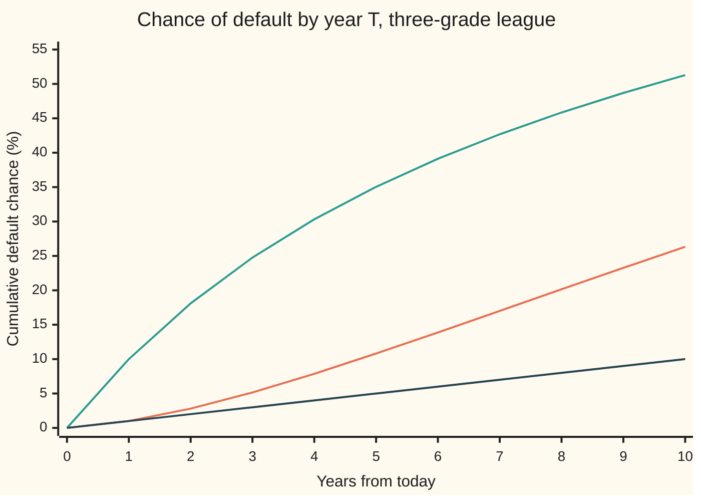

# Rating transition matrices: a one-year table of grade moves, and multi-year default chances by multiplying it

Financial mathematics → Default, Survival and the Hazard Rate → Grade migration → Rating transition matrices

---

## General Overview

Picture a league of borrowers with three grades. A **Solid** borrower pays its debts with room to spare. A **Shaky** one pays, but only just. A **Default** borrower has stopped paying. Every year, each borrower is re-graded.

Suppose the records show, in round invented numbers, how Solid borrowers fare over one year: 90% stay Solid, 9% slip to Shaky, 1% default. Shaky borrowers: 10% climb back to Solid, 80% stay Shaky, 10% default. A borrower in Default stays there. Those six numbers, laid out as a table with one row per starting grade and one column per ending grade, are a **rating transition matrix**, the name used from here on.

The question a lender asks is not about one year. It is: what is the chance a Solid borrower defaults within two years? Within five? The tempting answer is 1% a year, so 2% and 5%. It is wrong. Over two years the answer is **2.80%**, and over five it is **10.81%**, more than double the tempting 5%. The gap comes from the road through Shaky: a Solid borrower that slips in year one then faces a 10% default chance, not 1%. Multiplying the table by itself follows every such road at once.

**A transition matrix lists one year of grade moves; if next year's move depends only on this year's grade, multiplying T copies of the table together gives every T-year move, and the product's Default column is the cumulative default chance.**

**What kind of fact this is:** a model. The assumption that only today's grade matters (the Markov assumption) is a choice that fits rating data roughly, not a law. Inside the model, "T years = the table multiplied T times" is a theorem, proved on this card in Why it works. In practice the table's numbers are historical, real-world frequencies, not market prices.

### The picture: default chances pile up faster than a straight line



Orange: a borrower that starts Solid. It bends upward: each year more Solid borrowers have slipped to Shaky, where defaults are ten times as common. Green: a borrower that starts Shaky. It bends downward: each year some Shaky borrowers have climbed back to Solid, and some have already defaulted and left. Dark: the tempting "1% a year" line for Solid, which falls further behind every year.

---

## The formula

Notation first, in words. A **matrix** is a table of numbers, named by one capital letter; the one here is $P$. The number in row $i$, column $j$ is written $p_{ij}$: the chance of moving from grade $i$ to grade $j$ in one year. Grades are labelled S (Solid), H (Shaky) and D (Default), so $p_{SD}$ is the one-year default chance of a Solid borrower. $P^T$ means $T$ copies of $P$ multiplied together, by the row-times-column rule of [matrix-multiplication](../../03-Algebra/04-Matrices/03-matrix-multiplication.md).

$$P = \begin{pmatrix} p_{SS} & p_{SH} & p_{SD} \\ p_{HS} & p_{HH} & p_{HD} \\ 0 & 0 & 1 \end{pmatrix} = \begin{pmatrix} 0.90 & 0.09 & 0.01 \\ 0.10 & 0.80 & 0.10 \\ 0 & 0 & 1 \end{pmatrix}$$

Each row adds to 1: a borrower must end the year somewhere. The bottom row says Default is **absorbing**: once there, always there.

The theorem of the card:

$$\text{chance of being in grade } j \text{ after } T \text{ years, from grade } i \;=\; \big(P^T\big)_{ij}, \qquad \mathrm{PD}_i(T) = \big(P^T\big)_{iD}$$

**Read it aloud:** to find where a borrower can be in T years, multiply T copies of the one-year table together and read row i; the Default entry of that row is the chance it has defaulted by year T.

The two-year case written out, one term per road:

$$\mathrm{PD}_S(2) = p_{SS}\,p_{SD} + p_{SH}\,p_{HD} + p_{SD}\cdot 1 = 0.90 \times 0.01 + 0.09 \times 0.10 + 0.01 = 0.028$$

The average hazard a cumulative default chance implies, for anyone who wants a single flat rate that reproduces it ([hazard-rate-and-survival-probability](02-hazard-rate-and-survival-probability.md)):

$$\bar\lambda_i(T) = -\frac{\ln\big(1 - \mathrm{PD}_i(T)\big)}{T}$$

**Read it aloud:** the flat yearly hazard that gives the same T-year default chance is minus the log of the survival chance, divided by the years.

Where the table comes from, the **cohort estimator**:

$$\hat p_{ij} = \frac{N_{ij}}{N_i}$$

**Read it aloud:** of the borrowers who started the year in grade i, the fraction that ended it in grade j.

| Symbol | Plain meaning | In our example | Push it up and the answer… |
| --- | --- | --- | --- |
| $P$ | the one-year transition matrix | the 3-by-3 table above | — |
| $p_{ij}$, $p_{SD}$, $p_{SH}$, $p_{HD}$ | chance of moving from grade i to grade j in one year | 0.01, 0.09, 0.10 | more default: PD rises at every horizon |
| $i$, $j$ | a starting grade and an ending grade: S, H or D | S → D | — |
| $T$ | the horizon, in whole years | 2, 5 | PD rises |
| $P^T$ | T copies of the table multiplied together: every T-year move | Solid row at 5 years: 0.6496, 0.2424, 0.1081 | — |
| $\mathrm{PD}_i(T)$ | cumulative default chance: defaulted by year T, starting in grade i | 0.0280 at 2 years, 0.1081 at 5 | — |
| $\bar\lambda_i(T)$ | the flat yearly hazard that reproduces that cumulative default chance ("lambda bar") | 2.29% a year, Solid, 5 years | — |
| $Q$ | the living part of the table: rows and columns S and H only | 0.90, 0.09 / 0.10, 0.80 | — |
| $\mu_1$, $\mu_2$ | the two eigenvalues of Q ("mu"): the yearly factors by which the living mixes shrink | 0.957238, 0.742762 | a larger mu1 means slower long-run default |
| $A$ | the weight on mu1 in Solid's survival | 1.152753 | — |
| $N_i$, $N_{ij}$, $N_S$, $N_{SS}$, $N_{SH}$, $N_{SD}$ | cohort counts: borrowers starting the year in grade i, and those among them ending in j | 1,000 Solid; 90 of them end Shaky | — |
| $\hat p_{ij}$, $p_{Sj}$ | the cohort estimate of p_ij ("p hat"); p_Sj is any entry of Solid's row | 90 / 1,000 = 0.09 | — |

### When it holds

- **Only today's grade matters (Markov).** Real ratings show momentum: a borrower just downgraded is more likely to be downgraded again than one that has sat in the same grade for years. The model ignores that history, so it understates multi-year default for recent fallers and overstates it for long-stable names.
- **The same table every year (time-homogeneous).** Defaults bunch in recessions. A table averaged over twenty years is too mild for a bad year and too harsh for a good one; powering it gives an average path that no single decade follows.
- **Enough borrowers in every cell.** A cohort of 50 top-grade borrowers with no defaults gives an estimated default chance of exactly 0, which is not the truth. Rare cells need pooling or a smoothing model.
- **Moves happen once a year.** Annual snapshots miss a borrower that falls two grades in March and recovers one in October. Continuous-time methods (folded note in Why it works) use the exact dates.
- **Real-world, not market-implied.** These are frequencies from history. Bond prices embed a larger, risk-adjusted default chance; see Where this goes next.

---

## Why it works

### Step 0: the grade carries everything

The whole method rests on one assumption: where a borrower goes next year depends on its grade today, and on nothing else in its past. A process with that property is a **Markov chain** ([markov-chains](../../11-Stochastic%20processes%20and%20calculus/03-Markov%20Chains/01-markov-chains.md)). With it, the same one-year table applies again next year to whatever grade the borrower has then. Two years become two applications of the table, and applying a table twice is matrix multiplication.

### Step 1: two years is a sum over the middle grade

To go from Solid to Default in two years, a borrower passes through some grade k at the end of year one. The three middle grades are separate cases, so their chances add (the law of total probability: split by cases, weight each, add). Within one case, "reach k, then go from k to D" is a chain of two steps, and under the Markov assumption the second step's chance does not depend on how the borrower reached k. So the chances multiply:

$$\big(P^2\big)_{SD} = \sum_{k} p_{Sk}\,p_{kD} = \underbrace{0.90 \times 0.01}_{\text{Solid, then default}} + \underbrace{0.09 \times 0.10}_{\text{Shaky, then default}} + \underbrace{0.01 \times 1}_{\text{default, stays}} = 0.028$$

The sum over k of row-entry times column-entry is exactly the row-times-column rule for the matrix product. The same rule fills every other entry of $P^2$: Solid's row is 0.819 Solid, 0.153 Shaky, 0.028 Default.

### Step 2: any number of years is a power

The same argument splits a stretch of $s + t$ years at year s:

$$P^{s+t} = P^s\,P^t$$

This is the **Chapman–Kolmogorov equation**: the chance of each long move is a sum over where the borrower stands at the split. Taking s = 1 repeatedly gives $P^T$ for any T, by induction (prove it for T = 1, then show T implies T + 1).

### Step 3: the Default column is cumulative because Default is absorbing

$\big(P^T\big)_{SD}$ is the chance of *being in* Default at year T. Because nothing leaves Default, being in Default at T is the same event as having defaulted at some year up to T. So the Default column of $P^T$ is the cumulative default chance, not the chance of defaulting in year T itself. The year-T chance alone is the difference $\mathrm{PD}(T) - \mathrm{PD}(T-1)$.

That is why 2.80% beats 2%. Of 1,000 Solid borrowers, 10 default in year one. Of the 990 still alive, 900 are Solid and 90 are Shaky. In year two the 900 produce 9 defaults and the 90 produce 9 more. Year two's 18 defaults are nearly double year one's 10, because 90 borrowers now sit in the grade that defaults ten times as often.

### Step 4: a closed form from the eigenvalues

Drop the Default row and column, keeping the living block

$$Q = \begin{pmatrix} 0.90 & 0.09 \\ 0.10 & 0.80 \end{pmatrix}.$$

A living borrower's chance of still being alive after T years is its row sum of $Q^T$. The diagonalisation card ([diagonalisation-and-matrix-powers](../../03-Algebra/07-Eigenvalues%20and%20Symmetric%20Matrices/03-diagonalisation-and-matrix-powers.md)) shows that every entry of $Q^T$ is a fixed mix of $\mu_1^T$ and $\mu_2^T$, where $\mu_1$ and $\mu_2$ are the **eigenvalues** of Q: the two numbers by which Q scales its two special mixes of grades. For a 2-by-2 table they are the roots of a quadratic,

$$\mu_{1,2} = \frac{(0.90 + 0.80) \pm \sqrt{(0.90 - 0.80)^2 + 4 \times 0.09 \times 0.10}}{2} = 0.957238,\; 0.742762.$$

So Solid's survival is $A\,\mu_1^T + (1 - A)\,\mu_2^T$. Two facts fix A: survival is 1 at T = 0, and 0.99 at T = 1. That gives A = 1.152753, and at T = 5 the default chance is 0.108053, the same as the matrix power.

<details>
<summary>Detailed proof: why survival is a mix of two powers</summary>

Suppose Q has two different eigenvalues, with eigenvectors v1 and v2 (columns such that Q v = mu v). Put them side by side as the columns of a matrix V, and write W for its inverse, so V W and W V are both the identity. Then Q V = V M, where M is the diagonal table with mu1 and mu2 on its diagonal. Multiply on the right by W: Q = V M W. Then Q squared = V M W V M W = V M M W, and by induction Q^T = V M^T W. M^T is diagonal with mu1^T and mu2^T. So every entry of Q^T, and every row sum, is a fixed number times mu1^T plus a fixed number times mu2^T.

For Solid's survival s(T), call the numbers A and B. At T = 0, Q^0 is the identity, so s(0) = 1 = A + B. At T = 1, s(1) = 0.90 + 0.09 = 0.99 = A mu1 + B mu2. Solving the two lines: A = (0.99 − mu2) / (mu1 − mu2) = 1.152753 and B = 1 − A = −0.152753. The two eigenvalues differ whenever (0.90 − 0.80)^2 + 4 × 0.09 × 0.10 is above zero, which holds for any table in which both grades can reach each other.

</details>

The closed form tells the long-run story. The smaller eigenvalue's term dies away fast, so after a decade survival shrinks by almost exactly $\mu_1$ each year. Solid and Shaky borrowers alike end up with a yearly default chance near $1 - \mu_1 = 4.28\%$: long enough, and the starting grade is forgotten.

### Step 5: the average hazard, and why it is unique

The flat-hazard survival formula says $1 - \mathrm{PD} = e^{-\bar\lambda T}$.

Try a flat hazard h, for a horizon T above 0.

- **Existence.** The default chance $1 - e^{-hT}$ is 0 at h = 0 and climbs towards 1 as h grows without limit, passing every value in between. So any cumulative default chance strictly between 0 and 1 is reached by some h.
- **Uniqueness.** It only ever climbs as h grows, so it cannot hit the same value twice. One answer.
- **Boundaries.** A default chance of 0 gives h = 0. A default chance of 1 needs an infinite hazard: no finite answer. Anything outside 0 to 1 is not a probability.

Taking logs gives the formula: $\bar\lambda_S(5) = -\ln(1 - 0.108053)/5 = 0.022870$, or **2.29% a year**. It is an average only. The year-by-year default chance for a Solid borrower rises from 1.00% in year one to 3.19% in year five; the flat 2.29% is the one rate that lands on the same five-year total.

### Step 6: where the table comes from

Line up every borrower graded Solid on 1 January. Count them ($N_S$) and count where each is a year later ($N_{SS}$, $N_{SH}$, $N_{SD}$). The fraction $N_{Sj}/N_S$ is the **cohort estimate** of $p_{Sj}$; with 1,000 Solid borrowers of which 900 stay, 90 slip and 10 default, it returns the league's own row. This fraction is also the maximum-likelihood estimate: of all tables, it is the one under which the observed counts were most probable.

<details>
<summary>The continuous-time version: generators, and why annual tables are not the end</summary>

A cohort only looks at 1 January each year. A **generator matrix** G instead gives instantaneous rates of moving between grades, and the T-year table is the matrix exponential P(T) = e^{GT}, the matrix version of e to a power. Rates come from exact move dates, so a borrower that passes through Shaky on its way to Default inside one year is seen doing so; a cohort records it as a direct Solid-to-Default move. Going backwards, from an annual table to a generator, is not always possible: some empirical tables have no valid generator. Israel, Rosenthal and Wei (2001), in the Sources, set out when it works.

</details>

The other route to the same numbers is to follow borrowers rather than tables: simulate grades year by year with random draws and count defaults. The code does that as its fourth road; [simulating-a-default-time](05-simulating-a-default-time.md) builds simulation of default dates properly.

---

## Worked numbers, by hand

The three-grade league, starting Solid. Each year uses the first-step split: default this year directly, or move and face the new grade's remaining years. In symbols, $\mathrm{PD}_S(T+1) = p_{SD} + p_{SS}\,\mathrm{PD}_S(T) + p_{SH}\,\mathrm{PD}_H(T)$, and the same split for Shaky.

| Step | Arithmetic | Value |
| --- | --- | --- |
| Year 1 | $p_{SD}$ | 0.010000 |
| Shaky, year 1 | $p_{HD}$ | 0.100000 |
| Year 2 | 0.01 + 0.90 × 0.010000 + 0.09 × 0.100000 | 0.028000 |
| Shaky, year 2 | 0.10 + 0.10 × 0.010000 + 0.80 × 0.100000 | 0.181000 |
| Year 3 | 0.01 + 0.90 × 0.028000 + 0.09 × 0.181000 | 0.051490 |
| Shaky, year 3 | 0.10 + 0.10 × 0.028000 + 0.80 × 0.181000 | 0.247600 |
| Year 4 | 0.01 + 0.90 × 0.051490 + 0.09 × 0.247600 | 0.078625 |
| Shaky, year 4 | 0.10 + 0.10 × 0.051490 + 0.80 × 0.247600 | 0.303229 |
| Year 5 | 0.01 + 0.90 × 0.078625 + 0.09 × 0.303229 | **0.108053** |
| Average hazard, 5 years | −ln(1 − 0.108053) / 5 | **0.022870** |

A Solid borrower in this league has a 10.81% chance of defaulting within five years. Spread evenly, that is a flat hazard of 2.29% a year, more than twice its first-year 1%.

### The hazard is not flat

The year-by-year default chance of a Solid borrower, counting only those still alive at the start of the year, taken from the code's last column:

```
year   default chance that year, Solid start, alive at start (%)
   1   ██████████                                 1.00
   2   ██████████████████                         1.82
   3   ████████████████████████                   2.42
   4   █████████████████████████████              2.86
   5   ████████████████████████████████           3.19
  10   ████████████████████████████████████████   3.98
 long  ███████████████████████████████████████████ 4.28
```

It climbs toward the long-run 4.28% from below. A Shaky borrower's does the reverse: its average hazard falls from 10.54% over one year to 8.63% over five and 7.19% over ten, as survivors drift up to Solid. Stacked year by year, these rates are a hazard curve that is flat within each year and steps between years: [piecewise-flat-hazard-curve](03-piecewise-flat-hazard-curve.md).

### What breaks if you drop a piece

Correct five-year answer from Solid: 10.81%.

| Mistake | Comes out at | What went wrong |
| --- | --- | --- |
| One-year default × 5 | 5.00% | Ignores migration: borrowers that slip to Shaky default ten times as often |
| One-year default × 2, for two years | 2.00% (right: 2.80%) | The same mistake after one step: misses the 0.09 × 0.10 road |
| Treat Solid as staying Solid: 1 − 0.99^5 | 4.90% | Correct survival arithmetic on the wrong model: no one ever slips |
| Average hazard = 10.81% / 5 | 2.16% (right: 2.29%) | Divides the default chance instead of taking the log of survival |

Every number in the table is printed by both check scripts.

---

## Code, from first principles, and it actually runs

The code writes its own matrix product, its own random numbers (a 64-bit linear congruential generator: multiply, add, keep the remainder) and its own root finder. It reaches the five-year default chance by **four independent roads**: multiplying the table five times; listing all 243 five-year grade paths and adding up those ending in Default; the eigenvalue closed form, which never forms a matrix power; and following 200,000 simulated borrowers year by year. It solves the average hazard twice, by the log formula and by bisection (halving an interval that must contain the root). Then it prints the ten-year table, the wrong answers, a cohort estimate from one simulated year of 100,000 Solid and 100,000 Shaky borrowers, and the Try-changing answers.

### Python

```python
# Rating transition matrix -- the check behind the card.  Standard library only.
# Three grades: 0 Solid, 1 Shaky, 2 Default (absorbing).  Every number on the card is printed here.
from math import log, exp, sqrt

P = [[0.90, 0.09, 0.01], [0.10, 0.80, 0.10], [0.00, 0.00, 1.00]]
G = ("Solid", "Shaky", "Default")

def mul(A, B):
    return [[sum(A[i][k] * B[k][j] for k in range(3)) for j in range(3)] for i in range(3)]

def power(A, n):                        # road 1: multiply the one-year table n times
    R = [[float(i == j) for j in range(3)] for i in range(3)]
    for _ in range(n):
        R = mul(R, A)
    return R

def by_paths(i, n):                     # road 2: list every grade path, add up those ending in Default
    if n == 0:
        return 1.0 if i == 2 else 0.0
    return sum(P[i][j] * by_paths(j, n - 1) for j in range(3))

a, b, c, d = P[0][0], P[0][1], P[1][0], P[1][1]      # the two living grades only
root = sqrt((a - d) ** 2 + 4 * b * c)
mu1, mu2 = (a + d + root) / 2, (a + d - root) / 2     # eigenvalues of the living block

def by_eigen(i, n):                     # road 3: survival = A mu1^n + B mu2^n, no matrix powers
    s1 = P[i][0] + P[i][1]              # one-year survival from grade i
    A = (s1 - mu2) / (mu1 - mu2)
    return 1.0 - (A * mu1 ** n + (1.0 - A) * mu2 ** n)

state = 20260928                        # our own random numbers: 64-bit linear congruential
def uniform():
    global state
    state = (state * 6364136223846793005 + 1442695040888963407) % 2 ** 64
    return (state >> 11) / 2.0 ** 53

def step(i):
    u, cum = uniform(), 0.0
    for j in range(3):
        cum += P[i][j]
        if u < cum:
            return j
    return 2

def simulate(i, n, firms):              # road 4: follow firms one year at a time
    hit = 0
    for _ in range(firms):
        g = i
        for _ in range(n):
            g = step(g)
        hit += g == 2
    return hit / firms

def hazard_by_bisection(pd, T):         # solve 1 - e^(-h T) = pd for h; one root since the left side only rises
    lo, hi = 0.0, 10.0
    for _ in range(200):
        mid = (lo + hi) / 2
        lo, hi = (mid, hi) if 1 - exp(-mid * T) < pd else (lo, mid)
    return (lo + hi) / 2

def row(label, *vals):
    print(f"{label:<40}" + "".join(f"{v:>11.6f}" for v in vals))

P2, P5 = power(P, 2), power(P, 5)
for i in range(2):
    row(f"P^2 row {G[i]} (to Solid Shaky Default)", *P2[i])
for i in range(2):
    row(f"P^5 row {G[i]} (to Solid Shaky Default)", *P5[i])
hand2 = P[0][0] * P[0][2] + P[0][1] * P[1][2] + P[0][2] * 1.0
row("PD Solid 2y: 0.9x0.01 + 0.09x0.10 + 0.01", hand2)
pd5 = P5[0][2]
mc = simulate(0, 5, 200000)
se = sqrt(pd5 * (1 - pd5) / 200000)
row("PD Solid 5y  road 1 matrix power", pd5)
row("PD Solid 5y  road 2 all 243 paths", by_paths(0, 5))
row("PD Solid 5y  road 3 eigenvalues", by_eigen(0, 5))
row("PD Solid 5y  road 4 simulated 200000", mc)
row("  simulation standard error", se)
row("PD Shaky 5y  roads 1 and 3", P5[1][2], by_eigen(1, 5))
row("eigenvalues mu1 mu2", mu1, mu2)
A0 = (P[0][0] + P[0][1] - mu2) / (mu1 - mu2)
row("eigen weights A, 1 - A, from Solid", A0, 1 - A0)
row("long-run yearly default 1 - mu1", 1 - mu1)
h_log, h_bis = -log(1 - pd5) / 5, hazard_by_bisection(pd5, 5)
row("avg hazard Solid 5y  log formula", h_log)
row("avg hazard Solid 5y  bisection", h_bis)
print()
print("   T   PD Solid   PD Shaky  hazard Solid  hazard Shaky  next-year PD Solid")
prev = 0.0
for T in range(1, 11):
    PT = power(P, T)
    ps, pk = PT[0][2], PT[1][2]
    print(f"{T:>4} {ps:>10.6f} {pk:>10.6f} {-log(1 - ps) / T:>13.6f} {-log(1 - pk) / T:>13.6f}"
          f" {(ps - prev) / (1 - prev):>18.6f}")
    prev = ps
years = range(11)
print("chart, year          " + "".join(f"{T:>6}" for T in years))
print("chart, PD Solid %    " + "".join(f"{100 * power(P, T)[0][2]:>6.2f}" for T in years))
print("chart, PD Shaky %    " + "".join(f"{100 * power(P, T)[1][2]:>6.2f}" for T in years))
print("chart, 1% x years    " + "".join(f"{1.0 * T:>6.2f}" for T in years))
print()
row("wrong: 5 x 1%", 5 * P[0][2])
row("wrong: 2 x 1%", 2 * P[0][2])
row("wrong: Solid forever, 1 - 0.99^5", 1 - (1 - P[0][2]) ** 5)
row("wrong: hazard = PD / T", pd5 / 5)
# cohort estimator: one simulated year for 100000 Solid and 100000 Shaky firms
counts = [[0, 0, 0], [0, 0, 0]]
for i in range(2):
    for _ in range(100000):
        counts[i][step(i)] += 1
Phat = [[n / 100000 for n in counts[i]] for i in range(2)] + [[0.0, 0.0, 1.0]]
for i in range(2):
    row(f"cohort row {G[i]}", *Phat[i])
row("PD Solid 5y from the cohort table", power(Phat, 5)[0][2])
# try changing
def pd_with(M, i, n):
    return power(M, n)[i][2]
row("try: Solid->Shaky 18%, stay 81%", pd_with([[0.81, 0.18, 0.01], P[1], P[2]], 0, 5))
row("try: Shaky defaults 20%, stays 70%", pd_with([P[0], [0.10, 0.70, 0.20], P[2]], 0, 5))
row("try: Shaky never recovers (0, 90%, 10%)", pd_with([P[0], [0.0, 0.90, 0.10], P[2]], 0, 5))
row("try: 30 years", pd_with(P, 0, 30))

assert abs(hand2 - P2[0][2]) < 1e-15, "two-year default: three paths by hand vs the matrix"
assert abs(pd5 - 0.108053) < 5e-7 and abs(h_log - 0.022870) < 5e-7, "the card's 10.81% and 2.29%, to six places"
assert abs(by_paths(0, 5) - pd5) < 1e-13, "path sum vs matrix power"
assert abs(by_eigen(0, 5) - pd5) < 1e-13 and abs(by_eigen(1, 5) - P5[1][2]) < 1e-13, "eigen road"
assert abs(mc - pd5) < 4 * se, "simulation within four standard errors"
assert abs(h_bis - h_log) < 1e-12, "bisection hazard vs log formula"
assert all(abs(sum(r) - 1.0) < 1e-13 for r in P5), "each row of P^5 is a full set of chances"
print("ALL CHECKS PASS")
```

**Ran 2026-09-28 on macOS, Python 3.14.6, standard library only. All checks passed. Output, pasted from the run:**

```
P^2 row Solid (to Solid Shaky Default)     0.819000   0.153000   0.028000
P^2 row Shaky (to Solid Shaky Default)     0.170000   0.649000   0.181000
P^5 row Solid (to Solid Shaky Default)     0.649554   0.242393   0.108053
P^5 row Shaky (to Solid Shaky Default)     0.269325   0.380229   0.350446
PD Solid 2y: 0.9x0.01 + 0.09x0.10 + 0.01   0.028000
PD Solid 5y  road 1 matrix power           0.108053
PD Solid 5y  road 2 all 243 paths          0.108053
PD Solid 5y  road 3 eigenvalues            0.108053
PD Solid 5y  road 4 simulated 200000       0.108045
  simulation standard error                0.000694
PD Shaky 5y  roads 1 and 3                 0.350446   0.350446
eigenvalues mu1 mu2                        0.957238   0.742762
eigen weights A, 1 - A, from Solid         1.152753  -0.152753
long-run yearly default 1 - mu1            0.042762
avg hazard Solid 5y  log formula           0.022870
avg hazard Solid 5y  bisection             0.022870

   T   PD Solid   PD Shaky  hazard Solid  hazard Shaky  next-year PD Solid
   1   0.010000   0.100000      0.010050      0.105361           0.010000
   2   0.028000   0.181000      0.014200      0.099836           0.018182
   3   0.051490   0.247600      0.017621      0.094829           0.024167
   4   0.078625   0.303229      0.020472      0.090325           0.028608
   5   0.108053   0.350446      0.022870      0.086294           0.031939
   6   0.138788   0.391162      0.024902      0.082700           0.034458
   7   0.170114   0.426808      0.026638      0.079505           0.036374
   8   0.201515   0.458458      0.028130      0.076667           0.037838
   9   0.232625   0.486918      0.029420      0.074147           0.038961
  10   0.263185   0.512797      0.030542      0.071907           0.039824
chart, year               0     1     2     3     4     5     6     7     8     9    10
chart, PD Solid %      0.00  1.00  2.80  5.15  7.86 10.81 13.88 17.01 20.15 23.26 26.32
chart, PD Shaky %      0.00 10.00 18.10 24.76 30.32 35.04 39.12 42.68 45.85 48.69 51.28
chart, 1% x years      0.00  1.00  2.00  3.00  4.00  5.00  6.00  7.00  8.00  9.00 10.00

wrong: 5 x 1%                              0.050000
wrong: 2 x 1%                              0.020000
wrong: Solid forever, 1 - 0.99^5           0.049010
wrong: hazard = PD / T                     0.021611
cohort row Solid                           0.901090   0.089460   0.009450
cohort row Shaky                           0.100840   0.800190   0.098970
PD Solid 5y from the cohort table          0.104862
try: Solid->Shaky 18%, stay 81%            0.156504
try: Shaky defaults 20%, stays 70%         0.161303
try: Shaky never recovers (0, 90%, 10%)    0.114265
try: 30 years                              0.689325
ALL CHECKS PASS
```

The three exact roads agree to every printed digit. The simulation agrees to four decimals, well inside its standard error of 0.000694. The cohort table, estimated from a single simulated year, gives 10.49% instead of 10.81%: in one simulated year Solid borrowers defaulted at 0.945% (1% expected) and Shaky at 9.90% (10% expected), and powering the table carries both shortfalls forward five times.

### Rust

Same roads, same seed, same rows. Python's integers never overflow, so it keeps the remainder by hand with `% 2 ** 64`; Rust's wrapping 64-bit multiply and add keep the same remainder. No crates.

```rust
// Rating transition matrix -- the check behind the card.  Rust std only, no crates.
// Three grades: 0 Solid, 1 Shaky, 2 Default (absorbing).  Same rows, same labels as the Python.
type M = [[f64; 3]; 3];
const P: M = [[0.90, 0.09, 0.01], [0.10, 0.80, 0.10], [0.00, 0.00, 1.00]];
const G: [&str; 3] = ["Solid", "Shaky", "Default"];

fn mul(a: &M, b: &M) -> M {
    let mut r = [[0.0; 3]; 3];
    for i in 0..3 { for j in 0..3 { let mut s = 0.0; for k in 0..3 { s += a[i][k] * b[k][j]; } r[i][j] = s; } }
    r
}
// road 1: multiply the one-year table n times
fn power(a: &M, n: usize) -> M {
    let mut r = [[0.0; 3]; 3];
    for i in 0..3 { r[i][i] = 1.0; }
    for _ in 0..n { r = mul(&r, a); }
    r
}
// road 2: list every grade path, add up those ending in Default
fn by_paths(i: usize, n: usize) -> f64 {
    if n == 0 { return if i == 2 { 1.0 } else { 0.0 }; }
    let mut s = 0.0;
    for j in 0..3 { s += P[i][j] * by_paths(j, n - 1); }
    s
}
// road 3: survival = A mu1^n + B mu2^n from the living block's eigenvalues, no matrix powers
fn eig() -> (f64, f64) {
    let (a, b, c, d) = (P[0][0], P[0][1], P[1][0], P[1][1]);
    let root = ((a - d) * (a - d) + 4.0 * b * c).sqrt();
    ((a + d + root) / 2.0, (a + d - root) / 2.0)
}
fn by_eigen(i: usize, n: usize) -> f64 {
    let (mu1, mu2) = eig();
    let s1 = P[i][0] + P[i][1];
    let a = (s1 - mu2) / (mu1 - mu2);
    1.0 - (a * mu1.powf(n as f64) + (1.0 - a) * mu2.powf(n as f64))
}
// our own random numbers: 64-bit linear congruential, same constants and seed as the Python
struct Rng(u64);
impl Rng {
    fn uniform(&mut self) -> f64 {
        self.0 = self.0.wrapping_mul(6364136223846793005).wrapping_add(1442695040888963407);
        (self.0 >> 11) as f64 / 2f64.powi(53)
    }
    fn step(&mut self, m: &M, i: usize) -> usize {
        let u = self.uniform();
        let mut cum = 0.0;
        for j in 0..3 { cum += m[i][j]; if u < cum { return j; } }
        2
    }
}
// road 4: follow firms one year at a time
fn simulate(rng: &mut Rng, i: usize, n: usize, firms: usize) -> f64 {
    let mut hit = 0usize;
    for _ in 0..firms {
        let mut g = i;
        for _ in 0..n { g = rng.step(&P, g); }
        if g == 2 { hit += 1; }
    }
    hit as f64 / firms as f64
}
// solve 1 - e^(-h T) = pd for h; one root since the left side only rises
fn hazard_by_bisection(pd: f64, t: f64) -> f64 {
    let (mut lo, mut hi) = (0.0f64, 10.0f64);
    for _ in 0..200 {
        let mid = (lo + hi) / 2.0;
        if 1.0 - (-mid * t).exp() < pd { lo = mid; } else { hi = mid; }
    }
    (lo + hi) / 2.0
}
fn row(label: &str, vals: &[f64]) {
    let mut s = format!("{:<40}", label);
    for v in vals { s += &format!("{:>11.6}", v); }
    println!("{}", s);
}
fn pd_with(m: &M, i: usize, n: usize) -> f64 { power(m, n)[i][2] }

fn main() {
    let mut rng = Rng(20260928);
    let (p2, p5) = (power(&P, 2), power(&P, 5));
    for i in 0..2 { row(&format!("P^2 row {} (to Solid Shaky Default)", G[i]), &p2[i]); }
    for i in 0..2 { row(&format!("P^5 row {} (to Solid Shaky Default)", G[i]), &p5[i]); }
    let hand2 = P[0][0] * P[0][2] + P[0][1] * P[1][2] + P[0][2] * 1.0;
    row("PD Solid 2y: 0.9x0.01 + 0.09x0.10 + 0.01", &[hand2]);
    let pd5 = p5[0][2];
    let mc = simulate(&mut rng, 0, 5, 200000);
    let se = (pd5 * (1.0 - pd5) / 200000.0).sqrt();
    row("PD Solid 5y  road 1 matrix power", &[pd5]);
    row("PD Solid 5y  road 2 all 243 paths", &[by_paths(0, 5)]);
    row("PD Solid 5y  road 3 eigenvalues", &[by_eigen(0, 5)]);
    row("PD Solid 5y  road 4 simulated 200000", &[mc]);
    row("  simulation standard error", &[se]);
    row("PD Shaky 5y  roads 1 and 3", &[p5[1][2], by_eigen(1, 5)]);
    let (mu1, mu2) = eig();
    row("eigenvalues mu1 mu2", &[mu1, mu2]);
    let a0 = (P[0][0] + P[0][1] - mu2) / (mu1 - mu2);
    row("eigen weights A, 1 - A, from Solid", &[a0, 1.0 - a0]);
    row("long-run yearly default 1 - mu1", &[1.0 - mu1]);
    let (h_log, h_bis) = (-(1.0 - pd5).ln() / 5.0, hazard_by_bisection(pd5, 5.0));
    row("avg hazard Solid 5y  log formula", &[h_log]);
    row("avg hazard Solid 5y  bisection", &[h_bis]);
    println!();
    println!("   T   PD Solid   PD Shaky  hazard Solid  hazard Shaky  next-year PD Solid");
    let mut prev = 0.0;
    for t in 1..=10usize {
        let pt = power(&P, t);
        let (ps, pk) = (pt[0][2], pt[1][2]);
        println!("{:>4} {:>10.6} {:>10.6} {:>13.6} {:>13.6} {:>18.6}", t, ps, pk,
                 -(1.0 - ps).ln() / t as f64, -(1.0 - pk).ln() / t as f64, (ps - prev) / (1.0 - prev));
        prev = ps;
    }
    let mut l = [String::from("chart, year          "), String::from("chart, PD Solid %    "),
                 String::from("chart, PD Shaky %    "), String::from("chart, 1% x years    ")];
    for t in 0..=10usize {
        let pt = power(&P, t);
        l[0] += &format!("{:>6}", t);
        l[1] += &format!("{:>6.2}", 100.0 * pt[0][2]);
        l[2] += &format!("{:>6.2}", 100.0 * pt[1][2]);
        l[3] += &format!("{:>6.2}", t as f64);
    }
    for s in &l { println!("{}", s); }
    println!();
    row("wrong: 5 x 1%", &[5.0 * P[0][2]]);
    row("wrong: 2 x 1%", &[2.0 * P[0][2]]);
    row("wrong: Solid forever, 1 - 0.99^5", &[1.0 - (1.0 - P[0][2]).powf(5.0)]);
    row("wrong: hazard = PD / T", &[pd5 / 5.0]);
    // cohort estimator: one simulated year for 100000 Solid and 100000 Shaky firms
    let mut counts = [[0usize; 3]; 2];
    for i in 0..2 { for _ in 0..100000 { let j = rng.step(&P, i); counts[i][j] += 1; } }
    let mut phat: M = [[0.0, 0.0, 0.0], [0.0, 0.0, 0.0], [0.0, 0.0, 1.0]];
    for i in 0..2 { for j in 0..3 { phat[i][j] = counts[i][j] as f64 / 100000.0; } }
    for i in 0..2 { row(&format!("cohort row {}", G[i]), &phat[i]); }
    row("PD Solid 5y from the cohort table", &[power(&phat, 5)[0][2]]);
    row("try: Solid->Shaky 18%, stay 81%", &[pd_with(&[[0.81, 0.18, 0.01], P[1], P[2]], 0, 5)]);
    row("try: Shaky defaults 20%, stays 70%", &[pd_with(&[P[0], [0.10, 0.70, 0.20], P[2]], 0, 5)]);
    row("try: Shaky never recovers (0, 90%, 10%)", &[pd_with(&[P[0], [0.0, 0.90, 0.10], P[2]], 0, 5)]);
    row("try: 30 years", &[pd_with(&P, 0, 30)]);

    assert!((hand2 - p2[0][2]).abs() < 1e-15, "two-year default: three paths by hand vs the matrix");
    assert!((pd5 - 0.108053).abs() < 5e-7 && (h_log - 0.022870).abs() < 5e-7, "the card's 10.81% and 2.29%, to six places");
    assert!((by_paths(0, 5) - pd5).abs() < 1e-13, "path sum vs matrix power");
    assert!((by_eigen(0, 5) - pd5).abs() < 1e-13, "eigen road, Solid");
    assert!((by_eigen(1, 5) - p5[1][2]).abs() < 1e-13, "eigen road, Shaky");
    assert!((mc - pd5).abs() < 4.0 * se, "simulation within four standard errors");
    assert!((h_bis - h_log).abs() < 1e-12, "bisection hazard vs log formula");
    for r in &p5 { assert!((r.iter().sum::<f64>() - 1.0).abs() < 1e-13, "each row of P^5 is a full set of chances"); }
    println!("ALL CHECKS PASS");
}
```

**Ran 2026-09-28 on macOS, rustc 1.98.1, no crates. All checks passed. Output, pasted from the run:**

```
P^2 row Solid (to Solid Shaky Default)     0.819000   0.153000   0.028000
P^2 row Shaky (to Solid Shaky Default)     0.170000   0.649000   0.181000
P^5 row Solid (to Solid Shaky Default)     0.649554   0.242393   0.108053
P^5 row Shaky (to Solid Shaky Default)     0.269325   0.380229   0.350446
PD Solid 2y: 0.9x0.01 + 0.09x0.10 + 0.01   0.028000
PD Solid 5y  road 1 matrix power           0.108053
PD Solid 5y  road 2 all 243 paths          0.108053
PD Solid 5y  road 3 eigenvalues            0.108053
PD Solid 5y  road 4 simulated 200000       0.108045
  simulation standard error                0.000694
PD Shaky 5y  roads 1 and 3                 0.350446   0.350446
eigenvalues mu1 mu2                        0.957238   0.742762
eigen weights A, 1 - A, from Solid         1.152753  -0.152753
long-run yearly default 1 - mu1            0.042762
avg hazard Solid 5y  log formula           0.022870
avg hazard Solid 5y  bisection             0.022870

   T   PD Solid   PD Shaky  hazard Solid  hazard Shaky  next-year PD Solid
   1   0.010000   0.100000      0.010050      0.105361           0.010000
   2   0.028000   0.181000      0.014200      0.099836           0.018182
   3   0.051490   0.247600      0.017621      0.094829           0.024167
   4   0.078625   0.303229      0.020472      0.090325           0.028608
   5   0.108053   0.350446      0.022870      0.086294           0.031939
   6   0.138788   0.391162      0.024902      0.082700           0.034458
   7   0.170114   0.426808      0.026638      0.079505           0.036374
   8   0.201515   0.458458      0.028130      0.076667           0.037838
   9   0.232625   0.486918      0.029420      0.074147           0.038961
  10   0.263185   0.512797      0.030542      0.071907           0.039824
chart, year               0     1     2     3     4     5     6     7     8     9    10
chart, PD Solid %      0.00  1.00  2.80  5.15  7.86 10.81 13.88 17.01 20.15 23.26 26.32
chart, PD Shaky %      0.00 10.00 18.10 24.76 30.32 35.04 39.12 42.68 45.85 48.69 51.28
chart, 1% x years      0.00  1.00  2.00  3.00  4.00  5.00  6.00  7.00  8.00  9.00 10.00

wrong: 5 x 1%                              0.050000
wrong: 2 x 1%                              0.020000
wrong: Solid forever, 1 - 0.99^5           0.049010
wrong: hazard = PD / T                     0.021611
cohort row Solid                           0.901090   0.089460   0.009450
cohort row Shaky                           0.100840   0.800190   0.098970
PD Solid 5y from the cohort table          0.104862
try: Solid->Shaky 18%, stay 81%            0.156504
try: Shaky defaults 20%, stays 70%         0.161303
try: Shaky never recovers (0, 90%, 10%)    0.114265
try: 30 years                              0.689325
ALL CHECKS PASS
```

The two outputs are identical, byte for byte.

> [!TIP]
> **Try changing**
> - **Guess first:** double Solid's slip rate to Shaky, 9% to 18%, with Solid's stay falling to 81% and its direct default left at 1%. Five-year default from Solid goes from 10.81% to **15.65%**. The direct default chance never moved; the road through Shaky did all of it.
> - **Guess first:** double Shaky's default rate, 10% to 20%, with its stay falling to 70%. Solid's five-year default rises to **16.13%**, though Solid's own row is untouched. A grade's risk lives partly in its neighbours' rows.
> - **Guess first:** make Shaky a trap: no climb back, 90% stay, 10% default. Solid's five-year default rises only to **11.43%**. Recovery matters less than slipping over five years, because few borrowers reach Shaky early enough to climb out.
> - **Guess first:** stretch the horizon to 30 years. Solid's cumulative default is **68.93%**. Default is absorbing, so in this model every borrower defaults eventually.

---

## The usual mistake

> [!warning]
> **Pricing a bond with these numbers.** A transition matrix counts what happened to borrowers in the past: a real-world frequency. A bond's price reflects what investors charge for bearing default risk, which includes a premium for the risk itself. The default chance backed out of bond or credit-default-swap prices is typically several times the historical one for the same grade. Use the matrix for provisioning, capital and "what will probably happen"; use market-implied numbers for "what is it worth". The two are different quantities, not two estimates of one.
>
> Smaller traps:
> - **Adding one-year default chances.** 5 × 1% = 5.00% against a true 10.81%. The shortfall is migration, and it grows with the horizon.
> - **Reading the Default column of the T-year table as "defaults in year T".** It is cumulative. Year five's own defaults are the difference between the five- and four-year entries, 0.108053 minus 0.078625.
> - **Dividing by T for a hazard.** 10.81% / 5 = 2.16%; the flat hazard with the same five-year total is 2.29%. Take the log of survival first.
> - **Powering a table from one year.** A table built from a recession year (or from a boom year) and raised to the fifth power repeats that year five times. Agencies grade "through the cycle", aiming for a grade that holds across good and bad years, so realised one-year default rates for a grade rise in recessions and fall in booms. Banks that need "point-in-time" default chances, tied to the current economy, adjust the long-run table for the year ahead.

---

## Where you meet it in real life

- **Agency default studies.** S&P Global and Moody's publish annual transition matrices and cumulative default tables by grade, AAA down to C, built from decades of cohorts of rated companies. Their multi-year cumulative rates are counted directly from those cohorts, not by powering a one-year table, so the two can differ; the gap is one test of the Markov assumption.
- **Bank loan-loss provisions.** Accounting rules that require lifetime expected losses (IFRS 9 for loans that have worsened, its stage 2; CECL in the United States for all loans) need multi-year default chances. Many banks get them by powering an internal grade-to-grade matrix, then multiply by exposure and loss given default as in [default-probability-recovery-and-expected-loss](01-default-probability-recovery-and-expected-loss.md).
- **Portfolio credit risk.** CreditMetrics, published by J.P. Morgan in 1997, revalues each bond in every grade it might migrate to over a year, using a transition matrix for the chances.
- **Pricing with grades.** Jarrow, Lando and Turnbull (1997) turned a historical transition matrix into a market-implied one by adjusting it to fit bond prices, and used it to price credit risk; the adjustment is the gap the usual mistake warns about.

> **Say it back**
> A transition matrix lists, for each grade, the chances of each grade one year later, with Default absorbing. If only today's grade matters, the T-year table is T copies of the one-year table multiplied together, and its Default column is the cumulative default chance. That is why a Solid borrower's 1% a year becomes 2.80% over two years and 10.81% over five: slipping to Shaky raises the odds. A cumulative default chance converts to exactly one flat hazard, minus the log of survival over the years, here 2.29% a year. The table is estimated from cohorts and describes history, not market prices.

---

## What this builds on

- [hazard-rate-and-survival-probability](02-hazard-rate-and-survival-probability.md): survival as $e^{-\lambda T}$ for a flat hazard, which Step 5 runs backwards to get the average hazard.
- [matrix-multiplication](../../03-Algebra/04-Matrices/03-matrix-multiplication.md): the row-times-column rule that Step 1 shows is a sum over the middle grade.
- [diagonalisation-and-matrix-powers](../../03-Algebra/07-Eigenvalues%20and%20Symmetric%20Matrices/03-diagonalisation-and-matrix-powers.md): why a matrix power is a mix of eigenvalue powers, the closed form in Step 4.
- [markov-chains](../../11-Stochastic%20processes%20and%20calculus/03-Markov%20Chains/01-markov-chains.md): the memoryless assumption, absorbing states and Chapman–Kolmogorov in general.

## Where this goes next

- [market-implied-versus-historical-default-probability](../42-Credit%20Default%20Swaps%20-%20Pricing%2C%20the%20Par%20Spread%20and%20the%20Hazard%20Behind%20It/09-market-implied-versus-historical-default-probability.md): sets this card's historical default chances beside those implied by credit-default-swap prices, and measures the gap between them. The Jarrow–Lando–Turnbull model, which reshapes a historical matrix to fit market prices, sits on that bridge.

This card's 2.29% a year is what history says a Solid borrower costs; the open question is why the market charges more for the same borrower, and how much more.

---

## Sources

Verified 2026-09-28: every link below resolves to the publisher's page, and each DOI's registered title matches the entry.

- Jarrow, Robert A., David Lando, and Stuart M. Turnbull. "A Markov Model for the Term Structure of Credit Risk Spreads." *Review of Financial Studies* 10, no. 2 (1997): 481–523. [doi:10.1093/rfs/10.2.481](https://doi.org/10.1093/rfs/10.2.481). The transition matrix as a Markov chain with an absorbing default state, and how to adjust it to market prices.
- Lando, David, and Torben M. Skødeberg. "Analyzing Rating Transitions and Rating Drift with Continuous Observations." *Journal of Banking & Finance* 26, no. 2–3 (2002): 423–444. [doi:10.1016/S0378-4266(01)00228-X](https://doi.org/10.1016/S0378-4266(01)00228-X). Cohort versus continuous-time estimation, and evidence of rating momentum against the Markov assumption.
- Nickell, Pamela, William Perraudin, and Simone Varotto. "Stability of Rating Transitions." *Journal of Banking & Finance* 24, no. 1–2 (2000): 203–227. [doi:10.1016/S0378-4266(99)00057-6](https://doi.org/10.1016/S0378-4266(99)00057-6). How transition matrices shift with the business cycle, industry and country: the through-the-cycle caveat measured.
- Israel, Robert B., Jeffrey S. Rosenthal, and Jason Z. Wei. "Finding Generators for Markov Chains via Empirical Transition Matrices, with Applications to Credit Ratings." *Mathematical Finance* 11, no. 2 (2001): 245–265. [doi:10.1111/1467-9965.00114](https://doi.org/10.1111/1467-9965.00114). When an annual table has a continuous-time generator, the folded note in Why it works.
