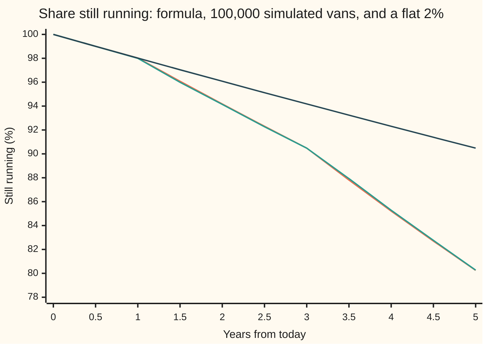
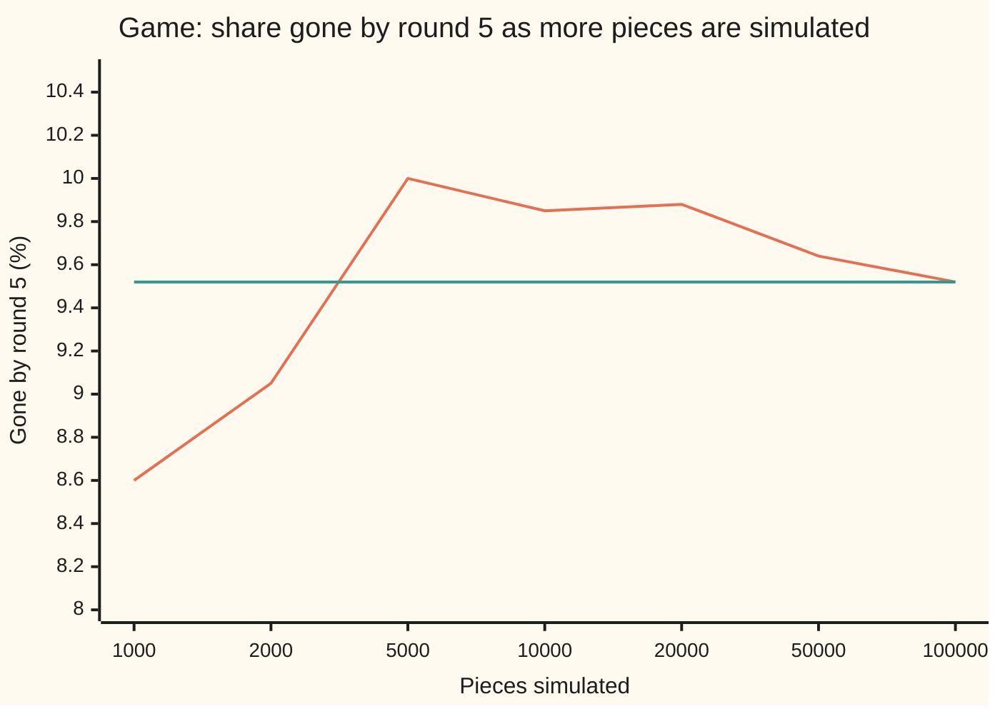

# Simulating a default time: draw a uniform number and read it off the survival curve

[Syllabus](../../../SYLLABUS.md) → [Financial mathematics](../README.md) → [Default, Survival and the Hazard Rate](../README.md#s41) → Simulating a default time

---

## General Overview

A board game has 100,000 pieces. Each piece in play is knocked out at a steady rate of 2% a round, and a knock can land at any moment inside a round. The survival formula from [The hazard rate](02-hazard-rate-and-survival-probability.md) says the share still in play after five rounds is e to the minus 0.1, which is 0.9048. So 9.516% of the pieces are gone by round five.

A computer can play the game instead of solving it. It gives each piece a date on which it will be knocked out. The dates must be random, and random in exactly the right pattern: across many pieces they must rebuild the survival curve. The recipe is short. Draw a number spread evenly between 0 and 1; call it the piece's ticket. Find the moment the survival curve falls to the ticket's height. That moment is the piece's knock-out date. The 2% curve falls to 0.85 at round 8.13, so a piece with that ticket lasts eight rounds and a bit.

Play it with 100,000 tickets and 9.521% of the pieces are gone by round five, against the formula's 9.516%. The same routine handles any curve. A used delivery van breaks down at 2% a year in year one, 4% in years two and three, and 6% in years four and five. Its tickets read off that stepped curve leave 19.731% of vans broken by year five, against the formula's 19.748%.

From here on the knock-out date is the **default time**, and the ticket is a **uniform draw**: a number equally likely to land anywhere between 0 and 1.

**To simulate a default time, draw a uniform number and find the date at which the survival curve falls to it; the chance that this date comes before any t is exactly the chance the draw lands above the curve's height at t, which is the default chance by t.**

**What kind of fact this is:** a method. The fact that makes it exact, for every survival curve and every date at once, is a theorem proved on this card in Why it works.

### The picture: the van's curve, and the draws that rebuild it



Orange: the van's survival curve from the formula. Green: the share of 100,000 simulated vans still running, counted from their drawn dates; it sits on the orange line to within 0.12 of a point. Dark blue: a flat 2% hazard, the board game's curve, for comparison; it agrees with the van for a year and then pulls away as the van's hazard steps up. To simulate one van, pick a height on the left axis, run across to the orange curve, and drop down to read the date.

---

## The formula

Notation first, in words. The uniform draw is $U$. The default time is $\tau$ (Greek "tau"), measured in rounds for the game and years for the van. The survival curve $S(t)$ is the chance of no default by date $t$. $S^{-1}$ is its inverse: it takes a height and returns the date at which the curve reaches that height.

$$\tau = S^{-1}(U), \qquad\text{that is, the date at which } S(\tau) = U.$$

**Read it aloud:** the default date is the date at which the survival curve has fallen to the drawn number.

Survival is e to the minus the area under the hazard, $S(t) = e^{-\Lambda(t)}$, so the same equation reads $\Lambda(\tau) = -\ln U$. Call the right side $E$:

$$E = -\ln U, \qquad \Lambda(\tau) = E.$$

**Read it aloud:** each piece carries a budget of hazard, minus the log of its draw; it defaults when the hazard piled up since today uses the budget up.

For a flat hazard $\lambda$ the area is $\lambda t$, and the date comes out directly:

$$\tau = \frac{E}{\lambda} = \frac{-\ln U}{\lambda}.$$

For a piecewise-flat hazard, rate $\lambda_i$ from date $t_i$ until the next node, find the step in which the budget runs out, then divide what is left by that step's rate:

$$\tau = t_i + \frac{E - \Lambda(t_i)}{\lambda_i}, \qquad\text{for the step with } \Lambda(t_i) \le E < \Lambda(t_{i+1}).$$

**Read it aloud:** spend the budget step by step; in the step where it runs out, the extra time is the leftover budget divided by that step's hazard.

| Symbol | Plain meaning | In our example | Push it up and the answer… |
| --- | --- | --- | --- |
| $U$ | the uniform draw, the piece's ticket | 0.85 | the date comes sooner |
| $\tau$ | the default time, a random date | 8.1259 rounds (game), 4.0420 years (van), for U = 0.85 | — |
| $t$, $t_i$ | a date; $t_i$ is where step i of the hazard starts | van nodes 0, 1, 3 | — |
| $S(t)$, $S^{-1}$ | survival by date t; its inverse, height in, date out | game: 0.9048 at round 5; van: 0.8025 at year 5 | — |
| $\lambda$ | a flat hazard, per round or per year ("lambda") | 0.02 | dates come sooner |
| $\lambda_i$ | the hazard on step i | van: 0.02, 0.04, 0.06 | dates in that step come sooner |
| $\Lambda(t)$ | cumulative hazard: area under the hazard from 0 to t | van: 0.02, 0.10, 0.22 at years 1, 3, 5 | survival falls |
| $E$ | the hazard budget, minus the log of the draw | 0.162519 for U = 0.85 | the date moves later |
| $N$ | number of simulated pieces | 100,000 | the count settles on the formula |
| $p$, $\hat p$ | chance of default by the date asked; the simulated share gone by then | 9.516%, 9.521% by round 5 | — |
| SE | standard error: the typical size of the gap between $\hat p$ and the truth | 0.0928 points | — |
| $r$ | the riskless rate, for the pricing example | 5% | prices fall |

### Existence, uniqueness and the edges

Before solving $S(\tau) = U$, check it has one answer.

- **Existence.** $S$ starts at 1 on day zero and falls without jumps. A draw strictly between 0 and 1 is a height the curve passes through, provided the curve falls below it eventually. The van's last rate, 6%, is carried on past year five, so its curve falls toward zero and every draw finds a date.
- **Uniqueness.** With a hazard above zero at every date, $S$ falls strictly, so it passes each height once. If the hazard is zero on a stretch, the curve is flat there and a draw at exactly that height matches a whole stretch of dates. The rule is to take the earliest. That case has probability zero for a smooth draw.
- **The edges.** A draw of 1 would mean default at day zero; a draw of 0 would mean never. The generator on this card returns neither. If the hazard switches off for good, the curve levels out at a floor above zero, and a draw below the floor never defaults: its default time is "never", written $\tau = \infty$.

### When it holds

- **The draws are uniform and independent.** A generator that favours some heights biases every date. The recurrence used here repeats only after more draws than any run on this card uses.
- **The curve is the one wanted.** The method reproduces whatever curve it is given. A curve read from bond prices gives market-implied dates; a curve from default history gives real-world dates. The two differ, and the simulation cannot tell which one it was handed.
- **The tail is stated.** Dates beyond the last node depend on how the curve is carried on. Here 80.25% of van tickets land past year five, and the 6% tail sets every one of their dates. Change the tail and those dates move; the year-five count does not.
- **The count is an estimate.** A simulated share is off from the truth by about one standard error, and the error shrinks like one over the square root of the number of pieces.

---

## Why it works

### Step 0: the survival curve sorts the tickets

At any date t, the curve's height $S(t)$ splits the interval from 0 to 1 in two. A piece has defaulted by t exactly when its ticket lies above that height. A uniform ticket lands above a height with chance one minus the height. So the chance of default by t is $1 - S(t)$, which is what the curve says it should be. That is the whole proof; the steps below make each link precise.

### Step 1: an earlier default is a higher ticket

$S$ only falls as time passes. So the date at which the curve reaches the ticket's height comes at or before t exactly when the curve at t has already fallen to the ticket or below:

$$\tau \le t \quad\text{exactly when}\quad U \ge S(t).$$

For the van at year three, $S(3) = 0.9048$. A ticket of 0.97 sits above it and defaults at 1.2615 years. A ticket of 0.85 sits below it and survives past year three, to 4.0420 years.

### Step 2: count the high tickets

A uniform draw lands in any stretch of the interval with chance equal to the stretch's length ([Uniform](../../09-Probability%20and%20statistics/04-Continuous%20Distributions/02-uniform-distribution.md)). The stretch from $S(t)$ up to 1 has length $1 - S(t)$. So the chance of default by t is $1 - S(t)$, at every date t at once. The simulated dates have the right chance of landing before year one, before year two, before any date: they follow the whole curve, not just one point on it.

### Step 3: the log turns the curve into a budget

Taking logs of $S(\tau) = U$ gives $\Lambda(\tau) = -\ln U$. The right side, $E$, has its own simple law: the chance that $E$ exceeds a number x is the chance that $U$ falls below $e^{-x}$, which is $e^{-x}$. So $E$ is an exponential draw with average 1 ([Exponential](../../09-Probability%20and%20statistics/04-Continuous%20Distributions/03-exponential-distribution.md)). Each piece carries one unit of hazard budget on average; the hazard spends it at its current rate; the piece defaults when the budget is gone.

For a flat 2%, the budget drains at 0.02 a round, so $\tau = E / 0.02$. The average lifetime is then 1 / 0.02 = 50 rounds; the 100,000 draws average 49.88.

### Step 4: a stepped hazard is spent step by step

For the van and a ticket of 0.85, the budget is $E = 0.162519$. Year one spends 0.02. Years one to three spend 0.04 a year, 0.08 more, reaching 0.10 by year three. The 6% step then needs 0.062519 more, which takes 0.062519 / 0.06 = 1.0420 years. Default at year 4.0420. No search is needed: each step is a straight line in the area, so the crossing point is one division ([The piecewise-flat hazard curve](03-piecewise-flat-hazard-curve.md) builds that area).

### Step 5: how close the count should be

Each piece is gone by year five or not, independently, with chance $p = 1 - S(5)$. The share gone out of $N$ pieces, $\hat p$, averages $p$ and scatters around it by a standard error of $\sqrt{p(1-p)/N}$. For the game with 100,000 pieces that is 0.0928 percentage points. The draws land 0.0047 points from the formula: well inside one standard error. The checks fail if any share lands more than four standard errors away.

<details>
<summary>Detailed proof</summary>

Let $S$ be any survival curve: it starts at 1, never rises, and at a jump takes the lower value just after the jump (right-continuous). Define
$$\tau = \inf\{\, t \ge 0 : S(t) \le U \,\},$$
the earliest date at which the curve is at or below the draw, with $\tau = \infty$ if there is none. This covers flat stretches (the earliest date is taken), jumps (the date of the jump is taken) and floors (never).

Claim: $\tau \le t$ exactly when $S(t) \le U$. If $S(t) \le U$, then t is in the set, so the earliest member is at most t. Conversely, if $\tau \le t$, pick dates in the set falling to $\tau$; right-continuity gives $S(\tau) \le U$, and since $S$ never rises, $S(t) \le S(\tau) \le U$.

Then $P(\tau \le t) = P(U \ge S(t)) = 1 - S(t)$, because a uniform draw lands in an interval of length $1 - S(t)$ with that chance (the endpoint has chance zero). So $\tau$ has survival curve $S$, for every t.

For the budget: $P(E > x) = P(U < e^{-x}) = e^{-x}$ for x ≥ 0, the survival curve of an exponential with rate 1. When $S = e^{-\Lambda}$ with $\Lambda$ continuous and rising, $S(\tau) = U$ is the same equation as $\Lambda(\tau) = E$.

</details>

<details>
<summary>Why the survival curve and not the default curve?</summary>

The general inverse-transform recipe ([Inverse transform](../../09-Probability%20and%20statistics/11-Simulation/02-inverse-transform-sampling.md)) inverts the default curve, $1 - S(t)$, at the draw. Inverting $S$ instead uses $1 - U$ in place of $U$. When $U$ is uniform, so is $1 - U$, so both give dates with the same law. Credit desks invert $S$ because the budget form, $\Lambda(\tau) = -\ln U$, then falls straight out.

</details>

### The other road: play the game tick by tick

The definition of the hazard gives a second way to simulate that never inverts anything. Cut each round into ten ticks. At each tick, a piece still in play is knocked out with chance rate times tick, 0.02 × 0.1 = 0.002. Play fifty ticks. This is the hazard's definition acted out, and it needs a fresh random number every tick instead of one per piece. With fresh numbers, 9.423% of 100,000 pieces are gone by round five, about one standard error from the formula. Ticks cost time and add a small error from their size; the inversion costs one draw and one division and has no such error. The general machinery of averaging simulated outcomes is on [Monte Carlo pricing](../06-Numerical%20Methods%20for%20Pricing/01-monte-carlo-pricing.md).

---

## Worked numbers, by hand

Four tickets, read off the game's flat 2% curve and the van's stepped curve.

| Step | Arithmetic | Value |
| --- | --- | --- |
| ticket 0.97: budget | $-\ln 0.97$ | 0.030459 |
| game date | 0.030459 / 0.02 | 1.5230 rounds |
| van date | year 1 spends 0.02; 0.010459 / 0.04 | 1 + 0.2615 = 1.2615 years |
| ticket 0.90: budget | $-\ln 0.90$ | 0.105361 |
| game date | 0.105361 / 0.02 | 5.2680 rounds: survives round 5 |
| van date | 0.10 spent by year 3; 0.005361 / 0.06 | 3 + 0.0893 = 3.0893 years |
| ticket 0.85: budget | $-\ln 0.85$ | 0.162519 |
| game date | 0.162519 / 0.02 | 8.1259 rounds |
| van date | 0.10 spent by year 3; 0.062519 / 0.06 | 3 + 1.0420 = 4.0420 years |
| ticket 0.50: budget | $-\ln 0.50$ | 0.693147 |
| game date | 0.693147 / 0.02 | 34.6574 rounds: the median lifetime |
| van date | 0.10 spent by year 3; 0.593147 / 0.06 on the 6% step and its tail | 3 + 9.8858 = 12.8858 years |
| **100,000 tickets, game, gone by round 5** | count of dates ≤ 5 | **9.521%, formula 9.516%** |
| **100,000 tickets, van, gone by year 5** | count of dates ≤ 5 | **19.731%, formula 19.748%** |

One draw per piece and one division turn a survival curve into a population of dated defaults, and the population's counts agree with the curve to within the standard error.

### Year by year: the draws follow the whole curve

A simulation that matched year five but got the years in between wrong would misprice anything that pays on the default date. The van's draws, split by the year of breakdown:

```
van breakdowns in each year, % of all vans (each █ = 0.25 points)
year 1   draws    ████████               2.00
         formula  ████████               1.98
year 2   draws    ███████████████        3.86
         formula  ███████████████        3.84
year 3   draws    ███████████████        3.66
         formula  ███████████████        3.69
year 4   draws    █████████████████████  5.20
         formula  █████████████████████  5.27
year 5   draws    ████████████████████   5.01
         formula  ████████████████████   4.96
```

Each year's gap is under a tenth of a point. The jump from year three to year four is the step from 4% to 6% in the hazard, and the draws show it.

### How many pieces are enough



Orange: the running share gone by round five after the first n tickets. Green: the formula, 9.52%. At 1,000 pieces the share is 8.60%; at 100,000 it is 9.52%. The standard error falls like one over the square root of the number of pieces: a hundred times the pieces buys ten times the accuracy.

### The same draws, as a pricing engine

The game at 2% a round is the shelf's house company at 2% a year: Northwind Lines, flat hazard 2%, riskless rate $r$ = 5%, 40% recovery. The dates already drawn price Northwind promises. A $100 payment due in five years, paid only if Northwind is still alive, is worth $100 × e^{-0.25}$ × (share alive at five). The formula gives $70.47; the draws give $70.47 (70.4688 against 70.4651). Now add $40 paid on the default date itself if Northwind fails first. The draws discount each $40 from its own date and average: $73.85, with a standard error of 4 cents. The formula, derived on [A risky bond from the hazard curve](../44-Reduced-Form%20Models%20-%20Risky%20Bonds%2C%20Spreads%20and%20Random%20Hazards/01-pricing-a-defaultable-bond-from-the-survival-curve.md), gives $73.84. The draws needed no formula at all; that is why they serve as the second road to every price on the later credit shelves.

### What breaks if you drop a piece

| Mistake | Comes out at | What went wrong |
| --- | --- | --- |
| Multiply the budget by the rate instead of dividing | 100.00% gone by round 5 (right: 9.52%) | Every date shrinks by the rate twice over, so every piece is gone within a round |
| Read 2% as a coin toss at the end of each round | 9.61% gone by round 5 (right: 9.52%) | A 2% coin takes 2.00% a round; a 2% hazard takes 1.98%, because pieces already out cannot be knocked out again |
| Run the van at its five-year average, 4.4% flat | 4.30% broken in year 1 (right: 1.98%) | The year-five share is right and every year before it is wrong |
| Run the van at its latest rate, 6%, for all five years | 25.92% broken by year 5 (right: 19.75%) | Survival depends on the area under the hazard, not its last value |

---

## Code, from first principles, and it actually runs

The code draws 100,000 tickets from the same recurrence as the Monte Carlo pricing card and reads each one off both curves. It reaches the answers by four independent roads: the survival formula; inversion step by step; inversion by bisection, a root finder that halves an interval sixty-four times, applied to the same tickets; and the tick-by-tick game on fresh random numbers. It then checks the average lifetime against 1 / 0.02, prices the two Northwind promises by draws and by formula, and prints every number on this card. Each share is compared with its formula to four standard errors.

### Python

```python
# Simulating a default time -- the check behind the card.  Standard library only.
# Nothing is imported that already knows the answer: the uniform numbers come
# from the recurrence on the Monte Carlo card, the root finder is bisection
# written out, and every survival number is exp of minus an area.
from math import exp, log, sqrt

SEED, PIECES, MOD = 20260914, 100000, 1 << 32
MARKS = (1000, 2000, 5000, 10000, 20000, 50000, 100000)
LAM = 0.02                                  # the game: 2% a round, flat
NODES = (0.0, 1.0, 3.0, 5.0)                # the van: hazard flat between nodes
RATES = (0.02, 0.04, 0.06)                  # the last rate carries on past year 5
R, REC = 0.05, 40.0                         # Northwind: riskless rate, $ recovered per $100

def uniform(state):                         # one step of the recurrence, whole numbers
    state = (1664525 * state + 1013904223) % MOD
    return state, (state + 0.5) / MOD       # strictly inside 0 and 1

def area(t, rates=RATES):                   # cumulative hazard: area under the steps up to t
    total = 0.0
    for i, lam in enumerate(rates):
        end = NODES[i + 1] if i + 1 < len(rates) else float("inf")
        total += lam * max(0.0, min(t, end) - NODES[i])
    return total

def surv(t, rates=RATES):
    return exp(-area(t, rates))

def invert_steps(u):                        # road A: walk the steps until the area reaches -ln u
    need = -log(u)
    for i, lam in enumerate(RATES):
        end = NODES[i + 1] if i + 1 < len(RATES) else float("inf")
        if need <= lam * (end - NODES[i]):
            return NODES[i] + need / lam, i, need   # date, step, budget left on entering it
        need -= lam * (end - NODES[i])

def invert_bisect(u):                       # road B: solve S(t) = u by halving an interval
    lo, hi = 0.0, 1000.0
    for _ in range(64):
        mid = 0.5 * (lo + hi)
        if surv(mid) > u: lo = mid
        else: hi = mid
    return 0.5 * (lo + hi)

# ---- one uniform per piece, read off both curves ----
state, flat, van, misfits = SEED, [], [], 0
for _ in range(PIECES):
    state, u = uniform(state)
    flat.append(-log(u) / LAM)
    van.append(invert_steps(u)[0])
    misfits += abs(van[-1] - invert_bisect(u)) > 1e-9

def gone(times, t, n=PIECES):
    return sum(1 for x in times[:n] if x <= t) / n

def se(p, n): return sqrt(p * (1 - p) / n)

# ---- road C for the game: tick by tick, knocked out with chance rate x tick ----
tick_out = 0
for _ in range(PIECES):
    for _ in range(50):                     # 50 ticks of 0.1 round
        state, u = uniform(state)
        if u < LAM * 0.1:
            tick_out += 1
            break
tick = tick_out / PIECES

f_exact, f_sim = 1 - exp(-LAM * 5), gone(flat, 5.0)
v_exact, v_sim = 1 - surv(5.0), gone(van, 5.0)
life = sum(flat) / PIECES
pays = [REC * exp(-R * x) if x <= 5 else 100 * exp(-R * 5) for x in flat]
bond_draws = sum(pays) / PIECES
bond_se = sqrt(sum((p - bond_draws) ** 2 for p in pays) / (PIECES - 1) / PIECES)
bond_formula = 100 * exp(-(R + LAM) * 5) + REC * LAM / (R + LAM) * (1 - exp(-(R + LAM) * 5))
print("hand draws: U, -ln U, game round, van year")
for u in (0.97, 0.90, 0.85, 0.50):
    tau, i, left = invert_steps(u)
    print(f"  U = {u:.2f}   -ln U {-log(u):.6f}   game {-log(u) / LAM:8.4f}   van {tau:8.4f}"
          f" = {NODES[i]:.0f} + {left:.6f} / {RATES[i]:.2f} = {NODES[i]:.0f} + {left / RATES[i]:.4f}")
print("van: area at years 1, 3, 5     " + " ".join(f"{area(t):.6f}" for t in (1.0, 3.0, 5.0)))
print("van: survival at years 1, 3, 5 " + " ".join(f"{surv(t):.6f}" for t in (1.0, 3.0, 5.0)))
rows = [
    ("game: % gone by round 5, formula", 100 * f_exact),
    ("game: % gone by round 5, inverted draws", 100 * f_sim),
    ("game: % gone by round 5, tick by tick", 100 * tick),
    ("game: gap, draws minus formula, % points", 100 * (f_sim - f_exact)),
    ("game: survival at round 5", exp(-LAM * 5)),
    ("game: standard error, % points", 100 * se(f_sim, PIECES)),
    ("game: average lifetime, draws", life), ("game: average lifetime, 1/rate", 1 / LAM),
    ("van: % gone by year 5, formula", 100 * v_exact),
    ("van: % gone by year 5, inverted draws", 100 * v_sim),
    ("van: standard error, % points", 100 * se(v_sim, PIECES)),
    ("van: % of tickets dated past year 5", 100 * (1 - v_sim)),
    ("Northwind $100 in 5y, alive only, formula", 100 * exp(-R * 5) * exp(-LAM * 5)),
    ("Northwind $100 in 5y, alive only, draws", 100 * exp(-R * 5) * (1 - f_sim)),
    ("Northwind, $40 at default date, draws", bond_draws),
    ("Northwind, $40 at default date, formula", bond_formula),
    ("Northwind, standard error of the draws", bond_se),
    ("wrong: rate times -ln U, % gone by 5", 100 * sum(1 for x in flat if x * LAM * LAM <= 5) / PIECES),
    ("wrong: 2% per round as a coin, % gone", 100 * (1 - 0.98 ** 5)),
    ("wrong: van at its average 4.4%, year-1 %", 100 * (1 - exp(-0.044))),
    ("  right: van year-1 %", 100 * (1 - surv(1.0))),
    ("wrong: van at 6% throughout, % gone by 5", 100 * (1 - exp(-0.30))),
    ("try: van years 4-5 at 3%, % gone by 5", 100 * (1 - surv(5.0, (0.02, 0.04, 0.03)))),
    ("try: 1,000 pieces, % gone by round 5", 100 * gone(flat, 5.0, 1000)),
]
for name, v in rows:
    print(f"{name:<44} {v:>10.4f}")
print(f"van: draws where steps and bisection split {misfits:>6d} of {PIECES}")
print("van, year by year: % defaulting, draws vs formula")
for y in range(1, 6):
    sim = gone(van, y) - gone(van, y - 1)
    print(f"  year {y}   draws {100 * sim:6.2f}   formula {100 * (surv(y - 1.0) - surv(float(y))):6.2f}")
print("chart, % alive at 0, 0.5, ..., 5 years")
half = [0.5 * i for i in range(11)]
print("  van formula " + " ".join(f"{100 * surv(t):6.2f}" for t in half))
print("  van draws   " + " ".join(f"{100 * (1 - gone(van, t)):6.2f}" for t in half))
print("  flat 2%     " + " ".join(f"{100 * exp(-LAM * t):6.2f}" for t in half))
print("chart, game % gone by round 5 after n pieces")
print("  " + " ".join(f"{m:>6d}" for m in MARKS))
print("  " + " ".join(f"{100 * gone(flat, 5.0, m):6.2f}" for m in MARKS))

assert abs(f_sim - f_exact) < 4 * se(f_sim, PIECES), "inverted draws vs the flat formula"
assert abs(tick - f_exact) < 4 * se(tick, PIECES), "tick-by-tick game vs the flat formula"
assert abs(v_sim - v_exact) < 4 * se(v_sim, PIECES), "van draws vs e^-area"
assert abs(v_exact - (1 - exp(-(0.02 * 1 + 0.04 * 2 + 0.06 * 2)))) < 1e-12, "area by the steps vs by hand"
assert misfits == 0, "stepwise inversion vs bisection on S"
assert abs(life - 1 / LAM) < 4 * (1 / LAM) / sqrt(PIECES), "average lifetime vs 1/rate"
assert abs(bond_draws - bond_formula) < 4 * bond_se, "priced by draws vs priced by formula"
print("ALL CHECKS PASS")
```

**Ran 2026-09-28 on macOS, Python 3.14.6, standard library only. All checks passed. Output, pasted from the run:**

```
hand draws: U, -ln U, game round, van year
  U = 0.97   -ln U 0.030459   game   1.5230   van   1.2615 = 1 + 0.010459 / 0.04 = 1 + 0.2615
  U = 0.90   -ln U 0.105361   game   5.2680   van   3.0893 = 3 + 0.005361 / 0.06 = 3 + 0.0893
  U = 0.85   -ln U 0.162519   game   8.1259   van   4.0420 = 3 + 0.062519 / 0.06 = 3 + 1.0420
  U = 0.50   -ln U 0.693147   game  34.6574   van  12.8858 = 3 + 0.593147 / 0.06 = 3 + 9.8858
van: area at years 1, 3, 5     0.020000 0.100000 0.220000
van: survival at years 1, 3, 5 0.980199 0.904837 0.802519
game: % gone by round 5, formula                 9.5163
game: % gone by round 5, inverted draws          9.5210
game: % gone by round 5, tick by tick            9.4230
game: gap, draws minus formula, % points         0.0047
game: survival at round 5                        0.9048
game: standard error, % points                   0.0928
game: average lifetime, draws                   49.8801
game: average lifetime, 1/rate                  50.0000
van: % gone by year 5, formula                  19.7481
van: % gone by year 5, inverted draws           19.7310
van: standard error, % points                    0.1258
van: % of tickets dated past year 5             80.2690
Northwind $100 in 5y, alive only, formula       70.4688
Northwind $100 in 5y, alive only, draws         70.4651
Northwind, $40 at default date, draws           73.8450
Northwind, $40 at default date, formula         73.8438
Northwind, standard error of the draws           0.0394
wrong: rate times -ln U, % gone by 5           100.0000
wrong: 2% per round as a coin, % gone            9.6079
wrong: van at its average 4.4%, year-1 %         4.3046
  right: van year-1 %                            1.9801
wrong: van at 6% throughout, % gone by 5        25.9182
try: van years 4-5 at 3%, % gone by 5           14.7856
try: 1,000 pieces, % gone by round 5             8.6000
van: draws where steps and bisection split      0 of 100000
van, year by year: % defaulting, draws vs formula
  year 1   draws   2.00   formula   1.98
  year 2   draws   3.86   formula   3.84
  year 3   draws   3.66   formula   3.69
  year 4   draws   5.20   formula   5.27
  year 5   draws   5.01   formula   4.96
chart, % alive at 0, 0.5, ..., 5 years
  van formula 100.00  99.00  98.02  96.08  94.18  92.31  90.48  87.81  85.21  82.70  80.25
  van draws   100.00  99.00  98.00  95.99  94.14  92.27  90.48  87.93  85.28  82.76  80.27
  flat 2%     100.00  99.00  98.02  97.04  96.08  95.12  94.18  93.24  92.31  91.39  90.48
chart, game % gone by round 5 after n pieces
    1000   2000   5000  10000  20000  50000 100000
    8.60   9.05  10.00   9.85   9.88   9.64   9.52
ALL CHECKS PASS
```

The two inversions agree on every one of the 100,000 tickets to a billionth of a year. The three simulated shares sit within about one standard error of the formula.

### Rust

Same tickets, same roads. The recurrence runs on whole numbers, so both languages draw identical tickets and print identical counts.

```rust
// Simulating a default time -- the same check as simulating_a_default_time_check.py, in Rust.
// Standard library only, no crates.  The uniform numbers come from the recurrence on
// the Monte Carlo card, the root finder is bisection written out, and every survival
// number is exp of minus an area.
const SEED: u64 = 20260914;
const PIECES: usize = 100000;
const MARKS: [usize; 7] = [1000, 2000, 5000, 10000, 20000, 50000, 100000];
const LAM: f64 = 0.02; // the game: 2% a round, flat
const NODES: [f64; 4] = [0.0, 1.0, 3.0, 5.0]; // the van: hazard flat between nodes
const RATES: [f64; 3] = [0.02, 0.04, 0.06]; // the last rate carries on past year 5
const R: f64 = 0.05; // Northwind: riskless rate
const REC: f64 = 40.0; // $ recovered per $100

fn uniform(state: &mut u64) -> f64 { // one step of the recurrence, whole numbers
    *state = (1664525 * *state + 1013904223) % (1u64 << 32);
    (*state as f64 + 0.5) / 4294967296.0 // strictly inside 0 and 1
}

fn seg_end(i: usize, rates: &[f64]) -> f64 {
    if i + 1 < rates.len() { NODES[i + 1] } else { f64::INFINITY }
}

fn area(t: f64, rates: &[f64]) -> f64 { // cumulative hazard: area under the steps up to t
    let mut total = 0.0;
    for (i, lam) in rates.iter().enumerate() {
        total += lam * (t.min(seg_end(i, rates)) - NODES[i]).max(0.0);
    }
    total
}

fn surv(t: f64, rates: &[f64]) -> f64 { (-area(t, rates)).exp() }

fn invert_steps(u: f64) -> (f64, usize, f64) { // road A: walk the steps until the area reaches -ln u
    let mut need = -u.ln();
    for (i, lam) in RATES.iter().enumerate() {
        let width = seg_end(i, &RATES) - NODES[i];
        if need <= lam * width { return (NODES[i] + need / lam, i, need); } // date, step, budget left
        need -= lam * width;
    }
    unreachable!()
}

fn invert_bisect(u: f64) -> f64 { // road B: solve S(t) = u by halving an interval
    let (mut lo, mut hi) = (0.0, 1000.0);
    for _ in 0..64 {
        let mid = 0.5 * (lo + hi);
        if surv(mid, &RATES) > u { lo = mid; } else { hi = mid; }
    }
    0.5 * (lo + hi)
}

fn gone(times: &[f64], t: f64, n: usize) -> f64 {
    times[..n].iter().filter(|&&x| x <= t).count() as f64 / n as f64
}

fn se(p: f64, n: usize) -> f64 { (p * (1.0 - p) / n as f64).sqrt() }

fn main() {
    // ---- one uniform per piece, read off both curves ----
    let (mut state, mut flat, mut van, mut misfits) = (SEED, Vec::new(), Vec::new(), 0usize);
    for _ in 0..PIECES {
        let u = uniform(&mut state);
        flat.push(-u.ln() / LAM);
        van.push(invert_steps(u).0);
        if (van[van.len() - 1] - invert_bisect(u)).abs() > 1e-9 { misfits += 1; }
    }
    // ---- road C for the game: tick by tick, knocked out with chance rate x tick ----
    let mut tick_out = 0usize;
    for _ in 0..PIECES {
        for _ in 0..50 { // 50 ticks of 0.1 round
            if uniform(&mut state) < LAM * 0.1 { tick_out += 1; break; }
        }
    }
    let tick = tick_out as f64 / PIECES as f64;

    let (f_exact, f_sim) = (1.0 - (-LAM * 5.0).exp(), gone(&flat, 5.0, PIECES));
    let (v_exact, v_sim) = (1.0 - surv(5.0, &RATES), gone(&van, 5.0, PIECES));
    let life = flat.iter().sum::<f64>() / PIECES as f64;
    let pays: Vec<f64> = flat.iter()
        .map(|&x| if x <= 5.0 { REC * (-R * x).exp() } else { 100.0 * (-R * 5.0).exp() }).collect();
    let bond_draws = pays.iter().sum::<f64>() / PIECES as f64;
    let var = pays.iter().map(|p| (p - bond_draws).powi(2)).sum::<f64>() / (PIECES - 1) as f64;
    let bond_se = (var / PIECES as f64).sqrt();
    let bond_formula = 100.0 * (-(R + LAM) * 5.0).exp()
        + REC * LAM / (R + LAM) * (1.0 - (-(R + LAM) * 5.0).exp());
    println!("hand draws: U, -ln U, game round, van year");
    for u in [0.97_f64, 0.90, 0.85, 0.50] {
        let (tau, i, left) = invert_steps(u);
        println!("  U = {:.2}   -ln U {:.6}   game {:8.4}   van {:8.4} = {:.0} + {:.6} / {:.2} = {:.0} + {:.4}",
            u, -u.ln(), -u.ln() / LAM, tau, NODES[i], left, RATES[i], NODES[i], left / RATES[i]);
    }
    let three = |f: &dyn Fn(f64) -> f64| [1.0, 3.0, 5.0].iter().map(|&t| format!("{:.6}", f(t))).collect::<Vec<_>>().join(" ");
    println!("van: area at years 1, 3, 5     {}", three(&|t| area(t, &RATES)));
    println!("van: survival at years 1, 3, 5 {}", three(&|t| surv(t, &RATES)));
    let rows: Vec<(&str, f64)> = vec![
        ("game: % gone by round 5, formula", 100.0 * f_exact),
        ("game: % gone by round 5, inverted draws", 100.0 * f_sim),
        ("game: % gone by round 5, tick by tick", 100.0 * tick),
        ("game: gap, draws minus formula, % points", 100.0 * (f_sim - f_exact)),
        ("game: survival at round 5", (-LAM * 5.0).exp()),
        ("game: standard error, % points", 100.0 * se(f_sim, PIECES)),
        ("game: average lifetime, draws", life), ("game: average lifetime, 1/rate", 1.0 / LAM),
        ("van: % gone by year 5, formula", 100.0 * v_exact),
        ("van: % gone by year 5, inverted draws", 100.0 * v_sim),
        ("van: standard error, % points", 100.0 * se(v_sim, PIECES)),
        ("van: % of tickets dated past year 5", 100.0 * (1.0 - v_sim)),
        ("Northwind $100 in 5y, alive only, formula", 100.0 * (-R * 5.0).exp() * (-LAM * 5.0).exp()),
        ("Northwind $100 in 5y, alive only, draws", 100.0 * (-R * 5.0).exp() * (1.0 - f_sim)),
        ("Northwind, $40 at default date, draws", bond_draws),
        ("Northwind, $40 at default date, formula", bond_formula),
        ("Northwind, standard error of the draws", bond_se),
        ("wrong: rate times -ln U, % gone by 5",
            100.0 * flat.iter().filter(|&&x| x * LAM * LAM <= 5.0).count() as f64 / PIECES as f64),
        ("wrong: 2% per round as a coin, % gone", 100.0 * (1.0 - 0.98_f64.powi(5))),
        ("wrong: van at its average 4.4%, year-1 %", 100.0 * (1.0 - (-0.044_f64).exp())),
        ("  right: van year-1 %", 100.0 * (1.0 - surv(1.0, &RATES))),
        ("wrong: van at 6% throughout, % gone by 5", 100.0 * (1.0 - (-0.30_f64).exp())),
        ("try: van years 4-5 at 3%, % gone by 5", 100.0 * (1.0 - surv(5.0, &[0.02, 0.04, 0.03]))),
        ("try: 1,000 pieces, % gone by round 5", 100.0 * gone(&flat, 5.0, 1000)),
    ];
    for (name, v) in &rows { println!("{:<44} {:>10.4}", name, v); }
    println!("van: draws where steps and bisection split {:>6} of {}", misfits, PIECES);
    println!("van, year by year: % defaulting, draws vs formula");
    for y in 1..=5 {
        let yf = y as f64;
        let sim = gone(&van, yf, PIECES) - gone(&van, yf - 1.0, PIECES);
        let exact = surv(yf - 1.0, &RATES) - surv(yf, &RATES);
        println!("  year {}   draws {:6.2}   formula {:6.2}", y, 100.0 * sim, 100.0 * exact);
    }
    println!("chart, % alive at 0, 0.5, ..., 5 years");
    let half: Vec<f64> = (0..11).map(|i| 0.5 * i as f64).collect();
    let line = |f: &dyn Fn(f64) -> f64| half.iter().map(|&t| format!("{:6.2}", f(t))).collect::<Vec<_>>().join(" ");
    println!("  van formula {}", line(&|t| 100.0 * surv(t, &RATES)));
    println!("  van draws   {}", line(&|t| 100.0 * (1.0 - gone(&van, t, PIECES))));
    println!("  flat 2%     {}", line(&|t| 100.0 * (-LAM * t).exp()));
    println!("chart, game % gone by round 5 after n pieces");
    println!("  {}", MARKS.iter().map(|m| format!("{:>6}", m)).collect::<Vec<_>>().join(" "));
    println!("  {}", MARKS.iter().map(|&m| format!("{:6.2}", 100.0 * gone(&flat, 5.0, m))).collect::<Vec<_>>().join(" "));

    assert!((f_sim - f_exact).abs() < 4.0 * se(f_sim, PIECES), "inverted draws vs the flat formula");
    assert!((tick - f_exact).abs() < 4.0 * se(tick, PIECES), "tick-by-tick game vs the flat formula");
    assert!((v_sim - v_exact).abs() < 4.0 * se(v_sim, PIECES), "van draws vs e^-area");
    assert!((v_exact - (1.0 - (-(0.02 * 1.0 + 0.04 * 2.0 + 0.06 * 2.0_f64)).exp())).abs() < 1e-12, "area by the steps vs by hand");
    assert!(misfits == 0, "stepwise inversion vs bisection on S");
    assert!((life - 1.0 / LAM).abs() < 4.0 * (1.0 / LAM) / (PIECES as f64).sqrt(), "average lifetime vs 1/rate");
    assert!((bond_draws - bond_formula).abs() < 4.0 * bond_se, "priced by draws vs priced by formula");
    println!("ALL CHECKS PASS");
}
```

**Ran 2026-09-28 on macOS, rustc 1.98.1, no crates. All checks passed. Output, pasted from the run:**

```
hand draws: U, -ln U, game round, van year
  U = 0.97   -ln U 0.030459   game   1.5230   van   1.2615 = 1 + 0.010459 / 0.04 = 1 + 0.2615
  U = 0.90   -ln U 0.105361   game   5.2680   van   3.0893 = 3 + 0.005361 / 0.06 = 3 + 0.0893
  U = 0.85   -ln U 0.162519   game   8.1259   van   4.0420 = 3 + 0.062519 / 0.06 = 3 + 1.0420
  U = 0.50   -ln U 0.693147   game  34.6574   van  12.8858 = 3 + 0.593147 / 0.06 = 3 + 9.8858
van: area at years 1, 3, 5     0.020000 0.100000 0.220000
van: survival at years 1, 3, 5 0.980199 0.904837 0.802519
game: % gone by round 5, formula                 9.5163
game: % gone by round 5, inverted draws          9.5210
game: % gone by round 5, tick by tick            9.4230
game: gap, draws minus formula, % points         0.0047
game: survival at round 5                        0.9048
game: standard error, % points                   0.0928
game: average lifetime, draws                   49.8801
game: average lifetime, 1/rate                  50.0000
van: % gone by year 5, formula                  19.7481
van: % gone by year 5, inverted draws           19.7310
van: standard error, % points                    0.1258
van: % of tickets dated past year 5             80.2690
Northwind $100 in 5y, alive only, formula       70.4688
Northwind $100 in 5y, alive only, draws         70.4651
Northwind, $40 at default date, draws           73.8450
Northwind, $40 at default date, formula         73.8438
Northwind, standard error of the draws           0.0394
wrong: rate times -ln U, % gone by 5           100.0000
wrong: 2% per round as a coin, % gone            9.6079
wrong: van at its average 4.4%, year-1 %         4.3046
  right: van year-1 %                            1.9801
wrong: van at 6% throughout, % gone by 5        25.9182
try: van years 4-5 at 3%, % gone by 5           14.7856
try: 1,000 pieces, % gone by round 5             8.6000
van: draws where steps and bisection split      0 of 100000
van, year by year: % defaulting, draws vs formula
  year 1   draws   2.00   formula   1.98
  year 2   draws   3.86   formula   3.84
  year 3   draws   3.66   formula   3.69
  year 4   draws   5.20   formula   5.27
  year 5   draws   5.01   formula   4.96
chart, % alive at 0, 0.5, ..., 5 years
  van formula 100.00  99.00  98.02  96.08  94.18  92.31  90.48  87.81  85.21  82.70  80.25
  van draws   100.00  99.00  98.00  95.99  94.14  92.27  90.48  87.93  85.28  82.76  80.27
  flat 2%     100.00  99.00  98.02  97.04  96.08  95.12  94.18  93.24  92.31  91.39  90.48
chart, game % gone by round 5 after n pieces
    1000   2000   5000  10000  20000  50000 100000
    8.60   9.05  10.00   9.85   9.88   9.64   9.52
ALL CHECKS PASS
```

The two outputs agree line for line.

> [!TIP]
> **Try changing**
> Guess first, then run.
> - **Simulate fewer pieces.** Read the share after the first 1,000 tickets. It is **8.60%**, nearly a point from 9.52%. The chart above shows it settling as the count grows.
> - **Soften the van's later years.** Guess the year-five share with the 6% step cut to 3%. The `try` row computes it with rates `0.02, 0.04, 0.03`: it drops from 19.75% to **14.79%**, because only the area under the last two years changed.
> - **Change the seed.** Set `SEED = 1`. The game's share moves, typically by about one standard error, **0.0928** points, and the asserts still pass. A move of several standard errors would mean a broken generator.

---

## The usual mistake

> [!warning]
> **Checking one number instead of the curve.** A simulation of the van at a flat 4.4% gives the right share broken by year five and puts 4.30% of breakdowns in year one, where the stepped curve puts 1.98%. Anything that pays on the default date, recovery or a protection payment, is then mispriced. The test of a default-time simulator is the whole curve: year-by-year counts, as in the bars above.
>
> Smaller traps:
> - **Multiplying instead of dividing.** $\tau = -\ln U / \lambda$. Multiplying by $\lambda$ puts 100.00% of the game's pieces out by round five.
> - **Forgetting the tail.** For the van, 80.25% of tickets land beyond year five. Code that stops at the last node returns no date for four draws in five.
> - **Reusing the ticket.** Seeding the generator afresh for each piece gives every piece the same ticket and so the same date. The shares come out all or nothing.
> - **Reading 2% as a per-round coin toss.** That is a different game, with 9.61% gone by round five instead of 9.52%. A hazard is a rate; its one-round chance is $1 - e^{-0.02}$ = 1.98%.

---

## Where you meet it in real life

- **Credit desks.** Bonds and credit default swaps with closed-form prices are checked by simulating default dates and averaging payoffs, as the Northwind example does; the swap's legs are on [Pricing a CDS](../42-Credit%20Default%20Swaps%20-%20Pricing%2C%20the%20Par%20Spread%20and%20the%20Hazard%20Behind%20It/02-cds-legs-risky-annuity-and-par-spread.md).
- **Portfolios of loans.** David Li's 2000 copula model gives each company its own survival curve and its own ticket, then makes the tickets move together. Every default date is still read off its curve by this card's inversion.
- **Counterparty risk.** A bank's exposure to a trading partner is simulated along market paths, and the partner's default date is drawn the same way, so the loss is counted on the date it happens.
- **Random hazards.** When the hazard itself moves with the economy, the budget stays one exponential draw and the clock spends it along a random path: [A random hazard](../44-Reduced-Form%20Models%20-%20Risky%20Bonds%2C%20Spreads%20and%20Random%20Hazards/03-stochastic-hazard-cox-process.md).
- **Machines and lives.** Reliability engineers simulate failure dates of pumps and vans from failure-rate curves; actuaries simulate deaths from mortality tables. Same inversion, different curve.
- **Rating paths.** Simulating a company's grade year by year uses the transition matrix of [Rating transition matrices](04-rating-transition-matrix-and-cumulative-default-rates.md) with one uniform draw per year instead of one per company.

> **Say it back**
> A survival curve can be turned into random default dates by drawing a uniform number and finding the date at which the curve falls to it. The draw lands above the curve's height at t exactly when default has happened by t, so the dates follow the curve at every date at once. Taking logs, each piece carries an exponential budget of hazard and defaults when the piled-up hazard spends it; for a stepped hazard that is one division in the right step. The simulated counts match the formula to within a standard error that shrinks with the square root of the number of pieces. Because the dates are real dates, the same draws price anything that pays on default.

---

## What this builds on

- [The piecewise-flat hazard curve](03-piecewise-flat-hazard-curve.md): the van's stepped hazard and its cumulative area, which this card inverts one step at a time.
- [Inverse transform](../../09-Probability%20and%20statistics/11-Simulation/02-inverse-transform-sampling.md): the general recipe of feeding a uniform draw through an inverted curve, here applied to survival.
- [Uniform](../../09-Probability%20and%20statistics/04-Continuous%20Distributions/02-uniform-distribution.md): why a draw lands above a height h with chance 1 − h.
- [Monte Carlo pricing](../06-Numerical%20Methods%20for%20Pricing/01-monte-carlo-pricing.md): the hand-written random-number recurrence, and the standard error of a simulated average.

## Where this goes next

- [A risky bond from the hazard curve](../44-Reduced-Form%20Models%20-%20Risky%20Bonds%2C%20Spreads%20and%20Random%20Hazards/01-pricing-a-defaultable-bond-from-the-survival-curve.md): prices a risky bond from the survival curve in closed form; this card's draws are the second road to each of its prices.

The draws price a promise, but they do not say what a bond's price reveals about the curve; the bond card runs that link in both directions.

---

## Sources

Verified 2026-09-28: every link below resolves to the publisher's page, the author's page, or the work's DOI record.

- Devroye, Luc. *Non-Uniform Random Variate Generation*. Springer, 1986. [doi:10.1007/978-1-4613-8643-8](https://doi.org/10.1007/978-1-4613-8643-8); the author's free edition at [luc.devroye.org](http://luc.devroye.org/rnbookindex.html). The inversion method in general, with its proof and its edge cases.
- Glasserman, Paul. *Monte Carlo Methods in Financial Engineering*. Springer, 2003. [doi:10.1007/978-0-387-21617-1](https://doi.org/10.1007/978-0-387-21617-1). Inversion, standard errors, and simulation of default times for credit pricing.
- Li, David X. "On Default Correlation: A Copula Function Approach." *The Journal of Fixed Income* 9, no. 4 (2000): 43–54. [doi:10.3905/jfi.2000.319253](https://doi.org/10.3905/jfi.2000.319253). Default times drawn as the inverse of a survival curve at a uniform draw, then joined across companies.
- Lando, David. *Credit Risk Modeling: Theory and Applications*. Princeton University Press, 2004. [Publisher page](https://press.princeton.edu/books/hardcover/9780691089294/credit-risk-modeling). Hazard rates, the exponential budget construction of a default time, and its random-hazard extension.
