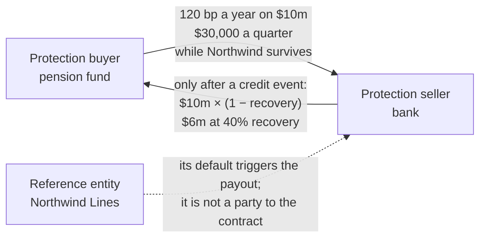
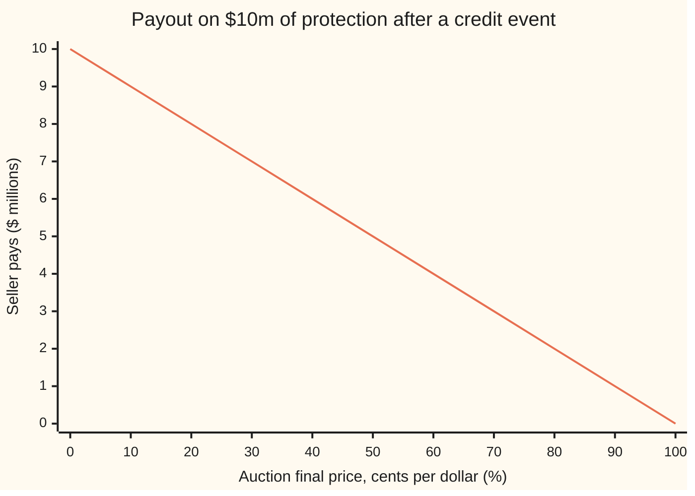

# The credit default swap: insurance on a borrower, quoted as a spread, and who pays what when

[Syllabus](../../../SYLLABUS.md) → [Financial mathematics](../README.md) → [Credit Default Swaps - Pricing, the Par Spread and the Hazard Behind It](../README.md#s42) → The credit default swap

---

## General Overview

Northwind Lines runs ferries. It has borrowed by selling bonds: IOUs that pay interest and hand back their face value at the end. A pension fund holds $10 million of them. If Northwind fails, the fund gets back only what the wreckage is worth, perhaps 40 cents on the dollar.

The fund can insure against that. It finds a bank willing to promise: if Northwind defaults in the next five years, the bank makes up the loss on $10 million of bonds. In return the fund pays the bank a fee of 1.2% a year, in quarterly instalments. That is $30,000 a quarter, for as long as Northwind survives and the promise runs.

Suppose Northwind collapses. The bonds are then worth 40 cents on the dollar. The bank pays the missing 60 cents on each of the 10 million dollars: $6 million. The quarterly fees stop.

The insurance has a market name, and from here on it carries it: a **credit default swap**, or CDS. The fund is the **protection buyer**. The bank is the **protection seller**. Northwind is the **reference entity**: the borrower whose failure triggers the payment. The $10 million is the **notional**, the amount insured. The yearly fee, as a fraction of the notional, is the **spread**, quoted in **basis points** (bp): hundredths of one percent. The fee here is 120 bp. The failure that triggers payment is a **credit event**, and the 40 cents is the **recovery rate**.

Unlike household insurance, the buyer need not own the bonds. The contract is a bet on one borrower's survival, traded on its own. Buyer and seller agree only on the name, the notional, the length and the spread. The rest is standard wording, set by the industry body that writes derivatives contracts (ISDA, the International Swaps and Derivatives Association).

**A credit default swap trades a running fee, paid while a named borrower survives, for one payment of the notional times the fraction lost when it defaults.**

**What kind of fact this is:** a definition: a contract whose terms are market conventions, not laws. One fact on the card is proved: bond plus protection is worth the bond's face value at default, which is why the payout is the loss, not the recovery.

### The picture: who pays whom



Northwind signs nothing. The contract is between the fund and the bank; Northwind is only named in it.

---

## The formula

Three sums settle every cash flow in the contract. The quarterly premium:

$$\text{premium}_i = s \times N \times \Delta_i, \qquad \Delta_i = \frac{d_i}{360}$$

**Read it aloud:** the premium for a quarter is the yearly spread, times the notional, times the fraction of a year the quarter lasts, counted as actual days over 360.

The payout after a credit event:

$$L = N \times (1 - R)$$

**Read it aloud:** the seller pays the notional times the fraction lost, where the fraction recovered is fixed by an industry auction.

The price of standardising the spread, paid once at the start:

$$U \approx (s - c) \times A \times N$$

**Read it aloud:** when the contract pays a standard coupon instead of the quoted spread, the difference, valued over the contract's expected life, changes hands as cash on day one.

| Symbol | Plain meaning | In our example | Push it up and the answer… |
| --- | --- | --- | --- |
| $N$ | notional: the amount of debt insured | $10,000,000 | every cash flow grows in proportion |
| $s$ | spread: the yearly fee as a fraction of $N$, quoted in basis points | 120 bp = 0.012 | premiums rise, $250 a quarter per bp |
| $i$, $d_i$ | a quarter's number, and the actual days in quarter $i$ | 90, 92, 92, 91 | that quarter's premium rises |
| $\Delta_i$ | accrual fraction: $d_i/360$, the market's "fraction of a year" | 90/360 to 92/360 | that quarter's premium rises |
| $R$ | recovery rate: the auction's final price per dollar of face value | 40% | the payout falls, $100,000 per point |
| $L$ | payout: what the seller pays after a credit event | $6,000,000 | |
| $c$ | standard coupon: the fixed running fee the traded contract pays | 100 bp = 0.01 | the buyer's upfront falls |
| $A$ | risky annuity: today's value of 1 a year, paid quarterly while Northwind survives | 4.1819 years | the upfront scales with it |
| $U$ | upfront: cash paid at the start, buyer to seller when positive | $83,638.71 | |
| $\lambda$ | hazard rate: the yearly rate of default, used only to value $A$ | 2% | $A$ falls |
| $r$ | riskless interest rate, continuously compounded | 5% | $A$ falls |
| $y$, $\tau$ | used in the Detailed proof: the bond's yearly coupon rate, and the default time | a rate; 19 May 2029 in the story | |

Here 1 basis point is 0.01%, so 120 bp is 1.2% a year: $120,000 a year on $10 million.

### When it holds

A definition holds by agreement. The sums above describe the real contract when these terms are the standard ones:

- **The event is a credit event.** For a company that means bankruptcy, failure to pay, or restructuring where the contract includes it. A committee of dealers and investors, ISDA's Determinations Committee, rules whether one happened. A late coupon still inside its grace period is not one, and pays nothing.
- **Recovery means the auction price.** The payout uses the price set at the auction a few weeks after the event, not what creditors finally collect years later in bankruptcy. The two can differ by a lot.
- **The seller can pay.** The payout is a promise. If the seller fails in the same crisis, the buyer holds a claim, not cash; that risk has its own card, [Counterparty exposure](../46-Counterparty%20Risk%20and%20CVA/01-counterparty-exposure-and-netting.md).
- **The day count is ACT/360.** Quarters are counted in actual days over 360. Taking each quarter as exactly a quarter of a year is a close but inexact shortcut. The standard contract also counts the maturity date in the final quarter, one extra day, which this card leaves out.
- **The upfront formula is approximate.** The market converts spread to upfront with a published standard model; $(s - c)AN$ is the first-order version of it.

Conventions verified 2026-09-28, as standardised in 2009: quarterly payments on the 20th of March, June, September and December; ACT/360; fixed coupons of 100 or 500 bp for North American companies with the rest paid upfront; auction settlement written into the standard contract. The ISDA CDS Standard Model site confirms the fixed-coupon-plus-upfront trading. Market practice can change these terms.

---

## Why it works

### Step 0: bond plus protection is worth its face value at default

The idea behind the whole design: a bondholder who also owns protection cannot lose on a default.

Take the fund. It holds $10 million of Northwind bonds and owns protection on $10 million. Northwind defaults. The bonds now trade at 40 cents: $4 million. The CDS pays $6 million. Together: $10 million, the face value. The fund ends where it would have been had Northwind repaid in full.

That fixes the payout. The seller must pay whatever tops the damaged bond back up to par (face value). If the bond is worth $R$ per dollar, the top-up is $1 - R$ per dollar, and $N(1 - R)$ in all.

<details>
<summary>Detailed proof: bond plus protection behaves like a riskless bond</summary>

Hold $N$ of face value of a Northwind bond that pays a yearly coupon $y$, and buy protection on $N$ at spread $s$. Follow the cash in each case.

**No default before maturity.** Each year the bond pays $y \times N$ and the CDS costs $s \times N$: net $(y - s)N$. At maturity the bond repays $N$; the CDS expires unused.

**Default at time $\tau$.** Coupons and premiums run until $\tau$, net $(y - s)N$ a year, less the premium accrued since the last payment date. At $\tau$ the buyer delivers the bond, now worth $R \times N$, to the seller and receives $N$. The bond's damage, $N - RN$, is exactly the CDS payout, so the position holds $N$ in cash.

In both cases the holder collects $(y - s)N$ a year until the money comes back, and gets $N$ back. The default time changes only when that happens, not how much comes back. So the pair is close to a riskless bond paying $y - s$. If riskless borrowing pays $r$, then $y - s \approx r$, and $s \approx y - r$: the CDS spread is about the bond's extra yield over riskless debt.

The approximation, not equality, comes from three places: the riskless rate varies over time, so "close to a riskless floating-rate bond" is the exact statement; money returned early at default is reinvested at whatever rates then are; and the delivered bond may be the cheapest of several eligible bonds. The market's name for the gap $s - (y - r)$ is the CDS–bond basis. This is Duffie's 1999 replication argument.

</details>

### Step 1: turn a quote into dollars

A spread of 120 bp is 1.2% a year. On $10 million that is $120,000 a year. Paid quarterly, the idealised quarter is a quarter of that: $30,000.

The contract counts quarters in actual days over 360. The quarter from 20 Dec 2026 to 20 Mar 2027 has 90 days, so its premium is $0.012 \times 10{,}000{,}000 \times 90/360 = \$30{,}000$ exactly. The two 92-day quarters that follow each cost $30,666.67. The 91-day quarter to December costs $30,333.33. The first year comes to $121,666.67, not $120,000, because a year has 365 days and the divisor is 360.

### Step 2: premiums stop at the event, with one last part-payment

The premium is rent for protection over time. Protection ends at the credit event, so the rent does too.

Say Northwind's credit event falls on 19 May 2029. By then the fund has made nine quarterly payments, the last on 20 Mar 2029, $273,666.67 in all. Between 20 Mar and 19 May it enjoyed 60 days of protection it has not yet paid for. It owes that part-quarter, the **accrued premium**: $0.012 \times 10{,}000{,}000 \times 60/360 = \$20{,}000$. That is settled with the payout.

The code builds this a second way. A ledger walks the contract one day at a time, adding one day's fee to a running bill and settling the bill on each payment date. At 19 May 2029 the ledger shows the same $273,666.67 settled and the same $20,000 outstanding.

### Step 3: one price for everyone, set by auction

Before 2005 the buyer settled by **physical delivery**: hand the seller $10 million face of Northwind bonds, receive $10 million in cash. The buyer's net gain is par minus what the bonds cost to buy: $N - RN$, the same as Step 0.

That broke down as the market grew. Protection written on a company can exceed its bonds many times over. When everyone must buy bonds to deliver, the scramble pushes the bond price up and the payout down. So the market moved to **cash settlement**: the seller pays $N(1 - R)$ and no bond moves. The only question left is what $R$ is. An auction answers it once, for every contract on that borrower.

The auction has two stages. In a toy version with Northwind's numbers:

1. **Dealers quote.** Five dealers each give a price at which they would buy and sell the bonds: 40/42, 40.5/42.5, 41/43, 39.5/41.5, 40/42, in cents per dollar. The average of their midpoints, 41.2, is the **initial midpoint**. Dealers also report how many bonds their clients want to buy or sell at the final price; here the net is $150 million of bonds to sell.
2. **Bids fill the imbalance.** Buyers submit limit bids: $40 million at 41.5, $50 million at 41, $80 million at 40, $100 million at 39. Filling from the top, the first two bids fall short of $150 million and the third takes the total past it. The price of the last bid needed, 40, is the **final price**.

So $R = 40\%$ and every contract on Northwind pays $10{,}000{,}000 \times 0.60 = \$6{,}000{,}000$ per $10 million. The real auctions add rules on dealers' quote widths and a cap on how far the final price may stray from the midpoint. The shape is the one above.

When more bonds are for sale than wanted, as here, the final price tends to land below the initial midpoint. Lehman Brothers in October 2008 was the extreme case: final price 8.625 cents, a payout of $9,137,500 on each $10 million insured.

### Step 4: fixed coupons, with the difference paid upfront

Before 2009 each contract carried its own spread, set on the day it was traded. Two contracts on the same name could not be netted against each other or passed through a clearing house. The 2009 reforms fixed the running coupon at a few standard levels. North American companies trade at 100 or 500 bp.

The quote is still a spread. A trade at 120 bp settles as a contract paying 100 bp, plus cash on day one that makes up the missing 20 bp a year. That cash is the **upfront**. Its size is 20 bp a year, valued over the years Northwind is expected to keep paying.

That value is the **risky annuity** $A$: today's value of 1 a year, paid quarterly and only while Northwind survives. With a 2% yearly default rate and 5% interest, $A = 4.1819$: five years of payments shrink to about 4.18 once survival and discounting are counted. The pricing card derives it. So:

$$U \approx (0.012 - 0.010) \times 4.1819 \times 10{,}000{,}000 = \$83{,}638.71.$$

The buyer pays it, because it pays less running fee than the market asks. If the quote were below the coupon, the seller would pay the buyer.

The market does not use this line directly. It uses a published calculator, the ISDA CDS Standard Model, with fixed inputs, so both sides get the same cash to the cent. The conversion is the business of [Valuing an existing CDS](07-marking-a-cds-to-market-and-the-upfront.md).

### Another way in

The contract can also be seen as two streams: one fed by premiums while the borrower lives, one fed by the payout if it dies. Valuing each stream, weighted by the chance of survival, is how the spread gets priced. At Northwind's 2% hazard, 40% recovery and 5% rates, the premium stream is worth $A$ per unit of spread and the payout stream 0.050625 per dollar insured; the spread that equates them is 121.06 bp with quarterly payments. That work belongs to [Pricing a CDS](02-cds-legs-risky-annuity-and-par-spread.md); this card uses the two numbers only as a cross-check.

---

## Worked numbers, by hand

Protection on $10 million of Northwind at 120 bp, five years from 20 Dec 2026. Credit event on 19 May 2029; auction final price 40.

| Step | Arithmetic | Value |
| --- | --- | --- |
| yearly fee | $0.012 \times 10{,}000{,}000$ | $120,000 |
| idealised quarterly premium | $120{,}000 / 4$ | $30,000 |
| first quarter, 90 days | $120{,}000 \times 90/360$ | $30,000.00 |
| second quarter, 92 days | $120{,}000 \times 92/360$ | $30,666.67 |
| first year, 365 days | $120{,}000 \times 365/360$ | $121,666.67 |
| five years with no default, 1,826 days | $120{,}000 \times 1826/360$ | $608,666.67 |
| premiums paid before the event, 9 quarters | sum of the nine ACT/360 premiums | $273,666.67 |
| accrued, 20 Mar to 19 May 2029 | $120{,}000 \times 60/360$ | $20,000.00 |
| **payout** | $10{,}000{,}000 \times (1 - 0.40)$ | **$6,000,000** |
| seller's premium income in all | $273{,}666.67 + 20{,}000$ | $293,666.67 |
| buyer's net gain over the trade | $6{,}000{,}000 - 293{,}666.67$ | $5,706,333.33 |
| upfront at a 100 bp coupon | $0.002 \times 4.1819 \times 10{,}000{,}000$ | $83,638.71 |

Over two and a half years the fund paid under $300,000 for protection that returned $6 million. Had Northwind survived, it would have paid $608,666.67 and received nothing. That lopsided exchange is what the spread prices.

### The payout, drawn



The one line is the payoff diagram: a straight fall from the full $10 million at zero recovery to nothing at full recovery. Each point of recovery is $100,000 off the payout. Before a credit event the payoff is zero whatever the bonds trade at.

### What moves the cash

| Nudge | Cash flow it moves | By how much |
| --- | --- | --- |
| spread up 1 bp | each idealised quarterly premium | +$250 |
| quoted spread up 1 bp, coupon fixed | upfront paid by the buyer | +$4,181.94 |
| recovery up 1 point | payout after a credit event | −$100,000 |

The second row is the risky annuity times $10 million times one basis point. These are the contract's own sensitivities; how its market value moves with spreads, rates and recovery is [CDS risk numbers](08-cds-risk-numbers.md).

### What breaks if you drop a piece

| Mistake | Comes out at | What went wrong |
| --- | --- | --- |
| Recovery paid instead of the loss | $4,000,000 (right: $6,000,000) | 40 cents is what the bond still holds. The seller pays the other 60. |
| Spread charged each quarter | $120,000 a quarter (right: $30,000) | The spread is a yearly rate. A quarter pays a quarter of it. |
| 120 bp read as 12% | $300,000 a quarter | A basis point is a hundredth of a percent: 120 bp is 1.2%. |
| Accrued premium left out | seller collects $273,666.67 (right: $293,666.67) | 60 days of protection were used and not paid for. |

---

## Code, from first principles, and it actually runs

Both programs follow one contract from 20 Dec 2026. They reach the premiums two ways: from day counts and ACT/360, and from a ledger that walks the calendar one day at a time. They run the toy auction and settle the payout both physically and in cash. They cross-check the house risky annuity and protection leg against 200,000 default times drawn with a random-number generator written in the script. Python counts days with the standard `datetime` calendar; Rust has none, so it counts days with its own civil-date formula. Every row on the card, the wrong answers and the chart points are printed by both.

### Python

```python
# The credit default swap contract -- the check behind the card.  Standard library only.
# Every number quoted on the card is printed here.  Roads: (1) the contract arithmetic,
# (2) a day-by-day ledger that accrues and pays the premium, (3) physical versus cash
# settlement of the payout, (4) 200,000 simulated default times with our own random
# numbers, against the closed-form risky annuity and protection leg.
from datetime import date
from math import exp, log, sqrt

N, s, c = 10_000_000.0, 0.0120, 0.0100            # notional, quoted spread, standard coupon
lam, r, T = 0.02, 0.05, 5.0                        # house hazard, riskless rate, years

# ---- road 1: the arithmetic of the contract ----
idealised = s * N / 4                              # a quarter taken as exactly 1/4 year
dates = [date(2026 + (3 * q + 11) // 12, (3 * q + 11) % 12 + 1, 20) for q in range(21)]
days = [(b - a).days for a, b in zip(dates, dates[1:])]
coupons = [s * N * d / 360 for d in days]          # ACT/360: actual days over 360
event = date(2029, 5, 19)                          # Northwind's credit event
paid_n = sum(1 for d in dates[1:] if d <= event)   # coupons paid before the event
paid = sum(coupons[:paid_n])
accrued = s * N * (event - dates[paid_n]).days / 360

# ---- road 2: a ledger that walks the contract one day at a time ----
ledger, owed, day, coupon_dates = 0.0, 0.0, dates[0], set(dates[1:])
while day < event:
    day = date.fromordinal(day.toordinal() + 1)
    owed += s * N / 360                            # one day of protection bought
    if day in coupon_dates:
        ledger, owed = ledger + owed, 0.0          # quarterly payment date: settle what is owed

# ---- the auction, a toy version, and road 3: two ways to settle ----
quotes = [(40.0, 42.0), (40.5, 42.5), (41.0, 43.0), (39.5, 41.5), (40.0, 42.0)]
imm = sum((b + o) / 2 for b, o in quotes) / len(quotes)      # stage 1: initial midpoint
open_interest = 150e6                                         # bonds offered for sale
bids = [(41.5, 40e6), (41.0, 50e6), (40.0, 80e6), (39.0, 100e6)]
filled, final = 0.0, None
for price, size in sorted(bids, reverse=True):               # stage 2: best bids first
    filled += size
    if filled >= open_interest: final = price; break
R = final / 100
cash_settle = N * (1 - R)
physical = N - N * final / 100          # buyer buys $10m of bonds at the final price, delivers them for par

# ---- road 4: simulated default times against the closed form ----
q = exp(-(r + lam) / 4)
A_closed = 0.25 * q * (1 - q ** 20) / (1 - q)                 # risky annuity, quarterly
prot_closed = (1 - 0.40) * lam / (r + lam) * (1 - exp(-(r + lam) * T))
x, n, sa, saa, sp, spp = 20260928, 200_000, 0.0, 0.0, 0.0, 0.0
disc = [0.25 * exp(-r * i / 4) for i in range(1, 21)]
for _ in range(n):
    x = (6364136223846793005 * x + 1442695040888963407) % 2**64
    tau = -log(((x >> 11) + 0.5) / 2**53) / lam                  # an exponential default time
    a = sum(disc[i] for i in range(20) if tau > (i + 1) / 4)
    p = (1 - 0.40) * exp(-r * tau) if tau <= T else 0.0
    sa, saa, sp, spp = sa + a, saa + a * a, sp + p, spp + p * p
A_mc, prot_mc = sa / n, sp / n
se_a, se_p = sqrt((saa / n - A_mc ** 2) / n), sqrt((spp / n - prot_mc ** 2) / n)
upfront = (s - c) * A_closed * N

rows = [
    ("quarterly premium, 1/4 year", idealised), ("five years, 20 x 1/4", 20 * idealised),
    ("coupon 20 Dec 26-20 Mar 27, days", days[0]), ("  premium", coupons[0]),
    ("coupon to 20 Jun 27, days", days[1]), ("  premium", coupons[1]),
    ("coupon to 20 Sep 27, days", days[2]), ("  premium", coupons[2]),
    ("coupon to 20 Dec 27, days", days[3]), ("  premium", coupons[3]),
    ("first year, ACT/360", sum(coupons[:4])), ("five years, days", sum(days)),
    ("five years, ACT/360", sum(coupons)),
    ("coupons paid before 19 May 29", paid_n), ("  their total", paid),
    ("accrued, days", (event - dates[paid_n]).days), ("  accrued premium", accrued),
    ("ledger: premiums settled", ledger), ("ledger: accrued at event", owed),
    ("auction initial midpoint", imm), ("auction final price", final),
    ("payout, cash settlement", cash_settle), ("payout, physical", physical),
    ("premium received, with accrued", paid + accrued),
    ("buyer's net gain over the trade", cash_settle - paid - accrued),
    ("Lehman 2008: payout at 8.625", N * (1 - 0.08625)),
    ("risky annuity, closed form", A_closed), ("risky annuity, simulated", A_mc),
    ("  standard error", se_a), ("protection leg, closed form", prot_closed),
    ("protection leg, simulated", prot_mc), ("  standard error", se_p),
    ("par spread, quarterly, bp", 1e4 * prot_closed / A_closed),
    ("upfront, 120 bp on 100 coupon", upfront),
    ("per 1 bp: premium per quarter", 1e-4 * N / 4), ("per 1 bp: upfront", 1e-4 * A_closed * N),
    ("per recovery point: payout", -0.01 * N),
    ("wrong: recovery as payout", N * R), ("wrong: spread per quarter", s * N),
    ("wrong: 120 bp read as 12%", 0.12 * N / 4),
    ("try: 500 bp, per quarter", 0.05 * N / 4), ("try: 500 bp coupon, upfront", (s - 0.05) * A_closed * N),
]
for name, v in rows:
    print(f"{name:<36} {v:>18.6f}")
print("chart, recovery %    " + " ".join(f"{10 * k:5d}" for k in range(11)))
print("chart, payout $m     " + " ".join(f"{N * (1 - k / 10) / 1e6:5.0f}" for k in range(11)))

assert abs(ledger - paid) < 1e-6, "day-by-day ledger vs coupons from day counts"
assert abs(owed - accrued) < 1e-6, "ledger's unpaid days vs the accrued formula"
assert sum(days) == 5 * 365 + sum(1 for y in range(2027, 2032) if y % 4 == 0), "calendar vs leap years"
assert abs(A_mc - A_closed) < 4 * se_a, "simulated risky annuity vs closed form"
assert abs(prot_mc - prot_closed) < 4 * se_p, "simulated protection leg vs closed form"
assert abs(A_closed - 4.1819) < 5e-5, "house risky annuity"
clear = max(p for p, _ in bids if sum(z for b, z in bids if b >= p) >= open_interest)
assert final == clear, "auction fill loop vs clearing-price rule"
assert abs(cash_settle - 6_000_000) < 1e-6, "house payout at the auction's 40"
up_sum = sum((s - c) * N * 0.25 * exp(-(r + lam) * i / 4) for i in range(1, 21))
assert abs(upfront - up_sum) < 1e-6, "upfront: geometric closed form vs quarter-by-quarter sum"
assert abs(prot_closed - 0.050625) < 5e-7, "house protection leg"
assert abs(1e4 * prot_closed / A_closed - 121.06) < 5e-3, "house par spread, quarterly"
print("ALL CHECKS PASS")
```

**Ran 2026-09-28 on macOS, Python 3.14.6, standard library only. All checks passed. Output, pasted from the run:**

```
quarterly premium, 1/4 year                30000.000000
five years, 20 x 1/4                      600000.000000
coupon 20 Dec 26-20 Mar 27, days              90.000000
  premium                                  30000.000000
coupon to 20 Jun 27, days                     92.000000
  premium                                  30666.666667
coupon to 20 Sep 27, days                     92.000000
  premium                                  30666.666667
coupon to 20 Dec 27, days                     91.000000
  premium                                  30333.333333
first year, ACT/360                       121666.666667
five years, days                            1826.000000
five years, ACT/360                       608666.666667
coupons paid before 19 May 29                  9.000000
  their total                             273666.666667
accrued, days                                 60.000000
  accrued premium                          20000.000000
ledger: premiums settled                  273666.666667
ledger: accrued at event                   20000.000000
auction initial midpoint                      41.200000
auction final price                           40.000000
payout, cash settlement                  6000000.000000
payout, physical                         6000000.000000
premium received, with accrued            293666.666667
buyer's net gain over the trade          5706333.333333
Lehman 2008: payout at 8.625             9137500.000000
risky annuity, closed form                     4.181935
risky annuity, simulated                       4.179721
  standard error                               0.001729
protection leg, closed form                    0.050625
protection leg, simulated                      0.051088
  standard error                               0.000352
par spread, quarterly, bp                    121.056152
upfront, 120 bp on 100 coupon              83638.705038
per 1 bp: premium per quarter                250.000000
per 1 bp: upfront                           4181.935252
per recovery point: payout               -100000.000000
wrong: recovery as payout                4000000.000000
wrong: spread per quarter                 120000.000000
wrong: 120 bp read as 12%                 300000.000000
try: 500 bp, per quarter                  125000.000000
try: 500 bp coupon, upfront             -1589135.395727
chart, recovery %        0    10    20    30    40    50    60    70    80    90   100
chart, payout $m        10     9     8     7     6     5     4     3     2     1     0
ALL CHECKS PASS
```

The ledger and the day-count formula agree to the cent. The simulated risky annuity sits 1.3 standard errors from the closed form, the simulated protection leg 1.3 standard errors from its closed form.

### Rust

```rust
// The credit default swap contract -- the same check as credit_default_swap_contract_check.py.
// Standard library only, no crates.  Rust's std has no calendar, so day counts come from
// our own civil-date formula (days since 1 Jan 1970), not from a library.
// Compile: rustc --edition 2021 -O credit_default_swap_contract_check.rs -o /tmp/cds_check

fn days_from_civil(y: i64, m: i64, d: i64) -> i64 {           // Gregorian date to a day number
    let y = if m <= 2 { y - 1 } else { y };
    let era = y.div_euclid(400);
    let yoe = y - era * 400;
    let mp = (m + 9) % 12;                                       // March = 0 ... February = 11
    let doy = (153 * mp + 2) / 5 + d - 1;
    let doe = yoe * 365 + yoe / 4 - yoe / 100 + doy;
    era * 146097 + doe - 719468
}

fn main() {
    let (n, s, c) = (10_000_000.0_f64, 0.0120_f64, 0.0100_f64);
    let (lam, r, t) = (0.02_f64, 0.05_f64, 5.0_f64);

    // ---- road 1: the arithmetic of the contract ----
    let idealised = s * n / 4.0;
    let dates: Vec<i64> = (0..21)
        .map(|q: i64| days_from_civil(2026 + (3 * q + 11) / 12, (3 * q + 11) % 12 + 1, 20)).collect();
    let days: Vec<i64> = dates.windows(2).map(|w| w[1] - w[0]).collect();
    let coupons: Vec<f64> = days.iter().map(|&d| s * n * d as f64 / 360.0).collect();
    let event = days_from_civil(2029, 5, 19);
    let paid_n = dates[1..].iter().filter(|&&d| d <= event).count();
    let paid: f64 = coupons[..paid_n].iter().sum();
    let acc_days = event - dates[paid_n];
    let accrued = s * n * acc_days as f64 / 360.0;

    // ---- road 2: a ledger that walks the contract one day at a time ----
    let (mut ledger, mut owed, mut day) = (0.0_f64, 0.0_f64, dates[0]);
    while day < event {
        day += 1;
        owed += s * n / 360.0;
        if dates[1..].contains(&day) { ledger += owed; owed = 0.0; }
    }

    // ---- the auction, a toy version, and road 3: two ways to settle ----
    let quotes = [(40.0_f64, 42.0_f64), (40.5, 42.5), (41.0, 43.0), (39.5, 41.5), (40.0, 42.0)];
    let imm = quotes.iter().map(|(b, o)| (b + o) / 2.0).sum::<f64>() / quotes.len() as f64;
    let open_interest = 150e6;
    let mut bids = vec![(41.5_f64, 40e6_f64), (41.0, 50e6), (40.0, 80e6), (39.0, 100e6)];
    bids.sort_by(|a, b| b.0.partial_cmp(&a.0).unwrap());
    let (mut filled, mut fin) = (0.0_f64, f64::NAN);
    for (price, size) in &bids {
        filled += size;
        if filled >= open_interest { fin = *price; break; }
    }
    let rec = fin / 100.0;
    let cash_settle = n * (1.0 - rec);
    let physical = n - n * fin / 100.0;

    // ---- road 4: simulated default times against the closed form ----
    let q = (-(r + lam) / 4.0).exp();
    let a_closed = 0.25 * q * (1.0 - q.powi(20)) / (1.0 - q);
    let prot_closed = (1.0 - 0.40) * lam / (r + lam) * (1.0 - (-(r + lam) * t).exp());
    let (mut x, paths) = (20260928_u64, 200_000usize);
    let (mut sa, mut saa, mut sp, mut spp) = (0.0_f64, 0.0_f64, 0.0_f64, 0.0_f64);
    let disc: Vec<f64> = (1..=20).map(|i| 0.25 * (-r * i as f64 / 4.0).exp()).collect();
    for _ in 0..paths {
        x = x.wrapping_mul(6364136223846793005).wrapping_add(1442695040888963407);
        let tau = -((((x >> 11) as f64) + 0.5) / 9007199254740992.0).ln() / lam;
        let a: f64 = (0..20).filter(|&i| tau > (i + 1) as f64 / 4.0).map(|i| disc[i]).sum();
        let p = if tau <= t { (1.0 - 0.40) * (-r * tau).exp() } else { 0.0 };
        sa += a; saa += a * a; sp += p; spp += p * p;
    }
    let np = paths as f64;
    let (a_mc, prot_mc) = (sa / np, sp / np);
    let se_a = ((saa / np - a_mc * a_mc) / np).sqrt();
    let se_p = ((spp / np - prot_mc * prot_mc) / np).sqrt();
    let upfront = (s - c) * a_closed * n;
    let total_days: i64 = days.iter().sum();

    let rows: Vec<(&str, f64)> = vec![
        ("quarterly premium, 1/4 year", idealised), ("five years, 20 x 1/4", 20.0 * idealised),
        ("coupon 20 Dec 26-20 Mar 27, days", days[0] as f64), ("  premium", coupons[0]),
        ("coupon to 20 Jun 27, days", days[1] as f64), ("  premium", coupons[1]),
        ("coupon to 20 Sep 27, days", days[2] as f64), ("  premium", coupons[2]),
        ("coupon to 20 Dec 27, days", days[3] as f64), ("  premium", coupons[3]),
        ("first year, ACT/360", coupons[..4].iter().sum()), ("five years, days", total_days as f64),
        ("five years, ACT/360", coupons.iter().sum()),
        ("coupons paid before 19 May 29", paid_n as f64), ("  their total", paid),
        ("accrued, days", acc_days as f64), ("  accrued premium", accrued),
        ("ledger: premiums settled", ledger), ("ledger: accrued at event", owed),
        ("auction initial midpoint", imm), ("auction final price", fin),
        ("payout, cash settlement", cash_settle), ("payout, physical", physical),
        ("premium received, with accrued", paid + accrued),
        ("buyer's net gain over the trade", cash_settle - paid - accrued),
        ("Lehman 2008: payout at 8.625", n * (1.0 - 0.08625)),
        ("risky annuity, closed form", a_closed), ("risky annuity, simulated", a_mc),
        ("  standard error", se_a), ("protection leg, closed form", prot_closed),
        ("protection leg, simulated", prot_mc), ("  standard error", se_p),
        ("par spread, quarterly, bp", 1e4 * prot_closed / a_closed),
        ("upfront, 120 bp on 100 coupon", upfront),
        ("per 1 bp: premium per quarter", 1e-4 * n / 4.0), ("per 1 bp: upfront", 1e-4 * a_closed * n),
        ("per recovery point: payout", -0.01 * n),
        ("wrong: recovery as payout", n * rec), ("wrong: spread per quarter", s * n),
        ("wrong: 120 bp read as 12%", 0.12 * n / 4.0),
        ("try: 500 bp, per quarter", 0.05 * n / 4.0), ("try: 500 bp coupon, upfront", (s - 0.05) * a_closed * n),
    ];
    for (name, v) in &rows { println!("{:<36} {:>18.6}", name, v); }
    let rec_row: Vec<String> = (0..11).map(|k| format!("{:5}", 10 * k)).collect();
    println!("chart, recovery %    {}", rec_row.join(" "));
    let pay_row: Vec<String> = (0..11).map(|k| format!("{:5.0}", n * (1.0 - k as f64 / 10.0) / 1e6)).collect();
    println!("chart, payout $m     {}", pay_row.join(" "));

    let leaps = (2027..2032).filter(|y| y % 4 == 0).count() as i64;
    assert!((ledger - paid).abs() < 1e-6, "day-by-day ledger vs coupons from day counts");
    assert!((owed - accrued).abs() < 1e-6, "ledger's unpaid days vs the accrued formula");
    assert!(total_days == 5 * 365 + leaps, "calendar vs leap years");
    assert!((a_mc - a_closed).abs() < 4.0 * se_a, "simulated risky annuity vs closed form");
    assert!((prot_mc - prot_closed).abs() < 4.0 * se_p, "simulated protection leg vs closed form");
    assert!((a_closed - 4.1819).abs() < 5e-5, "house risky annuity");
    let clear = bids.iter().map(|b| b.0)
        .filter(|&p| bids.iter().filter(|b| b.0 >= p).map(|b| b.1).sum::<f64>() >= open_interest)
        .fold(f64::NEG_INFINITY, f64::max);
    assert!(fin == clear, "auction fill loop vs clearing-price rule");
    assert!((cash_settle - 6_000_000.0).abs() < 1e-6, "house payout at the auction's 40");
    let up_sum: f64 = (1..=20).map(|i| (s - c) * n * 0.25 * (-(r + lam) * i as f64 / 4.0).exp()).sum();
    assert!((upfront - up_sum).abs() < 1e-6, "upfront: geometric closed form vs quarter-by-quarter sum");
    assert!((prot_closed - 0.050625).abs() < 5e-7, "house protection leg");
    assert!((1e4 * prot_closed / a_closed - 121.06).abs() < 5e-3, "house par spread, quarterly");
    println!("ALL CHECKS PASS");
}
```

**Ran 2026-09-28 on macOS, rustc 1.98.1, no crates. All checks passed. Output, pasted from the run:**

```
quarterly premium, 1/4 year                30000.000000
five years, 20 x 1/4                      600000.000000
coupon 20 Dec 26-20 Mar 27, days              90.000000
  premium                                  30000.000000
coupon to 20 Jun 27, days                     92.000000
  premium                                  30666.666667
coupon to 20 Sep 27, days                     92.000000
  premium                                  30666.666667
coupon to 20 Dec 27, days                     91.000000
  premium                                  30333.333333
first year, ACT/360                       121666.666667
five years, days                            1826.000000
five years, ACT/360                       608666.666667
coupons paid before 19 May 29                  9.000000
  their total                             273666.666667
accrued, days                                 60.000000
  accrued premium                          20000.000000
ledger: premiums settled                  273666.666667
ledger: accrued at event                   20000.000000
auction initial midpoint                      41.200000
auction final price                           40.000000
payout, cash settlement                  6000000.000000
payout, physical                         6000000.000000
premium received, with accrued            293666.666667
buyer's net gain over the trade          5706333.333333
Lehman 2008: payout at 8.625             9137500.000000
risky annuity, closed form                     4.181935
risky annuity, simulated                       4.179721
  standard error                               0.001729
protection leg, closed form                    0.050625
protection leg, simulated                      0.051088
  standard error                               0.000352
par spread, quarterly, bp                    121.056152
upfront, 120 bp on 100 coupon              83638.705038
per 1 bp: premium per quarter                250.000000
per 1 bp: upfront                           4181.935252
per recovery point: payout               -100000.000000
wrong: recovery as payout                4000000.000000
wrong: spread per quarter                 120000.000000
wrong: 120 bp read as 12%                 300000.000000
try: 500 bp, per quarter                  125000.000000
try: 500 bp coupon, upfront             -1589135.395727
chart, recovery %        0    10    20    30    40    50    60    70    80    90   100
chart, payout $m        10     9     8     7     6     5     4     3     2     1     0
ALL CHECKS PASS
```

The two outputs agree line for line. They share the random-number recipe, so the simulated rows match too; the calendars were built independently.

> [!TIP]
> **Try changing**
> Guess first, then run.
> - **A borrower in trouble.** Set `s = 0.05`, a 500 bp quote. Guess the quarterly premium. It is **$125,000**: 500/120 times the 120 bp fee.
> - **Lehman's recovery.** After the auction, set `R = 0.08625`. The payout on $10 million is **$9,137,500**. Low recoveries make the payout close to the whole notional.
> - **The other standard coupon.** Keep the 120 bp quote but set `c = 0.05`. The upfront becomes **−$1,589,135.40**: the seller pays the buyer, because the contract now charges far more running fee than the market asks.
> - **Change the seed.** Replace 20260928 with any other number. The simulated annuity and protection leg move in the third or fourth decimal and stay within four standard errors; every contract cash flow stays put.

---

## The usual mistake

> [!warning]
> **Thinking the CDS pays the recovery.** It pays the loss. The seller hands over $N(1 - R)$: $6 million on $10 million at 40% recovery. Recovery is what the bondholder keeps; protection tops it up to par. Paying $R$ instead gives $4 million, and the error grows as recoveries fall: at Lehman's 8.625 cents, the loss owed was $9,137,500 per $10 million.
>
> Smaller traps:
> - **A yearly spread charged quarterly.** 120 bp a year is $30,000 a quarter on $10 million, not $120,000.
> - **Quarters as exactly a quarter-year.** ACT/360 makes the first year cost $121,666.67 and five years $608,666.67, not $600,000.
> - **Forgetting the part-quarter at default.** Protection used between the last payment and the event is owed: $20,000 in the Northwind story.
> - **Paying the quoted spread and the upfront.** A standard contract pays the coupon, 100 bp, plus the upfront. Paying 120 bp running on top of the upfront charges the same 20 bp twice.

---

## Where you meet it in real life

- **Hedging a loan book.** A bank that has lent heavily to one company buys protection on it, cutting its exposure without selling the loan or telling the borrower.
- **A price for credit risk.** A CDS spread is a daily market reading of how risky a borrower is. Splitting that reading into a default rate and a recovery is the work of [The credit triangle](03-the-credit-triangle.md) and [Implied hazard from one CDS quote](04-implied-hazard-from-a-cds-quote.md).
- **Lehman Brothers, October 2008.** Far more protection had been written than there were bonds to deliver. The auction set one price, 8.625 cents, and sellers paid 91.375 cents on the dollar in cash.
- **Greece, March 2012.** A debt swap forced on bondholders was ruled a credit event, and CDS on Greece paid out. How restructurings count depends on the contract's restructuring clause: North American companies trade with none, European companies with a modified version.
- **Recovery as a modelling choice.** Pricing needs a recovery before any auction exists. How the assumed 40% changes the answers is [Recovery assumptions](05-recovery-assumptions-and-what-they-change.md).
- **A term structure of risk.** Quotes at one, three and five years together give a default rate that changes with time: [Bootstrapping a hazard curve](06-bootstrapping-the-hazard-curve-from-cds-quotes.md). Whether those market-implied chances match how often firms actually fail is [Two default probabilities](09-market-implied-versus-historical-default-probability.md).

> **Say it back**
> A credit default swap insures a named borrower's debt. The buyer pays a yearly spread on the notional, in quarterly instalments counted as actual days over 360, until the borrower has a credit event or the contract ends. After a credit event the seller pays the notional times one minus the recovery, with the recovery set once for all contracts by an auction. Bond plus protection is worth par at default, which is why the payout is the loss. Standard contracts pay a fixed coupon and settle the difference from the quoted spread as cash upfront.

---

## What this builds on

- [Default probability, recovery and expected loss](../41-Default%2C%20Survival%20and%20the%20Hazard%20Rate/01-default-probability-recovery-and-expected-loss.md): recovery rate, loss given default $1 - R$, and why a lender's loss is the notional times the fraction lost. The CDS payout is that loss, sold as a contract.
- [Percentages](../../01-Foundations/01-Everyday%20Arithmetic/10-percentages.md): basis points are hundredths of a percent, and every cash flow here is a percentage of the notional.

## Where this goes next

- [Pricing a CDS](02-cds-legs-risky-annuity-and-par-spread.md): the premium stream and the payout stream valued with survival chances, the risky annuity derived, and the spread that makes them equal.
- [Valuing an existing CDS](07-marking-a-cds-to-market-and-the-upfront.md): the upfront done exactly, and what an old contract is worth when spreads move.

This card fixes what 120 bp buys and who pays what when; it leaves open whether 120 bp is a fair price for Northwind's risk, which the pricing card settles by valuing both legs.

---

## Sources

Verified 2026-09-28: every link below resolves to the publisher's page.

- Duffie, Darrell. "Credit Swap Valuation." *Financial Analysts Journal* 55, no. 1 (1999): 73–87. [doi:10.2469/faj.v55.n1.2243](https://doi.org/10.2469/faj.v55.n1.2243). The replication argument in the Detailed proof: bond plus protection as a nearly riskless position.
- Chernov, Mikhail, Alexander S. Gorbenko, and Igor Makarov. "CDS Auctions." *Review of Financial Studies* 26, no. 3 (2013): 768–805. [doi:10.1093/rfs/hhs124](https://doi.org/10.1093/rfs/hhs124). How the two-stage settlement auction works and why its final price can sit below the bonds' value.
- ISDA CDS Standard Model. [cdsmodel.com](https://www.cdsmodel.com). The industry's published calculator for turning a quoted spread into the upfront on a fixed-coupon contract.
- O'Kane, Dominic. *Modelling Single-name and Multi-name Credit Derivatives*. Wiley, 2008. [Publisher page](https://www.wiley.com/en-us/Modelling+Single+name+and+Multi+name+Credit+Derivatives-p-9780470519288). Contract terms, ACT/360 premium accrual, accrued premium on default and settlement, as practitioners use them.
- Hull, John C. *Options, Futures, and Other Derivatives*, 11th ed. Pearson. [Publisher page](https://www.pearson.com/en-us/subject-catalog/p/options-futures-and-other-derivatives/P200000005938). The textbook chapter on credit derivatives: the CDS, its auction and the fixed-coupon convention.
