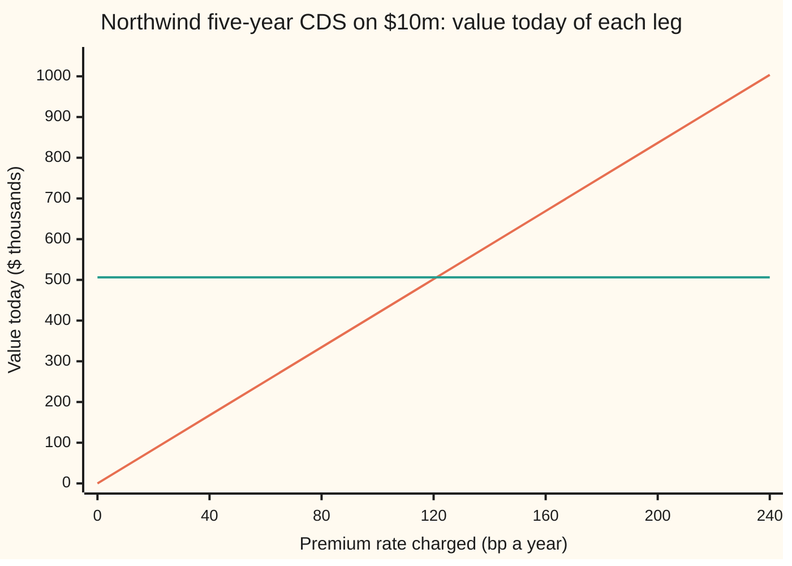
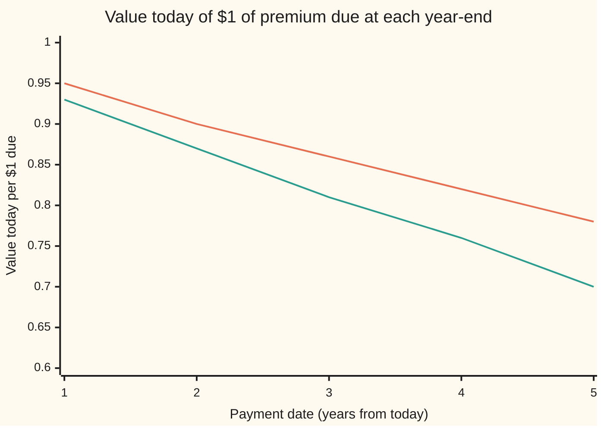

# Pricing a CDS: the premium leg, the protection leg, the risky annuity, and the spread that makes them equal

Financial mathematics → Credit Default Swaps - Pricing, the Par Spread and the Hazard Behind It → Valuing the two legs → Pricing a CDS

---

## General Overview

Northwind Lines, a shipping company, has bonds outstanding. A fund holding $10 million of them buys five years of insurance against Northwind defaulting. The insurance is a **credit default swap**, CDS for short ([credit-default-swap-contract](01-credit-default-swap-contract.md)). The fund pays a premium every quarter while Northwind survives. If Northwind defaults inside the five years, the seller pays the fund what the bonds lost: $10 million minus whatever is recovered from the wreck.

The premium is quoted as a yearly rate on the $10 million, in **basis points** (bp: hundredths of a percent, so 100 bp is 1%). The question on this card is which rate is fair. The market reads Northwind as failing at 2% a year, expects to recover 40 cents on the dollar, and discounts money at 5% a year. On those numbers the fair premium is **121.06 bp**: about $30,264 a quarter on the $10 million, until Northwind defaults or five years pass.

Each side of the deal is a stream of cash that may or may not arrive. The fund's premiums are one stream, called the **premium leg**. The seller's one-off payout is the other, called the **protection leg**. Each gets a price today: weight every possible payment by the chance it happens, shrink it back to today's money, add. The fair premium is the one that makes the two prices equal. It is called the **par spread**.

**The premium leg is the spread times the risky annuity (the value of one unit of premium a year, paid only while the company survives); the protection leg is the loss on default, weighted by the chance of defaulting at each date and discounted; the par spread is their ratio, and there is exactly one.**

**What kind of fact this is:** a model: the default date is taken to arrive at a known hazard rate, which is an assumption about markets, not a law. Inside that model, the two leg formulas and the uniqueness of the par spread are theorems, proved on this card in Why it works.

### The picture: one leg grows with the spread, the other does not



Orange, rising: the premium leg, what the fund's premiums are worth today at each rate. Green, flat: the protection leg, $506,248.99, which does not depend on the rate charged. The lines cross once, just past 120 bp, at 121.06 bp. Below the crossing the fund pays too little for its cover; above it, too much.

---

## The formula

Notation first, in words. The default date is $\tau$ (Greek "tau"), a random number of years from today. The premium dates are $t_j$, read "t sub j": the first, second, and so on, up to the last, $t_n$. A capital sigma, Σ, means "add up the terms for every date". The integral $\int_0^T$ means the area under a curve from today to year T, the contract's end ([riemann-integral](../../06-Calculus%20and%20analysis/04-Integrals/01-riemann-integral.md)). $D(t)$ is today's value of \$1 due at date t; $Q(t)$ is the chance the company survives to t; $\lambda(t)$ is the hazard, the yearly default rate among survivors; $R$ is the recovery; $\delta$ is the slice of a year each premium covers. The table below gives each one's Northwind value. All amounts are per \$1 of notional (the amount insured); multiply by \$10 million for Northwind.

$$A = \sum_{j=1}^{n} \delta\, D(t_j)\, Q(t_j), \qquad P = (1-R)\int_0^T D(t)\,\lambda(t)\,Q(t)\,dt, \qquad s^* = \frac{P}{A}.$$

**Read it aloud:** the risky annuity adds up each quarter's slice of a year, shrunk to today and weighted by the chance the company is still alive to pay it; the protection leg adds up the loss on default at every instant, weighted by the chance default lands in that instant and shrunk to today; the fair spread is protection divided by annuity.

The premium leg is $s\,A$: the spread times the annuity. That is the whole reason the annuity is worth naming. It is the price of one unit of spread, so any spread's premium leg is one multiplication away.

For a flat hazard and a flat interest rate, both legs have closed forms. Write $c = r + \lambda$ and $x = e^{-c\delta}$. Then $D(t)Q(t) = e^{-ct}$, the dated sum is a geometric series, and the protection integral is the area under one exponential:

$$A = \delta\,\frac{x\,(1 - x^{n})}{1 - x}, \qquad P = (1-R)\,\lambda\,\frac{1 - e^{-cT}}{c}.$$

**Read it aloud:** survival and discounting shrink each payment by the same factor x per quarter, so the annuity is a shrinking series of equal steps; the protection leg is the loss times the hazard times the discounted time the company is alive.

| Symbol | Plain meaning | In our example | Push it up and the par spread… |
| --- | --- | --- | --- |
| $\tau$ | the default date, in years from today; random | unknown; 9.52% chance it falls inside 5 years | — |
| $t$, $t_j$, $t_n$, $n$ | a date in years; the premium dates, the last of them, and how many there are | 0.25, 0.5, …, 5; n = 20 | — |
| $\delta$ | the slice of a year each premium covers ("delta") | 0.25, quarterly | rises: later payments, see Why it works |
| $T$ | the contract's length, in years | 5 | — |
| $r$, $D(t)$ | riskless rate, continuously compounded; the discount factor $e^{-rt}$, today's value of \$1 due at t | 5%; D(5) = 0.778801 | almost unchanged: both legs shrink together |
| $\lambda$, $Q(t)$ | the hazard ("lambda"): chance of default per year among survivors; survival chance $e^{-\lambda t}$ | 2%; Q(5) = 0.904837 | rises about one for one with $(1-R)\lambda$ |
| $R$ | recovery: the fraction of notional recovered on default | 40% | falls: a smaller loss to cover |
| $A$ | the **risky annuity** (also "risky PV01", present value of 1 bp a year): value of premiums of 1 a year paid only while alive | 4.181935 | falls |
| $P$ | the **protection leg**: value today of the payout on default | 0.050625 | rises |
| $s$, $s^*$ | a premium rate per year; the par spread | 121.06 bp | — |
| $c$, $x$ | the combined shrink rate $r + \lambda$; one quarter's shrink factor $e^{-c\delta}$ | 0.07; 0.982652 | — |

The survival curve is written $S(t)$ on [hazard-rate-and-survival-probability](../41-Default%2C%20Survival%20and%20the%20Hazard%20Rate/02-hazard-rate-and-survival-probability.md). This card writes $Q(t)$, because $s$ is taken by the spread.

### When it holds

- **Default arrives at a known hazard.** The formulas need a survival curve fixed today. If the hazard itself moves at random, survival becomes an average over paths; see [stochastic-hazard-cox-process](../44-Reduced-Form%20Models%20-%20Risky%20Bonds%2C%20Spreads%20and%20Random%20Hazards/03-stochastic-hazard-cox-process.md).
- **Default and interest rates are unrelated.** The protection integrand multiplies $D(t)$ by $\lambda(t)Q(t)$ as if the two were independent. If defaults cluster when rates fall, the product of averages is not the average of the product, and both legs shift.
- **Recovery is a fixed number.** A recovery that is random but unrelated to everything else can be replaced by its average. One that falls when defaults are many cannot; [recovery-assumptions-and-what-they-change](05-recovery-assumptions-and-what-they-change.md) measures what $R$ moves.
- **The seller pays.** The card ignores the chance the protection seller fails first. That gap is priced on [cva](../46-Counterparty%20Risk%20and%20CVA/03-cva.md).
- **Premiums fall on fixed dates, a quarter apart.** The card's quarter is exactly 0.25 years and the payout lands at the moment of default. Live contracts count days and settle a few weeks later. Conventions verified 2026-09-28 against the ISDA CDS Standard Model: premiums fall on 20 March, June, September and December, count actual days over 360, include accrued premium on default, and run at a fixed coupon (100 or 500 bp in North America) with an upfront payment. The contract's own rules are on [credit-default-swap-contract](01-credit-default-swap-contract.md).

---

## Why it works

### Step 0: price each payment by its chance and its date

A promise of $1 in five years is worth $0.778801 today at 5% ([discounting-and-present-value](../../01-Foundations/04-Compound%20Growth%20and%20Discounting/06-discounting-and-present-value.md)). A promise of $1 in five years *if Northwind is still alive* is worth that times the chance Northwind is alive. Every cash flow in a CDS is of this kind: a fixed amount, due at a date, paid only if some event happens. Its value today is amount × chance × discount factor. The chances come from the hazard; the discount factors come from the interest rate. Add the values up and each leg has a price. That is the whole method; the steps below apply it to each leg.

These chances are the ones implied by market prices, not the historical default frequency. [market-implied-versus-historical-default-probability](09-market-implied-versus-historical-default-probability.md) explains why the two differ.

### Step 1: the premium leg is a spread times an annuity

On each date $t_j$ the fund pays $s \times \delta$ per \$1 of notional: a quarter of the yearly rate. It pays only if Northwind has not defaulted by then, which has chance $Q(t_j)$. So the quarter's premium is worth $s\,\delta\,D(t_j)\,Q(t_j)$ today. Add over the twenty dates:

$$\text{premium leg} = \sum_{j=1}^{n} s\,\delta\,D(t_j)\,Q(t_j) = s \times A.$$

The spread comes out of every term, so the premium leg is a straight line in the spread. The factor left behind, $A$, depends only on dates, rates and survival. It is the value of receiving 1 a year, in quarterly slices, only while the company lives. Finance calls it the **risky annuity**.

For Northwind the first quarter's weight $D(t_1)Q(t_1)$ is 0.982652, and the checks add all twenty terms. The year-end weights $D(t)Q(t)$ fall from 0.93 at one year to 0.70 at five. Without the survival factor they would be $D(t)$ alone, 0.95 down to 0.78, and the annuity would be the riskless 4.396392 instead of 4.181935.



Orange, upper: discounting only, $D(t)$, what \$1 from a company that cannot fail is worth. Green, lower: discounting and survival, $D(t)Q(t)$, what the fund's premium is worth when Northwind may be gone before it falls due. The gap widens with time, because survival and discount both compound.

### Step 2: the protection leg is an integral over the default date

The payout happens once, at the default date $\tau$, and is $1 - R$ per \$1. Default can land on any day, not on a grid. So slice the five years into short stretches, each dt years long. For the default to land in the stretch starting at $t$, Northwind must survive to $t$, chance $Q(t)$, and then fail in the stretch, chance about $\lambda(t)\,dt$ among survivors. That is exactly what the hazard measures. So

$$\text{chance default lands in } [t, t + dt] \approx \lambda(t)\,Q(t)\,dt.$$

A payout of $1 - R$ in that stretch is worth $(1-R)\,D(t)\,\lambda(t)\,Q(t)\,dt$ today. Add over the stretches and let them shrink: the sum becomes the integral $P$. The product $\lambda(t)Q(t)$ is the **default density**, the rate at which default probability piles up at date t. Its area from 0 to 5 is the 9.52% chance of default inside the contract.

For Northwind, $\lambda Q(t)D(t) = 0.02\,e^{-0.07t}$. Its area from 0 to 5 is $0.02 \times (1 - e^{-0.35}) / 0.07 = 0.02 \times 0.295312 / 0.07$, and times $0.6$ that is $P = 0.050625$. On \$10 million: \$506,248.99.

### Step 3: equal legs, and there is only one spread that does it

At the start neither side pays anything to enter, so a fair contract makes the two legs equal:

$$s \times A = P.$$

The left side is a straight line through zero with slope $A$. The right side does not depend on $s$. The annuity is a sum of positive terms, so the slope is positive as long as the company has any chance of surviving to the first premium date. A rising line meets a flat level exactly once, at $s^* = P / A$. That settles the three questions every inverse asks:

- **Existence.** There is always a solution while $A > 0$, since $P$ is finite.
- **Uniqueness.** One solution, because a line with positive slope takes each value once.
- **Boundaries.** A hazard of zero makes $P = 0$ and the par spread 0. A recovery of 100% does the same. A company certain to default before the first premium date has $A = 0$: no running premium can pay for its cover, and the contract has to be paid for up front ([marking-a-cds-to-market-and-the-upfront](07-marking-a-cds-to-market-and-the-upfront.md)).

For Northwind, $s^* = 0.050625 / 4.181935$, which is 121.06 bp. The checks also find it by bisection (halving an interval that brackets the root until it is tiny) on the value $P - sA$, without dividing, and land on the same 121.056152.

<details>
<summary>Detailed proof: the flat-curve closed forms</summary>

With $D(t) = e^{-rt}$ and $Q(t) = e^{-\lambda t}$, the product is $e^{-ct}$ with $c = r + \lambda$. At $t_j = j\delta$ that is $x^{j}$ with $x = e^{-c\delta}$. So
$$A = \delta\,(x + x^2 + \cdots + x^n) = \delta\,x\,\frac{1 - x^n}{1 - x},$$
the sum of a geometric series: multiply the sum by $x$, subtract, and all but two terms cancel. For the protection leg, $\lambda(t) = \lambda$ is constant, so
$$P = (1-R)\,\lambda \int_0^T e^{-ct}\,dt = (1-R)\,\lambda\,\frac{1 - e^{-cT}}{c},$$
because $e^{-ct}$ is the rate of change of $-e^{-ct}/c$. For Northwind, $x = 0.982652$, $1 - x = 0.017348$, $x^{20} = e^{-0.35} = 0.704688$, so $A = 0.25 \times 0.982652 \times 0.295312 / 0.017348 = 4.181935$.

</details>

### Step 4: why 121.06 bp and not 120 bp

Suppose the fund paid its premium continuously, a trickle every instant rather than a lump each quarter. The annuity becomes an area, $\int_0^T D(t)Q(t)\,dt = (1 - e^{-cT})/c = 4.218742$. The protection leg is $(1-R)\lambda$ times that same area. Divide, and the area cancels:

$$s^*_{\text{continuous}} = (1-R)\,\lambda = 0.6 \times 0.02 = 120 \text{ bp exactly}.$$

That clean result gets its own card: [the-credit-triangle](03-the-credit-triangle.md).

Quarterly premiums are worth less than a continuous trickle, for two reasons. Each one is paid at the end of its quarter, so it is discounted a little more. And if Northwind defaults mid-quarter, the premium for the part of the quarter it was covered is never paid, while the protection still pays out. A smaller annuity needs a larger spread to buy the same protection: 4.181935 against 4.218742, so 121.06 bp against 120. The gap is premium timing, nothing else. It shrinks as payments grow more frequent:

```
par spread by premium frequency, bp a year, same Northwind contract
annual       ██████████████████████████████████████  124.30
semiannual   █████████████████████████               122.12
quarterly    ██████████████████                      121.06
monthly      ██████████████                          120.35
continuous   ████████████                            120.00
```

(Bars measure the distance above 118 bp, so the differences show.)

<details>
<summary>Accrued premium on default</summary>

Standard contracts close part of that gap themselves. When default lands mid-quarter, the fund pays the premium for the days it was covered, called the **accrued premium**. Its value per unit of spread is
$$\sum_{j=1}^{n} \int_{t_{j-1}}^{t_j} (t - t_{j-1})\,D(t)\,\lambda(t)\,Q(t)\,dt,$$
the covered fraction of the quarter, paid at default, weighted by the default density. For Northwind it is 0.010516. Adding it to the annuity gives a par spread of 120.75 bp, closing 0.30 of the 1.06 bp gap. The rest of the gap to 120 is the end-of-quarter discounting, which accrual does not touch.

</details>

### The other roads: any curve, and a simulation

Nothing in Steps 1 to 3 needed the curves to be flat. The checks price a second contract where the interest rate rises from 3% by 0.6% a year of maturity, so $D(t) = e^{-(0.03 + 0.006t)t}$, and the hazard rises from 1% by 0.4% a year, so $\lambda(t) = 0.01 + 0.004t$. There is no closed form, so the annuity is the dated sum and the protection leg is Simpson's rule (an area found from parabolas fitted through equally spaced points). The par spread is 117.20 bp.

The third road never writes an integral. It draws 400,000 random default dates from the hazard, runs each contract to its end, and counts the cash: premiums paid before default, the $1 - R$ payout if default comes before year five. The averages are the two legs. For Northwind the simulation gives 121.63 bp, with a standard error (the typical size of its random miss) of 0.63 bp, so it sits within one standard error of 121.06. For the rising curves it gives 116.31 bp against 117.20, with a standard error of 0.60 bp: inside two. How each road's error behaves is the subject of [pricing-a-defaultable-bond-from-the-survival-curve](../44-Reduced-Form%20Models%20-%20Risky%20Bonds%2C%20Spreads%20and%20Random%20Hazards/01-pricing-a-defaultable-bond-from-the-survival-curve.md), where the same survival-weighted sums price a bond.

---

## Worked numbers, by hand

Northwind: notional $10 million, five years, quarterly premiums, hazard 2%, recovery 40%, rate 5%.

| Step | Arithmetic | Value |
| --- | --- | --- |
| combined shrink rate $c$ | $0.05 + 0.02$ | 0.07 |
| one quarter's shrink $x$ | $e^{-0.07 \times 0.25}$ | 0.982652 |
| $1 - x$ | $1 - 0.982652$ | 0.017348 |
| twenty quarters, $x^{20}$ | $e^{-0.35}$ | 0.704688 |
| risky annuity $A$ | $0.25 \times 0.982652 \times (1 - 0.704688) / 0.017348$ | 4.181935 |
| protection leg $P$ | $0.6 \times 0.02 \times 0.295312 / 0.07$ | 0.050625 |
| **par spread** $s^*$ | $0.050625 / 4.181935$ | **121.06 bp** |
| protection leg on $10m | $0.050625 \times 10{,}000{,}000$ | $506,248.99 |
| value of 1 bp of premium | $4.181935 \times 10{,}000{,}000 / 10{,}000$ | $4,181.94 |
| quarterly premium at par | 121.056152 bp $\times\ 0.25 \times$ \$10m | \$30,264.04 |
| continuous-premium check | $0.6 \times 0.02$ | 120 bp |

At 121.06 bp the fund pays $30,264.04 a quarter until Northwind defaults or five years pass, and on the day it signs, what it expects to pay and what it expects to receive are worth the same $506,248.99.

### What breaks if you drop a piece

Same contract, correct answer 121.06 bp.

| Mistake | Comes out at | What went wrong |
| --- | --- | --- |
| Annuity without survival: premiums as if certain | 115.15 bp | Riskless annuity 4.396392 counts premiums a defaulted company never pays |
| Protection leg without discounting | 136.53 bp | $0.6 \times 9.52\%$ treats a payout in year five as cash today |
| $R$ in place of $1 - R$ | 80.70 bp | Insures the recovered 40 cents instead of the lost 60 |
| Full yearly spread charged every quarter | 30.26 bp | Forgot $\delta$: the annuity comes out four times too big |

Every number in that table is printed by the checks.

---

## Code, from first principles, and it actually runs

Nothing imported knows the answer: the scripts write their own integrator (Simpson's rule), root finder (bisection) and random numbers (the splitmix64 generator). The par spread is reached by **three independent roads**: the flat-curve closed form, the dated sum with quadrature for any curves, and a simulation of 400,000 default dates. A fourth line solves the fair-value equation by bisection. The rising-curve contract is priced by the second and third roads. Every "what breaks" number and every chart point is printed.

### Python

```python
# Pricing a CDS -- the check behind the card.  Standard library only.
# Northwind five-year CDS: notional $10m, quarterly premiums, hazard 2% flat,
# recovery 40%, riskless rate 5% continuously compounded.  Nothing imported
# knows the answer: the integrator, root finder and random numbers are below.
from math import exp, log, sqrt

NOTIONAL, T, DELTA, LAM, R, RATE = 10_000_000.0, 5.0, 0.25, 0.02, 0.40, 0.05

def simpson(f, a, b, n=2000):                    # area under f from a to b, n even
    h = (b - a) / n
    s = f(a) + f(b) + sum((4 if i % 2 else 2) * f(a + i * h) for i in range(1, n))
    return s * h / 3

def dates(delta):                                # premium dates delta, 2 delta, ..., T
    return [delta * (j + 1) for j in range(round(T / delta))]

def legs(D, Q, h, delta=DELTA):                  # road 2: dated sum and quadrature, any curves
    A = sum(delta * D(t) * Q(t) for t in dates(delta))
    P = (1 - R) * simpson(lambda t: h(t) * Q(t) * D(t), 0.0, T)
    acc = sum(simpson(lambda t: (t - a) * h(t) * Q(t) * D(t), a, a + delta, 200)
              for a in [t - delta for t in dates(delta)])
    return A, P, acc

def closed(delta=DELTA, lam=LAM):                # road 1: flat curves, geometric series
    c = RATE + lam
    x = exp(-c * delta)
    n = round(T / delta)
    A = delta * x * (1 - x ** n) / (1 - x)
    P = (1 - R) * lam * (1 - exp(-c * T)) / c
    return A, P, (1 - exp(-c * T)) / c           # last: the continuous-premium annuity

def bisect(f, lo, hi):                           # root finder: halve the bracket 100 times
    for _ in range(100):
        mid = 0.5 * (lo + hi)
        lo, hi = (mid, hi) if f(lo) * f(mid) > 0 else (lo, mid)
    return 0.5 * (lo + hi)

state = 20260928
def uniform():                                   # splitmix64, then 53 bits into (0, 1)
    global state
    state = (state + 0x9E3779B97F4A7C15) & 0xFFFFFFFFFFFFFFFF
    z = state
    z = ((z ^ (z >> 30)) * 0xBF58476D1CE4E5B9) & 0xFFFFFFFFFFFFFFFF
    z = ((z ^ (z >> 27)) * 0x94D049BB133111EB) & 0xFFFFFFFFFFFFFFFF
    return ((z ^ (z >> 31)) >> 11) * 2.0 ** -53 + 2.0 ** -54

def monte_carlo(D, tau_of, paths=400_000):       # road 3: draw default dates, pay cash
    A = P = AA = PP = AP = 0.0
    for _ in range(paths):
        tau = tau_of(-log(uniform()))            # cumulative hazard reached at default
        prem = sum(DELTA * D(t) for t in dates(DELTA) if t < tau)
        pay = (1 - R) * D(tau) if tau <= T else 0.0
        A, P, AA, PP, AP = A + prem, P + pay, AA + prem * prem, PP + pay * pay, AP + prem * pay
    s = P / A                                    # std error of the spread P/A, from pay - s * prem
    se = sqrt(PP - 2 * s * AP + s * s * AA) / A  # = sqrt(variance / paths) / mean annuity
    return A / paths, P / paths, se

flat_D, flat_Q, flat_h = (lambda t: exp(-RATE * t)), (lambda t: exp(-LAM * t)), (lambda t: LAM)
A1, P1, Ac = closed()
A2, P2, acc = legs(flat_D, flat_Q, flat_h)
s1, s2 = P1 / A1, P2 / A2
s_root = bisect(lambda s: P2 - s * A2, 0.0, 1.0)
A_int = simpson(lambda t: flat_D(t) * flat_Q(t), 0.0, T)       # premiums paid every instant
A3, P3, se3 = monte_carlo(flat_D, lambda e: e / LAM)
bp = 1e4
rows = [("annuity, closed form", A1), ("annuity, dated sum", A2), ("annuity, simulation", A3),
        ("protection, closed form", P1), ("protection, Simpson", P2), ("protection, simulation", P3),
        ("par spread bp, closed form", s1 * bp), ("par spread bp, dated/Simpson", s2 * bp),
        ("par spread bp, root finder", s_root * bp), ("par spread bp, simulation", P3 / A3 * bp),
        ("  simulation std error, bp", se3 * bp), ("  simulation paths", 400_000),
        ("continuous annuity, closed form", Ac), ("continuous annuity, Simpson", A_int),
        ("par spread bp, continuous", P1 / A_int * bp),
        ("(1-R) x hazard, bp", (1 - R) * LAM * bp),
        ("accrual per unit spread", acc), ("par spread bp, with accrual", P2 / (A2 + acc) * bp),
        ("D(5) e^-rT", flat_D(T)), ("Q(5) e^-lambda T", flat_Q(T)), ("default chance by 5y", 1 - flat_Q(T)),
        ("D(5)Q(5) e^-(r+lambda)T", exp(-(RATE + LAM) * T)), ("1 - e^-(r+lambda)T", 1 - exp(-(RATE + LAM) * T)),
        ("x = e^-(r+lambda)/4", exp(-(RATE + LAM) * DELTA)), ("1 - x", 1 - exp(-(RATE + LAM) * DELTA)),
        ("$ protection leg on $10m", P1 * NOTIONAL), ("$ one bp of premium, PV", A1 * NOTIONAL / bp),
        ("$ quarterly premium at par", s1 * DELTA * NOTIONAL)]
A_rl = sum(DELTA * flat_D(t) for t in dates(DELTA))
rows += [("wrong: no survival in annuity", P1 / A_rl * bp), ("  riskless annuity", A_rl),
         ("wrong: protection undiscounted", (1 - R) * (1 - flat_Q(T)) / A1 * bp),
         ("wrong: R in place of 1-R", R / (1 - R) * s1 * bp),
         ("wrong: full spread each quarter", P1 / (A1 / DELTA) * bp)]
for name, delta in (("annual", 1.0), ("semiannual", 0.5), ("quarterly", 0.25), ("monthly", 1 / 12)):
    Af, Pf, _ = closed(delta)
    rows.append((f"spread bp, {name} premiums", Pf / Af * bp))
rows += [("try: hazard 4%", closed(lam=0.04)[1] / closed(lam=0.04)[0] * bp),
         ("try: hazard 0", closed(lam=0.0)[1] / closed(lam=0.0)[0] * bp)]
# a general curve: zero rate 3% rising 0.6% a year, hazard 1% rising 0.4% a year
g_D = lambda t: exp(-(0.03 + 0.006 * t) * t)
g_Q = lambda t: exp(-(0.01 * t + 0.002 * t * t))
g_h = lambda t: 0.01 + 0.004 * t
gA2, gP2, _ = legs(g_D, g_Q, g_h)
gA3, gP3, gse3 = monte_carlo(g_D, lambda e: (-0.01 + sqrt(0.0001 + 0.008 * e)) / 0.004)
rows += [("curve: annuity, dated sum", gA2), ("curve: annuity, simulation", gA3),
         ("curve: protection, Simpson", gP2), ("curve: protection, simulation", gP3),
         ("curve: par spread bp", gP2 / gA2 * bp), ("curve: spread bp, simulation", gP3 / gA3 * bp),
         ("  simulation std error, bp", gse3 * bp)]
for name, v in rows:
    print(f"{name:<34} {v:>16.6f}")
print()
print("chart, spread bp       " + " ".join(f"{s:7d}" for s in range(0, 241, 40)))
print("chart, premium leg $k  " + " ".join(f"{s / bp * A1 * NOTIONAL / 1e3:7.2f}" for s in range(0, 241, 40)))
print("chart, protection $k   " + " ".join(f"{P1 * NOTIONAL / 1e3:7.2f}" for s in range(0, 241, 40)))
print("chart, year            " + " ".join(f"{y:7d}" for y in range(1, 6)))
print("chart, D(t)Q(t)        " + " ".join(f"{flat_D(y) * flat_Q(y):7.2f}" for y in range(1, 6)))
print("chart, D(t)            " + " ".join(f"{flat_D(y):7.2f}" for y in range(1, 6)))
assert abs(A2 - A1) < 1e-12 and abs(P2 - P1) < 1e-10, "dated sum and Simpson vs closed form"
assert abs(s_root - s1) < 1e-12, "root finder lands on protection / annuity"
assert abs(P3 / A3 - s1) < 4 * se3, "simulation within four standard errors"
assert abs(gP3 / gA3 - gP2 / gA2) < 4 * gse3, "general curve: simulation vs quadrature"
assert abs(P1 / A_int - (1 - R) * LAM) < 1e-12, "closed protection / Simpson annuity = (1-R) x hazard"
print("ALL CHECKS PASS")
```

**Ran 2026-09-28 on macOS, Python 3.14.6, standard library only. All checks passed. Output, pasted from the run:**

```
annuity, closed form                       4.181935
annuity, dated sum                         4.181935
annuity, simulation                        4.180399
protection, closed form                    0.050625
protection, Simpson                        0.050625
protection, simulation                     0.050845
par spread bp, closed form               121.056152
par spread bp, dated/Simpson             121.056152
par spread bp, root finder               121.056152
par spread bp, simulation                121.627376
  simulation std error, bp                 0.625439
  simulation paths                    400000.000000
continuous annuity, closed form            4.218742
continuous annuity, Simpson                4.218742
par spread bp, continuous                120.000000
(1-R) x hazard, bp                       120.000000
accrual per unit spread                    0.010516
par spread bp, with accrual              120.752502
D(5) e^-rT                                 0.778801
Q(5) e^-lambda T                           0.904837
default chance by 5y                       0.095163
D(5)Q(5) e^-(r+lambda)T                    0.704688
1 - e^-(r+lambda)T                         0.295312
x = e^-(r+lambda)/4                        0.982652
1 - x                                      0.017348
$ protection leg on $10m              506248.989054
$ one bp of premium, PV                 4181.935252
$ quarterly premium at par             30264.037973
wrong: no survival in annuity            115.151011
  riskless annuity                         4.396392
wrong: protection undiscounted           136.533795
wrong: R in place of 1-R                  80.704101
wrong: full spread each quarter           30.264038
spread bp, annual premiums               124.299739
spread bp, semiannual premiums           122.124716
spread bp, quarterly premiums            121.056152
spread bp, monthly premiums              120.350682
try: hazard 4%                           242.720364
try: hazard 0                              0.000000
curve: annuity, dated sum                  4.219357
curve: annuity, simulation                 4.220895
curve: protection, Simpson                 0.049452
curve: protection, simulation              0.049094
curve: par spread bp                     117.202677
curve: spread bp, simulation             116.310742
  simulation std error, bp                 0.596860

chart, spread bp             0      40      80     120     160     200     240
chart, premium leg $k     0.00  167.28  334.55  501.83  669.11  836.39 1003.66
chart, protection $k    506.25  506.25  506.25  506.25  506.25  506.25  506.25
chart, year                  1       2       3       4       5
chart, D(t)Q(t)           0.93    0.87    0.81    0.76    0.70
chart, D(t)               0.95    0.90    0.86    0.82    0.78
ALL CHECKS PASS
```

The closed form and the dated sum agree to all printed digits, as they must: the sum is the series the closed form adds up. The simulation lands within one standard error for Northwind, and within two for the rising curves.

### Rust

Same roads, same random-number generator, same seed, built with `rustc --edition 2021 -O`.

```rust
// Pricing a CDS -- the same check as the Python, in Rust.  No crates.
// Northwind five-year CDS: notional $10m, quarterly premiums, hazard 2% flat,
// recovery 40%, riskless rate 5% continuously compounded.  Nothing imported
// knows the answer: the integrator, root finder and random numbers are below.
const NOTIONAL: f64 = 10_000_000.0;
const T: f64 = 5.0;
const DELTA: f64 = 0.25;
const LAM: f64 = 0.02;
const R: f64 = 0.40;
const RATE: f64 = 0.05;
const BP: f64 = 1e4;

fn simpson(f: &dyn Fn(f64) -> f64, a: f64, b: f64, n: usize) -> f64 {   // area under f, n even
    let h = (b - a) / n as f64;
    let mut inner = 0.0;
    for i in 1..n { inner += if i % 2 == 1 { 4.0 } else { 2.0 } * f(a + i as f64 * h); }
    (f(a) + f(b) + inner) * h / 3.0
}

fn dates(delta: f64) -> Vec<f64> {                // premium dates delta, 2 delta, ..., T
    (0..(T / delta).round() as usize).map(|j| delta * (j + 1) as f64).collect()
}

// road 2: dated sum and quadrature, any curves
fn legs(d: &dyn Fn(f64) -> f64, q: &dyn Fn(f64) -> f64, h: &dyn Fn(f64) -> f64) -> (f64, f64, f64) {
    let mut a = 0.0;
    for t in dates(DELTA) { a += DELTA * d(t) * q(t); }
    let p = (1.0 - R) * simpson(&|t| h(t) * q(t) * d(t), 0.0, T, 2000);
    let mut acc = 0.0;
    for t in dates(DELTA) {
        let s = t - DELTA;
        acc += simpson(&|u| (u - s) * h(u) * q(u) * d(u), s, s + DELTA, 200);
    }
    (a, p, acc)
}

fn closed(delta: f64, lam: f64) -> (f64, f64, f64) {   // road 1: flat curves, geometric series
    let c = RATE + lam;
    let x = (-c * delta).exp();
    let n = (T / delta).round();
    let a = delta * x * (1.0 - x.powf(n)) / (1.0 - x);
    let p = (1.0 - R) * lam * (1.0 - (-c * T).exp()) / c;
    (a, p, (1.0 - (-c * T).exp()) / c)             // last: the continuous-premium annuity
}

fn bisect(f: &dyn Fn(f64) -> f64, mut lo: f64, mut hi: f64) -> f64 {   // halve the bracket 100 times
    for _ in 0..100 {
        let mid = 0.5 * (lo + hi);
        if f(lo) * f(mid) > 0.0 { lo = mid } else { hi = mid }
    }
    0.5 * (lo + hi)
}

struct Rng(u64);
impl Rng {
    fn uniform(&mut self) -> f64 {                 // splitmix64, then 53 bits into (0, 1)
        self.0 = self.0.wrapping_add(0x9E3779B97F4A7C15);
        let mut z = self.0;
        z = (z ^ (z >> 30)).wrapping_mul(0xBF58476D1CE4E5B9);
        z = (z ^ (z >> 27)).wrapping_mul(0x94D049BB133111EB);
        ((z ^ (z >> 31)) >> 11) as f64 * 2f64.powi(-53) + 2f64.powi(-54)
    }
}

// road 3: draw default dates, pay cash
fn monte_carlo(rng: &mut Rng, d: &dyn Fn(f64) -> f64, tau_of: &dyn Fn(f64) -> f64) -> (f64, f64, f64) {
    let paths = 400_000.0;
    let (mut a, mut p, mut aa, mut pp, mut ap) = (0.0, 0.0, 0.0, 0.0, 0.0);
    let ds = dates(DELTA);
    for _ in 0..400_000 {
        let tau = tau_of(-rng.uniform().ln());     // cumulative hazard reached at default
        let mut prem = 0.0;
        for &t in &ds { if t < tau { prem += DELTA * d(t); } }
        let pay = if tau <= T { (1.0 - R) * d(tau) } else { 0.0 };
        a += prem;
        p += pay;
        aa += prem * prem;
        pp += pay * pay;
        ap += prem * pay;
    }
    let s = p / a;                                 // std error of the spread P/A, from pay - s * prem
    let se = (pp - 2.0 * s * ap + s * s * aa).sqrt() / a;   // = sqrt(variance / paths) / mean annuity
    (a / paths, p / paths, se)
}

fn main() {
    let flat_d = |t: f64| (-RATE * t).exp();
    let flat_q = |t: f64| (-LAM * t).exp();
    let flat_h = |_t: f64| LAM;
    let (a1, p1, ac) = closed(DELTA, LAM);
    let (a2, p2, acc) = legs(&flat_d, &flat_q, &flat_h);
    let (s1, s2) = (p1 / a1, p2 / a2);
    let s_root = bisect(&|s| p2 - s * a2, 0.0, 1.0);
    let a_int = simpson(&|t| flat_d(t) * flat_q(t), 0.0, T, 2000);   // premiums paid every instant
    let mut rng = Rng(20260928);
    let (a3, p3, se3) = monte_carlo(&mut rng, &flat_d, &|e| e / LAM);
    let a_rl: f64 = dates(DELTA).iter().fold(0.0, |s, &t| s + DELTA * flat_d(t));
    let mut rows: Vec<(String, f64)> = vec![
        ("annuity, closed form", a1), ("annuity, dated sum", a2), ("annuity, simulation", a3),
        ("protection, closed form", p1), ("protection, Simpson", p2), ("protection, simulation", p3),
        ("par spread bp, closed form", s1 * BP), ("par spread bp, dated/Simpson", s2 * BP),
        ("par spread bp, root finder", s_root * BP), ("par spread bp, simulation", p3 / a3 * BP),
        ("  simulation std error, bp", se3 * BP), ("  simulation paths", 400_000.0),
        ("continuous annuity, closed form", ac), ("continuous annuity, Simpson", a_int),
        ("par spread bp, continuous", p1 / a_int * BP),
        ("(1-R) x hazard, bp", (1.0 - R) * LAM * BP),
        ("accrual per unit spread", acc), ("par spread bp, with accrual", p2 / (a2 + acc) * BP),
        ("D(5) e^-rT", flat_d(T)), ("Q(5) e^-lambda T", flat_q(T)), ("default chance by 5y", 1.0 - flat_q(T)),
        ("D(5)Q(5) e^-(r+lambda)T", (-(RATE + LAM) * T).exp()), ("1 - e^-(r+lambda)T", 1.0 - (-(RATE + LAM) * T).exp()),
        ("x = e^-(r+lambda)/4", (-(RATE + LAM) * DELTA).exp()), ("1 - x", 1.0 - (-(RATE + LAM) * DELTA).exp()),
        ("$ protection leg on $10m", p1 * NOTIONAL), ("$ one bp of premium, PV", a1 * NOTIONAL / BP),
        ("$ quarterly premium at par", s1 * DELTA * NOTIONAL),
        ("wrong: no survival in annuity", p1 / a_rl * BP), ("  riskless annuity", a_rl),
        ("wrong: protection undiscounted", (1.0 - R) * (1.0 - flat_q(T)) / a1 * BP),
        ("wrong: R in place of 1-R", R / (1.0 - R) * s1 * BP),
        ("wrong: full spread each quarter", p1 / (a1 / DELTA) * BP),
    ].into_iter().map(|(n, v)| (n.to_string(), v)).collect();
    for (name, delta) in [("annual", 1.0), ("semiannual", 0.5), ("quarterly", 0.25), ("monthly", 1.0 / 12.0)] {
        let (af, pf, _) = closed(delta, LAM);
        rows.push((format!("spread bp, {} premiums", name), pf / af * BP));
    }
    for (name, lam) in [("try: hazard 4%", 0.04), ("try: hazard 0", 0.0)] {
        let (af, pf, _) = closed(DELTA, lam);
        rows.push((name.to_string(), pf / af * BP));
    }
    // a general curve: zero rate 3% rising 0.6% a year, hazard 1% rising 0.4% a year
    let g_d = |t: f64| (-(0.03 + 0.006 * t) * t).exp();
    let g_q = |t: f64| (-(0.01 * t + 0.002 * t * t)).exp();
    let g_h = |t: f64| 0.01 + 0.004 * t;
    let (ga2, gp2, _) = legs(&g_d, &g_q, &g_h);
    let (ga3, gp3, gse3) = monte_carlo(&mut rng, &g_d, &|e| (-0.01 + (0.0001 + 0.008 * e).sqrt()) / 0.004);
    for (n, v) in [("curve: annuity, dated sum", ga2), ("curve: annuity, simulation", ga3),
                   ("curve: protection, Simpson", gp2), ("curve: protection, simulation", gp3),
                   ("curve: par spread bp", gp2 / ga2 * BP), ("curve: spread bp, simulation", gp3 / ga3 * BP),
                   ("  simulation std error, bp", gse3 * BP)] {
        rows.push((n.to_string(), v));
    }
    for (name, v) in &rows { println!("{:<34} {:>16.6}", name, v); }
    println!();
    let spreads: Vec<f64> = (0..7).map(|i| 40.0 * i as f64).collect();
    let line = |label: &str, vals: Vec<String>| println!("{:<23}{}", label, vals.join(" "));
    line("chart, spread bp", spreads.iter().map(|s| format!("{:7}", *s as i64)).collect());
    line("chart, premium leg $k", spreads.iter().map(|s| format!("{:7.2}", s / BP * a1 * NOTIONAL / 1e3)).collect());
    line("chart, protection $k", spreads.iter().map(|_| format!("{:7.2}", p1 * NOTIONAL / 1e3)).collect());
    line("chart, year", (1..6).map(|y| format!("{:7}", y)).collect());
    line("chart, D(t)Q(t)", (1..6).map(|y| format!("{:7.2}", flat_d(y as f64) * flat_q(y as f64))).collect());
    line("chart, D(t)", (1..6).map(|y| format!("{:7.2}", flat_d(y as f64))).collect());
    assert!((a2 - a1).abs() < 1e-12 && (p2 - p1).abs() < 1e-10, "dated sum and Simpson vs closed form");
    assert!((s_root - s1).abs() < 1e-12, "root finder lands on protection / annuity");
    assert!((p3 / a3 - s1).abs() < 4.0 * se3, "simulation within four standard errors");
    assert!((gp3 / ga3 - gp2 / ga2).abs() < 4.0 * gse3, "general curve: simulation vs quadrature");
    assert!((p1 / a_int - (1.0 - R) * LAM).abs() < 1e-12, "closed protection / Simpson annuity = (1-R) x hazard");
    println!("ALL CHECKS PASS");
}
```

**Ran 2026-09-28 on macOS, rustc 1.98.1, no crates. All checks passed. Output, pasted from the run:**

```
annuity, closed form                       4.181935
annuity, dated sum                         4.181935
annuity, simulation                        4.180399
protection, closed form                    0.050625
protection, Simpson                        0.050625
protection, simulation                     0.050845
par spread bp, closed form               121.056152
par spread bp, dated/Simpson             121.056152
par spread bp, root finder               121.056152
par spread bp, simulation                121.627376
  simulation std error, bp                 0.625439
  simulation paths                    400000.000000
continuous annuity, closed form            4.218742
continuous annuity, Simpson                4.218742
par spread bp, continuous                120.000000
(1-R) x hazard, bp                       120.000000
accrual per unit spread                    0.010516
par spread bp, with accrual              120.752502
D(5) e^-rT                                 0.778801
Q(5) e^-lambda T                           0.904837
default chance by 5y                       0.095163
D(5)Q(5) e^-(r+lambda)T                    0.704688
1 - e^-(r+lambda)T                         0.295312
x = e^-(r+lambda)/4                        0.982652
1 - x                                      0.017348
$ protection leg on $10m              506248.989054
$ one bp of premium, PV                 4181.935252
$ quarterly premium at par             30264.037973
wrong: no survival in annuity            115.151011
  riskless annuity                         4.396392
wrong: protection undiscounted           136.533795
wrong: R in place of 1-R                  80.704101
wrong: full spread each quarter           30.264038
spread bp, annual premiums               124.299739
spread bp, semiannual premiums           122.124716
spread bp, quarterly premiums            121.056152
spread bp, monthly premiums              120.350682
try: hazard 4%                           242.720364
try: hazard 0                              0.000000
curve: annuity, dated sum                  4.219357
curve: annuity, simulation                 4.220895
curve: protection, Simpson                 0.049452
curve: protection, simulation              0.049094
curve: par spread bp                     117.202677
curve: spread bp, simulation             116.310742
  simulation std error, bp                 0.596860

chart, spread bp             0      40      80     120     160     200     240
chart, premium leg $k     0.00  167.28  334.55  501.83  669.11  836.39 1003.66
chart, protection $k    506.25  506.25  506.25  506.25  506.25  506.25  506.25
chart, year                  1       2       3       4       5
chart, D(t)Q(t)           0.93    0.87    0.81    0.76    0.70
chart, D(t)               0.95    0.90    0.86    0.82    0.78
ALL CHECKS PASS
```

The two outputs match line for line, the simulation included, because both languages draw the same random numbers in the same order.

> [!TIP]
> **Try changing**
> Guess first, then run it.
> - **Double the hazard.** Set `LAM = 0.04`. Guess: double 121.06 bp? It comes out at 242.72 bp, a little more than double. The continuous answer doubles exactly, to 240 bp; the quarterly timing gap grows with the hazard, from 1.06 to 2.72 bp. The row `try: hazard 4%` prints it without editing.
> - **Remove the risk.** A hazard of 0 gives 0.000000 bp (row `try: hazard 0`): with nothing to insure, no premium is fair.
> - **Pay monthly.** Set `DELTA = 1 / 12`. The par spread falls to 120.35 bp, closer to the continuous 120. The asserts still pass, since every road uses the same dates.
> - **Break the survival weight.** Delete `* Q(t)` from the annuity line in `legs`. The first assert fails: the dated sum no longer matches the closed form.

---

## The usual mistake

> [!warning]
> **Treating the premium leg as a fixed stream.** Premiums stop at default. A fund that values them as certain, with the riskless annuity 4.396392, prices Northwind at 115.15 bp instead of 121.06 bp. The survival weight is the reason the annuity is called risky.
>
> - **Reading the spread as a default probability.** 121.06 bp is a yearly premium, near loss times hazard. The five-year default chance is 9.52%, a different number on a different clock.
> - **Forgetting to discount the payout.** Undiscounted protection gives 136.53 bp: a default in year five is paid in year-five money.
> - **Mixing up recovery and loss.** Using $R$ where $1 - R$ belongs gives 80.70 bp.
> - **Expecting exactly 120 bp.** Loss times hazard is the continuous-premium answer. Quarterly premiums give 121.06 bp; the difference is timing, not error.

---

## Where you meet it in real life

- **Quoting a CDS.** Dealers quote single-name contracts by a spread; since 2009 the trade itself carries a fixed coupon plus an upfront payment, which that spread sets. A quote is this card run backwards, which is [implied-hazard-from-a-cds-quote](04-implied-hazard-from-a-cds-quote.md).
- **Risk per basis point.** The risky annuity times the notional is the value of one basis point of spread: $4,181.94 on Northwind's $10 million. Traders size hedges with it; see [cds-risk-numbers](08-cds-risk-numbers.md).
- **Marking old trades.** A contract signed at yesterday's spread is worth the gap to today's par spread times the risky annuity: [marking-a-cds-to-market-and-the-upfront](07-marking-a-cds-to-market-and-the-upfront.md).
- **Building the hazard curve.** Quotes at several maturities are turned into a hazard that changes with time, one piece per quote: [bootstrapping-the-hazard-curve-from-cds-quotes](06-bootstrapping-the-hazard-curve-from-cds-quotes.md).

> **Say it back**
> A CDS has two legs. The premium leg is the spread times the risky annuity: each quarter's premium, discounted and weighted by the chance the company is alive to pay it. The protection leg is the loss on default, weighted by the chance default lands at each date and discounted. The par spread is protection divided by annuity, and it is unique because the premium leg is a rising straight line in the spread. For Northwind that is 121.06 bp; paying continuously would make it exactly loss times hazard, 120 bp.

---

## What this builds on

- [credit-default-swap-contract](01-credit-default-swap-contract.md): who pays whom, when, and what a credit event is.
- [hazard-rate-and-survival-probability](../41-Default%2C%20Survival%20and%20the%20Hazard%20Rate/02-hazard-rate-and-survival-probability.md): the hazard, the survival curve, and the chance of default in a short stretch.
- [discounting-and-present-value](../../01-Foundations/04-Compound%20Growth%20and%20Discounting/06-discounting-and-present-value.md): why a dollar later is worth less today.
- [riemann-integral](../../06-Calculus%20and%20analysis/04-Integrals/01-riemann-integral.md): the sum of thin slices that becomes the protection leg.
- [compounding-and-discount-factors](../01-Money%2C%20Dates%20and%20Discounting/01-compounding-and-discount-factors.md): the discount factor $e^{-rt}$ and continuous compounding.

## Where this goes next

- [the-credit-triangle](03-the-credit-triangle.md): spread, loss and hazard tied by one approximation, and how good it is.
- [pricing-a-defaultable-bond-from-the-survival-curve](../44-Reduced-Form%20Models%20-%20Risky%20Bonds%2C%20Spreads%20and%20Random%20Hazards/01-pricing-a-defaultable-bond-from-the-survival-curve.md): the same survival-weighted sums pricing a bond.
- [stochastic-hazard-cox-process](../44-Reduced-Form%20Models%20-%20Risky%20Bonds%2C%20Spreads%20and%20Random%20Hazards/03-stochastic-hazard-cox-process.md): the legs when the hazard itself moves at random.
- [cva](../46-Counterparty%20Risk%20and%20CVA/03-cva.md): the protection leg turned round, to price the chance a trading partner defaults.

This card prices a CDS from a known hazard; the market runs the other way, quoting the spread and leaving the hazard to be found, and the credit triangle is the first, quickest way to find it.

---

## Sources

Verified 2026-09-28: every link below resolves to the publisher's page.

- Hull, John C., and Alan White. "Valuing Credit Default Swaps I." *Journal of Derivatives* 8, no. 1 (2000): 29–40. [DOI](https://doi.org/10.3905/jod.2000.319115). The two legs, the accrual payment, and the par spread as their ratio.
- O'Kane, Dominic. *Modelling Single-name and Multi-name Credit Derivatives*. Wiley, 2008. [Publisher page](https://www.wiley.com/en-us/Modelling+Single-name+and+Multi-name+Credit+Derivatives-p-9780470519288). The risky annuity (risky PV01), accrued premium, and the practitioner's valuation.
- Hull, John C. *Options, Futures, and Other Derivatives*, 11th ed. Pearson. [Publisher page](https://www.pearson.com/en-us/subject-catalog/p/options-futures-and-other-derivatives/P200000005938/9780136939979). The textbook CDS valuation with a worked table of legs.
- ISDA. *ISDA CDS Standard Model* and *Standard CDS Examples* (October 2012). [Model site](https://www.cdsmodel.com/); [examples](https://www.cdsmodel.com/assets/cds-model/docs/Standard%20CDS%20Examples%20Updated%20Oct%202012.pdf). Coupon dates, actual/360 accrual, accrued premium on default, fixed coupons with upfront.
- Duffie, Darrell, and Kenneth J. Singleton. *Credit Risk: Pricing, Measurement, and Management*. Princeton University Press, 2003. [Publisher page](https://press.princeton.edu/books/hardcover/9780691090467/credit-risk). The hazard-rate (reduced-form) models behind the survival weights.
