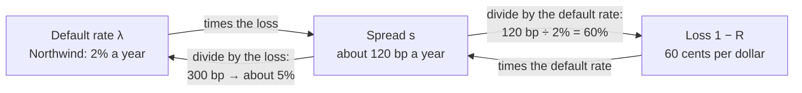
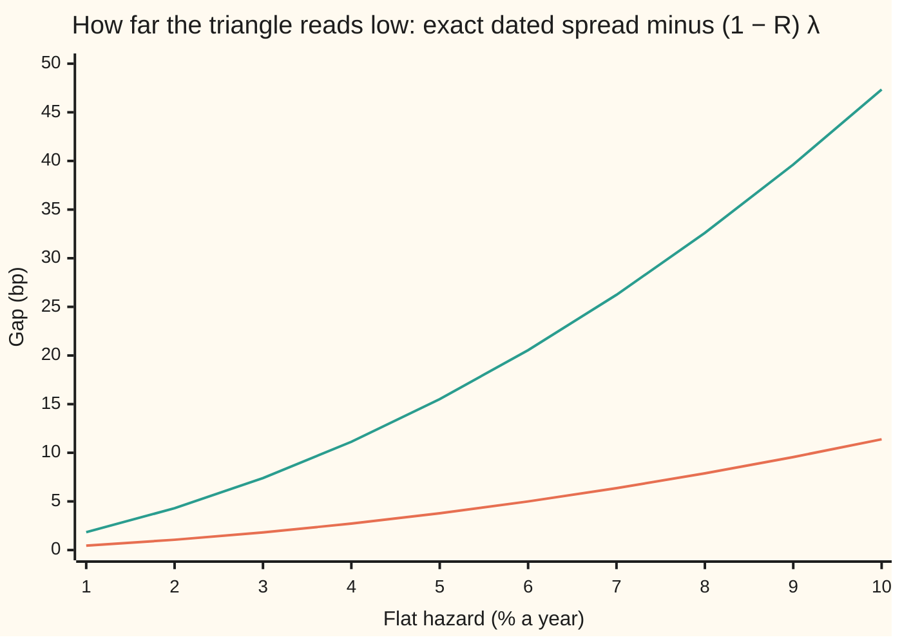

# The credit triangle: spread is about hazard times loss, the one-line bridge between a quote and a probability, and how far off it is

[Syllabus](../../../SYLLABUS.md) → [Financial mathematics](../README.md) → [Credit Default Swaps - Pricing, the Par Spread and the Hazard Behind It](../README.md#s42) → The credit triangle

---

## General Overview

Northwind Lines, a shipping company, has debt that lenders want to insure. A five-year credit default swap on $10 million of that debt is an insurance contract: the buyer pays a fixed yearly premium, and if Northwind defaults the seller pays the part of the $10 million that lenders fail to get back ([The credit default swap](01-credit-default-swap-contract.md)). The yearly premium, as a fraction of the $10 million, is the **spread**. It is quoted in **basis points** (bp): hundredths of a percent, so 120 bp is 1.2% a year.

Suppose the market treats Northwind as failing at a steady 2% a year, and expects lenders to recover 40 cents on the dollar after a default, losing 60. Multiply the two: 0.6 × 2% = 1.2% a year, or 120 bp. That is $120,000 a year on $10 million. The full pricing, with quarterly payment dates and discounting, gives 121.06 bp ([Pricing a CDS](02-cds-legs-risky-annuity-and-par-spread.md)). The one-line product is off by about one basis point in 121.

The same line runs backwards. A dealer sees another name quoted at 300 bp with 40% recovery and divides: 3% ÷ 0.6 = 5% a year of default risk. A solver later says 4.94%. The shortcut has three corners (spread, default rate, loss), and any two give the third, so the market calls it the **credit triangle**.

**The spread on a credit default swap is about the yearly default rate times the fraction lost in a default; it is exact when premiums flow continuously against a flat default rate, and its two errors, quarter-end payments and a sloping default rate, are small, signed and computable.**

**What kind of fact this is:** an approximation, with its error stated. Inside one simple model (flat default rate, premiums paid continuously) it is a theorem, proved on this card in Why it works.

### The picture: three corners, any two give the third



Spread comes from the other two by one multiplication. Each of the others comes from the spread by one division. The default rate λ and the recovery R are defined in the next section.

---

## The formula

$$s \;\approx\; (1-R)\,\lambda$$

**Read it aloud:** the yearly premium rate is about the yearly default rate times the fraction of the debt lost when default comes.

The rate λ is the **hazard rate**: the chance per year of default in the next short slice of time, given no default so far ([The hazard rate](../41-Default%2C%20Survival%20and%20the%20Hazard%20Rate/02-hazard-rate-and-survival-probability.md)). The **recovery** R is the fraction of the debt's face value lenders get back; 1 − R is the **loss given default**.

The triangle read in its three directions:

$$s \approx (1-R)\,\lambda, \qquad \lambda \approx \frac{s}{1-R}, \qquad R \approx 1 - \frac{s}{\lambda}$$

The exact spread for a flat hazard, with premiums paid at the end of each period of length δ years and money discounted at the riskless rate r:

$$s_q \;=\; (1-R)\,\lambda\;\frac{e^{x}-1}{x}, \qquad x = (r+\lambda)\,\delta$$

**Read it aloud:** the dated spread is the triangle times a timing factor slightly above one, set by how fast money is discounted and survival decays over one period.

For small $x$ the factor is about $1 + x/2$. So quarter-end payments push the spread up by about half of (r + λ)δ, in relative terms.

With a hazard λ(t) that changes over time, and premiums paid continuously, the exact spread is

$$s_c \;=\; (1-R)\,\frac{\int_0^T \lambda(t)\,w(t)\,dt}{\int_0^T w(t)\,dt}, \qquad w(t) = D(t)\,S(t) = e^{-rt}\,S(t)$$

Here T is the tenor in years, D(t) the discount factor and S(t) the chance of surviving to date t.

**Read it aloud:** the spread is the loss times a weighted average of the hazard, where each date's weight is what a dollar paid then is worth today, times the chance Northwind is still alive to pay it.

| Symbol | Plain meaning | In our example | Push it up and the answer… |
| --- | --- | --- | --- |
| $s$, $s_c$, $s_q$ | spread: yearly premium as a fraction of notional; $s_c$ with continuous premiums, $s_q$ with dated ones | 120 bp; 121.06 bp dated | — |
| $R$ | recovery: fraction of face value got back after default | 0.40 | spread falls; implied hazard rises |
| $1-R$ | loss given default | 0.60 | spread rises in proportion |
| $\lambda$ | flat hazard rate, per year ("lambda") | 0.02 | spread rises in proportion |
| $\lambda(t)$, $\bar\lambda$ | hazard at date t when it changes; its plain calendar average over the five years | 1% then 3%; 2.2% | — |
| $r$ | riskless rate, continuously compounded | 0.05 | timing gap widens a little |
| $\delta$ | premium period in years ("delta") | 0.25 | timing gap widens |
| $T$ | tenor: years the protection lasts | 5 | flat hazard: no change to the dated spread |
| $t$, $t_j$, $\tau$ | a date in years; $t_j = j\delta$ the j-th premium date; $\tau$ the default date ("tau") | 0.25, 0.5, …, 5 | — |
| $D(t)$, $S(t)$, $w(t)$ | discount factor $e^{-rt}$; survival chance to t; their product, the weight | $e^{-0.05t}$, $e^{-0.02t}$ | — |
| $A$ | risky annuity: today's value of 1 a year of premium, paid on dates Northwind survives to | 4.1819 | spread falls for a given protection value |
| $x$ | timing term $(r+\lambda)\delta$ | 0.0175 | timing gap widens |

### When it holds

- **Premiums flow continuously.** Real contracts pay at quarter ends. The triangle then reads low by a factor of about 1 + x/2: 1.06 bp on Northwind, 11.39 bp at a 10% hazard.
- **The hazard is flat.** A rising hazard curve puts the triangle, used with the calendar average, too high: 132 bp against 127.92 bp for a curve going from 1% to 3%. A falling curve puts it too low.
- **Recovery is a fixed fraction of face value, paid at the default date.** A recovery that is itself uncertain, or paid months later, changes the protection leg; the triangle does not see either.
- **Recovery is below 100%.** At R = 1 no hazard produces a positive spread. As R approaches 1 the implied hazard s/(1 − R) blows up, so a small recovery error becomes a large hazard error.
- **Nothing else is paid.** Premium accrued up to the default date, upfront cash and counterparty failure each add a term to one leg. Accrued premium, which standard contracts pay, pulls the dated spread back toward the triangle.

Conventions verified 28 Sep 2026: standard single-name contracts trade with a fixed coupon plus an upfront payment, and the ISDA CDS Standard Model translates between upfront and spread quotes. The par spread on this card is the running premium that makes a new contract worth zero at the start; quoted spreads are converted to upfront amounts by the same kind of leg calculation.

---

## Why it works

### Step 0: both sides pay only while Northwind is alive, so they balance slice by slice

Hold the hazard flat at λ. Take one short slice of time, of length dt years, on a date when Northwind is still alive. The protection buyer pays s × dt of premium. The seller pays 1 − R per dollar of notional if default lands in that slice, which happens with chance λ × dt. The seller's expected payment in the slice is (1 − R) × λ × dt.

Both payments happen only on dates Northwind survives to. Both are shrunk to today's money by the same discount factor. So if s = (1 − R)λ, the two sides match in every slice, and therefore in total. Nothing about the tenor, the rate r, or the shape of survival enters. That is the triangle.

### Step 1: add up the slices, and the common factor cancels

A dollar of premium paid continuously at rate s is worth, today,

$$\text{premium leg} = s \int_0^T D(t)\,S(t)\,dt$$

The protection leg adds the seller's expected payment over the same slices:

$$\text{protection leg} = (1-R) \int_0^T \lambda\,D(t)\,S(t)\,dt = (1-R)\,\lambda \int_0^T D(t)\,S(t)\,dt$$

A flat λ comes outside the integral. The integral left behind is the same positive number on both sides. Set the legs equal and divide it out: $s_c = (1-R)\lambda$, exactly. For Northwind, the check adds up both legs by Simpson's rule (a numerical integration) and gets 120.0000 bp.

### Step 2: quarter-end premiums arrive late, so the dated spread is higher

A real contract pays the quarter's premium, s × δ, at the quarter's end, and only if Northwind is alive then. A continuous payer would have spread that money across the quarter. The dated payment arrives on average half a quarter later. Over that delay, money is discounted at rate r and survival decays at rate λ, so each dated payment is worth less than its continuous twin. Protection is unchanged. To keep the legs equal, the spread rises by the ratio of the two premium values, which is exactly $(e^x - 1)/x$.

For Northwind, x = (0.05 + 0.02) × 0.25 = 0.0175. The factor is about 1 + x/2 = 1.00875, which moves 120 bp to 121.05 bp. The exact factor gives 121.0562 bp. The ratio is the same in every quarter, so it does not depend on the tenor: with a flat hazard, a one-year and a ten-year contract have the same dated spread.

<details>
<summary>Detailed proof: the timing factor and its error</summary>

Write the combined decay rate as r + λ, so that $w(t) = e^{-(r+\lambda)t}$. Quarter j runs from $t_j - \delta$ to $t_j$.

Continuous premium over quarter j, per unit spread: $\int_{t_j-\delta}^{t_j} e^{-(r+\lambda)t}\,dt = e^{-(r+\lambda)t_j}\,\dfrac{e^{x}-1}{r+\lambda}$, with $x = (r+\lambda)\delta$.

Dated premium for quarter j, per unit spread: $\delta\,e^{-(r+\lambda)t_j}$.

The ratio, continuous over dated, is $\dfrac{e^x-1}{(r+\lambda)\delta} = \dfrac{e^x-1}{x}$, the same for every j. Summing over the quarters, the continuous annuity is the risky annuity A times that ratio. Protection is the same in both contracts, so $s_q = s_c \times \dfrac{e^x-1}{x} = (1-R)\lambda\,\dfrac{e^x-1}{x}$.

The factor equals $\int_0^1 e^{xu}\,du$, which is above 1 whenever x > 0. Its series is $1 + x/2 + x^2/6 + \dots$. For x > 0 every term after $x/2$ is positive and their sum is below $x^2 e^x/6$, so $0 < \frac{e^x-1}{x} - 1 - \frac{x}{2} < \frac{x^2 e^x}{6}$. On Northwind the rule of thumb misses by 121.0562 − 121.0500 bp, inside that bound; the check asserts it.

</details>

### Step 3: a rising hazard is averaged with falling weights, so the spread comes out below its calendar average

Let the hazard change over time: 1% a year for two years, then 3% a year for three. Its plain calendar average is (2 × 1% + 3 × 3%) ÷ 5 = 2.2%, and the triangle on that average says 0.6 × 2.2% = 132 bp.

Redo Step 1 with λ(t) in place of λ. It no longer comes outside the integral. The spread becomes $s_c$ from The formula: (1 − R) times an average of the hazard, weighted by w(t). The weight falls with time, because later dollars are discounted more and are less likely to be reached. A rising curve puts its high hazards on the dates with the least weight. The weighted average sits below the calendar average: 126.79 bp against 132 bp.

A falling curve does the reverse. At 3% for two years then 1%, the calendar triangle says 108 bp and the continuous-premium spread is 112.96 bp.

Quarter-end payment then adds its own push upward: 127.92 bp on the rising curve, 113.94 bp on the falling one. The two errors have opposite signs on a rising curve, so their net sign is not fixed. A curve that rises only slightly keeps the flat case's upward timing gap.

<details>
<summary>Detailed proof: a rising hazard gives a spread at or below the calendar triangle</summary>

Suppose λ(t) never falls on the interval from 0 to T, and $r \ge 0$. Then $w(t) = e^{-rt}S(t)$ never rises, since both factors fall. For any two dates t and u, $(\lambda(t) - \lambda(u))(w(t) - w(u)) \le 0$: the hazard and the weight move in opposite directions. Integrate over both dates:
$$\int_0^T\!\!\int_0^T (\lambda(t)-\lambda(u))(w(t)-w(u))\,dt\,du = 2T\int_0^T \lambda w\,dt - 2\int_0^T \lambda\,dt \int_0^T w\,dt \;\le\; 0.$$
Divide by $2T\int_0^T w\,dt > 0$: the w-weighted average of λ is at most the calendar average $\bar\lambda = \frac1T\int_0^T \lambda\,dt$. Multiply by 1 − R: $s_c \le (1-R)\bar\lambda$. A falling hazard reverses every inequality. This is Chebyshev's integral inequality. It compares continuous-premium spreads only; the dated spread adds Step 2's upward factor on top.

</details>

### Step 4: run the triangle backwards, then let a solver finish

The quote-to-hazard direction is an inverse problem: find the λ whose dated spread equals the quote. Before solving, three facts.

- **Existence and uniqueness.** With R below 1 and r at least 0, the dated spread $(1-R)\lambda(e^x-1)/x$ starts at 0 when λ = 0 and rises without limit and without turning back, since both λ and the timing factor grow with λ. So every positive quote has exactly one hazard.
- **Boundary cases.** A zero quote gives a zero hazard. At R = 1 no hazard gives a positive spread, so there is no answer. The recovery direction needs λ > 0 and s ≤ λ to return a recovery between 0 and 1.
- **The seed is always too high.** The timing factor is above 1, so the dated spread at λ = s/(1 − R) is above the quote. The true hazard sits just below the triangle's guess.

For the 300 bp quote, the seed is 5%, and it prices at 303.78 bp. Correcting the seed by the timing factor, with x/2 = (0.05 + 0.05) × 0.25 ÷ 2 = 1.25%, gives 5% ÷ 1.0125 = 4.9383%. Bisection (halving a bracket until it is tiny) on the exact formula gives 4.9381%.

A second solver uses the triangle as its engine. Start at the seed. Divide the quote by the loss and by the timing factor at the current guess. Repeat. Each pass shrinks the error by a factor of about λδ/2, far below one, so six passes reach the bisection's answer. Every root-find on this shelf can start this way: the flat implied hazard in [Implied hazard from one CDS quote](04-implied-hazard-from-a-cds-quote.md), and each new piece of the curve in [Bootstrapping a hazard curve](06-bootstrapping-the-hazard-curve-from-cds-quotes.md).

### The other door: simulate the default dates

The code takes a fourth road that never writes down a survival formula. It draws 4 million default dates from the 2% hazard, pays 0.6 at the default date when it falls inside five years, collects quarterly premiums up to it, and divides the average protection by the average annuity. It lands at 120.91 bp, within sampling noise of 121.06 bp. The card on the legs, [Pricing a CDS](02-cds-legs-risky-annuity-and-par-spread.md), does the exact version.

---

## Worked numbers, by hand

Northwind: flat hazard 2%, recovery 40%, r = 5%, five years, quarterly premiums, $10 million notional.

| Step | Arithmetic | Value |
| --- | --- | --- |
| loss given default | 1 − 0.40 | 0.60 |
| triangle spread | 0.60 × 0.02 | 0.012 = 120 bp |
| yearly premium, triangle | 0.012 × $10,000,000 | $120,000.00 |
| timing term x | (0.05 + 0.02) × 0.25 | 0.0175 |
| rule-of-thumb uplift, x/2 | 0.0175 ÷ 2 | 0.875% |
| triangle with uplift | 120 × 1.00875 | 121.05 bp |
| exact dated spread | protection 0.050625 ÷ risky annuity 4.1819 | **121.06 bp** |
| yearly premium, exact | 0.012105615 × $10,000,000 | $121,056.15 |
| backwards: hazard from a 300 bp quote | 0.0300 ÷ 0.60 | 5% seed; solver 4.94% |
| backwards: recovery from 120 bp and 2% | 1 − 0.012 ÷ 0.02 | 40% |
| backwards: recovery from 121.06 bp and 2% | 1 − 0.0121056 ÷ 0.02 | 39.47% |

The triangle charges $120,000.00 a year where the contract's fair premium is $121,056.15: under 1% short. For a first reading of a quote, that is close enough; for a trade ticket, the dated legs are used.

The recovery direction is the most fragile. Feed the true 121.06 bp into it with the true 2% hazard and it returns 39.47%, not 40%. Recovery is usually assumed, not solved for ([Recovery assumptions](05-recovery-assumptions-and-what-they-change.md)).

### The triangle's error grows with the hazard and the period

The exact dated spread minus the triangle, in basis points:



Orange, lower: quarterly premiums. Green, upper: annual premiums. Recovery 40%, r = 5%. The gap grows roughly as the triangle times x/2, and x grows with both the hazard and the period, so it curves upward. At 2% with quarterly premiums it is 1.06 bp; at 10% it is 11.39 bp.

### What breaks if you drop a piece

Northwind, correct answers 121.06 bp forward and 4.94% backward:

| Mistake | Comes out at | What went wrong |
| --- | --- | --- |
| Multiply by R instead of 1 − R | 80 bp | The seller pays what is lost, not what is recovered |
| Divide 300 bp by R instead of 1 − R | 7.5% hazard | Same swap, backwards: the hazard is half again too high |
| Read the spread as the default rate | 3% hazard for a 300 bp quote | Forgot that each default costs only 60 cents per dollar |
| Take 5 × 2% as the five-year default chance | 10% | Survival compounds; the true chance is 9.52% |
| Use the calendar average of a rising curve | 132 bp (right: 127.92) | Early dates carry more weight; the high later hazards count for less |

Every number in that table is printed by the code below.

---

## Code, from first principles, and it actually runs

The scripts reach Northwind's dated spread by four roads: the triangle, the exact closed form, both legs added up (Simpson's rule for protection, a sum over premium dates for the annuity), and a Monte Carlo of 4 million default dates drawn with a hand-written random number generator (splitmix64). They then solve the 300 bp quote two ways, bisection and the seed-and-correct loop, and re-price the answer through the legs. The error curve, the two hazard curves and every what-breaks number follow. Ten asserts compare values reached by different routes.

### Python

```python
# The credit triangle -- the check behind the card.  Standard library only.
# Every number quoted on the card is printed here.  Roads to the par spread:
# the triangle, the closed form for dated premiums, the two legs added up
# (Simpson's rule and a premium-date sum), and a Monte Carlo of default dates.
from math import exp, log

R, r, dl, T, M = 0.40, 0.05, 0.25, 5.0, 20          # recovery, rate, quarter, years, premium dates
L = 1.0 - R                                           # loss given default

def F(x):                                             # (e^x - 1)/x: the quarter-end delay factor
    return 1.0 if x == 0.0 else (exp(x) - 1.0) / x

def closed(lam, d=dl):                                # road 2: exact par spread, flat hazard
    return L * lam * F((r + lam) * d)

def legs(haz, knots, d=dl, n=2000):                   # road 3: add up both legs
    def w(t):                                         # discount times survival at date t
        a, prev = 0.0, 0.0
        for h, k in zip(haz, knots):
            a += h * (min(t, k) - prev); prev = k
            if t <= k: break
        return exp(-r * t - a)
    prot = cont = 0.0
    prev = 0.0
    for h, k in zip(haz, knots):                      # Simpson's rule on each flat piece
        step = (k - prev) / n
        for i in range(n + 1):
            c = (1 if i in (0, n) else (4 if i % 2 else 2)) * step / 3
            prot += c * L * h * w(prev + i * step)
            cont += c * w(prev + i * step)
        prev = k
    ann = sum(d * w(j * d) for j in range(1, round(T / d) + 1))
    return prot, ann, cont

def monte_carlo(lam, paths=4_000_000, seed=20260928):  # road 4: simulate default dates
    s = seed
    disc = [0.0]
    for j in range(1, M + 1): disc.append(disc[-1] + dl * exp(-r * j * dl))
    prot = ann = 0.0
    for _ in range(paths):
        s = (s + 0x9E3779B97F4A7C15) & 0xFFFFFFFFFFFFFFFF          # splitmix64
        z = ((s ^ (s >> 30)) * 0xBF58476D1CE4E5B9) & 0xFFFFFFFFFFFFFFFF
        z = ((z ^ (z >> 27)) * 0x94D049BB133111EB) & 0xFFFFFFFFFFFFFFFF
        u = ((z ^ (z >> 31)) >> 11) / 9007199254740992.0 + 0.5 / 9007199254740992.0
        tau = -log(u) / lam
        if tau < T: prot += L * exp(-r * tau)
        ann += disc[min(M, int(tau / dl))]
    return prot / ann

def solve(s, lo=0.0, hi=1.0):                         # bisection on the closed form
    while hi - lo > 1e-14:
        mid = 0.5 * (lo + hi)
        lo, hi = (mid, hi) if closed(mid) < s else (lo, mid)
    return 0.5 * (lo + hi)

def fixed_point(s, lam):                              # seed, then correct for timing
    for it in range(1, 50):
        new = s / (L * F((r + lam) * dl))
        if abs(new - lam) < 1e-14: return new, it
        lam = new
    return lam, it

bp = 1e4
lam = 0.02
tri = L * lam
p, a, c = legs([lam], [T])
mc = monte_carlo(lam)
x = (r + lam) * dl
print("Northwind, flat 2% hazard, 40% recovery, r = 5%, 5 years")
print(f"{'triangle (1-R) lambda, bp':<38}{tri * bp:>12.4f}")
print(f"{'protection leg per $1 (Simpson)':<38}{p:>12.6f}")
print(f"{'risky annuity, quarterly (sum)':<38}{a:>12.4f}")
print(f"{'par spread, legs, bp':<38}{p / a * bp:>12.4f}")
print(f"{'par spread, closed form, bp':<38}{closed(lam) * bp:>12.4f}")
print(f"{'par spread, Monte Carlo 4e6, bp':<38}{mc * bp:>12.2f}")
print(f"{'continuous premiums, legs, bp':<38}{p / c * bp:>12.4f}")
print(f"{'timing term x = (r+lambda) delta':<38}{x:>12.4f}")
print(f"{'rule of thumb x/2, %':<38}{x / 2 * 100:>12.4f}")
print(f"{'rule of thumb 120 (1 + x/2), bp':<38}{tri * (1 + x / 2) * bp:>12.4f}")
print(f"{'premium on $10m, triangle, $':<38}{tri * 1e7:>12.2f}")
print(f"{'premium on $10m, exact, $':<38}{closed(lam) * 1e7:>12.2f}")
print(f"{'recovery, 2% with 120 / 121.06 bp, %':<38}{(1 - tri / lam) * 100:>6.4f}  {(1 - closed(lam) / lam) * 100:.4f}")
print(f"{'5-year default chance at 2%, %':<38}{(1 - exp(-5 * lam)) * 100:>12.4f}")
print()
print("300 bp quote, 40% recovery")
s3 = 0.03
seed = s3 / L
root = solve(s3)
fp, its = fixed_point(s3, seed)
corr = seed / (1 + (r + seed) * dl / 2)
print(f"{'seed s/(1-R), %':<38}{seed * 100:>12.4f}")
print(f"{'timing term x/2 at the seed, %':<38}{(r + seed) * dl / 2 * 100:>12.4f}")
print(f"{'seed with timing, %':<38}{corr * 100:>12.4f}")
print(f"{'bisection on the closed form, %':<38}{root * 100:>12.4f}")
print(f"{'fixed point from the seed, %':<38}{fp * 100:>12.4f}")
print(f"{'fixed-point steps from the seed':<38}{its:>12d}")
pr, an, _ = legs([root], [T])
print(f"{'legs re-priced at the root, bp':<38}{pr / an * bp:>12.4f}")
print(f"{'spread the seed prices at, bp':<38}{closed(seed) * bp:>12.4f}")
print(f"{'5-year default chance at root, %':<38}{(1 - exp(-5 * root)) * 100:>12.4f}")
print()
print("shelf quotes, flat hazard to each tenor: seed %, solved %")
seeds = []
for ten, q in ((1, 0.012), (3, 0.020), (5, 0.025)):
    seeds.append((q / L, solve(q)))
    print(f"{f'{ten}y {q * bp:.0f} bp':<38}{q / L * 100:>6.4f}  {solve(q) * 100:.4f}")
print()
print("error of the triangle, bp: hazard, quarterly gap, annual gap")
for h in range(1, 11):
    g1, g2 = (closed(h / 100) - L * h / 100) * bp, (closed(h / 100, 1.0) - L * h / 100) * bp
    print(f"gap {h:>2}%{'':<31}{g1:>6.2f}  {g2:.2f}")
print()
print("hazard curves, 5 years: calendar triangle, continuous, quarterly (bp)")
up = legs([0.01, 0.03], [2.0, 5.0])
dn = legs([0.03, 0.01], [2.0, 5.0])
cal_up, cal_dn = L * (0.01 * 2 + 0.03 * 3) / T, L * (0.03 * 2 + 0.01 * 3) / T
print(f"{'calendar average, rising curve, %':<38}{(0.01 * 2 + 0.03 * 3) / T * 100:>8.4f}")
print(f"{'rising 1% then 3%':<38}{cal_up * bp:>8.4f}  {up[0] / up[2] * bp:.4f}  {up[0] / up[1] * bp:.4f}")
print(f"{'falling 3% then 1%':<38}{cal_dn * bp:>8.4f}  {dn[0] / dn[2] * bp:.4f}  {dn[0] / dn[1] * bp:.4f}")
print()
print("what breaks")
print(f"{'R in place of 1-R, bp':<38}{R * lam * bp:>12.4f}")
print(f"{'300 bp divided by R, %':<38}{s3 / R * 100:>12.4f}")
print(f"{'spread read as hazard, %':<38}{s3 * 100:>12.4f}")
print(f"{'5 x 2% as 5-year default chance, %':<38}{5 * lam * 100:>12.4f}")

# asserts: each side computed a different way
assert abs(p / a - closed(lam)) < 1e-12                       # legs summed vs closed form
assert abs(mc - closed(lam)) < 0.6e-4                         # simulation vs closed form, ~3 s.e.
assert abs(p / c - tri) < 1e-12                               # continuous premiums: triangle exact
assert abs(root - fp) < 1e-12                                 # two solvers agree
assert its <= 8                                               # the seed is close
assert abs(pr / an - s3) < 1e-12                              # the root re-priced by the legs
assert 0 < closed(lam) - tri * (1 + x / 2) < tri * x * x * exp(x) / 6
assert up[0] / up[2] < cal_up                                 # a rising curve pulls the spread down
assert dn[0] / dn[2] > cal_dn                                 # a falling curve pushes it up
assert all(s0 > s1 for s0, s1 in seeds)                       # triangle seed always above the root
print("All checks passed.")
```

**Ran 2026-09-28 on macOS, Python 3.14.6, standard library only. All checks passed. Output, pasted from the run:**

```
Northwind, flat 2% hazard, 40% recovery, r = 5%, 5 years
triangle (1-R) lambda, bp                 120.0000
protection leg per $1 (Simpson)           0.050625
risky annuity, quarterly (sum)              4.1819
par spread, legs, bp                      121.0562
par spread, closed form, bp               121.0562
par spread, Monte Carlo 4e6, bp             120.91
continuous premiums, legs, bp             120.0000
timing term x = (r+lambda) delta            0.0175
rule of thumb x/2, %                        0.8750
rule of thumb 120 (1 + x/2), bp           121.0500
premium on $10m, triangle, $             120000.00
premium on $10m, exact, $                121056.15
recovery, 2% with 120 / 121.06 bp, %  40.0000  39.4719
5-year default chance at 2%, %              9.5163

300 bp quote, 40% recovery
seed s/(1-R), %                             5.0000
timing term x/2 at the seed, %              1.2500
seed with timing, %                         4.9383
bisection on the closed form, %             4.9381
fixed point from the seed, %                4.9381
fixed-point steps from the seed                  6
legs re-priced at the root, bp            300.0000
spread the seed prices at, bp             303.7814
5-year default chance at root, %           21.8787

shelf quotes, flat hazard to each tenor: seed %, solved %
1y 120 bp                             2.0000  1.9826
3y 200 bp                             3.3333  3.2989
5y 250 bp                             4.1667  4.1194

error of the triangle, bp: hazard, quarterly gap, annual gap
gap  1%                                 0.45  1.84
gap  2%                                 1.06  4.30
gap  3%                                 1.81  7.40
gap  4%                                 2.72  11.13
gap  5%                                 3.78  15.51
gap  6%                                 5.00  20.55
gap  7%                                 6.36  26.24
gap  8%                                 7.89  32.60
gap  9%                                 9.56  39.63
gap 10%                                11.39  47.34

hazard curves, 5 years: calendar triangle, continuous, quarterly (bp)
calendar average, rising curve, %       2.2000
rising 1% then 3%                     132.0000  126.7887  127.9227
falling 3% then 1%                    108.0000  112.9601  113.9375

what breaks
R in place of 1-R, bp                      80.0000
300 bp divided by R, %                      7.5000
spread read as hazard, %                    3.0000
5 x 2% as 5-year default chance, %         10.0000
All checks passed.
```

### Rust

```rust
// The credit triangle -- the check behind the card.  Rust std only.
// Every number quoted on the card is printed here.  Roads to the par spread:
// the triangle, the closed form for dated premiums, the two legs added up
// (Simpson's rule and a premium-date sum), and a Monte Carlo of default dates.
const R: f64 = 0.40;
const RATE: f64 = 0.05;
const DL: f64 = 0.25;
const T: f64 = 5.0;
const M: usize = 20;
const L: f64 = 1.0 - R;

fn f(x: f64) -> f64 { if x == 0.0 { 1.0 } else { (x.exp() - 1.0) / x } }

fn closed(lam: f64, d: f64) -> f64 { L * lam * f((RATE + lam) * d) }

fn w(t: f64, haz: &[f64], knots: &[f64]) -> f64 {
    let (mut a, mut prev) = (0.0, 0.0);
    for (h, k) in haz.iter().zip(knots) {
        a += h * (t.min(*k) - prev);
        prev = *k;
        if t <= *k { break; }
    }
    (-RATE * t - a).exp()
}

// returns protection leg, quarterly risky annuity, continuous annuity
fn legs(haz: &[f64], knots: &[f64]) -> (f64, f64, f64) {
    let n = 2000;
    let (mut prot, mut cont, mut prev) = (0.0, 0.0, 0.0);
    for (h, k) in haz.iter().zip(knots) {
        let step = (k - prev) / n as f64;
        for i in 0..=n {
            let wt = if i == 0 || i == n { 1.0 } else if i % 2 == 1 { 4.0 } else { 2.0 };
            let c = wt * step / 3.0;
            let v = w(prev + i as f64 * step, haz, knots);
            prot += c * L * h * v;
            cont += c * v;
        }
        prev = *k;
    }
    let mut ann = 0.0;
    for j in 1..=M { ann += DL * w(j as f64 * DL, haz, knots); }
    (prot, ann, cont)
}

fn monte_carlo(lam: f64, paths: usize, seed: u64) -> f64 {
    let mut disc = vec![0.0f64];
    for j in 1..=M { let last = disc[j - 1]; disc.push(last + DL * (-RATE * j as f64 * DL).exp()); }
    let (mut s, mut prot, mut ann) = (seed, 0.0, 0.0);
    for _ in 0..paths {
        s = s.wrapping_add(0x9E3779B97F4A7C15);                   // splitmix64
        let mut z = (s ^ (s >> 30)).wrapping_mul(0xBF58476D1CE4E5B9);
        z = (z ^ (z >> 27)).wrapping_mul(0x94D049BB133111EB);
        let u = ((z ^ (z >> 31)) >> 11) as f64 / 9007199254740992.0 + 0.5 / 9007199254740992.0;
        let tau = -u.ln() / lam;
        if tau < T { prot += L * (-RATE * tau).exp(); }
        ann += disc[M.min((tau / DL) as usize)];
    }
    prot / ann
}

fn solve(s: f64) -> f64 {                                         // bisection on the closed form
    let (mut lo, mut hi) = (0.0, 1.0);
    while hi - lo > 1e-14 {
        let mid = 0.5 * (lo + hi);
        if closed(mid, DL) < s { lo = mid; } else { hi = mid; }
    }
    0.5 * (lo + hi)
}

fn fixed_point(s: f64, mut lam: f64) -> (f64, usize) {           // seed, then correct for timing
    for it in 1..50 {
        let new = s / (L * f((RATE + lam) * DL));
        if (new - lam).abs() < 1e-14 { return (new, it); }
        lam = new;
    }
    (lam, 50)
}

fn row(label: &str, v: f64, dp: usize) { println!("{:<38}{:>12.*}", label, dp, v); }

fn main() {
    let bp = 1e4;
    let lam = 0.02;
    let tri = L * lam;
    let (p, a, c) = legs(&[lam], &[T]);
    let mc = monte_carlo(lam, 4_000_000, 20260928);
    let x = (RATE + lam) * DL;
    println!("Northwind, flat 2% hazard, 40% recovery, r = 5%, 5 years");
    row("triangle (1-R) lambda, bp", tri * bp, 4);
    row("protection leg per $1 (Simpson)", p, 6);
    row("risky annuity, quarterly (sum)", a, 4);
    row("par spread, legs, bp", p / a * bp, 4);
    row("par spread, closed form, bp", closed(lam, DL) * bp, 4);
    row("par spread, Monte Carlo 4e6, bp", mc * bp, 2);
    row("continuous premiums, legs, bp", p / c * bp, 4);
    row("timing term x = (r+lambda) delta", x, 4);
    row("rule of thumb x/2, %", x / 2.0 * 100.0, 4);
    row("rule of thumb 120 (1 + x/2), bp", tri * (1.0 + x / 2.0) * bp, 4);
    row("premium on $10m, triangle, $", tri * 1e7, 2);
    row("premium on $10m, exact, $", closed(lam, DL) * 1e7, 2);
    println!("{:<38}{:>6.4}  {:.4}", "recovery, 2% with 120 / 121.06 bp, %", (1.0 - tri / lam) * 100.0, (1.0 - closed(lam, DL) / lam) * 100.0);
    row("5-year default chance at 2%, %", (1.0 - (-5.0 * lam).exp()) * 100.0, 4);
    println!();
    println!("300 bp quote, 40% recovery");
    let s3 = 0.03;
    let seed = s3 / L;
    let root = solve(s3);
    let (fp, its) = fixed_point(s3, seed);
    let corr = seed / (1.0 + (RATE + seed) * DL / 2.0);
    row("seed s/(1-R), %", seed * 100.0, 4);
    row("timing term x/2 at the seed, %", (RATE + seed) * DL / 2.0 * 100.0, 4);
    row("seed with timing, %", corr * 100.0, 4);
    row("bisection on the closed form, %", root * 100.0, 4);
    row("fixed point from the seed, %", fp * 100.0, 4);
    println!("{:<38}{:>12}", "fixed-point steps from the seed", its);
    let (pr, an, _) = legs(&[root], &[T]);
    row("legs re-priced at the root, bp", pr / an * bp, 4);
    row("spread the seed prices at, bp", closed(seed, DL) * bp, 4);
    row("5-year default chance at root, %", (1.0 - (-5.0 * root).exp()) * 100.0, 4);
    println!();
    println!("shelf quotes, flat hazard to each tenor: seed %, solved %");
    let mut seeds = Vec::new();
    for (ten, q) in [(1, 0.012), (3, 0.020), (5, 0.025)] {
        seeds.push((q / L, solve(q)));
        let lab = format!("{}y {:.0} bp", ten, q * bp);
        println!("{:<38}{:>6.4}  {:.4}", lab, q / L * 100.0, solve(q) * 100.0);
    }
    println!();
    println!("error of the triangle, bp: hazard, quarterly gap, annual gap");
    for h in 1..=10 {
        let hz = h as f64 / 100.0;
        let (g1, g2) = ((closed(hz, DL) - L * hz) * bp, (closed(hz, 1.0) - L * hz) * bp);
        println!("gap {:>2}%{:<31}{:>6.2}  {:.2}", h, "", g1, g2);
    }
    println!();
    println!("hazard curves, 5 years: calendar triangle, continuous, quarterly (bp)");
    let up = legs(&[0.01, 0.03], &[2.0, 5.0]);
    let dn = legs(&[0.03, 0.01], &[2.0, 5.0]);
    let cal_up = L * (0.01 * 2.0 + 0.03 * 3.0) / T;
    let cal_dn = L * (0.03 * 2.0 + 0.01 * 3.0) / T;
    println!("{:<38}{:>8.4}", "calendar average, rising curve, %", (0.01 * 2.0 + 0.03 * 3.0) / T * 100.0);
    println!("{:<38}{:>8.4}  {:.4}  {:.4}", "rising 1% then 3%", cal_up * bp, up.0 / up.2 * bp, up.0 / up.1 * bp);
    println!("{:<38}{:>8.4}  {:.4}  {:.4}", "falling 3% then 1%", cal_dn * bp, dn.0 / dn.2 * bp, dn.0 / dn.1 * bp);
    println!();
    println!("what breaks");
    row("R in place of 1-R, bp", R * lam * bp, 4);
    row("300 bp divided by R, %", s3 / R * 100.0, 4);
    row("spread read as hazard, %", s3 * 100.0, 4);
    row("5 x 2% as 5-year default chance, %", 5.0 * lam * 100.0, 4);

    // asserts: each side computed a different way
    assert!((p / a - closed(lam, DL)).abs() < 1e-12);            // legs summed vs closed form
    assert!((mc - closed(lam, DL)).abs() < 0.6e-4);              // simulation vs closed form
    assert!((p / c - tri).abs() < 1e-12);                        // continuous premiums: triangle exact
    assert!((root - fp).abs() < 1e-12);                          // two solvers agree
    assert!(its <= 8);                                           // the seed is close
    assert!((pr / an - s3).abs() < 1e-12);                       // the root re-priced by the legs
    let gap = closed(lam, DL) - tri * (1.0 + x / 2.0);
    assert!(gap > 0.0 && gap < tri * x * x * x.exp() / 6.0);     // rule of thumb within its bound
    assert!(up.0 / up.2 < cal_up);                               // a rising curve pulls the spread down
    assert!(dn.0 / dn.2 > cal_dn);                               // a falling curve pushes it up
    assert!(seeds.iter().all(|(s0, s1)| s0 > s1));               // triangle seed always above the root
    println!("All checks passed.");
}
```

**Ran 2026-09-28 on macOS, rustc 1.98.1, no crates. All checks passed. Output, pasted from the run:**

```
Northwind, flat 2% hazard, 40% recovery, r = 5%, 5 years
triangle (1-R) lambda, bp                 120.0000
protection leg per $1 (Simpson)           0.050625
risky annuity, quarterly (sum)              4.1819
par spread, legs, bp                      121.0562
par spread, closed form, bp               121.0562
par spread, Monte Carlo 4e6, bp             120.91
continuous premiums, legs, bp             120.0000
timing term x = (r+lambda) delta            0.0175
rule of thumb x/2, %                        0.8750
rule of thumb 120 (1 + x/2), bp           121.0500
premium on $10m, triangle, $             120000.00
premium on $10m, exact, $                121056.15
recovery, 2% with 120 / 121.06 bp, %  40.0000  39.4719
5-year default chance at 2%, %              9.5163

300 bp quote, 40% recovery
seed s/(1-R), %                             5.0000
timing term x/2 at the seed, %              1.2500
seed with timing, %                         4.9383
bisection on the closed form, %             4.9381
fixed point from the seed, %                4.9381
fixed-point steps from the seed                  6
legs re-priced at the root, bp            300.0000
spread the seed prices at, bp             303.7814
5-year default chance at root, %           21.8787

shelf quotes, flat hazard to each tenor: seed %, solved %
1y 120 bp                             2.0000  1.9826
3y 200 bp                             3.3333  3.2989
5y 250 bp                             4.1667  4.1194

error of the triangle, bp: hazard, quarterly gap, annual gap
gap  1%                                 0.45  1.84
gap  2%                                 1.06  4.30
gap  3%                                 1.81  7.40
gap  4%                                 2.72  11.13
gap  5%                                 3.78  15.51
gap  6%                                 5.00  20.55
gap  7%                                 6.36  26.24
gap  8%                                 7.89  32.60
gap  9%                                 9.56  39.63
gap 10%                                11.39  47.34

hazard curves, 5 years: calendar triangle, continuous, quarterly (bp)
calendar average, rising curve, %       2.2000
rising 1% then 3%                     132.0000  126.7887  127.9227
falling 3% then 1%                    108.0000  112.9601  113.9375

what breaks
R in place of 1-R, bp                      80.0000
300 bp divided by R, %                      7.5000
spread read as hazard, %                    3.0000
5 x 2% as 5-year default chance, %         10.0000
All checks passed.
```

The two outputs agree line for line, including the Monte Carlo row, because both use the same generator and the same seed.

> [!TIP]
> **Try changing**
> - **Annual premiums.** Guess first: does the gap at 2% double, or more? Call `closed(0.02, 1.0) - 0.012`. The gap is 4.30 bp, about four times the quarterly 1.06 bp, since x is four times larger.
> - **A riskier name.** Guess the quarterly gap at a 10% hazard. The error table says 11.39 bp, still under 2% of the spread.
> - **Flip the curve.** Guess the sign before looking. Hazard 3% then 1%: the calendar triangle says 108 bp and the dated spread is 113.94 bp, now above it.

---

## The usual mistake

> [!warning]
> **Reading the implied hazard as a forecast.** The 4.94% from a 300 bp quote is the default rate that makes the contract fair under an assumed 40% recovery. It includes whatever extra the market charges for bearing default risk. Historical default rates for the same name are usually lower ([Two default probabilities](09-market-implied-versus-historical-default-probability.md)). Its five-year default chance, 21.88%, is a price, not a prediction.
>
> Smaller traps:
> - **Swapping R and 1 − R.** 80 bp instead of 121.06 bp forward; 7.5% instead of 4.94% backward.
> - **Treating the triangle as the solver's answer.** The seed is always above the true flat hazard: 5% against 4.94%. Use it to start a root-find, never to finish one.
> - **Averaging a sloped hazard curve by calendar time.** On the 1%-then-3% curve that gives 132 bp; the dated legs give 127.92 bp.
> - **Units.** 300 bp is 0.03, not 3 and not 0.3. Divided by 0.6, the three readings give 5%, 500% and 50%.

---

## Where you meet it in real life

- **A trader's head.** A quote of 300 bp on a 40% recovery name is read at once as "about 5% a year", before any solver runs.
- **The seed of every CDS solver.** Flat implied hazards, curve bootstraps and upfront conversions all start from s/(1 − R). The shelf's quotes of 120, 200 and 250 bp at one, three and five years seed at 2%, 3.33% and 4.17%; the flat solves land at 1.98%, 3.30% and 4.12%. The full curve is [Bootstrapping a hazard curve](06-bootstrapping-the-hazard-curve-from-cds-quotes.md).
- **Reading a spread curve.** A flat hazard gives the same dated spread at every tenor. So a quoted curve of 120, 200 and 250 bp says the market's hazard is rising with time.
- **Risk numbers.** One basis point of hazard moves the spread by about 0.6 bp at 40% recovery; the sensitivities are on [CDS risk numbers](08-cds-risk-numbers.md).
- **Marking an old contract.** The value of a contract struck at an old spread is the gap between old and new spread times the risky annuity: [Valuing an existing CDS](07-marking-a-cds-to-market-and-the-upfront.md).
- **Bond spreads.** The extra yield on a risky bond over a riskless one follows the same balance: about hazard times loss, the Duffie–Singleton result.

> **Say it back**
> A credit default swap's spread is about the yearly hazard times the loss per default: 0.6 × 2% = 120 bp for Northwind. The reason is a balance in every slice of time: the buyer pays s dt, the seller expects to pay (1 − R)λ dt, and both only while the company is alive. With continuous premiums and a flat hazard the balance is exact. Quarter-end premiums push the true spread up by about (r + λ)δ/2, to 121.06 bp; a rising hazard curve pulls it below the calendar-average triangle. Run backwards, the triangle turns a 300 bp quote into a 5% seed that a solver trims to 4.94%.

---

## What this builds on

- [Pricing a CDS](02-cds-legs-risky-annuity-and-par-spread.md): the two legs, the risky annuity 4.1819 and the exact 121.06 bp this card approximates.
- [The hazard rate](../41-Default%2C%20Survival%20and%20the%20Hazard%20Rate/02-hazard-rate-and-survival-probability.md): the hazard rate and survival as e to the minus the area under it, used in every step here.

## Where this goes next

- [Implied hazard from one CDS quote](04-implied-hazard-from-a-cds-quote.md): the backwards direction done properly, with a bracketed solver seeded by s/(1 − R) and the default probabilities it implies.

The triangle says roughly what hazard a quote carries; the question it leaves open is how to get that hazard exactly, with its existence and its sensitivity to recovery pinned down, which is what the implied-hazard card answers.

---

## Sources

Verified 28 Sep 2026: every link below resolves to the publisher's page.

- Jarrow, Robert A., and Stuart M. Turnbull. "Pricing Derivatives on Financial Securities Subject to Credit Risk." *Journal of Finance* 50, no. 1 (1995): 53–85. [doi:10.1111/j.1540-6261.1995.tb05167.x](https://doi.org/10.1111/j.1540-6261.1995.tb05167.x). Default as the first jump of a process with a hazard rate: the model under Step 0.
- Duffie, Darrell, and Kenneth J. Singleton. "Modeling Term Structures of Defaultable Bonds." *Review of Financial Studies* 12, no. 4 (1999): 687–720. [doi:10.1093/rfs/12.4.687](https://doi.org/10.1093/rfs/12.4.687). Shows a risky rate as the riskless rate plus hazard times loss: the triangle for bonds.
- Hull, John, and Alan White. "Valuing Credit Default Swaps I: No Counterparty Default Risk." *Journal of Derivatives* 8, no. 1 (2000): 29–40. [doi:10.3905/jod.2000.319115](https://doi.org/10.3905/jod.2000.319115). The two-leg valuation with dated premiums that the triangle approximates.
- O'Kane, Dominic. *Modelling Single-name and Multi-name Credit Derivatives*. Wiley, 2008. [Publisher page](https://www.wiley.com/en-us/Modelling+Single-name+and+Multi-name+Credit+Derivatives-p-9780470519288). The standard textbook treatment of CDS pricing, including the credit triangle and the premium-timing correction.
- ISDA. *CDS Standard Model*. [cdsmodel.com](https://www.cdsmodel.com/). The open-source calculator that converts between upfront and spread quotes; source of the conventions line.
