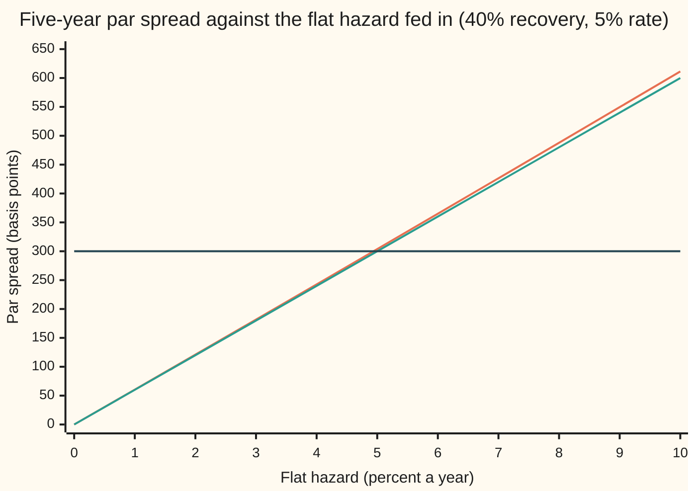

# Implied hazard from one CDS quote: solving the par-spread equation backwards, and why the answer is unique

Financial mathematics → Credit Default Swaps - Pricing, the Par Spread and the Hazard Behind It → Reading a spread backwards → Implied hazard from one CDS quote

---

## General Overview

A lender holds 10 million dollars of loans to a music-festival promoter. Festivals are cash-hungry and weather-exposed, so the lender buys five years of protection: a credit default swap, a contract that pays out the loss if the promoter defaults. The dealer's screen quotes it at **300 basis points**. A basis point is a hundredth of a percent, so 300 bp is 3% a year: 300,000 dollars a year on 10 million, paid 75,000 a quarter while the promoter survives.

The quote is a price. The lender's risk system wants something else: how likely the market thinks default is. The number that carries that is the **hazard rate**, the chance of defaulting in the next short stretch of time, per year, given survival so far ([hazard-rate-and-survival-probability](../41-Default%2C%20Survival%20and%20the%20Hazard%20Rate/02-hazard-rate-and-survival-probability.md)). Pricing a CDS runs from hazard to spread ([cds-legs-risky-annuity-and-par-spread](02-cds-legs-risky-annuity-and-par-spread.md)). This card runs it the other way.

The credit triangle gives a first guess: spread divided by the share lost in default. With 40% recovered, 60% is lost, and 3% / 60% = 5% a year ([the-credit-triangle](03-the-credit-triangle.md)). The exact answer is **4.94% a year**, a **21.9% chance of default within five years**. The gap comes from paying premiums quarterly, after the fact, instead of continuously. Twelve halvings of the range from zero to the triangle's 5% pin it down.

Solving backwards is only safe if there is exactly one answer to find. There is. The spread climbs strictly as the hazard climbs, from zero and without limit, so every positive quote meets the curve exactly once.

**One CDS quote, a recovery and a discount rate fix exactly one flat hazard, because the par spread rises strictly and without bound as the hazard rises; with rates at or above zero, a bracketed search from zero to the triangle's guess always finds it.**

**What kind of fact this is:** a method, and the guarantee behind it (one answer, always inside the bracket) is a theorem proved on this card in Why it works. The flat hazard itself is a model: one number standing in for a risk that really changes over time.

### The picture: one quote, one hazard



Orange: the par spread with quarterly premiums, the contract as traded. Green: the credit triangle, 60% of the hazard, exact only for premiums paid continuously. Dark: the 300 bp quote. The orange line rises everywhere and sits just above the green one. It crosses the quote once, a little left of 5%. At 5% it reads 303.78 bp, too high, so the answer lies below the triangle's guess.

---

## The formula

Notation first, in words. The quote is written $s$, as a decimal: 300 bp is 0.03. The model's par spread at a trial hazard is a function of that hazard, written $s_{\text{par}}(\lambda)$: the spread at which the premiums and the payout are worth the same today. The implied hazard is the trial value that makes the model match the screen.

$$s_{\text{par}}(\lambda) \;=\; \frac{P(\lambda)}{A(\lambda)} \;=\; (1-R)\,\lambda\;\frac{e^{(r+\lambda)\delta}-1}{(r+\lambda)\delta}, \qquad \text{implied hazard: the one } \lambda \text{ with } s_{\text{par}}(\lambda) = s$$

**Read it aloud:** the fair spread is the share lost in default, times the hazard, times a timing factor a little above one; the implied hazard is the hazard that makes this equal the quote.

The two pieces it comes from, for a flat hazard and a flat rate, with $n$ quarterly premium dates at $\delta, 2\delta, \dots, n\delta = T$:

$$A(\lambda) = \sum_{j=1}^{n} \delta\, e^{-(r+\lambda)\,j\delta}, \qquad P(\lambda) = (1-R)\int_0^T \lambda\, e^{-\lambda t}\, e^{-rt}\,dt$$

In words: $A(\lambda)$ adds up each quarter's premium of one unit a year, weighted by the chance of surviving to pay it and discounted to today. $P(\lambda)$ adds up the loss paid at each possible default time, weighted by the chance of defaulting then and discounted.

| Symbol | Plain meaning | In our example | Push it up and the implied hazard… |
| --- | --- | --- | --- |
| $s$ | the quoted spread, a decimal per year | 0.03 (300 bp) | rises, without limit |
| $s_{\text{par}}(\lambda)$ | the model's fair spread at trial hazard $\lambda$ | 303.78 bp at 5% | (the curve being inverted) |
| $R$ | recovery: the share of the debt paid back after default | 40% | rises, and has no answer at 100% |
| $\lambda$ | the flat hazard, chance of default per year given survival (say "lambda") | 4.94% | (the answer) |
| $\lambda_0$ | the triangle's seed, $s/(1-R)$ | 5% | (a starting point only) |
| $r$ | the riskless rate, continuously compounded | 5% | falls slightly: 4.97% at a zero rate, 4.94% at 5% |
| $\delta$ | the time between premiums, in years (say "delta") | 0.25 | falls slightly: later premiums need less hazard to match |
| $T$, $n$ | the contract's length in years, and its number of premium dates | 5 and 20 | unchanged, on a flat curve |
| $t$, $\tau$ | a point in time; the random time of default (say "tau") | $\tau$ within 5 years: 21.9% | |
| $A(\lambda)$ | the risky annuity: today's value of one unit a year of premium, paid only while alive | 3.8915 | |
| $P(\lambda)$ | the protection leg: today's value of the payout, per dollar of notional | 0.116746 | |
| $g(x)$ | the timing factor $(e^x - 1)/x$, with $x = (r+\lambda)\delta$ | 1.0125 | |

Once the hazard is known, the chance of default within the contract follows from survival, $e^{-\lambda T}$:

$$\text{chance of default by } T \;=\; 1 - e^{-\lambda T} \;=\; 1 - e^{-0.0493814 \times 5} \;=\; 21.88\%$$

### When it holds

- **A flat hazard.** One quote pins one number. The real risk may rise or fall over the five years; a curve that changes shape needs several quotes and a bootstrap ([bootstrapping-the-hazard-curve-from-cds-quotes](06-bootstrapping-the-hazard-curve-from-cds-quotes.md)).
- **A flat discount rate.** Only then does the closed form hold and maturity drop out. On a curve whose rates climb from 2% at the short end to 7% at five years, the same quote implies 4.93% instead of 4.94%. The proof below then no longer applies word for word; the check confirms the spread still rises strictly on that curve.
- **A recovery taken as known.** The quote cannot separate hazard from recovery. Assume 25% recovered and the hazard is 3.96%; assume 60% and it is 7.38% ([recovery-assumptions-and-what-they-change](05-recovery-assumptions-and-what-they-change.md)).
- **Recovery below 100% and a positive spread.** At 100% recovery nobody loses anything, the fair spread is zero at every hazard, and no positive quote has an answer. A zero spread gives zero hazard; a negative one gives none.
- **This card's contract conventions:** premiums at quarter ends, nothing accrued if default falls mid-quarter, the loss paid at the moment of default. Real contracts pay the accrued premium too, which moves the answer by a small fraction of its size.

**Conventions verified 2026-09-28:** single-name CDS trade with a fixed coupon plus an upfront payment, and the ISDA CDS Standard Model is the published code for converting between upfront and spread quotes (source 5). This card solves from a spread quote; the upfront is priced on [marking-a-cds-to-market-and-the-upfront](07-marking-a-cds-to-market-and-the-upfront.md).

---

## Why it works

### Step 0: an inverse is safe when the spread curve only climbs

Running a pricer backwards is a search: guess a hazard, price the contract, compare with the screen, guess again ([root-finding-for-inverses](../07-Greeks%20by%20Numbers%20and%20Calibration/05-root-finding-for-inverses.md)). A search can fail two ways. The curve may never reach the quote, so there is nothing to find. Or it may reach it twice, so the answer depends on where the search started. Both vanish if the par spread starts at zero, climbs strictly, and has no ceiling. The steps below prove that, by getting the par spread into a form where it can be read off.

### Step 1: the spread curve in closed form, where maturity cancels

With a flat hazard and a flat rate, surviving and discounting combine into one decay, $e^{-(r+\lambda)t}$. The annuity's terms each shrink by the same factor from one quarter to the next, a geometric series; the protection integral is an exponential. Both sum in closed form, both carry the factor $1 - e^{-(r+\lambda)T}$, and the division cancels it. What is left is the formula above, $s_{\text{par}}(\lambda) = (1-R)\,\lambda\, g(x)$ with $x = (r+\lambda)\delta$, and no $T$ anywhere. The credit triangle card derives this timing factor and reads it as the cost of paying late ([the-credit-triangle](03-the-credit-triangle.md)); the sums are in the folded proof below.

The cancellation has a consequence worth checking. On a flat curve the one-, three-, five- and ten-year contracts all imply the same 4.9381% from a 300 bp quote. Every quarter is a scaled copy of the first, so payout over premium is the same quarter by quarter.

### Step 2: the timing factor is above one and rising

The factor $g(x) = (e^x - 1)/x$ is the average of $e^{xu}$ as $u$ runs from 0 to 1. Every value of $e^{xu}$ is positive, and each one grows as $x$ grows, so the average is positive and rising. At $x = 0$ it equals 1, so for any positive $x$ it exceeds 1. Where it comes from: premiums are paid at the end of each quarter, a little late, so each one is discounted and survival-weighted a little more than a continuous stream would be. The annuity shrinks, and the fair spread has to rise to make up for it.

### Step 3: existence, uniqueness and the boundary cases

The par spread is $(1-R)$ times $\lambda$ times $g$. For $R$ below 1 all three are positive when $\lambda$ is, and the last two both rise with $\lambda$. So:

- **Starts at zero.** At $\lambda = 0$ nothing defaults and the fair spread is 0.
- **Rises strictly.** A product of positive rising factors rises.
- **No ceiling.** Once $r + \lambda \ge 0$, $g$ is at least 1, so the spread is at least $(1-R)\lambda$, which grows without limit.
- **No gaps.** It is built from exponentials, so it is continuous.

The intermediate value theorem (a continuous curve that starts below a level and ends above it crosses it) gives at least one crossing. Strict rise gives at most one. So every quote above zero has exactly one implied hazard. The boundary cases fall out of the same line: at $R = 1$ the spread is zero everywhere, above 1 it is negative everywhere, and a quote of zero or less meets the curve only at $\lambda = 0$ or nowhere.

<details>
<summary>Detailed proof: the sums, the factor, and Newton from the seed</summary>

**The annuity.** With $q = e^{-(r+\lambda)\delta}$, $A = \delta(q + q^2 + \dots + q^n) = \delta\, q\,(1-q^n)/(1-q)$, and $q^n = e^{-(r+\lambda)T}$.

**The protection leg.** $\int_0^T \lambda e^{-(r+\lambda)t}\,dt = \lambda\,(1 - e^{-(r+\lambda)T})/(r+\lambda)$.

**The ratio.** $P/A = (1-R)\lambda\,(1-q)/\big((r+\lambda)\,\delta\, q\big)$. Multiply top and bottom by $e^{(r+\lambda)\delta}$: $(1-q)/q = e^{(r+\lambda)\delta} - 1$, which gives $(1-R)\lambda\,(e^x - 1)/x$.

**The factor.** $g(x) = \int_0^1 e^{xu}\,du$. Differentiating under the integral, $g'(x) = \int_0^1 u\, e^{xu}\,du > 0$ and $g''(x) = \int_0^1 u^2 e^{xu}\,du > 0$: rising and curving upward for every $x$, negative ones included, so a negative interest rate does not break the rise.

**Rise and bend of the spread.** With $x = (r+\lambda)\delta$, the slope in $\lambda$ is $(1-R)\big(g + \lambda\delta\, g'\big) > 0$ and the bend is $(1-R)\big(2\delta g' + \lambda\delta^2 g''\big) > 0$ for $\lambda \ge 0$. The curve rises and is convex (it bends upward).

**The bracket.** $s_{\text{par}}(0) = 0 < s$, and $s_{\text{par}}(\lambda_0) = (1-R)\lambda_0\, g \ge (1-R)\lambda_0 = s$, since $g \ge 1$ when $r \ge 0$. So the answer lies in $[0, \lambda_0]$. With a negative rate, double the top until the spread passes the quote.

**Newton from the seed.** For a rising convex curve, the tangent line lies below the curve. Starting to the right of the crossing, the tangent meets the quote level to the left of where it was but not past the crossing. Each step moves left and never overshoots, so the steps fall steadily onto the answer, and near it the error squares each step.

</details>

### Step 4: the bracket, and two ways to close it

The bracket runs from zero, where the spread is too low, to the triangle's seed $\lambda_0 = s/(1-R)$, where $g \ge 1$ makes the spread at least the quote. **Bisection** tests the middle and keeps the half that still straddles the quote. Each step halves the range: twelve steps cut the five-point range 4,096 times, to 0.00122 percentage points. **Newton's method** follows the tangent from the seed instead. Because the curve bends upward, it moves left and never overshoots: 5% → 4.938149% → 4.938144%, done in three steps.

A third road needs no calculus. Rearrange the formula as $\lambda = s \,/\, \big((1-R)\,g(x)\big)$, start at the seed, and substitute each answer back in. $g$ barely moves with $\lambda$, so two passes by hand give four figures. The worked numbers below do exactly that.

---

## Worked numbers, by hand

The promoter: quote 300 bp, recovery 40%, rate 5%, quarterly premiums, five years.

| Step | Arithmetic | Value |
| --- | --- | --- |
| seed, $\lambda_0 = s/(1-R)$ | $0.03 / 0.60$ | $0.050000$ |
| one quarter's decay at the seed | $x = (0.05 + 0.05) \times 0.25$ | $0.0250000$ |
| timing factor | $g = (e^{0.025} - 1)/0.025$ | $1.0126048$ |
| first pass | $\lambda = 0.05 / 1.0126048$ | $0.049378$ |
| one quarter's decay again | $x = (0.05 + 0.049378) \times 0.25$ | $0.0248444$ |
| timing factor again | $g = (e^{0.0248444} - 1)/0.0248444$ | $1.0125257$ |
| second pass | $\lambda = 0.05 / 1.0125257$ | $0.049381$ |
| **implied hazard** | stable to six places from here | **$4.94\%$ a year** |
| five-year default chance | $1 - e^{-0.0493814 \times 5}$ | **$21.88\%$** |
| risky annuity at the answer | sum of 20 quarters | $3.891532$ |
| protection leg at the answer | $0.03 \times 3.891532$ | $0.116746$ per dollar |

The market is charging for about a one-in-five chance that the promoter defaults within five years. On 10 million dollars, the payout side of the contract is worth 1,167,459.74 dollars today, and so is the premium side at 300 bp. That equality is what "par" means.

The house example on this shelf cross-checks the machinery: a 2% flat hazard gives a par spread of 121.06 bp and a risky annuity of 4.1819 in this same code.

### The bisection, step by step

Bracket $[0, 0.05]$. At each step the midpoint is priced; above 300 bp it becomes the new top, below it the new bottom.

| Step | Midpoint (%) | Par spread (bp) | Keep |
| --- | --- | --- | --- |
| 1 | 2.5000 | 151.4151 | upper half |
| 2 | 3.7500 | 227.4790 | upper half |
| 3 | 4.3750 | 265.6003 | upper half |
| 4 | 4.6875 | 284.6834 | upper half |
| 5 | 4.8438 | 294.2306 | upper half |
| 6 | 4.9219 | 299.0055 | upper half |
| 7 | 4.9609 | 301.3934 | lower half |
| 8 | 4.9414 | 300.1994 | lower half |
| 9 | 4.9316 | 299.6025 | upper half |
| 10 | 4.9365 | 299.9010 | upper half |
| 11 | 4.9390 | 300.0502 | lower half |
| 12 | 4.9377 | 299.9756 | upper half |

After twelve halvings the bracket is 0.00122 points wide, and the midpoint prices within 0.03 bp of the quote. Newton got there in three steps; bisection needed no slope and cannot fail.

### What breaks if you drop a piece

| Mistake | Comes out at | What went wrong |
| --- | --- | --- |
| Hazard read as the spread itself | 3.00%, five-year default 13.93% | Forgot recovery: the spread pays for the 60% lost, not the whole debt |
| Triangle's seed kept as the answer | 5.00%, five-year default 22.12%; reprices at 303.78 bp | Premiums are paid late each quarter; the triangle assumes a continuous stream |
| Default chance as 5 × hazard | 24.69%, not 21.88% | Survival compounds: each year's hazard acts only on those still alive |
| Recovery set to 100% | fair spread 0 at 5% and at 50% | Nothing is lost, so no hazard can produce a positive spread |

The code prints every one.

---

## Code, from first principles, and it actually runs

Nothing imported knows the answer. The hazard is found by **two independent roads and confirmed by a third**. Road 1 prices both legs term by term, the protection integral by Simpson's rule (thin slices under the curve), and bisects from $[0, \lambda_0]$; it never uses the closed form. Road 2 runs Newton on the closed form from the seed, with its slope worked out by hand. Road 3 simulates a million default times at the implied hazard with a hand-written random number generator, averages both legs, and checks the simulated spread is the 300 bp quote within its sampling error ([simulating-a-default-time](../41-Default%2C%20Survival%20and%20the%20Hazard%20Rate/05-simulating-a-default-time.md)). The checks then sweep the hazard from 0 to 100% on the flat curve and the sloped one to confirm the strict rise, and print every "what breaks" and "try changing" number.

### Python

```python
# Implied hazard from one CDS quote -- the check behind the card.  Standard
# library only; nothing imported knows the answer.  A festival promoter's
# five-year CDS is quoted at 300 bp, recovery 40%, riskless rate 5% (flat,
# continuous), premiums quarterly in arrears, no accrual on default.
# Three roads to the flat hazard: bisection on legs priced by Simpson's rule,
# Newton on the closed form, and a Monte Carlo that reprices at the answer.
from math import exp, sqrt, log

QUOTE, REC, RATE, T, DT = 0.0300, 0.40, 0.05, 5.0, 0.25

def flat(t): return exp(-RATE * t)                 # discount factor D(t)
def sloped(t): return exp(-(0.02 + 0.01 * t) * t)  # a rising curve, for the uniqueness sweep

def simpson(f, a, b, n=20):
    h = (b - a) / n
    s = f(a) + f(b)
    for i in range(1, n):
        s += (4 if i % 2 else 2) * f(a + i * h)
    return s * h / 3.0

def annuity(lam, D=flat, T=T):                     # risky annuity: premiums of DT at each quarter, if alive
    return sum(DT * D(j * DT) * exp(-lam * j * DT) for j in range(1, round(T / DT) + 1))

def protection(lam, D=flat, T=T, rec=REC):         # (1-R) x integral of lam e^{-lam t} D(t) dt, quarter by quarter
    f = lambda t: lam * exp(-lam * t) * D(t)
    return (1 - rec) * sum(simpson(f, (j - 1) * DT, j * DT) for j in range(1, round(T / DT) + 1))

def par(lam, D=flat, T=T, rec=REC): return protection(lam, D, T, rec) / annuity(lam, D, T)

def g(x): return (exp(x) - 1) / x                  # (e^x - 1)/x, always above 0 and rising
def par_closed(lam, r=RATE, rec=REC):              # the card's formula: maturity has dropped out
    return (1 - rec) * lam * g((r + lam) * DT)

def bisect(quote, lo, hi, halvings, **kw):
    mids = []
    for _ in range(halvings):
        m = (lo + hi) / 2
        mids.append(m)
        if par(m, **kw) > quote: hi = m
        else: lo = m
    return (lo + hi) / 2, mids

def newton(quote, lam, r=RATE, rec=REC):
    path = [lam]
    for _ in range(50):
        x = (r + lam) * DT
        gp = (x * exp(x) - exp(x) + 1) / (x * x)   # slope of g
        step = (par_closed(lam, r, rec) - quote) / ((1 - rec) * (g(x) + lam * DT * gp))
        lam -= step
        path.append(lam)
        if abs(step) < 1e-15: break
    return lam, path

seed = QUOTE / (1 - REC)                            # the credit triangle's guess
lam_b, mids = bisect(QUOTE, 0.0, seed, 60)
lam_n, npath = newton(QUOTE, seed)
fp = [seed]                                         # fixed point, the by-hand road
for _ in range(3): fp.append(QUOTE / ((1 - REC) * g((RATE + fp[-1]) * DT)))

# road 3: simulate default times at the implied hazard; reprice both legs
state, N, NQ = 20260928, 1000000, round(T / DT)
def uniform():
    global state
    state = (state * 6364136223846793005 + 1442695040888963407) % 2**64
    return ((state >> 11) + 0.5) / 2**53
cum = [0.0]                                         # PV of the first k premiums, per unit spread
for j in range(1, NQ + 1): cum.append(cum[-1] + DT * flat(j * DT))
sp = sa = szz = spa = saa = 0.0; dead = 0
for _ in range(N):
    tau = -log(uniform()) / lam_b
    p = (1 - REC) * flat(tau) if tau <= T else 0.0
    a = cum[min(int(tau / DT), NQ)]
    sp += p; sa += a; spa += p * a; saa += a * a; szz += p * p
    dead += tau <= T
mp, ma = sp / N, sa / N
s_mc = mp / ma
var_z = (szz - 2 * s_mc * spa + s_mc * s_mc * saa) / N - (mp - s_mc * ma) ** 2
se_mc = sqrt(var_z / N) / ma
pd5 = 1 - exp(-lam_b * T)
se_pd = sqrt(pd5 * (1 - pd5) / N)

print(f"quote {QUOTE*1e4:.0f} bp, recovery {REC:.2f}, r {RATE:.2f}, {T:.0f} years, quarterly")
print(f"seed s/(1-R)                    {seed:.6f}")
print(f"par spread at the seed, bp      {par(seed)*1e4:.4f}")
print("bisection on [0, seed]: step, midpoint, spread bp")
for k in range(12): print(f"  {k+1:>2}  {mids[k]:.6f}  {par(mids[k])*1e4:9.4f}")
print(f"bracket width after 12 halvings {seed/2**12:.7f}")
print(f"road 1 bisection, 60 halvings   {lam_b:.10f}")
print(f"road 2 Newton from the seed     {lam_n:.10f}  in {len(npath)-1} steps")
print("  Newton path   " + "  ".join(f"{x:.8f}" for x in npath[:4]))
print("  fixed point   " + "  ".join(f"{x:.6f}" for x in fp))
print("  its x and g   " + "  ".join(f"{(RATE + l) * DT:.7f} {g((RATE + l) * DT):.7f}" for l in fp[:2]))
print(f"road 3 Monte Carlo spread, bp   {s_mc*1e4:.4f}  (std error {se_mc*1e4:.4f})")
print(f"  MC 5y default fraction        {dead/N:.6f}  (std error {se_pd:.6f})")
print(f"five-year default chance        {pd5:.6f}")
print(f"risky annuity                   {annuity(lam_b):.6f}")
print(f"protection leg per $1           {protection(lam_b):.6f}")
print(f"on $10m: protection PV $        {1e7*protection(lam_b):.2f}")
print(f"house check, 2% hazard: par bp  {par(0.02)*1e4:.4f}  annuity {annuity(0.02):.4f}")
print("maturity drops out: implied hazard at T = 1, 3, 10")
for TT in (1.0, 3.0, 10.0): print(f"  T = {TT:>4.0f}                     {bisect(QUOTE, 0.0, seed, 60, T=TT)[0]:.10f}")
flat_up = all(par(i * 0.005) < par((i + 1) * 0.005) for i in range(200))
slope_up = all(par(i * 0.005, sloped) < par((i + 1) * 0.005, sloped) for i in range(200))
print(f"spread rises on 0..100%: flat {'yes' if flat_up else 'no'}, sloped {'yes' if slope_up else 'no'}")
print(f"sloped curve implied hazard     {bisect(QUOTE, 0.0, seed, 60, D=sloped)[0]:.6f}")
print(f"R = 1: spread at 5% and 50%     {par(0.05, rec=1.0):.6f}  {par(0.5, rec=1.0):.6f}")
print("what breaks:")
print(f"  no recovery, hazard = s       {QUOTE:.6f}  5y default {1-exp(-QUOTE*T):.6f}")
print(f"  triangle seed kept            {seed:.6f}  5y default {1-exp(-seed*T):.6f}")
print(f"  default chance as 5 x hazard  {T*lam_b:.6f}")
print("try: R = 0.25, R = 0.60, 600 bp, r = 0")
print(f"  {newton(QUOTE, QUOTE/0.75, rec=0.25)[0]:.6f}  {newton(QUOTE, QUOTE/0.4, rec=0.60)[0]:.6f}"
      f"  {newton(0.06, 0.1)[0]:.6f}  {newton(QUOTE, seed, r=0.0)[0]:.6f}")
print("chart, hazard %   " + " ".join(f"{i:6d}" for i in range(11)))
print("chart, par bp     " + " ".join(f"{par(i/100)*1e4:6.2f}" for i in range(11)))
print("chart, triangle bp" + " ".join(f"{(1-REC)*i/100*1e4:6.2f}" for i in range(11)))

assert abs(lam_b - lam_n) < 1e-10, "bisection on Simpson legs vs Newton on the closed form"
assert abs(s_mc - QUOTE) < 4 * se_mc, "simulated defaults reprice the quote within 4 standard errors"
assert abs(dead / N - pd5) < 4 * se_pd, "simulated default fraction vs 1 - e^(-lam T)"
assert abs(fp[-1] - lam_n) < 1e-6, "the by-hand fixed point lands on Newton's answer"
assert flat_up, "par spread strictly rising in the hazard, flat curve"
assert slope_up, "par spread strictly rising in the hazard, sloped curve"
print("ALL CHECKS PASS")
```

**Ran 2026-09-28 on macOS, Python 3.14.6, standard library only. All checks passed. Output, pasted from the run:**

```
quote 300 bp, recovery 0.40, r 0.05, 5 years, quarterly
seed s/(1-R)                    0.050000
par spread at the seed, bp      303.7814
bisection on [0, seed]: step, midpoint, spread bp
   1  0.025000   151.4151
   2  0.037500   227.4790
   3  0.043750   265.6003
   4  0.046875   284.6834
   5  0.048438   294.2306
   6  0.049219   299.0055
   7  0.049609   301.3934
   8  0.049414   300.1994
   9  0.049316   299.6025
  10  0.049365   299.9010
  11  0.049390   300.0502
  12  0.049377   299.9756
bracket width after 12 halvings 0.0000122
road 1 bisection, 60 halvings   0.0493814380
road 2 Newton from the seed     0.0493814380  in 3 steps
  Newton path   0.05000000  0.04938149  0.04938144  0.04938144
  fixed point   0.050000  0.049378  0.049381  0.049381
  its x and g   0.0250000 1.0126048  0.0248444 1.0125257
road 3 Monte Carlo spread, bp   299.4429  (std error 0.6465)
  MC 5y default fraction        0.218384  (std error 0.000413)
five-year default chance        0.218787
risky annuity                   3.891532
protection leg per $1           0.116746
on $10m: protection PV $        1167459.74
house check, 2% hazard: par bp  121.0562  annuity 4.1819
maturity drops out: implied hazard at T = 1, 3, 10
  T =    1                     0.0493814380
  T =    3                     0.0493814380
  T =   10                     0.0493814380
spread rises on 0..100%: flat yes, sloped yes
sloped curve implied hazard     0.049283
R = 1: spread at 5% and 50%     0.000000  0.000000
what breaks:
  no recovery, hazard = s       0.030000  5y default 0.139292
  triangle seed kept            0.050000  5y default 0.221199
  default chance as 5 x hazard  0.246907
try: R = 0.25, R = 0.60, 600 bp, r = 0
  0.039554  0.073845  0.098159  0.049690
chart, hazard %        0      1      2      3      4      5      6      7      8      9     10
chart, par bp       0.00  60.45 121.06 181.81 242.72 303.78 365.00 426.36 487.89 549.56 611.39
chart, triangle bp  0.00  60.00 120.00 180.00 240.00 300.00 360.00 420.00 480.00 540.00 600.00
ALL CHECKS PASS
```

Roads 1 and 2 agree to ten decimals. The simulated spread, 299.44 bp, sits within one standard error (0.65 bp) of the quote, and the simulated five-year default fraction, 21.84%, within one standard error of 21.88%.

### Rust

Same checks, same inputs, same random number generator, no crates.

```rust
// Implied hazard from one CDS quote -- the same check as the Python, in Rust.
// Standard library only, no crates.  A festival promoter's five-year CDS is
// quoted at 300 bp, recovery 40%, riskless rate 5% (flat, continuous),
// premiums quarterly in arrears, no accrual on default.  Three roads to the
// flat hazard: bisection on legs priced by Simpson's rule, Newton on the
// closed form, and a Monte Carlo that reprices at the answer.
const QUOTE: f64 = 0.0300;
const REC: f64 = 0.40;
const RATE: f64 = 0.05;
const T: f64 = 5.0;
const DT: f64 = 0.25;

fn flat(t: f64) -> f64 { (-RATE * t).exp() }                 // discount factor D(t)
fn sloped(t: f64) -> f64 { (-(0.02 + 0.01 * t) * t).exp() }  // a rising curve

fn simpson<F: Fn(f64) -> f64>(f: F, a: f64, b: f64, n: usize) -> f64 {
    let h = (b - a) / n as f64;
    let mut s = f(a) + f(b);
    for i in 1..n { s += if i % 2 == 1 { 4.0 } else { 2.0 } * f(a + i as f64 * h); }
    s * h / 3.0
}

fn quarters(t: f64) -> usize { (t / DT).round() as usize }

fn annuity(lam: f64, d: fn(f64) -> f64, t: f64) -> f64 {    // risky annuity
    (1..=quarters(t)).map(|j| DT * d(j as f64 * DT) * (-lam * j as f64 * DT).exp()).sum()
}

fn protection(lam: f64, d: fn(f64) -> f64, t: f64, rec: f64) -> f64 {
    let f = |u: f64| lam * (-lam * u).exp() * d(u);
    (1.0 - rec) * (1..=quarters(t)).map(|j| simpson(&f, (j - 1) as f64 * DT, j as f64 * DT, 20)).sum::<f64>()
}

fn par(lam: f64, d: fn(f64) -> f64, t: f64, rec: f64) -> f64 { protection(lam, d, t, rec) / annuity(lam, d, t) }
fn par0(lam: f64) -> f64 { par(lam, flat, T, REC) }

fn g(x: f64) -> f64 { (x.exp() - 1.0) / x }                  // (e^x - 1)/x
fn par_closed(lam: f64, r: f64, rec: f64) -> f64 { (1.0 - rec) * lam * g((r + lam) * DT) }

fn bisect(quote: f64, mut lo: f64, mut hi: f64, halvings: usize, d: fn(f64) -> f64, t: f64) -> (f64, Vec<f64>) {
    let mut mids = Vec::new();
    for _ in 0..halvings {
        let m = (lo + hi) / 2.0;
        mids.push(m);
        if par(m, d, t, REC) > quote { hi = m; } else { lo = m; }
    }
    ((lo + hi) / 2.0, mids)
}

fn newton(quote: f64, mut lam: f64, r: f64, rec: f64) -> (f64, Vec<f64>) {
    let mut path = vec![lam];
    for _ in 0..50 {
        let x = (r + lam) * DT;
        let gp = (x * x.exp() - x.exp() + 1.0) / (x * x);
        let step = (par_closed(lam, r, rec) - quote) / ((1.0 - rec) * (g(x) + lam * DT * gp));
        lam -= step;
        path.push(lam);
        if step.abs() < 1e-15 { break; }
    }
    (lam, path)
}

struct Lcg(u64);
impl Lcg {
    fn uniform(&mut self) -> f64 {
        self.0 = self.0.wrapping_mul(6364136223846793005).wrapping_add(1442695040888963407);
        ((self.0 >> 11) as f64 + 0.5) / 9007199254740992.0
    }
}

fn main() {
    let seed = QUOTE / (1.0 - REC);
    let (lam_b, mids) = bisect(QUOTE, 0.0, seed, 60, flat, T);
    let (lam_n, npath) = newton(QUOTE, seed, RATE, REC);
    let mut fp = vec![seed];
    for _ in 0..3 { let l = *fp.last().unwrap(); fp.push(QUOTE / ((1.0 - REC) * g((RATE + l) * DT))); }

    let mut rng = Lcg(20260928);
    let (n, nq) = (1000000usize, quarters(T));
    let mut cum = vec![0.0f64];
    for j in 1..=nq { let c = cum[j - 1] + DT * flat(j as f64 * DT); cum.push(c); }
    let (mut sp, mut sa, mut szz, mut spa, mut saa, mut dead) = (0.0, 0.0, 0.0, 0.0, 0.0, 0usize);
    for _ in 0..n {
        let tau = -rng.uniform().ln() / lam_b;
        let p = if tau <= T { (1.0 - REC) * flat(tau) } else { 0.0 };
        let a = cum[((tau / DT) as usize).min(nq)];
        sp += p; sa += a; spa += p * a; saa += a * a; szz += p * p;
        if tau <= T { dead += 1; }
    }
    let nf = n as f64;
    let (mp, ma) = (sp / nf, sa / nf);
    let s_mc = mp / ma;
    let var_z = (szz - 2.0 * s_mc * spa + s_mc * s_mc * saa) / nf - (mp - s_mc * ma).powi(2);
    let se_mc = (var_z / nf).sqrt() / ma;
    let pd5 = 1.0 - (-lam_b * T).exp();
    let se_pd = (pd5 * (1.0 - pd5) / nf).sqrt();
    let frac = dead as f64 / nf;

    println!("quote {:.0} bp, recovery {:.2}, r {:.2}, {:.0} years, quarterly", QUOTE * 1e4, REC, RATE, T);
    println!("seed s/(1-R)                    {:.6}", seed);
    println!("par spread at the seed, bp      {:.4}", par0(seed) * 1e4);
    println!("bisection on [0, seed]: step, midpoint, spread bp");
    for k in 0..12 { println!("  {:>2}  {:.6}  {:9.4}", k + 1, mids[k], par0(mids[k]) * 1e4); }
    println!("bracket width after 12 halvings {:.7}", seed / 4096.0);
    println!("road 1 bisection, 60 halvings   {:.10}", lam_b);
    println!("road 2 Newton from the seed     {:.10}  in {} steps", lam_n, npath.len() - 1);
    println!("  Newton path   {}", npath[..4].iter().map(|x| format!("{:.8}", x)).collect::<Vec<_>>().join("  "));
    println!("  fixed point   {}", fp.iter().map(|x| format!("{:.6}", x)).collect::<Vec<_>>().join("  "));
    println!("  its x and g   {}", fp[..2].iter().map(|l| format!("{:.7} {:.7}", (RATE + l) * DT, g((RATE + l) * DT))).collect::<Vec<_>>().join("  "));
    println!("road 3 Monte Carlo spread, bp   {:.4}  (std error {:.4})", s_mc * 1e4, se_mc * 1e4);
    println!("  MC 5y default fraction        {:.6}  (std error {:.6})", frac, se_pd);
    println!("five-year default chance        {:.6}", pd5);
    println!("risky annuity                   {:.6}", annuity(lam_b, flat, T));
    println!("protection leg per $1           {:.6}", protection(lam_b, flat, T, REC));
    println!("on $10m: protection PV $        {:.2}", 1e7 * protection(lam_b, flat, T, REC));
    println!("house check, 2% hazard: par bp  {:.4}  annuity {:.4}", par0(0.02) * 1e4, annuity(0.02, flat, T));
    println!("maturity drops out: implied hazard at T = 1, 3, 10");
    for tt in [1.0f64, 3.0, 10.0] { println!("  T = {:>4.0}                     {:.10}", tt, bisect(QUOTE, 0.0, seed, 60, flat, tt).0); }
    let flat_up = (0..200).all(|i| par0(i as f64 * 0.005) < par0((i + 1) as f64 * 0.005));
    let slope_up = (0..200).all(|i| par(i as f64 * 0.005, sloped, T, REC) < par((i + 1) as f64 * 0.005, sloped, T, REC));
    let yn = |b: bool| if b { "yes" } else { "no" };
    println!("spread rises on 0..100%: flat {}, sloped {}", yn(flat_up), yn(slope_up));
    println!("sloped curve implied hazard     {:.6}", bisect(QUOTE, 0.0, seed, 60, sloped, T).0);
    println!("R = 1: spread at 5% and 50%     {:.6}  {:.6}", par(0.05, flat, T, 1.0), par(0.5, flat, T, 1.0));
    println!("what breaks:");
    println!("  no recovery, hazard = s       {:.6}  5y default {:.6}", QUOTE, 1.0 - (-QUOTE * T).exp());
    println!("  triangle seed kept            {:.6}  5y default {:.6}", seed, 1.0 - (-seed * T).exp());
    println!("  default chance as 5 x hazard  {:.6}", T * lam_b);
    println!("try: R = 0.25, R = 0.60, 600 bp, r = 0");
    println!("  {:.6}  {:.6}  {:.6}  {:.6}", newton(QUOTE, QUOTE / 0.75, RATE, 0.25).0,
             newton(QUOTE, QUOTE / 0.4, RATE, 0.60).0, newton(0.06, 0.1, RATE, REC).0, newton(QUOTE, seed, 0.0, REC).0);
    println!("chart, hazard %   {}", (0..11).map(|i| format!("{:6}", i)).collect::<Vec<_>>().join(" "));
    println!("chart, par bp     {}", (0..11).map(|i| format!("{:6.2}", par0(i as f64 / 100.0) * 1e4)).collect::<Vec<_>>().join(" "));
    println!("chart, triangle bp{}", (0..11).map(|i| format!("{:6.2}", (1.0 - REC) * i as f64 / 100.0 * 1e4)).collect::<Vec<_>>().join(" "));

    assert!((lam_b - lam_n).abs() < 1e-10, "bisection on Simpson legs vs Newton on the closed form");
    assert!((s_mc - QUOTE).abs() < 4.0 * se_mc, "simulated defaults reprice the quote within 4 standard errors");
    assert!((frac - pd5).abs() < 4.0 * se_pd, "simulated default fraction vs 1 - e^(-lam T)");
    assert!((fp[3] - lam_n).abs() < 1e-6, "the by-hand fixed point lands on Newton's answer");
    assert!(flat_up, "par spread strictly rising in the hazard, flat curve");
    assert!(slope_up, "par spread strictly rising in the hazard, sloped curve");
    println!("ALL CHECKS PASS");
}
```

**Ran 2026-09-28 on macOS, rustc 1.98.1, no crates. All checks passed. Output, pasted from the run:**

```
quote 300 bp, recovery 0.40, r 0.05, 5 years, quarterly
seed s/(1-R)                    0.050000
par spread at the seed, bp      303.7814
bisection on [0, seed]: step, midpoint, spread bp
   1  0.025000   151.4151
   2  0.037500   227.4790
   3  0.043750   265.6003
   4  0.046875   284.6834
   5  0.048438   294.2306
   6  0.049219   299.0055
   7  0.049609   301.3934
   8  0.049414   300.1994
   9  0.049316   299.6025
  10  0.049365   299.9010
  11  0.049390   300.0502
  12  0.049377   299.9756
bracket width after 12 halvings 0.0000122
road 1 bisection, 60 halvings   0.0493814380
road 2 Newton from the seed     0.0493814380  in 3 steps
  Newton path   0.05000000  0.04938149  0.04938144  0.04938144
  fixed point   0.050000  0.049378  0.049381  0.049381
  its x and g   0.0250000 1.0126048  0.0248444 1.0125257
road 3 Monte Carlo spread, bp   299.4429  (std error 0.6465)
  MC 5y default fraction        0.218384  (std error 0.000413)
five-year default chance        0.218787
risky annuity                   3.891532
protection leg per $1           0.116746
on $10m: protection PV $        1167459.74
house check, 2% hazard: par bp  121.0562  annuity 4.1819
maturity drops out: implied hazard at T = 1, 3, 10
  T =    1                     0.0493814380
  T =    3                     0.0493814380
  T =   10                     0.0493814380
spread rises on 0..100%: flat yes, sloped yes
sloped curve implied hazard     0.049283
R = 1: spread at 5% and 50%     0.000000  0.000000
what breaks:
  no recovery, hazard = s       0.030000  5y default 0.139292
  triangle seed kept            0.050000  5y default 0.221199
  default chance as 5 x hazard  0.246907
try: R = 0.25, R = 0.60, 600 bp, r = 0
  0.039554  0.073845  0.098159  0.049690
chart, hazard %        0      1      2      3      4      5      6      7      8      9     10
chart, par bp       0.00  60.45 121.06 181.81 242.72 303.78 365.00 426.36 487.89 549.56 611.39
chart, triangle bp  0.00  60.00 120.00 180.00 240.00 300.00 360.00 420.00 480.00 540.00 600.00
ALL CHECKS PASS
```

The two outputs are identical line for line, simulation included, since both generators produce the same stream of numbers.

> [!TIP]
> **Try changing**
> Guess the direction first. Then run it.
> - **Double the quote.** Set `QUOTE = 0.06`. The hazard goes to **9.82%**, a little under double: the timing factor grows with the hazard, so less hazard is needed per basis point.
> - **Change the recovery.** Set `REC = 0.25` and the hazard falls to **3.96%**; set `REC = 0.60` and it climbs to **7.38%**. Same quote, very different default risk.
> - **Remove interest.** Set `RATE = 0.0`. The hazard is **4.97%**, closer to the triangle's 5%: a quarter's delay costs less when money earns nothing.
> - **Stretch the contract.** Set `T = 10.0`. The hazard stays at **4.9381%** to ten decimals. On a flat curve maturity cancels.

---

## The usual mistake

> [!warning]
> **Reading the implied hazard as a forecast.** It is the hazard that makes the market's price fair, and the price includes what investors charge for carrying default risk. Historical default rates for companies like this promoter are usually lower. The 21.9% is a market price of risk, stated as a probability, and the gap to real-world odds is its own subject ([market-implied-versus-historical-default-probability](09-market-implied-versus-historical-default-probability.md)).
>
> Smaller traps:
> - **The spread is not a default probability.** 300 bp is not a 3% annual chance of default; it is 60% of about 5%. Read it directly and the five-year chance comes out at 13.93% instead of 21.88%.
> - **The triangle is a seed, not an answer.** It assumes continuous premiums. Kept as the answer it reprices the contract at 303.78 bp, nearly 4 bp off a quote that trades in fractions of a basis point.
> - **Recovery is an input, not an output.** One quote cannot fix both hazard and recovery. State the recovery used next to every implied hazard.
> - **A search without a bracket can wander.** Newton from a poor start on a less well-behaved curve can overshoot into negative hazards. The bracket $[0, s/(1-R)]$ always holds the answer here, so start there.

---

## Where you meet it in real life

- **Credit risk systems.** A bank turns every name's CDS quote into a hazard, then into default chances at every horizon, which feed loss estimates and counterparty charges.
- **Comparing names.** Two quotes on different maturities, or marked with different recoveries, are not comparable as spreads. As hazards and default chances they are.
- **Upfront quotes.** Contracts trade with a fixed coupon plus an upfront payment. Desks convert the upfront back to a single "flat" spread, then to a flat hazard, with exactly this search ([marking-a-cds-to-market-and-the-upfront](07-marking-a-cds-to-market-and-the-upfront.md)).
- **Risk numbers.** Bump the quote by one basis point, solve again, reprice: that is how a desk measures a position's sensitivity to spreads ([cds-risk-numbers](08-cds-risk-numbers.md)).
- **The first step of every curve.** The bootstrap solves this card's equation once per quote, shortest first, each time holding the earlier pieces fixed.

> **Say it back**
> A CDS quote is a price; the hazard is the default risk behind it. On a flat curve the par spread is 60% of the hazard, for 40% recovery, times a timing factor a little above one, and maturity drops out. That spread starts at zero, rises strictly and has no ceiling, so every positive quote has exactly one hazard, provided recovery is below 100%. With rates at or above zero the answer lies between zero and the triangle's guess, so bisection cannot miss and Newton from the guess cannot overshoot. For the promoter at 300 bp the answer is 4.94% a year, a 21.9% chance of default in five years.

---

## What this builds on

- [the-credit-triangle](03-the-credit-triangle.md): spread equals loss share times hazard, exactly with continuous premiums; here it supplies the seed and the top of the bracket.
- [root-finding-for-inverses](../07-Greeks%20by%20Numbers%20and%20Calibration/05-root-finding-for-inverses.md): brackets, bisection and Newton, with their guarantees; this card supplies the rising curve those guarantees need.

## Where this goes next

- [recovery-assumptions-and-what-they-change](05-recovery-assumptions-and-what-they-change.md): the recovery held fixed here, varied, and what each choice does to the hazard and to the contract's value.
- [bootstrapping-the-hazard-curve-from-cds-quotes](06-bootstrapping-the-hazard-curve-from-cds-quotes.md): several quotes, a hazard that changes over time, and this card's solve repeated once per maturity.
- [implied-hazard-from-a-bond-price-and-the-cds-bond-basis](../44-Reduced-Form%20Models%20-%20Risky%20Bonds%2C%20Spreads%20and%20Random%20Hazards/02-implied-hazard-from-a-bond-price-and-the-cds-bond-basis.md): the same backwards solve from a bond price, and the gap when bond and CDS disagree.

One quote fixes one flat hazard; what a rising quote curve says about how the risk changes over time is the bootstrap's question.

---

## Sources

Verified 2026-09-28: every link below resolves to the publisher's page.

- Jarrow, Robert A., and Stuart M. Turnbull. "Pricing Derivatives on Financial Securities Subject to Credit Risk." *Journal of Finance* 50, no. 1 (1995): 53–85. [doi:10.1111/j.1540-6261.1995.tb05167.x](https://doi.org/10.1111/j.1540-6261.1995.tb05167.x). Default as the jump of a clock with a hazard rate: the model this card inverts.
- Duffie, Darrell, and Kenneth J. Singleton. "Modeling Term Structures of Defaultable Bonds." *Review of Financial Studies* 12, no. 4 (1999): 687–720. [doi:10.1093/rfs/12.4.687](https://doi.org/10.1093/rfs/12.4.687). Hazard and recovery entering prices together, and why one price cannot separate them.
- Hull, John, and Alan White. "Valuing Credit Default Swaps I: No Counterparty Default Risk." *Journal of Derivatives* 8, no. 1 (2000): 29–40. [doi:10.3905/jod.2000.319115](https://doi.org/10.3905/jod.2000.319115). The two legs, the par spread, and backing default probabilities out of quotes.
- O'Kane, Dominic. *Modelling Single-name and Multi-name Credit Derivatives*. Wiley, 2008. [Publisher page](https://www.wiley.com/en-us/Modelling+Single-name+and+Multi-name+Credit+Derivatives-p-9780470519288). The market's CDS model in full, including accrued premium and the flat-hazard solve.
- ISDA. *ISDA CDS Standard Model*. [cdsmodel.com](https://www.cdsmodel.com/). The open-source code the market uses to convert between upfront and spread quotes; the conventions line above.
