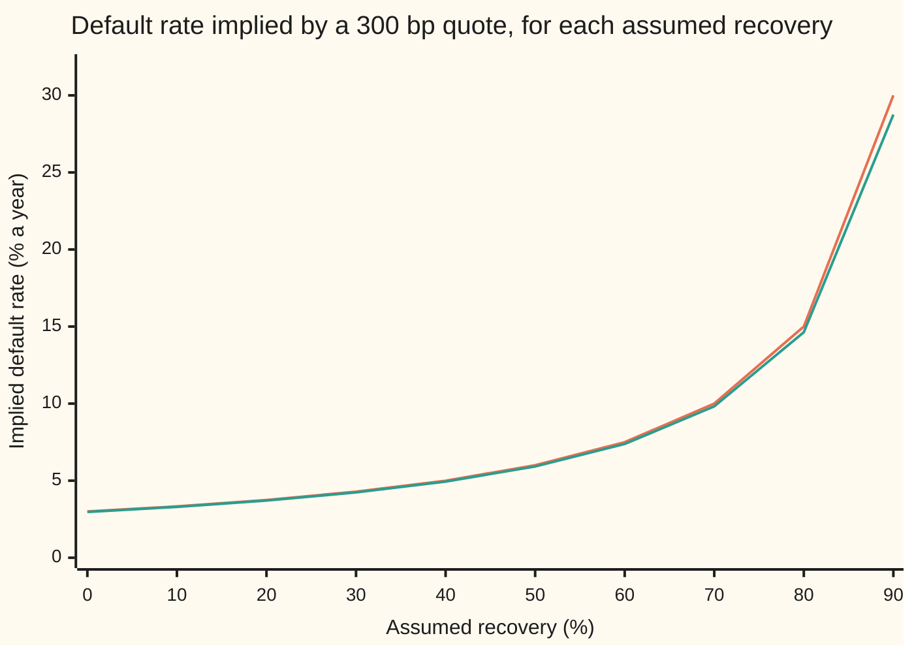
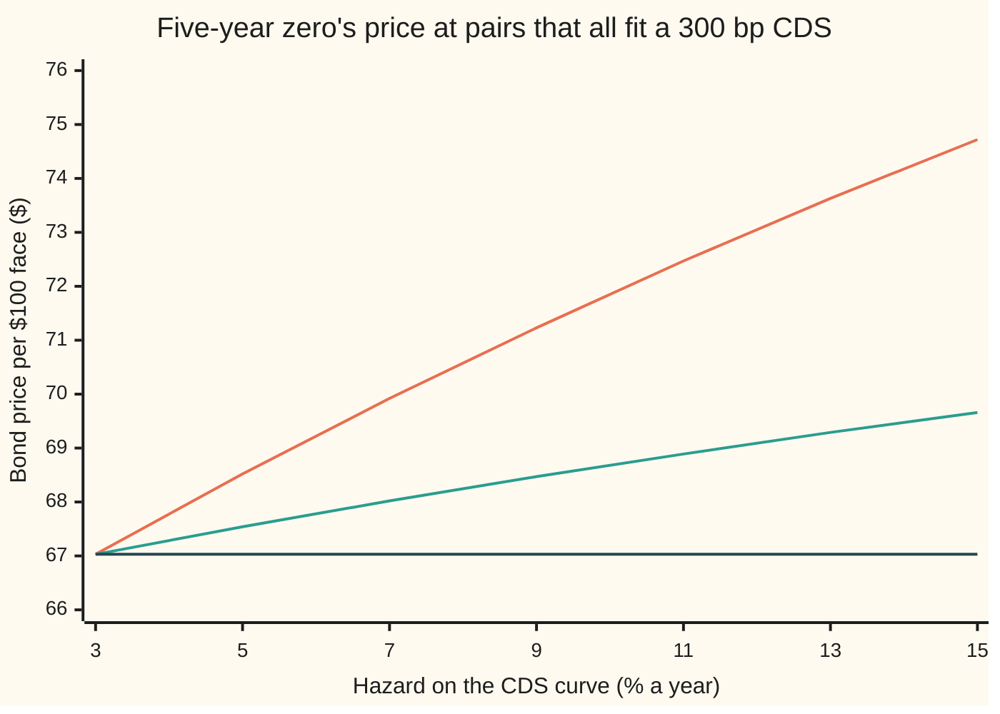

# Recovery assumptions: one spread, many default probabilities, depending on what you assume you get back

[Syllabus](../../../SYLLABUS.md) → [Financial mathematics](../README.md) → [Credit Default Swaps - Pricing, the Par Spread and the Hazard Behind It](../README.md#s42) → Recovery assumptions

---

## General Overview

Northwind Lines, a shipping company, is in trouble. Five years of default insurance on $10 million of its bonds, a credit default swap ([The credit default swap](01-credit-default-swap-contract.md)), costs 300 basis points a year. A basis point (bp) is a hundredth of a percent, so the buyer pays 3% of $10 million: $300,000 a year, in quarterly slices, while Northwind survives.

If Northwind defaults, the seller pays what the bonds lost. That is $10 million minus whatever the bondholders **recover** from the wreck: the sale of ships, a restructured claim, a court's settlement. Nobody knows that number in advance.

A lender wants the chance that Northwind defaults within five years. The quote alone cannot give it. Assume bondholders get back 40 cents on the dollar and the quote implies a default rate of 4.94% a year, a 21.9% chance of default within five years. Assume 70 cents and the same quote implies 9.82% a year and a 38.8% chance. Assume nothing comes back and it implies 2.97% a year and 13.8%. The quote never moved. Only the assumption did.

The reason is that the premium pays for an expected loss: how often default comes, times how much it costs. A quote fixes that product, not its two factors. A second price, such as a Northwind bond, can sometimes pull them apart, but only weakly, and only if the bond's own recovery rule lets it.

**One CDS quote fixes the default rate times the fraction lost, so every assumed recovery gets its own default rate, and a whole curve of (default rate, recovery) pairs fits the same quote; recovery must be assumed, known from elsewhere, or read, weakly, from a second instrument.**

**What kind of fact this is:** a theorem inside the flat-hazard CDS model, proved on this card in Why it works; the three recovery rules (face, treasury, market value) are definitions.

### The picture: one quote, a curve of answers

Every point on the lower line prices the Northwind contract at exactly 300 bp with quarterly premiums; the upper line does the same with premiums paid continuously. Recovery runs across; the default rate it forces runs up.



Upper line (orange): the credit-triangle shortcut, spread divided by the fraction lost. Lower line (green): the exact answer for quarterly premiums. Both climb without limit as recovery nears 100%: a loss close to zero needs defaults close to certain to be worth 300 bp.

---

## The formula

Notation first, in words. The **hazard** $\lambda$ ("lambda") is the default rate: the chance per year, for a company still alive, of defaulting in the next instant ([Implied hazard from one CDS quote](04-implied-hazard-from-a-cds-quote.md)). The **recovery** $R$ is the fraction of face value bondholders get back at default; $1 - R$ is the fraction lost, which desks call loss given default. With premiums paid at each quarter's end, the fair spread is

$$s = (1 - R)\,\lambda\,F, \qquad F = \frac{e^{x} - 1}{x}, \quad x = (r + \lambda)\,\delta.$$

**Read it aloud:** the fair spread is the fraction lost times the default rate, nudged up by a factor for paying premiums late in each quarter.

The five-year default chance under the hazard is

$$p = 1 - e^{-\lambda T}.$$

**Read it aloud:** the chance of defaulting by year five is one minus the chance of surviving five years at a steady default rate.

Two consequences carry the card. Fix $R$ and solve for $\lambda$: one answer. Fix $\lambda$ and solve for $R$: $R = 1 - s/(\lambda F)$, one answer. Fix only $s$ and both are free, tied by the curve in the picture.

| Symbol | Plain meaning | In our example | Push it up and the answer… |
| --- | --- | --- | --- |
| $s$ | the quoted spread: yearly premium as a fraction of notional | 0.03, i.e. 300 bp | implied hazard rises in proportion, roughly |
| $R$ | recovery: fraction of face value paid back at default | 0%, 40%, 70% | implied hazard rises, and without limit near 100% |
| $\lambda$ | hazard: default rate per year for a surviving company | 2.97%, 4.94%, 9.82% | spread rises |
| $r$ | riskless interest rate, continuously compounded | 5% | $F$ rises a little |
| $\delta$ | length of one premium period, in years ("delta") | 0.25 | $F$ rises: premiums paid later |
| $T$ | contract length, in years | 5 | default chance $p$ rises; $s$ unchanged under a flat hazard |
| $F$ | timing factor for premiums paid at quarter end | 1.012526 at the 40% hazard | spread rises |
| $p$ | chance of default within $T$ years | 13.8%, 21.9%, 38.8% | — |
| $t$ | a time between now and maturity, in years | 2, in the bond example | — |
| $\tau$ | the default time ("tau"), a random date | — | — |
| $k$ | combined shrink rate $r + \lambda$ used on bond prices | 0.10 in the bond example | — |
| $V_{face}$, $V_{tsy}$, $V_{mv}$ | a zero-coupon bond's price under recovery of face, of treasury, of market value | $68.52, $67.54, $67.03 per $100 | — |

With continuous premiums $F$ becomes 1, and the formula shrinks to the credit triangle, $s = (1 - R)\lambda$ ([The credit triangle](03-the-credit-triangle.md)). That is the upper line in the picture.

### When it holds

- **One flat hazard for five years.** A term structure of quotes needs a hazard curve instead; with one quote the flat hazard is the only shape the data can fix.
- **Recovery fixed and known to the model, not random.** If recovery tends to be low exactly when defaults cluster, a fixed $R$ misprices protection; the card's formula has no term for that link.
- **Recovery paid on face value, at the moment of default.** Delayed settlement or a different recovery base changes the protection leg and so every number here.
- **A running spread with no upfront, premiums at quarter end, no accrued premium on default.** Accrued premium lowers the fair spread a few basis points ([Pricing a CDS](02-cds-legs-risky-annuity-and-par-spread.md)), which shifts every implied hazard a little.
- **The bond section switches to continuous premiums**, so the triangle holds exactly there; it says so again where it starts.

---

## Why it works

### Step 0: the premium pays for an expected loss

Insurance priced fairly charges what it expects to pay out. Per year, protection pays out at the rate "chance of default" times "size of the loss": $\lambda$ times $1 - R$. At 300 bp, Northwind's protection says that product is about 3% a year. The price of a product does not reveal its factors: 3% is 5% times 0.6, or 10% times 0.3, or 3% times 1. Everything below turns that sentence into exact numbers.

### Step 1: the par equation has only the product in it

The two sides of the contract are valued on the pricing card ([Pricing a CDS](02-cds-legs-risky-annuity-and-par-spread.md)). The premium leg is the spread times the risky annuity: a quarter's premium for each of twenty dates, discounted and weighted by the chance Northwind is alive to pay. The protection leg is the loss $1 - R$, paid at the default time $\tau$, discounted and averaged.

Recovery appears in exactly one place: as the factor $1 - R$ in front of the protection leg. Hazard appears everywhere, since it sets both the survival weights and the timing of default. Setting the legs equal and dividing gives the par equation, $s = (1 - R)\lambda F$. The contract's length cancels.

<details>
<summary>The algebra behind this</summary>

Write $k = r + \lambda$. The chance of surviving to time $t$ is $e^{-\lambda t}$ and the discount is $e^{-rt}$, so a premium date weighs $e^{-kt}$. The risky annuity is $\delta \sum_{j=1}^{20} e^{-k\delta j}$, a geometric series: $\delta\, e^{-k\delta}(1 - e^{-kT})/(1 - e^{-k\delta})$.

Default lands in a short interval near $t$ with chance $\lambda e^{-\lambda t}\,dt$. The protection leg is $(1 - R)\int_0^T e^{-rt}\lambda e^{-\lambda t}\,dt = (1 - R)\,\lambda\,(1 - e^{-kT})/k$.

Divide protection by annuity. The factor $1 - e^{-kT}$ cancels, so $T$ drops out. What remains is $(1 - R)\,\lambda\,(e^{k\delta} - 1)/(k\delta) = (1 - R)\lambda F$.

</details>

### Step 2: each recovery gives exactly one hazard

For a fixed recovery below 100%, the right side $(1 - R)\lambda F$ is zero at $\lambda = 0$, rises strictly as $\lambda$ rises, and grows without bound. A strictly rising line that starts at zero and never stops meets the level 0.03 exactly once. So:

- **Existence:** for any positive quote and any recovery below 100%, a hazard fits.
- **Uniqueness:** only one does.
- **Boundaries:** at $R = 0$ the hazard is smallest, 2.97% for Northwind. As $R$ approaches 100% the hazard runs off to infinity. At $R = 100\%$ nothing is ever lost, so no hazard fits a positive quote.

Collect the answers for every recovery and they form the curve in the picture. Each point on it prices the contract at exactly 300 bp. The quote picks the curve, not the point. That is the theorem: **one quote cannot separate hazard from recovery.**

<details>
<summary>Detailed proof: the whole solution set is one rising curve</summary>

For $x > 0$, $F = (e^x - 1)/x = \int_0^1 e^{xu}\,du$, which is positive and rises with $x$; and $x = (r + \lambda)\delta$ rises with $\lambda$. So $\lambda F$ is a product of two positive rising functions of the hazard. It rises strictly from 0 at $\lambda = 0$, and $\lambda F \ge \lambda$ sends it to infinity.

Fix $s > 0$. Exactly one hazard has $\lambda F = s$: the zero-recovery hazard, 2.97% for Northwind. For each hazard at or above it, the par equation holds with exactly one recovery, $R = 1 - s/(\lambda F)$, which lies in $[0, 1)$. Below it the equation would need $R < 0$: bondholders paying in, which no contract allows. So the allowed pairs are exactly the hazards from the zero-recovery hazard upward, each with its own recovery: one curve. Along it $R$ rises strictly from 0 toward 1, and so does $p = 1 - e^{-\lambda T}$.

</details>

### Step 3: the default chance moves far more than the spread suggests

The five-year default chance is $1 - e^{-\lambda T}$. Across the three assumptions:

```
Five-year default chance, same 300 bp quote (each █ = 1 point of %)
recovery  0%   ██████████████                            13.8%
recovery 40%   ██████████████████████                    21.9%
recovery 70%   ███████████████████████████████████████   38.8%
```

The default chance nearly triples between the first and last rows. Anything built on that chance moves with it: a loan-loss reserve, a capital charge, a digital default contract that pays $1 whatever the recovery.

Some things barely move. Another CDS on the same name, valued with the same recovery on both sides, depends on recovery only through the hazard's effect on the risky annuity. A standard contract with a 100 bp coupon, marked at 300 bp, needs an upfront payment ([Valuing an existing CDS](07-marking-a-cds-to-market-and-the-upfront.md)) of $816,583 at 0% recovery, $778,306 at 40% and $693,355 at 70%. The recovery assumption matters most when the loss and the default rate enter a price in different proportions from the CDS itself.

### Step 4: recovery when the hazard is known

Suppose a separate source fixes the hazard: a rating model, a bond market, a bankruptcy-prediction score. Then the par equation is one line in one unknown, and it is linear in $1 - R$:

$$R = 1 - \frac{s}{\lambda F}.$$

- **Existence:** a recovery between 0 and 1 exists exactly when $s \le \lambda F$. A hazard too small to cover the spread even with total loss has no answer.
- **Uniqueness:** a straight line in $1 - R$ crosses the quote once.
- **Boundaries:** $s = \lambda F$ gives $R = 0$. At $\lambda = 0$ a positive quote fits no recovery.

With the triangle, $F = 1$, this is $R = 1 - s/\lambda$. At a known hazard of 5% the triangle gives 40.00% and the quarterly formula gives 40.75%: premium timing is worth three-quarters of a point of recovery. At a known hazard of 2.5% the triangle gives −20.00% and the quarterly formula −18.88%. No real recovery fits, which says the hazard is too low for the quote, not that bondholders pay money in.

### Step 5: what "recovery" means depends on what it is a fraction of

"40% recovery" is incomplete until the base is named. Three rules are standard in the models. Take a Northwind zero-coupon bond: $100 face, paying nothing until year five, with hazard 5%, recovery 40% and rate 5%. Suppose it defaults at year two.

- **Recovery of face:** the holder gets 40% of face value at default: **$40.00**. This is the CDS rule, and the rule on the rest of this card.
- **Recovery of treasury** (Jarrow and Turnbull): 40% of what a riskless bond paying the same $100 at year five is worth at default: $40 \times e^{-0.05 \times 3}$ = **$34.43**.
- **Recovery of market value** (Duffie and Singleton): 40% of the bond's own value just before default. Under this rule that value at year two is $100 e^{-(0.05 + 0.05 \times 0.6) \times 3}$, so the holder gets **$31.47**.

Averaging over the default time gives three prices for the same bond today:

$$V_{face} = e^{-kT} + R\lambda\,\frac{1 - e^{-kT}}{k}, \qquad V_{tsy} = e^{-rT}\left[R + (1 - R)e^{-\lambda T}\right], \qquad V_{mv} = e^{-(r + \lambda(1 - R))T},$$

with $k = r + \lambda$, per $1 of face. They come to **$68.52**, **$67.54** and **$67.03** per $100. Same hazard, same "40%", three prices. Market-value recovery behaves like discounting at the riskless rate plus the expected loss rate $\lambda(1 - R)$: only the product appears. That fact decides Step 6.

<details>
<summary>Detailed proof: the three bond prices</summary>

**Face.** Survival to $T$ pays 1, worth $e^{-rT}e^{-\lambda T} = e^{-kT}$. Default near $t$ has chance $\lambda e^{-\lambda t}dt$ and pays $R$, worth $Re^{-rt}$. Integrate: $R\lambda(1 - e^{-kT})/k$.

**Treasury.** Default near $t$ pays $R e^{-r(T - t)}$, worth $R e^{-rT}$ today whatever $t$ is. Its total is $R e^{-rT}(1 - e^{-\lambda T})$. Add survival, $e^{-rT}e^{-\lambda T}$, and collect terms.

**Market value.** Let $v(t)$ be the price at time $t$ before default. Over a short step of length $h > 0$, the bond survives with chance about $1 - \lambda h$ and keeps value $v(t + h)$, or defaults and pays $R\,v(t + h)$. Discount one step: $v(t) \approx e^{-rh}\left[(1 - \lambda h)v(t + h) + \lambda h R\, v(t + h)\right] \approx e^{-(r + \lambda(1 - R))h}\, v(t + h)$. So the price shrinks at the rate $r + \lambda(1 - R)$ all the way back from $v(T) = 1$. The code runs this same step-back on a grid of 20,000 steps as its second road.

</details>

### Step 6: a bond and a CDS together: two prices, two unknowns, weak answers

A second instrument adds a second equation. Whether it pins the pair depends on the bond's recovery rule. Here premiums switch to continuous, so the triangle $s = (1 - R)\lambda$ holds exactly and every pair on the CDS curve has $R = 1 - 0.03/\lambda$. Walk along that curve and price the five-year zero at each point:



Top line (orange): recovery of face. Middle (green): recovery of treasury. Bottom (dark): recovery of market value. All three start together at 3%, where recovery is zero and the rules agree.

- **Face: identified, weakly.** The price rises strictly along the curve, from $67.03 toward $100, so a price inside that range fixes one hazard and then one recovery. A price of $68.52 returns hazard 5.00% and recovery 40.00%. But the slope at that point is 0.7216 per unit of hazard: about 72 cents per $100 for each percentage point. A price quoted $0.50 either side, $68.02 or $69.02, gives hazards from 4.31% to 5.70% and recoveries from 30.47% to 47.37%. Half a dollar of bid and ask spans most of the recoveries anyone would argue for.
- **Treasury: identified, more weakly.** Same shape, flatter slope; the same price error moves the answer further.
- **Market value: not identified at all.** With a CDS on the same numerical $R$, the bond's price is $e^{-(r + s)T}$ = $67.03 at every point. The bond repeats the CDS's equation. Two instruments, one piece of information.

Counting instruments against unknowns is not enough. The second price must depend on hazard and recovery in a different proportion from the first, and by enough to beat the noise in its quote.

<details>
<summary>Detailed proof: the face-bond inverse</summary>

On the CDS curve, $R\lambda = \lambda - s$. Substitute into $V_{face}$: $V_{face}(\lambda) = e^{-kT} + (\lambda - s)(1 - e^{-kT})/k = 1 - (r + s)(1 - e^{-kT})/k$, with $k = r + \lambda$. Put $z = kT$. The derivative in $\lambda$ is $(r + s)\left[1 - (1 + z)e^{-z}\right]/k^2$, and $1 - (1 + z)e^{-z} > 0$ for $z > 0$ since $e^z > 1 + z$. So the price rises strictly, from $e^{-(r + s)T}$ at $\lambda = s$ toward 1, and each price strictly inside that range has exactly one hazard. At $r = 0.05$, $s = 0.03$, $\lambda = 0.05$ and $T = 5$, $z = 0.5$ and the slope is $0.08 \times (1 - 1.5e^{-0.5})/0.01 = 0.7216$.

</details>

The market itself has a direct route. After a default, an auction fixes the recovery that settles every contract, and a few contracts trade recovery on its own, such as recovery swaps and digital default swaps, which pay a fixed sum at default. Their prices pin recovery where one exists; where none trades, recovery stays an assumption.

---

## Worked numbers, by hand

Northwind at 300 bp, recovery 40%, rate 5%, quarterly premiums. The hazard is found by fixed-point steps: guess, compute $F$, divide.

| Step | Arithmetic | Value |
| --- | --- | --- |
| loss on default | $0.6 \times \$10\text{m}$ | $6.0m |
| triangle seed, $s/(1 - R)$ | $0.03 / 0.6$ | 0.050000 |
| timing factor at the seed | $(e^{0.025} - 1)/0.025$ | 1.012605 |
| better hazard | $0.05 / 1.012605$ | 0.049378 |
| timing factor again | $(e^{x} - 1)/x$, $x = (0.05 + 0.049378) \times 0.25$ | 1.012526 |
| hazard | $0.05 / 1.012526$ | **0.049381** |
| five-year default chance | $1 - e^{-5 \times 0.049381}$ | **21.88%** |
| same with recovery 0% | same steps, seed 0.03 | 2.97%, 13.80% |
| same with recovery 70% | same steps, seed 0.10 | 9.82%, 38.79% |

A lender who reads 300 bp with a 40% assumption books a 21.9% chance of losing $6 million; with a 70% assumption, a 38.8% chance of losing $3 million. Both pairs make the premiums worth exactly the protection. The expected losses still differ, $1.31 million against $1.16 million: at the higher hazard Northwind is expected to pay fewer premiums before it defaults, so the protection it buys is worth less.

The same code, fed the shelf's house contract (hazard 2%, recovery 40%), returns 121.06 bp and a risky annuity of 4.1819, the numbers on the pricing card.

### What breaks if you drop a piece

| Mistake | Comes out at | What went wrong |
| --- | --- | --- |
| Triangle used for quarterly premiums, recovery 70% | hazard 10.00%, default chance 39.35% (right: 9.82%, 38.79%) | Premium timing ignored; the error grows as recovery rises |
| Spread read as the default rate | default chance 13.93% (at 40% recovery: 21.88%) | Treats the whole notional as lost: recovery 0% by accident |
| Recovery assumed 40% where 70% is true | default chance 21.88% (right: 38.79%) | The loss assumption sets the default rate |
| Face-recovery bond priced with the treasury rule | $67.54 (right: $68.52) | "40%" of a different base |

The code prints every one.

---

## Code, from first principles, and it actually runs

The scripts turn each assumed recovery into a hazard by three independent roads. Road one solves the closed-form par equation by bisection. Road two builds the legs by brute force, a quarter-by-quarter sum for the premiums and Simpson's rule (an area from parabolas through equally spaced points) for the protection, and solves them with a secant search. Road three simulates 200,000 default times from a hand-written random number generator and recovers both the default chance and the spread. The bond prices are reached twice: by formula, and by stepping back from maturity on a grid. The joint bond-and-CDS fit, the recovery-given-hazard inverse and every wrong number are printed too.

### Python

```python
# Recovery assumptions -- the check behind the card.  Standard library only.
# Northwind five-year CDS quoted at 300 bp a year: premiums at each quarter end,
# protection paid at default, flat hazard, r = 5% continuous.  Each assumed
# recovery is turned into a hazard three ways: the closed-form par equation,
# legs built by brute force (a quarterly sum and Simpson's rule), and a
# simulation of default times with a hand-written random number generator.
from math import exp, log

s, r, dq, T, M = 0.03, 0.05, 0.25, 5.0, 10_000_000     # quote, rate, quarter, years, notional

def bisect(f, lo, hi):                     # root of an increasing f with f(lo) < 0 < f(hi)
    for _ in range(200):
        mid = 0.5 * (lo + hi)
        lo, hi = (mid, hi) if f(mid) < 0 else (lo, mid)
    return 0.5 * (lo + hi)

def par(lam, R):                           # road 1: s = (1 - R) lam F, F = (e^x - 1) / x
    x = (r + lam) * dq
    return (1 - R) * lam * (exp(x) - 1) / x

def annuity(lam):                          # road 2: premium leg per unit spread, quarter by quarter
    return sum(dq * exp(-(r + lam) * dq * j) for j in range(1, 21))

def protection(lam, R, n=4000):            # road 2: Simpson's rule on (1 - R) lam e^{-(r + lam) t}
    f = lambda t: (1 - R) * lam * exp(-(r + lam) * t)
    h = T / n
    return h / 3 * (f(0) + f(T) + sum((4 if i % 2 else 2) * f(i * h) for i in range(1, n)))

def secant(f, a, b):
    for _ in range(60):
        fa, fb = f(a), f(b)
        if fb == fa: break
        a, b = b, b - fb * (b - a) / (fb - fa)
    return b

state = 20260928                           # road 3: a 64-bit linear congruential generator
def uniform():
    global state
    state = (state * 6364136223846793005 + 1442695040888963407) % 2**64
    return ((state >> 11) + 0.5) / 2**53

U = [uniform() for _ in range(200_000)]
disc = [0.0]                               # disc[j] = premium PV per unit spread for j quarters paid
for j in range(1, 21): disc.append(disc[-1] + dq * exp(-r * dq * j))

def simulate(lam, R):                      # default times tau = -ln(U) / lam
    prot = prem = died = 0.0
    for u in U:
        tau = -log(u) / lam
        if tau < T:
            died += 1; prot += (1 - R) * exp(-r * tau); prem += disc[int(tau / dq)]
        else:
            prem += disc[20]
    return died / len(U), 1e4 * prot / prem

print(f"Northwind 5y CDS at 300 bp; r = 5%; quarterly premiums; notional $10m; premium ${s * M:,.0f} a year")
print("R     hazard:formula  hazard:legs  triangle  5y default  simulated  sim spread bp  loss $m")
rows = {}
for R in (0.0, 0.4, 0.7):
    lam = bisect(lambda l: par(l, R) - s, 0.0, 1.0)
    lam2 = secant(lambda l: protection(l, R) - s * annuity(l), 0.01, 0.2)
    pd, sim = simulate(lam, R)
    rows[R] = (lam, lam2, 1 - exp(-lam * T), pd, sim)
    print(f"{R:<5.0%} {lam:14.6f} {lam2:12.6f} {s / (1 - R):9.4f} {1 - exp(-lam * T):11.4f}"
          f" {pd:10.4f} {sim:14.1f} {(1 - R) * M / 1e6:8.1f}")
print(f"house check, hazard 2%, R 40%: par {1e4 * par(0.02, 0.4):.2f} bp  legs {1e4 * protection(0.02, 0.4) / annuity(0.02):.2f} bp  annuity {annuity(0.02):.4f}")
seed = s / 0.6; F1 = (exp((r + seed) * dq) - 1) / ((r + seed) * dq); h1 = seed / F1
F2 = (exp((r + h1) * dq) - 1) / ((r + h1) * dq)
print(f"by hand, R 40%: seed {seed:.6f}  F {F1:.6f}  hazard {h1:.6f}  F again {F2:.6f}  hazard {seed / F2:.6f}")
print("chart, recovery %      " + " ".join(f"{10 * i:6d}" for i in range(10)))
print("chart, hazard % dated  " + " ".join(f"{100 * bisect(lambda l: par(l, i / 10) - s, 0, 5):6.2f}" for i in range(10)))
print("chart, hazard % triang " + " ".join(f"{100 * s / (1 - i / 10):6.2f}" for i in range(10)))
up = [(s - 0.01) * annuity(rows[R][0]) * M for R in (0.0, 0.4, 0.7)]
print(f"upfront at a 100 bp coupon, $: R 0% {up[0]:,.0f}  R 40% {up[1]:,.0f}  R 70% {up[2]:,.0f}")

# ---- recovery when the hazard is known: R = 1 - s / B(lam) ----
for lam in (0.05, 0.025):
    print(f"known hazard {lam:.3f}: triangle R {1 - s / lam:.4f}  dated R {1 - s / par(lam, 0.0):.4f}"
          f"  legs R {1 - s * annuity(lam) / protection(lam, 0.0):.4f}")

# ---- a five-year zero-coupon bond, $100 face, continuous premiums: s = (1 - R) lam ----
def closed(lam, R):                        # prices per $1 face: face, treasury, market value
    k = r + lam
    return (exp(-k * T) + R * lam * (1 - exp(-k * T)) / k,
            exp(-r * T) * (R + (1 - R) * exp(-lam * T)), exp(-(r + lam * (1 - R)) * T))

def backward(lam, R, n=20000):             # road 2: step back from maturity on a time grid
    h, k = T / n, r + lam
    stay, hit = exp(-k * h), lam / k * (1 - exp(-k * h))
    f = t = m = 1.0
    for i in range(n - 1, -1, -1):
        mid = (i + 0.5) * h
        f = stay * f + hit * R
        t = stay * t + hit * R * exp(-r * (T - mid))
        m = stay * m + hit * R * m
    return f, t, m

lam0, R0 = 0.05, 0.40
print("bond at hazard 5%, R 40%, per $100: face / treasury / market value")
print("  closed form    " + "  ".join(f"{100 * p:.4f}" for p in closed(lam0, R0)))
print("  backward steps " + "  ".join(f"{100 * p:.4f}" for p in backward(lam0, R0)))
v2 = exp(-(r + lam0 * (1 - R0)) * 3)
print(f"paid on default at year 2: face {100 * R0:.2f}  treasury {100 * R0 * exp(-r * 3):.2f}  market value {100 * R0 * v2:.2f}")
curve = lambda lam: closed(lam, 1 - 0.03 / lam)
print("chart, hazard %        " + " ".join(f"{h:6d}" for h in range(3, 16, 2)))
for j, name in enumerate(("face", "treasury", "market value")):
    print(f"chart, {name:<16}" + " ".join(f"{100 * curve(h / 100)[j]:6.2f}" for h in range(3, 16, 2)))
p0 = closed(lam0, R0)[0]
fits = [bisect(lambda l: curve(l)[0] - p, 0.03, 5.0) for p in (p0, p0 - 0.005, p0 + 0.005)]
for p, l in zip((p0, p0 - 0.005, p0 + 0.005), fits):
    print(f"joint fit, price {100 * p:.2f}: hazard {l:.4f}  recovery {1 - 0.03 / l:.4f}")
slope = (r + 0.03) * (1 - (1 + (r + lam0) * T) * exp(-(r + lam0) * T)) / (r + lam0) ** 2
print(f"face price slope along the CDS curve at 5%: {slope:.4f} per unit hazard")

# ---- what breaks ----
print(f"wrong: triangle at R 70%: hazard {s / 0.3:.4f}  5y default {1 - exp(-T * s / 0.3):.4f}")
print(f"wrong: spread read as the hazard: 5y default {1 - exp(-T * s):.4f}")
print(f"wrong: face bond priced with treasury rule: {100 * closed(lam0, R0)[1]:.2f} not {100 * p0:.2f}")

for R in (0.0, 0.4, 0.7):
    lam, lam2, pd, pds, sim = rows[R]
    assert abs(lam - lam2) < 1e-9, "closed-form hazard vs brute-force legs"
    assert abs(pd - pds) < 0.005 and abs(sim - 300) < 6, "simulation vs formula"
assert all(abs(a - b) < 1e-5 for a, b in zip(closed(lam0, R0), backward(lam0, R0))), "bond prices, two roads"
assert abs(fits[0] - lam0) < 1e-9 and abs((1 - 0.03 / fits[0]) - R0) < 1e-8, "joint fit returns the pair"
flat = [backward(h / 100, 1 - 0.03 / (h / 100))[2] for h in (3, 5, 10, 15)]
assert max(flat) - min(flat) < 1e-5 and abs(curve(0.15)[0] - curve(0.05)[0]) > 0.03, "only face recovery separates"
assert abs(par(0.02, 0.4) - protection(0.02, 0.4) / annuity(0.02)) < 1e-9 and abs(1e4 * par(0.02, 0.4) - 121.06) < 0.005 \
    and abs(annuity(0.02) - 4.1819) < 5e-5, "house contract: 121.06 bp, annuity 4.1819"
assert all(abs(s / par(l, 0.0) - s * annuity(l) / protection(l, 0.0)) < 1e-9 for l in (0.05, 0.025)), "known-hazard recovery, two roads"
assert abs((curve(lam0 + 1e-5)[0] - curve(lam0 - 1e-5)[0]) / 2e-5 - slope) < 1e-6, "slope formula vs finite difference"
print("ALL CHECKS PASS")
```

**Ran 2026-09-28 on macOS, Python 3.14.6, standard library only. All checks passed. Output, pasted from the run:**

```
Northwind 5y CDS at 300 bp; r = 5%; quarterly premiums; notional $10m; premium $300,000 a year
R     hazard:formula  hazard:legs  triangle  5y default  simulated  sim spread bp  loss $m
0%          0.029702     0.029702    0.0300      0.1380     0.1383          301.0     10.0
40%         0.049381     0.049381    0.0500      0.2188     0.2188          300.3      6.0
70%         0.098159     0.098159    0.1000      0.3879     0.3874          299.5      3.0
house check, hazard 2%, R 40%: par 121.06 bp  legs 121.06 bp  annuity 4.1819
by hand, R 40%: seed 0.050000  F 1.012605  hazard 0.049378  F again 1.012526  hazard 0.049381
chart, recovery %           0     10     20     30     40     50     60     70     80     90
chart, hazard % dated    2.97   3.30   3.71   4.24   4.94   5.92   7.38   9.82  14.63  28.75
chart, hazard % triang   3.00   3.33   3.75   4.29   5.00   6.00   7.50  10.00  15.00  30.00
upfront at a 100 bp coupon, $: R 0% 816,583  R 40% 778,306  R 70% 693,355
known hazard 0.050: triangle R 0.4000  dated R 0.4075  legs R 0.4075
known hazard 0.025: triangle R -0.2000  dated R -0.1888  legs R -0.1888
bond at hazard 5%, R 40%, per $100: face / treasury / market value
  closed form    68.5225  67.5439  67.0320
  backward steps 68.5225  67.5439  67.0321
paid on default at year 2: face 40.00  treasury 34.43  market value 31.47
chart, hazard %             3      5      7      9     11     13     15
chart, face             67.03  68.52  69.92  71.23  72.47  73.63  74.72
chart, treasury         67.03  67.54  68.02  68.47  68.89  69.29  69.66
chart, market value     67.03  67.03  67.03  67.03  67.03  67.03  67.03
joint fit, price 68.52: hazard 0.0500  recovery 0.4000
joint fit, price 68.02: hazard 0.0431  recovery 0.3047
joint fit, price 69.02: hazard 0.0570  recovery 0.4737
face price slope along the CDS curve at 5%: 0.7216 per unit hazard
wrong: triangle at R 70%: hazard 0.1000  5y default 0.3935
wrong: spread read as the hazard: 5y default 0.1393
wrong: face bond priced with treasury rule: 67.54 not 68.52
ALL CHECKS PASS
```

The simulated default chances sit within half a point of the formula and the simulated spreads within 1 bp of 300. The grid step-back matches the bond formulas to a hundredth of a cent per $100.

### Rust

Same numbers, same labels, built with `rustc --edition 2021 -O`.

```rust
// Recovery assumptions -- the same check as the Python, in Rust.  No crates.
// Northwind five-year CDS quoted at 300 bp a year: premiums at each quarter end,
// protection paid at default, flat hazard, r = 5% continuous.  Each assumed
// recovery is turned into a hazard three ways: the closed-form par equation,
// legs built by brute force (a quarterly sum and Simpson's rule), and a
// simulation of default times with a hand-written random number generator.
const S: f64 = 0.03; const R_: f64 = 0.05; const DQ: f64 = 0.25;       // quote, rate, quarter
const T: f64 = 5.0; const M: f64 = 10_000_000.0;                        // years, notional

fn bisect<F: Fn(f64) -> f64>(f: F, mut lo: f64, mut hi: f64) -> f64 {
    for _ in 0..200 {
        let mid = 0.5 * (lo + hi);
        if f(mid) < 0.0 { lo = mid } else { hi = mid }
    }
    0.5 * (lo + hi)
}

fn par(lam: f64, rec: f64) -> f64 {                // road 1: s = (1 - R) lam F
    let x = (R_ + lam) * DQ;
    (1.0 - rec) * lam * (x.exp() - 1.0) / x
}

fn annuity(lam: f64) -> f64 {                      // road 2: premium leg, quarter by quarter
    (1..21).map(|j| DQ * (-(R_ + lam) * DQ * j as f64).exp()).sum()
}

fn protection(lam: f64, rec: f64) -> f64 {         // road 2: Simpson's rule
    let n = 4000;
    let f = |t: f64| (1.0 - rec) * lam * (-(R_ + lam) * t).exp();
    let h = T / n as f64;
    let inner: f64 = (1..n).map(|i| if i % 2 == 1 { 4.0 } else { 2.0 } * f(i as f64 * h)).sum();
    h / 3.0 * (f(0.0) + f(T) + inner)
}

fn secant<F: Fn(f64) -> f64>(f: F, mut a: f64, mut b: f64) -> f64 {
    for _ in 0..60 {
        let (fa, fb) = (f(a), f(b));
        if fb == fa { break }
        let c = b - fb * (b - a) / (fb - fa); a = b; b = c;
    }
    b
}

fn closed(lam: f64, rec: f64) -> [f64; 3] {        // bond prices per $1: face, treasury, market value
    let k = R_ + lam;
    [(-k * T).exp() + rec * lam * (1.0 - (-k * T).exp()) / k,
     (-R_ * T).exp() * (rec + (1.0 - rec) * (-lam * T).exp()),
     (-(R_ + lam * (1.0 - rec)) * T).exp()]
}

fn backward(lam: f64, rec: f64) -> [f64; 3] {      // road 2: step back from maturity
    let n = 20000;
    let (h, k) = (T / n as f64, R_ + lam);
    let (stay, hit) = ((-k * h).exp(), lam / k * (1.0 - (-k * h).exp()));
    let (mut f, mut t, mut m) = (1.0, 1.0, 1.0);
    for i in (0..n).rev() {
        let mid = (i as f64 + 0.5) * h;
        f = stay * f + hit * rec;
        t = stay * t + hit * rec * (-R_ * (T - mid)).exp();
        m = stay * m + hit * rec * m;
    }
    [f, t, m]
}

fn curve(lam: f64) -> [f64; 3] { closed(lam, 1.0 - 0.03 / lam) }

fn commas(x: f64) -> String {
    let d = format!("{:.0}", x);
    let mut out = String::new();
    for (i, c) in d.chars().enumerate() {
        if i > 0 && (d.len() - i) % 3 == 0 { out.push(',') }
        out.push(c);
    }
    out
}

fn row(label: &str, v: &[f64], p: usize) -> String {
    format!("{:<23}", label) + &v.iter().map(|x| format!("{:6.*}", p, x)).collect::<Vec<_>>().join(" ")
}

fn main() {
    let mut state: u64 = 20260928;                 // road 3: a 64-bit linear congruential generator
    let u: Vec<f64> = (0..200_000).map(|_| {
        state = state.wrapping_mul(6364136223846793005).wrapping_add(1442695040888963407);
        ((state >> 11) as f64 + 0.5) / 9007199254740992.0
    }).collect();
    let mut disc = vec![0.0];
    for j in 1..21 { let last = disc[j - 1]; disc.push(last + DQ * (-R_ * DQ * j as f64).exp()) }
    let simulate = |lam: f64, rec: f64| {
        let (mut prot, mut prem, mut died) = (0.0, 0.0, 0.0);
        for &x in &u {
            let tau = -x.ln() / lam;
            if tau < T { died += 1.0; prot += (1.0 - rec) * (-R_ * tau).exp(); prem += disc[(tau / DQ) as usize] }
            else { prem += disc[20] }
        }
        (died / u.len() as f64, 1e4 * prot / prem)
    };

    println!("Northwind 5y CDS at 300 bp; r = 5%; quarterly premiums; notional $10m; premium ${} a year", commas(S * M));
    println!("R     hazard:formula  hazard:legs  triangle  5y default  simulated  sim spread bp  loss $m");
    let mut rows = Vec::new();
    for rec in [0.0, 0.4, 0.7] {
        let lam = bisect(|l| par(l, rec) - S, 0.0, 1.0);
        let lam2 = secant(|l| protection(l, rec) - S * annuity(l), 0.01, 0.2);
        let (pd, sim) = simulate(lam, rec);
        println!("{:<5} {:14.6} {:12.6} {:9.4} {:11.4} {:10.4} {:14.1} {:8.1}", format!("{:.0}%", 100.0 * rec),
                 lam, lam2, S / (1.0 - rec), 1.0 - (-lam * T).exp(), pd, sim, (1.0 - rec) * M / 1e6);
        rows.push((rec, lam, lam2, 1.0 - (-lam * T).exp(), pd, sim));
    }
    println!("house check, hazard 2%, R 40%: par {:.2} bp  legs {:.2} bp  annuity {:.4}", 1e4 * par(0.02, 0.4), 1e4 * protection(0.02, 0.4) / annuity(0.02), annuity(0.02));
    let seed = S / 0.6;
    let f1 = ((R_ + seed) * DQ).exp_m1() / ((R_ + seed) * DQ);
    let h1 = seed / f1;
    let f2 = ((R_ + h1) * DQ).exp_m1() / ((R_ + h1) * DQ);
    println!("by hand, R 40%: seed {:.6}  F {:.6}  hazard {:.6}  F again {:.6}  hazard {:.6}", seed, f1, h1, f2, seed / f2);
    println!("{:<23}{}", "chart, recovery %", (0..10).map(|i| format!("{:6}", 10 * i)).collect::<Vec<_>>().join(" "));
    let dated: Vec<f64> = (0..10).map(|i| 100.0 * bisect(|l| par(l, i as f64 / 10.0) - S, 0.0, 5.0)).collect();
    let tri: Vec<f64> = (0..10).map(|i| 100.0 * S / (1.0 - i as f64 / 10.0)).collect();
    println!("{}", row("chart, hazard % dated", &dated, 2));
    println!("{}", row("chart, hazard % triang", &tri, 2));
    let up: Vec<f64> = rows.iter().map(|r| (S - 0.01) * annuity(r.1) * M).collect();
    println!("upfront at a 100 bp coupon, $: R 0% {}  R 40% {}  R 70% {}", commas(up[0]), commas(up[1]), commas(up[2]));

    for lam in [0.05, 0.025] {
        println!("known hazard {:.3}: triangle R {:.4}  dated R {:.4}  legs R {:.4}", lam, 1.0 - S / lam,
                 1.0 - S / par(lam, 0.0), 1.0 - S * annuity(lam) / protection(lam, 0.0));
    }

    let (lam0, r0) = (0.05, 0.40);
    let (c, b) = (closed(lam0, r0), backward(lam0, r0));
    println!("bond at hazard 5%, R 40%, per $100: face / treasury / market value");
    println!("  closed form    {:.4}  {:.4}  {:.4}", 100.0 * c[0], 100.0 * c[1], 100.0 * c[2]);
    println!("  backward steps {:.4}  {:.4}  {:.4}", 100.0 * b[0], 100.0 * b[1], 100.0 * b[2]);
    let v2 = (-(R_ + lam0 * (1.0 - r0)) * 3.0).exp();
    println!("paid on default at year 2: face {:.2}  treasury {:.2}  market value {:.2}",
             100.0 * r0, 100.0 * r0 * (-R_ * 3.0).exp(), 100.0 * r0 * v2);
    println!("{:<23}{}", "chart, hazard %", (3..16).step_by(2).map(|h| format!("{:6}", h)).collect::<Vec<_>>().join(" "));
    for (j, name) in ["face", "treasury", "market value"].iter().enumerate() {
        let v: Vec<f64> = (3..16).step_by(2).map(|h| 100.0 * curve(h as f64 / 100.0)[j]).collect();
        println!("{}", row(&format!("chart, {}", name), &v, 2));
    }
    let p0 = c[0];
    let prices = [p0, p0 - 0.005, p0 + 0.005];
    let fits: Vec<f64> = prices.iter().map(|&p| bisect(|l| curve(l)[0] - p, 0.03, 5.0)).collect();
    for (p, l) in prices.iter().zip(&fits) {
        println!("joint fit, price {:.2}: hazard {:.4}  recovery {:.4}", 100.0 * p, l, 1.0 - 0.03 / l);
    }
    let k = R_ + lam0;
    let slope = (R_ + 0.03) * (1.0 - (1.0 + k * T) * (-k * T).exp()) / (k * k);
    println!("face price slope along the CDS curve at 5%: {:.4} per unit hazard", slope);

    println!("wrong: triangle at R 70%: hazard {:.4}  5y default {:.4}", S / 0.3, 1.0 - (-T * S / 0.3).exp());
    println!("wrong: spread read as the hazard: 5y default {:.4}", 1.0 - (-T * S).exp());
    println!("wrong: face bond priced with treasury rule: {:.2} not {:.2}", 100.0 * c[1], 100.0 * p0);

    for &(_, lam, lam2, pd, pds, sim) in &rows {
        assert!((lam - lam2).abs() < 1e-9, "closed-form hazard vs brute-force legs");
        assert!((pd - pds).abs() < 0.005 && (sim - 300.0).abs() < 6.0, "simulation vs formula");
    }
    assert!((0..3).all(|j| (c[j] - b[j]).abs() < 1e-5), "bond prices, two roads");
    assert!((fits[0] - lam0).abs() < 1e-9 && ((1.0 - 0.03 / fits[0]) - r0).abs() < 1e-8, "joint fit returns the pair");
    let flat: Vec<f64> = [3.0, 5.0, 10.0, 15.0].iter().map(|h| backward(h / 100.0, 1.0 - 0.03 / (h / 100.0))[2]).collect();
    let spread = flat.iter().cloned().fold(f64::MIN, f64::max) - flat.iter().cloned().fold(f64::MAX, f64::min);
    assert!(spread < 1e-5 && (curve(0.15)[0] - curve(0.05)[0]).abs() > 0.03, "only face recovery separates");
    assert!((par(0.02, 0.4) - protection(0.02, 0.4) / annuity(0.02)).abs() < 1e-9 && (1e4 * par(0.02, 0.4) - 121.06).abs() < 0.005 && (annuity(0.02) - 4.1819).abs() < 5e-5, "house contract: 121.06 bp, annuity 4.1819");
    assert!([0.05, 0.025].iter().all(|&l| (S / par(l, 0.0) - S * annuity(l) / protection(l, 0.0)).abs() < 1e-9), "known-hazard recovery, two roads");
    assert!(((curve(lam0 + 1e-5)[0] - curve(lam0 - 1e-5)[0]) / 2e-5 - slope).abs() < 1e-6, "slope formula vs finite difference");
    println!("ALL CHECKS PASS");
}
```

**Ran 2026-09-28 on macOS, rustc 1.98.1, no crates. All checks passed. Output, pasted from the run:**

```
Northwind 5y CDS at 300 bp; r = 5%; quarterly premiums; notional $10m; premium $300,000 a year
R     hazard:formula  hazard:legs  triangle  5y default  simulated  sim spread bp  loss $m
0%          0.029702     0.029702    0.0300      0.1380     0.1383          301.0     10.0
40%         0.049381     0.049381    0.0500      0.2188     0.2188          300.3      6.0
70%         0.098159     0.098159    0.1000      0.3879     0.3874          299.5      3.0
house check, hazard 2%, R 40%: par 121.06 bp  legs 121.06 bp  annuity 4.1819
by hand, R 40%: seed 0.050000  F 1.012605  hazard 0.049378  F again 1.012526  hazard 0.049381
chart, recovery %           0     10     20     30     40     50     60     70     80     90
chart, hazard % dated    2.97   3.30   3.71   4.24   4.94   5.92   7.38   9.82  14.63  28.75
chart, hazard % triang   3.00   3.33   3.75   4.29   5.00   6.00   7.50  10.00  15.00  30.00
upfront at a 100 bp coupon, $: R 0% 816,583  R 40% 778,306  R 70% 693,355
known hazard 0.050: triangle R 0.4000  dated R 0.4075  legs R 0.4075
known hazard 0.025: triangle R -0.2000  dated R -0.1888  legs R -0.1888
bond at hazard 5%, R 40%, per $100: face / treasury / market value
  closed form    68.5225  67.5439  67.0320
  backward steps 68.5225  67.5439  67.0321
paid on default at year 2: face 40.00  treasury 34.43  market value 31.47
chart, hazard %             3      5      7      9     11     13     15
chart, face             67.03  68.52  69.92  71.23  72.47  73.63  74.72
chart, treasury         67.03  67.54  68.02  68.47  68.89  69.29  69.66
chart, market value     67.03  67.03  67.03  67.03  67.03  67.03  67.03
joint fit, price 68.52: hazard 0.0500  recovery 0.4000
joint fit, price 68.02: hazard 0.0431  recovery 0.3047
joint fit, price 69.02: hazard 0.0570  recovery 0.4737
face price slope along the CDS curve at 5%: 0.7216 per unit hazard
wrong: triangle at R 70%: hazard 0.1000  5y default 0.3935
wrong: spread read as the hazard: 5y default 0.1393
wrong: face bond priced with treasury rule: 67.54 not 68.52
ALL CHECKS PASS
```

The two outputs match line for line, simulation included: both languages run the same random number generator.

> [!TIP]
> **Try changing**
> Guess first, then run it. The asserts are pinned to the 300 bp quote and the stated bond, so expect some changes to stop the program.
> - **Halve the quote.** Set `s = 0.015`. Every hazard roughly halves, and the 70% row now shows 0.049381, the hazard the 40% row showed at 300 bp: 0.015 over 0.3 is 0.03 over 0.6. The simulation assert then stops the program, since it expects 300 bp.
> - **Break the recovery base.** In `backward`, replace `hit * R * m` with `hit * R`. The step-back now pays a fixed 40 cents, which is recovery of face, and the bond-prices assert stops the program.
> - **Widen the bond's bid and ask.** Change every `0.005` to `0.01` in the joint fit. The asserts still pass, and the range of recoveries that fit roughly doubles.

---

## The usual mistake

> [!warning]
> **Quoting an implied default probability without its recovery assumption.** "The CDS says 22%" means nothing until the recovery is named. At 300 bp the same sentence could say 13.8% or 38.8%. The spread is the price of expected loss, not of default.
>
> - **Assuming the standard 40% for a secured loan or a subordinated bond.** A secured lender recovering 70% faces a default chance of 38.79% on a quote that a 40% assumption reads as 21.88%.
> - **Using the triangle as if exact.** At 70% recovery it gives 10.00% against 9.82% for quarterly premiums; at 90% the gap is 30.00% against 28.75%.
> - **Moving "40%" between recovery bases.** A face-recovery bond priced with the treasury rule comes out $67.54 instead of $68.52 per $100.
> - **Trusting a joint bond-and-CDS fit to the decimal.** Half a dollar of bond price spans recoveries from 30.47% to 47.37%; a market-value bond gives no answer at all.

---

## Where you meet it in real life

- **Converting a spread to a default probability.** Credit desks, rating analysts and central banks back default chances out of CDS quotes; each figure carries a recovery assumption, stated or not. The implied chance is a pricing number, not a forecast of frequency ([Two default probabilities](09-market-implied-versus-historical-default-probability.md)).
- **Quoting CDS with an upfront.** Standard contracts convert a spread into an upfront payment using a fixed recovery assumption. Because that recovery sits on both legs, the upfront moves far less than the default chance does. Conventions verified 2026-09-28: North American single-name contracts trade a fixed coupon of 100 or 500 bp plus an upfront, converted by the ISDA CDS Standard Model with a fixed recovery, usually 40% for senior unsecured debt ([Valuing an existing CDS](07-marking-a-cds-to-market-and-the-upfront.md)).
- **Building a hazard curve.** Every hazard in a bootstrapped curve is conditional on one recovery chosen up front ([Bootstrapping a hazard curve](06-bootstrapping-the-hazard-curve-from-cds-quotes.md)).
- **Risk numbers.** Sensitivity to the recovery assumption is reported beside sensitivity to the spread ([CDS risk numbers](08-cds-risk-numbers.md)).
- **Default auctions.** When a name defaults, an auction sets the recovery that settles its contracts. Until then, recovery is an input, not an observation.

> **Say it back**
> A CDS spread prices expected loss: the default rate times the fraction lost. One quote fixes that product, so every assumed recovery gives its own default rate, and together they form a rising curve of pairs that all fit. At 300 bp Northwind's five-year default chance runs from 13.8% to 38.8% as recovery runs from 0% to 70%. A known hazard gives a unique recovery, when one exists. A bond priced beside the CDS can pick a point on the curve only if its recovery rule weighs hazard and loss differently, and even then only as well as its price is known.

---

## What this builds on

- [Implied hazard from one CDS quote](04-implied-hazard-from-a-cds-quote.md): the one-quote inverse, with recovery fixed; this card lets recovery move.

## Where this goes next

- [Bootstrapping a hazard curve](06-bootstrapping-the-hazard-curve-from-cds-quotes.md): several quotes, one fixed recovery, a hazard for each stretch of time.
- [Valuing an existing CDS](07-marking-a-cds-to-market-and-the-upfront.md): why recovery largely cancels when valuing a contract already on the books.
- [Two default probabilities](09-market-implied-versus-historical-default-probability.md): the implied chances here set against default frequencies actually observed.

With recovery pinned by assumption, a single quote gives a single hazard; the open question is what shape the hazard takes when the market quotes one, three and five years at once.

---

## Sources

Verified 2026-09-28: every link below resolves to the publisher's page.

- Jarrow, Robert A., and Stuart M. Turnbull. "Pricing Derivatives on Financial Securities Subject to Credit Risk." *Journal of Finance* 50, no. 1 (1995): 53–85. [doi:10.1111/j.1540-6261.1995.tb05167.x](https://doi.org/10.1111/j.1540-6261.1995.tb05167.x). Recovery as a fraction of a riskless bond's value: the treasury rule.
- Duffie, Darrell, and Kenneth J. Singleton. "Modeling Term Structures of Defaultable Bonds." *Review of Financial Studies* 12, no. 4 (1999): 687–720. [doi:10.1093/rfs/12.4.687](https://doi.org/10.1093/rfs/12.4.687). Recovery of market value, and the discount rate $r + \lambda(1 - R)$ it produces.
- Hull, John, and Alan White. "Valuing Credit Default Swaps I: No Counterparty Default Risk." *Journal of Derivatives* 8, no. 1 (2000): 29–40. [doi:10.3905/jod.2000.319115](https://doi.org/10.3905/jod.2000.319115). The CDS legs, and the hazard backed out of a quote under an assumed recovery.
- Bakshi, Gurdip, Dilip Madan, and Frank Zhang. "Understanding the Role of Recovery in Default Risk Models: Empirical Comparisons and Implied Recovery Rates." Federal Reserve Board, FEDS 2001-37. [Paper page](https://www.federalreserve.gov/pubs/feds/2001/200137/200137abs.html). Defines recovery of face, treasury and market value side by side and fits implied recoveries from bond prices.
