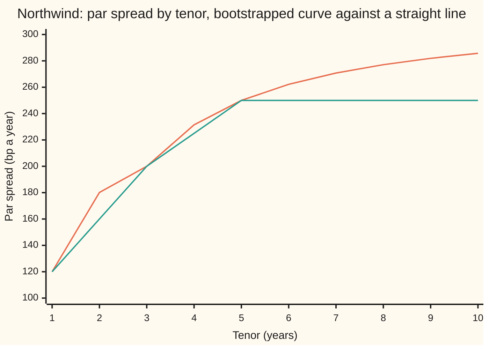
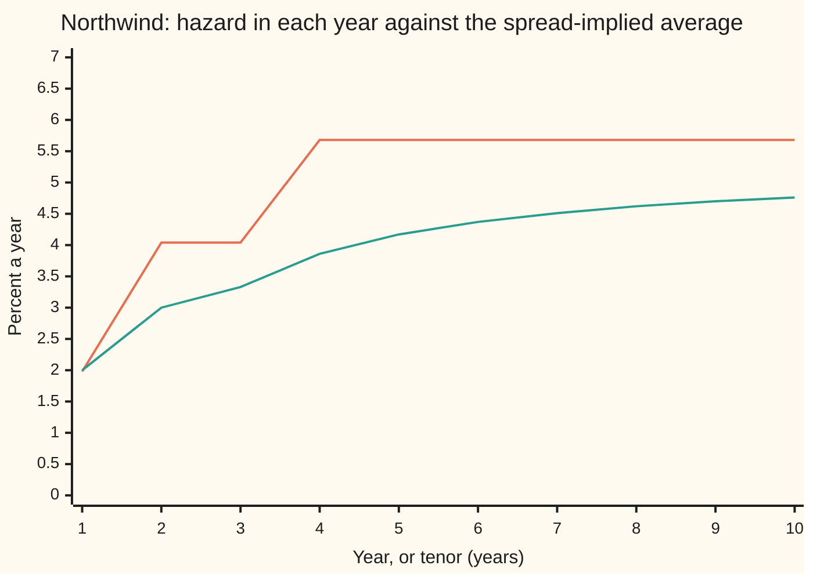

# Bootstrapping a hazard curve: one tenor at a time, each quote fixing one flat piece

[Syllabus](../../../SYLLABUS.md) → [Financial mathematics](../README.md) → [Credit Default Swaps - Pricing, the Par Spread and the Hazard Behind It](../README.md#s42) → Bootstrapping a hazard curve

---

## General Overview

Northwind Lines, the shipping company this shelf follows, has three default-insurance prices on the screen. One year of protection costs 120 basis points a year (a basis point, bp, is a hundredth of a percent, so 120 bp is 1.20%). Three years cost 200 bp a year. Five years cost 250 bp a year. The contract behind each price is a credit default swap: the buyer pays that yearly premium, in quarterly instalments, for as long as Northwind survives, and the seller pays the 60% of face value lost if Northwind defaults first, 40% being assumed recovered ([The credit default swap](01-credit-default-swap-contract.md)). The length of a contract is its **tenor**.

A client asks for two years of protection, which nobody quotes. A straight line between 120 and 200 says 160 bp. That is wrong by 20 bp.

The three prices are averages. Each one prices the whole stretch from today to its end date. What a pricing model needs is the default rate in each stretch on its own: the **hazard rate**, the chance of defaulting in the next instant among companies still alive, per year ([The hazard rate](../41-Default%2C%20Survival%20and%20the%20Hazard%20Rate/02-hazard-rate-and-survival-probability.md)). The method takes the quotes in order of length. The one-year quote fixes a flat hazard for year one. Holding that fixed, the three-year quote fixes a flat hazard for years one to three. Holding both, the five-year quote fixes years three to five. Each step solves one equation in one unknown. The name is **bootstrapping**, as for the discount curve ([Bootstrapping](../02-Curves/04-bootstrapping-the-discount-curve.md)).

For Northwind the three pieces come out at 1.98%, 4.04% and 5.68% a year. The chance Northwind is still alive is 0.9804 at one year, 0.9042 at three and 0.8070 at five. The unquoted two-year contract then prices at 180.12 bp, and ten years, with the last hazard carried on, at 285.73 bp.

**Bootstrapping turns quoted default-swap prices into a step-shaped hazard curve by solving each quote, shortest first, for the one flat hazard piece it adds, with every earlier piece held fixed; the curve reprices every quote exactly and prices any tenor nobody quotes.**

**What kind of fact this is:** a method. That each step has exactly one answer, and that the finished curve reprices every quote, are theorems proved on this card in Why it works. Flat pieces between quoted tenors are a modelling choice, not a fact about Northwind.

### The picture: the fitted price curve against the straight line



Orange: the par spread (the premium that makes a new contract worth nothing to either side) at each tenor, priced off the bootstrapped curve. Green: straight lines between the three quotes, held flat after five years. Both pass through 120, 200 and 250. Between the quotes they part most at two years, 180.12 against 160.00. Beyond five years the gap widens, to 285.73 against 250.00 at ten.

---

## The formula

Notation first, in words. The quoted tenors are $T_1 = 1$, $T_2 = 3$, $T_3 = 5$ years, with $T_0 = 0$ for today. The quote for tenor $T_i$ is $s_i$, written as a decimal: 120 bp is 0.0120. The hazard on the stretch from $T_{i-1}$ to $T_i$ is the flat number $\lambda_i$ (Greek "lambda"). The survival curve $S(t)$ is the chance Northwind has not defaulted by time $t$. Discounting uses $D(t) = e^{-rt}$, today's value of one dollar paid at $t$, with the riskless rate $r = 5\%$ ([Compound interest](../../01-Foundations/04-Compound%20Growth%20and%20Discounting/03-compound-interest.md)). Premiums fall on the quarter-dates $t_j = 0.25, 0.50, \ldots$ years.

A step-shaped hazard makes survival a product of flat decays ([The piecewise-flat hazard curve](../41-Default%2C%20Survival%20and%20the%20Hazard%20Rate/03-piecewise-flat-hazard-curve.md)):

$$S(1) = e^{-\lambda_1}, \qquad S(3) = e^{-\lambda_1 - 2\lambda_2}, \qquad S(5) = e^{-\lambda_1 - 2\lambda_2 - 2\lambda_3}.$$

A contract of tenor $T$ has two legs ([Pricing a CDS](02-cds-legs-risky-annuity-and-par-spread.md)). The premium leg is the spread times the **risky annuity** $A(T)$, the value of one dollar a year paid quarterly while Northwind survives. The protection leg $P(T)$ is the value of the payout:

$$A(T) = \sum_{t_j \le T} 0.25\, D(t_j)\, S(t_j), \qquad P(T) = L \int_0^T D(t)\,\lambda(t)\,S(t)\,dt.$$

Here $L = 1 - R$ is the loss on default, with recovery $R = 40\%$, and $\lambda(t)$ is whichever piece is in force at time $t$. A quote is fair when the legs match: $s_i\,A(T_i) = P(T_i)$.

The bootstrap is that match, written for one new piece. Freeze the pieces before $T_{i-1}$. Let $W_i = D(T_{i-1})\,S(T_{i-1})$ be the discounted survival at the start of the new piece, and $d_i = T_i - T_{i-1}$ its length. Then $\lambda_i$ is the one number that solves

$$P(T_{i-1}) + L\,W_i\,\frac{\lambda_i}{r+\lambda_i}\Big(1 - e^{-(r+\lambda_i)\,d_i}\Big) \;=\; s_i\Big(A(T_{i-1}) + W_i \sum_{T_{i-1} < t_j \le T_i} 0.25\, e^{-(r+\lambda_i)(t_j - T_{i-1})}\Big).$$

**Read it aloud:** the protection already earned before the new piece, plus the protection the new piece adds, must equal the quoted premium times all the premium-years up to the new tenor; only the new piece's hazard is free to move.

| Symbol | Plain meaning | In our example | Push it up and the answer… |
| --- | --- | --- | --- |
| $s_i$, $i$ | quoted par spread ($i$ counts the tenors) for tenor $T_i$, a decimal a year | 0.0120, 0.0200, 0.0250 | that tenor's piece rises; earlier pieces do not move |
| $T_i$, $T$, $T_0$, $T_1$, $T_2$ | quoted tenors in years; $T$ any tenor; $T_0 = 0$ is today | 1, 3, 5 | — |
| $\lambda_i$, $\lambda_1$, $\lambda_2$, $\lambda_3$ | flat hazard on the stretch from $T_{i-1}$ to $T_i$, a year | 0.019826, 0.040440, 0.056837 | survival falls faster on that stretch |
| $S(t)$, $t$ | chance of no default by time $t$ (years from today) | 0.980369, 0.904198, 0.807041 at 1, 3, 5 | — |
| $D(t)$, $r$ | discount factor $e^{-rt}$; riskless rate | $r$ = 0.05 | the pieces barely move; the legs both shrink |
| $R$, $L$ | recovery fraction; loss $L = 1 - R$ | 0.40 and 0.60 | higher $L$ means lower pieces for the same quotes |
| $t_j$ | quarterly premium dates | 0.25, 0.50, …, 5.00 | — |
| $A(T)$ | risky annuity: premium-years while alive, discounted | 0.957480, 2.644421, 4.027235 | — |
| $P(T)$ | protection leg: discounted expected payout per dollar | 0.011490, 0.052888, 0.100681 | — |
| $W_i$, $d_i$, $W_2$, $d_2$ | discounted survival at the start of the new piece; its length | $W_2$ = 0.932556, $d_2$ = 2 | — |
| $F$, $g$, $a$, $E$, $\tau_h$, $h$ | helpers in the Detailed proof: the leg mismatch, the new piece's protection per dollar of weight, its premium-years per dollar of weight, an exponential draw, a default time at flat hazard $h$ | — | — |
| $s_{\min}$ | the floor: the lowest quote the new piece can match, reached at zero hazard | 215.24 bp after a 600 bp one-year quote | a quote below it has no curve |

Inside one flat piece, discounting and survival decay at constant rates, so their product decays at the single rate $r + \lambda_i$; that gives the protection term its closed form.

### When it holds

- **A known discount curve, unrelated to default.** The method takes $D(t)$ as given. If rates and default move together, the legs need a joint model and flat pieces fitted this way are biased.
- **A known recovery.** Every piece scales roughly with $1/L$; a different recovery moves the whole curve ([Recovery assumptions](05-recovery-assumptions-and-what-they-change.md)).
- **Quotes on one set of terms.** All three must be par spreads for contracts with the same premium dates, credit events and settlement. A quote on other terms has to be converted first, or the pieces absorb the difference.
- **Flat pieces are a choice.** The quotes fix only the average hazard over each stretch, weighted by the legs. Beyond the last tenor they fix nothing: carrying 5.68% on gives 285.73 bp at ten years, zero hazard gives 148.27 bp.
- **Each quote between its floor and ceiling.** Otherwise no nonnegative hazard matches it (Step 2).

**Conventions verified 2026-09-28:** standard contracts trade with a fixed running coupon plus an upfront payment, and the ISDA CDS Standard Model (cdsmodel.com) converts between upfront and spread quotes. This card works with par spreads, quarterly premiums paid at the end of each quarter survived, and no premium accrued between the last payment and default. Real contracts pay that accrual; it shifts the pieces slightly, not the method.

---

## Why it works

### Step 0: a contract only reads the hazard up to its own end date

A one-year contract stops at year one. What Northwind's hazard does in year two cannot touch its legs. So the one-year quote involves $\lambda_1$ alone. The three-year quote involves $\lambda_1$ and $\lambda_2$. The five-year quote involves all three.

Each equation adds one unknown to the one before. That shape is called **triangular**, and it is solved from the top: the first equation gives $\lambda_1$, which turns the second into an equation in $\lambda_2$ alone, and so on.

### Step 1: split each leg at the knots, and the old pieces become fixed numbers

The dates where the hazard changes, $T_1$ and $T_2$, are the **knots**. Cut both legs of the three-year contract at the one-year knot. The part before one year uses only $\lambda_1$, now known: it is $A(1)$ and $P(1)$, two numbers.

The part after the knot uses $\lambda_2$. On that stretch, write time as $T_1 + u$. Survival keeps decaying from where it was: $S(T_1 + u) = S(T_1)\,e^{-\lambda_2 u}$. Discounting too: $D(T_1 + u) = D(T_1)\,e^{-ru}$. Their product is $W_2\,e^{-(r+\lambda_2)u}$.

Premium dates in the stretch each contribute $0.25 \times W_2\,e^{-(r+\lambda_2)u}$. The protection leg integrates $L\,\lambda_2$ times the same product:

$$L\,\lambda_2\,W_2 \int_0^{2} e^{-(r+\lambda_2)u}\,du = L\,W_2\,\frac{\lambda_2}{r+\lambda_2}\Big(1 - e^{-(r+\lambda_2)\cdot 2}\Big).$$

That is the equation in The formula, for $i = 2$. The five-year step is identical, with $W_3 = D(3)\,S(3)$ and the frozen totals $A(3)$ and $P(3)$.

### Step 2: each step has exactly one answer, when the quote is in range

Hold everything but $\lambda_i$ fixed. Raise $\lambda_i$ and two things happen. The protection the new piece adds rises: default comes sooner, so the payout arrives earlier and more often inside the window. The premium-years it adds fall: survival drops, so fewer premiums are paid. The contract's fair spread, protection divided by annuity, therefore rises steadily with $\lambda_i$. A steadily rising quantity crosses any level at most once.

It crosses at all only between two limits. At $\lambda_i = 0$ the new piece adds premium-years and no protection, giving the lowest spread reachable, the floor:

$$s_{\min} = \frac{P(T_{i-1})}{A(T_{i-1}) + W_i \sum_{T_{i-1} < t_j \le T_i} 0.25\, e^{-r(t_j - T_{i-1})}}.$$

As $\lambda_i$ grows without bound, Northwind defaults at the very start of the stretch for certain. The new premium-years vanish and the new protection approaches $L\,W_i$, so the spread approaches the ceiling $(P(T_{i-1}) + L\,W_i)/A(T_{i-1})$ without reaching it. For the first piece there are no earlier premium-years, the floor is zero and there is no ceiling.

So: a quote strictly between floor and ceiling has exactly one nonnegative piece. A quote at the floor has the piece zero. A quote below the floor, or at or above the ceiling, has none. Existence of the crossing is the intermediate value theorem ([Intermediate value theorem](../../06-Calculus%20and%20analysis/01-Limits%20and%20Continuity/06-intermediate-value-theorem.md)); bisection (halving a bracket that contains the root) finds it.

<details>
<summary>Detailed proof: the fair spread rises strictly with the new piece</summary>

Fix the frozen totals $A(T_{i-1}) \ge 0$ and $P(T_{i-1}) \ge 0$, $W_i > 0$, $d_i > 0$, $r \ge 0$, $L > 0$ and a quote $s_i > 0$. Define $F(h) = P(T_{i-1}) + L\,W_i\,g(h) - s_i\,[A(T_{i-1}) + W_i\,a(h)]$ for $h \ge 0$, where $a(h) = \sum 0.25\, e^{-(r+h)(t_j - T_{i-1})}$ over the stretch's premium dates and $g(h) = h\int_0^{d_i} e^{-(r+h)u}\,du$.

Each term of $a(h)$ falls strictly as $h$ rises, so $-s_i\,a(h)$ rises strictly. For $g$: let $E$ be a random draw from the exponential distribution with mean one, and set $\tau_h = E/h$, a default time with flat hazard $h$. Then $g(h)$ equals the expected value of $e^{-r\tau_h}$ counted only when $\tau_h \le d_i$. Raising $h$ moves every $\tau_h$ earlier; $e^{-ru}$ counted on $u \le d_i$ does not fall as $u$ moves earlier; so $g$ does not fall. Hence $F$ is continuous and strictly increasing.

At the ends: $F(0) = P(T_{i-1}) - s_i[A(T_{i-1}) + W_i\,a(0)]$, which is negative exactly when $s_i > s_{\min}$. As $h$ grows, $a(h) \to 0$ and $g(h) \to 1$, so $F \to P(T_{i-1}) + L\,W_i - s_i\,A(T_{i-1})$, positive exactly when $s_i$ is below the ceiling. A continuous strictly increasing function that starts negative and ends positive crosses zero exactly once. If $F(0) = 0$ the root is $h = 0$. If $F(0) > 0$, or the limit is not positive, $F$ has no zero on $h \ge 0$. The fair spread $P/A$ has the same sign pattern as $F$ divided by the positive annuity, so it rises through $s_i$ at the same point.

</details>

### Step 3: freezing is why every quote still reprices

When $\lambda_3$ is chosen, the one-year and three-year contracts do not read it (Step 0). Their legs are the same numbers they were when their own pieces were solved, so they still match. By induction, after the last step all three quotes match at once. That check is the **round trip**: rebuild the survival curve from the pieces, price each quoted tenor from scratch, and get the quotes back. The code does it with a different integrator from the one that fitted the pieces, and gets 120, 200 and 250 bp to six decimals.

### Step 4: rebuild survival, then price what nobody quotes

The pieces give $S(t)$ at every date: $S(2) = e^{-\lambda_1 - \lambda_2} = 0.941514$. A two-year contract uses piece one for its first year and piece two for its second. Its fair spread is $P(2)/A(2)$, which comes to 180.12 bp.

It is above the 160 bp straight line because year two runs at the second piece, 4.04%. That high piece is exactly what the three-year quote needed to lift its average from 120 to 200 bp. The straight line averages the averages; the curve prices year two at year two's own hazard. The second picture shows the gap between the hazard in each year and the average the spreads imply.



Orange: the bootstrapped hazard in force during each year, a staircase. Green: the par spread at that tenor divided by the loss 0.60, the credit triangle's reading of an average hazard ([The credit triangle](03-the-credit-triangle.md)). The average climbs gently because it drags the cheap early years along; the staircase shows the rate each year actually carries.

Ten years runs past the last quote, so a tail must be assumed. This card carries 5.68% on, giving 285.73 bp; any other tail leaves the three quotes untouched and changes the ten-year price.

A second route solves all three equations at once by Newton's method (repeatedly replacing the equations by their straight-line approximations and solving those), starting from the triangle guesses $s_i/L$. It lands on the same three pieces. Its table of sensitivities (the Jacobian: how much each quote's fair spread moves per unit of each piece) comes out with zeros above the diagonal: quote $i$ has no sensitivity to later pieces. That is Step 0, measured.

---

## Worked numbers, by hand

| Step | Arithmetic | Value |
| --- | --- | --- |
| first guess | 120 bp ÷ 0.60 | 0.020000 |
| piece 1 | solve $s_1 A(1) = P(1)$ by bisection | $\lambda_1$ = 0.019826 |
| legs to 1 year | $A(1)$ = 0.957480; 0.0120 × 0.957480 | $P(1)$ = 0.011490 |
| survival at 1 | $e^{-0.019826}$ | 0.980369 |
| weight for piece 2 | $e^{-0.05}$ × 0.980369 | $W_2$ = 0.932556 |
| piece 2 | freeze $A(1)$, $P(1)$; solve the formula for $i = 2$ | $\lambda_2$ = 0.040440 |
| check 3 years | 0.0200 × $A(3)$ = 0.0200 × 2.644421 | 0.052888 = $P(3)$ |
| survival at 3 | $e^{-0.019826 - 2 \times 0.040440}$ | 0.904198 |
| piece 3 | freeze $A(3)$, $P(3)$; solve for $i = 3$ | $\lambda_3$ = 0.056837 |
| check 5 years | 0.0250 × 4.027235 | 0.100681 = $P(5)$ |
| survival at 5 | $e^{-0.019826 - 2 \times 0.040440 - 2 \times 0.056837}$ | 0.807041 |
| 2 years, unquoted | $P(2)/A(2)$ | **180.12 bp** |
| 10 years, tail at $\lambda_3$ | $P(10)/A(10)$ | **285.73 bp** |

The first piece sits just under the triangle's 2%: premiums arrive at quarter-ends, a little later than the protection they pay for, so the fair spread runs slightly above $L\lambda$ and the fitted hazard slightly below $s/L$. The same legs price a flat 2% hazard at 121.06 bp over five years, the shelf's Northwind contract ([Pricing a CDS](02-cds-legs-risky-annuity-and-par-spread.md)).

In the world: two years of Northwind protection is worth about 180 bp a year; selling it at 160 gives value away on every dollar covered.

### What breaks if you drop a piece

| Mistake | Comes out at | What went wrong |
| --- | --- | --- |
| straight line between quotes for 2 years | 160.00 bp, not 180.12 | spreads are averages; averaging them again ignores that year two carries the higher piece |
| triangle $s_i/L$ used as the pieces (2.00%, 3.33%, 4.17%) | 3 years reprices at 172.90 bp, 5 years at 200.83 | each $s_i/L$ is an average over the whole tenor, not the rate on its own stretch |
| each tenor's own flat hazard as its piece (1.98%, 3.30%, 4.12%) | 3 years at 171.18 bp, 5 years at 198.72 | the same error by a better road: a flat fit to the whole tenor is still an average |
| no defaults after 5 years | 10 years at 148.27 bp, not 285.73 | the quotes say nothing past 5 years; the tail is an assumption that must be stated |

### An inverted pair that no curve fits

Suppose a troubled name quotes one year at 600 bp and three years at 200 bp. Short protection costing more than long protection is an **inverted** curve, common when default is feared soon. The first piece comes out at 9.82% (0.098159). Holding it, the floor for the three-year quote, with zero hazard in years one to three, is 215.24 bp. The quote of 200 bp is below it.

Forced through anyway, by letting the piece go negative, the three-year quote needs a hazard of −0.38% a year (−0.003782). Survival would then rise, from 0.906504 at year one to 0.913387 at year three: the name would come back from the dead.

At 200 bp, three years of premiums are worth less than the protection already priced into year one, even if the name could not default after year one. No nonnegative hazard produces that. Within this model it is an arbitrage signal (a price pair that hands one side value for nothing); in the market it is as often a stale quote or a mismatch of contract terms. Either way it is flagged, not fitted. Inversion alone is not the problem: one year at 600 bp and three years at 300 bp fit, with a second piece of 2.12% (0.021178). The floor decides, not the slope.

---

## Code, from first principles, and it actually runs

Both programs fit the Northwind curve by three independent roads. Road 1 bootstraps one piece at a time, bisecting on the closed-form legs. Road 2 prices the protection leg by Simpson's rule (an integrator that fits parabolas through the integrand) and solves all three quotes at once by Newton's method from the triangle guesses; it must land on road 1's pieces, and it reprices the quotes as the round trip. Road 3 draws a million default dates from road 1's curve with a hand-written random number generator and averages the legs; its two-year spread must fall within four standard errors of the formula's. Then the chart points, the what-breaks numbers and the failure case.

### Python

```python
# Bootstrapping a CDS hazard curve: Northwind quotes 120, 200, 250 bp at 1, 3, 5 years.
# Quarterly premiums paid while alive, protection paid at the default date. Standard library only.
from math import exp, log

RATE, LOSS = 0.05, 0.60                 # riskless rate; loss on default = 1 - recovery 40%
KNOTS = [0.0, 1.0, 3.0, 5.0]
QUOTES = [0.0120, 0.0200, 0.0250]

def surv(t, lam):                       # S(t) = exp(-area under the step hazard); last piece runs on
    area = 0.0
    for i, h in enumerate(lam):
        right = KNOTS[i + 1] if i + 1 < len(lam) else float("inf")
        area += h * max(0.0, min(t, right) - KNOTS[i])
    return exp(-area)

def annuity(T, lam):                    # risky annuity: 0.25 years of premium per quarter survived, discounted
    return sum(0.25 * exp(-RATE * j / 4) * surv(j / 4, lam) for j in range(1, round(4 * T) + 1))

def pieces(T, lam):                     # (left, right, hazard) for each flat piece inside [0, T]
    edges = [0.0] + [k for k in KNOTS[1:len(lam)] if k < T] + [T]
    return [(edges[i], edges[i + 1], lam[i]) for i in range(len(edges) - 1)]

def prot_closed(T, lam):                # road 1: protection leg, exact integral on each flat piece
    total = 0.0
    for a, b, h in pieces(T, lam):
        k = RATE + h
        total += LOSS * exp(-RATE * a) * surv(a, lam) * h / k * (1 - exp(-k * (b - a)))
    return total

def prot_simpson(T, lam, n=64):         # road 2: the same integral, L * D(t) * hazard * S(t), by Simpson's rule
    total = 0.0
    for a, b, h in pieces(T, lam):
        g = lambda t: LOSS * exp(-RATE * t) * h * surv(t, lam)
        w = (b - a) / n
        total += w / 3 * sum((1 if j in (0, n) else 4 if j % 2 else 2) * g(a + j * w) for j in range(n + 1))
    return total

par, par2 = (lambda T, lam: prot_closed(T, lam) / annuity(T, lam)), (lambda T, lam: prot_simpson(T, lam) / annuity(T, lam))

def bisect(f, lo, hi):                  # own root finder; f rises from negative at lo to positive at hi
    for _ in range(100):
        mid = 0.5 * (lo + hi)
        lo, hi = (mid, hi) if f(mid) < 0 else (lo, mid)
    return 0.5 * (lo + hi)

def bootstrap(quotes, low=0.0):         # one piece at a time, earlier pieces frozen
    lam = []
    for i, s in enumerate(quotes):
        lam.append(bisect(lambda h: par(KNOTS[i + 1], lam + [h]) - s, low, 1.0))
    return lam

f6, bp = (lambda x: f"{x:.6f}"), (lambda x: f"{10000 * x:.2f}")
lam = bootstrap(QUOTES)
print("Northwind: r 0.05, recovery 0.40, quarterly premiums, quotes 120/200/250 bp")
print("road 1: one piece at a time, bisection on closed-form legs")
for i in range(3):
    print(f"  piece {KNOTS[i]:.0f}-{KNOTS[i + 1]:.0f}y  hazard {f6(lam[i])}  S({KNOTS[i + 1]:.0f}) {f6(surv(KNOTS[i + 1], lam))}")
for T in (1.0, 3.0, 5.0):
    print(f"  legs to {T:.0f}y  annuity {f6(annuity(T, lam))}  protection {f6(prot_closed(T, lam))}")
print(f"  frozen weight D(1)S(1) {f6(exp(-RATE) * surv(1.0, lam))}  triangle guess 1y {f6(QUOTES[0] / LOSS)}  flat 2% 5y par {bp(par(5.0, [0.02]))} bp")
print("round trip: reprice every quote with the Simpson protection leg")
trip = [par2(KNOTS[i + 1], lam) for i in range(3)]
for i in range(3):
    print(f"  {KNOTS[i + 1]:.0f}y quote {bp(QUOTES[i])} bp  repriced {10000 * trip[i]:.6f} bp")

x = [s / LOSS for s in QUOTES]          # road 2: all three equations at once, Newton from the triangle guesses
for _ in range(8):
    G = [par2(KNOTS[i + 1], x) - QUOTES[i] for i in range(3)]
    J = [[(par2(KNOTS[i + 1], [x[m] + (1e-6 if m == j else 0.0) for m in range(3)]) - QUOTES[i] - G[i]) / 1e-6
          for j in range(3)] for i in range(3)]
    upper = [J[0][1], J[0][2], J[1][2]]
    A = [J[i][:] + [-G[i]] for i in range(3)]
    for c in range(3):                  # Gaussian elimination, written out
        for r in range(c + 1, 3):
            m = A[r][c] / A[c][c]
            A[r] = [A[r][k] - m * A[c][k] for k in range(4)]
    dx = [0.0, 0.0, 0.0]
    for r in (2, 1, 0):
        dx[r] = (A[r][3] - sum(A[r][k] * dx[k] for k in range(r + 1, 3))) / A[r][r]
    x = [x[i] + dx[i] for i in range(3)]
print("road 2: all three at once, Newton on Simpson legs, from triangle guesses")
print(f"  hazards {f6(x[0])} {f6(x[1])} {f6(x[2])}  Jacobian above diagonal {' '.join(f6(u) for u in upper)}")

state = 42                              # road 3: simulate default dates on the fitted curve, own generator
N, cum = 1000000, [0.0]
for j in range(1, 41): cum.append(cum[-1] + 0.25 * exp(-RATE * j / 4))
pr2 = pp2 = pr5 = pp5 = alive5 = 0.0
for _ in range(N):
    state = (state * 6364136223846793005 + 1442695040888963407) % 2 ** 64
    e, tau = -log(((state >> 11) + 0.5) / 2 ** 53), None   # default when the hazard area reaches this draw
    for i, h in enumerate(lam):
        width = KNOTS[i + 1] - KNOTS[i] if i < 2 else float("inf")
        if e <= h * width: tau = KNOTS[i] + e / h; break
        e -= h * width
    q = min(int(4 * tau), 40)
    pr2 += cum[min(q, 8)]; pr5 += cum[min(q, 20)]
    pp2 += LOSS * exp(-RATE * tau) if tau <= 2 else 0.0
    pp5 += LOSS * exp(-RATE * tau) if tau <= 5 else 0.0
    alive5 += 1.0 if tau > 5 else 0.0
mc2, mc5, mcS5 = pp2 / pr2, pp5 / pr5, alive5 / N
print(f"road 3: Monte Carlo, {N} default dates on the road-1 curve")
se2 = 10000 * par(2.0, lam) * ((surv(2.0, lam) / (1 - surv(2.0, lam))) / N) ** 0.5
print(f"  2y par {bp(mc2)} bp (standard error {se2:.2f})  5y par {bp(mc5)} bp  S(5) {mcS5:.4f}")

print("unquoted tenors, hazard held at the last piece after 5y")
print(f"  2y par {bp(par(2.0, lam))} bp  straight line between quotes {bp(0.5 * (QUOTES[0] + QUOTES[1]))} bp  S(2) {f6(surv(2.0, lam))}")
print(f"  10y par {bp(par(10.0, lam))} bp  S(10) {f6(surv(10.0, lam))}")
yrs = range(1, 11)
line = lambda T: QUOTES[0] + (QUOTES[1] - QUOTES[0]) * (T - 1) / 2 if T <= 3 else min(QUOTES[1] + (QUOTES[2] - QUOTES[1]) * (T - 3) / 2, QUOTES[2])
print("chart, tenor (years)      " + " ".join(f"{T:6d}" for T in yrs))
print("chart, fitted par (bp)    " + " ".join(f"{10000 * par(float(T), lam):6.2f}" for T in yrs))
print("chart, straight line (bp) " + " ".join(f"{10000 * line(T):6.2f}" for T in yrs))
print("chart, hazard in year (%) " + " ".join(f"{100 * lam[0 if T <= 1 else 1 if T <= 3 else 2]:6.2f}" for T in yrs))
print("chart, par / loss (%)     " + " ".join(f"{100 * par(float(T), lam) / LOSS:6.2f}" for T in yrs))

tri = [s / LOSS for s in QUOTES]        # what breaks: the triangle, or each tenor's flat hazard, as the pieces
flat = [bisect(lambda h: par(KNOTS[i + 1], [h]) - QUOTES[i], 0.0, 1.0) for i in range(3)]
print("what breaks")
print(f"  triangle s/L as the pieces: 3y reprices {bp(par(3.0, tri))} bp, 5y {bp(par(5.0, tri))} bp")
print(f"  each tenor's flat hazard as its piece {f6(flat[1])} {f6(flat[2])}: 3y {bp(par(3.0, flat))} bp, 5y {bp(par(5.0, flat))} bp")
print(f"  no defaults after 5y: 10y par {bp(par(10.0, lam + [0.0]))} bp")

bad = [0.0600, 0.0200]                  # the failure case: an inverted pair
b1, neg, ok = bootstrap(bad[:1]), bootstrap(bad, low=-0.04), bootstrap([0.0600, 0.0300])
floor = par(3.0, b1 + [0.0])
print("failure case: 1y 600 bp, then 3y 200 bp")
print(f"  1y piece {f6(b1[0])}  3y floor at zero hazard {bp(floor)} bp")
print(f"  3y piece needed {f6(neg[1])}  S(1) {f6(surv(1.0, neg))}  S(3) {f6(surv(3.0, neg))}")
print(f"  1y 600 then 3y 300 bp fits: piece {f6(ok[1])}")

assert max(abs(x[i] - lam[i]) for i in range(3)) < 1e-9, "Newton on Simpson legs must find the bisection pieces"
assert max(abs(trip[i] - QUOTES[i]) for i in range(3)) < 1e-10, "round trip through the other integrator"
assert upper == [0.0, 0.0, 0.0], "a quote must not depend on later pieces"
assert abs(10000 * (mc2 - par(2.0, lam))) < 4 * se2, "simulation agrees with the formula at 2y"
assert abs(mcS5 - surv(5.0, lam)) < 4 * (surv(5.0, lam) * (1 - surv(5.0, lam)) / N) ** 0.5, "simulated survival"
assert floor > bad[1] and neg[1] < 0 < ok[1], "200 bp sits below the floor; 300 bp does not"
assert abs(10000 * par(5.0, [0.02]) - 121.06) < 0.005, "shelf's flat-hazard Northwind CDS"
assert abs(10000 * par(2.0, lam) - 180.1) < 0.05, "card's 2y number"
assert abs(10000 * par(10.0, lam) - 285.7) < 0.05, "card's 10y number"
print("ALL CHECKS PASS")
```

**Ran 2026-09-28 on macOS, Python 3.14.6, standard library only. All checks passed. Output, pasted from the run:**

```
Northwind: r 0.05, recovery 0.40, quarterly premiums, quotes 120/200/250 bp
road 1: one piece at a time, bisection on closed-form legs
  piece 0-1y  hazard 0.019826  S(1) 0.980369
  piece 1-3y  hazard 0.040440  S(3) 0.904198
  piece 3-5y  hazard 0.056837  S(5) 0.807041
  legs to 1y  annuity 0.957480  protection 0.011490
  legs to 3y  annuity 2.644421  protection 0.052888
  legs to 5y  annuity 4.027235  protection 0.100681
  frozen weight D(1)S(1) 0.932556  triangle guess 1y 0.020000  flat 2% 5y par 121.06 bp
round trip: reprice every quote with the Simpson protection leg
  1y quote 120.00 bp  repriced 120.000000 bp
  3y quote 200.00 bp  repriced 200.000000 bp
  5y quote 250.00 bp  repriced 250.000000 bp
road 2: all three at once, Newton on Simpson legs, from triangle guesses
  hazards 0.019826 0.040440 0.056837  Jacobian above diagonal 0.000000 0.000000 0.000000
road 3: Monte Carlo, 1000000 default dates on the road-1 curve
  2y par 180.43 bp (standard error 0.72)  5y par 250.41 bp  S(5) 0.8068
unquoted tenors, hazard held at the last piece after 5y
  2y par 180.12 bp  straight line between quotes 160.00 bp  S(2) 0.941514
  10y par 285.73 bp  S(10) 0.607401
chart, tenor (years)           1      2      3      4      5      6      7      8      9     10
chart, fitted par (bp)    120.00 180.12 200.00 231.44 250.00 262.19 270.76 277.09 281.93 285.73
chart, straight line (bp) 120.00 160.00 200.00 225.00 250.00 250.00 250.00 250.00 250.00 250.00
chart, hazard in year (%)   1.98   4.04   4.04   5.68   5.68   5.68   5.68   5.68   5.68   5.68
chart, par / loss (%)       2.00   3.00   3.33   3.86   4.17   4.37   4.51   4.62   4.70   4.76
what breaks
  triangle s/L as the pieces: 3y reprices 172.90 bp, 5y 200.83 bp
  each tenor's flat hazard as its piece 0.032989 0.041194: 3y 171.18 bp, 5y 198.72 bp
  no defaults after 5y: 10y par 148.27 bp
failure case: 1y 600 bp, then 3y 200 bp
  1y piece 0.098159  3y floor at zero hazard 215.24 bp
  3y piece needed -0.003782  S(1) 0.906504  S(3) 0.913387
  1y 600 then 3y 300 bp fits: piece 0.021178
ALL CHECKS PASS
```

### Rust

```rust
// Bootstrapping a CDS hazard curve: Northwind quotes 120, 200, 250 bp at 1, 3, 5 years.
// Quarterly premiums paid while alive, protection paid at the default date. Rust std only.
const RATE: f64 = 0.05; // riskless rate
const LOSS: f64 = 0.60; // loss on default = 1 - recovery 40%
const KNOTS: [f64; 4] = [0.0, 1.0, 3.0, 5.0];
const QUOTES: [f64; 3] = [0.0120, 0.0200, 0.0250];

fn surv(t: f64, lam: &[f64]) -> f64 { // S(t) = exp(-area under the step hazard); last piece runs on
    let mut area = 0.0;
    for (i, h) in lam.iter().enumerate() {
        let right = if i + 1 < lam.len() { KNOTS[i + 1] } else { f64::INFINITY };
        area += h * (t.min(right) - KNOTS[i]).max(0.0);
    }
    (-area).exp()
}

fn annuity(t: f64, lam: &[f64]) -> f64 { // risky annuity: 0.25 years of premium per quarter survived, discounted
    (1..=(4.0 * t).round() as usize).map(|j| 0.25 * (-RATE * j as f64 / 4.0).exp() * surv(j as f64 / 4.0, lam)).sum()
}

fn pieces(t: f64, lam: &[f64]) -> Vec<(f64, f64, f64)> { // (left, right, hazard) for each flat piece in [0, T]
    let mut edges: Vec<f64> = [0.0].iter().chain(KNOTS[1..lam.len()].iter().filter(|k| **k < t)).cloned().collect();
    edges.push(t);
    (0..edges.len() - 1).map(|i| (edges[i], edges[i + 1], lam[i])).collect()
}

fn prot_closed(t: f64, lam: &[f64]) -> f64 { // road 1: protection leg, exact integral on each flat piece
    pieces(t, lam).iter().map(|&(a, b, h)| { let k = RATE + h;
        LOSS * (-RATE * a).exp() * surv(a, lam) * h / k * (1.0 - (-k * (b - a)).exp()) }).sum()
}

fn prot_simpson(t: f64, lam: &[f64]) -> f64 { // road 2: the same integral, L * D(t) * hazard * S(t), by Simpson's rule
    let (n, mut total) = (64, 0.0);
    for (a, b, h) in pieces(t, lam) {
        let (w, mut s) = ((b - a) / n as f64, 0.0);
        for j in 0..=n {
            let (c, u) = (if j == 0 || j == n { 1.0 } else if j % 2 == 1 { 4.0 } else { 2.0 }, a + j as f64 * w);
            s += c * (LOSS * (-RATE * u).exp() * h * surv(u, lam));
        }
        total += w / 3.0 * s;
    }
    total
}

fn par(t: f64, lam: &[f64]) -> f64 { prot_closed(t, lam) / annuity(t, lam) }
fn par2(t: f64, lam: &[f64]) -> f64 { prot_simpson(t, lam) / annuity(t, lam) }

fn bisect<F: Fn(f64) -> f64>(f: F, mut lo: f64, mut hi: f64) -> f64 { // own root finder; f rises through zero
    for _ in 0..100 { let mid = 0.5 * (lo + hi); if f(mid) < 0.0 { lo = mid; } else { hi = mid; } }
    0.5 * (lo + hi)
}

fn bootstrap(quotes: &[f64], low: f64) -> Vec<f64> { // one piece at a time, earlier pieces frozen
    let mut lam: Vec<f64> = Vec::new();
    for (i, s) in quotes.iter().enumerate() {
        let h = bisect(|h| { let mut l = lam.clone(); l.push(h); par(KNOTS[i + 1], &l) - s }, low, 1.0);
        lam.push(h);
    }
    lam
}

fn f6(x: f64) -> String { format!("{:.6}", x) }
fn bp(x: f64) -> String { format!("{:.2}", 10000.0 * x) }
fn row(label: &str, v: Vec<String>) { println!("{}{}", label, v.join(" ")); }

fn main() {
    let lam = bootstrap(&QUOTES, 0.0);
    println!("Northwind: r 0.05, recovery 0.40, quarterly premiums, quotes 120/200/250 bp");
    println!("road 1: one piece at a time, bisection on closed-form legs");
    for i in 0..3 {
        println!("  piece {:.0}-{:.0}y  hazard {}  S({:.0}) {}", KNOTS[i], KNOTS[i + 1], f6(lam[i]), KNOTS[i + 1], f6(surv(KNOTS[i + 1], &lam)));
    }
    for t in [1.0, 3.0, 5.0] {
        println!("  legs to {:.0}y  annuity {}  protection {}", t, f6(annuity(t, &lam)), f6(prot_closed(t, &lam)));
    }
    println!("  frozen weight D(1)S(1) {}  triangle guess 1y {}  flat 2% 5y par {} bp", f6((-RATE).exp() * surv(1.0, &lam)), f6(QUOTES[0] / LOSS), bp(par(5.0, &[0.02])));
    println!("round trip: reprice every quote with the Simpson protection leg");
    let trip: Vec<f64> = (0..3).map(|i| par2(KNOTS[i + 1], &lam)).collect();
    for i in 0..3 {
        println!("  {:.0}y quote {} bp  repriced {:.6} bp", KNOTS[i + 1], bp(QUOTES[i]), 10000.0 * trip[i]);
    }

    // road 2: all three equations at once, Newton from the triangle guesses
    let mut x: Vec<f64> = QUOTES.iter().map(|s| s / LOSS).collect();
    let mut upper = [1.0; 3];
    for _ in 0..8 {
        let g: Vec<f64> = (0..3).map(|i| par2(KNOTS[i + 1], &x) - QUOTES[i]).collect();
        let mut a = [[0.0f64; 4]; 3];
        for i in 0..3 {
            for j in 0..3 { let mut xb = x.clone(); xb[j] += 1e-6; a[i][j] = (par2(KNOTS[i + 1], &xb) - QUOTES[i] - g[i]) / 1e-6; }
            a[i][3] = -g[i];
        }
        upper = [a[0][1], a[0][2], a[1][2]];
        for c in 0..3 { // Gaussian elimination, written out
            for r in c + 1..3 { let m = a[r][c] / a[c][c]; for k in 0..4 { a[r][k] -= m * a[c][k]; } }
        }
        let mut dx = [0.0; 3];
        for r in (0..3).rev() {
            dx[r] = (a[r][3] - (r + 1..3).map(|k| a[r][k] * dx[k]).sum::<f64>()) / a[r][r];
        }
        for i in 0..3 { x[i] += dx[i]; }
    }
    println!("road 2: all three at once, Newton on Simpson legs, from triangle guesses");
    println!("  hazards {} {} {}  Jacobian above diagonal {}", f6(x[0]), f6(x[1]), f6(x[2]), upper.iter().map(|u| f6(*u)).collect::<Vec<_>>().join(" "));

    // road 3: simulate default dates on the fitted curve, own generator
    let (mut state, n, mut cum): (u64, usize, Vec<f64>) = (42, 1_000_000, vec![0.0]);
    for j in 1..41 { let c = cum[j - 1] + 0.25 * (-RATE * j as f64 / 4.0).exp(); cum.push(c); }
    let (mut pr2, mut pp2, mut pr5, mut pp5, mut alive5) = (0.0, 0.0, 0.0, 0.0, 0.0);
    for _ in 0..n {
        state = state.wrapping_mul(6364136223846793005).wrapping_add(1442695040888963407);
        let (mut e, mut tau) = (-((((state >> 11) as f64) + 0.5) / 9007199254740992.0).ln(), 0.0);
        for (i, h) in lam.iter().enumerate() {
            let width = if i < 2 { KNOTS[i + 1] - KNOTS[i] } else { f64::INFINITY };
            if e <= h * width { tau = KNOTS[i] + e / h; break; }
            e -= h * width;
        }
        let q = ((4.0 * tau) as usize).min(40);
        pr2 += cum[q.min(8)]; pr5 += cum[q.min(20)];
        pp2 += if tau <= 2.0 { LOSS * (-RATE * tau).exp() } else { 0.0 };
        pp5 += if tau <= 5.0 { LOSS * (-RATE * tau).exp() } else { 0.0 };
        alive5 += if tau > 5.0 { 1.0 } else { 0.0 };
    }
    let (mc2, mc5, mcs5) = (pp2 / pr2, pp5 / pr5, alive5 / n as f64);
    println!("road 3: Monte Carlo, {} default dates on the road-1 curve", n);
    let (s2, s5) = (surv(2.0, &lam), surv(5.0, &lam));
    let se2 = 10000.0 * par(2.0, &lam) * ((s2 / (1.0 - s2)) / n as f64).sqrt();
    println!("  2y par {} bp (standard error {:.2})  5y par {} bp  S(5) {:.4}", bp(mc2), se2, bp(mc5), mcs5);

    println!("unquoted tenors, hazard held at the last piece after 5y");
    println!("  2y par {} bp  straight line between quotes {} bp  S(2) {}", bp(par(2.0, &lam)), bp(0.5 * (QUOTES[0] + QUOTES[1])), f6(s2));
    println!("  10y par {} bp  S(10) {}", bp(par(10.0, &lam)), f6(surv(10.0, &lam)));
    let yrs: Vec<usize> = (1..11).collect();
    let line = |t: f64| if t <= 3.0 { QUOTES[0] + (QUOTES[1] - QUOTES[0]) * (t - 1.0) / 2.0 } else { (QUOTES[1] + (QUOTES[2] - QUOTES[1]) * (t - 3.0) / 2.0).min(QUOTES[2]) };
    row("chart, tenor (years)      ", yrs.iter().map(|t| format!("{:6}", t)).collect());
    row("chart, fitted par (bp)    ", yrs.iter().map(|t| format!("{:6.2}", 10000.0 * par(*t as f64, &lam))).collect());
    row("chart, straight line (bp) ", yrs.iter().map(|t| format!("{:6.2}", 10000.0 * line(*t as f64))).collect());
    row("chart, hazard in year (%) ", yrs.iter().map(|t| format!("{:6.2}", 100.0 * lam[if *t <= 1 { 0 } else if *t <= 3 { 1 } else { 2 }])).collect());
    row("chart, par / loss (%)     ", yrs.iter().map(|t| format!("{:6.2}", 100.0 * par(*t as f64, &lam) / LOSS)).collect());

    // what breaks: the triangle, or each tenor's flat hazard, as the pieces
    let tri: Vec<f64> = QUOTES.iter().map(|s| s / LOSS).collect();
    let flat: Vec<f64> = (0..3).map(|i| bisect(|h| par(KNOTS[i + 1], &[h]) - QUOTES[i], 0.0, 1.0)).collect();
    let mut tail0 = lam.clone(); tail0.push(0.0);
    println!("what breaks");
    println!("  triangle s/L as the pieces: 3y reprices {} bp, 5y {} bp", bp(par(3.0, &tri)), bp(par(5.0, &tri)));
    println!("  each tenor's flat hazard as its piece {} {}: 3y {} bp, 5y {} bp", f6(flat[1]), f6(flat[2]), bp(par(3.0, &flat)), bp(par(5.0, &flat)));
    println!("  no defaults after 5y: 10y par {} bp", bp(par(10.0, &tail0)));

    // the failure case: an inverted pair
    let bad = [0.0600, 0.0200];
    let (b1, neg, ok) = (bootstrap(&bad[..1], 0.0), bootstrap(&bad, -0.04), bootstrap(&[0.0600, 0.0300], 0.0));
    let floor = par(3.0, &[b1[0], 0.0]);
    println!("failure case: 1y 600 bp, then 3y 200 bp");
    println!("  1y piece {}  3y floor at zero hazard {} bp", f6(b1[0]), bp(floor));
    println!("  3y piece needed {}  S(1) {}  S(3) {}", f6(neg[1]), f6(surv(1.0, &neg)), f6(surv(3.0, &neg)));
    println!("  1y 600 then 3y 300 bp fits: piece {}", f6(ok[1]));

    assert!((0..3).all(|i| (x[i] - lam[i]).abs() < 1e-9), "Newton on Simpson legs must find the bisection pieces");
    assert!((0..3).all(|i| (trip[i] - QUOTES[i]).abs() < 1e-10), "round trip through the other integrator");
    assert!(upper == [0.0, 0.0, 0.0], "a quote must not depend on later pieces");
    assert!((10000.0 * (mc2 - par(2.0, &lam))).abs() < 4.0 * se2, "simulation agrees with the formula at 2y");
    assert!((mcs5 - s5).abs() < 4.0 * (s5 * (1.0 - s5) / n as f64).sqrt(), "simulated survival");
    assert!(floor > bad[1] && neg[1] < 0.0 && ok[1] > 0.0, "200 bp sits below the floor; 300 bp does not");
    assert!((10000.0 * par(5.0, &[0.02]) - 121.06).abs() < 0.005, "shelf's flat-hazard Northwind CDS");
    assert!((10000.0 * par(2.0, &lam) - 180.1).abs() < 0.05, "card's 2y number");
    assert!((10000.0 * par(10.0, &lam) - 285.7).abs() < 0.05, "card's 10y number");
    println!("ALL CHECKS PASS");
}
```

**Ran 2026-09-28 on macOS, rustc 1.98.1, no crates. All checks passed. Output, pasted from the run:**

```
Northwind: r 0.05, recovery 0.40, quarterly premiums, quotes 120/200/250 bp
road 1: one piece at a time, bisection on closed-form legs
  piece 0-1y  hazard 0.019826  S(1) 0.980369
  piece 1-3y  hazard 0.040440  S(3) 0.904198
  piece 3-5y  hazard 0.056837  S(5) 0.807041
  legs to 1y  annuity 0.957480  protection 0.011490
  legs to 3y  annuity 2.644421  protection 0.052888
  legs to 5y  annuity 4.027235  protection 0.100681
  frozen weight D(1)S(1) 0.932556  triangle guess 1y 0.020000  flat 2% 5y par 121.06 bp
round trip: reprice every quote with the Simpson protection leg
  1y quote 120.00 bp  repriced 120.000000 bp
  3y quote 200.00 bp  repriced 200.000000 bp
  5y quote 250.00 bp  repriced 250.000000 bp
road 2: all three at once, Newton on Simpson legs, from triangle guesses
  hazards 0.019826 0.040440 0.056837  Jacobian above diagonal 0.000000 0.000000 0.000000
road 3: Monte Carlo, 1000000 default dates on the road-1 curve
  2y par 180.43 bp (standard error 0.72)  5y par 250.41 bp  S(5) 0.8068
unquoted tenors, hazard held at the last piece after 5y
  2y par 180.12 bp  straight line between quotes 160.00 bp  S(2) 0.941514
  10y par 285.73 bp  S(10) 0.607401
chart, tenor (years)           1      2      3      4      5      6      7      8      9     10
chart, fitted par (bp)    120.00 180.12 200.00 231.44 250.00 262.19 270.76 277.09 281.93 285.73
chart, straight line (bp) 120.00 160.00 200.00 225.00 250.00 250.00 250.00 250.00 250.00 250.00
chart, hazard in year (%)   1.98   4.04   4.04   5.68   5.68   5.68   5.68   5.68   5.68   5.68
chart, par / loss (%)       2.00   3.00   3.33   3.86   4.17   4.37   4.51   4.62   4.70   4.76
what breaks
  triangle s/L as the pieces: 3y reprices 172.90 bp, 5y 200.83 bp
  each tenor's flat hazard as its piece 0.032989 0.041194: 3y 171.18 bp, 5y 198.72 bp
  no defaults after 5y: 10y par 148.27 bp
failure case: 1y 600 bp, then 3y 200 bp
  1y piece 0.098159  3y floor at zero hazard 215.24 bp
  3y piece needed -0.003782  S(1) 0.906504  S(3) 0.913387
  1y 600 then 3y 300 bp fits: piece 0.021178
ALL CHECKS PASS
```

The two outputs agree line for line. The simulation's 180.43 bp sits within one standard error (0.72 bp) of the formula's 180.12.

> [!TIP]
> **Try changing**
> - **Guess first: what does ten years cost if Northwind cannot default after year five?** Append a zero piece to the curve before pricing ten years. It falls to 148.27 bp: the tail is pure assumption.
> - **Guess first: does an inverted curve always break the bootstrap?** Set the quotes to 600 and 300 bp at one and three years. It fits, with a second piece of 2.12%. Only 200 bp, below the 215.24 bp floor, fails.
> - **Guess first: how far does the simulation wander?** Change the generator's starting value from 42. The two-year spread moves by roughly the 0.72 bp standard error and the asserts still pass; four standard errors is the tolerance.
> - **Guess first: what if each quote got its own flat hazard instead of a new piece?** In `bootstrap`, price with `[h]` in place of `lam + [h]`. Road 2 no longer agrees with road 1 and the first assert fails: without freezing there is no round trip.

---

## The usual mistake

> [!warning]
> **Reading the spread curve as if it were the hazard curve.** A spread is an average over its whole tenor. Interpolating spreads prices year two at the average of years zero to three, which gives 160 bp instead of 180.12. The hazard in year two is 4.04%, twice the first year's; the spreads rise gently only because they carry the cheap first year with them.
>
> - **Using $s/L$ tenor by tenor as the pieces.** The credit triangle gives averages too: that curve reprices the five-year quote at 200.83 bp, not 250.
> - **Refitting old pieces when a new quote arrives.** The one-year contract then no longer reprices; the whole point of the order is that each quote is matched once and stays matched.
> - **Clamping a negative piece to zero and carrying on.** The three-year contract then prices at the floor, 215.24 bp, not the 200 bp quoted. The curve silently stops matching the market; flag the quotes instead.
> - **Mixing terms.** A quote on a different recovery, coupon or set of credit events changes the legs; fed in unconverted, its difference lands in one piece and looks like a jump in default risk.

---

## Where you meet it in real life

- **Every credit desk, every day.** Dealers strip each name's quoted tenors into a hazard curve like this one, then price everything else off it.
- **Valuing a trade done last year.** An old contract has its own coupon and a remaining tenor nobody quotes; the curve prices it ([Valuing an existing CDS](07-marking-a-cds-to-market-and-the-upfront.md)).
- **Risk reports.** Bump one quote by a basis point, re-bootstrap, reprice the book: the change is the sensitivity to that tenor ([CDS risk numbers](08-cds-risk-numbers.md)).
- **Counterparty charges.** A bank pricing the chance a trading partner fails before paying reads that partner's default probabilities off its bootstrapped curve.

> **Say it back**
> Default-swap quotes are averages over their whole tenor. Bootstrapping takes them shortest first and solves each for the one flat hazard it adds, keeping earlier pieces fixed. Each step has exactly one answer when the quote lies between a floor and a ceiling, and freezing is why every quote still reprices at the end. The curve prices unquoted tenors: two years at 180.12 bp, not the 160 a straight line gives. A quote below its floor would need a negative hazard; that flags an arbitrage or a bad quote, not a curve.

---

## What this builds on

- [Implied hazard from one CDS quote](04-implied-hazard-from-a-cds-quote.md): solving one quote for one flat hazard, with its existence and boundary cases; this card repeats that step piece by piece.
- [The piecewise-flat hazard curve](../41-Default%2C%20Survival%20and%20the%20Hazard%20Rate/03-piecewise-flat-hazard-curve.md): survival as e to the minus the staircase's area, the shape every piece here plugs into.
- [Bootstrapping](../02-Curves/04-bootstrapping-the-discount-curve.md): the same triangular solve on bond prices; an analogy, not a step in the proof.

---

## Where this goes next

- [Valuing an existing CDS](07-marking-a-cds-to-market-and-the-upfront.md): uses the fitted annuity and protection leg to value an existing contract and the upfront on a standard coupon.
- [Two default probabilities](09-market-implied-versus-historical-default-probability.md): sets this curve's 0.8070 five-year survival beside what default histories say, and explains the gap.
- [The forward CDS](../44-Reduced-Form%20Models%20-%20Risky%20Bonds%2C%20Spreads%20and%20Random%20Hazards/04-forward-cds-and-the-forward-spread.md): reads the price of protection starting in the future straight off the pieces.

The curve now prices any tenor today; what is an existing contract with a 100 bp coupon worth against it, and how much cash changes hands to enter one?

---

## Sources

Verified 2026-09-28: every link below resolves to the publisher's page.

- Dominic O'Kane, [*Modelling Single-name and Multi-name Credit Derivatives*](https://www.wiley.com/en-us/Modelling+Single+name+and+Multi+name+Credit+Derivatives-p-9780470519288), Wiley, 2008. Calibrating a survival curve to default-swap quotes: piecewise-flat hazards and the sequential bootstrap.
- John Hull and Alan White, "Valuing Credit Default Swaps I: No Counterparty Default Risk", *The Journal of Derivatives* 8(1), 2000, [doi:10.3905/jod.2000.319115](https://doi.org/10.3905/jod.2000.319115). Values a default swap from default probabilities extracted maturity by maturity from a borrower's bond prices: the same sequential idea, on bonds.
- ISDA, [*ISDA CDS Standard Model*](https://www.cdsmodel.com/). The market's reference code for converting between a standard coupon plus upfront and a quoted spread.
