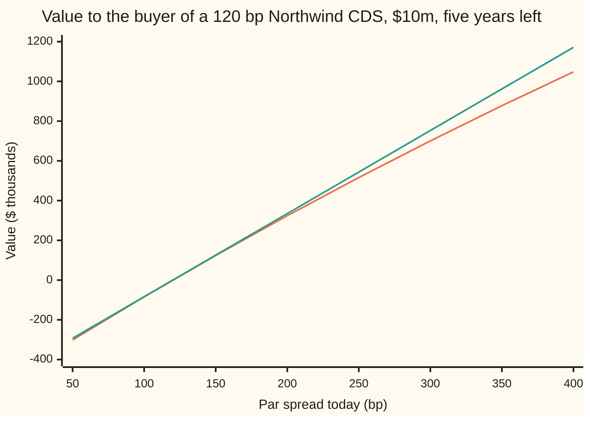
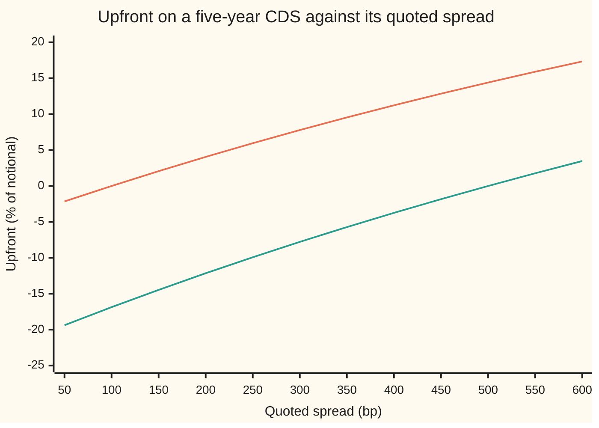
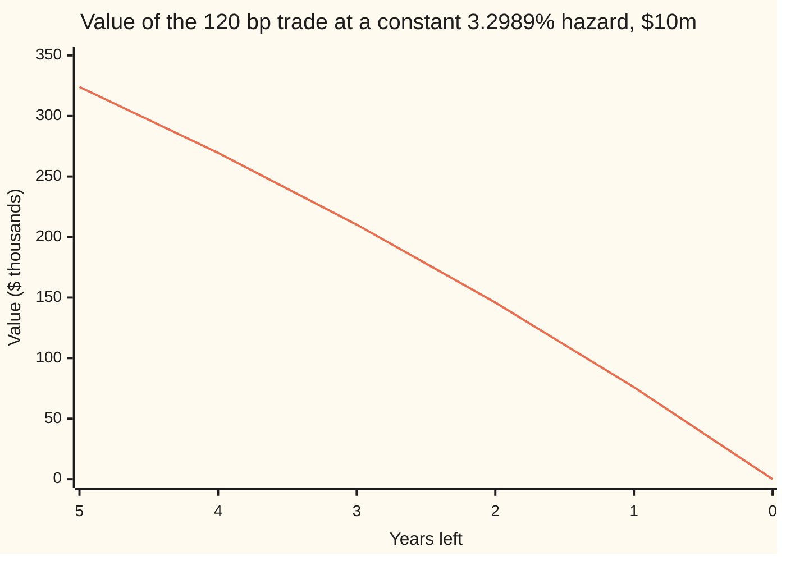

# Valuing an existing CDS: (par spread minus contract spread) times the risky annuity, and the fixed-coupon-plus-upfront convention

[Syllabus](../../../SYLLABUS.md) → [Financial mathematics](../README.md) → [Credit Default Swaps - Pricing, the Par Spread and the Hazard Behind It](../README.md#s42) → Valuing an existing CDS

---

## General Overview

A fund owns \$10 million of Northwind bonds. To protect them it buys five years of default protection, a credit default swap (CDS: a contract in which the buyer pays a yearly fee and the seller covers the loss if the borrower defaults). The fee is fixed at 120 basis points a year (one basis point, bp, is 0.01 percent), paid in four quarterly instalments.

A few days later Northwind reports bad news. New protection on the same name for the same five years now costs 200 bp. The fund's contract still charges 120. It has become a good contract to own: it buys, for 120, protection that everyone else pays 200 for. The question is how much that is worth in dollars today. The answer here is **\$324,006.96** on a notional (the amount the contract covers) of \$10 million.

The same arithmetic runs the market's quoting system. Almost every single-name CDS now pays one of a few fixed fees, called coupons, and the gap between the market's price and the coupon is settled in cash on the first day. That cash is the **upfront**. Take a name whose par spreads are 120, 200 and 250 bp at one, three and five years. A new five-year contract with a 100 bp coupon costs the buyer **6.04 percent** of notional upfront: \$604,085.32 on \$10 million. The market's quick conversion of the single 250 bp quote, through one flat hazard, gives 5.95 percent.

**An old CDS is worth the gap between today's fee and its own fee, paid until default or maturity, so its value is the spread gap times the risky annuity; the upfront on a fixed-coupon contract is the same product with the coupon in place of the old fee.**

**What kind of fact this is:** the mark is a theorem, proved on this card in Why it works, and it holds under any hazard curve; the fixed coupon, the upfront and the flat-hazard calculator that links them are a convention, agreed by the market, not a law.

### The picture: what the old 120 bp trade is worth as today's spread moves



Orange: the true value, $(s - c)A$ with the annuity recomputed at each spread. Green: the same gap multiplied by the annuity from the day of the trade, 4.1819, held frozen. The lines cross zero at 120 bp, where the old fee equals the market's. They part as the spread widens: a riskier Northwind is more likely to default early, the fee stream is likely to stop sooner, and each basis point of gap is worth less.

---

## The formula

$$V = (s - c)\,A$$

**Read it aloud:** the value of a protection contract to its buyer is today's par spread minus the contract's own spread, times the risky annuity.

Two helper formulas. The risky annuity adds up the twenty quarterly fee dates, each shrunk by discounting and by the chance that Northwind is still alive to pay:

$$A = \sum_{i=1}^{20} \Delta\, e^{-r t_i}\, e^{-\lambda t_i}$$

The sign Σ in front means: add up the terms for i = 1, 2, … 20. The fixed-coupon version replaces the old fee by the standard coupon and calls the result the upfront:

$$U = (s - c)\,A \quad\text{with } c = 100 \text{ or } 500 \text{ bp}$$

| Symbol | Plain meaning | In our example | Push it up and the answer… |
| --- | --- | --- | --- |
| $V$ | value of the existing contract to the protection buyer, per \$1 of notional | 0.032401, so \$324,006.96 on \$10m | is the answer |
| $s$ | par spread today: the fee that makes a new contract worth zero | 200 bp | rises, roughly by $A$ per unit of spread |
| $c$, $c_1$, $c_2$ | the contract's own spread, fixed on the trade date; on a standard contract, the coupon | 120 bp (old trade); 100 or 500 bp (standard) | falls by $A$ per unit, exactly |
| $A$ | risky annuity: value today of 1 a year, paid quarterly, only while the borrower survives | 4.0501 | scales the gap up |
| $A_0$ | the same annuity with no default risk | 4.3964 | |
| $P$ | protection leg: value today of the payout on default | 0.081002 | |
| $U$ | upfront: cash the buyer pays on day one, as a fraction of notional; negative means the buyer receives it | 6.04% on the 120/200/250 curve; 5.95% by the flat conversion; both at 250 bp, coupon 100 | |
| $\lambda$ | hazard rate: the chance per year of defaulting next, given survival so far | 3.2989% (reprices 200 bp) | lowers $A$, raises $s$ |
| $\tau$, $E$ | the default time, a random date; $E$ a random draw with mean 1 used to generate it | | |
| $R$ | recovery: fraction of the notional still recovered after default | 40% | lowers $s$ for a given $\lambda$ |
| $r$ | riskless rate, continuously compounded | 5% | lowers $A$ |
| $T$, $\Delta$, $t_i$ | years left; the quarter's length, 0.25; fee date number i, which falls at 0.25 i years | 5; 0.25; 0.25 to 5 | |

The protection leg, from [Pricing a CDS](02-cds-legs-risky-annuity-and-par-spread.md), is the loss $1 - R$ paid at default, discounted, averaged over when default happens:

$$P = (1 - R)\int_0^T \lambda\, e^{-(r+\lambda)t}\,dt = (1-R)\,\frac{\lambda}{r+\lambda}\left(1 - e^{-(r+\lambda)T}\right)$$

and the par spread is the fee that balances the two legs: $s = P / A$.

### When it holds

- **Same name, same dates, same notional.** The formula compares two contracts that share their protection leg and their fee dates. Change the maturity or the definition of default and the protection legs no longer cancel, so the gap is no longer the whole story.
- **Today's annuity, not the trade date's.** $A$ is computed on today's hazard. Using the annuity from the day of the trade gives \$334,554.82 instead of \$324,006.96.
- **A flat hazard for quote conversion.** Turning a quoted spread into an upfront needs a hazard, and the market's convention is one flat hazard that reprices the quote. A mark on a real book uses the whole curve built in [Bootstrapping a hazard curve](06-bootstrapping-the-hazard-curve-from-cds-quotes.md); with a sloped curve the two differ: 6.0409 percent on the curve against 5.9545 flat.
- **Recovery fixed at 40 percent.** The upfront depends on the recovery assumed, through the hazard. At 25 percent the 250 bp name's upfront is 6.0751 percent, not 5.9545.
- **The seller pays.** Nothing here allows for the protection seller defaulting too; that risk is priced separately.

---

## Why it works

### Step 0: an offsetting trade turns the old contract into a stream of spread gap

The fund bought protection at 120 bp. Today it could sell protection on Northwind, same five years, same dates, at 200 bp. A contract at today's par spread costs nothing to enter; that is what "par" means.

Hold both. If Northwind defaults, the fund receives the loss on the first contract and pays the same loss on the second. The default risk cancels. What is left: the fund pays 120 bp a year and receives 200 bp a year, every quarter, until Northwind defaults or five years pass. That is 80 bp a year, paid only while Northwind survives.

A stream of 1 a year paid only while the borrower survives has a name: the risky annuity, $A$. So the pair is worth $0.0080 \times A$. The second contract was free, so the whole value belongs to the first.

### Step 1: any contract is its protection leg minus its fee leg

To the buyer, a contract at spread $c$ is worth what it pays out minus what it costs:

$$V = P - c\,A.$$

$P$ does not depend on $c$ at all. $c$ enters only through the fee leg, and the fee leg is exactly $c$ times the annuity: every quarter the buyer pays $c\,\Delta$ if the borrower is still alive, and $A$ is the value of paying $\Delta$ on those same terms.

### Step 2: the par spread makes the two legs equal, and substituting gives the formula

The par spread $s$ is defined by $P - sA = 0$, so $P = sA$. Put that into Step 1:

$$V = sA - cA = (s - c)\,A.$$

That is the whole proof. It needs no assumption about the hazard: $A$ and $P$ can come from a flat hazard, a bootstrapped curve, or a model of the economy. Whatever they are, the mark is the spread gap times the annuity.

### Step 3: two contracts on the same name differ by a known multiple of the annuity

Take two contracts on Northwind, identical except for their spreads $c_1$ and $c_2$. Step 1, applied to each, gives

$$V(c_1) - V(c_2) = (P - c_1 A) - (P - c_2 A) = (c_2 - c_1)\,A.$$

The protection legs cancel exactly. On Northwind today, a contract struck at 100 bp is worth \$405,008.70 and the fund's 120 bp contract \$324,006.96. The difference, \$81,001.74, is 20 bp times 4.0501 times \$10 million, to the cent.

So any contract can be restated as a standard one plus a known cash amount. That is what makes Step 4 possible.

### Step 4: fixed coupons, with the difference paid on day one

If every contract were struck at its own par spread, the market would hold thousands of contracts, each with a slightly different fee. They would not net: a 118 bp contract bought and a 121 bp contract sold still leave two fee streams to manage. The market's fix is to trade every contract at one of a few standard coupons, 100 or 500 bp on this card, and to settle the difference in cash when the trade is made.

By Step 3, a contract at coupon $c$ is worth $(s - c)A$ more to the buyer than a contract at par $s$, which is worth zero. So the buyer pays exactly that on day one:

$$U = (s - c)\,A.$$

Once $U$ changes hands, the standard contract is worth zero to both sides, just as a par contract would be. The market quotes the result as a **price**, 100 minus the upfront in percent: the 250 bp name on a 100 bp coupon trades at 94.05.

### Step 5: the quote needs one agreed hazard to become cash

The formula is linear in $A$, but $A$ itself depends on the hazard, and a single quoted spread does not pin down a whole hazard curve. The convention fills the gap. Take one flat hazard $\lambda$ that makes a contract's par spread equal the quote, with recovery set at 40 percent. Compute $A$ at that hazard. Multiply.

For the 250 bp name the flat hazard is 4.1194 percent and the annuity 3.9697. The upfront is $0.0150 \times 3.9697 = 5.9545$ percent on a 100 bp coupon, and $-0.0250 \times 3.9697 = -9.9242$ percent on a 500 bp coupon: there the seller pays the buyer, because 500 overcharges a 250 bp name.

On a real curve the answer moves. Bootstrap quotes of 120, 200 and 250 bp at one, three and five years give hazards of 1.98, 4.04 and 5.68 percent on the three pieces. The five-year annuity on that curve is 4.0272, larger than the flat 3.9697, because default risk is low in the early years, when most of the fee value sits. The same formula gives $0.0150 \times 4.0272 = 6.0409$ percent. The flat convention settles the quote; the curve values the position.

The upfront is not a straight line in the quote. As the quote rises the hazard rises, the annuity falls, and each extra basis point is worth a little less. The chart in Worked numbers shows the bend.

### Step 6: the upfront converts back to exactly one spread

Desks quote distressed names in upfront, not spread, so the conversion must run backwards: from an upfront $U$ and a coupon $c$, find the flat hazard with $P(\lambda) - c\,A(\lambda) = U$, then report $s = P/A$. Three facts make that well defined.

- **The upfront rises with the hazard.** A higher hazard brings default earlier, which makes the payout larger in today's money and the fee stream shorter. $P$ goes up, $A$ goes down, so $P - cA$ goes strictly up for any coupon $c \ge 0$.
- **At zero hazard** there is no payout and the fees are riskless: $U = -c\,A_0$. With $A_0 = 4.3964$ that floor is $-4.3964$ percent for a 100 bp coupon and $-21.9820$ percent for 500.
- **As the hazard grows without bound** default comes almost at once: the payout tends to $1 - R$, the fee stream to nothing, so $U$ tends to 60 percent.

A continuous, strictly rising function that runs from the floor to 60 percent takes every value in between exactly once. So every upfront strictly inside that range comes from exactly one hazard, and hence exactly one spread; the floor itself is hazard zero and spread zero; an upfront outside the range has no spread at all. Below the floor, the buyer would be paid more than the riskless fee stream is worth. Above 60 percent, the buyer would pay more than the most the contract can return. The par spread is a rising function of the hazard too, since its top rises and its bottom falls, so the spread found is also unique.

<details>
<summary>Detailed proof: the upfront is strictly increasing in the hazard</summary>

Write the default time as $\tau = E / \lambda$, where $E$ is one fixed exponential draw with mean 1; this is how the check simulates it, and it has exactly the survival chance $e^{-\lambda t}$. For each draw $E$, raising $\lambda$ moves $\tau$ earlier.

The payout on one draw is $(1-R)\,e^{-r\tau}$ if $\tau \le T$ and 0 otherwise. Moving $\tau$ earlier never lowers this: inside the window the discount $e^{-r\tau}$ grows, and a default that moves from after $T$ to before $T$ goes from 0 to a positive payout. So $P(\lambda)$, the average over draws, is non-decreasing; it strictly increases, because every draw that defaults inside the window has its discount strictly raised, and such draws have positive chance.

The annuity $A(\lambda) = \sum \Delta\, e^{-(r+\lambda)t_i}$ is a sum of strictly decreasing terms, so it strictly decreases.

Hence $U(\lambda) = P(\lambda) - cA(\lambda)$ is strictly increasing for $c \ge 0$, and continuous. At $\lambda = 0$, $P = 0$ and $A = A_0 = \sum \Delta e^{-rt_i}$, so $U = -cA_0$. As $\lambda \to \infty$, $e^{-(r+\lambda)T} \to 0$ and $\lambda/(r+\lambda) \to 1$, so $P \to 1 - R$, while every term of $A$ tends to 0. By the intermediate value theorem, each $U$ in $(-cA_0,\, 1-R)$ has one and only one $\lambda$. The same argument applied to $s = P/A$, a rising numerator over a falling positive denominator, shows the spread map is strictly increasing from 0, so the quote recovered is unique.

</details>

**Another road.** With fees paid continuously instead of quarterly, the par spread collapses to $s = (1-R)\lambda$ and the annuity to $\left(1 - e^{-(r+\lambda)T}\right)/(r+\lambda)$; the mark keeps the same shape, $(s - c)A$. That shortcut is [The credit triangle](03-the-credit-triangle.md); here it guesses the 200 bp hazard at 3.3333 percent against the exact 3.2989.

---

## Worked numbers, by hand

The old trade: Northwind, \$10m, bought at 120 bp, five years of quarterly fees left, par now 200 bp, recovery 40 percent, riskless rate 5 percent. First find the flat hazard that reprices 200 bp (a root search: see the code), then write $x = e^{-(r+\lambda)/4}$, the survival-and-discount factor for one quarter, so the annuity becomes a geometric series (a sum where each term is the last times $x$).

| Step | Arithmetic | Value |
| --- | --- | --- |
| 1. Hazard that reprices 200 bp | solve $P/A = 0.0200$ | 3.2989% |
| 2. One quarter's factor | $x = e^{-(0.05 + 0.032989)/4}$ | 0.979467 |
| 3. Twenty quarters | $x^{20}$ | 0.660377 |
| 4. Risky annuity | $0.25 \cdot x\,(1 - x^{20})/(1 - x)$ | 4.050087 |
| 5. Protection leg | $0.60 \cdot \tfrac{0.032989}{0.082989}\,(1 - 0.660377)$ | 0.081002 |
| 6. Fee leg at 120 bp | $0.0120 \times 4.050087$ | 0.048601 |
| 7. Value per \$1 | $0.081002 - 0.048601 = 0.0080 \times 4.050087$ | 0.032401 |
| 8. Value on \$10m | $0.032401 \times 10{,}000{,}000$ | **\$324,006.96** |

The fund could close the trade today and receive \$324,006.96 from a dealer. That is not a forecast of default; it is the cost of replacing the protection it already owns.

The upfront, for a new name quoted at 250 bp and traded with a 100 bp coupon:

| Step | Arithmetic | Value |
| --- | --- | --- |
| 1. Flat hazard that reprices 250 bp | solve $P/A = 0.0250$ | 4.1194% |
| 2. Annuity at that hazard | as above | 3.969663 |
| 3. Upfront, coupon 100 | $(0.0250 - 0.0100) \times 3.969663$ | 5.9545% |
| 4. In dollars on \$10m | | \$595,449.39 |
| 5. Price | $100 - 5.9545$ | 94.05 |
| 6. Upfront, coupon 500 | $(0.0250 - 0.0500) \times 3.969663$ | **−9.9242%**, paid to the buyer |
| 7. Upfront, coupon 100, on the 120/200/250 curve | $(0.0250 - 0.0100) \times 4.027235$ | **6.0409%**, \$604,085.32 |

Run it backwards: from 5.9545 percent on a 100 bp coupon, a bisection search (halving an interval that contains the answer) and a Newton search (following the slope) both return 250.000000 bp. From −9.9242 percent on a 500 bp coupon, the same.



Orange: coupon 100 bp. Green: coupon 500 bp. Each crosses zero where the quote equals its coupon. The vertical gap between the lines is 400 bp of coupon times the annuity at that quote (Step 3): at 250 bp, 5.9545 minus −9.9242 is 4 percent of 3.9697. Both lines bend gently downward because the annuity shrinks as the quote rises.

### What breaks if you drop a piece

| Mistake | Comes out at | What went wrong |
| --- | --- | --- |
| Annuity from the trade date (4.1819) | \$334,554.82 | Northwind is riskier now; the fee stream is shorter than it was |
| Riskless annuity (4.3964) | \$351,711.36 | survival left out: fees are assumed to run even after default |
| 80 bp times 5 years | \$400,000.00 | no discounting and no survival: the gap treated as five certain payments |
| Upfront on the coupon's hazard (the 100 bp curve) | 6.3272% | the annuity must come from the quoted spread's hazard, not the coupon's |

---

## How the mark moves

The spread need not move at all for the mark to change. Hold Northwind's hazard at 3.2989 percent and let the calendar run. Each quarter one fee date drops off, the stream of 80 bp gaps gets shorter, and the value drains to zero at maturity.



The one line is the mark, $P - cA$ over the years that remain. The yearly drops grow as maturity nears. With a constant hazard, a contract with y years left is priced like a new y-year contract, so each year that passes removes the last year of gap. Going from 5 years to 4 removes the most distant year, the most discounted and the least likely to be reached; going from 1 to 0 removes the nearest year, which is worth the most. Two forces move a mark, and the formula keeps them apart: a change in $s$ moves the gap, and the passage of time or a change in hazard moves $A$. How much each one moves the value is the subject of [CDS risk numbers](08-cds-risk-numbers.md).

---

## Code, from first principles, and it actually runs

The script reprices the house example first (121.06 bp, annuity 4.1819), then marks the old trade by three independent roads: the formula $(s - c)A$ with the annuity added term by term; the two legs priced separately, the protection leg by Simpson's rule (a numerical integral built from weighted sample points) and the annuity as a geometric series; and a simulation of two million default times from a hand-written random number generator, paying both legs path by path. It then converts the 250 bp quote to an upfront, checks that against a second simulation, runs the conversion backwards with two unrelated root finders, and prices the same quote on the bootstrapped 120/200/250 curve, whose annuity must match the bootstrap card's 4.027235. The chart points, the boundary values and the wrong answers are printed too.

### Python

```python
# Valuing an existing CDS -- the check behind the card.  Standard library only.
# Nothing imported knows the answer: the root finders, the integrator and the
# random numbers are written out below.
from math import exp, log

R, r, T, DT = 0.40, 0.05, 5.0, 0.25        # recovery, riskless rate, years left, premium period
NOTIONAL, NQ = 10_000_000.0, 20            # $10m, twenty quarterly premium dates

def annuity(lam, n=NQ):                    # road 1: add up n survival-weighted, discounted quarters
    return sum(DT * exp(-(r + lam) * DT * i) for i in range(1, n + 1))
def annuity_geom(lam, n=NQ):               # road 2: the same sum as a geometric series
    x = exp(-(r + lam) * DT)
    return DT * x * (1 - x ** n) / (1 - x)
def protection(lam, t_end=T, rec=R):       # (1-R) times the integral of lam e^{-(r+lam)t}, closed form
    k = r + lam
    return (1 - rec) * lam / k * (1 - exp(-k * t_end))
def simpson(f, a, b, n=2000):
    h = (b - a) / n
    return (f(a) + f(b) + sum((4 if i % 2 else 2) * f(a + i * h) for i in range(1, n))) * h / 3

def par(lam, rec=R): return protection(lam, T, rec) / annuity(lam)
def curve_legs(hz, n=NQ):                  # piecewise hazard: hz[0] to 1y, hz[1] to 3y, hz[2] to 5y
    H = P = A = 0.0
    for i in range(1, n + 1):
        h = hz[0 if i <= 4 else 1 if i <= 12 else 2]; k = r + h
        P += (1 - R) * h / k * exp(-r * DT * (i - 1) - H) * (1 - exp(-k * DT))
        H += h * DT; A += DT * exp(-r * DT * i - H)
    return P, A
def bisect(f, lo, hi):                     # f(lo) < 0 < f(hi); halve 200 times
    for _ in range(200):
        mid = 0.5 * (lo + hi)
        if f(mid) < 0: lo = mid
        else: hi = mid
    return 0.5 * (lo + hi)
def newton(f, x, h=1e-7):                  # a second, unrelated root finder
    for _ in range(40):
        x -= f(x) / ((f(x + h) - f(x - h)) / (2 * h))
    return x
def hazard_for(s, rec=R): return bisect(lambda l: par(l, rec) - s, 1e-12, 5.0)
def upfront(lam, c, rec=R): return protection(lam, T, rec) - c * annuity(lam)

MASK, state = (1 << 64) - 1, 20260928
def rand():                                # splitmix64, the same stream as the Rust check
    global state
    state = (state + 0x9E3779B97F4A7C15) & MASK
    z = ((state ^ (state >> 30)) * 0xBF58476D1CE4E5B9) & MASK
    z = ((z ^ (z >> 27)) * 0x94D049BB133111EB) & MASK
    return (((z ^ (z >> 31)) >> 11) + 0.5) / 9007199254740992.0

cum = [0.0]
for i in range(1, NQ + 1): cum.append(cum[-1] + DT * exp(-r * DT * i))

def simulate(lam, c, paths=2_000_000):       # road 3: draw default times, pay both legs path by path
    sv = sv2 = sa = 0.0
    for _ in range(paths):
        tau = -log(rand()) / lam
        a = cum[min(int(tau / DT), NQ)]            # premiums paid on dates before default
        v = ((1 - R) * exp(-r * tau) if tau <= T else 0.0) - c * a
        sv += v; sv2 += v * v; sa += a
    m = sv / paths
    return m, ((sv2 / paths - m * m) / paths) ** 0.5, sa / paths

# ---- the old trade: protection bought at 120 bp, par is now 200 bp, five years left ----
c, s_now = 0.012, 0.020
lam = hazard_for(s_now)
A, A_g = annuity(lam), annuity_geom(lam)
x = exp(-(r + lam) * DT)
P = protection(lam)
P_simp = simpson(lambda t: (1 - R) * lam * exp(-(r + lam) * t), 0.0, T)
V = (s_now - c) * A                        # road 1: the card's formula
V_legs = P_simp - c * A_g                  # road 2: the two legs, each by its own method
V_mc, V_se, A_mc = simulate(lam, c)        # road 3: simulation
V100 = (s_now - 0.01) * A                  # the same name, struck at the 100 bp standard coupon

# ---- fixed coupon plus upfront: a name quoted at 250 bp ----
q = 0.025
lam_q = hazard_for(q)
A_q = annuity(lam_q)
U100, U500 = (q - 0.01) * A_q, (q - 0.05) * A_q
U_mc, U_se, _ = simulate(lam_q, 0.01)
back_b = par(bisect(lambda l: upfront(l, 0.01) - U100, 1e-12, 5.0))
back_n = par(newton(lambda l: upfront(l, 0.01) - U100, 0.05))
back_5 = par(bisect(lambda l: upfront(l, 0.05) - U500, 1e-12, 5.0))
A_free = annuity(0.0)
hz = []                                    # the bootstrapped curve: quotes 120, 200, 250 bp at 1, 3, 5 years
for n, s in ((4, 0.012), (12, 0.020), (20, 0.025)):
    hz.append(bisect(lambda h: (lambda p, a: p / a)(*curve_legs(hz + [h] * 3, n)) - s, 1e-12, 5.0))
P_c, A_c = curve_legs(hz)
U_c = P_c - 0.01 * A_c

rows = [
    ("house: par spread at hazard 2%, bp", 1e4 * par(0.02), 4), ("house: annuity at hazard 2%", annuity(0.02), 6),
    ("hazard that prices 200 bp", lam, 6), ("  credit-triangle guess 0.02/0.6", 0.02 / 0.6, 6),
    ("x = e^-(r+lam)/4", x, 6), ("x^20", x ** 20, 6),
    ("annuity, 20-term sum", A, 6), ("annuity, geometric series", A_g, 6), ("annuity, simulated", A_mc, 6),
    ("protection leg, closed form", P, 6), ("protection leg, Simpson", P_simp, 6), ("premium leg at 120 bp", c * A, 6),
    ("1 value per $1, (s - c) A", V, 6), ("2 value per $1, P - c A", V_legs, 6),
    ("3 value per $1, simulated", V_mc, 6), ("  simulation standard error", V_se, 6),
    ("value on $10m", V * NOTIONAL, 2), ("100 bp contract on $10m", V100 * NOTIONAL, 2),
    ("  difference", (V100 - V) * NOTIONAL, 2), ("  20 bp x annuity x $10m", 0.002 * A * NOTIONAL, 2),
    ("hazard that prices 250 bp", lam_q, 6), ("annuity at 250 bp", A_q, 6),
    ("upfront %, coupon 100", 100 * U100, 4), ("upfront $ on $10m, coupon 100", U100 * NOTIONAL, 2),
    ("price, coupon 100", 100 * (1 - U100), 4), ("upfront %, coupon 100, simulated", 100 * U_mc, 4),
    ("  simulation standard error %", 100 * U_se, 4), ("upfront %, coupon 500", 100 * U500, 4),
    ("back to bp: bisection, coupon 100", 1e4 * back_b, 6), ("back to bp: Newton, coupon 100", 1e4 * back_n, 6),
    ("back to bp: bisection, coupon 500", 1e4 * back_5, 6), ("riskless annuity (hazard 0)", A_free, 6),
    ("lowest upfront %, coupon 100", -100 * 0.01 * A_free, 4), ("lowest upfront %, coupon 500", -100 * 0.05 * A_free, 4),
    ("highest upfront %, 1 - R", 100 * (1 - R), 4), ("curve annuity to 5y", A_c, 6),
    ("curve upfront %, 250 bp, coupon 100", 100 * U_c, 4), ("curve upfront $ on $10m", U_c * NOTIONAL, 2),
    ("wrong: inception annuity, $", 0.008 * annuity(0.02) * NOTIONAL, 2),
    ("wrong: riskless annuity, $", 0.008 * A_free * NOTIONAL, 2), ("wrong: 80 bp x 5 years, $", 0.008 * 5 * NOTIONAL, 2),
    ("wrong: coupon's hazard in upfront %", 100 * 0.015 * annuity(hazard_for(0.01)), 4),
    ("try: R = 25%, upfront %, coupon 100", 100 * 0.015 * annuity(hazard_for(q, 0.25)), 4),
    ("try: par falls to 80 bp, $", -0.004 * annuity(hazard_for(0.008)) * NOTIONAL, 2),
]
for name, v, d in rows:
    print(f"{name:<38} {v:>16.{d}f}")
print(f"{'curve hazards 0-1y, 1-3y, 3-5y':<38} " + " ".join(f"{h:.6f}" for h in hz))
spreads = [50 * k for k in range(1, 9)]
print("chart, par today bp " + " ".join(f"{s:7d}" for s in spreads))
print("chart, value $k     " + " ".join(f"{(s / 1e4 - c) * annuity(hazard_for(s / 1e4)) * 10000:7.2f}" for s in spreads))
print("chart, frozen $k    " + " ".join(f"{(s / 1e4 - c) * annuity(0.02) * 10000:7.2f}" for s in spreads))
years = [5, 4, 3, 2, 1, 0]
print("chart, years left   " + " ".join(f"{y:7d}" for y in years))
print("chart, mark $k      " + " ".join(f"{(protection(lam, y) - c * annuity(lam, 4 * y)) * 10000:7.2f}" for y in years))
quotes = [50 * k for k in range(1, 13)]
print("chart, quote bp     " + " ".join(f"{s:6d}" for s in quotes))
print("chart, up% c=100    " + " ".join(f"{100 * (s / 1e4 - 0.01) * annuity(hazard_for(s / 1e4)):6.2f}" for s in quotes))
print("chart, up% c=500    " + " ".join(f"{100 * (s / 1e4 - 0.05) * annuity(hazard_for(s / 1e4)):6.2f}" for s in quotes))

assert abs(par(0.02) - 0.01210561519) < 1e-10,   "house par spread, 121.06 bp"
assert abs(V - V_legs) < 1e-10,                   "formula vs legs priced by Simpson and the geometric series"
assert abs(V_mc - V) < 4 * V_se,                  "simulation lands within 4 standard errors"
assert abs(U_mc - U100) < 4 * U_se,               "simulated upfront within 4 standard errors"
assert abs(A_mc - A) < 0.01,                      "simulated premium stream vs the annuity sum"
assert abs(back_b - q) < 1e-12 and abs(back_n - q) < 1e-12, "two root finders return the 250 bp quote"
assert abs(back_5 - q) < 1e-12,                   "coupon 500 round trip returns 250 bp"
assert abs(A_c - 4.027235) < 1e-6 and abs(P_c / A_c - q) < 1e-12, "curve matches the bootstrap card"
assert abs(U_c - 0.0604) < 5e-5 and U_c > U100,   "curve upfront 6.04%, above the flat 5.95%"
print("ALL CHECKS PASS")
```

**Ran 2026-09-28 on macOS, Python 3.14.6, standard library only. All checks passed. Output, pasted from the run:**

```
house: par spread at hazard 2%, bp             121.0562
house: annuity at hazard 2%                    4.181935
hazard that prices 200 bp                      0.032989
  credit-triangle guess 0.02/0.6               0.033333
x = e^-(r+lam)/4                               0.979467
x^20                                           0.660377
annuity, 20-term sum                           4.050087
annuity, geometric series                      4.050087
annuity, simulated                             4.050654
protection leg, closed form                    0.081002
protection leg, Simpson                        0.081002
premium leg at 120 bp                          0.048601
1 value per $1, (s - c) A                      0.032401
2 value per $1, P - c A                        0.032401
3 value per $1, simulated                      0.032151
  simulation standard error                    0.000143
value on $10m                                 324006.96
100 bp contract on $10m                       405008.70
  difference                                   81001.74
  20 bp x annuity x $10m                       81001.74
hazard that prices 250 bp                      0.041194
annuity at 250 bp                              3.969663
upfront %, coupon 100                            5.9545
upfront $ on $10m, coupon 100                 595449.39
price, coupon 100                               94.0455
upfront %, coupon 100, simulated                 5.9456
  simulation standard error %                    0.0154
upfront %, coupon 500                           -9.9242
back to bp: bisection, coupon 100            250.000000
back to bp: Newton, coupon 100               250.000000
back to bp: bisection, coupon 500            250.000000
riskless annuity (hazard 0)                    4.396392
lowest upfront %, coupon 100                    -4.3964
lowest upfront %, coupon 500                   -21.9820
highest upfront %, 1 - R                        60.0000
curve annuity to 5y                            4.027235
curve upfront %, 250 bp, coupon 100              6.0409
curve upfront $ on $10m                       604085.32
wrong: inception annuity, $                   334554.82
wrong: riskless annuity, $                    351711.36
wrong: 80 bp x 5 years, $                     400000.00
wrong: coupon's hazard in upfront %              6.3272
try: R = 25%, upfront %, coupon 100              6.0751
try: par falls to 80 bp, $                   -170118.25
curve hazards 0-1y, 1-3y, 3-5y         0.019826 0.040440 0.056837
chart, par today bp      50     100     150     200     250     300     350     400
chart, value $k     -301.42  -84.36  123.99  324.01  516.06  700.48  877.59 1047.72
chart, frozen $k    -292.74  -83.64  125.46  334.55  543.65  752.75  961.85 1170.94
chart, years left         5       4       3       2       1       0
chart, mark $k       324.01  269.49  210.26  145.90   75.98    0.00
chart, quote bp         50    100    150    200    250    300    350    400    450    500    550    600
chart, up% c=100     -2.15   0.00   2.07   4.05   5.95   7.78   9.54  11.23  12.85  14.40  15.90  17.33
chart, up% c=500    -19.38 -16.87 -14.47 -12.15  -9.92  -7.78  -5.72  -3.74  -1.84   0.00   1.77   3.47
ALL CHECKS PASS
```

### Rust

```rust
// Valuing an existing CDS -- the check behind the card.  std only, no crates.
// The root finders, the integrator and the random numbers are written out below.
const R: f64 = 0.40; // recovery
const RATE: f64 = 0.05; // riskless rate
const T: f64 = 5.0; const DT: f64 = 0.25; // years left; premium period
const NOTIONAL: f64 = 10_000_000.0; const NQ: usize = 20; // $10m; twenty quarterly premium dates

fn annuity(lam: f64, n: usize) -> f64 {
    // road 1: add up n survival-weighted, discounted quarters
    (1..=n).map(|i| DT * (-(RATE + lam) * DT * i as f64).exp()).sum()
}
fn annuity_geom(lam: f64, n: usize) -> f64 {
    // road 2: the same sum as a geometric series
    let x = (-(RATE + lam) * DT).exp();
    DT * x * (1.0 - x.powi(n as i32)) / (1.0 - x)
}
fn protection(lam: f64, t_end: f64, rec: f64) -> f64 {
    let k = RATE + lam;
    (1.0 - rec) * lam / k * (1.0 - (-k * t_end).exp())
}
fn simpson(f: &dyn Fn(f64) -> f64, a: f64, b: f64, n: usize) -> f64 {
    let h = (b - a) / n as f64;
    let mut s = f(a) + f(b);
    for i in 1..n {
        s += if i % 2 == 1 { 4.0 } else { 2.0 } * f(a + i as f64 * h);
    }
    s * h / 3.0
}
fn par(lam: f64, rec: f64) -> f64 { protection(lam, T, rec) / annuity(lam, NQ) }
fn bisect(f: &dyn Fn(f64) -> f64, mut lo: f64, mut hi: f64) -> f64 {
    for _ in 0..200 {
        let mid = 0.5 * (lo + hi);
        if f(mid) < 0.0 { lo = mid } else { hi = mid }
    }
    0.5 * (lo + hi)
}
fn newton(f: &dyn Fn(f64) -> f64, mut x: f64) -> f64 {
    let h = 1e-7;
    for _ in 0..40 {
        x -= f(x) / ((f(x + h) - f(x - h)) / (2.0 * h));
    }
    x
}
fn hazard_for(s: f64, rec: f64) -> f64 { bisect(&|l| par(l, rec) - s, 1e-12, 5.0) }
fn upfront(lam: f64, c: f64) -> f64 { protection(lam, T, R) - c * annuity(lam, NQ) }
fn curve_legs(hz: &[f64], n: usize) -> (f64, f64) { // piecewise hazard: hz[0] to 1y, hz[1] to 3y, hz[2] to 5y
    let (mut h_cum, mut p, mut a) = (0.0, 0.0, 0.0);
    for i in 1..=n {
        let h = hz[if i <= 4 { 0 } else if i <= 12 { 1 } else { 2 }]; let k = RATE + h;
        p += (1.0 - R) * h / k * (-RATE * DT * (i - 1) as f64 - h_cum).exp() * (1.0 - (-k * DT).exp());
        h_cum += h * DT; a += DT * (-RATE * DT * i as f64 - h_cum).exp();
    }
    (p, a)
}

struct Rng(u64);
impl Rng {
    fn next(&mut self) -> f64 {
        // splitmix64, the same stream as the Python check
        self.0 = self.0.wrapping_add(0x9E3779B97F4A7C15);
        let mut z = (self.0 ^ (self.0 >> 30)).wrapping_mul(0xBF58476D1CE4E5B9);
        z = (z ^ (z >> 27)).wrapping_mul(0x94D049BB133111EB);
        (((z ^ (z >> 31)) >> 11) as f64 + 0.5) / 9007199254740992.0
    }
}
fn simulate(rng: &mut Rng, cum: &[f64], lam: f64, c: f64, paths: usize) -> (f64, f64, f64) {
    // road 3: draw default times, pay both legs path by path
    let (mut sv, mut sv2, mut sa) = (0.0, 0.0, 0.0);
    for _ in 0..paths {
        let tau = -rng.next().ln() / lam;
        let a = cum[((tau / DT) as usize).min(NQ)]; // premiums paid on dates before default
        let v = (if tau <= T { (1.0 - R) * (-RATE * tau).exp() } else { 0.0 }) - c * a;
        sv += v;
        sv2 += v * v;
        sa += a;
    }
    let p = paths as f64;
    let m = sv / p;
    (m, ((sv2 / p - m * m) / p).sqrt(), sa / p)
}

fn main() {
    let mut rng = Rng(20260928);
    let mut cum = vec![0.0];
    for i in 1..=NQ {
        let last = cum[i - 1];
        cum.push(last + DT * (-RATE * DT * i as f64).exp());
    }
    // ---- the old trade: protection bought at 120 bp, par is now 200 bp, five years left ----
    let (c, s_now) = (0.012, 0.020);
    let lam = hazard_for(s_now, R);
    let (a, a_g) = (annuity(lam, NQ), annuity_geom(lam, NQ));
    let x = (-(RATE + lam) * DT).exp();
    let p = protection(lam, T, R);
    let p_simp = simpson(&|t| (1.0 - R) * lam * (-(RATE + lam) * t).exp(), 0.0, T, 2000);
    let v = (s_now - c) * a;
    let v_legs = p_simp - c * a_g;
    let (v_mc, v_se, a_mc) = simulate(&mut rng, &cum, lam, c, 2_000_000);
    let v100 = (s_now - 0.01) * a;
    // ---- fixed coupon plus upfront: a name quoted at 250 bp ----
    let q = 0.025;
    let lam_q = hazard_for(q, R);
    let a_q = annuity(lam_q, NQ);
    let (u100, u500) = ((q - 0.01) * a_q, (q - 0.05) * a_q);
    let (u_mc, u_se, _) = simulate(&mut rng, &cum, lam_q, 0.01, 2_000_000);
    let back_b = par(bisect(&|l| upfront(l, 0.01) - u100, 1e-12, 5.0), R);
    let back_n = par(newton(&|l| upfront(l, 0.01) - u100, 0.05), R);
    let back_5 = par(bisect(&|l| upfront(l, 0.05) - u500, 1e-12, 5.0), R);
    let a_free = annuity(0.0, NQ);
    let mut hz: Vec<f64> = vec![]; // the bootstrapped curve: quotes 120, 200, 250 bp at 1, 3, 5 years
    for (n, s) in [(4usize, 0.012), (12, 0.020), (20, 0.025)] {
        let f = |h: f64| { let mut t = hz.clone(); t.extend([h; 3]); let (p, a) = curve_legs(&t, n); p / a - s };
        hz.push(bisect(&f, 1e-12, 5.0));
    }
    let (p_c, a_c) = curve_legs(&hz, NQ);
    let u_c = p_c - 0.01 * a_c;

    let rows: Vec<(&str, f64, usize)> = vec![
        ("house: par spread at hazard 2%, bp", 1e4 * par(0.02, R), 4), ("house: annuity at hazard 2%", annuity(0.02, NQ), 6),
        ("hazard that prices 200 bp", lam, 6), ("  credit-triangle guess 0.02/0.6", 0.02 / 0.6, 6),
        ("x = e^-(r+lam)/4", x, 6), ("x^20", x.powi(20), 6),
        ("annuity, 20-term sum", a, 6), ("annuity, geometric series", a_g, 6), ("annuity, simulated", a_mc, 6),
        ("protection leg, closed form", p, 6), ("protection leg, Simpson", p_simp, 6), ("premium leg at 120 bp", c * a, 6),
        ("1 value per $1, (s - c) A", v, 6), ("2 value per $1, P - c A", v_legs, 6),
        ("3 value per $1, simulated", v_mc, 6), ("  simulation standard error", v_se, 6),
        ("value on $10m", v * NOTIONAL, 2), ("100 bp contract on $10m", v100 * NOTIONAL, 2),
        ("  difference", (v100 - v) * NOTIONAL, 2), ("  20 bp x annuity x $10m", 0.002 * a * NOTIONAL, 2),
        ("hazard that prices 250 bp", lam_q, 6), ("annuity at 250 bp", a_q, 6),
        ("upfront %, coupon 100", 100.0 * u100, 4), ("upfront $ on $10m, coupon 100", u100 * NOTIONAL, 2),
        ("price, coupon 100", 100.0 * (1.0 - u100), 4), ("upfront %, coupon 100, simulated", 100.0 * u_mc, 4),
        ("  simulation standard error %", 100.0 * u_se, 4), ("upfront %, coupon 500", 100.0 * u500, 4),
        ("back to bp: bisection, coupon 100", 1e4 * back_b, 6), ("back to bp: Newton, coupon 100", 1e4 * back_n, 6),
        ("back to bp: bisection, coupon 500", 1e4 * back_5, 6), ("riskless annuity (hazard 0)", a_free, 6),
        ("lowest upfront %, coupon 100", -100.0 * 0.01 * a_free, 4), ("lowest upfront %, coupon 500", -100.0 * 0.05 * a_free, 4),
        ("highest upfront %, 1 - R", 100.0 * (1.0 - R), 4), ("curve annuity to 5y", a_c, 6),
        ("curve upfront %, 250 bp, coupon 100", 100.0 * u_c, 4), ("curve upfront $ on $10m", u_c * NOTIONAL, 2),
        ("wrong: inception annuity, $", 0.008 * annuity(0.02, NQ) * NOTIONAL, 2),
        ("wrong: riskless annuity, $", 0.008 * a_free * NOTIONAL, 2), ("wrong: 80 bp x 5 years, $", 0.008 * 5.0 * NOTIONAL, 2),
        ("wrong: coupon's hazard in upfront %", 100.0 * 0.015 * annuity(hazard_for(0.01, R), NQ), 4),
        ("try: R = 25%, upfront %, coupon 100", 100.0 * 0.015 * annuity(hazard_for(q, 0.25), NQ), 4),
        ("try: par falls to 80 bp, $", -0.004 * annuity(hazard_for(0.008, R), NQ) * NOTIONAL, 2),
    ];
    for (name, val, d) in &rows {
        println!("{:<38} {:>16.*}", name, *d, val);
    }
    println!("{:<38} {}", "curve hazards 0-1y, 1-3y, 3-5y", hz.iter().map(|h| format!("{:.6}", h)).collect::<Vec<_>>().join(" "));
    let line = |label: &str, xs: Vec<String>| println!("{}{}", label, xs.join(" "));
    let spreads: Vec<f64> = (1..=8).map(|k| 50.0 * k as f64).collect();
    line("chart, par today bp ", spreads.iter().map(|s| format!("{:7.0}", s)).collect());
    line("chart, value $k     ", spreads.iter().map(|s| format!("{:7.2}", (s / 1e4 - c) * annuity(hazard_for(s / 1e4, R), NQ) * 10000.0)).collect());
    line("chart, frozen $k    ", spreads.iter().map(|s| format!("{:7.2}", (s / 1e4 - c) * annuity(0.02, NQ) * 10000.0)).collect());
    let years = [5usize, 4, 3, 2, 1, 0];
    line("chart, years left   ", years.iter().map(|y| format!("{:7}", y)).collect());
    line("chart, mark $k      ", years.iter().map(|&y| format!("{:7.2}", (protection(lam, y as f64, R) - c * annuity(lam, 4 * y)) * 10000.0)).collect());
    let quotes: Vec<f64> = (1..=12).map(|k| 50.0 * k as f64).collect();
    line("chart, quote bp     ", quotes.iter().map(|s| format!("{:6.0}", s)).collect());
    line("chart, up% c=100    ", quotes.iter().map(|s| format!("{:6.2}", 100.0 * (s / 1e4 - 0.01) * annuity(hazard_for(s / 1e4, R), NQ))).collect());
    line("chart, up% c=500    ", quotes.iter().map(|s| format!("{:6.2}", 100.0 * (s / 1e4 - 0.05) * annuity(hazard_for(s / 1e4, R), NQ))).collect());

    assert!((par(0.02, R) - 0.01210561519).abs() < 1e-10, "house par spread, 121.06 bp");
    assert!((v - v_legs).abs() < 1e-10, "formula vs legs priced by Simpson and the geometric series");
    assert!((v_mc - v).abs() < 4.0 * v_se, "simulation lands within 4 standard errors");
    assert!((u_mc - u100).abs() < 4.0 * u_se, "simulated upfront within 4 standard errors");
    assert!((a_mc - a).abs() < 0.01, "simulated premium stream vs the annuity sum");
    assert!((back_b - q).abs() < 1e-12 && (back_n - q).abs() < 1e-12, "two root finders return the 250 bp quote");
    assert!((back_5 - q).abs() < 1e-12, "coupon 500 round trip returns 250 bp");
    assert!((a_c - 4.027235).abs() < 1e-6 && (p_c / a_c - q).abs() < 1e-12, "curve matches the bootstrap card");
    assert!((u_c - 0.0604).abs() < 5e-5 && u_c > u100, "curve upfront 6.04%, above the flat 5.95%");
    println!("ALL CHECKS PASS");
}
```

**Ran 2026-09-28 on macOS, rustc 1.98.1, no crates. All checks passed. Output, pasted from the run:**

```
house: par spread at hazard 2%, bp             121.0562
house: annuity at hazard 2%                    4.181935
hazard that prices 200 bp                      0.032989
  credit-triangle guess 0.02/0.6               0.033333
x = e^-(r+lam)/4                               0.979467
x^20                                           0.660377
annuity, 20-term sum                           4.050087
annuity, geometric series                      4.050087
annuity, simulated                             4.050654
protection leg, closed form                    0.081002
protection leg, Simpson                        0.081002
premium leg at 120 bp                          0.048601
1 value per $1, (s - c) A                      0.032401
2 value per $1, P - c A                        0.032401
3 value per $1, simulated                      0.032151
  simulation standard error                    0.000143
value on $10m                                 324006.96
100 bp contract on $10m                       405008.70
  difference                                   81001.74
  20 bp x annuity x $10m                       81001.74
hazard that prices 250 bp                      0.041194
annuity at 250 bp                              3.969663
upfront %, coupon 100                            5.9545
upfront $ on $10m, coupon 100                 595449.39
price, coupon 100                               94.0455
upfront %, coupon 100, simulated                 5.9456
  simulation standard error %                    0.0154
upfront %, coupon 500                           -9.9242
back to bp: bisection, coupon 100            250.000000
back to bp: Newton, coupon 100               250.000000
back to bp: bisection, coupon 500            250.000000
riskless annuity (hazard 0)                    4.396392
lowest upfront %, coupon 100                    -4.3964
lowest upfront %, coupon 500                   -21.9820
highest upfront %, 1 - R                        60.0000
curve annuity to 5y                            4.027235
curve upfront %, 250 bp, coupon 100              6.0409
curve upfront $ on $10m                       604085.32
wrong: inception annuity, $                   334554.82
wrong: riskless annuity, $                    351711.36
wrong: 80 bp x 5 years, $                     400000.00
wrong: coupon's hazard in upfront %              6.3272
try: R = 25%, upfront %, coupon 100              6.0751
try: par falls to 80 bp, $                   -170118.25
curve hazards 0-1y, 1-3y, 3-5y         0.019826 0.040440 0.056837
chart, par today bp      50     100     150     200     250     300     350     400
chart, value $k     -301.42  -84.36  123.99  324.01  516.06  700.48  877.59 1047.72
chart, frozen $k    -292.74  -83.64  125.46  334.55  543.65  752.75  961.85 1170.94
chart, years left         5       4       3       2       1       0
chart, mark $k       324.01  269.49  210.26  145.90   75.98    0.00
chart, quote bp         50    100    150    200    250    300    350    400    450    500    550    600
chart, up% c=100     -2.15   0.00   2.07   4.05   5.95   7.78   9.54  11.23  12.85  14.40  15.90  17.33
chart, up% c=500    -19.38 -16.87 -14.47 -12.15  -9.92  -7.78  -5.72  -3.74  -1.84   0.00   1.77   3.47
ALL CHECKS PASS
```

The two outputs agree line for line. The simulated value, 0.032151 with a standard error of 0.000143, and the simulated upfront, 5.9456 percent with a standard error of 0.0154, both sit inside the four-standard-error band the asserts allow around the formula's 0.032401 and 5.9545.

> [!TIP]
> **Try changing**
> - **Recovery 25 percent instead of 40, same 250 bp quote, coupon 100.** Guess first: does a lower recovery raise or lower the upfront? It raises it, to 6.0751 percent. A lower recovery means a larger loss per default, so a smaller hazard reprices 250 bp, the annuity is longer, and the 150 bp gap is worth more.
> - **Northwind's par falls to 80 bp instead of rising to 200.** Guess the sign first. The 120 bp contract now overcharges, and the fund's position is worth −\$170,118.25.
> - **A name quoted exactly at its coupon.** Set the quote to 100 bp on a 100 bp coupon, or 500 on 500. The upfront is 0.00 in both cases: the chart's zero crossings.
> - **Coupon 500 on the 250 bp name.** The upfront is −9.9242 percent: the seller pays the buyer, because the coupon is higher than the risk.

---

## The usual mistake

> [!warning]
> **Treating the spread gap as money.** The 80 bp gap is a rate per year, not a value. It becomes dollars only when multiplied by the risky annuity: 4.0501 years' worth, not 5, because later fees are discounted and stop at default. Multiplying by five years gives \$400,000.00 instead of \$324,006.96.
>
> - **The trade date's annuity.** The annuity must be today's. Northwind at 200 bp is riskier than at 120, so its fee stream is shorter: using the old 4.1819 gives \$334,554.82.
> - **The wrong side.** The buyer of protection gains when spreads widen; the seller loses exactly the same amount. A book that mixes up the two reports −\$324,006.96 for a winning trade.
> - **The coupon's hazard for the upfront.** The annuity comes from the flat hazard that reprices the quoted spread, not from one that reprices the coupon. Using the 100 bp curve gives 6.3272 percent instead of 5.9545.
> - **The quoted spread as the curve.** A flat-hazard conversion is a quoting device. A name with a steep curve has a par spread of 250 bp at five years only; valuing it on the bootstrapped curve gives 6.0409 percent, not 5.9545.

---

## Where you meet it in real life

- **Unwinding a trade.** Closing a CDS early means one side pays the other its mark, $(s - c)A$, and the contract is torn up.
- **Daily margin.** Cleared contracts are marked every day, and the change in the mark moves as cash between the two sides' margin accounts.
- **Points upfront.** Screens quote stressed names in upfront percent and price rather than in spread, because a 1,000 bp spread hides how much cash changes hands on day one. The conversion runs both ways through the market's standard calculator.
- **Index contracts.** Credit indices, baskets of a hundred or more names traded as one contract, trade at a fixed coupon with an upfront in the same way.
- **The fund's accounts.** A protection contract appears in the books at its mark, and the change in the mark is a profit or loss even though no default has happened. See [The credit default swap](01-credit-default-swap-contract.md) for what the contract itself obliges.
- **Recovery disputes.** Because the upfront depends on the recovery assumed, desks agree on one recovery for the conversion; the effect of changing it is on [Recovery assumptions](05-recovery-assumptions-and-what-they-change.md).
- **Conventions verified 28 Sep 2026** against the ISDA CDS Standard Model page: single-name contracts trade with a fixed coupon and an upfront payment, and the published model converts upfront quotes to spread quotes and back in a standardised way. That calculator also pays accrued fees on default and counts days actual/360, which this card leaves out, so a desk's figures differ slightly from these. Markets can change these rules; the identity $V = (s - c)A$ does not change with them.

> **Say it back**
> An old CDS can be neutralised by selling protection at today's par spread, which costs nothing. What remains is the spread gap, paid quarterly until default or maturity. Its value is the gap times the risky annuity, computed on today's hazard. Two contracts on the same name differ by the difference of their spreads times the same annuity, so the market trades fixed coupons and settles the gap in cash on day one. One flat hazard turns a quoted spread into that upfront, and because the upfront rises strictly with the hazard, every valid upfront turns back into exactly one spread.

---

## What this builds on

- [Bootstrapping a hazard curve](06-bootstrapping-the-hazard-curve-from-cds-quotes.md): the hazard curve built from market quotes, which supplies today's annuity for a real mark, and the root search that turns one quote into one hazard.

## Where this goes next

- [CDS risk numbers](08-cds-risk-numbers.md): how much the mark moves for a one basis point change in spread, a change in recovery, or a day passing; the annuity reappears there as the spread sensitivity.

The mark says what the trade is worth now; the open question is how fast that number moves when Northwind's spread or the calendar does, which is what a desk has to hedge.

---

## Sources

Verified 2026-09-28: every link below resolves to the publisher's page.

- O'Kane, Dominic. *Modelling Single-name and Multi-name Credit Derivatives*. Wiley, 2008. [Publisher page](https://www.wiley.com/en-us/Modelling+Single+name+and+Multi+name+Credit+Derivatives-p-9780470519288). The valuation chapter: the two legs, the risky annuity, and the mark of an existing contract as spread gap times annuity.
- Hull, John C., and Alan White. "Valuing Credit Default Swaps I: No Counterparty Default Risk." *Journal of Derivatives* 8, no. 1 (2000): 29–40. [doi:10.3905/jod.2000.319115](https://doi.org/10.3905/jod.2000.319115). Pricing both legs of a CDS from risk-neutral default probabilities.
- International Swaps and Derivatives Association. *ISDA CDS Standard Model*. [Model page](https://www.cdsmodel.com/). The market's published calculator for converting between upfront and spread quotes on fixed-coupon contracts.
- Hull, John C. *Options, Futures, and Other Derivatives*, 11th ed. Pearson. [Publisher page](https://www.pearson.com/en-us/subject-catalog/p/options-futures-and-other-derivatives/P200000005938). The textbook chapter on credit derivatives: CDS valuation and fixed-coupon trading.
