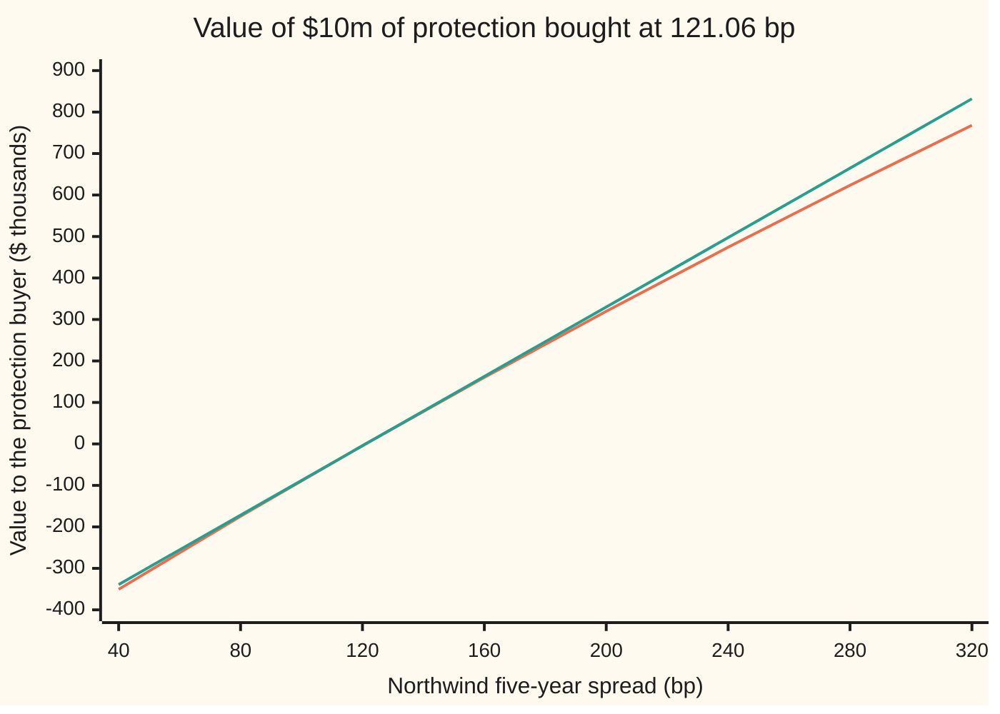

# CDS risk numbers: CS01, jump-to-default, recovery and rate sensitivity, and the carry of a position

Financial mathematics → Credit Default Swaps - Pricing, the Par Spread and the Hazard Behind It → Sensitivities of a protection position → CDS risk numbers

---

## General Overview

A fund buys five years of protection on Northwind, a borrowing company, for $10 million of Northwind's debt. The contract is a credit default swap ([credit-default-swap-contract](01-credit-default-swap-contract.md)): the fund pays a premium every quarter while Northwind survives, and if Northwind defaults, the seller pays the fund the lost part of the $10 million. The fund bought at par, the premium rate that makes the trade worth nothing on day one: 121.06 basis points a year. A basis point, "bp", is a hundredth of a percent, so the premium is 1.2106% of $10 million a year, about $30,264 a quarter.

The trade is worth zero today. It will not stay there: Northwind's credit can worsen, it can default, the recovery assumption can be revised, rates can move, and the calendar moves every day. A risk desk wants one dollar figure for each, before the market moves rather than after.

The five figures are: **CS01**, dollars gained per basis point rise in Northwind's quoted spread, here $4,180; **jump-to-default**, dollars gained if Northwind defaults this instant, here $6 million; **recovery sensitivity** and **IR01** (interest-rate sensitivity), per percentage point of recovery and per basis point of rates, both zero on day one and tens or hundreds of dollars later; and the **carry and roll-down** of a quarter, the premium paid and the value drift as the contract shortens.

Every one of them is computed twice on this card: by moving the market and repricing (bump and revalue), and by differentiating the two leg formulas.

**A protection position is worth its notional times the risky annuity times the gap between today's spread and the contract's; each risk number is a way of moving the spread, the annuity or the default date, and at par the gap is zero, which is why CS01 is the notional times the annuity and the recovery and rate numbers vanish.**

**What kind of fact this is:** a method: five definitions and two ways of computing each. Inside the flat-hazard model three of its results are theorems, proved on this card in Why it works: CS01 at par equals notional times annuity, and recovery and rate sensitivities at par are zero.

### The picture: what the position is worth as Northwind's spread moves

Across the bottom, Northwind's quoted five-year spread in basis points; the fund's contract stays at 121.06 bp. Up the side, the position's value to the fund, in thousands of dollars.



The first line (orange) is the true value, repriced at each spread. The second (teal) is straight: CS01 alone, $4,181.94 for every basis point away from 121.06. They touch at par and the true value falls below the straight line on both sides, because the annuity shrinks as default grows likelier and swells as it grows rarer. At 200 bp the straight line says $330,138; the truth is $319,729.

---

## The formula

Notation first, in words. $N$ is the notional. $s_0$ is the spread written into the contract; $s$ is the par spread the market quotes today for the same remaining term. $A$ and $P$ are the two legs per dollar of notional, as priced in [cds-legs-risky-annuity-and-par-spread](02-cds-legs-risky-annuity-and-par-spread.md). Inside them, $\delta$ is a quarter, $D$ discounts, $Q$ is the chance Northwind survives, $\lambda$ is the hazard and $R$ the recovery; the table below gives each. The sum adds the premium dates one by one; the integral adds the chance of default over every instant.

$$V = N\,(P - s_0\,A), \qquad A = \sum_{j=1}^{n} \delta\,D(t_j)\,Q(t_j), \qquad P = (1-R)\int_0^T D(t)\,\lambda\,Q(t)\,dt$$

Since today's par spread is $s = P/A$ by definition, the value collapses to one line:

$$V = N\,A\,(s - s_0)$$

**Read it aloud:** the position is worth the notional, times the value of a premium of one a year paid while Northwind survives, times how far today's spread sits above the contract's.

The five risk numbers are defined by moving one input and repricing, with the market's quote held wherever it is not the thing moved:

| Number | Move | Holding fixed | Northwind at par |
| --- | --- | --- | --- |
| CS01 | quoted spread $s$ up 1 bp | recovery, rates | $4,180.23 |
| Jump-to-default | default now | nothing | $6,000,000.00 |
| Recovery sensitivity ("Rec01") | recovery $R$ up 1 point | quoted spread | $0.00 |
| IR01 | riskless rate $r$ up 1 bp | quoted spread | $0.00 |
| Carry, per quarter | one premium | nothing | −$30,264.04 |

| Symbol | Plain meaning | In our example | Push it up and the answer… |
| --- | --- | --- | --- |
| $N$ | notional: the debt the protection covers | $10,000,000 | every dollar figure scales with it |
| $V$ | value of the position to the protection buyer | $0 on day one | — |
| $A$ | risky annuity: value of 1 a year paid quarterly while Northwind survives | 4.181935 | CS01 rises with it |
| $P$ | protection leg: value of the default payout, per $1 | 0.050625 | $V$ rises |
| $s$ | market par spread today for the remaining term | 121.06 bp | $V$ rises about CS01 per bp |
| $s_0$ | contract spread, fixed at the trade | 121.06 bp | $V$ falls |
| $\lambda$ | hazard ("lambda"): chance of default per year among survivors | 2%; 3.30% at 200 bp | $A$ falls |
| $R$ | recovery: fraction of notional recovered on default | 40% | jump-to-default falls $100,000 per point |
| $r$ | riskless rate, continuously compounded | 5% | $A$ falls a little |
| $T$, $\delta$, $t_j$ | years left; the quarter each premium covers; the premium dates | 5; 0.25; 0.25 to 5, twenty dates | — |
| $D(t)$, $Q(t)$ | discount factor $e^{-rt}$; survival chance $e^{-\lambda t}$ | — | — |
| $k$, $G$ | the combined shrink rate $r + \lambda$; $G = (1 - e^{-kT})/k$, the leg formulas' shared factor | 0.07 | — |

### When it holds

- **One flat hazard, re-implied at every bump.** The desk turns each quote into a hazard with a root finder ([implied-hazard-from-a-cds-quote](04-implied-hazard-from-a-cds-quote.md)). With a full curve of quotes the same definitions apply tenor by tenor ([bootstrapping-the-hazard-curve-from-cds-quotes](06-bootstrapping-the-hazard-curve-from-cds-quotes.md)); the zero recovery and rate numbers at par stay exact while the contract's maturity is a quoted tenor, and become small but not zero between tenors.
- **Recovery fixed in advance.** A default settles at an auction price, not at 40%. If the auction lands at 30%, jump-to-default is $100,000 bigger for each point below 40.
- **Default independent of rates.** If Northwind tends to default when rates rise, IR01 picks up a cross term this model does not have.
- **No accrued premium at default.** On day one nothing has accrued. Mid-quarter, jump-to-default also owes the seller the premium accrued since the last date.
- **Small moves.** CS01 is a slope. For a widening to 200 bp the straight line in the chart says $330,138.06 against a true $319,729.45.

Conventions verified 28 Sep 2026: single-name contracts now trade with a fixed coupon and an upfront payment, and the ISDA CDS Standard Model converts between upfront and spread quotes ([marking-a-cds-to-market-and-the-upfront](07-marking-a-cds-to-market-and-the-upfront.md)). This card bumps the quoted spread and reprices through its own flat-hazard pricer, the same idea on a smaller model.

---

## Why it works

### Step 0: the value is a spread gap times an annuity

Every premium the fund owes is $s_0$ a year, paid while Northwind survives, so the premium leg is $s_0 A$. Today's par spread $s$ is the premium that would make a new trade worth zero, so the protection leg is exactly $s \times A$. Subtract:

$$V = N(sA - s_0A) = N\,A\,(s - s_0).$$

This is the mark-to-market identity of [marking-a-cds-to-market-and-the-upfront](07-marking-a-cds-to-market-and-the-upfront.md). It holds for any hazard and any rates. Each risk number moves one factor: CS01 moves $s$; recovery and rates move $A$ while $s$ is held; the calendar shortens $A$ and slides $s$ along the curve; default ends the contract.

### Step 1: CS01 at par is the notional times the annuity

Differentiate $V = NA(s - s_0)$ with respect to $s$. The product rule gives two terms:

$$\frac{dV}{ds} = N\,A + N\,(s - s_0)\,\frac{dA}{ds}.$$

At par, $s = s_0$, so the second term is multiplied by zero. CS01 is $N \times A \times$ 1 bp: 10,000,000 × 4.181935 × 0.0001 = **$4,181.94**.

The desk's report uses a one-sided bump: reprice at 122.06 bp. That gives $4,180.23, a little less. The reason is the second term. As the spread rises, the implied hazard rises, survival falls, and the annuity shrinks, so each further basis point is worth slightly less than the one before. Far from par the effect is large. The same contract is worth $3,921.25 a basis point once Northwind trades at 200 bp and $2,430.14 at 800 bp: at high spreads the premiums are unlikely to be paid for long, so a basis point of them is worth little.

The analytic road needs one more step, because the pricer takes a hazard, not a spread. Move the hazard $\lambda$ a little and both $V$ and $s$ move; divide one change by the other:

$$\text{CS01} = \frac{\partial V/\partial\lambda}{\partial s/\partial\lambda} \times 1\text{ bp}.$$

Both pieces come from differentiating the leg formulas; the folded proof below writes them out. At par the ratio reduces exactly to $N \times A$, which the code checks against the central bump to the cent.

### Step 2: jump-to-default is the payout minus what is lost

If Northwind defaults this instant, the premiums stop and the seller pays $(1-R)N$ = **$6,000,000**. The position that was worth $V$ disappears. So

$$\text{JTD} = (1 - R)\,N - V \;(+\text{ premium accrued, owed to the seller}).$$

On day one $V$ = 0 and nothing has accrued, so jump-to-default is the full $6 million. After the widening to 200 bp the position is already worth $319,729.45, and default adds only $5,680,270.55 on top: part of the default is already in the price.

The second road makes the hazard absurdly large, ten million a year, so default is certain within the first instant, and reprices the contract normally. It lands at $5,999,999.97. The few missing cents are the discounting of the tiny delay before that default.

Recovery enters jump-to-default directly: each point of recovery takes $100,000 off it. That is the only place where the recovery guess moves the position one for one.

### Step 3: recovery and rates act only through the annuity, and at par they are multiplied by zero

Hold the market's quote $s$ fixed and raise the recovery $R$. The quote no longer fits the old hazard, so the desk re-implies it: with less lost per default, the market must be expecting more defaults, and the hazard rises. That lowers $A$. In $V = NA(s - s_0)$ nothing else moves.

At par, $s - s_0 = 0$, so the change in $A$ is multiplied by zero. **Rec01 at par is exactly $0.00.** The same argument covers rates: a higher $r$ shrinks $A$ and nothing else, and IR01 at par is $0.00.

Off par the gap is not zero. After Northwind widens to 200 bp the fund's position is worth $319,729.45. One more point of recovery, with the 200 bp quote held, raises the implied hazard and costs $429.55. One more basis point of rates costs $78.11. Both are small: the spread gap is under one percent and the annuity moves by a sliver.

<details>
<summary>Detailed proof: the three sensitivities from the leg formulas</summary>

With a flat hazard and $k = r + \lambda$, the legs are
$$A = \sum_{j=1}^{n}\delta\,e^{-k t_j}, \qquad P = (1-R)\,\lambda\,G, \qquad G = \frac{1 - e^{-kT}}{k}.$$
Both $A$ and $G$ depend on $r$ and $\lambda$ only through $k$, so
$$\frac{\partial A}{\partial \lambda} = \frac{\partial A}{\partial r} = -\sum_{j}\delta\,t_j\,e^{-k t_j}, \qquad G' = \frac{T e^{-kT}}{k} - \frac{G}{k}.$$
The protection leg's derivatives follow: $\partial P/\partial\lambda = (1-R)(G + \lambda G')$, $\partial P/\partial r = (1-R)\lambda G'$, $\partial P/\partial R = -P/(1-R)$. The par spread $s = P/A$ has derivatives by the quotient rule, for example $\partial s/\partial\lambda = (A\,\partial P/\partial\lambda - P\,\partial A/\partial\lambda)/A^2$.

Hold the quote: for any input $x$ (spread, rate or recovery) the hazard must move so that $s$ stays put, which needs $d\lambda/dx = -(\partial s/\partial x)/(\partial s/\partial\lambda)$. The value $V = N(P - s_0 A)$ then changes by
$$\frac{dV}{dx} = \frac{\partial V}{\partial x} + \frac{\partial V}{\partial \lambda}\,\frac{d\lambda}{dx}, \qquad \frac{\partial V}{\partial \lambda} = N\Big(\frac{\partial P}{\partial\lambda} - s_0\,\frac{\partial A}{\partial\lambda}\Big).$$
At par, $s_0 = P/A$, so $\partial V/\partial\lambda = N A\,\partial s/\partial\lambda$. Substituting: the CS01 ratio becomes $N \times A$; for rates, $\partial V/\partial r = NA\,\partial s/\partial r$ cancels the second term exactly; for recovery, $\partial V/\partial R = -NP/(1-R) = NA\,\partial s/\partial R$ cancels likewise. Off par none of these cancellations happens, and the code evaluates the formulas as written.

</details>

### Step 4: carry and roll-down are what a quarter does

A quarter passes with no default and no change in the market. Two things happen.

**Carry.** The fund pays one premium: $s_0 N \delta$ = $30,264.04. That is the cost of holding the protection. It is not wasted: in expectation the protection pays $(1-R)N(1 - Q(0.25))$ = $29,925.12 in that same quarter, the payout times the chance default lands in it.

**Roll-down.** The contract now has 4.75 years left and is priced off the 4.75-year point of the same curve. On a flat hazard curve the par spread is the same for every quarterly maturity, 121.06 bp, so roll-down is **$0.00**. On a rising curve the 4.75-year spread is below the 5-year one, the contract's 121.06 bp now sits above the market, and the protection buyer loses. The protection seller gains the same amount.

<details>
<summary>Why a flat curve has no roll-down at all</summary>

With a flat hazard, $A = \delta\,e^{-k\delta}(1 - e^{-kT})/(1 - e^{-k\delta})$ and $P = (1-R)\lambda(1 - e^{-kT})/k$. Both carry the same factor $1 - e^{-kT}$, which is the only place $T$ appears, so their ratio $s$ does not depend on the maturity. Any whole number of quarters gives 121.06 bp.

</details>

The bump road is the general one: it needs only a pricer, so it works unchanged on a bootstrapped curve or a simulated pricer, where no derivative formula is written down ([bump-and-revalue-and-common-random-numbers](../07-Greeks%20by%20Numbers%20and%20Calibration/01-bump-and-revalue-and-common-random-numbers.md)).

---

## Worked numbers, by hand

Northwind: $10m of protection, five years, quarterly premiums, hazard 2%, recovery 40%, rate 5%, bought at par.

| Step | Arithmetic | Value |
| --- | --- | --- |
| risky annuity $A$ | twenty quarterly survival-weighted discounts | 4.181935 |
| protection leg $P$ | $0.6 \times 0.02 \times (1 - e^{-0.35})/0.07$ | 0.050625 |
| contract spread $s_0 = P/A$ | $0.050625 / 4.181935$ | 121.06 bp |
| **CS01 at par** | $N \times A \times$ 1 bp $= 10{,}000{,}000 \times 4.181935 \times 0.0001$ | **$4,181.94** |
| CS01, one-sided bump | reprice at 122.06 bp | $4,180.23 |
| **jump-to-default** | $(1 - 0.4) \times 10{,}000{,}000 - 0$ | **$6,000,000** |
| Rec01 and IR01 at par | $NA \times (s - s_0) \times$ anything | **$0.00** |
| **carry, per quarter** | $0.012106 \times 10{,}000{,}000 \times 0.25$ | **$30,264.04** |
| roll-down, flat curve | 4.75-year par spread is still 121.06 bp | $0.00 |

A desk holding this trade reports: it gains about $4,180 per basis point Northwind widens, $6 million if Northwind defaults, nothing from a recovery or rate revision today, and pays $30,264 a quarter to keep it.

### What breaks if you drop a piece

| Mistake | Comes out at | What went wrong |
| --- | --- | --- |
| Recovery bumped with the hazard held | −$8,437.48 (right: $0.00) | Moved the protection leg alone; the market's quote pins the hazard, so it must be re-implied |
| IR01 with the hazard held | $6.35 (right: $0.00) | Same error: a rate move with the quote fixed changes the hazard too |
| CS01 from the riskless annuity | $4,396.39 (right: $4,181.94) | Counted premiums in years Northwind may not survive |
| Value at 200 bp as CS01 times the move | $330,138.06 (right: $319,729.45) | CS01 is a slope; the annuity shrinks as the spread widens |
| Jump-to-default at 200 bp as $(1-R)N$ | $6,000,000 (right: $5,680,270.55) | Forgot the value already on the books |

Every number in that table is printed by the code below.

---

## A quarter later: carry and roll-down on a rising curve

The mystery: the market does nothing for three months, Northwind does not default, and the fund is down. Two pieces explain it.

Take a rising curve for Northwind instead of the flat one: four-year protection quotes 100 bp, five-year stays at 121.06 bp, so the fund still trades at par. The hazard behind that curve is 1.65% a year for the first four years and 3.66% in the fifth. A quarter later, the fund's contract has 4.75 years left, and on the unchanged curve 4.75-year protection quotes 116.66 bp.

| | Flat curve | Rising curve |
| --- | --- | --- |
| Par spread for 4.75 years | 121.06 bp | 116.66 bp |
| Carry paid by the buyer | $30,264.04 | $30,264.04 |
| Roll-down to the buyer | $0.00 | −$17,742.91 |
| Expected default payout in the quarter, flat curve | $29,925.12 | — |

One force at a time, for the protection buyer, one block per $1,000:

```
quarter's cost to the buyer   one block = $1,000
carry, either curve        ██████████████████████████████  $30,264.04
roll-down, flat curve                                      $0.00
roll-down, rising curve    ██████████████████              $17,742.91
```

On a rising curve carry and roll-down both run against the protection buyer, and both are income to the protection seller. On an inverted curve, a distressed name whose near-term spread sits above the long one, roll-down turns in the buyer's favour.

How CS01 itself moves as Northwind's spread moves, one block per $100 of CS01:

```
market spread    CS01 of the 121.06 bp contract   one block = $100
121.06 bp   ██████████████████████████████████████████  $4,181.94
   200 bp   ███████████████████████████████████████     $3,921.25
   400 bp   █████████████████████████████████           $3,336.12
   800 bp   ████████████████████████                    $2,430.14
```

Wider spreads mean shorter expected premium streams, so each basis point matters less. A hedge sized at par is too big once the name has widened.

---

## Code, from first principles, and it actually runs

The code prices the two legs in closed form, then finds each risk number by two roads. Road one bumps the market: move the quote, the rate or the recovery, re-imply the flat hazard with a bisection root finder, and reprice. Road two differentiates the leg formulas and applies the chain rule of the Detailed proof. A third road for the pricer itself integrates the default density by Simpson's rule, and a fourth for jump-to-default reprices at a hazard so large that default is immediate. Nothing imported knows a CDS.

### Python

```python
# CDS risk numbers -- the check behind the card.  Standard library only.
# Northwind: $10m of five-year protection bought at par, quarterly premiums,
# hazard 2% flat, recovery 40%, riskless rate 5%.  Each risk number is found
# twice: move the market and revalue, and differentiate the leg formulas.
from math import exp

N, T, DT, LAM, R, RATE, BP = 10_000_000.0, 5.0, 0.25, 0.02, 0.40, 0.05, 1e-4
FAR = 1e9                                        # "for ever": the last knot of every curve

def flat(h):
    return [(FAR, h)]

def surv(curve, t):                              # Q(t): survival, curve = [(end year, hazard)]
    area, a = 0.0, 0.0
    for b, h in curve:
        area += h * (min(t, b) - a)
        if t <= b:
            break
        a = b
    return exp(-area)

def annuity(curve, mat, r):                      # A: 1 a year, paid quarterly while alive
    return sum(DT * exp(-r * t) * surv(curve, t) for t in [DT * (j + 1) for j in range(round(mat / DT))])

def protection(curve, mat, r, rec):              # road 1 for P: closed form, knot to knot
    total, a = 0.0, 0.0
    for b, h in curve:
        e, k = min(b, mat), r + h
        total += (1 - rec) * h / k * exp(-r * a) * surv(curve, a) * (1 - exp(-k * (e - a)))
        if b >= mat:
            break
        a = b
    return total

def simpson(f, a, b, n=400):                     # area under f from a to b, n even
    step = (b - a) / n
    return step / 3 * (f(a) + f(b) + sum((4 if i % 2 else 2) * f(a + i * step) for i in range(1, n)))

def protection_simpson(curve, mat, r, rec):      # road 2 for P: integrate the default density
    total, a = 0.0, 0.0
    for b, h in curve:
        e = min(b, mat)
        total += (1 - rec) * simpson(lambda t: h * exp(-r * t) * surv(curve, t), a, e)
        if b >= mat:
            break
        a = b
    return total

def value(curve, mat, r, rec, s0, prot=protection):   # buyer's value: protection minus premiums
    return N * (prot(curve, mat, r, rec) - s0 * annuity(curve, mat, r))

def par(curve, mat, r, rec):
    return protection(curve, mat, r, rec) / annuity(curve, mat, r)

def bisect(f, lo, hi):                           # root finder: halve the bracket 100 times
    for _ in range(100):
        mid = 0.5 * (lo + hi)
        lo, hi = (mid, hi) if f(lo) * f(mid) > 0 else (lo, mid)
    return 0.5 * (lo + hi)

def implied(s, r, rec, mat=T):                   # the flat hazard that reprices a quote
    return bisect(lambda h: par(flat(h), mat, r, rec) - s, 1e-9, 3.0)

def bumped(s_mkt, s0):                           # road 1: move the market, re-imply, revalue
    v = lambda s, r, rec: value(flat(implied(s, r, rec)), T, r, rec, s0)
    return (v(s_mkt + BP, RATE, R) - v(s_mkt, RATE, R),
            (v(s_mkt + BP, RATE, R) - v(s_mkt - BP, RATE, R)) / 2,
            (v(s_mkt, RATE + BP, R) - v(s_mkt, RATE - BP, R)) / 2,
            (v(s_mkt, RATE, R + 0.01) - v(s_mkt, RATE, R - 0.01)) / 2)

def analytic(lam, s0, r=RATE, rec=R):            # road 2: derivatives of the flat-hazard legs
    k, ts = r + lam, [DT * (j + 1) for j in range(round(T / DT))]
    A = sum(DT * exp(-k * t) for t in ts)
    A_k = -sum(DT * t * exp(-k * t) for t in ts)            # dA/dlambda = dA/dr
    G = (1 - exp(-k * T)) / k
    G_k = T * exp(-k * T) / k - G / k
    P, P_lam, P_r = (1 - rec) * lam * G, (1 - rec) * (G + lam * G_k), (1 - rec) * lam * G_k
    s_lam, s_r, s_rec = (P_lam * A - P * A_k) / A ** 2, (P_r * A - P * A_k) / A ** 2, -P / A / (1 - rec)
    V_lam = N * (P_lam - s0 * A_k)
    return (V_lam / s_lam * BP, (N * (P_r - s0 * A_k) - V_lam * s_r / s_lam) * BP,
            (-N * P / (1 - rec) - V_lam * s_rec / s_lam) * 0.01, N * A * BP)

A0, P0 = annuity(flat(LAM), T, RATE), protection(flat(LAM), T, RATE, R)
s0 = P0 / A0                                     # the contract spread, fixed from today on
cs_up, cs_c, ir_c, rec_c = bumped(s0, s0)
cs_a, ir_a, rec_a, cs_nA = analytic(LAM, s0)
V_dead = value(flat(1e7), T, RATE, R, s0)        # hazard so large that default is immediate
lam200 = implied(0.02, RATE, R)
V200 = value(flat(lam200), T, RATE, R, s0)
_, w_c, w_ir, w_rec = bumped(0.02, s0)
w_cs_a, w_ir_a, w_rec_a, _ = analytic(lam200, s0)
lam1 = implied(0.01, RATE, R, 4.0)               # rising curve: 4y quotes 100 bp, 5y at s0
lam2 = bisect(lambda h: par([(4.0, lam1), (FAR, h)], T, RATE, R) - s0, 1e-9, 3.0)
rise = [(4.0, lam1), (FAR, lam2)]
rows = [("risky annuity A", A0, 6), ("protection leg P per $1", P0, 6), ("contract spread s0, bp", s0 / BP, 4),
        ("CS01 bump +1bp", cs_up, 2), ("CS01 bump +-1bp", cs_c, 2), ("CS01 derivative", cs_a, 2),
        ("  N x A x 1bp", cs_nA, 2), ("IR01 bump +-1bp", ir_c, 2), ("IR01 derivative", ir_a, 2),
        ("Rec01 bump +-1pt", rec_c, 2), ("Rec01 derivative", rec_a, 2),
        ("JTD (1-R)N - V", N * (1 - R) - value(flat(LAM), T, RATE, R, s0), 2), ("JTD hazard 1e7", V_dead, 2),
        ("JTD per recovery point", -N * 0.01, 2),
        ("widened: hazard at 200 bp", lam200, 6), ("widened: value V", V200, 2),
        ("widened: value, Simpson", value(flat(lam200), T, RATE, R, s0, protection_simpson), 2),
        ("widened: CS01 bump +-1bp", w_c, 2), ("widened: CS01 derivative", w_cs_a, 2),
        ("widened: IR01 bump +-1bp", w_ir, 2), ("widened: IR01 derivative", w_ir_a, 2),
        ("widened: Rec01 bump +-1pt", w_rec, 2), ("widened: Rec01 derivative", w_rec_a, 2),
        ("widened: JTD", N * (1 - R) - V200, 2), ("widened: JTD hazard 1e7", V_dead - V200, 2),
        ("carry paid per quarter", s0 * N * DT, 2), ("expected payout, first quarter", N * (1 - R) * (1 - surv(flat(LAM), DT)), 2),
        ("flat: par spread 4.75y, bp", par(flat(LAM), 4.75, RATE, R) / BP, 4),
        ("flat: roll-down", value(flat(LAM), 4.75, RATE, R, s0), 2),
        ("rising: hazard to 4y", lam1, 6), ("rising: hazard 4y to 5y", lam2, 6),
        ("rising: par spread 4.75y, bp", par(rise, 4.75, RATE, R) / BP, 4),
        ("rising: roll-down", value(rise, 4.75, RATE, R, s0), 2),
        ("rising: roll-down, Simpson", value(rise, 4.75, RATE, R, s0, protection_simpson), 2),
        ("wrong: Rec01 hazard held", value(flat(LAM), T, RATE, R + 0.01, s0) - value(flat(LAM), T, RATE, R, s0), 2),
        ("wrong: IR01 hazard held", value(flat(LAM), T, RATE + BP, R, s0) - value(flat(LAM), T, RATE, R, s0), 2),
        ("wrong: CS01, riskless annuity", N * BP * annuity(flat(0.0), T, RATE), 2),
        ("wrong: V at 200 bp from CS01", cs_a * (0.02 - s0) / BP, 2)]
for name, v, d in rows:
    print(f"{name:<32}{(v if abs(v) >= 0.5 * 10 ** -d else 0.0):>18.{d}f}")
print()
spreads = [40, 80, 120, 160, 200, 240, 280, 320]
print("chart, 5y spread bp  " + "".join(f"{s:>9d}" for s in spreads))
print("chart, value $k      " + "".join(f"{value(flat(implied(s * BP, RATE, R)), T, RATE, R, s0) / 1e3:>9.2f}" for s in spreads))
print("chart, CS01 line $k  " + "".join(f"{cs_a * (s * BP - s0) / BP / 1e3:>9.2f}" for s in spreads))
for s in (200, 400, 800):
    lam_s = implied(s * BP, RATE, R)
    print(f"bars, CS01 at {s:>3d} bp  bump {bumped(s * BP, s0)[1]:>10.2f}  derivative {analytic(lam_s, s0)[0]:>10.2f}")
assert abs(cs_c - cs_a) < 0.01, "CS01: central bump vs derivative of the legs"
assert abs(cs_a - cs_nA) < 1e-6, "CS01 at par: derivative vs N x A x 1bp"
assert abs(w_ir - w_ir_a) < 0.01, "IR01, widened: bump vs derivative"
assert abs(w_rec - w_rec_a) < 0.5, "Rec01, widened: bump vs derivative (bump is 1 point wide)"
assert abs(N * (1 - R) - V_dead) < 1.0, "JTD: formula vs revalue at an immediate default"
assert max(abs(ir_c), abs(ir_a), abs(rec_c), abs(rec_a)) < 0.01, "at par: IR01 and Rec01 vanish, both roads"
assert abs(V200 - value(flat(lam200), T, RATE, R, s0, protection_simpson)) < 0.01, "value at 200 bp, two roads"
assert abs(par(flat(LAM), 4.75, RATE, R) - s0) < 1e-12, "flat curve: par spread does not depend on maturity"
assert w_c < cs_up < cs_c, "CS01 falls as the spread widens"
assert abs(value(rise, 4.75, RATE, R, s0) - value(rise, 4.75, RATE, R, s0, protection_simpson)) < 0.01, "roll-down, two roads"
print("ALL CHECKS PASS")
```

**Ran 2026-09-28 on macOS, Python 3.14.6, standard library only. All checks passed. Output, pasted from the run:**

```
risky annuity A                           4.181935
protection leg P per $1                   0.050625
contract spread s0, bp                    121.0562
CS01 bump +1bp                             4180.23
CS01 bump +-1bp                            4181.94
CS01 derivative                            4181.94
  N x A x 1bp                              4181.94
IR01 bump +-1bp                               0.00
IR01 derivative                               0.00
Rec01 bump +-1pt                              0.00
Rec01 derivative                              0.00
JTD (1-R)N - V                          6000000.00
JTD hazard 1e7                          5999999.97
JTD per recovery point                  -100000.00
widened: hazard at 200 bp                 0.032989
widened: value V                         319729.45
widened: value, Simpson                  319729.45
widened: CS01 bump +-1bp                   3921.25
widened: CS01 derivative                   3921.25
widened: IR01 bump +-1bp                    -78.11
widened: IR01 derivative                    -78.11
widened: Rec01 bump +-1pt                  -429.55
widened: Rec01 derivative                  -429.44
widened: JTD                            5680270.55
widened: JTD hazard 1e7                 5680270.52
carry paid per quarter                    30264.04
expected payout, first quarter            29925.12
flat: par spread 4.75y, bp                121.0562
flat: roll-down                               0.00
rising: hazard to 4y                      0.016528
rising: hazard 4y to 5y                   0.036608
rising: par spread 4.75y, bp              116.6571
rising: roll-down                        -17742.91
rising: roll-down, Simpson               -17742.91
wrong: Rec01 hazard held                  -8437.48
wrong: IR01 hazard held                       6.35
wrong: CS01, riskless annuity              4396.39
wrong: V at 200 bp from CS01             330138.06

chart, 5y spread bp         40       80      120      160      200      240      280      320
chart, value $k        -350.47  -174.61    -4.42   160.30   319.73   474.06   623.46   768.10
chart, CS01 line $k    -338.97  -171.69    -4.42   162.86   330.14   497.42   664.69   831.97
bars, CS01 at 200 bp  bump    3921.25  derivative    3921.25
bars, CS01 at 400 bp  bump    3336.12  derivative    3336.12
bars, CS01 at 800 bp  bump    2430.14  derivative    2430.14
ALL CHECKS PASS
```

### Rust

```rust
// CDS risk numbers -- the check behind the card.  Rust std only, no crates.
// Northwind: $10m of five-year protection bought at par, quarterly premiums,
// hazard 2% flat, recovery 40%, riskless rate 5%.  Each risk number is found
// twice: move the market and revalue, and differentiate the leg formulas.
const N: f64 = 10_000_000.0; const T: f64 = 5.0; const DT: f64 = 0.25;
const LAM: f64 = 0.02; const R: f64 = 0.40; const RATE: f64 = 0.05; const BP: f64 = 1e-4;
const FAR: f64 = 1e9; // "for ever": the last knot of every curve

type Curve = Vec<(f64, f64)>; // (end year, hazard)

fn flat(h: f64) -> Curve { vec![(FAR, h)] }

fn surv(curve: &Curve, t: f64) -> f64 {
    let (mut area, mut a) = (0.0, 0.0);
    for &(b, h) in curve {
        area += h * (t.min(b) - a);
        if t <= b { break; }
        a = b;
    }
    (-area).exp()
}

fn annuity(curve: &Curve, mat: f64, r: f64) -> f64 {
    let n = (mat / DT).round() as usize;
    (0..n).map(|j| DT * (j + 1) as f64).fold(0.0, |acc, t| acc + DT * (-r * t).exp() * surv(curve, t))
}

fn protection(curve: &Curve, mat: f64, r: f64, rec: f64) -> f64 {
    let (mut total, mut a) = (0.0, 0.0); // road 1 for P: closed form, knot to knot
    for &(b, h) in curve {
        let (e, k) = (b.min(mat), r + h);
        total += (1.0 - rec) * h / k * (-r * a).exp() * surv(curve, a) * (1.0 - (-k * (e - a)).exp());
        if b >= mat { break; }
        a = b;
    }
    total
}

fn simpson<F: Fn(f64) -> f64>(f: F, a: f64, b: f64, n: usize) -> f64 {
    let step = (b - a) / n as f64;
    let inner: f64 = (1..n).map(|i| (if i % 2 == 1 { 4.0 } else { 2.0 }) * f(a + i as f64 * step)).sum();
    step / 3.0 * (f(a) + f(b) + inner)
}

fn protection_simpson(curve: &Curve, mat: f64, r: f64, rec: f64) -> f64 {
    let (mut total, mut a) = (0.0, 0.0); // road 2 for P: integrate the default density
    for &(b, h) in curve {
        let e = b.min(mat);
        total += (1.0 - rec) * simpson(|t| h * (-r * t).exp() * surv(curve, t), a, e, 400);
        if b >= mat { break; }
        a = b;
    }
    total
}

type Leg = fn(&Curve, f64, f64, f64) -> f64;

fn value(curve: &Curve, mat: f64, r: f64, rec: f64, s0: f64, prot: Leg) -> f64 {
    N * (prot(curve, mat, r, rec) - s0 * annuity(curve, mat, r))
}

fn val(curve: &Curve, mat: f64, r: f64, rec: f64, s0: f64) -> f64 { value(curve, mat, r, rec, s0, protection) }

fn par(curve: &Curve, mat: f64, r: f64, rec: f64) -> f64 {
    protection(curve, mat, r, rec) / annuity(curve, mat, r)
}

fn bisect<F: Fn(f64) -> f64>(f: F, mut lo: f64, mut hi: f64) -> f64 {
    for _ in 0..100 {
        let mid = 0.5 * (lo + hi);
        if f(lo) * f(mid) > 0.0 { lo = mid; } else { hi = mid; }
    }
    0.5 * (lo + hi)
}

fn implied(s: f64, r: f64, rec: f64, mat: f64) -> f64 { // the flat hazard that reprices a quote
    bisect(|h| par(&flat(h), mat, r, rec) - s, 1e-9, 3.0)
}

fn bumped(s_mkt: f64, s0: f64) -> (f64, f64, f64, f64) {
    let v = |s: f64, r: f64, rec: f64| val(&flat(implied(s, r, rec, T)), T, r, rec, s0);
    (v(s_mkt + BP, RATE, R) - v(s_mkt, RATE, R),
     (v(s_mkt + BP, RATE, R) - v(s_mkt - BP, RATE, R)) / 2.0,
     (v(s_mkt, RATE + BP, R) - v(s_mkt, RATE - BP, R)) / 2.0,
     (v(s_mkt, RATE, R + 0.01) - v(s_mkt, RATE, R - 0.01)) / 2.0)
}

fn analytic(lam: f64, s0: f64, r: f64, rec: f64) -> (f64, f64, f64, f64) {
    let k = r + lam;
    let ts: Vec<f64> = (0..(T / DT).round() as usize).map(|j| DT * (j + 1) as f64).collect();
    let a = ts.iter().fold(0.0, |acc, t| acc + DT * (-k * t).exp());
    let a_k = -ts.iter().fold(0.0, |acc, t| acc + DT * t * (-k * t).exp()); // dA/dlambda = dA/dr
    let g = (1.0 - (-k * T).exp()) / k;
    let g_k = T * (-k * T).exp() / k - g / k;
    let (p, p_lam, p_r) = ((1.0 - rec) * lam * g, (1.0 - rec) * (g + lam * g_k), (1.0 - rec) * lam * g_k);
    let s_lam = (p_lam * a - p * a_k) / a.powi(2);
    let (s_r, s_rec) = ((p_r * a - p * a_k) / a.powi(2), -p / a / (1.0 - rec));
    let v_lam = N * (p_lam - s0 * a_k);
    (v_lam / s_lam * BP, (N * (p_r - s0 * a_k) - v_lam * s_r / s_lam) * BP,
     (-N * p / (1.0 - rec) - v_lam * s_rec / s_lam) * 0.01, N * a * BP)
}

fn main() {
    let (a0, p0) = (annuity(&flat(LAM), T, RATE), protection(&flat(LAM), T, RATE, R));
    let s0 = p0 / a0; // the contract spread, fixed from today on
    let (cs_up, cs_c, ir_c, rec_c) = bumped(s0, s0);
    let (cs_a, ir_a, rec_a, cs_na) = analytic(LAM, s0, RATE, R);
    let v_dead = val(&flat(1e7), T, RATE, R, s0); // hazard so large that default is immediate
    let lam200 = implied(0.02, RATE, R, T);
    let v200 = val(&flat(lam200), T, RATE, R, s0);
    let (_, w_c, w_ir, w_rec) = bumped(0.02, s0);
    let (w_cs_a, w_ir_a, w_rec_a, _) = analytic(lam200, s0, RATE, R);
    let lam1 = implied(0.01, RATE, R, 4.0); // rising curve: 4y quotes 100 bp, 5y at s0
    let lam2 = bisect(|h| par(&vec![(4.0, lam1), (FAR, h)], T, RATE, R) - s0, 1e-9, 3.0);
    let rise: Curve = vec![(4.0, lam1), (FAR, lam2)];
    let fl = flat(LAM);
    let roll = val(&rise, 4.75, RATE, R, s0);
    let roll_simp = value(&rise, 4.75, RATE, R, s0, protection_simpson);
    let rows: Vec<(&str, f64, usize)> = vec![
        ("risky annuity A", a0, 6), ("protection leg P per $1", p0, 6), ("contract spread s0, bp", s0 / BP, 4),
        ("CS01 bump +1bp", cs_up, 2), ("CS01 bump +-1bp", cs_c, 2), ("CS01 derivative", cs_a, 2),
        ("  N x A x 1bp", cs_na, 2), ("IR01 bump +-1bp", ir_c, 2), ("IR01 derivative", ir_a, 2),
        ("Rec01 bump +-1pt", rec_c, 2), ("Rec01 derivative", rec_a, 2),
        ("JTD (1-R)N - V", N * (1.0 - R) - val(&fl, T, RATE, R, s0), 2), ("JTD hazard 1e7", v_dead, 2),
        ("JTD per recovery point", -N * 0.01, 2),
        ("widened: hazard at 200 bp", lam200, 6), ("widened: value V", v200, 2),
        ("widened: value, Simpson", value(&flat(lam200), T, RATE, R, s0, protection_simpson), 2),
        ("widened: CS01 bump +-1bp", w_c, 2), ("widened: CS01 derivative", w_cs_a, 2),
        ("widened: IR01 bump +-1bp", w_ir, 2), ("widened: IR01 derivative", w_ir_a, 2),
        ("widened: Rec01 bump +-1pt", w_rec, 2), ("widened: Rec01 derivative", w_rec_a, 2),
        ("widened: JTD", N * (1.0 - R) - v200, 2), ("widened: JTD hazard 1e7", v_dead - v200, 2),
        ("carry paid per quarter", s0 * N * DT, 2), ("expected payout, first quarter", N * (1.0 - R) * (1.0 - surv(&fl, DT)), 2),
        ("flat: par spread 4.75y, bp", par(&fl, 4.75, RATE, R) / BP, 4),
        ("flat: roll-down", val(&fl, 4.75, RATE, R, s0), 2),
        ("rising: hazard to 4y", lam1, 6), ("rising: hazard 4y to 5y", lam2, 6),
        ("rising: par spread 4.75y, bp", par(&rise, 4.75, RATE, R) / BP, 4),
        ("rising: roll-down", roll, 2), ("rising: roll-down, Simpson", roll_simp, 2),
        ("wrong: Rec01 hazard held", val(&fl, T, RATE, R + 0.01, s0) - val(&fl, T, RATE, R, s0), 2),
        ("wrong: IR01 hazard held", val(&fl, T, RATE + BP, R, s0) - val(&fl, T, RATE, R, s0), 2),
        ("wrong: CS01, riskless annuity", N * BP * annuity(&flat(0.0), T, RATE), 2),
        ("wrong: V at 200 bp from CS01", cs_a * (0.02 - s0) / BP, 2),
    ];
    for (name, v, d) in &rows {
        let shown = if v.abs() >= 0.5 * 10f64.powi(-(*d as i32)) { *v } else { 0.0 };
        println!("{:<32}{:>18.*}", name, *d, shown);
    }
    println!();
    let spreads = [40i32, 80, 120, 160, 200, 240, 280, 320];
    let row = |f: &dyn Fn(i32) -> String| spreads.iter().map(|&s| f(s)).collect::<String>();
    println!("chart, 5y spread bp  {}", row(&|s| format!("{:>9}", s)));
    println!("chart, value $k      {}", row(&|s| format!("{:>9.2}",
        val(&flat(implied(s as f64 * BP, RATE, R, T)), T, RATE, R, s0) / 1e3)));
    println!("chart, CS01 line $k  {}", row(&|s| format!("{:>9.2}", cs_a * (s as f64 * BP - s0) / BP / 1e3)));
    for s in [200i32, 400, 800] {
        let lam_s = implied(s as f64 * BP, RATE, R, T);
        println!("bars, CS01 at {:>3} bp  bump {:>10.2}  derivative {:>10.2}", s,
                 bumped(s as f64 * BP, s0).1, analytic(lam_s, s0, RATE, R).0);
    }
    assert!((cs_c - cs_a).abs() < 0.01, "CS01: central bump vs derivative of the legs");
    assert!((cs_a - cs_na).abs() < 1e-6, "CS01 at par: derivative vs N x A x 1bp");
    assert!((w_ir - w_ir_a).abs() < 0.01, "IR01, widened: bump vs derivative");
    assert!((w_rec - w_rec_a).abs() < 0.5, "Rec01, widened: bump vs derivative (bump is 1 point wide)");
    assert!((N * (1.0 - R) - v_dead).abs() < 1.0, "JTD: formula vs revalue at an immediate default");
    assert!([ir_c, ir_a, rec_c, rec_a].iter().all(|x| x.abs() < 0.01), "at par: IR01 and Rec01 vanish, both roads");
    assert!((v200 - value(&flat(lam200), T, RATE, R, s0, protection_simpson)).abs() < 0.01, "value at 200 bp, two roads");
    assert!((par(&fl, 4.75, RATE, R) - s0).abs() < 1e-12, "flat curve: par spread does not depend on maturity");
    assert!(w_c < cs_up && cs_up < cs_c, "CS01 falls as the spread widens");
    assert!((roll - roll_simp).abs() < 0.01, "roll-down, two roads");
    println!("ALL CHECKS PASS");
}
```

**Ran 2026-09-28 on macOS, rustc 1.98.1, no crates. All checks passed. Output, pasted from the run:**

```
risky annuity A                           4.181935
protection leg P per $1                   0.050625
contract spread s0, bp                    121.0562
CS01 bump +1bp                             4180.23
CS01 bump +-1bp                            4181.94
CS01 derivative                            4181.94
  N x A x 1bp                              4181.94
IR01 bump +-1bp                               0.00
IR01 derivative                               0.00
Rec01 bump +-1pt                              0.00
Rec01 derivative                              0.00
JTD (1-R)N - V                          6000000.00
JTD hazard 1e7                          5999999.97
JTD per recovery point                  -100000.00
widened: hazard at 200 bp                 0.032989
widened: value V                         319729.45
widened: value, Simpson                  319729.45
widened: CS01 bump +-1bp                   3921.25
widened: CS01 derivative                   3921.25
widened: IR01 bump +-1bp                    -78.11
widened: IR01 derivative                    -78.11
widened: Rec01 bump +-1pt                  -429.55
widened: Rec01 derivative                  -429.44
widened: JTD                            5680270.55
widened: JTD hazard 1e7                 5680270.52
carry paid per quarter                    30264.04
expected payout, first quarter            29925.12
flat: par spread 4.75y, bp                121.0562
flat: roll-down                               0.00
rising: hazard to 4y                      0.016528
rising: hazard 4y to 5y                   0.036608
rising: par spread 4.75y, bp              116.6571
rising: roll-down                        -17742.91
rising: roll-down, Simpson               -17742.91
wrong: Rec01 hazard held                  -8437.48
wrong: IR01 hazard held                       6.35
wrong: CS01, riskless annuity              4396.39
wrong: V at 200 bp from CS01             330138.06

chart, 5y spread bp         40       80      120      160      200      240      280      320
chart, value $k        -350.47  -174.61    -4.42   160.30   319.73   474.06   623.46   768.10
chart, CS01 line $k    -338.97  -171.69    -4.42   162.86   330.14   497.42   664.69   831.97
bars, CS01 at 200 bp  bump    3921.25  derivative    3921.25
bars, CS01 at 400 bp  bump    3336.12  derivative    3336.12
bars, CS01 at 800 bp  bump    2430.14  derivative    2430.14
ALL CHECKS PASS
```

The two outputs agree line for line. The only visible gap between roads is Rec01 at 200 bp, $429.55 by bump against $429.44 by derivative: the bump spans a full recovery point each side, so it carries a little curvature.

> [!TIP]
> **Try changing**
> Guess first, then run it.
> - **Freeze the hazard.** In `bumped`, replace `flat(implied(s, r, rec))` with `flat(LAM)`. The spread bump now moves nothing, so CS01 prints $0.00, and Rec01 at par prints −$8,437.48, the hazard-held mistake. The first assert stops the run.
> - **One-sided or central.** Guess which row matches the derivative before reading: the central bump, $4,181.94; the one-sided `CS01 bump +1bp` sits just under, $4,180.23. The central one is the better slope; the one-sided one is what a desk sees when the quote really ticks up.
> - **Widen Northwind.** Guess CS01 at 800 bp before reading the `bars` rows: $2,430.14, not much over half the par figure.
> - **Flatten the curve.** Set the four-year quote in `lam1` from `0.01` to `s0`. Both hazards come out at 2% and roll-down falls to $0.00, the flat-curve row.

---

## The usual mistake

> [!warning]
> **Bumping recovery or rates while holding the hazard fixed.** The hazard is not observed; it is backed out of the quote. Raise recovery with the hazard frozen and the pricer says the protection lost $8,437.48, a loss the fund would never see: the market still quotes 121.06 bp, so the position is still at par. Every CDS risk number holds the quote and re-implies the hazard. A hazard-held number answers a different question: what a change of model does, not what the market does.
>
> - **Reading CS01 as fixed.** It is $4,181.94 at par and $2,430.14 at 800 bp. A hedge sized once and left alone is too big after a widening.
> - **Jump-to-default as the notional.** The payout is $(1-R)N$, $6 million, not $10 million; and a position already in profit gains less, $5,680,270.55 at 200 bp.
> - **Carry counted as a loss.** The $30,264.04 a quarter buys protection whose expected payout in the quarter is $29,925.12.
> - **Roll-down with the wrong sign.** On a rising curve the protection buyer loses roll-down, −$17,742.91 a quarter here; the seller earns it.

---

## Where you meet it in real life

- **The risk report of a credit desk.** CS01 and jump-to-default by borrower, summed across every bond, loan and swap on the same name, head the page.
- **Hedging a bond with protection.** A bond holder sizes protection so its CS01 offsets the bond's loss per basis point of widening; jump-to-default then says how well the pair survives an actual default.
- **Fixed-coupon trading.** Contracts trade at a standard coupon with an upfront payment ([marking-a-cds-to-market-and-the-upfront](07-marking-a-cds-to-market-and-the-upfront.md)), so a new trade is rarely at par, and its Rec01 and IR01 are small but not zero.
- **Recovery disputes.** A recovery revision barely moves a par trade but moves jump-to-default $100,000 per point on $10m; the assumption itself is examined in [recovery-assumptions-and-what-they-change](05-recovery-assumptions-and-what-they-change.md).
- **The quick estimate.** CS01 is often guessed as notional times years left times a basis point; the risky annuity, 4.18 rather than 5, corrects that guess for discounting and default. The spread-to-hazard link behind it is [the-credit-triangle](03-the-credit-triangle.md).

> **Say it back**
> A protection position is worth notional times risky annuity times the gap between today's spread and the contract's. CS01 moves the spread, and at par it is notional times annuity, about $4,180 a basis point on $10m of Northwind. Jump-to-default is the payout, $6 million, minus the value already held. Recovery and rate bumps hold the quote and move only the annuity, so at par they are zero. Each quarter the buyer pays the premium as carry, and on a rising curve loses roll-down too.

---

## What this builds on

- [marking-a-cds-to-market-and-the-upfront](07-marking-a-cds-to-market-and-the-upfront.md): the value $NA(s - s_0)$ that every risk number on this card differentiates.
- [bump-and-revalue-and-common-random-numbers](../07-Greeks%20by%20Numbers%20and%20Calibration/01-bump-and-revalue-and-common-random-numbers.md): shift an input, reprice, divide; and why a central bump beats a one-sided one.

## Where this goes next

- [credit-indices](../45-Portfolio%20Credit%20-%20Correlation%2C%20Copulas%2C%20Indices%20and%20Tranches/04-credit-indices.md): the same CS01 and jump-to-default summed over a basket of names traded as one contract.
- [cva-risk-numbers-and-hedging](../46-Counterparty%20Risk%20and%20CVA/06-cva-risk-numbers-and-hedging.md): the credit risk of the protection seller itself, hedged with the CS01 of this card.
- [market-implied-versus-historical-default-probability](09-market-implied-versus-historical-default-probability.md): why the 2% hazard behind every number here is not the rate at which companies like Northwind actually default.

---

## Sources

Verified 28 Sep 2026: every link below resolves to the publisher's page.

- O'Kane, Dominic. "CDS Risk Management." Chapter 8 of *Modelling Single-name and Multi-name Credit Derivatives*. Wiley, 2008. [doi:10.1002/9781119201960.ch8](https://doi.org/10.1002/9781119201960.ch8). Spread, recovery and interest-rate sensitivities of a CDS and the risky PV01, as practitioners compute them.
- Hull, John, and Alan White. "Valuing Credit Default Swaps I: No Counterparty Default Risk." *Journal of Derivatives* 8, no. 1 (2000): 29–40. [doi:10.3905/jod.2000.319115](https://doi.org/10.3905/jod.2000.319115). The two-leg valuation that every bump on this card reprices.
- ISDA. *CDS Standard Model*. [cdsmodel.com](https://www.cdsmodel.com/). The open-source calculator converting fixed-coupon upfronts to spreads; source of the conventions line.
- Hull, John C. *Options, Futures, and Other Derivatives*, 11th ed. Pearson. [Publisher page](https://www.pearson.com/en-us/subject-catalog/p/options-futures-and-other-derivatives/P200000005938/9780136939979). The textbook chapter on credit default swaps and their valuation.
