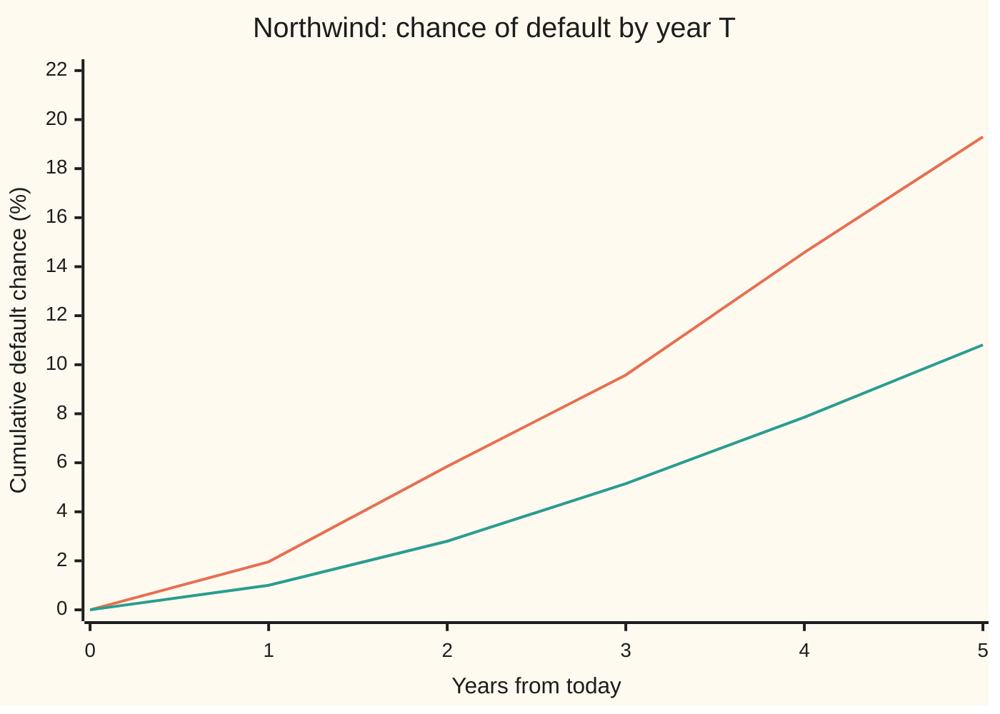

# Two default probabilities: what history shows and what the market charges, and why both are right

[Syllabus](../../../SYLLABUS.md) → [Financial mathematics](../README.md) → [Credit Default Swaps - Pricing, the Par Spread and the Hazard Behind It](../README.md#s42) → Two default probabilities

---

## General Overview

Northwind Lines runs ferries and borrows by selling bonds. Protection against its default trades as a credit default swap (CDS): a contract that pays the lost part of $10 million of bonds if Northwind fails, in return for a yearly fee. Today the fee is 120 basis points (hundredths of a percent) a year for one year of protection, 200 for three years and 250 for five. Turn those three prices into a curve of default chances, as the bootstrapping card does, and the curve says Northwind has a **19.30%** chance of defaulting within five years.

A rating agency grades Northwind in its Solid grade. Its records say that borrowers starting in that grade default within five years **10.81%** of the time.

Same borrower, same five years, two numbers almost a factor of two apart. Neither is a mistake. They answer different questions.

A car insurer makes a useful first picture. The premium a driver pays is more than the claims that driver is expected to cause. Someone reading the premium backwards, as if it were pure claims cost, would conclude that drivers crash more often than they do. The extra is not a forecast of more crashes. It is the price of carrying the risk. From here on that extra is called by its finance name: the **risk premium**.

The CDS fee works the same way. Read backwards through a pricing model, it gives a default chance that includes the risk premium. That number is the **market-implied**, or **risk-neutral**, default probability. The rating table's number counts what actually happened to similar borrowers: the **historical**, or **real-world**, default probability. The standard way to compare them is by hazard (the default rate per year among survivors): Northwind's market hazard averages 4.29% a year, its historical one 2.29%, a **hazard ratio** of 1.87.

**The market's default probability is the historical one reweighted toward the states where losses hurt most, so it comes out higher; use the market number to price and hedge, the historical number to forecast and hold capital, and read the gap between them as the price of bearing default risk.**

**What kind of fact this is:** a model comparison. Each number is the output of a model (a bootstrap with an assumed recovery, a rating table with an assumed Markov structure), so the size of the gap is a measurement, not a law. One theorem sits inside: a pricing probability is a real-world probability reweighted by state prices, proved on this card in Why it works.

### The picture: two curves of default by year



Orange: the market-implied curve, bootstrapped from the 120, 200 and 250 bp quotes. Green: the historical curve, from the rating table's Solid row. The orange curve sits above the green one at every horizon. The gap widens in percentage points and stays near a factor of two in hazard terms.

---

## The formula

Notation first, in words. Two probability laws are in play. $\mathbb{P}$ ("blackboard P") is the **real-world law**: how often things actually happen. $\mathbb{Q}$ is the **pricing law**: the weights that make average discounted payoffs equal today's prices. $S(T)$ is the chance of surviving past year $T$, with a subscript saying under which law.

The comparison is made on hazards, not on probabilities. First turn each five-year survival into its **average hazard**:

$$\bar h(T) = -\frac{\ln S(T)}{T}$$

**Read it aloud:** the average hazard is the flat yearly default rate that would leave the same fraction of survivors after $T$ years.

Then take the ratio:

$$\rho(T) = \frac{\bar h_{\mathbb{Q}}(T)}{\bar h_{\mathbb{P}}(T)} = \frac{\ln S_{\mathbb{Q}}(T)}{\ln S_{\mathbb{P}}(T)}$$

**Read it aloud:** the hazard ratio is how many times faster the market assumes the borrower dies than history does, on average over the horizon.

The same gap in the CDS market's own units is a spread:

$$\text{risk premium} = s - s_{\mathbb{P}}$$

**Read it aloud:** the premium is the quoted spread minus the spread that would just pay for historical losses. Here $s_{\mathbb{P}}$ is the **actuarial spread**: the par spread of the same contract priced with the historical survival curve in place of the market one.

Behind all three sits one identity. Take any event $A$ at the horizon, such as "Northwind has defaulted". Write $\mathbf{1}_A$ for its indicator (1 if $A$ happens, 0 if not), $\mathbb{E}_{\mathbb{P}}$ for an average under the real-world law, and $M$ for the **pricing weight**: what a dollar paid in a given future state costs today, per unit of that state's real-world chance.

$$\mathbb{Q}(A) = \frac{\mathbb{E}_{\mathbb{P}}[M\,\mathbf{1}_A]}{\mathbb{E}_{\mathbb{P}}[M]}$$

**Read it aloud:** the pricing chance of an event is its real-world chance, weighted by how much a dollar is worth in the states where it happens.

| Symbol | Plain meaning | In our example | Push it up and the answer… |
| --- | --- | --- | --- |
| $\mathbb{P}$, $\mathbb{Q}$ | the real-world law and the pricing law | rating table; CDS curve | — |
| $T$ | the horizon, in years | 5 | both default chances rise |
| $S_{\mathbb{Q}}$, $S_{\mathbb{P}}$ | chance of surviving past $T$ under each law | 0.807041; 0.891947 | a higher survival lowers that side's hazard |
| $H$ | cumulative hazard, $-\ln S$: the total default rate piled up to $T$ | 0.214381; 0.114349 | — |
| $h$, $\bar h$, $\bar h_{\mathbb{Q}}$, $\bar h_{\mathbb{P}}$ | a flat hazard; the average hazard, $H/T$, per year ("h bar") | 4.29%; 2.29% | — |
| $\rho$ | the hazard ratio ("rho") | 1.87 | a higher market hazard raises it |
| $\lambda_1$, $\lambda_2$, $\lambda_3$ | the bootstrapped market hazard on years 0–1, 1–3, 3–5 ("lambda") | 1.98%, 4.04%, 5.68% | — |
| $s$, $s_{\mathbb{P}}$ | the quoted 5-year spread; the actuarial spread from the historical curve | 250 bp; 133.56 bp | a higher quote raises the premium |
| $R$, $r$ | recovery (cents per dollar returned at default); the riskless rate | 40%; 5% | a higher assumed $R$ raises the market hazard |
| $M$, $m_A$, $\pi$ | the **pricing weight**: the state price $\pi$ (cost today of $1 paid in that state only) divided by that state's real-world chance; $m_A$ is its value in the states where $A$ happens | default states weigh 1.97 times survival states | the more it favours default states, the higher $\mathbb{Q}$ |
| $\mathbf{1}_A$, $A$, $\omega$, $\mathbb{E}_{\mathbb{P}}$, $D$ | the indicator of event $A$ (1 if it happens, 0 if not); the event; one future state ("omega"); the average under $\mathbb{P}$; $D = \mathbb{E}_{\mathbb{P}}[M]$, the discount factor | $A$ = defaulted by year 5 | — |

Conventions, as on the bootstrapping card, verified 2026-09-28: premiums paid quarterly at the end of each quarter, no premium accrued at default, recovery paid at the default time, flat riskless rate 5% continuously compounded. The traded contract also pays accrued premium on default; that moves the numbers in the second decimal, not the story.

### When it holds

- **Both numbers describe the same risk.** Same borrower (or truly comparable ones), same horizon, same definition of default. A rating table's "default" is a missed payment or bankruptcy; a CDS credit event also includes some restructurings. If the definitions differ, part of the gap is a definitions gap.
- **The recovery assumption is right.** The market number is only as good as the 40% fed into the bootstrap. Assume 20% and the five-year market default chance drops to 14.80%, the ratio to 1.40. The historical number does not move at all.
- **The spread is all default risk.** A CDS fee also pays for liquidity (the cost of trading in and out) and for the chance the protection seller fails. Every such non-default piece is read as default by the bootstrap and inflates the ratio.
- **The historical table fits today.** A table averaged over a cycle is too mild for a recession and too harsh for a boom. Measured against a table from the wrong regime, the ratio moves for reasons that have nothing to do with risk premia.
- **A single average is enough.** The ratio compares two averages over five years. Year by year it wanders between 1.65 and 2.20 here; nothing forces it to be constant.

---

## Why it works

### Step 0: a price is an average, weighted by what money is worth where it lands

A forecast weights each future by how likely it is. A price weights each future by how likely it is *and* by how much a dollar is worth there. A dollar that arrives in a recession, when firms are failing and cash is scarce, is worth more to its holder than a dollar in a boom. Default protection pays out mostly in bad states. So its price is higher than its expected payout, and any probability read backwards from that price is tilted toward default. Two questions, two sets of weights: that is the whole card. The rest makes it exact and measures it.

### Step 1: the market number comes from prices

The bootstrap finds, one tenor at a time, the flat hazard that makes the premium leg (the fees, paid while Northwind survives) equal the protection leg (60% of the $10m notional, the face amount protected, paid at default). The three quotes give $\lambda_1 = 1.98\%$ on year one, $\lambda_2 = 4.04\%$ on years one to three and $\lambda_3 = 5.68\%$ on years three to five. The cumulative hazard is the sum of rate times length:

$$H_{\mathbb{Q}}(5) = \lambda_1 \times 1 + \lambda_2 \times 2 + \lambda_3 \times 2 = 0.214381, \qquad S_{\mathbb{Q}}(5) = e^{-0.214381} = 0.807041.$$

Nothing in that calculation looked at how often ferry companies actually fail. It used prices, a recovery assumption and a discount rate. That is why the output is a $\mathbb{Q}$ number. How the bootstrap is done belongs to [Bootstrapping a hazard curve](06-bootstrapping-the-hazard-curve-from-cds-quotes.md); this card only uses its output.

### Step 2: the historical number comes from counting

The rating table records one year of grade moves for a population of borrowers: Solid borrowers stay Solid 90% of the time, slip to Shaky 9% and default 1%; Shaky ones climb back 10%, stay 80% and default 10%. Multiplying that table by itself five times, as [Rating transition matrices](../41-Default%2C%20Survival%20and%20the%20Hazard%20Rate/04-rating-transition-matrix-and-cumulative-default-rates.md) shows, gives the five-year default chance from Solid: 10.81%. Nothing in that calculation used a price. It counted. That is why it is a $\mathbb{P}$ number.

### Step 3: put them on one scale

Probabilities are awkward to compare directly: they cannot exceed 1, so ratios of them shrink as horizons grow. Hazards have no ceiling. Each survival converts to one average hazard, and only one:

- **Existence.** For any survival strictly between 0 and 1, the curve $e^{-hT}$ runs from 1 at $h = 0$ down toward 0 as $h$ grows, passing every value in between. Some $h$ hits it.
- **Uniqueness.** The curve only falls as $h$ grows, so it hits each value once.
- **Boundaries.** A survival of 1 (no defaults ever recorded) gives $\bar h_{\mathbb{P}} = 0$, and the ratio $\rho$ divides by zero: it is undefined. A survival of 0 needs an infinite hazard.

Taking logs gives the formula, and the ratio of two average hazards over the same $T$ is the ratio of two logs, because the $T$ cancels. For Northwind, $\rho(5) = 0.214381 / 0.114349 = 1.87$. The ratio of the two cumulative probabilities, 19.30% over 10.81%, is 1.79. That is a different number and not the hazard ratio.

### Step 4: why the market number is the bigger one

The state-prices card ([State prices](../03-Contracts%20and%20No-Arbitrage/07-state-prices-and-risk-neutral-pricing-in-one-period.md)) shows that, without arbitrage, every future state $\omega$ has a positive price $\pi(\omega)$: the cost today of $1 paid in that state and nowhere else. Divide by the state's real-world chance and the result is the pricing weight $M$. Normalise the state prices so they add to 1 and the result is $\mathbb{Q}$. That gives the identity in The formula, and one line of algebra turns it into

$$\mathbb{Q}(A) - \mathbb{P}(A) = \frac{\operatorname{Cov}_{\mathbb{P}}(M, \mathbf{1}_A)}{\mathbb{E}_{\mathbb{P}}[M]},$$

where $\operatorname{Cov}$ is the covariance: positive when $M$ tends to be high exactly when $A$ happens. **The pricing chance exceeds the real chance precisely when money is dear in the states where the event happens.** Defaults bunch in recessions; money is dear in recessions; so $\mathbb{Q}$(default) is above $\mathbb{P}$(default).

With just two states at year five, default and survival, the identity becomes a statement about odds:

$$\frac{\mathbb{Q}(A)}{1 - \mathbb{Q}(A)} = \frac{m_A}{m_{\text{not }A}} \times \frac{\mathbb{P}(A)}{1 - \mathbb{P}(A)},$$

with $m_A$ and $m_{\text{not }A}$ the pricing weights in the two states. For Northwind the market odds of default are 1.97 times the historical odds. Read literally: per unit of real-world chance, a dollar paid at year five in the world where Northwind has failed costs about twice as much as one paid in the world where it survives.

<details>
<summary>Detailed proof: the reweighting identity and its odds form</summary>

Take finitely many states, each with real-world chance $p(\omega) > 0$ and state price $\pi(\omega) > 0$. Define $M(\omega) = \pi(\omega)/p(\omega)$. Then $\mathbb{E}_{\mathbb{P}}[M] = \sum_\omega p(\omega) M(\omega) = \sum_\omega \pi(\omega)$, the price of $1 paid in every state: the discount factor. Define $\mathbb{Q}(\omega) = \pi(\omega)/\sum \pi$. Each $\mathbb{Q}(\omega)$ is positive and they add to 1, so $\mathbb{Q}$ is a probability law. For an event $A$, $\mathbb{Q}(A) = \sum_{\omega \in A} \pi(\omega) / \sum \pi = \mathbb{E}_{\mathbb{P}}[M \mathbf{1}_A] / \mathbb{E}_{\mathbb{P}}[M]$. That is the identity.

Covariance form: by definition $\operatorname{Cov}(M, \mathbf{1}_A) = \mathbb{E}[M \mathbf{1}_A] - \mathbb{E}[M]\,\mathbb{E}[\mathbf{1}_A]$, and $\mathbb{E}[\mathbf{1}_A] = \mathbb{P}(A)$. Divide by $\mathbb{E}[M]$ and rearrange.

Odds form: with two states, $A$ and not-$A$, $\mathbb{Q}(A) = p_A m_A / D$ and $1 - \mathbb{Q}(A) = (1 - p_A) m_{\text{not }A} / D$, where $D$ is the common denominator. Divide the first by the second; $D$ cancels.

What the identity does not say: a single CDS quote pins down one reweighted number, not the whole weighting $M$. Many different pricing weights give the same five-year $\mathbb{Q}$. The odds ratio 1.97 is the simplest weighting consistent with both numbers, not a measurement of the market's full pricing weight.

</details>

Why is $M$ high in default states? Three reasons, in order of what the evidence supports.

- **Default losses cluster in bad years.** Many firms fail together in recessions, recoveries are lower then, and investors' other wealth is down at the same time. A loss then hurts more than the same loss in a boom. This is systematic risk (risk that diversifying across many borrowers cannot remove), and investors demand pay for bearing it.
- **Jump-to-default risk.** A default is a sudden loss of 60 cents on the dollar. Even a diversified investor holds a finite number of names (borrowers) and cannot average the jumps away completely.
- **Non-default pieces read as default.** Liquidity costs, taxes on bond coupons and counterparty risk all widen spreads. A bootstrap that treats the whole spread as default risk inflates $\mathbb{Q}$ with them.

### Step 5: the gap in spread units

Price the same five-year contract with the historical survival curve in place of the market one: year-by-year historical hazards of 1.01%, 1.83%, 2.45%, 2.90% and 3.25%. The par spread comes out at 133.56 bp. That is the **actuarial spread**: the fee that would exactly pay for expected losses if history were the truth. The market charges 250 bp. The difference, 116.44 bp a year, is the risk premium in the CDS market's own units. Almost half of the fee is payment for bearing the risk, not for expected losses.

The quick version uses the credit triangle (spread ≈ hazard × loss fraction, from [The credit triangle](03-the-credit-triangle.md)): $(1 - R)(\bar h_{\mathbb{Q}} - \bar h_{\mathbb{P}}) = 0.6 \times (4.29\% - 2.29\%)$, which gives 120.04 bp. The triangle ignores discounting and the shape of the curve, so it lands a few basis points off the full repricing.

### The other door: the credit spread puzzle

Structural models of default ask the same question from the balance sheet: treat a firm's equity as a call option on its assets, calibrate to how often firms really default, and predict the spread. For investment-grade bonds the predicted spreads come out far below the observed ones. This shortfall is the **credit spread puzzle**. Huang and Huang (2012, in Sources) found that credit risk calibrated to historical defaults explains only a small part of investment-grade spreads and more of high-yield ones. Chen, Collin-Dufresne and Goldstein (2009) close much of the gap by making defaults and bad times arrive together, which is Step 4's covariance at work. Elton, Gruber, Agrawal and Mann (2001) attribute a large part of bond spreads to taxes and systematic risk rather than expected default. The puzzle is about bond spreads, not directly about this card's two numbers, but it is the same gap seen from another angle: prices charge for default risk more than default frequencies alone would.

---

## Worked numbers, by hand

Northwind: quotes 120, 200 and 250 bp at one, three and five years, recovery 40%, riskless rate 5%. Rating grade Solid.

| Step | Arithmetic | Value |
| --- | --- | --- |
| Market hazards from the bootstrap | $\lambda_1, \lambda_2, \lambda_3$ | 0.019826, 0.040440, 0.056837 |
| Market cumulative hazard, 5 years | $0.019826 \times 1 + 0.040440 \times 2 + 0.056837 \times 2$ | 0.214381 |
| Market survival | $e^{-0.214381}$ | 0.807041 |
| Market default chance | $1 - 0.807041$ | **19.30%** |
| Historical default chance | Solid row of the table to the fifth power | **10.81%** |
| Historical cumulative hazard | $-\ln(1 - 0.108053)$ | 0.114349 |
| Average hazards | $0.214381 / 5$ and $0.114349 / 5$ | 4.29% and 2.29% a year |
| Hazard ratio | $0.214381 / 0.114349$ | **1.87** |
| Actuarial spread | 5-year CDS priced on the historical curve | 133.56 bp |
| Risk premium | $250 - 133.56$ | **116.44 bp a year** |
| Pricing odds ratio | $\dfrac{0.192959 / 0.807041}{0.108053 / 0.891947}$ | 1.97 |

In the world: of 1,000 borrowers like Northwind, history expects about 108 to default within five years. The market charges as if 193 would. The difference is not a disagreement about the future; it is what investors charge to carry the risk.

### The ratio year by year

The five-year ratio is an average. Year by year, the market's hazard divided by history's:

```
year   market hazard / historical hazard, that year
   1   ████████████████████████████████████      1.97
   2   ████████████████████████████████████████  2.20
   3   ██████████████████████████████            1.65
   4   ████████████████████████████████████      1.96
   5   ████████████████████████████████          1.75
```

The market curve is flat on each quoted piece and jumps at years one and three. The historical curve climbs smoothly as Solid borrowers drift to Shaky. The ratio wobbles between them. Only the five-year average, 1.87, is a fair summary; the yearly numbers mostly reflect how the market curve was cut into pieces.

### What breaks if you drop a piece

| Mistake | Comes out at | What went wrong |
| --- | --- | --- |
| Mark the 250 bp protection with the historical curve | −$488,969.90 on $10m, on a trade done at market | The historical curve prices protection at 133.56 bp, so fair protection bought at 250 looks like a loss. It is not: it re-prices to zero on the market curve. |
| Forecast losses with the market curve | $1,157,754.85 expected loss (right: $648,318.66) | Uses a price as a forecast: expected losses overstated by 79% |
| Compare cumulative chances, 19.30 / 10.81 | 1.79 (right hazard ratio: 1.87) | Probabilities saturate at 1; ratios of them shrink with the horizon |
| Skip the bootstrap: triangle, 250 / 0.6 flat | 18.81% (right: 19.30%) | A flat hazard ignores the steep curve behind the 5-year quote |

---

## Code, from first principles, and it actually runs

The code builds the market curve two independent ways: exact leg formulas with bisection (halving an interval that must contain the root), and legs integrated by Simpson's rule with a secant root finder (following straight lines between two guesses). A third road simulates 200,000 default times from that curve with a hand-written random number generator and prices the five-year legs path by path, landing on 250 bp and 19.30% within sampling error. The historical side is computed by matrix power and again by first-step recursion. The average hazards are found by logs and again by bisection. Then it prices the actuarial spread, the odds ratio, the what-breaks numbers, the Try-changing answers and the year-by-year table.

### Python

```python
# Two default probabilities -- the check behind the card.  Standard library only.
# Q (market): Northwind's CDS curve, bootstrapped two ways, then re-priced by simulation.
# P (history): the rating table's Solid row, by matrix power and by first-step recursion.
from math import exp, log

r, R, NOTIONAL = 0.05, 0.40, 10_000_000.0
KNOTS, QUOTES = (0.0, 1.0, 3.0, 5.0), (0.0120, 0.0200, 0.0250)   # 1y, 3y, 5y par spreads
TABLE = ((0.90, 0.09, 0.01), (0.10, 0.80, 0.10), (0.00, 0.00, 1.00))   # Solid, Shaky, Default

def cum_hazard(t, lams, knots):              # flat hazard on each piece; the last piece runs on
    h = 0.0
    for i, lam in enumerate(lams):
        a, b = knots[i], (knots[i + 1] if i < len(lams) - 1 else 1e9)
        if t > a: h += lam * (min(t, b) - a)
    return h

def survival(t, lams, knots): return exp(-cum_hazard(t, lams, knots))

def annuity(T, lams, knots):                 # quarterly premiums, paid at quarter end if alive
    return sum(0.25 * exp(-r * 0.25 * j) * survival(0.25 * j, lams, knots) for j in range(1, round(4 * T) + 1))

def prot_exact(T, lams, knots, rec):         # (1-R) * integral of lam S e^{-rt}, closed form per piece
    v = 0.0
    for i, lam in enumerate(lams):
        a, b = knots[i], min(knots[i + 1], T)
        if b <= a: break
        v += (1 - rec) * lam / (lam + r) * exp(-r * a) * survival(a, lams, knots) * (1 - exp(-(lam + r) * (b - a)))
    return v

def prot_simpson(T, lams, knots, rec, n=200):   # the same integral, by Simpson's rule on each piece
    v = 0.0
    for i, lam in enumerate(lams):
        a, b = knots[i], min(knots[i + 1], T)
        if b <= a: break
        h = (b - a) / n
        f = lambda t: lam * survival(t, lams, knots) * exp(-r * t)
        s = f(a) + f(b) + sum((4 if k % 2 else 2) * f(a + k * h) for k in range(1, n))
        v += (1 - rec) * s * h / 3
    return v

def bisect(f, lo=1e-9, hi=2.0):
    for _ in range(200):
        mid = 0.5 * (lo + hi)
        if f(mid) > 0: hi = mid
        else: lo = mid
    return 0.5 * (lo + hi)

def secant(f, x0=0.01, x1=0.05):
    for _ in range(60):
        f0, f1 = f(x0), f(x1)
        if f1 == f0: break
        x0, x1 = x1, x1 - f1 * (x1 - x0) / (f1 - f0)
    return x1

def bootstrap(prot, solve, rec):
    lams = []
    for k, s in enumerate(QUOTES):
        T = KNOTS[k + 1]
        lams.append(solve(lambda x: prot(T, lams[:k] + [x], KNOTS, rec) - s * annuity(T, lams[:k] + [x], KNOTS)))
    return lams

lam1 = bootstrap(prot_exact, bisect, R)        # road 1: closed-form legs, bisection
lam2 = bootstrap(prot_simpson, secant, R)      # road 2: Simpson legs, secant
SQ = [survival(t, lam1, KNOTS) for t in range(6)]

# road 3: 200,000 simulated default times from the curve, then the 5-year legs priced path by path
state = 20260928
def uniform():
    global state
    state = (state * 6364136223846793005 + 1442695040888963407) % 2**64
    return ((state >> 11) + 0.5) / 2**53
def default_time(e, lams):                     # invert the cumulative hazard: H(tau) = e
    for i, lam in enumerate(lams):
        a, b = KNOTS[i], (KNOTS[i + 1] if i < len(lams) - 1 else 1e9)
        if e <= lam * (b - a): return a + e / lam
        e -= lam * (b - a)
DISC = [0.0]
for j in range(1, 21): DISC.append(DISC[-1] + 0.25 * exp(-r * 0.25 * j))
paths, dead, ann_sum, prot_sum = 200_000, 0, 0.0, 0.0
for _ in range(paths):
    tau = default_time(-log(uniform()), lam1)
    ann_sum += DISC[min(20, int(4 * tau))]
    if tau <= 5.0: dead += 1; prot_sum += (1 - R) * exp(-r * tau)
pd_mc, spread_mc = dead / paths, prot_sum / ann_sum

# history: Solid row of the table to the fifth power (road 1), first-step recursion (road 2)
row = [1.0, 0.0, 0.0]; SP = [1.0]
for _ in range(5):
    row = [sum(row[i] * TABLE[i][j] for i in range(3)) for j in range(3)]; SP.append(1 - row[2])
pd_s, pd_h = 0.0, 0.0
for _ in range(5):
    pd_s, pd_h = TABLE[0][2] + TABLE[0][0] * pd_s + TABLE[0][1] * pd_h, TABLE[1][2] + TABLE[1][0] * pd_s + TABLE[1][1] * pd_h
pdQ, pdP = 1 - SQ[5], 1 - SP[5]
hQ, hP = -log(SQ[5]) / 5, -log(SP[5]) / 5
flatQ = bisect(lambda h: (1 - exp(-5 * h)) - pdQ)     # flat hazards found by search, not by logs
flatP = bisect(lambda h: (1 - exp(-5 * h)) - pdP)
knotsP = (0.0, 1.0, 2.0, 3.0, 4.0, 5.0)
lamP = [log(SP[k] / SP[k + 1]) for k in range(5)]     # history's hazard, year by year
spread_P = prot_exact(5, lamP, knotsP, R) / annuity(5, lamP, knotsP)
spread_Q = prot_simpson(5, lam1, KNOTS, R) / annuity(5, lam1, KNOTS)
odds = (pdQ / (1 - pdQ)) / (pdP / (1 - pdP))
mark_P = (spread_P - QUOTES[2]) * annuity(5, lamP, knotsP) * NOTIONAL
tri_pd = 1 - exp(-5 * QUOTES[2] / (1 - R))
def pd_at(rec): return 1 - survival(5, bootstrap(prot_exact, bisect, rec), KNOTS)
pd_r20, pd_r60 = pd_at(0.20), pd_at(0.60)
hH = -log(1 - pd_h) / 5

rows = [("lambda 1y, 3y, 5y  road 1 (exact, bisect)", lam1), ("lambda 1y, 3y, 5y  road 2 (Simpson, secant)", lam2),
        ("cumulative hazard H_Q(5), H_P(5)", [-log(SQ[5]), -log(SP[5])]), ("Q survival S_Q(5)", SQ[5]), ("Q default by 5y", pdQ), ("  road 3 simulated, 200,000 paths", pd_mc),
        ("  road 3 simulated 5y par spread", spread_mc), ("  5y par spread re-priced, Simpson", spread_Q),
        ("P survival S_P(5)", SP[5]), ("P default by 5y  matrix power", pdP), ("  first-step recursion", pd_s),
        ("Q average hazard -ln S_Q(5)/5", hQ), ("  flat hazard by bisection", flatQ),
        ("P average hazard -ln S_P(5)/5", hP), ("  flat hazard by bisection", flatP),
        ("hazard ratio hQ/hP", hQ / hP), ("  ln S_Q(5) / ln S_P(5)", log(SQ[5]) / log(SP[5])),
        ("gap in default chance (points)", pdQ - pdP), ("cumulative ratio pdQ/pdP (not rho)", pdQ / pdP),
        ("actuarial 5y spread from P curve", spread_P), ("risk premium 250 bp - actuarial", QUOTES[2] - spread_P),
        ("triangle premium (1-R)(hQ - hP)", (1 - R) * (hQ - hP)), ("pricing odds ratio, default vs survive", odds),
        ("expected loss on $10m, P", NOTIONAL * (1 - R) * pdP), ("expected loss on $10m, Q", NOTIONAL * (1 - R) * pdQ),
        ("wrong: mark 250 bp protection with P", mark_P), ("wrong: triangle 250/0.6 flat, default 5y", tri_pd),
        ("try: recovery 20%, Q default 5y", pd_r20), ("  hazard ratio", -log(1 - pd_r20) / 5 / hP),
        ("try: recovery 60%, Q default 5y", pd_r60), ("  hazard ratio", -log(1 - pd_r60) / 5 / hP),
        ("try: Shaky start, P default 5y", pd_h), ("  hazard ratio hQ/hP(Shaky)", hQ / hH)]
for name, v in rows:
    print(f"{name:<44}" + ("  ".join(f"{x:.6f}" for x in v) if isinstance(v, list) else f"{v:.6f}"))
print("year  Q default %  P default %  Q hazard %  P hazard %  ratio")
for t in range(1, 6):
    hq = cum_hazard(t, lam1, KNOTS) - cum_hazard(t - 1, lam1, KNOTS)
    print(f"{t:>4}  {100 * (1 - SQ[t]):>11.2f}  {100 * (1 - SP[t]):>11.2f}  {100 * hq:>10.2f}  {100 * lamP[t - 1]:>10.2f}  {hq / lamP[t - 1]:>5.2f}")

assert max(abs(a - b) for a, b in zip(lam1, lam2)) < 1e-9, "two bootstraps, two integrators, two root finders"
assert abs(pd_mc - pdQ) < 0.003 and abs(spread_mc - QUOTES[2]) < 0.0008, "simulation re-prices the 5y quote"
assert abs(pdP - pd_s) < 1e-12, "matrix power vs first-step recursion"
assert abs(pdP - 0.10805311) < 1e-12, "rating card's exact five-year Solid default chance"
assert abs(hQ / hP - flatQ / flatP) < 1e-9, "hazard ratio by logs vs by bisection"
assert abs(spread_Q - QUOTES[2]) < 1e-9, "curve built with exact legs re-prices 250 bp with Simpson legs"
assert max(abs(survival(t, lamP, knotsP) - SP[t]) for t in range(6)) < 1e-12, "yearly P hazards rebuild the table's survivals"
assert abs(prot_simpson(5, lamP, knotsP, R) / annuity(5, lamP, knotsP) - spread_P) < 1e-9, "actuarial spread, exact vs Simpson legs"
print("ALL CHECKS PASS")
```

**Ran 2026-09-28 on macOS, Python 3.14.6, standard library only. All checks passed. Output, pasted from the run:**

```
lambda 1y, 3y, 5y  road 1 (exact, bisect)   0.019826  0.040440  0.056837
lambda 1y, 3y, 5y  road 2 (Simpson, secant) 0.019826  0.040440  0.056837
cumulative hazard H_Q(5), H_P(5)            0.214381  0.114349
Q survival S_Q(5)                           0.807041
Q default by 5y                             0.192959
  road 3 simulated, 200,000 paths           0.192990
  road 3 simulated 5y par spread            0.025026
  5y par spread re-priced, Simpson          0.025000
P survival S_P(5)                           0.891947
P default by 5y  matrix power               0.108053
  first-step recursion                      0.108053
Q average hazard -ln S_Q(5)/5               0.042876
  flat hazard by bisection                  0.042876
P average hazard -ln S_P(5)/5               0.022870
  flat hazard by bisection                  0.022870
hazard ratio hQ/hP                          1.874801
  ln S_Q(5) / ln S_P(5)                     1.874801
gap in default chance (points)              0.084906
cumulative ratio pdQ/pdP (not rho)          1.785781
actuarial 5y spread from P curve            0.013356
risk premium 250 bp - actuarial             0.011644
triangle premium (1-R)(hQ - hP)             0.012004
pricing odds ratio, default vs survive      1.973656
expected loss on $10m, P                    648318.660000
expected loss on $10m, Q                    1157754.852955
wrong: mark 250 bp protection with P        -488969.901422
wrong: triangle 250/0.6 flat, default 5y    0.188064
try: recovery 20%, Q default 5y             0.148019
  hazard ratio                              1.400902
try: recovery 60%, Q default 5y             0.276816
  hazard ratio                              2.834238
try: Shaky start, P default 5y              0.350446
  hazard ratio hQ/hP(Shaky)                 0.496863
year  Q default %  P default %  Q hazard %  P hazard %  ratio
   1         1.96         1.00        1.98        1.01   1.97
   2         5.85         2.80        4.04        1.83   2.20
   3         9.58         5.15        4.04        2.45   1.65
   4        14.58         7.86        5.68        2.90   1.96
   5        19.30        10.81        5.68        3.25   1.75
ALL CHECKS PASS
```

The two bootstraps agree to six decimals and beyond. The simulation's 19.30% and 250.26 bp are one sampling error away from the exact 19.30% and 250 bp. Matrix power and recursion give the same 10.81%.

### Rust

```rust
// Two default probabilities -- the same check as the Python, in Rust.  Standard library only, no crates.
// Q (market): Northwind's CDS curve, bootstrapped two ways, then re-priced by simulation.
// P (history): the rating table's Solid row, by matrix power and by first-step recursion.
const RATE: f64 = 0.05;
const REC: f64 = 0.40;
const NOTIONAL: f64 = 10_000_000.0;
const KNOTS: [f64; 4] = [0.0, 1.0, 3.0, 5.0];
const QUOTES: [f64; 3] = [0.0120, 0.0200, 0.0250];
const TABLE: [[f64; 3]; 3] = [[0.90, 0.09, 0.01], [0.10, 0.80, 0.10], [0.00, 0.00, 1.00]];

fn cum_hazard(t: f64, lams: &[f64], knots: &[f64]) -> f64 {
    let mut h = 0.0;
    for (i, lam) in lams.iter().enumerate() {
        let (a, b) = (knots[i], if i < lams.len() - 1 { knots[i + 1] } else { 1e9 });
        if t > a { h += lam * (t.min(b) - a); }
    }
    h
}
fn survival(t: f64, lams: &[f64], knots: &[f64]) -> f64 { (-cum_hazard(t, lams, knots)).exp() }
fn annuity(t: f64, lams: &[f64], knots: &[f64]) -> f64 {
    (1..=(4.0 * t).round() as usize).map(|j| 0.25 * (-RATE * 0.25 * j as f64).exp() * survival(0.25 * j as f64, lams, knots)).sum()
}
fn prot_exact(t: f64, lams: &[f64], knots: &[f64], rec: f64) -> f64 {
    let mut v = 0.0;
    for (i, &lam) in lams.iter().enumerate() {
        let (a, b) = (knots[i], knots[i + 1].min(t));
        if b <= a { break; }
        v += (1.0 - rec) * lam / (lam + RATE) * (-RATE * a).exp() * survival(a, lams, knots) * (1.0 - (-(lam + RATE) * (b - a)).exp());
    }
    v
}
fn prot_simpson(t: f64, lams: &[f64], knots: &[f64], rec: f64) -> f64 {
    let n = 200;
    let mut v = 0.0;
    for (i, &lam) in lams.iter().enumerate() {
        let (a, b) = (knots[i], knots[i + 1].min(t));
        if b <= a { break; }
        let h = (b - a) / n as f64;
        let f = |x: f64| lam * survival(x, lams, knots) * (-RATE * x).exp();
        let mut s = f(a) + f(b);
        for k in 1..n { s += if k % 2 == 1 { 4.0 } else { 2.0 } * f(a + k as f64 * h); }
        v += (1.0 - rec) * s * h / 3.0;
    }
    v
}
fn bisect<F: Fn(f64) -> f64>(f: F) -> f64 {
    let (mut lo, mut hi) = (1e-9, 2.0);
    for _ in 0..200 {
        let mid = 0.5 * (lo + hi);
        if f(mid) > 0.0 { hi = mid; } else { lo = mid; }
    }
    0.5 * (lo + hi)
}
fn secant<F: Fn(f64) -> f64>(f: F) -> f64 {
    let (mut x0, mut x1) = (0.01, 0.05);
    for _ in 0..60 {
        let (f0, f1) = (f(x0), f(x1));
        if f1 == f0 { break; }
        let x2 = x1 - f1 * (x1 - x0) / (f1 - f0);
        x0 = x1; x1 = x2;
    }
    x1
}
type Prot = fn(f64, &[f64], &[f64], f64) -> f64;
fn bootstrap(prot: Prot, use_bisect: bool, rec: f64) -> Vec<f64> {
    let mut lams: Vec<f64> = Vec::new();
    for (k, &s) in QUOTES.iter().enumerate() {
        let t = KNOTS[k + 1];
        let base = lams.clone();
        let f = |x: f64| { let mut l = base.clone(); l.push(x); prot(t, &l, &KNOTS, rec) - s * annuity(t, &l, &KNOTS) };
        lams.push(if use_bisect { bisect(f) } else { secant(f) });
    }
    lams
}
fn default_time(mut e: f64, lams: &[f64]) -> f64 {
    for (i, &lam) in lams.iter().enumerate() {
        let (a, b) = (KNOTS[i], if i < lams.len() - 1 { KNOTS[i + 1] } else { 1e9 });
        if e <= lam * (b - a) { return a + e / lam; }
        e -= lam * (b - a);
    }
    f64::INFINITY
}

fn main() {
    let lam1 = bootstrap(prot_exact, true, REC);     // road 1: closed-form legs, bisection
    let lam2 = bootstrap(prot_simpson, false, REC);  // road 2: Simpson legs, secant
    let sq: Vec<f64> = (0..6).map(|t| survival(t as f64, &lam1, &KNOTS)).collect();

    // road 3: 200,000 simulated default times, 5-year legs priced path by path
    let mut state: u64 = 20260928;
    let mut disc = vec![0.0_f64];
    for j in 1..=20 { let last = disc[j - 1]; disc.push(last + 0.25 * (-RATE * 0.25 * j as f64).exp()); }
    let (paths, mut dead, mut ann_sum, mut prot_sum) = (200_000usize, 0usize, 0.0_f64, 0.0_f64);
    for _ in 0..paths {
        state = state.wrapping_mul(6364136223846793005).wrapping_add(1442695040888963407);
        let u = ((state >> 11) as f64 + 0.5) / 9007199254740992.0;
        let tau = default_time(-u.ln(), &lam1);
        ann_sum += disc[20.min((4.0 * tau) as usize)];
        if tau <= 5.0 { dead += 1; prot_sum += (1.0 - REC) * (-RATE * tau).exp(); }
    }
    let (pd_mc, spread_mc) = (dead as f64 / paths as f64, prot_sum / ann_sum);

    // history: Solid row to the fifth power (road 1), first-step recursion (road 2)
    let mut row = [1.0_f64, 0.0, 0.0];
    let mut sp = vec![1.0_f64];
    for _ in 0..5 {
        let mut nx = [0.0_f64; 3];
        for j in 0..3 { nx[j] = (0..3).map(|i| row[i] * TABLE[i][j]).sum(); }
        row = nx; sp.push(1.0 - row[2]);
    }
    let (mut pd_s, mut pd_h) = (0.0_f64, 0.0_f64);
    for _ in 0..5 {
        let ns = TABLE[0][2] + TABLE[0][0] * pd_s + TABLE[0][1] * pd_h;
        let nh = TABLE[1][2] + TABLE[1][0] * pd_s + TABLE[1][1] * pd_h;
        pd_s = ns; pd_h = nh;
    }
    let (pd_q, pd_p) = (1.0 - sq[5], 1.0 - sp[5]);
    let (h_q, h_p) = (-sq[5].ln() / 5.0, -sp[5].ln() / 5.0);
    let flat_q = bisect(|h| (1.0 - (-5.0 * h).exp()) - pd_q);
    let flat_p = bisect(|h| (1.0 - (-5.0 * h).exp()) - pd_p);
    let knots_p = [0.0, 1.0, 2.0, 3.0, 4.0, 5.0];
    let lam_p: Vec<f64> = (0..5).map(|k| (sp[k] / sp[k + 1]).ln()).collect();
    let spread_p = prot_exact(5.0, &lam_p, &knots_p, REC) / annuity(5.0, &lam_p, &knots_p);
    let spread_q = prot_simpson(5.0, &lam1, &KNOTS, REC) / annuity(5.0, &lam1, &KNOTS);
    let odds = (pd_q / (1.0 - pd_q)) / (pd_p / (1.0 - pd_p));
    let mark_p = (spread_p - QUOTES[2]) * annuity(5.0, &lam_p, &knots_p) * NOTIONAL;
    let tri_pd = 1.0 - (-5.0 * QUOTES[2] / (1.0 - REC)).exp();
    let pd_at = |rec: f64| 1.0 - survival(5.0, &bootstrap(prot_exact, true, rec), &KNOTS);
    let (pd_r20, pd_r60) = (pd_at(0.20), pd_at(0.60));
    let h_h = -(1.0 - pd_h).ln() / 5.0;

    let cum = vec![-sq[5].ln(), -sp[5].ln()];
    let lists: [(&str, &Vec<f64>); 3] = [("lambda 1y, 3y, 5y  road 1 (exact, bisect)", &lam1), ("lambda 1y, 3y, 5y  road 2 (Simpson, secant)", &lam2),
        ("cumulative hazard H_Q(5), H_P(5)", &cum)];
    for (name, v) in lists.iter() {
        println!("{:<44}{}", name, v.iter().map(|x| format!("{:.6}", x)).collect::<Vec<_>>().join("  "));
    }
    let rows: Vec<(&str, f64)> = vec![
        ("Q survival S_Q(5)", sq[5]), ("Q default by 5y", pd_q), ("  road 3 simulated, 200,000 paths", pd_mc),
        ("  road 3 simulated 5y par spread", spread_mc), ("  5y par spread re-priced, Simpson", spread_q),
        ("P survival S_P(5)", sp[5]), ("P default by 5y  matrix power", pd_p), ("  first-step recursion", pd_s),
        ("Q average hazard -ln S_Q(5)/5", h_q), ("  flat hazard by bisection", flat_q),
        ("P average hazard -ln S_P(5)/5", h_p), ("  flat hazard by bisection", flat_p),
        ("hazard ratio hQ/hP", h_q / h_p), ("  ln S_Q(5) / ln S_P(5)", sq[5].ln() / sp[5].ln()),
        ("gap in default chance (points)", pd_q - pd_p), ("cumulative ratio pdQ/pdP (not rho)", pd_q / pd_p),
        ("actuarial 5y spread from P curve", spread_p), ("risk premium 250 bp - actuarial", QUOTES[2] - spread_p),
        ("triangle premium (1-R)(hQ - hP)", (1.0 - REC) * (h_q - h_p)), ("pricing odds ratio, default vs survive", odds),
        ("expected loss on $10m, P", NOTIONAL * (1.0 - REC) * pd_p), ("expected loss on $10m, Q", NOTIONAL * (1.0 - REC) * pd_q),
        ("wrong: mark 250 bp protection with P", mark_p), ("wrong: triangle 250/0.6 flat, default 5y", tri_pd),
        ("try: recovery 20%, Q default 5y", pd_r20), ("  hazard ratio", -(1.0 - pd_r20).ln() / 5.0 / h_p),
        ("try: recovery 60%, Q default 5y", pd_r60), ("  hazard ratio", -(1.0 - pd_r60).ln() / 5.0 / h_p),
        ("try: Shaky start, P default 5y", pd_h), ("  hazard ratio hQ/hP(Shaky)", h_q / h_h),
    ];
    for (name, v) in &rows { println!("{:<44}{:.6}", name, v); }
    println!("year  Q default %  P default %  Q hazard %  P hazard %  ratio");
    for t in 1..6 {
        let hq = cum_hazard(t as f64, &lam1, &KNOTS) - cum_hazard((t - 1) as f64, &lam1, &KNOTS);
        println!("{:>4}  {:>11.2}  {:>11.2}  {:>10.2}  {:>10.2}  {:>5.2}", t, 100.0 * (1.0 - sq[t]), 100.0 * (1.0 - sp[t]), 100.0 * hq, 100.0 * lam_p[t - 1], hq / lam_p[t - 1]);
    }

    assert!(lam1.iter().zip(&lam2).map(|(a, b)| (a - b).abs()).fold(0.0, f64::max) < 1e-9, "two bootstraps, two integrators, two root finders");
    assert!((pd_mc - pd_q).abs() < 0.003 && (spread_mc - QUOTES[2]).abs() < 0.0008, "simulation re-prices the 5y quote");
    assert!((pd_p - pd_s).abs() < 1e-12, "matrix power vs first-step recursion");
    assert!((pd_p - 0.10805311).abs() < 1e-12, "rating card's exact five-year Solid default chance");
    assert!((h_q / h_p - flat_q / flat_p).abs() < 1e-9, "hazard ratio by logs vs by bisection");
    assert!((spread_q - QUOTES[2]).abs() < 1e-9, "curve built with exact legs re-prices 250 bp with Simpson legs");
    assert!((0..6).map(|t| (survival(t as f64, &lam_p, &knots_p) - sp[t]).abs()).fold(0.0, f64::max) < 1e-12, "yearly P hazards rebuild the table's survivals");
    assert!((prot_simpson(5.0, &lam_p, &knots_p, REC) / annuity(5.0, &lam_p, &knots_p) - spread_p).abs() < 1e-9, "actuarial spread, exact vs Simpson legs");
    println!("ALL CHECKS PASS");
}
```

**Ran 2026-09-28 on macOS, rustc 1.98.1, no crates. All checks passed. Output, pasted from the run:**

```
lambda 1y, 3y, 5y  road 1 (exact, bisect)   0.019826  0.040440  0.056837
lambda 1y, 3y, 5y  road 2 (Simpson, secant) 0.019826  0.040440  0.056837
cumulative hazard H_Q(5), H_P(5)            0.214381  0.114349
Q survival S_Q(5)                           0.807041
Q default by 5y                             0.192959
  road 3 simulated, 200,000 paths           0.192990
  road 3 simulated 5y par spread            0.025026
  5y par spread re-priced, Simpson          0.025000
P survival S_P(5)                           0.891947
P default by 5y  matrix power               0.108053
  first-step recursion                      0.108053
Q average hazard -ln S_Q(5)/5               0.042876
  flat hazard by bisection                  0.042876
P average hazard -ln S_P(5)/5               0.022870
  flat hazard by bisection                  0.022870
hazard ratio hQ/hP                          1.874801
  ln S_Q(5) / ln S_P(5)                     1.874801
gap in default chance (points)              0.084906
cumulative ratio pdQ/pdP (not rho)          1.785781
actuarial 5y spread from P curve            0.013356
risk premium 250 bp - actuarial             0.011644
triangle premium (1-R)(hQ - hP)             0.012004
pricing odds ratio, default vs survive      1.973656
expected loss on $10m, P                    648318.660000
expected loss on $10m, Q                    1157754.852955
wrong: mark 250 bp protection with P        -488969.901422
wrong: triangle 250/0.6 flat, default 5y    0.188064
try: recovery 20%, Q default 5y             0.148019
  hazard ratio                              1.400902
try: recovery 60%, Q default 5y             0.276816
  hazard ratio                              2.834238
try: Shaky start, P default 5y              0.350446
  hazard ratio hQ/hP(Shaky)                 0.496863
year  Q default %  P default %  Q hazard %  P hazard %  ratio
   1         1.96         1.00        1.98        1.01   1.97
   2         5.85         2.80        4.04        1.83   2.20
   3         9.58         5.15        4.04        2.45   1.65
   4        14.58         7.86        5.68        2.90   1.96
   5        19.30        10.81        5.68        3.25   1.75
ALL CHECKS PASS
```

The two outputs agree line for line. The random numbers match because both programs run the same integer generator with the same seed.

> [!TIP]
> **Try changing**
> Guess the direction first. Then run it.
> - **Lower the recovery assumption to 20%.** The code runs it as `pd_at(0.20)`. Each default now loses 80 cents, so fewer defaults are needed to justify the same fees: the market's five-year default chance drops to **14.80%** and the hazard ratio to **1.40**. The historical side never moves.
> - **Raise it to 60%.** Each default now loses only 40 cents, so more defaults are needed: **27.68%**, and a ratio of **2.83**. Much of "the ratio" is the recovery assumption.
> - **Compare against the wrong grade.** Use the Shaky row instead of Solid. History then says **35.04%** within five years, and the ratio falls to **0.50**: the market would look like it underprices risk. Mapping the borrower to the right historical population matters as much as the arithmetic.

---

## The usual mistake

> [!warning]
> **Reading the market-implied probability as a forecast.** It is not. 19.30% is the default chance that makes Northwind's fees fair once investors have been paid for bearing the risk. History says 10.81%. Planning loan losses on 19.30% overstates them by 79%.
>
> Four smaller traps:
> - **The reverse: pricing with history.** A desk that marks CDS with historical default chances will show a loss of about $489,000 on $10 million of protection bought at a fair 250 bp, and a hedge sized on the wrong curve.
> - **Ratio of probabilities instead of hazards.** 19.30 / 10.81 = 1.79, not 1.87. The gap between the two ratios grows with the horizon, because probabilities cannot pass 1.
> - **Forgetting that recovery is inside the market number.** Change the recovery assumption and the market default chance moves (14.80% at 20% recovery, 27.68% at 60%). The quoted spread did not change. Always quote the recovery with the probability.
> - **Treating the whole spread as default.** Liquidity and counterparty costs are in the fee too. Some of the 116.44 bp premium is not a default-risk premium at all.

---

## Where you meet it in real life

- **Bank capital.** Regulatory capital for loans is built on real-world default probabilities estimated from a bank's own history or agency tables: the $\mathbb{P}$ side.
- **Counterparty valuation adjustments.** When a bank values the risk that a trading partner defaults, accounting rules push it toward market-implied default chances from CDS: the $\mathbb{Q}$ side. The same bank thus holds two numbers for the same counterparty.
- **Loan loss provisions.** Accounting provisions for expected losses use forward-looking real-world estimates, not CDS-implied ones.
- **Credit investing.** A bond or CDS investor asks whether 116 bp of premium over expected losses is enough pay for the risk. That comparison is the actuarial spread against the quote.
- **Research on risk premia.** Berndt, Douglas, Duffie and Ferguson (2018, in Sources) measure market-implied default rates from CDS against real-world estimates for the same firms, and find the market rates well above the real-world ones, with the ratio moving sharply over time.

> **Say it back**
> A CDS quote, read through a bootstrap, gives a market-implied default chance; a rating table gives a historical one. For Northwind they are 19.30% and 10.81% over five years, average hazards of 4.29% and 2.29%, a hazard ratio of 1.87. The market number is the historical one reweighted toward states where money is dear, and defaults happen in exactly those states. Price and hedge with the market number; forecast and hold capital with the historical one. The gap, about 116 bp of the 250 bp fee, is the pay for bearing default risk, and the credit spread puzzle is the finding that this pay is larger than simple models can explain.

---

## What this builds on

- [Bootstrapping a hazard curve](06-bootstrapping-the-hazard-curve-from-cds-quotes.md): turns the three quotes into the market hazard curve and its 19.30%.
- [Rating transition matrices](../41-Default%2C%20Survival%20and%20the%20Hazard%20Rate/04-rating-transition-matrix-and-cumulative-default-rates.md): turns one year of grade moves into the historical 10.81%.
- [State prices](../03-Contracts%20and%20No-Arbitrage/07-state-prices-and-risk-neutral-pricing-in-one-period.md): state prices, and why normalising them gives a pricing law: the engine of Step 4.

## Where this goes next

- [Valuing an existing CDS](07-marking-a-cds-to-market-and-the-upfront.md) and [CDS risk numbers](08-cds-risk-numbers.md) run on the market curve, never the historical one; this card is why.
- [Recovery assumptions](05-recovery-assumptions-and-what-they-change.md) measures how much of the market number is the recovery assumption, the first thing to check before quoting a hazard ratio.

The question this card leaves open is how large the pricing weight on bad states should be, and why it moves over time: that is where credit meets asset pricing, and where the credit spread puzzle is still argued.

---

## Sources

Verified 2026-09-28: every link below resolves to the publisher's page.

- Berndt, Antje, Rohan Douglas, Darrell Duffie, and Mark Ferguson. "Corporate Credit Risk Premia." *Review of Finance* 22, no. 2 (2018): 419–454. [doi:10.1093/rof/rfy002](https://doi.org/10.1093/rof/rfy002). Market-implied against real-world default rates for the same firms: the ratio this card computes, measured on data.
- Huang, Jing-Zhi, and Ming Huang. "How Much of the Corporate-Treasury Yield Spread Is Due to Credit Risk?" *Review of Asset Pricing Studies* 2, no. 2 (2012): 153–202. [doi:10.1093/rapstu/ras011](https://doi.org/10.1093/rapstu/ras011). The credit spread puzzle: structural models calibrated to historical defaults fall short of observed spreads.
- Chen, Long, Pierre Collin-Dufresne, and Robert S. Goldstein. "On the Relation Between the Credit Spread Puzzle and the Equity Premium Puzzle." *Review of Financial Studies* 22, no. 9 (2009): 3367–3409. [doi:10.1093/rfs/hhn078](https://doi.org/10.1093/rfs/hhn078). Defaults clustering in bad times as the explanation: Step 4's covariance.
- Elton, Edwin J., Martin J. Gruber, Deepak Agrawal, and Christopher Mann. "Explaining the Rate Spread on Corporate Bonds." *Journal of Finance* 56, no. 1 (2001): 247–277. [doi:10.1111/0022-1082.00324](https://doi.org/10.1111/0022-1082.00324). Splits bond spreads into expected default loss, taxes and a systematic risk premium.
