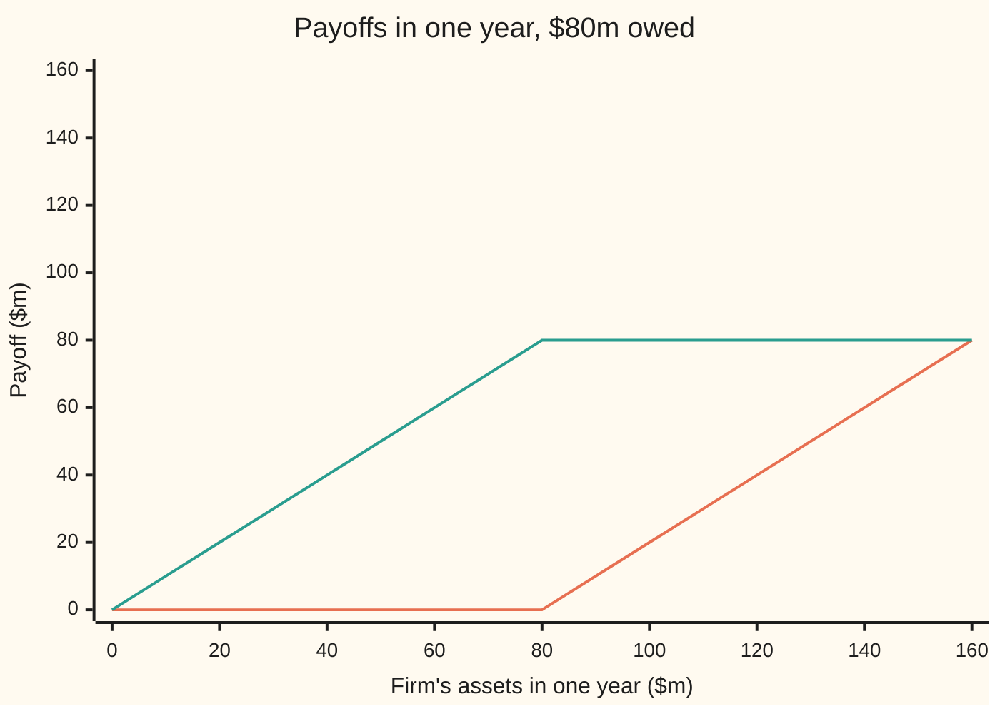
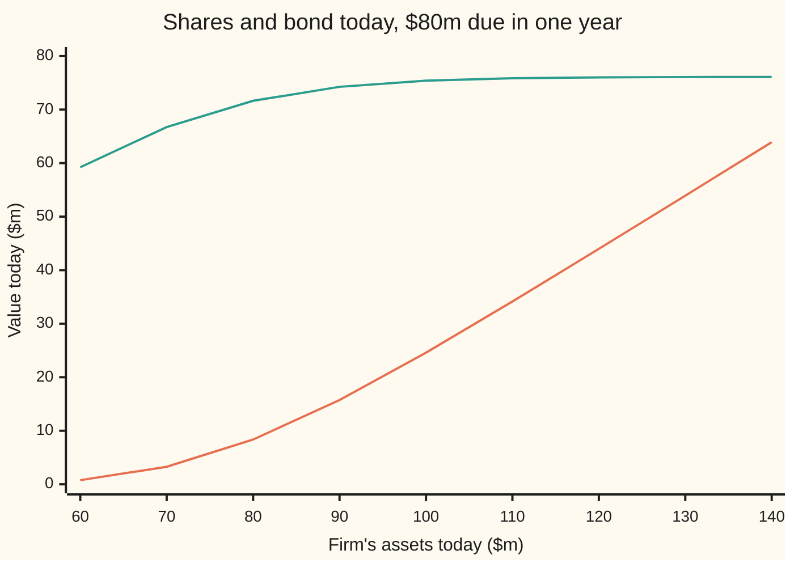

# Merton's model: equity is a call on the firm's assets, so risky debt is a safe bond minus a put

[Syllabus](../../../SYLLABUS.md) → [Financial mathematics](../../../SYLLABUS.md#w12) → [Structural Models - Default from the Balance Sheet](../../../SYLLABUS.md#w12-s43) → Merton's model

---

## General Overview

A firm owns factories, stock and cash worth **$100m** today. It has borrowed by selling one bond that promises to pay **$80m** in exactly one year, and nothing before. Whatever is not owed to the lenders belongs to the shareholders.

In a year one of two things happens. If the assets are worth more than $80m, the firm pays the lenders in full and the shareholders keep the rest: assets at $140m leave them $60m. If the assets are worth less, the firm cannot pay. It defaults, the lenders take all the assets, and the shareholders get nothing: they are not asked to pay the gap, because a shareholder's loss stops at the stake (limited liability).

"Keep whatever is above $80m, and never less than zero" is the payoff of a **call option**: the right, not the duty, to buy something at a fixed price on a fixed day. Here the something is the firm's assets and the fixed price, the **strike**, is the $80m owed. Robert Merton's 1974 paper priced the shareholders' stake with the Black-Scholes call formula, and the lenders' bond with the matching put. From here on the model carries his name.

With the assets' yearly swings, their **volatility**, at 20% and the riskless rate at 5%, the model gives four numbers. The shares are worth **$24.59m**. The bond is worth **$75.41m**, against **$76.10m** for a bond that could not default. The $0.687m gap is the price of a **put**, a right to sell the assets for $80m, which the lenders have in effect handed to the shareholders. The chance of default used for pricing is **10.28%**, and the bond yields **90.7 basis points** (hundredths of a percent) a year more than the riskless rate.

**Shareholders own a call on the firm's assets struck at the debt, so the debt is worth the assets minus that call, which is the same as a riskless bond minus a put; the put's value turns into a default probability, a yield and a credit spread.**

**What kind of fact this is:** a model: the assets are taken to wander like a Black-Scholes share and the debt to be one payment on one date; the payoff identities are theorems, proved on this card in Why it works, and the prices follow from them only inside the model.

### The picture: who gets what on the payment date



Orange line: the shareholders, flat at zero up to $80m, then climbing one for one: a call's payoff. Green line: the lenders, taking every dollar of assets up to $80m, then capped at $80m. At every point on the axis the two lines add up to the assets.

---

## The formula

$$E = V\,N(d_1) - F e^{-rT} N(d_2), \qquad B = V - E = F e^{-rT} - P$$

**Read it aloud:** the shares are worth the assets they might end up with minus the discounted debt they might pay off, each weighted by its own bell-curve chance; the bond is worth what is left of the assets, which is also a riskless bond less the put.

| Symbol | Plain meaning | In our example | Push it up and the answer… |
| --- | --- | --- | --- |
| $V$, $V_T$ | the firm's assets: their market value today, and in $T$ years | $100m today | shares rise, bond rises toward the riskless bond |
| $F$ | the **face value**: the one payment the bond promises | $80m | shares fall, bond rises but gets riskier |
| $T$ | years until that payment | 1 | here, spread falls: at 5 years it is 84.9 bp |
| $r$ | riskless rate, continuously compounded | 5% | shares rise, bond falls |
| $\sigma$ | asset volatility: the yearly spread of the assets' log-returns | 20% | shares rise, bond falls, spread widens |
| $E$ | equity: the shares, priced as a call | $24.59m | — |
| $B$ | the risky bond's value today | $75.41m | — |
| $P$ | the put on the assets struck at $F$: default insurance the lenders have sold | $0.687m | — |
| $N(x)$ | bell-curve area to the left of $x$: a probability | $N(d_2) = 0.8972$ | — |
| $d_1$, $d_2$ | the firm's distance from the default line in units of $\sigma\sqrt{T}$; $d_1$ one unit further | 1.4657 and 1.2657 | — |
| $e^{-rT}$ | discount factor: today's price of $1 due in $T$ years | 0.9512 | — |
| $y$, $s$ | the bond's yield, and its **credit spread** $s = y - r$ | 5.907% and 90.7 bp | — |

The helpers, as on the Black-Scholes call with no dividend:

$$d_2 = \frac{\ln(V/F) + (r - \tfrac12\sigma^2)\,T}{\sigma\sqrt{T}}, \qquad d_1 = d_2 + \sigma\sqrt{T}$$

In words: $d_2$ counts how many units of the assets' spread stand between today's assets and the $80m line, after the pricing drift. $d_1$ is one unit further.

The put, the default probability and the spread:

$$P = F e^{-rT} N(-d_2) - V\,N(-d_1), \qquad \text{PD} = N(-d_2), \qquad s = y - r = \frac{1}{T}\ln\frac{F e^{-rT}}{B}$$

PD is the probability of default. The yield $y$ is the rate at which the promised $80m, discounted, equals the bond's price: $B = F e^{-yT}$.

### When it holds

- **One bond, one payment date, no payouts before it.** Coupons, dividends or share buybacks drain the assets the lenders rely on. With them the single call no longer describes the shares, and the card's numbers are off by the value paid out.
- **Default is checked only on the payment date.** A firm deep underwater in month six survives if it recovers by month twelve. Real bonds often let lenders act the moment assets fall below a line, which raises the default chance: [Black-Cox](05-black-cox-first-passage-default.md).
- **Assets wander like a Black-Scholes share, with constant $\sigma$.** If assets can jump, short-dated bonds carry spreads this model cannot produce: at one day to maturity it gives almost none.
- **The assets could be traded, or copied by trading.** The call price is the cost of a copy. The assets of a real firm are not quoted, so $V$ and $\sigma$ must be estimated: [Backing out the unobservable](04-asset-value-and-volatility-from-the-share-price.md).
- **No bankruptcy costs.** In default the lenders get all the assets. Lawyers' fees and fire-sale discounts lower what they recover, so the true bond is worth less than $75.41m.

---

## Why it works

### Step 0: the payment date splits the assets between two owners

Nothing about options is assumed at the start. On the payment date the assets are shared out: the lenders are first in line for up to $80m, the shareholders take the rest, and limited liability stops the shareholders' share at zero. Every result below is this waterfall, rewritten.

### Step 1: the shareholders' payoff is a call

Write $x^+$ for "$x$ if positive, otherwise 0". On the payment date the shares pay $(V_T - F)^+$. Check both cases. Assets at $140m: the shares get $60m. Assets at $60m: the shares get 0. A call on the assets struck at $F$ pays the same in every case, so the two are the same claim.

### Step 2: the lenders' payoff has two faces

The lenders get $\min(V_T, F)$: all the assets if they are short, the full $80m otherwise. Two rewritings hold in every case:

$$\min(V_T, F) = V_T - (V_T - F)^+ = F - (F - V_T)^+.$$

The first says: the lenders own the assets and have sold the shareholders a call. The second says: the lenders own a riskless promise of $F$ and have sold a put. That put pays the shortfall $F - V_T$ exactly when the firm defaults. At $60m of assets the shortfall is $20m, and $80m - $20m = $60m, which is what the lenders get.

### Step 3: price the two faces

Payoffs that agree on the payment date must have the same price today, or a trader could buy the cheap one, sell the dear one and pocket a riskless profit. So:

- the shares are priced by the Black-Scholes call with share price $V$, strike $F$, no dividend: $E = V N(d_1) - F e^{-rT} N(d_2)$;
- the bond, by the first face, is $B = V - E$;
- the bond, by the second face, is $F e^{-rT} - P$, with $P$ the Black-Scholes put.

The two bond prices agree because the call and the put obey put-call parity, $E - P = V - F e^{-rT}$: [Put-call parity](../08-The%20Black-Scholes%20call%20and%20put/03-put-call-parity.md). Using the symmetry of the bell curve, $1 - N(x) = N(-x)$, the bond splits into two legs:

$$B = V\,N(-d_1) + F e^{-rT} N(d_2).$$

The second leg is the promised $80m, discounted, in the states where it is paid: $68.27m. The first is what the lenders recover in default states, counted in assets: $7.14m. Together: $75.41m.

### Step 4: N(−d2) is the pricing chance of default

In the risk-neutral world (the pricing world where every asset is taken to grow at the riskless rate), the log of the assets in a year is bell-curve distributed. Its centre is $\ln V + (r - \tfrac12\sigma^2)T$ and its spread is $\sigma\sqrt{T}$. So $V_T = V e^{(r - \frac12\sigma^2)T + \sigma\sqrt{T} Z}$, with $Z$ a standard bell-curve draw. Default means $V_T < F$. Take logs and divide by the spread: that happens exactly when $Z < -d_2$. The chance is $N(-d_2) = 10.28\%$.

This is a pricing probability, not a forecast. The real-world assets grow faster than the riskless rate. At an 8% real drift the same calculation gives 7.84%. Turning the model into a forecast is [Distance to default](03-distance-to-default-and-expected-default-frequency.md).

### Step 5: the put is default chance times loss given default

The put pays $F - V_T$ in default and nothing otherwise. Its price is the discounted average payoff, and an average over the default states is the default chance times the average payoff given default:

$$P = e^{-rT} \times \text{PD} \times \big(F - \text{mean of } V_T \text{ given default}\big).$$

In the example the assets left in an average default are $72.97m, so the lenders recover 91.2% of the $80m and lose 8.8%, the **loss given default**. That gives $0.9512 \times 0.1028 \times 7.027 = 0.687$: the put again, by a third road. This is the expected-loss rule of [Default probability, recovery and expected loss](../41-Default%2C%20Survival%20and%20the%20Hazard%20Rate/01-default-probability-recovery-and-expected-loss.md), with recovery no longer a fixed guess: it comes out of the model.

### Step 6: the price becomes a yield and a spread

A bond priced $B$ that promises $F$ in $T$ years has the yield $y$ solving $B = F e^{-yT}$, so $y = -\ln(B/F)/T = 5.907\%$. The spread is $s = y - r$. Divide the two bond prices, $F e^{-rT} / B = e^{(y - r)T}$, and take logs:

$$s = \frac{1}{T}\ln\frac{F e^{-rT}}{B} = -\frac{1}{T}\ln\Big(1 - \frac{P}{F e^{-rT}}\Big).$$

The spread depends only on the put as a share of the riskless bond. Here the put is $0.687m out of $76.10m, and the spread is 90.7 bp. For small puts the log is close to its argument, so the spread is roughly PD times loss given default per year: $0.1028 \times 0.088$, or 90.3 bp.

Convention: the yield and spread here are continuously compounded, as in Merton's paper. Market quotes use other compounding and benchmarks, such as a Treasury or swap curve (conventions verified 2026-09-28).

### The picture: today's prices as the assets vary



Orange line: the shares, a smooth call curve. Green line: the bond, bending over toward the riskless bond's $76.10m and never reaching it. The strong firm's bond trades like a safe one; the weak firm's bond moves almost dollar for dollar with its assets, like a share.

<details>
<summary>Detailed proof</summary>

**Payoffs.** Fix $V_T \ge 0$. If $V_T > F$: $(V_T - F)^+ = V_T - F$, $(F - V_T)^+ = 0$, and $\min(V_T, F) = F = V_T - (V_T - F) = F - 0$. If $V_T \le F$: $(V_T - F)^+ = 0$, $(F - V_T)^+ = F - V_T$, and $\min(V_T, F) = V_T = V_T - 0 = F - (F - V_T)$. So equity plus debt pays $V_T$ in every state, and debt pays the riskless $F$ minus the put payoff in every state.

**Prices.** Under the stated model the Black-Scholes call and put theorems price $(V_T - F)^+$ and $(F - V_T)^+$, with share price $V$, strike $F$ and zero payout. Claims whose payoffs agree in every state have one price, so $B = V - E$ and $B = F e^{-rT} - P$; parity makes them equal. Substituting $1 - N(x) = N(-x)$ into $V - E$ gives $B = V N(-d_1) + F e^{-rT} N(d_2)$.

**Default probability.** $V_T < F$ exactly when $\ln V + (r - \tfrac12\sigma^2)T + \sigma\sqrt{T}Z < \ln F$, that is $Z < -d_2$. The bell curve is continuous, so $V_T = F$ has chance zero and "below" or "at or below" give the same $N(-d_2)$.

**Put as expected shortfall.** $P = e^{-rT}\,\mathbb{E}[(F - V_T)\,\mathbf{1}\{V_T < F\}] = e^{-rT}\,\text{PD}\,(F - \mathbb{E}[V_T \mid V_T < F])$, where $\mathbb{E}$ is the risk-neutral average and $\mathbf{1}\{\cdot\}$ is 1 when the bracket holds, 0 otherwise. The share-counted chance on the call card gives $\mathbb{E}[V_T\,\mathbf{1}\{V_T < F\}] = V e^{rT} N(-d_1)$, so the mean of $V_T$ given default is $V e^{rT} N(-d_1)/N(-d_2)$: $72.97m here.

**Bounds.** With $T$, $\sigma$, $V$, $F$ all positive, both default and survival have positive chance. So $P > 0$ and $E > 0$, and since $\min(V_T, F)$ is below both $V_T$ and $F$, and strictly below each with positive chance, $0 < B < \min(V, F e^{-rT})$.

**Yield.** $y \mapsto F e^{-yT}$ is continuous and strictly decreasing from infinity to zero, so each $B > 0$ has exactly one yield. $B < F e^{-rT}$ makes the log in $s$ positive: the spread is strictly positive whenever default is possible.

</details>

Merton's own route was the other road on the Black-Scholes card: he wrote the hedge for the firm's claims as a partial differential equation and solved it with the bond's payoff as the end condition. The same prices come out.

---

## Worked numbers, by hand

The firm: $V = 100$, $F = 80$, $T = 1$, $\sigma = 20\%$, $r = 5\%$, all money in $m.

| Step | Arithmetic | Value |
| --- | --- | --- |
| $\ln(V/F)$ | $\ln(100/80) = \ln 1.25$ | 0.2231 |
| pricing drift, $r - \tfrac12\sigma^2$ | $0.05 - 0.02$ | 0.03 |
| one spread unit, $\sigma\sqrt{T}$ | $0.20 \times 1$ | 0.20 |
| $d_2$ | $(0.2231 + 0.03)/0.20$ | 1.2657 |
| $d_1$ | $1.2657 + 0.20$ | 1.4657 |
| $N(d_1)$, $N(d_2)$ | bell-curve table | 0.9286, 0.8972 |
| riskless bond, $F e^{-rT}$ | $80 \times 0.9512$ | $76.10m |
| share leg, $V N(d_1)$ | $100 \times 0.9286$ | $92.86m |
| cash leg, $F e^{-rT} N(d_2)$ | $76.10 \times 0.8972$ | $68.27m |
| **equity** | $92.86 - 68.27$ | **$24.59m** |
| **risky bond** | $100 - 24.59$ | **$75.41m** |
| put | $76.098 - 75.411$ | $0.687m |
| **default probability** | $N(-d_2) = 1 - 0.8972$ | **10.28%** |
| yield | $-\ln(75.41/80)$ | 5.907% |
| **spread** | $5.907\% - 5\%$ | **90.7 bp** |

Borrowing 80% of its assets at 20% asset volatility leaves a firm whose bond is worth 99.1% of a riskless one. The rest is the default insurance the lenders sold, and it costs the firm 90.7 bp a year in extra interest.

The same $100m, split three ways:

```
the firm's $100m today, $m
equity         ██████████                                 $24.59
risky bond     ██████████████████████████████             $75.41
put            ▏                                          $0.69
riskless bond  ██████████████████████████████▍            $76.10
```

Equity plus the risky bond is the whole $100m. The risky bond plus the put is the riskless bond.

### What breaks if you drop a piece

| Mistake | Comes out at | What went wrong |
| --- | --- | --- |
| Forget to discount the $80m | equity $21.09m, bond $78.91m | The bond is now worth more than the riskless $76.10m: impossible |
| Bond = riskless bond × (1 − PD) | $68.27m | That is the cash leg alone. It throws away the $7.14m the lenders recover in default |
| Yield by simple interest, spread against a continuous 5% | 108.5 bp | Two compounding conventions subtracted. Both yields must be continuous: 90.7 bp |
| Quote N(−d2) as the real chance of default | 10.28% | A pricing chance. At an 8% real asset drift the real chance is 7.84% |

Every number in the table is printed by both checks below.

---

## Code, from first principles, and it actually runs

Nothing imported knows the answer. The shares, bond and default chance are reached by **four independent roads**: the call and put formulas; a Simpson's-rule average of the payment-date payoffs over the bell curve, split where the assets just cover the debt (found by bisection, no $d_1$ or $d_2$); a 2,000-step coin-flip tree on the assets; and a 200,000-draw Monte Carlo run from a hand-written random-number generator. The yield is found twice, by the log and by bisection, and the put a third time as discounted default chance times loss given default. The bell-curve area is a series in Python and a sum of thin slices in Rust.

### Python

```python
# Merton's model -- the check behind the card.  Standard library only.
# Nothing imported knows the answer: the normal CDF is the erf series written
# out, the integral is Simpson's rule, the tree is a loop, the random numbers
# come from a hand-written generator, the yield from a hand-written bisection.
from math import log, sqrt, exp, pi, cos

def N(x):                                    # bell-curve area left of x, erf series
    z = x / sqrt(2.0)
    if abs(z) > 5.0: return 1.0 if z > 0 else 0.0
    term, total, n = z, z, 0
    while abs(term) > 1e-18:
        n += 1
        term *= -z * z * (2 * n - 1) / (n * (2 * n + 1))
        total += term
    return 0.5 + total / sqrt(pi)

def merton(V, F, r, sig, T):                 # road 1: the call and put formulas
    w = sig * sqrt(T)
    d2 = (log(V / F) + (r - 0.5 * sig * sig) * T) / w
    d1 = d2 + w
    safe = F * exp(-r * T)
    E = V * N(d1) - safe * N(d2)             # equity: a call on the assets
    P = safe * N(-d2) - V * N(-d1)           # the lenders' short put
    return d1, d2, safe, E, P

def spread_bp(V, F, r, sig, T):
    d1, d2, safe, E, P = merton(V, F, r, sig, T)
    return (-log((V - E) / F) / T - r) * 1e4

def bisect(f, lo, hi):                       # a root of f between lo and hi
    for _ in range(200):
        mid = 0.5 * (lo + hi)
        if (f(lo) < 0) == (f(mid) < 0): lo = mid
        else: hi = mid
    return 0.5 * (lo + hi)

def simpson(f, a, b, n=4000):
    h = (b - a) / n
    s = f(a) + f(b) + sum((4 if i % 2 else 2) * f(a + i * h) for i in range(1, n))
    return s * h / 3.0

V, F, T, sig, r, mu = 100.0, 80.0, 1.0, 0.20, 0.05, 0.08
d1, d2, safe, E, P = merton(V, F, r, sig, T)
B, B_put, PD = V - E, safe - P, N(-d2)
y = -log(B / F) / T
y_bis = bisect(lambda x: F * exp(-x * T) - B, -1.0, 1.0)

# road 2: average the maturity payoffs over the bell curve; no d1, d2 or N
VT = lambda z: V * exp((r - 0.5 * sig * sig) * T + sig * sqrt(T) * z)
phi = lambda z: exp(-0.5 * z * z) / sqrt(2.0 * pi)
zs = bisect(lambda z: VT(z) - F, -10.0, 10.0)            # where assets just cover the debt
D = exp(-r * T)
E_int = D * simpson(lambda z: (VT(z) - F) * phi(z), zs, 10.0)
B_int = D * (simpson(lambda z: VT(z) * phi(z), -10.0, zs) + simpson(lambda z: F * phi(z), zs, 10.0))
P_int = D * simpson(lambda z: (F - VT(z)) * phi(z), -10.0, zs)
PD_int = simpson(phi, -10.0, zs)
rec_int = simpson(lambda z: VT(z) * phi(z), -10.0, zs) / PD_int     # mean assets, given default

# road 3: a 2000-step coin-flip tree on the assets
def tree(payoff, disc, n=2000):
    dt = T / n; u = exp(sig * sqrt(dt)); d = 1.0 / u
    p = (exp(r * dt) - d) / (u - d); k = exp(-r * dt) if disc else 1.0
    v = [payoff(V * u ** j * d ** (n - j)) for j in range(n + 1)]
    for m in range(n, 0, -1):
        v = [k * (p * v[j + 1] + (1.0 - p) * v[j]) for j in range(m)]
    return v[0]
E_tree = tree(lambda a: max(a - F, 0.0), True)
PD_tree = tree(lambda a: 1.0 if a < F else 0.0, False)

# road 4: Monte Carlo, 200,000 draws from a hand-written generator (splitmix64)
state, M = 20260928, 200000
def uniform():
    global state
    state = (state + 0x9E3779B97F4A7C15) & 0xFFFFFFFFFFFFFFFF
    x = state
    x = ((x ^ (x >> 30)) * 0xBF58476D1CE4E5B9) & 0xFFFFFFFFFFFFFFFF
    x = ((x ^ (x >> 27)) * 0x94D049BB133111EB) & 0xFFFFFFFFFFFFFFFF
    return ((x ^ (x >> 31)) >> 11) * 2.0 ** -53
se, sq, nd = 0.0, 0.0, 0
for _ in range(M):
    z = sqrt(-2.0 * log(1.0 - uniform())) * cos(2.0 * pi * uniform())
    pay = max(VT(z) - F, 0.0)
    se += pay; sq += pay * pay; nd += VT(z) < F
E_mc, PD_mc = D * se / M, nd / M
E_se = D * sqrt((sq / M - (se / M) ** 2) / M)
PD_se = sqrt(PD_mc * (1.0 - PD_mc) / M)

rec = V * exp(r * T) * N(-d1) / N(-d2)      # mean assets given default, formula
wrong_E = V * N(d1) - F * N(d2)
w_mu = (log(V / F) + (mu - 0.5 * sig * sig) * T) / (sig * sqrt(T))
rows = [
    ("ln(V/F)", log(V / F)), ("d1", d1), ("d2", d2), ("N(d1)", N(d1)), ("N(d2)", N(d2)), ("discount e^-rT", D), ("safe bond F e^-rT", safe),
    ("share leg V N(d1)", V * N(d1)), ("cash leg F e^-rT N(d2)", safe * N(d2)), ("recovery leg V N(-d1)", V * N(-d1)),
    ("1 equity, formula", E), ("2 equity, Simpson integral", E_int),
    ("3 equity, tree 2000 steps", E_tree), ("4 equity, Monte Carlo", E_mc), ("  its standard error", E_se),
    ("debt, V - E", B), ("debt, safe bond - put", B_put),
    ("debt, integral of min(V_T, F)", B_int), ("bond / riskless bond", B / safe),
    ("put, formula", P), ("put, integral", P_int),
    ("default prob, N(-d2)", PD), ("default prob, integral", PD_int),
    ("default prob, tree", PD_tree), ("default prob, Monte Carlo", PD_mc), ("  its standard error", PD_se),
    ("yield, -ln(B/F)/T", y), ("yield, bisection", y_bis), ("spread, bp", (y - r) * 1e4),
    ("mean assets given default, formula", rec), ("mean assets given default, integral", rec_int),
    ("recovery rate, share of F", rec / F), ("loss given default, share of F", 1 - rec / F),
    ("shortfall given default, F - mean", F - rec),
    ("put = e^-rT x PD x (F - mean assets)", D * PD * (F - rec)),
    ("rough spread PD x LGD, bp", PD * (1 - rec / F) * 1e4),
    ("wrong: no discount, equity", wrong_E), ("wrong: no discount, debt", V - wrong_E),
    ("wrong: safe x (1 - PD), debt", safe * (1 - PD)),
    ("wrong: simple yield, spread bp", ((F / B - 1) / T - r) * 1e4),
    ("real-world default prob, 8% drift", N(-w_mu)),
    ("try: sigma 0.40, equity", merton(V, F, r, 0.40, T)[3]), ("try: sigma 0.40, spread bp", spread_bp(V, F, r, 0.40, T)),
    ("try: F 90, spread bp", spread_bp(V, 90.0, r, sig, T)), ("try: V 80, spread bp", spread_bp(80.0, F, r, sig, T)),
    ("try: T 5, spread bp", spread_bp(V, F, r, sig, 5.0)), ("try: T 5, default prob", N(-merton(V, F, r, sig, 5.0)[1])),
]
for name, v in rows:
    print(f"{name:<38} {v:>14.6f}")
grid = [0.0, 20.0, 40.0, 60.0, 80.0, 100.0, 120.0, 140.0, 160.0]
print("chart, assets at maturity " + " ".join(f"{a:6.0f}" for a in grid))
print("chart, equity at maturity " + " ".join(f"{max(a - F, 0.0):6.0f}" for a in grid))
print("chart, debt at maturity   " + " ".join(f"{min(a, F):6.0f}" for a in grid))
print("bars, $m: equity, debt, put, safe " + " ".join(f"{x:.2f}" for x in (E, B, P, safe)))
today = [60.0 + 10.0 * i for i in range(9)]
print("chart, assets today       " + " ".join(f"{a:6.0f}" for a in today))
print("chart, equity today       " + " ".join(f"{merton(a, F, r, sig, T)[3]:6.2f}" for a in today))
print("chart, debt today         " + " ".join(f"{a - merton(a, F, r, sig, T)[3]:6.2f}" for a in today))

assert abs(E_int - E) < 1e-7 and abs(B_int - B) < 1e-7, "integral road vs the call formula"
assert abs(P_int - P) < 1e-7 and abs(B_put - B) < 1e-9, "put formula vs integral; two debt routes"
assert abs(E_tree - E) < 0.01 and abs(PD_tree - PD) < 0.005, "tree road"
assert abs(E_mc - E) < 4 * E_se and abs(PD_mc - PD) < 4 * PD_se, "Monte Carlo within 4 standard errors"
assert abs(PD_int - PD) < 1e-8 and abs(rec_int - rec) < 1e-6, "default prob and recovery, two roads"
assert abs(y_bis - y) < 1e-12 and abs((y - r) * 1e4 - 90.713) < 0.001, "yield two ways; the reference 90.713 bp"
print("ALL CHECKS PASS")
```

**Ran 2026-09-28 on macOS, Python 3.14.6, standard library only. All checks passed. Output, pasted from the run:**

```
ln(V/F)                                      0.223144
d1                                           1.465718
d2                                           1.265718
N(d1)                                        0.928637
N(d2)                                        0.897193
discount e^-rT                               0.951229
safe bond F e^-rT                           76.098354
share leg V N(d1)                           92.863740
cash leg F e^-rT N(d2)                      68.274905
recovery leg V N(-d1)                        7.136260
1 equity, formula                           24.588835
2 equity, Simpson integral                  24.588835
3 equity, tree 2000 steps                   24.588531
4 equity, Monte Carlo                       24.555824
  its standard error                         0.043024
debt, V - E                                 75.411165
debt, safe bond - put                       75.411165
debt, integral of min(V_T, F)               75.411165
bond / riskless bond                         0.990970
put, formula                                 0.687189
put, integral                                0.687189
default prob, N(-d2)                         0.102807
default prob, integral                       0.102807
default prob, tree                           0.106438
default prob, Monte Carlo                    0.103060
  its standard error                         0.000680
yield, -ln(B/F)/T                            0.059071
yield, bisection                             0.059071
spread, bp                                  90.712996
mean assets given default, formula          72.973029
mean assets given default, integral         72.973029
recovery rate, share of F                    0.912163
loss given default, share of F               0.087837
shortfall given default, F - mean            7.026971
put = e^-rT x PD x (F - mean assets)         0.687189
rough spread PD x LGD, bp                   90.302795
wrong: no discount, equity                  21.088306
wrong: no discount, debt                    78.911694
wrong: safe x (1 - PD), debt                68.274905
wrong: simple yield, spread bp             108.508763
real-world default prob, 8% drift            0.078429
try: sigma 0.40, equity                     28.976408
try: sigma 0.40, spread bp                 690.145252
try: F 90, spread bp                       273.544994
try: V 80, spread bp                       603.795742
try: T 5, spread bp                         84.859288
try: T 5, default prob                       0.202035
chart, assets at maturity      0     20     40     60     80    100    120    140    160
chart, equity at maturity      0      0      0      0      0     20     40     60     80
chart, debt at maturity        0     20     40     60     80     80     80     80     80
bars, $m: equity, debt, put, safe 24.59 75.41 0.69 76.10
chart, assets today           60     70     80     90    100    110    120    130    140
chart, equity today         0.77   3.27   8.36  15.75  24.59  34.14  43.98  53.92  63.91
chart, debt today          59.23  66.73  71.64  74.25  75.41  75.86  76.02  76.08  76.09
ALL CHECKS PASS
```

The formula and the integral agree to six decimals on every claim. The tree agrees on the shares to three decimals, but its default chance is 10.64% against 10.28%: a coin-flip tree's final prices sit on a grid, and the $80m line falls between two grid points. Monte Carlo lands within one standard error on both.

### Rust

Same inputs, same labels, a different bell-curve area, the same random-number generator.

```rust
// Merton's model -- the same check as the Python, in Rust.  Standard library
// only, no crates.  Rust has no erf, so the bell-curve area N(x) is built by
// adding thin slices under the curve (Simpson), a different road from the
// Python series.  Tree, Monte Carlo generator and bisection are written here.
use std::f64::consts::PI;

fn phi(z: f64) -> f64 { (-0.5 * z * z).exp() / (2.0 * PI).sqrt() }

fn simpson<G: Fn(f64) -> f64>(f: G, a: f64, b: f64, n: usize) -> f64 {
    let h = (b - a) / n as f64;
    let mut s = f(a) + f(b);
    for i in 1..n { s += if i % 2 == 1 { 4.0 } else { 2.0 } * f(a + i as f64 * h); }
    s * h / 3.0
}

fn n_cdf(x: f64) -> f64 {                    // bell-curve area left of x
    if x < -12.0 { return 0.0; }
    if x > 12.0 { return 1.0; }
    0.5 + simpson(phi, 0.0, x, 4000)
}

// road 1: the call and put formulas -> (d1, d2, safe bond, equity, put)
fn merton(v: f64, f: f64, r: f64, sig: f64, t: f64) -> (f64, f64, f64, f64, f64) {
    let w = sig * t.sqrt();
    let d2 = ((v / f).ln() + (r - 0.5 * sig * sig) * t) / w;
    let d1 = d2 + w;
    let safe = f * (-r * t).exp();
    let e = v * n_cdf(d1) - safe * n_cdf(d2);
    let p = safe * n_cdf(-d2) - v * n_cdf(-d1);
    (d1, d2, safe, e, p)
}

fn spread_bp(v: f64, f: f64, r: f64, sig: f64, t: f64) -> f64 {
    let e = merton(v, f, r, sig, t).3;
    (-((v - e) / f).ln() / t - r) * 1e4
}

fn bisect<G: Fn(f64) -> f64>(g: G, mut lo: f64, mut hi: f64) -> f64 {
    for _ in 0..200 {
        let mid = 0.5 * (lo + hi);
        if (g(lo) < 0.0) == (g(mid) < 0.0) { lo = mid } else { hi = mid }
    }
    0.5 * (lo + hi)
}

fn tree<G: Fn(f64) -> f64>(v0: f64, r: f64, sig: f64, t: f64, payoff: G, disc: bool) -> f64 {
    let n = 2000usize;
    let dt = t / n as f64;
    let (u, d) = ((sig * dt.sqrt()).exp(), (-sig * dt.sqrt()).exp());
    let p = ((r * dt).exp() - d) / (u - d);
    let k = if disc { (-r * dt).exp() } else { 1.0 };
    let mut v: Vec<f64> = (0..=n).map(|j| payoff(v0 * u.powi(j as i32) * d.powi((n - j) as i32))).collect();
    for m in (1..=n).rev() { v = (0..m).map(|j| k * (p * v[j + 1] + (1.0 - p) * v[j])).collect(); }
    v[0]
}

struct SplitMix(u64);                        // hand-written random numbers
impl SplitMix {
    fn uniform(&mut self) -> f64 {
        self.0 = self.0.wrapping_add(0x9E3779B97F4A7C15);
        let mut x = self.0;
        x = (x ^ (x >> 30)).wrapping_mul(0xBF58476D1CE4E5B9);
        x = (x ^ (x >> 27)).wrapping_mul(0x94D049BB133111EB);
        ((x ^ (x >> 31)) >> 11) as f64 * 2f64.powi(-53)
    }
}

fn main() {
    let (v, f, t, sig, r, mu) = (100.0_f64, 80.0_f64, 1.0_f64, 0.20_f64, 0.05_f64, 0.08_f64);
    let (d1, d2, safe, e, p) = merton(v, f, r, sig, t);
    let (b, b_put, pd) = (v - e, safe - p, n_cdf(-d2));
    let y = -(b / f).ln() / t;
    let y_bis = bisect(|x| f * (-x * t).exp() - b, -1.0, 1.0);

    // road 2: average the maturity payoffs over the bell curve; no d1, d2 or N
    let vt = |z: f64| v * ((r - 0.5 * sig * sig) * t + sig * t.sqrt() * z).exp();
    let zs = bisect(|z| vt(z) - f, -10.0, 10.0);
    let disc = (-r * t).exp();
    let e_int = disc * simpson(|z| (vt(z) - f) * phi(z), zs, 10.0, 4000);
    let b_int = disc * (simpson(|z| vt(z) * phi(z), -10.0, zs, 4000) + simpson(|z| f * phi(z), zs, 10.0, 4000));
    let p_int = disc * simpson(|z| (f - vt(z)) * phi(z), -10.0, zs, 4000);
    let pd_int = simpson(phi, -10.0, zs, 4000);
    let rec_int = simpson(|z| vt(z) * phi(z), -10.0, zs, 4000) / pd_int;

    // road 3: a 2000-step coin-flip tree on the assets
    let e_tree = tree(v, r, sig, t, |a| (a - f).max(0.0), true);
    let pd_tree = tree(v, r, sig, t, |a| if a < f { 1.0 } else { 0.0 }, false);

    // road 4: Monte Carlo, 200,000 draws from the same splitmix64 generator
    let (mut rng, m) = (SplitMix(20260928), 200000usize);
    let (mut se, mut sq, mut nd) = (0.0_f64, 0.0_f64, 0usize);
    for _ in 0..m {
        let z = (-2.0 * (1.0 - rng.uniform()).ln()).sqrt() * (2.0 * PI * rng.uniform()).cos();
        let pay = (vt(z) - f).max(0.0);
        se += pay; sq += pay * pay;
        if vt(z) < f { nd += 1; }
    }
    let mf = m as f64;
    let (e_mc, pd_mc) = (disc * se / mf, nd as f64 / mf);
    let e_se = disc * ((sq / mf - (se / mf).powi(2)) / mf).sqrt();
    let pd_se = (pd_mc * (1.0 - pd_mc) / mf).sqrt();

    let rec = v * (r * t).exp() * n_cdf(-d1) / n_cdf(-d2);
    let wrong_e = v * n_cdf(d1) - f * n_cdf(d2);
    let w_mu = ((v / f).ln() + (mu - 0.5 * sig * sig) * t) / (sig * t.sqrt());
    let rows: Vec<(&str, f64)> = vec![
        ("ln(V/F)", (v / f).ln()), ("d1", d1), ("d2", d2), ("N(d1)", n_cdf(d1)), ("N(d2)", n_cdf(d2)), ("discount e^-rT", (-r * t).exp()), ("safe bond F e^-rT", safe),
        ("share leg V N(d1)", v * n_cdf(d1)), ("cash leg F e^-rT N(d2)", safe * n_cdf(d2)), ("recovery leg V N(-d1)", v * n_cdf(-d1)),
        ("1 equity, formula", e), ("2 equity, Simpson integral", e_int),
        ("3 equity, tree 2000 steps", e_tree), ("4 equity, Monte Carlo", e_mc), ("  its standard error", e_se),
        ("debt, V - E", b), ("debt, safe bond - put", b_put),
        ("debt, integral of min(V_T, F)", b_int), ("bond / riskless bond", b / safe),
        ("put, formula", p), ("put, integral", p_int),
        ("default prob, N(-d2)", pd), ("default prob, integral", pd_int),
        ("default prob, tree", pd_tree), ("default prob, Monte Carlo", pd_mc), ("  its standard error", pd_se),
        ("yield, -ln(B/F)/T", y), ("yield, bisection", y_bis), ("spread, bp", (y - r) * 1e4),
        ("mean assets given default, formula", rec), ("mean assets given default, integral", rec_int),
        ("recovery rate, share of F", rec / f), ("loss given default, share of F", 1.0 - rec / f),
        ("shortfall given default, F - mean", f - rec),
        ("put = e^-rT x PD x (F - mean assets)", disc * pd * (f - rec)),
        ("rough spread PD x LGD, bp", pd * (1.0 - rec / f) * 1e4),
        ("wrong: no discount, equity", wrong_e), ("wrong: no discount, debt", v - wrong_e),
        ("wrong: safe x (1 - PD), debt", safe * (1.0 - pd)),
        ("wrong: simple yield, spread bp", ((f / b - 1.0) / t - r) * 1e4),
        ("real-world default prob, 8% drift", n_cdf(-w_mu)),
        ("try: sigma 0.40, equity", merton(v, f, r, 0.40, t).3), ("try: sigma 0.40, spread bp", spread_bp(v, f, r, 0.40, t)),
        ("try: F 90, spread bp", spread_bp(v, 90.0, r, sig, t)), ("try: V 80, spread bp", spread_bp(80.0, f, r, sig, t)),
        ("try: T 5, spread bp", spread_bp(v, f, r, sig, 5.0)), ("try: T 5, default prob", n_cdf(-merton(v, f, r, sig, 5.0).1)),
    ];
    for (name, x) in &rows { println!("{:<38} {:>14.6}", name, x); }
    let join = |xs: Vec<String>| xs.join(" ");
    let grid: Vec<f64> = (0..9).map(|i| 20.0 * i as f64).collect();
    println!("chart, assets at maturity {}", join(grid.iter().map(|a| format!("{:6.0}", a)).collect()));
    println!("chart, equity at maturity {}", join(grid.iter().map(|a| format!("{:6.0}", (a - f).max(0.0))).collect()));
    println!("chart, debt at maturity   {}", join(grid.iter().map(|a| format!("{:6.0}", a.min(f))).collect()));
    println!("bars, $m: equity, debt, put, safe {}", join([e, b, p, safe].iter().map(|x| format!("{:.2}", x)).collect()));
    let today: Vec<f64> = (0..9).map(|i| 60.0 + 10.0 * i as f64).collect();
    println!("chart, assets today       {}", join(today.iter().map(|a| format!("{:6.0}", a)).collect()));
    println!("chart, equity today       {}", join(today.iter().map(|a| format!("{:6.2}", merton(*a, f, r, sig, t).3)).collect()));
    println!("chart, debt today         {}", join(today.iter().map(|a| format!("{:6.2}", a - merton(*a, f, r, sig, t).3)).collect()));

    assert!((e_int - e).abs() < 1e-7 && (b_int - b).abs() < 1e-7, "integral road vs the call formula");
    assert!((p_int - p).abs() < 1e-7 && (b_put - b).abs() < 1e-9, "put formula vs integral; two debt routes");
    assert!((e_tree - e).abs() < 0.01 && (pd_tree - pd).abs() < 0.005, "tree road");
    assert!((e_mc - e).abs() < 4.0 * e_se && (pd_mc - pd).abs() < 4.0 * pd_se, "Monte Carlo within 4 standard errors");
    assert!((pd_int - pd).abs() < 1e-8 && (rec_int - rec).abs() < 1e-6, "default prob and recovery, two roads");
    assert!((y_bis - y).abs() < 1e-12 && ((y - r) * 1e4 - 90.713).abs() < 0.001, "yield two ways; the reference 90.713 bp");
    println!("ALL CHECKS PASS");
}
```

**Ran 2026-09-28 on macOS, rustc 1.98.1, no crates. All checks passed. Output, pasted from the run:**

```
ln(V/F)                                      0.223144
d1                                           1.465718
d2                                           1.265718
N(d1)                                        0.928637
N(d2)                                        0.897193
discount e^-rT                               0.951229
safe bond F e^-rT                           76.098354
share leg V N(d1)                           92.863740
cash leg F e^-rT N(d2)                      68.274905
recovery leg V N(-d1)                        7.136260
1 equity, formula                           24.588835
2 equity, Simpson integral                  24.588835
3 equity, tree 2000 steps                   24.588531
4 equity, Monte Carlo                       24.555824
  its standard error                         0.043024
debt, V - E                                 75.411165
debt, safe bond - put                       75.411165
debt, integral of min(V_T, F)               75.411165
bond / riskless bond                         0.990970
put, formula                                 0.687189
put, integral                                0.687189
default prob, N(-d2)                         0.102807
default prob, integral                       0.102807
default prob, tree                           0.106438
default prob, Monte Carlo                    0.103060
  its standard error                         0.000680
yield, -ln(B/F)/T                            0.059071
yield, bisection                             0.059071
spread, bp                                  90.712996
mean assets given default, formula          72.973029
mean assets given default, integral         72.973029
recovery rate, share of F                    0.912163
loss given default, share of F               0.087837
shortfall given default, F - mean            7.026971
put = e^-rT x PD x (F - mean assets)         0.687189
rough spread PD x LGD, bp                   90.302795
wrong: no discount, equity                  21.088306
wrong: no discount, debt                    78.911694
wrong: safe x (1 - PD), debt                68.274905
wrong: simple yield, spread bp             108.508763
real-world default prob, 8% drift            0.078429
try: sigma 0.40, equity                     28.976408
try: sigma 0.40, spread bp                 690.145252
try: F 90, spread bp                       273.544994
try: V 80, spread bp                       603.795742
try: T 5, spread bp                         84.859288
try: T 5, default prob                       0.202035
chart, assets at maturity      0     20     40     60     80    100    120    140    160
chart, equity at maturity      0      0      0      0      0     20     40     60     80
chart, debt at maturity        0     20     40     60     80     80     80     80     80
bars, $m: equity, debt, put, safe 24.59 75.41 0.69 76.10
chart, assets today           60     70     80     90    100    110    120    130    140
chart, equity today         0.77   3.27   8.36  15.75  24.59  34.14  43.98  53.92  63.91
chart, debt today          59.23  66.73  71.64  74.25  75.41  75.86  76.02  76.08  76.09
ALL CHECKS PASS
```

The two outputs match line for line.

> [!TIP]
> **Try changing**
> Guess the direction first, then run it.
> - **Double the asset volatility.** Change `sig` to `0.40` on the line that sets the example. Guess: shares up or down? Up, to **$28.98m**, and the spread widens to **690.1 bp**. The shareholders gain exactly what the lenders lose, since the assets are unchanged.
> - **Borrow more.** Change `F` to `90.0`. The spread jumps from 90.7 to **273.5 bp**: the call sits closer to its strike and the put is worth far more.
> - **Let the assets fall to $80m.** Change `V` to `80.0`. The firm's assets now equal the promised payment and the spread is **603.8 bp**.
> - **Lengthen the bond to five years.** Change `T` to `5.0`. The default chance roughly doubles to **20.20%**, yet the spread falls to **84.9 bp** a year: the spread is a yearly rate, and the larger loss is shared over five years.
>
> Each answer is also printed by the unchanged run, on the rows starting `try:`. The asserts pin the example (the last one checks its 90.713 bp), so an edited run prints its rows and then stops at an assert.

---

## The usual mistake

> [!warning]
> **Reading the 10.28% as the chance the firm will default.** It is the chance in the pricing world, where the assets are assumed to grow at the riskless 5%. Real assets are expected to grow faster, so real defaults are rarer: 7.84% at an 8% real drift. The gap is the price lenders charge for bearing default risk, and it is why bond spreads look high next to historical default rates.
>
> - **Using the share price's volatility for $\sigma$.** The shares are a leveraged call on the assets, so they swing more than the assets do. Feeding the share volatility into $\sigma$ overstates default risk. The two are linked on [Backing out the unobservable](04-asset-value-and-volatility-from-the-share-price.md).
> - **Pricing the bond as riskless bond times survival chance.** That gives $68.27m and ignores the $7.14m the lenders recover when the firm fails.
> - **Confusing the spread with the default chance.** The spread is a yearly rate, 90.7 bp; the default chance is a one-off probability, 10.28%. The spread is close to default chance times loss given default, and here loss given default is only 8.8%.
> - **Mixing compounding conventions.** A simple-interest yield against a continuous riskless rate reports 108.5 bp instead of 90.7 bp.

---

## Where you meet it in real life

- **Credit scoring from share prices.** Moody's KMV and similar services turn a firm's share price and debt into a default score with this model, recast in the real world: [Distance to default](03-distance-to-default-and-expected-default-frequency.md).
- **Shareholders who gamble.** Equity is a call, and a call gains from volatility. Near distress, owners gain from risky projects even when those projects lose value on average. Corporate finance calls this asset substitution; bond covenants exist partly to stop it.
- **Bond covenants and early default.** A clause letting lenders seize the firm when assets drop below a line changes the default rule from one date to any date: [Black-Cox](05-black-cox-first-passage-default.md).
- **Credit spreads across a whole firm.** Leverage and asset volatility move the spread in the directions the Try-changing box shows; how fast they move it is [How the balance-sheet claims move](02-structural-model-sensitivities.md).
- **Where the model fails.** Real short-dated bonds pay spreads the model says should be near zero, and real firms have many bonds and dates: [Where structural models break](06-where-structural-models-fail.md).

> **Say it back**
> On the payment date the lenders take up to the promised amount and the shareholders take the rest, never less than zero. That makes the shares a call on the assets struck at the debt, and the bond the assets minus that call, which is the same payoff as a riskless bond minus a put. Pricing the call with Black-Scholes gives $24.59m of shares and a $75.41m bond, $0.687m below the riskless $76.10m. The chance of default in the pricing world is N(−d2), 10.28%, and the put equals the discounted default chance times the loss given default. The bond's yield over the riskless rate is the credit spread, 90.7 bp.

---

## What this builds on

- [Default probability, recovery and expected loss](../41-Default%2C%20Survival%20and%20the%20Hazard%20Rate/01-default-probability-recovery-and-expected-loss.md): default chance, recovery and loss given default, which Step 5 rebuilds from the balance sheet.
- [Black–Scholes call](../08-The%20Black-Scholes%20call%20and%20put/01-black-scholes-call.md): the formula that prices the shares, and the share-counted chance behind $N(d_1)$.
- [Black-Scholes put](../08-The%20Black-Scholes%20call%20and%20put/02-black-scholes-put.md): the formula that prices the lenders' short put.
- [Put-call parity](../08-The%20Black-Scholes%20call%20and%20put/03-put-call-parity.md): why the two faces of the bond have one price.
- [Normal](../../09-Probability%20and%20statistics/04-Continuous%20Distributions/04-normal-distribution.md): the bell curve, $N(x)$, and the symmetry $1 - N(x) = N(-x)$.

## Where this goes next

- [How the balance-sheet claims move](02-structural-model-sensitivities.md): how the shares, the bond and the spread move with assets, volatility, debt and time.
- [Distance to default](03-distance-to-default-and-expected-default-frequency.md): the same model with the real drift, turned into a default forecast.
- [Black-Cox](05-black-cox-first-passage-default.md): default the first moment assets touch a line, not only on the payment date.

---

## Sources

Verified 2026-09-28: every link below resolves to the publisher's page.

- Merton, Robert C. "On the Pricing of Corporate Debt: The Risk Structure of Interest Rates." *Journal of Finance* 29, no. 2 (1974): 449–470. [doi:10.1111/j.1540-6261.1974.tb03058.x](https://doi.org/10.1111/j.1540-6261.1974.tb03058.x). The model: one discount bond, the shares as a call, the risky yield and spread.
- Black, Fischer, and Myron Scholes. "The Pricing of Options and Corporate Liabilities." *Journal of Political Economy* 81, no. 3 (1973): 637–654. [doi:10.1086/260062](https://doi.org/10.1086/260062). The option formula, and the first remark that a levered firm's shares are a call on its assets.
- Duffie, Darrell, and Kenneth J. Singleton. *Credit Risk: Pricing, Measurement, and Management*. Princeton University Press, 2003. [Publisher page](https://press.princeton.edu/books/hardcover/9780691090467/credit-risk). Structural models set against the pricing and real-world default probabilities.
- Hull, John C. *Options, Futures, and Other Derivatives*, 11th ed. Pearson. [Publisher page](https://www.pearson.com/en-us/subject-catalog/p/options-futures-and-other-derivatives/P200000005938). The textbook treatment of Merton's model in the credit-risk chapter.
