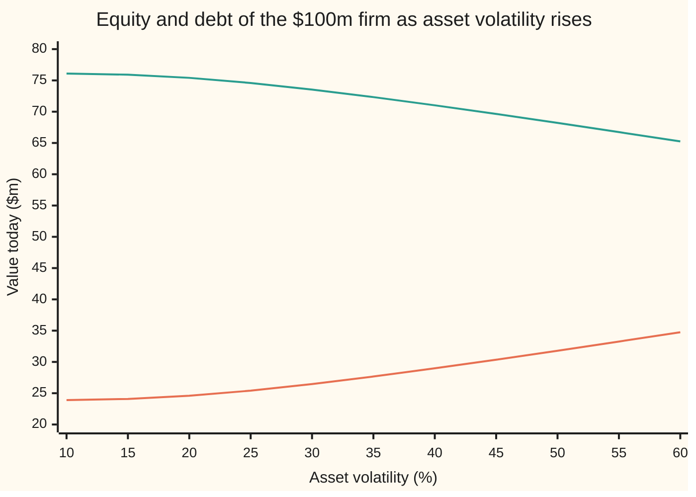
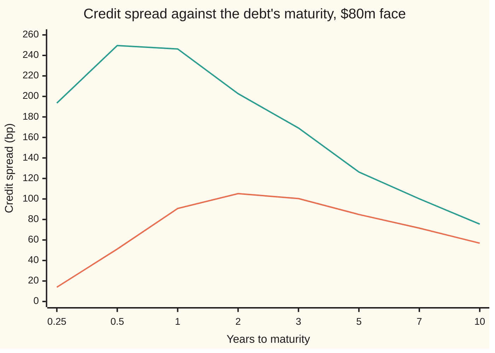

# How the balance-sheet claims move: volatility helps shareholders and hurts lenders, leverage and time widen the spread

[Syllabus](../../../SYLLABUS.md) → [Financial mathematics](../README.md) → [Structural Models - Default from the Balance Sheet](../README.md#s43) → How the balance-sheet claims move

---

## General Overview

A firm owns factories, stock and cash worth $100m today. It owes one debt: a single payment of $80m due in one year, with nothing paid before then. The value of its assets swings by about 20 percent a year. Cash in a riskless account earns 5 percent a year, continuously compounded.

Two groups hold claims on those assets. Lenders are owed the first $80m; shareholders keep the rest, or nothing if the assets fall short. Merton's model prices the shares as a call option on the assets, struck at the debt ([Merton's model](01-merton-model-equity-as-a-call.md)): $24.59m for the shares, $75.41m for the debt, $100m together.

Now the managers swap safe assets for risky ones of the same value, doubling the assets' volatility from 20 to 40 percent. The firm is still worth $100m. Yet the shares rise to $28.98m and the debt falls to $71.02m: $4.39m has moved from lenders to shareholders. The **credit spread**, the extra yield the debt pays over the riskless rate, jumps from 90.71 to 690.15 basis points (hundredths of a percent). If instead the assets fall to $90m, the shares drop to $15.75m, the spread reaches 246.27 bp, and the priced default probability rises from 10.28 to 23.00 percent.

This card measures those moves: the slope of each of five claims (equity, debt, the lenders' implied default insurance, default probability, spread) against each of five inputs (assets, asset volatility, the debt's face value, time, the rate), everything else held still. They are the option Greeks of [Delta](../09-The%20Greeks%2C%20one%20each/01-delta.md) and [Vega](../09-The%20Greeks%2C%20one%20each/03-vega.md), re-read on a balance sheet.

**Equity and debt split a pie of fixed size, so every input except the assets themselves only moves value from one side to the other; more volatility moves it to the shareholders, and more leverage or, for a sound firm, more time widens the spread.**

**What kind of fact this is:** a theorem inside a model. The slopes are proved on this card in Why it works. The model itself, assets that wander like a stock and one debt due on one date, is an assumption, not a law.

### The picture: one pie, two slices



Lower line: the equity. Upper line: the debt. They always add to $100m, so what one gains the other loses. Below 15 percent both are nearly flat: default is too unlikely for volatility to matter. From 20 percent on, the transfer exceeds $0.13m per volatility point and keeps growing.

---

## The formula

Notation first, in words. A slope with every other input frozen is a **partial derivative**, written with a curly d: $\partial E/\partial\sigma$ reads "the slope of the equity against volatility" ([Partial derivatives](../../06-Calculus%20and%20analysis/07-Several%20Variables/01-partial-derivatives.md)). $N(x)$ is the area under the standard bell curve to the left of $x$, and $\varphi(x)$ is the curve's height at $x$; the area grows at the rate of the height.

The centre of the card is one pair of slopes and one pair of splits:

$$\frac{\partial E}{\partial \sigma} \;=\; -\frac{\partial B}{\partial \sigma} \;=\; V\,\varphi(d_1)\sqrt{T} \;>\; 0, \qquad \frac{\partial E}{\partial V} = N(d_1), \qquad \frac{\partial B}{\partial V} = N(-d_1)$$

**Read it aloud: more volatility raises the equity by exactly what it takes from the debt, the option's vega; a new dollar of assets goes to the shareholders in proportion N(d1) and to the lenders in proportion N(−d1).**

| Symbol | Plain meaning | In our example | Push it up and the answer… |
| --- | --- | --- | --- |
| $V$ | market value of the firm's assets today | $100m | both claims rise; spread falls |
| $D$ | face value of the debt, its one payment | $80m | equity falls; spread +11.83 bp per $1m |
| $\sigma$ | asset volatility: standard deviation of the assets' yearly log return | 20% | equity up, debt down, spread +18.07 bp per point |
| $r$ | riskless rate, continuously compounded | 5% | equity up, debt down, spread −9.46 bp per point |
| $T$ | years until the debt is due | 1 | equity up; spread up here, down for long or distressed debt |
| $E$ | equity value: a call on the assets struck at $D$ | $24.59m | — |
| $B$ | debt value: the assets minus the equity, $V - E$ | $75.41m | — |
| $P$ | the lenders' default put: riskless debt minus risky debt, $De^{-rT} - B$ | $0.69m | — |
| $Q$ | default probability in the pricing (risk-neutral) world, where assets grow on average at $r$: $N(-d_2)$ | 10.28% | — |
| $s$, $y$ | credit spread $s = y - r$, where $y = -\ln(B/D)/T$ is the debt's yield | 90.71 bp | — |
| $d_1$, $d_2$ | how far the assets sit above the debt, in units of $\sigma\sqrt{T}$ | 1.4657 and 1.2657 | — |
| $N(x)$, $\varphi(x)$ | bell-curve area left of $x$, and height at $x$ | $N(d_1) = 0.9286$, $\varphi(d_1) = 0.1363$ | — |

The helpers are the Black–Scholes ones with the stock replaced by the assets, the strike by the debt, and no dividend:

$$d_1 = \frac{\ln(V/D) + (r + \tfrac12\sigma^2)\,T}{\sigma\sqrt{T}}, \qquad d_2 = d_1 - \sigma\sqrt{T}$$

In words: $d_2$ counts how many standard deviations over the debt's life, $\sigma\sqrt T$, the assets' log value can fall in the pricing world before the assets stop covering the debt; $d_1$ is one more.

### The Greeks, all of them

Each cell is the slope of the row's claim against the column's input. The debt's row is minus the equity's, except against assets; the reason is Step 0.

| Claim | to assets $V$ | to volatility $\sigma$ | to face $D$ | to time $T$ | to rate $r$ |
| --- | --- | --- | --- | --- | --- |
| Equity | $N(d_1)$ | $V\varphi(d_1)\sqrt T$ | $-e^{-rT}N(d_2)$ | $\frac{V\varphi(d_1)\sigma}{2\sqrt T} + rDe^{-rT}N(d_2)$ | $TDe^{-rT}N(d_2)$ |
| Debt | $N(-d_1)$ | $-V\varphi(d_1)\sqrt T$ | $e^{-rT}N(d_2)$ | minus the equity's | $-TDe^{-rT}N(d_2)$ |
| Put | $-N(-d_1)$ | $V\varphi(d_1)\sqrt T$ | $e^{-rT}N(-d_2)$ | the equity's minus $rDe^{-rT}$ | $-TDe^{-rT}N(-d_2)$ |
| Default prob. | $-\frac{\varphi(d_2)}{V\sigma\sqrt T}$ | $\frac{\varphi(d_2)\,d_1}{\sigma}$ | $\frac{\varphi(d_2)}{D\sigma\sqrt T}$ | $\frac{\varphi(d_2)\,[\ln(V/D) - (r - \frac12\sigma^2)T]}{2\sigma T^{3/2}}$ | $-\frac{\varphi(d_2)\sqrt T}{\sigma}$ |
| Spread | $-\frac{1}{TB}\frac{\partial B}{\partial V}$ | $-\frac{1}{TB}\frac{\partial B}{\partial \sigma}$ | $-\frac{1}{T}\left(\frac{1}{B}\frac{\partial B}{\partial D} - \frac{1}{D}\right)$ | $-\frac{1}{TB}\frac{\partial B}{\partial T} - \frac{y}{T}$ | $-\frac{1}{TB}\frac{\partial B}{\partial r} - 1$ |

The same table in numbers, per natural step: \$1m of assets, one volatility point, \$1m of face, one year, one rate point. Money in millions of dollars, the default probability as a fraction, the spread in basis points.

| Claim | +$1m of assets | +1 vol point | +$1m of face | +1 year | +1 rate point |
| --- | --- | --- | --- | --- | --- |
| Equity | 0.9286 | 0.1363 | −0.8534 | 4.7765 | 0.6827 |
| Debt | 0.0714 | −0.1363 | 0.8534 | −4.7765 | −0.6827 |
| Put | −0.0714 | 0.1363 | 0.0978 | 0.9715 | −0.0782 |
| Default prob. | −0.0090 | 0.0131 | 0.0112 | 0.0865 | −0.0090 |
| Spread (bp) | −9.46 | 18.07 | 11.83 | 42.68 | −9.46 |

### When it holds

- **Assets that wander like a stock, at one fixed volatility.** If volatility moves, each slope is only a first guess. Short spreads come out near zero (13.94 bp at three months), far below market quotes: [Where structural models break](06-where-structural-models-fail.md).
- **One zero-coupon debt, default only on its due date.** Default at the first touch of a barrier changes every slope: [Black-Cox](05-black-cox-first-passage-default.md).
- **No cost of going bust.** Then equity plus debt is the whole firm and the tug-of-war is zero-sum. With costs of default, volatility also shrinks the pie.
- **Pricing-world probabilities.** $Q$ prices the claims; it is not a forecast. With assets expected to grow 8 percent a year, the real-world chance is 7.84 percent: [Distance to default](03-distance-to-default-and-expected-default-frequency.md).
- **Small moves.** A slope is local. Doubling volatility with the slope at 20 percent predicts equity of $27.31m; the full reprice gives $28.98m.

---

## Why it works

### Step 0: the pie has a fixed size

Shareholders and lenders together own the firm, so $E + B = V$ at every moment. Volatility, face, time and rate leave $V$ unchanged, so against each of them the equity's slope and the debt's slope add to zero. Only the assets change the pie's size, and then the two slopes add to one.

So: find the equity's slopes, and the debt's are their mirror. The put, the default probability and the spread are then read off the debt and $d_2$.

### Step 1: the equity's slopes are a call's Greeks

The equity is $E = V N(d_1) - D e^{-rT} N(d_2)$: the Black–Scholes call with the assets as the stock and the debt as the strike. Its slope against the assets is the call's delta, $N(d_1) = 0.9286$. Its slope against volatility is the call's vega, $V\varphi(d_1)\sqrt{T}$. With assets of 100 and a height of 0.1363 that is 13.63 per unit of volatility, or \$0.1363m per point.

The other three slopes need one identity from the vega card: the share side and the cash side carry equal weight at the strike,

$$V\,\varphi(d_1) \;=\; D\,e^{-rT}\,\varphi(d_2).$$

For this firm both sides are 13.63. Differentiate $E$ against the face $D$: of the three terms, the two carrying $\varphi$ cancel by the identity, since $d_1$ and $d_2$ move together when $D$ moves. What survives is $-e^{-rT}N(d_2) = -0.8534$: each extra \$1m promised to lenders costs shareholders \$0.85m, not \$1m, because in the 10 percent of outcomes where the firm defaults the shareholders pay nothing anyway, and the payment is a year off.

The same cancellation gives the rate slope, $TDe^{-rT}N(d_2)$, which is 0.6827 per rate point: a higher rate shrinks today's value of the debt the shareholders must repay. For time, $d_1 - d_2 = \sigma\sqrt T$ itself grows with $T$, so one term survives the cancellation:

$$\frac{\partial E}{\partial T} \;=\; \underbrace{\frac{V\varphi(d_1)\,\sigma}{2\sqrt{T}}}_{\text{more room to swing}} \;+\; \underbrace{r\,D\,e^{-rT}N(d_2)}_{\text{repayment pushed further off}}$$

For this firm that is $1.3627 + 3.4137 = 4.7765$ per year. Both parts are positive. Shareholders always gain from debt that falls due later.

<details>
<summary>Detailed proof: the identity, and the cancellations</summary>

**The identity.** The bell-curve heights divide as $\varphi(d_1)/\varphi(d_2) = e^{-(d_1^2 - d_2^2)/2} = e^{-(d_1 - d_2)(d_1 + d_2)/2}$. Here $d_1 - d_2 = \sigma\sqrt T$ and $d_1 + d_2 = 2[\ln(V/D) + rT]/(\sigma\sqrt T)$, so the exponent is $-\ln(V/D) - rT$ and the ratio is $De^{-rT}/V$. Multiply out: $V\varphi(d_1) = De^{-rT}\varphi(d_2)$.

**The general slope.** For any input $x$, differentiating $E = VN(d_1) - De^{-rT}N(d_2)$ term by term gives
$$\frac{\partial E}{\partial x} = \frac{\partial V}{\partial x}N(d_1) - \frac{\partial (De^{-rT})}{\partial x}N(d_2) + V\varphi(d_1)\frac{\partial d_1}{\partial x} - De^{-rT}\varphi(d_2)\frac{\partial d_2}{\partial x}.$$
By the identity the last two terms are $V\varphi(d_1)\,\partial(d_1 - d_2)/\partial x = V\varphi(d_1)\,\partial(\sigma\sqrt T)/\partial x$.

- $x = V$: $N(d_1) + 0 = N(d_1)$.
- $x = \sigma$: $0 + V\varphi(d_1)\sqrt T$.
- $x = D$: $-e^{-rT}N(d_2) + 0$.
- $x = r$: $TDe^{-rT}N(d_2) + 0$.
- $x = T$: $rDe^{-rT}N(d_2) + V\varphi(d_1)\,\sigma/(2\sqrt T)$.

The debt's slopes are $\partial V/\partial x$ minus these; the put's are $\partial(De^{-rT})/\partial x$ minus the debt's.

</details>

### Step 2: the debt and the put, by subtraction

The debt is $B = V - E$, so its slope against the assets is $N(-d_1) = 0.0714$. Of each extra \$1m of assets, \$0.93m goes to shareholders and \$0.07m to lenders, whose claim is capped and already mostly safe. Against every other input the debt's slope is the equity's with the sign flipped.

The put, $P = De^{-rT} - B$, is the gap between a riskless and a risky promise of \$80m: the insurance the lenders have in effect sold the shareholders, who may hand over the assets instead of paying. Riskless debt ignores volatility, so the put gains the full vega, \$0.1363m per point. Against the assets its slope is $-N(-d_1) = -0.0714$.

### Step 3: the default probability, by the chain rule

In the pricing world the chance that the assets end below the debt is $Q = N(-d_2)$. The area $N$ grows at the rate of the height $\varphi$, so each slope of $Q$ is $-\varphi(d_2)$ times the slope of $d_2$.

The volatility slope needs care, because $\sigma$ sits in two places in $d_2$. Write $d_2 = [\ln(V/D) + rT]/(\sigma\sqrt T) - \tfrac12\sigma\sqrt T$. Its slope against $\sigma$ is $-[\ln(V/D) + rT]/(\sigma^2\sqrt T) - \tfrac12\sqrt T$, which is $-d_1/\sigma$. So

$$\frac{\partial Q}{\partial \sigma} = \frac{\varphi(d_2)\,d_1}{\sigma} = \frac{0.1791 \times 1.4657}{0.2} \text{ per unit} = 0.0131 \text{ per point}.$$

It has the sign of $d_1$. For any firm whose assets comfortably cover its debt $d_1 > 0$ (here 1.4657), so more volatility makes default likelier. A deeply insolvent firm, with $d_1 < 0$, is the exception: volatility lowers $Q$, yet the spread still widens, because the debt's value falls.

The assets and the rate enter $d_2$ only through $\ln V + rT$, so a rate one point higher acts like assets 1 percent higher. At \$100m of assets that is \$1m, which is why both default-probability slopes read −0.0090.

### Step 4: the spread, and why only leverage matters

The debt's yield $y$ solves $B = De^{-yT}$, so $y = -\ln(B/D)/T$, and the spread is $s = y - r$. A log's slope is one over its argument, so against the assets or the volatility

$$\frac{\partial s}{\partial x} = -\frac{1}{T\,B}\,\frac{\partial B}{\partial x}.$$

For volatility: 13.63 divided by 75.41, scaled to basis points per volatility point, is 18.07 bp.

Now scale the firm. Double assets and debt together and every dollar amount doubles, while $d_1$ and $d_2$ stay put. Equity is **homogeneous of degree one**: scaling both inputs by a factor scales the value by that factor. Two things follow.

First, the default probability and the spread depend on $V$ and $D$ only through their ratio. Call $De^{-rT}/V$ the firm's **leverage**, the riskless value of its debt as a share of its assets: 0.761 here. Assets falling to \$90m and face rising to \$88.89m give the same leverage, and the code prints the same 23.00 percent and 246.27 bp for both.

Second, Euler's rule for such functions: $E = V\,\partial E/\partial V + D\,\partial E/\partial D$. Here 100 × 0.9286 − 80 × 0.8534 = 24.59, the equity. The two slopes rebuild the price: a sharp check on both.

### Step 5: time, and the hump in the spread

Time pulls the spread two ways. More time lets the assets wander further, raising the default probability. But the loss is then spread over more years, and the pricing world's assets drift up at the riskless rate, away from the debt. The first wins early, the second late.

The default probability rises with maturity while $\ln(V/D) > (r - \tfrac12\sigma^2)T$, the bracket in the table's time cell. The spread turns earlier: it rises 42.68 bp per year at one year, peaks near two years at 105.21 bp, and falls to 56.87 bp at ten. For the \$90m firm the peak is already past: 246.27 bp at one year, 202.69 at two. "Time widens the spread" holds for a sound firm's short debt, not for a distressed firm's.

The code reaches all 25 slopes a second way, with none of this algebra: nudge each input up and down by a hundredth of a percent of its value, reprice, and divide the change in price by the change in input.

---

## Worked numbers, by hand

The firm: $V = 100$, $D = 80$, $\sigma = 20\%$, $r = 5\%$, $T = 1$. The inputs to every slope come from the Merton card.

| Step | Arithmetic | Value |
| --- | --- | --- |
| $d_1$, $d_2$ | from the Merton card | 1.4657, 1.2657 |
| $N(d_1)$, $N(d_2)$ | bell-curve areas | 0.9286, 0.8972 |
| $\varphi(d_1)$, $\varphi(d_2)$ | bell-curve heights | 0.1363, 0.1791 |
| equity per $1m of assets | $N(d_1)$ | 0.9286 |
| debt per $1m of assets | $1 - 0.9286$ | 0.0714 |
| equity per volatility point | $100 \times 0.1363 \times 1 \times 0.01$ | $0.1363m |
| equity per $1m of face | $-0.9512 \times 0.8972$ | −0.8534 |
| equity per year | $1.3627 + 3.4137$ | 4.7765 |
| equity per rate point | $1 \times 80 \times 0.9512 \times 0.8972 \times 0.01$ | 0.6827 |
| default probability per volatility point | $0.1791 \times 1.4657 / 0.2 \times 0.01$ | 0.0131 |
| spread per volatility point | $0.1363 / 75.41 \times 10^4$ | 18.07 bp |
| Euler check | $100 \times 0.9286 - 80 \times 0.8534$ | **24.59 = equity** |

So one volatility point moves $0.1363m from lenders to shareholders, adds 1.31 points to the chance of default, and adds 18.07 bp to the spread.

### What breaks if you drop a piece

| Mistake | Comes out at | What went wrong |
| --- | --- | --- |
| Equity at 40% volatility from the slope at 20% | $27.31m, truth $28.98m | Vega grows with volatility here |
| Spread at 40% volatility from the slope at 20% | 452.12 bp, truth 690.15 bp | The spread curves upward; a line undershoots |
| The put's delta read as the default probability | 7.14%, truth 10.28% | $N(-d_1)$ weights outcomes by the assets; default is $N(-d_2)$ |
| "Longer debt pays more" for the $90m firm | above 246.27 bp at two years; truth 202.69 bp | A distressed firm's curve slopes down |

The code prints every number in this table.

---

## One dial at a time: how the claims move

The mystery first: when volatility doubled, the firm's value did not move, yet the lenders lost $4.39m. The table turns one dial at a time from the base firm.

| Shock | Equity ($m) | Debt ($m) | Put ($m) | Default prob. | Spread (bp) |
| --- | --- | --- | --- | --- | --- |
| Base | 24.59 | 75.41 | 0.69 | 10.28% | 90.71 |
| Volatility 20% → 40% | 28.98 | 71.02 | 5.07 | 31.46% | 690.15 |
| Assets $100m → $90m | 15.75 | 74.25 | 1.85 | 23.00% | 246.27 |
| Face $80m → $88.89m | 17.50 | 82.50 | 2.06 | 23.00% | 246.27 |
| Maturity 1 → 2 years | 29.12 | 70.88 | 1.51 | 15.84% | 105.21 |
| Rate 5% → 6% | 25.27 | 74.73 | 0.61 | 9.41% | 81.65 |

The volatility, maturity and rate rows keep equity plus debt at $100m: pure transfers. The assets row shrinks the pie by $10m, and the shareholders absorb most of it. The face row puts a larger promise on the same assets and lands on exactly the $90m firm's default probability and spread, because the leverage is the same.

The spread under each shock, one block per 20 bp:

```
shock             credit spread (bp), one block = 20 bp
base              █████                                  90.71
volatility 40%    ███████████████████████████████████    690.15
assets $90m       ████████████                           246.27
face $88.89m      ████████████                           246.27
maturity 2 years  █████                                  105.21
rate 6%           ████                                   81.65
```

Volatility dominates. A rate rise narrows the spread: the pricing world's assets drift up faster, away from the debt.

The spread against maturity, for the base firm and the weaker one:



Lower line: the base firm, $100m of assets, rising from 13.94 bp at three months to 105.21 at two years, then falling. Upper line: the same debt on $90m of assets, peaking within the first year. The maturities on the x-axis are unevenly spaced.

---

## Code, from first principles, and it actually runs

Nothing imported knows the answer; the bell-curve area is Simpson's rule on the curve's height. Three roads. Road one: the closed forms and the Greek table above. Road two: nudge each input and reprice, never touching a Greek formula. Road three: average each claim's payoff over every asset value at maturity, with the default point found by bisection (halving an interval until it pins the root), never computing $d_1$ or $d_2$. The debt is priced there from its own payoff, the smaller of the assets and the face, so "equity plus debt is the firm" is tested, not assumed.

### Python

```python
# Structural model sensitivities -- the check behind the card.  Standard library
# only; nothing imported knows the answer.  N(x) is Simpson's rule on the bell
# curve's height.  Three roads: the card's Greek formulas; bumping the closed-form
# prices; and pricing every claim by integrating its payoff over the asset value
# at maturity, with the default point found by bisection (no d1, no d2).
from math import exp, log, sqrt, pi

def phi(x): return exp(-0.5 * x * x) / sqrt(2.0 * pi)      # bell-curve height

def simpson(f, a, b, n=2000):
    h = (b - a) / n
    s = f(a) + f(b)
    for i in range(1, n):
        s += (4 if i % 2 else 2) * f(a + i * h)
    return s * h / 3.0

def N(x):                                                   # bell-curve area left of x
    if abs(x) > 12.0: return 1.0 if x > 0 else 0.0
    return 0.5 + simpson(phi, 0.0, x)

def claims(V, D, s, r, T):                                  # road 1: closed forms
    vt = s * sqrt(T)
    d1 = (log(V / D) + (r + 0.5 * s * s) * T) / vt
    d2 = d1 - vt
    E = V * N(d1) - D * exp(-r * T) * N(d2)
    B = V - E
    return [E, B, D * exp(-r * T) - B, N(-d2), (-log(B / D) / T - r) * 1e4, d1, d2]

STEP = [1.0, 0.01, 1.0, 1.0, 0.01]                          # $1m, 1 vol point, $1m, 1 year, 1 rate point

def greeks(V, D, s, r, T):                                  # the card's table, per step
    E, B, P, Q, sp, d1, d2 = claims(V, D, s, r, T)
    DF, rt, y = exp(-r * T), sqrt(T), -log(B / D) / T
    eg = [N(d1), V * phi(d1) * rt, -DF * N(d2),
          V * phi(d1) * s / (2 * rt) + r * D * DF * N(d2), T * D * DF * N(d2)]
    bg = [1.0 - eg[0], -eg[1], -eg[2], -eg[3], -eg[4]]
    pg = [eg[0] - 1.0, eg[1], DF + eg[2], eg[3] - r * D * DF, eg[4] - T * D * DF]
    f = phi(d2)
    qg = [-f / (V * s * rt), f * d1 / s, f / (D * s * rt),
          f * (log(V / D) - (r - 0.5 * s * s) * T) / (2 * s * T * rt), -f * rt / s]
    sg = [-bg[0] / (T * B), -bg[1] / (T * B), -(bg[2] / B - 1.0 / D) / T,
          -bg[3] / (T * B) - y / T, -bg[4] / (T * B) - 1.0]
    sg = [g * 1e4 for g in sg]
    return [[g * h for g, h in zip(row, STEP)] for row in (eg, bg, pg, qg, sg)]

def bumped(V, D, s, r, T):                                  # road 2: bump and revalue
    x, out = [V, D, s, r, T], [[0.0] * 5 for _ in range(5)]
    for col, i in enumerate((0, 2, 1, 4, 3)):               # V, sigma, D, T, r
        h = 1e-4 * x[i]
        up, dn = x[:], x[:]
        up[i] += h; dn[i] -= h
        cu, cd = claims(*up), claims(*dn)
        for k in range(5):
            out[k][col] = (cu[k] - cd[k]) / (2 * h) * STEP[col]
    return out

def by_integral(V, D, s, r, T, drift=None):                 # road 3: average the payoffs
    m = (r if drift is None else drift) - 0.5 * s * s
    VT = lambda z: V * exp(m * T + s * sqrt(T) * z)
    lo, hi = -12.0, 12.0                                    # bisection for V_T = D
    for _ in range(200):
        mid = 0.5 * (lo + hi)
        if VT(mid) < D: lo = mid
        else: hi = mid
    zs, DF = 0.5 * (lo + hi), exp(-r * T)
    E = DF * simpson(lambda z: (VT(z) - D) * phi(z), zs, 12.0)
    B = DF * (simpson(lambda z: VT(z) * phi(z), -12.0, zs) + D * simpson(phi, zs, 12.0))
    return E, B, simpson(phi, -12.0, zs)

V, D, s, r, T = 100.0, 80.0, 0.20, 0.05, 1.0
E, B, P, Q, sp, d1, d2 = claims(V, D, s, r, T)
Ei, Bi, Qi = by_integral(V, D, s, r, T)
spi = (-log(Bi / D) / T - r) * 1e4
print("base: V 100, D 80, sigma 0.20, r 0.05, T 1; money in $m")
print(f"{'d1, d2':<28}{d1:12.6f}{d2:12.6f}")
print(f"{'N(d1), N(d2)':<28}{N(d1):12.6f}{N(d2):12.6f}")
print(f"{'phi(d1), phi(d2)':<28}{phi(d1):12.6f}{phi(d2):12.6f}")
print(f"{'e^-rT, leverage D e^-rT / V':<28}{exp(-r * T):12.6f}{D * exp(-r * T) / V:12.6f}")
print(f"{'dE/dT parts: vol, rate':<28}{V * phi(d1) * s / 2:12.6f}{r * D * exp(-r * T) * N(d2):12.6f}")
print(f"{'claim':<28}{'formula':>12}{'integral':>12}")
for lab, a, b in (("equity E", E, Ei), ("debt B", B, Bi), ("put P", P, D * exp(-r * T) - Bi),
                  ("default prob Q", Q, Qi), ("spread s (bp)", sp, spi)):
    print(f"{lab:<28}{a:12.6f}{b:12.6f}")
print(f"{'E + B by integral':<28}{Ei + Bi:12.6f}")
print(f"{'real-world Q, drift 0.08':<28}{by_integral(V, D, s, r, T, 0.08)[2]:12.6f}")

G, H = greeks(V, D, s, r, T), bumped(V, D, s, r, T)
print(f"{'per step':<16}{'$1m of V':>12}{'1 vol pt':>12}{'$1m of D':>12}{'1 year':>12}{'1 rate pt':>12}")
for k, lab in enumerate(("equity", "debt", "put", "prob Q", "spread bp")):
    for tag, M in (("form", G), ("bump", H)):
        print(f"{lab + ' ' + tag:<16}" + "".join(f"{v:12.6f}" for v in M[k]))
worst = max(abs(G[k][j] - H[k][j]) / max(1e-9, abs(G[k][j])) for k in range(5) for j in range(5))
print(f"{'formula vs bump, worst gap':<28}{'below 1e-5' if worst < 1e-5 else 'TOO BIG':>12}")

h = 1e-4                                                    # the tug-of-war, on road 3 only
vE = (by_integral(V, D, s + h, r, T)[0] - by_integral(V, D, s - h, r, T)[0]) / (2 * h)
vB = (by_integral(V, D, s + h, r, T)[1] - by_integral(V, D, s - h, r, T)[1]) / (2 * h)
print(f"{'integral vega E, B, |sum|':<28}{vE:12.6f}{vB:12.6f}{abs(vE + vB):12.6f}")
euler = V * G[0][0] + D * G[0][2]
print(f"{'V dE/dV + D dE/dD':<28}{euler:12.6f}")

print(f"{'scenario':<16}{'E':>10}{'B':>10}{'P':>10}{'Q %':>10}{'s bp':>10}")
scen = (("base", 100, 80, .2, .05, 1), ("sigma 0.40", 100, 80, .4, .05, 1), ("V 90", 90, 80, .2, .05, 1),
        ("D 88.89", 100, 800 / 9, .2, .05, 1), ("T 2", 100, 80, .2, .05, 2), ("r 0.06", 100, 80, .2, .06, 1))
gap = 0.0
for lab, *x in scen:
    c = claims(*x)
    gap = max(gap, abs(c[0] - by_integral(*x)[0]))
    print(f"{lab:<16}" + "".join(f"{v:10.2f}" for v in (c[0], c[1], c[2], 100 * c[3], c[4])))
print(f"{'scenarios, integral E gap':<28}{'below 1e-8' if gap < 1e-8 else 'TOO BIG':>12}")

sig = [0.10 + 0.05 * i for i in range(11)]
print("chart sigma " + " ".join(f"{v:7.2f}" for v in sig))
print("chart E     " + " ".join(f"{claims(V, D, v, r, T)[0]:7.2f}" for v in sig))
print("chart B     " + " ".join(f"{claims(V, D, v, r, T)[1]:7.2f}" for v in sig))
print("chart s bp  " + " ".join(f"{claims(V, D, v, r, T)[4]:7.2f}" for v in sig))
mats = [0.25, 0.5, 1, 2, 3, 5, 7, 10]
print("term T      " + " ".join(f"{t:7.2f}" for t in mats))
for lab, a in (("term V 100 ", 100.0), ("term V 90  ", 90.0)):
    print(lab + " " + " ".join(f"{claims(a, D, s, r, t)[4]:7.2f}" for t in mats))

c40 = claims(V, D, 0.40, r, T)
print(f"{'transfer, sigma 0.20 to 0.40':<28}{c40[0] - E:12.6f}{c40[1] - B:12.6f}")
print(f"{'wrong: linear E, sigma 0.40':<28}{E + G[0][1] * 20:12.6f}{c40[0]:12.6f}")
print(f"{'wrong: linear s, sigma 0.40':<28}{sp + G[4][1] * 20:12.6f}{c40[4]:12.6f}")
print(f"{'wrong: put delta as Q':<28}{-G[2][0]:12.6f}{Q:12.6f}")
print(f"{'wrong: longer is wider, V 90':<28}{claims(90, D, s, r, 1)[4]:12.6f}{claims(90, D, s, r, 2)[4]:12.6f}")

assert abs(E - Ei) < 1e-8, "equity: closed form vs payoff integral"
assert abs(B - Bi) < 1e-8, "debt: closed form vs payoff integral"
assert abs(Ei + Bi - V) < 1e-8, "equity plus debt, priced separately, is the firm"
assert worst < 1e-5, "every Greek formula vs bump-and-revalue"
assert abs(vE - G[0][1] * 100) < 1e-5, "equity vega: integral bump vs formula"
assert abs(vB + G[0][1] * 100) < 1e-5, "debt vega: integral bump vs minus the formula"
assert abs(euler - E) < 1e-6, "scaling: V dE/dV + D dE/dD must rebuild E"
assert abs(claims(90, 80, s, r, T)[4] - claims(100, 800 / 9, s, r, T)[4]) < 1e-9, "only leverage matters"
assert gap < 1e-8, "every scenario's equity, closed form vs integral"
assert abs(Q - Qi) < 1e-10, "default probability: N(-d2) vs the integral of the default region"
print("ALL CHECKS PASS")
```

**Ran 2026-09-28 on macOS, Python 3.14.6, standard library only. All checks passed. Output, pasted from the run:**

```
base: V 100, D 80, sigma 0.20, r 0.05, T 1; money in $m
d1, d2                          1.465718    1.265718
N(d1), N(d2)                    0.928637    0.897193
phi(d1), phi(d2)                0.136272    0.179073
e^-rT, leverage D e^-rT / V     0.951229    0.760984
dE/dT parts: vol, rate          1.362719    3.413745
claim                            formula    integral
equity E                       24.588835   24.588835
debt B                         75.411165   75.411165
put P                           0.687189    0.687189
default prob Q                  0.102807    0.102807
spread s (bp)                  90.712996   90.712996
E + B by integral             100.000000
real-world Q, drift 0.08        0.078429
per step            $1m of V    1 vol pt    $1m of D      1 year   1 rate pt
equity form         0.928637    0.136272   -0.853436    4.776465    0.682749
equity bump         0.928637    0.136272   -0.853436    4.776465    0.682749
debt form           0.071363   -0.136272    0.853436   -4.776465   -0.682749
debt bump           0.071363   -0.136272    0.853436   -4.776465   -0.682749
put form           -0.071363    0.136272    0.097793    0.971547   -0.078234
put bump           -0.071363    0.136272    0.097793    0.971547   -0.078234
prob Q form        -0.008954    0.013124    0.011192    0.086467   -0.008954
prob Q bump        -0.008954    0.013124    0.011192    0.086467   -0.008954
spread bp form     -9.463134   18.070526   11.828918   42.676596   -9.463134
spread bp bump     -9.463136   18.070526   11.828918   42.676597   -9.463134
formula vs bump, worst gap    below 1e-5
integral vega E, B, |sum|      13.627193  -13.627193    0.000000
V dE/dV + D dE/dD              24.588835
scenario                 E         B         P       Q %      s bp
base                 24.59     75.41      0.69     10.28     90.71
sigma 0.40           28.98     71.02      5.07     31.46    690.15
V 90                 15.75     74.25      1.85     23.00    246.27
D 88.89              17.50     82.50      2.06     23.00    246.27
T 2                  29.12     70.88      1.51     15.84    105.21
r 0.06               25.27     74.73      0.61      9.41     81.65
scenarios, integral E gap     below 1e-8
chart sigma    0.10    0.15    0.20    0.25    0.30    0.35    0.40    0.45    0.50    0.55    0.60
chart E       23.91   24.08   24.59   25.41   26.46   27.67   28.98   30.36   31.79   33.26   34.75
chart B       76.09   75.92   75.41   74.59   73.54   72.33   71.02   69.64   68.21   66.74   65.25
chart s bp     1.09   23.26   90.71  200.54  342.26  507.38  690.15  886.77 1094.72 1312.28 1538.24
term T         0.25    0.50    1.00    2.00    3.00    5.00    7.00   10.00
term V 100    13.94   51.17   90.71  105.21  100.40   84.86   71.57   56.87
term V 90    193.50  249.64  246.27  202.69  169.15  126.27  100.11   75.45
transfer, sigma 0.20 to 0.40    4.387572   -4.387572
wrong: linear E, sigma 0.40    27.314274   28.976408
wrong: linear s, sigma 0.40   452.123523  690.145252
wrong: put delta as Q           0.071363    0.102807
wrong: longer is wider, V 90  246.271782  202.685235
ALL CHECKS PASS
```

The formula and bump rows agree to six decimals, except the spread's slopes against assets and time, which differ in the sixth: the bump's rounding. The equity and debt vegas from the payoff integrals add to zero and match 13.63 from the formula.

### Rust

Same roads, same labels, built with `rustc --edition 2021 -O`.

```rust
// Structural model sensitivities -- the same check as the Python, in Rust.
// Standard library only, no crates.  N(x) is Simpson's rule on the bell curve's
// height.  Three roads: the card's Greek formulas; bumping the closed-form
// prices; and pricing every claim by integrating its payoff over the asset value
// at maturity, with the default point found by bisection (no d1, no d2).
use std::f64::consts::PI;

fn phi(x: f64) -> f64 { (-0.5 * x * x).exp() / (2.0 * PI).sqrt() }

fn simpson<F: Fn(f64) -> f64>(f: F, a: f64, b: f64, n: usize) -> f64 {
    let h = (b - a) / n as f64;
    let mut s = f(a) + f(b);
    for i in 1..n { s += if i % 2 == 1 { 4.0 } else { 2.0 } * f(a + i as f64 * h); }
    s * h / 3.0
}

fn n_cdf(x: f64) -> f64 {
    if x.abs() > 12.0 { return if x > 0.0 { 1.0 } else { 0.0 }; }
    0.5 + simpson(phi, 0.0, x, 2000)
}

// road 1: [E, B, P, Q, spread bp, d1, d2]
fn claims(v: f64, d: f64, s: f64, r: f64, t: f64) -> [f64; 7] {
    let vt = s * t.sqrt();
    let d1 = ((v / d).ln() + (r + 0.5 * s * s) * t) / vt;
    let d2 = d1 - vt;
    let e = v * n_cdf(d1) - d * (-r * t).exp() * n_cdf(d2);
    let b = v - e;
    [e, b, d * (-r * t).exp() - b, n_cdf(-d2), (-(b / d).ln() / t - r) * 1e4, d1, d2]
}

const STEP: [f64; 5] = [1.0, 0.01, 1.0, 1.0, 0.01]; // $1m, 1 vol point, $1m, 1 year, 1 rate point

fn greeks(v: f64, d: f64, s: f64, r: f64, t: f64) -> [[f64; 5]; 5] {
    let c = claims(v, d, s, r, t);
    let (b, d1, d2) = (c[1], c[5], c[6]);
    let (df, rt, y) = ((-r * t).exp(), t.sqrt(), -(b / d).ln() / t);
    let eg = [n_cdf(d1), v * phi(d1) * rt, -df * n_cdf(d2),
              v * phi(d1) * s / (2.0 * rt) + r * d * df * n_cdf(d2), t * d * df * n_cdf(d2)];
    let bg = [1.0 - eg[0], -eg[1], -eg[2], -eg[3], -eg[4]];
    let pg = [eg[0] - 1.0, eg[1], df + eg[2], eg[3] - r * d * df, eg[4] - t * d * df];
    let f = phi(d2);
    let qg = [-f / (v * s * rt), f * d1 / s, f / (d * s * rt),
              f * ((v / d).ln() - (r - 0.5 * s * s) * t) / (2.0 * s * t * rt), -f * rt / s];
    let sg = [-bg[0] / (t * b) * 1e4, -bg[1] / (t * b) * 1e4, -(bg[2] / b - 1.0 / d) / t * 1e4,
              (-bg[3] / (t * b) - y / t) * 1e4, (-bg[4] / (t * b) - 1.0) * 1e4];
    let mut out = [eg, bg, pg, qg, sg];
    for row in out.iter_mut() { for j in 0..5 { row[j] *= STEP[j]; } }
    out
}

fn bumped(v: f64, d: f64, s: f64, r: f64, t: f64) -> [[f64; 5]; 5] {
    let x = [v, d, s, r, t];
    let mut out = [[0.0; 5]; 5];
    for (col, &i) in [0usize, 2, 1, 4, 3].iter().enumerate() { // V, sigma, D, T, r
        let h = 1e-4 * x[i];
        let (mut up, mut dn) = (x, x);
        up[i] += h; dn[i] -= h;
        let cu = claims(up[0], up[1], up[2], up[3], up[4]);
        let cd = claims(dn[0], dn[1], dn[2], dn[3], dn[4]);
        for k in 0..5 { out[k][col] = (cu[k] - cd[k]) / (2.0 * h) * STEP[col]; }
    }
    out
}

// road 3: average the payoffs; returns (E, B, Q) under the given drift
fn by_integral(v: f64, d: f64, s: f64, r: f64, t: f64, drift: f64) -> (f64, f64, f64) {
    let m = drift - 0.5 * s * s;
    let vt = |z: f64| v * (m * t + s * t.sqrt() * z).exp();
    let (mut lo, mut hi) = (-12.0_f64, 12.0_f64);
    for _ in 0..200 {
        let mid = 0.5 * (lo + hi);
        if vt(mid) < d { lo = mid; } else { hi = mid; }
    }
    let (zs, df) = (0.5 * (lo + hi), (-r * t).exp());
    let e = df * simpson(|z| (vt(z) - d) * phi(z), zs, 12.0, 2000);
    let b = df * (simpson(|z| vt(z) * phi(z), -12.0, zs, 2000) + d * simpson(phi, zs, 12.0, 2000));
    (e, b, simpson(phi, -12.0, zs, 2000))
}

fn row(lab: &str, xs: &[f64]) -> String {
    format!("{:<28}{}", lab, xs.iter().map(|v| format!("{:12.6}", v)).collect::<String>())
}

fn line(lab: &str, xs: &[f64], dp: usize) -> String {
    format!("{}{}", lab, xs.iter().map(|v| format!(" {:7.*}", dp, v)).collect::<String>())
}

fn main() {
    let (v, d, s, r, t) = (100.0_f64, 80.0_f64, 0.20_f64, 0.05_f64, 1.0_f64);
    let [e, b, p, q, sp, d1, d2] = claims(v, d, s, r, t);
    let (ei, bi, qi) = by_integral(v, d, s, r, t, r);
    println!("base: V 100, D 80, sigma 0.20, r 0.05, T 1; money in $m");
    println!("{}", row("d1, d2", &[d1, d2]));
    println!("{}", row("N(d1), N(d2)", &[n_cdf(d1), n_cdf(d2)]));
    println!("{}", row("phi(d1), phi(d2)", &[phi(d1), phi(d2)]));
    println!("{}", row("e^-rT, leverage D e^-rT / V", &[(-r * t).exp(), d * (-r * t).exp() / v]));
    println!("{}", row("dE/dT parts: vol, rate", &[v * phi(d1) * s / 2.0, r * d * (-r * t).exp() * n_cdf(d2)]));
    println!("{:<28}{:>12}{:>12}", "claim", "formula", "integral");
    for (lab, a, c) in [("equity E", e, ei), ("debt B", b, bi), ("put P", p, d * (-r * t).exp() - bi),
                        ("default prob Q", q, qi), ("spread s (bp)", sp, (-(bi / d).ln() / t - r) * 1e4)] {
        println!("{}", row(lab, &[a, c]));
    }
    println!("{}", row("E + B by integral", &[ei + bi]));
    println!("{}", row("real-world Q, drift 0.08", &[by_integral(v, d, s, r, t, 0.08).2]));

    let (g, hb) = (greeks(v, d, s, r, t), bumped(v, d, s, r, t));
    println!("{:<16}{:>12}{:>12}{:>12}{:>12}{:>12}", "per step", "$1m of V", "1 vol pt", "$1m of D", "1 year", "1 rate pt");
    let mut worst = 0.0_f64;
    for (k, lab) in ["equity", "debt", "put", "prob Q", "spread bp"].iter().enumerate() {
        for (tag, m) in [("form", &g), ("bump", &hb)] {
            let cells: String = m[k].iter().map(|x| format!("{:12.6}", x)).collect();
            println!("{:<16}{}", format!("{} {}", lab, tag), cells);
        }
        for j in 0..5 { worst = worst.max((g[k][j] - hb[k][j]).abs() / g[k][j].abs().max(1e-9)); }
    }
    println!("{:<28}{:>12}", "formula vs bump, worst gap", if worst < 1e-5 { "below 1e-5" } else { "TOO BIG" });

    let (h, up, dn) = (1e-4, by_integral(v, d, s + 1e-4, r, t, r), by_integral(v, d, s - 1e-4, r, t, r)); // road 3 only
    let (ve, vb) = ((up.0 - dn.0) / (2.0 * h), (up.1 - dn.1) / (2.0 * h));
    println!("{}", row("integral vega E, B, |sum|", &[ve, vb, (ve + vb).abs()]));
    let euler = v * g[0][0] + d * g[0][2];
    println!("{}", row("V dE/dV + D dE/dD", &[euler]));

    println!("{:<16}{:>10}{:>10}{:>10}{:>10}{:>10}", "scenario", "E", "B", "P", "Q %", "s bp");
    let scen = [("base", 100.0, 80.0, 0.2, 0.05, 1.0), ("sigma 0.40", 100.0, 80.0, 0.4, 0.05, 1.0),
                ("V 90", 90.0, 80.0, 0.2, 0.05, 1.0), ("D 88.89", 100.0, 800.0 / 9.0, 0.2, 0.05, 1.0),
                ("T 2", 100.0, 80.0, 0.2, 0.05, 2.0), ("r 0.06", 100.0, 80.0, 0.2, 0.06, 1.0)];
    let mut gap = 0.0_f64;
    for (lab, a, dd, ss, rr, tt) in scen {
        let c = claims(a, dd, ss, rr, tt);
        gap = gap.max((c[0] - by_integral(a, dd, ss, rr, tt, rr).0).abs());
        let cells: String = [c[0], c[1], c[2], 100.0 * c[3], c[4]].iter().map(|x| format!("{:10.2}", x)).collect();
        println!("{:<16}{}", lab, cells);
    }
    println!("{:<28}{:>12}", "scenarios, integral E gap", if gap < 1e-8 { "below 1e-8" } else { "TOO BIG" });

    let sig: Vec<f64> = (0..11).map(|i| 0.10 + 0.05 * i as f64).collect();
    let pick = |k: usize| -> Vec<f64> { sig.iter().map(|&x| claims(v, d, x, r, t)[k]).collect() };
    println!("{}", line("chart sigma", &sig, 2));
    println!("{}", line("chart E    ", &pick(0), 2));
    println!("{}", line("chart B    ", &pick(1), 2));
    println!("{}", line("chart s bp ", &pick(4), 2));
    let mats = [0.25, 0.5, 1.0, 2.0, 3.0, 5.0, 7.0, 10.0];
    println!("{}", line("term T     ", &mats, 2));
    for (lab, a) in [("term V 100 ", 100.0), ("term V 90  ", 90.0)] {
        let xs: Vec<f64> = mats.iter().map(|&tt| claims(a, d, s, r, tt)[4]).collect();
        println!("{}", line(lab, &xs, 2));
    }

    let c40 = claims(v, d, 0.40, r, t);
    println!("{}", row("transfer, sigma 0.20 to 0.40", &[c40[0] - e, c40[1] - b]));
    println!("{}", row("wrong: linear E, sigma 0.40", &[e + g[0][1] * 20.0, c40[0]]));
    println!("{}", row("wrong: linear s, sigma 0.40", &[sp + g[4][1] * 20.0, c40[4]]));
    println!("{}", row("wrong: put delta as Q", &[-g[2][0], q]));
    println!("{}", row("wrong: longer is wider, V 90", &[claims(90.0, d, s, r, 1.0)[4], claims(90.0, d, s, r, 2.0)[4]]));

    assert!((e - ei).abs() < 1e-8, "equity: closed form vs payoff integral");
    assert!((b - bi).abs() < 1e-8, "debt: closed form vs payoff integral");
    assert!((ei + bi - v).abs() < 1e-8, "equity plus debt, priced separately, is the firm");
    assert!(worst < 1e-5, "every Greek formula vs bump-and-revalue");
    assert!((ve - g[0][1] * 100.0).abs() < 1e-5, "equity vega: integral bump vs formula");
    assert!((vb + g[0][1] * 100.0).abs() < 1e-5, "debt vega: integral bump vs minus the formula");
    assert!((euler - e).abs() < 1e-6, "scaling: V dE/dV + D dE/dD must rebuild E");
    assert!((claims(90.0, 80.0, s, r, t)[4] - claims(100.0, 800.0 / 9.0, s, r, t)[4]).abs() < 1e-9, "only leverage matters");
    assert!(gap < 1e-8, "every scenario's equity, closed form vs integral");
    assert!((q - qi).abs() < 1e-10, "default probability: N(-d2) vs the integral of the default region");
    println!("ALL CHECKS PASS");
}
```

**Ran 2026-09-28 on macOS, rustc 1.98.1, no crates. All checks passed. Output, pasted from the run:**

```
base: V 100, D 80, sigma 0.20, r 0.05, T 1; money in $m
d1, d2                          1.465718    1.265718
N(d1), N(d2)                    0.928637    0.897193
phi(d1), phi(d2)                0.136272    0.179073
e^-rT, leverage D e^-rT / V     0.951229    0.760984
dE/dT parts: vol, rate          1.362719    3.413745
claim                            formula    integral
equity E                       24.588835   24.588835
debt B                         75.411165   75.411165
put P                           0.687189    0.687189
default prob Q                  0.102807    0.102807
spread s (bp)                  90.712996   90.712996
E + B by integral             100.000000
real-world Q, drift 0.08        0.078429
per step            $1m of V    1 vol pt    $1m of D      1 year   1 rate pt
equity form         0.928637    0.136272   -0.853436    4.776465    0.682749
equity bump         0.928637    0.136272   -0.853436    4.776465    0.682749
debt form           0.071363   -0.136272    0.853436   -4.776465   -0.682749
debt bump           0.071363   -0.136272    0.853436   -4.776465   -0.682749
put form           -0.071363    0.136272    0.097793    0.971547   -0.078234
put bump           -0.071363    0.136272    0.097793    0.971547   -0.078234
prob Q form        -0.008954    0.013124    0.011192    0.086467   -0.008954
prob Q bump        -0.008954    0.013124    0.011192    0.086467   -0.008954
spread bp form     -9.463134   18.070526   11.828918   42.676596   -9.463134
spread bp bump     -9.463136   18.070526   11.828918   42.676597   -9.463134
formula vs bump, worst gap    below 1e-5
integral vega E, B, |sum|      13.627193  -13.627193    0.000000
V dE/dV + D dE/dD              24.588835
scenario                 E         B         P       Q %      s bp
base                 24.59     75.41      0.69     10.28     90.71
sigma 0.40           28.98     71.02      5.07     31.46    690.15
V 90                 15.75     74.25      1.85     23.00    246.27
D 88.89              17.50     82.50      2.06     23.00    246.27
T 2                  29.12     70.88      1.51     15.84    105.21
r 0.06               25.27     74.73      0.61      9.41     81.65
scenarios, integral E gap     below 1e-8
chart sigma    0.10    0.15    0.20    0.25    0.30    0.35    0.40    0.45    0.50    0.55    0.60
chart E       23.91   24.08   24.59   25.41   26.46   27.67   28.98   30.36   31.79   33.26   34.75
chart B       76.09   75.92   75.41   74.59   73.54   72.33   71.02   69.64   68.21   66.74   65.25
chart s bp     1.09   23.26   90.71  200.54  342.26  507.38  690.15  886.77 1094.72 1312.28 1538.24
term T         0.25    0.50    1.00    2.00    3.00    5.00    7.00   10.00
term V 100    13.94   51.17   90.71  105.21  100.40   84.86   71.57   56.87
term V 90    193.50  249.64  246.27  202.69  169.15  126.27  100.11   75.45
transfer, sigma 0.20 to 0.40    4.387572   -4.387572
wrong: linear E, sigma 0.40    27.314274   28.976408
wrong: linear s, sigma 0.40   452.123523  690.145252
wrong: put delta as Q           0.071363    0.102807
wrong: longer is wider, V 90  246.271782  202.685235
ALL CHECKS PASS
```

The two outputs are identical line for line.

> [!TIP]
> **Try changing**
> Guess the direction first, then check the output.
> - **Calm the assets to 10 percent volatility.** The spread falls to 1.09 bp and the equity to $23.91m: with default nearly impossible, the shares are close to assets minus discounted debt.
> - **Push volatility to 60 percent.** The equity reaches $34.75m, the debt $65.25m, the spread 1,538.24 bp. The transfer keeps accelerating.
> - **Lend for ten years instead of one.** The sound firm's spread falls to 56.87 bp; the weaker firm's to 75.45 bp. Both are past their humps.
> - **Raise the rate to 6 percent.** The default probability drops to 9.41 percent and the spread to 81.65 bp. In this model higher rates help lenders.

---

## The usual mistake

> [!warning]
> **Treating risk as bad for everyone who holds a claim.** It is bad for the lenders only. The shareholders own a call, and a call gains from volatility. Doubling asset volatility takes $4.39m from the lenders and hands exactly $4.39m to the shareholders, while the firm is worth the same $100m throughout. That is why lenders write covenants limiting what a firm may invest in.
>
> Smaller traps:
> - **Reading $N(-d_1)$ as the default probability.** It is the debt's slope against the assets, and minus the put's delta: 7.14 percent. The default chance is $N(-d_2)$, 10.28 percent.
> - **Stretching a slope across a big move.** From 20 to 40 percent volatility the slope predicts a spread of 452.12 bp; the truth is 690.15. Reprice for big moves.
> - **Assuming longer debt always pays more.** For the $90m firm, two-year debt pays 202.69 bp against 246.27 at one year.
> - **Reading the face slope as the effect of new borrowing.** It holds the assets fixed. Borrowing $8m that stays in the firm as cash raises the assets too. The face slope describes a larger promise on the same assets, as when borrowed money is paid out as a dividend.

---

## Where you meet it in real life

- **Risk shifting and covenants.** Managers acting for shareholders gain by swapping safe projects for risky ones of equal value, at the lenders' expense; Jensen and Meckling called this an agency cost of debt, and the vega row measures it. Bond covenants that restrict asset sales, new borrowing and payouts each freeze one dial of the table.
- **Borrowing to pay a dividend.** The promise grows and the assets do not. The existing lenders see the face column: 11.83 bp more spread per $1m.
- **Equity and credit move together.** When a firm's share price falls, its spread tends to widen: both are the assets column read in opposite directions. In the model, the ratio of the two asset slopes hedges the bond with the shares. Getting the unobservable assets and volatility from the share price is [Backing out the unobservable](04-asset-value-and-volatility-from-the-share-price.md).

> **Say it back**
> Equity and debt together own the firm, so any input that leaves the assets alone only moves value between them. Equity is a call on the assets, so its slopes are a call's Greeks, and the debt's are their mirror. Volatility helps shareholders and hurts lenders by the same amount, the vega. Default probability and spread depend on assets and debt only through leverage, and rise with it. Time widens a sound firm's short spread and narrows a distressed firm's.

---

## What this builds on

- [Merton's model](01-merton-model-equity-as-a-call.md): the five prices this card differentiates, and why equity is a call.
- [Delta](../09-The%20Greeks%2C%20one%20each/01-delta.md): the slope against the underlying, here $N(d_1)$ for the equity.
- [Vega](../09-The%20Greeks%2C%20one%20each/03-vega.md): the slope against volatility, and the identity that makes the cancellations in Step 1 work.

## Where this goes next

- [Backing out the unobservable](04-asset-value-and-volatility-from-the-share-price.md): runs the equity's delta backwards to recover the assets and their volatility from the share price.
- [Where structural models break](06-where-structural-models-fail.md): where these slopes disagree with markets, starting with the near-zero short spreads.

Every slope on this card needs the assets and their volatility, and neither trades; the share price does, and turning one into the other is the next problem.

---

## Sources

Verified 2026-09-28: every link below resolves to the publisher's page.

- Merton, Robert C. "On the Pricing of Corporate Debt: The Risk Structure of Interest Rates." *Journal of Finance* 29, no. 2 (1974): 449–470. [doi:10.1111/j.1540-6261.1974.tb03058.x](https://doi.org/10.1111/j.1540-6261.1974.tb03058.x). The model, and how its spread moves with leverage, volatility and time.
- Black, Fischer, and Myron Scholes. "The Pricing of Options and Corporate Liabilities." *Journal of Political Economy* 81, no. 3 (1973): 637–654. [doi:10.1086/260062](https://doi.org/10.1086/260062). The call formula, and shares as an option on the firm's assets.
- Galai, Dan, and Ronald W. Masulis. "The Option Pricing Model and the Risk Factor of Stock." *Journal of Financial Economics* 3, no. 1–2 (1976): 53–81. [doi:10.1016/0304-405X(76)90020-9](https://doi.org/10.1016/0304-405X(76)90020-9). How volatility and leverage move value between shareholders and lenders.
- Jensen, Michael C., and William H. Meckling. "Theory of the Firm: Managerial Behavior, Agency Costs and Ownership Structure." *Journal of Financial Economics* 3, no. 4 (1976): 305–360. [doi:10.1016/0304-405X(76)90026-X](https://doi.org/10.1016/0304-405X(76)90026-X). Risk shifting as an agency cost of debt.
- Lando, David. *Credit Risk Modeling: Theory and Applications*. Princeton University Press, 2004. [Publisher page](https://press.princeton.edu/books/hardcover/9780691089294/credit-risk-modeling). Merton spreads across maturities, hump included.
