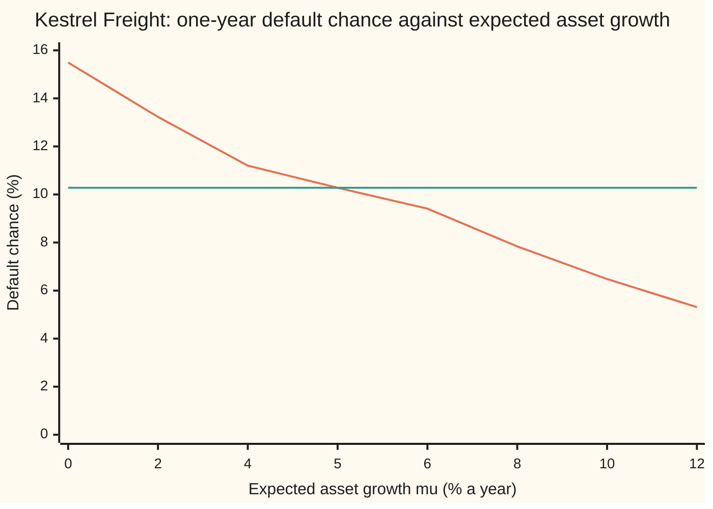
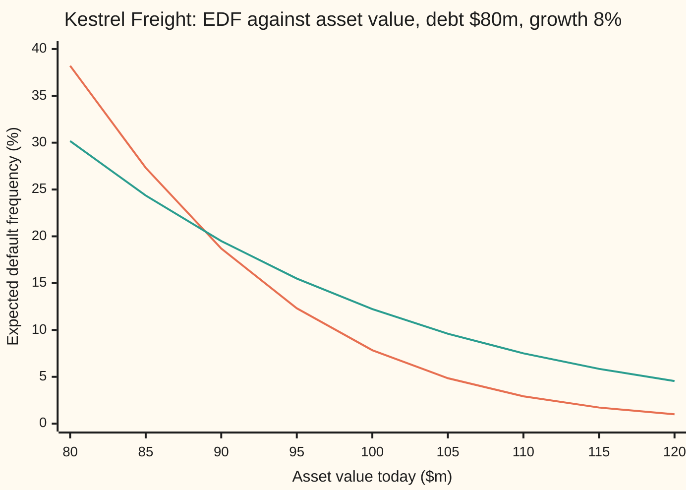

# Distance to default: how many standard deviations of bad luck the firm can absorb, and the KMV default frequency built on it

[Syllabus](../../../SYLLABUS.md) → [Financial mathematics](../README.md) → [Structural Models - Default from the Balance Sheet](../README.md#s43) → Distance to default

---

## General Overview

Kestrel Freight owns trucks, depots and contracts worth $100 million today. It owes one debt: $80 million, due in a single payment one year from now. Its assets swing in value by about 20% a year. If on the due date the assets are worth less than $80 million, the owners hand the firm to the lenders: that is default.

The firm has a cushion of $20 million. Whether that is a lot depends on how far the assets usually move. A $20 million cushion on assets that barely move is safe. The same cushion on assets that jump 50% a year is thin. So the natural yardstick is the cushion divided by the typical move: how many **standard deviations** (typical one-year swings) of bad luck the firm can take before its assets fall through the debt. That count is the **distance to default**. For Kestrel it is **1.416**.

A bank lending to Kestrel wants the chance of default over the year: an honest forecast, not a price. Turning the distance into that chance with the bell curve gives **7.84%**, the model's **expected default frequency**, or EDF. The KMV company (named for its founders Kealhofer, McQuown and Vasicek, and bought by Moody's in 2002) sold EDFs to banks, with the bell curve replaced by counted history. The option pricing of [Merton's model](01-merton-model-equity-as-a-call.md) gives a different default chance for the same firm, **10.28%**. The gap is not an error. The two numbers answer different questions, and they meet exactly when the assets are expected to grow at the riskless rate of 5%.

**Distance to default counts how many standard deviations the firm's assets can fall, under their real expected growth, before they drop below the debt; the bell-curve area beyond that count is the default forecast, and replacing real growth by the riskless rate turns it into the pricing probability.**

**What kind of fact this is:** a model. The asset value is assumed to wander like a stock in [Geometric Brownian motion](../../11-Stochastic%20processes%20and%20calculus/05-Brownian%20Motion/07-geometric-brownian-motion.md); inside that assumption the formulas below are theorems, proved on this card in Why it works. KMV keeps the distance and replaces the bell curve by a table fitted to history, which is a statistical choice, not a law.

### The picture: two default chances as the expected growth changes



Orange: the expected default frequency, which falls as the assets are expected to grow faster. Green: the pricing default chance, flat at 10.28%, because a price does not depend on anyone's forecast of growth. They cross at 5%, the riskless rate. Kestrel's real growth of 8% puts its forecast at 7.84%.

---

## The formula

Notation first, in words. $V$ is the asset value today and $V_T$ its value on the due date. $D$ is the debt due, $T$ the years until it is due, $\sigma$ ("sigma") the asset volatility, $\mu$ ("mu") the assets' real expected growth rate and $r$ the riskless rate. $N(x)$ is the bell-curve area to the left of $x$ ([Normal](../../09-Probability%20and%20statistics/04-Continuous%20Distributions/04-normal-distribution.md)). $DD$ is one symbol: the distance to default.

$$DD = \frac{\ln(V/D) + \left(\mu - \tfrac12\sigma^2\right)T}{\sigma\sqrt{T}}, \qquad EDF = N(-DD)$$

**Read it aloud:** the distance to default is the log-cushion plus the expected log-growth, divided by the size of one year's typical swing; the default forecast is the bell-curve area more than that many swings below the middle.

The pricing version replaces $\mu$ by $r$. It is Merton's $d_2$:

$$d_2 = \frac{\ln(V/D) + \left(r - \tfrac12\sigma^2\right)T}{\sigma\sqrt{T}}, \qquad \text{pricing default chance} = N(-d_2)$$

The two are one shift apart. Write $\lambda = (\mu - r)/\sigma$, the extra growth the assets earn per unit of swing:

$$DD = d_2 + \lambda\sqrt{T}, \qquad N(-d_2) = N\!\left(N^{-1}(EDF) + \lambda\sqrt{T}\right)$$

**Read it aloud:** the real-world distance is the pricing distance plus the risk reward measured in swings; to turn a forecast into a pricing chance, read its distance off the bell curve, move it that many swings closer to default, and read the curve again.

| Symbol | Plain meaning | In our example | Push it up and the answer… |
| --- | --- | --- | --- |
| $V$, $V_T$ | market value of all the firm's assets, today and on the due date | $100m today | distance grows, EDF falls |
| $D$ | the debt due: face value of the one zero-coupon loan | $80m | distance shrinks, EDF rises |
| $T$ | years until the debt is due | 1 | for Kestrel at $100m the EDF rises; near the debt it can fall |
| $\sigma$ | asset volatility: the typical yearly swing in the log of asset value ("sigma") | 20% | distance shrinks, EDF rises |
| $\mu$ | real expected growth rate of the assets ("mu") | 8% | distance grows, EDF falls |
| $r$ | riskless rate, continuously compounded | 5% | $d_2$ grows, pricing chance falls |
| $DD$ | distance to default, counted in standard deviations | 1.416 | — |
| $EDF$ | expected default frequency: the real-world chance that $V_T$ ends below $D$ | 7.84% | — |
| $N(x)$, $N^{-1}(p)$, $p$ | bell-curve area left of $x$; its inverse, the $x$ whose area is the chance $p$ | $N(-1.416) = 0.0784$ | — |
| $d_1$, $d_2$ | Merton's two distances; $d_2$ is $DD$ with $r$ for $\mu$, $d_1 = d_2 + \sigma\sqrt{T}$ | $d_2 = 1.266$ | — |
| $\lambda$ | market price of risk: $(\mu - r)/\sigma$, extra growth per unit of swing ("lambda") | 0.15 | the two default chances move apart |
| $Z$ | a standard bell-curve draw: mean 0, one standard deviation of 1 | — | — |

Three pieces of the top line, in words. $\ln(V/D)$ is the cushion measured in logs: 0.2231 for $100m against $80m. $(\mu - \tfrac12\sigma^2)T$ is how far the log of asset value is expected to travel by the due date. $\sigma\sqrt{T}$ is one standard deviation of that travel.

### When it holds

- **Asset value wanders like a stock, with a fixed swing size.** If volatility rises in bad times, as it does, the bell curve understates the chance of a large fall, and EDF comes out too low for weak firms.
- **One debt, due on one date.** Real firms owe many debts at many dates. KMV-style practice sets a **default point** (the debt level that triggers default) at short-term debt plus half of long-term debt, as Bharath and Shumway describe (convention verified 2026-09-28); the result depends on that choice.
- **Default is checked only on the due date.** A firm whose assets dip below its debt in March and recover by December survives here. [Black-Cox](05-black-cox-first-passage-default.md) counts those dips.
- **The asset value, its swing and its growth are known.** None is observed. $V$ and $\sigma$ are backed out of the share price in [Backing out the unobservable](04-asset-value-and-volatility-from-the-share-price.md); $\mu$ is an estimate, and a two-point error in it moves Kestrel's EDF by more than a point.
- **The bell curve's tail is right.** It is not, far from default. Step 5 shows by how much, and why KMV fits the tail to history.

---

## Why it works

### Step 0: measure the cushion in units of its own uncertainty

A $20 million cushion means nothing alone. What matters is how many typical swings it spans. Dividing the cushion by one standard deviation of the asset move turns a dollar amount into a count that means the same thing for a trucker and a bank. Two firms with the same count have the same chance of default, whatever their size. The rest of this section makes "cushion" and "swing" exact.

### Step 1: the log of asset value at the due date is a bell curve

Under the asset model of [Geometric Brownian motion](../../11-Stochastic%20processes%20and%20calculus/05-Brownian%20Motion/07-geometric-brownian-motion.md), asset value grows at expected rate $\mu$ with swings of size $\sigma$. Its logarithm then moves as a straight drift plus bell-curve noise:

$$\ln V_T = \ln V + \left(\mu - \tfrac12\sigma^2\right)T + \sigma\sqrt{T}\,Z.$$

The $-\tfrac12\sigma^2$ is the cost of swinging: a rise of a fifth followed by a fall of a fifth leaves less than the start. Ito's lemma turns that into exactly $\tfrac12\sigma^2$ a year. For Kestrel the log-drift is $0.08 - 0.02 = 0.06$ and one standard deviation is $0.20$.

### Step 2: default is the bell-curve draw falling below a line

Default happens when $V_T < D$, that is when $\ln V_T < \ln D$. Substitute Step 1 and move everything but $Z$ to the right:

$$Z < -\frac{\ln(V/D) + \left(\mu - \tfrac12\sigma^2\right)T}{\sigma\sqrt{T}} = -DD.$$

So default is one event: the year's standardised luck comes in more than $DD$ standard deviations below average. For Kestrel the top line is $0.2231 + 0.06 = 0.2831$, and $0.2831 / 0.20 = 1.416$.

### Step 3: the chance of that event is a bell-curve area

$Z$ is a standard bell-curve draw, so the chance it lands below $-DD$ is $N(-DD)$. For Kestrel, $N(-1.416) = 7.84\%$. That is the model's EDF.

### Step 4: the pricing chance is the same event with a different drift

A price averages payoffs in the pricing world, where every asset is expected to grow at the riskless rate $r$ ([Merton's model](01-merton-model-equity-as-a-call.md)). Repeat Steps 1 to 3 with $r$ in place of $\mu$ and the top line becomes 0.2531 and the distance $d_2 = 0.2531/0.20 = 1.266$, the chance $N(-1.266) = 10.28\%$.

Subtract the two distances. Everything cancels except the drifts:

$$DD - d_2 = \frac{(\mu - r)T}{\sigma\sqrt{T}} = \lambda\sqrt{T}.$$

For Kestrel $\lambda = 0.03/0.20 = 0.15$: the real world puts the firm 0.15 standard deviations further from default than prices do. When $\mu > r$, investors are paid for bearing the firm's risk, and the forecast is below the pricing chance; when $\mu < r$ the order reverses. When $\mu = r$ the shift is zero and the two coincide: at 5%, both are 10.28%.

<details>
<summary>Detailed proof: going from the forecast to the pricing chance, and back</summary>

**Existence and uniqueness.** $N$ rises strictly from 0 to 1 as $x$ runs over all numbers, and has no jumps. So for every $p$ strictly between 0 and 1 there is exactly one $x$ with $N(x) = p$: that $x$ is $N^{-1}(p)$. Bisection finds it: $N(-10) < p < N(10)$ for any $p$ met here, and halving the bracket 200 times pins it to machine precision.

**The conversion.** From Step 3, $EDF = N(-DD)$, so $N^{-1}(EDF) = -DD$. From Step 4, $-d_2 = -DD + \lambda\sqrt{T}$. Apply $N$: $N(-d_2) = N(N^{-1}(EDF) + \lambda\sqrt{T})$. For Kestrel, $N^{-1}(0.0784) = -1.416$, add 0.15, and $N(-1.266) = 10.28\%$.

**Boundaries.** An EDF of 0 or 1 has no inverse: the distance would be infinite, and no finite shift moves it. A firm with no swing, $\sigma = 0$, has no distance at all: its assets land exactly on $V e^{\mu T}$ and default is certain or impossible. As $T$ shrinks to 0, $DD$ runs to plus infinity when $V > D$, to minus infinity when $V < D$, and to 0 (an EDF of one half) when $V = D$: over an instant, only the cushion's sign matters.

</details>

### Step 5: why agencies calibrate the tail to history

Steps 1 to 3 give a ranking and a number. The ranking is robust: a firm further from default in swings is safer, under almost any shape of luck. The number is not. $N(-DD)$ assumes the year's luck is a bell curve, and a bell curve's tail thins very fast.

To see how much rides on that, keep the same spread of luck (variance 1) but use a fatter-tailed shape, the Laplace curve, whose tail is one half of $e^{-\sqrt{2} \times \text{distance}}$ at a given distance in standard deviations. The code also counts it among 400,000 simulated draws.

| Distance in swings | Bell curve $N(-k)$ | Fat tail, formula | Fat tail, counted | Fat over bell |
| --- | --- | --- | --- | --- |
| 1 | 15.8655% | 12.1558% | 12.1227% | 0.8 |
| 2 | 2.2750% | 2.9553% | 2.9490% | 1.3 |
| 3 | 0.1350% | 0.7185% | 0.7285% | 5.3 |
| 4 | 0.0032% | 0.1747% | 0.1745% | 55.2 |

Near default the two shapes agree within a few points. Four swings out they differ by a factor of 55.2. Both shapes have the same variance, so no amount of volatility estimation can tell them apart; only counted defaults can. That is what KMV does: sort thousands of firms by distance to default, count how many in each band actually defaulted within a year, and publish the counted frequency as the EDF for that band. The model supplies the distance. History supplies the curve that turns distance into a probability. The Laplace curve here is only an illustration of the effect, not a claim about which shape history picks.

### The other door: the practitioner's shortcut

Drop the logs and the drift, and the distance becomes cushion over swing in dollars: $(V - D)/(\sigma V) = 20/20 = 1.000$, whose bell-curve tail is 15.87%. That shortcut is how the idea is often first stated. It ranks firms almost the same way, and a history-fitted table absorbs much of the difference in level. Bharath and Shumway found that a naive distance, which skips solving for $V$ and $\sigma$, forecasts default about as well as the full model.

---

## Worked numbers, by hand

Kestrel Freight: $V = \$100$m, $D = \$80$m, $T = 1$ year, $\sigma = 20\%$, $\mu = 8\%$, $r = 5\%$.

| Step | Arithmetic | Value |
| --- | --- | --- |
| cushion in logs, $\ln(V/D)$ | $\ln(100/80) = \ln 1.25$ | 0.2231 |
| real log-drift, $\mu - \tfrac12\sigma^2$ | $0.08 - 0.02$ | 0.06 |
| top line | $0.2231 + 0.06 \times 1$ | 0.2831 |
| one standard deviation, $\sigma\sqrt{T}$ | $0.20 \times 1$ | 0.20 |
| **distance to default** | $0.2831 / 0.20$ | **1.416** |
| **EDF**, $N(-1.416)$ | bell-curve table | **7.84%** |
| pricing top line | $0.2231 + (0.05 - 0.02) \times 1$ | 0.2531 |
| $d_2$ | $0.2531 / 0.20$ | 1.266 |
| pricing default chance, $N(-1.266)$ | bell-curve table | 10.28% |
| shift, $\lambda\sqrt{T}$ | $(0.08 - 0.05)/0.20$ | 0.15 |

A bank holding Kestrel's loan should expect it to fail in roughly 7.84% of years like this one, while a buyer pricing the loan charges as if the chance were 10.28%. The 10.28% ties to Merton's card: equity $24.59m, risky debt $75.41m, default put $0.687m, credit spread 90.7 bp.

### What breaks if you drop a piece

| Mistake | Comes out at | What went wrong |
| --- | --- | --- |
| Log-drift $\mu$ in place of $\mu - \tfrac12\sigma^2$ | distance 1.516, EDF 6.48% | the swinging cost is dropped, so the median asset value is set too high |
| $N(+DD)$ in place of $N(-DD)$ | 92.16% | that is the chance of survival |
| $\sigma T$ in place of $\sigma\sqrt{T}$, three-year debt | EDF 25.08% (right: 12.23%) | swings add in variance, so the standard deviation grows with $\sqrt{T}$ |
| $r$ in place of $\mu$, reported as a forecast | 10.28% (right: 7.84%) | that is the pricing chance; it includes the risk premium |

The 6.48% in the first row equals the orange line at 10% growth: forgetting $\tfrac12\sigma^2 = 2\%$ acts like adding two points of growth.

---

## How distance to default moves

The debt is fixed. The asset value is not: KMV recomputes the distance every day from the share price. The same $80m debt looks very different as the assets drift.

### Force one: the asset value

One-year EDF, $\mu = 8\%$, as Kestrel's assets change. One block is 2 percentage points.

```
assets  $120m  ▌                      1.00%
assets  $110m  █▌                     2.92%
assets  $100m  ███▉                   7.84%
assets   $95m  ██████▏               12.32%
assets   $90m  █████████▍            18.70%
assets   $85m  █████████████▋        27.32%
assets   $80m  ███████████████████▏  38.21%
```

A fall from $100m to $90m, ten percent, lifts the forecast from 7.84% to 18.70%. The distance falls steadily, 1.416 to 0.889, but the bell-curve tail grows faster the closer it gets to the middle. At $80m the assets sit exactly on the debt; the forecast is still below 50%, 38.21%, because the assets are expected to grow for a year.

### Force two: the horizon

At $100m the one-year distance is 1.416. Over three years the cushion gains three years of drift, $3 \times 0.06$, but the swing grows by $\sqrt3$. The distance falls to 1.164 and the chance that the assets sit below the debt on a three-year due date rises to 12.23%.

### Both forces in one picture



Orange: debt due in one year. Green: the same debt due in three years. For a healthy firm, more time means more room for bad luck, so green sits above orange. For a firm at or near its debt, more time means more room to recover, so the lines cross just below $90m.

---

## Code, from first principles, and it actually runs

Both programs reach the EDF three independent ways: the formula $N(-DD)$ with a normal curve built from its series; Simpson's rule (adding up thin strips under a curve) applied to the density of the asset value in dollars from zero to the debt, which never forms $DD$; and 40,000 simulated asset paths stepped forward 100 times with $dV = \mu V\,dt + \sigma V\,dW$, which never uses the $-\tfrac12\sigma^2$ correction and recovers it. The pricing chance is reached three ways too: $N(-d_2)$ from Merton's $d_1$, Simpson at drift $r$, and the shift of the EDF by $\lambda$ through an inverse normal found by bisection (halving an interval until it traps the answer). The fat-tail table is computed by formula and by counting simulated draws. Every chart point, bar and what-breaks value is printed.

### Python

```python
# Distance to default and expected default frequency -- the check behind the card.
# Standard library only; the normal CDF, its inverse, the integrator and the random
# numbers are written here.  The firm: assets V = 100 ($m), one zero-coupon debt of
# D = 80 due in T = 1 year, asset volatility 20%, riskless rate 5%, real drift 8%.
from math import exp, log, sqrt, cos, pi

V, D, T, sigma, r, mu = 100.0, 80.0, 1.0, 0.20, 0.05, 0.08

def N(x):                                    # normal CDF from the Taylor series of erf
    z = x / sqrt(2.0)
    term, s = z, 0.0
    for n in range(120):                     # term = (-1)^n z^(2n+1) / n!
        s += term / (2 * n + 1)
        term *= -z * z / (n + 1)
    return 0.5 + s / sqrt(pi)

def N_inv(p):                                # bisection: N rises, so one root
    lo, hi = -10.0, 10.0
    for _ in range(200):
        mid = 0.5 * (lo + hi)
        lo, hi = (mid, hi) if N(mid) < p else (lo, mid)
    return 0.5 * (lo + hi)

def dd(v, drift, t):                         # distance to default, in standard deviations
    return (log(v / D) + (drift - 0.5 * sigma * sigma) * t) / (sigma * sqrt(t))

def pd_simpson(drift, t, n=4000):            # road 2: lognormal density of V_T, dollars 0 to D
    m, s = log(V) + (drift - 0.5 * sigma * sigma) * t, sigma * sqrt(t)
    f = lambda v: exp(-(log(v) - m) ** 2 / (2 * s * s)) / (v * s * sqrt(2 * pi))
    a, h = 1e-9, (D - 1e-9) / n
    return h / 3 * sum((1 if k in (0, n) else 4 if k % 2 else 2) * f(a + k * h) for k in range(n + 1))

state = 20260928                             # xorshift64* random numbers, same in the Rust
def uniform():
    global state
    state ^= state >> 12; state ^= (state << 25) & 0xFFFFFFFFFFFFFFFF; state ^= state >> 27
    return (((state * 0x2545F4914F6CDD1D) & 0xFFFFFFFFFFFFFFFF) >> 11) / 9007199254740992.0 + 1e-18

def normals():                               # Box-Muller: two uniforms in, two normals out
    u1, u2 = uniform(), uniform()
    rad = sqrt(-2.0 * log(u1))
    return rad * cos(2 * pi * u2), rad * cos(2 * pi * u2 - pi / 2)

def pd_euler(paths=40000, steps=100):        # road 3: dV = mu V dt + sigma V dW, step by step
    dt, hits = T / steps, 0
    for _ in range(paths // 2):
        a, b = V, V
        for _ in range(steps):
            z1, z2 = normals()
            a *= 1 + mu * dt + sigma * sqrt(dt) * z1
            b *= 1 + mu * dt + sigma * sqrt(dt) * z2
        hits += (a < D) + (b < D)
    return hits / paths

DD = dd(V, mu, T)
EDF, EDF_int, EDF_mc = N(-DD), pd_simpson(mu, T), pd_euler()
se = sqrt(EDF * (1 - EDF) / 40000)
d1 = (log(V / D) + (r + 0.5 * sigma * sigma) * T) / (sigma * sqrt(T))   # Merton's d1
d2 = d1 - sigma * sqrt(T)
Q, Q_int = N(-d2), pd_simpson(r, T)
lam = (mu - r) / sigma
Q_shift = N(N_inv(EDF) + lam * sqrt(T))      # road 4: from the real-world EDF to the pricing PD
E = V * N(d1) - D * exp(-r * T) * N(d2)
put = D * exp(-r * T) * N(-d2) - V * N(-d1)
spread = -log((V - E) / D) / T - r

rows = [("ln(V/D)", log(V / D)), ("real log drift mu - sigma^2/2", mu - 0.5 * sigma ** 2),
        ("one standard deviation, sigma sqrt T", sigma * sqrt(T)),
        ("top line, real drift", log(V / D) + (mu - 0.5 * sigma ** 2) * T),
        ("top line, r in place of mu", log(V / D) + (r - 0.5 * sigma ** 2) * T),
        ("DD, distance to default", DD), ("1 EDF = N(-DD)", EDF),
        ("2 EDF, Simpson over dollars", EDF_int), ("3 EDF, Euler paths, 40000", EDF_mc),
        ("  standard error of road 3", se), ("d2 = d1 - sigma sqrt T, Merton", d2),
        ("pricing PD = N(-d2)", Q), ("  pricing PD, Simpson", Q_int),
        ("lambda = (mu - r)/sigma", lam), ("DD - d2", DD - d2), ("N_inv(EDF)", N_inv(EDF)),
        ("4 pricing PD = N(N_inv(EDF) + lambda)", Q_shift), ("EDF at mu = 5%", N(-dd(V, 0.05, T))),
        ("house: equity", E), ("house: risky debt", V - E), ("house: default put", put),
        ("house: spread, bp", 10000 * spread), ("shortcut DD (V - D)/(sigma V)", (V - D) / (sigma * V)),
        ("  N(-shortcut)", N(-(V - D) / (sigma * V))),
        ("wrong: no -sigma^2/2, DD", (log(V / D) + mu * T) / (sigma * sqrt(T))),
        ("wrong: no -sigma^2/2, EDF", N(-(log(V / D) + mu * T) / (sigma * sqrt(T)))),
        ("wrong: N(+DD)", N(DD)), ("wrong: T = 3 with sigma T, EDF", N(-(log(V / D) + 0.06 * 3) / (sigma * 3))),
        ("  right: T = 3, EDF", N(-dd(V, mu, 3.0))), ("try: sigma = 30%, EDF", N(-(log(V / D) + (mu - 0.045)) / 0.3))]
for name, v in rows:
    print(f"{name:<40}{v:>12.6f}")

drifts = [0.0, 0.02, 0.04, 0.05, 0.06, 0.08, 0.10, 0.12]
print("chart, drift %     " + " ".join(f"{100 * m:6.0f}" for m in drifts))
print("chart, EDF %       " + " ".join(f"{100 * N(-dd(V, m, T)):6.2f}" for m in drifts))
print("chart, pricing PD %" + " ".join(f"{100 * Q:6.2f}" for m in drifts))
assets = [80.0 + 5 * k for k in range(9)]
print("moves, assets $m   " + " ".join(f"{v:6.0f}" for v in assets))
for t in (1.0, 3.0):
    print(f"moves, DD, T = {t:.0f}    " + " ".join(f"{dd(v, mu, t):6.3f}" for v in assets))
    print(f"moves, EDF %, T = {t:.0f} " + " ".join(f"{100 * N(-dd(v, mu, t)):6.2f}" for v in assets))

ks = [1.0, 2.0, 3.0, 4.0]                    # a fat tail with the same variance: Laplace
counts, M = [0, 0, 0, 0], 400000
for _ in range(M):
    u, w = uniform(), uniform()
    x = (-log(u) / sqrt(2)) * (1 if w < 0.5 else -1)
    counts = [c + (x < -k) for c, k in zip(counts, ks)]
for k, c in zip(ks, counts):
    print(f"tail at DD {k:.0f}: normal {100 * N(-k):8.4f}%  fat formula {100 * 0.5 * exp(-sqrt(2) * k):8.4f}%"
          f"  fat counted {100 * c / M:8.4f}%  ratio {0.5 * exp(-sqrt(2) * k) / N(-k):5.1f}")

assert abs(EDF - EDF_int) < 1e-8, "Simpson over dollars must land on N(-DD)"
assert abs(EDF_mc - EDF) < 4 * se, "Euler simulation within four standard errors"
assert abs(Q_shift - Q) < 1e-9, "shifting the EDF by lambda must give the pricing PD"
assert abs(Q_int - Q) < 1e-8, "pricing PD by integral over dollars at drift r"
assert abs(N(-dd(V, 0.05, T)) - Q_int) < 1e-8, "EDF at mu = r meets the integrated pricing PD"
assert abs(E - 24.59) < 0.005, "house equity, from the Merton card's numbers"
assert abs(DD - 1.415718) < 1e-6 and abs(EDF - 0.078429) < 1e-6, "the card's example: 1.416 and 7.84%"
assert abs(counts[3] / M - 0.5 * exp(-sqrt(2) * 4)) < 4 * sqrt(0.00175 / M), "counted fat tail"
print("ALL CHECKS PASS")
```

**Ran 2026-09-28 on macOS, Python 3.14.6, standard library only. All checks passed. Output, pasted from the run:**

```
ln(V/D)                                     0.223144
real log drift mu - sigma^2/2               0.060000
one standard deviation, sigma sqrt T        0.200000
top line, real drift                        0.283144
top line, r in place of mu                  0.253144
DD, distance to default                     1.415718
1 EDF = N(-DD)                              0.078429
2 EDF, Simpson over dollars                 0.078429
3 EDF, Euler paths, 40000                   0.077375
  standard error of road 3                  0.001344
d2 = d1 - sigma sqrt T, Merton              1.265718
pricing PD = N(-d2)                         0.102807
  pricing PD, Simpson                       0.102807
lambda = (mu - r)/sigma                     0.150000
DD - d2                                     0.150000
N_inv(EDF)                                 -1.415718
4 pricing PD = N(N_inv(EDF) + lambda)       0.102807
EDF at mu = 5%                              0.102807
house: equity                              24.588835
house: risky debt                          75.411165
house: default put                          0.687189
house: spread, bp                          90.712996
shortcut DD (V - D)/(sigma V)               1.000000
  N(-shortcut)                              0.158655
wrong: no -sigma^2/2, DD                    1.515718
wrong: no -sigma^2/2, EDF                   0.064795
wrong: N(+DD)                               0.921571
wrong: T = 3 with sigma T, EDF              0.250822
  right: T = 3, EDF                         0.122258
try: sigma = 30%, EDF                       0.194763
chart, drift %          0      2      4      5      6      8     10     12
chart, EDF %        15.49  13.23  11.20  10.28   9.41   7.84   6.48   5.31
chart, pricing PD % 10.28  10.28  10.28  10.28  10.28  10.28  10.28  10.28
moves, assets $m       80     85     90     95    100    105    110    115    120
moves, DD, T = 1     0.300  0.603  0.889  1.159  1.416  1.660  1.892  2.115  2.327
moves, EDF %, T = 1  38.21  27.32  18.70  12.32   7.84   4.85   2.92   1.72   1.00
moves, DD, T = 3     0.520  0.695  0.860  1.016  1.164  1.305  1.439  1.567  1.690
moves, EDF %, T = 3  30.17  24.36  19.50  15.49  12.23   9.60   7.51   5.85   4.55
tail at DD 1: normal  15.8655%  fat formula  12.1558%  fat counted  12.1227%  ratio   0.8
tail at DD 2: normal   2.2750%  fat formula   2.9553%  fat counted   2.9490%  ratio   1.3
tail at DD 3: normal   0.1350%  fat formula   0.7185%  fat counted   0.7285%  ratio   5.3
tail at DD 4: normal   0.0032%  fat formula   0.1747%  fat counted   0.1745%  ratio  55.2
ALL CHECKS PASS
```

### Rust

Same numbers, same labels, built with `rustc --edition 2021 -O`. The random numbers are the same xorshift64* stream in both, so the simulated lines match too.

```rust
// Distance to default and expected default frequency -- the same check as the Python.
// No crates; the normal CDF, its inverse, the integrator and the random numbers are
// written here.  The firm: assets V = 100 ($m), one zero-coupon debt of D = 80 due in
// T = 1 year, asset volatility 20%, riskless rate 5%, real drift 8%.
use std::f64::consts::PI;

const V: f64 = 100.0;
const D: f64 = 80.0;
const T: f64 = 1.0;
const SIGMA: f64 = 0.20;
const R: f64 = 0.05;
const MU: f64 = 0.08;

fn n_cdf(x: f64) -> f64 {                     // normal CDF from the Taylor series of erf
    let z = x / 2f64.sqrt();
    let (mut term, mut s) = (z, 0.0);
    for n in 0..120 {                         // term = (-1)^n z^(2n+1) / n!
        s += term / (2 * n + 1) as f64;
        term *= -z * z / (n + 1) as f64;
    }
    0.5 + s / PI.sqrt()
}

fn n_inv(p: f64) -> f64 {                     // bisection: N rises, so one root
    let (mut lo, mut hi) = (-10.0, 10.0);
    for _ in 0..200 {
        let mid = 0.5 * (lo + hi);
        if n_cdf(mid) < p { lo = mid } else { hi = mid }
    }
    0.5 * (lo + hi)
}

fn dd(v: f64, drift: f64, t: f64) -> f64 {    // distance to default, in standard deviations
    ((v / D).ln() + (drift - 0.5 * SIGMA * SIGMA) * t) / (SIGMA * t.sqrt())
}

fn pd_simpson(drift: f64, t: f64, n: usize) -> f64 {   // road 2: lognormal density, dollars 0 to D
    let (m, s) = (V.ln() + (drift - 0.5 * SIGMA * SIGMA) * t, SIGMA * t.sqrt());
    let f = |v: f64| (-(v.ln() - m).powi(2) / (2.0 * s * s)).exp() / (v * s * (2.0 * PI).sqrt());
    let (a, h) = (1e-9, (D - 1e-9) / n as f64);
    let mut sum = 0.0;
    for k in 0..=n {
        let w = if k == 0 || k == n { 1.0 } else if k % 2 == 1 { 4.0 } else { 2.0 };
        sum += w * f(a + k as f64 * h);
    }
    h / 3.0 * sum
}

struct Rng(u64);                              // xorshift64* random numbers, same in the Python
impl Rng {
    fn uniform(&mut self) -> f64 {
        self.0 ^= self.0 >> 12; self.0 ^= self.0 << 25; self.0 ^= self.0 >> 27;
        (self.0.wrapping_mul(0x2545F4914F6CDD1D) >> 11) as f64 / 9007199254740992.0 + 1e-18
    }
    fn normals(&mut self) -> (f64, f64) {     // Box-Muller: two uniforms in, two normals out
        let (u1, u2) = (self.uniform(), self.uniform());
        let rad = (-2.0 * u1.ln()).sqrt();
        (rad * (2.0 * PI * u2).cos(), rad * (2.0 * PI * u2 - PI / 2.0).cos())
    }
}

fn pd_euler(rng: &mut Rng, paths: usize, steps: usize) -> f64 {  // road 3: dV = mu V dt + sigma V dW
    let (dt, mut hits) = (T / steps as f64, 0usize);
    for _ in 0..paths / 2 {
        let (mut a, mut b) = (V, V);
        for _ in 0..steps {
            let (z1, z2) = rng.normals();
            a *= 1.0 + MU * dt + SIGMA * dt.sqrt() * z1;
            b *= 1.0 + MU * dt + SIGMA * dt.sqrt() * z2;
        }
        hits += (a < D) as usize + (b < D) as usize;
    }
    hits as f64 / paths as f64
}

fn row(v: &[f64], w: usize, p: usize) -> String {
    v.iter().map(|x| format!("{:>w$.p$}", x, w = w, p = p)).collect::<Vec<_>>().join(" ")
}

fn main() {
    let mut rng = Rng(20260928);
    let dd0 = dd(V, MU, T);
    let (edf, edf_int, edf_mc) = (n_cdf(-dd0), pd_simpson(MU, T, 4000), pd_euler(&mut rng, 40000, 100));
    let se = (edf * (1.0 - edf) / 40000.0).sqrt();
    let d1 = ((V / D).ln() + (R + 0.5 * SIGMA * SIGMA) * T) / (SIGMA * T.sqrt());   // Merton's d1
    let d2 = d1 - SIGMA * T.sqrt();
    let (q, q_int) = (n_cdf(-d2), pd_simpson(R, T, 4000));
    let lam = (MU - R) / SIGMA;
    let q_shift = n_cdf(n_inv(edf) + lam * T.sqrt());   // road 4: from the EDF to the pricing PD
    let e = V * n_cdf(d1) - D * (-R * T).exp() * n_cdf(d2);
    let put = D * (-R * T).exp() * n_cdf(-d2) - V * n_cdf(-d1);
    let spread = -((V - e) / D).ln() / T - R;
    let short = (V - D) / (SIGMA * V);
    let no_half = ((V / D).ln() + MU * T) / (SIGMA * T.sqrt());
    let rows: Vec<(&str, f64)> = vec![
        ("ln(V/D)", (V / D).ln()), ("real log drift mu - sigma^2/2", MU - 0.5 * SIGMA * SIGMA),
        ("one standard deviation, sigma sqrt T", SIGMA * T.sqrt()),
        ("top line, real drift", (V / D).ln() + (MU - 0.5 * SIGMA * SIGMA) * T),
        ("top line, r in place of mu", (V / D).ln() + (R - 0.5 * SIGMA * SIGMA) * T),
        ("DD, distance to default", dd0), ("1 EDF = N(-DD)", edf),
        ("2 EDF, Simpson over dollars", edf_int), ("3 EDF, Euler paths, 40000", edf_mc),
        ("  standard error of road 3", se), ("d2 = d1 - sigma sqrt T, Merton", d2),
        ("pricing PD = N(-d2)", q), ("  pricing PD, Simpson", q_int),
        ("lambda = (mu - r)/sigma", lam), ("DD - d2", dd0 - d2), ("N_inv(EDF)", n_inv(edf)),
        ("4 pricing PD = N(N_inv(EDF) + lambda)", q_shift), ("EDF at mu = 5%", n_cdf(-dd(V, 0.05, T))),
        ("house: equity", e), ("house: risky debt", V - e), ("house: default put", put),
        ("house: spread, bp", 10000.0 * spread), ("shortcut DD (V - D)/(sigma V)", short),
        ("  N(-shortcut)", n_cdf(-short)),
        ("wrong: no -sigma^2/2, DD", no_half), ("wrong: no -sigma^2/2, EDF", n_cdf(-no_half)),
        ("wrong: N(+DD)", n_cdf(dd0)),
        ("wrong: T = 3 with sigma T, EDF", n_cdf(-((V / D).ln() + 0.06 * 3.0) / (SIGMA * 3.0))),
        ("  right: T = 3, EDF", n_cdf(-dd(V, MU, 3.0))),
        ("try: sigma = 30%, EDF", n_cdf(-((V / D).ln() + (MU - 0.045)) / 0.3)),
    ];
    for (name, v) in &rows { println!("{:<40}{:>12.6}", name, v) }

    let drifts = [0.0, 0.02, 0.04, 0.05, 0.06, 0.08, 0.10, 0.12];
    println!("chart, drift %     {}", row(&drifts.iter().map(|m| 100.0 * m).collect::<Vec<_>>(), 6, 0));
    println!("chart, EDF %       {}", row(&drifts.iter().map(|&m| 100.0 * n_cdf(-dd(V, m, T))).collect::<Vec<_>>(), 6, 2));
    println!("chart, pricing PD %{}", row(&drifts.iter().map(|_| 100.0 * q).collect::<Vec<_>>(), 6, 2));
    let assets: Vec<f64> = (0..9).map(|k| 80.0 + 5.0 * k as f64).collect();
    println!("moves, assets $m   {}", row(&assets, 6, 0));
    for t in [1.0, 3.0] {
        println!("moves, DD, T = {:.0}    {}", t, row(&assets.iter().map(|&v| dd(v, MU, t)).collect::<Vec<_>>(), 6, 3));
        println!("moves, EDF %, T = {:.0} {}", t, row(&assets.iter().map(|&v| 100.0 * n_cdf(-dd(v, MU, t))).collect::<Vec<_>>(), 6, 2));
    }

    let ks = [1.0, 2.0, 3.0, 4.0];            // a fat tail with the same variance: Laplace
    let (mut counts, m) = ([0usize; 4], 400000usize);
    for _ in 0..m {
        let (u, w) = (rng.uniform(), rng.uniform());
        let x = (-u.ln() / 2f64.sqrt()) * if w < 0.5 { 1.0 } else { -1.0 };
        for (c, k) in counts.iter_mut().zip(ks.iter()) { *c += (x < -k) as usize }
    }
    for (k, c) in ks.iter().zip(counts.iter()) {
        let fat = 0.5 * (-(2f64.sqrt()) * k).exp();
        println!("tail at DD {:.0}: normal {:>8.4}%  fat formula {:>8.4}%  fat counted {:>8.4}%  ratio {:>5.1}", k,
                 100.0 * n_cdf(-k), 100.0 * fat, 100.0 * *c as f64 / m as f64, fat / n_cdf(-k));
    }

    assert!((edf - edf_int).abs() < 1e-8, "Simpson over dollars must land on N(-DD)");
    assert!((edf_mc - edf).abs() < 4.0 * se, "Euler simulation within four standard errors");
    assert!((q_shift - q).abs() < 1e-9, "shifting the EDF by lambda must give the pricing PD");
    assert!((q_int - q).abs() < 1e-8, "pricing PD by integral over dollars at drift r");
    assert!((n_cdf(-dd(V, 0.05, T)) - q_int).abs() < 1e-8, "EDF at mu = r meets the integrated pricing PD");
    assert!((e - 24.59).abs() < 0.005, "house equity, from the Merton card's numbers");
    assert!((dd0 - 1.415718).abs() < 1e-6 && (edf - 0.078429).abs() < 1e-6, "the card's example: 1.416 and 7.84%");
    assert!((counts[3] as f64 / m as f64 - 0.5 * (-(2f64.sqrt()) * 4.0).exp()).abs() < 4.0 * (0.00175 / m as f64).sqrt(), "counted fat tail");
    println!("ALL CHECKS PASS");
}
```

**Ran 2026-09-28 on macOS, rustc 1.98.1, no crates. All checks passed. Output, pasted from the run:**

```
ln(V/D)                                     0.223144
real log drift mu - sigma^2/2               0.060000
one standard deviation, sigma sqrt T        0.200000
top line, real drift                        0.283144
top line, r in place of mu                  0.253144
DD, distance to default                     1.415718
1 EDF = N(-DD)                              0.078429
2 EDF, Simpson over dollars                 0.078429
3 EDF, Euler paths, 40000                   0.077375
  standard error of road 3                  0.001344
d2 = d1 - sigma sqrt T, Merton              1.265718
pricing PD = N(-d2)                         0.102807
  pricing PD, Simpson                       0.102807
lambda = (mu - r)/sigma                     0.150000
DD - d2                                     0.150000
N_inv(EDF)                                 -1.415718
4 pricing PD = N(N_inv(EDF) + lambda)       0.102807
EDF at mu = 5%                              0.102807
house: equity                              24.588835
house: risky debt                          75.411165
house: default put                          0.687189
house: spread, bp                          90.712996
shortcut DD (V - D)/(sigma V)               1.000000
  N(-shortcut)                              0.158655
wrong: no -sigma^2/2, DD                    1.515718
wrong: no -sigma^2/2, EDF                   0.064795
wrong: N(+DD)                               0.921571
wrong: T = 3 with sigma T, EDF              0.250822
  right: T = 3, EDF                         0.122258
try: sigma = 30%, EDF                       0.194763
chart, drift %          0      2      4      5      6      8     10     12
chart, EDF %        15.49  13.23  11.20  10.28   9.41   7.84   6.48   5.31
chart, pricing PD % 10.28  10.28  10.28  10.28  10.28  10.28  10.28  10.28
moves, assets $m       80     85     90     95    100    105    110    115    120
moves, DD, T = 1     0.300  0.603  0.889  1.159  1.416  1.660  1.892  2.115  2.327
moves, EDF %, T = 1  38.21  27.32  18.70  12.32   7.84   4.85   2.92   1.72   1.00
moves, DD, T = 3     0.520  0.695  0.860  1.016  1.164  1.305  1.439  1.567  1.690
moves, EDF %, T = 3  30.17  24.36  19.50  15.49  12.23   9.60   7.51   5.85   4.55
tail at DD 1: normal  15.8655%  fat formula  12.1558%  fat counted  12.1227%  ratio   0.8
tail at DD 2: normal   2.2750%  fat formula   2.9553%  fat counted   2.9490%  ratio   1.3
tail at DD 3: normal   0.1350%  fat formula   0.7185%  fat counted   0.7285%  ratio   5.3
tail at DD 4: normal   0.0032%  fat formula   0.1747%  fat counted   0.1745%  ratio  55.2
ALL CHECKS PASS
```

The two outputs match line for line.

> [!TIP]
> **Try changing**
> Guess first, then run.
> - **A jumpier business.** The `try` row sets $\sigma$ to 30%. Guess: the EDF rises. It more than doubles, to **19.48%**: the swing grows, and the swinging cost $\tfrac12\sigma^2$ grows with its square.
> - **Faster expected growth.** Set `mu` to 0.12. The EDF falls to **5.31%**, the last point of the orange line in the first chart. The pricing chance stays at 10.28%, and the shift assert still holds with the larger $\lambda$.
> - **Assets down to $90m.** Set `V` to 90. The distance falls to 0.889 and the EDF to **18.70%**. The house-equity assert stops the run, since it is pinned to $100m.
> - **Change the seed.** Replace 20260928. The Euler line moves by about one standard error, 0.0013, the fat-tail counts shift slightly, and the formula roads do not move.

---

## The usual mistake

> [!warning]
> **Treating the EDF and the pricing default chance as rival estimates of one number.** They answer different questions. The EDF (7.84%) is a forecast: how often firms like Kestrel fail. The pricing chance (10.28%) is the weight a price puts on default, and it includes pay for bearing the risk. Pricing a loan with 7.84% leaves it too dear; setting capital against 10.28% overstates how often losses arrive. [Two default probabilities](../42-Credit%20Default%20Swaps%20-%20Pricing%2C%20the%20Par%20Spread%20and%20the%20Hazard%20Behind%20It/09-market-implied-versus-historical-default-probability.md) measures the same gap from market quotes.
>
> - **Dropping the swinging cost.** Using $\mu$ as the log-drift gives a distance of 1.516 and an EDF of 6.48%, as if the firm grew two points faster.
> - **Scaling the swing with $T$.** For three-year debt, $\sigma T$ gives 25.08% where $\sigma\sqrt{T}$ gives 12.23%.
> - **Trusting the bell curve far out.** A distance of 4 reads as 0.0032% on the bell curve; a fat tail with the same variance says 0.1747%. Far from default, the level comes from counted history, not from $N$.
> - **Book value for $V$.** The distance uses the market value of assets, not the balance-sheet figure. Book values move slowly and hide exactly the fall the distance is meant to catch.

---

## Where you meet it in real life

- **Moody's EDF.** The KMV product, now sold by Moody's, publishes a daily default frequency for listed firms: a distance to default from the share price, mapped through a history-fitted table.
- **Bank loan monitoring.** Credit officers watch a borrower's distance to default between annual reviews. A fall from 1.4 to 0.9 standard deviations, as a ten percent asset fall does for Kestrel, flags the loan long before a missed payment.
- **Default forecasting research.** Bharath and Shumway tested the distance as a predictor of real defaults. Vassalou and Xing computed a Merton default measure for each firm each month to study how default risk shows up in share returns.
- **Rating tables.** The counted frequencies KMV fits are the same kind of evidence as a rating agency's default table: [Rating transition matrices](../41-Default%2C%20Survival%20and%20the%20Hazard%20Rate/04-rating-transition-matrix-and-cumulative-default-rates.md).
- **Sensitivities.** How equity, debt and the default put move as asset value and volatility change: [How the balance-sheet claims move](02-structural-model-sensitivities.md).

> **Say it back**
> Distance to default is the firm's log-cushion plus its expected log-growth, divided by one standard deviation of the asset move. For a firm with $100m of assets, $80m of debt, 20% volatility and 8% growth it is 1.416, and the bell-curve area beyond it is a 7.84% default forecast. Replacing the real growth by the riskless rate gives Merton's pricing chance, 10.28%, one shift of $\lambda\sqrt{T}$ away; at growth equal to the riskless rate the two coincide. The distance ranks firms well, but the bell curve's tail is too thin far from default, so KMV turns distance into probability with counted history.

---

## What this builds on

- [Merton's model](01-merton-model-equity-as-a-call.md): the firm as assets against one debt, and the pricing default chance $N(-d_2)$ this card compares against.
- [Geometric Brownian motion](../../11-Stochastic%20processes%20and%20calculus/05-Brownian%20Motion/07-geometric-brownian-motion.md): why the log of asset value at the due date is a bell curve, and where the $-\tfrac12\sigma^2$ comes from.

## Where this goes next

- [Backing out the unobservable](04-asset-value-and-volatility-from-the-share-price.md): finding $V$ and $\sigma$, which this card took as given, from the share price and its volatility.
- [Black-Cox](05-black-cox-first-passage-default.md): default the first time the assets touch a barrier, not only on the due date.
- [Where structural models break](06-where-structural-models-fail.md): short-dated spreads the model cannot produce, and the other gaps between structural models and markets.

The distance needs an asset value and an asset volatility that no one observes; the question left open is how to read both from the share price.

---

## Sources

Verified 2026-09-28: every link below resolves to the publisher's page.

- Merton, Robert C. "On the Pricing of Corporate Debt: The Risk Structure of Interest Rates." *Journal of Finance* 29, no. 2 (1974): 449–470. [doi:10.1111/j.1540-6261.1974.tb03058.x](https://doi.org/10.1111/j.1540-6261.1974.tb03058.x). The firm-value model the distance is built on.
- Bharath, Sreedhar T., and Tyler Shumway. "Forecasting Default with the Merton Distance to Default Model." *Review of Financial Studies* 21, no. 3 (2008): 1339–1369. [doi:10.1093/rfs/hhn044](https://doi.org/10.1093/rfs/hhn044). The distance tested against real defaults; the default point; the simplified version.
- Vassalou, Maria, and Yuhang Xing. "Default Risk in Equity Returns." *Journal of Finance* 59, no. 2 (2004): 831–868. [doi:10.1111/j.1540-6261.2004.00650.x](https://doi.org/10.1111/j.1540-6261.2004.00650.x). A Merton default measure computed firm by firm, month by month.
- Duffie, Darrell, and Kenneth J. Singleton. *Credit Risk: Pricing, Measurement, and Management*. Princeton University Press, 2003. [Publisher page](https://press.princeton.edu/books/hardcover/9780691090467/credit-risk). Structural models, the KMV approach, and the gap between actual and pricing default probabilities.
