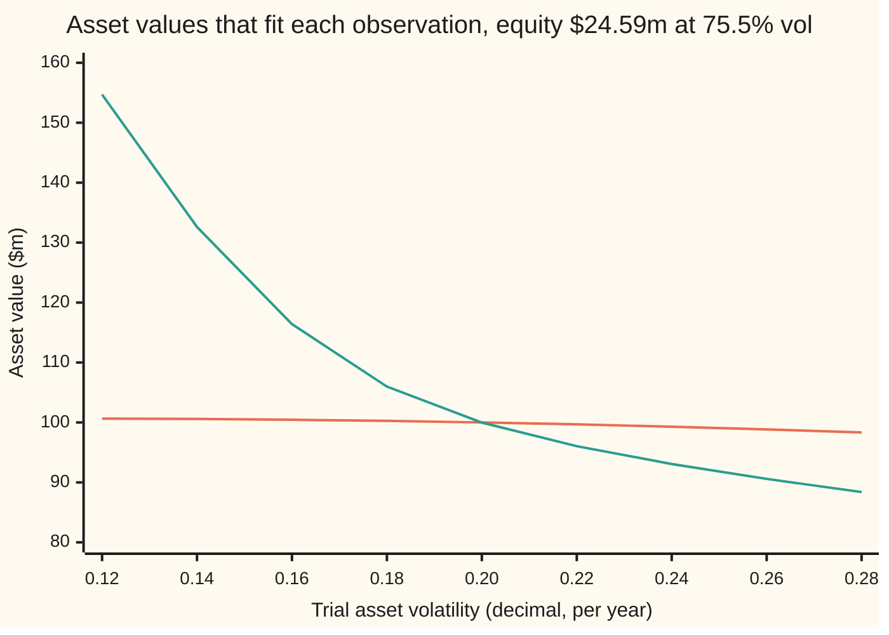
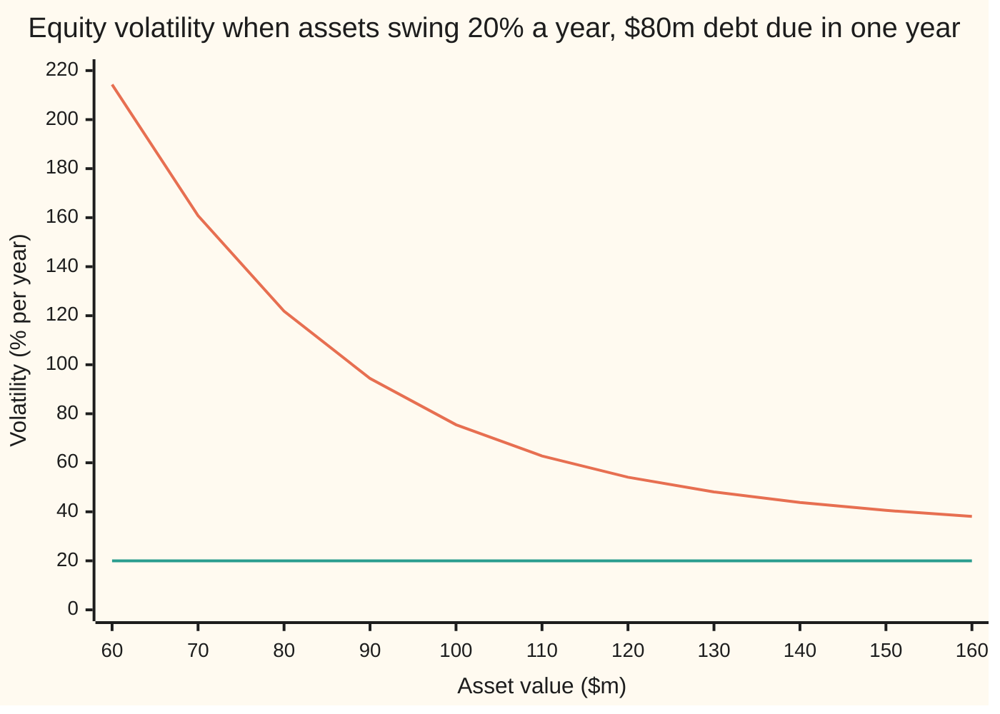

# Backing out the unobservable: asset value and asset volatility from the share price and its volatility, two equations in two unknowns

[Syllabus](../../../SYLLABUS.md) → [Financial mathematics](../../../SYLLABUS.md#w12) → [Structural Models - Default from the Balance Sheet](../../../SYLLABUS.md#w12-s43) → Backing out the unobservable

---

## General Overview

A lender looks at a firm from the outside. Its shares trade every day, and all of them together are worth **$24.59 million**. Their price swings about **75.5%** a year, measured the usual way: the spread of daily returns, scaled up to a year. The firm owes one lump of debt, **$80 million**, due in one year. The riskless rate is 5%.

The lender wants two other numbers: what the firm's assets are worth, and how much that value swings. Those two drive every default measure on this shelf. Neither trades. A factory, a patent and a customer list have no ticker. The balance sheet gives book values, which are months old and measured at cost.

Merton's model says the shares are a call option on the assets, with the debt as the strike ([Merton's model](01-merton-model-equity-as-a-call.md)). A call's price and a call's swings are both set by the asset value and the asset volatility. So the two things the market shows, the share value and its volatility, are two equations in the two things it hides. Solve them together and the hidden pair comes out: assets of **$100.0 million**, swinging **20.0%** a year. That is the shelf's house firm, found from the outside in.

The shares swing almost four times as hard as the assets. That is leverage: the shareholders own the top slice of the assets, and a slice above a fixed debt moves more, in percent, than the whole.

**Two market observations, the equity value and the equity volatility, pin down two hidden inputs, the asset value and the asset volatility, because Merton's model turns each hidden pair into exactly one observable pair and back.**

**What kind of fact this is:** a method, run inside a model. The model (equity is a call on assets that wander like a stock) is an assumption. Inside it, the claim that every positive pair of observations has exactly one answer is a theorem, proved on this card in Why it works.

### The picture: two curves, one crossing

Hold the equity value at $24.59 million. For each trial asset volatility across the bottom, one asset value makes the equity price come out right: that is the flat curve. Separately, one asset value makes the equity volatility come out at 75.5%: that is the steep curve. The answer is where they cross.



Orange, nearly flat: the asset value that prices the equity at $24.59 million. Teal, falling steeply: the asset value that gives the equity a 75.5% volatility. They cross once, near 0.20 and $100 million. The price curve alone cannot choose: every point on it prices the shares correctly. The volatility observation picks one point.

---

## The formula

Two equations, one per observation. The first is Merton's price. The second says how the equity's dollar swings relate to the assets' dollar swings.

$$E = V\,N(d_1) - B\,e^{-rT}\,N(d_2), \qquad \sigma_E\,E = N(d_1)\,\sigma_V\,V$$

**Read it aloud:** the shares are worth the assets' call on the firm after paying the debt; and the shares' dollar swing equals the assets' dollar swing times how many dollars the shares move per dollar of assets.

$E$, $\sigma_E$ are known. $V$, $\sigma_V$ are wanted. Everything else is fixed by the debt contract and the market.

| Symbol | Plain meaning | In our example | Push it up and the answer… |
| --- | --- | --- | --- |
| $E$ | market value of all the shares, share price times shares outstanding | $24.59m | inferred assets rise, nearly dollar for dollar |
| $\sigma_E$ | equity volatility: the yearly spread of the share price's percentage moves | 75.5% | inferred asset volatility rises; inferred assets dip slightly |
| $V$ | market value of the firm's assets, today (wanted) | $100.0m | |
| $\sigma_V$ | asset volatility: the yearly spread of the assets' percentage moves (wanted) | 20.0% | |
| $B$ | face value of the debt, paid in full at $T$ if the assets cover it; $B e^{-rT}$ is that face discounted to today | $80m; $76.10m | inferred assets rise; inferred asset volatility falls |
| $T$ | years until the debt is due | 1 | |
| $r$ | riskless rate, continuously compounded | 5% | |
| $d_1$ | how far the assets sit above the discounted debt, in units of the asset swing over the debt's life, plus half a unit | 1.4657 | |
| $d_2$ | $d_1$ minus one unit, $\sigma_V\sqrt{T}$ | 1.2657 | |
| $N(x)$ | area under the standard bell curve to the left of $x$: a probability between 0 and 1 | $N(d_1)$ = 0.9286 | |
| $L$ | leverage multiplier, $V\,N(d_1)/E$: equity volatility divided by asset volatility | 3.777 | |
| $\phi(x)$ | height of the standard bell curve at $x$; the slope of $N$ | $\phi(d_1)$ = 0.1363 | |

The helper numbers, exactly as on the Black-Scholes call with the dividend yield at zero:

$$d_1 = \frac{\ln\!\big(V / (B e^{-rT})\big) + \tfrac12\sigma_V^2\,T}{\sigma_V\sqrt{T}}, \qquad d_2 = d_1 - \sigma_V\sqrt{T}$$

In words: $d_1$ is the log-distance from the assets down to the discounted debt, measured in asset swings, with half a swing added.

Divide the second equation by $E$ and the leverage multiplier appears:

$$\sigma_E = L\,\sigma_V, \qquad L = \frac{V\,N(d_1)}{E} > 1$$

**Read it aloud:** equity volatility is asset volatility scaled up by leverage. For the house firm, $L$ is 3.777, so 20% of asset swing arrives at the shares as 75.5%.

### When it holds

- **One zero-coupon debt, default only at its due date.** Real firms owe many debts on many dates. If default can come earlier, the equity is a barrier option, not a plain call, and the inferred assets come out too low ([Black-Cox](05-black-cox-first-passage-default.md)).
- **Assets that wander like a stock, with a constant $\sigma_V$.** If asset volatility shifts through the year, no single $\sigma_V$ fits and the answer is an average of unknown weight.
- **Positive quotes.** Every positive $E$ and $\sigma_E$ has exactly one answer. Zero equity or zero volatility has none inside the model: the model's outputs are strictly positive.
- **An instantaneous equity volatility.** The second equation holds moment by moment. A volatility measured over a past year blends days when the firm was more or less levered, and carries sampling noise.
- **Ordinary leverage.** The answer exists for any leverage, but it is only trustworthy while equity is a sizeable slice of assets. Near zero equity a small error in $\sigma_E$ moves the inferred $\sigma_V$ many times over (Worked numbers, below).

---

## Why it works

### Step 0: the market prices a claim on the thing it cannot see

The assets never trade. A claim on them does. If the model knows how the claim's value depends on the assets, the claim's price is a window onto the assets. One window gives one equation. The share price is the first window. Its volatility is the second, because the model also says how the claim's swings depend on the assets' swings. Two windows, two unknowns.

### Step 1: the price equation

At the debt's due date, shareholders receive $\max(V_T - B, 0)$: whatever the assets fetch above the debt, or nothing. That is a call's payoff with strike $B$. Merton's model prices it with the Black-Scholes formula, the dividend yield at zero, which is the first equation. The sibling card derives it: [Merton's model](01-merton-model-equity-as-a-call.md).

### Step 2: the volatility equation, from Itô's lemma

The equity value is a smooth function of the asset value and the date. Itô's lemma ([Ito's lemma](../../11-Stochastic%20processes%20and%20calculus/06-Ito%20Calculus/02-itos-lemma.md)) says how a smooth function of a wandering quantity wanders. The random part of the function's move is the random part of the input's move, times the function's slope.

The assets' random move in a short time is $\sigma_V V$ times a random shock. The equity's slope against assets is the call's delta, $N(d_1)$ ([How the balance-sheet claims move](02-structural-model-sensitivities.md)). So the equity's random move is $N(d_1)\,\sigma_V V$ times the same shock. By definition it is also $\sigma_E E$ times that shock. Set them equal: $\sigma_E E = N(d_1)\,\sigma_V V$.

<details>
<summary>The algebra behind this</summary>

Write the assets as geometric Brownian motion: $dV = \mu V\,dt + \sigma_V V\,dW$, a drift $\mu V\,dt$ at any rate over a short time step, plus a random shock $\sigma_V V\,dW$. Equity is $E = C(V, t)$, and each subscript on C below marks a slope: against assets once, against assets twice, or against time. Itô's lemma gives
$$dE = \Big(C_t + \mu V C_V + \tfrac12 \sigma_V^2 V^2 C_{VV}\Big)dt + C_V\,\sigma_V V\,dW.$$
The bracketed part is drift and plays no role in volatility. The last term, proportional to the shock, is the whole random move. Equity volatility is defined by writing that part as $\sigma_E E\,dW$, so $\sigma_E E = C_V \sigma_V V$. For a call, $C_V = N(d_1)$. The real-world drift never appears, which is why the inversion needs no forecast of returns.

</details>

### Step 3: why the shares swing harder than the assets

Split the price equation: the shares are worth $V N(d_1)$, a holding of assets, minus $B e^{-rT} N(d_2)$, a debt-like amount that does not swing. For the house firm that is $92.86 million of assets minus $68.27 million. The swinging part is worth 3.777 times the whole. A 1% move in assets moves $92.86 million by 1%, which is 3.777% of the $24.59 million equity. That ratio is $L$. It exceeds 1 whenever debt is outstanding, because the subtracted piece is positive.

The picture makes the same point across firms. Keep the debt at $80 million and asset volatility at 20%, and slide the asset value:



Orange: equity volatility. Teal, flat: the asset volatility that produced it. The gap is leverage. At $160 million of assets the shares swing 38.14%. At $60 million, below the debt, they swing 214.33%. The same assets, in thinner slices, look far more dangerous from the share price.

### Step 4: one answer, and only one

Hold $E$ fixed. For any trial $\sigma_V$, the call price rises with $V$ (its slope, $N(d_1)$, is positive), from 0 when assets vanish to past any value when assets are large. So exactly one $V$ prices the shares. That traces the flat curve in the first picture.

Walk along that curve and watch the dollar swing $\sigma_V\,V\,N(d_1)$. At a tiny $\sigma_V$ it is near zero. At a huge $\sigma_V$ it is huge. In between it only rises. So it passes the observed $\sigma_E E$ exactly once, and that crossing is the answer. The rising part is the only hard step; the folded proof shows its slope is a positive variance, so it cannot dip.

<details>
<summary>Detailed proof</summary>

Fix $E > 0$, $B > 0$, $T > 0$. Write $u$ for a trial asset volatility and $V(u)$ for the asset value solving the price equation at $u$.

**The inner equation has one root.** The call price is continuous and strictly increasing in $V$, with slope $N(d_1) > 0$. It tends to 0 as $V$ falls to 0, and it exceeds $V - B e^{-rT}$ always, so it passes $E$. Hence one $V(u)$, and it lies between $E$ and $E + B e^{-rT}$, since the debt is worth more than 0 and less than its discounted face.

**Along the curve.** Let $G(u) = u\,V(u)\,N(d_1)$, the dollar swing on the price curve. Differentiate the price equation along the curve: $V'(u) = -V\phi(d_1)\sqrt{T} / N(d_1)$, using vega $= V\phi(d_1)\sqrt{T}$. With $\partial d_1/\partial V = 1/(V u\sqrt{T})$ and $\partial d_1/\partial u = -d_2/u$, the chain rule gives, after cancelling,
$$G'(u) = V\Big[N(d_1) - d_1\,\phi(d_1) - \phi(d_1)^2/N(d_1)\Big].$$

**The bracket is a variance.** Let $Z$ be a standard normal draw, conditioned on $Z \le d_1$. Integrating by parts against the bell curve gives its mean, $-\phi(d_1)/N(d_1)$, and its mean square, $1 - d_1\phi(d_1)/N(d_1)$. Their difference is the variance, and it equals the bracket divided by $N(d_1)$. A variance of a quantity that is not constant is positive, so $G'(u) > 0$.

**The ends.** As $u$ falls to 0 the call tends to $\max(V - B e^{-rT}, 0)$, so $V(u)$ tends to $E + B e^{-rT}$ and $G(u)$ tends to 0. As $u$ grows, $d_1$ runs to plus infinity and $d_2$ to minus infinity, so the call tends to $V$, $V(u)$ tends to $E$, and $G(u)$ grows without bound.

**Conclusion.** $G(u)$ is continuous and strictly increasing from 0 to infinity, so $G(u) = \sigma_E E$ has exactly one root for every $\sigma_E > 0$. The same bracket shows the two-by-two Jacobian (the table of slopes of both equations against both unknowns) has determinant $N(d_1)\,G'(u) > 0$, so Newton's linear step is always defined.

</details>

### Step 5: the leverage floor, stated correctly

Because $L > 1$, equity volatility always exceeds the asset volatility that produced it. That is a floor, and it bites in one situation: when the asset volatility is fixed in advance. If a desk takes $\sigma_V$ = 20% from similar firms and the shares swing less than 20%, no asset value fits both, since no firm with debt has $L$ below 1. At a fixed 20%, $L$ falls toward 1 only as the debt shrinks against the assets: at $1,000 million of assets it is still 1.082366.

With both unknowns free, there is no floor. Equity volatility of 10% on the same $24.59 million of shares has an answer: assets of $100.69 million swinging 2.44%, with $L$ = 4.0947. A low equity volatility says the assets are very quiet, not that the model has failed.

### Step 6: three ways to solve it

- **Newton's method on the pair.** At the current guess, replace each equation by its tangent (its straight-line approximation), solve the two resulting linear equations ([Two equations, two unknowns](../../03-Algebra/01-Letters%20and%20Equations/04-two-equations-two-unknowns.md)), and step there. If a step makes the miss bigger, halve it; that halving is the damping. Near the answer the number of correct digits roughly doubles each step.
- **The fixed-point iteration.** Guess $\sigma_V$. Solve the price equation for $V$. Update $\sigma_V$ to $\sigma_E E / (V N(d_1))$. Repeat. Slower, but it needs only a one-unknown solver, the same one used for implied volatility ([Solving for implied volatility](../11-Implied%20volatility%20and%20the%20vanilla%20inverses/02-implied-volatility-by-newton-and-bisection.md)). Vassalou and Xing, and Bharath and Shumway, run a time-series cousin (Sources): solve the price equation on each day of a year of share prices, then reset $\sigma_V$ to the volatility of the resulting daily asset values, and repeat.
- **Nested bisection.** Step 4's argument, done by halving: an inner search for $V$ at each trial $\sigma_V$, an outer search for the $\sigma_V$ where the dollar swing matches. No slopes at all, so it cannot be fooled by a wrong derivative.

When more than two observations exist (bond prices, option prices, several dates), no pair fits them all exactly, and the job becomes a best fit: [Calibration](../07-Greeks%20by%20Numbers%20and%20Calibration/06-calibration-as-least-squares.md).

---

## Worked numbers, by hand

First the forward direction, to see that the house firm produces the quotes. Assets $V$ = $100m, $\sigma_V$ = 20%, $B$ = $80m, $T$ = 1, $r$ = 5%.

| Step | Arithmetic | Value |
| --- | --- | --- |
| discounted debt, $B e^{-rT}$ | $80 \times e^{-0.05}$ | $76.10m |
| log-distance | $\ln(100 / 76.10)$ | 0.2731 |
| $d_1$ | $0.2731 / 0.20 + 0.10$ | 1.4657 |
| $d_2$ | $1.4657 - 0.20$ | 1.2657 |
| $N(d_1)$, $N(d_2)$ | bell-curve table | 0.9286, 0.8972 |
| asset half | $100 \times 0.9286$ | $92.86m |
| debt half | $76.10 \times 0.8972$ | $68.27m |
| equity $E$ | $92.86 - 68.27$ | **$24.59m** |
| leverage $L$ | $92.86 / 24.59$ | 3.777 |
| equity volatility | $3.777 \times 20\%$ | **75.5%** |

Now backwards, from the quotes $24.59m and 75.5%. The first guess treats the debt as riskless: assets are equity plus discounted debt, $24.59 + 76.10$ = $100.69m. Asset volatility is then the equity's dollar swing spread over all the assets: $0.755 \times 24.59 / 100.69$ = 18.44%. Newton takes it from there:

| Newton step | Assets ($m) | Asset volatility | Total miss |
| --- | --- | --- | --- |
| 0 | 100.688354 | 0.184385 | 1.447323 |
| 1 | 100.039013 | 0.199197 | 0.065181 |
| 2 | 100.002931 | 0.199890 | 0.000148 |
| 3 | 100.002847 | 0.199891 | 0.000000 |

**Assets $100.0 million, asset volatility 20.0%.** The quotes were rounded to $24.59m and 75.5%, so the answer is 100.002847 and 0.199891, not exactly 100 and 0.20. Fed the unrounded quotes, the solver returns 100.000000 and 0.200000.

In the world: this firm's assets exceed its debt by a comfortable margin, and they swing a fifth of their value in a typical year. Those are the inputs the distance to default needs ([Distance to default](03-distance-to-default-and-expected-default-frequency.md)).

### When the answer is fragile

The pair always exists, but near zero equity it is ill-conditioned: a small error in the input makes a large error in the output. Equity volatility is estimated, never known, so this matters. Each row below is a firm with $80m of debt and 20% asset volatility; the bar is how many percent the inferred asset volatility moves when the equity volatility is off by 1%.

```
assets ($m)  equity ($m)   % move in inferred asset vol per 1% error in equity vol
   120        43.97611     ██                                1.06
   100        24.58884     ███                               1.32
    80         8.36047     █████                             2.26
    60         0.77378     ███████████                       5.43
    50         0.07948     ██████████████████                9.13
    40         0.00192     ████████████████████████████████  16.04
```

For the house firm the error passes through almost one for one. For the firm at $40 million of assets, with shares worth $0.00192m in total, it is amplified sixteen times, and the inferred asset value falls 10.318% as well. The equation still has one answer. The data cannot find it.

### What breaks if you drop a piece

Same quotes, correct answer $100.0m at 20.0%:

| Mistake | Comes out at | What went wrong |
| --- | --- | --- |
| Equity volatility used as asset volatility, price equation only | assets $79.45m | 75.5% is the levered swing. Fed to the assets, it makes the firm look worth less than its debt. |
| Share-of-value shortcut: $V = E + B e^{-rT}$, $\sigma_V = \sigma_E E / V$ | $100.69m at 18.44% | Treats the debt as riskless and ignores that equity moves only $N(d_1)$ per asset dollar. It is Newton's starting guess, not the answer. |
| Debt not discounted: $V = E + B$ | $104.59m | $80m due in a year is worth $76.10m today, and risky debt less than that. |
| Price equation alone, $\sigma_V$ guessed at 30% | $97.79m | One equation, two unknowns: every guess returns an answer, all of them wrong but one. |

Every number here is printed by both checks.

---

## Code, from first principles, and it actually runs

The scripts build their own normal CDF (a power series), root finders, Newton step and random numbers. They take five roads. Road 0 prices the equity a second way, as the discounted average payoff over the bell curve by Simpson's rule. Roads 1, 2 and 3 invert the quotes by damped Newton, by the fixed-point iteration and by nested bisection, and must agree. Road 4 checks the volatility equation without Itô: it simulates 200,000 one-day moves of the assets, reprices the equity after each, and measures the equity's volatility directly. The scripts also print both chart curves, the conditioning table and every wrong answer above.

### Python

```python
# Asset value and asset volatility from the share price -- the check behind the card.
# Standard library only: normal CDF, root finders, Newton and random numbers are written here.
from math import log, sqrt, exp, pi, cos, sin

B, T, r = 80.0, 1.0, 0.05                 # debt face ($m), years, riskless rate
KD = B * exp(-r * T)                      # the debt's face, discounted to today

def phi(x): return exp(-0.5 * x * x) / sqrt(2.0 * pi)
def N(x):                                 # bell-curve area left of x, by its power series
    if x < -8.0: return 0.0
    if x > 8.0: return 1.0
    term, total, n = x, x, 0
    while abs(term) > 1e-17 * abs(total):
        n += 1
        term *= x * x / (2 * n + 1)
        total += term
    return 0.5 + phi(x) * total

def merton(V, u, t=T):                    # equity = call on assets V, asset vol u, debt B
    a = u * sqrt(t)
    d1 = log(V / (B * exp(-r * t))) / a + 0.5 * a
    return V * N(d1) - B * exp(-r * t) * N(d1 - a), d1, d1 - a

def by_integral(V, u, n=200000):        # road 0: equity as the average payoff, Simpson's rule
    h, drift, vol = 20.0 / n, (r - 0.5 * u * u) * T, u * sqrt(T)
    f = lambda z: max(V * exp(drift + vol * z) - B, 0.0) * phi(z)
    return exp(-r * T) * h / 3 * sum((1 if i in (0, n) else 4 if i % 2 else 2) * f(-10 + i * h) for i in range(n + 1))
def bisect(f, lo, hi):                    # f rises through zero between lo and hi
    for _ in range(200):
        mid = 0.5 * (lo + hi)
        if f(mid) < 0: lo = mid
        else: hi = mid
    return 0.5 * (lo + hi)

def assets_for_price(E, u): return bisect(lambda V: merton(V, u)[0] - E, E, E + KD)
def assets_for_vol(E, s, u): return bisect(lambda V: u * V * N(merton(V, u)[1]) - s * E, 1e-9, 1e6)

def G(E, u):                              # currency volatility along the price curve
    V = assets_for_price(E, u)
    return V, u * V * N(merton(V, u)[1])

def road_bisect(E, s):                    # road 3: nested bisection, no derivatives
    u = bisect(lambda x: G(E, x)[1] - s * E, 1e-9, 5.0)
    return G(E, u)[0], u
def misses(E, s, V, u):
    C, d1, _ = merton(V, u)
    return C - E, u * V * N(d1) - s * E

def road_newton(E, s, show=False):        # road 1: Newton on the pair, damped by halving
    V, u = E + KD, s * E / (E + KD)
    for k in range(50):
        f1, f2 = misses(E, s, V, u)
        if show: print(f"newton step {k}   V {V:12.6f}   sigma_V {u:9.6f}   miss {abs(f1) + abs(f2):11.6f}")
        if abs(f1) + abs(f2) < 1e-11: return V, u, k
        _, d1, d2 = merton(V, u)
        a11, a12 = N(d1), V * phi(d1) * sqrt(T)
        a21, a22 = u * N(d1) + phi(d1) / sqrt(T), V * (N(d1) - phi(d1) * d2)
        det = a11 * a22 - a12 * a21
        dV, du = (f1 * a22 - f2 * a12) / det, (a11 * f2 - a21 * f1) / det
        lam = 1.0
        while V - lam * dV <= 0 or u - lam * du <= 0 or sum(map(abs, misses(E, s, V - lam * dV, u - lam * du))) > abs(f1) + abs(f2):
            lam *= 0.5
        V, u = V - lam * dV, u - lam * du
    raise RuntimeError("Newton did not converge")
def road_fixed_point(E, s):               # road 2: the fixed-point iteration
    u = s * E / (E + KD)
    for k in range(1, 500):
        V = assets_for_price(E, u)
        u_new = s * E / (V * N(merton(V, u)[1]))
        if abs(u_new - u) < 1e-13: return V, u_new, k
        u = u_new
    raise RuntimeError("fixed point did not converge")
def simulated_equity_vol(V, u, pairs=100000, dt=1.0 / 252):   # road 4: one-day moves, measured
    M, st, E0, xs = 0xFFFFFFFFFFFFFFFF, 20260928, merton(V, u)[0], []
    def unif():                           # splitmix64, written out
        nonlocal st
        st = (st + 0x9E3779B97F4A7C15) & M
        z = ((st ^ (st >> 30)) * 0xBF58476D1CE4E5B9) & M
        z = ((z ^ (z >> 27)) * 0x94D049BB133111EB) & M
        return ((z ^ (z >> 31)) >> 11) / 9007199254740992.0
    for _ in range(pairs):                # Box-Muller: two bell-curve draws per pair
        rad, ang = sqrt(-2.0 * log(1.0 - unif())), 2 * pi * unif()
        for z in (rad * cos(ang), rad * sin(ang)):
            V1 = V * exp((r - 0.5 * u * u) * dt + u * sqrt(dt) * z)
            xs.append(log(merton(V1, u, T - dt)[0] / E0))
    m = sum(xs) / len(xs)
    return sqrt(sum((x - m) ** 2 for x in xs) / (len(xs) - 1) / dt)

# ---- forward: the house firm, assets 100, asset vol 20% ----
E0, d1, d2 = merton(100.0, 0.20)
L0, s0, E_int = 100.0 * N(d1) / E0, 20.0 * N(d1) / E0, by_integral(100.0, 0.20)
print(f"debt face B e^-rT                  {KD:12.6f}")
for name, v in (("ln(V / B e^-rT)", log(100.0 / KD)), ("d1", d1), ("d2", d2), ("N(d1)", N(d1)), ("N(d2)", N(d2)), ("phi(d1)", phi(d1)), ("asset half V N(d1)", 100.0 * N(d1)), ("debt half B e^-rT N(d2)", KD * N(d2)), ("equity E", E0), ("equity E by integral", E_int),
                ("debt V - E", 100.0 - E0), ("leverage L = V N(d1) / E", L0), ("equity vol L x 0.20", s0)):
    print(f"{name:<34} {v:12.6f}")
# ---- inverse, from the rounded quotes ----
E, s = 24.59, 0.755
V1, u1, k1 = road_newton(E, s, show=True)
(V2, u2, k2), (V3, u3) = road_fixed_point(E, s), road_bisect(E, s)
Vx, ux, _ = road_newton(E0, s0)
sim = simulated_equity_vol(100.0, 0.20)
print(f"road 1 Newton        V {V1:12.6f}   sigma_V {u1:9.6f}   steps {k1}")
print(f"road 2 fixed point   V {V2:12.6f}   sigma_V {u2:9.6f}   steps {k2}")
print(f"road 3 bisection     V {V3:12.6f}   sigma_V {u3:9.6f}")
print(f"round trip, exact quotes   V {Vx:12.6f}   sigma_V {ux:9.6f}")
print(f"road 4 simulated equity vol, 200000 one-day moves {sim:9.4f}   (L x 0.20 = {s0:.4f})")
grid = [0.12 + 0.02 * i for i in range(9)]
print("chart1 sigma_V   " + " ".join(f"{g:7.2f}" for g in grid))
print("chart1 price V   " + " ".join(f"{assets_for_price(E, g):7.2f}" for g in grid))
print("chart1 vol V     " + " ".join(f"{assets_for_vol(E, s, g):7.2f}" for g in grid))
vs = [60.0 + 10.0 * i for i in range(11)]
print("chart2 assets V  " + " ".join(f"{v:7.0f}" for v in vs))
print("chart2 eq vol %  " + " ".join(f"{20 * v * N(merton(v, 0.2)[1]) / merton(v, 0.2)[0]:7.2f}" for v in vs))
# ---- conditioning: a 1% error in equity vol, firms of rising leverage ----
print("assets  equity E   equity vol   % move in sigma_V   % move in V   (per 1% error in equity vol)")
for V in (120.0, 100.0, 80.0, 60.0, 50.0, 40.0):
    Ec, d1c, _ = merton(V, 0.20)
    sc = 0.20 * V * N(d1c) / Ec
    Vb, ub = road_bisect(Ec, sc * 1.01)
    print(f"{V:6.0f} {Ec:10.5f} {sc:12.4f} {100 * (ub / 0.20 - 1):19.2f} {100 * (Vb / V - 1):13.3f}")
# ---- no fixed floor, and the floor that does exist ----
Vl, ul, _ = road_newton(E, 0.10)
Ll = Vl * N(merton(Vl, ul)[1]) / E
print(f"equity vol 10%: V {Vl:10.6f}  sigma_V {ul:9.6f}  leverage L {Ll:8.4f}")
print(f"fixed sigma_V 0.20: L at V = 1000 {1000.0 * N(merton(1000.0, 0.2)[1]) / merton(1000.0, 0.2)[0]:9.6f}")
print(f"wrong: equity vol used as asset vol, V {assets_for_price(E, s):10.4f}")
print(f"wrong: share-of-value shortcut, V {E + KD:10.4f}  sigma_V {s * E / (E + KD):8.4f}")
print(f"wrong: undiscounted debt, V = E + B {E + B:10.4f}")
print(f"wrong: price equation only, guess sigma_V 0.30, V {assets_for_price(E, 0.30):10.4f}")

assert abs(Vx - 100.0) < 1e-7 and abs(ux - 0.20) < 1e-9, "round trip returns the generating firm"
assert abs(V1 - V3) < 1e-7 and abs(u1 - u3) < 1e-9, "Newton and bisection agree"
assert k1 <= 5, "Newton with the true Jacobian converges in a handful of steps"
assert abs(V2 - V3) < 1e-7 and abs(u2 - u3) < 1e-9, "fixed point and bisection agree"
assert abs(sim - s0) < 0.006, "simulated equity vol matches leverage x asset vol"
assert abs(E_int - E0) < 1e-8, "average payoff matches the call formula"
assert all(G(E, a)[1] < G(E, b)[1] for a, b in zip(grid, grid[1:])), "G rises: one crossing"
assert 0 < ul < 0.10 and Ll > 1.0, "10% equity vol solves, with equity vol above asset vol"
print("ALL CHECKS PASS")
```

**Ran 2026-09-28 on macOS, Python 3.14.6, standard library only. All checks passed. Output, pasted from the run:**

```
debt face B e^-rT                     76.098354
ln(V / B e^-rT)                        0.273144
d1                                     1.465718
d2                                     1.265718
N(d1)                                  0.928637
N(d2)                                  0.897193
phi(d1)                                0.136272
asset half V N(d1)                    92.863740
debt half B e^-rT N(d2)               68.274905
equity E                              24.588835
equity E by integral                  24.588835
debt V - E                            75.411165
leverage L = V N(d1) / E               3.776663
equity vol L x 0.20                    0.755333
newton step 0   V   100.688354   sigma_V  0.184385   miss    1.447323
newton step 1   V   100.039013   sigma_V  0.199197   miss    0.065181
newton step 2   V   100.002931   sigma_V  0.199890   miss    0.000148
newton step 3   V   100.002847   sigma_V  0.199891   miss    0.000000
newton step 4   V   100.002847   sigma_V  0.199891   miss    0.000000
road 1 Newton        V   100.002847   sigma_V  0.199891   steps 4
road 2 fixed point   V   100.002847   sigma_V  0.199891   steps 19
road 3 bisection     V   100.002847   sigma_V  0.199891
round trip, exact quotes   V   100.000000   sigma_V  0.200000
road 4 simulated equity vol, 200000 one-day moves    0.7569   (L x 0.20 = 0.7553)
chart1 sigma_V      0.12    0.14    0.16    0.18    0.20    0.22    0.24    0.26    0.28
chart1 price V    100.65  100.58  100.45  100.26  100.00   99.68   99.29   98.84   98.34
chart1 vol V      154.71  132.61  116.40  105.98   99.98   96.05   93.07   90.59   88.39
chart2 assets V       60      70      80      90     100     110     120     130     140     150     160
chart2 eq vol %   214.33  160.82  121.87   94.40   75.53   62.77   54.10   48.08   43.78   40.58   38.14
assets  equity E   equity vol   % move in sigma_V   % move in V   (per 1% error in equity vol)
   120   43.97611       0.5410                1.06        -0.005
   100   24.58884       0.7553                1.32        -0.039
    80    8.36047       1.2187                2.26        -0.269
    60    0.77378       2.1433                5.43        -1.726
    50    0.07948       2.8624                9.13        -4.254
    40    0.00192       3.8236               16.04       -10.318
equity vol 10%: V 100.688354  sigma_V  0.024422  leverage L   4.0947
fixed sigma_V 0.20: L at V = 1000  1.082366
wrong: equity vol used as asset vol, V    79.4465
wrong: share-of-value shortcut, V   100.6884  sigma_V   0.1844
wrong: undiscounted debt, V = E + B   104.5900
wrong: price equation only, guess sigma_V 0.30, V    97.7894
ALL CHECKS PASS
```

### Rust

Same numbers, same labels, built with `rustc --edition 2021 -O`. The two outputs agree line for line.

```rust
// Asset value and asset volatility from the share price -- the same check as the Python, in Rust.
// No crates: normal CDF, root finders, Newton and random numbers are written here.
use std::f64::consts::PI;

const B: f64 = 80.0; // debt face ($m)
const T: f64 = 1.0; // years
const R: f64 = 0.05; // riskless rate

fn kd() -> f64 { B * (-R * T).exp() } // the debt's face, discounted to today
fn phi(x: f64) -> f64 { (-0.5 * x * x).exp() / (2.0 * PI).sqrt() }
fn n(x: f64) -> f64 { // bell-curve area left of x, by its power series
    if x < -8.0 { return 0.0; }
    if x > 8.0 { return 1.0; }
    let (mut term, mut total, mut k) = (x, x, 0.0);
    while term.abs() > 1e-17 * total.abs() {
        k += 1.0;
        term *= x * x / (2.0 * k + 1.0);
        total += term;
    }
    0.5 + phi(x) * total
}
fn merton_t(v: f64, u: f64, t: f64) -> (f64, f64, f64) { // equity = call on assets v, asset vol u
    let a = u * t.sqrt();
    let d1 = (v / (B * (-R * t).exp())).ln() / a + 0.5 * a;
    (v * n(d1) - B * (-R * t).exp() * n(d1 - a), d1, d1 - a)
}
fn merton(v: f64, u: f64) -> (f64, f64, f64) { merton_t(v, u, T) }
fn by_integral(v: f64, u: f64) -> f64 { // road 0: equity as the average payoff, Simpson's rule
    let (m, drift, vol) = (200000usize, (R - 0.5 * u * u) * T, u * T.sqrt());
    let h = 20.0 / m as f64;
    let f = |z: f64| (v * (drift + vol * z).exp() - B).max(0.0) * phi(z);
    let w = |i: usize| if i == 0 || i == m { 1.0 } else if i % 2 == 1 { 4.0 } else { 2.0 };
    (-R * T).exp() * h / 3.0 * (0..=m).map(|i| w(i) * f(-10.0 + i as f64 * h)).sum::<f64>()
}
fn bisect<F: Fn(f64) -> f64>(f: F, mut lo: f64, mut hi: f64) -> f64 { // f rises through zero
    for _ in 0..200 {
        let mid = 0.5 * (lo + hi);
        if f(mid) < 0.0 { lo = mid } else { hi = mid }
    }
    0.5 * (lo + hi)
}
fn assets_for_price(e: f64, u: f64) -> f64 { bisect(|v| merton(v, u).0 - e, e, e + kd()) }
fn assets_for_vol(e: f64, s: f64, u: f64) -> f64 { bisect(|v| u * v * n(merton(v, u).1) - s * e, 1e-9, 1e6) }
fn g(e: f64, u: f64) -> (f64, f64) { // currency volatility along the price curve
    let v = assets_for_price(e, u);
    (v, u * v * n(merton(v, u).1))
}
fn road_bisect(e: f64, s: f64) -> (f64, f64) { // road 3: nested bisection, no derivatives
    let u = bisect(|x| g(e, x).1 - s * e, 1e-9, 5.0);
    (g(e, u).0, u)
}
fn misses(e: f64, s: f64, v: f64, u: f64) -> (f64, f64) {
    let (c, d1, _) = merton(v, u);
    (c - e, u * v * n(d1) - s * e)
}
fn road_newton(e: f64, s: f64, show: bool) -> (f64, f64, usize) { // road 1: damped Newton
    let (mut v, mut u) = (e + kd(), s * e / (e + kd()));
    for k in 0..50 {
        let (f1, f2) = misses(e, s, v, u);
        if show { println!("newton step {}   V {:12.6}   sigma_V {:9.6}   miss {:11.6}", k, v, u, f1.abs() + f2.abs()); }
        if f1.abs() + f2.abs() < 1e-11 { return (v, u, k); }
        let (_, d1, d2) = merton(v, u);
        let (a11, a12) = (n(d1), v * phi(d1) * T.sqrt());
        let (a21, a22) = (u * n(d1) + phi(d1) / T.sqrt(), v * (n(d1) - phi(d1) * d2));
        let det = a11 * a22 - a12 * a21;
        let (dv, du) = ((f1 * a22 - f2 * a12) / det, (a11 * f2 - a21 * f1) / det);
        let mut lam = 1.0;
        loop {
            let (vn, un) = (v - lam * dv, u - lam * du);
            if vn > 0.0 && un > 0.0 {
                let (m1, m2) = misses(e, s, vn, un);
                if m1.abs() + m2.abs() <= f1.abs() + f2.abs() { break; }
            }
            lam *= 0.5;
        }
        v -= lam * dv;
        u -= lam * du;
    }
    panic!("Newton did not converge")
}
fn road_fixed_point(e: f64, s: f64) -> (f64, f64, usize) { // road 2: the fixed-point iteration
    let mut u = s * e / (e + kd());
    for k in 1..500 {
        let v = assets_for_price(e, u);
        let u_new = s * e / (v * n(merton(v, u).1));
        if (u_new - u).abs() < 1e-13 { return (v, u_new, k); }
        u = u_new;
    }
    panic!("fixed point did not converge")
}
struct Rng(u64);
impl Rng { // splitmix64, written out
    fn unif(&mut self) -> f64 {
        self.0 = self.0.wrapping_add(0x9E3779B97F4A7C15);
        let mut z = (self.0 ^ (self.0 >> 30)).wrapping_mul(0xBF58476D1CE4E5B9);
        z = (z ^ (z >> 27)).wrapping_mul(0x94D049BB133111EB);
        ((z ^ (z >> 31)) >> 11) as f64 / 9007199254740992.0
    }
}
fn simulated_equity_vol(v: f64, u: f64) -> f64 { // road 4: one-day moves, measured
    let (dt, e0) = (1.0 / 252.0, merton(v, u).0);
    let mut rng = Rng(20260928);
    let mut xs: Vec<f64> = Vec::new();
    for _ in 0..100000 { // Box-Muller: two bell-curve draws per pair
        let rad = (-2.0 * (1.0 - rng.unif()).ln()).sqrt();
        let ang = 2.0 * PI * rng.unif();
        for z in [rad * ang.cos(), rad * ang.sin()] {
            let v1 = v * ((R - 0.5 * u * u) * dt + u * dt.sqrt() * z).exp();
            xs.push((merton_t(v1, u, T - dt).0 / e0).ln());
        }
    }
    let m = xs.iter().sum::<f64>() / xs.len() as f64;
    (xs.iter().map(|x| (x - m) * (x - m)).sum::<f64>() / (xs.len() as f64 - 1.0) / dt).sqrt()
}
fn lev(v: f64, u: f64) -> f64 { let (e, d1, _) = merton(v, u); v * n(d1) / e }
fn row(label: &str, xs: &[f64], dp: usize) -> String {
    let cells: Vec<String> = xs.iter().map(|x| format!("{:7.*}", dp, x)).collect();
    format!("{}{}", label, cells.join(" "))
}
fn main() {
    let (e0, d1, d2) = merton(100.0, 0.20);
    let (l0, s0, e_int) = (100.0 * n(d1) / e0, 20.0 * n(d1) / e0, by_integral(100.0, 0.20));
    println!("debt face B e^-rT                  {:12.6}", kd());
    for (name, v) in [("ln(V / B e^-rT)", (100.0 / kd()).ln()), ("d1", d1), ("d2", d2), ("N(d1)", n(d1)), ("N(d2)", n(d2)), ("phi(d1)", phi(d1)), ("asset half V N(d1)", 100.0 * n(d1)), ("debt half B e^-rT N(d2)", kd() * n(d2)), ("equity E", e0), ("equity E by integral", e_int),
                      ("debt V - E", 100.0 - e0), ("leverage L = V N(d1) / E", l0), ("equity vol L x 0.20", s0)] {
        println!("{:<34} {:12.6}", name, v);
    }
    let (e, s) = (24.59, 0.755);
    let (v1, u1, k1) = road_newton(e, s, true);
    let ((v2, u2, k2), (v3, u3)) = (road_fixed_point(e, s), road_bisect(e, s));
    let (vx, ux, _) = road_newton(e0, s0, false);
    let sim = simulated_equity_vol(100.0, 0.20);
    println!("road 1 Newton        V {:12.6}   sigma_V {:9.6}   steps {}", v1, u1, k1);
    println!("road 2 fixed point   V {:12.6}   sigma_V {:9.6}   steps {}", v2, u2, k2);
    println!("road 3 bisection     V {:12.6}   sigma_V {:9.6}", v3, u3);
    println!("round trip, exact quotes   V {:12.6}   sigma_V {:9.6}", vx, ux);
    println!("road 4 simulated equity vol, 200000 one-day moves {:9.4}   (L x 0.20 = {:.4})", sim, s0);
    let grid: Vec<f64> = (0..9).map(|i| 0.12 + 0.02 * i as f64).collect();
    println!("{}", row("chart1 sigma_V   ", &grid, 2));
    println!("{}", row("chart1 price V   ", &grid.iter().map(|&x| assets_for_price(e, x)).collect::<Vec<f64>>(), 2));
    println!("{}", row("chart1 vol V     ", &grid.iter().map(|&x| assets_for_vol(e, s, x)).collect::<Vec<f64>>(), 2));
    let vs: Vec<f64> = (0..11).map(|i| 60.0 + 10.0 * i as f64).collect();
    println!("{}", row("chart2 assets V  ", &vs, 0));
    println!("{}", row("chart2 eq vol %  ", &vs.iter().map(|&v| 20.0 * lev(v, 0.2)).collect::<Vec<f64>>(), 2));
    println!("assets  equity E   equity vol   % move in sigma_V   % move in V   (per 1% error in equity vol)");
    for v in [120.0, 100.0, 80.0, 60.0, 50.0, 40.0] {
        let ec = merton(v, 0.20).0;
        let sc = 0.20 * lev(v, 0.20);
        let (vb, ub) = road_bisect(ec, sc * 1.01);
        println!("{:6.0} {:10.5} {:12.4} {:19.2} {:13.3}", v, ec, sc, 100.0 * (ub / 0.20 - 1.0), 100.0 * (vb / v - 1.0));
    }
    let (vl, ul, _) = road_newton(e, 0.10, false);
    let ll = vl * n(merton(vl, ul).1) / e;
    println!("equity vol 10%: V {:10.6}  sigma_V {:9.6}  leverage L {:8.4}", vl, ul, ll);
    println!("fixed sigma_V 0.20: L at V = 1000 {:9.6}", lev(1000.0, 0.2));
    println!("wrong: equity vol used as asset vol, V {:10.4}", assets_for_price(e, s));
    println!("wrong: share-of-value shortcut, V {:10.4}  sigma_V {:8.4}", e + kd(), s * e / (e + kd()));
    println!("wrong: undiscounted debt, V = E + B {:10.4}", e + B);
    println!("wrong: price equation only, guess sigma_V 0.30, V {:10.4}", assets_for_price(e, 0.30));

    assert!((vx - 100.0).abs() < 1e-7 && (ux - 0.20).abs() < 1e-9, "round trip returns the generating firm");
    assert!((v1 - v3).abs() < 1e-7 && (u1 - u3).abs() < 1e-9, "Newton and bisection agree");
    assert!(k1 <= 5, "Newton with the true Jacobian converges in a handful of steps");
    assert!((v2 - v3).abs() < 1e-7 && (u2 - u3).abs() < 1e-9, "fixed point and bisection agree");
    assert!((sim - s0).abs() < 0.006, "simulated equity vol matches leverage x asset vol");
    assert!((e_int - e0).abs() < 1e-8, "average payoff matches the call formula");
    assert!(grid.windows(2).all(|w| g(e, w[0]).1 < g(e, w[1]).1), "G rises: one crossing");
    assert!(ul > 0.0 && ul < 0.10 && ll > 1.0, "10% equity vol solves, with equity vol above asset vol");
    println!("ALL CHECKS PASS");
}
```

**Ran 2026-09-28 on macOS, rustc 1.98.1, no crates. All checks passed. Output, pasted from the run:**

```
debt face B e^-rT                     76.098354
ln(V / B e^-rT)                        0.273144
d1                                     1.465718
d2                                     1.265718
N(d1)                                  0.928637
N(d2)                                  0.897193
phi(d1)                                0.136272
asset half V N(d1)                    92.863740
debt half B e^-rT N(d2)               68.274905
equity E                              24.588835
equity E by integral                  24.588835
debt V - E                            75.411165
leverage L = V N(d1) / E               3.776663
equity vol L x 0.20                    0.755333
newton step 0   V   100.688354   sigma_V  0.184385   miss    1.447323
newton step 1   V   100.039013   sigma_V  0.199197   miss    0.065181
newton step 2   V   100.002931   sigma_V  0.199890   miss    0.000148
newton step 3   V   100.002847   sigma_V  0.199891   miss    0.000000
newton step 4   V   100.002847   sigma_V  0.199891   miss    0.000000
road 1 Newton        V   100.002847   sigma_V  0.199891   steps 4
road 2 fixed point   V   100.002847   sigma_V  0.199891   steps 19
road 3 bisection     V   100.002847   sigma_V  0.199891
round trip, exact quotes   V   100.000000   sigma_V  0.200000
road 4 simulated equity vol, 200000 one-day moves    0.7569   (L x 0.20 = 0.7553)
chart1 sigma_V      0.12    0.14    0.16    0.18    0.20    0.22    0.24    0.26    0.28
chart1 price V    100.65  100.58  100.45  100.26  100.00   99.68   99.29   98.84   98.34
chart1 vol V      154.71  132.61  116.40  105.98   99.98   96.05   93.07   90.59   88.39
chart2 assets V       60      70      80      90     100     110     120     130     140     150     160
chart2 eq vol %   214.33  160.82  121.87   94.40   75.53   62.77   54.10   48.08   43.78   40.58   38.14
assets  equity E   equity vol   % move in sigma_V   % move in V   (per 1% error in equity vol)
   120   43.97611       0.5410                1.06        -0.005
   100   24.58884       0.7553                1.32        -0.039
    80    8.36047       1.2187                2.26        -0.269
    60    0.77378       2.1433                5.43        -1.726
    50    0.07948       2.8624                9.13        -4.254
    40    0.00192       3.8236               16.04       -10.318
equity vol 10%: V 100.688354  sigma_V  0.024422  leverage L   4.0947
fixed sigma_V 0.20: L at V = 1000  1.082366
wrong: equity vol used as asset vol, V    79.4465
wrong: share-of-value shortcut, V   100.6884  sigma_V   0.1844
wrong: undiscounted debt, V = E + B   104.5900
wrong: price equation only, guess sigma_V 0.30, V    97.7894
ALL CHECKS PASS
```

> [!TIP]
> **Try changing**
> - **Quieter shares.** Guess first: with equity volatility at 10% instead of 75.5%, does the solver fail? Change `0.10` in the "equity vol 10%" line. It does not: assets $100.69m at 2.44%.
> - **A thinner slice.** Guess first: how much does a 1% error in equity volatility move the inferred asset volatility for a firm with $60m of assets? The conditioning table says 5.43%, against 1.32% for the house firm.
> - **Drop the damping.** Guess first: does Newton still converge from the riskless-debt guess? Delete the halving loop. From this start it does, in the same four steps; the halving guards starts far from the answer, where a full step can overshoot.
> - **Pin the asset volatility.** Guess first: at a fixed 20% asset volatility, can any asset value give the shares a 15% volatility? No: $L$ stays above 1 for every firm with debt, 1.082366 even at $1,000m of assets.

---

## The usual mistake

> [!warning]
> **Reading the output as a measurement.** The pair is model-implied: it is whatever asset value and volatility make Merton's model reproduce two quotes. It inherits the model's single debt, its default-only-at-maturity rule and its constant volatility, and it inherits every error in the equity-volatility estimate, amplified by leverage. Report it with the inputs and the conditioning, never as the firm's true asset value.
>
> Smaller traps:
> - **Share price for equity value.** $E$ is the value of all the shares. A $24.59 share price with a million shares outstanding is $24.59m; plugged in as $24.59 it is a firm a million times smaller.
> - **Equity volatility as asset volatility.** A common error, and it moves assets from $100.0m to $79.45m.
> - **The wrong delta.** The volatility equation uses $N(d_1)$, the call's slope against assets, not $N(d_2)$. $N(d_2)$ is not the call's slope.
> - **Stale or mismatched volatility.** A year of daily returns measures an average over a year in which leverage moved. The time-series iteration used in practice (Step 6) re-estimates asset volatility from a daily series of inferred asset values for this reason.

---

## Where you meet it in real life

- **Credit monitoring.** Commercial expected-default-frequency models run that time-series iteration on each listed firm's share prices every day, then convert the result into a distance to default ([Distance to default](03-distance-to-default-and-expected-default-frequency.md)). The debt face is a modelling choice; Bharath and Shumway, following the commercial model, take short-term debt plus half the long-term debt.
- **Academic default research.** Studies of whether default risk is priced in share returns build their default measure by this inversion, firm by firm, month by month.
- **Pricing a loan to a listed firm.** With $V$ and $\sigma_V$ in hand, the debt's value and credit spread follow from the same model ([How the balance-sheet claims move](02-structural-model-sensitivities.md)).
- **Early warning in a slide.** As a firm's shares fall, $L$ rises and the equity volatility jumps even if the business is no riskier. The inversion separates the two: a rising $\sigma_E$ with a steady $\sigma_V$ is leverage, not new risk.
- **Where it misleads.** Near zero equity, or for firms whose debt is long and spread over many dates, the answer is fragile or the model is wrong: [Where structural models break](06-where-structural-models-fail.md).

> **Say it back**
> A firm's assets do not trade, but its shares do, and Merton's model says the shares are a call on the assets. The call's price gives one equation, and Itô's lemma gives a second: equity volatility times equity value equals $N(d_1)$ times asset volatility times asset value. Two equations, two unknowns, and for any positive quotes exactly one answer, found by Newton, by the fixed-point iteration or by bisection. Equity volatility is asset volatility scaled up by leverage, so near zero equity small errors in the quotes become large errors in the answer. The result is model-implied, not measured.

---

## What this builds on

- [How the balance-sheet claims move](02-structural-model-sensitivities.md): the equity's slope against assets, $N(d_1)$, and its vega, both used in the volatility equation and the Newton step.
- [Two equations, two unknowns](../../03-Algebra/01-Letters%20and%20Equations/04-two-equations-two-unknowns.md): solving a pair of linear equations, which is each Newton step.
- [Ito's lemma](../../11-Stochastic%20processes%20and%20calculus/06-Ito%20Calculus/02-itos-lemma.md): how a function of a wandering quantity wanders, which gives the volatility equation.
- [Calibration](../07-Greeks%20by%20Numbers%20and%20Calibration/06-calibration-as-least-squares.md): fitting model inputs to market prices; this card is the special case with as many prices as inputs.

## Where this goes next

- [Black-Cox](05-black-cox-first-passage-default.md): default the moment assets cross a barrier, not only at maturity. The same inversion runs with a barrier-option price in place of the call.
- [Where structural models break](06-where-structural-models-fail.md): what the inferred pair gets wrong in practice, from short-term spreads to firms with hidden liabilities.
- [Distance to default](03-distance-to-default-and-expected-default-frequency.md): where the inferred pair is spent, turning assets and their volatility into a default score.

This card recovers the firm's assets but keeps Merton's rule that default can only happen on the due date; whether earlier default changes the recovered assets is the question Black-Cox answers.

---

## Sources

Verified 2026-09-28: every link below resolves to the publisher's page.

- Merton, Robert C. "On the Pricing of Corporate Debt: The Risk Structure of Interest Rates." *Journal of Finance* 29, no. 2 (1974): 449–470. [doi:10.1111/j.1540-6261.1974.tb03058.x](https://doi.org/10.1111/j.1540-6261.1974.tb03058.x). Equity as a call on the firm's assets: the price equation.
- Duan, Jin-Chuan. "Maximum Likelihood Estimation Using Price Data of the Derivative Contract." *Mathematical Finance* 4, no. 2 (1994): 155–167. [doi:10.1111/j.1467-9965.1994.tb00055.x](https://doi.org/10.1111/j.1467-9965.1994.tb00055.x). Why the volatility equation is fragile as an estimator, and a likelihood method that uses the whole share-price series instead.
- Vassalou, Maria, and Yuhang Xing. "Default Risk in Equity Returns." *Journal of Finance* 59, no. 2 (2004): 831–868. [doi:10.1111/j.1540-6261.2004.00650.x](https://doi.org/10.1111/j.1540-6261.2004.00650.x). The fixed-point iteration run on daily share prices across many firms.
- Bharath, Sreedhar T., and Tyler Shumway. "Forecasting Default with the Merton Distance to Default Model." *Review of Financial Studies* 21, no. 3 (2008): 1339–1369. [doi:10.1093/rfs/hhn044](https://doi.org/10.1093/rfs/hhn044). The iterative inversion as practitioners run it, set against simpler shortcuts.
