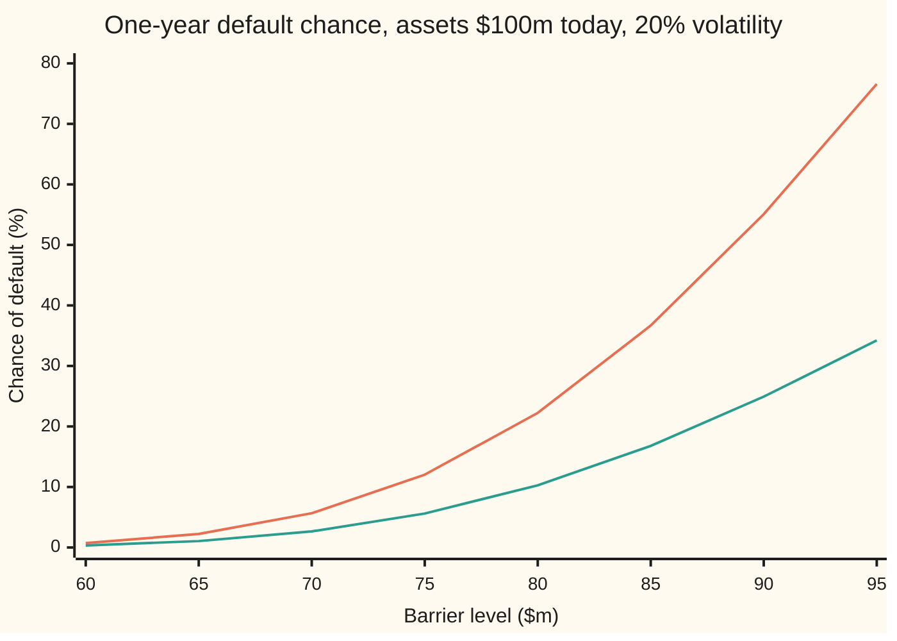
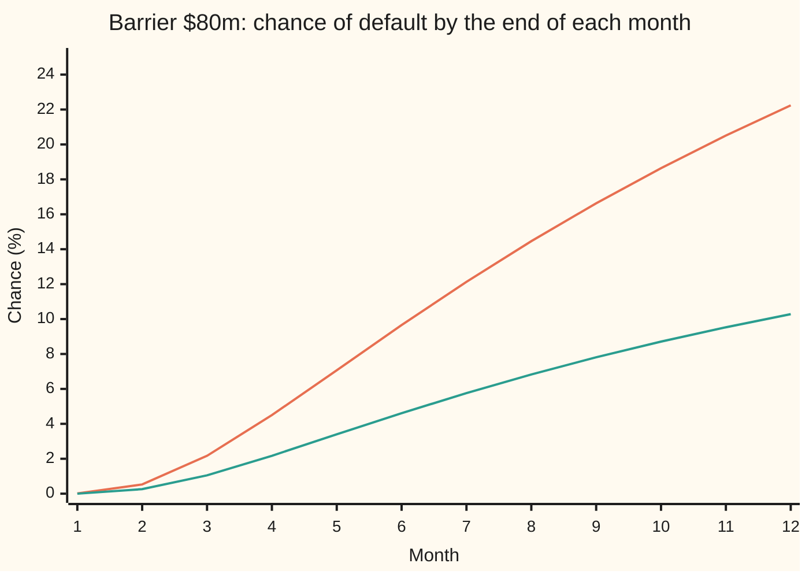

# Black-Cox: default the first moment assets touch a barrier, and the reflection term Merton misses

Financial mathematics → Structural Models - Default from the Balance Sheet → Default at the first touch → Black-Cox

---

## General Overview

A firm owns assets worth $100m today. It owes one debt of $80m, due in one year. Its assets swing by about 20% a year, and cash in the bank earns 5%.

Merton's model checks the firm once, on the due date. If the assets are below $80m then, the firm defaults. In the **pricing world** (the risk-neutral world, where every asset is taken to grow at the riskless rate) the chance is **10.28%** ([merton-model-equity-as-a-call](01-merton-model-equity-as-a-call.md)).

Real bond contracts are often less patient. A **safety covenant**, a clause in the loan agreement, can hand the firm to its lenders the moment the assets fall to a set level. Put that level at $80m. Now a firm that sinks to $78m in May and recovers to $95m by December has defaulted in May. Merton's year-end check would have called it healthy.

Fischer Black and John Cox priced this in 1976. Default happens at the **first passage**: the first moment the asset value touches the barrier. With the barrier at $80m the chance of default within the year is **22.24%**, more than twice Merton's figure. The extra 0.119562 of chance is paths that dipped below $80m and climbed back. They are counted by a mirror trick, the **reflection term**.

The level matters as much as the watching. A barrier at $70m gives 5.66%. A barrier at $60m gives 0.72%, below Merton's 10.28%, because the assets must fall 40% to touch it.

**Default at the first touch of a barrier is the chance of ending below the barrier plus the chance of touching it and recovering, and the second chance is the first one read off a mirror image, scaled by one weight for drift.**

**What kind of fact this is:** a model, an assumption about how a firm's assets move and when lenders act; inside it the two-term formula is a theorem, proved on this card in Why it works.

### The picture: the barrier level against the chance of default



Upper line (orange): Black-Cox, default at the first touch of the barrier at any time in the year. Lower line (green): the same level checked once, at year end. At every level the first-touch chance is a little more than twice the year-end chance; the gap is the reflection term. Reading across levels is a different comparison: Black-Cox at $60m sits far below the year-end check at $80m.

---

## The formula

Notation first, in words. The asset value at time $t$ years is $V_t$; today's value is $V_0$. The **first-passage time** $\tau$ is the first moment $V_t$ touches the barrier $H$. Default within the year is the event that $\tau$ comes at or before $T$. Work on a log scale: $b$ is the barrier in log units, $b = \ln(H/V_0)$, negative because the barrier sits below today's value. $N(x)$ is the bell-curve area to the left of $x$.

$$P(\tau \le T) \;=\; N\!\left(\frac{b - \nu T}{\sigma\sqrt T}\right) \;+\; \left(\frac{H}{V_0}\right)^{2\nu/\sigma^2} N\!\left(\frac{b + \nu T}{\sigma\sqrt T}\right)$$

**Read it aloud:** the chance of finishing the year below the barrier, plus the chance that a path started at the mirror image of today's value (log level $2b$) finishes above the barrier, the second scaled by a weight that accounts for drift.

The first term is Merton's check moved to the level $H$. The second is the reflection term, the paths that touched and recovered.

| Symbol | Plain meaning | In our example | Push it up and the default chance… |
| --- | --- | --- | --- |
| $t$, $V_t$, $V_0$ | a time in years; the firm's asset value then, and today | $100m today | $V_0$ up: falls, further to fall |
| $D$ | the face value of the debt, due at $T$ | $80m | no effect on the touch alone; it sets Merton's trigger |
| $H$ | the barrier: the asset level at which lenders take over | $80m, then $70m and $60m | rises steeply: 0.72% at $60m, 22.24% at $80m |
| $T$ | the horizon in years | 1 | rises: more time to touch |
| $r$ | the riskless rate, continuously compounded | 5% | falls: a faster upward drift in the pricing world |
| $\sigma$ | asset volatility: the yearly spread of log asset moves | 20% | rises: bigger swings reach the barrier more often |
| $\nu$ | the drift of log assets in the pricing world, $r - \tfrac12\sigma^2$ | 0.03 | falls |
| $b$ | the barrier in log units, $\ln(H/V_0)$ | $\ln 0.8 = -0.223144$ | rises toward 0 as the barrier nears today's value |
| $N$ | bell-curve area to the left of a point: a probability | $N(-1.265718) = 0.102807$ | — |
| $\tau$ | the first-passage time, when default happens | unknown today | — |
| $X_t$, $X_T$, $W_t$, $p_0$ | in the proof: log assets $\ln(V_t/V_0)$, their value at $T$, their random part (a standard Brownian motion), and the bell-curve density centred at 0 | $X_T$ centred at 0.03, spread 0.20 | — |
| $x$, $y$, $\Delta$ | log asset levels at the start and end of one simulated step, and the step's length in years | step length 1/12 | — |

Two helper numbers have names of their own:

- The **reflection weight** $(H/V_0)^{2\nu/\sigma^2}$, which is $0.8^{1.5} = 0.715542$ here. With no drift it would be 1.
- The **bridge chance** $\exp\!\big(-2(x - b)(y - b)/(\sigma^2\Delta)\big)$: the chance that a step starting at $x$ and ending at $y$, both above the barrier, touched it somewhere in between. The proof in Step 2 derives it; the simulation uses it.

### When it holds

- **Continuous paths.** The assets move without jumps, so a default lands exactly on the barrier. A sudden loss that jumps the assets from $85m to $70m overnight is outside the model; [where-structural-models-fail](06-where-structural-models-fail.md) shows what that costs.
- **Watched every instant.** A covenant tested monthly misses touches between tests. Here monthly tests give 16.74% in the simulation, not 22.24%.
- **A flat barrier, constant rate and volatility, no payouts.** Black and Cox allowed a barrier that rises over time and a firm that pays out cash; both change the formula. With constant inputs it is the one above.
- **Barrier below today's value.** With $H \ge V_0$ the firm is already in default. With $H$ near zero the chance goes to zero.
- **Pricing world, not a forecast.** With $\nu = r - \tfrac12\sigma^2$ the answer is the chance used for pricing. The real-world chance uses the asset's expected growth instead: 0.184582 with an 8% expected return.

---

## Why it works

### Step 0: default is about the lowest point, not the last point

A path defaults when its lowest value during the year reaches the barrier. Merton looks only at the last value. So every path splits in two: it ends below the barrier, or it ends above but touched on the way.

Paths ending below the barrier must have touched it. They started at $100m, above, and move without jumps. So the first group is simply "ends below $80m", Merton's event at the level $H$:

$$N\!\left(\frac{b - \nu T}{\sigma\sqrt T}\right) = N(-1.265718) = 0.102807.$$

The whole difficulty is the second group: touched and recovered.

### Step 1: without drift, a mirror counts the recovered paths

Take a path that touches the barrier and ends above it. After the first touch, flip the rest of the path upside down about the barrier. A path that ended $y$ above the barrier in log units now ends $y$ below it.

The flip pairs every touched-and-recovered path with exactly one path that ends below the barrier. With no drift, up and down moves are equally likely, so the flip keeps probabilities ([reflection-principle-and-running-maximum](../../11-Stochastic%20processes%20and%20calculus/05-Brownian%20Motion/04-reflection-principle-and-running-maximum.md)). The recovered group is as likely as the "ends below" group. So without drift the default chance is exactly twice Merton's term at the same level.

The check confirms it. Set the rate to 2%, so $\nu = 0.02 - \tfrac12(0.20)^2 = 0$. Adding up the first-touch times gives 0.264543, and twice the finish-below term gives 0.264543.

### Step 2: drift tilts the mirror by one weight

With an upward drift the flip no longer keeps probabilities. The original path climbs back after the touch, going with the drift. Its mirror keeps falling, against it. The mirror is rarer.

How much rarer depends only on where the path ends, not on its shape in between. That makes the correction a single number, the reflection weight $(H/V_0)^{2\nu/\sigma^2}$. Here $2\nu/\sigma^2 = 0.06/0.04 = 1.5$ and the weight is $0.8^{1.5} = 0.715542$.

Reflect today's value in the barrier: on the log scale it lands at $2b$. The mirror count is the chance that a path started there finishes above the barrier. That is the bell-curve area $N\big((b + \nu T)/(\sigma\sqrt T)\big) = N(-0.965718) = 0.167093$. Times the weight: $0.715542 \times 0.167093 = 0.119562$.

<details>
<summary>Detailed proof: the drifted reflection, and the bridge chance</summary>

Write $X_t = \ln(V_t/V_0) = \nu t + \sigma W_t$, with $W_t$ a standard Brownian motion, and $b < 0$. Let $p_\nu(y)$ be the bell-curve density of $X_T$: centre $\nu T$, spread $s = \sigma\sqrt T$. Let $p_0$ be the same with centre 0.

**Finish below.** $P(X_T \le b) = N\big((b - \nu T)/s\big)$. Every such path has touched $b$, since paths are continuous and start at 0.

**Driftless reflection.** For $y > b$, the density of paths that touch $b$ and end at $y$ is $p_0(2b - y)$. That is the reflection principle.

**Adding drift.** Relative to the driftless path, the drifted path has the likelihood ratio $\exp\big(\nu y/\sigma^2 - \nu^2 T/(2\sigma^2)\big)$, which depends only on the end point $y$ (Girsanov's theorem in its simplest form; completing the square in $p_\nu(y)/p_0(y)$ checks it). So the drifted density of touched paths ending at $y$ is $p_0(2b - y)\exp\big(\nu y/\sigma^2 - \nu^2T/(2\sigma^2)\big)$. The bell curve $p_0$ is symmetric, so $p_0(2b - y) = p_0(y - 2b)$, and the same ratio at $y - 2b$ turns this into
$$e^{2\nu b/\sigma^2}\, p_\nu(y - 2b).$$

**Integrate.** Over $y > b$, $\int p_\nu(y - 2b)\,dy$ is the chance that $X_T > -b$, which is $N\big((b + \nu T)/s\big)$. And $e^{2\nu b/\sigma^2} = (H/V_0)^{2\nu/\sigma^2}$ because $e^b = H/V_0$. The two groups do not overlap, so their chances add to the formula.

**The bridge chance.** Divide the touched density by the density of all paths ending at $y$: $e^{2\nu b/\sigma^2} p_\nu(y - 2b)/p_\nu(y)$. Expanding both squares, the $\nu$ terms cancel and the ratio is $\exp\big(2b(y - b)/(\sigma^2 T)\big)$. The drift has vanished: once the end point is fixed, the path in between (a **Brownian bridge**) does not feel the drift. For a step that starts at $x$ instead of 0 and lasts $\Delta$ years, shift and rescale: $\exp\big(-2(x - b)(y - b)/(\sigma^2\Delta)\big)$.

**The same count by time.** Differentiating the formula in $T$ gives the density of the first-touch time, $f(t) = \dfrac{-b}{\sigma\sqrt{2\pi t^3}}\exp\!\Big(-\dfrac{(b - \nu t)^2}{2\sigma^2 t}\Big)$, the inverse Gaussian law. It can also be found without reflection, from the exponential martingale of $X_t$ stopped at $\tau$. Adding it up from 0 to $T$ must return the formula.

</details>

### Step 3: add the two groups

$$P(\tau \le T) = 0.102807 + 0.119562 = 0.222369.$$

The reflection term is slightly bigger than the finish-below term: more than half of the paths that touch $80m during the year are back above it by December.

### Step 4: read the same count as a chance for one step

The proof also gives the chance that a path touched the barrier *between* two known points. For a step from log level $x$ to $y$, both above $b$, lasting $\Delta$ years, it is $\exp\big(-2(x - b)(y - b)/(\sigma^2\Delta)\big)$. It is near 1 when either end is close to the barrier, and tiny when both are far away. The drift is absent, because fixing both ends removes it.

This is what makes simulation honest. A simulation that samples the path monthly sees only twelve points. Between them the path can dip and recover unseen. Drawing one random number per step against the bridge chance counts those unseen touches.

### Other roads

The first-touch time has a density of its own, the inverse Gaussian law in the proof callout. Adding it up from 0 to $T$ is a second route to 0.222369, and the check does it. A third route is the simulation, with no formula inside it at all. The same mirror prices barrier options: [knock-out-and-knock-in-options](../16-Barriers%2C%20touches%20and%20lookbacks/01-knock-out-and-knock-in-options.md) uses it to value a call that dies at a barrier.

---

## Worked numbers, by hand

The firm: $V_0 = 100$, barrier $H = 80$, $T = 1$, $r = 5\%$, $\sigma = 20\%$, money in $m.

| Step | Arithmetic | Value |
| --- | --- | --- |
| drift of log assets, $\nu$ | $0.05 - \tfrac12(0.20)^2$ | 0.030000 |
| barrier in log units, $b$ | $\ln(80/100)$ | −0.223144 |
| finish-below point | $(−0.223144 − 0.03)/0.20$ | −1.265718 |
| finish below $80m | $N(−1.265718)$ | 0.102807 |
| weight exponent | $2 \times 0.03 / 0.04$ | 1.500000 |
| reflection weight | $0.8^{1.5}$ | 0.715542 |
| mirror point | $(−0.223144 + 0.03)/0.20$ | −0.965718 |
| mirrored paths below it | $N(−0.965718)$ | 0.167093 |
| reflection term | $0.715542 \times 0.167093$ | 0.119562 |
| **default within the year** | $0.102807 + 0.119562$ | **0.222369** |

Lower barriers, same steps:

| Barrier | Finish below | Reflection term | Black-Cox |
| --- | --- | --- | --- |
| $80m | 0.102807 | 0.119562 | **0.222369** |
| $70m | 0.026595 | 0.029983 | **0.056578** |
| $60m | 0.003424 | 0.003767 | **0.007191** |

A covenant at $80m more than doubles the pricing-world default chance of this firm compared with a year-end check at the same $80m. The finish-below column at $80m is Merton's 10.28% exactly, the shelf's house figure.

### What breaks if you drop a piece

| Mistake | Comes out at | What went wrong |
| --- | --- | --- |
| Drop the reflection term | 0.102807 | Merton's year-end check: every dip-and-recover path is missed |
| Mirror without the weight | 0.269900 | Treats the drift as zero; the mirrored paths fight the drift and are rarer |
| Weight with its sign flipped, $(V_0/H)^{2\nu/\sigma^2}$ | 0.336326 | Makes the mirrored paths more likely than the originals |
| Simulate monthly, no bridge chance | about 0.1674 | Counts only touches that land on a month end |

The code prints every row.

---

## How the chance builds through the year

Default does not arrive evenly. In January almost nothing happens: the assets start $20m above the barrier, and a month of swings is rarely that large. The first month contributes 0.01%. By the end of month three the total is 2.17%. After that the chance piles up at a nearly steady rate.



Upper line (orange): Black-Cox, the chance the assets have touched $80m by the end of that month, from the formula with $T$ set to that many twelfths. Lower line (green): the chance the assets sit below $80m at that month end. The simulation's month-by-month count tracks the upper line: 2.23% by month three, 9.91% by month six, 22.18% by month twelve.

### One force at a time: how often the lender looks

Hold the barrier at $80m and change only the watching. Each bar is a chance in percent.

```
how often the $80m level is checked     chance of default within the year, %
  once, at year end (formula)           ██████████████                    10.28
  quarterly (simulated)                 ███████████████████               13.94
  monthly (simulated)                   ███████████████████████           16.74
  monthly (shifted-barrier rule)        ██████████████████████            16.32
  continuously (formula)                ██████████████████████████████    22.24
```

Looking more often finds more defaults, because more of the dips are seen. The shifted-barrier rule treats monthly checks as continuous watching of a slightly lower barrier, $80 \times e^{-0.5826 \times 0.20 \times \sqrt{1/12}} = 77.3538$; it lands within half a point of the monthly simulation ([discrete-monitoring-correction](../16-Barriers%2C%20touches%20and%20lookbacks/03-discrete-monitoring-correction.md)).

### The other force: where the barrier sits

Hold the watching continuous and move the level. From $80m to $70m the chance falls from 22.24% to 5.66%; to $60m, 0.72%. Moving the barrier $10m changes the answer more than moving from year-end checks to continuous watching does. That is the job's second lesson: a Black-Cox number is only comparable with a Merton number at the same level.

---

## Code, from first principles, and it actually runs

Nothing is imported that knows the answer. The bell-curve area is a power series in Python and a sum of thin slices (Simpson's rule) in Rust. The answer is reached three ways: the reflection formula; adding up the density of the first-touch time from 0 to $T$; and a simulation of 40,000 monthly paths with the bridge chance drawn inside each month. A fourth calculation integrates the bridge chance against the end-point bell curve to recover the reflection term on its own. Both programs use the same xorshift random-number stream, so their simulated counts agree exactly.

### Python

```python
# Black-Cox first-passage default -- the check behind the card.  Standard library
# only, and nothing imported knows the answer: the bell-curve area is a power
# series written out below, the integrals are Simpson's rule, and the random
# numbers come from a 64-bit xorshift generator defined here.
from math import log, exp, sqrt, cos, pi

V0, D, T, r, sigma = 100.0, 80.0, 1.0, 0.05, 0.20    # $m of assets, $m of debt, years, rates
nu = r - 0.5 * sigma * sigma                         # pricing-world drift of log assets

def N(x):                                            # bell-curve area left of x, by series
    if abs(x) > 7.0: return 0.0 if x < 0 else 1.0
    term, total, k = x, x, 0                         # integral of exp(-t^2/2) from 0 to x
    while abs(term) > 1e-18:
        k += 1
        term *= -x * x / (2.0 * k)
        total += term / (2 * k + 1)
    return 0.5 + total / sqrt(2.0 * pi)

def simpson(f, lo, hi, n):
    h = (hi - lo) / n
    s = f(lo) + f(hi) + sum((4 if i % 2 else 2) * f(lo + i * h) for i in range(1, n))
    return s * h / 3.0

def black_cox(H, nu=nu, sigma=sigma, T=T):          # road 1: the reflection formula
    b, s = log(H / V0), sigma * sqrt(T)
    finish = N((b - nu * T) / s)                     # below H at the end
    mirror = exp(2 * nu * b / sigma ** 2) * N((b + nu * T) / s)   # touched, ended above
    return finish, mirror, finish + mirror

def by_density(H, nu=nu, sigma=sigma, T=T):          # road 2: add up the first-touch times
    b = log(H / V0)
    f = lambda t: 0.0 if t == 0 else -b / (sigma * sqrt(2 * pi * t ** 3)) * exp(-(b - nu * t) ** 2 / (2 * sigma ** 2 * t))
    return simpson(f, 0.0, T, 4000)

def mirror_by_bridge(H):                             # the mirror term as an integral of bridge chances
    b, s = log(H / V0), sigma * sqrt(T)
    g = lambda y: exp(-(y - nu * T) ** 2 / (2 * s * s)) / (s * sqrt(2 * pi))
    return simpson(lambda y: g(y) * exp(2 * b * (y - b) / (s * s)), b, b + 12 * s, 6000)

def whole_contract(H):                               # touch H at any time, or end below D
    b, d, s = log(H / V0), log(D / V0), sigma * sqrt(T)
    return N((d - nu * T) / s) + exp(2 * nu * b / sigma ** 2) * N((2 * b - d + nu * T) / s)

state = 0x2026092843050001                           # xorshift64*, same stream in the Rust twin
def uniform():
    global state
    state ^= state >> 12; state ^= (state << 25) & 0xFFFFFFFFFFFFFFFF; state ^= state >> 27
    return (((state * 0x2545F4914F6CDD1D) & 0xFFFFFFFFFFFFFFFF) >> 11) / 2.0 ** 53 + 2.0 ** -54

PATHS, STEPS, BARS = 40000, 12, (80.0, 70.0, 60.0)   # road 3: simulate monthly, bridge in between
dt, lb, ld = T / STEPS, [log(h / V0) for h in BARS], log(D / V0)
bridge, grid, qtr, end, whole, month_hit = [0] * 3, [0] * 3, 0, 0, [0] * 3, [0] * STEPS
for _ in range(PATHS):
    x, hit, seen, first = 0.0, [False] * 3, [False] * 3, STEPS
    q = False
    for k in range(STEPS):
        z = sqrt(-2.0 * log(uniform())) * cos(2.0 * pi * uniform())
        y, u = x + nu * dt + sigma * sqrt(dt) * z, uniform()
        for j in range(3):
            if y <= lb[j]: hit[j] = seen[j] = True
            elif not hit[j] and u < exp(-2.0 * (x - lb[j]) * (y - lb[j]) / (sigma * sigma * dt)): hit[j] = True
        q = q or (k % 3 == 2 and y <= lb[0])
        if hit[0] and first == STEPS: first = k
        x = y
    for j in range(3):
        bridge[j] += hit[j]; grid[j] += seen[j]; whole[j] += hit[j] or x <= ld
    qtr += q; end += x <= lb[0]
    if first < STEPS: month_hit[first] += 1
mc = lambda c: c / PATHS
se = lambda p: sqrt(p * (1 - p) / PATHS)

merton = N((log(D / V0) - nu * T) / (sigma * sqrt(T)))
print(f"inputs: V0 {V0:.0f}, D {D:.0f}, T {T:.0f}, r {r:.2f}, sigma {sigma:.2f}, nu {nu:.6f}, weight exponent {2 * nu / sigma ** 2:.6f}")
print(f"Merton, below 80 at year end        {merton:.6f}")
print("barrier   finish    mirror    Black-Cox  by density  bridge MC  monthly MC  whole contract  its MC")
rows = []
for j, H in enumerate(BARS):
    fin, mir, bc = black_cox(H); dens = by_density(H); rows.append((fin, mir, bc, dens))
    print(f"{H:7.0f}  {fin:.6f}  {mir:.6f}  {bc:.6f}   {dens:.6f}    {mc(bridge[j]):.4f}     {mc(grid[j]):.4f}      {whole_contract(H):.6f}    {mc(whole[j]):.4f}")
wt = exp(2 * nu * lb[0] / sigma ** 2)
print(f"H 80: b = ln(H/V0) {lb[0]:.6f}, alpha {(lb[0] - nu * T) / sigma:.6f}, beta {(lb[0] + nu * T) / sigma:.6f}")
print(f"weight (H/V0)^(2nu/sigma^2), H 80   {wt:.6f}")
print(f"N((b + nu T)/sigma sqrt T), H 80    {N((lb[0] + nu * T) / sigma):.6f}")
print(f"mirror term by bridge integral, 80  {mirror_by_bridge(80.0):.6f}")
print(f"MC {PATHS} paths, {STEPS} monthly steps; standard error at 0.2224  {se(rows[0][2]):.4f}")
shift = 80.0 * exp(-0.5826 * sigma * sqrt(dt))       # monthly covenant: shifted-barrier rule
print("monitoring at H 80, %: year end formula, year end MC, quarterly MC, monthly MC, monthly by shifted barrier, continuous formula, bridge MC")
print(f"  {100 * merton:.2f}  {100 * mc(end):.2f}  {100 * mc(qtr):.2f}  {100 * mc(grid[0]):.2f}  {100 * black_cox(shift)[2]:.2f}  {100 * rows[0][2]:.2f}  {100 * mc(bridge[0]):.2f}")
print(f"  shifted barrier 80 exp(-0.5826 sigma sqrt(1/12))  {shift:.4f}")
print(f"wrong: drop the mirror term         {rows[0][0]:.6f}")
print(f"wrong: mirror without the weight    {rows[0][0] + N((lb[0] + nu * T) / sigma):.6f}")
print(f"wrong: weight with flipped sign     {rows[0][0] + N((lb[0] + nu * T) / sigma) / wt:.6f}")
print("chart, barrier $m      " + " ".join(f"{h:6.0f}" for h in range(60, 100, 5)))
print("chart, Black-Cox %     " + " ".join(f"{100 * black_cox(float(h))[2]:6.2f}" for h in range(60, 100, 5)))
print("chart, year-end at H % " + " ".join(f"{100 * black_cox(float(h))[0]:6.2f}" for h in range(60, 100, 5)))
print("chart, month           " + " ".join(f"{m:5d}" for m in range(1, 13)))
print("chart, touched by m %  " + " ".join(f"{100 * black_cox(80.0, T=m / 12)[2]:5.2f}" for m in range(1, 13)))
cum = [sum(month_hit[:m]) / PATHS for m in range(1, 13)]
print("chart, MC touched by m " + " ".join(f"{100 * c:5.2f}" for c in cum))
print("chart, below 80 at m % " + " ".join(f"{100 * black_cox(80.0, T=m / 12)[0]:5.2f}" for m in range(1, 13)))
z0 = black_cox(80.0, nu=0.0)
print(f"try: r 0.02 so nu 0: first-touch density {by_density(80.0, nu=0.0):.6f}, twice finish-below {2 * z0[0]:.6f}")
print(f"try: sigma 0.30: Black-Cox {black_cox(80.0, nu=0.005, sigma=0.30)[2]:.6f}, year end {black_cox(80.0, nu=0.005, sigma=0.30)[0]:.6f}")
print(f"try: T 5 years: Black-Cox {black_cox(80.0, T=5.0)[2]:.6f}, year-5 end {black_cox(80.0, T=5.0)[0]:.6f}")
print(f"try: real-world drift 8%: Black-Cox {black_cox(80.0, nu=0.06)[2]:.6f}, year end {black_cox(80.0, nu=0.06)[0]:.6f}")

assert abs(merton - 0.1028) < 5e-5, "the shelf's Merton default chance, 10.28%"
for fin, mir, bc, dens in rows:
    assert abs(bc - dens) < 1e-8, "reflection formula vs adding up first-touch times"
for j in range(3):
    assert abs(mc(bridge[j]) - rows[j][2]) < 4 * se(rows[j][2]) + 1e-3, "bridge-corrected simulation vs formula"
assert abs(mirror_by_bridge(80.0) - rows[0][1]) < 1e-8, "mirror term vs integral of bridge chances"
assert abs(mc(end) - merton) < 4 * se(merton), "simulated year-end check vs Merton"
assert mc(end) < mc(qtr) < mc(grid[0]) < mc(bridge[0]), "more watching finds more defaults"
assert abs(2 * z0[0] - by_density(80.0, nu=0.0)) < 1e-8, "no drift: twice the finish-below chance, by first-touch times"
print("ALL CHECKS PASS")
```

**Ran 2026-09-28 on macOS, Python 3.14.6, standard library only. All checks passed. Output, pasted from the run:**

```
inputs: V0 100, D 80, T 1, r 0.05, sigma 0.20, nu 0.030000, weight exponent 1.500000
Merton, below 80 at year end        0.102807
barrier   finish    mirror    Black-Cox  by density  bridge MC  monthly MC  whole contract  its MC
     80  0.102807  0.119562  0.222369   0.222369    0.2218     0.1674      0.222369    0.2218
     70  0.026595  0.029983  0.056578   0.056578    0.0563     0.0394      0.109071    0.1080
     60  0.003424  0.003767  0.007191   0.007191    0.0081     0.0054      0.102835    0.1020
H 80: b = ln(H/V0) -0.223144, alpha -1.265718, beta -0.965718
weight (H/V0)^(2nu/sigma^2), H 80   0.715542
N((b + nu T)/sigma sqrt T), H 80    0.167093
mirror term by bridge integral, 80  0.119562
MC 40000 paths, 12 monthly steps; standard error at 0.2224  0.0021
monitoring at H 80, %: year end formula, year end MC, quarterly MC, monthly MC, monthly by shifted barrier, continuous formula, bridge MC
  10.28  10.20  13.94  16.74  16.32  22.24  22.18
  shifted barrier 80 exp(-0.5826 sigma sqrt(1/12))  77.3538
wrong: drop the mirror term         0.102807
wrong: mirror without the weight    0.269900
wrong: weight with flipped sign     0.336326
chart, barrier $m          60     65     70     75     80     85     90     95
chart, Black-Cox %       0.72   2.24   5.66  12.03  22.24  36.68  55.08  76.59
chart, year-end at H %   0.34   1.06   2.66   5.61  10.28  16.79  24.93  34.22
chart, month               1     2     3     4     5     6     7     8     9    10    11    12
chart, touched by m %   0.01  0.53  2.17  4.50  7.07  9.66 12.13 14.46 16.63 18.64 20.51 22.24
chart, MC touched by m  0.01  0.55  2.23  4.68  7.38  9.91 12.35 14.65 16.60 18.64 20.38 22.18
chart, below 80 at m %  0.00  0.26  1.05  2.17  3.40  4.61  5.76  6.83  7.81  8.71  9.53 10.28
try: r 0.02 so nu 0: first-touch density 0.264543, twice finish-below 0.264543
try: sigma 0.30: Black-Cox 0.451333, year end 0.223484
try: T 5 years: Black-Cox 0.513325, year-5 end 0.202035
try: real-world drift 8%: Black-Cox 0.184582, year end 0.078429
ALL CHECKS PASS
```

The formula and the first-touch density agree to six decimals at all three barriers. The bridge integral returns the reflection term, 0.119562. The simulation lands at 0.2218 against 0.2224, less than one standard error (0.0021) away. The same simulation sampled only at month ends gives 0.1674, which is the bridge chance's whole job made visible.

### Rust

```rust
// Black-Cox first-passage default -- the same check as the Python, in Rust.
// Standard library only, no crates.  Rust has no erf, so the bell-curve area is
// built by adding up thin slices under the curve (Simpson's rule), a different
// route from the Python power series.  The random numbers are the same
// xorshift64* stream, so the simulated counts match the Python run.
use std::f64::consts::PI;

const V0: f64 = 100.0; const D: f64 = 80.0; const T: f64 = 1.0; const R: f64 = 0.05; const SIG: f64 = 0.20;
const NU: f64 = R - 0.5 * SIG * SIG;

fn simpson<F: Fn(f64) -> f64>(f: F, lo: f64, hi: f64, n: usize) -> f64 {
    let h = (hi - lo) / n as f64;
    let mut s = f(lo) + f(hi);
    for i in 1..n { s += if i % 2 == 1 { 4.0 } else { 2.0 } * f(lo + i as f64 * h); }
    s * h / 3.0
}
fn phi(x: f64) -> f64 { (-0.5 * x * x).exp() / (2.0 * PI).sqrt() }
fn n_cdf(x: f64) -> f64 {                                   // area left of x
    if x.abs() > 7.0 { return if x < 0.0 { 0.0 } else { 1.0 }; }
    0.5 + simpson(phi, 0.0, x, 4000)
}
fn black_cox(h: f64, nu: f64, sig: f64, t: f64) -> (f64, f64, f64) {   // road 1
    let (b, s) = ((h / V0).ln(), sig * t.sqrt());
    let finish = n_cdf((b - nu * t) / s);
    let mirror = (2.0 * nu * b / (sig * sig)).exp() * n_cdf((b + nu * t) / s);
    (finish, mirror, finish + mirror)
}
fn bc(h: f64) -> (f64, f64, f64) { black_cox(h, NU, SIG, T) }
fn by_density(h: f64, nu: f64) -> f64 {                     // road 2: first-touch times
    let b = (h / V0).ln();
    let f = |t: f64| if t == 0.0 { 0.0 } else {
        -b / (SIG * (2.0 * PI * t.powi(3)).sqrt()) * (-(b - nu * t).powi(2) / (2.0 * SIG * SIG * t)).exp() };
    simpson(f, 0.0, T, 4000)
}
fn mirror_by_bridge(h: f64) -> f64 {
    let (b, s) = ((h / V0).ln(), SIG * T.sqrt());
    let g = |y: f64| (-(y - NU * T).powi(2) / (2.0 * s * s)).exp() / (s * (2.0 * PI).sqrt());
    simpson(|y| g(y) * (2.0 * b * (y - b) / (s * s)).exp(), b, b + 12.0 * s, 6000)
}
fn whole_contract(h: f64) -> f64 {                          // touch H, or end below D
    let (b, d, s) = ((h / V0).ln(), (D / V0).ln(), SIG * T.sqrt());
    n_cdf((d - NU * T) / s) + (2.0 * NU * b / (SIG * SIG)).exp() * n_cdf((2.0 * b - d + NU * T) / s)
}
struct Rng(u64);
impl Rng {
    fn uniform(&mut self) -> f64 {
        self.0 ^= self.0 >> 12; self.0 ^= self.0 << 25; self.0 ^= self.0 >> 27;
        (self.0.wrapping_mul(0x2545F4914F6CDD1D) >> 11) as f64 / 2f64.powi(53) + 2f64.powi(-54)
    }
}

fn main() {
    const PATHS: usize = 40000; const STEPS: usize = 12;
    let bars = [80.0_f64, 70.0, 60.0];
    let dt = T / STEPS as f64;
    let lb: Vec<f64> = bars.iter().map(|h| (h / V0).ln()).collect();
    let ld = (D / V0).ln();
    let mut rng = Rng(0x2026092843050001);
    let (mut bridge, mut grid, mut whole) = ([0usize; 3], [0usize; 3], [0usize; 3]);
    let (mut qtr, mut end, mut month_hit) = (0usize, 0usize, [0usize; STEPS]);
    for _ in 0..PATHS {
        let (mut x, mut hit, mut seen, mut first, mut q) = (0.0_f64, [false; 3], [false; 3], STEPS, false);
        for k in 0..STEPS {
            let z = (-2.0 * rng.uniform().ln()).sqrt() * (2.0 * PI * rng.uniform()).cos();
            let y = x + NU * dt + SIG * dt.sqrt() * z;
            let u = rng.uniform();
            for j in 0..3 {
                if y <= lb[j] { hit[j] = true; seen[j] = true; }
                else if !hit[j] && u < (-2.0 * (x - lb[j]) * (y - lb[j]) / (SIG * SIG * dt)).exp() { hit[j] = true; }
            }
            q = q || (k % 3 == 2 && y <= lb[0]);
            if hit[0] && first == STEPS { first = k; }
            x = y;
        }
        for j in 0..3 {
            bridge[j] += hit[j] as usize; grid[j] += seen[j] as usize; whole[j] += (hit[j] || x <= ld) as usize;
        }
        qtr += q as usize; end += (x <= lb[0]) as usize;
        if first < STEPS { month_hit[first] += 1; }
    }
    let mc = |c: usize| c as f64 / PATHS as f64;
    let se = |p: f64| (p * (1.0 - p) / PATHS as f64).sqrt();

    let merton = n_cdf(((D / V0).ln() - NU * T) / (SIG * T.sqrt()));
    println!("inputs: V0 {:.0}, D {:.0}, T {:.0}, r {:.2}, sigma {:.2}, nu {:.6}, weight exponent {:.6}", V0, D, T, R, SIG, NU, 2.0 * NU / (SIG * SIG));
    println!("Merton, below 80 at year end        {:.6}", merton);
    println!("barrier   finish    mirror    Black-Cox  by density  bridge MC  monthly MC  whole contract  its MC");
    let mut rows = Vec::new();
    for j in 0..3 {
        let (fin, mir, b) = bc(bars[j]); let dens = by_density(bars[j], NU); rows.push((fin, mir, b, dens));
        println!("{:7.0}  {:.6}  {:.6}  {:.6}   {:.6}    {:.4}     {:.4}      {:.6}    {:.4}",
                 bars[j], fin, mir, b, dens, mc(bridge[j]), mc(grid[j]), whole_contract(bars[j]), mc(whole[j]));
    }
    let wt = (2.0 * NU * lb[0] / (SIG * SIG)).exp();
    let n_beta = n_cdf((lb[0] + NU * T) / SIG);
    println!("H 80: b = ln(H/V0) {:.6}, alpha {:.6}, beta {:.6}", lb[0], (lb[0] - NU * T) / SIG, (lb[0] + NU * T) / SIG);
    println!("weight (H/V0)^(2nu/sigma^2), H 80   {:.6}", wt);
    println!("N((b + nu T)/sigma sqrt T), H 80    {:.6}", n_beta);
    println!("mirror term by bridge integral, 80  {:.6}", mirror_by_bridge(80.0));
    println!("MC {} paths, {} monthly steps; standard error at 0.2224  {:.4}", PATHS, STEPS, se(rows[0].2));
    let shift = 80.0 * (-0.5826 * SIG * dt.sqrt()).exp();
    println!("monitoring at H 80, %: year end formula, year end MC, quarterly MC, monthly MC, monthly by shifted barrier, continuous formula, bridge MC");
    println!("  {:.2}  {:.2}  {:.2}  {:.2}  {:.2}  {:.2}  {:.2}", 100.0 * merton, 100.0 * mc(end), 100.0 * mc(qtr), 100.0 * mc(grid[0]),
             100.0 * bc(shift).2, 100.0 * rows[0].2, 100.0 * mc(bridge[0]));
    println!("  shifted barrier 80 exp(-0.5826 sigma sqrt(1/12))  {:.4}", shift);
    println!("wrong: drop the mirror term         {:.6}", rows[0].0);
    println!("wrong: mirror without the weight    {:.6}", rows[0].0 + n_beta);
    println!("wrong: weight with flipped sign     {:.6}", rows[0].0 + n_beta / wt);
    let hs: Vec<f64> = (0..8).map(|i| 60.0 + 5.0 * i as f64).collect();
    let line = |v: Vec<String>| v.join(" ");
    println!("chart, barrier $m      {}", line(hs.iter().map(|h| format!("{:6.0}", h)).collect()));
    println!("chart, Black-Cox %     {}", line(hs.iter().map(|h| format!("{:6.2}", 100.0 * bc(*h).2)).collect()));
    println!("chart, year-end at H % {}", line(hs.iter().map(|h| format!("{:6.2}", 100.0 * bc(*h).0)).collect()));
    println!("chart, month           {}", line((1..13).map(|m| format!("{:5}", m)).collect()));
    println!("chart, touched by m %  {}", line((1..13).map(|m| format!("{:5.2}", 100.0 * black_cox(80.0, NU, SIG, m as f64 / 12.0).2)).collect()));
    println!("chart, MC touched by m {}", line((1..13).map(|m| format!("{:5.2}", 100.0 * mc(month_hit[..m].iter().sum()))).collect()));
    println!("chart, below 80 at m % {}", line((1..13).map(|m| format!("{:5.2}", 100.0 * black_cox(80.0, NU, SIG, m as f64 / 12.0).0)).collect()));
    let z0 = black_cox(80.0, 0.0, SIG, T);
    println!("try: r 0.02 so nu 0: first-touch density {:.6}, twice finish-below {:.6}", by_density(80.0, 0.0), 2.0 * z0.0);
    println!("try: sigma 0.30: Black-Cox {:.6}, year end {:.6}", black_cox(80.0, 0.005, 0.30, T).2, black_cox(80.0, 0.005, 0.30, T).0);
    println!("try: T 5 years: Black-Cox {:.6}, year-5 end {:.6}", black_cox(80.0, NU, SIG, 5.0).2, black_cox(80.0, NU, SIG, 5.0).0);
    println!("try: real-world drift 8%: Black-Cox {:.6}, year end {:.6}", black_cox(80.0, 0.06, SIG, T).2, black_cox(80.0, 0.06, SIG, T).0);

    assert!((merton - 0.1028).abs() < 5e-5, "the shelf's Merton default chance, 10.28%");
    for row in &rows { assert!((row.2 - row.3).abs() < 1e-8, "reflection formula vs adding up first-touch times"); }
    for j in 0..3 { assert!((mc(bridge[j]) - rows[j].2).abs() < 4.0 * se(rows[j].2) + 1e-3, "bridge-corrected simulation vs formula"); }
    assert!((mirror_by_bridge(80.0) - rows[0].1).abs() < 1e-8, "mirror term vs integral of bridge chances");
    assert!((mc(end) - merton).abs() < 4.0 * se(merton), "simulated year-end check vs Merton");
    assert!(mc(end) < mc(qtr) && mc(qtr) < mc(grid[0]) && mc(grid[0]) < mc(bridge[0]), "more watching finds more defaults");
    assert!((2.0 * z0.0 - by_density(80.0, 0.0)).abs() < 1e-8, "no drift: twice the finish-below chance, by first-touch times");
    println!("ALL CHECKS PASS");
}
```

**Ran 2026-09-28 on macOS, rustc 1.98.1, no crates. All checks passed. Output, pasted from the run:**

```
inputs: V0 100, D 80, T 1, r 0.05, sigma 0.20, nu 0.030000, weight exponent 1.500000
Merton, below 80 at year end        0.102807
barrier   finish    mirror    Black-Cox  by density  bridge MC  monthly MC  whole contract  its MC
     80  0.102807  0.119562  0.222369   0.222369    0.2218     0.1674      0.222369    0.2218
     70  0.026595  0.029983  0.056578   0.056578    0.0563     0.0394      0.109071    0.1080
     60  0.003424  0.003767  0.007191   0.007191    0.0081     0.0054      0.102835    0.1020
H 80: b = ln(H/V0) -0.223144, alpha -1.265718, beta -0.965718
weight (H/V0)^(2nu/sigma^2), H 80   0.715542
N((b + nu T)/sigma sqrt T), H 80    0.167093
mirror term by bridge integral, 80  0.119562
MC 40000 paths, 12 monthly steps; standard error at 0.2224  0.0021
monitoring at H 80, %: year end formula, year end MC, quarterly MC, monthly MC, monthly by shifted barrier, continuous formula, bridge MC
  10.28  10.20  13.94  16.74  16.32  22.24  22.18
  shifted barrier 80 exp(-0.5826 sigma sqrt(1/12))  77.3538
wrong: drop the mirror term         0.102807
wrong: mirror without the weight    0.269900
wrong: weight with flipped sign     0.336326
chart, barrier $m          60     65     70     75     80     85     90     95
chart, Black-Cox %       0.72   2.24   5.66  12.03  22.24  36.68  55.08  76.59
chart, year-end at H %   0.34   1.06   2.66   5.61  10.28  16.79  24.93  34.22
chart, month               1     2     3     4     5     6     7     8     9    10    11    12
chart, touched by m %   0.01  0.53  2.17  4.50  7.07  9.66 12.13 14.46 16.63 18.64 20.51 22.24
chart, MC touched by m  0.01  0.55  2.23  4.68  7.38  9.91 12.35 14.65 16.60 18.64 20.38 22.18
chart, below 80 at m %  0.00  0.26  1.05  2.17  3.40  4.61  5.76  6.83  7.81  8.71  9.53 10.28
try: r 0.02 so nu 0: first-touch density 0.264543, twice finish-below 0.264543
try: sigma 0.30: Black-Cox 0.451333, year end 0.223484
try: T 5 years: Black-Cox 0.513325, year-5 end 0.202035
try: real-world drift 8%: Black-Cox 0.184582, year end 0.078429
ALL CHECKS PASS
```

The two outputs are identical line for line: different bell-curve routes agree to the printed digits, and the shared random stream gives the same simulated counts.

> [!TIP]
> **Try changing**
> Guess the direction first. Then run it.
> - **Remove the drift.** Set `r = 0.02`, so $\nu = 0$. The default chance becomes 0.264543, exactly twice the finish-below term. Drift was pulling the assets away from the barrier; without it the mirror is exact.
> - **More volatile assets.** Set `sigma = 0.30` (and so $\nu = 0.005$). Black-Cox rises to 0.451333; the year-end check to 0.223484. The ratio stays about two.
> - **Five years.** Set `T = 5.0`. Black-Cox gives 0.513325 against 0.202035 at the year-five check. Over long horizons the touch-and-recover paths dominate.
> - **The real world.** Replace $\nu$ by $0.08 - 0.02 = 0.06$, the house example's 8% expected asset growth. The chance falls to 0.184582 against 0.078429 at year end. Real-world default chances are lower than pricing-world ones, because investors are paid for bearing the risk.

---

## The usual mistake

> [!warning]
> **Reading a low barrier's 0.72% as "the covenant made the firm safer".** At $60m the number is the chance of touching $60m, nothing more. The firm still owes $80m at year end. Count that too, and the whole contract defaults with chance 0.102835 at a $60m barrier and 0.109071 at $70m: never below Merton's 0.102807, because the whole event contains Merton's event. That whole-contract chance is Merton's term at $80m plus a mirrored term; `whole_contract` in the code computes it, and the simulation confirms it. Black-Cox and Merton compare cleanly only when the barrier equals the debt, where the whole-contract chance is 0.222369.
>
> Smaller traps:
> - **Dropping the reflection term.** It gives 0.102807, less than half the answer. Checking the last point is not checking the path.
> - **Forgetting the drift weight, or flipping it.** The answer becomes 0.269900 or 0.336326. The weight is below 1 when the drift points away from the barrier.
> - **Simulating on a grid and calling it continuous.** Monthly sampling gives 0.1674, quarterly 0.1394. Without the bridge chance a simulation measures the covenant it samples, not the one in the formula.
> - **Quoting a pricing-world chance as a forecast.** 0.222369 prices credit. The real-world chance with 8% expected asset growth is 0.184582.

---

## Where you meet it in real life

- **Bond covenants.** Loan agreements set asset or net-worth floors that let lenders act before maturity. Black and Cox wrote their paper to value exactly those clauses.
- **Equity as a knock-out call.** If lenders take the whole firm at the barrier, the shares pay nothing after a touch. The shares are then a down-and-out call on the assets, priced with the same mirror as [knock-out-and-knock-in-options](../16-Barriers%2C%20touches%20and%20lookbacks/01-knock-out-and-knock-in-options.md).
- **Credit models in banks.** First-passage models with an uncertain barrier are used to turn share prices into credit spreads. They start from asset values backed out of the share price, as on [asset-value-and-volatility-from-the-share-price](04-asset-value-and-volatility-from-the-share-price.md).
- **Distance to default.** The real-world year-end chance here, 0.078429, is the default frequency on [distance-to-default-and-expected-default-frequency](03-distance-to-default-and-expected-default-frequency.md); the first-touch version, 0.184582, is its path-watching counterpart.
- **Sensitivities.** How each claim moves when assets or volatility move is on [structural-model-sensitivities](02-structural-model-sensitivities.md); a barrier adds a steep slope near the barrier.

> **Say it back**
> Black-Cox defaults a firm the first moment its assets touch a barrier, not only if they are low on the due date. The chance splits into paths that end below the barrier and paths that touched and recovered. A mirror flips each recovered path into one that ends below the barrier's mirror point, and a single weight corrects for drift. For assets of $100m and a barrier at $80m that gives 22.24% against Merton's 10.28%; a lower barrier can give far less. Simulations must count touches between their sample dates, which the bridge chance does.

---

## What this builds on

- [merton-model-equity-as-a-call](01-merton-model-equity-as-a-call.md): the firm as assets against debt, and the year-end default chance of 10.28% that this card's first term reproduces.
- [reflection-principle-and-running-maximum](../../11-Stochastic%20processes%20and%20calculus/05-Brownian%20Motion/04-reflection-principle-and-running-maximum.md): the mirror argument without drift, which Step 1 uses as given.
- [knock-out-and-knock-in-options](../16-Barriers%2C%20touches%20and%20lookbacks/01-knock-out-and-knock-in-options.md): the same drifted mirror and its weight, used there to price options.
- [monte-carlo-pricing](../06-Numerical%20Methods%20for%20Pricing/01-monte-carlo-pricing.md): simulated paths and their standard error, the third road here.

## Where this goes next

- [where-structural-models-fail](06-where-structural-models-fail.md): what continuous asset paths leave out, above all sudden jumps.

A barrier makes default happen earlier, but in this model a firm far from its barrier still has almost no chance of default in the next month, as the 0.01% for January shows; whether real short-dated credit spreads agree is the question [where-structural-models-fail](06-where-structural-models-fail.md) answers.

---

## Sources

Verified 2026-09-28: every link below resolves to the publisher's page, and each DOI's title was confirmed against Crossref.

- Black, Fischer, and John C. Cox. "Valuing Corporate Securities: Some Effects of Bond Indenture Provisions." *Journal of Finance* 31, no. 2 (1976): 351–367. [doi:10.1111/j.1540-6261.1976.tb01891.x](https://doi.org/10.1111/j.1540-6261.1976.tb01891.x). The safety covenant as a barrier, and default at first passage.
- Merton, Robert C. "On the Pricing of Corporate Debt: The Risk Structure of Interest Rates." *Journal of Finance* 29, no. 2 (1974): 449–470. [doi:10.1111/j.1540-6261.1974.tb03058.x](https://doi.org/10.1111/j.1540-6261.1974.tb03058.x). The year-end model this card extends.
- Broadie, Mark, Paul Glasserman, and Steven Kou. "A Continuity Correction for Discrete Barrier Options." *Mathematical Finance* 7, no. 4 (1997): 325–349. [doi:10.1111/1467-9965.00035](https://doi.org/10.1111/1467-9965.00035). The shifted-barrier rule, with its constant 0.5826, used for monthly checks.
