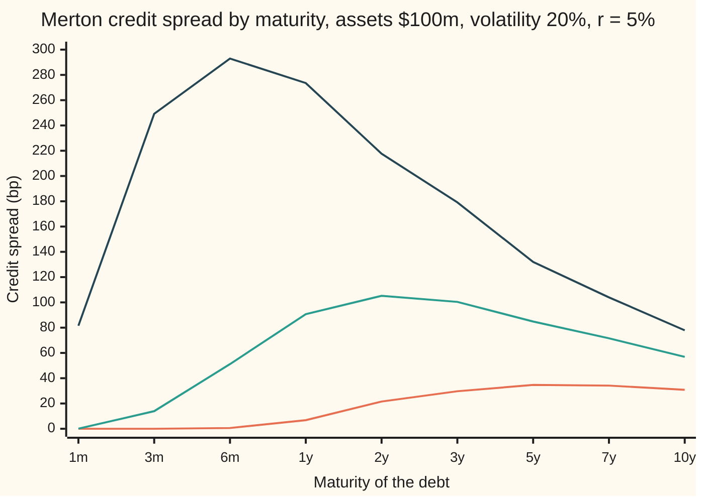
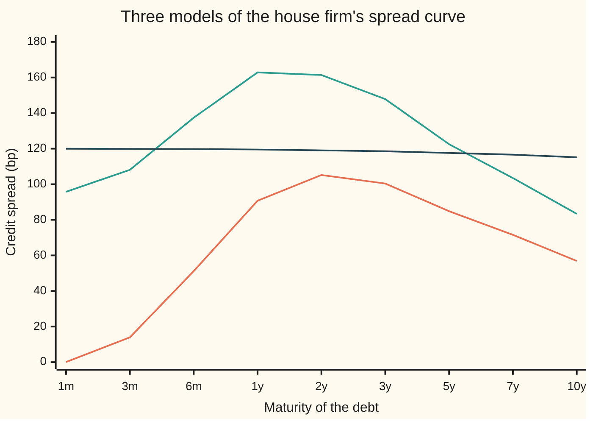

# Where structural models break: the vanishing short-term spread, jumps, and the patches that fix it

[Syllabus](../../../SYLLABUS.md) → [Financial mathematics](../README.md) → [Structural Models - Default from the Balance Sheet](../README.md#s43) → Where structural models break

---

## General Overview

Take the shelf's house firm. Its assets are worth $100m today. It owes one zero-coupon debt, a single repayment of $80m and nothing before it. The assets wander with a volatility of 20% a year, and cash earns 5%. Merton's model ([Merton's model](01-merton-model-equity-as-a-call.md)) prices that debt and reads off a **credit spread**: the extra yield, per year, that lenders earn over a riskless loan. Spreads are quoted in **basis points** (bp), hundredths of a percent.

Now ask for the spread at different repayment dates. At one year it is 90.71 bp. At two years 105.21 bp. At ten years 56.87 bp. At one month it is 0.07 bp: seven thousandths of a percent, a rounding error. Real bonds of a firm this levered pay tens of basis points even at one month, because a firm can fail between one quarter's report and the next.

The model has a reason for its answer. Default in Merton's model means the assets end up below the debt. From $100m, reaching $80m needs a fall that the assets, moving smoothly, need time to cover. In one month they almost never do. A smoothly moving asset cannot surprise anyone. This card measures that failure, proves it is built into every model of this kind, sets it beside a flat-hazard model that has no such problem, and shows the patches: jumps, assets that are not seen exactly, and a default point the shareholders choose.

**In a model where the firm's assets move without jumps and are seen exactly, the chance of default in the next instant is zero, so the credit spread must fall to zero as the maturity shrinks; a model with a sudden-failure rate, or with asset jumps, keeps a positive spread at the short end.**

**What kind of fact this is:** a theorem about a model: inside Merton's model the vanishing short spread is proved on this card in Why it works; the fixes (jumps, hidden assets, chosen default) are models, assumptions that fit markets better, not laws.

### The picture: Merton's spread curve at three debt levels

The house firm owes $80m. The same firm owing $65m, or $90m, gives the other two lines.



Orange: debt $65m. Green: the house firm, debt $80m. Dark blue: debt $90m. Every line bends down towards zero at the left edge and humps in the middle. The house firm peaks near two years. The more levered firm peaks sooner and higher; the less levered one peaks later and lower.

---

## The formula

The spread comes from the price of the **default put**: what lenders give up, in today's money, because the firm may not repay in full. The put's own formula is on [Merton's model](01-merton-model-equity-as-a-call.md); here it is a building block.

$$s(T) = -\frac{1}{T}\ln\!\left(1 - \frac{P(T)}{D e^{-rT}}\right), \qquad P(T) = D e^{-rT} N(-d_2) - V N(-d_1)$$

**Read it aloud:** the spread is the yield lost, per year, when the riskless price of the debt is cut by the default put.

The claim of the card is a limit and a ceiling:

$$s(T) \le \frac{N(-d_2)}{T\,\bigl(1 - N(-d_2)\bigr)} \longrightarrow 0 \quad \text{as } T \to 0, \text{ whenever } V > D$$

**Read it aloud:** the spread is at most the default chance per year of waiting, and that chance shrinks faster than the waiting time, so the spread dies.

The two models that keep a short spread:

$$\text{flat hazard: } s(T) \to \lambda(1-R), \qquad \text{jumps: } s(T) \to \lambda_J\,\frac{E\bigl[(D - V e^{Y})^{+}\bigr]}{D}$$

**Read it aloud:** $(x)^{+}$ means $x$ when positive, else 0. With a constant failure rate, the short spread is that rate times the share lost; with jumps, it is the jump rate times the average loss one jump inflicts, as a share of the debt.

| Symbol | Plain meaning | In our example | Push it up and the answer… |
| --- | --- | --- | --- |
| $s(T)$ | credit spread for debt repaid at time $T$, per year | 90.71 bp at one year | — (the output) |
| $T$ | years until the debt is repaid | 1/12 to 10 | spread first rises, then falls: the hump |
| $V$ | market value of the firm's assets today | $100m | spread falls |
| $D$ | face value of the debt, repaid at $T$ | $80m (also $65m, $90m) | spread rises, hump moves earlier |
| $r$ | riskless rate, continuously compounded; $e^{-rT}$ is today's price of $1 paid at $T$ | 5% | spread falls a little |
| $\sigma$ | asset volatility: typical yearly swing of $\ln V$ | 20% | spread rises |
| $P$ | the default put: value lenders lose to possible default | $0.687189m at one year | spread rises |
| $d_1$, $d_2$ | standardised distances of assets above debt; $d_2$ is the one for default | $d_2$ = 3.908261 at one month | default chance falls |
| $N$, $\varphi$ | standard normal chance of landing below a value, and the bell-curve height | $N(-d_2)$ = 0.00004648 at one month | — |
| $\lambda$ | hazard: chance of sudden default per year, in the flat-hazard model | 2% | short spread rises in step |
| $R$ | recovery: share of face paid back after default | 40% | spread falls |
| $\lambda_J$, $Y$, $\mu_J$, $\delta_J$ | jump rate per year; the log size of one jump; its mean and its spread | 0.10; normal; −0.30; 0.15 | short spread rises in step |

The helpers, as on the Merton card:

$$d_1 = \frac{\ln(V/D) + (r + \tfrac12\sigma^2)T}{\sigma\sqrt{T}}, \qquad d_2 = d_1 - \sigma\sqrt{T}$$

$d_2$ counts how many standard deviations of asset movement separate today's assets from the debt, after the risk-neutral drift. $d_1$ is the same count shifted by one volatility-times-root-time, used for the part of the loss paid in assets.

### When it holds

- **Assets move without jumps.** The ceiling above needs a continuous path. Allow jumps and the short spread stays positive: 95.75 bp at one month in this card's jump example.
- **Assets are seen exactly.** If lenders only estimate $V$ from noisy accounts, the firm may already be closer to trouble than it looks, and the short spread is positive (Duffie and Lando's result, below).
- **Assets above the debt today, $V > D$.** A firm already under water has $d_2$ running to minus infinity and a spread that explodes at the short end instead.
- **Default only at maturity, or at a fixed barrier.** Moving default to the first touch of a barrier, as on [Black-Cox](05-black-cox-first-passage-default.md), changes the constant but not the limit: the path still has to travel.

---

## Why it works

### Step 0: to default, the assets must travel, and a smooth path travels slowly

In Merton's model the firm defaults when the assets at repayment are below the face value. From $100m the assets must fall to $80m: a log drop of ln(100/80) = 0.223144. A smooth random path covers distance in proportion to the square root of time, not to time. In one month, one standard deviation of the log assets is 0.2 times the square root of one twelfth: 0.057735. The needed drop is 3.908261 of those standard deviations away. That is the whole failure in one number. Everything below makes it exact.

### Step 1: the spread is capped by the default chance per year

The put is the lenders' loss. In the worst case they lose the full face, so the put is at most the riskless value of the debt times the chance of default: $P \le D e^{-rT} N(-d_2)$, because the term $V N(-d_1)$ it subtracts is never negative.

Write $x = P/(D e^{-rT})$, the loss as a share of the riskless value. The spread is $-\ln(1-x)/T$. For $x$ between 0 and 1, $-\ln(1-x) \le x/(1-x)$. So

$$s(T) \le \frac{N(-d_2)}{T\,(1 - N(-d_2))}.$$

At one month the right side is 5.5780 bp. The true spread, 0.073127 bp, sits well under it: the ceiling assumes a total loss, and most defaulting paths end only a little below $80m.

### Step 2: the default chance dies faster than the time

As $T$ shrinks, $d_2$ grows like $\ln(V/D)/(\sigma\sqrt{T})$. The chance of landing that many standard deviations out falls like the bell curve's tail, roughly $e^{-d_2^2/2}$. Since $d_2^2$ grows like a constant over $T$, this is $e^{-c/T}$ for some $c > 0$. Divide by $T$ and it still goes to zero: the exponential beats any power. At one week the default chance is 3.621e-16, so the ceiling is 3.621e-16 × 52 × 10,000, about 0.0000000002 bp.

<details>
<summary>Detailed proof: the ceiling goes to zero</summary>

Fix $V > D$ and write $a = \ln(V/D) > 0$ and $m = r - \tfrac12\sigma^2$. Then $d_2 = (a + mT)/(\sigma\sqrt{T})$. For $T$ small enough that $a + mT > a/2$, we have $d_2 > a/(2\sigma\sqrt{T})$, which grows without bound.

For any $z > 0$ the normal tail satisfies $N(-z) \le \varphi(z)/z$, where $\varphi(z) = e^{-z^2/2}/\sqrt{2\pi}$ is the bell-curve height. Proof: for $u \ge z$, $\varphi(u) \le (u/z)\varphi(u)$, and $\int_z^\infty (u/z)\varphi(u)\,du = \varphi(z)/z$.

So $N(-d_2)/T \le \varphi(d_2)/(d_2 T)$. With $d_2 > b/\sqrt{T}$, $b = a/(2\sigma)$, this is at most $e^{-b^2/(2T)}\sqrt{T}/(b\sqrt{2\pi}\,T)$. Put $u = 1/T$: the bound is a constant times $\sqrt{u}\,e^{-b^2 u/2}$, which goes to zero as $u$ grows. The factor $1/(1 - N(-d_2))$ goes to 1. Hence $s(T) \to 0$. The argument used only that the assets have a continuous path with a normal spread of log changes, so any smooth-diffusion structural model inherits it.

</details>

### Step 3: in the middle the spread humps

Lengthen the maturity and two forces pull opposite ways. More time lets the assets wander further, so default gets likelier: the spread rises. But the debt's face is fixed while the assets, priced risk-neutrally, drift up at the riskless rate; and dividing by $T$ spreads the lenders' loss over more years. Past some point these win and the spread falls. The two cross at 1.9696 years for the house firm, where the spread peaks at 105.2146 bp. The levered firm owing $90m peaks at six months, at 292.96 bp on the grid; the firm owing $65m climbs until about five years.

A firm with debt above its assets, $D > V$, starts at the top instead: its short spread is already high, since the model says it is already insolvent, and the curve mostly falls from there.

### Step 4: a flat hazard keeps the short end alive

The flat-hazard model ([The hazard rate](../41-Default%2C%20Survival%20and%20the%20Hazard%20Rate/02-hazard-rate-and-survival-probability.md)) drops the balance sheet. Default arrives like a random alarm: the chance it rings in a short spell is $\lambda$ times the spell's length, however short the spell. With survival $q = e^{-\lambda T}$ and recovery $R$ of face paid at maturity, the zero bond is worth $e^{-rT}(q + R(1-q))$, and

$$s(T) = -\frac{1}{T}\ln\bigl(1 - (1-R)(1 - e^{-\lambda T})\bigr) \to \lambda(1-R).$$

The limit holds because $1 - e^{-\lambda T} \approx \lambda T$ and minus the log of one minus a small number is about that small number. With a 2% hazard and 40% recovery that is 120.0000 bp. At one day the bond spread is 119.9987 bp; at ten years it has sagged to 115.14 bp, because a bond can default only once, so its total loss is capped. The same rate times loss, read from a credit default swap (CDS, insurance against the firm's default, paid for by a yearly premium), is [The credit triangle](../42-Credit%20Default%20Swaps%20-%20Pricing%2C%20the%20Par%20Spread%20and%20the%20Hazard%20Behind%20It/03-the-credit-triangle.md).

### Step 5: jumps give the structural model a sudden-failure rate

Keep the balance sheet, and add to the smooth motion rare jumps: on average one every ten years, rate $\lambda_J$ = 0.10, each moving $\ln V$ by a normal amount $Y$ with mean −0.30 and spread 0.15, roughly a quarter of the assets wiped off at a stroke. This is Merton's jump model, taught on [Merton jump-diffusion](../13-Local%20volatility%20and%20jumps/04-merton-jump-diffusion.md). Its price is a weighted sum of smooth puts, one for each possible number of jumps.

Over a short spell $T$, the smooth part still cannot reach the debt. But one jump arrives with chance about $\lambda_J T$, and one jump can carry the assets straight past $80m. The loss per unit of time is then the jump rate times the average shortfall one jump causes:

$$\lim_{T\to 0} s(T) = \lambda_J\,\frac{E\bigl[(D - V e^{Y})^{+}\bigr]}{D} = \lambda_J\,\frac{D\,N(-d_2') - V e^{\mu_J + \delta_J^2/2} N(-d_1')}{D},$$

with $d_1' = (\ln(V/D) + \mu_J + \delta_J^2)/\delta_J$ and $d_2' = d_1' - \delta_J$, where $\mu_J$ = −0.30 and $\delta_J$ = 0.15 are the jump's mean and spread. This is a put formula again, with the jump in place of the smooth motion. It gives 95.0750 bp. The full jump model at one day gives 95.0958 bp, and at one month 95.75 bp. The short end is back.

<details>
<summary>The algebra behind the jump limit</summary>

The expectation is a one-period put on $V e^{Y}$ with $Y$ normal, mean $\mu_J$, spread $\delta_J$. Default needs $Y < \ln(D/V)$. The chance of that is $N(-d_2')$. The average of $V e^{Y}$ over those outcomes, times their chance, is $V e^{\mu_J + \delta_J^2/2} N(-d_1')$: shifting the normal by $\delta_J^2$ absorbs the $e^{Y}$. The jump model's asset drift is lowered by the jump rate times the average proportional jump, so that assets still grow at the riskless rate on average; that correction is second order at the short end and does not appear in the limit.

</details>

### Step 6: the other patches, in words

- **Assets not seen exactly (CreditGrades; Duffie and Lando).** Lenders see accounts, not true asset values. If today's distance to default is itself uncertain, some of the firms that look safe are in fact near the edge, and those can fail in the next instant. Duffie and Lando proved that noisy accounting gives a structural model a positive default rate at the short end. The CreditGrades model, built by RiskMetrics with several banks for use with share prices, gets the same effect by making the default barrier a random fraction of the debt.
- **Default chosen by shareholders (Leland).** In Leland's model the firm has coupon debt forever and shareholders keep paying coupons, out of their own pockets if needed, until paying stops being worth it. The barrier is then set by their best choice, which depends on taxes, coupons and volatility. It answers where default happens. It does not by itself revive the short end: the assets still diffuse towards a barrier, so a firm well above it still shows a near-zero spread over the next month.
- **Jumps**, as in Step 5, following Zhou's term-structure study.

The alternative route through the same limit is simulation: draw asset paths, count the defaults. The code does it at one year as a fourth road; at one month about 9 of 200,000 paths default, too few to measure a spread, which is the phenomenon itself.

---

## Worked numbers, by hand

The house firm at one month, then at one year, from the printed output.

| Step | Arithmetic | Value |
| --- | --- | --- |
| 1 | Drop needed: ln(100/80) | 0.223144 |
| 2 | One-month swing of log assets: 0.20 × √(1/12) | 0.057735 |
| 3 | $d_2$: the drop plus the small risk-neutral drift, over the swing | 3.908261 |
| 4 | One-month default chance $N(-d_2)$ | 0.00004648 |
| 5 | Ceiling: $N(-d_2)$ ÷ (1/12) ÷ (1 − $N(-d_2)$), in bp | 5.5780 |
| 6 | Actual one-month spread from the put | 0.073127 bp |
| 7 | Same firm at one year: put | 0.687189 |
| 8 | One-year default chance $N(-d_2)$ | 0.102807 |
| 9 | One-year spread, $-\ln(1 - 0.687189/(80 e^{-0.05}))$ in bp | **90.7130** |

**At one month the model charges 0.07 bp for lending $80m to a firm with a 10.28% risk-neutral chance of default over the year: the flat-hazard model, with a 2% yearly hazard, charges 119.96 bp.**

### What breaks if you drop a piece

| Mistake | Comes out at | What went wrong |
| --- | --- | --- |
| Quote the two-year yield gap without dividing by $T$ | 210.42 bp, not 105.21 | the spread is per year; the raw gap covers two |
| Read the default chance $N(-d_2)$ as the one-year spread | 1028.07 bp, not 90.71 | a chance is not a yield: lenders get most of their money back |
| Add jumps but leave the asset drift uncorrected | 193.50 bp at one year, not 162.84 | the jumps pull average assets down, so assets no longer grow at the riskless rate |

---

## How it moves: the one-year bond as repayment nears

The mystery: hold the house firm's one-year bond while nothing happens to the firm. Assets stay at $100m, volatility at 20%. The spread still slides from 90.71 bp to 0.07 bp by the final month. The firm did nothing; the clock did it. Each row below is the same firm on the same day, priced for a different time left to repayment, which is what the bond passes through as it ages.

| Time left | Merton, bp | Merton with jumps, bp | Flat hazard, bp |
| --- | --- | --- | --- |
| 1 month | 0.07 | 95.75 | 119.96 |
| 3 months | 13.94 | 108.10 | 119.88 |
| 6 months | 51.17 | 137.39 | 119.76 |
| 1 year | 90.71 | 162.84 | 119.52 |

One force at a time, at one month:

```
One-month spread, bp (each █ = 10 bp)
Merton, smooth assets    ▏                0.07
Merton, with jumps       ██████████      95.75
Flat hazard 2%, R 40%    ████████████   119.96
```



Orange: Merton, smooth assets, falling to zero at the left. Green: Merton with jumps, which starts near its one-jump limit and keeps the hump. Dark blue: flat 2% hazard with 40% recovery, near 120 bp everywhere.

---

## Code, from first principles, and it actually runs

The scripts price the house firm's debt at nine maturities and three debt levels, and take four roads to the answers: the closed-form put; a Simpson integral of the lenders' loss against the bell curve; the one-jump limit and the flat-hazard limit, each against the full model at one day; and a simulation of 200,000 one-year asset paths, with and without jumps, and of 200,000 default times under the flat hazard. A golden-section search finds the top of the hump, and a grid check confirms it. The normal distribution, the integrator, the search and the random numbers are all written in the script.

### Python

```python
# Where structural models break: Merton's spread curve, its vanishing short end, and two fixes.
from math import exp, log, sqrt, pi, cos

def N(x):                                    # standard normal CDF, written here
    if x < -3.0:                             # far tail: continued fraction for the Mills ratio
        a, cf = -x, 0.0
        for k in range(80, 0, -1):
            cf = k / (a + cf)
        return exp(-0.5 * x * x) / sqrt(2 * pi) / (a + cf)
    if x > 3.0:
        return 1.0 - N(-x)
    term, total, k = x, x, 0                 # series: 1/2 + phi(x) * sum x^(2k+1) / (1*3*...*(2k+1))
    while abs(term) > 1e-17:
        k += 1
        term *= x * x / (2 * k + 1)
        total += term
    return 0.5 + exp(-0.5 * x * x) / sqrt(2 * pi) * total

def put(V, D, r, s, T):                      # the default put: what the lenders give up
    d1 = (log(V / D) + (r + 0.5 * s * s) * T) / (s * sqrt(T))
    return D * exp(-r * T) * N(-(d1 - s * sqrt(T))) - V * N(-d1)

def spread(P, D, r, T):                      # annualised yield gap of the risky debt, in basis points
    return -log(1.0 - max(P, 0.0) / (D * exp(-r * T))) / T * 1e4

def put_by_integral(V, D, r, s, T, n=4000):  # road 2: integrate the lenders' loss against the bell curve
    m, w = (r - 0.5 * s * s) * T, s * sqrt(T)
    top = (log(D / V) - m) / w               # above this z the firm repays in full
    f = lambda z: (D - V * exp(m + w * z)) * exp(-0.5 * z * z) / sqrt(2 * pi)
    h = (top + 12.0) / n
    tot = f(-12.0) + f(top) + sum((4 if i % 2 else 2) * f(-12.0 + i * h) for i in range(1, n))
    return exp(-r * T) * tot * h / 3.0

def jump_put(V, D, r, s, T, lam, mu, dl):   # Merton's jump model: a Poisson-weighted sum of smooth puts
    k = exp(mu + 0.5 * dl * dl) - 1.0
    lp, tot, w = lam * (1 + k), 0.0, exp(-lam * (1 + k) * T)
    for n in range(60):
        tot += w * put(V, D, r - lam * k + n * log(1 + k) / T, sqrt(s * s + n * dl * dl / T), T)
        w *= lp * T / (n + 1)
    return tot

def jump_limit(V, D, lam, mu, dl):          # road 3: short-end spread = jump rate x average loss per jump
    d1 = (log(V / D) + mu + dl * dl) / dl
    return lam * (D * N(-(d1 - dl)) - V * exp(mu + 0.5 * dl * dl) * N(-d1)) / D * 1e4

def hazard_spread(hz, R, T):                 # zero bond, flat hazard, recovery R of face paid at maturity
    q = exp(-hz * T)
    return -log(q + R * (1 - q)) / T * 1e4

state = [88172645463325252]
def unif():                                  # xorshift64*: our own random numbers
    x = state[0]
    x ^= x >> 12; x ^= (x << 25) & 0xFFFFFFFFFFFFFFFF; x ^= x >> 27
    state[0] = x
    return (((x * 0x2545F4914F6CDD1D) & 0xFFFFFFFFFFFFFFFF) >> 11) * 2.0**-53 + 2.0**-54
def normal():
    return sqrt(-2.0 * log(unif())) * cos(2.0 * pi * unif())
def row(label, v, fmt=".4f"):
    print(f"{label:<38}{v:>14{fmt}}")

V, D, r, s = 100.0, 80.0, 0.05, 0.20
lam, mu, dl = 0.10, -0.30, 0.15             # jumps: one per ten years on average, log size -0.30 +- 0.15
hz, R = 0.02, 0.40                          # flat hazard 2% a year, 40% recovery
k = exp(mu + 0.5 * dl * dl) - 1.0

print("house firm, one year")
d2y = (log(V / D) + (r - 0.5 * s * s)) / s
row("default put", put(V, D, r, s, 1.0), ".6f")
row("risk-neutral default prob N(-d2)", N(-d2y), ".6f")
row("spread, bp", spread(put(V, D, r, s, 1.0), D, r, 1.0))
print("spread, bp: D=80 formula | D=80 integral | D=65 | D=90 | jumps | hazard")
rows = []
for lab, T in zip(["1m", "3m", "6m", "1y", "2y", "3y", "5y", "7y", "10y"], [1/12, .25, .5, 1., 2., 3., 5., 7., 10.]):
    a, b = spread(put(V, D, r, s, T), D, r, T), spread(put_by_integral(V, D, r, s, T), D, r, T)
    lo, hi = spread(put(V, 65.0, r, s, T), 65.0, r, T), spread(put(V, 90.0, r, s, T), 90.0, r, T)
    j, h = spread(jump_put(V, D, r, s, T, lam, mu, dl), D, r, T), hazard_spread(hz, R, T)
    rows.append((a, b, j, h))
    print(f"{lab:>4}{a:>9.2f}{b:>11.6f}{lo:>9.2f}{hi:>9.2f}{j:>9.2f}{h:>9.2f}")

print("why the short end vanishes: one month")
T = 1 / 12
d2m = (log(V / D) + (r - 0.5 * s * s) * T) / (s * sqrt(T))
ceiling = N(-d2m) / (T * (1 - N(-d2m))) * 1e4
nu, b = r - 0.5 * s * s, log(D / V)
hit = N((b - nu * T) / (s * sqrt(T))) + (D / V) ** (2 * nu / (s * s)) * N((b + nu * T) / (s * sqrt(T)))
row("drop needed ln(100/80)", log(V / D), ".6f")
row("one-month sd of log assets", s * sqrt(T), ".6f")
row("d2, standard deviations away", d2m, ".6f")
row("default prob N(-d2)", N(-d2m), ".8f")
row("first-passage prob, barrier 80", hit, ".8f")
row("ceiling N(-d2)/(T(1-N(-d2))), bp", ceiling)
row("default prob N(-d2), one week", N(-(log(V / D) + nu / 52) / (s * sqrt(1 / 52))), ".3e")

lo_, hi_, g = 0.5, 6.0, (sqrt(5) - 1) / 2   # road for the hump: golden-section search for its top
f = lambda t: -spread(put(V, D, r, s, t), D, r, t)
for _ in range(80):
    x1, x2 = hi_ - g * (hi_ - lo_), lo_ + g * (hi_ - lo_)
    if f(x1) < f(x2): hi_ = x2
    else: lo_ = x1
Tpk = 0.5 * (lo_ + hi_)
row("hump peaks at, years", Tpk)
row("peak spread, bp", -f(Tpk))

print("the short end with a fix, bp")
jl = jump_limit(V, D, lam, mu, dl)
row("jumps: spread, one day", spread(jump_put(V, D, r, s, 1 / 365, lam, mu, dl), D, r, 1 / 365))
row("jumps: limit lam x E[loss]/D", jl)
row("hazard: spread, one day", hazard_spread(hz, R, 1 / 365))
row("hazard: limit hz(1-R)", hz * (1 - R) * 1e4)

n, sm, sj, sh = 200000, 0.0, 0.0, 0.0      # road 4: simulate one year of assets, and ten years of hazard
for _ in range(n):
    z = normal()
    L, u, jumps = exp(-lam), unif(), 0      # Poisson count by multiplying uniforms
    while u > L:
        jumps += 1; u *= unif()
    y = sum(mu + dl * normal() for _ in range(jumps))
    sm += max(D - V * exp(r - 0.5 * s * s + s * z), 0.0)
    sj += max(D - V * exp(r - lam * k - 0.5 * s * s + s * z + y), 0.0)
    sh += 1.0 if -log(unif()) / hz > 10.0 else R   # default time drawn from the flat hazard
mc_m, mc_j = spread(exp(-r) * sm / n, D, r, 1.0), spread(exp(-r) * sj / n, D, r, 1.0)
mc_h = -log(sh / n) / 10.0 * 1e4
row("simulated 1y spread, smooth", mc_m, ".2f")
row("simulated 1y spread, jumps", mc_j, ".2f")
row("simulated 10y hazard spread", mc_h, ".2f")

print("what breaks")
row("2y gap not divided by T, bp", rows[4][0] * 2)
row("N(-d2) read as the 1y spread, bp", N(-d2y) * 1e4)
row("jumps, drift not corrected, 1y, bp", spread(jump_put(V * exp(lam * k), D, r, s, 1.0, lam, mu, dl), D, r, 1.0))

assert all(abs(a - b) < 1e-6 for a, b, _, _ in rows),   "integral road must match the formula"
assert abs(rows[3][0] - 90.713) < 0.01,                  "house example: 90.7 bp at one year"
assert rows[0][0] < ceiling,                             "one-month spread must sit under its Mills ceiling"
assert abs(rows[0][2] - jl) < 2.0,                       "one-month jump spread near the one-jump limit"
assert abs(mc_m - rows[3][0]) < 4.0,                     "simulation agrees with Merton at one year"
assert abs(mc_j - rows[3][2]) < 5.0,                     "simulation agrees with the jump series at one year"
assert abs(mc_h - rows[8][3]) < 1.0,                     "simulated default times agree with the hazard bond"
assert all(a < -f(Tpk) for a, _, _, _ in rows),          "no grid maturity beats the golden-section peak"
print("ALL CHECKS PASS")
```

**Ran 2026-09-28 on macOS, Python 3.14.6, standard library only. All checks passed. Output, pasted from the run:**

```
house firm, one year
default put                                 0.687189
risk-neutral default prob N(-d2)            0.102807
spread, bp                                   90.7130
spread, bp: D=80 formula | D=80 integral | D=65 | D=90 | jumps | hazard
  1m     0.07   0.073127     0.00    81.52    95.75   119.96
  3m    13.94  13.936752     0.00   249.23   108.10   119.88
  6m    51.17  51.165653     0.60   292.96   137.39   119.76
  1y    90.71  90.712996     6.81   273.54   162.84   119.52
  2y   105.21 105.207645    21.54   217.64   161.41   119.04
  3y   100.40 100.403962    29.68   179.16   147.86   118.55
  5y    84.86  84.859288    34.68   132.02   122.49   117.58
  7y    71.57  71.574596    34.15   103.98   103.49   116.61
 10y    56.87  56.867175    30.84    77.91    83.35   115.14
why the short end vanishes: one month
drop needed ln(100/80)                      0.223144
one-month sd of log assets                  0.057735
d2, standard deviations away                3.908261
default prob N(-d2)                       0.00004648
first-passage prob, barrier 80            0.00009391
ceiling N(-d2)/(T(1-N(-d2))), bp              5.5780
default prob N(-d2), one week              3.621e-16
hump peaks at, years                          1.9696
peak spread, bp                             105.2146
the short end with a fix, bp
jumps: spread, one day                       95.0958
jumps: limit lam x E[loss]/D                 95.0750
hazard: spread, one day                     119.9987
hazard: limit hz(1-R)                       120.0000
simulated 1y spread, smooth                    91.47
simulated 1y spread, jumps                    162.68
simulated 10y hazard spread                   115.48
what breaks
2y gap not divided by T, bp                 210.4153
N(-d2) read as the 1y spread, bp           1028.0707
jumps, drift not corrected, 1y, bp          193.4969
ALL CHECKS PASS
```

### Rust

```rust
// Where structural models break: Merton's spread curve, its vanishing short end, and two fixes.
use std::f64::consts::PI;

fn n_cdf(x: f64) -> f64 { // standard normal CDF, written here
    if x < -3.0 { // far tail: continued fraction for the Mills ratio
        let (a, mut cf) = (-x, 0.0);
        for k in (1..=80).rev() { cf = k as f64 / (a + cf); }
        return (-0.5 * x * x).exp() / (2.0 * PI).sqrt() / (a + cf);
    }
    if x > 3.0 { return 1.0 - n_cdf(-x); }
    let (mut term, mut total, mut k) = (x, x, 0); // series: 1/2 + phi(x) * sum x^(2k+1) / (1*3*...*(2k+1))
    while term.abs() > 1e-17 {
        k += 1;
        term *= x * x / (2 * k + 1) as f64;
        total += term;
    }
    0.5 + (-0.5 * x * x).exp() / (2.0 * PI).sqrt() * total
}

fn put(v: f64, d: f64, r: f64, s: f64, t: f64) -> f64 { // the default put: what the lenders give up
    let d1 = ((v / d).ln() + (r + 0.5 * s * s) * t) / (s * t.sqrt());
    d * (-r * t).exp() * n_cdf(-(d1 - s * t.sqrt())) - v * n_cdf(-d1)
}

fn spread(p: f64, d: f64, r: f64, t: f64) -> f64 { // annualised yield gap of the risky debt, in basis points
    -(1.0 - p.max(0.0) / (d * (-r * t).exp())).ln() / t * 1e4
}

fn put_by_integral(v: f64, d: f64, r: f64, s: f64, t: f64) -> f64 { // road 2: integrate the loss against the bell curve
    let n = 4000;
    let (m, w) = ((r - 0.5 * s * s) * t, s * t.sqrt());
    let top = ((d / v).ln() - m) / w; // above this z the firm repays in full
    let f = |z: f64| (d - v * (m + w * z).exp()) * (-0.5 * z * z).exp() / (2.0 * PI).sqrt();
    let h = (top + 12.0) / n as f64;
    let mut inner = 0.0;
    for i in 1..n { inner += if i % 2 == 1 { 4.0 } else { 2.0 } * f(-12.0 + i as f64 * h); }
    let tot = f(-12.0) + f(top) + inner;
    (-r * t).exp() * tot * h / 3.0
}

fn jump_put(v: f64, d: f64, r: f64, s: f64, t: f64, lam: f64, mu: f64, dl: f64) -> f64 { // Merton's jump model: Poisson-weighted smooth puts
    let k = (mu + 0.5 * dl * dl).exp() - 1.0;
    let (lp, mut tot, mut w) = (lam * (1.0 + k), 0.0, (-lam * (1.0 + k) * t).exp());
    for n in 0..60 {
        let nf = n as f64;
        tot += w * put(v, d, r - lam * k + nf * (1.0 + k).ln() / t, (s * s + nf * dl * dl / t).sqrt(), t);
        w *= lp * t / (nf + 1.0);
    }
    tot
}

fn jump_limit(v: f64, d: f64, lam: f64, mu: f64, dl: f64) -> f64 { // road 3: jump rate x average loss per jump
    let d1 = ((v / d).ln() + mu + dl * dl) / dl;
    lam * (d * n_cdf(-(d1 - dl)) - v * (mu + 0.5 * dl * dl).exp() * n_cdf(-d1)) / d * 1e4
}

fn hazard_spread(hz: f64, r_rec: f64, t: f64) -> f64 { // zero bond, flat hazard, recovery of face at maturity
    let q = (-hz * t).exp();
    -(q + r_rec * (1.0 - q)).ln() / t * 1e4
}

struct Rng(u64);
impl Rng {
    fn unif(&mut self) -> f64 { // xorshift64*: our own random numbers
        let mut x = self.0;
        x ^= x >> 12; x ^= x << 25; x ^= x >> 27;
        self.0 = x;
        (x.wrapping_mul(0x2545F4914F6CDD1D) >> 11) as f64 * 2f64.powi(-53) + 2f64.powi(-54)
    }
    fn normal(&mut self) -> f64 {
        let (u1, u2) = (self.unif(), self.unif());
        (-2.0 * u1.ln()).sqrt() * (2.0 * PI * u2).cos()
    }
}

fn row(label: &str, v: f64, dp: usize) { println!("{:<38}{:>14.*}", label, dp, v); }

fn main() {
    let (v, d, r, s) = (100.0f64, 80.0f64, 0.05f64, 0.20f64);
    let (lam, mu, dl) = (0.10f64, -0.30f64, 0.15f64); // jumps: one per ten years on average, log size -0.30 +- 0.15
    let (hz, rec) = (0.02, 0.40); // flat hazard 2% a year, 40% recovery
    let k = (mu + 0.5 * dl * dl).exp() - 1.0;
    println!("house firm, one year");
    let d2y = ((v / d).ln() + (r - 0.5 * s * s)) / s;
    row("default put", put(v, d, r, s, 1.0), 6);
    row("risk-neutral default prob N(-d2)", n_cdf(-d2y), 6);
    row("spread, bp", spread(put(v, d, r, s, 1.0), d, r, 1.0), 4);
    println!("spread, bp: D=80 formula | D=80 integral | D=65 | D=90 | jumps | hazard");
    let labs = ["1m", "3m", "6m", "1y", "2y", "3y", "5y", "7y", "10y"];
    let mats = [1.0 / 12.0, 0.25, 0.5, 1.0, 2.0, 3.0, 5.0, 7.0, 10.0];
    let mut rows = Vec::new();
    for (lab, &t) in labs.iter().zip(mats.iter()) {
        let (a, b) = (spread(put(v, d, r, s, t), d, r, t), spread(put_by_integral(v, d, r, s, t), d, r, t));
        let (lo, hi) = (spread(put(v, 65.0, r, s, t), 65.0, r, t), spread(put(v, 90.0, r, s, t), 90.0, r, t));
        let (j, h) = (spread(jump_put(v, d, r, s, t, lam, mu, dl), d, r, t), hazard_spread(hz, rec, t));
        rows.push((a, b, j, h));
        println!("{:>4}{:>9.2}{:>11.6}{:>9.2}{:>9.2}{:>9.2}{:>9.2}", lab, a, b, lo, hi, j, h);
    }
    println!("why the short end vanishes: one month");
    let t = 1.0 / 12.0;
    let d2m = ((v / d).ln() + (r - 0.5 * s * s) * t) / (s * t.sqrt());
    let ceiling = n_cdf(-d2m) / (t * (1.0 - n_cdf(-d2m))) * 1e4;
    let (nu, b) = (r - 0.5 * s * s, (d / v).ln());
    let hit = n_cdf((b - nu * t) / (s * t.sqrt())) + (d / v).powf(2.0 * nu / (s * s)) * n_cdf((b + nu * t) / (s * t.sqrt()));
    row("drop needed ln(100/80)", (v / d).ln(), 6);
    row("one-month sd of log assets", s * t.sqrt(), 6);
    row("d2, standard deviations away", d2m, 6);
    row("default prob N(-d2)", n_cdf(-d2m), 8);
    row("first-passage prob, barrier 80", hit, 8);
    row("ceiling N(-d2)/(T(1-N(-d2))), bp", ceiling, 4);
    let wk = n_cdf(-((v / d).ln() + nu / 52.0) / (s * (1.0f64 / 52.0).sqrt()));
    println!("{:<38}{:>14.3e}", "default prob N(-d2), one week", wk);
    // road for the hump: golden-section search for its top
    let (mut lo_, mut hi_, g) = (0.5f64, 6.0f64, (5.0f64.sqrt() - 1.0) / 2.0);
    let f = |t: f64| -spread(put(v, d, r, s, t), d, r, t);
    for _ in 0..80 {
        let (x1, x2) = (hi_ - g * (hi_ - lo_), lo_ + g * (hi_ - lo_));
        if f(x1) < f(x2) { hi_ = x2 } else { lo_ = x1 }
    }
    let tpk = 0.5 * (lo_ + hi_);
    row("hump peaks at, years", tpk, 4);
    row("peak spread, bp", -f(tpk), 4);
    println!("the short end with a fix, bp");
    let jl = jump_limit(v, d, lam, mu, dl);
    row("jumps: spread, one day", spread(jump_put(v, d, r, s, 1.0 / 365.0, lam, mu, dl), d, r, 1.0 / 365.0), 4);
    row("jumps: limit lam x E[loss]/D", jl, 4);
    row("hazard: spread, one day", hazard_spread(hz, rec, 1.0 / 365.0), 4);
    row("hazard: limit hz(1-R)", hz * (1.0 - rec) * 1e4, 4);
    // road 4: simulate one year of assets, and ten years of hazard
    let mut rng = Rng(88172645463325252);
    let (n, mut sm, mut sj, mut sh) = (200000, 0.0, 0.0, 0.0);
    for _ in 0..n {
        let z = rng.normal();
        let (ll, mut u, mut jumps) = ((-lam).exp(), rng.unif(), 0);
        while u > ll { jumps += 1; u *= rng.unif(); } // Poisson count by multiplying uniforms
        let mut y = 0.0;
        for _ in 0..jumps { y += mu + dl * rng.normal(); }
        sm += (d - v * (r - 0.5 * s * s + s * z).exp()).max(0.0);
        sj += (d - v * (r - lam * k - 0.5 * s * s + s * z + y).exp()).max(0.0);
        sh += if -rng.unif().ln() / hz > 10.0 { 1.0 } else { rec }; // default time from the flat hazard
    }
    let nf = n as f64;
    let (mc_m, mc_j) = (spread((-r).exp() * sm / nf, d, r, 1.0), spread((-r).exp() * sj / nf, d, r, 1.0));
    let mc_h = -(sh / nf).ln() / 10.0 * 1e4;
    row("simulated 1y spread, smooth", mc_m, 2);
    row("simulated 1y spread, jumps", mc_j, 2);
    row("simulated 10y hazard spread", mc_h, 2);
    println!("what breaks");
    row("2y gap not divided by T, bp", rows[4].0 * 2.0, 4);
    row("N(-d2) read as the 1y spread, bp", n_cdf(-d2y) * 1e4, 4);
    row("jumps, drift not corrected, 1y, bp", spread(jump_put(v * (lam * k).exp(), d, r, s, 1.0, lam, mu, dl), d, r, 1.0), 4);

    assert!(rows.iter().all(|x| (x.0 - x.1).abs() < 1e-6), "integral road must match the formula");
    assert!((rows[3].0 - 90.713).abs() < 0.01, "house example: 90.7 bp at one year");
    assert!(rows[0].0 < ceiling, "one-month spread must sit under its Mills ceiling");
    assert!((rows[0].2 - jl).abs() < 2.0, "one-month jump spread near the one-jump limit");
    assert!((mc_m - rows[3].0).abs() < 4.0, "simulation agrees with Merton at one year");
    assert!((mc_j - rows[3].2).abs() < 5.0, "simulation agrees with the jump series at one year");
    assert!((mc_h - rows[8].3).abs() < 1.0, "simulated default times agree with the hazard bond");
    assert!(rows.iter().all(|x| x.0 < -f(tpk)), "no grid maturity beats the golden-section peak");
    println!("ALL CHECKS PASS");
}
```

**Ran 2026-09-28 on macOS, rustc 1.98.1, no crates. All checks passed. Output, pasted from the run:**

```
house firm, one year
default put                                 0.687189
risk-neutral default prob N(-d2)            0.102807
spread, bp                                   90.7130
spread, bp: D=80 formula | D=80 integral | D=65 | D=90 | jumps | hazard
  1m     0.07   0.073127     0.00    81.52    95.75   119.96
  3m    13.94  13.936752     0.00   249.23   108.10   119.88
  6m    51.17  51.165653     0.60   292.96   137.39   119.76
  1y    90.71  90.712996     6.81   273.54   162.84   119.52
  2y   105.21 105.207645    21.54   217.64   161.41   119.04
  3y   100.40 100.403962    29.68   179.16   147.86   118.55
  5y    84.86  84.859288    34.68   132.02   122.49   117.58
  7y    71.57  71.574596    34.15   103.98   103.49   116.61
 10y    56.87  56.867175    30.84    77.91    83.35   115.14
why the short end vanishes: one month
drop needed ln(100/80)                      0.223144
one-month sd of log assets                  0.057735
d2, standard deviations away                3.908261
default prob N(-d2)                       0.00004648
first-passage prob, barrier 80            0.00009391
ceiling N(-d2)/(T(1-N(-d2))), bp              5.5780
default prob N(-d2), one week              3.621e-16
hump peaks at, years                          1.9696
peak spread, bp                             105.2146
the short end with a fix, bp
jumps: spread, one day                       95.0958
jumps: limit lam x E[loss]/D                 95.0750
hazard: spread, one day                     119.9987
hazard: limit hz(1-R)                       120.0000
simulated 1y spread, smooth                    91.47
simulated 1y spread, jumps                    162.68
simulated 10y hazard spread                   115.48
what breaks
2y gap not divided by T, bp                 210.4153
N(-d2) read as the 1y spread, bp           1028.0707
jumps, drift not corrected, 1y, bp          193.4969
ALL CHECKS PASS
```

The two outputs agree line for line, including the simulations: both run the same xorshift generator from the same seed.

> [!TIP]
> **Try changing**
> - **Raise the debt to $90m.** Guess first: does the one-month spread stay near zero? Answer: no, it jumps to 81.52 bp, because the assets now sit only a short distance above the debt; the curve peaks at 292.96 bp at six months on the grid.
> - **Cut the debt to $65m.** Guess first: where is the peak? Answer: the spread is 0.00 bp to two decimals out to three months and climbs to 34.68 bp at five years.
> - **Shorten the one-month case to one week.** Guess first: how small does the default chance get? Answer: 3.621e-16.
> - **Switch to first-passage default at a barrier of $80m.** Guess first: does default at the first touch fix the short end? Answer: it about doubles the one-month default chance, from 0.00004648 to 0.00009391, which is still nothing.

---

## The usual mistake

> [!warning]
> **Reading a near-zero short spread as good news about the firm.** In Merton's model every firm above water has a near-zero one-month spread, whatever its leverage and volatility: the house firm, with a 10.28% risk-neutral chance of default over the year, is charged 0.07 bp for one month. The zero is a property of smooth paths, not of the firm. Markets charge tens of basis points at the short end, and a model that cannot is misspecified there.
>
> - **Calibrating a structural model to short bonds.** To reproduce a real one-month spread with smooth assets, the fit pushes volatility or leverage to absurd values, which then wreck the long end.
> - **Believing first-passage default fixes it.** Black-Cox doubles the tiny one-month chance, 0.00004648 to 0.00009391, and leaves it tiny.
> - **Quoting an unannualised gap.** The two-year gap is 210.42 bp; the spread is 105.21 bp.
> - **Forgetting the drift correction with jumps.** It gives 193.50 bp at one year instead of 162.84 bp.

---

## Where you meet it in real life

- **Credit desks marking short bonds.** Short-dated corporate paper trades at positive spreads that no smooth structural model produces; desks mark it off hazard curves built from CDS quotes instead ([Bootstrapping a hazard curve](../42-Credit%20Default%20Swaps%20-%20Pricing%2C%20the%20Par%20Spread%20and%20the%20Hazard%20Behind%20It/06-bootstrapping-the-hazard-curve-from-cds-quotes.md)).
- **Default scoring from share prices.** Distance-to-default ([Distance to default](03-distance-to-default-and-expected-default-frequency.md)) keeps the structural model for ranking firms and maps the distance to observed default rates, sidestepping the model's own short-end probabilities.
- **CreditGrades.** A structural model built for traders who start from the share price, with an uncertain default barrier so that short spreads stay positive.
- **The credit spread puzzle.** Market spreads, above all on safe and short bonds, are wider than default losses alone explain. Eom, Helwege and Huang tested five structural models on corporate bonds: Merton's underpredicts spreads on average, while several extensions overshoot on the riskiest bonds. See also [Two default probabilities](../42-Credit%20Default%20Swaps%20-%20Pricing%2C%20the%20Par%20Spread%20and%20the%20Hazard%20Behind%20It/09-market-implied-versus-historical-default-probability.md).
- **Capital structure research.** Leland's chosen-default model is used to study how much a firm should borrow, where taxes favour debt and default costs oppose it.

> **Say it back**
> In Merton's model a firm defaults only if its assets fall below its debt, and smooth assets need time to fall that far. So the chance of default in the next instant is zero and the credit spread falls to zero at short maturities: 0.07 bp at one month for the house firm, against 90.71 bp at one year. Between short and long, the spread humps. A flat hazard rate keeps a positive short spread, 120 bp for 2% with 40% recovery, because default can come at any moment. Jumps, uncertain asset values and a chosen default barrier are the patches; only the first two bring back the short end.

---

## What this builds on

- [How the balance-sheet claims move](02-structural-model-sensitivities.md): how the debt's value and spread move with assets, volatility, leverage and time, which this card follows to the short-maturity limit.
- [Black-Cox](05-black-cox-first-passage-default.md): default at the first touch of a barrier, the first attempted repair, which this card shows still vanishes at the short end.

---

## Where this goes next

- [Merton jump-diffusion](../13-Local%20volatility%20and%20jumps/04-merton-jump-diffusion.md): the jump model used here as a fix, priced in full for options on shares.
- [Bootstrapping a hazard curve](../42-Credit%20Default%20Swaps%20-%20Pricing%2C%20the%20Par%20Spread%20and%20the%20Hazard%20Behind%20It/06-bootstrapping-the-hazard-curve-from-cds-quotes.md): the hazard-based curve that desks use where structural models fail.

The question left open is how to price credit when the balance sheet is no longer the engine: reduced-form models take the hazard rate itself as the thing to model and fit it to market quotes.

---

## Sources

Verified 2026-09-28: every link below resolves to the publisher's page.

- Robert C. Merton, "On the Pricing of Corporate Debt: The Risk Structure of Interest Rates", *Journal of Finance* 29(2), 1974, [doi:10.1111/j.1540-6261.1974.tb03058.x](https://doi.org/10.1111/j.1540-6261.1974.tb03058.x). The model and its spread curve, including the hump.
- Chunsheng Zhou, "The term structure of credit spreads with jump risk", *Journal of Banking & Finance* 25(11), 2001, [doi:10.1016/S0378-4266(00)00168-0](https://doi.org/10.1016/S0378-4266(00)00168-0). Jumps in a structural model, and positive short spreads.
- Darrell Duffie and David Lando, "Term Structures of Credit Spreads with Incomplete Accounting Information", *Econometrica* 69(3), 2001, [doi:10.1111/1468-0262.00208](https://doi.org/10.1111/1468-0262.00208). Noisy accounts give a structural model a default rate.
- Hayne E. Leland, "Corporate Debt Value, Bond Covenants, and Optimal Capital Structure", *Journal of Finance* 49(4), 1994, [doi:10.1111/j.1540-6261.1994.tb02452.x](https://doi.org/10.1111/j.1540-6261.1994.tb02452.x). Default chosen by shareholders.
- Christopher C. Finger (editor), *CreditGrades Technical Document*, RiskMetrics Group, May 2002, [msci.com](https://www.msci.com/documents/10199/dd31bcce-6fe3-47b7-9fb7-10c4c8f750ba). The uncertain barrier that keeps short spreads positive.
- Young Ho Eom, Jean Helwege and Jing-Zhi Huang, "Structural Models of Corporate Bond Pricing: An Empirical Analysis", *Review of Financial Studies* 17(2), 2004, [doi:10.1093/rfs/hhg053](https://doi.org/10.1093/rfs/hhg053). Five structural models tested against bond prices.
