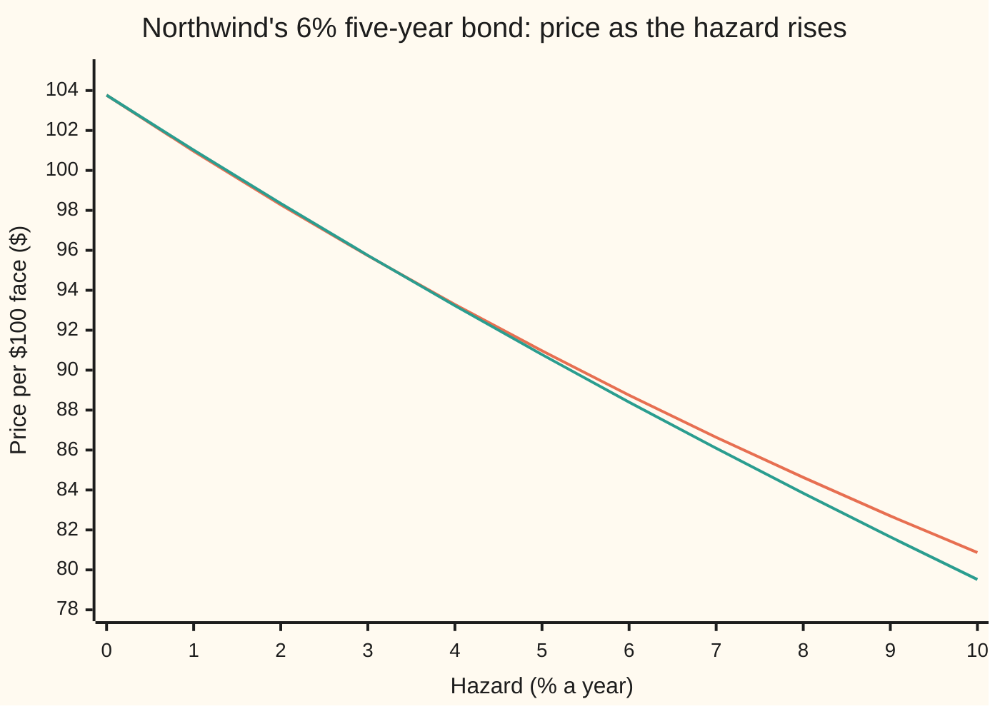
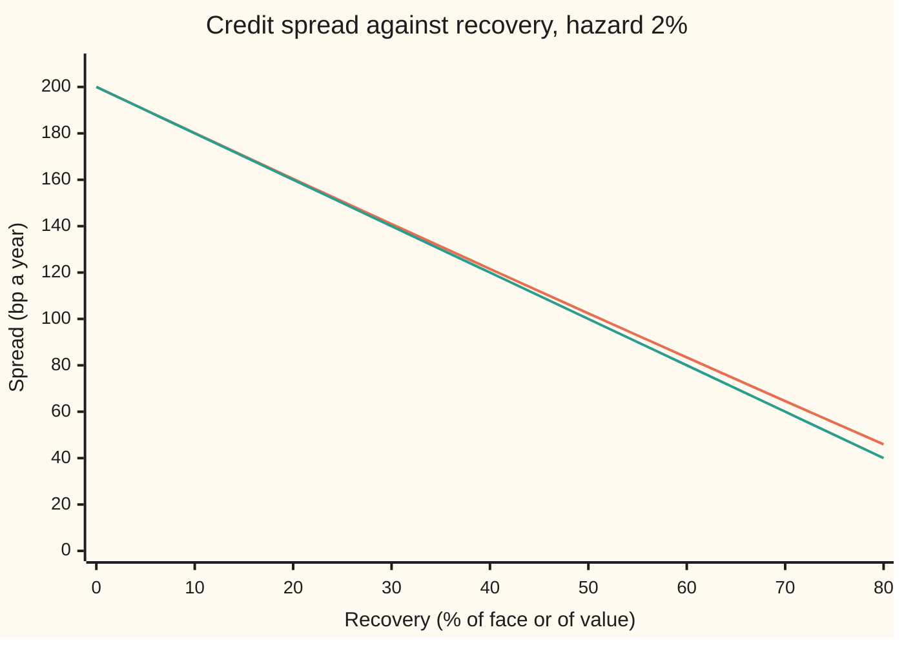

# A risky bond from the hazard curve: survival-weighted coupons plus recovery on default

[Syllabus](../../../SYLLABUS.md) → [Financial mathematics](../../../SYLLABUS.md#w12) → [Reduced-Form Models - Risky Bonds, Spreads and Random Hazards](../../../SYLLABUS.md#w12-s44) → A risky bond from the hazard curve

---

## General Overview

Northwind Lines, the shipping company of the credit shelves, sells a five-year bond. Each bond has a face of \$100, repaid at the end of year five, and pays a coupon of \$6 at the end of every year until then. A government bond making the same five promises, discounted at a riskless 5% a year, sells for **\$103.77** ([Bond price and yield](../01-Money%2C%20Dates%20and%20Discounting/05-bonds-price-and-yield.md)).

Northwind may default: stop paying part-way through. The market prices it as failing at a steady 2% a year for as long as it survives, a **hazard rate** ([The piecewise-flat hazard curve](../41-Default%2C%20Survival%20and%20the%20Hazard%20Rate/03-piecewise-flat-hazard-curve.md)). If it fails, bondholders are expected to get 40 cents per dollar of face back, paid when the default happens. That fraction is the **recovery**.

On those numbers the bond is worth **\$98.28**; the \$5.49 gap is the price of the chance of default. At \$98.28 the bond **yields** 6.22% a year (the one rate that discounts its promises back to its price), against 5% for the government. The difference, **122 basis points** (hundredths of a percent), is Northwind's **credit spread**.

The method weights each promised payment by the chance Northwind is alive to make it, discounts it, and adds what is recovered if it is not. 100,000 simulated default dates land within a cent of the formula.

**A defaultable bond is worth its coupons and face, each weighted by the chance the issuer survives to pay it and discounted, plus the recovery, weighted by the chance default lands at each moment and discounted from that moment.**

**What kind of fact this is:** a model: default is taken to arrive at a known hazard, independent of interest rates, an assumption about markets, not a law. Inside the model the pricing formula, its closed form and the recovery-of-market-value rule are theorems, proved on this card in Why it works.

### The picture: price against hazard, under two recovery rules



Orange: recovery of face, 40% of the \$100 face paid at default, the card's main rule. Green: recovery of market value, 40% of the bond's value just before default (Step 4). Both start at the riskless \$103.77. At Northwind's 2% they sit close, \$98.28 and \$98.35, and they part as default becomes a bigger share of the bond's value.

---

## The formula

Notation first, in words. The coupon dates are $t_i$, read "t sub i": years 1 to 5. A capital sigma, Σ, means "add up over the coupon dates". $D(t)$, the discount factor, is today's value of \$1 due at date $t$. $Q(t)$ is the chance Northwind survives to $t$. $\lambda(t)$ ("lambda") is the hazard in force at $t$. The integral $\int_0^T$ is the area under a curve from today to maturity $T$.

$$P \;=\; \sum_{i=1}^{n} c\,D(t_i)\,Q(t_i) \;+\; F\,D(T)\,Q(T) \;+\; R\,F\int_0^T D(t)\,\lambda(t)\,Q(t)\,dt$$

**Read it aloud:** each coupon, discounted and weighted by the chance Northwind is alive to pay it; the face, the same way; and the recovered 40% of face, discounted from each instant default could happen and weighted by the chance it happens then.

With flat curves, $D(t) = e^{-rt}$ and $Q(t) = e^{-\lambda t}$, the two shrink factors merge into one rate, $k = r + \lambda$, and the integral has a closed form:

$$P \;=\; \sum_{i=1}^{n} c\,e^{-k t_i} \;+\; F\,e^{-kT} \;+\; R\,F\,\lambda\,\frac{1 - e^{-kT}}{k}$$

**Read it aloud:** the promises discounted at the riskless rate plus the hazard, plus the recovery.

Under recovery of market value the recovery term disappears into the discount rate:

$$P_{\text{RMV}} \;=\; \sum_{i=1}^{n} c\,e^{-(r + \lambda(1-R))\,t_i} \;+\; F\,e^{-(r + \lambda(1-R))\,T}$$

**Read it aloud:** discount the promises at the riskless rate plus the loss rate, the hazard times the fraction lost.

The yield $y$ is the one rate that reprices the bond with every payment treated as certain, compounded continuously so it compares directly with $r$ and $\lambda$; the spread $s$ is its excess over $r$:

$$P = \sum_{i=1}^{n} c\,e^{-y t_i} + F\,e^{-yT}, \qquad s = y - r.$$

| Symbol | Plain meaning | In our example | Push it up and the price… |
| --- | --- | --- | --- |
| $P$, $P_{\text{RMV}}$ | the bond's price today per \$100 of face, under recovery of face; under recovery of market value | \$98.28; \$98.35 | — |
| $F$, $c$ | the face repaid at maturity; the yearly coupon | \$100; \$6 | rises |
| $t$, $dt$, $t_i$, $n$, $T$ | a date; a short stretch of time; the coupon dates; how many; the last one, maturity | coupons at 1 to 5 years; n = 5; T = 5 | — |
| $r$, $D(t)$ | riskless rate, continuously compounded; discount factor $e^{-rt}$ | 5%; D(5) = 0.778801 | falls |
| $\lambda$, $\lambda(t)$ | the hazard: chance of default per year among survivors | 2%, flat | falls, 2.6 cents per bp |
| $Q(t)$ | survival: chance of no default by $t$, $e^{-\lambda t}$ when flat | Q(5) = 0.904837 | — |
| $\tau$ | the default date, random ("tau") | inside five years with chance 9.52% | — |
| $R$ | recovery: fraction of face paid at default | 40% | rises, 84 cents per 10 points |
| $k$ | the merged shrink rate $r + \lambda$ for flat curves | 7% | — |
| $y$ | the bond's yield, continuously compounded | 6.2155% | — |
| $s$ | the credit spread, yield minus riskless rate | 121.55 bp | — |
| $V(t)$, $B$ | riskless value at $t$ of what is still owed (Step 3); the bond's own value at a date (Step 4) | V(0) = \$103.77 | — |

Survival is $S(t)$ on the hazard-rate cards and $Q(t)$ here, because $s$ is the spread.

### When it holds

- **The hazard is a known curve.** If it moves at random, survival becomes an average over its paths: [A random hazard](03-stochastic-hazard-cox-process.md).
- **Default and interest rates are unrelated.** The formula multiplies $D(t)$ by $Q(t)$. If companies fail more often when rates fall, the average of the product is not the product of the averages, and every term shifts.
- **Recovery is a fixed fraction of face, paid at default.** A random recovery unrelated to everything else can be replaced by its average; one that falls in bad years, when defaults cluster, cannot. Paid months later, it is worth less.
- **The hazard is the market's, not history's.** A hazard read from prices includes the premium investors demand for bearing default risk; historical default rates are usually lower, and pricing with them overprices the bond ([Two default probabilities](../42-Credit%20Default%20Swaps%20-%20Pricing%2C%20the%20Par%20Spread%20and%20the%20Hazard%20Behind%20It/09-market-implied-versus-historical-default-probability.md)).
- **Only default is priced.** A real spread also pays for how hard the bond is to sell, which is one reason bond and default-swap spreads on one company disagree: [Implied hazard from a bond price, and why the CDS disagrees](02-implied-hazard-from-a-bond-price-and-the-cds-bond-basis.md).

---

## Why it works

### Step 0: every payment is priced by its chance and its date

A promise of \$1 in five years is worth \$0.778801 today at 5%. A promise of \$1 in five years *if Northwind is still alive* is worth that times the chance Northwind is alive. Every cash flow on a risky bond is of this kind: a known amount, on a date, paid only if something happens. Its value today is amount × chance × discount factor, and the price is the sum of those values. The same idea priced both legs of a default swap on [Pricing a CDS](../42-Credit%20Default%20Swaps%20-%20Pricing%2C%20the%20Par%20Spread%20and%20the%20Hazard%20Behind%20It/02-cds-legs-risky-annuity-and-par-spread.md).

The chances come from the hazard. The chance of surviving to $t$ is e to the minus the area under the hazard up to $t$, which for a flat 2% is $e^{-0.02t}$ ([The hazard rate](../41-Default%2C%20Survival%20and%20the%20Hazard%20Rate/02-hazard-rate-and-survival-probability.md)).

### Step 1: the promises, weighted by survival

The coupon due at $t_i$ arrives only if default comes later than $t_i$, which has chance $Q(t_i)$. Discounting and survival are independent, so the expected value today is $c\,D(t_i)\,Q(t_i)$. The face works the same way at $T$.

For Northwind the combined weights $D(t)Q(t) = e^{-0.07t}$ run 0.932394, 0.869358, 0.810584, 0.755784, 0.704688 for years one to five. Without survival they would be the riskless 0.951229 down to 0.778801. Six dollars on each of the five dates gives \$24.44 of coupons; \$100 at year five gives \$70.47. The riskless bond has \$25.89 and \$77.88.

```
value today of each part, dollars per $100 face
riskless coupons   ██████████████████████████                              $25.89
riskless face      ██████████████████████████████████████████████████████  $77.88
risky coupons      █████████████████████████                               $24.44
risky face         █████████████████████████████████████████████████       $70.47
recovery           ██                                                      $3.37
```

The risky bond loses a little on coupons and far more on face, the largest and latest payment, and wins part of it back in recovery. Net: \$98.28.

### Step 2: the recovery, an integral over the default date

Recovery is paid once, at the default date $\tau$, and default can land on any day. Slice the five years into short stretches, each $dt$ years long. For default to land in the stretch that starts at $t$, Northwind must survive to $t$, chance $Q(t)$, and then fail inside the stretch, chance about $\lambda(t)\,dt$ among survivors. So

$$\text{chance default lands in } [t,\, t + dt] \;\approx\; \lambda(t)\,Q(t)\,dt.$$

The product $\lambda(t)Q(t)$ is the **default density**: how fast the chance of default piles up at date $t$. The recovery of $R \times F = \$40$ paid in that stretch is worth $R\,F\,D(t)\,\lambda(t)\,Q(t)\,dt$ today. Add over the stretches, let them shrink, and the sum becomes the integral in the formula. For Northwind it is \$3.37.

The area under the default density from 0 to 5 is the chance of default inside the bond's life: 1 − Q(5) = 9.52%.

<details>
<summary>Detailed proof: the flat-curve closed form</summary>

With $D(t) = e^{-rt}$ and $Q(t) = e^{-\lambda t}$, every weight $D(t)Q(t)$ is $e^{-(r+\lambda)t} = e^{-kt}$. The coupon and face terms are that weight at each date. For the recovery, the hazard is the constant $\lambda$, so
$$R\,F\int_0^T e^{-rt}\,\lambda\,e^{-\lambda t}\,dt \;=\; R\,F\,\lambda\int_0^T e^{-kt}\,dt \;=\; R\,F\,\lambda\,\frac{1 - e^{-kT}}{k},$$
because $e^{-kt}$ is the rate of change of $-e^{-kt}/k$, so the area from 0 to $T$ is $-e^{-kT}/k + 1/k$. For Northwind: 40 × 0.02 × (1 − 0.704688) / 0.07 = 3.374993.

A coupon paid "if alive at $t_i$" is $c$ times a switch that reads 1 when $\tau > t_i$ and 0 otherwise. The average of a switch is the chance it is on, $Q(t_i)$, and the known discount factor comes out of the average.

</details>

### Step 3: the same price, read as riskless minus expected loss

A second road reaches the same number without ever weighting a coupon. Start from the riskless price, \$103.77. Default at date $t$ takes away everything still owed and hands back \$40. What is still owed at $t$ is the rest of the coupons and the face, valued at $t$ at the riskless rate. Call that $V(t)$. The loss at default is $V(t) - R F$. Weight it by the default density, discount it, add over dates:

$$P \;=\; P_{\text{riskless}} \;-\; \int_0^T D(t)\,\lambda(t)\,Q(t)\,\big(V(t) - R\,F\big)\,dt.$$

For Northwind the expected discounted loss is 5.485265 dollars, and 103.765916 − 5.485265 = 98.280651: the same price to the last printed digit. $V(t)$ drops by \$6 on each coupon date, so the checks integrate one year at a time. The two roads add up the same expected cash in a different order.

### Step 4: recovery of market value adds $\lambda(1-R)$ to the discount rate

Recovery of face pays a fixed \$40. **Recovery of market value** (RMV) pays 40% of what the bond was worth the instant before default. Darrell Duffie and Kenneth Singleton showed in 1999 that this rule turns a risky bond into a riskless one discounted at a higher rate.

Take the bond's value $B$ at some date between coupons, and look one short stretch $dt$ ahead. With chance $(1 - \lambda\,dt)$ Northwind survives and the bond is worth $B + dB$. With chance $\lambda\,dt$ it defaults and pays $R\,B$. The price today is the discounted average:

$$B \;=\; e^{-r\,dt}\,\big[(1 - \lambda\,dt)(B + dB) + \lambda\,dt\;R\,B\big].$$

Keep only the terms of size $dt$: $dB = \big(r + \lambda(1-R)\big)\,B\,dt$. Between coupons the bond grows at the riskless rate plus the **loss rate**, $\lambda(1-R)$; read backwards from each payment, that is discounting at $r + \lambda(1 - R)$. Default has vanished; only the higher rate remembers it.

<details>
<summary>The algebra behind the expansion</summary>

$e^{-r\,dt} = 1 - r\,dt$ plus terms of size $dt^2$. Multiply out: $(1 - r\,dt)\,[B + dB - \lambda B\,dt + \lambda R B\,dt]$, dropping $dB \cdot dt$ and $dt^2$, which vanish faster than $dt$. That is $B + dB - rB\,dt - \lambda B\,dt + \lambda R B\,dt$. Set it equal to $B$ and $dB = (r + \lambda - \lambda R)\,B\,dt$. Recovery of face does not fold in the same way, because its payment, $R F$, does not scale with $B$.

</details>

For Northwind the rate is 0.05 + 0.02 × 0.6 = 6.2%, the price \$98.35, the yield exactly 6.2000% and the spread exactly 120 bp, against 121.55 bp under recovery of face.

The rules differ only in what is paid at default: \$40 flat, or 40% of a pre-default value that climbs toward each coupon and drops after it, sitting a little above \$100 on average. So RMV pays a touch more, and prices higher. With no recovery the rules agree; the gap grows with recovery:



Orange: recovery of face, a yield solved from each price. Green: recovery of market value, the straight line $\lambda(1 - R)$. Both start at 200 bp, the hazard itself; at 80% recovery they read 45.93 and 40 bp.

The checks test the rule rather than trust it: on the same 100,000 simulated default dates as the fourth road below, they pay $R$ times the pre-default value instead of \$40. The switch adds \$0.0679, against \$0.0681 from the two formulas, with a standard error of \$0.0009. Separate draws, each with a standard error of \$0.05, could not tell a gap that small from noise; shared draws cancel the noise.

### Step 5: price to yield, and yield to spread

The yield solves one equation in one unknown: the price at one flat rate $y$, every payment treated as certain, equals \$98.28.

- **Existence.** At $y = 0$ the price is the cash added up, \$130; at very high rates it falls toward zero. Every price in between is reached.
- **Uniqueness.** Every payment is positive, so the price falls strictly as $y$ rises and meets each level once.
- **Boundaries.** A price at or above \$130 has no positive yield; a price of zero has no finite one.

Bisection (halving an interval that brackets the root until it is tiny) gives $y = 6.2155\%$. The riskless bond yields exactly 5%, its curve being flat, so the spread is 121.55 bp. The quick rule, spread ≈ hazard × (1 − recovery) = 120 bp, is the bond's version of the credit triangle ([The credit triangle](../42-Credit%20Default%20Swaps%20-%20Pricing%2C%20the%20Par%20Spread%20and%20the%20Hazard%20Behind%20It/03-the-credit-triangle.md)). It is exact under recovery of market value and close under recovery of face.

Conventions verified 2026-09-28: US corporate bonds quote yields compounded twice a year, euro corporates once a year, and spreads in basis points over a government or swap curve. [Yield from price](../01-Money%2C%20Dates%20and%20Discounting/07-yield-from-price.md) converts. Continuous compounding keeps the spread in the hazard's units.

### The other roads: any curve, and simulated default dates

Steps 1 and 2 never needed flat curves. The second road takes any hazard curve: survival from the area under it, the promises as a dated sum, the recovery integral by Simpson's rule (an area from parabolas through equally spaced points). On the flat curve it matches the closed form to every printed decimal.

The same code prices the bond off the curve bootstrapped from Northwind's default-swap quotes of 120, 200 and 250 bp ([Bootstrapping a hazard curve](../42-Credit%20Default%20Swaps%20-%20Pricing%2C%20the%20Par%20Spread%20and%20the%20Hazard%20Behind%20It/06-bootstrapping-the-hazard-curve-from-cds-quotes.md)): hazards of 1.98% in year one, 4.04% in years two and three, 5.68% in years four and five. The price falls to \$92.91 and the spread rises to 247.79 bp, close to the five-year quote of 250 bp.

The fourth road never writes an integral. It draws 100,000 default dates by the method of [Simulating a default time](../41-Default%2C%20Survival%20and%20the%20Hazard%20Rate/05-simulating-a-default-time.md) and counts each bond's cash: coupons paid before default, the face if no default by year five, \$40 at the default date otherwise, all discounted at 5%. The average is \$98.29, with a standard error (the typical size of the random miss) of \$0.05: the formula sits within one. 9.50% of the simulated bonds default by year five, against the formula's 9.52%. On the bootstrapped curve the simulation gives \$92.98 against \$92.91, standard error \$0.07: just over one away, well inside three.

---

## Worked numbers, by hand

Northwind: face \$100, coupon \$6 a year for five years, riskless rate 5%, hazard 2%, recovery 40% of face.

| Step | Arithmetic | Value |
| --- | --- | --- |
| merged rate $k$ | 0.05 + 0.02 | 0.07 |
| weights $e^{-0.07 t}$, years 1 to 5 | table of $e^{-x}$ | 0.932394, 0.869358, 0.810584, 0.755784, 0.704688 |
| coupons | 6 × (0.932394 + … + 0.704688) | \$24.44 |
| face | 100 × 0.704688 | \$70.47 |
| recovery | 40 × 0.02 × (1 − 0.704688) / 0.07 | \$3.37 |
| **price** | 24.44 + 70.47 + 3.37 | **\$98.28** |
| riskless price | 6 × (0.951229 + … + 0.778801) + 100 × 0.778801 | \$103.77 |
| cost of default risk | 103.77 − 98.28 | \$5.49 |
| yield, by bisection | solve price at one rate $= 98.28$ | 6.2155% |
| **spread** | 6.2155% − 5% | **121.55 bp** |
| recovery of market value | discount at 0.05 + 0.02 × 0.6 = 0.062 | \$98.35, spread 120 bp |

At \$98.28 the bond's average return across defaults and survivals, counted with the market's chances, is the riskless 5%. The extra 1.22 points of yield are earned only if Northwind survives, and pay for the times it does not.

### Hazard and recovery sensitivities

| Sensitivity | Formula | Bump and reprice | In dollars |
| --- | --- | --- | --- |
| to the hazard, $\partial P / \partial \lambda$ | −261.437311 | −261.437311 | −2.6 cents per 1 bp of hazard |
| to recovery, $\partial P / \partial R$ | 8.437483 | 8.437483 | +84 cents per 10 points of recovery |

The formula column differentiates the closed form. The bump column reprices with the hazard nudged up and down by a thousandth of a basis point, or recovery by a point, and divides. The price is a straight line in recovery, whose slope is the recovery leg divided by $R$: 3.374993 / 0.4. In the hazard it is a curve that flattens as the hazard rises, as in the first chart.

<details>
<summary>The hazard slope, written out</summary>

Differentiate each term of the closed form in $\lambda$, with $k = r + \lambda$. A coupon term $c\,e^{-kt}$ gives $-t\,c\,e^{-kt}$. The face gives $-T F e^{-kT}$. The recovery term $R F \lambda (1 - e^{-kT})/k$ is a product, so its slope is $R F\,[(1 - e^{-kT})/k + \lambda\,(T e^{-kT}/k - (1 - e^{-kT})/k^2)]$. Add the three: the promises decaying faster dominate; more recovery arriving offsets a small part.

</details>

### What breaks if you drop a piece

Same bond, correct answer \$98.28.

| Mistake | Comes out at | What went wrong |
| --- | --- | --- |
| Ignore default | \$103.77 | Prices Northwind as the government: pays \$5.49 too much |
| Weight the promises by survival, forget recovery | \$94.91 | Treats default as a total loss; the \$40 is worth \$3.37 today |
| Pay recovery at year five instead of at default | \$97.87 | Recovery is paid when default happens, not when the bond would have matured |
| Use 60% recovery where 40% was meant | \$99.97 | Swapped $R$ and one minus $R$: the fraction recovered and the fraction lost |

Every number in that table is printed by the checks.

---

## Code, from first principles, and it actually runs

Nothing imported knows the answer: the scripts write their own integrator (Simpson's rule), root finder (bisection) and random numbers (splitmix64, the same bits in both languages). The price is reached by **four roads**: the closed form, the dated sum with quadrature, riskless price minus expected loss, and 100,000 simulated default dates. Recovery of market value is priced by its adjusted rate and by simulation; the bootstrapped curve by the second and fourth roads. Every chart point and "what breaks" number is printed.

### Python

```python
# A risky bond from the hazard curve -- the check behind the card.  Standard library only.
# Northwind's five-year bond: face 100, 6% annual coupon, riskless rate 5% continuously
# compounded, hazard 2% a year, recovery 40% of face paid at default.  Nothing imported
# knows the answer: the integrator, root finder and random numbers are written below.
from math import exp, log, sqrt

F, CPN, T, R, RATE, LAM = 100.0, 6.0, 5, 0.40, 0.05, 0.02
FLAT = [(1e9, LAM)]                                      # hazard curve: (end of piece, rate)
BOOT = [(1.0, 0.019826), (3.0, 0.040440), (1e9, 0.056837)]   # bootstrapped from 120/200/250 bp

def cum_hazard(curve, t):                                # area under the hazard from 0 to t
    area, start = 0.0, 0.0
    for end, lam in curve:
        area += lam * (min(t, end) - start)
        if t <= end: return area
        start = end
def hazard(curve, t): return next(lam for end, lam in curve if t < end)
def Q(curve, t): return exp(-cum_hazard(curve, t))       # survival to t
def D(t): return exp(-RATE * t)                          # riskless discount factor

def simpson(f, a, b, n=200):                             # area under f from a to b, n even
    h = (b - a) / n
    return (f(a) + f(b) + sum((4 if i % 2 else 2) * f(a + i * h) for i in range(1, n))) * h / 3
def flows(disc): return sum(CPN * disc(t) for t in range(1, T + 1)) + F * disc(T)
def closed_form(lam, rec=R):                             # road 1: flat curves, recovery of face
    k = RATE + lam
    return flows(lambda t: exp(-k * t)), rec * F * lam * (1 - exp(-k * T)) / k

def dated_sum(curve, rec=R):                             # road 2: any curve, dated sum + quadrature
    promised = flows(lambda t: D(t) * Q(curve, t))
    recovery = sum(simpson(lambda t: rec * F * hazard(curve, t) * Q(curve, t) * D(t), a, a + 1)
                   for a in range(T))
    return promised + recovery

def riskless_minus_loss(curve):                          # road 2b: riskless price less expected loss
    def still_owed(t, a):                                # value at t of what is still promised, in year a+1
        return sum(CPN * exp(-RATE * (u - t)) for u in range(a + 1, T + 1)) + F * exp(-RATE * (T - t))
    loss = sum(simpson(lambda t: hazard(curve, t) * Q(curve, t) * D(t) * (still_owed(t, a) - R * F), a, a + 1)
               for a in range(T))
    return flows(D) - loss

M64 = (1 << 64) - 1
class SplitMix:                                          # the splitmix64 generator, written out
    def __init__(self, seed): self.s = seed
    def uniform(self):
        self.s = (self.s + 0x9E3779B97F4A7C15) & M64
        z = self.s
        z = ((z ^ (z >> 30)) * 0xBF58476D1CE4E5B9) & M64
        z = ((z ^ (z >> 27)) * 0x94D049BB133111EB) & M64
        return (((z ^ (z >> 31)) >> 11) + 0.5) / 2.0 ** 53

def default_time(curve, u):                              # spend the hazard budget -ln u piece by piece
    budget, start = -log(u), 0.0
    for end, lam in curve:
        if budget <= lam * (end - start): return start + budget / lam
        budget -= lam * (end - start); start = end

def rmv_value(t):                                        # pre-default value at t under recovery of market value
    k = RATE + LAM * (1 - R)
    return sum(CPN * exp(-k * (u - t)) for u in range(1, T + 1) if u > t) + F * exp(-k * (T - t))

def simulate(curve, n, seed):                            # road 3: draw default dates, count the cash
    rng, tot, tot2, early, dif, dif2 = SplitMix(seed), 0.0, 0.0, 0, 0.0, 0.0
    for _ in range(n):
        tau = default_time(curve, rng.uniform())
        v = sum(CPN * D(t) for t in range(1, T + 1) if t < tau)
        if tau > T: v += F * D(T)
        else:                                            # x: extra cash if recovery is R x value, not R x face
            early += 1; v += D(tau) * R * F
            x = D(tau) * R * (rmv_value(tau) - F); dif += x; dif2 += x * x
        tot += v; tot2 += v * v
    mean, dm = tot / n, dif / n                          # same draws price both rules, so their gap is sharp
    return mean, sqrt((tot2 / n - mean * mean) / n), early / n, dm, sqrt((dif2 / n - dm * dm) / n)

def bisect(f, lo, hi):                                   # root finder: halve the bracket 200 times
    for _ in range(200):
        mid = 0.5 * (lo + hi)
        if (f(lo) > 0) == (f(mid) > 0): lo = mid
        else: hi = mid
    return 0.5 * (lo + hi)
def cont_yield(price): return bisect(lambda y: flows(lambda t: exp(-y * t)) - price, 0.0, 1.0)

N = 100_000
coup, rec = closed_form(LAM)
p1 = coup + rec
p2, p2b = dated_sum(FLAT), riskless_minus_loss(FLAT)
p3, se3, dflt, gap, se_gap = simulate(FLAT, N, 2026)
rf = flows(D)
p_rmv = flows(lambda t: exp(-(RATE + LAM * (1 - R)) * t))
s_rmv = p3 + gap                                         # RMV priced on the same default dates
y_rf, y1, y_rmv = cont_yield(rf), cont_yield(p1), cont_yield(p_rmv)
k = RATE + LAM
dP_dlam = (-sum(CPN * t * exp(-k * t) for t in range(1, T + 1)) - T * F * exp(-k * T)
           + R * F * ((1 - exp(-k * T)) / k + LAM * (T * exp(-k * T) / k - (1 - exp(-k * T)) / k ** 2)))
bump_lam = (sum(closed_form(LAM + 1e-5)) - sum(closed_form(LAM - 1e-5))) / 2e-5
dP_dR = F * LAM * (1 - exp(-k * T)) / k
bump_R = (dated_sum(FLAT, R + 0.01) - dated_sum(FLAT, R - 0.01)) / 0.02
b2 = dated_sum(BOOT); y_b = cont_yield(b2)
b3, seb3, bdflt, _, _ = simulate(BOOT, N, 44)

face_rf, face_1 = F * D(T), F * exp(-k * T)
rows = [("riskless coupons", rf - face_rf), ("riskless face", face_rf), ("riskless price", rf),
        ("road 1 coupons, survival-weighted", coup - face_1), ("road 1 face, survival-weighted", face_1),
        ("road 1 recovery leg", rec), ("road 1 price, closed form", p1), ("road 2 price, dated sum + Simpson", p2),
        ("road 2b riskless less expected loss", p2b), ("  expected discounted loss", rf - p2b),
        ("road 3 price, 100,000 default dates", p3), ("  standard error", se3),
        ("  share defaulting by year 5", dflt), ("  formula: 1 - Q(5)", 1 - Q(FLAT, 5)),
        ("price at yield 0, the cash added up", flows(lambda t: 1.0)), ("yield, riskless (cont.)", y_rf),
        ("yield, face recovery (cont.)", y1), ("spread, face recovery (bp)", 1e4 * (y1 - y_rf)),
        ("RMV price, rate r + lam(1-R)", p_rmv),
        ("RMV simulated, R x value at default", s_rmv), ("  RMV less face, simulated", gap),
        ("  RMV less face, formula", p_rmv - p1), ("  standard error of the gap", se_gap), ("RMV yield (cont.)", y_rmv),
        ("RMV spread (bp)", 1e4 * (y_rmv - y_rf)), ("dP/dlam, formula", dP_dlam), ("dP/dlam, bump", bump_lam),
        ("  per 1 bp of hazard", dP_dlam * 1e-4), ("dP/dR, formula", dP_dR), ("dP/dR, bump", bump_R),
        ("  per 10 points of recovery", dP_dR * 0.1), ("boot curve price, road 2", b2),
        ("boot curve price, road 3", b3), ("  standard error", seb3), ("  share defaulting by year 5", bdflt),
        ("boot curve spread (bp)", 1e4 * (y_b - y_rf)), ("wrong: no default at all", rf), ("wrong: no recovery", coup),
        ("wrong: recovery paid at year 5", coup + R * F * (1 - Q(FLAT, T)) * D(T)),
        ("wrong: 60% recovery for 40%", sum(closed_form(LAM, 0.60)))]
for name, v in rows: print(f"{name:<38} {v:>12.6f}")
print("weights D(t), years 1..5      " + " ".join(f"{D(t):.6f}" for t in range(1, T + 1)))
print("weights D(t)Q(t), years 1..5  " + " ".join(f"{D(t) * Q(FLAT, t):.6f}" for t in range(1, T + 1)))
print(f"bars, $ riskless {rf - face_rf:.2f} {face_rf:.2f}  risky {coup - face_1:.2f} {face_1:.2f} {rec:.2f}")
hz = [0.01 * i for i in range(11)]
print("chart, hazard %      " + " ".join(f"{100 * h:6.0f}" for h in hz))
print("chart, price RFV     " + " ".join(f"{sum(closed_form(h)):6.2f}" for h in hz))
print("chart, price RMV     " + " ".join(f"{flows(lambda t: exp(-(RATE + h * (1 - R)) * t)):6.2f}" for h in hz))
rc = [0.1 * i for i in range(9)]
print("chart, recovery %    " + " ".join(f"{100 * x:6.0f}" for x in rc))
print("chart, spread RFV bp " + " ".join(f"{1e4 * (cont_yield(sum(closed_form(LAM, x))) - y_rf):6.2f}" for x in rc))
print("chart, spread RMV bp " + " ".join(f"{1e4 * LAM * (1 - x):6.2f}" for x in rc))

assert abs(p2 - p1) < 1e-8, "dated sum with quadrature must land on the closed form"
assert abs(p2b - p1) < 1e-6, "riskless-less-loss road must land on the closed form"
assert abs(p3 - p1) < 3 * se3, "simulation within three standard errors"
assert abs(gap - (p_rmv - p1)) < 3 * se_gap, "RMV: simulated gap between the rules vs the adjusted rate"
assert abs(y_rmv - (RATE + LAM * (1 - R))) < 1e-9, "RMV yield is r + lam(1 - R)"
assert abs(bump_lam - dP_dlam) < 1e-5, "hazard sensitivity: formula vs bump"
assert abs(b3 - b2) < 3 * seb3, "stepped curve: simulation vs dated sum"
print("ALL CHECKS PASS")
```

**Ran 2026-09-28 on macOS, Python 3.14.6, standard library only. All checks passed. Output, pasted from the run:**

```
riskless coupons                          25.885838
riskless face                             77.880078
riskless price                           103.765916
road 1 coupons, survival-weighted         24.436849
road 1 face, survival-weighted            70.468809
road 1 recovery leg                        3.374993
road 1 price, closed form                 98.280651
road 2 price, dated sum + Simpson         98.280651
road 2b riskless less expected loss       98.280651
  expected discounted loss                 5.485265
road 3 price, 100,000 default dates       98.288747
  standard error                           0.053685
  share defaulting by year 5               0.094990
  formula: 1 - Q(5)                        0.095163
price at yield 0, the cash added up      130.000000
yield, riskless (cont.)                    0.050000
yield, face recovery (cont.)               0.062155
spread, face recovery (bp)               121.553189
RMV price, rate r + lam(1-R)              98.348755
RMV simulated, R x value at default       98.356665
  RMV less face, simulated                 0.067917
  RMV less face, formula                   0.068104
  standard error of the gap                0.000917
RMV yield (cont.)                          0.062000
RMV spread (bp)                          120.000000
dP/dlam, formula                        -261.437311
dP/dlam, bump                           -261.437311
  per 1 bp of hazard                      -0.026144
dP/dR, formula                             8.437483
dP/dR, bump                                8.437483
  per 10 points of recovery                0.843748
boot curve price, road 2                  92.910480
boot curve price, road 3                  92.983409
  standard error                           0.070368
  share defaulting by year 5               0.191430
boot curve spread (bp)                   247.791646
wrong: no default at all                 103.765916
wrong: no recovery                        94.905658
wrong: recovery paid at year 5            97.870166
wrong: 60% recovery for 40%               99.968148
weights D(t), years 1..5      0.951229 0.904837 0.860708 0.818731 0.778801
weights D(t)Q(t), years 1..5  0.932394 0.869358 0.810584 0.755784 0.704688
bars, $ riskless 25.89 77.88  risky 24.44 70.47 3.37
chart, hazard %           0      1      2      3      4      5      6      7      8      9     10
chart, price RFV     103.77 100.96  98.28  95.73  93.29  90.97  88.75  86.64  84.63  82.70  80.87
chart, price RMV     103.77 101.02  98.35  95.75  93.23  90.78  88.40  86.09  83.84  81.65  79.52
chart, recovery %         0     10     20     30     40     50     60     70     80
chart, spread RFV bp 200.00 180.11 160.41 140.89 121.55 102.39  83.40  64.58  45.93
chart, spread RMV bp 200.00 180.00 160.00 140.00 120.00 100.00  80.00  60.00  40.00
ALL CHECKS PASS
```

### Rust

```rust
// A risky bond from the hazard curve -- the same check as the Python, in Rust.  Std only, no crates.
// Northwind's five-year bond: face 100, 6% annual coupon, riskless rate 5% continuously
// compounded, hazard 2% a year, recovery 40% of face paid at default.
// Compile: rustc --edition 2021 -O pricing_a_defaultable_bond_from_the_survival_curve_check.rs
const F: f64 = 100.0;
const CPN: f64 = 6.0;
const T: usize = 5;
const R: f64 = 0.40;
const RATE: f64 = 0.05;
const LAM: f64 = 0.02;
const FLAT: [(f64, f64); 1] = [(1e9, LAM)];                        // hazard curve: (end of piece, rate)
const BOOT: [(f64, f64); 3] = [(1.0, 0.019826), (3.0, 0.040440), (1e9, 0.056837)];

fn cum_hazard(curve: &[(f64, f64)], t: f64) -> f64 {              // area under the hazard from 0 to t
    let (mut area, mut start) = (0.0, 0.0);
    for &(end, lam) in curve {
        area += lam * (t.min(end) - start);
        if t <= end { return area; }
        start = end;
    }
    area
}
fn hazard(curve: &[(f64, f64)], t: f64) -> f64 { curve.iter().find(|p| t < p.0).unwrap().1 }
fn q(curve: &[(f64, f64)], t: f64) -> f64 { (-cum_hazard(curve, t)).exp() }   // survival to t
fn d(t: f64) -> f64 { (-RATE * t).exp() }                          // riskless discount factor

fn simpson<G: Fn(f64) -> f64>(f: G, a: f64, b: f64) -> f64 {       // area under f, 200 slices
    let n = 200;
    let h = (b - a) / n as f64;
    let mut s = f(a) + f(b);
    for i in 1..n { s += if i % 2 == 1 { 4.0 } else { 2.0 } * f(a + i as f64 * h); }
    s * h / 3.0
}
fn flows<G: Fn(f64) -> f64>(disc: G) -> f64 {
    (1..=T).map(|t| CPN * disc(t as f64)).sum::<f64>() + F * disc(T as f64)
}
fn closed_form(lam: f64, rec: f64) -> (f64, f64) {                  // road 1: flat curves, recovery of face
    let k = RATE + lam;
    (flows(|t| (-k * t).exp()), rec * F * lam * (1.0 - (-k * T as f64).exp()) / k)
}
fn dated_sum(curve: &[(f64, f64)], rec: f64) -> f64 {              // road 2: any curve, dated sum + quadrature
    let promised = flows(|t| d(t) * q(curve, t));
    promised + (0..T).map(|a| simpson(|t| rec * F * hazard(curve, t) * q(curve, t) * d(t), a as f64, a as f64 + 1.0)).sum::<f64>()
}
fn riskless_minus_loss(curve: &[(f64, f64)]) -> f64 {              // road 2b: riskless price less expected loss
    let still_owed = |t: f64, a: usize| -> f64 {                   // value at t of what is still promised, in year a+1
        (a + 1..=T).map(|u| CPN * (-RATE * (u as f64 - t)).exp()).sum::<f64>() + F * (-RATE * (T as f64 - t)).exp()
    };
    let loss: f64 = (0..T).map(|a| simpson(|t| hazard(curve, t) * q(curve, t) * d(t) * (still_owed(t, a) - R * F),
                                            a as f64, a as f64 + 1.0)).sum();
    flows(d) - loss
}

struct SplitMix { s: u64 }                                         // the splitmix64 generator, written out
impl SplitMix {
    fn uniform(&mut self) -> f64 {
        self.s = self.s.wrapping_add(0x9E3779B97F4A7C15);
        let mut z = self.s;
        z = (z ^ (z >> 30)).wrapping_mul(0xBF58476D1CE4E5B9);
        z = (z ^ (z >> 27)).wrapping_mul(0x94D049BB133111EB);
        (((z ^ (z >> 31)) >> 11) as f64 + 0.5) / 9007199254740992.0
    }
}
fn default_time(curve: &[(f64, f64)], u: f64) -> f64 {             // spend the hazard budget -ln u piece by piece
    let (mut budget, mut start) = (-u.ln(), 0.0);
    for &(end, lam) in curve {
        if budget <= lam * (end - start) { return start + budget / lam; }
        budget -= lam * (end - start);
        start = end;
    }
    f64::INFINITY
}
fn rmv_value(t: f64) -> f64 {                                      // pre-default value at t, recovery of market value
    let k = RATE + LAM * (1.0 - R);
    (1..=T).filter(|&u| u as f64 > t).map(|u| CPN * (-k * (u as f64 - t)).exp()).sum::<f64>() + F * (-k * (T as f64 - t)).exp()
}
fn simulate(curve: &[(f64, f64)], n: usize, seed: u64) -> (f64, f64, f64, f64, f64) {   // road 3
    let mut rng = SplitMix { s: seed };
    let (mut tot, mut tot2, mut early, mut dif, mut dif2) = (0.0, 0.0, 0usize, 0.0, 0.0);
    for _ in 0..n {
        let tau = default_time(curve, rng.uniform());
        let mut v: f64 = (1..=T).filter(|&t| (t as f64) < tau).map(|t| CPN * d(t as f64)).sum();
        if tau > T as f64 { v += F * d(T as f64); } else {       // x: extra cash if recovery is R x value, not R x face
            early += 1;
            v += d(tau) * R * F;
            let x = d(tau) * R * (rmv_value(tau) - F);
            dif += x; dif2 += x * x;
        }
        tot += v;
        tot2 += v * v;
    }
    let (mean, dm) = (tot / n as f64, dif / n as f64);           // same draws price both rules, so their gap is sharp
    (mean, ((tot2 / n as f64 - mean * mean) / n as f64).sqrt(), early as f64 / n as f64, dm, ((dif2 / n as f64 - dm * dm) / n as f64).sqrt())
}
fn bisect<G: Fn(f64) -> f64>(f: G, mut lo: f64, mut hi: f64) -> f64 {   // halve the bracket 200 times
    for _ in 0..200 {
        let mid = 0.5 * (lo + hi);
        if (f(lo) > 0.0) == (f(mid) > 0.0) { lo = mid; } else { hi = mid; }
    }
    0.5 * (lo + hi)
}
fn cont_yield(price: f64) -> f64 { bisect(|y| flows(|t| (-y * t).exp()) - price, 0.0, 1.0) }
fn total(p: (f64, f64)) -> f64 { p.0 + p.1 }

fn main() {
    let n = 100_000;
    let (coup, rec) = closed_form(LAM, R);
    let p1 = coup + rec;
    let (p2, p2b) = (dated_sum(&FLAT, R), riskless_minus_loss(&FLAT));
    let (p3, se3, dflt, gap, se_gap) = simulate(&FLAT, n, 2026);
    let rf = flows(d);
    let p_rmv = flows(|t| (-(RATE + LAM * (1.0 - R)) * t).exp());
    let s_rmv = p3 + gap;                                          // RMV priced on the same default dates
    let (y_rf, y1, y_rmv) = (cont_yield(rf), cont_yield(p1), cont_yield(p_rmv));
    let k = RATE + LAM;
    let e = (-k * T as f64).exp();
    let dp_dlam = -(1..=T).map(|t| CPN * t as f64 * (-k * t as f64).exp()).sum::<f64>() - T as f64 * F * e
        + R * F * ((1.0 - e) / k + LAM * (T as f64 * e / k - (1.0 - e) / (k * k)));
    let bump_lam = (total(closed_form(LAM + 1e-5, R)) - total(closed_form(LAM - 1e-5, R))) / 2e-5;
    let dp_dr = F * LAM * (1.0 - e) / k;
    let bump_r = (dated_sum(&FLAT, R + 0.01) - dated_sum(&FLAT, R - 0.01)) / 0.02;
    let b2 = dated_sum(&BOOT, R);
    let (b3, seb3, bdflt, _, _) = simulate(&BOOT, n, 44);
    let y_b = cont_yield(b2);

    let (face_rf, face_1) = (F * d(T as f64), F * e);
    let rows: Vec<(&str, f64)> = vec![("riskless coupons", rf - face_rf), ("riskless face", face_rf), ("riskless price", rf),
        ("road 1 coupons, survival-weighted", coup - face_1), ("road 1 face, survival-weighted", face_1),
        ("road 1 recovery leg", rec), ("road 1 price, closed form", p1), ("road 2 price, dated sum + Simpson", p2),
        ("road 2b riskless less expected loss", p2b), ("  expected discounted loss", rf - p2b),
        ("road 3 price, 100,000 default dates", p3), ("  standard error", se3),
        ("  share defaulting by year 5", dflt), ("  formula: 1 - Q(5)", 1.0 - q(&FLAT, 5.0)),
        ("price at yield 0, the cash added up", flows(|_| 1.0)), ("yield, riskless (cont.)", y_rf),
        ("yield, face recovery (cont.)", y1),
        ("spread, face recovery (bp)", 1e4 * (y1 - y_rf)), ("RMV price, rate r + lam(1-R)", p_rmv),
        ("RMV simulated, R x value at default", s_rmv), ("  RMV less face, simulated", gap),
        ("  RMV less face, formula", p_rmv - p1), ("  standard error of the gap", se_gap), ("RMV yield (cont.)", y_rmv),
        ("RMV spread (bp)", 1e4 * (y_rmv - y_rf)), ("dP/dlam, formula", dp_dlam), ("dP/dlam, bump", bump_lam),
        ("  per 1 bp of hazard", dp_dlam * 1e-4), ("dP/dR, formula", dp_dr), ("dP/dR, bump", bump_r),
        ("  per 10 points of recovery", dp_dr * 0.1), ("boot curve price, road 2", b2),
        ("boot curve price, road 3", b3), ("  standard error", seb3), ("  share defaulting by year 5", bdflt),
        ("boot curve spread (bp)", 1e4 * (y_b - y_rf)), ("wrong: no default at all", rf), ("wrong: no recovery", coup),
        ("wrong: recovery paid at year 5", coup + R * F * (1.0 - q(&FLAT, T as f64)) * d(T as f64)),
        ("wrong: 60% recovery for 40%", total(closed_form(LAM, 0.60)))];
    for (name, v) in &rows { println!("{:<38} {:>12.6}", name, v); }
    let w = |g: &dyn Fn(f64) -> f64| (1..=T).map(|t| format!("{:.6}", g(t as f64))).collect::<Vec<_>>().join(" ");
    println!("weights D(t), years 1..5      {}", w(&d));
    println!("weights D(t)Q(t), years 1..5  {}", w(&|t| d(t) * q(&FLAT, t)));
    println!("bars, $ riskless {:.2} {:.2}  risky {:.2} {:.2} {:.2}", rf - face_rf, face_rf, coup - face_1, face_1, rec);
    let line = |label: &str, vals: Vec<f64>, p: usize| {
        println!("{}{}", label, vals.iter().map(|v| format!(" {:6.*}", p, v)).collect::<String>());
    };
    let hz: Vec<f64> = (0..11).map(|i| 0.01 * i as f64).collect();
    line("chart, hazard %     ", hz.iter().map(|h| 100.0 * h).collect(), 0);
    line("chart, price RFV    ", hz.iter().map(|&h| total(closed_form(h, R))).collect(), 2);
    line("chart, price RMV    ", hz.iter().map(|&h| flows(|t| (-(RATE + h * (1.0 - R)) * t).exp())).collect(), 2);
    let rc: Vec<f64> = (0..9).map(|i| 0.1 * i as f64).collect();
    line("chart, recovery %   ", rc.iter().map(|x| 100.0 * x).collect(), 0);
    line("chart, spread RFV bp", rc.iter().map(|&x| 1e4 * (cont_yield(total(closed_form(LAM, x))) - y_rf)).collect(), 2);
    line("chart, spread RMV bp", rc.iter().map(|&x| 1e4 * LAM * (1.0 - x)).collect(), 2);

    assert!((p2 - p1).abs() < 1e-8, "dated sum with quadrature must land on the closed form");
    assert!((p2b - p1).abs() < 1e-6, "riskless-less-loss road must land on the closed form");
    assert!((p3 - p1).abs() < 3.0 * se3, "simulation within three standard errors");
    assert!((gap - (p_rmv - p1)).abs() < 3.0 * se_gap, "RMV: simulated gap between the rules vs the adjusted rate");
    assert!((y_rmv - (RATE + LAM * (1.0 - R))).abs() < 1e-9, "RMV yield is r + lam(1 - R)");
    assert!((bump_lam - dp_dlam).abs() < 1e-5, "hazard sensitivity: formula vs bump");
    assert!((b3 - b2).abs() < 3.0 * seb3, "stepped curve: simulation vs dated sum");
    println!("ALL CHECKS PASS");
}
```

**Ran 2026-09-28 on macOS, rustc 1.98.1, no crates. All checks passed. Output, pasted from the run:**

```
riskless coupons                          25.885838
riskless face                             77.880078
riskless price                           103.765916
road 1 coupons, survival-weighted         24.436849
road 1 face, survival-weighted            70.468809
road 1 recovery leg                        3.374993
road 1 price, closed form                 98.280651
road 2 price, dated sum + Simpson         98.280651
road 2b riskless less expected loss       98.280651
  expected discounted loss                 5.485265
road 3 price, 100,000 default dates       98.288747
  standard error                           0.053685
  share defaulting by year 5               0.094990
  formula: 1 - Q(5)                        0.095163
price at yield 0, the cash added up      130.000000
yield, riskless (cont.)                    0.050000
yield, face recovery (cont.)               0.062155
spread, face recovery (bp)               121.553189
RMV price, rate r + lam(1-R)              98.348755
RMV simulated, R x value at default       98.356665
  RMV less face, simulated                 0.067917
  RMV less face, formula                   0.068104
  standard error of the gap                0.000917
RMV yield (cont.)                          0.062000
RMV spread (bp)                          120.000000
dP/dlam, formula                        -261.437311
dP/dlam, bump                           -261.437311
  per 1 bp of hazard                      -0.026144
dP/dR, formula                             8.437483
dP/dR, bump                                8.437483
  per 10 points of recovery                0.843748
boot curve price, road 2                  92.910480
boot curve price, road 3                  92.983409
  standard error                           0.070368
  share defaulting by year 5               0.191430
boot curve spread (bp)                   247.791646
wrong: no default at all                 103.765916
wrong: no recovery                        94.905658
wrong: recovery paid at year 5            97.870166
wrong: 60% recovery for 40%               99.968148
weights D(t), years 1..5      0.951229 0.904837 0.860708 0.818731 0.778801
weights D(t)Q(t), years 1..5  0.932394 0.869358 0.810584 0.755784 0.704688
bars, $ riskless 25.89 77.88  risky 24.44 70.47 3.37
chart, hazard %           0      1      2      3      4      5      6      7      8      9     10
chart, price RFV     103.77 100.96  98.28  95.73  93.29  90.97  88.75  86.64  84.63  82.70  80.87
chart, price RMV     103.77 101.02  98.35  95.75  93.23  90.78  88.40  86.09  83.84  81.65  79.52
chart, recovery %         0     10     20     30     40     50     60     70     80
chart, spread RFV bp 200.00 180.11 160.41 140.89 121.55 102.39  83.40  64.58  45.93
chart, spread RMV bp 200.00 180.00 160.00 140.00 120.00 100.00  80.00  60.00  40.00
ALL CHECKS PASS
```

The two outputs agree line for line. The random draws are the same bits in both languages, so even the simulated prices match to six decimals.

> [!TIP]
> **Try changing**
> Guess the direction first. Then run it.
> - **Double the hazard.** Set `LAM = 0.04`. The price falls to **\$93.29** under recovery of face, the chart's point at 4%. The second two points of hazard cost less than the first two: the price is a curve in the hazard.
> - **Recover nothing.** Set `R = 0.0`. Both recovery rules give a spread of **200 bp**, the hazard itself.
> - **Recover 80%.** Set `R = 0.80`. Face recovery gives **45.93 bp**, market-value recovery **40 bp**. High recovery is where the choice of rule matters most.
> - **Starve the simulation.** Set `N = 10_000`. The standard error grows by the square root of 10, about three times. The simulated price still passes the assert, whose three-standard-error band widens with it.

---

## The usual mistake

> [!warning]
> **Reading the spread as the chance of default.** Northwind's 122 bp spread is not a 1.22% yearly chance of failing. It is roughly the hazard times the fraction lost, 2% × 60%. Read the spread as the default rate and the hazard comes out at 1.22% instead of 2%, and every bond priced off it is too dear.
>
> Four smaller traps:
> - **Dropping recovery.** Weighting coupons and face by survival and stopping there gives \$94.91, \$3.37 too cheap.
> - **Mixing the recovery rules.** Discounting at $r + \lambda(1-R)$ and then adding a recovery term counts recovery twice. The adjusted rate already contains it.
> - **Paying recovery at maturity.** Bondholders are paid out of the bankruptcy, not at the old maturity. Deferring the \$40 to year five gives \$97.87.
> - **Mixing compounding.** The 6.2155% here is continuously compounded; a yield compounded annually reads higher for the same price. Subtract yields in two conventions and the spread is off by several basis points.

---

## Where you meet it in real life

- **Corporate bond desks.** A trader prices every bond a company has issued off its hazard curve, read from its default swaps, and compares with the screen. The gap is the subject of [Implied hazard from a bond price, and why the CDS disagrees](02-implied-hazard-from-a-bond-price-and-the-cds-bond-basis.md).
- **Default swaps.** The survival-weighted coupons are a default swap's premium leg; the recovery integral is its protection leg turned round: [Pricing a CDS](../42-Credit%20Default%20Swaps%20-%20Pricing%2C%20the%20Par%20Spread%20and%20the%20Hazard%20Behind%20It/02-cds-legs-risky-annuity-and-par-spread.md).
- **Bankruptcy claims.** Bondholders claim the face of their bonds plus interest owed, whatever the bonds traded at. So recovery of face is the usual rule for bonds, and bonds of one company and one seniority recover about the same per dollar of face, whatever their coupons.
- **Random hazards.** When credit quality moves, so does the hazard. Recovery of market value keeps pricing a discounting problem even then: [A random hazard](03-stochastic-hazard-cox-process.md).
- **Credit options.** Forward default swaps and options on them start from the same bootstrapped curve: [The forward CDS](04-forward-cds-and-the-forward-spread.md) and [Options on a CDS](05-cds-option-and-implied-spread-volatility.md).

> **Say it back**
> A risky bond is priced one payment at a time: each coupon and the face, discounted and weighted by the chance the issuer is alive to pay it. Recovery is added as an integral over the default date: the amount recovered times the default density, discounted. Northwind's 6% bond is worth \$98.28 against \$103.77 riskless, a yield of 6.22% and a spread of 122 bp. If recovery is a fraction of the bond's own value instead of its face, the whole calculation becomes discounting at the riskless rate plus the hazard times the fraction lost. Four roads, including 100,000 simulated default dates, land on the same price.

---

## What this builds on

- [The piecewise-flat hazard curve](../41-Default%2C%20Survival%20and%20the%20Hazard%20Rate/03-piecewise-flat-hazard-curve.md): survival as e to the minus the area under a stepped hazard, used for the bootstrapped curve.
- [Simulating a default time](../41-Default%2C%20Survival%20and%20the%20Hazard%20Rate/05-simulating-a-default-time.md): the draw-a-uniform-and-spend-the-hazard-budget recipe behind the fourth road.
- [Pricing a CDS](../42-Credit%20Default%20Swaps%20-%20Pricing%2C%20the%20Par%20Spread%20and%20the%20Hazard%20Behind%20It/02-cds-legs-risky-annuity-and-par-spread.md): survival-weighted dated sums and the default-density integral, first built for a default swap.
- [Bond price and yield](../01-Money%2C%20Dates%20and%20Discounting/05-bonds-price-and-yield.md): a bond as a sum of discounted promises, and a yield as the one rate that reprices it.

## Where this goes next

- [Implied hazard from a bond price, and why the CDS disagrees](02-implied-hazard-from-a-bond-price-and-the-cds-bond-basis.md): this card run backwards, from a bond's market price to the hazard it implies, and why that hazard differs from the default swap's.

This card turns a hazard into a price; the open question is what hazard a quoted price implies, and why the bond market and the default-swap market read the same company differently.

---

## Sources

Verified 2026-09-28: every link below resolves to the publisher's page.

- Jarrow, Robert A., and Stuart M. Turnbull. "Pricing Derivatives on Financial Securities Subject to Credit Risk." *Journal of Finance* 50, no. 1 (1995): 53–85. [doi:10.1111/j.1540-6261.1995.tb05167.x](https://doi.org/10.1111/j.1540-6261.1995.tb05167.x). The reduced-form model: default as a random arrival at a hazard rate, priced with a fixed recovery fraction.
- Duffie, Darrell, and Kenneth J. Singleton. "Modeling Term Structures of Defaultable Bonds." *Review of Financial Studies* 12, no. 4 (1999): 687–720. [doi:10.1093/rfs/12.4.687](https://doi.org/10.1093/rfs/12.4.687). Recovery of market value and the adjusted discount rate $r + \lambda(1-R)$ of Step 4.
- Lando, David. "On Cox Processes and Credit Risky Securities." *Review of Derivatives Research* 2 (1998): 99–120. [doi:10.1007/BF01531332](https://doi.org/10.1007/BF01531332). The survival-weighted pricing formula and the recovery integral, for hazards that may themselves be random.
- Duffie, Darrell, and Kenneth J. Singleton. *Credit Risk: Pricing, Measurement, and Management*. Princeton University Press, 2003. [Publisher page](https://press.princeton.edu/books/hardcover/9780691090467/credit-risk). Recovery of face, of treasury and of market value compared.
- O'Kane, Dominic. *Modelling Single-name and Multi-name Credit Derivatives*. Wiley, 2008. [Publisher page](https://www.wiley.com/en-us/Modelling+Single-name+and+Multi-name+Credit+Derivatives-p-9780470519288). Risky bonds valued off a survival curve built from default-swap quotes, as desks do.
