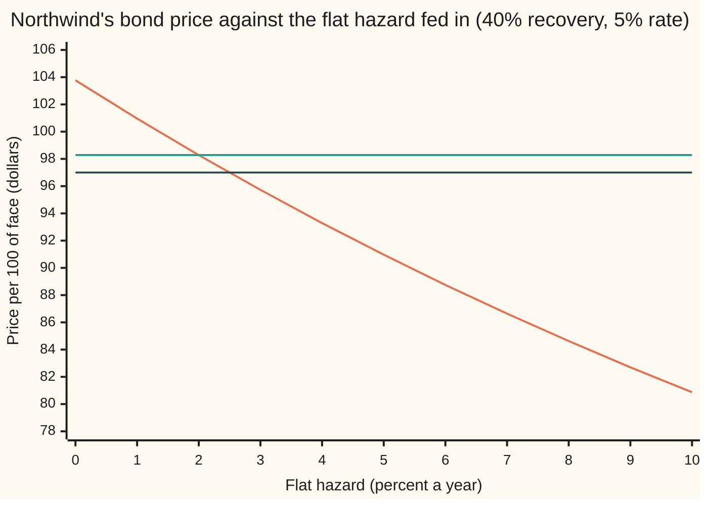
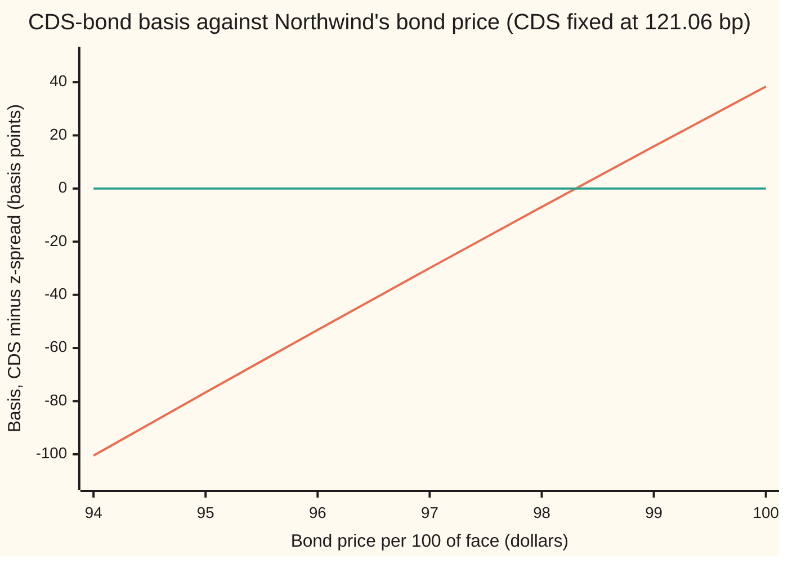

# Implied hazard from a bond price, and why the CDS disagrees: the basis

[Syllabus](../../../SYLLABUS.md) → [Financial mathematics](../../../SYLLABUS.md#w12) → [Reduced-Form Models - Risky Bonds, Spreads and Random Hazards](../../../SYLLABUS.md#w12-s44) → Implied hazard from a bond price, and why the CDS disagrees

---

## General Overview

Northwind has a five-year bond. On every 100 dollars of face (the amount repaid at the end) it pays a coupon of 6 dollars a year. If Northwind defaults, the coupons stop and holders recover 40 dollars per 100 of face, paid at the moment of default. Cash in the bank earns 5% a year.

The first card on this shelf priced that bond from a **hazard rate**: the chance of default in the next short stretch of time, per year, given survival so far ([A risky bond from the hazard curve](01-pricing-a-defaultable-bond-from-the-survival-curve.md)). A flat 2% hazard gave **98.28 dollars**, against 103.77 for the same promises with no default risk at all.

Markets run the other way: the screen shows a price, and the risk system wants a hazard. Fed 98.28, this card's solver hands back 2.00%. Then, one morning, the bond trades at **97.00** while the five-year **credit default swap** (CDS: a contract that pays the loss if Northwind defaults, in exchange for a yearly premium) still trades at **121.06 basis points** a year. A basis point is a hundredth of a percent. The CDS reads as a 2.00% hazard ([Implied hazard from one CDS quote](../42-Credit%20Default%20Swaps%20-%20Pricing%2C%20the%20Par%20Spread%20and%20the%20Hazard%20Behind%20It/04-implied-hazard-from-a-cds-quote.md)). The bond at 97 reads as **2.50%**.

Two markets, one default, two answers. The **CDS-bond basis** is the CDS spread minus the bond's spread over the riskless rate. Here it is 121.06 minus 150.98, or **−29.92 basis points**. A negative basis means the bond pays more for Northwind's risk than protection costs. A **basis trade** buys the bond and buys protection on it, and pockets the difference.

**A bond price fixes one flat hazard, once recovery is assumed, whenever the price lies strictly between the recovery-only value (40) and the riskless price (103.77); the same company's CDS fixes another, and the basis, CDS spread minus bond spread, is the gap between what the two markets charge for one default.**

**What kind of fact this is:** a method (solving a price backwards), with its guarantee of exactly one answer proved on this card in Why it works for every hazard up to 185% a year and confirmed beyond that by the checks' sweep. The basis itself is a definition. The flat hazard is a model: one number standing in for a risk that really changes over time.

### The picture: one curve, two prices, two hazards



Orange: the bond's model price at each flat hazard. Green: the house price, 98.28, crossing at 2%. Dark: this morning's 97.00, crossing a hair short of 2.5%. The orange line only falls, so each flat line meets it once.

---

## The formula

Notation first. A trial hazard is $\lambda$ ("lambda"); the bond's model price at it is $B(\lambda)$, and the screen price is $B_{\text{mkt}}$. The coupon is $c$ dollars a year, the face $F$, the recovered share of face $R$, the riskless rate $r$; coupons fall at times $t_1, \dots, t_n$ (years 1 to 5), the last at maturity $T$. Survival to time $t$ at a flat hazard is $e^{-\lambda t}$ ([The hazard rate](../41-Default%2C%20Survival%20and%20the%20Hazard%20Rate/02-hazard-rate-and-survival-probability.md)); discounting is $e^{-rt}$; the two multiply, so the card writes $u = r + \lambda$ for the combined decay rate.

$$B(\lambda) \;=\; \underbrace{c\sum_{i=1}^{n} e^{-u\,t_i}}_{\text{coupons, if alive}} \;+\; \underbrace{F\,e^{-uT}}_{\text{face, if alive}} \;+\; \underbrace{R\,F\,\frac{\lambda}{u}\bigl(1-e^{-uT}\bigr)}_{\text{recovery, at default}}, \qquad u = r+\lambda$$

$$\text{implied hazard: the one } \lambda \text{ with } B(\lambda) = B_{\text{mkt}}$$

**Read it aloud:** the bond is worth each coupon and the face, weighted by the chance Northwind is still alive to pay them and discounted, plus the recovery, weighted by the chance of default at each moment and discounted from that moment; the implied hazard is the one that makes this equal the screen price.

The two numbers the basis compares:

$$B_{\text{mkt}} = c\sum_{i=1}^{n} e^{-(r+z)\,t_i} + F\,e^{-(r+z)T} \quad\text{defines } z, \qquad b = s - z$$

In words: the **z-spread** $z$ is the one extra rate that, added to the riskless rate, reprices the bond's promised cash flows at the market price, with no mention of default or recovery ([Spreads over the curve](../02-Curves/06-z-spread-and-asset-swap-spread.md)). The **basis** $b$ is the CDS spread $s$ minus that bond spread.

| Symbol | Plain meaning | In our example | Push it up and the implied hazard… |
| --- | --- | --- | --- |
| $B_{\text{mkt}}$ | the bond's price on the screen, per 100 of face | 97.00 | falls: a dearer bond is a safer bond |
| $B(\lambda)$ | the bond's model price at trial hazard $\lambda$ | 98.2807 at 2% | (the curve being inverted) |
| $\lambda$ | the flat hazard, chance of default per year given survival (say "lambda") | 2.4956% | (the answer) |
| $R$ | recovery: the share of face paid back at default | 40% | rises: each default costs less, so more defaults are needed to explain the price |
| $F$ | face, repaid at the end | 100 | (scales everything) |
| $c$ | the coupon, dollars a year per 100 of face | 6 | rises: a richer bond at the same price must be riskier |
| $t$, $t_i$, $T$, $n$ | a point in time; the coupon dates (years 1 to 5), the last one, and how many | 1…5, 5, 5 | (a longer bond spreads the same discount over more years) |
| $r$ | the riskless rate, continuously compounded | 5% | falls: more of the price gap is plain discounting |
| $\tau$ | the random time of default (say "tau") | random: recovery is paid then | |
| $z$ | the z-spread: the extra rate that reprices the promised cash flows | 150.98 bp | |
| $s$ | the CDS par spread, a decimal per year | 121.06 bp | |
| $b$ | the basis, $s - z$ | −29.92 bp | |

### When it holds

- **A flat hazard.** One price pins one number. A real issuer's risk rises or falls across the five years; a curve of hazards needs several bonds or several CDS quotes ([Bootstrapping a hazard curve](../42-Credit%20Default%20Swaps%20-%20Pricing%2C%20the%20Par%20Spread%20and%20the%20Hazard%20Behind%20It/06-bootstrapping-the-hazard-curve-from-cds-quotes.md)).
- **Recovery taken as known, and paid on face.** The price cannot separate hazard from recovery. Assume 25% instead of 40% and the same 97 implies 2.0047% instead of 2.4956%. Recovery is a fraction of face, not of the bond's price just before default.
- **A flat, known riskless rate.** Any price gap not explained by discounting at 5% is charged to default, including a buyer's higher funding cost. That is the funding driver of the basis, measured in Step 7.
- **Coupons stop at default, with no accrued coupon paid.** Real claims include accrued interest, a small fraction of a coupon.
- **The price strictly between 40 and 103.77.** Step 3 shows what happens outside.

**Conventions verified 2026-09-28:** the basis is quoted as the CDS spread minus the bond's spread, so a bond that pays more for the credit risk than protection costs shows a negative basis (source 5). Desks measure the bond side by the z-spread or the asset-swap spread over the swap curve; this card uses the z-spread over a flat 5% curve, and the CDS conventions of [Implied hazard from one CDS quote](../42-Credit%20Default%20Swaps%20-%20Pricing%2C%20the%20Par%20Spread%20and%20the%20Hazard%20Behind%20It/04-implied-hazard-from-a-cds-quote.md): quarterly premiums, no premium accrued at default, the loss paid at the moment of default. Standard contracts since 2009 trade at a fixed 100 or 500 bp coupon plus an upfront payment; 121.06 bp is the equivalent par spread.

---

## Why it works

### Step 0: a price is an average over default times, and more hazard moves weight toward the bad ones

Every possible default time gives the bond a value. Default at once: 40 dollars, today. Default after two coupons: two coupons, then 40. No default: all five coupons and the face. The price is the average of those values, weighted by how likely each default time is. A higher hazard shifts the weight toward early defaults, where the holder collects 40 instead of the whole stream. So the price falls as the hazard rises. If it falls strictly, from 103.77 toward 40, every price in between is hit exactly once, and solving backwards is safe ([Solving backwards](../07-Greeks%20by%20Numbers%20and%20Calibration/05-root-finding-for-inverses.md)).

### Step 1: the price in closed form

Each coupon is paid only if Northwind is alive, which has chance $e^{-\lambda t_i}$; discounting multiplies by $e^{-r t_i}$; together, $e^{-u t_i}$. The face works the same way at $T$. Recovery is paid at the default time $\tau$. The chance that $\tau$ lands in a short slice of time near $t$ is $\lambda e^{-\lambda t}$ times the slice's length. Paying 40 there and discounting multiplies by $R F e^{-rt}$. Adding the slices from 0 to $T$ gives $R F (\lambda/u)(1 - e^{-uT})$. On the house example the three legs are 24.4368 for the coupons, 70.4688 for the face and 3.3750 for the recovery.

### Step 2: the two ends

**No hazard.** At $\lambda = 0$ nothing defaults, and the price is the riskless 103.77.

**Enormous hazard.** As $\lambda$ grows without limit, default comes almost at once and the holder gets 40 almost at once. The price tends to $R F = 40$: the **recovery-only value**. A useful rewrite makes both ends visible. Since $\lambda/u = 1 - r/u$,

$$B = R F \;+\; c\sum_{i} e^{-u t_i} \;+\; (1-R)\,F\,e^{-uT} \;-\; R F\,r \int_0^T e^{-uv}\,dv.$$

The first term is the recovery floor. The next two are what surviving adds. The last is the interest lost by waiting for the recovery: 40 dollars received at a random future moment is worth less than 40 today.

### Step 3: existence, uniqueness and the boundary cases

The rewrite shows why the fall is not automatic. Raising $u$ shrinks the survival terms, which lowers the price. It also shrinks the waiting-cost term, which raises it. Which wins?

**The claim.** The price falls strictly as long as one year's coupon beats one year's interest on the recovery, grossed up for the year's decay: $c \ge R F r \cdot g(u)$, where $g(u) = (e^{u} - 1)/u$ is the timing factor from [The credit triangle](../42-Credit%20Default%20Swaps%20-%20Pricing%2C%20the%20Par%20Spread%20and%20the%20Hazard%20Behind%20It/03-the-credit-triangle.md), always at least 1. For Northwind, $R F r = 40 \times 0.05 = 2$ dollars a year against a coupon of 6, so the condition is $g(u) \le 3$. It holds for every hazard up to **185.38%** a year, a hazard at which default within the year is far more likely than not; no market quotes a bond there.

**What the proof gives.** At 185.38% the price is 40.0044. So every price from 40.0044 up to, but not including, 103.77 is reached by exactly one hazard in that range: at least one because the price is continuous and passes from above to below (the intermediate value theorem), at most one because it falls strictly.

**Beyond the proof.** The checks sweep hazards from 185.38% out to 10,000% a year. The price never climbs back above 39.9974. It dips to a lowest point of 39.6110 near 378% a year, then creeps back up to 40 from below, because a recovery paid at a random instant is always discounted a little. So:

- **Price strictly between 40 and 103.77:** exactly one hazard. The house 98.28 gives 2.0002% (the quote is rounded to the cent); 97 gives 2.4956%.
- **Price at or above 103.77:** no hazard. The bond is priced above riskless; a solver that ignores this returns a negative hazard.
- **Price at or below 40:** no sensible hazard. Between 39.6110 and 40 the model finds two, both in the hundreds of percent; below 39.6110 it finds none. A bond priced there is priced on its recovery, not its hazard, and should be read that way.

<details>
<summary>Detailed proof: the slope, year by year</summary>

Write the price as a function of $u = r + \lambda$, using the rewrite in Step 2. Its slope is
$$\frac{dB}{du} = -\sum_i c\,t_i\,e^{-u t_i} \;-\; (1-R)F\,T\,e^{-uT} \;+\; R F r\int_0^T v\,e^{-uv}\,dv.$$
Split the integral into the five coupon years. In the year ending at $t_i = i$, every time in the integral is at most that year's end, so
$$\int_{i-1}^{i} v\,e^{-uv}\,dv \;\le\; i\int_{i-1}^{i} e^{-uv}\,dv \;=\; i\,e^{-ui}\,\frac{e^{u}-1}{u} \;=\; i\,e^{-ui}\,g(u).$$
Put that back:
$$\frac{dB}{du} \;\le\; \sum_{i=1}^{5} i\,e^{-ui}\,\bigl(R F r\,g(u) - c\bigr) \;-\; (1-R)F\,T\,e^{-uT}.$$
The last term is negative. When $R F r\,g(u) \le c$ every bracket is zero or negative, so the slope is negative. The timing factor rises with $u$ (it is the average of $e^{ux}$ for $x$ between 0 and 1), so the condition holds on a whole interval from $u = r$ up to where $g(u) = c/(RFr) = 3$, which is a hazard of 185.38%.

</details>

### Step 4: two roads to the number

**Bisection** tests the middle of a range that straddles the answer and keeps the half that still straddles it; from $[0, 1.85]$, sixty halvings pin the hazard far past the printed digits. **Newton's method** follows the slope instead. For hazards up to 185% the price curve bends upward (it is convex), so Newton started at zero moves right and never overshoots: 0 → 2.3533% → 2.4952% → 2.4956%. By hand, one step from the house point does nearly as well: the slope at 2% is −261.4373 dollars per unit of hazard, so a price 1.2807 dollars lower needs about 1.2807 / 261.4373 more hazard, giving 2.4899%.

A third road checks the answer rather than finding it. Simulate 200,000 default times at 2.4956% with a hand-written random number generator, pay each path its coupons and its recovery or face, and average: 96.957, with a standard error of 0.042. The quote, 97, is one standard error away.

### Step 5: the CDS reads the same company differently

The CDS on Northwind trades at 121.06 bp. Solved backwards with [Implied hazard from one CDS quote](../42-Credit%20Default%20Swaps%20-%20Pricing%2C%20the%20Par%20Spread%20and%20the%20Hazard%20Behind%20It/04-implied-hazard-from-a-cds-quote.md), that is a 2.0000% hazard. The bond says 2.4956%: half a point apart.

Desks quote the gap in spread, because spreads are what they trade. The bond's spread is its z-spread: 150.98 bp at 97, found two ways (bisection on the spread, and Newton on the bond's yield minus 5%). The basis is

$$b = s - z = 121.06 - 150.98 = -29.92 \text{ bp}.$$

A rougher reading agrees: the hazard gap times the share lost, $0.6 \times (2.0000\% - 2.4956\%)$, is −29.74 bp. The credit triangle says a spread is roughly hazard times loss, so the two readings nearly coincide.

At the house price, where bond and CDS agree on 2%, the basis is not zero but −0.51 bp. The two spreads are built differently (annual coupons against quarterly premiums, recovery on a bond priced below 100), so perfect agreement on default still leaves a small gap. A basis matters only when it is large against that gap.



Orange: the basis at each bond price. Green: zero. The basis crosses zero a little above 98, close to the house price 98.28 where the two markets agree on 2%. Each dollar the bond cheapens deepens the negative basis by a nearly equal step.

### Step 6: the basis trade, and what it does and does not lock in

Buy the bond at 97. Buy five years of protection on 100 of face at 121.06 bp a year, paid quarterly. If Northwind defaults at any moment, the bond pays 40 and the CDS pays 60: the package delivers exactly 100. If Northwind survives, the bond pays its face. Each outcome, valued today:

| Default comes | Package worth today | Why |
| --- | --- | --- |
| immediately | 3.0000 | paid 97, received 100 |
| at 0.999 years | −2.7579 | paid three quarterly premiums, missed the first coupon by a day |
| at 1.001 years | 2.6521 | collected that coupon |
| at 4.999 years | −2.9894 | missed the final coupon; the 100 still arrives |
| never | 1.4438 | five coupons and the face, less five years of premiums |

The package is **not** riskless path by path: it swings with where default lands against the coupon dates. Averaged over default times at the CDS's 2% hazard, it is worth 1.2807 per 100 of face. Two roads agree to the digit: integrating the table's values against the chance of each default time, and the shortcut $B(2\%) - 97$, which works because protection bought at the par spread is worth zero.

### Step 7: what drives the basis

Four forces move the basis without any change in default risk.

- **Funding.** A bond must be paid for with borrowed money; a CDS needs almost no cash. A buyer who borrows at 5% plus a spread needs the bond to yield that much more. The funding spread that makes 97 fair at a 2% hazard is 29.98 bp: almost exactly the basis. When funding dries up, the basis goes negative.
- **The delivery option.** After a default the protection buyer may deliver the cheapest of several eligible bonds. That choice makes protection dearer and pushes the basis **up**.
- **Counterparty risk.** Protection is only as good as its seller. A seller who can fail alongside Northwind makes protection cheaper and pushes the basis **down**.
- **Coupon size.** Recovery is a share of face, not of price. At the same 2% hazard, bonds with different coupons trade at different prices and show different z-spreads, while the CDS stays at 121.06:

| Coupon (dollars a year) | Price at a 2% hazard | z-spread (bp) | Basis (bp) |
| --- | --- | --- | --- |
| 2 | 81.99 | 112.08 | 8.98 |
| 4 | 90.14 | 117.08 | 3.97 |
| 6 | 98.28 | 121.55 | −0.50 |
| 8 | 106.43 | 125.57 | −4.51 |
| 10 | 114.57 | 129.19 | −8.13 |

A deep-discount bond loses less in default, relative to its price, so its spread is lower for the same risk. (The 6-dollar row uses the exact price 98.2807; the quote 98.28 gives −0.51.) A few basis points of basis on a bond far from 100 may be nothing but coupon.

---

## Worked numbers, by hand

Northwind: coupon 6 a year, face 100, five years, recovery 40, rate 5%. First the house price at 2%, then one step to this morning's 97.

| Step | Arithmetic | Value |
| --- | --- | --- |
| combined decay at 2% | $u = 0.05 + 0.02$ | $0.07$ |
| coupons, if alive | $6\,(e^{-0.07} + e^{-0.14} + \dots + e^{-0.35})$ | $24.4368$ |
| face, if alive | $100\,e^{-0.35}$ | $70.4688$ |
| recovery, at default | $40 \times (0.02/0.07) \times (1 - e^{-0.35})$ | $3.3750$ |
| **house price** | sum of the three legs | **$98.2807$** |
| slope at 2% | the derivative, from the code | $-261.4373$ per unit of hazard |
| price gap to the quote | $98.2807 - 97$ | $1.2807$ |
| one Newton step from 2% | $2\% + 1.2807/261.4373$ | $2.4899\%$ |
| **implied hazard at 97** | Newton to convergence | **$2.4956\%$** |
| z-spread at 97 | the rate over 5% that reprices the promised flows | $150.98$ bp |
| CDS spread | the market quote, a 2.0000% hazard | $121.06$ bp |
| **basis** | $121.06 - 150.98$ | **$-29.92$ bp** |

At 97 the bond market is charging for a 2.5% yearly hazard on Northwind, half a point more than the protection market. A desk that believes the CDS and funds at 5% sees 1.2807 per 100 of face in buying both.

House cross-check: the shelf quotes 98.28 and a 122 bp spread at 2%; the code prints 98.2807, and 121.57 bp at the rounded 98.28.

### What breaks if you drop a piece

| Mistake | Comes out at | What went wrong |
| --- | --- | --- |
| Recovery left out ($R = 0$) | hazard 1.5098%: the z-spread, 150.98 bp, relabelled | With nothing recovered the hazard is just an extra discount rate; with 40 recovered each default costs only 60, so more are needed |
| Hazard gap quoted as the basis | −49.56 bp instead of −29.92 | The gap in default rates is not a gap in spreads; each default costs only the 60% lost |
| Sign flipped: bond minus CDS | +29.92 bp: the bond looks dear | The trade goes on backwards, selling the cheap bond and selling protection, and gives away the 1.2807 |
| A price of 104 fed to the solver | no hazard exists; 104 is above the riskless 103.77 | The solver runs to a negative hazard. Check the bracket before solving |

The code prints every number in the table.

---

## Code, from first principles, and it actually runs

Nothing imported knows the answer. The implied hazard is found by **two independent roads and checked by a third**. Road 1 prices the bond leg by leg, the recovery integral by Simpson's rule (adding thin slices under the curve), and bisects; it never touches the closed form. Road 2 runs Newton on the closed form with its slope worked out by hand. Road 3 simulates 200,000 default times at the answer and reprices the bond to within its sampling error. The z-spread is found by bisection and again by Newton on the yield; the CDS spread is priced leg by leg and by the credit triangle's closed form; the basis trade is valued by integrating over default times and by the shortcut $B(2\%) - 97$. The checks then run Step 3's sweep and print every number the card quotes.

### Python

```python
# Implied hazard from a bond price, and the CDS-bond basis -- the check behind the card.
# Standard library only; nothing imported knows the answer.  Northwind: five-year bond,
# coupon 6 a year on 100 face, 40% of face recovered at the moment of default, coupons
# stop at default, riskless rate 5% flat and continuous.  CDS: quarterly premiums, no accrual.
from math import exp, sqrt, log

F, C, R, r, T = 100.0, 6.0, 0.40, 0.05, 5
YEARS = range(1, T + 1)

def simpson(f, a, b, n=40):
    h = (b - a) / n
    return h / 3.0 * (f(a) + f(b) + sum((4 if i % 2 else 2) * f(a + i * h) for i in range(1, n)))
def bond_sum(lam):                           # road 1: legs term by term, recovery leg by Simpson
    alive = sum(C * exp(-(r + lam) * t) for t in YEARS) + F * exp(-(r + lam) * T)
    return alive + sum(simpson(lambda s: R * F * lam * exp(-(r + lam) * s), t - 1, t) for t in YEARS)
def bond(lam, c=C, rec=R, rr=r):             # road 2: the closed form on the card
    u = rr + lam
    return sum(c * exp(-u * t) for t in YEARS) + F * exp(-u * T) + rec * F * lam / u * (1 - exp(-u * T))

def bond_slope(lam):                         # its derivative, worked out by hand
    u = r + lam
    return (-sum(C * t * exp(-u * t) for t in YEARS) - F * T * exp(-u * T)
            + R * F * (r / u ** 2 * (1 - exp(-u * T)) + lam / u * T * exp(-u * T)))

def bisect(f, lo, hi, n=60):                 # needs f(lo) > 0 > f(hi)
    for _ in range(n):
        mid = 0.5 * (lo + hi)
        lo, hi = (mid, hi) if f(mid) > 0 else (lo, mid)
    return 0.5 * (lo + hi)
def newton(price, lam=0.0, steps=6):         # from zero: the price curve is convex, so no overshoot
    path = [lam]
    for _ in range(steps):
        lam -= (bond(lam) - price) / bond_slope(lam)
        path.append(lam)
    return path
def cash_price(z, c=C):                      # promised cash flows discounted at the curve plus z
    return sum(c * exp(-(r + z) * t) for t in YEARS) + F * exp(-(r + z) * T)
def zspread(price, c=C): return bisect(lambda z: cash_price(z, c) - price, -0.05, 1.0)

def z_newton(price, y=0.05):                 # road B for z: Newton on the continuous yield, then y - r
    for _ in range(30):
        p = sum(C * exp(-y * t) for t in YEARS) + F * exp(-y * T)
        y -= (p - price) / (-sum(C * t * exp(-y * t) for t in YEARS) - F * T * exp(-y * T))
    return y - r
def cds_par(lam):                            # CDS legs term by term (not the closed form)
    ann = sum(0.25 * exp(-(r + lam) * 0.25 * j) for j in range(1, 21))
    return simpson(lambda s: (1 - R) * lam * exp(-(r + lam) * s), 0.0, 5.0, 400) / ann, ann

def cds_closed(lam):                         # the credit-triangle card's form, with its timing factor
    x = (r + lam) * 0.25
    return (1 - R) * lam * (exp(x) - 1) / x

HOUSE, QUOTE = 98.28, 97.00
S_CDS = cds_closed(0.02)                     # the CDS quote: exactly what a 2% hazard gives
lam_house = bisect(lambda l: bond_sum(l) - HOUSE, 0.0, 1.85)
lam_bond = bisect(lambda l: bond_sum(l) - QUOTE, 0.0, 1.85)
path = newton(QUOTE)
lam_cds = bisect(lambda l: S_CDS - cds_par(l)[0], 0.0, 1.0)
z_house, z_bond = zspread(HOUSE), zspread(QUOTE)

def row(label, v, d=4): print(f"{label:<42} {v:.{d}f}")
row("risk-free price, hazard 0", bond(0.0))
row("house price at 2%, closed form", bond(0.02))
row("house price at 2%, legs by Simpson", bond_sum(0.02))
row("slope of price at 2%, per unit hazard", bond_slope(0.02))
print(f"house legs at 2%: coupons {sum(C * exp(-0.07 * t) for t in YEARS):.4f}  face {F * exp(-0.35):.4f}  recovery {R * F * 0.02 / 0.07 * (1 - exp(-0.35)):.4f}")
row("hand estimate from 2% with the slope (%)", 100 * (0.02 - (bond(0.02) - QUOTE) / bond_slope(0.02)))
row("hazard from 98.28, bisection (%)", 100 * lam_house)
row("hazard from 97, road 1 bisection (%)", 100 * lam_bond)
row("hazard from 97, road 2 Newton (%)", 100 * path[-1])
print("Newton path from 0 (%)  " + " ".join(f"{100 * x:.4f}" for x in path[:5]))
row("CDS quote at 2%, closed form (bp)", 1e4 * S_CDS)
row("CDS par at 2%, legs term by term (bp)", 1e4 * cds_par(0.02)[0])
row("CDS risky annuity at 2%", cds_par(0.02)[1])
row("hazard from the CDS quote (%)", 100 * lam_cds)
row("z-spread at 98.28 (bp)", 1e4 * z_house)
row("z-spread at 97, bisection (bp)", 1e4 * z_bond)
row("z-spread at 97, yield Newton (bp)", 1e4 * z_newton(QUOTE))
row("basis at 98.28, CDS - z (bp)", 1e4 * (S_CDS - z_house))
row("basis at 97, CDS - z (bp)", 1e4 * (S_CDS - z_bond))
row("hazard gap x (1-R) at 97 (bp)", 1e4 * (1 - R) * (lam_cds - lam_bond))
row("funding spread that prices 97 at 2% (bp)", 1e4 * bisect(lambda f: bond(0.02, rr=r + f) - QUOTE, 0, 0.05))

def package(tau):                            # basis trade worth today if default comes at tau (99: never)
    cpn = sum(C * exp(-r * t) for t in YEARS if t < tau)
    prem = sum(S_CDS * F * 0.25 * exp(-r * 0.25 * j) for j in range(1, 21) if 0.25 * j < tau)
    return cpn - prem + F * exp(-r * min(tau, T)) - QUOTE   # 40 bond + 60 CDS at default, or the face
exp_pkg = sum(simpson(lambda s: 0.02 * exp(-0.02 * s) * package(s), (k - 1) / 8 + 1e-12, k / 8 - 1e-12, 8)
              for k in range(1, 41)) + exp(-0.02 * T) * package(99.0)
for label, tau in (("immediately", 1e-9), ("at 0.999 years", 0.999), ("at 1.001 years", 1.001),
                   ("at 4.999 years", 4.999), ("never", 99.0)):
    row("package value, default " + label, package(tau))
row("package, expected at 2%, by default time", exp_pkg)
row("package, expected at 2%, B(2%) - 97", bond(0.02) - QUOTE)

seed = 20260928                              # road 3: simulate default times, reprice the bond
def uniform():
    global seed
    seed = (6364136223846793005 * seed + 1442695040888963407) % 2 ** 64
    return ((seed >> 11) + 0.5) / 2 ** 53
n, tot, tot2 = 200000, 0.0, 0.0
for _ in range(n):
    tau = -log(uniform()) / lam_bond
    v = sum(C * exp(-r * t) for t in YEARS if t < tau) + (R * F * exp(-r * tau) if tau < T else F * exp(-r * T))
    tot, tot2 = tot + v, tot2 + v * v
mc = tot / n
se = sqrt((tot2 / n - mc * mc) / n)
row("road 3 simulated price at that hazard", mc, 3)
row("  its standard error", se, 3)

lam_g = bisect(lambda l: 3.0 - (exp(r + l) - 1) / (r + l), 0.0, 5.0)   # where R F r g(u) reaches the coupon
falls = all(bond(lam_g * (k + 1) / 4000) < bond(lam_g * k / 4000) for k in range(4000))
tail = max(bond(lam_g + 0.01 * k) for k in range(1, 10001))
low = min((bond(0.01 * k), k) for k in range(1, 2001))
row("proof reaches hazard (%)", 100 * lam_g, 2)
row("price there", bond(lam_g))
row("highest price beyond it, to 10,000%", tail)
print(f"{'lowest price anywhere, and its hazard (%)':<42} {low[0]:.4f} at {low[1]}")
print("chart, hazard (%)      " + " ".join(f"{k:7d}" for k in range(11)))
print("chart, bond price      " + " ".join(f"{bond(k / 100):7.2f}" for k in range(11)))
print("chart, quoted price    " + " ".join(f"{p:7d}" for p in range(94, 101)))
print("chart, basis (bp)      " + " ".join(f"{1e4 * (S_CDS - zspread(p)):7.2f}" for p in range(94, 101)))
for cc in (2.0, 4.0, 6.0, 8.0, 10.0):        # same 2% hazard, different coupons
    zc = zspread(bond(0.02, cc), cc)
    print(f"coupon {cc:4.1f}: price {bond(0.02, cc):7.2f}  z {1e4 * zc:7.2f} bp  basis {1e4 * (S_CDS - zc):6.2f} bp")
row("wrong: recovery 0, hazard from 97 (%)", 100 * bisect(lambda l: bond(l, rec=0.0) - QUOTE, 0, 1))
row("wrong: hazard gap without (1-R) (bp)", 1e4 * (lam_cds - lam_bond))
row("try: recovery 25%, hazard from 97 (%)", 100 * bisect(lambda l: bond(l, rec=0.25) - QUOTE, 0, 1))
row("try: price 96, hazard (%)", 100 * bisect(lambda l: bond(l) - 96.0, 0, 1))
row("try: price 96, basis (bp)", 1e4 * (S_CDS - zspread(96.0)))

assert abs(lam_house - 0.02) < 1e-4, "98.28 must solve back to 2%"
assert abs(lam_bond - path[-1]) < 1e-10, "bisection on Simpson legs vs Newton on the closed form"
assert abs(z_bond - z_newton(QUOTE)) < 1e-12, "z-spread two ways"
assert abs(cds_par(0.02)[0] - S_CDS) < 1e-9, "CDS legs term by term vs closed form"
assert abs(mc - QUOTE) < 4 * se, "simulated price at the implied hazard must be 97"
assert abs(exp_pkg - (bond(0.02) - QUOTE)) < 1e-6, "basis trade value two ways"
assert falls, "price must fall strictly up to the proof's reach"
assert tail < bond(lam_g), "beyond it the price never climbs back"
print("ALL CHECKS PASS")
```

**Ran 2026-09-28 on macOS, Python 3.14.6, standard library only. All checks passed. Output, pasted from the run:**

```
risk-free price, hazard 0                  103.7659
house price at 2%, closed form             98.2807
house price at 2%, legs by Simpson         98.2807
slope of price at 2%, per unit hazard      -261.4373
house legs at 2%: coupons 24.4368  face 70.4688  recovery 3.3750
hand estimate from 2% with the slope (%)   2.4899
hazard from 98.28, bisection (%)           2.0002
hazard from 97, road 1 bisection (%)       2.4956
hazard from 97, road 2 Newton (%)          2.4956
Newton path from 0 (%)  0.0000 2.3533 2.4952 2.4956 2.4956
CDS quote at 2%, closed form (bp)          121.0562
CDS par at 2%, legs term by term (bp)      121.0562
CDS risky annuity at 2%                    4.1819
hazard from the CDS quote (%)              2.0000
z-spread at 98.28 (bp)                     121.5680
z-spread at 97, bisection (bp)             150.9760
z-spread at 97, yield Newton (bp)          150.9760
basis at 98.28, CDS - z (bp)               -0.5119
basis at 97, CDS - z (bp)                  -29.9199
hazard gap x (1-R) at 97 (bp)              -29.7381
funding spread that prices 97 at 2% (bp)   29.9813
package value, default immediately         3.0000
package value, default at 0.999 years      -2.7579
package value, default at 1.001 years      2.6521
package value, default at 4.999 years      -2.9894
package value, default never               1.4438
package, expected at 2%, by default time   1.2807
package, expected at 2%, B(2%) - 97        1.2807
road 3 simulated price at that hazard      96.957
  its standard error                       0.042
proof reaches hazard (%)                   185.38
price there                                40.0044
highest price beyond it, to 10,000%        39.9974
lowest price anywhere, and its hazard (%)  39.6110 at 378
chart, hazard (%)            0       1       2       3       4       5       6       7       8       9      10
chart, bond price       103.77  100.96   98.28   95.73   93.29   90.97   88.75   86.64   84.63   82.70   80.87
chart, quoted price         94      95      96      97      98      99     100
chart, basis (bp)      -100.50  -76.71  -53.18  -29.92   -6.91   15.85   38.37
coupon  2.0: price   81.99  z  112.08 bp  basis   8.98 bp
coupon  4.0: price   90.14  z  117.08 bp  basis   3.97 bp
coupon  6.0: price   98.28  z  121.55 bp  basis  -0.50 bp
coupon  8.0: price  106.43  z  125.57 bp  basis  -4.51 bp
coupon 10.0: price  114.57  z  129.19 bp  basis  -8.13 bp
wrong: recovery 0, hazard from 97 (%)      1.5098
wrong: hazard gap without (1-R) (bp)       -49.5635
try: recovery 25%, hazard from 97 (%)      2.0047
try: price 96, hazard (%)                  2.8909
try: price 96, basis (bp)                  -53.1850
ALL CHECKS PASS
```

### Rust

```rust
// Implied hazard from a bond price, and the CDS-bond basis -- the check behind the card.
// Rust std only; nothing imported knows the answer.  Northwind: five-year bond, coupon
// 6 a year on 100 face, 40% of face recovered at the moment of default, coupons stop at
// default, riskless rate 5% flat and continuous.  CDS: quarterly premiums, no accrual.
const F: f64 = 100.0;
const C: f64 = 6.0;
const R: f64 = 0.40;
const RATE: f64 = 0.05;
const T: f64 = 5.0;
const HOUSE: f64 = 98.28;
const QUOTE: f64 = 97.00;

fn simpson(f: &dyn Fn(f64) -> f64, a: f64, b: f64, n: usize) -> f64 {
    let h = (b - a) / n as f64;
    let mut s = f(a) + f(b);
    for i in 1..n { s += if i % 2 == 1 { 4.0 } else { 2.0 } * f(a + i as f64 * h); }
    s * h / 3.0
}
fn bond_sum(lam: f64) -> f64 { // road 1: legs term by term, recovery leg by Simpson
    let mut v = F * (-(RATE + lam) * T).exp();
    for t in 1..=5 {
        let t = t as f64;
        v += C * (-(RATE + lam) * t).exp();
        v += simpson(&|s: f64| R * F * lam * (-(RATE + lam) * s).exp(), t - 1.0, t, 40);
    }
    v
}
fn bond(lam: f64, c: f64, rec: f64, rr: f64) -> f64 { // road 2: the closed form on the card
    let u = rr + lam;
    let cp: f64 = (1..=5).map(|t| c * (-u * t as f64).exp()).sum();
    cp + F * (-u * T).exp() + rec * F * lam / u * (1.0 - (-u * T).exp())
}
fn b(lam: f64) -> f64 { bond(lam, C, R, RATE) }
fn bond_slope(lam: f64) -> f64 { // its derivative, worked out by hand
    let u = RATE + lam;
    let s: f64 = (1..=5).map(|t| C * t as f64 * (-u * t as f64).exp()).sum();
    -s - F * T * (-u * T).exp() + R * F * (RATE / (u * u) * (1.0 - (-u * T).exp()) + lam / u * T * (-u * T).exp())
}
fn bisect(f: &dyn Fn(f64) -> f64, mut lo: f64, mut hi: f64) -> f64 { // needs f(lo) > 0 > f(hi)
    for _ in 0..60 {
        let mid = 0.5 * (lo + hi);
        if f(mid) > 0.0 { lo = mid } else { hi = mid }
    }
    0.5 * (lo + hi)
}
fn cash_price(z: f64, c: f64) -> f64 {
    let cp: f64 = (1..=5).map(|t| c * (-(RATE + z) * t as f64).exp()).sum();
    cp + F * (-(RATE + z) * T).exp()
}
fn zspread(p: f64, c: f64) -> f64 { bisect(&|z| cash_price(z, c) - p, -0.05, 1.0) }
fn z_newton(p: f64) -> f64 { // road B for z: Newton on the continuous yield, then y - r
    let mut y = 0.05;
    for _ in 0..30 {
        let v: f64 = (1..=5).map(|t| C * (-y * t as f64).exp()).sum::<f64>() + F * (-y * T).exp();
        let d: f64 = -(1..=5).map(|t| C * t as f64 * (-y * t as f64).exp()).sum::<f64>() - F * T * (-y * T).exp();
        y -= (v - p) / d;
    }
    y - RATE
}
fn cds_par(lam: f64) -> (f64, f64) { // CDS legs term by term (not the closed form)
    let ann: f64 = (1..=20).map(|j| 0.25 * (-(RATE + lam) * 0.25 * j as f64).exp()).sum();
    (simpson(&|s: f64| (1.0 - R) * lam * (-(RATE + lam) * s).exp(), 0.0, 5.0, 400) / ann, ann)
}
fn cds_closed(lam: f64) -> f64 {
    let x = (RATE + lam) * 0.25;
    (1.0 - R) * lam * (x.exp() - 1.0) / x
}
fn row(label: &str, v: f64, d: usize) { println!("{:<42} {:.*}", label, d, v); }
fn package(tau: f64, s_cds: f64) -> f64 { // basis trade worth today if default comes at tau (99: never)
    let cpn: f64 = (1..=5).filter(|&t| (t as f64) < tau).map(|t| C * (-RATE * t as f64).exp()).sum();
    let prem: f64 = (1..=20).filter(|&j| 0.25 * (j as f64) < tau)
        .map(|j| s_cds * F * 0.25 * (-RATE * 0.25 * j as f64).exp()).sum();
    cpn - prem + F * (-RATE * tau.min(T)).exp() - QUOTE
}

fn main() {
    let s_cds = cds_closed(0.02);
    let lam_house = bisect(&|l| bond_sum(l) - HOUSE, 0.0, 1.85);
    let lam_bond = bisect(&|l| bond_sum(l) - QUOTE, 0.0, 1.85);
    let mut path = vec![0.0f64];
    for _ in 0..6 { let l = *path.last().unwrap(); path.push(l - (b(l) - QUOTE) / bond_slope(l)); }
    let lam_cds = bisect(&|l| s_cds - cds_par(l).0, 0.0, 1.0);
    let (z_house, z_bond) = (zspread(HOUSE, C), zspread(QUOTE, C));
    row("risk-free price, hazard 0", b(0.0), 4);
    row("house price at 2%, closed form", b(0.02), 4);
    row("house price at 2%, legs by Simpson", bond_sum(0.02), 4);
    row("slope of price at 2%, per unit hazard", bond_slope(0.02), 4);
    let cp: f64 = (1..=5).map(|t| C * (-0.07 * t as f64).exp()).sum();
    println!("house legs at 2%: coupons {:.4}  face {:.4}  recovery {:.4}", cp, F * (-0.35f64).exp(), R * F * 0.02 / 0.07 * (1.0 - (-0.35f64).exp()));
    row("hand estimate from 2% with the slope (%)", 100.0 * (0.02 - (b(0.02) - QUOTE) / bond_slope(0.02)), 4);
    row("hazard from 98.28, bisection (%)", 100.0 * lam_house, 4);
    row("hazard from 97, road 1 bisection (%)", 100.0 * lam_bond, 4);
    row("hazard from 97, road 2 Newton (%)", 100.0 * path[6], 4);
    let np: Vec<String> = path[..5].iter().map(|x| format!("{:.4}", 100.0 * x)).collect();
    println!("Newton path from 0 (%)  {}", np.join(" "));
    row("CDS quote at 2%, closed form (bp)", 1e4 * s_cds, 4);
    row("CDS par at 2%, legs term by term (bp)", 1e4 * cds_par(0.02).0, 4);
    row("CDS risky annuity at 2%", cds_par(0.02).1, 4);
    row("hazard from the CDS quote (%)", 100.0 * lam_cds, 4);
    row("z-spread at 98.28 (bp)", 1e4 * z_house, 4);
    row("z-spread at 97, bisection (bp)", 1e4 * z_bond, 4);
    row("z-spread at 97, yield Newton (bp)", 1e4 * z_newton(QUOTE), 4);
    row("basis at 98.28, CDS - z (bp)", 1e4 * (s_cds - z_house), 4);
    row("basis at 97, CDS - z (bp)", 1e4 * (s_cds - z_bond), 4);
    row("hazard gap x (1-R) at 97 (bp)", 1e4 * (1.0 - R) * (lam_cds - lam_bond), 4);
    row("funding spread that prices 97 at 2% (bp)", 1e4 * bisect(&|f| bond(0.02, C, R, RATE + f) - QUOTE, 0.0, 0.05), 4);
    let mut exp_pkg = (-0.02 * T).exp() * package(99.0, s_cds);
    for k in 1..=40 {
        let (a, bb) = ((k - 1) as f64 / 8.0 + 1e-12, k as f64 / 8.0 - 1e-12);
        exp_pkg += simpson(&|s: f64| 0.02 * (-0.02 * s).exp() * package(s, s_cds), a, bb, 8);
    }
    for (label, tau) in [("immediately", 1e-9), ("at 0.999 years", 0.999), ("at 1.001 years", 1.001),
                         ("at 4.999 years", 4.999), ("never", 99.0)] {
        row(&format!("package value, default {}", label), package(tau, s_cds), 4);
    }
    row("package, expected at 2%, by default time", exp_pkg, 4);
    row("package, expected at 2%, B(2%) - 97", b(0.02) - QUOTE, 4);
    // road 3: simulate default times at the implied hazard, reprice the bond
    let mut seed: u64 = 20260928;
    let (n, mut tot, mut tot2) = (200000usize, 0.0f64, 0.0f64);
    for _ in 0..n {
        seed = seed.wrapping_mul(6364136223846793005).wrapping_add(1442695040888963407);
        let u = ((seed >> 11) as f64 + 0.5) / 9007199254740992.0;
        let tau = -u.ln() / lam_bond;
        let cp: f64 = (1..=5).filter(|&t| (t as f64) < tau).map(|t| C * (-RATE * t as f64).exp()).sum();
        let v = cp + if tau < T { R * F * (-RATE * tau).exp() } else { F * (-RATE * T).exp() };
        tot += v;
        tot2 += v * v;
    }
    let mc = tot / n as f64;
    let se = ((tot2 / n as f64 - mc * mc) / n as f64).sqrt();
    row("road 3 simulated price at that hazard", mc, 3);
    row("  its standard error", se, 3);
    // uniqueness: strictly falling while the coupon beats R F r g(u); never back above later
    let lam_g = bisect(&|l| 3.0 - ((RATE + l).exp() - 1.0) / (RATE + l), 0.0, 5.0);
    let falls = (0..4000).all(|k| b(lam_g * (k + 1) as f64 / 4000.0) < b(lam_g * k as f64 / 4000.0));
    let tail = (1..=10000).map(|k| b(lam_g + 0.01 * k as f64)).fold(f64::MIN, f64::max);
    let (mut low, mut at) = (f64::MAX, 0);
    for k in 1..=2000 { let v = b(0.01 * k as f64); if v < low { low = v; at = k; } }
    row("proof reaches hazard (%)", 100.0 * lam_g, 2);
    row("price there", b(lam_g), 4);
    row("highest price beyond it, to 10,000%", tail, 4);
    println!("{:<42} {:.4} at {}", "lowest price anywhere, and its hazard (%)", low, at);
    let line = |lab: &str, v: Vec<String>| println!("{:<22} {}", lab, v.join(" "));
    line("chart, hazard (%)", (0..=10).map(|k| format!("{:7}", k)).collect());
    line("chart, bond price", (0..=10).map(|k| format!("{:7.2}", b(k as f64 / 100.0))).collect());
    line("chart, quoted price", (94..=100).map(|p| format!("{:7}", p)).collect());
    line("chart, basis (bp)", (94..=100).map(|p| format!("{:7.2}", 1e4 * (s_cds - zspread(p as f64, C)))).collect());
    for cc in [2.0, 4.0, 6.0, 8.0, 10.0] { // same 2% hazard, different coupons
        let zc = zspread(bond(0.02, cc, R, RATE), cc);
        println!("coupon {:4.1}: price {:7.2}  z {:7.2} bp  basis {:6.2} bp", cc, bond(0.02, cc, R, RATE), 1e4 * zc, 1e4 * (s_cds - zc));
    }
    row("wrong: recovery 0, hazard from 97 (%)", 100.0 * bisect(&|l| bond(l, C, 0.0, RATE) - QUOTE, 0.0, 1.0), 4);
    row("wrong: hazard gap without (1-R) (bp)", 1e4 * (lam_cds - lam_bond), 4);
    row("try: recovery 25%, hazard from 97 (%)", 100.0 * bisect(&|l| bond(l, C, 0.25, RATE) - QUOTE, 0.0, 1.0), 4);
    row("try: price 96, hazard (%)", 100.0 * bisect(&|l| b(l) - 96.0, 0.0, 1.0), 4);
    row("try: price 96, basis (bp)", 1e4 * (s_cds - zspread(96.0, C)), 4);

    assert!((lam_house - 0.02).abs() < 1e-4, "98.28 must solve back to 2%");
    assert!((lam_bond - path[6]).abs() < 1e-10, "bisection on Simpson legs vs Newton on the closed form");
    assert!((z_bond - z_newton(QUOTE)).abs() < 1e-12, "z-spread two ways");
    assert!((cds_par(0.02).0 - s_cds).abs() < 1e-9, "CDS legs term by term vs closed form");
    assert!((mc - QUOTE).abs() < 4.0 * se, "simulated price at the implied hazard must be 97");
    assert!((exp_pkg - (b(0.02) - QUOTE)).abs() < 1e-6, "basis trade value two ways");
    assert!(falls, "price must fall strictly up to the proof's reach");
    assert!(tail < b(lam_g), "beyond it the price never climbs back");
    println!("ALL CHECKS PASS");
}
```

**Ran 2026-09-28 on macOS, rustc 1.98.1, no crates. All checks passed. Output, pasted from the run:**

```
risk-free price, hazard 0                  103.7659
house price at 2%, closed form             98.2807
house price at 2%, legs by Simpson         98.2807
slope of price at 2%, per unit hazard      -261.4373
house legs at 2%: coupons 24.4368  face 70.4688  recovery 3.3750
hand estimate from 2% with the slope (%)   2.4899
hazard from 98.28, bisection (%)           2.0002
hazard from 97, road 1 bisection (%)       2.4956
hazard from 97, road 2 Newton (%)          2.4956
Newton path from 0 (%)  0.0000 2.3533 2.4952 2.4956 2.4956
CDS quote at 2%, closed form (bp)          121.0562
CDS par at 2%, legs term by term (bp)      121.0562
CDS risky annuity at 2%                    4.1819
hazard from the CDS quote (%)              2.0000
z-spread at 98.28 (bp)                     121.5680
z-spread at 97, bisection (bp)             150.9760
z-spread at 97, yield Newton (bp)          150.9760
basis at 98.28, CDS - z (bp)               -0.5119
basis at 97, CDS - z (bp)                  -29.9199
hazard gap x (1-R) at 97 (bp)              -29.7381
funding spread that prices 97 at 2% (bp)   29.9813
package value, default immediately         3.0000
package value, default at 0.999 years      -2.7579
package value, default at 1.001 years      2.6521
package value, default at 4.999 years      -2.9894
package value, default never               1.4438
package, expected at 2%, by default time   1.2807
package, expected at 2%, B(2%) - 97        1.2807
road 3 simulated price at that hazard      96.957
  its standard error                       0.042
proof reaches hazard (%)                   185.38
price there                                40.0044
highest price beyond it, to 10,000%        39.9974
lowest price anywhere, and its hazard (%)  39.6110 at 378
chart, hazard (%)            0       1       2       3       4       5       6       7       8       9      10
chart, bond price       103.77  100.96   98.28   95.73   93.29   90.97   88.75   86.64   84.63   82.70   80.87
chart, quoted price         94      95      96      97      98      99     100
chart, basis (bp)      -100.50  -76.71  -53.18  -29.92   -6.91   15.85   38.37
coupon  2.0: price   81.99  z  112.08 bp  basis   8.98 bp
coupon  4.0: price   90.14  z  117.08 bp  basis   3.97 bp
coupon  6.0: price   98.28  z  121.55 bp  basis  -0.50 bp
coupon  8.0: price  106.43  z  125.57 bp  basis  -4.51 bp
coupon 10.0: price  114.57  z  129.19 bp  basis  -8.13 bp
wrong: recovery 0, hazard from 97 (%)      1.5098
wrong: hazard gap without (1-R) (bp)       -49.5635
try: recovery 25%, hazard from 97 (%)      2.0047
try: price 96, hazard (%)                  2.8909
try: price 96, basis (bp)                  -53.1850
ALL CHECKS PASS
```

The two outputs are identical line for line.

> [!TIP]
> **Try changing**
> - **Recovery 25% instead of 40%.** Guess first: does a smaller recovery need more hazard or less to explain the same 97? Set `rec=0.25` in the solve. Answer: less, 2.0047%. Each default now costs 75 instead of 60, so fewer are needed.
> - **Price 96 instead of 97.** Guess first: how far does one dollar off the price move the hazard and the basis? Solve at 96. Answer: to 2.8909% and −53.18 bp, from 2.4956% and −29.92 bp at 97; the basis chart in Step 5 shows the whole line.
> - **The same 2% hazard on a 10-dollar coupon.** Guess first: is the basis still near zero? Answer: no, −8.13 bp, with no change in risk at all. The coupon alone moved it.
> - **Fund the bond at more than 5%.** Guess first: what funding spread makes 97 fair at a 2% hazard? Answer: 29.98 bp, almost the whole basis.

---

## The usual mistake

> [!warning]
> **Reading the bond's implied hazard as Northwind's true default risk, and the negative basis as free money.** The bond's 2.4956% is whatever hazard makes the model match the price. It absorbs everything else the price carries: the buyer's funding cost, how hard the bond is to sell (source 4), who must sell this week. The CDS's 2.0000% carries its own passengers: the delivery option, the seller's own credit. The basis trade's value, 1.2807 per 100, is a value only at the buyer's funding rate, and path by path it runs from −2.99 to +3.00 depending on when default lands. A negative basis can widen for months before it closes.
>
> Four smaller traps:
> - **Leaving recovery out of the bond solve.** With $R = 0$ the implied hazard is 1.5098%, which is just the z-spread relabelled. Any hazard compared with a CDS hazard must use the same recovery the CDS uses.
> - **Comparing a hazard gap with a spread gap.** The hazard gap is −49.56 bp; the basis is −29.92 bp. Multiply by the share lost (60%) before comparing.
> - **Reading a small basis as a signal.** At the house price, with perfect agreement on 2%, the basis is already −0.51 bp; on a 2-dollar coupon it is +8.98 bp. Conventions and coupon size alone produce single-digit bases.
> - **Solving outside the bracket.** Above 103.77 there is no hazard; below 40 there is no sensible one. A price near 40 is a recovery bet and belongs to [Recovery assumptions](../42-Credit%20Default%20Swaps%20-%20Pricing%2C%20the%20Par%20Spread%20and%20the%20Hazard%20Behind%20It/05-recovery-assumptions-and-what-they-change.md).

---

## Where you meet it in real life

- **Negative basis trades.** Banks and hedge funds buy a bond and buy protection on it when the basis is negative, and hold the package to maturity. The trade is a bet that funding stays available long enough for the basis to be collected.
- **Funding crises.** When short-term borrowing becomes scarce, bonds are the first thing sold and the basis goes sharply negative; the funding driver in Step 7 is then the whole story (source 5 studies these episodes).
- **Relative value between bond and CDS.** Credit desks run this card's solve on every bond an issuer has outstanding and compare the implied hazards with the CDS curve, looking for bonds that are cheap or dear against protection.
- **Why a hazard read from a bond is not a real-world default rate.** Both market-implied hazards sit above the default rates rating agencies observe; the gap is the price of bearing the risk. See [Two default probabilities](../42-Credit%20Default%20Swaps%20-%20Pricing%2C%20the%20Par%20Spread%20and%20the%20Hazard%20Behind%20It/09-market-implied-versus-historical-default-probability.md).

> **Say it back**
> A bond price, a recovery and a riskless rate fix one flat hazard, because the price falls strictly from the riskless value toward the recovery-only value as the hazard rises; outside that range there is no sensible answer. Northwind at 98.28 reads as 2%; at 97 it reads as 2.4956%, while its CDS still reads 2%. The basis, CDS spread minus the bond's z-spread, puts that gap in spread terms: −29.92 bp. Buying the bond and buying protection captures it on average, not path by path, and only at the buyer's funding rate. Funding, the delivery option, counterparty risk and coupon size all move the basis.

---

## What this builds on

- [A risky bond from the hazard curve](01-pricing-a-defaultable-bond-from-the-survival-curve.md): the forward direction, hazard to price, and the house example 98.28 that this card runs backwards.
- [Implied hazard from one CDS quote](../42-Credit%20Default%20Swaps%20-%20Pricing%2C%20the%20Par%20Spread%20and%20the%20Hazard%20Behind%20It/04-implied-hazard-from-a-cds-quote.md): the same backwards solve for a CDS, which supplies the 2.0000% the bond is compared with.
- [Spreads over the curve](../02-Curves/06-z-spread-and-asset-swap-spread.md): the bond's spread over the curve, the second half of the basis.

## Where this goes next

- [A random hazard](03-stochastic-hazard-cox-process.md): the hazard stops being a fixed number and wanders at random, which is what a moving basis suggests it does.
- [The forward CDS](04-forward-cds-and-the-forward-spread.md): protection that starts later, priced off a hazard curve instead of one flat number.
- [Options on a CDS](05-cds-option-and-implied-spread-volatility.md): once spreads move at random, the right to buy protection later has a price, and its volatility is quoted like any other.

This card fitted one fixed hazard to one price; the open question is what bond and CDS prices look like when the hazard itself moves over time, and the random-hazard card answers it.

---

## Sources

Verified 2026-09-28: every link below resolves to the publisher's page, and each DOI's registry record names the paper cited.

- Duffie, Darrell. "Credit Swap Valuation." *Financial Analysts Journal* 55, no. 1 (1999): 73–87. [doi:10.2469/faj.v55.n1.2243](https://doi.org/10.2469/faj.v55.n1.2243). Prices a default swap by replicating it with a risky floating-rate bond and riskless borrowing: the argument that ties the two spreads together.
- Duffie, Darrell, and Kenneth J. Singleton. "Modeling Term Structures of Defaultable Bonds." *Review of Financial Studies* 12, no. 4 (1999): 687–720. [doi:10.1093/rfs/12.4.687](https://doi.org/10.1093/rfs/12.4.687). The hazard-rate bond model; recovery of face, used here, against recovery of market value.
- Hull, John, Mirela Predescu, and Alan White. "The Relationship between Credit Default Swap Spreads, Bond Yields, and Credit Rating Announcements." *Journal of Banking & Finance* 28, no. 11 (2004): 2789–2811. [doi:10.1016/j.jbankfin.2004.06.010](https://doi.org/10.1016/j.jbankfin.2004.06.010). CDS spreads against bond yield spreads, issuer by issuer, and which riskless rate lines them up.
- Longstaff, Francis A., Sanjay Mithal, and Eric Neis. "Corporate Yield Spreads: Default Risk or Liquidity? New Evidence from the Credit Default Swap Market." *Journal of Finance* 60, no. 5 (2005): 2213–2253. [doi:10.1111/j.1540-6261.2005.00797.x](https://doi.org/10.1111/j.1540-6261.2005.00797.x). Uses CDS spreads to split bond spreads into default and non-default parts.
- Bai, Jennie, and Pierre Collin-Dufresne. "The CDS-Bond Basis." *Financial Management* 48, no. 2 (2019): 417–439. [doi:10.1111/fima.12252](https://doi.org/10.1111/fima.12252). The basis across many issuers and its drivers, most sharply in the 2008 crisis.
