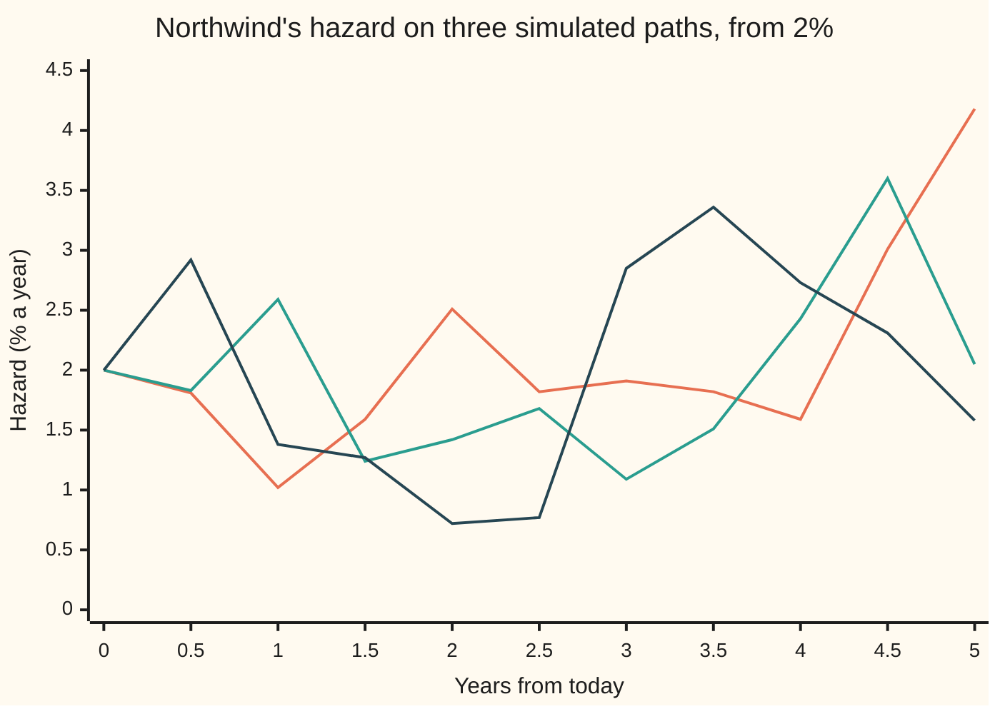
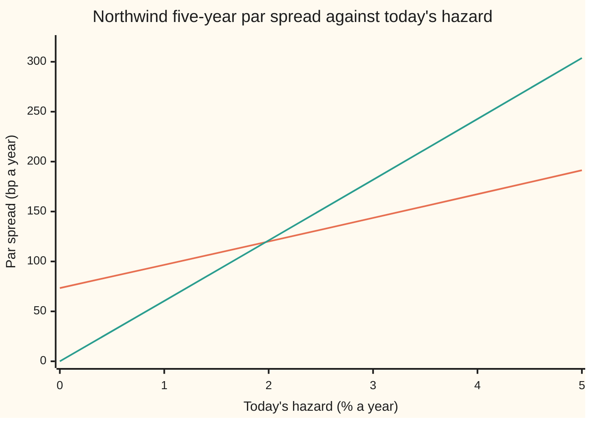

# A random hazard: the Cox process, a mean-reverting intensity, and survival as the average of an exponential

[Syllabus](../../../SYLLABUS.md) → [Financial mathematics](../../../SYLLABUS.md#w12) → [Reduced-Form Models - Risky Bonds, Spreads and Random Hazards](../../../SYLLABUS.md#w12-s44) → A random hazard

---

## General Overview

Northwind Lines, a shipping company, has bonds outstanding and a five-year credit default swap (CDS: insurance against Northwind defaulting) trading on them. The market reads Northwind as failing at 2% a year. That rate among survivors is the **hazard**. Held flat at 2%, it gives Northwind a five-year survival chance of 0.9048 ([The hazard rate](../41-Default%2C%20Survival%20and%20the%20Hazard%20Rate/02-hazard-rate-and-survival-probability.md)).

Nobody believes the 2% will sit still. A freight slump pushes it up; a good quarter pulls it down; Northwind's CDS premium moves every day. So let the hazard wander. Start it at 2%, let a pull drag it back toward 2% at speed 0.5 a year, and shake it with random shocks whose size is set by a **volatility** of 10%. A default clock driven by a random hazard is called a **Cox process**, after the statistician David Cox, who defined it in 1955; finance also calls it **doubly stochastic**, since both the hazard and the default date are random.

Survival becomes an average: on each path the hazard might take, survival is e to the minus the area under that path, and the survival chance is the average over all paths. That average comes out higher than the flat answer, **0.9057 against 0.9048**, though the hazard averages exactly 2% at every date. The par spread, the fair CDS premium, barely notices. The price of an option on that premium does.

**A random hazard turns survival into the average of e to the minus the area under the hazard; with a square-root, mean-reverting hazard that average has the same closed form as a bond price in the Cox-Ingersoll-Ross interest-rate model, and it always sits above the survival of a flat hazard with the same mean.**

**What kind of fact this is:** a model: the hazard is taken to wander in a particular way, an assumption about markets, not a law. Inside the model, the survival formula and the Jensen gap are theorems, proved on this card in Why it works.

### The picture: three hazards Northwind might have



Orange, green and dark blue: three hazard paths drawn by the code below, read every half year. Each wanders off 2% and is pulled back. Each area differs, so each gives a different five-year survival; the card's answer averages over every possible path.

---

## The formula

Notation first, in words. The hazard at time $t$ (in years) is $\lambda_t$ (Greek "lambda"); today's value is $\lambda_0$. A small d in front of a quantity means its change over a tiny time step. $W$ is Brownian motion, a random walk whose change over a step is a bell-curve draw with spread the square root of the step ([Stochastic differential equations](../../11-Stochastic%20processes%20and%20calculus/06-Ito%20Calculus/04-stochastic-differential-equations.md)). The hazard moves by

$$d\lambda_t = \kappa\,(\theta - \lambda_t)\,dt + \sigma\sqrt{\lambda_t}\,dW_t.$$

Here $\kappa$ ("kappa") is the pull speed, $\theta$ ("theta") the long-run level and $\sigma$ the volatility.

**Read it aloud:** each instant, the hazard closes a fraction $\kappa$ of its gap to the long-run level, plus a random shock whose size grows with the square root of the hazard.

This is the Cox-Ingersoll-Ross (CIR) equation with the hazard in place of the interest rate ([Cox-Ingersoll-Ross](../30-Short-Rate%20Models/03-cox-ingersoll-ross-model.md)). The square root keeps the hazard from going below zero, which a default rate must never do.

Survival to year $T$ is the average, over hazard paths, of e to the minus the area under the path. Write $\Lambda_T$ (capital lambda) for that area, the hazard added up from today to $T$, and $\mathrm{E}$ for the average (expectation):

$$Q(T) = \mathrm{E}\!\left[e^{-\Lambda_T}\right], \qquad \Lambda_T = \int_0^T \lambda_t\,dt.$$

For the square-root hazard the average has a closed form:

$$Q(T) = A(T)\,e^{-B(T)\,\lambda_0},$$

$$B(T) = \frac{2\,(e^{\gamma T} - 1)}{(\gamma+\kappa)(e^{\gamma T}-1) + 2\gamma}, \qquad A(T) = \left[\frac{2\gamma\,e^{(\gamma+\kappa)T/2}}{(\gamma+\kappa)(e^{\gamma T}-1) + 2\gamma}\right]^{\nu}, \qquad \gamma = \sqrt{\kappa^2 + 2\sigma^2}, \quad \nu = \frac{2\kappa\theta}{\sigma^2}.$$

**Read it aloud:** survival is a level factor, set by the hazard's settings and the horizon, times e to the minus (a sensitivity times today's hazard).

And the inequality that says which way randomness pushes ($\mathrm{Var}$ is the variance), from [Jensen's inequality](../../09-Probability%20and%20statistics/02-Random%20Variables/06-jensens-inequality.md):

$$Q(T) \;\ge\; e^{-\mathrm{E}[\Lambda_T]}, \qquad Q(T) - e^{-\mathrm{E}[\Lambda_T]} \approx \tfrac12\,\mathrm{Var}[\Lambda_T]\;e^{-\mathrm{E}[\Lambda_T]}.$$

**Read it aloud:** averaging e to the minus the area gives more than e to the minus the average area, and the excess is about half the area's variance, scaled by the flat survival.

| Symbol | Plain meaning | In our example | Push it up and five-year survival… |
| --- | --- | --- | --- |
| $\lambda$, $\lambda_t$, $\lambda_0$ | the hazard: default rate among survivors, per year; at time t; today | 2% today | falls |
| $\kappa$ | pull speed: fraction of the gap to the long-run level closed per year. Say "kappa". | 0.5 | falls toward the flat 0.9048: the hazard strays less |
| $\theta$ | long-run level the hazard is pulled toward. Say "theta". | 2% | falls |
| $\sigma$ | volatility of the hazard: shock size is $\sigma$ times the square root of the hazard | 10%, so a shock of 1.4142 points a year at 2% | rises: more spread, bigger Jensen gap |
| $W$ | Brownian motion, the source of the random shocks | a fresh draw each step | — |
| $t$, $T$ | a time in years; the horizon | T = 5 | falls with T |
| $\Lambda_T$, $\Lambda_t$ | area under the hazard from today to T. Say "capital lambda". | averages 0.1 | falls |
| $Q$ | survival: chance Northwind has not defaulted by T | 0.905665 | — |
| $A$, $B$, $\gamma$, $\nu$ | level factor; sensitivity to today's hazard; helper $\sqrt{\kappa^2+2\sigma^2}$; Feller ratio $2\kappa\theta/\sigma^2$ | 0.939106; 1.812959; 0.519615; 2 | — |
| $\tau$, $\xi$ | Northwind's default date; an exponential clock with average 1, independent of the hazard. Say "tau", "xi". | random | — |
| $\mathrm{E}$, $\mathrm{Var}$ | average and variance over hazard paths | Var of area 0.001857 | — |
| $r$, $R$ | riskless rate, continuously compounded; recovery, fraction of face paid at default | 5%; 40% | — |

The sensitivity $B$ is the key companion number. A flat hazard has sensitivity $T$, five: a one-point rise in today's hazard lowers log survival by 0.05. Here it is 1.81, because the pull drags the far years back to 2% whatever today brings.

### When it holds

- **Hazard independent of interest rates.** The discount factor and the survival chance multiply only when rates and hazard move separately. If Northwind weakens when rates rise, the average of the product is not the product of the averages, and every leg on this card is off by that covariance.
- **Hazard independent of what is owed.** When default grows likelier exactly as the exposure grows (wrong-way risk), the same factoring fails; see [Wrong-way risk](../46-Counterparty%20Risk%20and%20CVA/05-wrong-way-risk.md).
- **Constant settings fitted to prices.** Four constant settings cannot match every CDS curve. A market curve that bends is mispriced by the fitting error unless the long-run level is allowed to change with time. The settings are also pricing-world numbers, fitted to CDS quotes, not to a history of defaults ([Two default probabilities](../42-Credit%20Default%20Swaps%20-%20Pricing%2C%20the%20Par%20Spread%20and%20the%20Hazard%20Behind%20It/09-market-implied-versus-historical-default-probability.md)).
- **Feller for a strictly positive hazard.** When $2\kappa\theta \ge \sigma^2$ the hazard never touches zero. Below it, paths touch zero and bounce; the survival formula still holds, since it never needed the hazard to stay off zero.

---

## Why it works

### Step 0: fix the path, and the flat-hazard card already has the answer

Suppose Northwind's hazard path for the next five years were announced. Then survival is e to the minus the area under it, exactly as on [The hazard rate](../41-Default%2C%20Survival%20and%20the%20Hazard%20Rate/02-hazard-rate-and-survival-probability.md). Nobody announces the path, so average over paths. Two layers of chance: the path, then the default given the path.

### Step 1: build the default date from the path and an exponential clock

Draw a number $\xi$ from the exponential distribution with average 1, independent of the hazard: the chance that $\xi$ exceeds any level x is $e^{-x}$. Declare that Northwind defaults at the first moment the area under the hazard, $\Lambda_t$, climbs past $\xi$. That date is $\tau$.

Given the path, Northwind is alive at $T$ exactly when the area so far has not yet reached the clock: $\Lambda_T < \xi$. The chance of that is $e^{-\Lambda_T}$. Averaging over paths gives $Q(T) = \mathrm{E}[e^{-\Lambda_T}]$. With a flat hazard the area is $0.02 \times T$ and this is the old answer; the same recipe simulates one default date on [Simulating a default time](../41-Default%2C%20Survival%20and%20the%20Hazard%20Rate/05-simulating-a-default-time.md).

<details>
<summary>Detailed proof: the construction has the hazard it claims, and survival is the average</summary>

**Survival.** Condition on the whole hazard path. The clock $\xi$ is independent of it, so $P(\tau > T \mid \text{path}) = P(\xi > \Lambda_T \mid \text{path}) = e^{-\Lambda_T}$. The **tower rule** (the average of conditional averages is the plain average) gives $P(\tau > T) = \mathrm{E}[e^{-\Lambda_T}]$.

**The hazard is $\lambda_t$.** Given the path, the chance of defaulting in a short stretch after $t$, having survived to $t$, is $(e^{-\Lambda_t} - e^{-\Lambda_{t+h}})/e^{-\Lambda_t} = 1 - e^{-(\Lambda_{t+h} - \Lambda_t)}$. For small h the area gained is about $\lambda_t h$, so this is about $\lambda_t h$: the rate among survivors is $\lambda_t$, as required.

**Doubly stochastic.** Given the path, defaults arrive as a Poisson process with rate $\lambda_t$, and default is its first jump: Poisson given the path, random on top. Lando (1998) set this out for credit.

</details>

### Step 2: the average is a CIR bond price

Now compare two averages. The CIR card prices a zero-coupon bond as $\mathrm{E}[e^{-\int_0^T r_t\,dt}]$: e to the minus the area under a square-root, mean-reverting interest rate. Survival here is $\mathrm{E}[e^{-\Lambda_T}]$: e to the minus the area under a square-root, mean-reverting hazard. Same equation for the process, same average. So the same formula answers both, with the hazard's settings in place of the rate's.

The proof's shape, from [Cox-Ingersoll-Ross](../30-Short-Rate%20Models/03-cox-ingersoll-ross-model.md): survival, as a function of today's hazard and the time left, obeys a partial differential equation whose coefficients are each a constant plus a constant times the hazard. Guessing $A e^{-B\lambda_0}$ splits it into two ordinary ones:

$$B' = 1 - \kappa B - \tfrac12\sigma^2 B^2, \qquad (\ln A)' = -\kappa\theta B, \qquad B(0) = 0,\; A(0) = 1,$$

a prime marking the rate of change in the horizon. The first is a Riccati equation (a rate of change that is a quadratic in the unknown). Its roots bring in $\gamma$, and solving it gives $B$; integrating $B$ gives $A$. The CIR card carries both solutions in full. The code below never uses them: road 2 steps these two equations forward numerically and lands on the formula to ten decimals.

### Step 3: why randomness raises survival

The expected hazard at time $t$ is $\theta + (\lambda_0 - \theta)e^{-\kappa t}$. Northwind starts at the long-run level, so the expected hazard is 2% at every date, and the expected area over five years is exactly 0.1. A careless reading says survival is therefore $e^{-0.1} = 0.9048$, as for the flat hazard.

It is not, because e to the minus x is **convex**: its graph bends upward, so a chord between two points lies above the curve. Average an area of 0.05 and an area of 0.15: $\tfrac12(e^{-0.05} + e^{-0.15})$ beats $e^{-0.1}$, because the good path gains more survival than the bad path loses. Jensen's inequality is that statement for any spread of outcomes: $\mathrm{E}[e^{-\Lambda}] \ge e^{-\mathrm{E}[\Lambda]}$, with equality only when the area is certain. So a random hazard with the same mean gives more survival, never less.

How much more? Expand e to the minus x around the mean area to second order: the first-order term averages to zero, the second leaves half the variance times the flat survival. The area's variance comes from the hazard's own variance and how long a shock lingers: a shock at time s decays at rate $\kappa$, so it adds to the area for about $1/\kappa$ years. Road 3 in the code integrates that out and gets a variance of 0.001857. Half of it, times 0.904837, is 0.000840. The exact gap from the closed form is 0.000827. The last 0.000015, in log terms, is the third-order piece: the area's distribution leans to the right.

<details>
<summary>The algebra behind the variance of the area</summary>

Given the hazard at time s, the expected hazard at a later time u is $\theta + (\lambda_s - \theta)e^{-\kappa(u-s)}$, so a shock at s is remembered with weight $e^{-\kappa(u-s)}$. The covariance of the hazards at s and u (s before u) is therefore $e^{-\kappa(u-s)}\,\mathrm{Var}[\lambda_s]$. The variance of an area is the double integral of the covariances; doing the inner integral over u from s to T:
$$\mathrm{Var}[\Lambda_T] = 2\int_0^T \mathrm{Var}[\lambda_s]\,\frac{1 - e^{-\kappa(T-s)}}{\kappa}\,ds, \qquad \mathrm{Var}[\lambda_s] = \frac{\lambda_0\sigma^2}{\kappa}\left(e^{-\kappa s} - e^{-2\kappa s}\right) + \frac{\theta\sigma^2}{2\kappa}\left(1 - e^{-\kappa s}\right)^2.$$
The second formula is the CIR variance from the CIR card. At one year it gives a standard deviation of 1.1244 points: in a year, Northwind's hazard typically sits a point or more away from 2%.

</details>

The gap grows with the horizon, since the area has longer to spread out. In basis points of survival (hundredths of a percent), from one year to ten:

| Years | 1 | 2 | 3 | 4 | 5 | 6 | 7 | 8 | 9 | 10 |
| --- | --- | --- | --- | --- | --- | --- | --- | --- | --- | --- |
| Survival above flat (bp) | 0.23 | 1.29 | 3.15 | 5.55 | 8.27 | 11.13 | 14.03 | 16.90 | 19.71 | 22.43 |

### Step 4: the par spread barely moves

The par spread is the premium that makes the two legs of a CDS equal ([Pricing a CDS](../42-Credit%20Default%20Swaps%20-%20Pricing%2C%20the%20Par%20Spread%20and%20the%20Hazard%20Behind%20It/02-cds-legs-risky-annuity-and-par-spread.md)). Both legs are built from the survival curve and nothing else. The risky annuity adds up quarterly slices of a year, each discounted and weighted by survival to its date. The protection leg adds up the loss, one minus recovery, at every default date, discounted and weighted by the chance default lands there. That chance is the fall in the survival curve, which the random hazard supplies like any other.

The survival curve has moved by at most 8.27 bp over five years. Protection falls a little and the annuity rises a little, so the par spread falls from 121.06 bp to 120.01 bp, a change of 1.04 bp. A five-year CDS quote cannot tell a flat 2% hazard from one that wanders with 10% volatility.

### Step 5: what randomness buys, and what it costs

It buys two things a flat hazard cannot give.

- **A spread that moves.** In a year, Northwind's hazard has a standard deviation of 1.12 points, so its CDS premium a year from now is uncertain. An option to buy protection at today's premium in a year is then worth something, and the CIR hazard prices it. That is the job of [Options on a CDS](05-cds-option-and-implied-spread-volatility.md).
- **Links to other risks.** Let the hazard share a random driver with interest rates, or with the exposure a bank has to Northwind, and the model can say how much worse things get when both move at once. That is wrong-way risk, and the independence assumed in When it holds is exactly what has to be given up to see it.

It costs two settings. The flat model needs one number, the hazard. The random one needs today's hazard and the long-run level, which the CDS curve pins down, plus a pull speed and a volatility, which it barely sees: Step 4 moved volatility from 0 to 10% and the spread moved 1.04 bp. The pull speed and the volatility have to be fitted to prices that depend on the spread moving, such as CDS options. Brigo and Alfonsi (2005) fit a shifted version of this model to CDS quotes and price CDS options with it.

---

## Worked numbers, by hand

Northwind: today's hazard $\lambda_0$ = 2%, long-run level $\theta$ = 2%, pull speed $\kappa$ = 0.5, volatility $\sigma$ = 10%, five years.

| Step | Arithmetic | Value |
| --- | --- | --- |
| Feller ratio $\nu$ | 2 × 0.5 × 0.02 / (0.1 × 0.1) | 2: the hazard never touches zero |
| $\gamma$ | square root of 0.25 + 2 × 0.01 | 0.519615 |
| $e^{\gamma T}$ | e to the 5 × 0.519615 | 13.437862 |
| denominator | $(\gamma+\kappa)(e^{\gamma T}-1) + 2\gamma$ | 13.721064 |
| $B(5)$ | $2(e^{\gamma T}-1)$ over the denominator | 1.812959 |
| bracket in $A$ | $2\gamma\,e^{(\gamma+\kappa)T/2}$ over the denominator | 0.969075 |
| $A(5)$ | 0.969075 squared | 0.939106 |
| today's-hazard factor | e to the minus 1.812959 × 0.02 | 0.964390 |
| **five-year survival** | 0.939106 × 0.964390 | **0.905665** |
| flat 2% hazard | e to the minus 0.1 | 0.904837 |
| gap | 0.905665 − 0.904837 | 0.000827, or 8.27 bp |

Of every 10,000 firms like Northwind, a random hazard lets about 8 more survive five years than a flat one would, with the same average hazard. The par spread moves from 121.06 bp to 120.01 bp.

### What breaks if you drop a piece

Correct five-year survival 0.905665.

| Mistake | Comes out at | What went wrong |
| --- | --- | --- |
| Put the average hazard into the flat formula | 0.904837 | Jensen ignored: the average of e to the minus the area is not e to the minus the average area |
| Drop the power $\nu$ on $A$ | 0.934566 | Power 1 instead of 2: the level factor acts as if the long-run hazard were half its value |
| Write $\gamma$ with $\sigma^2$ instead of $2\sigma^2$ | 0.934249 | The Riccati roots move, so both $A$ and $B$ are wrong |
| Freeze the hazard at its year-5 value for all five years | 0.907016 | Survival needs the area under the whole path, not one endpoint times five; the endpoint varies more than the path's average |

The last row is checked twice: the formula for the average of e to the minus five times the year-5 hazard gives 0.907016, and the simulated paths give 0.907006.

---

## How the spread moves when today's hazard moves

The par spread depends on the state of the world, and here the state is today's hazard. The flat model has one answer to "Northwind's hazard jumped from 2% to 3% this morning": the whole curve jumps by a point, for all five years. The random model says the jump will decay back toward 2% at speed 0.5, so most of the five years see much less than 3%.



Orange: the random hazard, pulled back to 2%. Green: a flat hazard held at today's value for five years. The lines cross near 2%, where the two models agree to about a basis point. From 2% to 3%, the flat spread climbs from 121.06 to 181.81 bp; the random one only from 120.01 to 143.61 bp, since its sensitivity $B(5)$ is 1.81 years, not five. At a hazard of zero today the flat model says Northwind is riskless; the random one still charges 73.37 bp, because the hazard is expected to climb back.

How much the survival gain depends on the volatility, five years out, in basis points of survival above the flat 0.904837:

```
volatility  Feller ratio   survival above flat, bp
    5%          8.00       ███                             2.09
   10%          2.00       ████████                        8.27
   15%          0.89       ██████████████████              18.26
   20%          0.50       ███████████████████████████████ 31.63
```

The gain grows roughly with the square of the volatility, as half the variance should. At 15% and 20% the Feller ratio is below 1, so the hazard can touch zero; the formula still holds.

---

## Code, from first principles, and it actually runs

The code reaches Northwind's five-year survival four independent ways. Road 1 is the closed form. Road 2 steps the two Riccati equations forward with fourth-order Runge-Kutta (a standard stepping rule for ordinary differential equations) and never uses their solution. Road 3 simulates 50,000 pairs of hazard paths straight from the equation for the hazard, each pair a path and its mirror image, and averages e to the minus the area. Road 4 uses the same paths but gives each its own exponential clock and counts the firms that never default: the Cox construction of Step 1, done literally. Separately, a Simpson integral (thin-slice area adding) of the mean and variance of the hazard checks the Jensen gap, and the par spread is computed from Simpson legs and checked against the flat closed form of the CDS card. Random numbers come from a hand-written generator.

### Python

```python
# A random hazard (Cox process): Northwind's five-year survival four ways, the Jensen gap, the par spread.
# Standard library only. Random numbers, ODE stepper and integrator are written here.
from math import exp, log, sqrt, cos, sin, pi
K, TH, SIG, L0, T = 0.5, 0.02, 0.10, 0.02, 5.0   # pull speed, long-run hazard, noise, today's hazard, years
R, REC, DELTA = 0.05, 0.40, 0.25                 # riskless rate, recovery, quarterly premiums

def cir_AB(t, k=K, th=TH, s=SIG, two=2.0, power=True):   # road 1: the CIR bond formula, hazard for rate
    g = sqrt(k * k + two * s * s)
    e = exp(g * t); den = (g + k) * (e - 1.0) + 2.0 * g
    base = 2.0 * g * exp((g + k) * t / 2.0) / den
    return (base ** (2.0 * k * th / (s * s)) if power else base), 2.0 * (e - 1.0) / den, g
def Q(t, l0=L0, **kw):
    if t == 0.0: return 1.0
    A, B, _ = cir_AB(t, **kw)
    return A * exp(-B * l0)
def riccati_Q(t, n=1000):                        # road 2: B' = 1 - kB - s^2 B^2/2, (ln A)' = -k th B, stepped
    f = lambda b: 1.0 - K * b - 0.5 * SIG * SIG * b * b
    h, b, lnA = t / n, 0.0, 0.0
    for _ in range(n):
        k1 = f(b); k2 = f(b + h * k1 / 2); k3 = f(b + h * k2 / 2); k4 = f(b + h * k3)
        lnA -= K * TH * h * (b + 2 * (b + h * k1 / 2) + 2 * (b + h * k2 / 2) + (b + h * k3)) / 6
        b += h * (k1 + 2 * k2 + 2 * k3 + k4) / 6
    return exp(lnA - b * L0)
def simpson(f, a, b, n=2000):
    h = (b - a) / n; s = f(a) + f(b)
    for i in range(1, n): s += (4 if i % 2 else 2) * f(a + i * h)
    return s * h / 3
class Rng:                                       # splitmix64 + Box-Muller
    def __init__(self, seed): self.s = seed
    def u(self):
        self.s = (self.s + 0x9E3779B97F4A7C15) & 0xFFFFFFFFFFFFFFFF
        z = self.s
        z = ((z ^ (z >> 30)) * 0xBF58476D1CE4E5B9) & 0xFFFFFFFFFFFFFFFF
        z = ((z ^ (z >> 27)) * 0x94D049BB133111EB) & 0xFFFFFFFFFFFFFFFF
        return ((z ^ (z >> 31)) >> 11) * 2.0 ** -53
    def pair(self):
        a, b = 1.0 - self.u(), self.u()
        rad = sqrt(-2.0 * log(a))
        return rad * cos(2 * pi * b), rad * sin(2 * pi * b)
def path(zs, sign, dt):                          # one hazard path from the SDE; returns area, hazards
    l, area, ls = L0, 0.0, [L0]
    for z in zs:
        nl = max(l + K * (TH - l) * dt + SIG * sqrt(l) * sign * z * sqrt(dt), 0.0)
        area += 0.5 * (l + nl) * dt; l = nl; ls.append(l)
    return area, ls
def simulate(pairs=50000, steps=100, seed=20260928):     # roads 3 and 4
    rng, dt = Rng(seed), T / steps
    avg, alive, l1, frz = [], 0, [], []
    for _ in range(pairs):
        zs = []
        for _ in range(steps // 2): zs.extend(rng.pair())
        es = (-log(1.0 - rng.u()), -log(1.0 - rng.u()))  # each twin's own exponential clock
        pv = 0.0
        for sign, E in zip((1.0, -1.0), es):             # antithetic twin: same draws, flipped
            area, ls = path(zs, sign, dt)
            pv += 0.5 * exp(-area); alive += area < E     # road 3 averages e^-area; road 4 counts
            l1.append(ls[steps // 5]); frz.append(exp(-T * ls[-1]))
        avg.append(pv)
    return avg, alive / (2 * pairs), l1, frz
def tot(xs):
    s = 0.0
    for x in xs: s += x
    return s
def mean_se(xs):
    m = tot(xs) / len(xs)
    return m, sqrt(tot([(x - m) ** 2 for x in xs]) / (len(xs) - 1) / len(xs))
def par_bp(q, lam=None):                         # par spread: Simpson legs, or the flat closed form
    if lam is not None:
        c = R + lam; x = exp(-c * DELTA)
        return (1 - REC) * lam * (1 - exp(-c * T)) / c / (DELTA * x * (1 - x ** 20) / (1 - x)) * 1e4
    ann = tot([DELTA * exp(-R * DELTA * j) * q(DELTA * j) for j in range(1, 21)])
    prot = (1 - REC) * (1 - exp(-R * T) * q(T) - R * simpson(lambda t: exp(-R * t) * q(t), 0.0, T))
    return prot / ann * 1e4
mean_l = lambda s: TH + (L0 - TH) * exp(-K * s)
var_l = lambda s: L0 * SIG**2 / K * (exp(-K * s) - exp(-2 * K * s)) + TH * SIG**2 / (2 * K) * (1 - exp(-K * s))**2
A5, B5, G = cir_AB(T)
e5 = exp(G * T); den5 = (G + K) * (e5 - 1.0) + 2.0 * G; base5 = 2.0 * G * exp((G + K) * T / 2.0) / den5
Q1, Q2, flat = Q(T), riccati_Q(T), exp(-0.02 * T)
avg, Q4, l1, frz = simulate(); Q3, se3 = mean_se(avg); se4 = sqrt(Q4 * (1 - Q4) / 100000)
EL = simpson(mean_l, 0.0, T)
VL = 2 * simpson(lambda s: var_l(s) * (1 - exp(-K * (T - s))) / K, 0.0, T)
m1 = tot(l1) / len(l1); sd1 = sqrt(tot([(x - m1) ** 2 for x in l1]) / (len(l1) - 1))
cT = SIG**2 * (1 - exp(-K * T)) / (4 * K)                 # frozen-hazard mistake: E[exp(-T lam_T)]
frozen = (1 + 2 * T * cT) ** (-2 * K * TH / SIG**2) * exp(-T * L0 * exp(-K * T) / (1 + 2 * T * cT))
s_flat, s_cf, s_cox = par_bp(lambda t: exp(-0.02 * t)), par_bp(None, 0.02), par_bp(Q)
rows = [("gamma", G), ("e^(gamma T)", e5), ("denominator (g+k)(e^gT - 1) + 2g", den5), ("B(5)", B5),
    ("bracket inside A", base5), ("A(5)", A5), ("e^(-B(5) lambda0)", exp(-B5 * L0)), ("Feller ratio nu = 2 k theta / sigma^2", 2 * K * TH / SIG**2),
    ("shock size at 2%, sigma sqrt(lambda0)", SIG * sqrt(L0)),
    ("1 closed form Q(5)", Q1), ("2 Riccati stepped Q(5)", Q2), ("3 simulated mean of e^-area", Q3),
    ("  standard error", se3), ("4 simulated share never defaulting", Q4), ("  standard error", se4),
    ("flat 2% survival e^-0.1", flat), ("E[area] by Simpson", EL), ("Var[area] by Simpson", VL),
    ("Jensen gap Q - e^-E[area]", Q1 - exp(-EL)), ("  half Var times e^-E[area]", 0.5 * VL * exp(-EL)),
    ("  ln Q + E - Var/2 (the rest)", log(Q1) + EL - 0.5 * VL),
    ("sd of hazard at 1 year, formula", sqrt(var_l(1.0))), ("sd of hazard at 1 year, simulated", sd1),
    ("par spread bp, flat 2%, Simpson", s_flat), ("par spread bp, flat 2%, closed form", s_cf),
    ("par spread bp, random hazard", s_cox), ("  difference bp", s_cox - s_flat),
    ("wrong: power nu dropped", Q(T, power=False)), ("wrong: sigma^2 not 2 sigma^2 in gamma", Q(T, two=1.0)),
    ("wrong: hazard frozen at year 5, formula", frozen), ("  simulated", tot(frz) / len(frz)),
    ("try: kappa = 2", Q(T, k=2.0)), ("try: sigma = 0.20, Feller ratio 0.5", Q(T, s=0.2))]
for name, v in rows: print(f"{name:<40} {v:>12.6f}")
print("gap by maturity, bp of survival, 1..10 years:")
print(" ".join(f"{(Q(float(t)) - exp(-0.02 * t)) * 1e4:.2f}" for t in range(1, 11)))
print("sigma, Feller ratio, five-year survival gain over flat (bp):")
for s in (0.05, 0.10, 0.15, 0.20): print(f"  {s:.2f}  {2 * K * TH / s**2:5.2f}  {(Q(T, s=s) - flat) * 1e4:6.2f}")
print("start hazard %, par spread bp random, par spread bp flat:")
for i in range(6):
    l0 = i / 100.0
    print(f"  {i}  {par_bp(lambda t: Q(t, l0=l0)):7.2f}  {par_bp(None, l0) if l0 > 0 else 0.0:7.2f}")
print("three hazard paths, % a year, every half year 0..5:")
rng = Rng(7)
for _ in range(3):
    zs = []
    for _ in range(50): zs.extend(rng.pair())
    print(" ".join(f"{100 * x:.2f}" for x in path(zs, 1.0, 0.05)[1][::10]))
assert abs(Q1 - 0.9056646181) < 1e-9, "closed form vs the card's worked number"
assert abs(Q2 - Q1) < 1e-10, "stepped Riccati equations must land on the closed form"
assert abs(Q3 - Q1) < 4 * se3 and abs(Q4 - Q1) < 4 * se4, "both simulations within four standard errors"
assert Q1 > exp(-EL) and abs(Q1 - exp(-EL) - 0.5 * VL * exp(-EL)) < 3e-5, "Jensen: above, by about half the variance"
assert abs(s_flat - s_cf) < 1e-6, "Simpson legs vs the flat closed form"
assert abs(frozen - tot(frz) / len(frz)) < 2e-4, "frozen-hazard formula vs the simulated paths"
print("ALL CHECKS PASS")
```

**Ran 2026-09-28 on macOS, Python 3.14.6, standard library only. All checks passed. Output, pasted from the run:**

```
gamma                                        0.519615
e^(gamma T)                                 13.437862
denominator (g+k)(e^gT - 1) + 2g            13.721064
B(5)                                         1.812959
bracket inside A                             0.969075
A(5)                                         0.939106
e^(-B(5) lambda0)                            0.964390
Feller ratio nu = 2 k theta / sigma^2        2.000000
shock size at 2%, sigma sqrt(lambda0)        0.014142
1 closed form Q(5)                           0.905665
2 Riccati stepped Q(5)                       0.905665
3 simulated mean of e^-area                  0.905666
  standard error                             0.000046
4 simulated share never defaulting           0.905900
  standard error                             0.000923
flat 2% survival e^-0.1                      0.904837
E[area] by Simpson                           0.100000
Var[area] by Simpson                         0.001857
Jensen gap Q - e^-E[area]                    0.000827
  half Var times e^-E[area]                  0.000840
  ln Q + E - Var/2 (the rest)               -0.000015
sd of hazard at 1 year, formula              0.011244
sd of hazard at 1 year, simulated            0.011331
par spread bp, flat 2%, Simpson            121.056152
par spread bp, flat 2%, closed form        121.056152
par spread bp, random hazard               120.012014
  difference bp                             -1.044138
wrong: power nu dropped                      0.934566
wrong: sigma^2 not 2 sigma^2 in gamma        0.934249
wrong: hazard frozen at year 5, formula      0.907016
  simulated                                  0.907006
try: kappa = 2                               0.904933
try: sigma = 0.20, Feller ratio 0.5          0.908000
gap by maturity, bp of survival, 1..10 years:
0.23 1.29 3.15 5.55 8.27 11.13 14.03 16.90 19.71 22.43
sigma, Feller ratio, five-year survival gain over flat (bp):
  0.05   8.00    2.09
  0.10   2.00    8.27
  0.15   0.89   18.26
  0.20   0.50   31.63
start hazard %, par spread bp random, par spread bp flat:
  0    73.37     0.00
  1    96.60    60.45
  2   120.01   121.06
  3   143.61   181.81
  4   167.39   242.72
  5   191.36   303.78
three hazard paths, % a year, every half year 0..5:
2.00 1.81 1.02 1.59 2.51 1.82 1.91 1.82 1.59 3.01 4.18
2.00 1.83 2.59 1.24 1.42 1.68 1.09 1.51 2.43 3.60 2.05
2.00 2.92 1.38 1.27 0.72 0.77 2.85 3.36 2.73 2.31 1.58
ALL CHECKS PASS
```

Four roads, one survival. The stepped equations agree with the closed form to ten decimals. The simulated average, 0.905666, sits well inside one standard error (0.000046) of the formula; the default count, noisier because each firm either survives or not, is 0.905900 with a standard error of 0.000923. The Jensen estimate from the variance, 0.000840, is close to the exact gap of 0.000827, and the log-scale remainder, 0.000015, is the third-order piece.

### Rust

Same checks, same inputs, same random generator. No crates.

```rust
// A random hazard (Cox process): the same check as stochastic_hazard_cox_process_check.py, in Rust.
// Standard library only, no crates. Random numbers, ODE stepper and integrator are written here.
const K: f64 = 0.5; const TH: f64 = 0.02; const SIG: f64 = 0.10; const L0: f64 = 0.02; const T: f64 = 5.0;
const R: f64 = 0.05; const REC: f64 = 0.40; const DELTA: f64 = 0.25;
const PI: f64 = std::f64::consts::PI;

fn cir_ab(t: f64, k: f64, th: f64, s: f64, two: f64, power: bool) -> (f64, f64, f64) {   // road 1
    let g = (k * k + two * s * s).sqrt();
    let e = (g * t).exp(); let den = (g + k) * (e - 1.0) + 2.0 * g;
    let base = 2.0 * g * ((g + k) * t / 2.0).exp() / den;
    (if power { base.powf(2.0 * k * th / (s * s)) } else { base }, 2.0 * (e - 1.0) / den, g)
}
fn qf(t: f64, l0: f64, k: f64, s: f64, two: f64, power: bool) -> f64 {
    if t == 0.0 { return 1.0; }
    let (a, b, _) = cir_ab(t, k, TH, s, two, power);
    a * (-b * l0).exp()
}
fn q(t: f64) -> f64 { qf(t, L0, K, SIG, 2.0, true) }
fn riccati_q(t: f64, n: usize) -> f64 {                        // road 2: the two Riccati equations, stepped
    let f = |b: f64| 1.0 - K * b - 0.5 * SIG * SIG * b * b;
    let (h, mut b, mut lna) = (t / n as f64, 0.0_f64, 0.0_f64);
    for _ in 0..n {
        let k1 = f(b); let k2 = f(b + h * k1 / 2.0); let k3 = f(b + h * k2 / 2.0); let k4 = f(b + h * k3);
        lna -= K * TH * h * (b + 2.0 * (b + h * k1 / 2.0) + 2.0 * (b + h * k2 / 2.0) + (b + h * k3)) / 6.0;
        b += h * (k1 + 2.0 * k2 + 2.0 * k3 + k4) / 6.0;
    }
    (lna - b * L0).exp()
}
fn simpson<F: Fn(f64) -> f64>(f: F, a: f64, b: f64, n: usize) -> f64 {
    let h = (b - a) / n as f64; let mut s = f(a) + f(b);
    for i in 1..n { s += if i % 2 == 1 { 4.0 } else { 2.0 } * f(a + i as f64 * h); }
    s * h / 3.0
}
struct Rng { s: u64 }                                          // splitmix64 + Box-Muller
impl Rng {
    fn u(&mut self) -> f64 {
        self.s = self.s.wrapping_add(0x9E3779B97F4A7C15);
        let mut z = self.s;
        z = (z ^ (z >> 30)).wrapping_mul(0xBF58476D1CE4E5B9);
        z = (z ^ (z >> 27)).wrapping_mul(0x94D049BB133111EB);
        ((z ^ (z >> 31)) >> 11) as f64 * 2.0_f64.powi(-53)
    }
    fn pair(&mut self) -> (f64, f64) {
        let a = 1.0 - self.u(); let b = self.u();
        let rad = (-2.0 * a.ln()).sqrt();
        (rad * (2.0 * PI * b).cos(), rad * (2.0 * PI * b).sin())
    }
    fn draws(&mut self, n: usize) -> Vec<f64> {
        let mut zs = Vec::with_capacity(2 * n);
        for _ in 0..n { let (x, y) = self.pair(); zs.push(x); zs.push(y); }
        zs
    }
}
fn path(zs: &[f64], sign: f64, dt: f64) -> (f64, Vec<f64>) {  // one hazard path from the SDE
    let (mut l, mut area, mut ls) = (L0, 0.0_f64, vec![L0]);
    for z in zs {
        let nl = (l + K * (TH - l) * dt + SIG * l.sqrt() * sign * z * dt.sqrt()).max(0.0);
        area += 0.5 * (l + nl) * dt; l = nl; ls.push(l);
    }
    (area, ls)
}
fn tot(xs: &[f64]) -> f64 { let mut s = 0.0; for x in xs { s += x; } s }
fn mean_se(xs: &[f64]) -> (f64, f64) {
    let m = tot(xs) / xs.len() as f64;
    let sq: Vec<f64> = xs.iter().map(|x| (x - m) * (x - m)).collect();
    (m, (tot(&sq) / (xs.len() - 1) as f64 / xs.len() as f64).sqrt())
}
fn par_bp<F: Fn(f64) -> f64>(qq: F) -> f64 {                   // par spread from the Simpson legs
    let ann: Vec<f64> = (1..=20).map(|j| DELTA * (-R * DELTA * j as f64).exp() * qq(DELTA * j as f64)).collect();
    let prot = (1.0 - REC) * (1.0 - (-R * T).exp() * qq(T) - R * simpson(|t| (-R * t).exp() * qq(t), 0.0, T, 2000));
    prot / tot(&ann) * 1e4
}
fn par_flat(lam: f64) -> f64 {                                 // the flat closed form from the CDS card
    let c = R + lam; let x = (-c * DELTA).exp();
    (1.0 - REC) * lam * (1.0 - (-c * T).exp()) / c / (DELTA * x * (1.0 - x.powf(20.0)) / (1.0 - x)) * 1e4
}
fn mean_l(s: f64) -> f64 { TH + (L0 - TH) * (-K * s).exp() }
fn var_l(s: f64) -> f64 {
    let a = 1.0 - (-K * s).exp();
    L0 * (SIG * SIG) / K * ((-K * s).exp() - (-2.0 * K * s).exp()) + TH * (SIG * SIG) / (2.0 * K) * (a * a)
}
fn main() {
    let (a5, b5, g) = cir_ab(T, K, TH, SIG, 2.0, true);
    let e5 = (g * T).exp(); let den5 = (g + K) * (e5 - 1.0) + 2.0 * g; let base5 = 2.0 * g * ((g + K) * T / 2.0).exp() / den5;
    let (q1, q2, flat) = (q(T), riccati_q(T, 1000), (-0.02 * T).exp());
    let (pairs, steps) = (50000usize, 100usize); let dt = T / steps as f64;
    let mut rng = Rng { s: 20260928 };
    let (mut avg, mut alive, mut l1, mut frz) = (Vec::new(), 0usize, Vec::new(), Vec::new());
    for _ in 0..pairs {                                        // roads 3 and 4
        let zs = rng.draws(steps / 2);
        let es = [-(1.0 - rng.u()).ln(), -(1.0 - rng.u()).ln()];
        let mut pv = 0.0;
        for (sign, e) in [1.0_f64, -1.0].iter().zip(es.iter()) {
            let (area, ls) = path(&zs, *sign, dt);
            pv += 0.5 * (-area).exp(); if area < *e { alive += 1; }
            l1.push(ls[steps / 5]); frz.push((-T * ls[steps]).exp());
        }
        avg.push(pv);
    }
    let (q3, se3) = mean_se(&avg); let q4 = alive as f64 / (2 * pairs) as f64;
    let se4 = (q4 * (1.0 - q4) / 100000.0).sqrt();
    let el = simpson(mean_l, 0.0, T, 2000);
    let vl = 2.0 * simpson(|s| var_l(s) * (1.0 - (-K * (T - s)).exp()) / K, 0.0, T, 2000);
    let m1 = tot(&l1) / l1.len() as f64;
    let sq: Vec<f64> = l1.iter().map(|x| (x - m1) * (x - m1)).collect();
    let sd1 = (tot(&sq) / (l1.len() - 1) as f64).sqrt();
    let ct = SIG * SIG * (1.0 - (-K * T).exp()) / (4.0 * K);   // frozen-hazard mistake: E[exp(-T lam_T)]
    let frozen = (1.0 + 2.0 * T * ct).powf(-2.0 * K * TH / (SIG * SIG)) * (-T * L0 * (-K * T).exp() / (1.0 + 2.0 * T * ct)).exp();
    let (s_flat, s_cf, s_cox) = (par_bp(|t| (-0.02 * t).exp()), par_flat(0.02), par_bp(q));
    let rows: Vec<(&str, f64)> = vec![("gamma", g), ("e^(gamma T)", e5), ("denominator (g+k)(e^gT - 1) + 2g", den5), ("B(5)", b5),
        ("bracket inside A", base5), ("A(5)", a5), ("e^(-B(5) lambda0)", (-b5 * L0).exp()), ("Feller ratio nu = 2 k theta / sigma^2", 2.0 * K * TH / (SIG * SIG)),
        ("shock size at 2%, sigma sqrt(lambda0)", SIG * L0.sqrt()),
        ("1 closed form Q(5)", q1), ("2 Riccati stepped Q(5)", q2), ("3 simulated mean of e^-area", q3),
        ("  standard error", se3), ("4 simulated share never defaulting", q4), ("  standard error", se4),
        ("flat 2% survival e^-0.1", flat), ("E[area] by Simpson", el), ("Var[area] by Simpson", vl),
        ("Jensen gap Q - e^-E[area]", q1 - (-el).exp()), ("  half Var times e^-E[area]", 0.5 * vl * (-el).exp()),
        ("  ln Q + E - Var/2 (the rest)", q1.ln() + el - 0.5 * vl),
        ("sd of hazard at 1 year, formula", var_l(1.0).sqrt()), ("sd of hazard at 1 year, simulated", sd1),
        ("par spread bp, flat 2%, Simpson", s_flat), ("par spread bp, flat 2%, closed form", s_cf),
        ("par spread bp, random hazard", s_cox), ("  difference bp", s_cox - s_flat),
        ("wrong: power nu dropped", qf(T, L0, K, SIG, 2.0, false)), ("wrong: sigma^2 not 2 sigma^2 in gamma", qf(T, L0, K, SIG, 1.0, true)),
        ("wrong: hazard frozen at year 5, formula", frozen), ("  simulated", tot(&frz) / frz.len() as f64),
        ("try: kappa = 2", qf(T, L0, 2.0, SIG, 2.0, true)), ("try: sigma = 0.20, Feller ratio 0.5", qf(T, L0, K, 0.2, 2.0, true))];
    for (name, v) in &rows { println!("{:<40} {:>12.6}", name, v); }
    println!("gap by maturity, bp of survival, 1..10 years:");
    let gaps: Vec<String> = (1..=10).map(|t| format!("{:.2}", (q(t as f64) - (-0.02 * t as f64).exp()) * 1e4)).collect();
    println!("{}", gaps.join(" "));
    println!("sigma, Feller ratio, five-year survival gain over flat (bp):");
    for s in [0.05_f64, 0.10, 0.15, 0.20] {
        println!("  {:.2}  {:5.2}  {:6.2}", s, 2.0 * K * TH / (s * s), (qf(T, L0, K, s, 2.0, true) - flat) * 1e4);
    }
    println!("start hazard %, par spread bp random, par spread bp flat:");
    for i in 0..6 {
        let l0 = i as f64 / 100.0;
        let fl = if l0 > 0.0 { par_flat(l0) } else { 0.0 };
        println!("  {}  {:7.2}  {:7.2}", i, par_bp(|t| qf(t, l0, K, SIG, 2.0, true)), fl);
    }
    println!("three hazard paths, % a year, every half year 0..5:");
    let mut rng = Rng { s: 7 };
    for _ in 0..3 {
        let zs = rng.draws(50);
        let ls = path(&zs, 1.0, 0.05).1;
        let pts: Vec<String> = ls.iter().step_by(10).map(|x| format!("{:.2}", 100.0 * x)).collect();
        println!("{}", pts.join(" "));
    }
    assert!((q1 - 0.9056646181).abs() < 1e-9, "closed form vs the card's worked number");
    assert!((q2 - q1).abs() < 1e-10, "stepped Riccati equations must land on the closed form");
    assert!((q3 - q1).abs() < 4.0 * se3 && (q4 - q1).abs() < 4.0 * se4, "both simulations within four standard errors");
    assert!(q1 > (-el).exp() && (q1 - (-el).exp() - 0.5 * vl * (-el).exp()).abs() < 3e-5, "Jensen: above, by about half the variance");
    assert!((s_flat - s_cf).abs() < 1e-6, "Simpson legs vs the flat closed form");
    assert!((frozen - tot(&frz) / frz.len() as f64).abs() < 2e-4, "frozen-hazard formula vs the simulated paths");
    println!("ALL CHECKS PASS");
}
```

**Ran 2026-09-28 on macOS, rustc 1.98.1, no crates. All checks passed. Output, pasted from the run:**

```
gamma                                        0.519615
e^(gamma T)                                 13.437862
denominator (g+k)(e^gT - 1) + 2g            13.721064
B(5)                                         1.812959
bracket inside A                             0.969075
A(5)                                         0.939106
e^(-B(5) lambda0)                            0.964390
Feller ratio nu = 2 k theta / sigma^2        2.000000
shock size at 2%, sigma sqrt(lambda0)        0.014142
1 closed form Q(5)                           0.905665
2 Riccati stepped Q(5)                       0.905665
3 simulated mean of e^-area                  0.905666
  standard error                             0.000046
4 simulated share never defaulting           0.905900
  standard error                             0.000923
flat 2% survival e^-0.1                      0.904837
E[area] by Simpson                           0.100000
Var[area] by Simpson                         0.001857
Jensen gap Q - e^-E[area]                    0.000827
  half Var times e^-E[area]                  0.000840
  ln Q + E - Var/2 (the rest)               -0.000015
sd of hazard at 1 year, formula              0.011244
sd of hazard at 1 year, simulated            0.011331
par spread bp, flat 2%, Simpson            121.056152
par spread bp, flat 2%, closed form        121.056152
par spread bp, random hazard               120.012014
  difference bp                             -1.044138
wrong: power nu dropped                      0.934566
wrong: sigma^2 not 2 sigma^2 in gamma        0.934249
wrong: hazard frozen at year 5, formula      0.907016
  simulated                                  0.907006
try: kappa = 2                               0.904933
try: sigma = 0.20, Feller ratio 0.5          0.908000
gap by maturity, bp of survival, 1..10 years:
0.23 1.29 3.15 5.55 8.27 11.13 14.03 16.90 19.71 22.43
sigma, Feller ratio, five-year survival gain over flat (bp):
  0.05   8.00    2.09
  0.10   2.00    8.27
  0.15   0.89   18.26
  0.20   0.50   31.63
start hazard %, par spread bp random, par spread bp flat:
  0    73.37     0.00
  1    96.60    60.45
  2   120.01   121.06
  3   143.61   181.81
  4   167.39   242.72
  5   191.36   303.78
three hazard paths, % a year, every half year 0..5:
2.00 1.81 1.02 1.59 2.51 1.82 1.91 1.82 1.59 3.01 4.18
2.00 1.83 2.59 1.24 1.42 1.68 1.09 1.51 2.43 3.60 2.05
2.00 2.92 1.38 1.27 0.72 0.77 2.85 3.36 2.73 2.31 1.58
ALL CHECKS PASS
```

The two outputs agree line for line, including the simulations, since both languages draw the same random numbers and add them in the same order.

> [!TIP]
> **Try changing**
> Guess the direction first. Then run it.
> - **Pull harder.** Set `kappa = 2`. Shocks die in half a year, so the area barely spreads: survival falls to **0.904933**, almost the flat 0.904837.
> - **Break Feller.** Set `sigma = 0.20`, Feller ratio 0.5. Paths now touch zero, and survival rises to **0.908000**, 31.63 bp above flat. The closed form still matches the stepped equations.
> - **Start stressed.** Set today's hazard to 4%. The par spread is **167.39** bp, against 242.72 bp if the 4% were expected to last.
> - **Start at zero.** Set today's hazard to 0. The flat model charges nothing; the random hazard charges **73.37** bp.

---

## The usual mistake

> [!warning]
> **Plugging the average hazard into the flat formula.** Survival is the average of e to the minus the area, not e to the minus the average area. Because e to the minus x bends upward, the second is always the smaller: 0.904837 against 0.905665 here. The error is small for Northwind over five years and grows with volatility and horizon: 22.43 bp of survival at ten years, 31.63 bp at five years with 20% volatility.
>
> Three smaller traps:
> - **Reading a CDS quote as evidence about volatility.** The par spread moved 1.04 bp when volatility went from 0 to 10%. A fitted volatility from CDS quotes alone is noise; it needs an option price.
> - **Freezing the hazard at a future value.** Using the year-5 hazard for all five years gives 0.907016, too high, because one endpoint varies more than the average over the whole path.
> - **Feeding a rate model's shock size into $\sigma$.** $\sigma$ multiplies the square root of the hazard. At a 2% hazard, 10% volatility is a shock of 1.4142 points a year; typing that 1.4142% as $\sigma$ gives a nearly flat hazard.

---

## Where you meet it in real life

- **CDS options.** A payer option (the right to buy protection at a fixed premium later) is worth nothing if the hazard cannot move. A random hazard gives it a value: [Options on a CDS](05-cds-option-and-implied-spread-volatility.md).
- **Forward protection.** Protection starting in a year and running four more depends on survival to year 1 and year 5: [The forward CDS](04-forward-cds-and-the-forward-spread.md) builds it from any survival curve, this one included.
- **Counterparty risk desks.** A bank's credit valuation adjustment (the price of a trading partner defaulting on it) needs a hazard that can move with the market, so that wrong-way risk can be measured: [CVA](../46-Counterparty%20Risk%20and%20CVA/03-cva.md).
- **Risky bond pricing.** The bond on [A risky bond from the hazard curve](01-pricing-a-defaultable-bond-from-the-survival-curve.md) needs only a survival curve; feed it this one and the same coupons are priced with a wandering hazard.

> **Say it back**
> A Cox process is a default clock whose hazard is itself random. Given the hazard's path, survival is e to the minus the area under it; the survival chance is the average of that over paths. With a square-root, mean-reverting hazard, the average is the CIR bond formula, $A(T)e^{-B(T)\lambda_0}$. Because e to the minus x curves upward, the average beats the flat answer: 0.9057 against 0.9048 for Northwind, by about half the area's variance. The par spread barely moves, so the pull speed and volatility must be fitted to prices that see the spread move, such as options.

---

## What this builds on

- [The hazard rate](../41-Default%2C%20Survival%20and%20the%20Hazard%20Rate/02-hazard-rate-and-survival-probability.md): survival as e to the minus the area under a known hazard. This card averages that over unknown ones.
- [Pricing a CDS](../42-Credit%20Default%20Swaps%20-%20Pricing%2C%20the%20Par%20Spread%20and%20the%20Hazard%20Behind%20It/02-cds-legs-risky-annuity-and-par-spread.md): the two legs and the par spread, built from a survival curve, and the 121.06 bp flat answer.
- [Cox-Ingersoll-Ross](../30-Short-Rate%20Models/03-cox-ingersoll-ross-model.md): the square-root process and the closed form, solved there for interest rates.
- [Jensen's inequality](../../09-Probability%20and%20statistics/02-Random%20Variables/06-jensens-inequality.md): why the average of a curved function differs from the function of the average, and in which direction.
- [Stochastic differential equations](../../11-Stochastic%20processes%20and%20calculus/06-Ito%20Calculus/04-stochastic-differential-equations.md): what an equation driven by $W$ means, and how to simulate one step by step.

## Where this goes next

- [Options on a CDS](05-cds-option-and-implied-spread-volatility.md): prices the option on Northwind's premium that a flat hazard calls worthless, and reads a spread volatility back out of its price.
- [The forward CDS](04-forward-cds-and-the-forward-spread.md): the premium for protection that starts later, the underlying that option is written on.

This card shows a wandering hazard leaves today's CDS premium almost unchanged; what it leaves open is what the wandering is worth, which the price of an option on that premium answers.

---

## Sources

Verified 2026-09-28: every link below resolves to the publisher's page.

- Lando, David. "On Cox Processes and Credit Risky Securities." *Review of Derivatives Research* 2, no. 2-3 (1998): 99–120. [doi:10.1007/BF01531332](https://doi.org/10.1007/BF01531332). The Cox-process construction of default used in Step 1, and survival as an average.
- Duffie, Darrell, and Kenneth J. Singleton. "Modeling Term Structures of Defaultable Bonds." *Review of Financial Studies* 12, no. 4 (1999): 687–720. [doi:10.1093/rfs/12.4.687](https://doi.org/10.1093/rfs/12.4.687). The reduced-form framework with a random intensity, including square-root intensities.
- Cox, John C., Jonathan E. Ingersoll, and Stephen A. Ross. "A Theory of the Term Structure of Interest Rates." *Econometrica* 53, no. 2 (1985): 385–407. [doi:10.2307/1911242](https://doi.org/10.2307/1911242). The square-root process and the closed form borrowed in Step 2.
- Brigo, Damiano, and Aurélien Alfonsi. "Credit Default Swap Calibration and Derivatives Pricing with the SSRD Stochastic Intensity Model." *Finance and Stochastics* 9, no. 1 (2005): 29–42. [doi:10.1007/s00780-004-0131-x](https://doi.org/10.1007/s00780-004-0131-x). A CIR-type hazard fitted to CDS quotes and used to price CDS options: the trade of Step 5.
