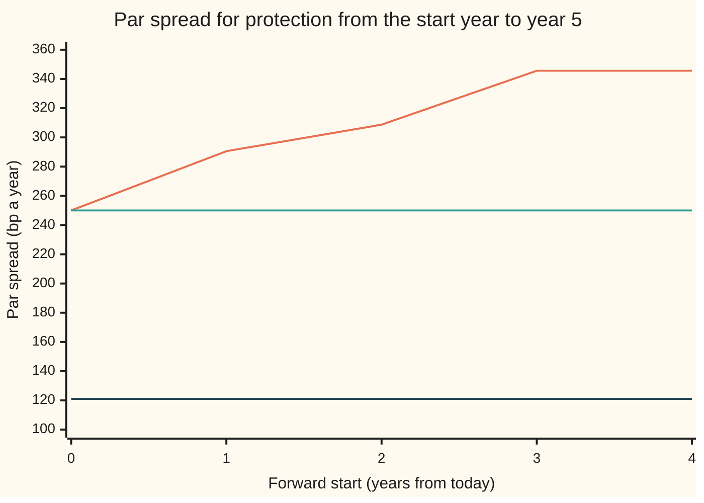
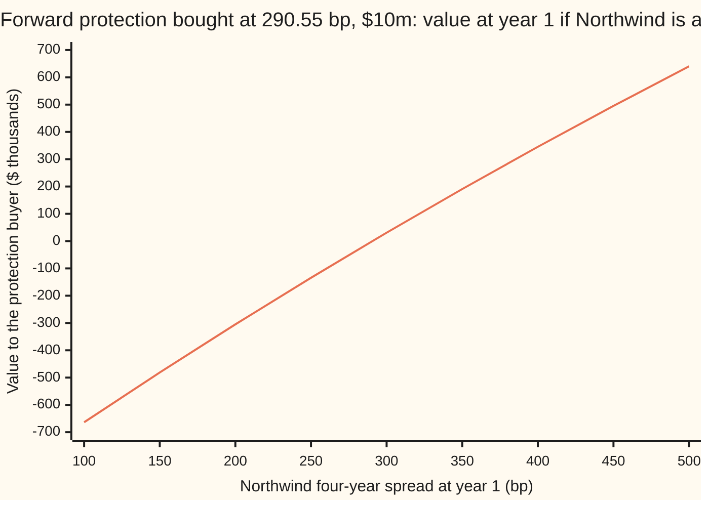

# The forward CDS: protection that starts later, its par spread from two annuities, and the knock-out if default comes early

Financial mathematics → Reduced-Form Models - Risky Bonds, Spreads and Random Hazards → Credit protection that starts later → The forward CDS

---

## General Overview

A lender to Northwind Lines, the shipping company this shelf follows, will take on $10 million of Northwind risk in one year's time and hold it for four years. It wants default insurance for exactly that window: from year 1 to year 5. It wants the price fixed today.

The insurance is a credit default swap, CDS for short: the buyer pays a yearly premium, in quarterly instalments, while Northwind survives, and the seller pays the lost 60% of face value if Northwind defaults, 40% being assumed recovered ([credit-default-swap-contract](../42-Credit%20Default%20Swaps%20-%20Pricing%2C%20the%20Par%20Spread%20and%20the%20Hazard%20Behind%20It/01-credit-default-swap-contract.md)). A CDS whose protection starts at a later date is a **forward CDS**. The screen quotes Northwind at 120 basis points a year for one year of protection, 200 for three years and 250 for five (a basis point, bp, is a hundredth of a percent). Nobody quotes the window from year 1 to year 5.

There is a way to build it. Buy five years of protection and sell one year of protection, both at the same premium. For the first year the two cancel: premiums in equal and opposite, payouts equal and opposite if Northwind defaults. After year 1 only the five-year contract is left. If Northwind defaults before year 1, both contracts pay and cancel, and the whole package is dead. That last feature is the **knock-out**: an early default cancels the forward contract with no payment either way.

The premium that makes the package worth nothing today is the **forward par spread**. For Northwind it is 290.55 bp, well above the five-year quote of 250. The reason is the curve's slope. The five-year quote averages a cheap first year at 120 bp with the four years after it. Remove the cheap year and the rest must cost more. On a flat curve there is nothing to remove, and the forward spread equals the **spot** spread, the quote for protection starting today: a flat 2% hazard gives 121.06 bp for five years and 121.06 bp for the forward.

**A forward CDS from one date to a later one is long protection to the later date and short protection to the earlier date at one premium; its fair premium is the forward protection divided by the forward annuity, which sits above the long spot spread when the curve rises, equals it when the curve is flat, and sits below it when the curve falls.**

**What kind of fact this is:** a theorem. The replication and the averaging identity are proved on this card in Why it works; the hazard curve they read is a model.

### The picture: forward spreads on the Northwind curve



Orange: the forward par spread on the bootstrapped Northwind curve, for protection starting at the year shown and ending at year 5. Start 0 is the spot five-year contract, 250 bp. Green: the spot five-year quote, for comparison. Dark blue: the same forward spreads on a flat 2% hazard, all 121.06 bp. The orange line climbs because each later start drops more of the cheap early years. It is level from start 3 to start 4 because the curve's last piece is flat from year 3 on.

---

## The formula

Notation first, in words. The forward window runs from $T_1$ to $T_2$, here year 1 to year 5. The spot par spreads to those dates are $s_1$ and $s_2$, decimals a year. For any tenor $T$, the risky annuity $A(T)$ is the value today of one dollar a year paid quarterly while Northwind survives, and the protection leg $P(T)$ is the value today of the payout per dollar covered ([cds-legs-risky-annuity-and-par-spread](../42-Credit%20Default%20Swaps%20-%20Pricing%2C%20the%20Par%20Spread%20and%20the%20Hazard%20Behind%20It/02-cds-legs-risky-annuity-and-par-spread.md)). A spot contract at its par spread has matching legs: $P(T) = s\,A(T)$.

The forward legs are the differences:

$$A_f = A(T_2) - A(T_1), \qquad P_f = P(T_2) - P(T_1).$$

A forward contract with premium $K$ on notional $N$ is worth, to the protection buyer,

$$V = N\Big[\big(P(T_2) - K\,A(T_2)\big) - \big(P(T_1) - K\,A(T_1)\big)\Big] = N\,\big(P_f - K\,A_f\big),$$

and the forward par spread $F$ is the premium that makes $V$ zero:

$$F = \frac{P_f}{A_f} = \frac{P(T_2) - P(T_1)}{A(T_2) - A(T_1)}.$$

**Read it aloud:** the forward spread is the protection that the window adds, divided by the premium-years that the window adds.

| Symbol | Plain meaning | In our example | Push it up and the answer… |
| --- | --- | --- | --- |
| $T_1$, $T_2$ | start and end of the forward window, years from today | 1 and 5 | later $T_1$ on a rising curve: $F$ rises or holds |
| $F$ | forward par spread, a decimal a year | 0.0290548 (290.55 bp) | — |
| $s_1$, $s_2$, $s$ | spot par spreads to $T_1$ and $T_2$; $s$ is a par spread at any tenor | 0.0120 and 0.0250 | $s_1$ up: $F$ down; $s_2$ up: $F$ up by more |
| $A(T)$, $T$ | risky annuity to tenor $T$: premium-years while alive, discounted | $A(1)$ = 0.957480, $A(5)$ = 4.027235 | — |
| $P(T)$ | protection leg to $T$: discounted expected payout per dollar | $P(1)$ = 0.011490, $P(5)$ = 0.100681 | — |
| $A_f$, $P_f$ | forward annuity and forward protection | 3.069756 and 0.089191 | — |
| $S(t)$, $\lambda(t)$, $\lambda$, $t$ | chance of no default by time $t$; the hazard (default rate among survivors, a year) in force at $t$, from the bootstrap; a flat hazard | $S(1)$ = 0.980369, $S(5)$ = 0.807041 | — |
| $D(t)$, $r$, $W$ | discount factor $e^{-rt}$; riskless rate; $W = D(T_1)\,S(T_1)$ | $r$ = 0.05, $D(1)$ = 0.951229, $W$ = 0.932556 | — |
| $R$, $L$ | recovery fraction; loss on default $L = 1 - R$ | 0.40 and 0.60 | $F$ barely moves: quotes already fix it |
| $t_j$ | quarterly premium dates, paid if Northwind is alive | 0.25, 0.50, …, 5.00 | — |
| $K$, $N$, $V$ | contract premium; notional; value to the protection buyer | 0.0250, $10 million, $124,472.36 | $K$ up: $V$ falls by $A_f\,N$ per unit |
| $\tau$ | the default date, a random time | — | — |

Two helper facts follow from matching legs, $P(T_1) = s_1 A(T_1)$ and $P(T_2) = s_2 A(T_2)$. Substituted into $F$, they give the **annuity-weighted identity**:

$$s_2\,A(T_2) = s_1\,A(T_1) + F\,A_f, \qquad\text{so}\qquad F = s_2 + (s_2 - s_1)\,\frac{A(T_1)}{A_f}.$$

In words: the long spot spread is an average of the short spot spread and the forward spread, each weighted by its premium-years.

And on a flat hazard $\lambda$ with flat rate $r$, write $k = r + \lambda$ for the combined decay rate of discounting and survival. Every tenor then has the same par spread,

$$s = \frac{L\,\lambda}{k}\cdot\frac{1 - e^{-k/4}}{0.25\,e^{-k/4}},$$

so the forward spread equals it too.

### When it holds

- **Both spot contracts on identical terms.** Same reference name, credit events, premium dates and settlement. The replication then holds default by default, whatever model is used. If the terms differ, the first year no longer cancels exactly.
- **A known curve to read the annuities from.** $V$ is exact given the two spot contracts' values. $F$ also needs $A_f$, which here comes from a deterministic hazard curve and riskless rate, taken as unrelated. If default and rates move together, the annuities need a joint model; the random-hazard view is [stochastic-hazard-cox-process](03-stochastic-hazard-cox-process.md).
- **The knock-out.** A default before $T_1$ cancels the contract. A forward that pays for early defaults too carries front-end protection, worth $P(T_1)\,N$ = $114,897.56 more for Northwind: a different product.
- **A price, not a forecast.** $F$ is the premium that is fair today. Northwind's four-year spread a year from now can land anywhere; what that uncertainty is worth is priced in [cds-option-and-implied-spread-volatility](05-cds-option-and-implied-spread-volatility.md).

**Conventions verified 2026-09-28:** standard CDS contracts trade with a fixed running coupon plus an upfront payment, and the ISDA CDS Standard Model (cdsmodel.com) converts between upfront and spread quotes. This card works in par spreads, with quarterly premiums paid at the end of each quarter survived and no premium accrued between the last payment and default, the conventions of the bootstrapping card. Accrual shifts the numbers slightly, not the method.

---

## Why it works

### Step 0: two spot contracts glued together are the forward, default by default

Take $N$ of five-year protection bought at $K$ and $N$ of one-year protection sold at $K$. Follow the cash in three kinds of future.

| Default date $\tau$ | Five-year bought | One-year sold | Package |
| --- | --- | --- | --- |
| before year 1 | pay $K$ until $\tau$; receive $L\,N$ | receive $K$ until $\tau$; pay $L\,N$ | nothing at all |
| between years 1 and 5 | pay $K$ until $\tau$; receive $L\,N$ | received $K$ for year 1 only | pay $K$ from year 1 to $\tau$; receive $L\,N$ |
| after year 5, or never | pay $K$ for five years | received $K$ for year 1 only | pay $K$ from year 1 to year 5 |

The last column is the forward contract, knock-out included. Two portfolios with the same cash flows in every future have the same value; otherwise buying the cheap one and selling the dear one locks in a profit with no risk. So the forward is worth the five-year contract minus the one-year contract. The argument uses no model at all. It is a **static replication**: set up once, never adjusted.

### Step 1: value the pieces, and the forward legs are differences

Each spot contract is worth its protection leg minus the premium times its annuity: $P(T) - K\,A(T)$ per dollar of notional. Subtract the one-year value from the five-year value and group terms: the protection parts give $P_f = P(5) - P(1)$, the premium parts give $K\,A_f$ with $A_f = A(5) - A(1)$. That is $V$ in The formula. Setting $V = 0$ gives $F = P_f / A_f$.

$A_f$ sums $0.25\,D(t_j)\,S(t_j)$ over the premium dates after year 1: the premium-years the window adds, discounted and weighted by survival. $P_f$ integrates $L\,\lambda(t)\,S(t)\,D(t)$ from year 1 to year 5: the payout for defaults inside the window. For Northwind these are 3.069756 and 0.089191, and $F$ = 290.55 bp.

### Step 2: the long spread is an average of the short spread and the forward spread

The quotes are par spreads, so $P(1) = s_1 A(1)$ and $P(5) = s_2 A(5)$. Put those into $P_f = F\,A_f$:

$$s_2\,A(5) = s_1\,A(1) + F\,\big(A(5) - A(1)\big).$$

Divide by $A(5)$. The left side is $s_2$. The right side is $s_1$ and $F$ with weights $A(1)/A(5)$ and $A_f/A(5)$, which are positive and add to one. So $s_2$ lies between $s_1$ and $F$. Three cases follow at once:

- **Rising curve**, $s_1 < s_2$: $F$ must lie above $s_2$ to pull the average up to it. Northwind: 290.55 against 250.
- **Flat curve**, $s_1 = s_2$: $F = s_2$.
- **Falling curve**, $s_1 > s_2$: $F$ lies below $s_2$.

Solving for $F$ gives $F = s_2 + (s_2 - s_1)\,A(1)/A_f$. For Northwind, $250 + 130 \times 0.311907$ = 290.55 bp. The weight 0.311907 is the one year's premium-years against the window's. This is the same algebra as the forward swap rate built from two par swap rates and their annuities ([par-swap-rate-and-annuity](../28-Swaps/02-par-swap-rate-and-annuity.md)), and as forward interest rates from spot rates ([spot-forward-and-par-rates](../02-Curves/01-spot-forward-and-par-rates.md)).

A rough reading: the credit triangle (spread ≈ loss × hazard, [the-credit-triangle](../42-Credit%20Default%20Swaps%20-%20Pricing%2C%20the%20Par%20Spread%20and%20the%20Hazard%20Behind%20It/03-the-credit-triangle.md)) applied to the window's average hazard, 0.048639, gives 0.60 × 0.048639 = 291.83 bp. The forward spread prices the window's own hazards, not the cheap first year.

### Step 3: on a flat hazard, every window has the same spread

With a flat hazard $\lambda$ and a flat rate $r$, the product $D(t)\,S(t)$ is $e^{-kt}$ with $k = r + \lambda$. Over any window that starts on a quarter date, both legs carry the same factor for where the window starts and the same factor for how long it runs (the Detailed proof writes both out). Both factors cancel in the ratio. What is left, the formula for $s$ above, involves neither the start nor the length. So $s_1 = s_2$, and Step 2 gives $F = s_2$. For a 2% hazard: 121.06 bp spot, 121.06 bp forward, 121.06 bp from the tenor-free formula.

The underlying fact is that a flat hazard has no memory. A name alive at year 1 faces the same future as a new name today: the window from year 1 to year 5 is a four-year spot contract, scaled down by the chance of reaching year 1 and the discount to it.

<details>
<summary>Detailed proof</summary>

Fix a flat hazard $\lambda \ge 0$ and rate $r \ge 0$, not both zero, and write $k = r + \lambda$ and $q = e^{-k/4}$. Premium dates are $t_j = j/4$. Take a window from $a = m/4$ to $b = a + n/4$ for whole numbers $m \ge 0$, $n \ge 1$.

Annuity: $A_f = \sum_{j=m+1}^{m+n} 0.25\,q^{j} = 0.25\,q^{m+1}\,\dfrac{1 - q^{n}}{1 - q}$.

Protection: $P_f = L\lambda\int_a^b e^{-kt}\,dt = \dfrac{L\lambda}{k}\,e^{-ka}\big(1 - e^{-k(b-a)}\big) = \dfrac{L\lambda}{k}\,q^{m}\,(1 - q^{n})$.

Divide: $F = \dfrac{L\lambda}{k}\cdot\dfrac{1 - q}{0.25\,q}$, free of the window's start and length. Spot contracts are the case $m = 0$, so every spot and every forward par spread is this one number.

</details>

### Step 4: the knock-out, and why it does not change the spread

Seen from year 1, a forward that has not knocked out is a plain four-year contract at premium $K$. Seen from today, its value is that year-1 value times $W = D(1)\,S(1)$ = 0.932556: discount to year 1, weighted by the 98.04% chance of getting there. The two legs, valued at year 1 given survival, are $A_f / W$ = 3.291765 and $P_f / W$ = 0.095642. The factor $W$ is common to both legs, so it cancels from their ratio: the spread is 290.55 bp whichever date the legs are valued at. It matters only when legs valued at different dates are mixed (The usual mistake).

The chance of a knock-out is $1 - S(1)$ = 0.0196.

A second route skips the formulas. A **Monte Carlo** run draws random default dates from the curve ([simulating-a-default-time](../41-Default%2C%20Survival%20and%20the%20Hazard%20Rate/05-simulating-a-default-time.md)), pay out and collect premiums path by path inside the window, cancel the paths that default early, and average. It lands on 290.46 bp with a standard error of 1.10 bp; 0.0195 of its paths knock out.

---

## Worked numbers, by hand

The curve comes from the bootstrapping card: hazards 1.98% for year 1, 4.04% for years 1 to 3, 5.68% after ([bootstrapping-the-hazard-curve-from-cds-quotes](../42-Credit%20Default%20Swaps%20-%20Pricing%2C%20the%20Par%20Spread%20and%20the%20Hazard%20Behind%20It/06-bootstrapping-the-hazard-curve-from-cds-quotes.md)).

| Step | Arithmetic | Value |
| --- | --- | --- |
| one-year legs | $A(1)$; $P(1) = 0.0120 \times 0.957480$ | 0.957480; 0.011490 |
| five-year legs | $A(5)$; $P(5) = 0.0250 \times 4.027235$ | 4.027235; 0.100681 |
| forward annuity | $4.027235 - 0.957480$ | $A_f$ = 3.069756 |
| forward protection | $0.100681 - 0.011490$ | $P_f$ = 0.089191 |
| forward spread | $0.089191 / 3.069756$ | **290.55 bp** |
| check by the identity | $250 + 130 \times 0.957480 / 3.069756 = 250 + 130 \times 0.311907$ | 290.55 bp |
| weight to year 1 | $D(1)\,S(1) = 0.951229 \times 0.980369$ | $W$ = 0.932556 |
| a forward bought at 250 bp, $10m | $(0.0290548 - 0.0250) \times 3.069756 \times 10{,}000{,}000$ | **$124,472.36** |
| flat 2% hazard, spot and forward | $P/A$ on both windows | **121.06 bp** each |

In the world: protection on Northwind from year 1 to year 5, arranged today, costs 290.55 bp a year. A forward bought at the five-year quote of 250 bp is a bargain worth $124,472.36 on $10 million.

That value has a second reading. At $K = s_2$ the five-year leg of the package is at par and worth nothing, so the forward is worth only the one-year leg: one year of protection sold at 250 bp in a 120 bp market, $(0.0250 - 0.0120) \times 0.957480 \times 10{,}000{,}000$ = $124,472.36.

### What breaks if you drop a piece

| Mistake | Comes out at | What went wrong |
| --- | --- | --- |
| forward taken as the spot five-year quote | 250.00 bp; a forward at 250 read as worth $0.00, not $124,472.36 | the five-year quote includes the cheap first year the forward leaves out |
| time weights instead of annuity weights, $(5 \times 250 - 1 \times 120)/4$ | 282.50 bp | a year of premium is not worth one unit: discounting and survival shrink later years |
| forward protection over the full five-year annuity | 221.47 bp | the denominator counts first-year premiums the forward never collects |
| today's protection over the annuity valued at year 1 if alive | 270.95 bp | legs valued at different dates: the factor $W$ = 0.932556 no longer cancels |

---

## Code, from first principles, and it actually runs

Both programs rebuild the Northwind curve by bisection (halving an interval until each quote is matched), then reach the forward spread by four independent roads. Road 1 subtracts closed-form spot legs. Road 2 prices the window directly, integrating its protection by Simpson's rule (fitting parabolas through the integrand) and summing its own premium dates. Road 3 uses only the quotes and the annuities, through the averaging identity. Road 4 draws 400,000 default dates with a hand-written random number generator, cancels those before year 1, and averages the legs. Then the flat case, the contract value, the risk table, the chart points and the what-breaks numbers.

### Python

```python
# Forward CDS on Northwind: protection from year 1 to year 5, knocked out by an earlier default.
# Quarterly premiums paid while alive, protection paid at the default date. Standard library only.
from math import exp, log, sqrt
RATE, DT, NOTIONAL = 0.05, 0.25, 10_000_000.0          # riskless rate, premium period, dollars
QUOTES = [(1.0, 0.0120), (3.0, 0.0200), (5.0, 0.0250)]  # (tenor, par spread) for Northwind
T1, T2, K = 1.0, 5.0, 0.0250                            # forward window; contract spread 250 bp

def surv(t, c):                                         # S(t) = exp(-area under the step hazard)
    return exp(-sum(h * max(min(t, b) - a, 0.0) for a, b, h in c))

def ann(a, b, c):                                       # premium-years paid on dates in (a, b]
    return sum(DT * exp(-RATE * j * DT) * surv(j * DT, c) for j in range(round(a / DT) + 1, round(b / DT) + 1))

def prot(a, b, c, loss):                                # protection for defaults in (a, b], closed form per piece
    tot = 0.0
    for p, q, h in c:
        u0, u1 = max(a, p), min(b, q)
        if u1 > u0:
            k = RATE + h
            tot += loss * exp(-RATE * u0) * surv(u0, c) * h / k * (1.0 - exp(-k * (u1 - u0)))
    return tot

def prot_simpson(a, b, c, loss, n=2000):                # road 2: integrate L lambda S D, one piece at a time
    tot = 0.0
    for p, q, h in c:
        u0, u1 = max(a, p), min(b, q)
        if u1 <= u0: continue
        w = (u1 - u0) / n
        f = lambda t: loss * h * surv(t, c) * exp(-RATE * t)
        tot += w / 3 * (f(u0) + f(u1) + sum((4 if i % 2 else 2) * f(u0 + i * w) for i in range(1, n)))
    return tot

def boot(quotes, loss):                                 # one flat piece per quote, bisection, earlier pieces frozen
    c, start = [], 0.0
    for T, s in quotes:
        lo, hi = 0.0, 5.0
        for _ in range(200):
            m = 0.5 * (lo + hi); trial = c + [(start, 1e9, m)]
            if prot(0.0, T, trial, loss) > s * ann(0.0, T, trial): hi = m
            else: lo = m
        c.append((start, T, 0.5 * (lo + hi))); start = T
    c[-1] = (c[-1][0], 1e9, c[-1][2])                   # last piece carried on
    return c

def fwd(a, b, c, loss):                                 # forward par spread = forward protection / forward annuity
    return (prot(0.0, b, c, loss) - prot(0.0, a, c, loss)) / (ann(0.0, b, c) - ann(0.0, a, c))

def fwd_value(c, loss, k):                              # long T2 protection minus long T1 protection, both at k
    return ((prot(0.0, T2, c, loss) - k * ann(0.0, T2, c)) - (prot(0.0, T1, c, loss) - k * ann(0.0, T1, c))) * NOTIONAL

L = 0.60
cv = boot(QUOTES, L)
A1, A2, P1, P2 = ann(0, T1, cv), ann(0, T2, cv), prot(0, T1, cv, L), prot(0, T2, cv, L)
Af, Pf = A2 - A1, P2 - P1
F1 = Pf / Af
print("Northwind: r 0.05, recovery 0.40, quarterly premiums, quotes 120/200/250 bp; forward window 1y to 5y")
print(f"curve: hazards {cv[0][2]:.6f} {cv[1][2]:.6f} {cv[2][2]:.6f}  S(1) {surv(1, cv):.6f}  S(5) {surv(5, cv):.6f}")
print(f"spot legs: A(1) {A1:.6f}  P(1) {P1:.6f}  A(5) {A2:.6f}  P(5) {P2:.6f}")
print(f"road 1, legs subtracted: forward annuity {Af:.6f}  forward protection {Pf:.6f}  forward spread {F1 * 1e4:.4f} bp")
Pf2 = prot_simpson(T1, T2, cv, L)
F2 = Pf2 / ann(T1, T2, cv)
print(f"road 2, window priced directly (Simpson): forward protection {Pf2:.6f}  forward spread {F2 * 1e4:.4f} bp")
s1, s2 = QUOTES[0][1], QUOTES[2][1]
F3 = s2 + (s2 - s1) * A1 / Af
print(f"road 3, annuity-weighted quotes: 250 + 130 x {A1 / Af:.6f} = {F3 * 1e4:.4f} bp")
# road 4: Monte Carlo default dates; a default before year 1 cancels the forward (both legs zero)
x = 20260928
def unif():
    global x
    x = (6364136223846793005 * x + 1442695040888963407) % 2**64
    return ((x >> 11) + 0.5) / 2**53
paths, sp, sa, spp, saa, spa, early = 400_000, 0.0, 0.0, 0.0, 0.0, 0.0, 0
for _ in range(paths):
    e, tau = -log(unif()), 1e9                          # exponential draw; tau where the hazard area reaches e
    for a, b, h in cv:
        if e <= h * (b - a): tau = a + e / h; break
        e -= h * (b - a)
    if tau <= T1: early += 1; continue
    pr = L * exp(-RATE * tau) if tau <= T2 else 0.0
    an = sum(DT * exp(-RATE * j * DT) for j in range(5, 21) if j * DT < tau)
    sp += pr; sa += an; spp += pr * pr; saa += an * an; spa += pr * an
mp, ma = sp / paths, sa / paths
F4 = mp / ma
var = (spp / paths - mp * mp) - 2 * F4 * (spa / paths - mp * ma) + F4 * F4 * (saa / paths - ma * ma)
se = sqrt(var / paths) / ma
print(f"road 4, Monte Carlo {paths} default dates: forward spread {F4 * 1e4:.2f} bp (standard error {se * 1e4:.2f})  knocked out {early / paths:.4f}")
print(f"  chance of default before year 1, 1 - S(1) = {1 - surv(1, cv):.4f}")
W = exp(-RATE * T1) * surv(T1, cv)
print(f"knock-out: D(1) {exp(-RATE * T1):.6f}  weight D(1)S(1) {W:.6f}  annuity at year 1 if alive {Af / W:.6f}  protection {Pf / W:.6f}  spread {Pf / Af * 1e4:.4f} bp")
print(f"triangle on the window's average hazard: 0.60 x {(2 * cv[1][2] + 2 * cv[2][2]) / 4:.6f} = {L * (2 * cv[1][2] + 2 * cv[2][2]) / 4 * 1e4:.2f} bp")
flat = [(0.0, 1e9, 0.02)]
fs, ff = prot(0, 5, flat, L) / ann(0, 5, flat), fwd(1, 5, flat, L)
kf = RATE + 0.02
fc = L * 0.02 / kf * (1 - exp(-kf * DT)) / (DT * exp(-kf * DT))
print(f"flat 2% hazard: spot 5y {fs * 1e4:.4f} bp  forward 1y-5y {ff * 1e4:.4f} bp  tenor-free formula {fc * 1e4:.4f} bp")
V = fwd_value(cv, L, K)
print(f"forward protection bought at 250 bp on $10m: value ${V:.2f}  = (F - K) x A_f x N ${(F1 - K) * Af * NOTIONAL:.2f}")
print(f"  front-end protection P(1) x N, what a no-knock-out contract adds: ${P1 * NOTIONAL:.2f}")
print("risk, forward bought at 250 bp on $10m, each quote bumped 1 bp and the curve rebuilt")
bumps = {"1y": [1, 0, 0], "3y": [0, 1, 0], "5y": [0, 0, 1], "all": [1, 1, 1]}
for name, bmp in bumps.items():
    cb = boot([(T, s + 1e-4 * d) for (T, s), d in zip(QUOTES, bmp)], L)
    print(f"  {name:>3} quote +1 bp: forward spread {(fwd(T1, T2, cb, L) - F1) * 1e4:+.4f} bp  value ${round(fwd_value(cb, L, K) - V, 2) + 0.0:+.2f}")
print(f"  annuity rule A_f x 1 bp x N: ${Af * 1e-4 * NOTIONAL:.2f}; default before year 1: value ${-V:+.2f}")
print("what breaks")
print(f"  forward taken as the spot 5y quote: {s2 * 1e4:.2f} bp; value at 250 bp read as $0.00")
print(f"  time weights instead of annuity weights: (5 x 250 - 1 x 120) / 4 = {(5 * s2 - s1) / 4 * 1e4:.2f} bp")
print(f"  forward protection over the full A(5): {Pf / A2 * 1e4:.2f} bp")
print(f"  today's protection over the year-1 annuity: {Pf / (Af / W) * 1e4:.2f} bp")
print("try")
ci = boot([(1.0, 0.0300), (3.0, 0.0250), (5.0, 0.0200)], L)
print(f"  inverted quotes 300/250/200: forward 1y-5y {fwd(T1, T2, ci, L) * 1e4:.2f} bp")
c8 = boot(QUOTES, 0.80)
print(f"  recovery 20%, same quotes: forward 1y-5y {fwd(T1, T2, c8, 0.80) * 1e4:.2f} bp")
starts = [0, 1, 2, 3, 4]
print("chart, forward start (years) " + " ".join(f"{t:7d}" for t in starts))
print("chart, forward to 5y (bp)    " + " ".join(f"{fwd(t, 5, cv, L) * 1e4:7.2f}" for t in starts))
print("chart, flat 2% forward (bp)  " + " ".join(f"{fwd(t, 5, flat, L) * 1e4:7.2f}" for t in starts))
spreads = [100, 150, 200, 250, 300, 350, 400, 450, 500]
vals = []
for sp_bp in spreads:                                   # year-1 value if alive: flat curve fitted to a 4y quote
    lo, hi = 0.0, 1.0
    for _ in range(100):
        m = 0.5 * (lo + hi); cm = [(0.0, 1e9, m)]
        if prot(0, 4, cm, L) > sp_bp * 1e-4 * ann(0, 4, cm): hi = m
        else: lo = m
    cm = [(0.0, 1e9, 0.5 * (lo + hi))]
    vals.append((sp_bp * 1e-4 - F1) * ann(0, 4, cm) * NOTIONAL / 1000)
print("chart, 4y spread at year 1   " + " ".join(f"{s:7d}" for s in spreads))
print("chart, value at year 1 ($k)  " + " ".join(f"{v:7.2f}" for v in vals))
assert abs(F2 - F1) < 1e-9, "direct Simpson forward must match the subtracted legs"
assert abs(F3 - F1) < 1e-9, "annuity-weighted quotes must match the forward legs"
assert abs(F4 - F1) < 4 * se, "Monte Carlo with knock-out within four standard errors"
assert abs(V - (K - s1) * A1 * NOTIONAL) < 1e-4, "at K = s2 the forward is worth the one-year leg alone"
assert abs(ff - fc) < 1e-12 and abs(fs - fc) < 1e-12, "flat curve: forward and spot equal the tenor-free formula"
assert F1 > s2 and fwd(T1, T2, ci, L) < QUOTES[2][1] - 0.0050, "rising curve lifts the forward, falling lowers it"
print("ALL CHECKS PASS")
```

**Ran 2026-09-28 on macOS, Python 3.14.6, standard library only. All checks passed. Output, pasted from the run:**

```
Northwind: r 0.05, recovery 0.40, quarterly premiums, quotes 120/200/250 bp; forward window 1y to 5y
curve: hazards 0.019826 0.040440 0.056837  S(1) 0.980369  S(5) 0.807041
spot legs: A(1) 0.957480  P(1) 0.011490  A(5) 4.027235  P(5) 0.100681
road 1, legs subtracted: forward annuity 3.069756  forward protection 0.089191  forward spread 290.5480 bp
road 2, window priced directly (Simpson): forward protection 0.089191  forward spread 290.5480 bp
road 3, annuity-weighted quotes: 250 + 130 x 0.311907 = 290.5480 bp
road 4, Monte Carlo 400000 default dates: forward spread 290.46 bp (standard error 1.10)  knocked out 0.0195
  chance of default before year 1, 1 - S(1) = 0.0196
knock-out: D(1) 0.951229  weight D(1)S(1) 0.932556  annuity at year 1 if alive 3.291765  protection 0.095642  spread 290.5480 bp
triangle on the window's average hazard: 0.60 x 0.048639 = 291.83 bp
flat 2% hazard: spot 5y 121.0562 bp  forward 1y-5y 121.0562 bp  tenor-free formula 121.0562 bp
forward protection bought at 250 bp on $10m: value $124472.36  = (F - K) x A_f x N $124472.36
  front-end protection P(1) x N, what a no-knock-out contract adds: $114897.56
risk, forward bought at 250 bp on $10m, each quote bumped 1 bp and the curve rebuilt
   1y quote +1 bp: forward spread -0.3151 bp  value $-970.09
   3y quote +1 bp: forward spread +0.0096 bp  value $+0.00
   5y quote +1 bp: forward spread +1.3216 bp  value $+4026.51
  all quote +1 bp: forward spread +1.0160 bp  value $+3055.52
  annuity rule A_f x 1 bp x N: $3069.76; default before year 1: value $-124472.36
what breaks
  forward taken as the spot 5y quote: 250.00 bp; value at 250 bp read as $0.00
  time weights instead of annuity weights: (5 x 250 - 1 x 120) / 4 = 282.50 bp
  forward protection over the full A(5): 221.47 bp
  today's protection over the year-1 annuity: 270.95 bp
try
  inverted quotes 300/250/200: forward 1y-5y 169.25 bp
  recovery 20%, same quotes: forward 1y-5y 289.57 bp
chart, forward start (years)       0       1       2       3       4
chart, forward to 5y (bp)     250.00  290.55  308.73  345.62  345.62
chart, flat 2% forward (bp)   121.06  121.06  121.06  121.06  121.06
chart, 4y spread at year 1       100     150     200     250     300     350     400     450     500
chart, value at year 1 ($k)  -663.66 -481.39 -305.02 -134.36   30.81  190.68  345.43  495.23  640.28
ALL CHECKS PASS
```

Four roads, one spread. Roads 1 to 3 agree to every printed digit; the simulation lands within one standard error.

### Rust

Same inputs, same rows, same random numbers. No crates.

```rust
// Forward CDS on Northwind: protection from year 1 to year 5, knocked out by an earlier default.
// Quarterly premiums paid while alive, protection paid at the default date. Rust std only.
const RATE: f64 = 0.05; // riskless rate
const DT: f64 = 0.25; // premium period
const NOTIONAL: f64 = 10_000_000.0;
const QUOTES: [(f64, f64); 3] = [(1.0, 0.0120), (3.0, 0.0200), (5.0, 0.0250)];
const T1: f64 = 1.0;
const T2: f64 = 5.0;
const K: f64 = 0.0250; // contract spread 250 bp
type Curve = Vec<(f64, f64, f64)>; // (start, end, flat hazard)

fn surv(t: f64, c: &Curve) -> f64 { // S(t) = exp(-area under the step hazard)
    (-c.iter().map(|&(a, b, h)| h * (t.min(b) - a).max(0.0)).sum::<f64>()).exp()
}
fn ann(a: f64, b: f64, c: &Curve) -> f64 { // premium-years paid on dates in (a, b]
    let (j0, j1) = ((a / DT).round() as i64 + 1, (b / DT).round() as i64);
    (j0..=j1).map(|j| { let t = j as f64 * DT; DT * (-RATE * t).exp() * surv(t, c) }).sum()
}
fn prot(a: f64, b: f64, c: &Curve, loss: f64) -> f64 { // closed form per piece
    let mut tot = 0.0;
    for &(p, q, h) in c {
        let (u0, u1) = (a.max(p), b.min(q));
        if u1 > u0 {
            let k = RATE + h;
            tot += loss * (-RATE * u0).exp() * surv(u0, c) * h / k * (1.0 - (-k * (u1 - u0)).exp());
        }
    }
    tot
}
fn prot_simpson(a: f64, b: f64, c: &Curve, loss: f64, n: usize) -> f64 { // road 2
    let mut tot = 0.0;
    for &(p, q, h) in c {
        let (u0, u1) = (a.max(p), b.min(q));
        if u1 <= u0 { continue; }
        let w = (u1 - u0) / n as f64;
        let f = |t: f64| loss * h * surv(t, c) * (-RATE * t).exp();
        let mut s = f(u0) + f(u1);
        for i in 1..n { s += (if i % 2 == 1 { 4.0 } else { 2.0 }) * f(u0 + i as f64 * w); }
        tot += w / 3.0 * s;
    }
    tot
}
fn boot(quotes: &[(f64, f64)], loss: f64) -> Curve { // one flat piece per quote, bisection
    let (mut c, mut start): (Curve, f64) = (Vec::new(), 0.0);
    for &(t, s) in quotes {
        let (mut lo, mut hi) = (0.0, 5.0);
        for _ in 0..200 {
            let m = 0.5 * (lo + hi);
            let mut trial = c.clone(); trial.push((start, 1e9, m));
            if prot(0.0, t, &trial, loss) > s * ann(0.0, t, &trial) { hi = m } else { lo = m }
        }
        c.push((start, t, 0.5 * (lo + hi))); start = t;
    }
    let last = c.len() - 1; c[last].1 = 1e9; // last piece carried on
    c
}
fn fwd(a: f64, b: f64, c: &Curve, loss: f64) -> f64 {
    (prot(0.0, b, c, loss) - prot(0.0, a, c, loss)) / (ann(0.0, b, c) - ann(0.0, a, c))
}
fn fwd_value(c: &Curve, loss: f64, k: f64) -> f64 { // long T2 protection minus long T1 protection
    ((prot(0.0, T2, c, loss) - k * ann(0.0, T2, c)) - (prot(0.0, T1, c, loss) - k * ann(0.0, T1, c))) * NOTIONAL
}
struct Lcg(u64);
impl Lcg {
    fn unif(&mut self) -> f64 {
        self.0 = self.0.wrapping_mul(6364136223846793005).wrapping_add(1442695040888963407);
        ((self.0 >> 11) as f64 + 0.5) / 9007199254740992.0
    }
}
fn main() {
    let l = 0.60;
    let cv = boot(&QUOTES, l);
    let (a1, a2, p1, p2) = (ann(0.0, T1, &cv), ann(0.0, T2, &cv), prot(0.0, T1, &cv, l), prot(0.0, T2, &cv, l));
    let (af, pf) = (a2 - a1, p2 - p1);
    let f1 = pf / af;
    println!("Northwind: r 0.05, recovery 0.40, quarterly premiums, quotes 120/200/250 bp; forward window 1y to 5y");
    println!("curve: hazards {:.6} {:.6} {:.6}  S(1) {:.6}  S(5) {:.6}", cv[0].2, cv[1].2, cv[2].2, surv(1.0, &cv), surv(5.0, &cv));
    println!("spot legs: A(1) {:.6}  P(1) {:.6}  A(5) {:.6}  P(5) {:.6}", a1, p1, a2, p2);
    println!("road 1, legs subtracted: forward annuity {:.6}  forward protection {:.6}  forward spread {:.4} bp", af, pf, f1 * 1e4);
    let pf2 = prot_simpson(T1, T2, &cv, l, 2000);
    let f2 = pf2 / ann(T1, T2, &cv);
    println!("road 2, window priced directly (Simpson): forward protection {:.6}  forward spread {:.4} bp", pf2, f2 * 1e4);
    let (s1, s2) = (QUOTES[0].1, QUOTES[2].1);
    let f3 = s2 + (s2 - s1) * a1 / af;
    println!("road 3, annuity-weighted quotes: 250 + 130 x {:.6} = {:.4} bp", a1 / af, f3 * 1e4);
    // road 4: Monte Carlo default dates; a default before year 1 cancels the forward (both legs zero)
    let mut rng = Lcg(20260928);
    let paths = 400_000usize;
    let (mut sp, mut sa, mut spp, mut saa, mut spa, mut early) = (0.0, 0.0, 0.0, 0.0, 0.0, 0usize);
    for _ in 0..paths {
        let (mut e, mut tau) = (-rng.unif().ln(), 1e9);
        for &(a, b, h) in &cv {
            if e <= h * (b - a) { tau = a + e / h; break; }
            e -= h * (b - a);
        }
        if tau <= T1 { early += 1; continue; }
        let pr = if tau <= T2 { l * (-RATE * tau).exp() } else { 0.0 };
        let an: f64 = (5..21).filter(|&j| j as f64 * DT < tau).map(|j| DT * (-RATE * j as f64 * DT).exp()).sum();
        sp += pr; sa += an; spp += pr * pr; saa += an * an; spa += pr * an;
    }
    let n = paths as f64;
    let (mp, ma) = (sp / n, sa / n);
    let f4 = mp / ma;
    let var = (spp / n - mp * mp) - 2.0 * f4 * (spa / n - mp * ma) + f4 * f4 * (saa / n - ma * ma);
    let se = (var / n).sqrt() / ma;
    println!("road 4, Monte Carlo {} default dates: forward spread {:.2} bp (standard error {:.2})  knocked out {:.4}", paths, f4 * 1e4, se * 1e4, early as f64 / n);
    println!("  chance of default before year 1, 1 - S(1) = {:.4}", 1.0 - surv(1.0, &cv));
    let w = (-RATE * T1).exp() * surv(T1, &cv);
    println!("knock-out: D(1) {:.6}  weight D(1)S(1) {:.6}  annuity at year 1 if alive {:.6}  protection {:.6}  spread {:.4} bp", (-RATE * T1).exp(), w, af / w, pf / w, pf / af * 1e4);
    let avg = (2.0 * cv[1].2 + 2.0 * cv[2].2) / 4.0;
    println!("triangle on the window's average hazard: 0.60 x {:.6} = {:.2} bp", avg, l * avg * 1e4);
    let flat: Curve = vec![(0.0, 1e9, 0.02)];
    let (fs, ff) = (prot(0.0, 5.0, &flat, l) / ann(0.0, 5.0, &flat), fwd(1.0, 5.0, &flat, l));
    let kf = RATE + 0.02;
    let fc = l * 0.02 / kf * (1.0 - (-kf * DT).exp()) / (DT * (-kf * DT).exp());
    println!("flat 2% hazard: spot 5y {:.4} bp  forward 1y-5y {:.4} bp  tenor-free formula {:.4} bp", fs * 1e4, ff * 1e4, fc * 1e4);
    let v = fwd_value(&cv, l, K);
    println!("forward protection bought at 250 bp on $10m: value ${:.2}  = (F - K) x A_f x N ${:.2}", v, (f1 - K) * af * NOTIONAL);
    println!("  front-end protection P(1) x N, what a no-knock-out contract adds: ${:.2}", p1 * NOTIONAL);
    println!("risk, forward bought at 250 bp on $10m, each quote bumped 1 bp and the curve rebuilt");
    for (name, bmp) in [("1y", [1.0, 0.0, 0.0]), ("3y", [0.0, 1.0, 0.0]), ("5y", [0.0, 0.0, 1.0]), ("all", [1.0, 1.0, 1.0])] {
        let q: Vec<(f64, f64)> = QUOTES.iter().zip(bmp.iter()).map(|(&(t, s), d)| (t, s + 1e-4 * d)).collect();
        let cb = boot(&q, l);
        let dv = ((fwd_value(&cb, l, K) - v) * 100.0).round() / 100.0 + 0.0;
        println!("  {:>3} quote +1 bp: forward spread {:+.4} bp  value ${:+.2}", name, (fwd(T1, T2, &cb, l) - f1) * 1e4, dv);
    }
    println!("  annuity rule A_f x 1 bp x N: ${:.2}; default before year 1: value ${:+.2}", af * 1e-4 * NOTIONAL, -v);
    println!("what breaks");
    println!("  forward taken as the spot 5y quote: {:.2} bp; value at 250 bp read as $0.00", s2 * 1e4);
    println!("  time weights instead of annuity weights: (5 x 250 - 1 x 120) / 4 = {:.2} bp", (5.0 * s2 - s1) / 4.0 * 1e4);
    println!("  forward protection over the full A(5): {:.2} bp", pf / a2 * 1e4);
    println!("  today's protection over the year-1 annuity: {:.2} bp", pf / (af / w) * 1e4);
    println!("try");
    let ci = boot(&[(1.0, 0.0300), (3.0, 0.0250), (5.0, 0.0200)], l);
    println!("  inverted quotes 300/250/200: forward 1y-5y {:.2} bp", fwd(T1, T2, &ci, l) * 1e4);
    let c8 = boot(&QUOTES, 0.80);
    println!("  recovery 20%, same quotes: forward 1y-5y {:.2} bp", fwd(T1, T2, &c8, 0.80) * 1e4);
    let starts = [0.0, 1.0, 2.0, 3.0, 4.0];
    println!("chart, forward start (years) {}", starts.iter().map(|t| format!("{:7}", *t as i64)).collect::<Vec<_>>().join(" "));
    println!("chart, forward to 5y (bp)    {}", starts.iter().map(|&t| format!("{:7.2}", fwd(t, 5.0, &cv, l) * 1e4)).collect::<Vec<_>>().join(" "));
    println!("chart, flat 2% forward (bp)  {}", starts.iter().map(|&t| format!("{:7.2}", fwd(t, 5.0, &flat, l) * 1e4)).collect::<Vec<_>>().join(" "));
    let spreads = [100, 150, 200, 250, 300, 350, 400, 450, 500];
    let mut vals = Vec::new();
    for &sb in &spreads { // year-1 value if alive: flat curve fitted to a 4y quote
        let (mut lo, mut hi) = (0.0, 1.0);
        for _ in 0..100 {
            let m = 0.5 * (lo + hi);
            let cm: Curve = vec![(0.0, 1e9, m)];
            if prot(0.0, 4.0, &cm, l) > sb as f64 * 1e-4 * ann(0.0, 4.0, &cm) { hi = m } else { lo = m }
        }
        let cm: Curve = vec![(0.0, 1e9, 0.5 * (lo + hi))];
        vals.push((sb as f64 * 1e-4 - f1) * ann(0.0, 4.0, &cm) * NOTIONAL / 1000.0);
    }
    println!("chart, 4y spread at year 1   {}", spreads.iter().map(|s| format!("{:7}", s)).collect::<Vec<_>>().join(" "));
    println!("chart, value at year 1 ($k)  {}", vals.iter().map(|v| format!("{:7.2}", v)).collect::<Vec<_>>().join(" "));
    assert!((f2 - f1).abs() < 1e-9, "direct Simpson forward must match the subtracted legs");
    assert!((f3 - f1).abs() < 1e-9, "annuity-weighted quotes must match the forward legs");
    assert!((f4 - f1).abs() < 4.0 * se, "Monte Carlo with knock-out within four standard errors");
    assert!((v - (K - s1) * a1 * NOTIONAL).abs() < 1e-4, "at K = s2 the forward is worth the one-year leg alone");
    assert!((ff - fc).abs() < 1e-12 && (fs - fc).abs() < 1e-12, "flat curve: forward and spot equal the tenor-free formula");
    assert!(f1 > s2 && fwd(T1, T2, &ci, l) < QUOTES[2].1 - 0.0050, "rising curve lifts the forward, falling lowers it");
    println!("ALL CHECKS PASS");
}
```

**Ran 2026-09-28 on macOS, rustc 1.98.1, no crates. All checks passed. Output, pasted from the run:**

```
Northwind: r 0.05, recovery 0.40, quarterly premiums, quotes 120/200/250 bp; forward window 1y to 5y
curve: hazards 0.019826 0.040440 0.056837  S(1) 0.980369  S(5) 0.807041
spot legs: A(1) 0.957480  P(1) 0.011490  A(5) 4.027235  P(5) 0.100681
road 1, legs subtracted: forward annuity 3.069756  forward protection 0.089191  forward spread 290.5480 bp
road 2, window priced directly (Simpson): forward protection 0.089191  forward spread 290.5480 bp
road 3, annuity-weighted quotes: 250 + 130 x 0.311907 = 290.5480 bp
road 4, Monte Carlo 400000 default dates: forward spread 290.46 bp (standard error 1.10)  knocked out 0.0195
  chance of default before year 1, 1 - S(1) = 0.0196
knock-out: D(1) 0.951229  weight D(1)S(1) 0.932556  annuity at year 1 if alive 3.291765  protection 0.095642  spread 290.5480 bp
triangle on the window's average hazard: 0.60 x 0.048639 = 291.83 bp
flat 2% hazard: spot 5y 121.0562 bp  forward 1y-5y 121.0562 bp  tenor-free formula 121.0562 bp
forward protection bought at 250 bp on $10m: value $124472.36  = (F - K) x A_f x N $124472.36
  front-end protection P(1) x N, what a no-knock-out contract adds: $114897.56
risk, forward bought at 250 bp on $10m, each quote bumped 1 bp and the curve rebuilt
   1y quote +1 bp: forward spread -0.3151 bp  value $-970.09
   3y quote +1 bp: forward spread +0.0096 bp  value $+0.00
   5y quote +1 bp: forward spread +1.3216 bp  value $+4026.51
  all quote +1 bp: forward spread +1.0160 bp  value $+3055.52
  annuity rule A_f x 1 bp x N: $3069.76; default before year 1: value $-124472.36
what breaks
  forward taken as the spot 5y quote: 250.00 bp; value at 250 bp read as $0.00
  time weights instead of annuity weights: (5 x 250 - 1 x 120) / 4 = 282.50 bp
  forward protection over the full A(5): 221.47 bp
  today's protection over the year-1 annuity: 270.95 bp
try
  inverted quotes 300/250/200: forward 1y-5y 169.25 bp
  recovery 20%, same quotes: forward 1y-5y 289.57 bp
chart, forward start (years)       0       1       2       3       4
chart, forward to 5y (bp)     250.00  290.55  308.73  345.62  345.62
chart, flat 2% forward (bp)   121.06  121.06  121.06  121.06  121.06
chart, 4y spread at year 1       100     150     200     250     300     350     400     450     500
chart, value at year 1 ($k)  -663.66 -481.39 -305.02 -134.36   30.81  190.68  345.43  495.23  640.28
ALL CHECKS PASS
```

The two outputs are identical line for line.

### The payoff: what the forward is worth at year 1

At year 1 a live forward becomes a plain four-year contract, worth whatever Northwind's four-year spread that day makes it. The chart takes the forward bought at the par forward spread, 290.55 bp, on $10 million, and values it at year 1 against a flat curve fitted to each possible four-year spread.



The line crosses zero at 290.55 bp. It bends gently: each basis point is worth the four-year annuity on that day, and wider spreads shrink the annuity. If Northwind defaults before year 1, the value is zero wherever the spread was: the knock-out. The buyer gains when spreads widen.

### Risk: how the value moves with each quote

For the forward bought at 250 bp on $10 million, each quote is bumped by 1 bp and the curve rebuilt.

| Bump | Forward spread moves | Value moves | Why |
| --- | --- | --- | --- |
| one-year quote +1 bp | −0.3151 bp | −$970.09 | a dearer first year leaves less for the window |
| three-year quote +1 bp | +0.0096 bp | $0.00 | at $K = s_2$ the value is the one-year leg alone (Worked numbers) |
| five-year quote +1 bp | +1.3216 bp | +$4,026.51 | the long quote carries the window |
| all three +1 bp | +1.0160 bp | +$3,055.52 | close to the annuity rule, $A_f \times$ 1 bp $\times N$ = $3,069.76 |
| default now, before year 1 | — | −$124,472.36 | knock-out: the contract, and its value, vanish |

> [!TIP]
> **Try changing**
> - **Invert the quotes.** Guess first: with 300, 250 and 200 bp at one, three and five years, is the forward from year 1 to year 5 above or below 200? Answer: below, at 169.25 bp. The curve falls, so removing the dear first year leaves a cheaper window.
> - **Recovery 20% instead of 40%, same quotes.** Guess first: a big move or a small one? Answer: 289.57 bp against 290.55. The quotes already fix both spot spreads; recovery enters only through the annuities.
> - **Start the forward at year 4 instead of year 3.** Guess first: dearer, since it drops more early years? Answer: the same, 345.62 bp. The curve's last piece is flat from year 3, and a flat piece has no memory.

---

## The usual mistake

> [!warning]
> **Treating the forward as ordinary protection that happens to start later, and forgetting what an early default does.** A forward CDS pays nothing for a default before its start date, and an early default wipes out the contract's value: $124,472.36 today for the Northwind forward bought at 250 bp. A lender whose exposure starts at year 1 is fine with that. A holder who already owns Northwind debt today is not, and needs spot protection for the first year as well: that front-end cover is worth $114,897.56 on $10 million.
>
> - **Forward spread = spot five-year spread.** That is 250.00 bp instead of 290.55, true only on a flat curve.
> - **Weighting the two quotes by years.** $(5 \times 250 - 120)/4$ = 282.50 bp. The weights are annuities, not years.
> - **Dividing the forward protection by the full five-year annuity.** 221.47 bp. The first year's premiums belong to the one-year contract.
> - **Mixing value dates.** Today's forward protection over the annuity valued at year 1 given survival gives 270.95 bp. Keep both legs on the same date and $W$ cancels.

---

## Where you meet it in real life

- **Options on a CDS.** A payer option gives the right to buy protection at a fixed spread over a future window: an option on a forward CDS. Its price starts from $F$ and $A_f$, the two numbers on this card ([cds-option-and-implied-spread-volatility](05-cds-option-and-implied-spread-volatility.md)).
- **Curve trades.** Buying five-year protection and selling one-year protection in matched size is the package of Step 0. Desks run it as a bet that the curve will steepen, marked at the forward spread and risked with the table above ([cds-risk-numbers](../42-Credit%20Default%20Swaps%20-%20Pricing%2C%20the%20Par%20Spread%20and%20the%20Hazard%20Behind%20It/08-cds-risk-numbers.md)).
- **Hedging exposure that starts later.** A lender committed to fund a loan in a year, or a bank facing a future counterparty exposure, fixes the cost of cover today without paying for a year it does not need.

> **Say it back**
> A forward CDS protects a future window and dies if default comes before the window opens. It is five-year protection bought and one-year protection sold at the same premium, which cancel in the first year in every future. Its fair premium is the window's protection over the window's premium-years, 290.55 bp for Northwind from year 1 to year 5. The five-year quote averages the one-year quote and the forward spread by annuities, so a rising curve puts the forward above the five-year quote and a flat curve puts it on it. On a flat 2% hazard every window costs 121.06 bp.

---

## What this builds on

- [bootstrapping-the-hazard-curve-from-cds-quotes](../42-Credit%20Default%20Swaps%20-%20Pricing%2C%20the%20Par%20Spread%20and%20the%20Hazard%20Behind%20It/06-bootstrapping-the-hazard-curve-from-cds-quotes.md): the Northwind hazard curve, its legs and its conventions, all used here unchanged.
- [par-swap-rate-and-annuity](../28-Swaps/02-par-swap-rate-and-annuity.md): a par rate as floating leg over annuity, and the forward rate as a difference of legs over a difference of annuities; the CDS version swaps the floating leg for protection and the plain annuity for a risky one.

---

## Where this goes next

- [cds-option-and-implied-spread-volatility](05-cds-option-and-implied-spread-volatility.md): takes the forward spread and the forward annuity from this card, lets the spread at year 1 be uncertain, and prices the right, not the obligation, to enter the forward.

---

## Sources

Verified 2026-09-28: every link below resolves to the publisher's page.

- Dominic O'Kane, *Modelling Single-name and Multi-name Credit Derivatives*, Wiley, 2008: [publisher's page](https://www.wiley.com/en-us/Modelling+Single+name+and+Multi+name+Credit+Derivatives-p-9780470519288). CDS legs, the risky annuity, and forward-starting CDS as the underlying of CDS options.
- John Hull and Alan White, "Valuing Credit Default Swaps I: No Counterparty Default Risk", *The Journal of Derivatives* 8(1), 2000: [doi:10.3905/jod.2000.319115](https://doi.org/10.3905/jod.2000.319115). The two-leg valuation used for every spot contract here.
- John Hull and Alan White, "The Valuation of Credit Default Swap Options", *The Journal of Derivatives* 10(3), 2003: [doi:10.3905/jod.2003.319200](https://doi.org/10.3905/jod.2003.319200). The forward CDS spread as forward protection over the forward risky annuity, with the knock-out.
- ISDA CDS Standard Model: [cdsmodel.com](https://www.cdsmodel.com/). The market's reference conventions for CDS legs and for converting between upfront and spread quotes.
