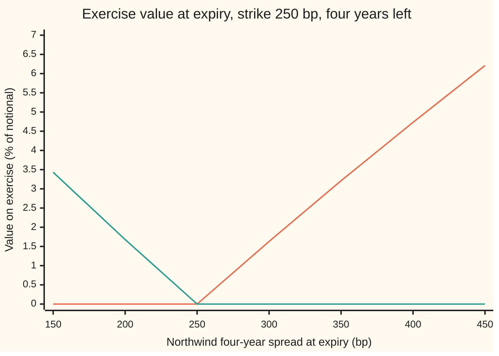
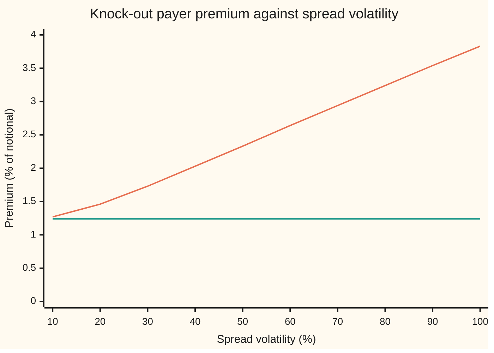

# Options on a CDS: Black's formula on the forward spread with the risky annuity as the unit, and the implied spread volatility

[Syllabus](../../../SYLLABUS.md) → [Financial mathematics](../README.md) → [Reduced-Form Models - Risky Bonds, Spreads and Random Hazards](../README.md#s44) → Options on a CDS

---

## General Overview

Northwind's credit default swap curve today reads 120, 200 and 250 basis points a year for one, three and five years of protection (a basis point is a hundredth of a percent). A **credit default swap**, CDS for short, is insurance on a borrower: the buyer pays a yearly premium, quoted as a spread, and is paid the lost part of a bond if Northwind defaults. Riskless money earns 5 percent a year, compounded continuously; a default is taken to return 40 cents on the dollar.

A fund holds Northwind bonds and worries about next year. It does not want to buy protection now at today's price. It wants the **right**, in one year, to buy protection at 250 basis points a year that runs to year five, four years by then. If Northwind's spread has blown out to 400, that right is valuable: protection worth 400 a year for 250. If the spread has fallen to 150, the fund walks away. That right is a **payer option**, or payer swaption: the holder may pay the premium. The mirror right, to sell protection at a fixed spread, is a **receiver option**.

Today's curve already implies a fair spread for protection that starts in a year and runs to year five: 290.55 basis points, the **forward spread** of [The forward CDS](04-forward-cds-and-the-forward-spread.md). Assume the spread in a year is scattered around that forward with a volatility of 50 percent: the yearly standard deviation of its logarithm. The option costs **2.33 percent of the notional**. A version that also pays out if Northwind defaults before the year is up costs a further **1.12 percent**, the **front-end protection**. Run backwards, the 2.33 percent premium returns the 50 percent: the **implied spread volatility**, the number traders actually quote.

**A CDS option is Black's call (the Black-Scholes call written on a forward) on the forward spread, paid in units of the forward risky annuity (the value of one unit of premium a year, paid only while Northwind survives); the premium pins down one volatility exactly when it lies inside Black's price range.**

**What kind of fact this is:** a model: the lognormal spread is an assumption that fits markets well enough, not a law. Inside it, the unit change that removes the random annuity is a theorem, proved on this card in Why it works, and so are the price bounds that make the implied volatility unique.

### The picture: what exercise is worth in a year

Northwind's four-year spread at expiry runs left to right. Up the side is what exercising is worth that day, as a percent of the notional: the gap between the market spread and the strike, times the annuity of the four-year contract at that spread.



Rising line (orange): the payer. Falling line (green): the receiver. Neither line is straight. Each extra basis point of spread is worth one annuity, and the annuity shrinks as the spread widens, because a riskier name is less likely to keep paying. The payer climbs from 0.00 to 1.63 points over the first 50 basis points above the strike, but only from 4.73 to 6.21 over the last 50 of the chart.

---

## The formula

Notation first, in words. The option expires at $T$ and the underlying contract matures at $T_M$. $A$ is today's value of the **forward risky annuity**: one unit of premium a year, paid quarterly from $T$ to $T_M$, only while Northwind survives. $V_{\text{prot}}$ is today's value of the protection over the same window. Their ratio is the forward spread $F$. $N(x)$ is the standard bell-curve area to the left of $x$ ([Black-76](../05-Black-Scholes%20from%20the%20Ground%20Up/06-black-76-and-forward-level-pricing.md)).

$$V_{\text{pay}} = A\left[F\,N(d_1) - K\,N(d_2)\right], \qquad V_{\text{rec}} = A\left[K\,N(-d_2) - F\,N(-d_1)\right], \qquad F = \frac{V_{\text{prot}}}{A}$$

**Read it aloud:** the payer is the forward risky annuity times Black's call on the forward spread struck at the strike spread; the receiver is the same annuity times Black's put.

The payer that does not die on an early default adds the front-end protection:

$$V_{\text{pay}}^{\text{keep}} = V_{\text{pay}} + \text{FEP}, \qquad \text{FEP} = (1 - R)\,D(T)\,\left[1 - Q(T)\right]$$

**Read it aloud:** the front-end protection is the loss on default, paid at expiry, times the chance of defaulting before expiry.

| Symbol | Plain meaning | In our example | Push it up and the answer… |
| --- | --- | --- | --- |
| $F$ | forward spread: the fair premium today for protection from $T$ to $T_M$ | 290.5480 bp | payer rises, receiver falls |
| $K$ | strike spread: the premium the holder may lock in | 250 bp | payer falls, receiver rises |
| $\sigma$ | spread volatility: yearly standard deviation of the logarithm of the future spread | 50 percent | both rise |
| $T$, $T_M$ | option expiry; maturity of the underlying CDS, in years | 1 and 5 | more time, more value; longer window, bigger annuity |
| $A$, $A_T$, $A_t$ | forward risky annuity today; the risky annuity as it stands at expiry, or at any date $t$ | 3.069756; random | every basis point is worth more |
| $V_{\text{prot}}$ | today's value of protection from $T$ to $T_M$ | 8.919113 percent | forward spread rises |
| $s_T$, $s_t$ | Northwind's spread at expiry, or at date $t$, for protection to $T_M$ | unknown today | payer pays more |
| $R$, $r$, $D(t)$, $t$ | recovery on default; riskless rate; discount factor $e^{-rt}$; a date in years | 40 percent; 5 percent; $D(1)$ = 0.951229 | front-end protection falls; less value; — |
| $Q(t)$, $\lambda$, $\tau$ | chance of surviving to $t$; hazard, the default rate per year; the default date | $Q(1)$ = 0.980369; 1.9826, 4.0440, 5.6837 percent | front-end protection rises with $\lambda$ |
| $N(x)$, $\varphi$, $d_1$, $d_2$ | bell-curve area left of $x$; bell-curve height; Black's two cut-offs | $d_1$ = 0.550616, $d_2$ = 0.050616 | — |
| $\mathbb{E}^{A}$, $\mathbb{1}$, $w$, $X$ | average with the survival measure's weights; indicator: 1 if the event happens, else 0; the weight that switches units; any payoff at expiry | $\mathbb{E}^{A}[s_T]$ = $F$ | — |
| $\Delta$, $\nu$ | spread delta: change in premium per unit change in $F$; vega: change per unit of $\sigma$ | 0.021766 percent per bp; 0.030577 percent per vol point | — |

The two cut-offs, as on the Black-76 card:

$$d_1 = \frac{\ln(F/K) + \tfrac12\sigma^2 T}{\sigma\sqrt{T}}, \qquad d_2 = d_1 - \sigma\sqrt{T}$$

In words: how many standard deviations of the log-spread separate the forward from the strike, shifted half a variance each way.

The Greeks, holding the annuity fixed:

$$\Delta_{\text{pay}} = A\,N(d_1), \qquad \nu = A\,F\,\varphi(d_1)\sqrt{T}$$

The inverse. For a given premium $V$, the implied spread volatility is the $\sigma$ that solves $V_{\text{pay}}(\sigma) = V$. It exists, and is unique, exactly when

$$A\,(F - K)^+ < V < A\,F,$$

where $(y)^+$ means y if positive and zero otherwise. For Northwind that range is 1.244724 to 8.919113 percent. At or outside either end there is no volatility.

**Conventions verified 2026-09-28** against the shelf's bootstrapped curve ([Bootstrapping a hazard curve](../42-Credit%20Default%20Swaps%20-%20Pricing%2C%20the%20Par%20Spread%20and%20the%20Hazard%20Behind%20It/06-bootstrapping-the-hazard-curve-from-cds-quotes.md)): quarterly premiums paid at the end of each quarter survived, year fractions of 0.25, no premium accrued between the last payment and default, strike quoted as a running spread. Standard traded contracts pay a fixed coupon plus an upfront amount ([Valuing an existing CDS](../42-Credit%20Default%20Swaps%20-%20Pricing%2C%20the%20Par%20Spread%20and%20the%20Hazard%20Behind%20It/07-marking-a-cds-to-market-and-the-upfront.md)); that changes the strike's units, not the method.

### When it holds

- **The option knocks out on default before expiry.** Single-name CDS options usually do. Then the payoff is zero on the paths the unit ignores, and the unit change is exact. If the payer survives a default, add the front-end protection: 1.12 percent here, almost half the knock-out premium.
- **The forward spread is lognormal under the survival measure.** This is Black's assumption. Spreads jump when news breaks, so real smiles slope upward, and one volatility cannot price every strike. A random-hazard model ([A random hazard](03-stochastic-hazard-cox-process.md)) produces its own smile.
- **Rates and default are independent for the front-end protection.** The formula for FEP multiplies a discount factor by a default chance. With a constant 5 percent rate that is exact; with random rates tied to credit it needs a correction.
- **The curve is free of arbitrage.** Survival must fall with time, which the bootstrapped pieces guarantee. A negative hazard piece would make survival rise, and the survival weights would stop being probabilities.

---

## Why it works

### Step 0: price in units of the thing the option pays in

A payer, once exercised, gives the holder a CDS whose value is a number of basis points times an annuity. So count money in annuities. Any positive traded price can serve as the unit of account, and in that unit every other price ratio has no drift ([The annuity measure](../29-Caps%2C%20Floors%20and%20Swaptions/05-the-annuity-measure.md)). The forward spread is protection divided by annuity. In annuity units it is a fair game: its average future value is today's value. The twist for credit is that this unit can hit zero.

### Step 1: the payoff is the annuity times a call on the spread

At expiry, if Northwind has survived, the holder may enter a CDS paying $K$ for protection to $T_M$. The market's fair premium that day is $s_T$. A CDS paying $K$ when the market charges $s_T$ is worth the protection leg minus the premium leg: $A_T s_T - A_T K = A_T (s_T - K)$ per unit of notional. The holder exercises only when that is positive. If Northwind has already defaulted, the knock-out option is void. So the payoff is

$$\mathbb{1}_{\{\tau > T\}}\,A_T\,(s_T - K)^+.$$

### Step 2: the risky annuity is a traded unit, positive until default

$A_t$ is the value of a strip of zero-recovery bonds: 0.25 of a dollar paid at each quarter from $T$ to $T_M$, but only if Northwind is alive on that date. It can be bought. It is positive while Northwind survives and zero afterwards. Weighting each possible future by $D(T)\,\mathbb{1}_{\{\tau>T\}}\,A_T / A$ gives a set of probabilities, because those weights are never negative and average to one: the average of $D(T)\,\mathbb{1}_{\{\tau>T\}}\,A_T$ is today's price of the strip, which is $A$. These weights are the **survival measure**, written $\mathbb{E}^{A}$. It puts zero weight on every path where Northwind defaults before expiry.

### Step 3: under those weights the forward spread has no drift

The average of $s_T$ under the survival measure is

$$\mathbb{E}^{A}[s_T] = \frac{\mathbb{E}\left[D(T)\,\mathbb{1}_{\{\tau>T\}}\,A_T\,s_T\right]}{A} = \frac{\mathbb{E}\left[D(T)\,\mathbb{1}_{\{\tau>T\}}\,V_{\text{prot}}(T)\right]}{A} = \frac{V_{\text{prot}}}{A} = F.$$

The middle step uses the definition of the spread: $A_T s_T$ is the value at expiry of protection to $T_M$. The next step says that protection from $T$ onward, bought today, pays only if Northwind reached $T$ alive, so its price is the average of its discounted surviving value. Nothing here is an assumption beyond the absence of free money.

### Step 4: the random annuity cancels

Price the payoff of Step 1 in dollars, then switch weights:

$$V_{\text{pay}} = \mathbb{E}\left[D(T)\,\mathbb{1}_{\{\tau>T\}}\,A_T\,(s_T - K)^+\right] = A\,\mathbb{E}^{A}\left[(s_T - K)^+\right].$$

The random annuity at expiry, which depends on how Northwind's credit has moved, has gone. So has the indicator. What remains is a plain call on one number whose average is $F$. This is still exact.

### Step 5: add a lognormal shape and Black's formula drops out

Assume $s_T = F\,e^{-\frac12\sigma^2 T + \sigma\sqrt{T}Z}$ under the survival measure, with $Z$ a standard bell-curve draw. The centre is forced by Step 3. The call average is the Black-76 integral: $\mathbb{E}^{A}[(s_T - K)^+] = F\,N(d_1) - K\,N(d_2)$. Multiply by $A$. The receiver follows the same way with the put payoff, and payer minus receiver is $A(F - K)$, the value today of a forward CDS struck at $K$. That identity is **payer-receiver parity**.

<details>
<summary>Detailed proof: the survival measure is a genuine measure, and the pricing rule holds for every payoff</summary>

Let $\mathbb{E}$ be the risk-neutral average with the bank account as unit, so that every traded price today is the average of its discounted payoff. Define the weight
$$w = \frac{D(T)\,\mathbb{1}_{\{\tau>T\}}\,A_T}{A}.$$
It is never negative. Its average is $\mathbb{E}[D(T)\,\mathbb{1}_{\{\tau>T\}}\,A_T]/A$. The numerator is the price today of receiving the risky annuity at $T$ if alive, which is the forward risky annuity itself, so the average is 1. Hence $\mathbb{E}^{A}[Y] := \mathbb{E}[w\,Y]$ is an average under a probability measure. It is not equivalent to the original one: it gives zero weight to default before $T$. That is harmless for any payoff that is itself zero on those paths.

Take any payoff $X$ paid at $T$ that is zero when $\tau \le T$. On survival paths $X = A_T \cdot (X/A_T)$, so
$$\mathbb{E}[D(T)\,X] = \mathbb{E}\left[D(T)\,\mathbb{1}_{\{\tau>T\}}\,A_T\,\frac{X}{A_T}\right] = A\,\mathbb{E}^{A}\left[\frac{X}{A_T}\right].$$
With $X = V_{\text{prot}}(T)\,\mathbb{1}_{\{\tau>T\}}$ this gives $\mathbb{E}^{A}[s_T] = F$ (Step 3). With $X = \mathbb{1}_{\{\tau>T\}}A_T(s_T-K)^+$ it gives Step 4. Applying the same argument at every date $t$ before $T$, with averages conditional on what is known at $t$, shows the spread $s_t$ is a martingale on survival, which is what "no drift" means.

</details>

### Step 6: front-end protection, the part a payer keeps

A payer that does not knock out has one more outcome. If Northwind defaults before expiry, the holder exercises into protection on a name that has already defaulted and collects the loss, $1 - R$, at expiry. A receiver would never exercise then: selling protection on a defaulted name only loses. So the payer gains $(1 - R)\,D(T)\,[1 - Q(T)]$ and the receiver gains nothing. With survival to one year of 0.980369 that is 1.120398 percent. Buying the one-year CDS today gives similar cover, but it pays at the default date and costs premiums; the front-end protection is the version paid at expiry.

### Step 7: the implied volatility exists and is unique inside Black's range

Hold $F$, $K$, $A$ fixed and let $\sigma$ vary. The premium is continuous in $\sigma$. It is strictly increasing, because its slope is vega, $A\,F\,\varphi(d_1)\sqrt{T}$, which is positive. As $\sigma$ shrinks to zero the spread becomes certain, and the price falls to $A\,(F - K)^+$: 1.244724 percent. As $\sigma$ grows without bound, $N(d_1)$ goes to 1 and $N(d_2)$ to 0, so the price climbs towards $A\,F = V_{\text{prot}}$: 8.919113 percent, the whole forward protection leg. A continuous, strictly increasing function takes each value between its limits exactly once. So every premium strictly between 1.244724 and 8.919113 percent has one implied volatility, and every premium outside has none.

The bounds are prices, not artefacts. A payer below $A(F - K)^+$ could be bought and a forward CDS sold against it for a sure profit. A payer above $V_{\text{prot}}$ would cost more than simply buying the forward protection outright. Bisection (halve an interval known to contain the answer, keep the half that still does) is guaranteed to find the root; Newton's method (follow the slope to where the line crosses) is faster from a good start. Both are on [Solving for implied volatility](../11-Implied%20volatility%20and%20the%20vanilla%20inverses/02-implied-volatility-by-newton-and-bisection.md).

The other road to the price is a hedge: hold the option, sell forward protection in the amount of the spread delta, and require the hedged book to earn the riskless rate. The annuity-unit route above is shorter and shows why the annuity, not a discount factor, multiplies the bracket.

---

## Worked numbers, by hand

The curve: Northwind's CDS at 120, 200 and 250 basis points for one, three and five years, 40 percent recovery, riskless rate 5 percent, premiums quarterly. Option: expiry one year, strike 250 basis points, protection from year 1 to year 5, volatility 50 percent.

| Step | Arithmetic | Value |
| --- | --- | --- |
| hazard pieces | bootstrapped from the three quotes | 1.9826, 4.0440, 5.6837 percent |
| survival to expiry $Q(1)$ | $e^{-0.019826}$ | 0.980369 |
| forward risky annuity $A$ | 16 quarters, $\sum 0.25\,D(t)\,Q(t)$ for $t$ = 1.25 to 5 | 3.069756 |
| forward protection $V_{\text{prot}}$ | $(1-R)$ times the discounted default density, year 1 to 5 | 8.919113 percent |
| forward spread $F$ | $0.08919113 / 3.069756$ | 290.5480 bp |
| $\ln(F/K)$ | $\ln(290.548 / 250)$ | 0.150308 |
| half variance | $\tfrac12 \times 0.5^2 \times 1$ | 0.125000 |
| $d_1$ | $(0.150308 + 0.125) / 0.5$ | 0.550616 |
| $d_2$ | $0.550616 - 0.5$ | 0.050616 |
| $N(d_1)$, $N(d_2)$ | bell-curve table | 0.709051, 0.520184 |
| Black bracket | $290.548 \times 0.709051 - 250 \times 0.520184$ | 75.9674 bp |
| **payer, knock-out** | $3.069756 \times 75.9674$ bp | **2.332014 percent** |
| front-end protection | $0.6 \times 0.951229 \times (1 - 0.980369)$ | 1.120398 percent |
| **payer that keeps FEP** | $2.332014 + 1.120398$ | **3.452412 percent** |

The Black bracket reads directly in spread terms: the option is worth 75.97 basis points a year of premium over the four-year window, paid while Northwind survives.

The receiver is worth 1.087291 percent. Payer minus receiver is 1.244724 percent, which is $A(F - K)$, also 1.244724 percent: parity holds.

### The Greeks

| Greek | Formula | Value | Meaning |
| --- | --- | --- | --- |
| spread delta, payer | $A\,N(d_1)$ | 0.021766 percent of notional per bp of $F$ | a 1 bp rise in the forward spread adds 0.021766 percent |
| spread delta, whole curve moved 1 bp | re-bootstrap the curve, reprice | 0.020955 percent per bp | lower: $F$ rises about 1 bp, but the annuity shrinks too |
| vega | $A\,F\,\varphi(d_1)\sqrt{T}$ | 0.030577 percent per vol point | one point of volatility adds 0.030577 percent |

The receiver's delta is the payer's minus $A$, and its vega is the same, by parity.

### Implied spread volatility

Bisection on the knock-out premium of 2.332014 percent returns 0.500000. Newton from 30 percent returns 0.500000. A premium of 1.20 percent sits below the floor of 1.244724: bisection runs down to the bottom of its interval, 0.000100, and there is no volatility to report.



Rising line (orange): the payer premium. Flat line (green): the floor $A(F - K)$, 1.24 percent, which the premium approaches as volatility falls to zero. Read across from 2.33 percent and down: 50 percent. Every premium on the rising line has one volatility; a premium on or below the flat line has none. The ceiling, 8.92 percent, is off the top of the chart.

### What breaks if you drop a piece

Right answer: 2.332014 percent for the knock-out payer at 50 percent.

| Mistake | Comes out at | What went wrong |
| --- | --- | --- |
| Discount the bracket by $D(1)$, as if the option paid once | 0.722624 percent | The payoff is a four-year stream of premium; $A$ = 3.069756, not 0.951229 |
| Use the riskless annuity from year 1 to 5 | 2.603452 percent | Premiums stop on default; the unit must be the risky annuity |
| Use the spot 5-year annuity from today | 3.059387 percent | That annuity includes the first year, which the option does not cover |
| Use today's 5-year spread, 250 bp, as the forward | 1.515022 percent | The forward from year 1 to 5 is 290.55 bp on an upward-sloping curve |
| Invert the premium with FEP, 3.452412 percent, through the knock-out formula | 86.99 percent volatility | Front-end protection is not volatility; subtract it first |

Every number in that table is printed by the code below.

---

## Code, from first principles, and it actually runs

The script rebuilds Northwind's hazard curve by bisection, then reaches the forward legs by three roads: closed-form integrals on each flat hazard piece, Simpson's rule (adding thin slices under the default-density curve), and 400,000 simulated default dates from a home-made random-number generator. It prices the payer three ways: Black's formula, a Simpson integral of the payoff against the bell curve, and a Monte Carlo average over 200,000 draws with their mirror images. It checks parity with an integrated receiver, checks both Greeks by bumping, re-bootstraps the whole curve to get the full-curve delta, and recovers the 50 percent volatility by bisection and by Newton. The normal CDF, the integrator, the root finder and the random numbers are all written out.

### Python

```python
# Options on a CDS: Black on the forward spread, risky annuity as the unit. Standard library only.
# Nothing imported knows the answer: normal CDF, integrator, root finder and random numbers are written out.
from math import exp, log, sqrt, cos, pi

RATE, LOSS, KNOTS = 0.05, 0.60, [0.0, 1.0, 3.0, 5.0]     # riskless rate; loss = 1 - recovery 40%
QUOTES = [0.0120, 0.0200, 0.0250]                         # Northwind CDS at 1, 3, 5 years
TE, K, VOL = 1.0, 0.0250, 0.50                            # expiry, strike spread, spread volatility

def phi(x): return exp(-0.5 * x * x) / sqrt(2 * pi)
def simpson(f, a, b, n):
    h = (b - a) / n
    return h / 3 * (f(a) + f(b) + sum((4 if i % 2 else 2) * f(a + i * h) for i in range(1, n)))
def N(x): return 0.0 if x < -12 else 1.0 if x > 12 else 0.5 + simpson(phi, 0.0, x, 2000)
def bisect(f, lo, hi, n=100):                             # f rises through zero between lo and hi
    for _ in range(n):
        mid = 0.5 * (lo + hi)
        lo, hi = (mid, hi) if f(mid) < 0 else (lo, mid)
    return 0.5 * (lo + hi)

def surv(t, lam):                                         # survival to t under the step hazard
    area = 0.0
    for i, h in enumerate(lam):
        right = KNOTS[i + 1] if i + 1 < len(lam) else float("inf")
        area += h * max(0.0, min(t, right) - KNOTS[i])
    return exp(-area)
def annuity(a, b, lam):                                   # risky annuity: quarters in (a, b], paid if alive
    return sum(0.25 * exp(-RATE * j / 4) * surv(j / 4, lam) for j in range(round(4 * a) + 1, round(4 * b) + 1))
def prot(a, b, lam):                                      # protection on (a, b], exact on each flat piece
    total, edges = 0.0, sorted(set([a, b] + [k for k in KNOTS[1:len(lam)] if a < k < b]))
    for lo, hi in zip(edges, edges[1:]):
        h = lam[min([i for i in range(len(lam)) if KNOTS[i] <= lo][-1], len(lam) - 1)]
        total += LOSS * exp(-RATE * lo) * surv(lo, lam) * h / (RATE + h) * (1 - exp(-(RATE + h) * (hi - lo)))
    return total
def bootstrap(quotes):
    lam = []
    for i, s in enumerate(quotes):
        lam.append(bisect(lambda h: prot(0, KNOTS[i + 1], lam + [h]) - s * annuity(0, KNOTS[i + 1], lam + [h]), 0.0, 1.0))
    return lam
def black(F, K, v, A):                                    # knock-out payer and receiver, per unit notional
    d1 = (log(F / K) + 0.5 * v * v * TE) / (v * sqrt(TE)); d2 = d1 - v * sqrt(TE)
    return A * (F * N(d1) - K * N(d2)), A * (K * N(-d2) - F * N(-d1)), d1, d2
def option_on(quotes):                                    # re-bootstrap, then the knock-out payer
    lam = bootstrap(quotes); A = annuity(TE, 5, lam)
    return black(prot(TE, 5, lam) / A, K, VOL, A)[0]

lam = bootstrap(QUOTES)                                   # ---- road A: closed-form legs ----
A, P = annuity(TE, 5, lam), prot(TE, 5, lam)
F = P / A
FEP = LOSS * exp(-RATE * TE) * (1 - surv(TE, lam))       # loss on default before expiry, settled at expiry
dens = lambda t, h: LOSS * exp(-RATE * t) * surv(t, lam) * h                     # road B: protection by Simpson
P_simp = simpson(lambda t: dens(t, lam[1]), 1, 3, 200) + simpson(lambda t: dens(t, lam[2]), 3, 5, 200)
state = 20260928                                          # road C: simulated default dates, own generator
def unif():
    global state
    state = (6364136223846793005 * state + 1442695040888963407) % 2 ** 64
    return ((state >> 11) + 0.5) / 2 ** 53
n_def, sA = 400000, [0.0, 0.0, 0.0]
for _ in range(n_def):
    e, tau = -log(unif()), 99.0
    for i, h in enumerate(lam):
        width = KNOTS[i + 1] - KNOTS[i] if i < 2 else 99.0
        if e <= h * width: tau = KNOTS[i] + e / h; break
        e -= h * width
    sA[0] += sum(0.25 * exp(-RATE * j / 4) for j in range(5, 21) if tau > j / 4)
    sA[1] += LOSS * exp(-RATE * tau) if 1 < tau <= 5 else 0.0
    sA[2] += LOSS * exp(-RATE * TE) if tau <= 1 else 0.0
A_mc, P_mc, FEP_mc = (x / n_def for x in sA)
p1 = 1 - surv(TE, lam); se_fep = LOSS * exp(-RATE) * sqrt(p1 * (1 - p1) / n_def)

pay, rec, d1, d2 = black(F, K, VOL, A)                    # ---- the option, three roads ----
sd = VOL * sqrt(TE)
payoff = lambda z, c: max(c * (F * exp(-0.5 * sd * sd + sd * z) - K), 0.0) * phi(z)
pay_int = A * simpson(lambda z: payoff(z, 1), -10, 10, 4000)
rec_int = A * simpson(lambda z: payoff(z, -1), -10, 10, 4000)
mc = 0.0
for _ in range(200000):
    u1, u2 = unif(), unif(); z = sqrt(-2 * log(u1)) * cos(2 * pi * u2)
    mc += 0.5 * sum(max(F * exp(-0.5 * sd * sd + sd * y) - K, 0.0) for y in (z, -z))
pay_mc = A * mc / 200000
delta, vega = A * N(d1), A * F * phi(d1) * sqrt(TE)       # Greeks, annuity held fixed
delta_b = (black(F + 1e-6, K, VOL, A)[0] - black(F - 1e-6, K, VOL, A)[0]) / 2e-6
vega_b = (black(F, K, VOL + 1e-5, A)[0] - black(F, K, VOL - 1e-5, A)[0]) / 2e-5
curve_d = (option_on([q + 1e-4 for q in QUOTES]) - option_on([q - 1e-4 for q in QUOTES])) / 2
lo_b, hi_b = A * max(F - K, 0), A * F                     # Black's price range for this F, K, A
iv_bis = bisect(lambda v: black(F, K, v, A)[0] - pay, 1e-4, 5.0)
v = 0.30                                                  # Newton from 30%
for _ in range(8): v -= (black(F, K, v, A)[0] - pay) / (A * F * phi(black(F, K, v, A)[2]) * sqrt(TE))
iv_bad = bisect(lambda v: black(F, K, v, A)[0] - (pay + FEP), 1e-4, 5.0)
iv_low = bisect(lambda v: black(F, K, v, A)[0] - 0.0120, 1e-4, 5.0)

def spot_cds(S):                                          # at expiry: flat hazard for a 4y spread S, its annuity
    h = bisect(lambda x: prot(0, 4, [x]) - S * annuity(0, 4, [x]), 0.0, 1.0, 60)
    return annuity(0, 4, [h])
Ars = sum(0.25 * exp(-RATE * j / 4) for j in range(5, 21))
pc = lambda x: f"{100 * x:.6f}"
rows = [("hazard pieces 0-1, 1-3, 3-5y", " ".join(f"{h:.6f}" for h in lam)), ("Q(1) survival to expiry, D(1)", f"{surv(1, lam):.6f} {exp(-RATE * TE):.6f}"),
        ("forward risky annuity A, closed", f"{A:.6f}"), ("  by simulated defaults", f"{A_mc:.6f}"),
        ("forward protection leg %, closed", pc(P)), ("  by Simpson", pc(P_simp)), ("  by simulated defaults", pc(P_mc)),
        ("forward spread F bp", f"{1e4 * F:.4f}"), ("  by simulated defaults", f"{1e4 * P_mc / A_mc:.4f}"),
        ("ln(F/K), half variance", f"{log(F / K):.6f} {0.5 * sd * sd:.6f}"), ("Black bracket F N(d1) - K N(d2) bp", f"{1e4 * pay / A:.4f}"),
        ("d1, d2", f"{d1:.6f} {d2:.6f}"), ("N(d1), N(d2)", f"{N(d1):.6f} {N(d2):.6f}"),
        ("payer % (knock-out), Black", pc(pay)), ("  by Simpson integral", pc(pay_int)), ("  by Monte Carlo", pc(pay_mc)),
        ("receiver %, Black", pc(rec)), ("  by Simpson integral", pc(rec_int)),
        ("payer - receiver %, integrals", pc(pay_int - rec_int)), ("A (F - K) %", pc(A * (F - K))),
        ("front-end protection %, closed", pc(FEP)), ("  by simulated defaults", pc(FEP_mc)),
        ("payer that keeps FEP %", pc(pay + FEP)),
        ("delta, % per bp of F: A N(d1)", f"{delta * 1e-2:.6f}"), ("  by bump", f"{delta_b * 1e-2:.6f}"),
        ("  whole curve +-1bp, re-bootstrap", f"{100 * curve_d:.6f}"),
        ("vega, % per vol point: A F phi(d1)", f"{vega:.6f}"), ("  by bump", f"{vega_b:.6f}"),
        ("price range %: A(F-K)+ to A F", f"{pc(lo_b)} {pc(hi_b)}"),
        ("implied vol from payer, bisection", f"{iv_bis:.6f}"), ("  by Newton from 0.30", f"{v:.6f}"),
        ("wrong: invert payer + FEP", f"{iv_bad:.6f}"), ("premium 1.20% < floor: bisection", f"{iv_low:.6f}"),
        ("wrong: D(1) as the unit %", pc(black(F, K, VOL, exp(-RATE))[0])),
        ("wrong: riskless annuity as unit %", pc(black(F, K, VOL, Ars)[0])),
        ("wrong: spot 5y spread as forward %", pc(black(0.0250, K, VOL, A)[0])),
        ("wrong: spot 5y annuity as unit %", pc(black(F, K, VOL, annuity(0, 5, lam))[0])),
        ("try: vol 25% payer %", pc(black(F, K, 0.25, A)[0])), ("try: strike 350bp payer %", pc(black(F, 0.035, VOL, A)[0]))]
for name, val in rows: print(f"{name:<36} {val}")
xs = [0.0150, 0.0200, 0.0250, 0.0300, 0.0350, 0.0400, 0.0450]
print("chart, spread at expiry (bp)  " + " ".join(f"{1e4 * s:6.0f}" for s in xs))
print("chart, payer exercise (%)     " + " ".join(f"{100 * spot_cds(s) * max(s - K, 0):6.2f}" for s in xs))
print("chart, receiver exercise (%)  " + " ".join(f"{100 * spot_cds(s) * max(K - s, 0):6.2f}" for s in xs))
print("chart, vol (%)                " + " ".join(f"{10 * i:6d}" for i in range(1, 11)))
print("chart, payer premium (%)      " + " ".join(f"{100 * black(F, K, i / 10, A)[0]:6.2f}" for i in range(1, 11)))

assert abs(P_simp - P) < 1e-10 and abs(1e4 * (P_mc / A_mc - F)) < 3.0, "forward spread: three roads agree"
assert abs(FEP_mc - FEP) < 4 * se_fep, "front-end protection: closed form vs simulated defaults"
assert abs(pay_int - pay) < 1e-7 and abs(pay_mc - pay) < 0.01 * pay, "payer: formula, integral, simulation"
assert abs((pay_int - rec_int) - A * (F - K)) < 1e-7 and abs(rec_int - rec) < 1e-7, "parity by the two integrals"
assert abs(delta_b - delta) < 1e-6 and abs(vega_b - vega) < 1e-6, "Greeks: bumps vs closed forms"
assert abs(iv_bis - VOL) < 1e-9 and abs(v - VOL) < 1e-9, "implied volatility recovers 50% by two roads"
assert lo_b < pay < hi_b and iv_low < 1e-3 and 0.0120 < lo_b, "below the floor there is no volatility"
print("ALL CHECKS PASS")
```

**Ran 2026-09-28 on macOS, Python 3.14.6, standard library only. All checks passed. Output, pasted from the run:**

```
hazard pieces 0-1, 1-3, 3-5y         0.019826 0.040440 0.056837
Q(1) survival to expiry, D(1)        0.980369 0.951229
forward risky annuity A, closed      3.069756
  by simulated defaults              3.070137
forward protection leg %, closed     8.919113
  by Simpson                         8.919113
  by simulated defaults              8.917397
forward spread F bp                  290.5480
  by simulated defaults              290.4560
ln(F/K), half variance               0.150308 0.125000
Black bracket F N(d1) - K N(d2) bp   75.9674
d1, d2                               0.550616 0.050616
N(d1), N(d2)                         0.709051 0.520184
payer % (knock-out), Black           2.332014
  by Simpson integral                2.332016
  by Monte Carlo                     2.335555
receiver %, Black                    1.087291
  by Simpson integral                1.087292
payer - receiver %, integrals        1.244724
A (F - K) %                          1.244724
front-end protection %, closed       1.120398
  by simulated defaults              1.113795
payer that keeps FEP %               3.452412
delta, % per bp of F: A N(d1)        0.021766
  by bump                            0.021766
  whole curve +-1bp, re-bootstrap    0.020955
vega, % per vol point: A F phi(d1)   0.030577
  by bump                            0.030577
price range %: A(F-K)+ to A F        1.244724 8.919113
implied vol from payer, bisection    0.500000
  by Newton from 0.30                0.500000
wrong: invert payer + FEP            0.869934
premium 1.20% < floor: bisection     0.000100
wrong: D(1) as the unit %            0.722624
wrong: riskless annuity as unit %    2.603452
wrong: spot 5y spread as forward %   1.515022
wrong: spot 5y annuity as unit %     3.059387
try: vol 25% payer %                 1.591437
try: strike 350bp payer %            1.158155
chart, spread at expiry (bp)     150    200    250    300    350    400    450
chart, payer exercise (%)       0.00   0.00   0.00   1.63   3.21   4.73   6.21
chart, receiver exercise (%)    3.43   1.68   0.00   0.00   0.00   0.00   0.00
chart, vol (%)                    10     20     30     40     50     60     70     80     90    100
chart, payer premium (%)        1.27   1.46   1.73   2.03   2.33   2.64   2.94   3.24   3.54   3.83
ALL CHECKS PASS
```

Three roads land on the forward spread: 290.5480 bp from the closed legs and from Simpson, 290.4560 from simulated defaults, a gap inside sampling noise. The front-end protection by simulation, 1.113795 percent, sits within four standard errors of the closed 1.120398. The payer's Monte Carlo value, 2.335555 percent, is within the 1 percent the assert allows.

### Rust

Same checks, same inputs, the same random-number recipe, so the Monte Carlo lines match too.

```rust
// Options on a CDS: Black on the forward spread, risky annuity as the unit. Rust std only, no crates.
// Normal CDF, integrator, root finder and random numbers are written out; same recipe as the Python check.
use std::f64::consts::PI;

const RATE: f64 = 0.05;
const LOSS: f64 = 0.60;
const KNOTS: [f64; 4] = [0.0, 1.0, 3.0, 5.0];
const QUOTES: [f64; 3] = [0.0120, 0.0200, 0.0250];
const TE: f64 = 1.0;
const K: f64 = 0.0250;
const VOL: f64 = 0.50;

fn phi(x: f64) -> f64 { (-0.5 * x * x).exp() / (2.0 * PI).sqrt() }
fn simpson<G: Fn(f64) -> f64>(f: G, a: f64, b: f64, n: usize) -> f64 {
    let h = (b - a) / n as f64;
    let mut s = f(a) + f(b);
    for i in 1..n { s += if i % 2 == 1 { 4.0 } else { 2.0 } * f(a + i as f64 * h); }
    h / 3.0 * s
}
fn ncdf(x: f64) -> f64 { if x < -12.0 { 0.0 } else if x > 12.0 { 1.0 } else { 0.5 + simpson(phi, 0.0, x, 2000) } }
fn bisect<G: Fn(f64) -> f64>(f: G, mut lo: f64, mut hi: f64, n: usize) -> f64 {
    for _ in 0..n { let mid = 0.5 * (lo + hi); if f(mid) < 0.0 { lo = mid } else { hi = mid } }
    0.5 * (lo + hi)
}
fn surv(t: f64, lam: &[f64]) -> f64 {
    let mut area = 0.0;
    for (i, h) in lam.iter().enumerate() {
        let right = if i + 1 < lam.len() { KNOTS[i + 1] } else { f64::INFINITY };
        area += h * (t.min(right) - KNOTS[i]).max(0.0);
    }
    (-area).exp()
}
fn annuity(a: f64, b: f64, lam: &[f64]) -> f64 {
    let (j0, j1) = ((4.0 * a).round() as i32 + 1, (4.0 * b).round() as i32);
    (j0..=j1).map(|j| 0.25 * (-RATE * j as f64 / 4.0).exp() * surv(j as f64 / 4.0, lam)).sum()
}
fn prot(a: f64, b: f64, lam: &[f64]) -> f64 {
    let mut edges = vec![a];
    for k in &KNOTS[1..lam.len()] { if a < *k && *k < b { edges.push(*k) } }
    edges.push(b);
    let mut total = 0.0;
    for w in edges.windows(2) {
        let (lo, hi) = (w[0], w[1]);
        let i = (0..lam.len()).filter(|&i| KNOTS[i] <= lo).last().unwrap().min(lam.len() - 1);
        let h = lam[i];
        total += LOSS * (-RATE * lo).exp() * surv(lo, lam) * h / (RATE + h) * (1.0 - (-(RATE + h) * (hi - lo)).exp());
    }
    total
}
fn bootstrap(q: &[f64]) -> Vec<f64> {
    let mut lam: Vec<f64> = vec![];
    for (i, s) in q.iter().enumerate() {
        let h = bisect(|h| { let mut l = lam.clone(); l.push(h); prot(0.0, KNOTS[i + 1], &l) - s * annuity(0.0, KNOTS[i + 1], &l) }, 0.0, 1.0, 100);
        lam.push(h);
    }
    lam
}
fn black(f: f64, k: f64, v: f64, a: f64) -> (f64, f64, f64, f64) {
    let d1 = ((f / k).ln() + 0.5 * v * v * TE) / (v * TE.sqrt());
    let d2 = d1 - v * TE.sqrt();
    (a * (f * ncdf(d1) - k * ncdf(d2)), a * (k * ncdf(-d2) - f * ncdf(-d1)), d1, d2)
}
fn option_on(q: &[f64]) -> f64 {
    let lam = bootstrap(q);
    let a = annuity(TE, 5.0, &lam);
    black(prot(TE, 5.0, &lam) / a, K, VOL, a).0
}
struct Rng(u64);
impl Rng {
    fn unif(&mut self) -> f64 {
        self.0 = self.0.wrapping_mul(6364136223846793005).wrapping_add(1442695040888963407);
        ((self.0 >> 11) as f64 + 0.5) / 2f64.powi(53)
    }
}
fn pc(x: f64) -> String { format!("{:.6}", 100.0 * x) }

fn main() {
    let lam = bootstrap(&QUOTES);
    let (a, p) = (annuity(TE, 5.0, &lam), prot(TE, 5.0, &lam));
    let f = p / a;
    let fep = LOSS * (-RATE * TE).exp() * (1.0 - surv(TE, &lam));
    let dens = |t: f64, h: f64| LOSS * (-RATE * t).exp() * surv(t, &lam) * h;
    let p_simp = simpson(|t| dens(t, lam[1]), 1.0, 3.0, 200) + simpson(|t| dens(t, lam[2]), 3.0, 5.0, 200);
    let mut rng = Rng(20260928);
    let n_def = 400000;
    let mut sa = [0.0f64; 3];
    for _ in 0..n_def {
        let (mut e, mut tau) = (-rng.unif().ln(), 99.0);
        for (i, h) in lam.iter().enumerate() {
            let width = if i < 2 { KNOTS[i + 1] - KNOTS[i] } else { 99.0 };
            if e <= h * width { tau = KNOTS[i] + e / h; break; }
            e -= h * width;
        }
        sa[0] += (5..21).filter(|&j| tau > j as f64 / 4.0).map(|j| 0.25 * (-RATE * j as f64 / 4.0).exp()).sum::<f64>();
        sa[1] += if 1.0 < tau && tau <= 5.0 { LOSS * (-RATE * tau).exp() } else { 0.0 };
        sa[2] += if tau <= 1.0 { LOSS * (-RATE * TE).exp() } else { 0.0 };
    }
    let (a_mc, p_mc, fep_mc) = (sa[0] / n_def as f64, sa[1] / n_def as f64, sa[2] / n_def as f64);
    let p1 = 1.0 - surv(TE, &lam);
    let se_fep = LOSS * (-RATE).exp() * (p1 * (1.0 - p1) / n_def as f64).sqrt();

    let (pay, rec, d1, d2) = black(f, K, VOL, a);
    let sd = VOL * TE.sqrt();
    let payoff = |z: f64, c: f64| (c * (f * (-0.5 * sd * sd + sd * z).exp() - K)).max(0.0) * phi(z);
    let pay_int = a * simpson(|z| payoff(z, 1.0), -10.0, 10.0, 4000);
    let rec_int = a * simpson(|z| payoff(z, -1.0), -10.0, 10.0, 4000);
    let mut mc = 0.0;
    for _ in 0..200000 {
        let (u1, u2) = (rng.unif(), rng.unif());
        let z = (-2.0 * u1.ln()).sqrt() * (2.0 * PI * u2).cos();
        mc += 0.5 * [z, -z].iter().map(|y| (f * (-0.5 * sd * sd + sd * y).exp() - K).max(0.0)).sum::<f64>();
    }
    let pay_mc = a * mc / 200000.0;
    let (delta, vega) = (a * ncdf(d1), a * f * phi(d1) * TE.sqrt());
    let delta_b = (black(f + 1e-6, K, VOL, a).0 - black(f - 1e-6, K, VOL, a).0) / 2e-6;
    let vega_b = (black(f, K, VOL + 1e-5, a).0 - black(f, K, VOL - 1e-5, a).0) / 2e-5;
    let up: Vec<f64> = QUOTES.iter().map(|q| q + 1e-4).collect();
    let dn: Vec<f64> = QUOTES.iter().map(|q| q - 1e-4).collect();
    let curve_d = (option_on(&up) - option_on(&dn)) / 2.0;
    let (lo_b, hi_b) = (a * (f - K).max(0.0), a * f);
    let iv_bis = bisect(|v| black(f, K, v, a).0 - pay, 1e-4, 5.0, 100);
    let mut v = 0.30;
    for _ in 0..8 { v -= (black(f, K, v, a).0 - pay) / (a * f * phi(black(f, K, v, a).2) * TE.sqrt()); }
    let iv_bad = bisect(|v| black(f, K, v, a).0 - (pay + fep), 1e-4, 5.0, 100);
    let iv_low = bisect(|v| black(f, K, v, a).0 - 0.0120, 1e-4, 5.0, 100);
    let spot_cds = |s: f64| { let h = bisect(|x| prot(0.0, 4.0, &[x]) - s * annuity(0.0, 4.0, &[x]), 0.0, 1.0, 60); annuity(0.0, 4.0, &[h]) };
    let ars: f64 = (5..21).map(|j| 0.25 * (-RATE * j as f64 / 4.0).exp()).sum();

    let rows: Vec<(&str, String)> = vec![
        ("hazard pieces 0-1, 1-3, 3-5y", format!("{:.6} {:.6} {:.6}", lam[0], lam[1], lam[2])), ("Q(1) survival to expiry, D(1)", format!("{:.6} {:.6}", surv(1.0, &lam), (-RATE * TE).exp())),
        ("forward risky annuity A, closed", format!("{:.6}", a)), ("  by simulated defaults", format!("{:.6}", a_mc)),
        ("forward protection leg %, closed", pc(p)), ("  by Simpson", pc(p_simp)),
        ("  by simulated defaults", pc(p_mc)), ("forward spread F bp", format!("{:.4}", 1e4 * f)),
        ("  by simulated defaults", format!("{:.4}", 1e4 * p_mc / a_mc)),
        ("ln(F/K), half variance", format!("{:.6} {:.6}", (f / K).ln(), 0.5 * sd * sd)), ("Black bracket F N(d1) - K N(d2) bp", format!("{:.4}", 1e4 * pay / a)),
        ("d1, d2", format!("{:.6} {:.6}", d1, d2)),
        ("N(d1), N(d2)", format!("{:.6} {:.6}", ncdf(d1), ncdf(d2))), ("payer % (knock-out), Black", pc(pay)),
        ("  by Simpson integral", pc(pay_int)), ("  by Monte Carlo", pc(pay_mc)),
        ("receiver %, Black", pc(rec)), ("  by Simpson integral", pc(rec_int)),
        ("payer - receiver %, integrals", pc(pay_int - rec_int)), ("A (F - K) %", pc(a * (f - K))),
        ("front-end protection %, closed", pc(fep)), ("  by simulated defaults", pc(fep_mc)),
        ("payer that keeps FEP %", pc(pay + fep)), ("delta, % per bp of F: A N(d1)", format!("{:.6}", delta * 1e-2)),
        ("  by bump", format!("{:.6}", delta_b * 1e-2)), ("  whole curve +-1bp, re-bootstrap", format!("{:.6}", 100.0 * curve_d)),
        ("vega, % per vol point: A F phi(d1)", format!("{:.6}", vega)), ("  by bump", format!("{:.6}", vega_b)),
        ("price range %: A(F-K)+ to A F", format!("{} {}", pc(lo_b), pc(hi_b))), ("implied vol from payer, bisection", format!("{:.6}", iv_bis)),
        ("  by Newton from 0.30", format!("{:.6}", v)), ("wrong: invert payer + FEP", format!("{:.6}", iv_bad)),
        ("premium 1.20% < floor: bisection", format!("{:.6}", iv_low)), ("wrong: D(1) as the unit %", pc(black(f, K, VOL, (-RATE).exp()).0)),
        ("wrong: riskless annuity as unit %", pc(black(f, K, VOL, ars).0)), ("wrong: spot 5y spread as forward %", pc(black(0.0250, K, VOL, a).0)),
        ("wrong: spot 5y annuity as unit %", pc(black(f, K, VOL, annuity(0.0, 5.0, &lam)).0)), ("try: vol 25% payer %", pc(black(f, K, 0.25, a).0)),
        ("try: strike 350bp payer %", pc(black(f, 0.035, VOL, a).0)),
    ];
    for (n, v) in &rows { println!("{:<36} {}", n, v); }
    let xs = [0.0150, 0.0200, 0.0250, 0.0300, 0.0350, 0.0400, 0.0450];
    let line = |lab: &str, v: Vec<String>| println!("{}{}", lab, v.join(" "));
    line("chart, spread at expiry (bp)  ", xs.iter().map(|s| format!("{:6.0}", 1e4 * s)).collect());
    line("chart, payer exercise (%)     ", xs.iter().map(|&s| format!("{:6.2}", 100.0 * spot_cds(s) * (s - K).max(0.0))).collect());
    line("chart, receiver exercise (%)  ", xs.iter().map(|&s| format!("{:6.2}", 100.0 * spot_cds(s) * (K - s).max(0.0))).collect());
    line("chart, vol (%)                ", (1..11).map(|i| format!("{:6}", 10 * i)).collect());
    line("chart, payer premium (%)      ", (1..11).map(|i| format!("{:6.2}", 100.0 * black(f, K, i as f64 / 10.0, a).0)).collect());

    assert!((p_simp - p).abs() < 1e-10 && (1e4 * (p_mc / a_mc - f)).abs() < 3.0, "forward spread: three roads agree");
    assert!((fep_mc - fep).abs() < 4.0 * se_fep, "front-end protection: closed form vs simulated defaults");
    assert!((pay_int - pay).abs() < 1e-7 && (pay_mc - pay).abs() < 0.01 * pay, "payer: formula, integral, simulation");
    assert!(((pay_int - rec_int) - a * (f - K)).abs() < 1e-7 && (rec_int - rec).abs() < 1e-7, "parity by the two integrals");
    assert!((delta_b - delta).abs() < 1e-6 && (vega_b - vega).abs() < 1e-6, "Greeks: bumps vs closed forms");
    assert!((iv_bis - VOL).abs() < 1e-9 && (v - VOL).abs() < 1e-9, "implied volatility recovers 50% by two roads");
    assert!(lo_b < pay && pay < hi_b && iv_low < 1e-3 && 0.0120 < lo_b, "below the floor there is no volatility");
    println!("ALL CHECKS PASS");
}
```

**Ran 2026-09-28 on macOS, rustc 1.98.1, no crates. All checks passed. Output, pasted from the run:**

```
hazard pieces 0-1, 1-3, 3-5y         0.019826 0.040440 0.056837
Q(1) survival to expiry, D(1)        0.980369 0.951229
forward risky annuity A, closed      3.069756
  by simulated defaults              3.070137
forward protection leg %, closed     8.919113
  by Simpson                         8.919113
  by simulated defaults              8.917397
forward spread F bp                  290.5480
  by simulated defaults              290.4560
ln(F/K), half variance               0.150308 0.125000
Black bracket F N(d1) - K N(d2) bp   75.9674
d1, d2                               0.550616 0.050616
N(d1), N(d2)                         0.709051 0.520184
payer % (knock-out), Black           2.332014
  by Simpson integral                2.332016
  by Monte Carlo                     2.335555
receiver %, Black                    1.087291
  by Simpson integral                1.087292
payer - receiver %, integrals        1.244724
A (F - K) %                          1.244724
front-end protection %, closed       1.120398
  by simulated defaults              1.113795
payer that keeps FEP %               3.452412
delta, % per bp of F: A N(d1)        0.021766
  by bump                            0.021766
  whole curve +-1bp, re-bootstrap    0.020955
vega, % per vol point: A F phi(d1)   0.030577
  by bump                            0.030577
price range %: A(F-K)+ to A F        1.244724 8.919113
implied vol from payer, bisection    0.500000
  by Newton from 0.30                0.500000
wrong: invert payer + FEP            0.869934
premium 1.20% < floor: bisection     0.000100
wrong: D(1) as the unit %            0.722624
wrong: riskless annuity as unit %    2.603452
wrong: spot 5y spread as forward %   1.515022
wrong: spot 5y annuity as unit %     3.059387
try: vol 25% payer %                 1.591437
try: strike 350bp payer %            1.158155
chart, spread at expiry (bp)     150    200    250    300    350    400    450
chart, payer exercise (%)       0.00   0.00   0.00   1.63   3.21   4.73   6.21
chart, receiver exercise (%)    3.43   1.68   0.00   0.00   0.00   0.00   0.00
chart, vol (%)                    10     20     30     40     50     60     70     80     90    100
chart, payer premium (%)        1.27   1.46   1.73   2.03   2.33   2.64   2.94   3.24   3.54   3.83
ALL CHECKS PASS
```

The two outputs are identical to the printed precision.

> [!TIP]
> **Try changing**
> Guess first, then run.
> - **Halve the volatility.** Set the volatility to 25 percent. Guess whether the premium halves. It falls to **1.591437** percent, not half: the option is in the money, and the floor of 1.244724 percent does not depend on volatility.
> - **Move the strike out.** Set the strike to 350 bp, above the forward of 290.55. The payer falls to **1.158155** percent. Out of the money, the floor is zero and the whole premium is volatility.
> - **Quote a premium below the floor.** Ask for the implied volatility of a 1.20 percent premium. Bisection ends at **0.000100**, the bottom of its interval. No volatility produces that price, because the forward CDS alone is worth more.
> - **Forget to strip the front-end protection.** Invert 3.452412 percent through the knock-out formula. It returns **0.869934**, that is 86.99 percent, a volatility that no market is showing.

---

## The usual mistake

> [!warning]
> **Multiplying Black's bracket by a discount factor instead of the forward risky annuity.** The option does not pay once. It delivers a CDS, a stream of premium differences that stops if Northwind defaults. The multiplier is the value of that stream per basis point, 3.069756, not $D(1)$ = 0.951229. The discount-factor version gives 0.722624 percent instead of 2.332014. The riskless annuity is closer, 2.603452 percent, but still wrong, because it keeps paying after a default that the CDS does not survive.
>
> Smaller traps:
> - **Mixing knock-out and non-knock-out quotes.** A premium that includes front-end protection, inverted through the knock-out formula, gives 86.99 percent volatility instead of 50. Subtract the 1.120398 percent first.
> - **Using today's spread as the forward.** On an upward-sloping curve the forward is higher: 290.55 bp, not 250. At-the-money on today's spread is well in the money on the forward; pricing at 250 gives 1.515022 percent.
> - **Taking spread delta as the hedge ratio for a curve move.** $A\,N(d_1)$ holds the annuity fixed. Move the whole curve by a basis point and the annuity shrinks too: 0.020955 against 0.021766 percent per bp.
> - **Reporting a volatility for any premium.** Below 1.244724 percent or above 8.919113 percent no volatility exists. A solver that returns its interval edge has not found a root.

---

## Where you meet it in real life

- **Index options.** Most traded credit options are on CDS indices such as CDX and iTraxx ([Credit indices (CDX and iTraxx in outline)](../45-Portfolio%20Credit%20-%20Correlation%2C%20Copulas%2C%20Indices%20and%20Tranches/04-credit-indices.md)). They are priced the same way: Black on the forward index spread, with the index's risky annuity as the unit. One difference matters. An index option does not knock out: names that default before expiry are settled when the option is exercised, so the front-end protection sits inside the payoff and inside the exercise decision, not on top of it. The market fix adds the expected loss before expiry, per unit of annuity, to the forward before Black is applied, and quotes the strike against the index's fixed coupon.
- **Volatility quotes.** Dealers quote CDS and index options in implied spread volatility, the $\sigma$ that makes Black match the premium. Step 7 is why a single number can stand in for the price: inside the bounds, one premium and one volatility determine each other.
- **Hedging bond portfolios.** A payer is cheap tail cover: it pays when spreads widen, and it costs less than protection bought outright because it can expire unused. Its delta, 0.021766 percent of notional per basis point here, says how much forward protection hedges it day to day.
- **Stress in credit markets.** When spreads jump, the annuity shrinks as the spread rises: the payoff chart's bend. A hedge built on the fixed-annuity delta drifts off as spreads move.
- **Random-hazard models.** Where spread volatility comes from is the subject of [A random hazard](03-stochastic-hazard-cox-process.md). The bond and basis cards, [A risky bond from the hazard curve](01-pricing-a-defaultable-bond-from-the-survival-curve.md) and [Implied hazard from a bond price, and why the CDS disagrees](02-implied-hazard-from-a-bond-price-and-the-cds-bond-basis.md), price the cash side of the same Northwind curve.

> **Say it back**
> A CDS option is the right to buy or sell protection at a fixed spread on a future date. Once exercised it delivers a CDS, worth the spread gap times a risky annuity, so the annuity is the natural unit. Counted in that unit the forward spread has no drift, the random annuity cancels, and a lognormal spread gives Black's formula times today's forward risky annuity. A payer that survives an early default also collects the front-end protection. The premium is strictly increasing in volatility between two hard bounds, so inside them it pins down exactly one implied spread volatility, and outside them none.

---

## What this builds on

- [The forward CDS](04-forward-cds-and-the-forward-spread.md): the forward risky annuity and the forward spread, 290.55 bp, that this card takes as its underlying.
- [A random hazard](03-stochastic-hazard-cox-process.md): a random hazard, the reason a spread moves and has a volatility at all.
- [Black-76](../05-Black-Scholes%20from%20the%20Ground%20Up/06-black-76-and-forward-level-pricing.md): Black's formula for a call on a driftless forward, used here on a spread.
- [The annuity measure](../29-Caps%2C%20Floors%20and%20Swaptions/05-the-annuity-measure.md): the same change of unit with a riskless annuity; this card adds default and the knock-out.
- [Implied volatility](../11-Implied%20volatility%20and%20the%20vanilla%20inverses/01-implied-volatility.md): the inverse of a Black price and why vega makes it unique.

## Where this goes next

- [Credit indices (CDX and iTraxx in outline)](../45-Portfolio%20Credit%20-%20Correlation%2C%20Copulas%2C%20Indices%20and%20Tranches/04-credit-indices.md): the index whose options are the traded version of this card, with defaults settled inside the payoff.

This card prices an option on one name's spread with one volatility; it leaves open how spreads of many names move together, which the portfolio credit shelf takes up.

---

## Sources

Verified 2026-09-28: each DOI checked against Crossref for title and first author.

- Hull, John, and Alan White. "The Valuation of Credit Default Swap Options." *The Journal of Derivatives* 10, no. 3 (2003): 40–50. [doi:10.3905/jod.2003.319200](https://doi.org/10.3905/jod.2003.319200). Black's formula for payer and receiver CDS options on the forward spread with the risky annuity as the multiplier.
- O'Kane, Dominic. *Modelling Single-name and Multi-name Credit Derivatives*. Wiley, 2008. [doi:10.1002/9781119201960](https://doi.org/10.1002/9781119201960). Chapter 9, "Forwards, Swaptions and CMDS", treats forward CDS and single-name CDS options; Chapter 11 treats options on CDS indices.
- Black, Fischer. "The Pricing of Commodity Contracts." *Journal of Financial Economics* 3 (1976): 167–179. [doi:10.1016/0304-405X(76)90024-6](https://doi.org/10.1016/0304-405X(76)90024-6). The formula for an option on a driftless forward.
- Geman, Hélyette, Nicole El Karoui, and Jean-Charles Rochet. "Changes of Numéraire, Changes of Probability Measure and Option Pricing." *Journal of Applied Probability* 32, no. 2 (1995): 443–458. [doi:10.2307/3215299](https://doi.org/10.2307/3215299). Any positive traded price as the unit, with price ratios as martingales: the theorem behind Step 0.
