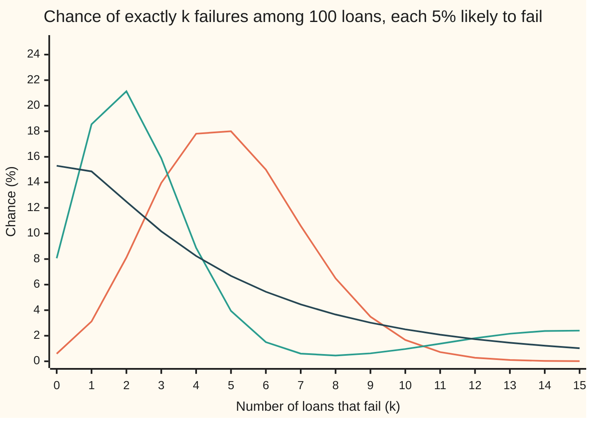

# Default correlation: why a pool's losses cluster, measured by the chance two borrowers fail together

[Syllabus](../../../SYLLABUS.md) → [Financial mathematics](../../../SYLLABUS.md#w12) → [Portfolio Credit - Correlation, Copulas, Indices and Tranches](../../../SYLLABUS.md#w12-s45) → Default correlation

---

## General Overview

Two bakeries trade on the same high street. A bank has lent to both. Each has a 5% chance of failing within the next five years. If their fates were unconnected, both would fail 5% of 5% of the time: 0.25%, one chance in 400.

They are not unconnected. They share a town. A factory closes, footfall drops, rents rise, and both feel it in the same year. Say the chance that both fail is really 0.525%, 21 chances in 4,000. Neither bakery became riskier on its own: each is still at 5%. What changed is how often they fail together. That extra togetherness has a number, the **default correlation**, and here it is 0.058.

Now scale up. The bank holds 100 such loans of $100,000 each, $10 million in all. Each default loses 60% of the loan, since 40% is recovered, so each costs $60,000. On average 5 loans fail and the bank loses $300,000, 3% of the pool, whatever the connection between borrowers. The average does not see clustering. The bad years do. If the 100 loans fail independently, ten or more fail with probability 2.82%. Let them cluster with that same pairwise default correlation and, in the model this card builds, ten or more fail 20.39% of the time: over seven times as often.

**Default correlation is the ordinary correlation of two yes-or-no events, "this borrower fails" and "that one fails"; it turns two single failure chances into the chance of failing together, and it sets how widely a pool's losses spread around their average.**

**What kind of fact this is:** a definition, with two identities that follow from it (the joint chance and the pool's spread), proved on this card in Why it works; the tail of the pool needs a full model on top, and the card says which.

### The picture: how many of 100 loans fail



Orange: independent loans, a neat hump centred on 5. Green: the town model built below, with default correlation 0.058. Dark blue: the bell-curve model of Step 6 with 20% asset correlation, which gives almost the same default correlation, 0.0578. All three lines average 5 failures. The two clustered lines pile weight near zero and, in exchange, keep a long fat tail far past 10: good years are quieter, bad years are much worse.

---

## The formula

Notation first, in words. Write $p_1$ and $p_2$ for the two bakeries' chances of failing over the five years, and $j$ for the chance that both fail. Write $\rho_D$ ("rho D") for the default correlation. Then:

$$j = p_1 p_2 + \rho_D \sqrt{p_1(1-p_1)\,p_2(1-p_2)}$$

**Read it aloud:** the chance both fail is the chance under independence, plus the default correlation times a fixed scale set by the two single chances.

Run backwards, the same line gives the correlation from a joint chance:

$$\rho_D = \frac{j - p_1 p_2}{\sqrt{p_1(1-p_1)\,p_2(1-p_2)}}$$

**Read it aloud:** the default correlation is the extra joint failure beyond independence, measured in units of that scale.

For a pool of $n$ loans that all share one failure chance $p$ and one pairwise default correlation, let $S$ be the number that fail. Its spread, the variance (average squared distance from the mean), is

$$\operatorname{Var}(S) = n\,p\,(1-p)\,\bigl[1 + (n-1)\,\rho_D\bigr]$$

**Read it aloud:** the independent pool's variance, multiplied by one plus the number of other loans times the default correlation.

| Symbol | Plain meaning | In our example | Push it up and the answer… |
| --- | --- | --- | --- |
| $p_1$, $p_2$ | each borrower's chance of failing by the horizon | 5% each, over five years | the joint chance rises |
| $p$ | the shared failure chance when all loans are alike | 5% | more failures on average |
| $j$ | the chance both borrowers fail by the horizon | 0.25% independent, 0.525% clustered | — |
| $\rho_D$ | default correlation: the correlation of the two yes-or-no outcomes | 0.058 (exactly 11/190) | joint chance and pool spread rise; the average does not move |
| $B_1$, $B_2$ | failure indicators: 1 if that borrower fails, 0 if not | 0 or 1 | — |
| $n$ | number of loans in the pool | 100 | the spread grows, faster when clustered |
| $S$ | number of loans in the pool that fail | 5 on average | — |
| $\operatorname{Var}(S)$ | variance of that count: average squared distance from 5 | 4.75 independent, 31.975 clustered | — |
| $\rho_A$ | asset correlation: the correlation of two borrowers' underlying health scores, a different number | 20% | raises $\rho_D$, but far less than one for one |
| $c$ | the failure threshold on a standard health score | −1.645 | — |
| $N(x)$ | bell-curve area to the left of x ([Normal](../../09-Probability%20and%20statistics/04-Continuous%20Distributions/04-normal-distribution.md)) | N(−1.645) = 0.05 | — |

### When it holds

- **Default correlation is a definition, so it holds wherever both chances lie strictly between 0 and 1.** At exactly 0 or 1 a borrower's outcome is certain, the scale is zero, and the correlation does not exist, though the joint chance still does.
- **One horizon for everything.** The chances and the correlation all refer to failing within the same five years. Mix a one-year correlation with five-year chances and the joint chance is simply wrong.
- **Not every correlation is possible.** The joint chance must lie between max(0, p1 + p2 − 1) and min(p1, p2). For two 5% names that caps the correlation between −0.0526 and 1, far narrower than −1 to 1.
- **The pool formula needs alike loans.** One shared chance, one pairwise correlation, equal sizes, fixed recovery. Recoveries that fall in bad years add spread the formula misses.
- **The spread, not the tail.** The pool variance holds for any model with that pairwise correlation. The chance of ten or more failures does not: it needs a full model of all 100 loans at once.

---

## Why it works

### Step 0: a failure is a number, so it can be correlated

Code each bakery's fate as a number: 1 if it fails within five years, 0 if it survives. Call these $B_1$ and $B_2$, the failure indicators. Correlation measures how two numbers move together ([Two variables at once](../../09-Probability%20and%20statistics/02-Random%20Variables/04-joint-distributions-and-covariance.md)). Apply it to these two 0-or-1 numbers and the result is the default correlation. No model of the economy, no bell curve.

### Step 1: averages of indicators are probabilities

The average of an indicator is the chance it equals 1. So the average of the first bakery's indicator is 5%, the chance it fails. The product of the two indicators is 1 only when both fail, so its average is $j$, the joint chance.

### Step 2: covariance, variance, correlation

Covariance is the average of the product minus the product of the averages: here j minus p1 times p2. For the bakeries, 0.525% − 0.25% = 0.275%.

Variance of an indicator: it is either 0 or 1, so squaring changes nothing, and the variance is p − p^2, which is p(1 − p). For a 5% bakery, 0.05 × 0.95 = 0.0475.

Correlation is covariance divided by the product of the two standard deviations (square roots of the variances). That gives the second formula; multiplying through gives the first. For the bakeries, 0.00275 / 0.0475 = 11/190 = 0.057895, which rounds to 0.058.

The map from correlation to joint chance is a straight line whose slope, the square-root scale, is positive whenever both chances lie strictly between 0 and 1. A straight line with positive slope has exactly one input for each output. So every allowed joint chance has one default correlation, and every allowed correlation one joint chance.

### Step 3: the four cells fix which correlations are allowed

Two bakeries give four outcomes. Their chances follow from the three numbers already in hand:

| | Second fails | Second survives |
| --- | --- | --- |
| **First fails** | j = 0.525% | p1 − j = 4.475% |
| **First survives** | p2 − j = 4.475% | 1 − p1 − p2 + j = 90.525% |

Every cell must be at least zero. The top-left forces j ≥ 0; the two off-diagonal cells force j ≤ 5%; the bottom-right forces j ≥ p1 + p2 − 1, which is negative here and so adds nothing. Put j = 0 into the inverse formula and the correlation is −0.0025 / 0.0475 = −1/19 = −0.052632. Put j = 5% in and it is exactly 1. Rare events cannot be strongly negatively correlated: the most two 5% bakeries can do is never fail together, and that is only −0.053.

<details>
<summary>Detailed proof: the identity, the range and the pool spread</summary>

**Identity.** Let $B_1$ and $B_2$ take values 0 or 1 with chances of 1 equal to p1 and p2, and joint chance j of both being 1. Then E[B1] = p1, E[B1 B2] = j, and since B1^2 = B1, Var(B1) = p1 − p1^2 = p1(1 − p1). Cov(B1, B2) = E[B1 B2] − E[B1] E[B2] = j − p1 p2. For p1 and p2 strictly between 0 and 1 both variances are positive, so ρD = (j − p1 p2) / √(p1(1 − p1) p2(1 − p2)). Solving for j gives the first formula.

**Range.** The four outcomes do not overlap and cover everything, so their chances are exactly the four cells above and sum to 1. Each is a chance, hence at least 0: j ≥ 0, j ≤ p1, j ≤ p2, j ≥ p1 + p2 − 1. Conversely, any j obeying these four bounds makes four non-negative cells that sum to 1, which is a legitimate pair of borrowers with those chances. So the bounds are exactly the allowed set. The inverse formula is increasing in j, so it carries the two ends of that interval to the two ends of the allowed correlation range.

**Pool spread.** S = B1 + … + Bn. The variance of a sum is the sum of all variances plus twice the sum of all covariances over distinct pairs. There are n variances of p(1 − p) each and n(n − 1)/2 distinct pairs, each with covariance ρD p(1 − p). Adding: n p(1 − p) + n(n − 1) ρD p(1 − p), which factors into the pool formula. Nothing here assumed independence or any bell curve.

</details>

### Step 4: a pool's spread grows with every pair

A pool of 100 loans has 4,950 distinct pairs. Each pair adds twice its covariance to the pool's variance. Under independence those covariances are zero and the variance is 100 × 0.05 × 0.95 = 4.75, a standard deviation of 2.18 loans. With default correlation 11/190, each of the 100 × 99 ordered pairs adds 11/190 × 0.0475, and the bracket in the pool formula is 1 + 99 × 11/190 = 6.73. The variance becomes 31.975, a standard deviation of 5.65 loans. Same average, 5 failures; about two and a half times the typical miss.

In money, at $60,000 lost per failure: expected loss $300,000 either way; standard deviation $130,766.97 independent, $339,278.65 clustered.

### Step 5: the spread is fixed, the tail is not

The pool formula uses only pairs. The chance of ten or more failures depends on how all 100 loans behave at once, and pairs do not pin that down. To get a tail, the card needs a full model. Here is the simplest that reproduces the bakeries' numbers exactly.

**The town model.** With chance 11/51, about 21.6%, the town has a bad spell over the five years, and every loan then fails with chance 15%. Otherwise times are fair and each fails with chance 2.25%. Given the spell, loans fail independently of one another.

One loan's failure chance is 11/51 × 15% + 40/51 × 2.25% = 5%. Two loans fail together with chance 11/51 × 0.15^2 + 40/51 × 0.0225^2 = 0.525%, since in either kind of spell the two fail independently. So the town model has exactly the bakeries' 5% and 0.525%, and hence default correlation 11/190.

Its count of failures is a blend of two binomials, the counts of independent failures ([Binomial](../../09-Probability%20and%20statistics/03-Discrete%20Distributions/01-bernoulli-and-binomial.md)): 100 draws at 15%, weighted 11/51, plus 100 draws at 2.25%, weighted 40/51. The chance of ten or more failures:

$$P(S \ge 10) = \tfrac{11}{51}\sum_{k=10}^{100}\binom{100}{k}0.15^k\,0.85^{100-k} + \tfrac{40}{51}\sum_{k=10}^{100}\binom{100}{k}0.0225^k\,0.9775^{100-k} = 20.39\%$$

Here the sum sign adds the terms for k = 10 up to 100, and the binomial coefficient counts the ways to choose which k loans fail. Independent loans give the same sum with 5% in place of both rates and weight 1: 2.82%.

**The copy model: same pairs, different tail.** With chance 11/190 all 100 loans share one coin (all fail together with chance 5%, or all survive); otherwise they fail independently. One loan still fails with chance 5%, and two fail together with chance 11/190 × 5% + 179/190 × 0.25% = 0.525%. Same default correlation. Yet its chance of ten or more failures is only 2.95%. Both models share every single chance and every pairwise joint chance. Their tails differ by a factor of about seven.

**So default correlation fixes the spread of a pool's losses, but not the chance of a disaster.** That needs a full model, which is what the copulas on this shelf supply.

### Step 6: asset correlation is a different number

Banks rarely measure default correlation directly: 5% events are too rare. They model each borrower's underlying health as a score on a bell curve, fail it when the score falls below a threshold $c$, and correlate the scores. That correlation of scores is the **asset correlation**, $\rho_A$. The threshold is the point with 5% of the bell curve below it: $c$ = −1.645, the value where N(c) = 0.05.

With $\rho_A$ = 20%, the chance both scores fall below −1.645 is 0.5245%, so the default correlation is 0.0578. Asset correlation 0.20 becomes default correlation 0.058: cutting a smooth score at a far-out threshold throws away most of the co-movement. The machinery is the one-factor model of [The one-factor Gaussian copula](02-one-factor-gaussian-copula.md); this card only uses its answer, reached two ways in the code.

<details>
<summary>Two roads to the same 0.5245%</summary>

**Road one, through a shared economy.** Each score is √ρA times a common economy draw plus √(1 − ρA) times a private draw. Given the economy at z, each borrower fails with chance N((c − √ρA z) / √(1 − ρA)), independently. Square it for both, then average over z on the bell curve.

**Road two, growing the correlation from zero.** Plackett (1954) showed that the chance both scores fall below c rises, as the correlation r grows, at the rate exp(−c^2 / (1 + r)) / (2π √(1 − r^2)). Start at 0.25%, the independent answer, and add up that rate from r = 0 to r = 0.20. Both roads print 0.005245.

</details>

A third road to every pool number is brute force: the code simulates 20,000 towns of 100 loans with its own random numbers and counts.

---

## Worked numbers, by hand

Two bakeries, each 5% likely to fail within five years, default correlation 11/190 (0.058 to three places). Then 100 alike loans of $100,000, 40% recovery.

| Step | Arithmetic | Value |
| --- | --- | --- |
| independent joint chance | 0.05 × 0.05 | 0.25% |
| scale | √(0.05 × 0.95 × 0.05 × 0.95) = 0.05 × 0.95 | 0.0475 |
| extra from correlation | 11/190 × 0.0475 | 0.275% |
| **joint chance of both failing** | 0.25% + 0.275% | **0.525%** |
| back again | (0.00525 − 0.0025) / 0.0475 | 0.057895 |
| if the correlation is exactly 0.058 | 0.0025 + 0.058 × 0.0475 | 0.5255% |
| allowed range of correlation | j = 0 and j = 5% in the inverse | −0.052632 to 1 |
| pool average | 100 × 0.05 | 5 failures |
| pool variance, independent | 100 × 0.05 × 0.95 | 4.75 (sd 2.18) |
| pool variance, clustered | 4.75 × (1 + 99 × 11/190) | 31.975 (sd 5.65) |
| expected loss | 5 × $60,000 | $300,000 |
| 10 or more failures, independent | binomial sum | 2.82% |
| **10 or more failures, town model** | blend of two binomial sums | **20.39%** |

Priced as independent, a loss of ten failures or more comes once in 35 five-year spells. With the town's clustering it is about one in five.

```
chance of 10 or more failures among 100 loans, each bar in %
independent             ███                                        2.82%
copy model, same pairs  ███                                        2.95%
asset correlation 20%   ████████████████                          15.69%
town model              █████████████████████                     20.39%
```

The copy model and the town model share the bakeries' default correlation exactly; the asset-correlation model shares it to three places. The tails range from 2.95% to 20.39%.

### What breaks if you drop a piece

| Mistake | Comes out at | What went wrong |
| --- | --- | --- |
| Put asset correlation 0.20 into the joint-chance formula | 1.2% joint chance (right: 0.525%) | 0.20 is the scores' correlation. The failures' correlation is 0.058. |
| Scale the correlation by p1 × p2 instead of the square-root term | 0.2645% (right: 0.525%) | The scale is the two standard deviations, 0.0475, not 0.0025. |
| Ignore the pairs in the pool's variance | sd 2.18 loans (right: 5.65) | 4,950 pairs each add covariance; independence sets them to zero. |
| Read the tail from the pair correlation alone | 2.95% or 20.39%, same correlation | Pairs fix the spread. The tail needs a model of all 100 loans. |

---

## Code, from first principles, and it actually runs

The scripts compute the joint chance from the correlation and back, the four cells and the allowed range, then build the pool's full count distribution three ways: binomial sums, adding one loan at a time to a running distribution, and simulating 20,000 towns with a hand-written random number generator. The asset-correlation step is reached by two independent integrals, the shared-economy average and Plackett's rate. Asserts check that the town model meets the pair formula, that the full distribution's variance meets the pool formula, that the two binomial roads and the two Gaussian roads agree, and that the simulation lands within four standard errors. Both scripts print every number on this card.

### Python

```python
# Default correlation -- the check behind the card.  Standard library only.
# Two bakeries, each 5% likely to fail within five years; then a pool of 100
# such loans.  Normal curve, inverse, integrator and random numbers are written
# out here; nothing imported already knows the answer.
from math import exp, sqrt, pi, comb

def phi(x): return exp(-0.5 * x * x) / sqrt(2.0 * pi)      # bell-curve height
def simpson(f, a, b, n):                                     # area under f, n even
    h = (b - a) / n; s = f(a) + f(b)
    for i in range(1, n): s += (4 if i % 2 else 2) * f(a + i * h)
    return s * h / 3.0
def N(x): return 0.5 + simpson(phi, 0.0, x, 400)            # bell-curve area left of x
def N_inv(prob):                                              # bisection on N
    lo, hi = -10.0, 10.0
    for _ in range(100):
        mid = 0.5 * (lo + hi)
        if N(mid) < prob: lo = mid
        else: hi = mid
    return 0.5 * (lo + hi)

def joint(p1, p2, rho): return p1 * p2 + rho * sqrt(p1 * (1 - p1) * p2 * (1 - p2))
def rho_of(p1, p2, j):  return (j - p1 * p2) / sqrt(p1 * (1 - p1) * p2 * (1 - p2))
def pmf_formula(n, q): return [comb(n, k) * q**k * (1 - q)**(n - k) for k in range(n + 1)]
def pmf_by_adding(n, q):              # road 2: add one loan at a time, no binomial formula
    d = [1.0]
    for _ in range(n):
        d = [(d[k] if k < len(d) else 0.0) * (1 - q) + (d[k - 1] * q if k > 0 else 0.0)
             for k in range(len(d) + 1)]
    return d
def mix(parts): return [sum(w * d[k] for w, d in parts) for k in range(len(parts[0][1]))]
def tail(d, m): return sum(d[m:])
def mean_var(d):
    m = sum(k * x for k, x in enumerate(d))
    return m, sum(k * k * x for k, x in enumerate(d)) - m * m

p, n, loan, recovery = 0.05, 100, 100_000.0, 0.40
loss_each = loan * (1 - recovery)

# ---- the pair: from default correlation to joint default and back ----
rho_d = 11 / 190
j_ind = joint(p, p, 0.0)
j = joint(p, p, rho_d)
j_058 = joint(p, p, 0.058)
cells = (j, p - j, p - j, 1 - 2 * p + j)
rho_lo, rho_hi = rho_of(p, p, max(0.0, 2 * p - 1)), rho_of(p, p, min(p, p))

# ---- the town model: a bad spell (prob 11/51, 15% each) or not (2.25% each) ----
w, p_bad, p_good = 11 / 51, 0.15, 0.0225
p_town = w * p_bad + (1 - w) * p_good
j_town = w * p_bad**2 + (1 - w) * p_good**2              # two loans, same spell
assert abs(j_town - j) < 1e-15                           # town model meets the pair formula
indep = pmf_formula(n, p)
town = mix([(w, pmf_formula(n, p_bad)), (1 - w, pmf_formula(n, p_good))])
town2 = mix([(w, pmf_by_adding(n, p_bad)), (1 - w, pmf_by_adding(n, p_good))])
assert max(abs(a - b) for a, b in zip(town, town2)) < 1e-14
assert abs(tail(indep, 10) - tail(pmf_by_adding(n, p), 10)) < 1e-14
m_i, v_i = mean_var(indep)
m_t, v_t = mean_var(town)
v_formula = n * p * (1 - p) * (1 + (n - 1) * rho_of(p, p, j_town))
assert abs(v_t - v_formula) < 1e-9                        # full law agrees with pair formula

# ---- copy model: same p, same pair, different tail ----
copy_tail = rho_d * p + (1 - rho_d) * tail(indep, 10)

# ---- asset correlation 20% through the one-factor Gaussian model ----
rho_a = 0.20
c = N_inv(p)
def cond(z, ra): return N((c - sqrt(ra) * z) / sqrt(1 - ra))   # default chance given the economy z
def j_factor(ra): return simpson(lambda z: cond(z, ra)**2 * phi(z), -8.0, 8.0, 400)
def j_plackett(ra):                                            # road 2: grow correlation from 0
    return p * p + simpson(lambda r: exp(-c * c / (1 + r)) / (2 * pi * sqrt(1 - r * r)), 0.0, ra, 200)
j_g, j_g2 = j_factor(rho_a), j_plackett(rho_a)
assert abs(j_g - j_g2) < 1e-12
gauss = [simpson(lambda z: pmf_formula(n, cond(z, rho_a))[k] * phi(z), -8.0, 8.0, 400) for k in range(n + 1)]
assert abs(mean_var(gauss)[1] - n * p * (1 - p) * (1 + (n - 1) * rho_of(p, p, j_g))) < 1e-6

# ---- road 3: simulate 20,000 pools of the town model ----
MASK = (1 << 64) - 1
state = 20260928
def uniform():                                    # splitmix64, top 53 bits
    global state
    state = (state + 0x9E3779B97F4A7C15) & MASK
    z = state
    z = ((z ^ (z >> 30)) * 0xBF58476D1CE4E5B9) & MASK
    z = ((z ^ (z >> 27)) * 0x94D049BB133111EB) & MASK
    return ((z ^ (z >> 31)) >> 11) / 9007199254740992.0
pools, hits, pairs = 20_000, 0, 0
for _ in range(pools):
    q = p_bad if uniform() < w else p_good
    s = sum(1 for _ in range(n) if uniform() < q)
    hits += s >= 10
    pairs += s * (s - 1)
mc_tail = hits / pools
mc_joint = pairs / (pools * n * (n - 1))
se = sqrt(tail(town, 10) * (1 - tail(town, 10)) / pools)
assert abs(mc_tail - tail(town, 10)) < 4 * se
assert abs(mc_joint - j) < 0.0004

rows = [
    ("pair: both fail, independent", j_ind), ("pair: scale, sqrt of p(1-p)p(1-p)", joint(p, p, 1.0) - j_ind),
    ("pair: extra from rho_D", j - j_ind), ("pair: both fail, rho_D = 11/190", j),
    ("pair: both fail, rho_D = 0.058", j_058), ("pair: rho_D back from 0.525%", rho_of(p, p, 0.00525)),
    ("cells: one fails, other survives", cells[1]), ("cells: neither fails", cells[3]),
    ("bounds: lowest rho_D", rho_lo), ("bounds: highest rho_D", rho_hi),
    ("town: bad-spell chance", w), ("town: default chance", p_town), ("town: both fail", j_town),
    ("pool: mean defaults, independent", m_i), ("pool: mean defaults, town", m_t),
    ("pool: variance, independent", v_i), ("pool: bracket 1 + 99 rho_D", 1 + (n - 1) * rho_d),
    ("pool: variance, pair formula", v_formula), ("pool: variance, town model", v_t),
    ("pool: sd defaults, independent", sqrt(v_i)), ("pool: sd defaults, town", sqrt(v_t)),
    ("pool: sd ratio, town / indep", sqrt(v_t / v_i)),
    ("pool: expected loss $", m_i * loss_each), ("pool: sd loss $, independent", sqrt(v_i) * loss_each),
    ("pool: sd loss $, town", sqrt(v_t) * loss_each),
    ("tail: 10+ fail, independent", tail(indep, 10)), ("tail: 10+ fail, town", tail(town, 10)),
    ("tail: 10+ fail, copy model", copy_tail), ("tail: 10+ fail, asset corr 20%", tail(gauss, 10)),
    ("tail: town / independent", tail(town, 10) / tail(indep, 10)),
    ("tail: asset 20% / independent", tail(gauss, 10) / tail(indep, 10)),
    ("tail: town / copy", tail(town, 10) / copy_tail),
    ("tail: one spell in, independent", 1 / tail(indep, 10)), ("tail: one spell in, town", 1 / tail(town, 10)),
    ("sim: 10+ fail, 20,000 pools", mc_tail), ("sim: both fail, all pairs", mc_joint),
    ("asset: threshold c = N_inv(0.05)", c), ("asset: both fail, factor road", j_g),
    ("asset: both fail, Plackett road", j_g2), ("asset: rho_D implied by 20%", rho_of(p, p, j_g)),
    ("wrong: asset 0.20 used as rho_D", joint(p, p, rho_a)), ("wrong: rho_D times p1*p2", j_ind * (1 + rho_d)),
    ("try: rho_D implied by asset 40%", rho_of(p, p, j_factor(0.40))),
    ("try: sd ratio, 1,000 loans", sqrt(1 + 999 * rho_d)),
]
for name, v in rows:
    print(f"{name:<34} {v:>16.6f}")
print("dist: k, P(S=k) in %: independent, town, asset 20%; twice per line")
for k in range(8):
    a, b = k, k + 8
    print(f"dist {a:>2} {100 * indep[a]:>6.2f} {100 * town[a]:>6.2f} {100 * gauss[a]:>6.2f}"
          f"  | {b:>2} {100 * indep[b]:>6.2f} {100 * town[b]:>6.2f} {100 * gauss[b]:>6.2f}")
```

**Ran 2026-09-28 on macOS, Python 3.14.6, standard library only. All checks passed. Output, pasted from the run:**

```
pair: both fail, independent               0.002500
pair: scale, sqrt of p(1-p)p(1-p)          0.047500
pair: extra from rho_D                     0.002750
pair: both fail, rho_D = 11/190            0.005250
pair: both fail, rho_D = 0.058             0.005255
pair: rho_D back from 0.525%               0.057895
cells: one fails, other survives           0.044750
cells: neither fails                       0.905250
bounds: lowest rho_D                      -0.052632
bounds: highest rho_D                      1.000000
town: bad-spell chance                     0.215686
town: default chance                       0.050000
town: both fail                            0.005250
pool: mean defaults, independent           5.000000
pool: mean defaults, town                  5.000000
pool: variance, independent                4.750000
pool: bracket 1 + 99 rho_D                 6.731579
pool: variance, pair formula              31.975000
pool: variance, town model                31.975000
pool: sd defaults, independent             2.179449
pool: sd defaults, town                    5.654644
pool: sd ratio, town / indep               2.594529
pool: expected loss $                 300000.000000
pool: sd loss $, independent          130766.968306
pool: sd loss $, town                 339278.646543
tail: 10+ fail, independent                0.028188
tail: 10+ fail, town                       0.203875
tail: 10+ fail, copy model                 0.029451
tail: 10+ fail, asset corr 20%             0.156856
tail: town / independent                   7.232595
tail: asset 20% / independent              5.564593
tail: town / copy                          6.922481
tail: one spell in, independent           35.475719
tail: one spell in, town                   4.904978
sim: 10+ fail, 20,000 pools                0.204700
sim: both fail, all pairs                  0.005293
asset: threshold c = N_inv(0.05)          -1.644854
asset: both fail, factor road              0.005245
asset: both fail, Plackett road            0.005245
asset: rho_D implied by 20%                0.057799
wrong: asset 0.20 used as rho_D            0.012000
wrong: rho_D times p1*p2                   0.002645
try: rho_D implied by asset 40%            0.145837
try: sd ratio, 1,000 loans                 7.670518
dist: k, P(S=k) in %: independent, town, asset 20%; twice per line
dist  0   0.59   8.06  15.30  |  8   6.49   0.45   3.66
dist  1   3.12  18.55  14.86  |  9   3.49   0.62   3.02
dist  2   8.12  21.13  12.49  | 10   1.67   0.96   2.50
dist  3  13.96  15.89  10.17  | 11   0.72   1.38   2.08
dist  4  17.81   8.88   8.24  | 12   0.28   1.81   1.73
dist  5  18.00   3.94   6.68  | 13   0.10   2.16   1.45
dist  6  15.00   1.50   5.44  | 14   0.03   2.37   1.22
dist  7  10.60   0.60   4.45  | 15   0.01   2.40   1.02
```

### Rust

```rust
// Default correlation -- the check behind the card.  Rust std only, no crates.
// Two bakeries, each 5% likely to fail within five years; then a pool of 100
// such loans.  Normal curve, inverse, integrator and random numbers are written
// out here; nothing imported already knows the answer.
use std::f64::consts::PI;

fn phi(x: f64) -> f64 { (-0.5 * x * x).exp() / (2.0 * PI).sqrt() }
fn simpson<F: Fn(f64) -> f64>(f: F, a: f64, b: f64, n: usize) -> f64 {
    let h = (b - a) / n as f64;
    let mut s = f(a) + f(b);
    for i in 1..n { s += if i % 2 == 1 { 4.0 } else { 2.0 } * f(a + i as f64 * h); }
    s * h / 3.0
}
fn big_n(x: f64) -> f64 { 0.5 + simpson(phi, 0.0, x, 400) }
fn n_inv(prob: f64) -> f64 {
    let (mut lo, mut hi) = (-10.0, 10.0);
    for _ in 0..100 {
        let mid = 0.5 * (lo + hi);
        if big_n(mid) < prob { lo = mid } else { hi = mid }
    }
    0.5 * (lo + hi)
}
fn joint(p1: f64, p2: f64, rho: f64) -> f64 { p1 * p2 + rho * (p1 * (1.0 - p1) * p2 * (1.0 - p2)).sqrt() }
fn rho_of(p1: f64, p2: f64, j: f64) -> f64 { (j - p1 * p2) / (p1 * (1.0 - p1) * p2 * (1.0 - p2)).sqrt() }
fn pmf_formula(n: usize, q: f64) -> Vec<f64> {
    // binomial coefficients by the ratio C(n,k) = C(n,k-1) (n-k+1)/k
    let mut out = Vec::with_capacity(n + 1);
    let mut coef = 1.0;
    for k in 0..=n {
        if k > 0 { coef *= (n - k + 1) as f64 / k as f64; }
        out.push(coef * q.powi(k as i32) * (1.0 - q).powi((n - k) as i32));
    }
    out
}
fn pmf_by_adding(n: usize, q: f64) -> Vec<f64> {
    let mut d = vec![1.0];
    for _ in 0..n {
        let mut e = vec![0.0; d.len() + 1];
        for k in 0..d.len() { e[k] += d[k] * (1.0 - q); e[k + 1] += d[k] * q; }
        d = e;
    }
    d
}
fn mix(parts: &[(f64, Vec<f64>)]) -> Vec<f64> {
    (0..parts[0].1.len()).map(|k| parts.iter().map(|(w, d)| w * d[k]).sum()).collect()
}
fn tail(d: &[f64], m: usize) -> f64 { d[m..].iter().sum() }
fn mean_var(d: &[f64]) -> (f64, f64) {
    let m: f64 = d.iter().enumerate().map(|(k, x)| k as f64 * x).sum();
    let s2: f64 = d.iter().enumerate().map(|(k, x)| (k * k) as f64 * x).sum();
    (m, s2 - m * m)
}
struct SplitMix(u64);
impl SplitMix {
    fn uniform(&mut self) -> f64 {
        self.0 = self.0.wrapping_add(0x9E3779B97F4A7C15);
        let mut z = self.0;
        z = (z ^ (z >> 30)).wrapping_mul(0xBF58476D1CE4E5B9);
        z = (z ^ (z >> 27)).wrapping_mul(0x94D049BB133111EB);
        ((z ^ (z >> 31)) >> 11) as f64 / 9007199254740992.0
    }
}

fn main() {
    let (p, n, loan, recovery) = (0.05_f64, 100usize, 100_000.0_f64, 0.40_f64);
    let loss_each = loan * (1.0 - recovery);
    let nf = n as f64;

    // the pair: from default correlation to joint default and back
    let rho_d = 11.0 / 190.0;
    let j_ind = joint(p, p, 0.0);
    let j = joint(p, p, rho_d);
    let j_058 = joint(p, p, 0.058);
    let cells = [j, p - j, p - j, 1.0 - 2.0 * p + j];
    let rho_lo = rho_of(p, p, (2.0 * p - 1.0).max(0.0));
    let rho_hi = rho_of(p, p, p.min(p));

    // the town model: a bad spell (prob 11/51, 15% each) or not (2.25% each)
    let (w, p_bad, p_good) = (11.0 / 51.0, 0.15, 0.0225);
    let p_town = w * p_bad + (1.0 - w) * p_good;
    let j_town = w * p_bad * p_bad + (1.0 - w) * p_good * p_good;
    assert!((j_town - j).abs() < 1e-15, "town model misses the pair formula");
    let indep = pmf_formula(n, p);
    let town = mix(&[(w, pmf_formula(n, p_bad)), (1.0 - w, pmf_formula(n, p_good))]);
    let town2 = mix(&[(w, pmf_by_adding(n, p_bad)), (1.0 - w, pmf_by_adding(n, p_good))]);
    assert!(town.iter().zip(&town2).all(|(a, b)| (a - b).abs() < 1e-14));
    assert!((tail(&indep, 10) - tail(&pmf_by_adding(n, p), 10)).abs() < 1e-14);
    let (m_i, v_i) = mean_var(&indep);
    let (m_t, v_t) = mean_var(&town);
    let v_formula = nf * p * (1.0 - p) * (1.0 + (nf - 1.0) * rho_of(p, p, j_town));
    assert!((v_t - v_formula).abs() < 1e-9, "full law disagrees with pair formula");

    // copy model: same p, same pair, different tail
    let copy_tail = rho_d * p + (1.0 - rho_d) * tail(&indep, 10);

    // asset correlation 20% through the one-factor Gaussian model
    let rho_a = 0.20;
    let c = n_inv(p);
    let cond = |z: f64, ra: f64| big_n((c - ra.sqrt() * z) / (1.0 - ra).sqrt());
    let j_factor = |ra: f64| simpson(|z| cond(z, ra).powi(2) * phi(z), -8.0, 8.0, 400);
    let j_plackett = |ra: f64| p * p + simpson(|r| (-c * c / (1.0 + r)).exp() / (2.0 * PI * (1.0 - r * r).sqrt()), 0.0, ra, 200);
    let (j_g, j_g2) = (j_factor(rho_a), j_plackett(rho_a));
    assert!((j_g - j_g2).abs() < 1e-12, "the two Gaussian roads disagree");
    let mut gauss = vec![0.0; n + 1];
    let (a, b, steps) = (-8.0_f64, 8.0_f64, 400usize);
    let h = (b - a) / steps as f64;
    for i in 0..=steps {
        let z = a + i as f64 * h;
        let wt = if i == 0 || i == steps { 1.0 } else if i % 2 == 1 { 4.0 } else { 2.0 };
        let d = pmf_formula(n, cond(z, rho_a));
        for k in 0..=n { gauss[k] += wt * d[k] * phi(z) * h / 3.0; }
    }
    assert!((mean_var(&gauss).1 - nf * p * (1.0 - p) * (1.0 + (nf - 1.0) * rho_of(p, p, j_g))).abs() < 1e-6);

    // road 3: simulate 20,000 pools of the town model
    let mut rng = SplitMix(20260928);
    let (pools, mut hits, mut pairs) = (20_000usize, 0usize, 0usize);
    for _ in 0..pools {
        let q = if rng.uniform() < w { p_bad } else { p_good };
        let s = (0..n).filter(|_| rng.uniform() < q).count();
        if s >= 10 { hits += 1; }
        pairs += s * s.saturating_sub(1);
    }
    let mc_tail = hits as f64 / pools as f64;
    let mc_joint = pairs as f64 / (pools as f64 * nf * (nf - 1.0));
    let t_town = tail(&town, 10);
    let se = (t_town * (1.0 - t_town) / pools as f64).sqrt();
    assert!((mc_tail - t_town).abs() < 4.0 * se, "simulation misses the exact tail");
    assert!((mc_joint - j).abs() < 0.0004, "simulation misses the pair");

    let t_ind = tail(&indep, 10);
    let t_gauss = tail(&gauss, 10);
    let rows: Vec<(&str, f64)> = vec![
        ("pair: both fail, independent", j_ind), ("pair: scale, sqrt of p(1-p)p(1-p)", joint(p, p, 1.0) - j_ind),
        ("pair: extra from rho_D", j - j_ind), ("pair: both fail, rho_D = 11/190", j),
        ("pair: both fail, rho_D = 0.058", j_058), ("pair: rho_D back from 0.525%", rho_of(p, p, 0.00525)),
        ("cells: one fails, other survives", cells[1]), ("cells: neither fails", cells[3]),
        ("bounds: lowest rho_D", rho_lo), ("bounds: highest rho_D", rho_hi),
        ("town: bad-spell chance", w), ("town: default chance", p_town), ("town: both fail", j_town),
        ("pool: mean defaults, independent", m_i), ("pool: mean defaults, town", m_t),
        ("pool: variance, independent", v_i), ("pool: bracket 1 + 99 rho_D", 1.0 + (nf - 1.0) * rho_d),
        ("pool: variance, pair formula", v_formula), ("pool: variance, town model", v_t),
        ("pool: sd defaults, independent", v_i.sqrt()), ("pool: sd defaults, town", v_t.sqrt()),
        ("pool: sd ratio, town / indep", (v_t / v_i).sqrt()),
        ("pool: expected loss $", m_i * loss_each), ("pool: sd loss $, independent", v_i.sqrt() * loss_each),
        ("pool: sd loss $, town", v_t.sqrt() * loss_each),
        ("tail: 10+ fail, independent", t_ind), ("tail: 10+ fail, town", t_town),
        ("tail: 10+ fail, copy model", copy_tail), ("tail: 10+ fail, asset corr 20%", t_gauss),
        ("tail: town / independent", t_town / t_ind), ("tail: asset 20% / independent", t_gauss / t_ind),
        ("tail: town / copy", t_town / copy_tail),
        ("tail: one spell in, independent", 1.0 / t_ind), ("tail: one spell in, town", 1.0 / t_town),
        ("sim: 10+ fail, 20,000 pools", mc_tail), ("sim: both fail, all pairs", mc_joint),
        ("asset: threshold c = N_inv(0.05)", c), ("asset: both fail, factor road", j_g),
        ("asset: both fail, Plackett road", j_g2), ("asset: rho_D implied by 20%", rho_of(p, p, j_g)),
        ("wrong: asset 0.20 used as rho_D", joint(p, p, rho_a)), ("wrong: rho_D times p1*p2", j_ind * (1.0 + rho_d)),
        ("try: rho_D implied by asset 40%", rho_of(p, p, j_factor(0.40))),
        ("try: sd ratio, 1,000 loans", (1.0 + 999.0 * rho_d).sqrt()),
    ];
    for (name, v) in &rows { println!("{:<34} {:>16.6}", name, v); }
    println!("dist: k, P(S=k) in %: independent, town, asset 20%; twice per line");
    for a in 0..8 {
        let b = a + 8;
        println!("dist {:>2} {:>6.2} {:>6.2} {:>6.2}  | {:>2} {:>6.2} {:>6.2} {:>6.2}",
                 a, 100.0 * indep[a], 100.0 * town[a], 100.0 * gauss[a], b, 100.0 * indep[b], 100.0 * town[b], 100.0 * gauss[b]);
    }
}
```

**Ran 2026-09-28 on macOS, rustc 1.98.1, no crates. All checks passed. Output, pasted from the run:**

```
pair: both fail, independent               0.002500
pair: scale, sqrt of p(1-p)p(1-p)          0.047500
pair: extra from rho_D                     0.002750
pair: both fail, rho_D = 11/190            0.005250
pair: both fail, rho_D = 0.058             0.005255
pair: rho_D back from 0.525%               0.057895
cells: one fails, other survives           0.044750
cells: neither fails                       0.905250
bounds: lowest rho_D                      -0.052632
bounds: highest rho_D                      1.000000
town: bad-spell chance                     0.215686
town: default chance                       0.050000
town: both fail                            0.005250
pool: mean defaults, independent           5.000000
pool: mean defaults, town                  5.000000
pool: variance, independent                4.750000
pool: bracket 1 + 99 rho_D                 6.731579
pool: variance, pair formula              31.975000
pool: variance, town model                31.975000
pool: sd defaults, independent             2.179449
pool: sd defaults, town                    5.654644
pool: sd ratio, town / indep               2.594529
pool: expected loss $                 300000.000000
pool: sd loss $, independent          130766.968306
pool: sd loss $, town                 339278.646543
tail: 10+ fail, independent                0.028188
tail: 10+ fail, town                       0.203875
tail: 10+ fail, copy model                 0.029451
tail: 10+ fail, asset corr 20%             0.156856
tail: town / independent                   7.232595
tail: asset 20% / independent              5.564593
tail: town / copy                          6.922481
tail: one spell in, independent           35.475719
tail: one spell in, town                   4.904978
sim: 10+ fail, 20,000 pools                0.204700
sim: both fail, all pairs                  0.005293
asset: threshold c = N_inv(0.05)          -1.644854
asset: both fail, factor road              0.005245
asset: both fail, Plackett road            0.005245
asset: rho_D implied by 20%                0.057799
wrong: asset 0.20 used as rho_D            0.012000
wrong: rho_D times p1*p2                   0.002645
try: rho_D implied by asset 40%            0.145837
try: sd ratio, 1,000 loans                 7.670518
dist: k, P(S=k) in %: independent, town, asset 20%; twice per line
dist  0   0.59   8.06  15.30  |  8   6.49   0.45   3.66
dist  1   3.12  18.55  14.86  |  9   3.49   0.62   3.02
dist  2   8.12  21.13  12.49  | 10   1.67   0.96   2.50
dist  3  13.96  15.89  10.17  | 11   0.72   1.38   2.08
dist  4  17.81   8.88   8.24  | 12   0.28   1.81   1.73
dist  5  18.00   3.94   6.68  | 13   0.10   2.16   1.45
dist  6  15.00   1.50   5.44  | 14   0.03   2.37   1.22
dist  7  10.60   0.60   4.45  | 15   0.01   2.40   1.02
```

The two outputs agree line for line; the simulation matches because both run the same integer generator from the same seed.

> [!TIP]
> **Try changing**
> Guess first, then run.
> - **Double the asset correlation.** The row `try: rho_D implied by asset 40%` calls `j_factor(0.40)`. The default correlation rises to **0.145837**: more than double, still far below 0.40.
> - **Grow the pool to 1,000 loans.** The clustered standard deviation divided by the independent one is the square root of 1 + 999 × 11/190: **7.67**, against 5.65 / 2.18 at 100 loans. Clustering matters more the bigger the pool, because pairs grow with the square of the count.
> - **Push the correlation to its floor.** Add a row with `joint(p, p, -1 / 19)`, the printed lowest value −0.052632. It prints zero: the two bakeries never fail together, and no lower correlation exists. (Changing `rho_d` itself trips the first assert, since the town model is built for 11/190.)
> - **Round the correlation.** The row `pair: both fail, rho_D = 0.058` prints **0.005255**, half a hundredth of a percent above 0.525%: the rounding, not a new effect.

---

## The usual mistake

> [!warning]
> **Treating asset correlation and default correlation as one number.** They measure different things. Asset correlation is how two smooth health scores move together; default correlation is how two yes-or-no failures move together. At 5% failure chances, 20% asset correlation is 5.8% default correlation. Feed 0.20 into the joint-chance formula and the joint chance comes out 1.2%, more than double the right 0.525%.
>
> Smaller traps:
> - **Reading the correlation range as −1 to 1.** For two 5% names the floor is −0.052632. A quoted −0.3 is not a pessimistic assumption; it is impossible.
> - **Thinking correlation moves the expected loss.** It does not: $300,000 on this pool at any correlation. It moves the spread, from a standard deviation of $130,766.97 to $339,278.65, and the tail.
> - **Pricing a tail from the pair correlation.** Two models with identical pairs give 2.95% and 20.39% for ten or more failures. A tail figure without a named model is not a number.
> - **Mixing horizons.** A default correlation estimated over one year does not carry to five-year chances; both the chances and the correlation change with the horizon.

---

## Where you meet it in real life

- **Bank capital.** Regulators set bank capital against loan books by assigning each loan an asset correlation, then turning it into a loss curve for bad years. A later card on this shelf builds that curve: [Vasicek's large-pool loss curve](03-vasicek-loss-distribution-and-basel-capital.md).
- **Rating agencies.** Lucas (1995), at Moody's, estimated default correlations from historical default counts by rating grade, using the indicator correlation defined here.
- **Credit indices.** A credit index bundles 100 or 125 companies' default protection into one traded contract. Its average loss ignores correlation; how that loss is split does not: [Credit indices (CDX and iTraxx in outline)](04-credit-indices.md).
- **Tranches.** Slice a pool's losses into first-loss, middle and senior layers and correlation decides who is hurt: [Tranches](05-cdo-tranches-in-outline.md). Markets quote the correlation back out of tranche prices: [Implied correlation](06-implied-and-base-correlation.md).
- **2007 and 2008.** Mortgage pools were priced with modest correlations and bell-curve models. Defaults arrived together, as the town model's fat tail says they can. Models with fatter joint tails followed: [Tail dependence](07-tail-dependence-and-the-t-copula.md).

> **Say it back**
> Code each borrower's failure as 1 or 0; default correlation is the ordinary correlation of those numbers. It turns two single chances into the joint chance: independence plus the correlation times the product of the two standard deviations, so 5% and 5% at 0.058 give 0.525% instead of 0.25%. In a pool it leaves the average loss alone and widens the spread, since every pair adds a covariance. It does not fix the chance of a disaster, which needs a model of all the loans at once. And it is not asset correlation: 20% on health scores is only 0.058 on failures.

---

## What this builds on

- [Default probability, recovery and expected loss](../41-Default%2C%20Survival%20and%20the%20Hazard%20Rate/01-default-probability-recovery-and-expected-loss.md): one borrower's failure chance, recovery and expected loss, the 5%, 40% and 3% this card starts from.
- [Two variables at once](../../09-Probability%20and%20statistics/02-Random%20Variables/04-joint-distributions-and-covariance.md): covariance, correlation and the variance of a sum, applied here to 0-or-1 outcomes.
- [Binomial](../../09-Probability%20and%20statistics/03-Discrete%20Distributions/01-bernoulli-and-binomial.md): the yes-or-no indicator and the count of independent failures, the 2.82% baseline.

## Where this goes next

- [The one-factor Gaussian copula](02-one-factor-gaussian-copula.md): the shared-economy model behind Step 6, which turns an asset correlation into a full joint model of every loan in the pool.
- [Credit indices (CDX and iTraxx in outline)](04-credit-indices.md): a traded pool of names, where the average loss sets the price and correlation sets how the loss is shared.

Pairs fix the spread but not the tail, so the open question is which full model of 100 loans to trust; the one-factor Gaussian copula is the market's first answer.

---

## Sources

Verified 2026-09-28: every link below resolves to the publisher's page.

- Lucas, Douglas J. "Default Correlation and Credit Analysis." *The Journal of Fixed Income* 4, no. 4 (1995): 76–87. [doi:10.3905/jfi.1995.408124](https://doi.org/10.3905/jfi.1995.408124). Default correlation of indicators, the joint-default formula and the pool's spread.
- Li, David X. "On Default Correlation: A Copula Function Approach." *The Journal of Fixed Income* 9, no. 4 (2000): 43–54. [doi:10.3905/jfi.2000.319253](https://doi.org/10.3905/jfi.2000.319253). Default correlation versus the correlation of underlying scores; the step to copulas.
- Frey, Rüdiger, and Alexander J. McNeil. "Dependent Defaults in Models of Portfolio Credit Risk." *The Journal of Risk* 6, no. 1 (2003): 59–92. [doi:10.21314/JOR.2003.089](https://doi.org/10.21314/JOR.2003.089). Mixture models like the town model, and why pair correlations do not fix the tail.
- Plackett, R. L. "A Reduction Formula for Normal Multivariate Integrals." *Biometrika* 41, no. 3–4 (1954): 351–360. [doi:10.1093/biomet/41.3-4.351](https://doi.org/10.1093/biomet/41.3-4.351). The rate at which a two-score joint chance grows with correlation: road two in the code.
- Basel Committee on Banking Supervision. [*An Explanatory Note on the Basel II IRB Risk Weight Functions*](https://www.bis.org/publications/explanatory-note-basel-ii-irb-risk-weight-functions) (2005). How regulators use asset correlation for loan books, and why it is not default correlation.
