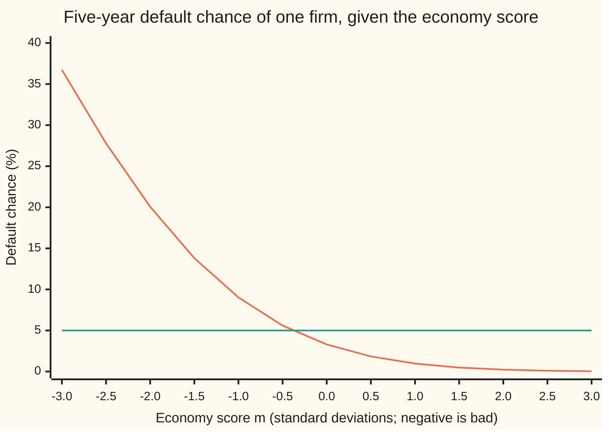
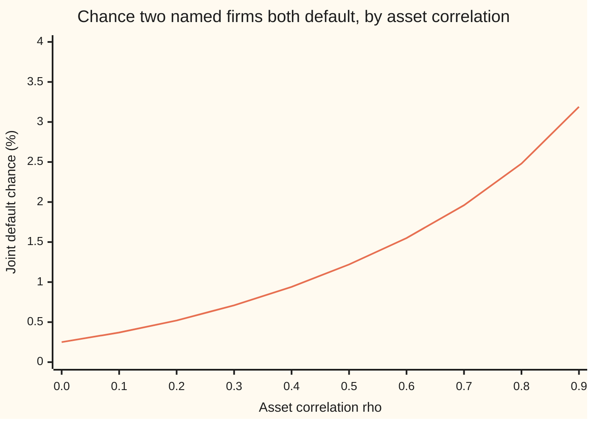

# The one-factor Gaussian copula: one shared economy dial plus private luck, gluing single-name default chances into a joint story

[Syllabus](../../../SYLLABUS.md) → [Financial mathematics](../../../SYLLABUS.md#w12) → [Portfolio Credit - Correlation, Copulas, Indices and Tranches](../../../SYLLABUS.md#w12-s45) → The one-factor Gaussian copula

---

## General Overview

A lender holds a pool of 100 equal loans to 100 different firms. Each loan runs five years. The credit team gives every firm the same 5% chance of failing to repay within those five years, and expects to recover 40 cents per dollar when one does fail. So the pool expects to lose 5% × 60% = 3% of its money.

Those 100 separate 5% chances say nothing about failures arriving together. If the firms are unconnected, ten or more defaults happen in about 3 pools in 100. If a recession can hit all of them at once, ten or more defaults happen far more often. The single-name chances are the same in both worlds. What differs is the joint story.

The one-factor Gaussian copula writes that joint story with one device. Picture a dial marked "the economy", shared by every firm, plus a private coin for each firm's own luck. Each firm's health is a blend of the shared dial and its own luck. A firm defaults when its health falls below a cutoff. The cutoff is set so each firm still fails exactly 5% of the time, however strongly the dial is blended in. Turn the dial to a bad setting and every firm's chance of default rises together.

From here on the dial is the **common factor**, the private luck is the **idiosyncratic noise** (noise belonging to one firm only), the blended health is the firm's **latent score** (a number never observed directly), and the blending strength is the **asset correlation**, 20% in this pool. The whole construction is the **one-factor Gaussian copula**. A **copula** is a rule that joins single-name chances into a joint law without changing any of them.

With the dial at a bad setting of −2, each firm's default chance rises from 5% to about 20%. At −3 it rises to about 37%. Averaged over every setting, the chance falls back to exactly 5%. Two named firms both default with chance about 0.525%, more than double the 0.25% they would have if they were unconnected.

**Each firm's latent score is a blend of one shared economy factor and private noise, the default cutoff is set so each firm keeps its own default chance exactly, and every joint question becomes a one-dimensional average over the economy.**

**What kind of fact this is:** a model: the shared bell-curve factor is an assumption about how defaults cluster, not a law. Inside it, the exact 5% at every correlation, the conditional default chance and the pair integral are theorems proved on this card in Why it works. Sklar's theorem is stated in words; its proof lives in the sources.

### The picture: one firm's default chance as the economy moves



Falling curve: the default chance of each firm at 20% asset correlation, once the economy score is known. Flat line: the same firm with the dial disconnected, 5% whatever the economy does. The curve sits below 5% in ordinary times and far above it in bad ones; weighted by how often each score occurs, it averages to exactly 5%.

---

## The formula

Notation first, in words. The economy score is $M$, a bell-curve draw with average 0 and spread 1; a particular value of it is $m$. Firm number $i$ has private noise $\varepsilon_i$, another independent bell-curve draw. $N(x)$ is the bell-curve area to the left of $x$, as on [Normal](../../09-Probability%20and%20statistics/04-Continuous%20Distributions/04-normal-distribution.md), and $N^{-1}$ runs it backwards: the point with a given area to its left. $\varphi(x)$ is the bell-curve height at $x$. The default chance of one firm is $p$ (5% here), the asset correlation is $\rho$ (20% here), and the default cutoff is $a$.

$$X_i = \sqrt{\rho}\,M + \sqrt{1-\rho}\,\varepsilon_i, \qquad \text{firm } i \text{ defaults when } X_i < a, \qquad a = N^{-1}(p)$$

**Read it aloud:** each firm's score is the economy weighted by the square root of the correlation plus its own noise weighted by the square root of the rest, and it defaults when the score drops below the cutoff that leaves exactly its default chance to the left.

Fix the economy at $m$ and ask each firm's default chance:

$$q(m) = N\!\left(\frac{a - \sqrt{\rho}\,m}{\sqrt{1-\rho}}\right)$$

**Read it aloud:** take the economy's share out of the cutoff, measure what is left in units of the private noise, and read the bell-curve area below it.

Two firms, averaged over every economy:

$$J = \int_{-\infty}^{\infty} \varphi(m)\,q(m)^2\,dm$$

**Read it aloud:** the chance both default is the chance each defaults in a given economy, squared because the two are independent once the economy is known, averaged over how often each economy occurs.

| Symbol | Plain meaning | In our example | Push it up and the answer… |
| --- | --- | --- | --- |
| $p$ | one firm's chance of default over the five years | 5% | cutoff rises; every default chance rises |
| $\rho$, $r$ | asset correlation: the share of each score's variance that comes from the economy; $r$ is a value running from 0 up to $\rho$ | 20% | pair default rises; single-name chance stays 5% |
| $M$, $m$ | the economy score, a bell-curve draw; $m$ is one value of it | −2 for a bad economy | every firm's default chance falls |
| $\varepsilon_i$, $i$ | firm $i$'s private noise ($i$ numbers the firms, 1 to 100), a bell-curve draw independent of everything else | one draw per firm | — |
| $X_i$, $X_1$, $X_2$, $U_i$ | firm $i$'s latent score, the blend of economy and noise ($X_1$, $X_2$ for firms 1 and 2); $U_i = N(X_i)$ is its rank | spread 1 at every $\rho$ | — |
| $a$ | the default cutoff, $N^{-1}(p)$ | −1.645 | more defaults |
| $q(m)$ | each firm's default chance once the economy is known to be $m$ | 20.07% at $m = -2$ | — |
| $N$, $N^{-1}$ | bell-curve area to the left of a point, and its inverse | $N(-1.645) = 0.05$ | — |
| $\varphi$ | bell-curve height: how often each economy score occurs | highest at $m = 0$ | — |
| $J$ | chance two named firms both default | 0.5245% | — |
| $C$, $N_2$, $f_r$, $u_1$, $u_2$ | the copula, a joint law with uniform single laws; $N_2$ the bell-curve area for a correlated pair, $f_r$ its height; $u_1$, $u_2$ two single-name chances | $C(0.05, 0.05) = J$ | — |
| $S$ | the number of defaults in the pool of 100 | average 5 | — |

Two consequences follow in one line each. The **default correlation** (correlation between the zero-or-one default outcomes) is $(J - p^2)/(p(1-p)) = 0.058$, far below the 20% asset correlation. The pool's default count $S$, once the economy is known, is 100 independent coin flips with chance $q(m)$ each.

### When it holds

- **One shared driver.** All clustering comes through one factor. If a sector shock hits only retailers, one factor spreads it to everyone and misprices both the retailers and the rest.
- **Bell-curve scores.** The factor and the noise are bell-curve draws. Real crises are fatter-tailed; the Gaussian version gives joint extreme defaults too little weight, which [Tail dependence](07-tail-dependence-and-the-t-copula.md) measures.
- **One horizon.** The 5% and the cutoff belong to one fixed five-year window. Mixing a one-year default chance with a five-year one gives cutoffs that mean different things.
- **Fixed recoveries.** The 40% recovery is the same in good and bad economies. In real downturns recoveries fall too, so losses in the bad scenarios are larger than this model says.
- **Correlation from 0 to below 1.** At $\rho = 1$ the private noise vanishes and $q(m)$ divides by zero; there every firm defaults exactly when the economy score itself is below −1.645.

---

## Why it works

### Step 0: once the economy is known, the firms are strangers

The firms share nothing except the dial. Fix the dial at one setting and what remains is 100 independent private noises, whose chances multiply. So every joint question is answered in two moves. First, answer it for one fixed economy, where the firms are independent. Second, average that answer over all economies, weighting each by how often it occurs. The second move is always a single integral over one variable, $m$, however many firms are in the pool.

### Step 1: the blend keeps every score on the same bell curve

A weighted sum of independent bell-curve draws is again a bell-curve draw; its variance is the sum of the squared weights times the variances. Here the weights are $\sqrt{\rho}$ and $\sqrt{1-\rho}$, so the variance is $\rho + (1 - \rho) = 1$. The score $X_i$ has average 0 and spread 1 **at every correlation**. That is why the weights are square roots: they split the variance, not the spread.

So the chance that $X_i$ falls below $a$ is $N(a)$. Choose $a = N^{-1}(0.05) = -1.645$ and each firm defaults with chance exactly 5%, whether $\rho$ is 0%, 20% or 90%. Correlation becomes a pure togetherness knob: it moves joint chances and leaves every single-name chance where the credit team put it.

The pair of scores $X_1$, $X_2$ share only the economy term, so their covariance is $\sqrt{\rho}\sqrt{\rho} = \rho$. With spread 1 each, their correlation is $\rho$: the name "asset correlation" is exact.

### Step 2: the default chance in a known economy

Fix $M = m$. Firm $i$ defaults when $\sqrt{\rho}\,m + \sqrt{1-\rho}\,\varepsilon_i < a$. Move the economy term across and divide by $\sqrt{1-\rho}$:

$$\varepsilon_i < \frac{a - \sqrt{\rho}\,m}{\sqrt{1-\rho}}.$$

The noise $\varepsilon_i$ is a bell-curve draw that knows nothing of $m$, so the chance is $N$ of the right-hand side. That is $q(m)$. At $m = -2$ the right side is $(-1.645 + 0.894)/0.894 = -0.839$, and $N(-0.839) = 20.07\%$. The bad economy has used up part of the distance to the cutoff; the private noise has less room left to save the firm.

### Step 3: averaging over the economy gives back 5%

The law of total probability (a chance equals the average of its conditional chances) says

$$\int_{-\infty}^{\infty} \varphi(m)\,q(m)\,dm = P(X_i < a) = p.$$

The code evaluates the left side at $\rho = 20\%$ and $\rho = 50\%$ and gets 0.050000 both times: a separate road to Step 1's result.

### Step 4: the pair, and why it always exceeds $p^2$

Given the economy, firms 1 and 2 default independently, so both default with chance $q(m) \times q(m)$. Average over the economy and that is $J$. At 20% correlation the integral gives **0.5245%**.

Why more than $p^2 = 0.25\%$? Step 3 says $q(M)$ averages to $p$. Any quantity's average square equals its squared average plus its variance, so

$$J - p^2 = \text{variance of } q(M).$$

The excess is exactly how much the economy moves a firm's default chance: 0.2745% here. Disconnect the dial ($\rho = 0$) and $q$ is flat at 5%, the variance is zero, and $J = p^2$. Connect it and $q$ swings, and $J$ climbs. Dividing the excess by $p(1-p)$ gives the default correlation, 0.058.



One line: the pair's joint default chance from the factor integral, rising from 0.25% (independent) toward 5% (the two firms default together whenever either does, reached only at correlation 1).

The same number comes out of a second road that never mentions the economy. The two scores $X_1$, $X_2$ form a correlated bell-curve pair with correlation $\rho$, so $J = N_2(a, a; \rho)$, the chance both land below $a$. A classical identity (Plackett's) says this area grows with correlation at a rate equal to the pair's bell-curve height at the corner $(a, a)$. Start from $p^2$ at zero correlation and add up that growth from 0 to $\rho$: 0.5245% again, to nine decimals in the code.

<details>
<summary>Detailed proof: the correlation road</summary>

Write $f_r(x, y) = \exp\!\big(-(x^2 - 2rxy + y^2)/(2(1-r^2))\big) / (2\pi\sqrt{1-r^2})$ for the joint bell-curve height of a pair with correlation $r$. Differentiating directly shows $\partial f_r/\partial r = \partial^2 f_r/\partial x\,\partial y$; both sides equal $f_r$ times the same polynomial in the two coordinates and the correlation. Integrate both sides over the corner $x < a$, $y < a$. The right side integrates the mixed derivative over a quarter-plane, which leaves the value at the corner: $f_r(a, a)$. The bell-curve decay lets the derivative in $r$ pass inside the integral for any $r$ strictly between −1 and 1. So
$$\frac{d}{dr} N_2(a, a; r) = f_r(a, a) = \frac{e^{-a^2/(1+r)}}{2\pi\sqrt{1-r^2}}.$$
At $r = 0$ the pair is independent and $N_2(a, a; 0) = p^2$. Integrating from 0 to $\rho$:
$$J = p^2 + \int_0^{\rho} \frac{e^{-a^2/(1+r)}}{2\pi\sqrt{1-r^2}}\,dr.$$
The integrand is positive, so $J > p^2$ for every positive $\rho$: positive asset correlation always means positive default correlation in this model. As $\rho$ approaches 1 the two scores coincide and $J$ approaches $p$.

</details>

### Step 5: Sklar's theorem, and where the word "copula" comes in

**Sklar's theorem, in words:** any joint law of several quantities splits into two separate pieces, the single law of each quantity and a copula that says how they move together; conversely, any copula joined to any single laws gives a valid joint law. When the single laws are continuous (no jumps), the copula is unique. A copula is itself a joint law whose single laws are uniform on 0 to 1: it carries rank information only.

This model uses the second half of the theorem. Turn each score into its rank: $U_i = N(X_i)$ is uniform on 0 to 1, and firm $i$ defaults exactly when $U_i < p$. The joint law of the ranks is the **Gaussian copula**

$$C(u_1, u_2) = N_2\big(N^{-1}(u_1), N^{-1}(u_2); \rho\big).$$

The single-name default chances plug in as $u_1$ and $u_2$, and the dependence comes from $\rho$ alone. Pair default is $C(0.05, 0.05) = J$. A firm with a 1% chance paired with one at 5% needs no new machinery: new cutoffs, same copula, joint chance 0.1287%. The default indicators themselves jump from 0 to 1, so their own copula is not unique; the model sidesteps that by building the defaults from continuous scores.

### Step 6: simulate the pool

For each of 20,000 imagined pools: draw one economy score, then 100 private noises; form the 100 scores; count those below −1.645. Across pools, the default fraction estimates 5%, the fraction of pairs that both default estimates $J$, and the share of pools with ten or more defaults estimates the pool tail.

The [Law of large numbers](../../09-Probability%20and%20statistics/06-Limit%20Theorems%20in%20Practice/01-law-of-large-numbers.md) works at two levels here. Across many independent pools, averages settle on the unconditional answers: 5%, 0.5245%. Within one pool, adding firms does **not** drive the default fraction to 5%: it drives it to $q(M)$ for that pool's economy. In the simulated pools whose economy landed near −2, the default rate was 19.53%. A shared shock does not diversify away. That fact, pushed to an infinite pool, is [Vasicek's large-pool loss curve](03-vasicek-loss-distribution-and-basel-capital.md).

The joint chances of a pair taken alone, and the table of feasible default correlations, are on [Default correlation](01-default-correlation-and-joint-default.md); this card supplies a model that produces them.

---

## Worked numbers, by hand

House pool: $p = 5\%$ over five years, recovery 40%, $\rho = 20\%$, 100 firms.

| Step | Arithmetic | Value |
| --- | --- | --- |
| cutoff $a$ | $N^{-1}(0.05)$, from a bell-curve table | $-1.645$ |
| economy weight, noise weight | $\sqrt{0.20}$, $\sqrt{0.80}$ | $0.4472$, $0.8944$ |
| argument at $m = -2$ | $(-1.645 + 0.4472 \times 2)/0.8944$ | $-0.839$ |
| $q(-2)$ | $N(-0.839)$ | $20.07\%$ |
| argument at $m = -3$ | $(-1.645 + 0.4472 \times 3)/0.8944$ | $-0.339$ |
| $q(-3)$ | $N(-0.339)$ | $36.73\%$ |
| pair default $J$ | $\int \varphi(m)\,q(m)^2\,dm$, by Simpson's rule | $0.5245\%$ |
| independent pair | $0.05 \times 0.05$ | $0.25\%$ |
| default correlation | $(0.005245 - 0.0025)/(0.05 \times 0.95)$ | $0.058$ |
| pool expected loss | $5\% \times 60\%$ | $3\%$ |
| **ten or more defaults** | $\int \varphi(m) \times$ (binomial tail at $q(m)$), averaged over $m$ | **15.69%** |

Ten defaults cost the pool 6% of its money, twice the expected loss. Under independence that happens in 2.82% of five-year windows; with a 20% shared economy it happens in 15.69%, more than five times as often, although no single loan got riskier.

### What breaks if you drop a piece

| Mistake | Comes out at | What went wrong |
| --- | --- | --- |
| Use the 20% asset correlation as the default correlation | pair 1.20%, not 0.5245% | Scores correlate at 20%; zero-or-one defaults correlate at 0.058 |
| Blend as $\sqrt{\rho}\,M + \varepsilon_i$, no $\sqrt{1-\rho}$ | each firm 6.66%, not 5% | Score variance is 1.2, so the fixed cutoff lets through too many |
| Weight the economy by $\rho$, not $\sqrt{\rho}$ | each firm 3.64%, not 5% | Variance $0.04 + 0.8 = 0.84$; the cutoff lets through too few |
| Skip the division by $\sqrt{1-\rho}$ in $q(-2)$ | 22.65%, not 20.07% | The leftover distance must be measured in units of the noise's spread, 0.894 |

---

## The pool as the economy moves

The pool's credit quality never changes, yet its losses swing hard. The single-name chance is fixed at 5%; the economy score decides how many of the 100 firms fail in a given five-year window.

| Economy score $m$ | Each firm's default chance | Expected defaults of 100 | Expected pool loss |
| --- | --- | --- | --- |
| +2 (boom) | 0.23% | 0.23 | 0.14% |
| +1 | 0.97% | 0.97 | 0.58% |
| 0 (ordinary) | 3.30% | 3.30 | 1.98% |
| −1 | 9.03% | 9.03 | 5.42% |
| −2 | 20.07% | 20.07 | 12.04% |
| −3 (a severe downturn) | 36.73% | 36.73 | 22.04% |

An ordinary economy, score 0, gives only 3.30%, less than the 5% average. The average is carried by the bad windows: rare, heavy, and hitting every firm at once.

Averaged over the economy, the count of defaults takes this shape. Each bar is the percentage of five-year windows; the average is 5 defaults in both worlds.

```
defaults   independent firms                                   one shared economy, 20%
0          ▏ 0.59%                                             ████████ 15.30%
1-4        ██████████████████████ 43.01%                       ███████████████████████ 45.76%
5-9        ███████████████████████████ 53.58%                  ████████████ 23.25%
10-19      █ 2.82%                                             ██████ 12.73%
20+        ▏ 0.00%                                             █ 2.96%
```

Independent firms bunch around 5 defaults. The shared economy spreads the same average out: more windows with no default at all, and many more with ten or twenty.

---

## Code, from first principles, and it actually runs

The code builds its own bell-curve area, finds the cutoff by bisection in Python and by Newton's method in Rust, and reaches the pair default chance by **three independent roads**: the factor integral, the correlation road (Plackett's identity), and a simulation of 20,000 pools of 100 firms with a hand-written random-number generator. It also computes the full count law of defaults as a mixture of binomials, checks it against the pair chance and the simulation, and prints every number on the card, including the chart points and the what-breaks rows. Python builds $N$ from a series; Rust builds it by adding thin slices under the bell curve.

### Python

```python
# One-factor Gaussian copula -- the check behind the card.  Standard library only.
# House pool: 100 loans, 5% default chance over five years, recovery 40%, asset correlation 20%.
# Nothing imported knows the answer: the normal CDF is a series written here, the inverse
# is bisection, integrals are Simpson's rule, random numbers come from a hand-written LCG.
from math import sqrt, exp, log, cos, pi

def phi(x): return exp(-0.5 * x * x) / sqrt(2.0 * pi)          # bell-curve height

def N(x):                                                       # bell-curve area left of x
    if x < 0.0: return 1.0 - N(-x)
    if x > 9.0: return 1.0
    term, total, k = x, x, 1                                    # x + x^3/3 + x^5/(3*5) + ...
    while term > 1e-17 * total:
        term *= x * x / (2 * k + 1); total += term; k += 1
    return 0.5 + phi(x) * total

def N_inv(p, lo=-10.0, hi=10.0):                                # bisection: N is increasing
    for _ in range(80):
        mid = 0.5 * (lo + hi)
        lo, hi = (mid, hi) if N(mid) < p else (lo, mid)
    return 0.5 * (lo + hi)

def simpson(f, a, b, n=4000):
    h = (b - a) / n
    s = f(a) + f(b) + sum((4 if i % 2 else 2) * f(a + i * h) for i in range(1, n))
    return s * h / 3.0

P, RHO, REC, NAMES = 0.05, 0.20, 0.40, 100
a = N_inv(P)                                                    # the default threshold

def q(m, rho=RHO, thr=None):                                    # default chance, economy at m
    thr = a if thr is None else thr
    return N((thr - sqrt(rho) * m) / sqrt(1.0 - rho))

def pair_factor(rho, p1=P, p2=P):                               # road 1: average q1*q2 over M
    t1, t2 = N_inv(p1), N_inv(p2)
    return simpson(lambda m: phi(m) * q(m, rho, t1) * q(m, rho, t2), -9.0, 9.0)

def pair_plackett(rho):                                         # road 2: p^2 + integral of the
    f = lambda r: exp(-a * a / (1.0 + r)) / (2.0 * pi * sqrt(1.0 - r * r))   # corner density
    return P * P + simpson(f, 0.0, rho, 200)

def count_law(rho):                                             # P(S = k), S = defaults in 100
    law = [0.0] * (NAMES + 1)
    h, lo, n = 18.0 / 1000, -9.0, 1000
    for i in range(n + 1):
        m = lo + i * h; w = (1 if i in (0, n) else 4 if i % 2 else 2) * phi(m) * h / 3.0
        qm = q(m, rho)
        pk = (1.0 - qm) ** NAMES
        for k in range(NAMES + 1):
            law[k] += w * pk
            if k < NAMES and qm < 1.0: pk *= (NAMES - k) / (k + 1) * qm / (1.0 - qm)
    return law

J = pair_factor(RHO); J2 = pair_plackett(RHO)
dcorr = (J - P * P) / (P * (1.0 - P))
marg = {r: simpson(lambda m: phi(m) * q(m, r), -9.0, 9.0) for r in (0.2, 0.5)}
law_c, law_i = count_law(RHO), count_law(0.0)

state = 0x2545F4914F6CDD1D                                      # road 3: simulate 20,000 pools
def unif():
    global state
    state = (state * 6364136223846793005 + 1442695040888963407) % 2 ** 64
    return ((state >> 11) + 0.5) / 2 ** 53
def gauss(): return sqrt(-2.0 * log(unif())) * cos(2.0 * pi * unif())
POOLS, sr, sn = 20000, sqrt(RHO), sqrt(1.0 - RHO)
d_tot = pair_tot = pair_sq = tail = bad_names = bad_def = 0
for _ in range(POOLS):
    M = gauss()
    d = sum(1 for _ in range(NAMES) if sr * M + sn * gauss() < a)
    x = d * (d - 1) / (NAMES * (NAMES - 1))
    d_tot += d; pair_tot += x; pair_sq += x * x; tail += d >= 10
    if -2.25 < M < -1.75: bad_names += NAMES; bad_def += d
mc_p = d_tot / (POOLS * NAMES); mc_J = pair_tot / POOLS
mc_se = sqrt((pair_sq / POOLS - mc_J * mc_J) / POOLS)          # error bar across pools

print(f"{'threshold a = N^-1(0.05)':<40}{a:>12.6f}")
print(f"{'sqrt(rho), sqrt(1-rho)':<28}{sr:>12.6f}{sn:>12.6f}")
print(f"{'argument at m = -2, m = -3':<28}{(a + 2 * sr) / sn:>12.6f}{(a + 3 * sr) / sn:>12.6f}")
print(f"{'pool loss: expected, 10 names':<28}{P * (1 - REC):>12.6f}{10 * (1 - REC) / NAMES:>12.6f}")
for m in (-3.0, -2.0, -1.0, 0.0, 1.0, 2.0):
    print(f"economy m = {m:+.0f}: name default {q(m):.6f}  expected defaults {NAMES * q(m):6.2f}  pool loss {100 * q(m) * (1 - REC):5.2f}%")
for r in (0.2, 0.5):
    print(f"{'average of q(M) over M, rho = ' + str(r):<40}{marg[r]:>12.6f}")
print(f"{'1 pair default, factor integral':<40}{J:>12.6f}")
print(f"{'2 pair default, correlation route':<40}{J2:>12.6f}")
print(f"{'  if independent, p^2':<40}{P * P:>12.6f}")
print(f"{'  excess J - p^2 = variance of q(M)':<40}{J - P * P:>12.6f}")
print(f"{'default correlation':<40}{dcorr:>12.6f}")
print(f"{'3 simulated: default fraction':<40}{mc_p:>12.6f}")
print(f"{'3 simulated: pair default':<40}{mc_J:>12.6f}")
print(f"{'  its standard error':<40}{mc_se:>12.6f}")
print(f"{'3 simulated: rate when M near -2':<40}{bad_def / bad_names:>12.6f}")
print(f"{'mean defaults per pool, mixture law':<40}{sum(k * v for k, v in enumerate(law_c)):>12.6f}")
print(f"{'P(10 or more defaults), mixture law':<40}{sum(law_c[10:]):>12.6f}")
print(f"{'P(10 or more defaults), independent':<40}{sum(law_i[10:]):>12.6f}")
print(f"{'P(10 or more defaults), simulated':<40}{tail / POOLS:>12.6f}")
for lab, lo, hi in (("0", 0, 1), ("1-4", 1, 5), ("5-9", 5, 10), ("10-19", 10, 20), ("20+", 20, 101)):
    print(f"defaults {lab:<6} independent {100 * sum(law_i[lo:hi]):6.2f}%   one-factor {100 * sum(law_c[lo:hi]):6.2f}%")
# what breaks
wrong_rho = P * P + RHO * P * (1 - P)                           # asset rho used as default rho
no_shrink = N(a / sqrt(1.0 + RHO))                              # sqrt(rho) M + Z, variance 1.2
rho_load = N(a / sqrt(RHO * RHO + 1.0 - RHO))                   # rho M + sqrt(1-rho) Z
no_divide = N(a - sqrt(RHO) * -2.0)                             # q(-2) without / sqrt(1-rho)
print(f"{'wrong: asset rho as default rho':<40}{wrong_rho:>12.6f}")
print(f"{'wrong: no sqrt(1-rho), marginal':<40}{no_shrink:>12.6f}")
print(f"{'wrong: loading rho not sqrt, marginal':<40}{rho_load:>12.6f}")
print(f"{'wrong: q(-2) without dividing':<40}{no_divide:>12.6f}")
print(f"{'try: pair default, rho = 0.5':<40}{pair_factor(0.5):>12.6f}")
print(f"{'try: pair default, p = 5% and 1%':<40}{pair_factor(RHO, P, 0.01):>12.6f}")
print(f"{'try: q(-3), rho = 0.5':<40}{q(-3.0, 0.5):>12.6f}")
chart_m = [-3.0 + 0.5 * i for i in range(13)]
print("chart, economy m      " + " ".join(f"{m:5.1f}" for m in chart_m))
print("chart, q(m) in %      " + " ".join(f"{100 * q(m):5.2f}" for m in chart_m))
rhos = [0.1 * i for i in range(10)]
print("chart, rho            " + " ".join(f"{r:5.1f}" for r in rhos))
print("chart, pair in %      " + " ".join(f"{100 * pair_factor(r):5.2f}" for r in rhos))

assert abs(a - (-1.6448536269514722)) < 1e-12, "threshold vs the published 5% normal quantile"
assert abs(J - J2) < 1e-9, "factor integral and correlation route must agree"
assert abs(marg[0.5] - P) < 1e-10, "averaging q over the economy returns 5% at any rho"
assert abs(mc_J - J) < 4 * mc_se, "simulated pair default within its error bar"
assert abs(mc_p - P) < 0.003, "simulated default fraction near 5%"
assert abs(pair_factor(0.0) - P * P) < 1e-12, "no shared dial: pair default is p^2"
assert abs(sum(law_c) - 1.0) < 1e-9 and abs(sum(k * v for k, v in enumerate(law_c)) - NAMES * P) < 1e-9, "mixture law: total 1, mean 100p"
assert abs(sum(k * (k - 1) * v for k, v in enumerate(law_c)) - NAMES * (NAMES - 1) * J2) < 1e-7, "E[S(S-1)] = 100*99*J"
t_mc = tail / POOLS; assert abs(sum(law_c[10:]) - t_mc) < 4 * sqrt(t_mc * (1 - t_mc) / POOLS), "mixture tail vs simulated tail"
print("ALL CHECKS PASS")
```

**Ran 2026-09-28 on macOS, Python 3.14.6, standard library only. All checks passed. Output, pasted from the run:**

```
threshold a = N^-1(0.05)                   -1.644854
sqrt(rho), sqrt(1-rho)          0.447214    0.894427
argument at m = -2, m = -3     -0.839002   -0.339002
pool loss: expected, 10 names    0.030000    0.060000
economy m = -3: name default 0.367304  expected defaults  36.73  pool loss 22.04%
economy m = -2: name default 0.200734  expected defaults  20.07  pool loss 12.04%
economy m = -1: name default 0.090285  expected defaults   9.03  pool loss  5.42%
economy m = +0: name default 0.032957  expected defaults   3.30  pool loss  1.98%
economy m = +1: name default 0.009668  expected defaults   0.97  pool loss  0.58%
economy m = +2: name default 0.002263  expected defaults   0.23  pool loss  0.14%
average of q(M) over M, rho = 0.2           0.050000
average of q(M) over M, rho = 0.5           0.050000
1 pair default, factor integral             0.005245
2 pair default, correlation route           0.005245
  if independent, p^2                       0.002500
  excess J - p^2 = variance of q(M)         0.002745
default correlation                         0.057799
3 simulated: default fraction               0.049756
3 simulated: pair default                   0.005110
  its standard error                        0.000096
3 simulated: rate when M near -2            0.195300
mean defaults per pool, mixture law         5.000000
P(10 or more defaults), mixture law         0.156856
P(10 or more defaults), independent         0.028188
P(10 or more defaults), simulated           0.157050
defaults 0      independent   0.59%   one-factor  15.30%
defaults 1-4    independent  43.01%   one-factor  45.76%
defaults 5-9    independent  53.58%   one-factor  23.25%
defaults 10-19  independent   2.82%   one-factor  12.73%
defaults 20+    independent   0.00%   one-factor   2.96%
wrong: asset rho as default rho             0.012000
wrong: no sqrt(1-rho), marginal             0.066608
wrong: loading rho not sqrt, marginal       0.036352
wrong: q(-2) without dividing               0.226499
try: pair default, rho = 0.5                0.012189
try: pair default, p = 5% and 1%            0.001287
try: q(-3), rho = 0.5                       0.749789
chart, economy m       -3.0  -2.5  -2.0  -1.5  -1.0  -0.5   0.0   0.5   1.0   1.5   2.0   2.5   3.0
chart, q(m) in %      36.73 27.79 20.07 13.81  9.03  5.60  3.30  1.84  0.97  0.48  0.23  0.10  0.04
chart, rho              0.0   0.1   0.2   0.3   0.4   0.5   0.6   0.7   0.8   0.9
chart, pair in %       0.25  0.37  0.52  0.71  0.94  1.22  1.55  1.96  2.48  3.19
ALL CHECKS PASS
```

Three roads, one pair chance. The factor integral and the correlation road agree to nine decimals. The simulation gives 0.5110%, less than two standard errors (0.0096 percentage points each) below 0.5245%. The error bar is measured across pools, not pairs, because pairs inside one pool share an economy draw. The simulated default rate in pools whose economy landed between −2.25 and −1.75 is 19.53%, close to $q(-2) = 20.07\%$ and a little lower because more of that band sits near −1.75.

### Rust

```rust
// One-factor Gaussian copula -- the same check as one_factor_gaussian_copula_check.py, in Rust.
// Standard library only, no crates.  Rust has no erf, so the bell-curve area N(x) is built
// by adding thin slices under the curve (Simpson); the threshold comes from Newton's method.
// Compile: rustc --edition 2021 -O one_factor_gaussian_copula_check.rs -o /tmp/ofgc_check
use std::f64::consts::PI;

const P: f64 = 0.05;
const RHO: f64 = 0.20;
const REC: f64 = 0.40;
const NAMES: usize = 100;

fn phi(x: f64) -> f64 { (-0.5 * x * x).exp() / (2.0 * PI).sqrt() }

fn simpson<F: Fn(f64) -> f64>(f: F, a: f64, b: f64, n: usize) -> f64 {
    let h = (b - a) / n as f64;
    let mut s = f(a) + f(b);
    for i in 1..n { s += if i % 2 == 1 { 4.0 } else { 2.0 } * f(a + i as f64 * h); }
    s * h / 3.0
}

fn n_cdf(x: f64) -> f64 {
    if x < -12.0 { return 0.0; }
    if x > 12.0 { return 1.0; }
    0.5 + simpson(phi, 0.0, x, 2000)
}

fn n_inv(p: f64) -> f64 {                          // Newton: step by (N(x) - p) / slope
    let mut x = 0.0;
    for _ in 0..50 { x -= (n_cdf(x) - p) / phi(x); }
    x
}

fn q(m: f64, rho: f64, thr: f64) -> f64 { n_cdf((thr - rho.sqrt() * m) / (1.0 - rho).sqrt()) }

fn pair_factor(rho: f64, p1: f64, p2: f64) -> f64 {  // road 1: average q1*q2 over M
    let (t1, t2) = (n_inv(p1), n_inv(p2));
    simpson(|m| phi(m) * q(m, rho, t1) * q(m, rho, t2), -9.0, 9.0, 4000)
}

fn pair_plackett(rho: f64, a: f64) -> f64 {        // road 2: p^2 + corner-density integral
    P * P + simpson(|r| (-a * a / (1.0 + r)).exp() / (2.0 * PI * (1.0 - r * r).sqrt()), 0.0, rho, 200)
}

fn count_law(rho: f64, a: f64) -> Vec<f64> {       // P(S = k), S = defaults among 100
    let mut law = vec![0.0; NAMES + 1];
    let (n, lo) = (1000usize, -9.0);
    let h = 18.0 / n as f64;
    for i in 0..=n {
        let m = lo + i as f64 * h;
        let c = if i == 0 || i == n { 1.0 } else if i % 2 == 1 { 4.0 } else { 2.0 };
        let w = c * phi(m) * h / 3.0;
        let qm = q(m, rho, a);
        let mut pk = (1.0 - qm).powi(NAMES as i32);
        for k in 0..=NAMES {
            law[k] += w * pk;
            if k < NAMES && qm < 1.0 { pk *= (NAMES - k) as f64 / (k + 1) as f64 * qm / (1.0 - qm); }
        }
    }
    law
}

struct Lcg(u64);
impl Lcg {
    fn unif(&mut self) -> f64 {
        self.0 = self.0.wrapping_mul(6364136223846793005).wrapping_add(1442695040888963407);
        ((self.0 >> 11) as f64 + 0.5) / 9007199254740992.0
    }
    fn gauss(&mut self) -> f64 { let u = self.unif(); let v = self.unif(); (-2.0 * u.ln()).sqrt() * (2.0 * PI * v).cos() }
}

fn row(label: &str, v: f64) { println!("{:<40}{:>12.6}", label, v); }

fn main() {
    let a = n_inv(P);
    let j = pair_factor(RHO, P, P);
    let j2 = pair_plackett(RHO, a);
    let dcorr = (j - P * P) / (P * (1.0 - P));
    let marg: Vec<f64> = [0.2, 0.5].iter().map(|&r| simpson(|m| phi(m) * q(m, r, a), -9.0, 9.0, 4000)).collect();
    let (law_c, law_i) = (count_law(RHO, a), count_law(0.0, a));

    let mut g = Lcg(0x2545F4914F6CDD1D);           // road 3: simulate 20,000 pools
    let pools = 20000usize;
    let (sr, sn) = (RHO.sqrt(), (1.0 - RHO).sqrt());
    let (mut d_tot, mut pair_tot, mut pair_sq, mut tail, mut bad_names, mut bad_def) = (0usize, 0.0, 0.0, 0usize, 0usize, 0usize);
    for _ in 0..pools {
        let mm = g.gauss();
        let mut d = 0usize;
        for _ in 0..NAMES { if sr * mm + sn * g.gauss() < a { d += 1; } }
        let x = (d * d.saturating_sub(1)) as f64 / (NAMES * (NAMES - 1)) as f64;
        d_tot += d; pair_tot += x; pair_sq += x * x; if d >= 10 { tail += 1; }
        if mm > -2.25 && mm < -1.75 { bad_names += NAMES; bad_def += d; }
    }
    let mc_p = d_tot as f64 / (pools * NAMES) as f64;
    let mc_j = pair_tot / pools as f64;
    let mc_se = ((pair_sq / pools as f64 - mc_j * mc_j) / pools as f64).sqrt();

    row("threshold a = N^-1(0.05)", a);
    println!("{:<28}{:>12.6}{:>12.6}", "sqrt(rho), sqrt(1-rho)", sr, sn);
    println!("{:<28}{:>12.6}{:>12.6}", "argument at m = -2, m = -3", (a + 2.0 * sr) / sn, (a + 3.0 * sr) / sn);
    println!("{:<28}{:>12.6}{:>12.6}", "pool loss: expected, 10 names", P * (1.0 - REC), 10.0 * (1.0 - REC) / NAMES as f64);
    for m in [-3.0_f64, -2.0, -1.0, 0.0, 1.0, 2.0] {
        let qm = q(m, RHO, a);
        println!("economy m = {:+.0}: name default {:.6}  expected defaults {:6.2}  pool loss {:5.2}%", m, qm, NAMES as f64 * qm, 100.0 * qm * (1.0 - REC));
    }
    row("average of q(M) over M, rho = 0.2", marg[0]);
    row("average of q(M) over M, rho = 0.5", marg[1]);
    row("1 pair default, factor integral", j);
    row("2 pair default, correlation route", j2);
    row("  if independent, p^2", P * P);
    row("  excess J - p^2 = variance of q(M)", j - P * P);
    row("default correlation", dcorr);
    row("3 simulated: default fraction", mc_p);
    row("3 simulated: pair default", mc_j);
    row("  its standard error", mc_se);
    row("3 simulated: rate when M near -2", bad_def as f64 / bad_names as f64);
    row("mean defaults per pool, mixture law", law_c.iter().enumerate().map(|(k, v)| k as f64 * v).sum());
    row("P(10 or more defaults), mixture law", law_c[10..].iter().sum());
    row("P(10 or more defaults), independent", law_i[10..].iter().sum());
    row("P(10 or more defaults), simulated", tail as f64 / pools as f64);
    for (lab, lo, hi) in [("0", 0usize, 1usize), ("1-4", 1, 5), ("5-9", 5, 10), ("10-19", 10, 20), ("20+", 20, 101)] {
        let (si, sc): (f64, f64) = (law_i[lo..hi].iter().sum(), law_c[lo..hi].iter().sum());
        println!("defaults {:<6} independent {:6.2}%   one-factor {:6.2}%", lab, 100.0 * si, 100.0 * sc);
    }
    row("wrong: asset rho as default rho", P * P + RHO * P * (1.0 - P));
    row("wrong: no sqrt(1-rho), marginal", n_cdf(a / (1.0 + RHO).sqrt()));
    row("wrong: loading rho not sqrt, marginal", n_cdf(a / (RHO * RHO + 1.0 - RHO).sqrt()));
    row("wrong: q(-2) without dividing", n_cdf(a - RHO.sqrt() * -2.0));
    row("try: pair default, rho = 0.5", pair_factor(0.5, P, P));
    row("try: pair default, p = 5% and 1%", pair_factor(RHO, P, 0.01));
    row("try: q(-3), rho = 0.5", q(-3.0, 0.5, a));
    let ms: Vec<f64> = (0..13).map(|i| -3.0 + 0.5 * i as f64).collect();
    println!("chart, economy m      {}", ms.iter().map(|m| format!("{:5.1}", m)).collect::<Vec<_>>().join(" "));
    println!("chart, q(m) in %      {}", ms.iter().map(|&m| format!("{:5.2}", 100.0 * q(m, RHO, a))).collect::<Vec<_>>().join(" "));
    let rs: Vec<f64> = (0..10).map(|i| 0.1 * i as f64).collect();
    println!("chart, rho            {}", rs.iter().map(|r| format!("{:5.1}", r)).collect::<Vec<_>>().join(" "));
    println!("chart, pair in %      {}", rs.iter().map(|&r| format!("{:5.2}", 100.0 * pair_factor(r, P, P))).collect::<Vec<_>>().join(" "));

    assert!((a - (-1.6448536269514722)).abs() < 1e-9, "threshold vs the published 5% normal quantile");
    assert!((j - j2).abs() < 1e-9, "factor integral and correlation route must agree");
    assert!((marg[1] - P).abs() < 1e-9, "averaging q over the economy returns 5% at any rho");
    assert!((mc_j - j).abs() < 4.0 * mc_se, "simulated pair default within its error bar");
    assert!((mc_p - P).abs() < 0.003, "simulated default fraction near 5%");
    assert!((pair_factor(0.0, P, P) - P * P).abs() < 1e-9, "no shared dial: pair default is p^2");
    let (tot, mean): (f64, f64) = (law_c.iter().sum(), law_c.iter().enumerate().map(|(k, v)| k as f64 * v).sum());
    assert!((tot - 1.0).abs() < 1e-9 && (mean - NAMES as f64 * P).abs() < 1e-9, "mixture law: total 1, mean 100p");
    let fm: f64 = law_c.iter().enumerate().map(|(k, v)| (k * k.saturating_sub(1)) as f64 * v).sum();
    assert!((fm - (NAMES * (NAMES - 1)) as f64 * j2).abs() < 1e-7, "E[S(S-1)] = 100*99*J");
    let (tl, t_mc): (f64, f64) = (law_c[10..].iter().sum(), tail as f64 / pools as f64);
    assert!((tl - t_mc).abs() < 4.0 * (t_mc * (1.0 - t_mc) / pools as f64).sqrt(), "mixture tail vs simulated tail");
    println!("ALL CHECKS PASS");
}
```

**Ran 2026-09-28 on macOS, rustc 1.98.1, no crates. All checks passed. Output, pasted from the run:**

```
threshold a = N^-1(0.05)                   -1.644854
sqrt(rho), sqrt(1-rho)          0.447214    0.894427
argument at m = -2, m = -3     -0.839002   -0.339002
pool loss: expected, 10 names    0.030000    0.060000
economy m = -3: name default 0.367304  expected defaults  36.73  pool loss 22.04%
economy m = -2: name default 0.200734  expected defaults  20.07  pool loss 12.04%
economy m = -1: name default 0.090285  expected defaults   9.03  pool loss  5.42%
economy m = +0: name default 0.032957  expected defaults   3.30  pool loss  1.98%
economy m = +1: name default 0.009668  expected defaults   0.97  pool loss  0.58%
economy m = +2: name default 0.002263  expected defaults   0.23  pool loss  0.14%
average of q(M) over M, rho = 0.2           0.050000
average of q(M) over M, rho = 0.5           0.050000
1 pair default, factor integral             0.005245
2 pair default, correlation route           0.005245
  if independent, p^2                       0.002500
  excess J - p^2 = variance of q(M)         0.002745
default correlation                         0.057799
3 simulated: default fraction               0.049756
3 simulated: pair default                   0.005110
  its standard error                        0.000096
3 simulated: rate when M near -2            0.195300
mean defaults per pool, mixture law         5.000000
P(10 or more defaults), mixture law         0.156856
P(10 or more defaults), independent         0.028188
P(10 or more defaults), simulated           0.157050
defaults 0      independent   0.59%   one-factor  15.30%
defaults 1-4    independent  43.01%   one-factor  45.76%
defaults 5-9    independent  53.58%   one-factor  23.25%
defaults 10-19  independent   2.82%   one-factor  12.73%
defaults 20+    independent   0.00%   one-factor   2.96%
wrong: asset rho as default rho             0.012000
wrong: no sqrt(1-rho), marginal             0.066608
wrong: loading rho not sqrt, marginal       0.036352
wrong: q(-2) without dividing               0.226499
try: pair default, rho = 0.5                0.012189
try: pair default, p = 5% and 1%            0.001287
try: q(-3), rho = 0.5                       0.749789
chart, economy m       -3.0  -2.5  -2.0  -1.5  -1.0  -0.5   0.0   0.5   1.0   1.5   2.0   2.5   3.0
chart, q(m) in %      36.73 27.79 20.07 13.81  9.03  5.60  3.30  1.84  0.97  0.48  0.23  0.10  0.04
chart, rho              0.0   0.1   0.2   0.3   0.4   0.5   0.6   0.7   0.8   0.9
chart, pair in %       0.25  0.37  0.52  0.71  0.94  1.22  1.55  1.96  2.48  3.19
ALL CHECKS PASS
```

The two outputs agree line for line. The bell-curve areas were reached by different code, a series in Python and slices in Rust; the simulation uses the same generator and seed in both, so its digits match exactly.

> [!TIP]
> **Try changing**
> Guess the direction first. Then run it.
> - **Raise the correlation to 50%.** Each firm stays at 5%. The pair's joint default chance rises from 0.5245% to **1.2189%**. The row `try: pair default, rho = 0.5` prints it.
> - **Make firm 2 safer, 1% instead of 5%.** New cutoff for that firm, same copula. The pair's joint chance is **0.1287%**, against 0.05% if they were independent.
> - **A bad economy under strong correlation.** At $\rho = 50\%$ and economy score −3, each firm defaults with chance **74.98%**, against 36.73% at 20%. Stronger correlation means the dial does more of the work.

---

## The usual mistake

> [!warning]
> **Reading the asset correlation as the default correlation.** The 20% is the correlation between two hidden scores. The correlation between the two zero-or-one default outcomes is 0.058, less than a third of it. Feed 20% into the pair formula as if it were default correlation and the joint default chance comes out at 1.20%, well over double the model's 0.5245%.
>
> Smaller traps:
> - **Expecting a big pool to diversify the economy away.** Private noise averages out; the shared factor does not. A pool of a million firms in a −2 economy still sees about 20% defaults, not 5%.
> - **Changing the correlation and the cutoff together.** The cutoff depends only on $p$. Re-deriving it from $\rho$, or leaving out the $\sqrt{1-\rho}$ weight, breaks the single-name chance: 6.66% instead of 5% in the what-breaks table.
> - **Mixing horizons.** A 5% five-year chance and a 1% one-year chance give cutoffs that answer different questions. Put every firm on the same horizon first.
> - **Treating the Gaussian copula as a description of crises.** It fits the middle of the distribution. Its joint extremes are thinner than markets have shown; see [Tail dependence](07-tail-dependence-and-the-t-copula.md).

---

## Where you meet it in real life

- **Bank capital.** The regulatory formula for the capital behind a corporate loan is this model pushed to an infinite pool and read at a one-in-a-thousand economy: [Vasicek's large-pool loss curve](03-vasicek-loss-distribution-and-basel-capital.md).
- **Tranche pricing.** Slices of a loan pool that absorb losses in order were priced with this model from the early 2000s, one correlation number per slice: [Tranches](05-cdo-tranches-in-outline.md).
- **Quoted correlation.** Tranche prices on the traded indices are turned back into the correlation this model needs to match them: [Implied correlation](06-implied-and-base-correlation.md), on pools such as [Credit indices (CDX and iTraxx in outline)](04-credit-indices.md).
- **Counterparty risk.** When a trading partner's default and the size of what it owes rise together, a shared factor links them: [Wrong-way risk](../46-Counterparty%20Risk%20and%20CVA/05-wrong-way-risk.md).
- **The 2008 criticism.** Tranches rated as safe under this model lost heavily when house prices fell nationwide at once. The single Gaussian factor, and the correlations fed into it, gave that scenario too little weight.

> **Say it back**
> Single-name default chances do not say whether defaults come together. The one-factor Gaussian copula gives each firm a hidden score, a blend of one shared economy factor and private noise, weighted so the score's spread is 1 at every correlation. The cutoff $N^{-1}(p)$ then keeps each firm's default chance exact, and a bad economy raises every firm's chance at once: from 5% to 20% at −2. Given the economy the firms are independent, so every joint chance is a one-dimensional average: the pair's 0.5245% is the average of $q(m)^2$. Sklar's theorem says this joining of single laws by a copula is always possible.

---

## What this builds on

- [Default correlation](01-default-correlation-and-joint-default.md): the joint default chance, default correlation, and why single-name chances do not fix them. This card gives a model that does.
- [Normal](../../09-Probability%20and%20statistics/04-Continuous%20Distributions/04-normal-distribution.md): the bell curve, $N(x)$ and its inverse, used for every cutoff and every conditional chance.
- [Bivariate normal](../../09-Probability%20and%20statistics/05-Transformations%20and%20Joint%20Laws/05-bivariate-normal-and-conditioning.md): correlated bell-curve pairs and how one behaves once the other is known; the correlation road in Step 4 is built on it.
- [Law of large numbers](../../09-Probability%20and%20statistics/06-Limit%20Theorems%20in%20Practice/01-law-of-large-numbers.md): why averages over many simulated pools settle, and why the average within one pool settles on $q(M)$ rather than 5%.

## Where this goes next

- [Vasicek's large-pool loss curve](03-vasicek-loss-distribution-and-basel-capital.md): let the pool grow without limit; the loss fraction becomes $q(M)$ itself, with a closed-form law and the regulator's 99.9% point.
- [Tail dependence](07-tail-dependence-and-the-t-copula.md): keep the single-name chances, swap the Gaussian copula for one with fatter joint extremes, and measure the difference.
- [Wrong-way risk](../46-Counterparty%20Risk%20and%20CVA/05-wrong-way-risk.md): the same shared-factor idea linking a counterparty's default to the exposure it leaves behind.

This card left the pool at 100 firms and counted defaults by mixing binomials; what the loss curve looks like when the pool is so large that only the economy is left to be random is the question the Vasicek card answers.

---

## Sources

Verified 2026-09-28: every link below opens a page naming the cited work; DOIs confirmed against Crossref.

- Li, David X. "On Default Correlation: A Copula Function Approach." *The Journal of Fixed Income* 9, no. 4 (2000): 43–54. [doi:10.3905/jfi.2000.319253](https://doi.org/10.3905/jfi.2000.319253). The paper that brought the Gaussian copula into credit: single-name default chances joined by a copula.
- Nelsen, Roger B. *An Introduction to Copulas*, 2nd ed. Springer, 2006. [doi:10.1007/0-387-28678-0](https://doi.org/10.1007/0-387-28678-0). Sklar's theorem with proof, and the Gaussian copula among the standard families.
- Geenens, Gery. "(Re-)reading Sklar (1959): A personal view on Sklar's theorem." 2023. [arXiv:2312.08570](https://arxiv.org/abs/2312.08570). What Sklar's original note says, including the uniqueness caveat for jumpy single laws.
- Gordy, Michael B. "A risk-factor model foundation for ratings-based bank capital rules." *Journal of Financial Intermediation* 12, no. 3 (2003): 199–232. [doi:10.1016/S1042-9573(03)00040-8](https://doi.org/10.1016/S1042-9573(03)00040-8). Why a single common factor is the setting in which portfolio capital adds up loan by loan.
- McNeil, Alexander J., Rüdiger Frey, and Paul Embrechts. *Quantitative Risk Management: Concepts, Techniques and Tools*, revised ed. Princeton University Press, 2015. [Publisher page](https://press.princeton.edu/books/hardcover/9780691166278/quantitative-risk-management). Threshold models of default, their copulas, and one-factor mixtures, with the simulation route.
