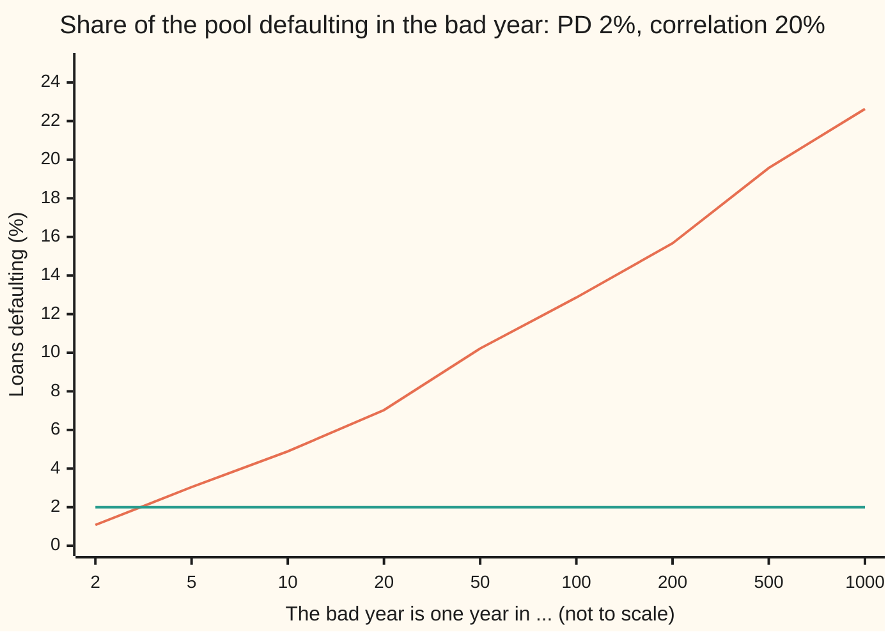
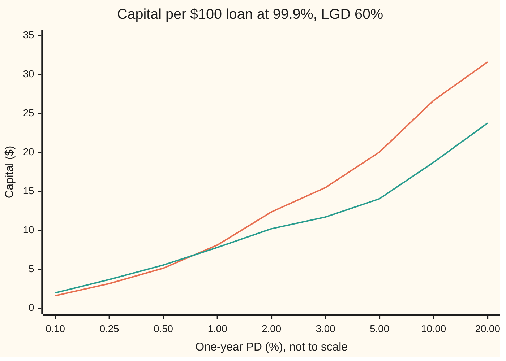

# Vasicek's large-pool loss curve: a whole book's loss distribution from three numbers, and the regulator's capital formula built on it

Financial mathematics → Portfolio Credit - Correlation, Copulas, Indices and Tranches → One bad year for a whole loan book → Vasicek's large-pool loss curve

---

## General Overview

A bank has lent $100 each to a great many small companies. Each company has a 2% chance of failing to repay within the year. When one fails, the bank recovers some of the money and loses the rest: 60 cents in the dollar, so $60 on a $100 loan.

On average, 2 loans in 100 go bad. The average loss is 2% of $60: **$1.20 per loan**. The bank builds that into the interest rate it charges, the way an insurer builds average claims into its premiums.

The danger is not the average year. Companies share an economy. In a recession they fail together, and a year that should see 2% of loans go bad can see several times that. The question a bank and its regulator both ask is: in the worst year out of a thousand, what fraction of the loans go bad, and how much money must be set aside today to survive it?

Oldřich Vasicek answered it for a pool so large that each loan is a speck. His answer needs three numbers: the default chance, 2%; how strongly the companies share the economy's fortunes, a correlation of 20%; and the loss per default, 60%. For this book the one-in-a-thousand year sees **22.6%** of loans default, against 2% expected. The money to set aside beyond the average is **$12.38 per $100 loan**. The Basel rules for banks run the same formula with a correlation they fix themselves, 16.4% here, and ask for **$10.22**.

**When a large pool of loans shares one economy, the fraction that defaults is a fixed function of how bad the economy is, so the pool's whole loss distribution is the bell curve of the economy, reshaped by one formula; its 99.9% point, minus the expected loss, is the capital the bank must hold.**

**What kind of fact this is:** a model, since one shared factor and a bell curve are assumptions about companies, not laws; inside the model the loss curve is a theorem, proved on this card in Why it works, and the Basel capital formula is a regulatory convention built on it.

### The picture: the bad year, one year in how many

Read across: "one year in 20" is the default rate that one year in twenty exceeds.



Rising line: the default rate the bad year reaches. Flat line: the 2% average. The median year, one in 2, sees only 1.08%: most years are quieter than average, because a few terrible years pull the average up. The one-in-a-thousand year sees 22.63%.

---

## The formula

Notation first, in words. $N(x)$ is the bell-curve area to the left of $x$: the chance that a standard normal draw (a draw from the bell curve with average 0 and spread 1) comes out below $x$. $N^{-1}(u)$ runs it backwards: the point with area $u$ to its left ([normal-quantile](../../09-Probability%20and%20statistics/04-Continuous%20Distributions/05-normal-quantile.md)). $L$ is the fraction of the pool that defaults in the year, a number between 0 and 1. $p$ is one loan's default chance (the PD, 2% here), $\rho$ the asset correlation (20%, defined in the table below) and $\alpha$ the confidence level (99.9%).

The chance that the default fraction stays at or below a level $x$:

$$F(x) = P(L \le x) = N\!\left(\frac{\sqrt{1-\rho}\;N^{-1}(x) - N^{-1}(p)}{\sqrt{\rho}}\right)$$

**Read it aloud:** turn the default level into a bell-curve position, scale it by the private share of risk, subtract the default threshold, divide by the shared share of risk, and read the area.

Run backwards, the level that the default fraction stays under with chance $\alpha$:

$$x_\alpha = N\!\left(\frac{N^{-1}(p) + \sqrt{\rho}\;N^{-1}(\alpha)}{\sqrt{1-\rho}}\right)$$

**Read it aloud:** start at the default threshold, push it up by $\sqrt{\rho}$ times the one-in-a-thousand bad economy, rescale by the private share, and read the area: that is the default rate in the bad year.

Capital per loan is the loss in the bad year minus the loss in the average year, the **unexpected loss**:

$$K = \mathrm{LGD} \times \big(x_{0.999} - p\big), \qquad \text{capital} = K \times \mathrm{EAD}$$

Basel's rule for company loans of one-year maturity uses exactly this $K$, with $\alpha = 0.999$ and its own correlation, falling from 24% for the safest borrowers to 12% for the riskiest:

$$\rho_{\text{Basel}}(p) = 0.12\,w + 0.24\,(1 - w), \qquad w = \frac{1 - e^{-50p}}{1 - e^{-50}}$$

The **expected shortfall** (the average default fraction over the worst 0.1% of years, [expected-shortfall-and-coherence](../39-Value%20at%20Risk%20and%20Expected%20Shortfall/05-expected-shortfall-and-coherence.md)) averages the same curve over the tail:

$$\mathrm{ES}_\alpha = \frac{1}{1-\alpha}\int_\alpha^1 x_u \, du$$

| Symbol | Plain meaning | In our example | Push it up and the 99.9% default rate… |
| --- | --- | --- | --- |
| $p$ | **PD**, probability of default: one loan's chance of defaulting in the year | 2% | rises, but more slowly than PD: 2.8% at 0.1% PD |
| $\rho$ | **asset correlation**: the share of each company's ups and downs that comes from the shared economy. Say "rho". | 20% | rises steeply: 12.8% at 10%, 33.3% at 30% |
| $M$, $m$, $m_x$ | the economy's state for the year, a bell-curve draw; $m$ is one value of it, $m_x$ the value that gives default fraction $x$. Low is bad. | −3.09 in the one-in-a-thousand year | a better economy means fewer defaults |
| $Z_i$, $A_i$, $i$ | company $i$'s private luck, and its health $A_i = \sqrt{\rho}\,M + \sqrt{1-\rho}\,Z_i$ | bell-curve draws | — |
| $c$ | the **default threshold** $N^{-1}(p)$: health below it means default | −2.0537 | a higher threshold means more defaults |
| $L$, $L_n$ | the fraction of the pool that defaults in the year; $L_n$ for a pool of $n$ loans | 2% on average | — |
| $x$, $F$ | a level of default fraction; $F(x)$ is the chance $L$ stays at or below it | 22.6% at the 99.9% point | — |
| $\alpha$ | the confidence level: the share of years the bank must survive | 99.9% | rises; at 99% it is 12.9% |
| $N$, $N^{-1}$, $\varphi$ | bell-curve area to the left, its inverse, and the bell curve's height | $N^{-1}(0.999) = 3.0902$ | — |
| $\mathrm{LGD}$, $\mathrm{EAD}$ | **loss given default**, the share lost when a loan defaults; **exposure at default**, the amount owed | 60%; $100 | capital rises in proportion |
| $K$ | capital per dollar of exposure: bad-year loss minus average loss | $12.38 per $100 | — |
| $n$ | the number of loans in the pool; the formula is the limit of very large $n$ | 25, 100, 1,000 in the checks | the 99.9% rate falls toward 22.6% |

### When it holds

- **One shared factor.** Every company feels the same economy. A book spread across industries or countries that suffer at different times needs several factors and a simulation.
- **A very large pool of similar, small loans.** The private luck averages out only when no loan is big. A pool of 100 loans sees 24.0% in its one-in-a-thousand year, not 22.6%; a single large borrower adds risk the formula never sees.
- **Bell-curve health.** The bell curve gives joint crashes thin tails. If companies fail together more often in extremes than the bell curve allows, the 99.9% point is too low; [tail-dependence-and-the-t-copula](07-tail-dependence-and-the-t-copula.md) measures by how much.
- **Known PD, correlation and LGD.** All three are estimates. Correlation is the hardest to estimate and moves the answer most: from 20% to 30% lifts the bad-year rate from 22.6% to 33.3%.
- **One period, loss counted only at default.** A loan that weakens without defaulting loses market value too; this model counts only defaults, which is why Basel adds a maturity adjustment for loans longer than a year.

---

## Why it works

### Step 0: one shared number decides the year

Each company's fate mixes the shared economy with private luck. Fix the economy, and the private lucks are independent coin flips. In a huge pool, independent coin flips average out: if each lands with the same chance, that share of them lands. So once the economy is known, the default fraction is known. The only uncertainty left in the pool is the economy itself, a single bell-curve number. The whole distribution of pool losses is that one bell curve, passed through one formula.

### Step 1: default is health falling below a line

This is the one-factor model of [one-factor-gaussian-copula](02-one-factor-gaussian-copula.md). Company $i$ has a health score $A_i = \sqrt{\rho}\,M + \sqrt{1-\rho}\,Z_i$, where the economy $M$ and the private luck $Z_i$ are independent bell-curve draws. The weights are square roots so that the two variances, $\rho$ and $1-\rho$, add to 1, keeping $A_i$ itself a standard bell-curve draw. The company defaults when $A_i$ falls below the threshold $c$. Setting $c = N^{-1}(p)$ makes the chance of that exactly $p$: here $c = N^{-1}(0.02) = -2.0537$.

### Step 2: the default chance in a given economy

Fix the economy at $m$. Company $i$ defaults when $\sqrt{\rho}\,m + \sqrt{1-\rho}\,Z_i < c$, that is when $Z_i < (c - \sqrt{\rho}\,m)/\sqrt{1-\rho}$. The private luck is a bell-curve draw, so

$$p(m) = N\!\left(\frac{c - \sqrt{\rho}\,m}{\sqrt{1-\rho}}\right).$$

In a normal economy, $m = 0$, this is $N(-2.0537/0.8944)$, well under 2%. In the one-in-a-thousand economy, $m = -3.0902$, the threshold effectively rises and the chance jumps to 22.6%. Averaged over all economies, $p(m)$ gives back 2%: the checks integrate it and get 0.020000.

### Step 3: in a large pool, the fraction equals the chance

Given $m$, the $n$ companies default independently, each with chance $p(m)$. The count of defaults is binomial: its average is $n\,p(m)$ and its spread, as a fraction, is $\sqrt{p(m)(1-p(m))/n}$, which shrinks to 0 as $n$ grows. This is the law of large numbers. In the limit, $L = p(M)$ exactly: the default fraction is a fixed function of the economy.

### Step 4: read the distribution off the economy

$p(m)$ falls as $m$ rises: a better economy means fewer defaults. So "the fraction is at most $x$" is the same event as "the economy is at least the level $m_x$ that gives exactly $x$". Solve $p(m_x) = x$:

$$\frac{c - \sqrt{\rho}\,m_x}{\sqrt{1-\rho}} = N^{-1}(x) \quad\Longrightarrow\quad m_x = \frac{c - \sqrt{1-\rho}\,N^{-1}(x)}{\sqrt{\rho}}.$$

The chance that the economy is at least $m_x$ is $N(-m_x)$, which is $F(x)$ as written in The formula.

### Step 5: quantiles pass straight through

Because $L$ is a falling function of $M$, the worst 0.1% of years for the pool are the worst 0.1% of economies. The economy is below $-N^{-1}(0.999) = -3.0902$ with chance 0.1%. Put that into $p(m)$: $x_{0.999} = N\big((c + \sqrt{\rho} \times 3.0902)/\sqrt{1-\rho}\big)$, which is the quantile formula. The same argument gives every quantile, which is how the picture above was drawn.

### Step 6: expected shortfall is the average over the bad economies

The average default fraction over the worst 0.1% of years is the average of $p(m)$ over the worst 0.1% of economies. Written as an integral over the economy, it is 27.16%. The checks compute it a second way, over loss levels instead of economies, using the ES card's formula $\mathrm{ES} = x_\alpha + E[(L - x_\alpha)_+]/(1-\alpha)$, and get the same 0.271614.

### Step 7: capital covers the unexpected part

The bank prices the average loss, $p \times \mathrm{LGD}$ per dollar, into its interest rates and provisions. Capital is for the rest: the gap between the bad year and the average year, $\mathrm{LGD} \times (x_{0.999} - p)$. Michael Gordy showed in 2003 that in a one-factor model with a very large pool, this charge for each loan depends only on that loan's own PD, LGD and correlation, not on what else is in the book. That property, called portfolio invariance, is why a regulator can set capital loan by loan and add it up. The model under it is the **asymptotic single risk factor** (ASRF) model: asymptotic because the pool is taken as infinitely large.

<details>
<summary>Detailed proof: the large-pool limit, and the two expected-shortfall routes agreeing</summary>

**The limit.** Fix $m$. The indicators $D_1, \dots, D_n$ (1 if company $i$ defaults, else 0) are independent with mean $p(m)$, so $L_n = \frac1n\sum D_i$ has mean $p(m)$ and variance $p(m)(1-p(m))/n \le 1/(4n)$. By Chebyshev's inequality (the chance of landing more than $\varepsilon$ from the average is at most the variance divided by $\varepsilon^2$), $P(|L_n - p(m)| > \varepsilon \mid M = m) \le 1/(4n\varepsilon^2)$ for every $m$. Averaging over $M$, the same bound holds unconditionally, so $L_n - p(M) \to 0$ in probability, and the distribution of $L_n$ converges to that of $p(M)$ at every level $x$ where $F$ is continuous, which is every $x$ strictly between 0 and 1.

**The distribution.** $p$ is strictly decreasing and continuous, so $\{p(M) \le x\} = \{M \ge m_x\}$ with $m_x$ from Step 4, and $P(M \ge m_x) = 1 - N(m_x) = N(-m_x)$ by the bell curve's symmetry. That gives $F$. Setting $F(x) = \alpha$ and solving: $-m_x = N^{-1}(\alpha)$, so $\sqrt{1-\rho}\,N^{-1}(x) = c + \sqrt{\rho}\,N^{-1}(\alpha)$, which gives $x_\alpha$.

**Expected shortfall.** With $u = N(z)$, the quantile integral becomes $\frac{1}{1-\alpha}\int_{z_\alpha}^{\infty} p(-z)\,\varphi(z)\,dz$, where $\varphi$ is the bell-curve height and $z_\alpha = N^{-1}(\alpha)$: an average over the worst economies, road one in the checks. For any loss $L$ with a continuous distribution, $\int_\alpha^1 x_u\,du = (1-\alpha)x_\alpha + E[(L - x_\alpha)_+]$, and $E[(L - x_\alpha)_+] = \int_{x_\alpha}^1 (1 - F(y))\,dy$ by integrating the tail. That is road two, an integral over loss levels that never touches the economy. The two agree to six decimals in both languages. The checks also assert that capital from road 2 and Basel's quantile found by root-finding match the closed form.

</details>

The one-factor model has cousins. **CreditMetrics** (J.P. Morgan, 1997) simulates the same kind of asset health, with several factors and rating changes as well as defaults. **CreditRisk+** (Credit Suisse, 1997) starts from default counts instead: each loan defaults like a rare random arrival whose rate is scaled by shared factors, and the loss distribution comes out of a recursion rather than a bell curve.

---

## Worked numbers, by hand

PD $p = 2\%$, correlation $\rho = 20\%$, LGD 60%, $100 per loan, confidence 99.9%.

| Step | Arithmetic | Value |
| --- | --- | --- |
| default threshold $c$ | $N^{-1}(0.02)$ | −2.0537 |
| bad economy | $N^{-1}(0.999)$ | 3.0902 |
| shared and private weights | $\sqrt{0.20}$, $\sqrt{0.80}$ | 0.4472, 0.8944 |
| position in the bad year | $(-2.0537 + 0.4472 \times 3.0902) / 0.8944$ | −0.7510 |
| **99.9% default fraction** | $N(-0.7510)$ | **22.63%** |
| above the average | $22.63\% - 2\%$ | 20.63 points |
| expected loss per loan | $100 \times 0.60 \times 0.02$ | $1.20 |
| bad-year loss per loan | $100 \times 0.60 \times 0.2263$ | $13.58 |
| **capital per loan** | $13.58 - 1.20$ | **$12.38** |
| expected shortfall | average over the worst 0.1% | 27.16%, $16.30 per loan |
| Basel weight, w in the formula | $(1 - e^{-1})/(1 - e^{-50})$ | 0.6321 |
| Basel correlation | $0.12 \times 0.6321 + 0.24 \times (1 - 0.6321)$ | 16.41% |
| Basel 99.9% default fraction | same quantile formula at 16.41% | 19.03% |
| **Basel capital per loan** | $100 \times 0.60 \times (0.1903 - 0.02)$ | **$10.22** |
| risk-weighted assets per loan | $12.5 \times 10.22$ | $127.69 |

A bank holding this book at 20% correlation needs $12.38 of its own money behind every $100 loan to survive the one-in-a-thousand year with the average loss already priced in. Basel, assuming a lower correlation for this PD, asks for $10.22. The factor 12.5 is 1 divided by 8%: Basel records the charge as $127.69 of "risk-weighted assets", on which the headline 8% minimum ratio gives back the $10.22.

### The Basel curve across borrowers

Capital per $100 loan, LGD 60%, one-year maturity, as PD varies:



First line: correlation held at 20%. Second line: Basel's correlation, 24% for the safest borrowers sliding to 12% for the riskiest. Basel asks for more at 0.5% PD and below, and less from 1% PD up. Basel's reasoning: a risky small company fails for its own reasons more than for the economy's, so its correlation is lower.

### Where a finite pool adds noise

The formula assumes the private luck averages out completely. With a finite pool it does not, and the bad year is worse. The checks compute the exact finite-pool distribution by mixing binomial counts over the economy, and simulate 100 loans for 100,000 years:

```
99.9% default fraction, PD 2%, correlation 20%, percent of the pool
25 loans, exact          ████████████████████████████  28.0
100 loans, exact         ████████████████████████      24.0
100 loans, simulated     ████████████████████████      24.0
1,000 loans, exact       ███████████████████████       22.8
very large pool, formula ███████████████████████       22.6
```

A pool of 25 sees 28.0% in its bad year, well above the formula's 22.6%. At 1,000 loans it is 22.8%, close to the limit. Expected shortfall shows the same pattern: 34.4% for 25 loans, 29.1% for 100 (29.2% simulated), 27.4% for 1,000, 27.2% in the limit. Basel's formula assumes the large pool; supervisors deal with concentration in a single name separately, under large-exposure limits and the supervisory review known as Pillar 2.

### What breaks if you drop a piece

Correct answer: $12.38 per loan.

| Mistake | Comes out at | What went wrong |
| --- | --- | --- |
| Correlation set to 0 | 99.9% rate 2.0%: no capital | With no shared economy, private luck averages out and every year looks average |
| Capital = bad-year loss, expected loss left in | $13.58 | The $1.20 average loss is already priced and provisioned; counting it again double-charges |
| LGD forgotten | $20.63 | Counts every defaulted dollar as lost; 40 cents in the dollar comes back |
| $N^{-1}(0.001)$ used for the bad economy | −$1.20 | Took the one-in-a-thousand *good* year: almost no defaults, so negative capital |
| Default correlation 3.6% put in place of asset correlation 20% | $2.83 | Two different correlations; the one in the formula is between healths, not between default events |

---

## Code, from first principles, and it actually runs

Both programs build the bell-curve area themselves (Python from `math.erf`, Rust from a series and a continued fraction), invert it by bisection, and integrate by Simpson's rule. The 99.9% default fraction is reached **four independent ways**: the closed-form quantile; a root-finder on the closed-form distribution $F$; exact finite pools of 25, 100 and 1,000 loans built from binomial counts, closing in on the limit; and a simulation of 100 loans with their own private luck over 100,000 years, which never uses the formula at all. Expected shortfall is reached two ways, over economies and over loss levels. Every number on the card is printed.

### Python

```python
# Vasicek large-pool loss curve and Basel capital -- the check behind the card. Standard library
# only: normal CDF from math.erf, inverse by bisection, Simpson integrals, hand-written random numbers.
from math import erf, exp, log, sqrt, cos, pi

def N(x):                                   # bell-curve area left of x
    return 0.5 * (1.0 + erf(x / sqrt(2.0)))
def phi(x):                                 # bell-curve height at x
    return exp(-0.5 * x * x) / sqrt(2.0 * pi)

def bisect(f, lo, hi, iters=200):           # root of an increasing function on [lo, hi]
    for _ in range(iters):
        mid = 0.5 * (lo + hi)
        if f(mid) < 0.0: lo = mid
        else: hi = mid
    return 0.5 * (lo + hi)

def Ninv(u):
    return bisect(lambda z: N(z) - u, -40.0, 40.0)
def simpson(f, a, b, n=4000):               # n even
    h = (b - a) / n
    s = f(a) + f(b) + sum((4 if i % 2 else 2) * f(a + i * h) for i in range(1, n))
    return s * h / 3.0

PD, RHO, LGD, LOAN, ALPHA = 0.02, 0.20, 0.60, 100.0, 0.999
c = Ninv(PD)                                # default threshold
z_a = Ninv(ALPHA)                           # the 1-in-1000 bad economy, as a positive number

def p_given(m, rho=RHO, cc=c):             # default chance of one loan when the economy reads m
    return N((cc - sqrt(rho) * m) / sqrt(1.0 - rho))

def quantile(u, rho=RHO, pd=PD):            # road 1: the closed form
    return N((Ninv(pd) + sqrt(rho) * Ninv(u)) / sqrt(1.0 - rho))

def F(x):                                   # chance the pool's default fraction is at most x
    return N((sqrt(1.0 - RHO) * Ninv(x) - c) / sqrt(RHO))

def basel_rho(pd):
    w = (1.0 - exp(-50.0 * pd)) / (1.0 - exp(-50.0))
    return 0.12 * w + 0.24 * (1.0 - w)

# ---- road 1 and road 2 to the 99.9% default fraction ----
x1 = quantile(ALPHA)
x2 = bisect(lambda x: F(x) - ALPHA, 1e-12, 1.0 - 1e-12)
mean_pd = simpson(lambda m: p_given(m) * phi(m), -10.0, 10.0)            # must give back PD
# expected shortfall: average default fraction over the worst 0.1% of economies ...
es1 = simpson(lambda z: p_given(-z) * phi(z), z_a, 12.0) / (1.0 - ALPHA)
# ... and, independently, over loss levels: ES = VaR + E[(L - VaR)+] / (1 - alpha)
es2 = x1 + simpson(lambda y: 1.0 - F(y), x1, 1.0 - 1e-12) / (1.0 - ALPHA)

# ---- road 3: finite pools, exact, by mixing binomials over the economy ----
def finite_pool(n, nodes=1600, lo=-9.0, hi=9.0):
    lc = [0.0] * (n + 1)
    for k in range(1, n + 1):
        lc[k] = lc[k - 1] + log(n - k + 1) - log(k)
    dist, h = [0.0] * (n + 1), (hi - lo) / nodes
    for i in range(nodes + 1):
        m = lo + i * h
        w = (1 if i in (0, nodes) else (4 if i % 2 else 2)) * h / 3.0 * phi(m)
        q = min(max(p_given(m), 1e-300), 1.0 - 1e-16)
        lq, l1 = log(q), log(1.0 - q)
        for k in range(n + 1):
            dist[k] += w * exp(lc[k] + k * lq + (n - k) * l1)
    cum, k = 0.0, 0
    while cum + dist[k] < ALPHA:
        cum += dist[k]; k += 1
    tail = sum(dist[j] * j / n for j in range(k + 1, n + 1)) + (cum + dist[k] - ALPHA) * k / n
    return sum(dist), k / n, tail / (1.0 - ALPHA)

# ---- road 4: simulate 100 loans, each with its own luck, 100,000 years ----
state = 0x2545F4914F6CDD1D
def uniform():
    global state
    state = (state * 6364136223846793005 + 1442695040888963407) & 0xFFFFFFFFFFFFFFFF
    return ((state >> 11) + 0.5) / 9007199254740992.0
def normal_pair():
    r, t = sqrt(-2.0 * log(uniform())), 2.0 * pi * uniform()
    return r * cos(t), r * cos(t - 0.5 * pi)
YEARS, LOANS = 100000, 100
a, b = sqrt(RHO), sqrt(1.0 - RHO)
fracs = []
for _ in range(YEARS):
    m, _ = normal_pair()
    d = 0
    for _ in range(LOANS // 2):
        z1, z2 = normal_pair()
        d += (a * m + b * z1 < c) + (a * m + b * z2 < c)
    fracs.append(d / LOANS)
fracs.sort()
tail_n = int(round(YEARS * (1.0 - ALPHA)))
mc_var = fracs[YEARS - tail_n - 1]
mc_es = sum(fracs[YEARS - tail_n:]) / tail_n
mc_mean = sum(fracs) / YEARS

# ---- capital ----
EL = LOAN * LGD * PD
var_loss = LOAN * LGD * x1
cap = var_loss - EL
rb = basel_rho(PD)
xb = quantile(ALPHA, rb)
cap_b = LOAN * LGD * (xb - PD)
joint = simpson(lambda m: p_given(m) ** 2 * phi(m), -10.0, 10.0)
dcorr = (joint - PD * PD) / (PD * (1.0 - PD))   # default correlation

out = [("threshold c = N^-1(PD)", c), ("bad economy N^-1(0.999)", z_a), ("sqrt(rho)", sqrt(RHO)),
       ("sqrt(1 - rho)", sqrt(1 - RHO)), ("argument (c + sqrt(rho) z)/sqrt(1-rho)", (c + sqrt(RHO) * z_a) / sqrt(1 - RHO)),
       ("1 closed-form 99.9% fraction", x1), ("2 root of F(x) = 0.999", x2),
       ("  average of p(M), must be PD", mean_pd),
       ("ES 99.9%, over economies", es1), ("ES 99.9%, over loss levels", es2)]
pools = {n: finite_pool(n) for n in (25, 100, 1000)}
for n, (tot, q_n, es_n) in pools.items():
    out += [(f"3 exact pool of {n}: total prob", tot), (f"  pool of {n}: 99.9% fraction", q_n), (f"  pool of {n}: ES 99.9%", es_n)]
out += [("4 simulated 100 loans: mean", mc_mean), ("  simulated: 99.9% fraction", mc_var), ("  simulated: ES 99.9%", mc_es),
        ("expected loss per loan $", EL), ("99.9% loss per loan $", var_loss), ("capital = UL per loan $", cap),
        ("ES loss per loan $", LOAN * LGD * es1), ("fraction above expected", x1 - PD), ("Basel weight w", (1 - exp(-50 * PD)) / (1 - exp(-50))), ("Basel correlation", rb), ("Basel 99.9% fraction", xb),
        ("Basel capital per loan $", cap_b), ("risk-weighted assets per loan $", 12.5 * cap_b),
        ("default correlation", dcorr),
        ("wrong: correlation 0, 99.9% fraction", quantile(ALPHA, 0.0)),
        ("wrong: EL left in, capital $", var_loss), ("wrong: forgot LGD, capital $", LOAN * (x1 - PD)),
        ("wrong: N^-1(0.001), capital $", LOAN * LGD * (quantile(1.0 - ALPHA) - PD)),
        ("wrong: default corr as rho, capital $", LOAN * LGD * (quantile(ALPHA, dcorr) - PD)),
        ("try: rho 0.10 fraction", quantile(ALPHA, 0.10)), ("try: rho 0.30 fraction", quantile(ALPHA, 0.30)),
        ("try: alpha 0.99 fraction", quantile(0.99))]
for name, v in out:
    print(f"{name:<38} {v:>12.6f}")
print("chart, 1 year in   " + " ".join(f"{t:>6d}" for t in (2, 5, 10, 20, 50, 100, 200, 500, 1000)))
print("chart, fraction %  " + " ".join(f"{100 * quantile(1 - 1 / t):6.2f}" for t in (2, 5, 10, 20, 50, 100, 200, 500, 1000)))
pds = (0.001, 0.0025, 0.005, 0.01, 0.02, 0.03, 0.05, 0.10, 0.20)
print("chart, PD %        " + " ".join(f"{100 * p:6.2f}" for p in pds))
print("chart, cap rho 20% " + " ".join(f"{LOAN * LGD * (quantile(ALPHA, RHO, p) - p):6.2f}" for p in pds))
print("chart, cap Basel   " + " ".join(f"{LOAN * LGD * (quantile(ALPHA, basel_rho(p), p) - p):6.2f}" for p in pds))

assert abs(x1 - x2) < 1e-9,                "closed form vs root of the CDF"
assert abs(mean_pd - PD) < 1e-9,           "averaging over the economy returns PD"
assert abs(es1 - es2) < 1e-6,              "ES over economies vs ES over loss levels"
assert abs(pools[100][1] - mc_var) <= 0.015, "simulated 100-loan quantile within noise of the exact one"
assert abs(pools[100][2] - mc_es) < 0.01,    "simulated 100-loan ES within noise of the exact one"
assert abs(pools[1000][1] - x1) < 0.005 < abs(pools[25][1] - x1), "big pools approach the large-pool curve"
assert abs(mc_mean - PD) < 0.0015,           "simulated mean default rate"
assert abs(cap - LOAN * LGD * (x2 - PD)) < 1e-6 and abs(rb - 0.1641) < 1e-4 and abs(bisect(lambda x: N((sqrt(1 - rb) * Ninv(x) - c) / sqrt(rb)) - ALPHA, 1e-12, 1 - 1e-12) - xb) < 1e-9, "capital by road 2; Basel correlation and quantile by root-finding"
print("ALL CHECKS PASS")
```

**Ran 2026-09-28 on macOS, Python 3.14.6, standard library only. All checks passed. Output, pasted from the run:**

```
threshold c = N^-1(PD)                    -2.053749
bad economy N^-1(0.999)                    3.090232
sqrt(rho)                                  0.447214
sqrt(1 - rho)                              0.894427
argument (c + sqrt(rho) z)/sqrt(1-rho)    -0.751045
1 closed-form 99.9% fraction               0.226313
2 root of F(x) = 0.999                     0.226313
  average of p(M), must be PD              0.020000
ES 99.9%, over economies                   0.271614
ES 99.9%, over loss levels                 0.271614
3 exact pool of 25: total prob             1.000000
  pool of 25: 99.9% fraction               0.280000
  pool of 25: ES 99.9%                     0.344192
3 exact pool of 100: total prob            1.000000
  pool of 100: 99.9% fraction              0.240000
  pool of 100: ES 99.9%                    0.290860
3 exact pool of 1000: total prob           1.000000
  pool of 1000: 99.9% fraction             0.228000
  pool of 1000: ES 99.9%                   0.273569
4 simulated 100 loans: mean                0.020002
  simulated: 99.9% fraction                0.240000
  simulated: ES 99.9%                      0.291700
expected loss per loan $                   1.200000
99.9% loss per loan $                     13.578768
capital = UL per loan $                   12.378768
ES loss per loan $                        16.296862
fraction above expected                    0.206313
Basel weight w                             0.632121
Basel correlation                          0.164146
Basel 99.9% fraction                       0.190259
Basel capital per loan $                  10.215541
risk-weighted assets per loan $          127.694266
default correlation                        0.035723
wrong: correlation 0, 99.9% fraction       0.020000
wrong: EL left in, capital $              13.578768
wrong: forgot LGD, capital $              20.631281
wrong: N^-1(0.001), capital $             -1.196328
wrong: default corr as rho, capital $      2.834515
try: rho 0.10 fraction                     0.128237
try: rho 0.30 fraction                     0.332992
try: alpha 0.99 fraction                   0.128610
chart, 1 year in        2      5     10     20     50    100    200    500   1000
chart, fraction %    1.08   3.04   4.89   7.03  10.22  12.86  15.67  19.57  22.63
chart, PD %          0.10   0.25   0.50   1.00   2.00   3.00   5.00  10.00  20.00
chart, cap rho 20%   1.62   3.18   5.16   8.13  12.38  15.51  20.07  26.68  31.63
chart, cap Basel     1.99   3.70   5.56   7.82  10.22  11.72  14.07  18.75  23.78
ALL CHECKS PASS
```

### Rust

```rust
// Vasicek large-pool loss curve and Basel capital -- the check behind the card. Rust std only, no erf,
// so N(x) is a power series in the middle and a continued fraction in the tails. Bisection, Simpson, own RNG.
use std::f64::consts::PI;

fn erf_series(t: f64) -> f64 {
    let (mut term, mut sum, mut n) = (t, t, 0.0);
    while term.abs() > 1e-17 * sum.abs().max(1e-300) {
        n += 1.0;
        term *= -t * t / n;
        sum += term / (2.0 * n + 1.0);
    }
    2.0 / PI.sqrt() * sum
}
fn erfc_cf(t: f64) -> f64 {                       // t > 2.5
    let mut k = t;
    for i in (1..=80).rev() { k = t + (i as f64 / 2.0) / k; }
    (-t * t).exp() / (PI.sqrt() * k)
}
fn norm_cdf(x: f64) -> f64 {
    let t = x / 2f64.sqrt();
    if t.abs() < 2.5 { 0.5 * (1.0 + erf_series(t)) }
    else if t > 0.0 { 1.0 - 0.5 * erfc_cf(t) } else { 0.5 * erfc_cf(-t) }
}
fn phi(x: f64) -> f64 { (-0.5 * x * x).exp() / (2.0 * PI).sqrt() }
fn bisect<F: Fn(f64) -> f64>(f: F, mut lo: f64, mut hi: f64) -> f64 {
    for _ in 0..200 {
        let mid = 0.5 * (lo + hi);
        if f(mid) < 0.0 { lo = mid } else { hi = mid }
    }
    0.5 * (lo + hi)
}
fn ninv(u: f64) -> f64 { bisect(|z| norm_cdf(z) - u, -40.0, 40.0) }
fn simpson<F: Fn(f64) -> f64>(f: F, a: f64, b: f64, n: usize) -> f64 {
    let h = (b - a) / n as f64;
    let mut s = f(a) + f(b);
    for i in 1..n { s += if i % 2 == 1 { 4.0 } else { 2.0 } * f(a + i as f64 * h); }
    s * h / 3.0
}

const PD: f64 = 0.02; const RHO: f64 = 0.20; const LGD: f64 = 0.60; const LOAN: f64 = 100.0; const ALPHA: f64 = 0.999;

fn p_given(m: f64, rho: f64, c: f64) -> f64 { norm_cdf((c - rho.sqrt() * m) / (1.0 - rho).sqrt()) }
fn quantile(u: f64, rho: f64, pd: f64) -> f64 { norm_cdf((ninv(pd) + rho.sqrt() * ninv(u)) / (1.0 - rho).sqrt()) }
fn basel_rho(pd: f64) -> f64 {
    let w = (1.0 - (-50.0 * pd).exp()) / (1.0 - (-50.0f64).exp());
    0.12 * w + 0.24 * (1.0 - w)
}

// exact finite pool: mix binomial counts over the economy; returns (total prob, 99.9% fraction, ES)
fn finite_pool(n: usize, c: f64) -> (f64, f64, f64) {
    let (nodes, lo, hi) = (1600usize, -9.0f64, 9.0f64);
    let mut lc = vec![0.0f64; n + 1];
    for k in 1..=n { lc[k] = lc[k - 1] + ((n - k + 1) as f64).ln() - (k as f64).ln(); }
    let mut dist = vec![0.0f64; n + 1];
    let h = (hi - lo) / nodes as f64;
    for i in 0..=nodes {
        let m = lo + i as f64 * h;
        let wt = if i == 0 || i == nodes { 1.0 } else if i % 2 == 1 { 4.0 } else { 2.0 };
        let w = wt * h / 3.0 * phi(m);
        let q = p_given(m, RHO, c).max(1e-300).min(1.0 - 1e-16);
        let (lq, l1) = (q.ln(), (1.0 - q).ln());
        for k in 0..=n { dist[k] += w * (lc[k] + k as f64 * lq + (n - k) as f64 * l1).exp(); }
    }
    let (mut cum, mut k) = (0.0, 0usize);
    while cum + dist[k] < ALPHA { cum += dist[k]; k += 1; }
    let mut tail = (cum + dist[k] - ALPHA) * k as f64 / n as f64;
    for j in k + 1..=n { tail += dist[j] * j as f64 / n as f64; }
    (dist.iter().sum(), k as f64 / n as f64, tail / (1.0 - ALPHA))
}

struct Rng(u64);
impl Rng {
    fn uniform(&mut self) -> f64 {
        self.0 = self.0.wrapping_mul(6364136223846793005).wrapping_add(1442695040888963407);
        ((self.0 >> 11) as f64 + 0.5) / 9007199254740992.0
    }
    fn normal_pair(&mut self) -> (f64, f64) {
        let r = (-2.0 * self.uniform().ln()).sqrt();
        let t = 2.0 * PI * self.uniform();
        (r * t.cos(), r * (t - 0.5 * PI).cos())
    }
}

fn main() {
    let (c, z_a) = (ninv(PD), ninv(ALPHA));
    let f_cdf = |x: f64| norm_cdf(((1.0 - RHO).sqrt() * ninv(x) - c) / RHO.sqrt());
    let x1 = quantile(ALPHA, RHO, PD);
    let x2 = bisect(|x| f_cdf(x) - ALPHA, 1e-12, 1.0 - 1e-12);
    let mean_pd = simpson(|m| p_given(m, RHO, c) * phi(m), -10.0, 10.0, 4000);
    let es1 = simpson(|z| p_given(-z, RHO, c) * phi(z), z_a, 12.0, 4000) / (1.0 - ALPHA);
    let es2 = x1 + simpson(|y| 1.0 - f_cdf(y), x1, 1.0 - 1e-12, 4000) / (1.0 - ALPHA);

    // simulate 100 loans, each with its own luck, 100,000 years
    let (years, loans) = (100000usize, 100usize);
    let mut rng = Rng(0x2545F4914F6CDD1D);
    let (a, b) = (RHO.sqrt(), (1.0 - RHO).sqrt());
    let mut fracs: Vec<f64> = Vec::with_capacity(years);
    for _ in 0..years {
        let (m, _) = rng.normal_pair();
        let mut d = 0usize;
        for _ in 0..loans / 2 {
            let (z1, z2) = rng.normal_pair();
            if a * m + b * z1 < c { d += 1; }
            if a * m + b * z2 < c { d += 1; }
        }
        fracs.push(d as f64 / loans as f64);
    }
    fracs.sort_by(|p, q| p.partial_cmp(q).unwrap());
    let tail_n = (years as f64 * (1.0 - ALPHA)).round() as usize;
    let mc_var = fracs[years - tail_n - 1];
    let mc_es = fracs[years - tail_n..].iter().sum::<f64>() / tail_n as f64;
    let mc_mean = fracs.iter().sum::<f64>() / years as f64;

    let el = LOAN * LGD * PD;
    let var_loss = LOAN * LGD * x1;
    let rb = basel_rho(PD);
    let xb = quantile(ALPHA, rb, PD);
    let cap_b = LOAN * LGD * (xb - PD);
    let joint = simpson(|m| p_given(m, RHO, c).powi(2) * phi(m), -10.0, 10.0, 4000);
    let dcorr = (joint - PD * PD) / (PD * (1.0 - PD));

    let mut out: Vec<(String, f64)> = vec![
        ("threshold c = N^-1(PD)".into(), c), ("bad economy N^-1(0.999)".into(), z_a), ("sqrt(rho)".into(), RHO.sqrt()),
        ("sqrt(1 - rho)".into(), (1.0 - RHO).sqrt()),
        ("argument (c + sqrt(rho) z)/sqrt(1-rho)".into(), (c + RHO.sqrt() * z_a) / (1.0 - RHO).sqrt()),
        ("1 closed-form 99.9% fraction".into(), x1), ("2 root of F(x) = 0.999".into(), x2),
        ("  average of p(M), must be PD".into(), mean_pd),
        ("ES 99.9%, over economies".into(), es1), ("ES 99.9%, over loss levels".into(), es2)];
    let mut pools = Vec::new();
    for &n in &[25usize, 100, 1000] {
        let (tot, q_n, es_n) = finite_pool(n, c);
        out.push((format!("3 exact pool of {}: total prob", n), tot));
        out.push((format!("  pool of {}: 99.9% fraction", n), q_n));
        out.push((format!("  pool of {}: ES 99.9%", n), es_n));
        pools.push((q_n, es_n));
    }
    let rest: Vec<(&str, f64)> = vec![
        ("4 simulated 100 loans: mean", mc_mean), ("  simulated: 99.9% fraction", mc_var), ("  simulated: ES 99.9%", mc_es),
        ("expected loss per loan $", el), ("99.9% loss per loan $", var_loss), ("capital = UL per loan $", var_loss - el),
        ("ES loss per loan $", LOAN * LGD * es1), ("fraction above expected", x1 - PD),
        ("Basel weight w", (1.0 - (-50.0 * PD).exp()) / (1.0 - (-50.0f64).exp())), ("Basel correlation", rb), ("Basel 99.9% fraction", xb),
        ("Basel capital per loan $", cap_b), ("risk-weighted assets per loan $", 12.5 * cap_b),
        ("default correlation", dcorr),
        ("wrong: correlation 0, 99.9% fraction", quantile(ALPHA, 0.0, PD)),
        ("wrong: EL left in, capital $", var_loss), ("wrong: forgot LGD, capital $", LOAN * (x1 - PD)),
        ("wrong: N^-1(0.001), capital $", LOAN * LGD * (quantile(1.0 - ALPHA, RHO, PD) - PD)),
        ("wrong: default corr as rho, capital $", LOAN * LGD * (quantile(ALPHA, dcorr, PD) - PD)),
        ("try: rho 0.10 fraction", quantile(ALPHA, 0.10, PD)), ("try: rho 0.30 fraction", quantile(ALPHA, 0.30, PD)),
        ("try: alpha 0.99 fraction", quantile(0.99, RHO, PD))];
    for (k, v) in rest { out.push((k.to_string(), v)); }
    for (name, v) in &out { println!("{:<38} {:>12.6}", name, v); }
    let ts = [2.0, 5.0, 10.0, 20.0, 50.0, 100.0, 200.0, 500.0, 1000.0f64];
    let row = |label: &str, v: Vec<String>| println!("{}{}", label, v.join(" "));
    row("chart, 1 year in   ", ts.iter().map(|t| format!("{:>6}", *t as i64)).collect());
    row("chart, fraction %  ", ts.iter().map(|t| format!("{:6.2}", 100.0 * quantile(1.0 - 1.0 / t, RHO, PD))).collect());
    let pds = [0.001, 0.0025, 0.005, 0.01, 0.02, 0.03, 0.05, 0.10, 0.20f64];
    row("chart, PD %        ", pds.iter().map(|p| format!("{:6.2}", 100.0 * p)).collect());
    row("chart, cap rho 20% ", pds.iter().map(|&p| format!("{:6.2}", LOAN * LGD * (quantile(ALPHA, RHO, p) - p))).collect());
    row("chart, cap Basel   ", pds.iter().map(|&p| format!("{:6.2}", LOAN * LGD * (quantile(ALPHA, basel_rho(p), p) - p))).collect());

    assert!((x1 - x2).abs() < 1e-9, "closed form vs root of the CDF");
    assert!((mean_pd - PD).abs() < 1e-9, "averaging over the economy returns PD");
    assert!((es1 - es2).abs() < 1e-6, "ES over economies vs ES over loss levels");
    assert!((pools[1].0 - mc_var).abs() <= 0.015, "simulated 100-loan quantile within noise of the exact one");
    assert!((pools[1].1 - mc_es).abs() < 0.01, "simulated 100-loan ES within noise of the exact one");
    assert!((pools[2].0 - x1).abs() < 0.005 && 0.005 < (pools[0].0 - x1).abs(), "big pools approach the large-pool curve");
    assert!((mc_mean - PD).abs() < 0.0015, "simulated mean default rate");
    assert!((var_loss - el - LOAN * LGD * (x2 - PD)).abs() < 1e-6 && (rb - 0.1641).abs() < 1e-4 && (bisect(|x| norm_cdf(((1.0 - rb).sqrt() * ninv(x) - c) / rb.sqrt()) - ALPHA, 1e-12, 1.0 - 1e-12) - xb).abs() < 1e-9, "capital by road 2; Basel correlation and quantile by root-finding");
    println!("ALL CHECKS PASS");
}
```

**Ran 2026-09-28 on macOS, rustc 1.98.1, no crates. All checks passed. Output, pasted from the run:**

```
threshold c = N^-1(PD)                    -2.053749
bad economy N^-1(0.999)                    3.090232
sqrt(rho)                                  0.447214
sqrt(1 - rho)                              0.894427
argument (c + sqrt(rho) z)/sqrt(1-rho)    -0.751045
1 closed-form 99.9% fraction               0.226313
2 root of F(x) = 0.999                     0.226313
  average of p(M), must be PD              0.020000
ES 99.9%, over economies                   0.271614
ES 99.9%, over loss levels                 0.271614
3 exact pool of 25: total prob             1.000000
  pool of 25: 99.9% fraction               0.280000
  pool of 25: ES 99.9%                     0.344192
3 exact pool of 100: total prob            1.000000
  pool of 100: 99.9% fraction              0.240000
  pool of 100: ES 99.9%                    0.290860
3 exact pool of 1000: total prob           1.000000
  pool of 1000: 99.9% fraction             0.228000
  pool of 1000: ES 99.9%                   0.273569
4 simulated 100 loans: mean                0.020002
  simulated: 99.9% fraction                0.240000
  simulated: ES 99.9%                      0.291700
expected loss per loan $                   1.200000
99.9% loss per loan $                     13.578768
capital = UL per loan $                   12.378768
ES loss per loan $                        16.296862
fraction above expected                    0.206313
Basel weight w                             0.632121
Basel correlation                          0.164146
Basel 99.9% fraction                       0.190259
Basel capital per loan $                  10.215541
risk-weighted assets per loan $          127.694266
default correlation                        0.035723
wrong: correlation 0, 99.9% fraction       0.020000
wrong: EL left in, capital $              13.578768
wrong: forgot LGD, capital $              20.631281
wrong: N^-1(0.001), capital $             -1.196328
wrong: default corr as rho, capital $      2.834515
try: rho 0.10 fraction                     0.128237
try: rho 0.30 fraction                     0.332992
try: alpha 0.99 fraction                   0.128610
chart, 1 year in        2      5     10     20     50    100    200    500   1000
chart, fraction %    1.08   3.04   4.89   7.03  10.22  12.86  15.67  19.57  22.63
chart, PD %          0.10   0.25   0.50   1.00   2.00   3.00   5.00  10.00  20.00
chart, cap rho 20%   1.62   3.18   5.16   8.13  12.38  15.51  20.07  26.68  31.63
chart, cap Basel     1.99   3.70   5.56   7.82  10.22  11.72  14.07  18.75  23.78
ALL CHECKS PASS
```

The two outputs agree line for line, including the simulation: both use the same integer random-number recipe, while the bell-curve areas come from different code.

> [!TIP]
> **Try changing**
> Guess the direction first. Then run it.
> - **Halve the correlation.** Set `RHO = 0.10`. The one-in-a-thousand year drops from 22.6% to **12.8%** defaulting. At `0.30` it is **33.3%**. Correlation is the input that matters most and the hardest to measure.
> - **Relax the confidence.** Set `ALPHA = 0.99`, one year in a hundred. The bad-year rate falls to **12.9%**, a little over half. Basel's 99.9% is a choice, not a law.
> - **Shrink the pool.** Call `finite_pool(25)`. The bad year sees **28.0%** of loans default, against the formula's 22.6%: 25 loans are too few for private luck to average out.
> - **Make the borrower safer.** Guess whether Basel asks for more or less than 20% correlation would at 0.1% PD. More: the chart rows give **$1.99** against **$1.62**, because Basel's correlation for safe borrowers approaches 24%.

---

## The usual mistake

> [!warning]
> **Reading 22.6% as one loan's chance of default.** Every loan still has a 2% chance each year. The 22.6% is the share of the pool that defaults in the worst year out of a thousand. The formula is about how defaults bunch, not about any single company getting riskier.
>
> Smaller traps:
> - **Mixing up the two correlations.** Asset correlation, 20% here, links companies' health. Default correlation, the correlation between default events, is only 3.6% for the same model ([default-correlation-and-joint-default](01-default-correlation-and-joint-default.md)). Put the second into the formula and capital drops from $12.38 to $2.83.
> - **Using the formula on a small book.** For 25 loans the one-in-a-thousand year sees 28.0% default, not 22.6%. The formula understates the risk of a lumpy book.
> - **Holding capital for the whole bad-year loss.** $13.58 instead of $12.38. The expected $1.20 is covered by pricing and provisions.
> - **Treating Basel's correlation as measured.** It is a fixed function of PD chosen by the regulator, sliding from 24% to 12%. It is a convention, with a multiplier of 1.25 for large financial institutions, not an estimate of any particular book.

---

## Where you meet it in real life

- **Bank capital for company loans.** Every bank using the Basel internal-ratings-based approach runs this formula loan by loan: its own PD and LGD estimates in, the regulator's correlation, 12.5 times $K$ out as risk-weighted assets. The deeper regulatory story is [vasicek-asrf-and-credit-capital](../48-Regulatory%20Capital%20in%20Outline/03-vasicek-asrf-and-credit-capital.md).
- **Mortgages and credit cards.** The same formula with fixed correlations for retail books, set lower for credit cards than for mortgages.
- **Economic capital.** Banks run their own version, with their own correlations and often more factors, to price loans.
- **Tranches.** Slice the pool's losses into layers, the first few percent lost, the next few, and so on, and each layer's price is an average over this same loss curve: [cdo-tranches-in-outline](05-cdo-tranches-in-outline.md). The market's quoted correlation for index tranches, [implied-and-base-correlation](06-implied-and-base-correlation.md), is the $\rho$ that makes this curve match prices on pools such as [credit-indices](04-credit-indices.md).
- **Stress testing.** Pick a bad economy $m$ instead of a probability, and $p(m)$ gives the default rate in that scenario.

> **Say it back**
> Each company's health mixes one shared economy with its own luck, and it defaults when health falls below a threshold set by its PD. In a very large pool the private luck averages out, so the default fraction is a fixed, falling function of the economy. The pool's loss distribution is therefore the economy's bell curve passed through that function, and its 99.9% point comes from putting the one-in-a-thousand economy in. Capital is that bad-year loss minus the average loss already priced in: $12.38 per $100 loan here, $10.22 with Basel's own correlation. A finite pool is lumpier and needs more.

---

## What this builds on

- [one-factor-gaussian-copula](02-one-factor-gaussian-copula.md): the health score, one shared factor plus private luck, and the default threshold. This card takes that model to a pool too large to count.
- [profit-and-loss-distribution-and-var](../39-Value%20at%20Risk%20and%20Expected%20Shortfall/01-profit-and-loss-distribution-and-var.md): value at risk as a quantile of the loss distribution. The 99.9% default fraction is exactly that quantile.
- [expected-shortfall-and-coherence](../39-Value%20at%20Risk%20and%20Expected%20Shortfall/05-expected-shortfall-and-coherence.md): the average beyond the quantile, and the formula used as the second road to it here.
- [normal-quantile](../../09-Probability%20and%20statistics/04-Continuous%20Distributions/05-normal-quantile.md): $N^{-1}$, the bell curve run backwards, used twice in every capital calculation.

## Where this goes next

- [cdo-tranches-in-outline](05-cdo-tranches-in-outline.md): slices this loss curve into layers and prices each one.
- [kva](../47-Collateral%2C%20Funding%20and%20the%20Rest%20of%20the%20XVAs/04-kva.md): the cost of holding capital like the $12.38 here over a trade's life, charged back to the trade.
- [vasicek-asrf-and-credit-capital](../48-Regulatory%20Capital%20in%20Outline/03-vasicek-asrf-and-credit-capital.md): the regulatory machinery around this formula, with maturity adjustments, retail curves and the path from capital to risk-weighted assets.

This card gives the whole loss curve of a pool but not what an investor should pay for a slice of it; pricing the slices, and reading the market's correlation back out of their prices, is where the tranche card picks up.

---

## Sources

Verified 2026-09-28: every link below resolves to the publisher's page and names the cited work; the DOI checked against Crossref. Conventions verified 2026-09-28 against the Basel Framework, CRE31, in force from 1 January 2023: the correlation formula, the capital formula with its maturity adjustment, risk-weighted assets as 12.5 × K × EAD, and the 1.25 multiplier for large financial institutions.

- Vasicek, Oldřich. "Loan Portfolio Value." *Risk* 15, no. 12 (December 2002): 160–162. Print citation; no open copy verified. The large-pool loss distribution and its quantile.
- Gordy, Michael B. "A Risk-Factor Model Foundation for Ratings-Based Bank Capital Rules." *Journal of Financial Intermediation* 12, no. 3 (2003): 199–232. [doi:10.1016/S1042-9573(03)00040-8](https://doi.org/10.1016/S1042-9573(03)00040-8). The asymptotic single risk factor model and portfolio invariance: why capital can be set loan by loan.
- Basel Committee on Banking Supervision. *An Explanatory Note on the Basel II IRB Risk Weight Functions*. Bank for International Settlements, 2005. [Publisher page](https://www.bis.org/bcbs/irbriskweight.htm). The regulator's own derivation of the capital formula from Vasicek's curve, including why expected loss is subtracted.
- Basel Committee on Banking Supervision. *The Basel Framework*, CRE31: IRB approach, risk weight functions. Bank for International Settlements. [Publisher page](https://www.bis.org/committees/bcbs/basel-framework/standard/cre/31/inforce/2023-01-01/published/2020-03-27). The formulas in force.
- McNeil, Alexander J., Rüdiger Frey and Paul Embrechts. *Quantitative Risk Management: Concepts, Techniques and Tools*, revised edition. Princeton University Press, 2015. [Publisher page](https://press.princeton.edu/books/hardcover/9780691166278/quantitative-risk-management). Threshold models, the large-pool limit, and the CreditMetrics and CreditRisk+ families.
