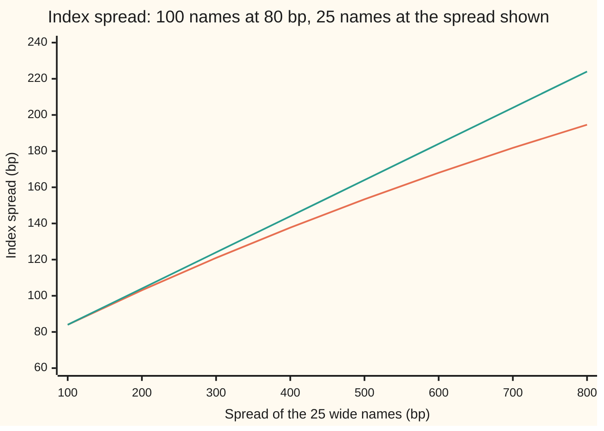

# Credit indices (CDX and iTraxx in outline): one contract on 125 names, priced off their survival curves, and the index skew

[Syllabus](../../../SYLLABUS.md) → [Financial mathematics](../README.md) → [Portfolio Credit - Correlation, Copulas, Indices and Tranches](../README.md#s45) → Credit indices (CDX and iTraxx in outline)

---

## General Overview

A pension fund holds bonds of 125 large companies and wants five years of default protection on all of them. It could buy 125 separate credit default swaps (CDS: contracts in which the buyer pays a yearly fee and the seller covers the loss if one named borrower defaults). That means 125 trades, 125 prices, 125 counterparties. Instead it buys one contract that covers the whole list at once. That contract is a **credit index**: in North America the CDX investment-grade index, in Europe the iTraxx Europe index, each on 125 names.

The fund buys \$10 million of protection. Each name carries one 125th of it, \$80,000. The fee is a fixed **coupon** of 100 basis points a year (a basis point, bp, is 0.01 percent), paid quarterly, whatever the names cost individually. On the day of the trade the single-name market quotes 100 of the names at 80 bp and the other 25 at 300 bp.

Three questions follow. What single spread is the whole basket worth? The plain average of the 125 quotes is 124 bp. The right answer, called the **intrinsic spread**, is **120.96 bp**, a little under 121.0: riskier names count for less than their headcount. What happens when one name defaults? At 40 percent recovery (the share of the defaulted debt still repaid) the fund receives 0.48 percent of its notional (the amount of protection bought), \$48,000, and the contract carries on over 124 names on \$9,920,000. And what if the index itself trades on screen at a spread different from 120.96? That gap is the **index skew**; at a screen quote of 117 bp it is −3.96 bp.

**A credit index is 125 equal single-name contracts sharing one coupon and one set of dates, so its value is the sum of their values, its par spread is total protection over total annuity, a default pays that name's loss and shrinks the notional, and the skew is the gap between the index's traded spread and the spread its own names imply.**

**What kind of fact this is:** the sum rule and the intrinsic spread are a theorem, proved on this card in Why it works, and they hold under any hazard curves and any correlation between names; the 125 names, the fixed coupon, the upfront and the notional that shrinks at each default are a convention, set by the index rules.

### The picture: the intrinsic spread against the plain average

Hold the 100 tight names at 80 bp and move the spread of the 25 wide names from 100 to 800 bp.



Orange: the intrinsic spread, total protection over total annuity. Green: the plain average of the 125 quotes. They start close together, 83.97 against 84.00, and part as the wide names widen. At 300 bp, the card's example, they read 120.96 and 124.00; at 800 bp, 194.61 and 224.00. A riskier name is likely to stop paying fees sooner, so it carries less of the fee stream and less of the average.

---

## The formula

Notation first, in words. The index has $n$ names, numbered by $i$ from 1 to $n$. Each name has its own quoted spread $s_i$. From that quote, exactly as on [Valuing an existing CDS](../42-Credit%20Default%20Swaps%20-%20Pricing%2C%20the%20Par%20Spread%20and%20the%20Hazard%20Behind%20It/07-marking-a-cds-to-market-and-the-upfront.md), come two numbers per \$1 of notional: the protection leg $P_i$ (what the payout on default is worth today) and the risky annuity $A_i$ (what 1 a year of fee, paid only while the name survives, is worth today). The sign $\sum$ means "add up over all the names".

$$s_I = \frac{\sum_{i=1}^{n} P_i}{\sum_{i=1}^{n} A_i} = \sum_{i=1}^{n} w_i\, s_i, \qquad w_i = \frac{A_i}{\sum_{\ell=1}^{n} A_\ell}$$

**Read it aloud:** the index's intrinsic spread is all the protection the index sells divided by all the fee-paying years it expects, which is the same as an average of the names' spreads in which each name is weighted by its own risky annuity.

Two helper formulas. The index trades with a fixed coupon $c$, and the difference is paid in cash on day one, the upfront $U$:

$$U = \frac{1}{n}\sum_{i=1}^{n}\left(P_i - c\,A_i\right) = (s_I - c)\,\bar A, \qquad \bar A = \frac{1}{n}\sum_{i=1}^{n} A_i$$

When name $j$ defaults with recovery $R$, the protection buyer receives $(1-R)/n$ per \$1, and the notional $N$ becomes $N(n-1)/n$. The **skew** compares the screen quote $s_Q$ with the intrinsic spread: $k = s_Q - s_I$.

| Symbol | Plain meaning | In our example | Push it up and the answer… |
| --- | --- | --- | --- |
| $n$, $i$, $j$, $\ell$ | number of names; a name's number; the name that defaults; a second name counter inside a sum | 125; 1 to 125; one 300 bp name; 1 to 125 | more names: each default matters less |
| $s_i$, $\lambda_i$ | name i's quoted spread; the flat hazard (the yearly rate at which a surviving name defaults) that reprices it | 80 or 300 bp; 1.3228% or 4.9381% | raises $s_I$, by $w_i$ per bp |
| $P_i$, $A_i$ | name i's protection leg and risky annuity, per \$1 | 0.034024, 4.252956 (tight); 0.116746, 3.891532 (wide) | $P_i$ up: $s_I$ up; $A_i$ up: that name weighs more |
| $w_i$ | name i's weight: its share of the total annuity | all 25 wide names together: 18.62%, against 20% by headcount | |
| $s_I$, $\bar s$ | intrinsic spread: the coupon that would make the index worth zero; the plain average of the quotes | 120.96 bp; 124 bp | $s_I$ is the answer |
| $\bar P$, $\bar A$ | index protection leg and annuity per \$1: the averages of $P_i$ and $A_i$ | 0.050568, 4.180671 | |
| $c$, $U$ | fixed coupon; upfront, cash the buyer pays on day one, per \$1 | 100 bp; 0.8761% | coupon up: $U$ down by $\bar A$ per unit |
| $s_Q$, $k$ | the index's own quote on the screen; the skew, $k = s_Q - s_I$ | 117 bp; −3.96 bp | $s_Q$ up: $k$ up, one for one |
| $N$ | notional, the amount of protection bought | \$10,000,000 | scales every dollar figure |
| $R$, $r$ | recovery, the fraction of a defaulted name's debt still repaid; riskless rate | 40%; 5% | $R$ up: smaller payout per default |
| $\sum$, $s$, $m$ | add up over the list; any spread, in the proof; the fee-date counter, 1 to 20 | used throughout; used in the proof; 1 to 20 | |
| $T$, $\Delta$, $\tau$, $\rho$ | years to maturity; quarter length; a name's default time; correlation between names in the check's simulation | 5; 0.25; random; 0 or 20% | $\rho$ changes nothing on this card |

The single-name legs are the ones from [Pricing a CDS](../42-Credit%20Default%20Swaps%20-%20Pricing%2C%20the%20Par%20Spread%20and%20the%20Hazard%20Behind%20It/02-cds-legs-risky-annuity-and-par-spread.md): with a flat hazard $\lambda_i$,

$$P_i = (1-R)\,\frac{\lambda_i}{r+\lambda_i}\left(1 - e^{-(r+\lambda_i)T}\right), \qquad A_i = \sum_{m=1}^{20} \Delta\, e^{-(r+\lambda_i)\,m\Delta}$$

where $m$ counts the twenty quarterly fee dates, and each quote satisfies $s_i = P_i / A_i$.

### When it holds

- **Equal weights, same dates, same coupon.** CDX investment grade and iTraxx Europe give each of their 125 names one 125th of the notional, and all names share the index's maturity and fee dates. An index with unequal weights needs $w_i$ built from weight times annuity; the idea survives, the arithmetic changes.
- **Single-name curves that match the index's terms.** $P_i$ and $A_i$ must be for the index maturity and the index's own recovery convention. Using the names' most liquid five-year quotes for a different index maturity mixes two curves and puts a false gap into the skew.
- **One recovery for every name.** A different recovery changes the hazards behind the same quotes: at 25 percent the intrinsic spread is 121.54 bp instead of 120.96. Names with different recoveries can even reverse the ordering in Step 3.
- **A seller who pays.** Nothing here prices the protection seller defaulting too.
- **Correlation does not enter.** The sum rule needs no assumption about how names default together. The check simulates with independent names and with names tied by a 20 percent correlation and gets the same price. Correlation matters only when a contract pays on some losses and not others: [Tranches](05-cdo-tranches-in-outline.md).

---

## Why it works

### Step 0: the index is a bundle of 125 small single-name contracts

Buy \$10 million of index protection. On each fee date pay 100 bp a year on the surviving notional. When a name defaults, receive its loss on \$80,000. Now write down 125 single-name contracts, each on \$80,000, each at a 100 bp coupon, each on the index's dates. Every cash flow of the index appears in exactly one of the 125 small contracts, on the same day, of the same size. Two positions with identical cash flows must have the same value, or a trader could buy the cheap one, sell the dear one, and collect the difference with no risk. So the index is worth exactly the sum of 125 small contracts.

### Step 1: the legs add

Per \$1 of index notional, name i contributes $1/n$ of its own protection leg and $1/n$ of its own fee leg. The fee leg at coupon $c$ is $c\,A_i$: each quarter the buyer pays $c\,\Delta$ if the name is alive, and $A_i$ is the value of paying $\Delta$ on those terms. So the index legs are averages:

$$\bar P = \frac1n\sum_i P_i, \qquad \text{fee leg} = c\,\bar A.$$

For the example: $\bar P = (100 \times 0.034024 + 25 \times 0.116746)/125 = 0.050568$ and $\bar A = (100 \times 4.252956 + 25 \times 3.891532)/125 = 4.180671$.

### Step 2: the par spread is total protection over total annuity

The par spread of any contract is the fee rate that makes it worth nothing. For the index that means $\bar P - s_I \bar A = 0$, so

$$s_I = \frac{\bar P}{\bar A} = \frac{\sum_i P_i}{\sum_i A_i}.$$

Each name's own quote satisfies $P_i = s_i A_i$. Put that in the top:

$$s_I = \frac{\sum_i s_i A_i}{\sum_i A_i} = \sum_i w_i s_i.$$

The intrinsic spread is an average of the quotes, but weighted by annuity, not by headcount. For the example, $0.050568 / 4.180671 = 0.012096$, which is 120.96 bp.

### Step 3: the weighted average sits below the plain one whenever the quotes differ

A name with a higher spread has a higher hazard. A higher hazard shortens the expected fee stream, so the annuity falls: the 300 bp names have 3.891532 against 4.252956 for the 80 bp names. The names that pull the average up are exactly the ones given less weight. The 25 wide names are 20 percent of the headcount and only 18.62 percent of the annuity.

With one recovery for all names, the result is a strict inequality: $s_I < \bar s$ unless every quote is the same, when $s_I = \bar s$ exactly. The check confirms both: 124 bp on every name gives 124.0000, and every point on the chart has the orange line below the green. It also asserts the premise: the annuity falls at every 20 bp step from 20 to 1,000 bp.

<details>
<summary>Detailed proof: the intrinsic spread never exceeds the plain average</summary>

All names share recovery $R$. Write $A(s)$ for the annuity of a name whose flat hazard reprices spread $s$. [Valuing an existing CDS](../42-Credit%20Default%20Swaps%20-%20Pricing%2C%20the%20Par%20Spread%20and%20the%20Hazard%20Behind%20It/07-marking-a-cds-to-market-and-the-upfront.md) shows the par spread is strictly increasing in the hazard, and the annuity is strictly decreasing in it, so $A(s)$ is strictly decreasing in $s$.

Let $A^* = A(\bar s)$, a fixed number. Because $\sum_i (s_i - \bar s) = 0$, subtracting $A^*$ from every weight leaves a sum unchanged:

$$\sum_i A_i\,(s_i - \bar s) = \sum_i \left(A_i - A^*\right)(s_i - \bar s).$$

Look at one term. If $s_i > \bar s$, then $A_i < A^*$: the first bracket is negative and the second positive. If $s_i < \bar s$, the signs swap. Either way the term is at most zero, and it is strictly negative whenever $s_i \ne \bar s$. So the sum is negative unless all quotes are equal. Divide by $\sum_i A_i > 0$:

$$s_I - \bar s = \frac{\sum_i A_i (s_i - \bar s)}{\sum_i A_i} < 0.$$


</details>

### Step 4: the upfront is the sum of 125 upfronts

With a fixed coupon, each small contract is worth $P_i - c\,A_i$ to the buyer. Add them and divide by $n$:

$$U = \frac1n\sum_i (P_i - cA_i) = \bar P - c\bar A = (s_I - c)\,\bar A.$$

So the index behaves like one name at spread $s_I$ with annuity $\bar A$. For the example, $(0.012096 - 0.0100) \times 4.180671 = 0.8761$ percent, \$87,614.00 on \$10 million. The check computes it both ways, name by name and in one step, and they agree to twelve decimals.

The market does not quote the index this way. It treats the index as one name with one flat hazard, and converts a quoted spread to an upfront with the single-name calculator. Fed 120.96 bp, that calculator gives 0.8764 percent, not 0.8761. The difference is the gap between $\bar A$ and the annuity of one flat name at 120.96 bp: an average of annuities is not the annuity of one name at the average spread. It is tiny here and grows with dispersion.

### Step 5: a default pays one name's loss and shrinks the contract

Suppose one of the 300 bp names defaults. That name's small contract pays its loss, $(1 - R)$ on \$80,000, which is \$48,000 or 0.48 percent of the index notional. Then it ends: the name leaves the index, and the remaining 124 small contracts carry on unchanged. So the index notional falls to \$9,920,000 and the quarterly coupon from \$25,000 to \$24,800. The weights of the survivors do not change; each is still \$80,000, one 125th of the original notional.

The buyer does not gain the full \$48,000 in value. Before the default, that name's small contract was already worth something, because a 300 bp name was more likely than most to fail: its legs were worth \$6,226.45 to the buyer. The default converts that into \$48,000 of cash, a jump of \$41,773.55. The survivors are on average safer than before, so the intrinsic spread of what is left falls to 119.61 bp.

### Step 6: correlation cannot move the index price

The legs are expected values: $P_i$ is the average discounted payout over all the ways name i can default, and the same for $A_i$. The expected value of a sum is the sum of expected values, whether or not the parts move together. So the index legs depend only on each name's own survival curve.

The check tests this. It draws default times for all 125 names on 100,000 paths, first with names independent, then with names tied through one common market factor at 20 percent correlation, the one-factor model of [The one-factor Gaussian copula](02-one-factor-gaussian-copula.md). It values the index at a 120.96 bp coupon on each path. Both averages are zero within their noise: the simulated spreads are 121.01 and 121.13 bp. Correlation makes the losses lumpier, which widens the noise (standard error 0.0001469 against 0.0000455), but it does not move the average. Joint defaults change who gets hurt in a crisis; [Default correlation](01-default-correlation-and-joint-default.md) measures them.

### Step 7: the skew is the market's price against the names' price

On the screen, the index trades as a contract in its own right, with its own quote $s_Q$. Nothing forces $s_Q$ to equal $s_I$. Hedgers crowd into the index because it is cheaper to trade than 125 names, and push its price around. The difference $k = s_Q - s_I$ is the **skew** (some desks say basis). Quoted as a price, 100 minus the upfront, it flips sign. At a quote of 117 bp, the skew is $117 - 120.96 = -3.96$ bp: index protection costs less than the same protection bought name by name.

In cash: at 117 bp the flat calculator gives an upfront of 0.7121 percent, \$71,210.89. Buying the 125 names separately costs the intrinsic 0.8761 percent, \$87,614.00. The gap, −\$16,403.11 on \$10 million, is the skew in money. A trader could buy index protection and sell protection on all 125 names to lock in that gap. Doing so means 126 trades, each with its own bid and offer, so the skew can persist inside the cost of the trade but not far beyond it. That is why desks watch it: a skew wider than the cost of crossing 125 bid-offers is a signal that one side is mispriced.

---

## Worked numbers, by hand

The index: 125 names, 100 at 80 bp and 25 at 300 bp, recovery 40 percent, riskless rate 5 percent, five years of quarterly fees, coupon 100 bp, \$10 million. First find each name's flat hazard by a root search (see the code), then its legs.

| Step | Arithmetic | Value |
| --- | --- | --- |
| 1. Hazards | solve $P/A = 0.0080$ and $0.0300$ | 1.3228%, 4.9381% |
| 2. Annuities | twenty-term sums | 4.252956, 3.891532 |
| 3. Protection legs | $0.60 \cdot \frac{\lambda}{r + \lambda}(1 - e^{-5(r+\lambda)})$ | 0.034024, 0.116746 |
| 4. Index protection leg | $(100 \times 0.034024 + 25 \times 0.116746)/125$ | 0.050568 |
| 5. Index annuity | $(100 \times 4.252956 + 25 \times 3.891532)/125$ | 4.180671 |
| 6. Intrinsic spread | $0.050568 / 4.180671$ | **120.96 bp** |
| 7. Plain average | $(100 \times 80 + 25 \times 300)/125$ | 124 bp |
| 8. Upfront at coupon 100 | $(0.012096 - 0.0100) \times 4.180671$ | 0.8761%, \$87,614.00 |
| 9. Skew at a 117 bp quote | $117 - 120.96$ | **−3.96 bp** |
| 10. One wide name defaults | $0.60 / 125$ | 0.48%, \$48,000 |

Buying \$10 million of this index at a 100 bp coupon costs \$87,614.00 on day one if the index trades at its intrinsic value, and \$71,210.89 at a 117 bp screen quote. The 125 names imply 120.96 bp; the headcount average says 124 and is too high.

```
Index spread, bp (one character = 5 bp)
plain average    ████████████████████████▊  124.00
intrinsic        ████████████████████████▏  120.96
traded quote     ███████████████████████▍   117.00
```

### What breaks if you drop a piece

| Mistake | Comes out at | What went wrong |
| --- | --- | --- |
| Skew against the plain average | −7.00 bp, not −3.96 | the average overweights the wide names, whose fee streams are short |
| Upfront from the plain average | 1.0025%, not 0.8761% | same error, carried into cash |
| Default payout with no recovery | 0.80% of notional, not 0.48% | protection pays the loss, $(1-R)/n$, not the whole $1/n$ |
| Coupon on the original notional after a default | \$25,000 a quarter, not \$24,800 | the defaulted name leaves; fees run on 124/125 of the notional |

---

## How a default moves the index

Nothing about the other 124 names changed, yet the index spread fell. That is the default's second effect, after the payout.

| | Before | After one 300 bp name defaults |
| --- | --- | --- |
| Names | 125 | 124 |
| Notional | \$10,000,000 | \$9,920,000 |
| Coupon per quarter | \$25,000 | \$24,800 |
| Intrinsic spread | 120.96 bp | 119.61 bp |
| Cash to the protection buyer | | \$48,000 |
| Value gained by the buyer | | \$41,773.55 |

The intrinsic spread falls because the index lost one of its riskiest members. A default of a tight 80 bp name does the reverse: the survivors are riskier on average, and the intrinsic spread rises to 121.29 bp. The index rules also start a new series every six months, on 20 March and 20 September, with a fresh list of 125 names; the old series keeps trading, with whatever defaults it has suffered, until its maturity.

---

## Code, from first principles, and it actually runs

The script prices the index by three independent roads. Road 1 finds each name's flat hazard by bisection and adds the closed-form legs. Road 2 prices the protection legs by Simpson's rule (a numerical integral built from weighted sample points) and the annuities as geometric series, then divides; it must agree with the annuity-weighted average of the quotes. Road 3 simulates default times for all 125 names on 100,000 paths, with a hand-written random number generator and normal distribution, once with independent names and once at 20 percent correlation; the index at the intrinsic spread must be worth zero on average. It then computes the upfronts, the skew, the default, the wrong answers, the experiments and the chart points. It also reprices the credit-default-swap shelf's house name, 121.06 bp at a 2 percent hazard, as a cross-check of the single-name machinery.

### Python

```python
# Credit indices -- the check behind the card.  Standard library only.
# Nothing imported knows the answer: the root finder, the integrator, the normal
# CDF and the random numbers are written out below.
from math import exp, log, sqrt, cos, pi

R, r, T, DT, NQ = 0.40, 0.05, 5.0, 0.25, 20   # recovery, riskless rate, years, quarter, 20 fee dates
NOTIONAL, NAMES, COUPON = 10_000_000.0, 125, 0.01
QUOTES = [0.0080] * 100 + [0.0300] * 25          # 100 names at 80 bp, 25 at 300 bp
TRADED = 0.0117                                  # the index's own quoted spread on the screen

def annuity(lam):                                # road 1: add up twenty survival-weighted quarters
    return sum(DT * exp(-(r + lam) * DT * i) for i in range(1, NQ + 1))
def annuity_geom(lam):                           # road 2: the same sum as a geometric series
    x = exp(-(r + lam) * DT)
    return DT * x * (1 - x ** NQ) / (1 - x)
def protection(lam, rec=R):                      # (1-R) times the integral of lam e^{-(r+lam)t}
    k = r + lam
    return (1 - rec) * lam / k * (1 - exp(-k * T))
def simpson(f, a, b, n=2000):
    h = (b - a) / n
    return (f(a) + f(b) + sum((4 if i % 2 else 2) * f(a + i * h) for i in range(1, n))) * h / 3
def bisect(f, lo, hi):                           # f(lo) < 0 < f(hi); halve 200 times
    for _ in range(200):
        mid = 0.5 * (lo + hi)
        if f(mid) < 0: lo = mid
        else: hi = mid
    return 0.5 * (lo + hi)
def hazard_for(s, rec=R): return bisect(lambda l: protection(l, rec) / annuity(l) - s, 1e-12, 5.0)
def upfront_flat(q): return (q - COUPON) * annuity(hazard_for(q))   # the one-name quoting convention

def index_legs(quotes, rec=R):                   # road 1: closed-form legs, summed name by name
    lams = [hazard_for(s, rec) for s in quotes]
    return sum(protection(l, rec) for l in lams) / NAMES, sum(annuity(l) for l in lams) / NAMES, lams
def intrinsic(quotes, rec=R):
    P, A, _ = index_legs(quotes, rec)
    return P / A

MASK, state = (1 << 64) - 1, 20260928
def rand():                                      # splitmix64, the same stream as the Rust check
    global state
    state = (state + 0x9E3779B97F4A7C15) & MASK
    z = ((state ^ (state >> 30)) * 0xBF58476D1CE4E5B9) & MASK
    z = ((z ^ (z >> 27)) * 0x94D049BB133111EB) & MASK
    return (((z ^ (z >> 31)) >> 11) + 0.5) / 9007199254740992.0
def gauss(): return sqrt(-2.0 * log(rand())) * cos(2.0 * pi * rand())
def ncdf(x):                                     # normal CDF from a Chebyshev fit to erfc, error < 1.2e-7
    z = abs(x) / sqrt(2.0)
    t = 1.0 / (1.0 + 0.5 * z)
    e = t * exp(-z * z - 1.26551223 + t * (1.00002368 + t * (0.37409196 + t * (0.09678418 + t * (-0.18628806
        + t * (0.27886807 + t * (-1.13520398 + t * (1.48851587 + t * (-0.82215223 + t * 0.17087277)))))))))
    return 1.0 - 0.5 * e if x >= 0 else 0.5 * e

cum = [0.0]
for i in range(1, NQ + 1): cum.append(cum[-1] + DT * exp(-r * DT * i))

def simulate(lams, s, rho, paths):               # road 3: default times for all 125 names, path by path
    sv = sv2 = sp = sa = 0.0
    for _ in range(paths):
        z, p, a = gauss(), 0.0, 0.0
        for lam in lams:
            u = rand() if rho == 0 else ncdf(-(sqrt(rho) * z + sqrt(1 - rho) * gauss()))
            tau = -log(u) / lam
            a += cum[min(int(tau / DT), NQ)]
            if tau <= T: p += (1 - R) * exp(-r * tau)
        v = (p - s * a) / NAMES                  # index value per $1 at spread s on this path
        sv += v; sv2 += v * v; sp += p; sa += a
    m = sv / paths
    return m, sqrt((sv2 / paths - m * m) / paths), sp / sa

# ---- the 125 legs, two ways ----
P, A, lams = index_legs(QUOTES)
l_t, l_w = lams[0], lams[-1]
P_simp = sum(simpson(lambda t: (1 - R) * l * exp(-(r + l) * t), 0.0, T) for l in lams) / NAMES
A_geom = sum(annuity_geom(l) for l in lams) / NAMES
s_I = P_simp / A_geom                            # road 2: total protection over total annuity
s_w = sum(s * annuity(l) for s, l in zip(QUOTES, lams)) / sum(annuity(l) for l in lams)
s_avg = sum(QUOTES) / NAMES
w_wide = 25 * annuity(l_w) / (NAMES * A)
U_sum = sum(protection(l) - COUPON * annuity(l) for l in lams) / NAMES
U_trd = upfront_flat(TRADED)
m0, se0, q0 = simulate(lams, s_I, 0.0, 100000)
m2, se2, q2 = simulate(lams, s_I, 0.20, 100000)
# ---- one wide name defaults at 40% recovery ----
jtd = (1 - R) / NAMES - (protection(l_w) - COUPON * annuity(l_w)) / NAMES
s_after = intrinsic(QUOTES[:-1])                 # 124 names left; weights unchanged, 1/125 each

rows = [
    ("house: par spread at hazard 2%, bp", 1e4 * protection(0.02) / annuity(0.02), 4),
    ("hazard, 80 bp name", l_t, 6), ("hazard, 300 bp name", l_w, 6),
    ("annuity, 80 bp name", annuity(l_t), 6), ("annuity, 300 bp name", annuity(l_w), 6),
    ("protection leg, 80 bp name", protection(l_t), 6), ("protection leg, 300 bp name", protection(l_w), 6),
    ("index protection leg per $1", P, 6), ("  same, Simpson", P_simp, 6),
    ("index annuity per $1", A, 6), ("  same, geometric series", A_geom, 6),
    ("1 intrinsic spread, P / A, bp", 1e4 * s_I, 4), ("2 annuity-weighted quotes, bp", 1e4 * s_w, 4),
    ("plain average of quotes, bp", 1e4 * s_avg, 4),
    ("share of the 300 bp names, headcount", 25 / NAMES, 4), ("share of the 300 bp names, weighted", w_wide, 4),
    ("3 simulated value at s_I, independent", m0, 7), ("  standard error, independent", se0, 7),
    ("  simulated spread, independent, bp", 1e4 * q0, 4),
    ("3 simulated value at s_I, rho = 20%", m2, 7), ("  standard error, rho = 20%", se2, 7),
    ("  simulated spread, rho = 20%, bp", 1e4 * q2, 4),
    ("intrinsic upfront %, sum of 125 legs", 100 * U_sum, 4), ("  (s_I - c) x index annuity, %", 100 * (s_I - COUPON) * A, 4),
    ("intrinsic upfront $ on $10m", U_sum * NOTIONAL, 2),
    ("flat conversion of s_I, upfront %", 100 * upfront_flat(s_I), 4),
    ("traded quote, bp", 1e4 * TRADED, 4), ("traded upfront %, flat conversion", 100 * U_trd, 4),
    ("traded upfront $ on $10m", U_trd * NOTIONAL, 2), ("skew, traded - intrinsic, bp", 1e4 * (TRADED - s_I), 4),
    ("skew in upfront $ on $10m", (U_trd - U_sum) * NOTIONAL, 2),
    ("slice per name $", NOTIONAL / NAMES, 2),
    ("default: payout % of notional", 100 * (1 - R) / NAMES, 4), ("default: payout $", (1 - R) / NAMES * NOTIONAL, 2),
    ("default: notional left $", NOTIONAL * (NAMES - 1) / NAMES, 2),
    ("coupon per quarter before $", COUPON * DT * NOTIONAL, 2), ("coupon per quarter after $", COUPON * DT * NOTIONAL * (NAMES - 1) / NAMES, 2),
    ("default: legs of that name given up $", (protection(l_w) - COUPON * annuity(l_w)) / NAMES * NOTIONAL, 2),
    ("default: net gain to buyer $", jtd * NOTIONAL, 2), ("intrinsic after default, bp", 1e4 * s_after, 4),
    ("wrong: skew against plain average, bp", 1e4 * (TRADED - s_avg), 4),
    ("wrong: payout with no recovery, %", 100 / NAMES, 4),
    ("wrong: upfront from plain average, %", 100 * upfront_flat(s_avg), 4),
    ("try: R = 25%, intrinsic, bp", 1e4 * intrinsic(QUOTES, 0.25), 4),
    ("try: a tight name defaults, bp", 1e4 * intrinsic(QUOTES[1:]), 4),
    ("try: all 125 at 124 bp, bp", 1e4 * intrinsic([0.0124] * NAMES), 4),
]
for name, v, d in rows:
    print(f"{name:<40} {v:>14.{d}f}")
wide = [100 * k for k in range(1, 9)]
chart_i = [1e4 * intrinsic([0.008] * 100 + [w / 1e4] * 25) for w in wide]
print("chart, wide names bp " + " ".join(f"{w:7d}" for w in wide))
print("chart, intrinsic bp  " + " ".join(f"{v:7.2f}" for v in chart_i))
print("chart, average bp    " + " ".join(f"{(8000 + 25 * w) / 125:7.2f}" for w in wide))

assert abs(protection(0.02) / annuity(0.02) - 0.01210561519) < 1e-10, "house par spread, 121.06 bp"
assert abs(s_I - s_w) < 1e-12, "Simpson legs vs annuity-weighted quotes"
assert round(1e4 * s_I, 1) == 121.0 and s_I < s_avg, "the syllabus's 121.0 bp, below the 124 bp average"
assert abs(U_sum - (s_I - COUPON) * A) < 1e-12, "sum of 125 upfronts vs one index upfront"
assert abs(m0) < 4 * se0 and abs(m2) < 4 * se2, "both simulations price the index at zero at s_I"
assert all(c < (8000 + 25 * w) / 125 for c, w in zip(chart_i, wide)), "intrinsic below average"
assert s_after < s_I < intrinsic(QUOTES[1:]), "a wide default lowers s_I, a tight one raises it"
assert all(annuity(hazard_for(k * 20e-4)) > annuity(hazard_for((k + 1) * 20e-4)) for k in range(1, 50)), "A(s) falls"
print("ALL CHECKS PASS")
```

**Ran 2026-09-28 on macOS, Python 3.14.6, standard library only. All checks passed. Output, pasted from the run:**

```
house: par spread at hazard 2%, bp             121.0562
hazard, 80 bp name                             0.013228
hazard, 300 bp name                            0.049381
annuity, 80 bp name                            4.252956
annuity, 300 bp name                           3.891532
protection leg, 80 bp name                     0.034024
protection leg, 300 bp name                    0.116746
index protection leg per $1                    0.050568
  same, Simpson                                0.050568
index annuity per $1                           4.180671
  same, geometric series                       4.180671
1 intrinsic spread, P / A, bp                  120.9569
2 annuity-weighted quotes, bp                  120.9569
plain average of quotes, bp                    124.0000
share of the 300 bp names, headcount             0.2000
share of the 300 bp names, weighted              0.1862
3 simulated value at s_I, independent         0.0000202
  standard error, independent                 0.0000455
  simulated spread, independent, bp            121.0053
3 simulated value at s_I, rho = 20%           0.0000737
  standard error, rho = 20%                   0.0001469
  simulated spread, rho = 20%, bp              121.1331
intrinsic upfront %, sum of 125 legs             0.8761
  (s_I - c) x index annuity, %                   0.8761
intrinsic upfront $ on $10m                    87614.00
flat conversion of s_I, upfront %                0.8764
traded quote, bp                               117.0000
traded upfront %, flat conversion                0.7121
traded upfront $ on $10m                       71210.89
skew, traded - intrinsic, bp                    -3.9569
skew in upfront $ on $10m                     -16403.11
slice per name $                               80000.00
default: payout % of notional                    0.4800
default: payout $                              48000.00
default: notional left $                     9920000.00
coupon per quarter before $                    25000.00
coupon per quarter after $                     24800.00
default: legs of that name given up $           6226.45
default: net gain to buyer $                   41773.55
intrinsic after default, bp                    119.6136
wrong: skew against plain average, bp           -7.0000
wrong: payout with no recovery, %                0.8000
wrong: upfront from plain average, %             1.0025
try: R = 25%, intrinsic, bp                    121.5360
try: a tight name defaults, bp                 121.2930
try: all 125 at 124 bp, bp                     124.0000
chart, wide names bp     100     200     300     400     500     600     700     800
chart, intrinsic bp    83.97  103.08  120.96  137.70  153.36  168.03  181.76  194.61
chart, average bp      84.00  104.00  124.00  144.00  164.00  184.00  204.00  224.00
ALL CHECKS PASS
```

### Rust

```rust
// Credit indices -- the check behind the card.  std only, no crates.
// The root finder, the integrator, the normal CDF and the random numbers are written out below.
use std::f64::consts::PI;
const R: f64 = 0.40; // recovery
const RATE: f64 = 0.05; // riskless rate
const T: f64 = 5.0; const DT: f64 = 0.25; const NQ: usize = 20; // years; quarter; 20 fee dates
const NOTIONAL: f64 = 10_000_000.0; const NAMES: usize = 125; const COUPON: f64 = 0.01;
const TRADED: f64 = 0.0117; // the index's own quoted spread on the screen

fn annuity(lam: f64) -> f64 {
    // road 1: add up twenty survival-weighted quarters
    (1..=NQ).map(|i| DT * (-(RATE + lam) * DT * i as f64).exp()).sum()
}
fn annuity_geom(lam: f64) -> f64 {
    // road 2: the same sum as a geometric series
    let x = (-(RATE + lam) * DT).exp();
    DT * x * (1.0 - x.powi(NQ as i32)) / (1.0 - x)
}
fn protection(lam: f64, rec: f64) -> f64 {
    let k = RATE + lam;
    (1.0 - rec) * lam / k * (1.0 - (-k * T).exp())
}
fn simpson(f: &dyn Fn(f64) -> f64, a: f64, b: f64, n: usize) -> f64 {
    let h = (b - a) / n as f64;
    let mut s = f(a) + f(b);
    for i in 1..n {
        s += if i % 2 == 1 { 4.0 } else { 2.0 } * f(a + i as f64 * h);
    }
    s * h / 3.0
}
fn bisect(f: &dyn Fn(f64) -> f64, mut lo: f64, mut hi: f64) -> f64 {
    for _ in 0..200 {
        let mid = 0.5 * (lo + hi);
        if f(mid) < 0.0 { lo = mid } else { hi = mid }
    }
    0.5 * (lo + hi)
}
fn hazard_for(s: f64, rec: f64) -> f64 { bisect(&|l| protection(l, rec) / annuity(l) - s, 1e-12, 5.0) }
fn upfront_flat(q: f64) -> f64 { (q - COUPON) * annuity(hazard_for(q, R)) } // the one-name quoting convention
fn index_legs(quotes: &[f64], rec: f64) -> (f64, f64, Vec<f64>) {
    // road 1: closed-form legs, summed name by name
    let lams: Vec<f64> = quotes.iter().map(|&s| hazard_for(s, rec)).collect();
    let p: f64 = lams.iter().map(|&l| protection(l, rec)).sum();
    let a: f64 = lams.iter().map(|&l| annuity(l)).sum();
    (p / NAMES as f64, a / NAMES as f64, lams)
}
fn intrinsic(quotes: &[f64], rec: f64) -> f64 { let (p, a, _) = index_legs(quotes, rec); p / a }

struct Rng(u64);
impl Rng {
    fn next(&mut self) -> f64 {
        // splitmix64, the same stream as the Python check
        self.0 = self.0.wrapping_add(0x9E3779B97F4A7C15);
        let mut z = (self.0 ^ (self.0 >> 30)).wrapping_mul(0xBF58476D1CE4E5B9);
        z = (z ^ (z >> 27)).wrapping_mul(0x94D049BB133111EB);
        (((z ^ (z >> 31)) >> 11) as f64 + 0.5) / 9007199254740992.0
    }
    fn gauss(&mut self) -> f64 { let u = self.next(); (-2.0 * u.ln()).sqrt() * (2.0 * PI * self.next()).cos() }
}
fn ncdf(x: f64) -> f64 {
    // normal CDF from a Chebyshev fit to erfc, error < 1.2e-7
    let z = x.abs() / 2f64.sqrt();
    let t = 1.0 / (1.0 + 0.5 * z);
    let e = t * (-z * z - 1.26551223 + t * (1.00002368 + t * (0.37409196 + t * (0.09678418 + t * (-0.18628806
        + t * (0.27886807 + t * (-1.13520398 + t * (1.48851587 + t * (-0.82215223 + t * 0.17087277))))))))).exp();
    if x >= 0.0 { 1.0 - 0.5 * e } else { 0.5 * e }
}
fn simulate(rng: &mut Rng, cum: &[f64], lams: &[f64], s: f64, rho: f64, paths: usize) -> (f64, f64, f64) {
    // road 3: default times for all 125 names, path by path
    let (mut sv, mut sv2, mut sp, mut sa) = (0.0, 0.0, 0.0, 0.0);
    for _ in 0..paths {
        let (z, mut p, mut a) = (rng.gauss(), 0.0, 0.0);
        for &lam in lams {
            let u = if rho == 0.0 { rng.next() } else { ncdf(-(rho.sqrt() * z + (1.0 - rho).sqrt() * rng.gauss())) };
            let tau = -u.ln() / lam;
            a += cum[((tau / DT) as usize).min(NQ)];
            if tau <= T { p += (1.0 - R) * (-RATE * tau).exp(); }
        }
        let v = (p - s * a) / NAMES as f64; // index value per $1 at spread s on this path
        sv += v; sv2 += v * v; sp += p; sa += a;
    }
    let m = sv / paths as f64;
    (m, ((sv2 / paths as f64 - m * m) / paths as f64).sqrt(), sp / sa)
}

fn main() {
    let mut quotes = vec![0.0080; 100]; // 100 names at 80 bp, 25 at 300 bp
    quotes.extend([0.0300; 25]);
    let mut cum = vec![0.0];
    for i in 1..=NQ { let last = cum[i - 1]; cum.push(last + DT * (-RATE * DT * i as f64).exp()); }
    // ---- the 125 legs, two ways ----
    let (p, a, lams) = index_legs(&quotes, R);
    let (l_t, l_w) = (lams[0], lams[NAMES - 1]);
    let p_simp = lams.iter().map(|&l| simpson(&|t| (1.0 - R) * l * (-(RATE + l) * t).exp(), 0.0, T, 2000)).sum::<f64>() / NAMES as f64;
    let a_geom = lams.iter().map(|&l| annuity_geom(l)).sum::<f64>() / NAMES as f64;
    let s_i = p_simp / a_geom; // road 2: total protection over total annuity
    let s_w = quotes.iter().zip(&lams).map(|(s, &l)| s * annuity(l)).sum::<f64>() / lams.iter().map(|&l| annuity(l)).sum::<f64>();
    let s_avg = quotes.iter().sum::<f64>() / NAMES as f64;
    let w_wide = 25.0 * annuity(l_w) / (NAMES as f64 * a);
    let u_sum = lams.iter().map(|&l| protection(l, R) - COUPON * annuity(l)).sum::<f64>() / NAMES as f64;
    let u_trd = upfront_flat(TRADED);
    let mut rng = Rng(20260928);
    let (m0, se0, q0) = simulate(&mut rng, &cum, &lams, s_i, 0.0, 100000);
    let (m2, se2, q2) = simulate(&mut rng, &cum, &lams, s_i, 0.20, 100000);
    // ---- one wide name defaults at 40% recovery ----
    let n = NAMES as f64;
    let jtd = (1.0 - R) / n - (protection(l_w, R) - COUPON * annuity(l_w)) / n;
    let s_after = intrinsic(&quotes[..NAMES - 1], R); // 124 names left; weights unchanged, 1/125 each

    let rows: Vec<(&str, f64, usize)> = vec![
        ("house: par spread at hazard 2%, bp", 1e4 * protection(0.02, R) / annuity(0.02), 4),
        ("hazard, 80 bp name", l_t, 6), ("hazard, 300 bp name", l_w, 6),
        ("annuity, 80 bp name", annuity(l_t), 6), ("annuity, 300 bp name", annuity(l_w), 6),
        ("protection leg, 80 bp name", protection(l_t, R), 6), ("protection leg, 300 bp name", protection(l_w, R), 6),
        ("index protection leg per $1", p, 6), ("  same, Simpson", p_simp, 6),
        ("index annuity per $1", a, 6), ("  same, geometric series", a_geom, 6),
        ("1 intrinsic spread, P / A, bp", 1e4 * s_i, 4), ("2 annuity-weighted quotes, bp", 1e4 * s_w, 4),
        ("plain average of quotes, bp", 1e4 * s_avg, 4),
        ("share of the 300 bp names, headcount", 25.0 / n, 4), ("share of the 300 bp names, weighted", w_wide, 4),
        ("3 simulated value at s_I, independent", m0, 7), ("  standard error, independent", se0, 7),
        ("  simulated spread, independent, bp", 1e4 * q0, 4),
        ("3 simulated value at s_I, rho = 20%", m2, 7), ("  standard error, rho = 20%", se2, 7),
        ("  simulated spread, rho = 20%, bp", 1e4 * q2, 4),
        ("intrinsic upfront %, sum of 125 legs", 100.0 * u_sum, 4), ("  (s_I - c) x index annuity, %", 100.0 * (s_i - COUPON) * a, 4),
        ("intrinsic upfront $ on $10m", u_sum * NOTIONAL, 2),
        ("flat conversion of s_I, upfront %", 100.0 * upfront_flat(s_i), 4),
        ("traded quote, bp", 1e4 * TRADED, 4), ("traded upfront %, flat conversion", 100.0 * u_trd, 4),
        ("traded upfront $ on $10m", u_trd * NOTIONAL, 2), ("skew, traded - intrinsic, bp", 1e4 * (TRADED - s_i), 4),
        ("skew in upfront $ on $10m", (u_trd - u_sum) * NOTIONAL, 2),
        ("slice per name $", NOTIONAL / n, 2),
        ("default: payout % of notional", 100.0 * (1.0 - R) / n, 4), ("default: payout $", (1.0 - R) / n * NOTIONAL, 2),
        ("default: notional left $", NOTIONAL * (n - 1.0) / n, 2),
        ("coupon per quarter before $", COUPON * DT * NOTIONAL, 2), ("coupon per quarter after $", COUPON * DT * NOTIONAL * (n - 1.0) / n, 2),
        ("default: legs of that name given up $", (protection(l_w, R) - COUPON * annuity(l_w)) / n * NOTIONAL, 2),
        ("default: net gain to buyer $", jtd * NOTIONAL, 2), ("intrinsic after default, bp", 1e4 * s_after, 4),
        ("wrong: skew against plain average, bp", 1e4 * (TRADED - s_avg), 4),
        ("wrong: payout with no recovery, %", 100.0 / n, 4),
        ("wrong: upfront from plain average, %", 100.0 * upfront_flat(s_avg), 4),
        ("try: R = 25%, intrinsic, bp", 1e4 * intrinsic(&quotes, 0.25), 4),
        ("try: a tight name defaults, bp", 1e4 * intrinsic(&quotes[1..], R), 4),
        ("try: all 125 at 124 bp, bp", 1e4 * intrinsic(&[0.0124; NAMES], R), 4),
    ];
    for (name, v, d) in &rows { println!("{:<40} {:>14.*}", name, *d, v); }
    let wide: Vec<f64> = (1..=8).map(|k| 100.0 * k as f64).collect();
    let chart_i: Vec<f64> = wide.iter().map(|w| { let mut q = vec![0.008; 100]; q.extend([w / 1e4; 25]); 1e4 * intrinsic(&q, R) }).collect();
    let line = |label: &str, xs: Vec<String>| println!("{}{}", label, xs.join(" "));
    line("chart, wide names bp ", wide.iter().map(|w| format!("{:7.0}", w)).collect());
    line("chart, intrinsic bp  ", chart_i.iter().map(|v| format!("{:7.2}", v)).collect());
    line("chart, average bp    ", wide.iter().map(|w| format!("{:7.2}", (8000.0 + 25.0 * w) / 125.0)).collect());

    assert!((protection(0.02, R) / annuity(0.02) - 0.01210561519).abs() < 1e-10, "house par spread, 121.06 bp");
    assert!((s_i - s_w).abs() < 1e-12, "Simpson legs vs annuity-weighted quotes");
    assert!((1e4 * s_i * 10.0).round() / 10.0 == 121.0 && s_i < s_avg, "the syllabus's 121.0 bp, below the 124 bp average");
    assert!((u_sum - (s_i - COUPON) * a).abs() < 1e-12, "sum of 125 upfronts vs one index upfront");
    assert!(m0.abs() < 4.0 * se0 && m2.abs() < 4.0 * se2, "both simulations price the index at zero at s_I");
    assert!(chart_i.iter().zip(&wide).all(|(c, w)| *c < (8000.0 + 25.0 * w) / 125.0), "intrinsic below average");
    assert!(s_after < s_i && s_i < intrinsic(&quotes[1..], R), "a wide default lowers s_I, a tight one raises it");
    assert!((1..50).all(|k| annuity(hazard_for(k as f64 * 20e-4, R)) > annuity(hazard_for((k + 1) as f64 * 20e-4, R))), "A(s) falls");
    println!("ALL CHECKS PASS");
}
```

**Ran 2026-09-28 on macOS, rustc 1.98.1, no crates. All checks passed. Output, pasted from the run:**

```
house: par spread at hazard 2%, bp             121.0562
hazard, 80 bp name                             0.013228
hazard, 300 bp name                            0.049381
annuity, 80 bp name                            4.252956
annuity, 300 bp name                           3.891532
protection leg, 80 bp name                     0.034024
protection leg, 300 bp name                    0.116746
index protection leg per $1                    0.050568
  same, Simpson                                0.050568
index annuity per $1                           4.180671
  same, geometric series                       4.180671
1 intrinsic spread, P / A, bp                  120.9569
2 annuity-weighted quotes, bp                  120.9569
plain average of quotes, bp                    124.0000
share of the 300 bp names, headcount             0.2000
share of the 300 bp names, weighted              0.1862
3 simulated value at s_I, independent         0.0000202
  standard error, independent                 0.0000455
  simulated spread, independent, bp            121.0053
3 simulated value at s_I, rho = 20%           0.0000737
  standard error, rho = 20%                   0.0001469
  simulated spread, rho = 20%, bp              121.1331
intrinsic upfront %, sum of 125 legs             0.8761
  (s_I - c) x index annuity, %                   0.8761
intrinsic upfront $ on $10m                    87614.00
flat conversion of s_I, upfront %                0.8764
traded quote, bp                               117.0000
traded upfront %, flat conversion                0.7121
traded upfront $ on $10m                       71210.89
skew, traded - intrinsic, bp                    -3.9569
skew in upfront $ on $10m                     -16403.11
slice per name $                               80000.00
default: payout % of notional                    0.4800
default: payout $                              48000.00
default: notional left $                     9920000.00
coupon per quarter before $                    25000.00
coupon per quarter after $                     24800.00
default: legs of that name given up $           6226.45
default: net gain to buyer $                   41773.55
intrinsic after default, bp                    119.6136
wrong: skew against plain average, bp           -7.0000
wrong: payout with no recovery, %                0.8000
wrong: upfront from plain average, %             1.0025
try: R = 25%, intrinsic, bp                    121.5360
try: a tight name defaults, bp                 121.2930
try: all 125 at 124 bp, bp                     124.0000
chart, wide names bp     100     200     300     400     500     600     700     800
chart, intrinsic bp    83.97  103.08  120.96  137.70  153.36  168.03  181.76  194.61
chart, average bp      84.00  104.00  124.00  144.00  164.00  184.00  204.00  224.00
ALL CHECKS PASS
```

The two outputs agree line for line, the simulations included, because both programs draw the same random stream. The simulated values, 0.0000202 and 0.0000737, sit well inside four standard errors of zero.

> [!TIP]
> **Try changing**
> - **Recovery 25 percent instead of 40, same quotes.** Guess first: up or down? The intrinsic spread rises to 121.54 bp. A lower recovery means smaller hazards reprice the same quotes; the wide names' annuities lengthen, they weigh more, and they pull the weighted average up.
> - **All 125 names at 124 bp.** Guess the gap to the plain average. It is zero: 124.0000 bp. With no dispersion every annuity is the same and the weights are equal.
> - **A tight 80 bp name defaults instead of a wide one.** The survivors are riskier on average: the intrinsic spread rises to 121.29 bp.
> - **The 25 wide names at 800 bp.** The plain average says 224 bp; the intrinsic spread is 194.61. The chart's right-hand end.

---

## The usual mistake

> [!warning]
> **Averaging the quotes.** The index is not worth the average of its names' spreads. It is worth total protection over total annuity, and the annuity is smallest for exactly the names with the biggest spreads. The plain average here says 124 bp against the intrinsic 120.96, and it doubles the apparent skew from −3.96 bp to −7.00 bp.
>
> - **Paying the whole slice on default.** A default pays the loss on that name's slice, $(1 - R)/125$ = 0.48 percent, not the slice itself, 0.80 percent.
> - **Keeping the old notional.** After a default the fees run on \$9,920,000: \$24,800 a quarter, not \$25,000.
> - **Reading the whole payout as profit.** The buyer receives \$48,000, but the defaulted name's legs were already worth \$6,226.45 to it; the gain in value is \$41,773.55.
> - **Pricing correlation into the index.** Joint defaults change the spread of outcomes, not the average. An index priced higher "because names are correlated" is paying for something the contract does not contain.

---

## Where you meet it in real life

- **Macro credit hedging.** A fund that owns a spread of investment-grade bonds buys CDX or iTraxx protection to hedge the credit market as a whole in one trade.
- **The credit market's price.** Screens quote the five-year CDX investment-grade and iTraxx Europe spreads as the market's reading of corporate risk.
- **Skew trades.** Desks compare the index with the sum of its names every day. When the skew exceeds the cost of trading 125 names, they buy the cheap side and sell the dear one.
- **Risk numbers per name.** The index's sensitivity to one name's spread is that name's weight times the single-name sensitivity from [CDS risk numbers](../42-Credit%20Default%20Swaps%20-%20Pricing%2C%20the%20Par%20Spread%20and%20the%20Hazard%20Behind%20It/08-cds-risk-numbers.md), on one 125th of the notional.
- **Tranches.** The same 125 names, cut into slices that each absorb losses in a fixed range, are the tranche market: [Tranches](05-cdo-tranches-in-outline.md) and [Implied correlation](06-implied-and-base-correlation.md).
- **Conventions verified 28 Sep 2026** against the ICE product pages for Markit CDX.NA.IG and Markit iTraxx Europe Main: each index holds 125 of the most liquid investment-grade entities of its region, new series roll on 20 March and 20 September, and index spreads are quoted in basis points. The fixed-coupon-plus-upfront settlement is the one the ISDA CDS Standard Model page describes for single names. The index calculators also pay accrued fees on default and count days actual/360, which this card leaves out. Markets can change these rules; the sum rule does not change with them.

> **Say it back**
> A credit index is 125 equal single-name contracts traded as one, with one coupon and one set of dates. Its value is the sum of their values, so its par spread is total protection over total annuity: an average of the names' spreads weighted by their annuities, which sits below the plain average because risky names have short fee streams. A default pays that name's loss, one 125th of the notional times one minus recovery, and the contract carries on over the rest on a smaller notional. Correlation between names does not enter the price. The skew is the gap between the index's own quote and the spread its names imply.

---

## What this builds on

- [CDS risk numbers](../42-Credit%20Default%20Swaps%20-%20Pricing%2C%20the%20Par%20Spread%20and%20the%20Hazard%20Behind%20It/08-cds-risk-numbers.md): the single-name legs, the fixed coupon with its upfront, and the jump-to-default idea that this card applies to one name out of 125.
- [Default correlation](01-default-correlation-and-joint-default.md): what it means for names to default together, the thing this card shows the index price does not depend on.

## Where this goes next

- [Tranches](05-cdo-tranches-in-outline.md): the same 125 names, with losses split into slices, where correlation stops cancelling and starts deciding the price.

The index averages its names away; the open question is what a contract that pays only on the first 3 percent of losses, or only beyond 7 percent, is worth, and that is where joint defaults take over.

---

## Sources

Verified 2026-09-28: every link below resolves to the publisher's page.

- O'Kane, Dominic. *Modelling Single-name and Multi-name Credit Derivatives*. Wiley, 2008. [Publisher page](https://www.wiley.com/en-us/Modelling+Single+name+and+Multi+name+Credit+Derivatives-p-9780470519288). The chapters on CDS indices: the index as a portfolio of single-name contracts, the intrinsic spread and the index basis.
- Hull, John C., and Alan White. "Valuing Credit Default Swaps I: No Counterparty Default Risk." *Journal of Derivatives* 8, no. 1 (2000): 29–40. [doi:10.3905/jod.2000.319115](https://doi.org/10.3905/jod.2000.319115). The two legs of a single-name CDS, which this card adds up.
- Intercontinental Exchange. *Markit CDX.NA.IG*, product page. [ICE](https://www.ice.com/products/28555645/Markit-CDXNAIG). 125 North American investment-grade names, the semiannual roll, spreads quoted in basis points.
- Intercontinental Exchange. *Markit iTraxx Europe Main*, product page. [ICE](https://www.ice.com/products/28687612/Markit-iTraxx-Europe-Main). The European counterpart: 125 names, the same roll dates.
- International Swaps and Derivatives Association. *ISDA CDS Standard Model*. [Model page](https://www.cdsmodel.com/). The market's calculator for converting between spread and upfront on fixed-coupon contracts.
