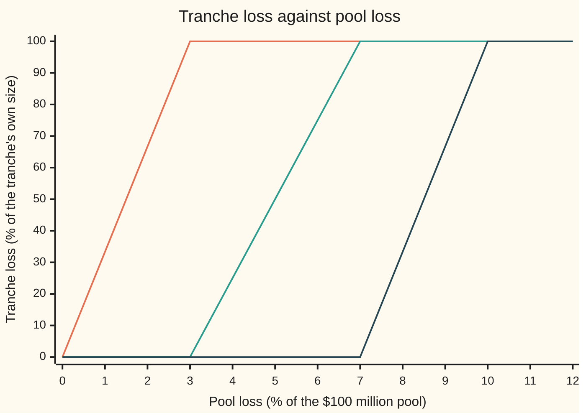
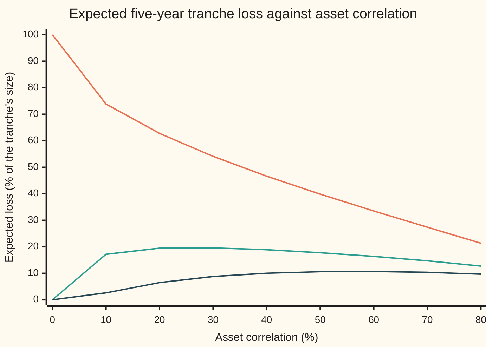

# Tranches: slicing a pool's losses into layers, and pricing a layer as its expected loss over time

Financial mathematics → Portfolio Credit - Correlation, Copulas, Indices and Tranches → Layered pool losses → Tranches

---

## General Overview

A bank holds 100 loans of $1 million each: a $100 million pool. Each borrower has a 5% chance of defaulting within five years. A default returns 40 cents on the dollar, so it costs $0.6 million, and the pool's average five-year loss is 3% of its size.

The bank sells that risk in layers. Think of a building flooding from the basement up. The first $3 million of losses fill the basement. Losses from $3 million to $7 million flood the ground floor, the next $3 million the first floor, and only losses past $10 million reach the top floors. From here on the layers are called **tranches** (French for slices), the floor where a tranche starts losing is its **attachment point**, and the floor where it is wiped out is its **detachment point**. The pool of loans sliced this way is a **collateralised debt obligation**, or CDO.

The four tranches are **equity**, 0% to 3%, **junior mezzanine**, 3% to 7%, **senior mezzanine**, 7% to 10%, and **senior**, 10% to 100%. Over five years the equity tranche expects to lose 62.8% of its size, the mezzanines 19.5% and 6.5%, the senior tranche 0.16%.

Correlation, the pull of one shared economy on every borrower at once, decides that split. Those figures are at 20%. At 50% the equity tranche expects to lose only 39.85%, while the senior tranche's expected loss rises to 0.86%. More togetherness helps the bottom layer and hurts the top.

**A tranche's loss is a call spread on the pool's loss, so its price is the average of that kinked payoff over the pool's loss distribution, collected over time as a stream of protection payments and paid for by a premium on the tranche's surviving size.**

**What kind of fact this is:** a model. Each tranche's payoff is a definition fixed by the contract; its expected loss rests on the one-factor Gaussian copula, an assumption about how defaults cluster, not a law. Inside that model the formulas are proved on this card in Why it works.

### The picture: what each tranche loses as the pool's loss rises

The pool's loss, as a percent of its $100 million, runs left to right. Each tranche's loss, as a percent of its own size, runs up.



Orange, leftmost: the equity tranche, wiped out once the pool loses 3%. Green: the junior mezzanine, from 3% to 7%. Dark blue: the senior mezzanine, from 7% to 10%. The senior tranche is not drawn: it has lost only 1.11% of its size when the pool has lost 11%, and 2.22% at 12%. Each line is a ramp between two flat stretches, a shape options already have a name for.

---

## The formula

Notation first, in words. $(y)^+$ means "y if y is positive, otherwise zero": the payoff of a call option with strike zero. $\mathbb{E}$ is the average over all outcomes the model allows. $\mathbb{P}(\text{event})$ is the chance of the event.

The loss of the tranche from $A$ to $D$, as a share of its own size:

$$L_{[A,D]} = \frac{(L - A)^+ - (L - D)^+}{D - A}$$

**Read it aloud:** the tranche loses whatever the pool has lost above its attachment point, but never more than its own width, measured as a share of that width.

Its expected loss, two ways:

$$\mathbb{E}\big[L_{[A,D]}\big] \;=\; \frac{1}{D-A}\int_A^D \mathbb{P}(L > x)\,dx \;=\; \int_{-\infty}^{\infty} \frac{\big(L(m) - A\big)^+ - \big(L(m) - D\big)^+}{D - A}\;\varphi(m)\,dm$$

**Read it aloud:** the area under the pool's "chance of losing more than x" curve between the two floors, over the width; or the tranche's loss in each state of the economy, averaged over the economy's bell curve.

The large-pool loss once the economy is known, from the one-factor model:

$$L(m) = (1 - R)\,q(m), \qquad q(m) = N\!\left(\frac{c - \sqrt{\rho}\,m}{\sqrt{1-\rho}}\right), \qquad c = N^{-1}(p)$$

**Read it aloud:** when the economy reads m, a fixed share q(m) of the borrowers default, and the pool loses that share times the loss per default.

The price, as a running spread paid on what is left of the tranche:

$$s = \frac{\sum_{i=1}^{20} e^{-r t_i}\,\big(E_i - E_{i-1}\big)}{\sum_{i=1}^{20} \Delta\, e^{-r t_i}\,\big(1 - \tfrac12(E_{i-1} + E_i)\big)}$$

**Read it aloud:** today's value of the losses the tranche expects to pay, quarter by quarter, divided by today's value of one unit of yearly premium paid on the part still standing.

| Symbol | Plain meaning | In our example | Push it up and the answer… |
| --- | --- | --- | --- |
| $L$ | the pool's loss, as a share of the pool | average 3% over five years | every tranche loses more |
| $A$, $D$ | attachment and detachment points | equity 0% and 3%; senior 10% and 100% | a higher A, a safer tranche |
| $R$ | recovery: the share of a defaulted loan the bank gets back | 40% | less loss per default, every tranche safer |
| $p$, $\lambda$ | one borrower's five-year default chance; the flat hazard rate (default chance per year over short intervals) behind it | 5%; 0.010259 | every tranche loses more |
| $\rho$ | asset correlation: the share of each borrower's health driven by the shared economy | 20% | equity loses less, senior loses more |
| $m$, $q(m)$ | the economy, a bell-curve draw with average 0; the share defaulting in that state | m = 0 gives 3.30% | lower m, more defaults |
| $c$ | the default threshold: a borrower defaults when its health falls below c | −1.644854 | a higher c means more defaults |
| $N(x)$, $\varphi(m)$ | the bell curve's area left of x, and its height at m | N(−1.8390) = 3.30% | — |
| $E_i$ | the tranche's expected loss by payment date i, as a share of its size; $E_0 = 0$ | equity 62.77% by year five | a bigger spread |
| $t_i$, $\Delta$ | the quarterly payment dates and the gap between them | 0.25, 0.5, …, 5 years; 0.25 | — |
| $r$ | the riskless rate, continuously compounded | 5% | both legs shrink; the spread barely moves |
| $s$ | the tranche's par spread, per year, on its surviving size | equity 2006.1 bp | — |

A basis point (bp) is one hundredth of a percent: 2006.1 bp is 20.061% a year.

### When it holds

- **One shared economy with a bell-curve shape.** If bad years are worse than a bell curve allows, joint defaults cluster harder in the tail. The model then underprices the senior tranche; [tail-dependence-and-the-t-copula](07-tail-dependence-and-the-t-copula.md) measures by how much.
- **A large pool of identical loans.** The exact 100-loan pool gives the equity tranche 59.60%, not 62.77%: lumpiness moves loss out of equity and into the tranches above.
- **One default chance, one recovery, for every loan.** Real pools mix borrowers; the recursion in Why it works handles that, the one-line formula does not. Recovery that falls in bad years hurts the senior tranches more than a fixed 40% shows.
- **One correlation for every tranche.** Market prices of the four tranches cannot all be matched by one number. That mismatch is the correlation smile, taken up in [implied-and-base-correlation](06-implied-and-base-correlation.md).
- **No write-down from the top.** In real index tranches, recovered money also shrinks the most senior tranche; this card ignores that.
- **Quarterly settlement.** Real contracts pay losses when they happen; the quarter-end version is off by a fraction of a quarter's interest.

---

## Why it works

### Step 0: once the pool's loss distribution is known, every tranche is an average of a kinked payoff

A tranche is a rule applied to one number, the pool's loss. So pricing it splits into two jobs: find the chances of every pool loss, then average the tranche's rule over them. The first job is the hard one, done by earlier cards: [one-factor-gaussian-copula](02-one-factor-gaussian-copula.md) builds the model and [vasicek-loss-distribution-and-basel-capital](03-vasicek-loss-distribution-and-basel-capital.md) turns it into a loss curve. This card does the second job, then turns the average into a price.

### Step 1: a tranche is a call spread on the pool's loss

Take the junior mezzanine, 3% to 7%. If the pool loses 5%, the tranche absorbs the 2 points above its floor. As a share of its 4-point width, that is 50%, the green line's value at 5 in the chart.

Write the rule with the $(y)^+$ notation. Losses above the attachment point are $(L - A)^+$. That is a call option on the pool's loss with strike A. Losses above the detachment point, $(L - D)^+$, belong to the tranche above. Subtract them:

$$(L - A)^+ - (L - D)^+ = \min\big(\max(L - A, 0),\; D - A\big).$$

Check at 5%: $(5 - 3)^+ - (5 - 7)^+ = 2 - 0 = 2$ points. At 9%: $6 - 2 = 4$ points, the whole tranche. A long call at one strike and a short call at a higher strike is a **call spread**. Every tranche is one, on the pool's loss. The equity tranche is the special case A = 0, where the first call is just the loss itself.

### Step 2: the average of a call spread is an area under the pool's loss curve

Write the tranche's loss as a sum of tiny slices. For each level x between A and D, ask one yes-or-no question: did the pool lose more than x? Counting "yes" answers across the whole stretch from A to D gives exactly the loss absorbed:

$$(L - A)^+ - (L - D)^+ = \int_A^D [\,L > x\,]\,dx,$$

where $[\,L > x\,]$ is 1 when the pool lost more than x and 0 otherwise. At L = 5% and the 3-to-7 tranche, the bracket is 1 from 3 to 5 and 0 from 5 to 7: the integral is 2 points, as before.

Average both sides. The average of a yes-or-no bracket is the chance it is yes, and averaging passes through the integral:

$$\mathbb{E}\big[(L - A)^+ - (L - D)^+\big] = \int_A^D \mathbb{P}(L > x)\,dx.$$

This is the loss-curve road. The large-pool loss curve from the Vasicek card supplies $\mathbb{P}(L > x)$ in closed form; the integral is then a single area.

### Step 3: in the large pool, the economy decides the loss outright

The economy road averages over the economy instead of over loss levels. In the one-factor model each borrower's health is part shared economy m, part private luck. Once m is known, the private lucks are independent. With many small loans, the law of large numbers (averages of many independent draws settle on their expected value) makes the default rate settle on q(m) exactly. The pool's loss is then not random at all: it is $L(m) = (1 - R)\,q(m)$.

So average the tranche's rule over m, weighting each state by the bell curve's height $\varphi(m)$. Two sample states, from the check's table:

- **A bad economy, m = −2.** Then q(m) = 20.07%, the pool loses 12.04%, the equity and junior mezzanine are wiped out, and the senior tranche loses 2.27% of its size.
- **An average economy, m = 0.** Then q(m) = 3.30%, the pool loses 1.98%, and only the equity tranche is hit, losing 65.91%.

Averaging all states gives 62.77% for the equity tranche. The loss-curve road gives 62.77% too, to four decimals: two different integrals, one number, so neither has a slip.

### Step 4: a finite pool, name by name

A pool of 100 loans loses in lumps of 0.6%. Given m, each loan defaults independently with chance q(m), so the default count is built one loan at a time: each new loan either leaves a count where it was or raises it by one. After 100 loans the count's whole distribution is known for that m. Average over m as before.

This is the **Andersen-Sidenius-Basu recursion**, after its 2003 authors, the industry's exact method: it takes loans of different sizes and default chances at no extra cost. It gives the equity tranche 59.60%, against 62.77% for the large pool. A Monte Carlo run (20,000 simulated economies, 100 simulated loans each, the fourth road) gives 59.04%. Its random error is about 0.28 points, so the gap is two such errors.

<details>
<summary>The recursion, written out</summary>

Fix the economy m and write q for q(m). Let $P_j(n)$ be the chance that exactly n of the first j loans have defaulted. Start with $P_0(0) = 1$. Adding loan j + 1:
$$P_{j+1}(n) = P_j(n)\,(1 - q) + P_j(n - 1)\,q,$$
with $P_j(-1) = 0$. After all 100 loans, the pool loss with n defaults is n × 0.6%, and the tranche's expected loss given m is the sum over n of $P_{100}(n)$ times the tranche's rule at that loss. For loans of different sizes, index the recursion by loss in units of a common lump instead of by count. The last step is the same average over m as the large pool.

</details>

### Step 5: correlation pushes equity down and senior up

Whatever the correlation, the pool's average loss is 3%, since each loan's default chance is 5% at every ρ. The tranches split that 3% with nothing left over: widths times expected tranche losses sum to 3% exactly. So correlation cannot change the total, only move loss between floors.

It moves it by spreading the pool's loss out. At zero correlation every large-pool outcome is exactly 3%: equity loses 100%, everyone else nothing. Raise the correlation and some economies lose far less than 3%, where equity keeps part of its money, while others lose far more, where equity cannot lose more than 100% and the excess goes upstairs.

The payoff's shape makes this exact. The equity rule, $\min(L, 3\%)/3\%$, bends downward (**concave**: its average over two points sits below its value at their average), so spreading L around a fixed mean lowers its average. The senior rule, $(L - 10\%)^+/90\%$, bends upward (**convex**), so spreading raises it. That is Jensen's inequality. The mezzanines bend both ways; their expected loss rises with correlation, then falls.

<details>
<summary>Detailed proof: the tranches add back to the pool, and correlation moves equity and senior in opposite directions</summary>

**Adding back.** For any loss level L between 0 and 1, and floors $0 = A_1 < D_1 = A_2 < D_2 = \dots < D_4 = 1$, each $(L - A_k)^+ - (L - D_k)^+$ is the part of L between two neighbouring floors. The sum telescopes: $(L - 0)^+ - (L - 1)^+ = L$. Multiply each tranche's share by its width, take averages, and the widths times expected tranche losses sum to $\mathbb{E}[L] = (1 - R)\,p$, for every ρ.

**Direction.** In the large pool, $L = (1 - R)\,q(m)$. As ρ rises, the distribution of L keeps its mean $(1-R)p$ and becomes more spread out in the convex order: for every convex payoff f, $\mathbb{E}[f(L)]$ rises with ρ. (Sketch: for ρ below ρ′, write the ρ′ economy as the ρ economy plus an independent bell-curve draw; averaging out that draw returns the ρ-pool's loss, so the ρ′ loss is the ρ loss plus noise with average zero, given the ρ loss. Adding average-zero noise raises the average of any convex function; that is Jensen's inequality applied inside the conditional average.) The senior rule $(L - 0.1)^+/0.9$ is convex, so its expected value rises. The equity rule $\min(L, 0.03)/0.03 = \big(L - (L - 0.03)^+\big)/0.03$ is the mean, which does not move, minus a convex function, which rises, so it falls. A mezzanine rule is the difference of two convex functions and has no fixed direction; the check's sweep shows the junior mezzanine peaking near ρ = 30%.

</details>

### Step 6: from expected losses to a spread

A tranche trades like a credit default swap on its own slice. The **protection buyer** pays a premium s a year on the tranche's surviving size; the **protection seller** pays each loss as it lands. At the fair spread the two streams are worth the same today.

Loss arrives over time, so Step 3 is run at every quarter. A flat hazard rate λ spreads the default chance over time: by time t it is $1 - e^{-\lambda t}$, which reaches 5% at five years when λ = −ln(0.95)/5 = 0.010259. Each quarter's chance, fed to the large-pool formula, gives $E_i$.

The **protection leg** is each quarter's new expected loss, discounted from its payment date. The premium leg per unit of spread, the **risky annuity**, is a quarter's premium, discounted, on the average surviving size through the quarter. The par spread is their ratio. This is the credit default swap's par spread from [cds-legs-risky-annuity-and-par-spread](../42-Credit%20Default%20Swaps%20-%20Pricing%2C%20the%20Par%20Spread%20and%20the%20Hazard%20Behind%20It/02-cds-legs-risky-annuity-and-par-spread.md), with the tranche's expected loss standing where the single name's default chance stood.

The equity tranche's annuity is small, 2.8156, because its size melts early; the senior tranche's, 4.3947, is almost the full five-year annuity.

Step 5's adding back holds for the legs too. Weighted by width, the tranche protection legs sum to 0.026406 and the annuities to 4.332622. The pool's own legs, computed from the 5% default chance with no copula at all, give the same two numbers. The index of [credit-indices](04-credit-indices.md) is the whole stack of tranches.

---

## Worked numbers, by hand

House pool: 100 loans, 5% five-year default chance, recovery 40%, correlation 20%. Equity tranche, 0% to 3%.

| Step | Arithmetic | Value |
| --- | --- | --- |
| default threshold c | $N^{-1}(0.05)$ | −1.644854 |
| correlation weights | $\sqrt{0.2}$ and $\sqrt{0.8}$ | 0.447214 and 0.894427 |
| economy at m = 0: z | $(−1.644854 − 0.447214 × 0) / 0.894427$ | −1.8390 |
| share defaulting, q(0) | $N(−1.8390)$ | 3.30% |
| pool loss at m = 0 | $0.6 × 3.30\%$ | 1.98% |
| equity loss at m = 0 | $1.9774 / 3$ | 65.91% |
| economy at m = −2: z | $(−1.644854 + 0.447214 × 2) / 0.894427$ | −0.8390 |
| pool loss at m = −2 | $0.6 × N(−0.8390) = 0.6 × 20.07\%$ | 12.04% |
| equity and senior at m = −2 | $\min(12.04, 3)/3$; $(12.04 − 10)/90$ | 100% and 2.27% |
| average over the bell curve | Simpson's rule, 2,000 slices from m = −8 to 8 | **62.77%** |
| adding back to the pool | $0.03 × 62.77\% + 0.04 × 19.47\% + 0.03 × 6.49\% + 0.90 × 0.16\%$ | 3.00% |
| equity par spread | protection 0.564815 ÷ annuity 2.815556 | **2006.1 bp** |

The equity tranche expects to lose almost two-thirds of its money over five years, and a buyer of its protection pays about 20% a year for that cover. The senior tranche costs 3.0 bp, and the two mezzanines 406.0 bp and 126.1 bp.

### What breaks if you drop a piece

Correct answers: equity 62.77%, senior 0.1595%, both as a share of the tranche.

| Mistake | Comes out at | What went wrong |
| --- | --- | --- |
| Apply the tranche rule to the average pool loss of 3% | equity 100%, senior 0% | The average of a kinked payoff is not the payoff of the average. The whole correlation story vanishes. |
| Forget recovery: a default loses 100% | equity 75.71%, senior 0.8376% | Each default costs 1% of the pool, not 0.6%. The senior tranche's loss rises more than five-fold. |
| Divide by the pool's size, not the tranche's width | equity 1.8831%, senior 0.1435% | Right money, wrong ruler. The equity tranche's $1.88 million expected loss is 62.77% of its $3 million. |
| Use the default correlation 0.058 as the asset correlation | equity 80.12%, senior 0.0021% | Default correlation (how often two loans fail together) is far smaller than asset correlation. Mixing them makes the senior tranche look almost riskless. |

Every number in that table is printed by both checks.

---

## How the layers move when correlation changes

The pool did not change. Every loan still has a 5% chance of default. Only the togetherness changed, and the equity tranche's expected loss fell by more than a third.

### Equity, junior mezzanine and senior mezzanine



Orange: the equity tranche, falling all the way from 100% at zero correlation. Green: the junior mezzanine, rising to 19.58% at 30% correlation, then falling. Dark blue: the senior mezzanine, rising to 10.68% at 60%, then falling. The humps are Step 5's "bends both ways" made visible.

### The senior tranche

On the chart's scale the senior tranche is a flat line at the bottom. Magnified:

```
correlation   senior tranche's expected loss, % of its size
      0%                                         0.00%
     10%                                         0.02%
     20%   ███                                   0.16%
     30%   ███████                               0.37%
     40%   ███████████                           0.61%
     50%   ████████████████                      0.86%
     60%   █████████████████████                 1.13%
     70%   ██████████████████████████            1.42%
     80%   ████████████████████████████████      1.73%
```

It only ever rises. From 20% to 50% correlation the senior tranche's expected loss more than quintuples, from 0.16% to 0.86%, while the equity tranche's falls from 62.77% to 39.85%. A seller of equity protection gains when correlation rises, and so does a buyer of senior protection. Holding both is a bet on correlation, called being **long correlation**, not a bet on how many loans default.

Time moves the price too: as quiet years pass, each tranche's remaining expected loss shrinks, equity's fastest. The single-name version is in [hazard-rate-and-survival-probability](../41-Default%2C%20Survival%20and%20the%20Hazard%20Rate/02-hazard-rate-and-survival-probability.md).

---

## Code, from first principles, and it actually runs

Nothing is imported that knows the answer. The bell-curve area is a power series written out, its inverse is found by halving an interval, the integrals are Simpson's rule, and the random numbers come from a 64-bit linear congruential generator (multiply, add, keep the last 64 bits). The expected tranche losses are reached by **four roads**: the average over the economy (large pool), the area under the loss curve (large pool), the exact 100-loan recursion, and a Monte Carlo of 100 loans. Then the correlation sweep, the spreads, the adding-back checks and every "what breaks" number.

### Python

```python
# Tranches in outline -- the check behind the card.  Standard library only.
# House pool: 100 loans, 5% five-year default chance, recovery 40%, correlation 20%.
# The normal CDF, its inverse, the integrator and the random numbers are written here.
from math import sqrt, exp, log, pi

def phi(x): return exp(-0.5 * x * x) / sqrt(2.0 * pi)      # bell-curve height
def N(x):                                                 # bell-curve area, by series
    if x < -8.0: return 0.0
    if x > 8.0: return 1.0
    term, total, k = x, x, 0
    while abs(term) > 1e-17 * abs(total) + 1e-300:
        k += 1
        term *= x * x / (2 * k + 1)
        total += term
    return 0.5 + phi(x) * total
def Ninv(u):                                              # its inverse, by bisection
    lo, hi = -9.0, 9.0
    for _ in range(80):
        mid = 0.5 * (lo + hi)
        lo, hi = (mid, hi) if N(mid) < u else (lo, mid)
    return 0.5 * (lo + hi)
def simpson(f, a, b, n):
    h = (b - a) / n
    s = f(a) + f(b) + sum((4 if i % 2 else 2) * f(a + i * h) for i in range(1, n))
    return s * h / 3.0

P5, R, RHO, NAMES = 0.05, 0.40, 0.20, 100
LGD = 1.0 - R
TR = [("equity 0-3%", 0.00, 0.03), ("junior mezz 3-7%", 0.03, 0.07),
      ("senior mezz 7-10%", 0.07, 0.10), ("senior 10-100%", 0.10, 1.00)]

def cut(L, A, D):                            # call spread on pool loss, per unit of width
    return min(max(L - A, 0.0), D - A) / (D - A)
def etl_factor(p, rho, A, D, n=2000, lgd=LGD):  # road 1: average over the economy
    c = Ninv(p)
    def f(m):
        q = p if rho == 0.0 else N((c - sqrt(rho) * m) / sqrt(1.0 - rho))
        return cut(lgd * q, A, D) * phi(m)
    return simpson(f, -8.0, 8.0, n)
def etl_losscurve(p, rho, A, D, n=20000):    # road 2: integrate P(pool loss > x), A to D
    c, top = Ninv(p), min(D, LGD)
    def surv(x):
        if x <= 0.0: return 1.0
        if x >= LGD: return 0.0
        return 1.0 - N((sqrt(1.0 - rho) * Ninv(x / LGD) - c) / sqrt(rho))
    return simpson(surv, A, top, n) / (D - A) if top > A else 0.0
def etl_recursion(p, rho, n=400):            # road 3: exact 100-name pool, name by name
    c = Ninv(p)
    def dist_at(m):
        q = N((c - sqrt(rho) * m) / sqrt(1.0 - rho))
        dist = [1.0] + [0.0] * NAMES         # dist[k]: chance of k defaults so far
        for j in range(NAMES):               # add one name at a time
            for k in range(j + 1, 0, -1):
                dist[k] = dist[k] * (1.0 - q) + dist[k - 1] * q
            dist[0] *= 1.0 - q
        return dist
    h, out = 16.0 / n, [0.0] * len(TR)
    for i in range(n + 1):
        m = -8.0 + i * h
        w = (1 if i in (0, n) else (4 if i % 2 else 2)) * h / 3.0 * phi(m)
        dist = dist_at(m)
        for t, (_, A, D) in enumerate(TR):
            out[t] += w * sum(d * cut(k * LGD / NAMES, A, D) for k, d in enumerate(dist))
    return out

state = 20260928                             # road 4: Monte Carlo, own generator
def unif():
    global state
    state = (6364136223846793005 * state + 1442695040888963407) % (1 << 64)
    return ((state >> 11) + 0.5) / float(1 << 53)
def etl_montecarlo(p, rho, runs):
    c, tot = Ninv(p), [0.0] * len(TR)
    for _ in range(runs):
        q = N((c - sqrt(rho) * Ninv(unif())) / sqrt(1.0 - rho))
        L = sum(1 for _ in range(NAMES) if unif() < q) * LGD / NAMES
        for i, (_, A, D) in enumerate(TR): tot[i] += cut(L, A, D)
    return [t / runs for t in tot]

print(f"pool: {NAMES} names, 5y default chance {P5}, recovery {R}, correlation {RHO}")
print(f"threshold c = Ninv(0.05) {Ninv(P5):.6f}   sqrt(rho) {sqrt(RHO):.6f}   sqrt(1-rho) {sqrt(1 - RHO):.6f}")
print(f"pool expected loss (1-R) p               {LGD * P5:.6f}")
r1 = [etl_factor(P5, RHO, A, D) for _, A, D in TR]
r2 = [etl_losscurve(P5, RHO, A, D) for _, A, D in TR]
r3, r4 = etl_recursion(P5, RHO), etl_montecarlo(P5, RHO, 20000)
print("expected tranche loss, % of width      factor losscurve  100-name montecarlo")
for i, (nm, A, D) in enumerate(TR):
    print(f"  {nm:<19} {100 * r1[i]:9.4f} {100 * r2[i]:9.4f} {100 * r3[i]:9.4f} {100 * r4[i]:9.4f}")
print("economy m        z  default chance  pool loss %  equity %  jr mezz %  senior %")
for m in (-2.0, -1.0, 0.0, 1.0, 2.0):
    z = (Ninv(P5) - sqrt(RHO) * m) / sqrt(1.0 - RHO); q = N(z)
    print(f"  {m:5.1f} {z:9.4f} {q:14.6f} {100 * LGD * q:12.4f}" + "".join(f"{100 * cut(LGD * q, A, D):10.4f}" for _, A, D in TR if A != 0.07))
pool_back = sum(r1[i] * (D - A) for i, (_, A, D) in enumerate(TR))
print(f"sum of width x tranche loss              {pool_back:.6f}")
print("correlation sweep, % of width    equity   jr mezz   sr mezz    senior")
sweep = []
for rho in (0.0, 0.1, 0.2, 0.3, 0.4, 0.5, 0.6, 0.7, 0.8):
    sweep.append([etl_factor(P5, rho, A, D, 2000) for _, A, D in TR])
    print(f"  rho {rho:.1f}  " + "  ".join(f"{100 * v:8.2f}" for v in sweep[-1]))
print("payoff chart: pool loss %" + " ".join(f"{x:6d}" for x in range(0, 13)))
for nm, A, D in TR:
    print(f"  {nm:<22}" + " ".join(f"{100 * cut(x / 100, A, D):6.2f}" for x in range(0, 13)))

lam, r, dt = -log(1.0 - P5) / 5.0, 0.05, 0.25        # flat hazard; house rate 5%
print(f"hazard rate lambda = -ln(0.95)/5          {lam:.6f}")
print("tranche legs, quarterly, 5 years       protection  annuity  par spread bp")
prot_sum, ann_sum, legs = 0.0, 0.0, []
for nm, A, D in TR:
    prev, prot, ann = 0.0, 0.0, 0.0
    for i in range(1, 21):
        t = i * dt
        e = etl_factor(1.0 - exp(-lam * t), RHO, A, D, 400)
        prot += exp(-r * t) * (e - prev)                   # losses paid as they land
        ann += dt * exp(-r * t) * (1.0 - 0.5 * (prev + e)) # premium on what survives
        prev = e
    legs.append((prot, ann))
    prot_sum, ann_sum = prot_sum + prot * (D - A), ann_sum + ann * (D - A)
    print(f"  {nm:<19} {prot:12.6f} {ann:9.6f} {1e4 * prot / ann:12.1f}")
def pool_el(t): return LGD * (1.0 - exp(-lam * t))       # pool's own expected loss, no copula
idx_prot = sum(exp(-r * i * dt) * (pool_el(i * dt) - pool_el((i - 1) * dt)) for i in range(1, 21))
idx_ann = sum(dt * exp(-r * i * dt) * (1.0 - 0.5 * (pool_el((i - 1) * dt) + pool_el(i * dt))) for i in range(1, 21))
print(f"pool protection: tranches {prot_sum:.6f}   pool alone {idx_prot:.6f}")
print(f"pool annuity:    tranches {ann_sum:.6f}   pool alone {idx_ann:.6f}")
print(f"equity upfront % with 500 bp running      {100 * (legs[0][0] - 0.05 * legs[0][1]):.4f}")

print("what breaks, % of width                equity    senior")
print(f"  tranche of the average pool loss    {100 * cut(LGD * P5, 0, .03):9.4f} {100 * cut(LGD * P5, .1, 1):9.4f}")
print(f"  forgot recovery, lose 100%          {100 * etl_factor(P5, RHO, 0, .03, 2000, 1.0):9.4f} "
      f"{100 * etl_factor(P5, RHO, .1, 1, 2000, 1.0):9.4f}")
print(f"  divided by pool, not by width       {100 * r1[0] * 0.03:9.4f} {100 * r1[3] * 0.90:9.4f}")
print(f"  default corr 0.058 for asset 0.20   {100 * etl_factor(P5, 0.058, 0, .03):9.4f} "
      f"{100 * etl_factor(P5, 0.058, .1, 1):9.4f}")

assert all(abs(a - b) < 2e-5 for a, b in zip(r1, r2)),  "factor road vs loss-curve road"
assert abs(pool_back - LGD * P5) < 1e-6,                "tranches add back to the pool loss"
assert all(abs(a - b) < 0.01 for a, b in zip(r3, r4)),  "recursion vs Monte Carlo"
assert abs(prot_sum - idx_prot) < 1e-6,                 "tranche legs add to the pool leg"
assert abs(ann_sum - idx_ann) < 1e-6,                   "tranche annuities add to the pool annuity"
assert all(sweep[i + 1][0] < sweep[i][0] and sweep[i + 1][3] > sweep[i][3] for i in range(8)), \
    "equity falls and senior rises as correlation climbs"
print("ALL CHECKS PASS")
```

**Ran 2026-09-28 on macOS, Python 3.14.6, standard library only. All checks passed. Output, pasted from the run:**

```
pool: 100 names, 5y default chance 0.05, recovery 0.4, correlation 0.2
threshold c = Ninv(0.05) -1.644854   sqrt(rho) 0.447214   sqrt(1-rho) 0.894427
pool expected loss (1-R) p               0.030000
expected tranche loss, % of width      factor losscurve  100-name montecarlo
  equity 0-3%           62.7703   62.7703   59.6004   59.0350
  junior mezz 3-7%      19.4685   19.4685   20.4613   20.5213
  senior mezz 7-10%      6.4868    6.4868    7.3204    7.4523
  senior 10-100%         0.1595    0.1595    0.1933    0.1945
economy m        z  default chance  pool loss %  equity %  jr mezz %  senior %
   -2.0   -0.8390       0.200734      12.0440  100.0000  100.0000    2.2712
   -1.0   -1.3390       0.090285       5.4171  100.0000   60.4275    0.0000
    0.0   -1.8390       0.032957       1.9774   65.9149    0.0000    0.0000
    1.0   -2.3390       0.009668       0.5801   19.3353    0.0000    0.0000
    2.0   -2.8390       0.002263       0.1358    4.5255    0.0000    0.0000
sum of width x tranche loss              0.030000
correlation sweep, % of width    equity   jr mezz   sr mezz    senior
  rho 0.0    100.00      0.00      0.00      0.00
  rho 0.1     73.83     17.16      2.62      0.02
  rho 0.2     62.77     19.47      6.49      0.16
  rho 0.3     54.11     19.58      8.78      0.37
  rho 0.4     46.63     18.89     10.03      0.61
  rho 0.5     39.85     17.77     10.59      0.86
  rho 0.6     33.51     16.37     10.68      1.13
  rho 0.7     27.40     14.70     10.37      1.42
  rho 0.8     21.34     12.73      9.67      1.73
payoff chart: pool loss %     0      1      2      3      4      5      6      7      8      9     10     11     12
  equity 0-3%             0.00  33.33  66.67 100.00 100.00 100.00 100.00 100.00 100.00 100.00 100.00 100.00 100.00
  junior mezz 3-7%        0.00   0.00   0.00   0.00  25.00  50.00  75.00 100.00 100.00 100.00 100.00 100.00 100.00
  senior mezz 7-10%       0.00   0.00   0.00   0.00   0.00   0.00   0.00   0.00  33.33  66.67 100.00 100.00 100.00
  senior 10-100%          0.00   0.00   0.00   0.00   0.00   0.00   0.00   0.00   0.00   0.00   0.00   1.11   2.22
hazard rate lambda = -ln(0.95)/5          0.010259
tranche legs, quarterly, 5 years       protection  annuity  par spread bp
  equity 0-3%             0.564815  2.815556       2006.1
  junior mezz 3-7%        0.166023  4.089429        406.0
  senior mezz 7-10%       0.054381  4.313045        126.1
  senior 10-100%          0.001322  4.394652          3.0
pool protection: tranches 0.026406   pool alone 0.026406
pool annuity:    tranches 4.332622   pool alone 4.332622
equity upfront % with 500 bp running      42.4038
what breaks, % of width                equity    senior
  tranche of the average pool loss     100.0000    0.0000
  forgot recovery, lose 100%            75.7089    0.8376
  divided by pool, not by width          1.8831    0.1435
  default corr 0.058 for asset 0.20     80.1187    0.0021
ALL CHECKS PASS
```

### Rust

```rust
// Tranches in outline -- the check behind the card.  Rust std only, no crates.
// House pool: 100 loans, 5% five-year default chance, recovery 40%, correlation 20%.
// The normal CDF, its inverse, the integrator and the random numbers are written here.
use std::f64::consts::PI;

const P5: f64 = 0.05; const R: f64 = 0.40; const RHO: f64 = 0.20;
const NAMES: usize = 100; const LGD: f64 = 1.0 - R;
const TR: [(&str, f64, f64); 4] = [("equity 0-3%", 0.00, 0.03), ("junior mezz 3-7%", 0.03, 0.07),
    ("senior mezz 7-10%", 0.07, 0.10), ("senior 10-100%", 0.10, 1.00)];

fn phi(x: f64) -> f64 { (-0.5 * x * x).exp() / (2.0 * PI).sqrt() }
fn n_cdf(x: f64) -> f64 {                     // bell-curve area, by series
    if x < -8.0 { return 0.0; }
    if x > 8.0 { return 1.0; }
    let (mut term, mut total, mut k) = (x, x, 0.0);
    while term.abs() > 1e-17 * total.abs() + 1e-300 {
        k += 1.0;
        term *= x * x / (2.0 * k + 1.0);
        total += term;
    }
    0.5 + phi(x) * total
}
fn n_inv(u: f64) -> f64 {                     // its inverse, by bisection
    let (mut lo, mut hi) = (-9.0, 9.0);
    for _ in 0..80 {
        let mid = 0.5 * (lo + hi);
        if n_cdf(mid) < u { lo = mid; } else { hi = mid; }
    }
    0.5 * (lo + hi)
}
fn simpson<F: Fn(f64) -> f64>(f: F, a: f64, b: f64, n: usize) -> f64 {
    let h = (b - a) / n as f64;
    let mut s = f(a) + f(b);
    for i in 1..n { s += if i % 2 == 1 { 4.0 } else { 2.0 } * f(a + i as f64 * h); }
    s * h / 3.0
}
fn cut(l: f64, a: f64, d: f64) -> f64 { (l - a).max(0.0).min(d - a) / (d - a) }
fn etl_factor(p: f64, rho: f64, a: f64, d: f64, n: usize, lgd: f64) -> f64 {   // road 1
    let c = n_inv(p);
    simpson(|m| {
        let q = if rho == 0.0 { p } else { n_cdf((c - rho.sqrt() * m) / (1.0 - rho).sqrt()) };
        cut(lgd * q, a, d) * phi(m)
    }, -8.0, 8.0, n)
}
fn etl_losscurve(p: f64, rho: f64, a: f64, d: f64) -> f64 {                     // road 2
    let (c, top) = (n_inv(p), d.min(LGD));
    let surv = |x: f64| {
        if x <= 0.0 { return 1.0; }
        if x >= LGD { return 0.0; }
        1.0 - n_cdf(((1.0 - rho).sqrt() * n_inv(x / LGD) - c) / rho.sqrt())
    };
    if top > a { simpson(surv, a, top, 20000) / (d - a) } else { 0.0 }
}
fn etl_recursion(p: f64, rho: f64, n: usize) -> Vec<f64> {                      // road 3
    let c = n_inv(p);
    let (h, mut out) = (16.0 / n as f64, vec![0.0; TR.len()]);
    for i in 0..=n {
        let m = -8.0 + i as f64 * h;
        let wt = if i == 0 || i == n { 1.0 } else if i % 2 == 1 { 4.0 } else { 2.0 };
        let w = wt * h / 3.0 * phi(m);
        let q = n_cdf((c - rho.sqrt() * m) / (1.0 - rho).sqrt());
        let mut dist = vec![0.0; NAMES + 1];
        dist[0] = 1.0;
        for j in 0..NAMES {                   // add one name at a time
            for k in (1..=j + 1).rev() { dist[k] = dist[k] * (1.0 - q) + dist[k - 1] * q; }
            dist[0] *= 1.0 - q;
        }
        for (t, &(_, a, d)) in TR.iter().enumerate() {
            let s: f64 = dist.iter().enumerate()
                .map(|(k, dk)| dk * cut(k as f64 * LGD / NAMES as f64, a, d)).sum();
            out[t] += w * s;
        }
    }
    out
}
struct Lcg(u64);                              // road 4: Monte Carlo, own generator
impl Lcg {
    fn unif(&mut self) -> f64 {
        self.0 = self.0.wrapping_mul(6364136223846793005).wrapping_add(1442695040888963407);
        ((self.0 >> 11) as f64 + 0.5) / (1u64 << 53) as f64
    }
}
fn etl_montecarlo(p: f64, rho: f64, runs: usize, g: &mut Lcg) -> Vec<f64> {
    let (c, mut tot) = (n_inv(p), vec![0.0; TR.len()]);
    for _ in 0..runs {
        let q = n_cdf((c - rho.sqrt() * n_inv(g.unif())) / (1.0 - rho).sqrt());
        let hits = (0..NAMES).filter(|_| g.unif() < q).count();
        let l = hits as f64 * LGD / NAMES as f64;
        for (i, &(_, a, d)) in TR.iter().enumerate() { tot[i] += cut(l, a, d); }
    }
    tot.iter().map(|t| t / runs as f64).collect()
}

fn main() {
    println!("pool: {} names, 5y default chance {}, recovery {}, correlation {}", NAMES, P5, R, RHO);
    println!("threshold c = Ninv(0.05) {:.6}   sqrt(rho) {:.6}   sqrt(1-rho) {:.6}", n_inv(P5), RHO.sqrt(), (1.0 - RHO).sqrt());
    println!("pool expected loss (1-R) p               {:.6}", LGD * P5);
    let r1: Vec<f64> = TR.iter().map(|&(_, a, d)| etl_factor(P5, RHO, a, d, 2000, LGD)).collect();
    let r2: Vec<f64> = TR.iter().map(|&(_, a, d)| etl_losscurve(P5, RHO, a, d)).collect();
    let r3 = etl_recursion(P5, RHO, 400);
    let r4 = etl_montecarlo(P5, RHO, 20000, &mut Lcg(20260928));
    println!("expected tranche loss, % of width      factor losscurve  100-name montecarlo");
    for (i, &(nm, _, _)) in TR.iter().enumerate() {
        println!("  {:<19} {:9.4} {:9.4} {:9.4} {:9.4}", nm, 100.0 * r1[i], 100.0 * r2[i], 100.0 * r3[i], 100.0 * r4[i]);
    }
    println!("economy m        z  default chance  pool loss %  equity %  jr mezz %  senior %");
    for m in [-2.0, -1.0, 0.0, 1.0, 2.0] {
        let z = (n_inv(P5) - RHO.sqrt() * m) / (1.0 - RHO).sqrt(); let q = n_cdf(z);
        let cells: String = TR.iter().filter(|t| t.1 != 0.07)
            .map(|&(_, a, d)| format!("{:10.4}", 100.0 * cut(LGD * q, a, d))).collect();
        println!("  {:5.1} {:9.4} {:14.6} {:12.4}{}", m, z, q, 100.0 * LGD * q, cells);
    }
    let pool_back: f64 = TR.iter().enumerate().map(|(i, &(_, a, d))| r1[i] * (d - a)).sum();
    println!("sum of width x tranche loss              {:.6}", pool_back);
    println!("correlation sweep, % of width    equity   jr mezz   sr mezz    senior");
    let mut sweep: Vec<Vec<f64>> = Vec::new();
    for rho in [0.0, 0.1, 0.2, 0.3, 0.4, 0.5, 0.6, 0.7, 0.8] {
        let row: Vec<f64> = TR.iter().map(|&(_, a, d)| etl_factor(P5, rho, a, d, 2000, LGD)).collect();
        let cells: Vec<String> = row.iter().map(|v| format!("{:8.2}", 100.0 * v)).collect();
        println!("  rho {:.1}  {}", rho, cells.join("  "));
        sweep.push(row);
    }
    let xs: Vec<String> = (0..13).map(|x| format!("{:6}", x)).collect();
    println!("payoff chart: pool loss %{}", xs.join(" "));
    for &(nm, a, d) in TR.iter() {
        let v: Vec<String> = (0..13).map(|x| format!("{:6.2}", 100.0 * cut(x as f64 / 100.0, a, d))).collect();
        println!("  {:<22}{}", nm, v.join(" "));
    }

    let (lam, r, dt) = (-(1.0 - P5).ln() / 5.0, 0.05, 0.25);
    println!("hazard rate lambda = -ln(0.95)/5          {:.6}", lam);
    println!("tranche legs, quarterly, 5 years       protection  annuity  par spread bp");
    let (mut prot_sum, mut ann_sum, mut legs) = (0.0, 0.0, Vec::new());
    for &(nm, a, d) in TR.iter() {
        let (mut prev, mut prot, mut ann) = (0.0, 0.0, 0.0);
        for i in 1..=20 {
            let t = i as f64 * dt;
            let e = etl_factor(1.0 - (-lam * t).exp(), RHO, a, d, 400, LGD);
            prot += (-r * t).exp() * (e - prev);
            ann += dt * (-r * t).exp() * (1.0 - 0.5 * (prev + e));
            prev = e;
        }
        legs.push((prot, ann));
        prot_sum += prot * (d - a); ann_sum += ann * (d - a);
        println!("  {:<19} {:12.6} {:9.6} {:12.1}", nm, prot, ann, 1e4 * prot / ann);
    }
    let pool_el = |t: f64| LGD * (1.0 - (-lam * t).exp());   // pool's own expected loss, no copula
    let idx_prot: f64 = (1..=20).map(|i| (-r * i as f64 * dt).exp() * (pool_el(i as f64 * dt) - pool_el((i - 1) as f64 * dt))).sum();
    let idx_ann: f64 = (1..=20).map(|i| dt * (-r * i as f64 * dt).exp() * (1.0 - 0.5 * (pool_el((i - 1) as f64 * dt) + pool_el(i as f64 * dt)))).sum();
    println!("pool protection: tranches {:.6}   pool alone {:.6}", prot_sum, idx_prot);
    println!("pool annuity:    tranches {:.6}   pool alone {:.6}", ann_sum, idx_ann);
    println!("equity upfront % with 500 bp running      {:.4}", 100.0 * (legs[0].0 - 0.05 * legs[0].1));

    println!("what breaks, % of width                equity    senior");
    println!("  tranche of the average pool loss    {:9.4} {:9.4}", 100.0 * cut(LGD * P5, 0.0, 0.03), 100.0 * cut(LGD * P5, 0.1, 1.0));
    println!("  forgot recovery, lose 100%          {:9.4} {:9.4}",
        100.0 * etl_factor(P5, RHO, 0.0, 0.03, 2000, 1.0), 100.0 * etl_factor(P5, RHO, 0.1, 1.0, 2000, 1.0));
    println!("  divided by pool, not by width       {:9.4} {:9.4}", 100.0 * r1[0] * 0.03, 100.0 * r1[3] * 0.90);
    println!("  default corr 0.058 for asset 0.20   {:9.4} {:9.4}",
        100.0 * etl_factor(P5, 0.058, 0.0, 0.03, 2000, LGD), 100.0 * etl_factor(P5, 0.058, 0.1, 1.0, 2000, LGD));

    assert!(r1.iter().zip(&r2).all(|(a, b)| (a - b).abs() < 2e-5), "factor road vs loss-curve road");
    assert!((pool_back - LGD * P5).abs() < 1e-6, "tranches add back to the pool loss");
    assert!(r3.iter().zip(&r4).all(|(a, b)| (a - b).abs() < 0.01), "recursion vs Monte Carlo");
    assert!((prot_sum - idx_prot).abs() < 1e-6, "tranche legs add to the pool leg");
    assert!((ann_sum - idx_ann).abs() < 1e-6, "tranche annuities add to the pool annuity");
    assert!((0..8).all(|i| sweep[i + 1][0] < sweep[i][0] && sweep[i + 1][3] > sweep[i][3]),
        "equity falls and senior rises as correlation climbs");
    println!("ALL CHECKS PASS");
}
```

**Ran 2026-09-28 on macOS, rustc 1.98.1, no crates. All checks passed. Output, pasted from the run:**

```
pool: 100 names, 5y default chance 0.05, recovery 0.4, correlation 0.2
threshold c = Ninv(0.05) -1.644854   sqrt(rho) 0.447214   sqrt(1-rho) 0.894427
pool expected loss (1-R) p               0.030000
expected tranche loss, % of width      factor losscurve  100-name montecarlo
  equity 0-3%           62.7703   62.7703   59.6004   59.0350
  junior mezz 3-7%      19.4685   19.4685   20.4613   20.5213
  senior mezz 7-10%      6.4868    6.4868    7.3204    7.4523
  senior 10-100%         0.1595    0.1595    0.1933    0.1945
economy m        z  default chance  pool loss %  equity %  jr mezz %  senior %
   -2.0   -0.8390       0.200734      12.0440  100.0000  100.0000    2.2712
   -1.0   -1.3390       0.090285       5.4171  100.0000   60.4275    0.0000
    0.0   -1.8390       0.032957       1.9774   65.9149    0.0000    0.0000
    1.0   -2.3390       0.009668       0.5801   19.3353    0.0000    0.0000
    2.0   -2.8390       0.002263       0.1358    4.5255    0.0000    0.0000
sum of width x tranche loss              0.030000
correlation sweep, % of width    equity   jr mezz   sr mezz    senior
  rho 0.0    100.00      0.00      0.00      0.00
  rho 0.1     73.83     17.16      2.62      0.02
  rho 0.2     62.77     19.47      6.49      0.16
  rho 0.3     54.11     19.58      8.78      0.37
  rho 0.4     46.63     18.89     10.03      0.61
  rho 0.5     39.85     17.77     10.59      0.86
  rho 0.6     33.51     16.37     10.68      1.13
  rho 0.7     27.40     14.70     10.37      1.42
  rho 0.8     21.34     12.73      9.67      1.73
payoff chart: pool loss %     0      1      2      3      4      5      6      7      8      9     10     11     12
  equity 0-3%             0.00  33.33  66.67 100.00 100.00 100.00 100.00 100.00 100.00 100.00 100.00 100.00 100.00
  junior mezz 3-7%        0.00   0.00   0.00   0.00  25.00  50.00  75.00 100.00 100.00 100.00 100.00 100.00 100.00
  senior mezz 7-10%       0.00   0.00   0.00   0.00   0.00   0.00   0.00   0.00  33.33  66.67 100.00 100.00 100.00
  senior 10-100%          0.00   0.00   0.00   0.00   0.00   0.00   0.00   0.00   0.00   0.00   0.00   1.11   2.22
hazard rate lambda = -ln(0.95)/5          0.010259
tranche legs, quarterly, 5 years       protection  annuity  par spread bp
  equity 0-3%             0.564815  2.815556       2006.1
  junior mezz 3-7%        0.166023  4.089429        406.0
  senior mezz 7-10%       0.054381  4.313045        126.1
  senior 10-100%          0.001322  4.394652          3.0
pool protection: tranches 0.026406   pool alone 0.026406
pool annuity:    tranches 4.332622   pool alone 4.332622
equity upfront % with 500 bp running      42.4038
what breaks, % of width                equity    senior
  tranche of the average pool loss     100.0000    0.0000
  forgot recovery, lose 100%            75.7089    0.8376
  divided by pool, not by width          1.8831    0.1435
  default corr 0.058 for asset 0.20     80.1187    0.0021
ALL CHECKS PASS
```

The two outputs are identical line for line, Monte Carlo included: both programs run the same generator from the same seed.

> [!TIP]
> **Try changing**
> - **Recovery to 20%.** Guess first: does the senior tranche's expected loss rise by the same third as the pool's? Set `R = 0.20`. The pool's average loss rises by a third; the senior tranche's nearly triples, because only the worst economies reach it and those are hit hardest.
> - **The equity detachment from 3% to 6%.** Guess first: does its expected loss as a share of its size go up or down? Change the first tranche to `0.00, 0.06`. It falls to 42.46%: the extra width is rarely touched. The adding-back assert then fails, as it should, because the slices now overlap.
> - **The pool to 500 loans.** Guess first: does the exact pool move toward the large-pool figure or away? Set `NAMES = 500`. The recursion's equity figure climbs to within a point of 62.77%: lumpiness fades as loans get smaller.
> - **Correlation to 0.99.** Guess first: what does the equity tranche lose? Set `RHO = 0.99`. Loans now default almost all together or not at all. Equity falls to 7.43%, and the senior tranche's rises to 2.59%, sixteen times its 20% figure.

---

## The usual mistake

> [!warning]
> **Pricing a tranche off the pool's average loss.** The average pool loss, 3%, sits exactly at the equity tranche's top. Plug it in and equity loses 100% and every other tranche nothing; the true figures are 62.77% and 0.16%. A call spread's value depends on the whole spread of outcomes, not their centre. That is why correlation matters for tranches and not for the pool.
>
> - **Reading the equity tranche's falling expected loss with correlation as "less risk".** The average fell, but the chance of total wipe-out in a bad economy did not vanish. At 50% correlation equity still loses 39.85% on average.
> - **Trusting the large-pool figure for a small pool.** The 100-loan pool's equity tranche loses 59.60%, not 62.77%. For pools of a few dozen names the gap is bigger; use the recursion.

---

## Where you meet it in real life

- **Synthetic CDOs before 2008.** Dealers sold tranches of pools of credit default swaps. Highly rated mezzanine tranches hid more correlation risk than their ratings showed.
- **Index tranches on CDX and iTraxx.** The standard slices of the credit indices in [credit-indices](04-credit-indices.md) trade as tranches. Because its spread would be enormous, the equity tranche is quoted as an upfront payment plus a fixed 500 bp running. On the house pool that upfront is 42.40% of the tranche's size. **Conventions checked 2026-09-28:** this card's 0-3-7-10 slices are the pre-2009 CDX investment-grade standard (iTraxx used 0-3-6-9), and the upfront-plus-500 bp equity quote was the market's standard then; used here for illustration; attachment points and running coupons have changed since, so current term sheets govern.
- **Correlation trading desks.** Quoting a tranche by the single correlation that reproduces its price is the market's language for these products; [implied-and-base-correlation](06-implied-and-base-correlation.md) builds it.
- **Securitisation.** Mortgage-backed securities and collateralised loan obligations slice a pool's losses the same way; the pools and default models differ.

> **Say it back**
> A pool's losses are sliced into floors, and each tranche absorbs only the losses between its two floors. That rule is a call spread on the pool's loss, so a tranche's expected loss is an average of a kinked payoff, reached as an area under the pool's loss curve or as an average over the economy. Correlation leaves the pool's average loss alone but spreads it out, which lowers the bottom tranche's expected loss and raises the top's. Run quarter by quarter, the expected losses become a protection leg; divided by the annuity on the tranche's surviving size, they give its spread.

---

## What this builds on

- [vasicek-loss-distribution-and-basel-capital](03-vasicek-loss-distribution-and-basel-capital.md): the large-pool loss curve whose area between two floors is the tranche's expected loss.
- [credit-indices](04-credit-indices.md): the index whose losses the standard tranches slice, and the protection and premium legs this card reuses.

---

## Where this goes next

- [implied-and-base-correlation](06-implied-and-base-correlation.md): running this card backwards, from a tranche's market price to the correlation that produces it, and why each tranche needs its own.
- [tail-dependence-and-the-t-copula](07-tail-dependence-and-the-t-copula.md): replacing the bell-curve economy with a fatter-tailed one, which moves loss into the senior tranches.

---

## Sources

Verified 2026-09-28: every link below resolves to the publisher's page.

- Dominic O'Kane, *Modelling Single-name and Multi-name Credit Derivatives*, Wiley, 2008. [Publisher's page](https://www.wiley.com/en-us/Modelling+Single+name+and+Multi+name+Credit+Derivatives-p-9780470519288). The textbook treatment of tranche payoffs, the large-pool approximation, the loss recursion and tranche quoting.
- John Hull and Alan White, "Valuation of a CDO and an n-th to Default CDS Without Monte Carlo Simulation", *Journal of Derivatives* 12(2), 2004, 8–23. [doi:10.3905/jod.2004.450964](https://doi.org/10.3905/jod.2004.450964). Conditioning on the common factor and building the loss distribution semi-analytically, the method of Steps 3 and 4.
- David X. Li, "On Default Correlation: A Copula Function Approach", *Journal of Fixed Income* 9(4), 2000, 43–54. [doi:10.3905/jfi.2000.319253](https://doi.org/10.3905/jfi.2000.319253). The paper that brought the Gaussian copula to default times and so to tranche pricing.
