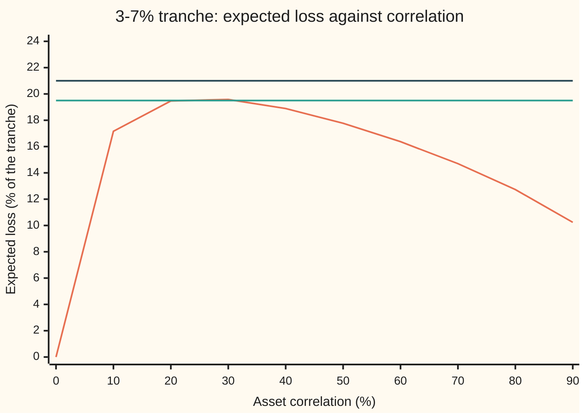
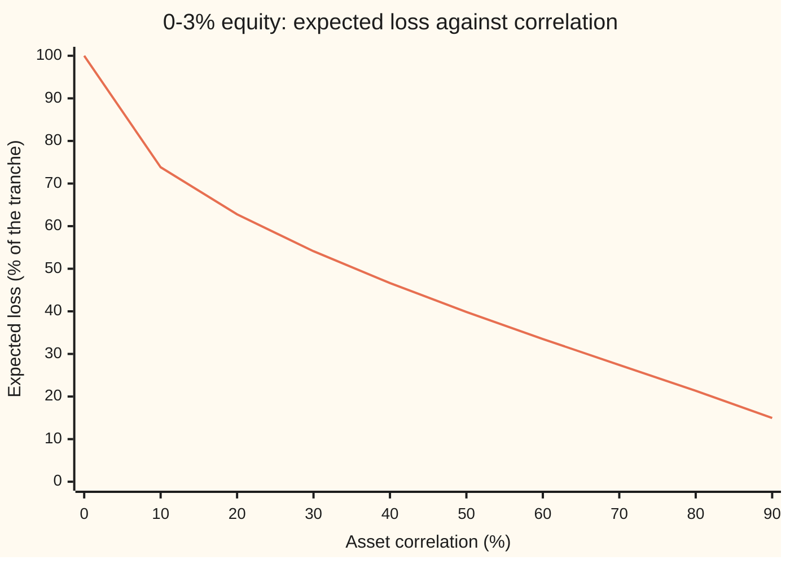

# Implied correlation: the correlation that reprices a tranche, why a mezzanine quote can have two answers or none, and base correlation's fix

[Syllabus](../../../SYLLABUS.md) → [Financial mathematics](../README.md) → [Portfolio Credit - Correlation, Copulas, Indices and Tranches](../README.md#s45) → Implied correlation

---

## General Overview

A $1 billion pool holds 100 loans of $10 million each. Each loan has a 5 percent chance of defaulting over the pool's five-year life. A defaulted loan returns 40 percent of what it owed, so it loses 60 percent. On average the pool loses 3 percent of its size.

The pool's losses are cut into slices called **tranches** ([Tranches](05-cdo-tranches-in-outline.md)). The 0–3% tranche, the **equity**, takes the first 3 percent of pool losses. The 3–7% tranche, the **mezzanine**, takes the next 4 percent: it loses nothing until the pool has lost 3 percent, and is wiped out once the pool has lost 7 percent. Each slice has a market price. On this card a price is quoted as the slice's **expected loss**: the average share of its own size it will lose over the five years.

The pricing model here is the one-factor Gaussian copula ([The one-factor Gaussian copula](02-one-factor-gaussian-copula.md)). It turns one unknown into a price. That unknown is the **asset correlation**: how strongly the loans share one fate. Run the model backwards, from a quoted price to the correlation that reproduces it, and the answer is the tranche's **implied correlation**, the credit twin of implied volatility. The options version lives on [Correlation Greeks and implied correlation](../18-Many%20underlyings%20-%20exchange%2C%20spread%2C%20basket%20and%20rainbow/05-correlation-greeks-and-implied-correlation.md); this card is about tranches.

For the equity the inverse behaves. A quote of 62.8 percent has exactly one answer: 19.97 percent correlation. The mezzanine does not behave. Its expected loss rises with correlation, peaks at 19.68 percent when correlation is 25.65 percent, then falls. A quote of 19.5 percent has two answers, 20.41 and 31.84 percent. A quote of 21 percent has none.

Base correlation repairs this. It inverts the 0–7% piece, equity and mezzanine together, whose expected loss always falls with correlation. Every quote then has one answer, and the answers price slices nobody quotes.

**A tranche's implied correlation is the one model input that reproduces its quote; it is unique for a slice starting at zero, because correlation only ever lowers a first-loss slice's expected loss, but a middle slice's expected loss rises and then falls, so its quote can have two answers or none; base correlation inverts the first-loss slices instead and prices any other slice as the difference of two of them.**

**What kind of fact this is:** a method (running a model backwards), resting on two theorems proved on this card in Why it works: a first-loss slice's expected loss falls strictly with correlation, and the mezzanine's has exactly one peak. Base correlation, and interpolating it, is a market convention, not a model.

### The picture: one quote, two correlations



The hump is the mezzanine's expected loss. The lower flat line, a quote of 19.5 percent, cuts it twice, near 20 and near 32 percent. The upper flat line, 21 percent, clears the hump's top at 19.68, so no correlation reproduces it.

---

## The formula

Notation first, in words. $p$ is one loan's default chance, 5 percent. $g$ is the share of a loan lost at default, 60 percent. $\rho$ (say "rho") is the asset correlation. The **market factor** $M$ is one bell-curve draw shared by every loan: low means a bad five years. $N$ is the bell-curve area to the left of a point and $N^{-1}$ its inverse, as on [The one-factor Gaussian copula](02-one-factor-gaussian-copula.md). $\mathbb{E}$ is an average over all values of $M$. All amounts are fractions of the pool.

In a pool of very many loans, the loss once the market factor is known is one number, not a random amount ([Vasicek's large-pool loss curve](03-vasicek-loss-distribution-and-basel-capital.md)):

$$L = g\,N\!\left(\frac{c-\sqrt{\rho}\,M}{\sqrt{1-\rho}}\right), \qquad c = N^{-1}(p).$$

A slice from 0 to $K$ loses $\min(L, K)$: all of the pool's loss up to its size, then no more. Its expected loss is

$$H_\rho(K) = \mathbb{E}\big[\min(L, K)\big].$$

A slice from $A$ to $B$ is the 0-to-$B$ slice minus the 0-to-$A$ slice. Its expected loss, as a share of its own width, is

$$\mathrm{EL}_{A,B}(\rho) = \frac{H_\rho(B) - H_\rho(A)}{B - A}.$$

**Read it aloud:** a tranche's expected loss is the difference between two first-loss slices' expected losses, divided by its width.

**Implied correlation**, also called **compound correlation**, is any $\rho$ that solves $\mathrm{EL}_{A,B}(\rho) = Q$ for the tranche's quote $Q$.

**Base correlation** turns the quotes into first-loss amounts and inverts those. Stack the tranches upward from zero with boundaries $K_1 < K_2 < \dots$; the quoted loss of the 0-to-$K_i$ slice is

$$C(K_i) = C(K_{i-1}) + (K_i - K_{i-1})\,Q_i, \qquad C(0) = 0,$$

and the base correlation $\rho_b(K_i)$ solves $H_{\rho_b(K_i)}(K_i) = C(K_i)$. A slice from $A$ to $B$ that nobody quotes is then priced with a different correlation at each end:

$$\widehat{\mathrm{EL}}_{A,B} = \frac{H_{\rho_b(B)}(B) - H_{\rho_b(A)}(A)}{B - A}.$$

| Symbol | Plain meaning | In our example | Push it up and the answer… |
| --- | --- | --- | --- |
| $L$ | the pool's loss once the market factor is known, a fraction of the pool | 3% on average | — |
| $p$ | one loan's chance of default over the five years | 5% | every slice loses more |
| $g$ | **loss given default**: the share of a loan lost when it defaults, 1 minus recovery | 60% | every slice loses more |
| $\rho$, $\rho^*$ | asset correlation (say "rho"); $\rho^*$ is where the mezzanine's expected loss peaks | 20%; 25.65% | the equity loses less; the mezzanine gains, then loses |
| $M$ | the market factor, one bell-curve draw shared by all loans | −2 in a bad five years | pool loss falls |
| $A$, $B$ | a tranche's **attachment** and **detachment**: where it starts and stops taking loss | 3% and 7% | the slice sits higher and loses less |
| $K$, $K_i$, $\rho_b(K)$ | the top of a first-loss slice 0-to-$K$; $K_i$ the quoted tranche boundaries; its base correlation | 7%; 25% | — |
| $c$ | the default threshold $N^{-1}(p)$ | −1.6449 | more defaults |
| $b_K$, $z_K$ | $b_K = N^{-1}(K/g)$; $z_K$ is the market factor value at which pool loss is exactly $K$ | $b_A$ = −1.6449, $b_B$ = −1.1918 | — |
| $N$, $N_2$, $\varphi$ | bell-curve area to the left; the same for a correlated pair; the bell curve's height | $N(c)$ = 5% | — |
| $H_\rho(K)$, $C(K)$ | first-loss expected loss from the model, and from the quotes | 0.018831 at $K$ = 3%, $\rho$ = 20% | $H$ falls as $\rho$ rises |
| $\mathrm{EL}_{A,B}(\rho)$, $Q$ | a tranche's expected loss as a share of its width; $Q$ its quote | 19.47% for 3–7% at 20% | — |

The market factor value that makes pool loss equal $K$ comes from setting $L = K$ and solving:

$$z_K = \frac{c - \sqrt{1-\rho}\;b_K}{\sqrt{\rho}}.$$

Pool loss exceeds $K$ exactly when $M < z_K$: a worse economy than that.

### When it holds

- **A very large pool of identical loans.** The formula for $L$ is the limit of many loans. With 100 real loans the losses come in steps of 0.6 percent, and the equity's expected loss at 20 percent correlation is 59.60, not 62.77. The inverse then returns a different correlation for the same quote.
- **One bell-curve factor.** The Gaussian copula thins out joint disasters too fast; a tail-heavier copula moves every number here ([Tail dependence](07-tail-dependence-and-the-t-copula.md)).
- **Quotes as expected losses.** Markets quote spreads or upfront payments; turning those into expected losses needs default timing, discounting and the premium schedule from the tranche card. This card starts after that step.
- **One pool, one date, one recovery.** Base correlation bootstraps across tranches, so every quote must describe the same pool, maturity and 40 percent recovery. Change the recovery and every base correlation moves.
- **Interpolation is a convention.** Two different correlations in one price do not describe any single loss distribution, so nothing guarantees an interpolated slice a loss between zero and its width. Conventions verified 28 Sep 2026 against McGinty and Ahluwalia (2004): the bootstrap adds each tranche's expected loss onto the one below, in the large-pool Gaussian model.

---

## Why it works

### Step 0: correlation moves loss between scenarios, not in total

Correlation never changes the pool's average loss: $g\,p$ = 3 percent at every correlation. It changes how that 3 percent is spread across scenarios.

At zero correlation every scenario loses exactly 3 percent: defaults are independent, and a huge pool averages them out. At full correlation the loans default together or not at all: 95 percent of scenarios lose nothing and 5 percent lose 60 percent. In between, low values of $M$ bring heavy loss and high values bring light loss.

A tranche is a window on the loss. How much of the fixed 3 percent average lands in the window depends on the spread. That is why a tranche's price carries information about correlation.

### Step 1: every tranche is two first-loss slices

For any loss $L$, the 3–7% tranche loses $\min(L, 7\%) - \min(L, 3\%)$ of the pool. Check three cases. Pool loss 2 percent: 2 − 2 = 0. Pool loss 5 percent: 5 − 3 = 2 percentage points of the pool, half the tranche. Pool loss 9 percent: 7 − 3 = 4, the whole tranche.

Averaging over scenarios keeps the difference, which gives the formula for $\mathrm{EL}_{A,B}$. So the behaviour of any tranche follows from the behaviour of $H_\rho(K)$, one first-loss slice at a time.

### Step 2: a first-loss slice's expected loss falls strictly with correlation

The 0-to-$K$ slice keeps the pool's loss up to $K$ and ignores the rest. Spread the loss out and two things happen. Heavy scenarios lose more, but the slice cannot lose more than $K$ in them. Light scenarios lose less, and the slice feels every bit of that. The cap blocks the extra loss in bad scenarios but not the relief in good ones, so the average falls.

The exact statement is a slope. Differentiating $H_\rho(K)$ in $\rho$ gives

$$\frac{\partial H_\rho(K)}{\partial \rho} = -\,\frac{g\,\varphi(b_K)\,\varphi(z_K)}{2\sqrt{\rho(1-\rho)}},$$

which is negative for every $\rho$ strictly between 0 and 1. At $K$ = 7% and $\rho$ = 30% it is −0.025452, and bumping $\rho$ up and down by 0.00001 in the code gives the same number.

<details>
<summary>Detailed proof: the closed form, and its slope</summary>

Write $\min(L,K) = K$ when $M < z_K$, and $L$ otherwise. So
$H_\rho(K) = K\,N(z_K) + \mathbb{E}\big[L\,;\,M \ge z_K\big]$.
The second term is $g$ times the chance that a loan defaults while the economy is at or above $z_K$. A loan's hidden score, $\sqrt{\rho}\,M$ plus $\sqrt{1-\rho}$ times its own bell-curve noise, is a bell-curve draw with correlation $\sqrt{\rho}$ to $M$, so that chance is $p - N_2(c, z_K; \sqrt{\rho})$:
$$H_\rho(K) = K\,N(z_K) + g\,\big[\,p - N_2(c, z_K; \sqrt{\rho})\,\big].$$
Differentiate in $\rho$. The pair function obeys two rules: its slope in the second point is $\varphi(z)\,N\big((c - \sqrt{\rho}\,z)/\sqrt{1-\rho}\big)$, and its slope in the correlation is the pair's bell-curve height (Plackett's identity). At $z = z_K$ the first rule gives $\varphi(z_K)\,K/g$, by the definition of $z_K$, so the two terms that move $z_K$ cancel exactly. What remains is the correlation slope times $d\sqrt{\rho}/d\rho = 1/(2\sqrt{\rho})$. The pair's height at $(c, z_K)$ factors as $\varphi(z_K)\,\varphi(b_K)/\sqrt{1-\rho}$, because $(c - \sqrt{\rho}\,z_K)/\sqrt{1-\rho} = b_K$. Multiplying gives the slope in the body. Every factor is positive, and the minus sign makes the slope negative.

</details>

The ends are known exactly. At zero correlation, $H_0(K) = \min(g\,p, K)$. At full correlation, $H_1(K) = p\,\min(g, K)$. For the 0–3% equity, as a share of its width, that is 100 percent and 5 percent.

A continuous, strictly falling curve from 100 down to 5 meets every level between once (the intermediate value theorem). So **a quote strictly between 5 and 100 percent has exactly one equity implied correlation; a quote at or outside those ends has none inside (0, 1).** The quote 62.8 percent gives 19.97 percent.



The single line is the equity's expected loss. It falls at every step, so any horizontal quote line crosses it once.

### Step 3: the mezzanine is the difference of two falling curves

The 3–7% tranche is $H_\rho(7\%)$ minus $H_\rho(3\%)$, over 4 percent. Both fall with correlation. Their difference rises when the 3% slice falls faster, and falls when the 7% slice does. So the mezzanine can go either way.

The ends pin it down. At zero correlation every scenario loses exactly 3 percent, which stops at the tranche's floor: expected loss 0. At full correlation 5 percent of scenarios lose 60 percent of the pool, which wipes the tranche out: expected loss 5 percent. In between it climbs to 19.68 percent, because moderate spreading pushes many scenarios into the 3–7% window, then heavy spreading sends scenarios either below the window or straight through it.

Subtracting the two slopes from Step 2, the mezzanine rises exactly when $\varphi(b_A)\,\varphi(z_A) > \varphi(b_B)\,\varphi(z_B)$. Taking logs and cancelling reduces this to a sign test on $(b_A + b_B) - 2c\sqrt{1-\rho}$. As $\rho$ rises, $\sqrt{1-\rho}$ falls steadily, so the sign changes at most once. When $2c < b_A + b_B < 0$ it changes exactly once, at

$$\rho^* = 1 - \left(\frac{b_A + b_B}{2c}\right)^2.$$

For the 3–7% tranche that is 25.65 percent, and a numerical search for the maximum, which knows nothing of this formula, lands on the same value.

<details>
<summary>Detailed proof: exactly one peak</summary>

From Step 2, the mezzanine's slope is $\dfrac{g}{2\sqrt{\rho(1-\rho)}\,(B-A)}\big[\varphi(b_A)\varphi(z_A) - \varphi(b_B)\varphi(z_B)\big]$, so its sign is the sign of $\log\big(\varphi(b_A)\varphi(z_A)\big) - \log\big(\varphi(b_B)\varphi(z_B)\big)$. Since $\log\varphi(x) = -x^2/2$ plus a constant, that difference is $\tfrac12\big(b_B^2 - b_A^2\big) + \tfrac12\big(z_B^2 - z_A^2\big)$. Put in $z_K = (c - \sqrt{1-\rho}\,b_K)/\sqrt{\rho}$ and expand:
$$\tfrac12\big(z_B^2 - z_A^2\big) = \frac{(b_B - b_A)\big[\,(1-\rho)(b_A + b_B) - 2c\sqrt{1-\rho}\,\big]}{2\rho}.$$
Write $\tfrac12(b_B^2 - b_A^2)$ as $\rho\,(b_B - b_A)(b_A + b_B)/(2\rho)$ and add. The $(1-\rho)$ and the $\rho$ combine:
$$\frac{(b_B - b_A)\big[\,(b_A + b_B) - 2c\sqrt{1-\rho}\,\big]}{2\rho}.$$
Since $A < B$, $b_B - b_A > 0$, so the sign is that of $(b_A + b_B) - 2c\sqrt{1-\rho}$. With $c < 0$, this moves steadily from $(b_A+b_B) - 2c$ at $\rho = 0$, positive when $b_A + b_B > 2c$, down to $b_A + b_B$ at $\rho = 1$, negative when $b_A + b_B < 0$. So it crosses zero once, where $\sqrt{1-\rho} = (b_A + b_B)/(2c)$. Squaring gives $\rho^*$. Other tranches, or other $p$ and $g$, may fail the inequality: the 0–3% equity has $b_A$ at minus infinity and never rises.

</details>

The root count follows from the shape. The curve rises from 0 to 19.68 percent, then falls to 5 percent.

| Quote $Q$ for 3–7% | Correlations that reproduce it |
| --- | --- |
| above the peak, 19.675% | none |
| exactly the peak | one, 25.65% |
| above 5%, below the peak | two, one on each side of 25.65% |
| above 0, up to 5% | one, below 25.65% |
| 0 or below | none |

The quote 19.5 percent sits in the third row: 20.41 and 31.84 percent.

### Step 4: solve each branch separately

Inverting means finding where $\mathrm{EL}_{A,B}(\rho) - Q$ crosses zero ([Solving backwards](../07-Greeks%20by%20Numbers%20and%20Calibration/05-root-finding-for-inverses.md)). Bisection needs a bracket whose two ends give opposite signs. Over the whole range 0 to 1 the 19.5 percent quote fails that test: the curve is below 19.5 at both ends. Plain bisection run anyway walks to 100 percent correlation, where the mezzanine loses 5.00 percent, nowhere near the quote.

The fix is to split at $\rho^*$. On $(0, \rho^*)$ the curve only rises; on $(\rho^*, 1)$ it only falls. Each piece has a proper bracket or none, and each yields at most one root. The code finds each root twice: by bisection, and by Newton's method using the slope formula from Step 2. The two agree to eight decimals.

### Step 5: base correlation inverts the first-loss slices

Step 2 already contains the fix. Every 0-to-$K$ slice falls strictly with correlation, so every first-loss quote inside its range has exactly one correlation. Base correlation builds those first-loss quotes out of the tranche quotes, by adding each tranche's expected loss, in pool units, onto the stack below it.

The card's test market quotes four tranches: 0–3, 3–7, 7–10 and 10–15 percent. The quotes are generated from a known skew, base correlations of 20, 25, 30 and 40 percent, so the inversion can be checked against the truth. Real quotes arrive without that label. The quotes come out at 62.7703, 16.2777, 4.5278 and 1.2499 percent of each tranche. Bootstrapped by bisection and by Newton, they return 20, 25, 30 and 40 percent exactly.

Invert the same four quotes one tranche at a time and the picture breaks:

```
correlation read from the same four quotes, % (one block = 2 points)
0-3%    base      ██████████                        20.00
        compound  ██████████                        20.00
3-7%    base      █████████████                     25.00
        compound  ████                               8.37   and
                  ██████████████████████████████    60.57
7-10%   base      ███████████████                   30.00
        compound  ███████                           14.40
10-15%  base      ████████████████████              40.00
        compound  ████████                          15.34
```

Base correlation rises smoothly with the detachment point. Compound correlation jumps: the mezzanine gives two answers, 8.37 and 60.57 percent, neither near its neighbours. The 7–10% and 10–15% quotes sit below 5 percent, so each has one compound correlation, on the rising branch. McGinty and Ahluwalia saw this pattern on real quotes in 2004 and called the compound shape an artefact of the method.

### Step 6: pricing a slice nobody quotes

A client wants the 5–10% tranche. Nobody quotes it. Base correlation is known at 3, 7, 10 and 15 percent. Interpolate a straight line between 3 and 7 percent to get 22.5 percent at 5. At 10 percent it is quoted: 30 percent.

Price the 0–10% slice at 30 percent and the 0–5% slice at 22.5 percent, and subtract. The 5–10% tranche loses 7.04 percent of its width in expectation.

Two cautions. The price mixes two correlations, so no single loss distribution stands behind it. And a bent interpolation can make $H_{\rho_b(B)}(B) - H_{\rho_b(A)}(A)$ negative or larger than $B - A$: a tranche that gains from defaults, or loses more than its size. The code checks the quoted stack, $0 \le C(K_i) - C(K_{i-1}) \le K_i - K_{i-1}$, for both.

### The other door

Base correlation fixes the inverse, not the model. The rising skew says one Gaussian correlation cannot fit all tranches at once. The other road is to change the model so one set of parameters fits every tranche: a copula with heavier joint tails, random recovery, or random correlation. The first of these is [Tail dependence](07-tail-dependence-and-the-t-copula.md).

---

## Worked numbers, by hand

The pool: $p$ = 5%, $g$ = 60%. The mezzanine: $A$ = 3%, $B$ = 7%.

| Step | Arithmetic | Value |
| --- | --- | --- |
| default threshold $c$ | $N^{-1}(0.05)$ | −1.644854 |
| $b_A$ | $N^{-1}(0.03 / 0.60) = N^{-1}(0.05)$ | −1.644854 |
| $b_B$ | $N^{-1}(0.07 / 0.60)$ | −1.191816 |
| one peak? | is $2c = -3.29 < b_A + b_B = -2.84 < 0$? | yes |
| peak correlation $\rho^*$ | $1 - \big((-1.644854 - 1.191816)/(2 \times -1.644854)\big)^2$ | 0.256462 |
| peak expected loss | $\mathrm{EL}_{3,7}(\rho^*)$, by integral | 19.68% |
| quote 19.5%: two roots | below 19.68 and above 5 | 20.41% and 31.84% |
| quote 21%: none | above the peak | — |
| equity quote 62.8% | between 5 and 100, one root | 19.97% |
| base stack at 3% | $0.03 \times 0.627703$ | 0.018831 → 20% |
| base stack at 7% | $0.018831 + 0.04 \times 0.162777$ | 0.025342 → 25% |
| base stack at 10% | $0.025342 + 0.03 \times 0.045278$ | 0.026701 → 30% |
| base correlation at 5% | $20\% + \tfrac{5 - 3}{7 - 3}(25\% - 20\%)$ | 22.5% |
| 0–5% slice at 22.5% | $H_{0.225}(0.05)$, by integral | 0.023180 |
| **5–10% tranche** | $(0.026701 - 0.023180) / 0.05$ | **7.04%** |

Under the base-correlation convention, a 5–10% tranche on this pool is expected to lose about 7 percent of its size over five years.

### What breaks if you drop a piece

| Mistake | Comes out at | What went wrong |
| --- | --- | --- |
| One bisection bracket, 0 to 100%, for the 19.5% quote | 100% correlation, where the tranche loses 5.00% | Both ends sit below the quote, so the bracket traps nothing |
| Price 5–10% at the equity's 20% | 9.28% (right: 7.04%) | A flat correlation ignores the skew and overstates a higher slice's loss |
| Price 5–10% at one base correlation, 30%, at both ends | 11.25% | Each end of the slice needs its own base correlation |
| Take the 3–7% market quote's compound correlation as "the" correlation | 8.37% or 60.57% | Two answers, and neither is the 25% base |
| Treat 100 loans as infinitely many, equity at 20% | 62.77% (100 loans: 59.60%) | Lumpy losses spread the loss further, and the equity's cap then bites more |

Every number in this table is printed by the code below.

---

## Code, from first principles, and it actually runs

The code builds its own bell curve, inverse, integrator and root finders. It computes each expected loss two independent ways: averaging over the market factor, and the closed form with the pair bell curve integrated through Plackett's identity. It finds the peak twice (formula and golden-section search), every root twice (bisection and Newton), the slope twice (formula and bump), and sets the large pool beside an exact 100-loan pool.

### Python

```python
# Implied (compound) and base correlation in the large-pool Gaussian copula.
# Pool: default chance P over the life, loss given default G = 1 - 40% recovery.
from math import exp, sqrt, pi
P, G = 0.05, 0.60

def npdf(x): return exp(-0.5 * x * x) / sqrt(2 * pi)
def ncdf(x):                                   # own normal CDF: series, then continued fraction
    u = abs(x)
    if u < 3.0:
        term = s = u; k = 1
        while term > 1e-17 * s: term *= u * u / (2 * k + 1); s += term; k += 1
        tail = 0.5 - npdf(u) * s
    else:
        cf = u
        for k in range(120, 0, -1): cf = u + k / cf
        tail = npdf(u) / cf
    return tail if x < 0 else 1.0 - tail
def ninv(p):                                   # inverse CDF by bisection
    lo, hi = -10.0, 10.0
    for _ in range(100):
        m = 0.5 * (lo + hi)
        if ncdf(m) < p: lo = m
        else: hi = m
    return 0.5 * (lo + hi)
def simpson(f, lo, hi, n):
    h = (hi - lo) / n
    return h / 3 * (f(lo) + f(hi) + sum((4 if j % 2 else 2) * f(lo + j * h) for j in range(1, n)))

C0 = ninv(P)                                   # default threshold c
def zcut(K, rho): return (C0 - sqrt(1 - rho) * ninv(K / G)) / sqrt(rho)
def F(K, rho):                                 # road 1: E[min(L, K)] averaged over the market factor
    if K <= 0.0: return 0.0
    if rho <= 0.0: return min(G * P, K)
    if rho >= 1.0: return P * min(G, K)
    z = min(max(zcut(K, rho), -9.0), 9.0)      # cut the factor range at 9 standard deviations
    loss = lambda x: G * ncdf((C0 - sqrt(rho) * x) / sqrt(1 - rho)) * npdf(x)
    return K * ncdf(z) + simpson(loss, z, 9.0, 2000)
def F2(K, rho):                                # road 2: bivariate normal CDF by Plackett's identity
    z, r = zcut(K, rho), sqrt(rho)
    dens = lambda s: exp(-(C0 * C0 - 2 * s * C0 * z + z * z) / (2 * (1 - s * s))) / (2 * pi * sqrt(1 - s * s))
    return K * ncdf(z) + G * (P - ncdf(C0) * ncdf(z) - simpson(dens, 0.0, r, 2000))
def M(A, B, rho): return (F(B, rho) - F(A, rho)) / (B - A)
def dF(K, rho): return -G * npdf(ninv(K / G)) * npdf(zcut(K, rho)) / (2 * sqrt(rho * (1 - rho)))
def dM(A, B, rho): return (dF(B, rho) - (dF(A, rho) if A > 0 else 0.0)) / (B - A)
def peak_rho(A, B):                            # closed form; None when the tranche has no hump
    bs = (ninv(A / G) if A > 0 else -1e9) + ninv(B / G)
    return 1 - (bs / (2 * C0)) ** 2 if 2 * C0 < bs < 0 else None

def bisect(f, lo, hi, n=60):                   # road 1 for every inverse: halve a sign-changing bracket
    flo = f(lo)
    for _ in range(n):
        m = 0.5 * (lo + hi)
        if (f(m) > 0) == (flo > 0): lo = m
        else: hi = m
    return 0.5 * (lo + hi)
def newton(f, df, lo, hi):                     # road 2: Newton with the analytic slope, kept in the branch
    x = 0.5 * (lo + hi)
    for _ in range(40):
        y = x - f(x) / df(x)
        x = y if lo < y < hi else 0.5 * (x + (lo if y <= lo else hi))
    return x
def compound(A, B, Q):                         # every correlation in (0,1) repricing the quote Q
    top = peak_rho(A, B) or 0.999999
    ends, out = [(1e-9, top)] + ([(top, 1.0)] if top < 0.999999 else []), []
    for lo, hi in ends:
        f = lambda r: M(A, B, r) - Q
        if f(lo) * f(hi) < 0:
            out.append((bisect(f, lo, hi), newton(f, lambda r: dM(A, B, r), lo, hi)))
    return out
def golden_max(f, lo, hi):                     # peak found numerically, no formula
    g = (sqrt(5) - 1) / 2
    for _ in range(80):
        a, b = hi - g * (hi - lo), lo + g * (hi - lo)
        if f(a) < f(b): lo = a
        else: hi = b
    return 0.5 * (lo + hi)
def pool100(K, rho):                           # 100 loans, conditional binomial, same copula
    def f(x):
        q = ncdf((C0 - sqrt(rho) * x) / sqrt(1 - rho)); pr = (1 - q) ** 100; tot = 0.0
        for n in range(101):
            tot += pr * min(n * G / 100, K); pr *= (100 - n) / (n + 1) * q / (1 - q)
        return tot * npdf(x)
    return simpson(f, -9.0, 9.0, 800)

out = lambda label, v: print(f"{label:<40} {v:>12.6f}")
print(f"threshold c = N^-1(p)                    {C0:>12.6f}")
out("road 1 factor integral, 3-7% at 20%", M(0.03, 0.07, 0.2))
out("road 2 Plackett, 3-7% at 20%", (F2(0.07, 0.2) - F2(0.03, 0.2)) / 0.04)
out("road 1 equity 0-3% at 20%", F(0.03, 0.2) / 0.03); out("road 2 equity 0-3% at 20%", F2(0.03, 0.2) / 0.03)
out("b_A = N^-1(3% / g)", ninv(0.03 / G)); out("b_B = N^-1(7% / g)", ninv(0.07 / G))
out("100 loans, equity 0-3% at 20%", pool100(0.03, 0.2) / 0.03)
out("100 loans, 3-7% at 20%", (pool100(0.07, 0.2) - pool100(0.03, 0.2)) / 0.04)
h = 1e-5; fd = (F(0.07, 0.3 + h) - F(0.07, 0.3 - h)) / (2 * h)
out("slope dF/drho at 7%, 30%, formula", dF(0.07, 0.3)); out("slope dF/drho at 7%, 30%, bumped", fd)
rs, rg = peak_rho(0.03, 0.07), golden_max(lambda r: M(0.03, 0.07, r), 0.01, 0.99)
out("peak rho*, closed form", rs); out("peak rho*, golden section", rg); out("peak 3-7% loss", M(0.03, 0.07, rs))
grid = [i / 10 for i in range(10)]
print("chart, correlation %  " + " ".join(f"{100 * r:6.0f}" for r in grid))
print("chart, 3-7% loss %    " + " ".join(f"{100 * M(0.03, 0.07, r):6.2f}" for r in grid))
print("chart, 0-3% loss %    " + " ".join(f"{100 * F(0.03, r) / 0.03:6.2f}" for r in grid))
print("chart, quote lines %  " + " ".join(f"{v:6.2f}" for v in (19.5, 21.0)))
roots = {}
for label, A, B, Q in (("0-3% quote 62.80%", 0, 0.03, 0.628), ("3-7% quote = model at 20%", 0.03, 0.07, M(0.03, 0.07, 0.2)),
                       ("3-7% quote 19.50%", 0.03, 0.07, 0.195), ("3-7% quote 19.60%", 0.03, 0.07, 0.196),
                       ("3-7% quote 21.00%", 0.03, 0.07, 0.21)):
    roots[label] = compound(A, B, Q)
    print(f"{label:<27} roots: " + (", ".join(f"{b:.6f}/{n:.6f}" for b, n in roots[label]) or "none"))
naive = bisect(lambda r: M(0.03, 0.07, r) - 0.195, 0.0, 1.0)
out("wrong: one bracket 0..1 for 19.50%", naive); out("  its 3-7% loss", M(0.03, 0.07, naive))
Ks, seeds = [0.0, 0.03, 0.07, 0.10, 0.15], [None, 0.20, 0.25, 0.30, 0.40]
Cum = [0.0] + [F(Ks[i], seeds[i]) for i in range(1, 5)]
for i in range(1, 5):
    A, B = Ks[i - 1], Ks[i]; Q = (Cum[i] - Cum[i - 1]) / (B - A)
    fb = lambda r: F(B, r) - Cum[i]
    bb, bn = bisect(fb, 1e-9, 1.0 - 1e-9), newton(fb, lambda r: dF(B, r), 1e-6, 1.0 - 1e-6)
    cr = compound(A, B, Q)
    print(f"{f'{100 * A:.0f}-{100 * B:.0f}%':<7} quote {100 * Q:7.4f}%  cum {Cum[i]:.6f}  base {bb:.6f}/{bn:.6f}  compound "
          + ", ".join(f"{b:.4f}" for b, n in cr))
    assert abs(bb - seeds[i]) < 1e-8, "bisection bootstrap must return the correlation behind each quote"
    assert abs(bn - seeds[i]) < 1e-8, "Newton bootstrap must return the correlation behind each quote"
    assert 0 <= Cum[i] - Cum[i - 1] <= B - A, "cumulative losses must rise, and by no more than the width"
b5 = 0.20 + (0.05 - 0.03) / (0.07 - 0.03) * (0.25 - 0.20)
out("base correlation at 5%, interpolated", b5); out("first loss 0-5% at that correlation", F(0.05, b5))
out("5-10% by base correlation", (F(0.10, 0.30) - F(0.05, b5)) / 0.05)
out("wrong: 5-10% at flat 20%", M(0.05, 0.10, 0.20))
out("wrong: 5-10% at flat 30%", M(0.05, 0.10, 0.30))
out("5-7% by base correlation", (F(0.07, 0.25) - F(0.05, b5)) / 0.02)
for rho in (0.1, 0.2, 0.5, 0.9):
    assert abs(F(0.07, rho) - F2(0.07, rho)) < 1e-9, "factor integral vs Plackett bivariate normal"
assert abs(fd - dF(0.07, 0.3)) < 1e-6, "analytic slope vs bumped slope"
assert abs(rs - rg) < 1e-5, "closed-form peak vs numerical maximum"
for label, rr in roots.items():
    for b, n in rr: assert abs(b - n) < 1e-8, "bisection vs Newton on each branch: " + label
assert len(roots["3-7% quote 21.00%"]) == 0, "no correlation reprices 21%"
assert M(0.03, 0.07, rg) < 0.21, "21% lies above the numerically found hump"
assert abs(roots["3-7% quote = model at 20%"][0][0] - 0.2) < 1e-8, "the left root recovers the 20% that made the quote"
assert pool100(0.03, 0.2) < F(0.03, 0.2), "lumpy losses: 100 loans give the equity less loss (Jensen)"
assert abs(pool100(G, 0.2) - G * P) < 1e-9, "100 loans keep the pool's mean loss g p"
print("ALL CHECKS PASS")
```

**Ran 2026-09-28 on macOS, Python 3.14.6, standard library only. All checks passed. Output, pasted from the run:**

```
threshold c = N^-1(p)                       -1.644854
road 1 factor integral, 3-7% at 20%          0.194685
road 2 Plackett, 3-7% at 20%                 0.194685
road 1 equity 0-3% at 20%                    0.627703
road 2 equity 0-3% at 20%                    0.627703
b_A = N^-1(3% / g)                          -1.644854
b_B = N^-1(7% / g)                          -1.191816
100 loans, equity 0-3% at 20%                0.596004
100 loans, 3-7% at 20%                       0.204613
slope dF/drho at 7%, 30%, formula           -0.025452
slope dF/drho at 7%, 30%, bumped            -0.025452
peak rho*, closed form                       0.256462
peak rho*, golden section                    0.256462
peak 3-7% loss                               0.196752
chart, correlation %       0     10     20     30     40     50     60     70     80     90
chart, 3-7% loss %      0.00  17.16  19.47  19.58  18.89  17.77  16.37  14.70  12.73  10.24
chart, 0-3% loss %    100.00  73.83  62.77  54.11  46.63  39.85  33.51  27.40  21.34  14.96
chart, quote lines %   19.50  21.00
0-3% quote 62.80%           roots: 0.199689/0.199689
3-7% quote = model at 20%   roots: 0.200000/0.200000, 0.324275/0.324275
3-7% quote 19.50%           roots: 0.204099/0.204099, 0.318449/0.318449
3-7% quote 19.60%           roots: 0.221132/0.221132, 0.295928/0.295928
3-7% quote 21.00%           roots: none
wrong: one bracket 0..1 for 19.50%           1.000000
  its 3-7% loss                              0.050000
0-3%    quote 62.7703%  cum 0.018831  base 0.200000/0.200000  compound 0.2000
3-7%    quote 16.2777%  cum 0.025342  base 0.250000/0.250000  compound 0.0837, 0.6057
7-10%   quote  4.5278%  cum 0.026701  base 0.300000/0.300000  compound 0.1440
10-15%  quote  1.2499%  cum 0.027325  base 0.400000/0.400000  compound 0.1534
base correlation at 5%, interpolated         0.225000
first loss 0-5% at that correlation          0.023180
5-10% by base correlation                    0.070413
wrong: 5-10% at flat 20%                     0.092811
wrong: 5-10% at flat 30%                     0.112475
5-7% by base correlation                     0.108116
ALL CHECKS PASS
```

### Rust

```rust
// Implied (compound) and base correlation in the large-pool Gaussian copula.
// Pool: default chance P over the life, loss given default G = 1 - 40% recovery.
use std::f64::consts::PI;
const P: f64 = 0.05;
const G: f64 = 0.60;

fn npdf(x: f64) -> f64 { (-0.5 * x * x).exp() / (2.0 * PI).sqrt() }
fn ncdf(x: f64) -> f64 { // own normal CDF: series, then continued fraction
    let u = x.abs();
    let tail = if u < 3.0 {
        let (mut term, mut s, mut k) = (u, u, 1.0);
        while term > 1e-17 * s { term *= u * u / (2.0 * k + 1.0); s += term; k += 1.0; }
        0.5 - npdf(u) * s
    } else {
        let mut cf = u;
        for k in (1..=120).rev() { cf = u + k as f64 / cf; }
        npdf(u) / cf
    };
    if x < 0.0 { tail } else { 1.0 - tail }
}
fn ninv(p: f64) -> f64 { // inverse CDF by bisection
    let (mut lo, mut hi) = (-10.0, 10.0);
    for _ in 0..100 { let m = 0.5 * (lo + hi); if ncdf(m) < p { lo = m } else { hi = m } }
    0.5 * (lo + hi)
}
fn simpson(f: &dyn Fn(f64) -> f64, lo: f64, hi: f64, n: usize) -> f64 {
    let h = (hi - lo) / n as f64;
    let mut s = 0.0;
    for j in 1..n { s += if j % 2 == 1 { 4.0 } else { 2.0 } * f(lo + j as f64 * h); }
    h / 3.0 * (f(lo) + f(hi) + s)
}
fn c0() -> f64 { ninv(P) } // default threshold c
fn zcut(k: f64, rho: f64) -> f64 { (c0() - (1.0 - rho).sqrt() * ninv(k / G)) / rho.sqrt() }
fn f1(k: f64, rho: f64) -> f64 { // road 1: E[min(L, K)] averaged over the market factor
    if k <= 0.0 { return 0.0; }
    if rho <= 0.0 { return (G * P).min(k); }
    if rho >= 1.0 { return P * G.min(k); }
    let z = zcut(k, rho).max(-9.0).min(9.0);
    let c = c0();
    let loss = |x: f64| G * ncdf((c - rho.sqrt() * x) / (1.0 - rho).sqrt()) * npdf(x);
    k * ncdf(z) + simpson(&loss, z, 9.0, 2000)
}
fn f2(k: f64, rho: f64) -> f64 { // road 2: bivariate normal CDF by Plackett's identity
    let (z, r, c) = (zcut(k, rho), rho.sqrt(), c0());
    let dens = |s: f64| (-(c * c - 2.0 * s * c * z + z * z) / (2.0 * (1.0 - s * s))).exp() / (2.0 * PI * (1.0 - s * s).sqrt());
    k * ncdf(z) + G * (P - ncdf(c) * ncdf(z) - simpson(&dens, 0.0, r, 2000))
}
fn m(a: f64, b: f64, rho: f64) -> f64 { (f1(b, rho) - f1(a, rho)) / (b - a) }
fn df(k: f64, rho: f64) -> f64 { -G * npdf(ninv(k / G)) * npdf(zcut(k, rho)) / (2.0 * (rho * (1.0 - rho)).sqrt()) }
fn dm(a: f64, b: f64, rho: f64) -> f64 { (df(b, rho) - if a > 0.0 { df(a, rho) } else { 0.0 }) / (b - a) }
fn peak_rho(a: f64, b: f64) -> Option<f64> { // closed form; None when the tranche has no hump
    let bs = (if a > 0.0 { ninv(a / G) } else { -1e9 }) + ninv(b / G);
    let c = c0();
    if 2.0 * c < bs && bs < 0.0 { Some(1.0 - (bs / (2.0 * c)).powi(2)) } else { None }
}
fn bisect(f: &dyn Fn(f64) -> f64, mut lo: f64, mut hi: f64) -> f64 { // road 1 for every inverse
    let flo = f(lo);
    for _ in 0..60 { let x = 0.5 * (lo + hi); if (f(x) > 0.0) == (flo > 0.0) { lo = x } else { hi = x } }
    0.5 * (lo + hi)
}
fn newton(f: &dyn Fn(f64) -> f64, d: &dyn Fn(f64) -> f64, lo: f64, hi: f64) -> f64 { // road 2, kept in the branch
    let mut x = 0.5 * (lo + hi);
    for _ in 0..40 {
        let y = x - f(x) / d(x);
        x = if lo < y && y < hi { y } else { 0.5 * (x + if y <= lo { lo } else { hi }) };
    }
    x
}
fn compound(a: f64, b: f64, q: f64) -> Vec<(f64, f64)> { // every correlation in (0,1) repricing the quote q
    let top = peak_rho(a, b).unwrap_or(0.999999);
    let mut ends = vec![(1e-9, top)];
    if top < 0.999999 { ends.push((top, 1.0)); }
    let mut out = Vec::new();
    for (lo, hi) in ends {
        let f = |r: f64| m(a, b, r) - q;
        if f(lo) * f(hi) < 0.0 { out.push((bisect(&f, lo, hi), newton(&f, &|r| dm(a, b, r), lo, hi))); }
    }
    out
}
fn golden_max(f: &dyn Fn(f64) -> f64, mut lo: f64, mut hi: f64) -> f64 { // peak found numerically
    let g = (5f64.sqrt() - 1.0) / 2.0;
    for _ in 0..80 {
        let (a, b) = (hi - g * (hi - lo), lo + g * (hi - lo));
        if f(a) < f(b) { lo = a } else { hi = b }
    }
    0.5 * (lo + hi)
}
fn pool100(k: f64, rho: f64) -> f64 { // 100 loans, conditional binomial, same copula
    let c = c0();
    let f = |x: f64| {
        let q = ncdf((c - rho.sqrt() * x) / (1.0 - rho).sqrt());
        let (mut pr, mut tot) = ((1.0 - q).powi(100), 0.0);
        for n in 0..=100 { tot += pr * (n as f64 * G / 100.0).min(k); pr *= (100 - n) as f64 / (n + 1) as f64 * q / (1.0 - q); }
        tot * npdf(x)
    };
    simpson(&f, -9.0, 9.0, 800)
}
fn out(label: &str, v: f64) { println!("{:<40} {:>12.6}", label, v); }
fn row(label: &str, v: &[f64], dec: usize) {
    let s: Vec<String> = v.iter().map(|x| format!("{:6.*}", dec, x)).collect();
    println!("{}{}", label, s.join(" "));
}

fn main() {
    println!("threshold c = N^-1(p)                    {:>12.6}", c0());
    out("road 1 factor integral, 3-7% at 20%", m(0.03, 0.07, 0.2));
    out("road 2 Plackett, 3-7% at 20%", (f2(0.07, 0.2) - f2(0.03, 0.2)) / 0.04);
    out("road 1 equity 0-3% at 20%", f1(0.03, 0.2) / 0.03); out("road 2 equity 0-3% at 20%", f2(0.03, 0.2) / 0.03);
    out("b_A = N^-1(3% / g)", ninv(0.03 / G)); out("b_B = N^-1(7% / g)", ninv(0.07 / G));
    out("100 loans, equity 0-3% at 20%", pool100(0.03, 0.2) / 0.03);
    out("100 loans, 3-7% at 20%", (pool100(0.07, 0.2) - pool100(0.03, 0.2)) / 0.04);
    let fd = (f1(0.07, 0.3 + 1e-5) - f1(0.07, 0.3 - 1e-5)) / 2e-5;
    out("slope dF/drho at 7%, 30%, formula", df(0.07, 0.3)); out("slope dF/drho at 7%, 30%, bumped", fd);
    let rs = peak_rho(0.03, 0.07).unwrap();
    let rg = golden_max(&|r| m(0.03, 0.07, r), 0.01, 0.99);
    out("peak rho*, closed form", rs); out("peak rho*, golden section", rg); out("peak 3-7% loss", m(0.03, 0.07, rs));
    let grid: Vec<f64> = (0..10).map(|i| i as f64 / 10.0).collect();
    row("chart, correlation %  ", &grid.iter().map(|r| 100.0 * r).collect::<Vec<_>>(), 0);
    row("chart, 3-7% loss %    ", &grid.iter().map(|&r| 100.0 * m(0.03, 0.07, r)).collect::<Vec<_>>(), 2);
    row("chart, 0-3% loss %    ", &grid.iter().map(|&r| 100.0 * f1(0.03, r) / 0.03).collect::<Vec<_>>(), 2);
    row("chart, quote lines %  ", &[19.5, 21.0], 2);
    let cases = [("0-3% quote 62.80%", 0.0, 0.03, 0.628), ("3-7% quote = model at 20%", 0.03, 0.07, m(0.03, 0.07, 0.2)),
        ("3-7% quote 19.50%", 0.03, 0.07, 0.195), ("3-7% quote 19.60%", 0.03, 0.07, 0.196), ("3-7% quote 21.00%", 0.03, 0.07, 0.21)];
    let mut roots = Vec::new();
    for (label, a, b, q) in cases {
        let r = compound(a, b, q);
        let s: Vec<String> = r.iter().map(|(x, y)| format!("{:.6}/{:.6}", x, y)).collect();
        println!("{:<27} roots: {}", label, if s.is_empty() { "none".to_string() } else { s.join(", ") });
        roots.push((label, r));
    }
    let naive = bisect(&|r| m(0.03, 0.07, r) - 0.195, 0.0, 1.0);
    out("wrong: one bracket 0..1 for 19.50%", naive); out("  its 3-7% loss", m(0.03, 0.07, naive));
    let ks = [0.0, 0.03, 0.07, 0.10, 0.15];
    let seeds = [0.0, 0.20, 0.25, 0.30, 0.40];
    let mut cum = [0.0; 5];
    for i in 1..5 { cum[i] = f1(ks[i], seeds[i]); }
    for i in 1..5 {
        let (a, b) = (ks[i - 1], ks[i]);
        let q = (cum[i] - cum[i - 1]) / (b - a);
        let fb = |r: f64| f1(b, r) - cum[i];
        let (bb, bn) = (bisect(&fb, 1e-9, 1.0 - 1e-9), newton(&fb, &|r| df(b, r), 1e-6, 1.0 - 1e-6));
        let cr: Vec<String> = compound(a, b, q).iter().map(|(x, _)| format!("{:.4}", x)).collect();
        println!("{:<7} quote {:7.4}%  cum {:.6}  base {:.6}/{:.6}  compound {}",
            format!("{:.0}-{:.0}%", 100.0 * a, 100.0 * b), 100.0 * q, cum[i], bb, bn, cr.join(", "));
        assert!((bb - seeds[i]).abs() < 1e-8, "bisection bootstrap must return the correlation behind each quote");
        assert!((bn - seeds[i]).abs() < 1e-8, "Newton bootstrap must return the correlation behind each quote");
        assert!(0.0 <= cum[i] - cum[i - 1] && cum[i] - cum[i - 1] <= b - a, "cumulative losses must rise, by no more than the width");
    }
    let b5 = 0.20 + (0.05 - 0.03) / (0.07 - 0.03) * (0.25 - 0.20);
    out("base correlation at 5%, interpolated", b5); out("first loss 0-5% at that correlation", f1(0.05, b5));
    out("5-10% by base correlation", (f1(0.10, 0.30) - f1(0.05, b5)) / 0.05);
    out("wrong: 5-10% at flat 20%", m(0.05, 0.10, 0.20));
    out("wrong: 5-10% at flat 30%", m(0.05, 0.10, 0.30));
    out("5-7% by base correlation", (f1(0.07, 0.25) - f1(0.05, b5)) / 0.02);
    for rho in [0.1, 0.2, 0.5, 0.9] {
        assert!((f1(0.07, rho) - f2(0.07, rho)).abs() < 1e-9, "factor integral vs Plackett bivariate normal");
    }
    assert!((fd - df(0.07, 0.3)).abs() < 1e-6, "analytic slope vs bumped slope");
    assert!((rs - rg).abs() < 1e-5, "closed-form peak vs numerical maximum");
    for (label, r) in &roots {
        for (x, y) in r { assert!((x - y).abs() < 1e-8, "bisection vs Newton on each branch: {}", label); }
    }
    assert!(roots[4].1.is_empty(), "no correlation reprices 21%");
    assert!(m(0.03, 0.07, rg) < 0.21, "21% lies above the numerically found hump");
    assert!((roots[1].1[0].0 - 0.2).abs() < 1e-8, "the left root recovers the 20% that made the quote");
    assert!(pool100(0.03, 0.2) < f1(0.03, 0.2), "lumpy losses: 100 loans give the equity less loss (Jensen)");
    assert!((pool100(G, 0.2) - G * P).abs() < 1e-9, "100 loans keep the pool's mean loss g p");
    println!("ALL CHECKS PASS");
}
```

**Ran 2026-09-28 on macOS, rustc 1.98.1, no crates. All checks passed. Output, pasted from the run:**

```
threshold c = N^-1(p)                       -1.644854
road 1 factor integral, 3-7% at 20%          0.194685
road 2 Plackett, 3-7% at 20%                 0.194685
road 1 equity 0-3% at 20%                    0.627703
road 2 equity 0-3% at 20%                    0.627703
b_A = N^-1(3% / g)                          -1.644854
b_B = N^-1(7% / g)                          -1.191816
100 loans, equity 0-3% at 20%                0.596004
100 loans, 3-7% at 20%                       0.204613
slope dF/drho at 7%, 30%, formula           -0.025452
slope dF/drho at 7%, 30%, bumped            -0.025452
peak rho*, closed form                       0.256462
peak rho*, golden section                    0.256462
peak 3-7% loss                               0.196752
chart, correlation %       0     10     20     30     40     50     60     70     80     90
chart, 3-7% loss %      0.00  17.16  19.47  19.58  18.89  17.77  16.37  14.70  12.73  10.24
chart, 0-3% loss %    100.00  73.83  62.77  54.11  46.63  39.85  33.51  27.40  21.34  14.96
chart, quote lines %   19.50  21.00
0-3% quote 62.80%           roots: 0.199689/0.199689
3-7% quote = model at 20%   roots: 0.200000/0.200000, 0.324275/0.324275
3-7% quote 19.50%           roots: 0.204099/0.204099, 0.318449/0.318449
3-7% quote 19.60%           roots: 0.221132/0.221132, 0.295928/0.295928
3-7% quote 21.00%           roots: none
wrong: one bracket 0..1 for 19.50%           1.000000
  its 3-7% loss                              0.050000
0-3%    quote 62.7703%  cum 0.018831  base 0.200000/0.200000  compound 0.2000
3-7%    quote 16.2777%  cum 0.025342  base 0.250000/0.250000  compound 0.0837, 0.6057
7-10%   quote  4.5278%  cum 0.026701  base 0.300000/0.300000  compound 0.1440
10-15%  quote  1.2499%  cum 0.027325  base 0.400000/0.400000  compound 0.1534
base correlation at 5%, interpolated         0.225000
first loss 0-5% at that correlation          0.023180
5-10% by base correlation                    0.070413
wrong: 5-10% at flat 20%                     0.092811
wrong: 5-10% at flat 30%                     0.112475
5-7% by base correlation                     0.108116
ALL CHECKS PASS
```

The two outputs agree line for line.

> [!TIP]
> **Try changing**
> - **Nudge the mezzanine quote from 19.5 to 19.6 percent.** Guess first: do the roots move a little or a lot? A lot. They close in to 22.11 and 29.59 percent. A tenth of a point in price moves each root by about two points of correlation, because the curve is nearly flat near its peak.
> - **Quote the mezzanine at exactly the model's value at 20 percent, 19.47.** Guess first: one answer? Two: 20.00 and 32.43 percent. The twin exists for every quote between 5 and 19.68 percent.
> - **Price with 100 real loans instead of infinitely many.** Guess first: which way does the mezzanine move? Up, from 19.47 to 20.46 percent, while the equity falls from 62.77 to 59.60. Lumpy losses push probability out of the first window and into the next.
> - **Hunt for the 21 percent quote at high correlation, say 90 percent.** Guess first: does the mezzanine loss keep growing? It falls to 10.24 percent. No correlation reaches 21.

---

## The usual mistake

> [!warning]
> **Treating implied correlation as a property of the pool.** It is a property of one tranche's price inside one model. The same four quotes give compound correlations of 20.00, 8.37 or 60.57, 14.40 and 15.34 percent: not one number, and one of them is not even one number. Base correlation gives 20, 25, 30 and 40, a smooth skew, but that is still the model being bent to fit, not a measurement of how the loans move together.
>
> Three smaller traps:
> - **Reading a base correlation as the tranche's correlation.** The 25 percent at 7% belongs to the 0–7% slice. Pricing the 3–7% tranche at 25 percent alone gives the wrong answer; it needs 20 at the bottom and 25 at the top.
> - **Confusing asset correlation with default correlation.** $\rho$ is the correlation of the hidden scores. The correlation of the default events themselves is far smaller ([Default correlation](01-default-correlation-and-joint-default.md)).
> - **Trusting an interpolated slice without checking it.** A bent base-correlation curve can make a thin slice's expected loss negative or bigger than its width. Check that its expected loss lies between 0 and its width every time.

---

## Where you meet it in real life

- **Index tranche quotes.** Tranches on the credit indices ([Credit indices (CDX and iTraxx in outline)](04-credit-indices.md)) were quoted by implied correlation as well as by price. In 2004 JPMorgan's strategists showed that the 3–6% tranche of the TRAC-X Europe index, at its traded spread of 227 basis points (2.27 percent a year), had two compound correlations, around 10 and around 80 percent, and that no correlation reached a spread above 335 basis points.
- **Base correlation as the quoting standard.** The same note proposed base correlations from the large-pool Gaussian model as the fix, and base correlation became the market's usual way to quote the correlation skew.
- **Off-the-run tranches.** A tranche with non-standard boundaries on a quoted index, like this card's 5–10%, is priced by interpolating base correlations, as in Step 6.
- **The skew as a model test.** A base correlation that rises with detachment is the market saying that one Gaussian correlation cannot fit the whole capital structure. That observation drives the tail-heavier copulas on [Tail dependence](07-tail-dependence-and-the-t-copula.md).

> **Say it back**
> A tranche's implied correlation is the model input that reproduces its quote. Correlation only lowers the expected loss of a slice starting at zero, so the equity's inverse is unique. The mezzanine is the difference of two such slices; its expected loss rises from zero to a single peak and falls to the default chance, so a quote below the peak but above that floor has two correlations and a quote above the peak has none. Base correlation stacks the tranche quotes into first-loss quotes, inverts each one uniquely, and prices any other slice as the difference of two first-loss slices at their own correlations. It is a convention that fixes the inverse, not the model.

---

## What this builds on

- [Tranches](05-cdo-tranches-in-outline.md): the tranche itself, its attachment and detachment, and how a spread quote becomes an expected loss.
- [Solving backwards](../07-Greeks%20by%20Numbers%20and%20Calibration/05-root-finding-for-inverses.md): bisection, Newton, and why a bracket must change sign; Step 4 applies them branch by branch.
- [Correlation Greeks and implied correlation](../18-Many%20underlyings%20-%20exchange%2C%20spread%2C%20basket%20and%20rainbow/05-correlation-greeks-and-implied-correlation.md): implied correlation for an index option, where the inverse is unique; this card is the tranche version, where it need not be.

## Where this goes next

- [Tail dependence](07-tail-dependence-and-the-t-copula.md): follows this card on the shelf. It replaces the bell-curve copula with one whose joint disasters are fatter, the model-side answer to the skew.

The base-correlation skew fits every quote only by giving each slice its own correlation; the open question is whether a different copula can price every tranche with one set of parameters.

---

## Sources

Verified 28 Sep 2026: every link below resolves to the publisher's page.

- Li, David X. "On Default Correlation: A Copula Function Approach." *The Journal of Fixed Income* 9, no. 4 (2000): 43–54. [doi:10.3905/jfi.2000.319253](https://doi.org/10.3905/jfi.2000.319253). The Gaussian copula for default times, the model these correlations are read through.
- McGinty, Lee, and Rishad Ahluwalia. "Introducing Base Correlations." *GlobalCapital*, Learning Curve, 2004. [Article](https://www.globalcapital.com/article/28mssnrew086objkxdcd9/derivatives/introducing-base-correlations). The two-correlation problem on a real mezzanine quote, the bootstrap of first-loss expected losses, and interpolation for off-the-run tranches.
- Hull, John, and Alan White. "Valuation of a CDO and an n-th to Default CDS Without Monte Carlo Simulation." *The Journal of Derivatives* 12, no. 2 (2004): 8–23. [doi:10.3905/jod.2004.450964](https://doi.org/10.3905/jod.2004.450964). Tranche pricing in the one-factor copula by integrating over the market factor, the method of road 1.
- Plackett, R. L. "A Reduction Formula for Normal Multivariate Integrals." *Biometrika* 41, no. 3–4 (1954): 351–360. [doi:10.1093/biomet/41.3-4.351](https://doi.org/10.1093/biomet/41.3-4.351). The pair bell curve's slope in its correlation, used in the proof and in road 2.
- O'Kane, Dominic. *Modelling Single-name and Multi-name Credit Derivatives*. Wiley, 2008. [Publisher page](https://www.wiley.com/en-us/Modelling+Single+name+and+Multi+name+Credit+Derivatives-p-9780470519288). A textbook treatment of the large-pool model, compound and base correlation, and the skew.
