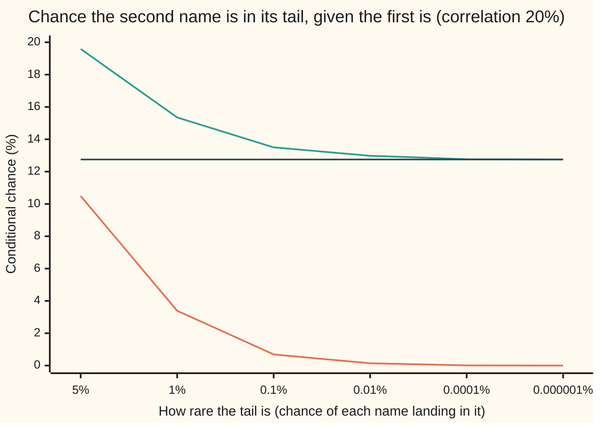

# Tail dependence: the Gaussian copula's calm at the extremes, and the Student-t copula that fails together

[Syllabus](../../../SYLLABUS.md) → [Financial mathematics](../../../SYLLABUS.md#w12) → [Portfolio Credit - Correlation, Copulas, Indices and Tranches](../../../SYLLABUS.md#w12-s45) → Tail dependence

---

## General Overview

Two companies borrow from the same bank: a haulage firm and a builders' merchant. Each has a 5% chance of defaulting over the next five years. Both depend on the same economy, and the bank's risk model links their credit scores with a correlation of 20%.

Ask the model one question: the haulage firm has just defaulted, so how likely is it that the merchant defaults too? The standard model, the Gaussian copula, says 10.5%. A second model, the Student-t copula with four degrees of freedom, keeps each firm's 5% and the same 20% correlation number, and says 19.6%.

Now make the question more extreme. Replace "default" with "falls into its worst one-in-a-million outcome". The Gaussian answer sinks towards zero: disasters there almost never arrive together. The t answer stops sinking and settles near 12.7%. That limiting number is the **tail dependence** of the model: the chance one name is in its worst tail, given the other is, as the tail is pushed all the way out.

This is the difference that mattered in 2008. The safest slices of a pooled loan portfolio lose money only when many loans fail at once. A model that is calm at the extremes calls those slices safer than they are.

**Tail dependence is the limiting chance that one name is in its extreme tail given the other is; it is exactly zero for a Gaussian copula at any correlation below one, and positive for a t copula, so the t model makes joint disasters far more common at the same correlation number.**

**What kind of fact this is:** a definition, with two theorems about it proved on this card in Why it works (zero for the Gaussian copula, a closed formula for the t copula); the copulas themselves are models, assumptions about how defaults cluster, not laws.

### The picture: the conditional chance as the tail gets deeper



Orange: the Gaussian copula, falling to zero. Green: the t copula with four degrees of freedom, levelling off. Dark flat line: the t copula's tail dependence, 12.75%, the level the green line approaches. Both models agree on each name's own chance at every point; they disagree only about the two together.

---

## The formula

Notation first, in words. A **copula** is the part of a model that says how two uncertain quantities move together, stripped of how each one behaves alone ([The one-factor Gaussian copula](02-one-factor-gaussian-copula.md)). Each firm gets a hidden credit score; it defaults when its score falls below a cutoff set so that the default chance is $p$. The joint chance that both default is written $J$. The arrow under "lim" means "let the default chance shrink towards zero and see where the ratio settles".

$$\lambda \;=\; \lim_{p \to 0}\; P(\text{name 2 in its worst } p \mid \text{name 1 in its worst } p) \;=\; \lim_{p\to 0} \frac{J(p)}{p}$$

**Read it aloud:** tail dependence is what the chance of "both, given one" settles to as the tail becomes vanishingly rare.

The two models give:

$$\lambda_{\text{Gauss}} = 0 \quad\text{for every } \rho < 1, \qquad \lambda_{t} \;=\; 2\,t_{\nu+1}\!\left(-\sqrt{\frac{(\nu+1)(1-\rho)}{1+\rho}}\right)$$

**Read it aloud:** the Gaussian copula's tail dependence is zero unless the two scores move in lockstep; the t copula's is twice a t-curve area, taken at a point set by the correlation and the degrees of freedom.

| Symbol | Plain meaning | In our example | Push it up and the answer… |
| --- | --- | --- | --- |
| $p$ | each name's own default chance: the size of the tail | 5% | joint chance rises |
| $\rho$ | the correlation parameter linking the two hidden scores. Say "rho". | 20% | tail dependence rises, reaching 1 at $\rho = 1$ |
| $\nu$ | degrees of freedom of the t copula. Say "nu". Small means heavy tails. | 4 | tail dependence falls; the t copula turns Gaussian as $\nu$ grows |
| $G_1$, $G_2$ | the two names' scores in the Gaussian model: bell-curve draws with correlation $\rho$ | | |
| $V$ | one shared chi-square draw with $\nu$ degrees of freedom; $\sqrt{V/\nu}$ is a common "mood" that stretches or shrinks both scores at once | averages 4 | |
| $Y_1$, $Y_2$ | the scores in the t model: $G_1$ and $G_2$, each divided by the same $\sqrt{V/\nu}$ | | |
| $\Phi$, $t_\nu$ | the bell-curve area to the left of a point, and the t-curve area with $\nu$ degrees of freedom | | |
| $a$, $q$ | the default cutoffs, set so each name's chance is $p$: $a$ on the bell curve, $q$ on the t curve | −1.645 and −2.132 | |
| $M$ | the shared economy factor inside the Gaussian model | | |
| $J$, $J_G$, $J_t$ | the chance that both names default; subscript G for the Gaussian copula, t for the t copula | 0.525% and 0.98% | |
| $\lambda$, $\lambda_t$ | tail dependence (lower tail); $\lambda_t$ for the t copula: the limit of $J/p$. Say "lambda". | 0 and 0.127 | |

The two models built side by side, in one line each:

$$\text{Gaussian: default when } G_i < a = \Phi^{-1}(p), \qquad \text{t: } Y_i = \frac{G_i}{\sqrt{V/\nu}}, \text{ default when } Y_i < q = t_\nu^{-1}(p)$$

$\Phi^{-1}(p)$ is the point with area $p$ to its left; $t_\nu^{-1}(p)$ is the same on the t curve. The cutoffs differ because the t curve has fatter tails; each is chosen so that each firm's own default chance is exactly 5% in both models. Only the "together" changes.

### When it holds

- **A limit, not a finite chance.** $\lambda$ describes vanishingly rare tails. At a real 5% default chance both models give joint defaults; the Gaussian simply gives fewer. Reading 0.127 as "the chance both default" gets 12.7% where the model says 19.6%.
- **One shared mood for both names.** The t copula needs the same $V$ in both denominators. Give each name its own $V$ and the tail dependence is a different number: that is a different model.
- **The correlation is below one.** At $\rho = 1$ the two scores are the same score, and both models give $\lambda = 1$.
- **Continuous scores.** The cutoffs are set on smooth curves, so "the worst $p$" is always a clean tail. With lumpy data, estimating $\lambda$ from the few joint extremes ever observed is unreliable.

---

## Why it works

### Step 0: correlation measures the middle, not the edges

A correlation number is an average over all outcomes, and most outcomes are ordinary. Two models can agree on that average and disagree about the rare corner where both scores are disastrous. Tail dependence looks only at that corner. The whole card is a comparison of how two models fill it.

### Step 1: the Gaussian corner empties

Put both Gaussian scores below a deep cutoff $a$. Then their average is below $a$ too. The average of two bell-curve scores is itself bell-shaped, but with a narrower spread than either score whenever $\rho < 1$: averaging cancels part of each name's own luck. Measured in its own spread units, the average must therefore sit further out than $a$: a factor $\sqrt{2/(1+\rho)}$ further, which exceeds one.

Bell-curve tails fall like $e^{-x^2/2}$. Pushing a cutoff out by a fixed factor above one shrinks the tail chance by a factor that itself goes to zero as $a$ goes deeper. So the joint chance, divided by $p$, goes to zero. The curve in the picture is that squeeze, printed.

<details>
<summary>Detailed proof: the Gaussian limit is zero</summary>

Fix $-1 < \rho < 1$ and a cutoff $a < 0$ with $\Phi(a) = p$. Let $H = (G_1 + G_2)/\sqrt{2(1+\rho)}$. A sum of jointly normal scores is normal; its variance is $2 + 2\rho$, so the sum rescaled is a standard bell-curve draw. If both $G_i \le a$ then $H \le c\,a$ with $c = \sqrt{2/(1+\rho)} > 1$. Hence
$$0 \le \frac{J_G}{p} \le \frac{\Phi(c\,a)}{\Phi(a)}.$$
Write $x = -a$. Integrating the bell curve's tail by parts gives the Mills bounds $\frac{x}{1+x^2}\varphi(x) \le \Phi(-x) \le \frac{\varphi(x)}{x}$ for $x > 0$, where $\varphi(x)$ is the bell curve's height at $x$. So
$$\frac{\Phi(-c\,x)}{\Phi(-x)} \le \frac{1+x^2}{c\,x^2}\, e^{-(c^2-1)x^2/2} \longrightarrow 0 \text{ as } x \to \infty.$$
The ratio is squeezed to zero. At $\rho = -1$ the scores are opposite and never both negative, so the limit is again zero; at $\rho = 1$ they are equal and $J_G = p$, giving one.

</details>

### Step 2: a shared mood keeps the t corner full

The t model divides both scores by the same $\sqrt{V/\nu}$. Most of the time that number is near one and changes little. Occasionally $V$ comes out small, and both scores are stretched outward together. In those draws, a modest bell-curve pair turns into two extreme t scores at once. The deep corner is fed by these shared bad moods, and their frequency does not fade relative to $p$ as the cutoff deepens: both the single tail and the joint tail are fed by the same small-$V$ draws, so they shrink at the same rate. Their ratio settles at a positive number.

That number comes from one fact about the t pair. Given that name 1's score is some value $Y_1 = y$, name 2's score is again t-shaped, now with $\nu + 1$ degrees of freedom, centred at $\rho y$ and with a spread that grows with $|y|$. Deep in the tail the centre and the spread grow at the same rate, so the chance that name 2 is also below the cutoff stops shrinking. That chance, doubled because either name can be the one found first, is the formula.

<details>
<summary>Detailed proof: the t copula's tail dependence</summary>

The t pair has density proportional to $\left[1 + \frac{y_1^2 - 2\rho y_1 y_2 + y_2^2}{\nu(1-\rho^2)}\right]^{-(\nu+2)/2}$. Completing the square, $y_1^2 - 2\rho y_1 y_2 + y_2^2 = (y_2 - \rho y_1)^2 + (1-\rho^2) y_1^2$, and dividing by name 1's own t density shows that, given $Y_1 = y$,
$$\frac{Y_2 - \rho y}{\sqrt{(\nu + y^2)(1-\rho^2)/(\nu+1)}} \ \text{ has the } t_{\nu+1} \text{ law}.$$
Let $B(q) = P(Y_1 \le q,\, Y_2 \le q)$. Differentiating in the shared cutoff and using the symmetry between the names,
$$B'(q) = 2 f_\nu(q)\; t_{\nu+1}\!\left(\frac{(1-\rho)\,q}{\sqrt{(\nu+q^2)(1-\rho^2)/(\nu+1)}}\right),$$
where $f_\nu(q)$ is the t density at $q$. Both $B(q)$ and $t_\nu(q)$ go to zero as $q \to -\infty$, so by l'Hôpital's rule $\lambda = \lim B(q)/t_\nu(q) = \lim B'(q)/f_\nu(q)$. As $q \to -\infty$, $q/\sqrt{\nu+q^2} \to -1$, and the argument tends to $-\sqrt{(\nu+1)(1-\rho)/(1+\rho)}$. The $t_{\nu+1}$ area there is positive for every finite $\nu$ and every $\rho > -1$, which proves $\lambda_t > 0$. As $\nu$ grows, that argument runs off to minus infinity and $\lambda_t$ falls to zero: the t copula turns into the Gaussian one.

</details>

### Step 3: finite joint chances, computed exactly

The limit is a summary. A bank needs the joint chance at its own $p$. Both models give it as a one-dimensional integral. Write the correlated pair in polar form: a random direction, spread evenly round the circle, times a random length. For two bell-curve scores the length's tail is $e^{-r^2/2}$; for the t pair, after dividing by the shared mood, it is $(1 + r^2/\nu)^{-\nu/2}$, a much heavier tail. Both names are below the cutoff when the direction points into the bad quarter and the length is long enough. Averaging over directions gives $J_G$ and $J_t$ exactly; that is road one in the code.

<details>
<summary>The angle integral in full</summary>

With $\alpha = \arccos\rho$ and $m(\theta) = \min(-\cos\theta,\, -\cos(\theta-\alpha))$, the scores are $G_1 = R\cos\Theta$ and $G_2 = R\cos(\Theta - \alpha)$ for a uniform angle and a length with $P(R > r) = e^{-r^2/2}$. Both lie below a negative cutoff exactly when $\pi/2 + \alpha < \theta < 3\pi/2$ and $R \ge |{\rm cutoff}|/m(\theta)$. So
$$J_G = \frac{1}{2\pi}\int_{\pi/2+\alpha}^{3\pi/2} e^{-a^2/(2m(\theta)^2)}\,d\theta, \qquad J_t = \frac{1}{2\pi}\int_{\pi/2+\alpha}^{3\pi/2} \left(1 + \frac{q^2}{\nu\, m(\theta)^2}\right)^{-\nu/2} d\theta.$$
The t length is $R\sqrt{\nu/V}$; averaging $e^{-s^2 V/(2\nu)}$ over the chi-square law of $V$ gives $(1 + s^2/\nu)^{-\nu/2}$.

</details>

Road two conditions on the economy instead, as the one-factor card does: given the shared factor $M$, the two names default independently, so $J_G$ is the average over $M$ of the conditional default chance squared. For the t model the same average is taken again over the shared mood $V$. Road three simulates 400,000 pairs with home-made random numbers and counts.

### Step 4: from a pair to a pool

A senior tranche of a loan pool loses money only when a large share of the pool defaults ([Tranches](05-cdo-tranches-in-outline.md)). In a large pool, once the economy and the mood are known, the fraction that defaults is just the conditional default chance. In the Gaussian model that gives Vasicek's curve ([Vasicek's large-pool loss curve](03-vasicek-loss-distribution-and-basel-capital.md)):

$$P(\text{default fraction} > x) = \Phi\!\left(\frac{a - \sqrt{1-\rho}\,\Phi^{-1}(x)}{\sqrt{\rho}}\right).$$

In the t model every name shares the mood, so the cutoff $a$ becomes $q\sqrt{V/\nu}$ and the right side is averaged over $V$. The pair's tail dependence becomes the pool's fat tail: a bad mood pushes the whole pool towards its cutoffs at once.

The double-t copula used on some trading desks is a different construction: it gives the economy factor and each name's own shock separate t tails. It shares the point of this card, heavier joint tails at a given correlation, but not its formula.

---

## Worked numbers, by hand

Two names, each with a 5% five-year default chance, score correlation 20%, t copula with four degrees of freedom.

| Step | Arithmetic | Value |
| --- | --- | --- |
| inside the root | $(4+1)(1-0.20)/(1+0.20) = 5 \times 0.8 / 1.2$ | 3.3333 |
| the t point | $-\sqrt{3.3333}$ | −1.8257 |
| t area, 5 degrees of freedom | $t_5(-1.8257)$ from a t table | 0.06373 |
| **tail dependence, t** | $2 \times 0.06373$ | **0.1275** |
| tail dependence, Gaussian | $\rho < 1$ | **0** |
| Gaussian cutoff | $\Phi^{-1}(0.05)$ | −1.645 |
| t cutoff | $t_4^{-1}(0.05)$ | −2.132 |
| joint default if independent | $0.05 \times 0.05$ | 0.25% |
| joint default, Gaussian | angle integral | 0.525% |
| joint default, t | angle integral | 0.98% |
| both given one | $J/p$: $0.525/5$ and $0.98/5$ | 10.5% and 19.6% |
| default correlation | $(J - p^2)/(p(1-p))$ | 0.058 and 0.154 |

The Gaussian row reproduces the shelf's house pool: joint default 0.525% and default correlation 0.058 at a 5% default chance and 20% asset correlation ([Default correlation](01-default-correlation-and-joint-default.md)). The t copula nearly doubles the joint default at the same correlation number, and nearly triples the default correlation.

```
joint default chance, two names at 5% each, correlation 20% (per cent)
independent      ████████████                              0.25
Gaussian copula  █████████████████████████                 0.52
t copula, 4 df   ███████████████████████████████████████   0.98
```

Pushed deeper, the gap widens without limit. At a one-in-a-thousand tail the t model's conditional chance is 19.6 times the Gaussian one; at one in a million it is 2,061 times. The Gaussian ratio falls towards zero while the t ratio settles at 0.1275.

**In a large pool** with the same inputs, take a senior layer that loses once a quarter of the loans default: a 15% pool loss at 40% recovery. The Gaussian copula puts that event at 0.99%. The t copula puts it at 4.17%, 4.2 times as likely, with every loan's own default chance still 5%.

### What breaks if you drop a piece

| Mistake | Comes out at | What went wrong |
| --- | --- | --- |
| Using the bell-curve cutoff −1.645 inside the t model | each name's default chance 8.77%, joint 2.00% | The t curve has fatter tails; each name needs the t cutoff −2.132 to keep its 5% |
| Reading the 20% asset correlation as default correlation | 0.20 | Default correlation is 0.058 (Gaussian) or 0.154 (t) |
| Reading $\lambda$ as the chance at 5% | 12.7% | The t model's "both given one" at 5% is 19.6%; $\lambda$ is a limit |
| Assuming any t copula has heavy joint tails | 30 degrees of freedom: $\lambda$ = 0.00008 | Tail dependence fades fast as degrees of freedom grow |

The code prints every entry.

---

## Code, from first principles, and it actually runs

Nothing imported knows the answer. The bell-curve area is a series near the middle and a continued fraction in the tails; the t curves are closed forms plus a Simpson area; cutoffs come from bisection; random numbers from a written-out splitmix64 generator. Tail dependence is reached by three roads: the closed formula, a Simpson area of the t curve, and the finite ratio $J/p$ pushed to a one-in-a-hundred-million tail. The joint chances are reached by three roads: the angle integral, conditioning on the economy (and the mood), and simulation. The pool's senior tail is integrated in two orders, over the mood first and over the economy first. One published number anchors the t integral from outside: Demarta and McNeil's table puts the t joint chance at 2.79 times the Gaussian one at 50% correlation and a 0.5% tail.

### Python

```python
# Tail dependence and the t copula -- the check behind the card.  Standard library
# only, and nothing imported knows the answer: the normal and t curves, the root
# finder, the integrals and the random numbers are all written out below.
from math import sqrt, exp, log, pi, cos, sin, atan, acos
def Phi(x):                                  # normal CDF: series near 0, continued fraction in the tail
    if abs(x) < 3.0:
        term, total, n = x, x, 0
        while abs(term) > 1e-17 * abs(total) + 1e-300:
            n += 1
            term *= x * x / (2 * n + 1)
            total += term
        return 0.5 + total * exp(-0.5 * x * x) / sqrt(2 * pi)
    z = abs(x); f = z                        # Mills ratio by backward continued fraction
    for k in range(200, 0, -1):
        f = z + k / f
    tail = exp(-0.5 * z * z) / sqrt(2 * pi) / f
    return tail if x < 0 else 1.0 - tail
def bisect(F, p, lo, hi):                    # root finder: F increasing, F(root) = p
    for _ in range(200):
        mid = 0.5 * (lo + hi)
        lo, hi = (mid, hi) if F(mid) < p else (lo, mid)
    return 0.5 * (lo + hi)
def t4_cdf(x):                               # Student t, 4 degrees of freedom, closed form
    r = sqrt(4.0 + x * x)
    one_plus_u = 4.0 / (r * (r - x)) if x < 0 else 1.0 + x / r
    return one_plus_u ** 2 * (2.0 - (one_plus_u - 1.0)) / 4.0
def t5_cdf(x):                               # Student t, 5 degrees of freedom, closed form
    th = atan(x / sqrt(5.0))
    return 0.5 + (th + sin(th) * cos(th) * (1.0 + 2.0 / 3.0 * cos(th) ** 2)) / pi
def simpson(f, a, b, n):
    h = (b - a) / n
    s = f(a) + f(b) + sum((4 if i % 2 else 2) * f(a + i * h) for i in range(1, n))
    return s * h / 3.0
def t_cdf_by_area(n, x):                     # any t curve as an area, substituting v = y / sqrt(n + y^2)
    f = lambda v: (1.0 - v * v) ** ((n - 2) / 2)
    return simpson(f, -1.0, x / sqrt(n + x * x), 4000) / simpson(f, -1.0, 1.0, 4000)
def joint_by_angle(cut, rho, student, n=20000):   # road 1: both scores below cut, as a 1-D angle integral
    al = acos(rho)
    def k(th):
        m = min(-cos(th), -cos(th - al))
        if m <= 0.0: return 0.0
        s = cut * cut / (m * m)
        return (1.0 + s / 4.0) ** -2.0 if student else exp(-0.5 * s)
    return simpson(k, pi / 2 + al, 1.5 * pi, n) / (2 * pi)
def phi(m): return exp(-0.5 * m * m) / sqrt(2 * pi)
def joint_by_factor(cut, rho, n=400):        # road 2: condition on the shared economy M
    b = sqrt(1.0 - rho)
    return simpson(lambda m: Phi((cut - sqrt(rho) * m) / b) ** 2 * phi(m), -9.0, 9.0, n)
def joint_t_by_factor(q, rho):               # road 2 for t: also average over the shared scale V = w^2
    return simpson(lambda w: w ** 3 * exp(-w * w / 2) / 2 * joint_by_factor(q * w / 2, rho, 200), 0.0, 12.0, 400)
state = [0x9E3779B97F4A7C15]
def uniform():                               # road 3: splitmix64 random numbers, written out
    state[0] = (state[0] + 0x9E3779B97F4A7C15) & 0xFFFFFFFFFFFFFFFF
    z = state[0]
    z = ((z ^ (z >> 30)) * 0xBF58476D1CE4E5B9) & 0xFFFFFFFFFFFFFFFF
    z = ((z ^ (z >> 27)) * 0x94D049BB133111EB) & 0xFFFFFFFFFFFFFFFF
    return ((z ^ (z >> 31)) >> 11) / 9007199254740992.0 + 1e-18
rho, p = 0.20, 0.05
lam_closed = 2.0 * t5_cdf(-sqrt(5.0 * (1.0 - rho) / (1.0 + rho)))
lam = lambda nu, r=rho: 2.0 * t_cdf_by_area(nu + 1, -sqrt((nu + 1) * (1.0 - r) / (1.0 + r)))
lam_area = lam(4)
a, q = bisect(Phi, p, -40.0, 0.0), bisect(t4_cdf, p, -1e6, 0.0)
jg1, jt1 = joint_by_angle(a, rho, False), joint_by_angle(q, rho, True)
jg2, jt2 = joint_by_factor(a, rho), joint_t_by_factor(q, rho)
draws, hit_g, hit_t = 400000, 0, 0
for _ in range(draws):                       # simulate the pair: two normals, one shared chi-square(4)
    r, th = sqrt(-2.0 * log(uniform())), 2.0 * pi * uniform()
    g1, g2 = r * cos(th), rho * r * cos(th) + sqrt(1 - rho * rho) * r * sin(th)
    s = sqrt(-2.0 * log(uniform() * uniform()) / 4.0)
    hit_g += (g1 < a and g2 < a); hit_t += (g1 / s < q and g2 / s < q)
mc_g, mc_t = hit_g / draws, hit_t / draws
dc = lambda j: (j - p * p) / (p * (1 - p))   # default correlation from a joint chance

print(f"rho {rho:.2f}, degrees of freedom 4, default chance each p = {p:.2f}")
print(f"lambda, Gaussian: 0 for every rho below 1")
print(f"lambda, t4, closed form        {lam_closed:.6f}")
print(f"lambda, t4, by area            {lam_area:.6f}")
arg = sqrt(5.0 * (1.0 - rho) / (1.0 + rho))
print(f"lambda pieces: 5(1-rho)/(1+rho), root, t5 area  {arg * arg:.6f} {arg:.6f} {t5_cdf(-arg):.6f}")
print(f"cutoff, normal  a = Phi^-1(p)  {a:.6f}")
print(f"cutoff, t4      q = t4^-1(p)   {q:.6f}")
print(f"joint, Gaussian, by angle      {jg1:.6f}")
print(f"joint, Gaussian, by factor     {jg2:.6f}")
print(f"joint, Gaussian, simulated     {mc_g:.6f}   ({hit_g} of {draws})")
print(f"joint, t4, by angle            {jt1:.6f}")
print(f"joint, t4, by factor and scale {jt2:.6f}")
print(f"joint, t4, simulated           {mc_t:.6f}   ({hit_t} of {draws})")
print(f"joint if independent, p*p      {p * p:.6f}")
print(f"default correlation, Gaussian  {dc(jg1):.6f}")
print(f"default correlation, t4        {dc(jt1):.6f}")
print(f"both | one, Gaussian, J/p      {jg1 / p:.6f}")
print(f"both | one, t4, J/p            {jt1 / p:.6f}")
print()
print("threshold p    Gaussian J/p   t4 J/p     t4/Gaussian")
cond = {}
for pp in (0.05, 0.01, 1e-3, 1e-4, 1e-6, 1e-8):
    aa, qq = bisect(Phi, pp, -40.0, 0.0), bisect(t4_cdf, pp, -1e6, 0.0)
    g, t = joint_by_angle(aa, rho, False) / pp, joint_by_angle(qq, rho, True) / pp
    cond[pp] = (g, t)
    print(f"{pp:<12.0e}   {g:.6f}       {t:.6f}   {t / g:10.2f}")
print("chart, Gaussian %  " + " ".join(f"{100 * cond[x][0]:.2f}" for x in cond))
print("chart, t4 %        " + " ".join(f"{100 * cond[x][1]:.2f}" for x in cond))
print("chart, t4 limit %  " + " ".join(f"{100 * lam_closed:.2f}" for x in cond))
print()
x_sen = 0.25                                 # senior layer: hit when a quarter of a large pool defaults
c = sqrt(1 - rho) * bisect(Phi, x_sen, -40.0, 40.0)
sen_g = Phi((a - c) / sqrt(rho))                  # Vasicek's curve
sen_t1 = simpson(lambda v: v * exp(-v / 2) / 4 * Phi((q * sqrt(v / 4) - c) / sqrt(rho)), 0.0, 70.0, 2000)
def v_below(m):                              # chance the scale V is small enough, for economy M = m
    z = c + sqrt(rho) * m
    if z >= 0: return 0.0
    w = 4.0 * (z / q) ** 2
    return 1.0 - exp(-w / 2) * (1 + w / 2)
sen_t2 = simpson(lambda m: phi(m) * v_below(m), -9.0, 9.0, 4000)
print(f"senior trigger: default fraction, loss at 40% recovery  {x_sen:.6f} {x_sen * 0.6:.6f}")
print(f"large pool, P(quarter default), Gaussian       {sen_g:.6f}")
print(f"large pool, P(quarter default), t4, over V     {sen_t1:.6f}")
print(f"large pool, P(quarter default), t4, over M     {sen_t2:.6f}")
print(f"large pool, t4 / Gaussian                      {sen_t1 / sen_g:.2f}")
print()
wrong_q = joint_by_angle(a, rho, True)       # t model fed the normal cutoff
print(f"wrong: normal cutoff in the t model, marginal  {t4_cdf(a):.6f}")
print(f"wrong: normal cutoff in the t model, joint     {wrong_q:.6f}")
print(f"wrong: rho read as default correlation         {rho:.6f}")
print(f"wrong: lambda read as the p = 5% chance        {jt1 / p:.6f}")
print(f"wrong: 30 degrees of freedom, lambda           {lam(30):.6f}")
print(f"try: lambda, t4, rho 0 / rho 0.5 / nu 10       {lam(4, 0.0):.6f} {lam(4, 0.5):.6f} {lam(10):.6f}")

assert abs(lam_closed - lam_area) < 1e-9,                    "two roads to lambda"
assert abs(cond[1e-8][1] - lam_closed) < 2e-3,               "deep finite threshold lands on the limit"
assert cond[1e-8][0] < 0.01 < cond[0.05][0],                 "Gaussian conditional chance drains away"
assert abs(jg1 - 0.00525) < 1e-5,                            "the shelf's house number, 0.525%"
assert abs(jg1 - jg2) < 1e-7,                                "Gaussian joint, angle vs factor"
assert abs(jt1 - jt2) < 1e-6,                                "t joint, angle vs factor-and-scale"
assert abs(mc_g - jg1) < 4 * sqrt(jg1 / draws),              "Gaussian simulation within 4 errors"
assert abs(mc_t - jt1) < 4 * sqrt(jt1 / draws),              "t simulation within 4 errors"
assert abs(sen_t1 - sen_t2) < 1e-6,                          "senior tail, two orders of integration"
assert abs(joint_by_angle(bisect(t4_cdf, 0.005, -1e6, 0.0), 0.5, True) / joint_by_angle(bisect(Phi, 0.005, -40.0, 0.0), 0.5, False) - 2.79) < 0.01, "Demarta-McNeil table: 2.79"
print("ALL CHECKS PASS")
```

**Ran 2026-09-28 on macOS, Python 3.14.6, standard library only. All checks passed. Output, pasted from the run:**

```
rho 0.20, degrees of freedom 4, default chance each p = 0.05
lambda, Gaussian: 0 for every rho below 1
lambda, t4, closed form        0.127464
lambda, t4, by area            0.127464
lambda pieces: 5(1-rho)/(1+rho), root, t5 area  3.333333 1.825742 0.063732
cutoff, normal  a = Phi^-1(p)  -1.644854
cutoff, t4      q = t4^-1(p)   -2.131847
joint, Gaussian, by angle      0.005245
joint, Gaussian, by factor     0.005245
joint, Gaussian, simulated     0.005220   (2088 of 400000)
joint, t4, by angle            0.009796
joint, t4, by factor and scale 0.009796
joint, t4, simulated           0.009997   (3999 of 400000)
joint if independent, p*p      0.002500
default correlation, Gaussian  0.057799
default correlation, t4        0.153592
both | one, Gaussian, J/p      0.104909
both | one, t4, J/p            0.195912

threshold p    Gaussian J/p   t4 J/p     t4/Gaussian
5e-02          0.104909       0.195912         1.87
1e-02          0.033892       0.153507         4.53
1e-03          0.006890       0.135033        19.60
1e-04          0.001422       0.129796        91.30
1e-06          0.000062       0.127695      2061.20
1e-08          0.000003       0.127487     46417.46
chart, Gaussian %  10.49 3.39 0.69 0.14 0.01 0.00
chart, t4 %        19.59 15.35 13.50 12.98 12.77 12.75
chart, t4 limit %  12.75 12.75 12.75 12.75 12.75 12.75

senior trigger: default fraction, loss at 40% recovery  0.250000 0.150000
large pool, P(quarter default), Gaussian       0.009929
large pool, P(quarter default), t4, over V     0.041697
large pool, P(quarter default), t4, over M     0.041698
large pool, t4 / Gaussian                      4.20

wrong: normal cutoff in the t model, marginal  0.087673
wrong: normal cutoff in the t model, joint     0.019957
wrong: rho read as default correlation         0.200000
wrong: lambda read as the p = 5% chance        0.195912
wrong: 30 degrees of freedom, lambda           0.000079
try: lambda, t4, rho 0 / rho 0.5 / nu 10       0.075587 0.253170 0.020363
ALL CHECKS PASS
```

### Rust

Same numbers, same labels, built with `rustc --edition 2021 -O`.

```rust
// Tail dependence and the t copula -- the same check as the Python, in Rust.  No
// crates: the normal and t curves, the root finder, the integrals and the random
// numbers are all written out below.
use std::f64::consts::PI;
fn big_phi(x: f64) -> f64 {                      // normal CDF: series near 0, continued fraction in the tail
    if x.abs() < 3.0 {
        let (mut term, mut total, mut n) = (x, x, 0.0);
        while term.abs() > 1e-17 * total.abs() + 1e-300 {
            n += 1.0;
            term *= x * x / (2.0 * n + 1.0);
            total += term;
        }
        return 0.5 + total * (-0.5 * x * x).exp() / (2.0 * PI).sqrt();
    }
    let z = x.abs();
    let mut f = z;                               // Mills ratio by backward continued fraction
    for k in (1..=200).rev() { f = z + k as f64 / f; }
    let tail = (-0.5 * z * z).exp() / (2.0 * PI).sqrt() / f;
    if x < 0.0 { tail } else { 1.0 - tail }
}
fn bisect(f: &dyn Fn(f64) -> f64, p: f64, mut lo: f64, mut hi: f64) -> f64 {
    for _ in 0..200 {                            // root finder: f increasing, f(root) = p
        let mid = 0.5 * (lo + hi);
        if f(mid) < p { lo = mid } else { hi = mid }
    }
    0.5 * (lo + hi)
}
fn t4_cdf(x: f64) -> f64 {                       // Student t, 4 degrees of freedom, closed form
    let r = (4.0 + x * x).sqrt();
    let opu = if x < 0.0 { 4.0 / (r * (r - x)) } else { 1.0 + x / r };
    opu.powi(2) * (2.0 - (opu - 1.0)) / 4.0
}
fn t5_cdf(x: f64) -> f64 {                       // Student t, 5 degrees of freedom, closed form
    let th = (x / 5f64.sqrt()).atan();
    0.5 + (th + th.sin() * th.cos() * (1.0 + 2.0 / 3.0 * th.cos().powi(2))) / PI
}
fn simpson(f: &dyn Fn(f64) -> f64, a: f64, b: f64, n: usize) -> f64 {
    let h = (b - a) / n as f64;
    let mut s = 0.0;
    for i in 1..n { s += (if i % 2 == 1 { 4.0 } else { 2.0 }) * f(a + i as f64 * h); }
    (f(a) + f(b) + s) * h / 3.0
}
fn t_cdf_by_area(n: f64, x: f64) -> f64 {        // any t curve as an area, substituting v = y / sqrt(n + y^2)
    let f = |v: f64| (1.0 - v * v).powf((n - 2.0) / 2.0);
    simpson(&f, -1.0, x / (n + x * x).sqrt(), 4000) / simpson(&f, -1.0, 1.0, 4000)
}
fn joint_by_angle(cut: f64, rho: f64, student: bool) -> f64 {   // road 1: a 1-D angle integral
    let al = rho.acos();
    let k = |th: f64| {
        let m = (-th.cos()).min(-(th - al).cos());
        if m <= 0.0 { return 0.0; }
        let s = cut * cut / (m * m);
        if student { (1.0 + s / 4.0).powf(-2.0) } else { (-0.5 * s).exp() }
    };
    simpson(&k, PI / 2.0 + al, 1.5 * PI, 20000) / (2.0 * PI)
}
fn phi(m: f64) -> f64 { (-0.5 * m * m).exp() / (2.0 * PI).sqrt() }
fn joint_by_factor(cut: f64, rho: f64, n: usize) -> f64 {       // road 2: condition on the economy M
    let b = (1.0 - rho).sqrt();
    simpson(&|m: f64| big_phi((cut - rho.sqrt() * m) / b).powi(2) * phi(m), -9.0, 9.0, n)
}
fn joint_t_by_factor(q: f64, rho: f64) -> f64 {  // road 2 for t: also average over the scale V = w^2
    simpson(&|w: f64| w.powi(3) * (-w * w / 2.0).exp() / 2.0 * joint_by_factor(q * w / 2.0, rho, 200), 0.0, 12.0, 400)
}
struct Rng(u64);
impl Rng {                                       // road 3: splitmix64 random numbers, written out
    fn uniform(&mut self) -> f64 {
        self.0 = self.0.wrapping_add(0x9E3779B97F4A7C15);
        let mut z = self.0;
        z = (z ^ (z >> 30)).wrapping_mul(0xBF58476D1CE4E5B9);
        z = (z ^ (z >> 27)).wrapping_mul(0x94D049BB133111EB);
        ((z ^ (z >> 31)) >> 11) as f64 / 9007199254740992.0 + 1e-18
    }
}
fn main() {
    let (rho, p) = (0.20_f64, 0.05_f64);
    let lam_closed = 2.0 * t5_cdf(-(5.0 * (1.0 - rho) / (1.0 + rho)).sqrt());
    let lam = |nu: f64, r: f64| 2.0 * t_cdf_by_area(nu + 1.0, -((nu + 1.0) * (1.0 - r) / (1.0 + r)).sqrt());
    let lam_area = lam(4.0, rho);
    let (a, q) = (bisect(&big_phi, p, -40.0, 0.0), bisect(&t4_cdf, p, -1e6, 0.0));
    let (jg1, jt1) = (joint_by_angle(a, rho, false), joint_by_angle(q, rho, true));
    let (jg2, jt2) = (joint_by_factor(a, rho, 400), joint_t_by_factor(q, rho));
    let (draws, mut hit_g, mut hit_t) = (400000usize, 0usize, 0usize);
    let mut rng = Rng(0x9E3779B97F4A7C15);
    for _ in 0..draws {                          // simulate the pair: two normals, one shared chi-square(4)
        let r = (-2.0 * rng.uniform().ln()).sqrt();
        let th = 2.0 * PI * rng.uniform();
        let (g1, g2) = (r * th.cos(), rho * r * th.cos() + (1.0 - rho * rho).sqrt() * r * th.sin());
        let s = (-2.0 * (rng.uniform() * rng.uniform()).ln() / 4.0).sqrt();
        if g1 < a && g2 < a { hit_g += 1 }
        if g1 / s < q && g2 / s < q { hit_t += 1 }
    }
    let (mc_g, mc_t) = (hit_g as f64 / draws as f64, hit_t as f64 / draws as f64);
    let dc = |j: f64| (j - p * p) / (p * (1.0 - p));   // default correlation from a joint chance
    println!("rho {:.2}, degrees of freedom 4, default chance each p = {:.2}", rho, p);
    println!("lambda, Gaussian: 0 for every rho below 1");
    println!("lambda, t4, closed form        {:.6}", lam_closed);
    println!("lambda, t4, by area            {:.6}", lam_area);
    let arg = (5.0 * (1.0 - rho) / (1.0 + rho)).sqrt();
    println!("lambda pieces: 5(1-rho)/(1+rho), root, t5 area  {:.6} {:.6} {:.6}", arg * arg, arg, t5_cdf(-arg));
    println!("cutoff, normal  a = Phi^-1(p)  {:.6}", a);
    println!("cutoff, t4      q = t4^-1(p)   {:.6}", q);
    println!("joint, Gaussian, by angle      {:.6}", jg1);
    println!("joint, Gaussian, by factor     {:.6}", jg2);
    println!("joint, Gaussian, simulated     {:.6}   ({} of {})", mc_g, hit_g, draws);
    println!("joint, t4, by angle            {:.6}", jt1);
    println!("joint, t4, by factor and scale {:.6}", jt2);
    println!("joint, t4, simulated           {:.6}   ({} of {})", mc_t, hit_t, draws);
    println!("joint if independent, p*p      {:.6}", p * p);
    println!("default correlation, Gaussian  {:.6}", dc(jg1));
    println!("default correlation, t4        {:.6}", dc(jt1));
    println!("both | one, Gaussian, J/p      {:.6}", jg1 / p);
    println!("both | one, t4, J/p            {:.6}", jt1 / p);
    println!();
    println!("threshold p    Gaussian J/p   t4 J/p     t4/Gaussian");
    let (labels, pps) = (["5e-02", "1e-02", "1e-03", "1e-04", "1e-06", "1e-08"], [0.05, 0.01, 1e-3, 1e-4, 1e-6, 1e-8]);
    let mut cond: Vec<(f64, f64)> = Vec::new();
    for (lab, &pp) in labels.iter().zip(pps.iter()) {
        let (aa, qq) = (bisect(&big_phi, pp, -40.0, 0.0), bisect(&t4_cdf, pp, -1e6, 0.0));
        let (g, t) = (joint_by_angle(aa, rho, false) / pp, joint_by_angle(qq, rho, true) / pp);
        cond.push((g, t));
        println!("{:<12}   {:.6}       {:.6}   {:10.2}", lab, g, t, t / g);
    }
    let row = |k: usize| cond.iter().map(|c| format!("{:.2}", 100.0 * if k == 0 { c.0 } else { c.1 })).collect::<Vec<_>>().join(" ");
    println!("chart, Gaussian %  {}", row(0));
    println!("chart, t4 %        {}", row(1));
    println!("chart, t4 limit %  {}", cond.iter().map(|_| format!("{:.2}", 100.0 * lam_closed)).collect::<Vec<_>>().join(" "));
    println!();
    let c = (1.0 - rho).sqrt() * bisect(&big_phi, 0.25, -40.0, 40.0);   // a quarter of a large pool defaults
    let sen_g = big_phi((a - c) / rho.sqrt());                           // Vasicek's curve
    let sen_t1 = simpson(&|v: f64| v * (-v / 2.0).exp() / 4.0 * big_phi((q * (v / 4.0).sqrt() - c) / rho.sqrt()), 0.0, 70.0, 2000);
    let v_below = |m: f64| {                     // chance the scale V is small enough, for economy M = m
        let z = c + rho.sqrt() * m;
        if z >= 0.0 { return 0.0; }
        let w = 4.0 * (z / q).powi(2);
        1.0 - (-w / 2.0).exp() * (1.0 + w / 2.0)
    };
    let sen_t2 = simpson(&|m: f64| phi(m) * v_below(m), -9.0, 9.0, 4000);
    println!("senior trigger: default fraction, loss at 40% recovery  {:.6} {:.6}", 0.25, 0.25 * 0.6);
    println!("large pool, P(quarter default), Gaussian       {:.6}", sen_g);
    println!("large pool, P(quarter default), t4, over V     {:.6}", sen_t1);
    println!("large pool, P(quarter default), t4, over M     {:.6}", sen_t2);
    println!("large pool, t4 / Gaussian                      {:.2}", sen_t1 / sen_g);
    println!();
    let wrong_q = joint_by_angle(a, rho, true);  // t model fed the normal cutoff
    println!("wrong: normal cutoff in the t model, marginal  {:.6}", t4_cdf(a));
    println!("wrong: normal cutoff in the t model, joint     {:.6}", wrong_q);
    println!("wrong: rho read as default correlation         {:.6}", rho);
    println!("wrong: lambda read as the p = 5% chance        {:.6}", jt1 / p);
    println!("wrong: 30 degrees of freedom, lambda           {:.6}", lam(30.0, rho));
    println!("try: lambda, t4, rho 0 / rho 0.5 / nu 10       {:.6} {:.6} {:.6}", lam(4.0, 0.0), lam(4.0, 0.5), lam(10.0, rho));
    assert!((lam_closed - lam_area).abs() < 1e-9, "two roads to lambda");
    assert!((cond[5].1 - lam_closed).abs() < 2e-3, "deep finite threshold lands on the limit");
    assert!(cond[5].0 < 0.01 && 0.01 < cond[0].0, "Gaussian conditional chance drains away");
    assert!((jg1 - 0.00525).abs() < 1e-5, "the shelf's house number, 0.525%");
    assert!((jg1 - jg2).abs() < 1e-7, "Gaussian joint, angle vs factor");
    assert!((jt1 - jt2).abs() < 1e-6, "t joint, angle vs factor-and-scale");
    assert!((mc_g - jg1).abs() < 4.0 * (jg1 / draws as f64).sqrt(), "Gaussian simulation within 4 errors");
    assert!((mc_t - jt1).abs() < 4.0 * (jt1 / draws as f64).sqrt(), "t simulation within 4 errors");
    assert!((sen_t1 - sen_t2).abs() < 1e-6, "senior tail, two orders of integration");
    assert!((joint_by_angle(bisect(&t4_cdf, 0.005, -1e6, 0.0), 0.5, true) / joint_by_angle(bisect(&big_phi, 0.005, -40.0, 0.0), 0.5, false) - 2.79).abs() < 0.01, "Demarta-McNeil table: 2.79");
    println!("ALL CHECKS PASS");
}
```

**Ran 2026-09-28 on macOS, rustc 1.98.1, no crates. All checks passed. Output, pasted from the run:**

```
rho 0.20, degrees of freedom 4, default chance each p = 0.05
lambda, Gaussian: 0 for every rho below 1
lambda, t4, closed form        0.127464
lambda, t4, by area            0.127464
lambda pieces: 5(1-rho)/(1+rho), root, t5 area  3.333333 1.825742 0.063732
cutoff, normal  a = Phi^-1(p)  -1.644854
cutoff, t4      q = t4^-1(p)   -2.131847
joint, Gaussian, by angle      0.005245
joint, Gaussian, by factor     0.005245
joint, Gaussian, simulated     0.005220   (2088 of 400000)
joint, t4, by angle            0.009796
joint, t4, by factor and scale 0.009796
joint, t4, simulated           0.009997   (3999 of 400000)
joint if independent, p*p      0.002500
default correlation, Gaussian  0.057799
default correlation, t4        0.153592
both | one, Gaussian, J/p      0.104909
both | one, t4, J/p            0.195912

threshold p    Gaussian J/p   t4 J/p     t4/Gaussian
5e-02          0.104909       0.195912         1.87
1e-02          0.033892       0.153507         4.53
1e-03          0.006890       0.135033        19.60
1e-04          0.001422       0.129796        91.30
1e-06          0.000062       0.127695      2061.20
1e-08          0.000003       0.127487     46417.46
chart, Gaussian %  10.49 3.39 0.69 0.14 0.01 0.00
chart, t4 %        19.59 15.35 13.50 12.98 12.77 12.75
chart, t4 limit %  12.75 12.75 12.75 12.75 12.75 12.75

senior trigger: default fraction, loss at 40% recovery  0.250000 0.150000
large pool, P(quarter default), Gaussian       0.009929
large pool, P(quarter default), t4, over V     0.041697
large pool, P(quarter default), t4, over M     0.041698
large pool, t4 / Gaussian                      4.20

wrong: normal cutoff in the t model, marginal  0.087673
wrong: normal cutoff in the t model, joint     0.019957
wrong: rho read as default correlation         0.200000
wrong: lambda read as the p = 5% chance        0.195912
wrong: 30 degrees of freedom, lambda           0.000079
try: lambda, t4, rho 0 / rho 0.5 / nu 10       0.075587 0.253170 0.020363
ALL CHECKS PASS
```

The two outputs match line for line, including the simulation counts, since both languages run the same generator.

> [!TIP]
> **Try changing**
> Guess first, then read the last printed line or edit the call.
> - **No correlation at all.** Guess the t copula's tail dependence at $\rho = 0$. It is 0.0756, not zero: the shared mood alone makes disasters arrive together.
> - **Correlation 50%.** Guess first. $\lambda$ rises to 0.2532.
> - **Ten degrees of freedom.** Lighter tails: $\lambda$ falls to 0.0204, a sixth of the four-degree value.
> - **Independent moods.** In the simulation, draw a fresh `s` for each name. The t joint count drops and the t simulation assert stops the run: the shared mood was the whole effect.

---

## The usual mistake

> [!warning]
> **Believing the correlation number sets how often names fail together in a crisis.** Two models with the same 20% correlation and the same 5% default chances disagree about the joint extreme by a factor of 1.87 at 5%, 19.6 at one in a thousand and 2,061 at one in a million. Correlation summarises the middle; the copula decides the corner.
>
> - **"Zero tail dependence means no joint defaults."** The Gaussian copula still gives joint defaults of 0.525% at a 5% default chance. Zero is the limit of the ratio, not the chance.
> - **Mixing cutoffs.** Feeding the bell-curve cutoff into the t model raises each name's default chance to 8.77% and the joint chance to 2.00%: the "fat tails" were bought by changing the single names.
> - **Asset correlation read as default correlation.** 0.20 in, 0.058 out under the Gaussian copula.
> - **Any t copula is a fat-tailed one.** At 30 degrees of freedom the tail dependence is 0.00008, close to Gaussian.

---

## Where you meet it in real life

- **Senior CDO tranches in 2008.** A senior tranche is hit only when many loans default together. The Financial Crisis Inquiry Commission found that rating agencies had little data to estimate default correlation among mortgage securities, made choices that lowered it, and that the securities turned out far more correlated than estimated. A copula with no tail dependence understates exactly that event.
- **Tranche pricing and the correlation smile.** A single Gaussian correlation cannot fit every tranche's market price; the implied numbers vary by tranche ([Implied correlation](06-implied-and-base-correlation.md)). Fatter-tailed copulas were one response.
- **Bank capital.** The Basel formula uses the Gaussian one-factor model at a 99.9% level ([Vasicek's large-pool loss curve](03-vasicek-loss-distribution-and-basel-capital.md)); that model has no tail dependence, so joint disasters enter the capital number only through the correlation and the 99.9% level the regulator chose.
- **Market risk and insurance.** Stock returns and insurance claims show the same pattern: crashes arrive together more often than a Gaussian model allows. The t copula is a standard tool in risk management for this.

> **Say it back**
> Tail dependence is the chance that one name is in its worst tail given the other is, as the tail becomes vanishingly rare. For the Gaussian copula it is zero at any correlation below one, because a deep joint loss needs an average score even deeper than either alone. The t copula divides both scores by one shared mood, so bad moods push both into the tail together, and the limit stays positive: 0.127 at 20% correlation and four degrees of freedom. At a real 5% default chance that nearly doubles the joint default, and in a large pool it makes a quarter-of-the-pool default 4.2 times as likely.

---

## What this builds on

- [The one-factor Gaussian copula](02-one-factor-gaussian-copula.md): the hidden-score model, the cutoffs and the economy factor that road two conditions on.
- [Tranches](05-cdo-tranches-in-outline.md): why a senior slice cares only about many defaults at once.
- [The reference distributions](../../09-Probability%20and%20statistics/07-Sampling%20and%20Estimation/03-chi-square-t-and-f-distributions.md): the t law as a bell-curve draw divided by the root of a chi-square over its degrees of freedom.

## Where this goes next

- [Implied correlation](06-implied-and-base-correlation.md): how the market quotes tranches in Gaussian correlation, and why the quotes vary by tranche.
- [Vasicek's large-pool loss curve](03-vasicek-loss-distribution-and-basel-capital.md): the Gaussian large-pool curve that Step 4 fattens.

Tail dependence names what a correlation number cannot see; which copula, and which degrees of freedom, a real loan book has is an estimation question that pooled default data answers only weakly, which is why tranche markets quote the Gaussian correlation that fits each price instead.

---

## Sources

Verified 2026-09-28: every link below resolves to the publisher's page.

- Demarta, Stefano, and Alexander J. McNeil. "The t Copula and Related Copulas." *International Statistical Review* 73(1), 2005, 111–129. [doi:10.1111/j.1751-5823.2005.tb00254.x](https://doi.org/10.1111/j.1751-5823.2005.tb00254.x). The shared-mood construction, the tail-dependence formula for the t copula, and the 2.79 ratio the checks assert.
- McNeil, Alexander J., Rüdiger Frey and Paul Embrechts. *Quantitative Risk Management*, revised edition. Princeton University Press, 2015. [Publisher page](https://press.princeton.edu/books/hardcover/9780691166278/quantitative-risk-management). Copulas, tail dependence, and the Gaussian limit proof.
- Li, David X. "On Default Correlation: A Copula Function Approach." *The Journal of Fixed Income* 9(4), 2000, 43–54. [doi:10.3905/jfi.2000.319253](https://doi.org/10.3905/jfi.2000.319253). The paper that brought the Gaussian copula into credit pricing.
- Financial Crisis Inquiry Commission. *The Financial Crisis Inquiry Report*, 2011. [Official report](https://www.govinfo.gov/content/pkg/GPO-FCIC/pdf/GPO-FCIC.pdf). Chapter 8, "The CDO Machine": how rating agencies estimated default correlation for mortgage CDOs, and how it failed.
