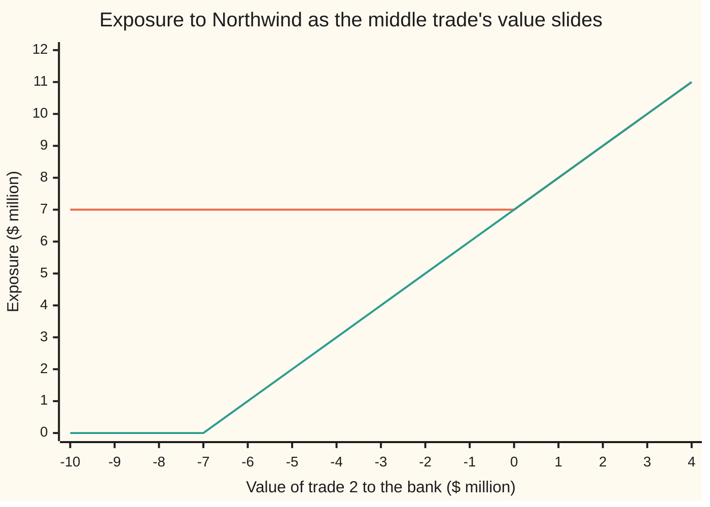

# Counterparty exposure: what you would lose if the other side failed today, why only positive value counts, and how netting shrinks it

[Syllabus](../../../SYLLABUS.md) → [Financial mathematics](../../../SYLLABUS.md#w12) → [Counterparty Risk and CVA](../../../SYLLABUS.md#w12-s46) → Counterparty exposure

---

## General Overview

A bank has three open trades with a company called Northwind. Marked at today's prices, the first is worth **+$5 million** to the bank, the second **−$3 million**, the third **+$2 million**. A plus sign means Northwind would owe the bank that much if the trade were ended today. A minus sign means the bank would owe Northwind.

Now suppose Northwind collapses this morning. What is the bank's money at risk?

The answer depends on paperwork. If each trade stands alone, Northwind's bankruptcy estate collects the $3 million the bank owes, in full, while the bank queues as an ordinary creditor for the $5 million and the $2 million. At risk: **$7 million**. If all three trades sit under one signed **master agreement**, a contract that says every trade between the two firms collapses into a single amount on default, the three numbers are added first: 5 − 3 + 2 = 4. At risk: **$4 million**. The $3 million the bank owes has been used to cancel $3 million it is owed.

That amount at risk is the bank's **counterparty exposure** to Northwind, the word used from here on. The other side of a trade is its **counterparty**. Adding values under one agreement before asking who owes whom is **netting**. A group of trades that nets together is a **netting set**.

Two rules settle every case. A trade or set the bank is owed on counts at its value; one the bank owes on counts as zero, because a failed firm's estate still collects its debts. And the zero floor is applied after adding up each netting set, never before.

**Current exposure is the value the bank would be owed if the counterparty failed today: add the signed values inside each netting set, floor each total at zero, add the totals; netting can never make that number larger.**

**What kind of fact this is:** a definition (exposure), with a theorem proved on this card in Why it works: netting never raises exposure, and inside one set it saves exactly the smaller of the two sides.

### The picture: slide the middle trade

Hold trades 1 and 3 at +$5 million and +$2 million. Let the middle trade's value slide from −$10 million to +$4 million. The chart shows the bank's exposure both ways.



Orange, the top line: gross exposure, every trade floored on its own. Green, the lower line: net exposure, one master agreement. At −3 the gap is the $3 million the netting saves. From zero upward the lines meet: a trade the bank is owed on offsets nothing. At −7 and below the green line sits on zero: the bank owes Northwind more than it is owed, and has nothing at risk.

---

## The formula

Notation first, in words. $V_i$ is the value to the bank of trade number $i$, for $i$ from 1 to $n$. A capital sigma, $\sum$, means "add up" ([Negative numbers](../../01-Foundations/01-Everyday%20Arithmetic/06-negative-numbers.md) covers adding signed amounts). A small plus sign raised after a number means "that number, or zero if it is negative": $x^+ = \max(x, 0)$. Writing $i \in A$ means "trade $i$ belongs to netting set $A$".

$$E \;=\; \sum_{\text{netting sets } A}\;\Big(\sum_{i \in A} V_i\Big)^{+}$$

**Read it aloud:** inside each netting set, add the trades' signed values; keep the total if it is positive and write zero if not; then add those kept totals across the sets.

Two arrangements bracket every other. With no agreement at all, each trade is its own netting set, which gives the **gross exposure** $G$. With one agreement covering everything, there is one set, the **net exposure**:

$$G = \sum_{i=1}^{n} V_i^{+}, \qquad \Big(\sum_{i=1}^{n} V_i\Big)^{+} \;\le\; E \;\le\; G .$$

Inside a single set, the saving has an exact size. Let $P$ be the sum of the positive values and $Q$ the sum of the sizes of the negative ones. Then

$$G - E = \min(P, Q), \qquad L = (1 - R)\,E .$$

The first equation says netting cancels whichever side is smaller. The second turns exposure into money lost: $L$ is the loss if Northwind fails today and the bank recovers a fraction $R$ of its claim.

| Symbol | Plain meaning | In our example | Push it up and the answer… |
| --- | --- | --- | --- |
| $V_i$ | value of trade $i$ to the bank today: what Northwind would owe (plus) or be owed (minus) if the trade ended now | +5, −3, +2 ($ million) | exposure rises, unless that set's total stays at or below zero |
| $i$, $n$ | a trade's number, and how many trades there are | 1 to 3 | — |
| $x^+$ | the floor: $x$ if positive, zero if not | $(-3)^+ = 0$ | — |
| $\sum$ | add up the terms that follow | — | — |
| $A$ | a netting set: trades under one enforceable agreement | all three, or {1, 3} and {2} | fewer, larger sets: exposure falls or stays |
| $E$ | current exposure: what is at risk if the counterparty fails today | 4 net; 7 with trade 2 apart | — |
| $G$ | gross exposure: every trade floored on its own | 7 | — |
| $P$ | total the bank is owed, trade by trade | 7 | saving grows until $P$ passes $Q$ |
| $Q$ | total the bank owes, trade by trade | 3 | saving grows until $Q$ passes $P$ |
| $R$ | recovery rate: fraction of a claim a failed firm's estate pays back | 40% | loss falls |
| $L$ | loss if the counterparty fails today | $2.40 million net | — |
| $a$, $b$ | any two amounts, such as two netting sets' totals | +7 and −3 | — |

Conventions verified 28 Sep 2026: the Basel Committee's counterparty definitions (CRE50) treat each trade not covered by a legally enforceable bilateral netting agreement as its own netting set.

### When it holds

- **The agreement is enforceable where Northwind goes bankrupt.** If a court refuses to net, each trade becomes its own set and exposure jumps from $4 million to $7 million. Banks obtain legal opinions country by country for this reason.
- **The values are replacement values today.** $V_i$ is what another dealer would charge or pay to take the trade over. If the close-out valuation is disputed, every $V_i$ moves and so does $E$.
- **No collateral is held.** Collateral the bank holds from Northwind would be subtracted inside the floor; this card sets it to zero.
- **Default and close-out happen today, at today's values.** In practice close-out takes days, and values move in between. How large exposure may become later is [Expected exposure over time](02-expected-exposure-profiles.md).
- **One currency.** Values in different currencies must be converted at today's rates before they can be added.

---

## Why it works

### Step 0: default turns every trade into a debt one way or the other

A trade in progress is a bundle of future payments. On the day a counterparty fails, those future payments stop. The trade's value today becomes a plain debt: Northwind owes the bank, or the bank owes Northwind. The whole card follows from what bankruptcy does with debts in each direction.

### Step 1: one trade on its own, and why only positive value counts

If the bank is owed $5 million, it files a claim against Northwind's estate and joins the other creditors. It gets back a fraction $R$ of the claim, here 40%, and loses the rest.

If the bank owes $3 million, the estate's administrator collects it in full. A failed firm's debtors do not get a discount because the firm failed. The bank pays $3 million, exactly what it would have paid anyway. Nothing is lost.

So a single trade puts $V^+$ at risk: its value if positive, zero if not. The loss is $(1 - R)V^+$. That asymmetry is the whole reason for the floor.

### Step 2: a master agreement closes every trade into one amount

A master agreement, in derivatives markets usually the ISDA Master Agreement (the standard contract written by the International Swaps and Derivatives Association), treats all trades under it as one contract. On default, the surviving side ends every trade, values each at replacement cost, and adds the values into one close-out amount. If the amount is positive, the survivor holds one claim for it. If it is negative, the survivor pays it. Without such an agreement, an administrator could keep the trades that favour the failed firm and walk away from the rest, a practice called **cherry-picking**. Close-out netting is the contract term that blocks it.

For Northwind the close-out amount is 5 − 3 + 2 = 4. The bank holds one claim of $4 million, recovers $1.60 million, and loses $2.40 million.

### Step 3: separate agreements do not talk to each other

Suppose the −$3 million trade sits under a different agreement, say one signed by another branch of the bank. Now there are two netting sets. Set {1, 3} closes out at 5 + 2 = +7: a claim of $7 million. Set {2} closes out at −3: the bank pays $3 million in full. Exposure is 7 + 0 = $7 million. The bank recovers $2.80 million on its claim, pays $3 million, and ends $0.20 million out of pocket where it would have held $4 million had Northwind survived: a loss of $4.20 million.

Which trade sits apart matters. Putting the +$2 million trade apart instead leaves {1, 2} at 5 − 3 = +2 and {3} at +2: exposure $4 million, the same as full netting. Putting the +$5 million trade apart leaves {2, 3} at −1, floored to zero, and {1} at +5: exposure $5 million.

### Step 4: netting never raises exposure

The key fact is one line about two numbers $a$ and $b$:

$$(a + b)^+ \;\le\; a^+ + b^+ .$$

If $a + b$ is zero or negative, the left side is zero and the right side is never negative. If $a + b$ is positive, then $a + b \le a^+ + b^+$, because each number is at most its floored value. Merging two netting sets into one replaces $a^+ + b^+$ by $(a + b)^+$, so exposure falls or stays. Splitting a set does the reverse. Full netting and no netting are the two extremes, so every arrangement lies between the net and gross numbers: $4 \le E \le 7$ for Northwind.

### Step 5: the saving is the smaller side

Inside one set, the positive trades add to $P$ and the negative ones to $-Q$, so the total is $P - Q$. If $P \ge Q$, exposure is $P - Q$ and the saving over gross is $Q$. If $P < Q$, exposure is zero and the saving is all of $P$. Either way the saving is $\min(P, Q)$. For Northwind, $P = 7$, $Q = 3$, saving $3$.

<details>
<summary>Detailed proof: every partition lies between net and gross, and refining never helps</summary>

Write $x^+ = \max(x, 0)$ and note $x \le x^+$ and $x^+ \ge 0$ for every real $x$.

**Two terms.** If $a + b \le 0$, then $(a+b)^+ = 0 \le a^+ + b^+$. If $a + b > 0$, then $(a+b)^+ = a + b \le a^+ + b^+$. Induction on the number of terms extends this to any finite list: $(\sum_k a_k)^+ \le \sum_k a_k^+$.

**Upper bound.** For each netting set $A$, apply the list version to the trades in $A$: $(\sum_{i \in A} V_i)^+ \le \sum_{i \in A} V_i^+$. The sets do not overlap and cover every trade once, so adding over sets gives $E \le G$.

**Lower bound.** Apply the list version to the set totals instead. Their sum is the sum of all trades, so $(\sum_i V_i)^+ \le \sum_A (\sum_{i \in A} V_i)^+ = E$.

**Refining.** If each set of a finer arrangement lies inside one set of a coarser arrangement, each coarse total is a sum of fine totals, and the list version gives coarse exposure at most fine exposure. Equality holds when the fine totals inside each coarse set all share a sign; strict inequality needs a positive and a negative total meeting.

**Exact saving.** Inside one set, $V_i = V_i^+ - (-V_i)^+$ for each trade, so the total is $P - Q$ with $P, Q \ge 0$. If $P \ge Q$, $E = P - Q$ and $P - E = Q$. If $P < Q$, $E = 0$ and $P - E = P$. Both cases read $P - E = \min(P, Q)$, and here $G = P$.

</details>

A second road reaches the same exposure without any floor: pair each dollar the bank is owed against a dollar it owes, inside the set, and count the dollars left unpaired on the bank's side. The code does this cent by cent.

---

## Worked numbers, by hand

Northwind: trades +5, −3, +2 ($ million), recovery 40%.

| Step | Arithmetic | Value |
| --- | --- | --- |
| gross: floor each trade, then add | 5 + 0 + 2 | $7 million |
| net: add, then floor | (5 − 3 + 2)^+ = 4^+ | $4 million |
| $P$, owed to the bank trade by trade | 5 + 2 | $7 million |
| $Q$, owed by the bank trade by trade | 3 | $3 million |
| saving from netting | min(7, 3) | $3 million |
| net-to-gross ratio | 4 / 7 | 0.57 |
| loss if Northwind fails today, one agreement | (1 − 0.40) × 4 | $2.40 million |
| trade 2 under a separate agreement | (5 + 2)^+ + (−3)^+ = 7 + 0 | $7 million |
| loss, trade 2 apart | 0.60 × 7, and the $3 million still paid | **$4.20 million** |

One master agreement cuts the money at risk from $7 million to $4 million and the loss on a default today from $4.20 million to $2.40 million, without changing a single trade.

The shelf's house trade gives a cross-check. A bank that **bought** the one-year Acme call from Northwind (strike $100, worth $9.23; see [Black–Scholes call](../08-The%20Black-Scholes%20call%20and%20put/01-black-scholes-call.md)) has exposure $9.23: a bought option is always owed to its holder. A bank that **sold** Northwind the matching put, worth $6.33, has exposure zero on it. Hold both under one agreement and exposure is 9.23 − 6.33 = $2.90, which is exactly the value of a forward on Acme by put–call parity ([Put-call parity](../08-The%20Black-Scholes%20call%20and%20put/03-put-call-parity.md)). Held apart, exposure is back to $9.23.

### What breaks if you drop a piece

| Mistake | Comes out at | What went wrong |
| --- | --- | --- |
| Floor each trade when one agreement covers all three | $7 million (right: $4 million) | Ignored the netting the contract grants; capital and credit limits are used up for nothing |
| Net across two separate agreements | $4 million (right: $7 million) | Used the $3 million debt to cancel a claim it has no legal right to cancel; understates risk by $3 million |
| Drop the floor; trade 2 at −$9 million | −$2 million (right: $0) | Negative exposure means nothing: owing Northwind does not create a cushion elsewhere |
| Add the sizes, ignoring signs | $10 million (right: $4 million) | Counted money the bank owes as money at risk |

---

## Code, from first principles, and it actually runs

The code reaches the exposure by three independent roads and tests the theorem on a fourth. Road 1 is the formula: add inside each set, floor, add. Road 2 follows the cash on the day of default: each set closes to one amount, a claim recovers $R$, a debt is paid in full, and the loss is what the trades were worth minus the cash the bank ends up with; it must equal $(1 - R)E$. Road 3 pairs cents owed against cents owing and counts what is left. Road 4 draws 20,000 random books of up to six trades, split at random into up to three agreements, and checks net ≤ exposure ≤ gross, that roads 1, 2 and 3 agree, and that merging two agreements never raises exposure. The Acme cross-check prices the call and put with a hand-built bell-curve area and compares the netted pair with put–call parity, which needs no bell curve. Mutation tests (removing the floor, letting debts recover, leaving debts unpaired, flooring trade by trade) each make an assert fail.

### Python

```python
# Counterparty exposure and netting -- the check behind the card.  Standard library only.
# Every number quoted on the card is printed here.  Nothing imported knows the answer:
# the bell-curve area is Simpson's rule written out, the random numbers are our own.
from math import exp, sqrt, pi

V = [5.0, -3.0, 2.0]        # the three Northwind trades, value to the bank, $ millions
R = 0.40                    # recovery: share of a claim on Northwind the bank gets back

def pos(x): return x if x > 0 else 0.0                       # the floor: x+ = max(x, 0)

def exposure(v, sets):      # road 1: add inside each netting set, floor, add the sets
    return sum(pos(sum(v[i] for i in s)) for s in sets)

def ledger(v, sets, rec):   # road 2: follow the cash on the day Northwind fails
    cash = 0.0
    for s in sets:
        amount = sum(v[i] for i in s)                         # close-out: one amount per set
        cash += rec * amount if amount > 0 else amount        # claim recovers R; debt paid in full
    return sum(v) - cash, cash                                # loss = worth if it survived - cash

def pairing(v, sets):       # road 3: cancel a cent owed to the bank against a cent it owes
    left = 0
    for s in sets:
        owed = sum(round(100 * v[i]) for i in s if v[i] > 0)
        owes = sum(round(-100 * v[i]) for i in s if v[i] < 0)
        while owed > 0 and owes > 0:
            owed -= 1; owes -= 1
        left += owed
    return left / 100.0

ONE, SEP = [[0, 1, 2]], [[0, 2], [1]]                      # one master agreement; -3 trade apart
EACH = [[0], [1], [2]]
gross, net, sep = exposure(V, EACH), exposure(V, ONE), exposure(V, SEP)
P = sum(pos(x) for x in V); Q = sum(pos(-x) for x in V)
loss_net, cash_net = ledger(V, ONE, R)
loss_sep, cash_sep = ledger(V, SEP, R)
loss_each, cash_each = ledger(V, EACH, R)

# ---- the house example: Acme options bought from and sold to Northwind ----
S, K, r, q, sig, T = 100.0, 100.0, 0.05, 0.02, 0.20, 1.0
def Ncdf(x, n=2000):        # bell-curve area left of x: 1/2 plus Simpson's rule from 0 to x
    h = x / n
    f = lambda z: exp(-0.5 * z * z) / sqrt(2.0 * pi)
    s = f(0.0) + f(x) + sum((4 if k % 2 else 2) * f(k * h) for k in range(1, n))
    return 0.5 + s * h / 3.0
def ln(x, n=4000):          # natural log as the area under 1/t from 1 to x (Simpson again)
    h = (x - 1.0) / n
    s = 1.0 + 1.0 / x + sum((4 if k % 2 else 2) / (1.0 + k * h) for k in range(1, n))
    return s * h / 3.0
d1 = (ln(S / K) + (r - q + 0.5 * sig * sig) * T) / (sig * sqrt(T)); d2 = d1 - sig * sqrt(T)
call = S * exp(-q * T) * Ncdf(d1) - K * exp(-r * T) * Ncdf(d2)
put = K * exp(-r * T) * Ncdf(-d2) - S * exp(-q * T) * Ncdf(-d1)
fwd = S * exp(-q * T) - K * exp(-r * T)                       # parity: no bell curve needed
acme_net = exposure([call, -put], [[0, 1]]); acme_sep = exposure([call, -put], [[0], [1]])

# ---- road 4: 20,000 random books, our own random numbers (a linear congruential generator) ----
seed = 20260928
def rnd(m):
    global seed
    seed = (1103515245 * seed + 12345) % 2147483648
    return seed % m
books = merges = 0
for _ in range(20000):
    n = 1 + rnd(6)
    v = [float(rnd(19) - 9) for _ in range(n)]
    lab = [rnd(3) for _ in range(n)]
    sets = [[i for i in range(n) if lab[i] == g] for g in range(3)]
    sets = [s for s in sets if s]
    x = exposure(v, sets)
    assert exposure(v, [list(range(n))]) <= x <= exposure(v, [[i] for i in range(n)])
    assert abs(pairing(v, sets) - x) < 1e-9 and abs(ledger(v, sets, R)[0] - (1 - R) * x) < 1e-9
    if len(sets) > 1:                                      # merge the first two agreements
        assert exposure(v, [sets[0] + sets[1]] + sets[2:]) <= x
        merges += 1
    books += 1

rows = [
    ("trade 1", V[0]), ("trade 2", V[1]), ("trade 3", V[2]),
    ("gross: floor each trade, add", gross), ("net: add, then floor", net),
    ("net by cent pairing", pairing(V, ONE)), ("P  owed to the bank, trade by trade", P),
    ("Q  owed by the bank, trade by trade", Q), ("gross - net", gross - net),
    ("min(P, Q)", min(P, Q)), ("net-to-gross ratio", net / gross),
    ("separate: -3 trade apart", sep), ("  still owed by the bank", -sum(V[i] for i in SEP[1])),
    ("partition {1,2}{3}", exposure(V, [[0, 1], [2]])), ("  set {1,2} total", V[0] + V[1]),
    ("partition {2,3}{1}", exposure(V, [[1, 2], [0]])), ("  set {2,3} total", V[1] + V[2]),
    ("R  recovery", R), ("LGD = 1 - R", 1 - R),
    ("loss, one agreement, ledger", loss_net), ("  (1-R) x net", (1 - R) * net),
    ("  cash the bank ends with", cash_net),
    ("loss, -3 apart, ledger", loss_sep), ("  (1-R) x separate", (1 - R) * sep),
    ("  claim recovered, -3 apart", R * sep), ("  cash the bank ends with", cash_sep),
    ("loss, no agreement, ledger", loss_each), ("  cash the bank ends with", cash_each),
    ("Acme call bought", call), ("Acme put", put), ("exposure, call bought only", exposure([call], [[0]])),
    ("exposure, put sold only", exposure([-put], [[0]])),
    ("exposure, call bought + put sold, one set", acme_net), ("  S e^-qT - K e^-rT", fwd),
    ("exposure, the two apart", acme_sep),
    ("wrong: floor each, one agreement", gross), ("wrong: net across two agreements", net),
    ("wrong: no floor, trade 2 = -9", sum([5.0, -9.0, 2.0])), ("wrong: sizes |V| added", sum(abs(x) for x in V)),
    ("try: trade 2 = -9, net", exposure([5.0, -9.0, 2.0], ONE)),
    ("try: trade 2 = -9, bank owes", -sum([5.0, -9.0, 2.0])),
    ("try: R = 0, loss one agreement", ledger(V, ONE, 0.0)[0]),
    ("try: +2 trade apart", exposure(V, [[0, 1], [2]])),
    ("try: trade 2 = +3, net", exposure([5.0, 3.0, 2.0], ONE)),
]
for name, x in rows:
    print(f"{name:<42} {x:>11.6f}")
print(f"random books checked {books}, merges checked {merges}")
xs = list(range(-10, 5))
print("chart, trade 2 value " + " ".join(f"{x:5d}" for x in xs))
print("chart, net           " + " ".join(f"{exposure([5.0, x, 2.0], ONE):5.2f}" for x in xs))
print("chart, gross         " + " ".join(f"{exposure([5.0, x, 2.0], EACH):5.2f}" for x in xs))

assert abs(net - pairing(V, ONE)) < 1e-12,            "floor formula vs cent pairing"
assert abs(gross - net - min(P, Q)) < 1e-12,          "netting saves exactly min(P, Q)"
assert abs(loss_net - (1 - R) * net) < 1e-12,         "cash ledger vs (1-R) x exposure"
assert abs(acme_net - fwd) < 1e-9,                    "netted Acme pair vs put-call parity"
assert abs(call - 9.227005508154) < 1e-9,             "house call value"
print("ALL CHECKS PASS")
```

**Ran 2026-09-28 on macOS, Python 3.14.6, standard library only. All checks passed. Output, pasted from the run:**

```
trade 1                                       5.000000
trade 2                                      -3.000000
trade 3                                       2.000000
gross: floor each trade, add                  7.000000
net: add, then floor                          4.000000
net by cent pairing                           4.000000
P  owed to the bank, trade by trade           7.000000
Q  owed by the bank, trade by trade           3.000000
gross - net                                   3.000000
min(P, Q)                                     3.000000
net-to-gross ratio                            0.571429
separate: -3 trade apart                      7.000000
  still owed by the bank                      3.000000
partition {1,2}{3}                            4.000000
  set {1,2} total                             2.000000
partition {2,3}{1}                            5.000000
  set {2,3} total                            -1.000000
R  recovery                                   0.400000
LGD = 1 - R                                   0.600000
loss, one agreement, ledger                   2.400000
  (1-R) x net                                 2.400000
  cash the bank ends with                     1.600000
loss, -3 apart, ledger                        4.200000
  (1-R) x separate                            4.200000
  claim recovered, -3 apart                   2.800000
  cash the bank ends with                    -0.200000
loss, no agreement, ledger                    4.200000
  cash the bank ends with                    -0.200000
Acme call bought                              9.227006
Acme put                                      6.330081
exposure, call bought only                    9.227006
exposure, put sold only                       0.000000
exposure, call bought + put sold, one set     2.896925
  S e^-qT - K e^-rT                           2.896925
exposure, the two apart                       9.227006
wrong: floor each, one agreement              7.000000
wrong: net across two agreements              4.000000
wrong: no floor, trade 2 = -9                -2.000000
wrong: sizes |V| added                       10.000000
try: trade 2 = -9, net                        0.000000
try: trade 2 = -9, bank owes                  2.000000
try: R = 0, loss one agreement                4.000000
try: +2 trade apart                           4.000000
try: trade 2 = +3, net                       10.000000
random books checked 20000, merges checked 14899
chart, trade 2 value   -10    -9    -8    -7    -6    -5    -4    -3    -2    -1     0     1     2     3     4
chart, net            0.00  0.00  0.00  0.00  1.00  2.00  3.00  4.00  5.00  6.00  7.00  8.00  9.00 10.00 11.00
chart, gross          7.00  7.00  7.00  7.00  7.00  7.00  7.00  7.00  7.00  7.00  7.00  8.00  9.00 10.00 11.00
ALL CHECKS PASS
```

### Rust

```rust
// Counterparty exposure and netting -- the check behind the card.  Rust std only, no crates.
// Every number quoted on the card is printed here.  Nothing used knows the answer:
// the bell-curve area is Simpson's rule written out, the random numbers are our own.
use std::f64::consts::PI;

fn pos(x: f64) -> f64 { if x > 0.0 { x } else { 0.0 } }     // the floor: x+ = max(x, 0)

fn set_sum(v: &[f64], s: &[usize]) -> f64 { s.iter().map(|&i| v[i]).sum() }

// road 1: add inside each netting set, floor, add the sets
fn exposure(v: &[f64], sets: &[Vec<usize>]) -> f64 { sets.iter().map(|s| pos(set_sum(v, s))).sum() }

// road 2: follow the cash on the day Northwind fails
fn ledger(v: &[f64], sets: &[Vec<usize>], rec: f64) -> (f64, f64) {
    let mut cash = 0.0;
    for s in sets {
        let amount = set_sum(v, s);                               // close-out: one amount per set
        cash += if amount > 0.0 { rec * amount } else { amount }; // claim recovers R; debt paid in full
    }
    (v.iter().sum::<f64>() - cash, cash)                          // loss = worth if it survived - cash
}

// road 3: cancel a cent owed to the bank against a cent it owes
fn pairing(v: &[f64], sets: &[Vec<usize>]) -> f64 {
    let mut left: i64 = 0;
    for s in sets {
        let mut owed: i64 = s.iter().filter(|&&i| v[i] > 0.0).map(|&i| (100.0 * v[i]).round() as i64).sum();
        let mut owes: i64 = s.iter().filter(|&&i| v[i] < 0.0).map(|&i| (-100.0 * v[i]).round() as i64).sum();
        while owed > 0 && owes > 0 { owed -= 1; owes -= 1; }
        left += owed;
    }
    left as f64 / 100.0
}

fn ncdf(x: f64) -> f64 {    // bell-curve area left of x: 1/2 plus Simpson's rule from 0 to x
    let n = 2000;
    let h = x / n as f64;
    let f = |z: f64| (-0.5 * z * z).exp() / (2.0 * PI).sqrt();
    let mut s = f(0.0) + f(x);
    for k in 1..n { s += if k % 2 == 1 { 4.0 } else { 2.0 } * f(k as f64 * h); }
    0.5 + s * h / 3.0
}

fn ln(x: f64) -> f64 {      // natural log as the area under 1/t from 1 to x (Simpson again)
    let n = 4000;
    let h = (x - 1.0) / n as f64;
    let mut s = 1.0 + 1.0 / x;
    for k in 1..n { s += if k % 2 == 1 { 4.0 } else { 2.0 } / (1.0 + k as f64 * h); }
    s * h / 3.0
}

struct Lcg(u64);
impl Lcg { fn next(&mut self, m: u64) -> u64 { self.0 = (1103515245 * self.0 + 12345) % 2147483648; self.0 % m } }

fn main() {
    let v = [5.0, -3.0, 2.0];   // the three Northwind trades, value to the bank, $ millions
    let r_rec = 0.40;           // recovery: share of a claim on Northwind the bank gets back
    let one = vec![vec![0, 1, 2]];
    let sep = vec![vec![0, 2], vec![1]];                          // one master agreement; -3 trade apart
    let each = vec![vec![0], vec![1], vec![2]];
    let (gross, net, sepx) = (exposure(&v, &each), exposure(&v, &one), exposure(&v, &sep));
    let p: f64 = v.iter().map(|&x| pos(x)).sum();
    let q: f64 = v.iter().map(|&x| pos(-x)).sum();
    let (loss_net, cash_net) = ledger(&v, &one, r_rec);
    let (loss_sep, cash_sep) = ledger(&v, &sep, r_rec);
    let (loss_each, cash_each) = ledger(&v, &each, r_rec);

    // ---- the house example: Acme options bought from and sold to Northwind ----
    let (s0, k, r, qd, sig, t) = (100.0_f64, 100.0_f64, 0.05_f64, 0.02_f64, 0.20_f64, 1.0_f64);
    let d1 = (ln(s0 / k) + (r - qd + 0.5 * sig * sig) * t) / (sig * t.sqrt());
    let d2 = d1 - sig * t.sqrt();
    let call = s0 * (-qd * t).exp() * ncdf(d1) - k * (-r * t).exp() * ncdf(d2);
    let put = k * (-r * t).exp() * ncdf(-d2) - s0 * (-qd * t).exp() * ncdf(-d1);
    let fwd = s0 * (-qd * t).exp() - k * (-r * t).exp();         // parity: no bell curve needed
    let acme_net = exposure(&[call, -put], &[vec![0, 1]]);
    let acme_sep = exposure(&[call, -put], &[vec![0], vec![1]]);

    // ---- road 4: 20,000 random books, our own random numbers (a linear congruential generator) ----
    let mut g = Lcg(20260928);
    let (mut books, mut merges) = (0, 0);
    for _ in 0..20000 {
        let n = 1 + g.next(6) as usize;
        let vv: Vec<f64> = (0..n).map(|_| g.next(19) as f64 - 9.0).collect();
        let lab: Vec<u64> = (0..n).map(|_| g.next(3)).collect();
        let sets: Vec<Vec<usize>> = (0..3).map(|gr| (0..n).filter(|&i| lab[i] == gr).collect::<Vec<usize>>())
            .filter(|s: &Vec<usize>| !s.is_empty()).collect();
        let x = exposure(&vv, &sets);
        let all: Vec<Vec<usize>> = vec![(0..n).collect()];
        let singles: Vec<Vec<usize>> = (0..n).map(|i| vec![i]).collect();
        assert!(exposure(&vv, &all) <= x && x <= exposure(&vv, &singles));
        assert!((pairing(&vv, &sets) - x).abs() < 1e-9 && (ledger(&vv, &sets, r_rec).0 - (1.0 - r_rec) * x).abs() < 1e-9);
        if sets.len() > 1 {                                       // merge the first two agreements
            let mut merged = vec![sets[0].iter().chain(sets[1].iter()).cloned().collect::<Vec<usize>>()];
            merged.extend(sets[2..].iter().cloned());
            assert!(exposure(&vv, &merged) <= x);
            merges += 1;
        }
        books += 1;
    }

    let rows: Vec<(&str, f64)> = vec![
        ("trade 1", v[0]), ("trade 2", v[1]), ("trade 3", v[2]),
        ("gross: floor each trade, add", gross), ("net: add, then floor", net),
        ("net by cent pairing", pairing(&v, &one)), ("P  owed to the bank, trade by trade", p),
        ("Q  owed by the bank, trade by trade", q), ("gross - net", gross - net),
        ("min(P, Q)", p.min(q)), ("net-to-gross ratio", net / gross),
        ("separate: -3 trade apart", sepx), ("  still owed by the bank", -set_sum(&v, &sep[1])),
        ("partition {1,2}{3}", exposure(&v, &[vec![0, 1], vec![2]])), ("  set {1,2} total", v[0] + v[1]),
        ("partition {2,3}{1}", exposure(&v, &[vec![1, 2], vec![0]])), ("  set {2,3} total", v[1] + v[2]),
        ("R  recovery", r_rec), ("LGD = 1 - R", 1.0 - r_rec),
        ("loss, one agreement, ledger", loss_net), ("  (1-R) x net", (1.0 - r_rec) * net),
        ("  cash the bank ends with", cash_net),
        ("loss, -3 apart, ledger", loss_sep), ("  (1-R) x separate", (1.0 - r_rec) * sepx),
        ("  claim recovered, -3 apart", r_rec * sepx), ("  cash the bank ends with", cash_sep),
        ("loss, no agreement, ledger", loss_each), ("  cash the bank ends with", cash_each),
        ("Acme call bought", call), ("Acme put", put), ("exposure, call bought only", exposure(&[call], &[vec![0]])),
        ("exposure, put sold only", exposure(&[-put], &[vec![0]])),
        ("exposure, call bought + put sold, one set", acme_net), ("  S e^-qT - K e^-rT", fwd),
        ("exposure, the two apart", acme_sep),
        ("wrong: floor each, one agreement", gross), ("wrong: net across two agreements", net),
        ("wrong: no floor, trade 2 = -9", 5.0 - 9.0 + 2.0), ("wrong: sizes |V| added", v.iter().map(|x| x.abs()).sum()),
        ("try: trade 2 = -9, net", exposure(&[5.0, -9.0, 2.0], &one)),
        ("try: trade 2 = -9, bank owes", -(5.0 - 9.0 + 2.0)),
        ("try: R = 0, loss one agreement", ledger(&v, &one, 0.0).0),
        ("try: +2 trade apart", exposure(&v, &[vec![0, 1], vec![2]])),
        ("try: trade 2 = +3, net", exposure(&[5.0, 3.0, 2.0], &one)),
    ];
    for (name, x) in &rows { println!("{:<42} {:>11.6}", name, x); }
    println!("random books checked {}, merges checked {}", books, merges);
    let xs: Vec<i32> = (-10..5).collect();
    println!("chart, trade 2 value {}", xs.iter().map(|x| format!("{:5}", x)).collect::<Vec<_>>().join(" "));
    println!("chart, net           {}", xs.iter().map(|&x| format!("{:5.2}", exposure(&[5.0, x as f64, 2.0], &one))).collect::<Vec<_>>().join(" "));
    println!("chart, gross         {}", xs.iter().map(|&x| format!("{:5.2}", exposure(&[5.0, x as f64, 2.0], &each))).collect::<Vec<_>>().join(" "));

    assert!((net - pairing(&v, &one)).abs() < 1e-12, "floor formula vs cent pairing");
    assert!((gross - net - p.min(q)).abs() < 1e-12, "netting saves exactly min(P, Q)");
    assert!((loss_net - (1.0 - r_rec) * net).abs() < 1e-12, "cash ledger vs (1-R) x exposure");
    assert!((acme_net - fwd).abs() < 1e-9, "netted Acme pair vs put-call parity");
    assert!((call - 9.227005508154).abs() < 1e-9, "house call value");
    println!("ALL CHECKS PASS");
}
```

**Ran 2026-09-28 on macOS, rustc 1.98.1, no crates. All checks passed. Output, pasted from the run:**

```
trade 1                                       5.000000
trade 2                                      -3.000000
trade 3                                       2.000000
gross: floor each trade, add                  7.000000
net: add, then floor                          4.000000
net by cent pairing                           4.000000
P  owed to the bank, trade by trade           7.000000
Q  owed by the bank, trade by trade           3.000000
gross - net                                   3.000000
min(P, Q)                                     3.000000
net-to-gross ratio                            0.571429
separate: -3 trade apart                      7.000000
  still owed by the bank                      3.000000
partition {1,2}{3}                            4.000000
  set {1,2} total                             2.000000
partition {2,3}{1}                            5.000000
  set {2,3} total                            -1.000000
R  recovery                                   0.400000
LGD = 1 - R                                   0.600000
loss, one agreement, ledger                   2.400000
  (1-R) x net                                 2.400000
  cash the bank ends with                     1.600000
loss, -3 apart, ledger                        4.200000
  (1-R) x separate                            4.200000
  claim recovered, -3 apart                   2.800000
  cash the bank ends with                    -0.200000
loss, no agreement, ledger                    4.200000
  cash the bank ends with                    -0.200000
Acme call bought                              9.227006
Acme put                                      6.330081
exposure, call bought only                    9.227006
exposure, put sold only                       0.000000
exposure, call bought + put sold, one set     2.896925
  S e^-qT - K e^-rT                           2.896925
exposure, the two apart                       9.227006
wrong: floor each, one agreement              7.000000
wrong: net across two agreements              4.000000
wrong: no floor, trade 2 = -9                -2.000000
wrong: sizes |V| added                       10.000000
try: trade 2 = -9, net                        0.000000
try: trade 2 = -9, bank owes                  2.000000
try: R = 0, loss one agreement                4.000000
try: +2 trade apart                           4.000000
try: trade 2 = +3, net                       10.000000
random books checked 20000, merges checked 14899
chart, trade 2 value   -10    -9    -8    -7    -6    -5    -4    -3    -2    -1     0     1     2     3     4
chart, net            0.00  0.00  0.00  0.00  1.00  2.00  3.00  4.00  5.00  6.00  7.00  8.00  9.00 10.00 11.00
chart, gross          7.00  7.00  7.00  7.00  7.00  7.00  7.00  7.00  7.00  7.00  7.00  8.00  9.00 10.00 11.00
ALL CHECKS PASS
```

The two outputs agree line for line.

> [!TIP]
> **Try changing**
> Guess first. Then run it.
> - **Make the middle trade −9.** Net exposure falls to **$0**: the set totals −2, and the bank owes Northwind $2 million on close-out. Gross exposure stays $7 million.
> - **Set recovery to zero.** The loss on a default today equals the exposure: **$4 million**. Exposure itself does not depend on recovery at all.
> - **Put the +2 trade apart instead of the −3.** Exposure is **$4 million**, the same as full netting: both sets are still positive, so splitting cost nothing.
> - **Flip the middle trade to +3.** Net exposure is **$10 million**, equal to gross. With nothing owed to Northwind, netting has nothing to cancel.

---

## The usual mistake

> [!warning]
> **Flooring before adding.** The floor belongs to the netting set, not to the trade. Floor each trade first and the Northwind book shows $7 million at risk when the contract says $4 million. The reverse error is worse: adding across two agreements shows $4 million when a court will see $7 million, and the $3 million owed on the separate agreement is still paid in full.
>
> - **Reading notional as exposure.** A swap covering a large loan can be worth very little today. Exposure is today's replacement value, not the size of the contract.
> - **Treating the floor as forgiveness.** A set with negative total has zero exposure, but the bank still pays what it owes. With the −$3 million trade apart, the bank pays $3 million and recovers $2.80 million: it ends $0.20 million down on cash.
> - **Assuming one firm means one netting set.** Netting follows signed agreements, not company names. Two agreements with the same counterparty are two sets.
> - **Using today's exposure as the whole story.** Zero exposure today can become large tomorrow when prices move. A bank that agrees to buy Acme forward at today's forward price holds a trade worth zero now; a rise in Acme makes Northwind owe on it. Future exposure is its own measurement.

---

## Where you meet it in real life

- **Credit limits.** A bank caps how much it may have at risk to each counterparty, and measures that amount net, per agreement. A trade that offsets existing ones can be approved when a new standalone trade would be refused.
- **Capital rules.** The Basel standardised approach for counterparty risk (SA-CCR, CRE52) starts from a replacement cost per netting set: the set's net value, less collateral held, floored at zero. That is this card's formula with collateral added.
- **Bankruptcies.** When Lehman Brothers failed in September 2008, its derivative counterparties ended their trades under master agreements and filed claims for net close-out amounts, not trade by trade.
- **Central clearing.** A clearing house stands between the two sides of many trades and nets across all of them. Duffie and Zhu show that moving one asset class to a clearing house can raise total exposure, because it breaks the bilateral netting that asset class had with everything else.
- **The rest of this shelf.** Exposure is one of the three numbers in credit loss ([Default probability, recovery and expected loss](../41-Default%2C%20Survival%20and%20the%20Hazard%20Rate/01-default-probability-recovery-and-expected-loss.md)). Priced over time against Northwind's default risk it becomes [CVA](03-cva.md). Seen from Northwind's side, the bank's negative values floored at zero, it is the bank's own default risk in [DVA](04-dva-and-bilateral-cva.md): $0 net, $3 million with trade 2 apart. When exposure tends to rise as the counterparty weakens, it is [Wrong-way risk](05-wrong-way-risk.md); how the resulting numbers are hedged is [CVA risk numbers](06-cva-risk-numbers-and-hedging.md).

> **Say it back**
> Counterparty exposure is what a bank would be owed if the other side failed today. A trade the bank owes on counts as zero, because a failed firm's estate still collects its debts in full. Under a master agreement all trades close into one amount, so values are added first and the zero floor applied to the total. Netting never raises exposure, and inside one set it saves exactly the smaller of what is owed each way. Northwind's three trades carry $7 million of exposure one by one and $4 million netted.

---

## What this builds on

- [Default probability, recovery and expected loss](../41-Default%2C%20Survival%20and%20the%20Hazard%20Rate/01-default-probability-recovery-and-expected-loss.md): exposure at default, recovery and loss given default. This card says what the exposure is when the loan is a book of trades.
- [Negative numbers](../../01-Foundations/01-Everyday%20Arithmetic/06-negative-numbers.md): signed amounts, and adding a debt to a credit.

## Where this goes next

- [Expected exposure over time](02-expected-exposure-profiles.md): the same floor applied to the trades' values on future dates, averaged over how markets might move.

Today's exposure is one number, but Northwind can fail next year, when the trades are worth something else; how large the exposure is expected to be at each future date is the question [Expected exposure over time](02-expected-exposure-profiles.md) answers.

---

## Sources

Verified 28 Sep 2026: every link below resolves to the publisher's page.

- Basel Committee on Banking Supervision. "CRE50: Counterparty credit risk definitions and terminology." Bank for International Settlements. [Basel Framework page](https://www.bis.org/committees/bcbs/basel-framework/standard/cre/50/inforce/2019-12-15/published/2024-07-05). Defines counterparty credit risk as loss when the portfolio has positive value at default, and the netting set.
- Basel Committee on Banking Supervision. "CRE52: Standardised approach to counterparty credit risk." Bank for International Settlements. [Basel Framework page](https://www.bis.org/committees/bcbs/basel-framework/standard/cre/52/inforce/2019-12-15/published/2020-06-05). Replacement cost per netting set, the regulatory form of this card's formula.
- Gregory, Jon. *The xVA Challenge: Counterparty Risk, Funding, Collateral, Capital and Initial Margin*, 4th ed. Wiley, 2020. [doi:10.1002/9781119508991](https://doi.org/10.1002/9781119508991). Exposure, close-out netting and the ISDA Master Agreement from the desk's side.
- Brigo, Damiano, Massimo Morini, and Andrea Pallavicini. *Counterparty Credit Risk, Collateral and Funding: With Pricing Cases for All Asset Classes*. Wiley, 2013. [Publisher page](https://www.wiley.com/en-us/Counterparty+Credit+Risk%2C+Collateral+and+Funding%3A+With+Pricing+Cases+For+All+Asset+Classes-p-9780470748466). Positive-part exposure as the starting point of CVA pricing.
- Duffie, Darrell, and Haoxiang Zhu. "Does a Central Clearing Counterparty Reduce Counterparty Risk?" *Review of Asset Pricing Studies* 1, no. 1 (2011): 74–95. [doi:10.1093/rapstu/rar001](https://doi.org/10.1093/rapstu/rar001). Netting efficiency: how splitting trades across netting sets raises exposure.
